# Node.js 分类题集

> 共 40 题，摘自前端面试题宝典 https://fe.ecool.fun/topic-list

### 63. 说说Node中的EventEmitter? 如何实现一个EventEmitter?

**难度**：★★★☆☆ | **题型**：QA | **分类**：全部 / Node.js

**题目**：


**参考答案**：
## 一、是什么

我们了解到，`Node `采用了事件驱动机制，而`EventEmitter `就是`Node`实现事件驱动的基础

在`EventEmitter`的基础上，`Node `几乎所有的模块都继承了这个类，这些模块拥有了自己的事件，可以绑定／触发监听器，实现了异步操作

`Node.js` 里面的许多对象都会分发事件，比如 fs.readStream 对象会在文件被打开的时候触发一个事件

这些产生事件的对象都是 events.EventEmitter 的实例，这些对象有一个 eventEmitter.on() 函数，用于将一个或多个函数绑定到命名事件上


## 二、使用方法

`Node `的`events`模块只提供了一个`EventEmitter`类，这个类实现了`Node`异步事件驱动架构的基本模式——观察者模式

在这种模式中，被观察者(主体)维护着一组其他对象派来(注册)的观察者，有新的对象对主体感兴趣就注册观察者，不感兴趣就取消订阅，主体有更新的话就依次通知观察者们

基本代码如下所示：

```js
const EventEmitter = require('events')

class MyEmitter extends EventEmitter {}
const myEmitter = new MyEmitter()

function callback() {
    console.log('触发了event事件！')
}
myEmitter.on('event', callback)
myEmitter.emit('event')
myEmitter.removeListener('event', callback);
```

通过实例对象的`on`方法注册一个名为`event`的事件，通过`emit`方法触发该事件，而`removeListener`用于取消事件的监听

关于其常见的方法如下：

- emitter.addListener/on(eventName, listener) ：添加类型为 eventName 的监听事件到事件数组尾部
- emitter.prependListener(eventName, listener)：添加类型为 eventName 的监听事件到事件数组头部  
- emitter.emit(eventName[, ...args])：触发类型为 eventName 的监听事件 
- emitter.removeListener/off(eventName, listener)：移除类型为 eventName 的监听事件   
- emitter.once(eventName, listener)：添加类型为 eventName 的监听事件，以后只能执行一次并删除           
- emitter.removeAllListeners([eventName])： 移除全部类型为 eventName 的监听事件


## 三、实现过程

通过上面的方法了解，`EventEmitter`是一个构造函数，内部存在一个包含所有事件的对象

```js
class EventEmitter {
    constructor() {
        this.events = {};
    }
}
```

其中`events`存放的监听事件的函数的结构如下：

```js
{
  "event1": [f1,f2,f3]，
  "event2": [f4,f5]，
  ...
}
```

然后开始一步步实现实例方法，首先是`emit`，第一个参数为事件的类型，第二个参数开始为触发事件函数的参数，实现如下：

```js
emit(type, ...args) {
    this.events[type].forEach((item) => {
        Reflect.apply(item, this, args);
    });
}
```

当实现了`emit`方法之后，然后实现`on`、`addListener`、`prependListener`这三个实例方法，都是添加事件监听触发函数，实现也是大同小异

```js
on(type, handler) {
    if (!this.events[type]) {
        this.events[type] = [];
    }
    this.events[type].push(handler);
}

addListener(type,handler){
    this.on(type,handler)
}

prependListener(type, handler) {
    if (!this.events[type]) {
        this.events[type] = [];
    }
    this.events[type].unshift(handler);
}
```

紧接着就是实现事件监听的方法`removeListener/on`

```js
removeListener(type, handler) {
    if (!this.events[type]) {
        return;
    }
    this.events[type] = this.events[type].filter(item => item !== handler);
}

off(type,handler){
    this.removeListener(type,handler)
}
```

最后再来实现`once`方法， 再传入事件监听处理函数的时候进行封装，利用闭包的特性维护当前状态，通过`fired`属性值判断事件函数是否执行过

```js
once(type, handler) {
    this.on(type, this._onceWrap(type, handler, this));
  }

  _onceWrap(type, handler, target) {
    const state = { fired: false, handler, type , target};
    const wrapFn = this._onceWrapper.bind(state);
    state.wrapFn = wrapFn;
    return wrapFn;
  }

  _onceWrapper(...args) {
    if (!this.fired) {
      this.fired = true;
      Reflect.apply(this.handler, this.target, args);
      this.target.off(this.type, this.wrapFn);
    }
 }
```

完整代码如下：

```js
class EventEmitter {
    constructor() {
        this.events = {};
    }

    on(type, handler) {
        if (!this.events[type]) {
            this.events[type] = [];
        }
        this.events[type].push(handler);
    }

    addListener(type,handler){
        this.on(type,handler)
    }

    prependListener(type, handler) {
        if (!this.events[type]) {
            this.events[type] = [];
        }
        this.events[type].unshift(handler);
    }

    removeListener(type, handler) {
        if (!this.events[type]) {
            return;
        }
        this.events[type] = this.events[type].filter(item => item !== handler);
    }

    off(type,handler){
        this.removeListener(type,handler)
    }

    emit(type, ...args) {
        this.events[type].forEach((item) => {
            Reflect.apply(item, this, args);
        });
    }

    once(type, handler) {
        this.on(type, this._onceWrap(type, handler, this));
    }

    _onceWrap(type, handler, target) {
        const state = { fired: false, handler, type , target};
        const wrapFn = this._onceWrapper.bind(state);
        state.wrapFn = wrapFn;
        return wrapFn;
    }

    _onceWrapper(...args) {
        if (!this.fired) {
            this.fired = true;
            Reflect.apply(this.handler, this.target, args);
            this.target.off(this.type, this.wrapFn);
        }
    }
}
```


**要点**：
**作答思路**：

Node.js中的`EventEmitter`是一个核心模块，用于实现事件驱动编程。它允许对象拥有多个事件监听器，当事件发生时，会通知所有注册的监听器。
实现一个简单的`EventEmitter`的基本步骤如下：

1. **定义构造函数**：创建一个构造函数，用于创建`EventEmitter`实例。
2. **创建事件监听器数组**：在构造函数内部，创建一个数组来存储事件监听器。
3. **添加事件监听器**：提供一个方法来添加事件监听器，该方法接收事件名称和回调函数。
4. **移除事件监听器**：提供一个方法来移除事件监听器，该方法接收事件名称和回调函数。
5. **触发事件**：提供一个方法来触发事件，该方法接收事件名称和可选的参数。
示例代码：

```javascript
class SimpleEventEmitter {
  constructor() {
    this.events = {};
  }
  on(eventName, callback) {
    if (!this.events[eventName]) {
      this.events[eventName] = [];
    }
    this.events[eventName].push(callback);
  }
  off(eventName, callback) {
    if (this.events[eventName]) {
      const index = this.events[eventName].indexOf(callback);
      if (index > -1) {
        this.events[eventName].splice(index, 1);
      }
    }
  }
  emit(eventName, ...args) {
    if (this.events[eventName]) {
      this.events[eventName].forEach(callback => callback(...args));
    }
  }
}
```

使用示例：

```javascript
const eventEmitter = new SimpleEventEmitter();
eventEmitter.on('event', (arg1, arg2) => {
  console.log(`Event triggered with arguments: ${arg1}, ${arg2}`);
});
eventEmitter.emit('event', 'Hello', 'World');
eventEmitter.off('event');
eventEmitter.emit('event', 'Hello', 'World'); // 不会触发事件
```

**考察要点**：

1. **EventEmitter概念**：理解`EventEmitter`的作用和用途。
2. **事件监听器管理**：理解如何添加、移除事件监听器。
3. **事件触发**：理解如何触发事件，以及事件触发时的参数传递。


---
### 79. 说说 express middleware(中间件) 的工作原理

**难度**：★☆☆☆☆ | **题型**：QA | **分类**：全部 / Node.js

**题目**：


**参考答案**：
### **1. 中间件的定义**
中间件是一个函数，它接收请求对象 (`req`)、响应对象 (`res`) 和一个 `next` 函数。中间件函数可以对请求进行处理、修改响应、终止请求-响应周期，或者将请求传递给下一个中间件。

### **2. 中间件的使用**
中间件在 Express 应用程序中通过 `app.use()` 或者其他 HTTP 方法 (`app.get()`, `app.post()`, 等) 被注册。它们会按顺序执行。

### **3. 中间件工作流程**

1. **请求到达**：
   - 当一个 HTTP 请求到达 Express 应用时，请求会从顶部开始传递给中间件链中的第一个中间件函数。

2. **中间件执行**：
   - 每个中间件函数可以对请求进行处理，比如修改请求对象 (`req`)、响应对象 (`res`)，或者执行某些操作（如日志记录、身份验证等）。
   - 中间件可以通过调用 `next()` 函数将控制权传递给下一个中间件函数。如果不调用 `next()`，请求-响应周期会被中断，响应不会发送给客户端。

3. **传递到下一个中间件**：
   - 控制权转移到下一个中间件函数，直到所有中间件都执行完成，或者找到一个能够终止请求-响应周期的中间件。
   - 如果请求没有被终止且所有中间件都执行完成，Express 会将请求传递到定义的路由处理函数（如果有的话），最后发送响应给客户端。

4. **响应处理**：
   - 最终的响应由最后一个中间件或路由处理函数生成并发送给客户端。如果某个中间件终止了请求-响应周期（比如通过 `res.send()` 或 `res.end()`），则后续的中间件将不会被执行。

### **4. 中间件类型**

1. **应用级中间件**：
   - 使用 `app.use()` 注册的中间件，它们可以是所有路由的通用中间件，也可以针对特定路径。
   - 示例：
     ```javascript
     app.use((req, res, next) => {
         console.log('Request received');
         next();
     });
     ```

2. **路由级中间件**：
   - 绑定到特定路由的中间件，仅在请求匹配到指定路由时才会执行。
   - 示例：
     ```javascript
     app.get('/user/:id', (req, res, next) => {
         console.log('User ID:', req.params.id);
         next();
     });
     ```

3. **错误处理中间件**：
   - 用于处理错误的中间件，通常有四个参数 (`err`, `req`, `res`, `next`)。
   - 示例：
     ```javascript
     app.use((err, req, res, next) => {
         console.error(err.stack);
         res.status(500).send('Something broke!');
     });
     ```

4. **内置中间件**：
   - Express 内置的中间件，如 `express.json()` 和 `express.static()`。
   - 示例：
     ```javascript
     app.use(express.json()); // 解析 JSON 请求体
     app.use(express.static('public')); // 提供静态文件
     ```

**要点**：
- **请求到达**：请求会传递到中间件链的第一个中间件。
- **中间件执行**：中间件处理请求、修改响应、调用 `next()` 或终止请求-响应周期。
- **传递到下一个中间件**：控制权传递到链中的下一个中间件。
- **响应处理**：最终由最后的中间件或路由处理函数生成响应并发送给客户端。

中间件的设计使得 Express 应用程序能够灵活地处理各种功能和逻辑，通过组合和使用不同的中间件函数实现复杂的处理流程。

---
### 108. 说说你对 koa 洋葱模型的理解

**难度**：★★☆☆☆ | **题型**：QA | **分类**：全部 / Node.js

**题目**：


**参考答案**：
Koa 框架是一个 Node.js 的 Web 应用程序框架，它通过中间件（`Middleware`）机制实现了业务逻辑的分层和复用。Koa 中使用的中间件机制被称为洋葱模型（`Onion Model`），其核心思想是将 HTTP 请求和响应对象依次传递给各个中间件函数，形成一条类似于洋葱的管道，最终返回响应结果。

具体来说，Koa 洋葱模型的处理流程可以大致分为四个阶段：

1. 请求阶段：从外到内依次执行请求相关的中间件，例如解析请求体、设置响应头等操作。

2. 业务阶段：执行业务逻辑相关的中间件，例如处理授权、验证身份、路由分发等操作。

3. 响应阶段：从内到外依次执行响应相关的中间件，例如格式化响应数据、设置响应头等操作。

4. 错误处理阶段：如果在前面的中间件过程中出现了错误，则会跳过后续中间件并交给错误处理中间件来处理异常情况。

在这个过程中，每个中间件都可以根据需要对请求和响应对象进行修改、扩展、封装等操作，并将控制权传递给下一个中间件，形成了一条流水线式的处理模式。这种设计可以大大提高代码的复用和可读性，同时也方便了对程序行为进行监控、调试和优化。

总之，Koa 洋葱模型是一种基于中间件机制的 Web 应用程序开发方法，它通过将请求和响应对象依次传递给各个中间件函数，实现了业务逻辑的分层和复用，并且具有灵活、可扩展和高效的特点。

**要点**：
**答题思路**：

Koa的洋葱模型是对其中间件处理流程的一种形象描述。在这个模型中，请求从外向内逐层穿透中间件，每个中间件都有机会对请求进行处理或修改，并决定是否将请求传递给下一个中间件。当请求到达最内层（或没有更多中间件可传递时），它开始逐层返回，此时中间件也有机会对响应进行处理或修改。这个过程就像剥洋葱一样，外层先被处理，然后逐渐深入到内层，最后再逐层返回。因此，这种模型被称为洋葱模型。

**考察要点**：

- **中间件执行顺序**：理解中间件是如何按照一定顺序被调用的，以及这个顺序如何影响请求和响应的处理。
- **请求和响应的穿透**：掌握请求如何进入中间件栈，并在处理完毕后返回响应，同时理解这个过程中数据是如何被传递和修改的。
- **洋葱模型的形象描述**：能够将中间件的处理流程与洋葱的层次结构相联系，形象地解释为什么这种模型被称为洋葱模型。


---
### 111. Node.js 如何调试？

**难度**：★★☆☆☆ | **题型**：QA | **分类**：全部 / Node.js

**题目**：


**参考答案**：
 Node.js 提供了多种调试方式，以下是常用的几种：

1. 使用 `console.log()` 输出调试信息：在代码中使用 `console.log()` 输出一些变量和状态信息，以便在运行时跟踪代码执行流程。这种方式简单易用，但需要手动添加和删除调试代码，不适合调试复杂程序和性能瓶颈。

2. 使用 Node.js 自带的调试器：Node.js 自带了一个内置的调试器，可以通过命令行参数 `--inspect` 或者 `--inspect-brk` 来启动。然后在 Chrome 浏览器中打开 `chrome://inspect` 页面，即可连接到 Node.js 调试器，并可以进行断点调试、查看变量和堆栈信息等操作。这种方式需要安装相应的 IDE 或者编辑器插件，并且需要一定的配置和调试经验。

3. 使用第三方调试工具：除了 Node.js 自带的调试器外，还有一些第三方调试工具，例如 node-inspector、ndb、WebStorm、VS Code 等，它们提供了更加强大和友好的调试功能，例如调试控制台、堆栈跟踪、性能分析等。

**要点**：
**答题思路**：

1. **使用 Node.js 内置的调试器**

2. **使用 VSCode 进行调试**

3. **使用 console.log() 进行简单的调试**

4. **使用第三方调试工具**

**考察要点**：

- 了解 Node.js 内置调试器的使用方法和配置。
- 熟悉 VSCode 或其他 IDE/编辑器中 Node.js 调试的配置和操作。
- 掌握使用 `console.log()` 进行简单调试的技巧和注意事项。
- 对第三方调试工具有所了解，并能够根据需要选择合适的工具进行调试。


---
### 183. Koa 中，如果一个中间件没有调用 await next()，后续的中间件还会执行吗？

**难度**：★★☆☆☆ | **题型**：QA | **分类**：全部 / Node.js

**题目**：


**参考答案**：
如果一个中间件没有调用 `await next()`，那么后续的中间件将不会执行。

这是因为当一个中间件函数执行完成并且没有调用 `await next()` 时，它不会将控制权交给下一个中间件，而是直接返回或抛出异常。

在 `Koa` 中，中间件函数通常会使用 `await next()` 语句来调用下一个中间件函数，并等待下一个中间件执行完毕并返回结果后再执行自己的逻辑。如果一个中间件没有调用 `await next()`，那么下一个中间件就不会被执行，当前中间件也不能得到后续中间件的处理结果，从而可能导致请求无法得到正确的响应或者程序出现错误。

因此，在编写中间件函数时，需要确保在遇到需要交给下一个中间件处理的情况下，要及时调用 `await next()` 来将控制权转交给下一个中间件，以保证整个请求处理流程的正常进行。

例如，一个检测用户权限的 middleware 可以决定是否继续处理请求，还是直接返回403错误：

```js
app.use(async (ctx, next) => {
    if (await checkUserPermission(ctx)) {
        await next();
    } else {
        ctx.response.status = 403;
    }
});
```

**要点**：
**答题思路**：

在 Koa 中，中间件的处理流程是基于异步函数的调用链。每个中间件都可以决定是否继续调用 `await next()` 来将控制权传递给下一个中间件。这是 Koa 中间件机制的核心。

**考察要点**：

- **中间件调用链**：了解 Koa 中间件如何顺序执行以及它们之间如何传递控制权。
- **await next() 的作用**：理解 `await next()` 是如何控制中间件执行流程的，即它如何决定当前中间件之后是否还有其他中间件将被执行。


---
### 240. common.js和es6中模块引入的区别？

**难度**：★★☆☆☆ | **题型**：QA | **分类**：全部 / Node.js / ES6

**题目**：


**参考答案**：
CommonJS 和 ES6 模块系统在语法和行为上有显著的区别：

### CommonJS

CommonJS 是一种模块系统，主要用于 Node.js 环境。它使用 `require` 函数来引入模块，并使用 `module.exports` 来导出模块。

#### 语法

- **导出模块：**

```javascript
// moduleA.js
const name = 'John';
module.exports = name;

// 或者导出一个对象
const person = { name: 'John', age: 30 };
module.exports = person;
```

- **引入模块：**

```javascript
// main.js
const name = require('./moduleA');
console.log(name); // 'John'

// 引入对象
const person = require('./moduleA');
console.log(person.name); // 'John'
console.log(person.age);  // 30
```

#### 特点

1. **动态引入：** `require` 可以在函数体内、条件语句中动态引入模块。
    ```javascript
    if (condition) {
        const moduleA = require('./moduleA');
    }
    ```

2. **同步加载：** `require` 是同步的，模块在执行 `require` 时会立即加载并返回结果。

3. **导出的是值的拷贝：** 但对于对象和数组等引用类型，修改引用类型的属性会在所有引用中反映出来。
    ```javascript
    const obj = require('./moduleA');
    obj.newProp = 'new';
    console.log(require('./moduleA').newProp); // 'new'
    ```

### ES6 模块

ES6 模块系统是 ECMAScript 标准的一部分，使用 `import` 和 `export` 语法来定义模块，广泛用于现代前端开发以及一些支持 ES6 的服务器环境。

#### 语法

- **导出模块：**

```javascript
// moduleA.js
export const name = 'John';

// 导出默认值
const person = { name: 'John', age: 30 };
export default person;
```

- **引入模块：**

```javascript
// main.js
import { name } from './moduleA';
console.log(name); // 'John'

// 引入默认导出
import person from './moduleA';
console.log(person.name); // 'John'
console.log(person.age);  // 30
```

#### 特点

1. **静态引入：** `import` 必须在文件的顶部声明，不能在函数体内或条件语句中使用（**注意，这里有个例外，动态import()是可以在函数或者条件语句中使用的，这也是我们通常code splitting所依赖的特性**）。这使得 ES6 模块可以在编译时确定依赖关系和优化。
    ```javascript
    // 错误的用法
    if (condition) {
        import { name } from './moduleA';
    }
    ```

2. **异步加载：** 浏览器中的 ES6 模块是异步加载的，这意味着它们不会阻塞页面的其他加载过程。

3. **导出的是值的引用：** 导出值的引用意味着当导出模块中的值发生变化时，所有引用该值的地方都会反映出这些变化。
    ```javascript
    // moduleA.js
    export let count = 1;
    setTimeout(() => { count += 1; }, 1000);

    // main.js
    import { count } from './moduleA';
    setTimeout(() => { console.log(count); }, 2000); // 2
    ```

### 兼容性和转换

- **CommonJS 和 ES6 模块的互操作性：** 在 Node.js 环境中，可以使用工具如 Babel 或 Webpack 将 ES6 模块转换为 CommonJS 模块，从而实现兼容性。
- **双向兼容：** 使用工具链（如 Babel、Webpack）可以同时支持 CommonJS 和 ES6 模块语法，并在构建过程中根据目标环境进行转换。

### 总结

- **语法区别：** CommonJS 使用 `require` 和 `module.exports`，而 ES6 模块使用 `import` 和 `export`。
- **加载方式：** CommonJS 是同步加载，ES6 模块是静态分析和异步加载。
- **使用场景：** CommonJS 主要用于 Node.js 环境，而 ES6 模块是 ECMAScript 标准的一部分，更适合现代前端开发。

选择使用哪种模块系统取决于项目需求和运行环境。对于现代前端开发，推荐使用 ES6 模块。对于 Node.js 项目，传统上使用 CommonJS，但也可以逐渐迁移到 ES6 模块。

**要点**：
**作答思路：**

在Common.js和ES6模块系统中，模块引入的区别主要体现在以下几个方面：

1. **运行时与编译时**：
   - **Common.js**：在运行时加载模块，模块代码是在require时执行的。
   - **ES6模块**：在编译时加载模块，模块代码是在编译阶段静态分析确定的。
2. **模块依赖**：
   - **Common.js**：模块是一个对象，require时返回模块对象。
   - **ES6模块**：模块是静态的，通过`import`引入。
3. **模块导出**：
   - **Common.js**：使用`module.exports`或`exports`导出模块。
   - **ES6模块**：使用`export`导出模块。
4. **模块导入**：
   - **Common.js**：使用`require`导入模块。
   - **ES6模块**：使用`import`导入模块。
5. **模块作用域**：
   - **Common.js**：模块内部的变量是全局变量。
   - **ES6模块**：模块内部的变量是模块私有变量。

**考察要点：**

1. **运行时与编译时**：理解Common.js和ES6模块系统在运行时和编译时的区别。
2. **模块依赖和导出**：理解模块的依赖关系和如何导出模块。
3. **模块导入和作用域**：理解模块的导入方式以及模块内部变量的作用域。

---
### 257. Node. js 有哪些全局对象？

**难度**：★★☆☆☆ | **题型**：QA | **分类**：全部 / Node.js

**题目**：


**参考答案**：
## 一、是什么

在浏览器 `JavaScript` 中，通常` window` 是全局对象， 而 `Nodejs `中的全局对象是 `global`

在`NodeJS`里，是不可能在最外层定义一个变量，因为所有的用户代码都是当前模块的，只在当前模块里可用，但可以通过`exports`对象的使用将其传递给模块外部

所以，在`NodeJS`中，用`var`声明的变量并不属于全局的变量，只在当前模块生效

像上述的`global`全局对象则在全局作用域中，任何全局变量、函数、对象都是该对象的一个属性值


## 二、有哪些

将全局对象分成两类：

- 真正的全局对象

- 模块级别的全局变量


### 真正的全局对象

下面给出一些常见的全局对象：

- Class:Buffer
- process

- console
- clearInterval、setInterval
- clearTimeout、setTimeout

- global


#### Class:Buffer

可以处理二进制以及非`Unicode`编码的数据

在`Buffer`类实例化中存储了原始数据。`Buffer`类似于一个整数数组，在V8堆原始存储空间给它分配了内存

一旦创建了`Buffer`实例，则无法改变大小


#### process

进程对象，提供有关当前过程的信息和控制

包括在执行`node`程序的过程中，如果需要传递参数，我们想要获取这个参数需要在`process`内置对象中

启动进程：

```cmd
 node index.js 参数1 参数2 参数3
```

index.js文件如下：

```js
process.argv.forEach((val, index) => {
  console.log(`${index}: ${val}`);
});
```

输出如下：

```js
/usr/local/bin/node
/Users/mjr/work/node/process-args.js
参数1
参数2
参数3
```

除此之外，还包括一些其他信息如版本、操作系统等

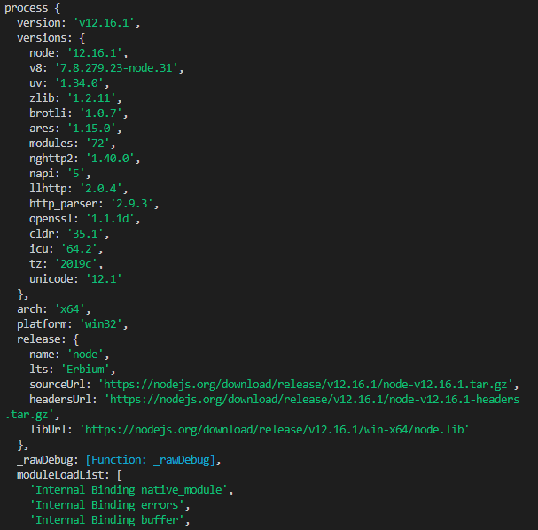


#### console

用来打印`stdout`和`stderr`

最常用的输入内容的方式：console.log

```js
console.log("hello");
```

清空控制台：console.clear

```js
console.clear
```

打印函数的调用栈：console.trace

```js
function test() {
    demo();
}

function demo() {
    foo();
}

function foo() {
    console.trace();
}

test();
```

 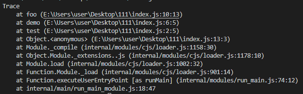


#### clearInterval、setInterval

设置定时器与清除定时器

```js
setInterval(callback, delay[, ...args])
```

`callback`每`delay`毫秒重复执行一次

`clearInterval`则为对应发取消定时器的方法


#### clearTimeout、setTimeout

设置延时器与清除延时器

```js
setTimeout(callback,delay[,...args])
```

`callback`在`delay`毫秒后执行一次

`clearTimeout`则为对应取消延时器的方法


#### global

全局命名空间对象，墙面讲到的`process`、`console`、`setTimeout`等都有放到`global`中

```js
console.log(process === global.process) // true
```


### 模块级别的全局对象

这些全局对象是模块中的变量，只是每个模块都有，看起来就像全局变量，像在命令交互中是不可以使用，包括：

- __dirname
- __filename
- exports
- module
- require


#### __dirname

获取当前文件所在的路径，不包括后面的文件名

从 `/Users/mjr` 运行 `node example.js`：

```js
console.log(__dirname);// 打印: /Users/mjr
```


#### __filename

获取当前文件所在的路径和文件名称，包括后面的文件名称

从 `/Users/mjr` 运行 `node example.js`：

```js
console.log(__filename);// 打印: /Users/mjr/example.js
```


#### exports

`module.exports` 用于指定一个模块所导出的内容，即可以通过 `require()` 访问的内容

```js
exports.name = name;exports.age = age;exports.sayHello = sayHello;
```


#### module

对当前模块的引用，通过`module.exports` 用于指定一个模块所导出的内容，即可以通过 `require()` 访问的内容


#### require

用于引入模块、 `JSON`、或本地文件。 可以从 `node_modules` 引入模块。

可以使用相对路径引入本地模块或` JSON `文件，路径会根据`__dirname`定义的目录名或当前工作目录进行处理


**要点**：
**作答思路**：

在Node.js中，全局对象是所有代码都可以访问的对象，它们在Node.js启动时被创建。以下是一些重要的全局对象：

1. **global**：代表当前的全局对象。
2. **module**：代表当前模块。
3. **exports**：代表模块的导出对象。
4. **require**：用于加载模块。
5. **process**：代表当前Node.js进程。
6. **console**：用于输出信息到控制台。
7. **Buffer**：用于操作二进制数据的类。
8. **setTimeout**、`setInterval`、`clearTimeout`、`clearInterval`：用于设置和清除定时器。
9. **setImmediate**、`clearImmediate`：用于异步执行回调函数。
10. **setImmediate**、`clearImmediate`：用于异步执行回调函数。

**考察要点：**

1. **全局对象概念**：理解全局对象的作用和用途。
2. **常用全局对象**：了解Node.js中常用的全局对象及其功能。


---
### 283. 说说对 Node 中的 fs模块的理解? 有哪些常用方法

**难度**：★★☆☆☆ | **题型**：QA | **分类**：全部 / Node.js

**题目**：


**参考答案**：
## 一、是什么

fs（filesystem），该模块提供本地文件的读写能力，基本上是`POSIX`文件操作命令的简单包装

可以说，所有与文件的操作都是通过`fs`核心模块实现

导入模块如下：

```js
const fs = require('fs');
```

这个模块对所有文件系统操作提供异步（不具有`sync` 后缀）和同步（具有 `sync` 后缀）两种操作方式，而供开发者选择


### 二、文件知识

在计算机中有关于文件的知识：

- 权限位 mode
- 标识位 flag
- 文件描述为 fd


### 权限位 mode

 

针对文件所有者、文件所属组、其他用户进行权限分配，其中类型又分成读、写和执行，具备权限位4、2、1，不具备权限为0

如在`linux`查看文件权限位：

```js
drwxr-xr-x 1 PandaShen 197121 0 Jun 28 14:41 core
-rw-r--r-- 1 PandaShen 197121 293 Jun 23 17:44 index.md
```

在开头前十位中，`d`为文件夹，`-`为文件，后九位就代表当前用户、用户所属组和其他用户的权限位，按每三位划分，分别代表读（r）、写（w）和执行（x），- 代表没有当前位对应的权限


### 标识位

标识位代表着对文件的操作方式，如可读、可写、即可读又可写等等，如下表所示：

| 符号 | 含义                                                     |
| ---- | -------------------------------------------------------- |
| r    | 读取文件，如果文件不存在则抛出异常。                     |
| r+   | 读取并写入文件，如果文件不存在则抛出异常。               |
| rs   | 读取并写入文件，指示操作系统绕开本地文件系统缓存。       |
| w    | 写入文件，文件不存在会被创建，存在则清空后写入。         |
| wx   | 写入文件，排它方式打开。                                 |
| w+   | 读取并写入文件，文件不存在则创建文件，存在则清空后写入。 |
| wx+  | 和 w+ 类似，排他方式打开。                               |
| a    | 追加写入，文件不存在则创建文件。                         |
| ax   | 与 a 类似，排他方式打开。                                |
| a+   | 读取并追加写入，不存在则创建。                           |
| ax+  | 与 a+ 类似，排他方式打开。                               |


### 文件描述为 fd

操作系统会为每个打开的文件分配一个名为文件描述符的数值标识，文件操作使用这些文件描述符来识别与追踪每个特定的文件

`Window `系统使用了一个不同但概念类似的机制来追踪资源，为方便用户，`NodeJS `抽象了不同操作系统间的差异，为所有打开的文件分配了数值的文件描述符

在 `NodeJS `中，每操作一个文件，文件描述符是递增的，文件描述符一般从 `3` 开始，因为前面有 `0`、`1`、`2`三个比较特殊的描述符，分别代表 `process.stdin`（标准输入）、`process.stdout`（标准输出）和 `process.stderr`（错误输出）


## 三、方法

下面针对`fs`模块常用的方法进行展开：

- 文件读取
- 文件写入
- 文件追加写入
- 文件拷贝
- 创建目录


### 文件读取

####  fs.readFileSync

同步读取，参数如下：

- 第一个参数为读取文件的路径或文件描述符
- 第二个参数为 options，默认值为 null，其中有 encoding（编码，默认为 null）和 flag（标识位，默认为 r），也可直接传入 encoding

结果为返回文件的内容

```js
const fs = require("fs");

let buf = fs.readFileSync("1.txt");
let data = fs.readFileSync("1.txt", "utf8");

console.log(buf); // <Buffer 48 65 6c 6c 6f>
console.log(data); // Hello
```


#### fs.readFile

异步读取方法 `readFile` 与 `readFileSync` 的前两个参数相同，最后一个参数为回调函数，函数内有两个参数 `err`（错误）和 `data`（数据），该方法没有返回值，回调函数在读取文件成功后执行

```js
const fs = require("fs");

fs.readFile("1.txt", "utf8", (err, data) => {
   if(!err){
       console.log(data); // Hello
   }
});
```


### 文件写入

#### writeFileSync

同步写入，有三个参数：

- 第一个参数为写入文件的路径或文件描述符

- 第二个参数为写入的数据，类型为 String 或 Buffer

- 第三个参数为 options，默认值为 null，其中有 encoding（编码，默认为 utf8）、 flag（标识位，默认为 w）和 mode（权限位，默认为 0o666），也可直接传入 encoding

```js
const fs = require("fs");

fs.writeFileSync("2.txt", "Hello world");
let data = fs.readFileSync("2.txt", "utf8");

console.log(data); // Hello world
```


#### writeFile

异步写入，`writeFile` 与 `writeFileSync` 的前三个参数相同，最后一个参数为回调函数，函数内有一个参数 `err`（错误），回调函数在文件写入数据成功后执行

```js
const fs = require("fs");

fs.writeFile("2.txt", "Hello world", err => {
    if (!err) {
        fs.readFile("2.txt", "utf8", (err, data) => {
            console.log(data); // Hello world
        });
    }
});
```


### 文件追加写入

#### appendFileSync

参数如下：

- 第一个参数为写入文件的路径或文件描述符
- 第二个参数为写入的数据，类型为 String 或 Buffer
- 第三个参数为 options，默认值为 null，其中有 encoding（编码，默认为 utf8）、 flag（标识位，默认为 a）和 mode（权限位，默认为 0o666），也可直接传入 encoding

```js
const fs = require("fs");

fs.appendFileSync("3.txt", " world");
let data = fs.readFileSync("3.txt", "utf8");
```


#### appendFile

异步追加写入方法 `appendFile` 与 `appendFileSync` 的前三个参数相同，最后一个参数为回调函数，函数内有一个参数 `err`（错误），回调函数在文件追加写入数据成功后执行

```js
const fs = require("fs");

fs.appendFile("3.txt", " world", err => {
    if (!err) {
        fs.readFile("3.txt", "utf8", (err, data) => {
            console.log(data); // Hello world
        });
    }
});
```


### 文件拷贝

#### copyFileSync

同步拷贝

```js
const fs = require("fs");

fs.copyFileSync("3.txt", "4.txt");
let data = fs.readFileSync("4.txt", "utf8");

console.log(data); // Hello world
```


#### copyFile

异步拷贝

```js
const fs = require("fs");

fs.copyFile("3.txt", "4.txt", () => {
    fs.readFile("4.txt", "utf8", (err, data) => {
        console.log(data); // Hello world
    });
});
```


### 创建目录

#### mkdirSync

同步创建，参数为一个目录的路径，没有返回值，在创建目录的过程中，必须保证传入的路径前面的文件目录都存在，否则会抛出异常

```js
// 假设已经有了 a 文件夹和 a 下的 b 文件夹
fs.mkdirSync("a/b/c")
```


#### mkdir

异步创建，第二个参数为回调函数

```js
fs.mkdir("a/b/c", err => {
    if (!err) console.log("创建成功");
});
```

**要点**：
**作答要点：**

在Node.js中，`fs`模块（文件系统模块）提供了一系列用于读取、写入、复制、删除、监视文件和目录的异步和同步API。

常用方法：

1. **同步方法**：
   - `fs.readFileSync(path, options)`：同步读取文件内容。
   - `fs.writeFileSync(path, data, options)`：同步写入文件内容。
   - `fs.renameSync(oldPath, newPath)`：同步重命名文件或目录。
   - `fs.unlinkSync(path)`：同步删除文件或目录。
   - `fs.mkdirSync(path, options)`：同步创建目录。
   - `fs.rmdirSync(path)`：同步删除目录。
2. **异步方法**：
   - `fs.readFile(path, options, callback)`：异步读取文件内容。
   - `fs.writeFile(path, data, options, callback)`：异步写入文件内容。
   - `fs.rename(oldPath, newPath, callback)`：异步重命名文件或目录。
   - `fs.unlink(path, callback)`：异步删除文件或目录。
   - `fs.mkdir(path, options, callback)`：异步创建目录。
   - `fs.rmdir(path, callback)`：异步删除目录。

**考察要点：**

1. **fs模块概念**：理解`fs`模块的作用和用途。
2. **常用方法**：了解`fs`模块中常用的同步和异步方法。


---
### 308. 怎么进行 Node  服务的内存优化？

**难度**：★★★★☆ | **题型**：QA | **分类**：全部 / Node.js

**题目**：


**参考答案**：
优化 Node.js 应用的内存使用可以显著提高应用性能和稳定性。以下是一些针对 Node.js 内存优化的策略和技巧：

### **1. 了解内存使用**

- **使用工具**：
  - **`process.memoryUsage()`**：可以查看 Node.js 进程的内存使用情况。
  - **Chrome DevTools**：可以进行内存快照分析，帮助找出内存泄漏和不必要的内存占用。
  - **`heapdump`**：用于生成堆快照，以便离线分析内存使用情况。

### **2. 避免内存泄漏**

- **监控和排查**：
  - 定期使用工具检查内存快照，特别是在应用运行一段时间后，检查是否存在内存持续增长的情况。
  - 使用 **`--trace_gc`** 启动标志查看垃圾回收日志，帮助诊断内存问题。

- **注意**：
  - **全局变量**：避免不必要的全局变量，因为它们会一直存在于内存中。
  - **闭包**：谨慎使用闭包，确保不持有对大对象的引用，避免意外的内存占用。
  - **事件监听器**：在不再需要时，记得移除事件监听器，避免内存泄漏。

### **3. 优化数据处理**

- **流式处理**：
  - 使用流（Streams）处理大数据集，避免一次性将整个数据集加载到内存中。使用 `stream` 模块进行数据的分块处理。

  ```javascript
  const fs = require('fs');
  const readStream = fs.createReadStream('large-file.txt');
  readStream.on('data', (chunk) => {
    // 处理数据块
  });
  ```

- **数据结构**：
  - 使用高效的数据结构来管理数据，例如选择合适的缓存策略，避免不必要的数据复制和存储。

### **4. 进行性能调优**

- **垃圾回收（GC）**：
  - 调整垃圾回收参数，以优化垃圾回收行为。例如，使用 `--max-old-space-size` 调整最大内存限制。

  ```bash
  node --max-old-space-size=4096 app.js
  ```

- **线程池**：
  - 调整 Node.js 线程池大小，优化对并发操作的支持。使用 `UV_THREADPOOL_SIZE` 环境变量设置线程池的大小。

  ```bash
  UV_THREADPOOL_SIZE=8 node app.js
  ```

### **5. 代码优化**

- **避免内存占用高的操作**：
  - 减少复杂计算和内存占用高的操作，尽量使用高效算法和数据结构。

- **缓存优化**：
  - 使用缓存策略（例如 LRU 缓存）来管理和清理缓存数据，避免缓存无限增长。

  ```javascript
  const LRU = require('lru-cache');
  const cache = new LRU({ max: 1000 });
  ```

### **6. 依赖管理**

- **更新依赖**：
  - 确保所有依赖都保持最新版本，因为许多内存问题和性能问题可能已经在新版本中修复。

- **避免过度依赖**：
  - 只使用必要的依赖库，避免引入不必要的内存开销。

### **7. 内存限制和监控**

- **限制内存使用**：
  - 设置合理的内存限制来防止应用过度消耗内存，使用 `--max-old-space-size` 参数设置 Node.js 进程的最大内存使用量。

- **监控工具**：
  - 使用工具如 **`pm2`** 或 **`forever`** 进行生产环境的内存监控和管理。

**要点**：
优化 Node.js 内存使用涉及监控内存使用情况、避免内存泄漏、优化数据处理、调整垃圾回收和线程池设置、代码和依赖优化等多个方面。

通过合理的内存管理和性能调优，可以提高 Node.js 应用的性能和稳定性。

---
### 370. 两个 Node.js 进程如何通信？

**难度**：★★★☆☆ | **题型**：QA | **分类**：全部 / Node.js

**题目**：


**参考答案**：
两个 Node.js 进程之间如何进行通信呢？这里要分两种场景：

1.  不同电脑上的两个 Node.js 进程间通信
2.  同一台电脑上两个 Node.js 进程间通信

对于第一种场景，通常使用 TCP 或 HTTP 进行通信，而对于第二种场景，又分为两种子场景：

1.  Node.js 进程和自己创建的 Node.js 子进程通信
2.  Node.js 进程和另外不相关的 Node.js 进程通信

前者可以使用内置的 IPC 通信通道，后者可以使用自定义管道，接下来进行详细介绍：

## 不同电脑上的两个 Node.js 进程间通信

要想进行通信，首先得搞清楚如何标识网络中的进程？网络层的 ip 地址可以唯一标识网络中的主机，而传输层的协议和端口可以唯一标识主机中的应用程序（进程），这样利用三元组（ip 地址，协议，端口）就可以标识网络的进程了。

### 使用 TCP 套接字

TCP 套接字（socket）是一种基于 TCP/IP 协议的通信方式，可以让通过网络连接的计算机上的进程进行通信。一个作为 server 另一个作为 client，server.js 代码如下：

```js
const net = require('net')
const server = net.createServer(socket => {
  console.log('socket connected')
  socket.on('close', () => console.log('socket disconnected'))
  socket.on('error', err => console.error(err.message))
  socket.on('data', data => {
    console.log(`receive: ${data}`)
    socket.write(data)
    console.log(`send: ${data}`)
  })
})
server.listen(8888)

```

client.js 代码：

```js
const net = require('net')
const client = net.connect(8888, '192.168.10.105')

client.on('connect', () => console.log('connected.'))
client.on('data', data => console.log(`receive: ${data}`))
client.on('end', () => console.log('disconnected.'))
client.on('error', err => console.error(err.message))

setInterval(() => {
  const msg = 'hello'
  console.log(`send: ${msg}`)
  client.write(msg)
}, 3000)

```

运行效果：

```sh
$ node server.js
client connected
receive: hello
send: hello

$ node client.js
connect to server
send: hello
receive: hello

```

### 使用 HTTP 协议

因为 HTTP 协议也是基于 TCP 的，所以从通信角度看，这种方式本质上并无区别，只是封装了上层协议。server.js 代码为：

```js
const http = require('http')
http.createServer((req, res) => res.end(req.url)).listen(8888)

```

client.js 代码：

```js
const http = require('http')
const options = {
  hostname: '192.168.10.105',
  port: 8888,
  path: '/hello',
  method: 'GET',
}
const req = http.request(options, res => {
  console.log(`statusCode: ${res.statusCode}`)
  res.on('data', d => process.stdout.write(d))
})
req.on('error', error => console.error(error))
req.end()

```

运行效果：

```sh
$ node server.js
url /hello

$ node client.js
statusCode: 200
hello

```

## 同一台电脑上两个 Node.js 进程间通信

虽然网络 socket 也可用于同一台主机的进程间通讯（通过 loopback 地址 127.0.0.1），但是这种方式需要经过网络协议栈、需要打包拆包、计算校验和、维护序号和应答等，就是为网络通讯设计的，而同一台电脑上的两个进程可以有更高效的通信方式，即 IPC（Inter-Process Communication），在 unix 上具体的实现方式为 unix domain socket，这是服务器端和客户端之间通过本地打开的套接字文件进行通信的一种方法，与 TCP 通信不同，通信时指定本地文件，因此不进行域解析和外部通信，所以比 TCP 快，在同一台主机的传输速度是 TCP 的两倍。

### 使用内置 IPC 通道

如果是跟自己创建的子进程通信，是非常方便的，child_process模块中的 fork 方法自带通信机制，无需关注底层细节，例如父进程 parent.js 代码：

```js
const fork = require("child_process").fork
const path = require("path")
const child = fork(path.resolve("child.js"), [], { stdio: "inherit" });
child.on("message", (message) => {
  console.log("message from child:", message)
  child.send("hi")
})
```

子进程 child.js 代码：

```js
process.on("message", (message) => {
  console.log("message from parent:", message);
})

if (process.send) {
  setInterval(() => process.send("hello"), 3000)
}

```

运行效果如下：

```sh
$ node parent.js
message from child: hello
message from parent: hi
message from child: hello
message from parent: hi

```

### 使用自定义管道

如果是两个独立的 Node.js 进程，如何建立通信通道呢？在 Windows 上可以使用命名管道（Named PIPE），在 unix 上可以使用 unix domain socket，也是一个作为 server，另外一个作为 client，其中 server.js 代码如下：

```js
const net = require('net')
const fs = require('fs')

const pipeFile = process.platform === 'win32' ? '\\\\.\\pipe\\mypip' : '/tmp/unix.sock'

const server = net.createServer(connection => {
  console.log('socket connected.')
  connection.on('close', () => console.log('disconnected.'))
  connection.on('data', data => {
    console.log(`receive: ${data}`)
    connection.write(data)
    console.log(`send: ${data}`)
  })
  connection.on('error', err => console.error(err.message))
})

try {
  fs.unlinkSync(pipeFile)
} catch (error) {}

server.listen(pipeFile)
```

client.js 代码如下：

```js
const net = require('net')

const pipeFile = process.platform === 'win32' ? '\\\\.\\pipe\\mypip' : '/tmp/unix.sock'

const client = net.connect(pipeFile)
client.on('connect', () => console.log('connected.'))
client.on('data', data => console.log(`receive: ${data}`))
client.on('end', () => console.log('disconnected.'))
client.on('error', err => console.error(err.message))

setInterval(() => {
  const msg = 'hello'
  console.log(`send: ${msg}`)
  client.write(msg)
}, 3000)


```

运行效果：

```sh
$ node server.js 
socket connected.
receive: hello
send: hello

$ node client.js
connected.
send: hello
receive: hello

```

**要点**：
**回答思路**：
在 Node.js 中，两个进程可以通过 IPC（Inter-Process Communication，进程间通信）机制进行通信。常用的 IPC 方法包括：

1. **使用文件**：在两个进程之间共享文件，并通过文件进行通信。
2. **使用消息队列**：通过消息队列（如 RabbitMQ 或 Kafka）来发送和接收消息。
3. **使用共享内存**：在支持共享内存的操作系统上，通过共享内存进行高速通信。
4. **使用管道**：在 Linux 上，通过管道（如 `process.stdin` 和 `process.stdout`）进行简单的单向通信。
这些方法中，选择哪种方法取决于具体的需求和场景。


---
### 378. 说说你对 npm 包管理的了解

**难度**：★★☆☆☆ | **题型**：QA | **分类**：全部 / Node.js

**题目**：


**参考答案**：
npm（Node Package Manager）是 Node.js 的包管理工具，用于管理 JavaScript 项目的依赖和开发工具。它提供了一个丰富的生态系统，方便开发者分享和使用代码。以下是一些主要的 npm 包管理功能和概念：

### **1. 包的安装和管理**

- **安装包**：可以通过 `npm install <package>` 安装包，默认安装到项目的 `node_modules` 目录。
  ```bash
  npm install lodash
  ```

- **全局安装**：使用 `-g` 标志来全局安装包，使其在系统任何地方都能访问。
  ```bash
  npm install -g typescript
  ```

- **卸载包**：使用 `npm uninstall <package>` 从项目中移除包。
  ```bash
  npm uninstall lodash
  ```

### **2. 版本管理**

- **语义化版本控制**：npm 使用语义化版本控制（SemVer），版本号格式为 `MAJOR.MINOR.PATCH`，如 `1.2.3`。
  - **MAJOR**：大版本号变更，通常是不兼容的 API 变更。
  - **MINOR**：小版本号变更，添加功能但保持向下兼容。
  - **PATCH**：补丁版本，修复 bug 但不影响 API。

- **版本范围**：可以在 `package.json` 中定义依赖的版本范围，如 `^1.2.3`（兼容 `1.x.x`）、`~1.2.3`（兼容 `1.2.x`）。

### **3. package.json**

- **定义依赖**：`package.json` 文件中列出了项目的所有依赖及其版本。
  ```json
  {
    "dependencies": {
      "lodash": "^4.17.21"
    },
    "devDependencies": {
      "jest": "^27.0.0"
    }
  }
  ```

- **脚本命令**：可以在 `package.json` 中定义脚本命令，如构建、测试、启动等。
  ```json
  {
    "scripts": {
      "start": "node index.js",
      "test": "jest"
    }
  }
  ```

### **4. npm 版本控制**

- **包的发布**：使用 `npm publish` 将包发布到 npm 注册表，使其可以被其他人使用。
- **包的版本更新**：使用 `npm version <updateType>` 更新包版本，如 `patch`、`minor` 或 `major`。

### **5. 缓存和锁文件**

- **缓存**：npm 缓存机制加速包的安装，缓存存储在用户的本地目录中。
- **lock 文件**：`package-lock.json` 或 `npm-shrinkwrap.json` 文件记录确切的依赖树版本，确保在不同环境中一致的安装结果。

### **6. 安全性和审计**

- **安全审计**：使用 `npm audit` 检查项目依赖中的安全漏洞，并提供修复建议。
  ```bash
  npm audit
  ```

### **7. 版本管理工具**

- **nvm**（Node Version Manager）：用于管理不同版本的 Node.js 环境，使得在不同项目间切换 Node.js 版本变得简单。


**要点**：
npm 是一个功能全面的包管理工具，通过管理 JavaScript 项目的依赖、版本控制、脚本命令、缓存和安全审计等，帮助开发者更高效地构建和维护项目。

---
### 460. 说说对Nodejs中的事件循环机制理解?

**难度**：★★★☆☆ | **题型**：QA | **分类**：全部 / Node.js

**题目**：


**参考答案**：
## 一、是什么

在[浏览器事件循环](https://github.com/febobo/web-interview/issues/73)中，我们了解到`javascript`在浏览器中的事件循环机制，其是根据`HTML5`定义的规范来实现

而在`NodeJS`中，事件循环是基于`libuv`实现，`libuv`是一个多平台的专注于异步IO的库，如下图最右侧所示：

 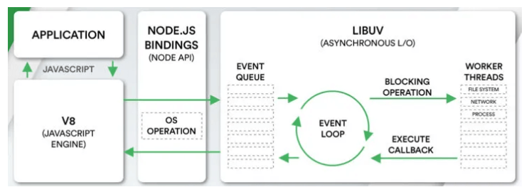

上图`EVENT_QUEUE` 给人看起来只有一个队列，但`EventLoop`存在6个阶段，每个阶段都有对应的一个先进先出的回调队列


## 二、流程

上节讲到事件循环分成了六个阶段，对应如下：

 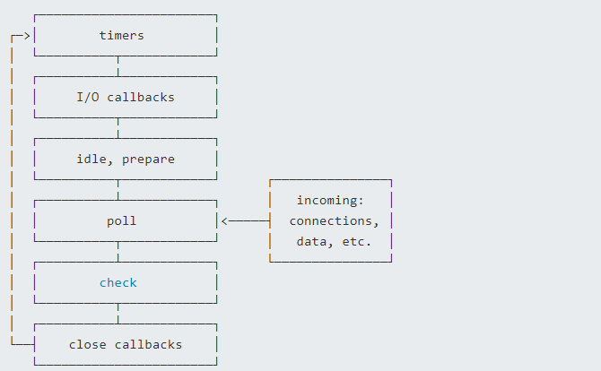

- timers阶段：这个阶段执行timer（setTimeout、setInterval）的回调
- 定时器检测阶段(timers)：本阶段执行 timer 的回调，即 setTimeout、setInterval 里面的回调函数
- I/O事件回调阶段(I/O callbacks)：执行延迟到下一个循环迭代的 I/O 回调，即上一轮循环中未被执行的一些I/O回调
- 闲置阶段(idle, prepare)：仅系统内部使用
- 轮询阶段(poll)：检索新的 I/O 事件;执行与 I/O 相关的回调（几乎所有情况下，除了关闭的回调函数，那些由计时器和 setImmediate() 调度的之外），其余情况 node 将在适当的时候在此阻塞
- 检查阶段(check)：setImmediate() 回调函数在这里执行
- 关闭事件回调阶段(close callback)：一些关闭的回调函数，如：socket.on('close', ...)

每个阶段对应一个队列，当事件循环进入某个阶段时, 将会在该阶段内执行回调，直到队列耗尽或者回调的最大数量已执行, 那么将进入下一个处理阶段

除了上述6个阶段，还存在`process.nextTick`，其不属于事件循环的任何一个阶段，它属于该阶段与下阶段之间的过渡, 即本阶段执行结束, 进入下一个阶段前, 所要执行的回调，类似插队

流程图如下所示：

 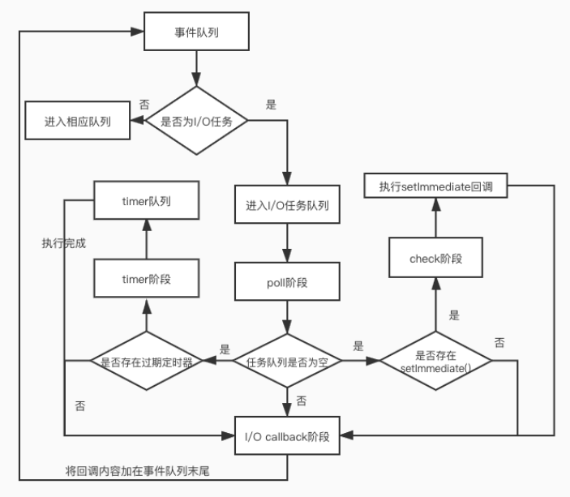

在`Node`中，同样存在宏任务和微任务，与浏览器中的事件循环相似

微任务对应有：

- next tick queue：process.nextTick
- other queue：Promise的then回调、queueMicrotask

宏任务对应有：

- timer queue：setTimeout、setInterval
- poll queue：IO事件
- check queue：setImmediate
- close queue：close事件

其执行顺序为：

- next tick microtask queue
- other microtask queue
- timer queue
- poll queue
- check queue
- close queue


## 三、题目

通过上面的学习，下面开始看看题目

```js
async function async1() {
    console.log('async1 start')
    await async2()
    console.log('async1 end')
}

async function async2() {
    console.log('async2')
}

console.log('script start')

setTimeout(function () {
    console.log('setTimeout0')
}, 0)

setTimeout(function () {
    console.log('setTimeout2')
}, 300)

setImmediate(() => console.log('setImmediate'));

process.nextTick(() => console.log('nextTick1'));

async1();

process.nextTick(() => console.log('nextTick2'));

new Promise(function (resolve) {
    console.log('promise1')
    resolve();
    console.log('promise2')
}).then(function () {
    console.log('promise3')
})

console.log('script end')
```

分析过程：

- 先找到同步任务，输出script start
- 遇到第一个 setTimeout，将里面的回调函数放到 timer 队列中
- 遇到第二个 setTimeout，300ms后将里面的回调函数放到 timer 队列中
- 遇到第一个setImmediate，将里面的回调函数放到 check 队列中
- 遇到第一个 nextTick，将其里面的回调函数放到本轮同步任务执行完毕后执行

- 执行 async1函数，输出 async1 start
- 执行 async2 函数，输出 async2，async2 后面的输出 async1 end进入微任务，等待下一轮的事件循环
- 遇到第二个，将其里面的回调函数放到本轮同步任务执行完毕后执行
- 遇到 new Promise，执行里面的立即执行函数，输出 promise1、promise2
- then里面的回调函数进入微任务队列
- 遇到同步任务，输出 script end
- 执行下一轮回到函数，先依次输出 nextTick 的函数，分别是 nextTick1、nextTick2
- 然后执行微任务队列，依次输出 async1 end、promise3
- 执行timer 队列，依次输出 setTimeout0
- 接着执行 check  队列，依次输出 setImmediate
- 300ms后，timer 队列存在任务，执行输出 setTimeout2

执行结果如下：

```
script start
async1 start
async2
promise1
promise2
script end
nextTick1
nextTick2
async1 end
promise3
setTimeout0
setImmediate
setTimeout2
```

最后有一道是关于`setTimeout`与`setImmediate`的输出顺序

```js
setTimeout(() => {
  console.log("setTimeout");
}, 0);

setImmediate(() => {
  console.log("setImmediate");
});
```

输出情况如下：

```js
情况一：
setTimeout
setImmediate

情况二：
setImmediate
setTimeout
```

分析下流程：

- 外层同步代码一次性全部执行完，遇到异步API就塞到对应的阶段
- 遇到`setTimeout`，虽然设置的是0毫秒触发，但实际上会被强制改成1ms，时间到了然后塞入`times`阶段
- 遇到`setImmediate`塞入`check`阶段
- 同步代码执行完毕，进入Event Loop
- 先进入`times`阶段，检查当前时间过去了1毫秒没有，如果过了1毫秒，满足`setTimeout`条件，执行回调，如果没过1毫秒，跳过
- 跳过空的阶段，进入check阶段，执行`setImmediate`回调

这里的关键在于这1ms，如果同步代码执行时间较长，进入`Event Loop`的时候1毫秒已经过了，`setTimeout`先执行，如果1毫秒还没到，就先执行了`setImmediate`


**要点**：
**作答思路**：

Node.js中的事件循环机制是一种异步编程模型，它基于事件驱动和非阻塞I/O。其核心是V8引擎和libuv库。V8负责执行JavaScript代码，而libuv负责处理系统调用和I/O操作。
事件循环的主要组成部分包括：

1. **主事件循环（Main Loop）**：负责处理异步任务，包括文件读写、网络请求等。
2. **事件队列**：存储等待处理的异步任务。
3. **观察者模式**：用于处理异步任务完成后的回调。
当有事件发生时，libuv会将事件放入事件队列，V8引擎会不断检查事件队列，如果有事件，则调用相应的回调函数。这种机制使得Node.js能够高效地处理大量的并发请求。

**考察要点**：

1. **事件循环概念**：理解事件循环在Node.js中的作用和基本原理。
2. **异步编程模型**：理解事件驱动和非阻塞I/O在Node.js中的应用。
3. **事件队列和观察者模式**：理解事件队列和观察者模式在事件循环中的作用。


---
### 478. 单线程的 nodejs 是如何充分利用计算机 CPU 资源的呢？

**难度**：★★★☆☆ | **题型**：QA | **分类**：全部 / Node.js

**题目**：


**参考答案**：
Node.js 是单线程的，但它可以通过以下方式有效地利用计算机的 CPU 资源：

### **1. 异步 I/O 操作**

- **概念**：Node.js 使用异步非阻塞 I/O 操作，这意味着它在等待 I/O 操作（如文件读写、网络请求）完成时不会阻塞主线程。
- **实现**：Node.js 的异步 I/O 操作由底层的 libuv 库管理，libuv 使用线程池来处理这些 I/O 操作。当 I/O 操作完成后，回调函数会被触发，主线程继续执行其他任务。

### **2. 事件循环（Event Loop）**

- **概念**：事件循环是 Node.js 的核心机制，它管理异步操作的执行。事件循环不断检查事件队列并执行相应的回调函数。
- **实现**：事件循环使得 Node.js 能够在处理 I/O 操作时继续处理其他任务，而不是阻塞线程等待 I/O 完成。

### **3. libuv 线程池**

- **概念**：libuv 是 Node.js 的底层库，提供了跨平台的异步 I/O 操作。它内部包含一个线程池，用于处理一些需要阻塞的操作（如文件系统操作、DNS 查询等）。
- **实现**：libuv 线程池允许 Node.js 在进行这些阻塞操作时，不影响主线程的运行。线程池的任务完成后，结果会被传递回事件循环中的回调函数。

### **4. Worker Threads**

- **概念**：Node.js 也提供了 `worker_threads` 模块，可以在多线程环境中运行 JavaScript 代码。
- **实现**：通过 `worker_threads`，Node.js 可以创建多个线程，这些线程可以并行地处理计算密集型任务，而主线程继续处理事件循环。这使得 Node.js 能够利用多核 CPU 的能力。

### **5. Cluster 模块**

- **概念**：Node.js 的 `cluster` 模块允许创建多个进程，每个进程都有自己的事件循环和内存空间，但它们可以共享端口和负载均衡。
- **实现**：使用 `cluster` 模块，可以充分利用多核 CPU。每个子进程（工作进程）处理不同的请求，而主进程负责负载均衡和管理。


**要点**：
- **异步 I/O**：通过非阻塞 I/O 操作避免主线程阻塞。
- **事件循环**：管理异步操作的执行，保持单线程的高效。
- **libuv 线程池**：处理阻塞操作，提升性能。
- **Worker Threads**：利用多线程处理计算密集型任务。
- **Cluster 模块**：通过进程间并行处理提高 CPU 利用率。

这些机制使得尽管 Node.js 是单线程的，但它可以高效地利用 CPU 资源，并处理大量并发请求。

---
### 511. 如何实现文件上传？说说你的思路

**难度**：★★★☆☆ | **题型**：QA | **分类**：全部 / Node.js

**题目**：


**参考答案**：
## 一、是什么

文件上传在日常开发中应用很广泛，我们发微博、发微信朋友圈都会用到了图片上传功能

因为浏览器限制，浏览器不能直接操作文件系统的，需要通过浏览器所暴露出来的统一接口，由用户主动授权发起来访问文件动作，然后读取文件内容进指定内存里，最后执行提交请求操作，将内存里的文件内容数据上传到服务端，服务端解析前端传来的数据信息后存入文件里

对于文件上传，我们需要设置请求头为`content-type:multipart/form-data`

> multipart互联网上的混合资源，就是资源由多种元素组成，form-data表示可以使用HTML Forms 和 POST 方法上传文件

结构如下：

```http
POST /t2/upload.do HTTP/1.1
User-Agent: SOHUWapRebot
Accept-Language: zh-cn,zh;q=0.5
Accept-Charset: GBK,utf-8;q=0.7,*;q=0.7
Connection: keep-alive
Content-Length: 60408
Content-Type:multipart/form-data; boundary=ZnGpDtePMx0KrHh_G0X99Yef9r8JZsRJSXC
Host: w.sohu.com

--ZnGpDtePMx0KrHh_G0X99Yef9r8JZsRJSXC
Content-Disposition: form-data; name="city"

Santa colo
--ZnGpDtePMx0KrHh_G0X99Yef9r8JZsRJSXC
Content-Disposition: form-data;name="desc"
Content-Type: text/plain; charset=UTF-8
Content-Transfer-Encoding: 8bit
 
...
--ZnGpDtePMx0KrHh_G0X99Yef9r8JZsRJSXC
Content-Disposition: form-data;name="pic"; filename="photo.jpg"
Content-Type: application/octet-stream
Content-Transfer-Encoding: binary
 
... binary data of the jpg ...
--ZnGpDtePMx0KrHh_G0X99Yef9r8JZsRJSXC--
```

`boundary`表示分隔符，如果要上传多个表单项，就要使用`boundary`分割，每个表单项由`———XXX`开始，以`———XXX`结尾

而`xxx`是即时生成的字符串，用以确保整个分隔符不会在文件或表单项的内容中出现

每个表单项必须包含一个 `Content-Disposition` 头，其他的头信息则为可选项， 比如 `Content-Type` 

`Content-Disposition` 包含了 `type `和 一个名字为` name `的 `parameter`，`type` 是 `form-data`，`name `参数的值则为表单控件（也即 field）的名字，如果是文件，那么还有一个 `filename `参数，值就是文件名

```kotlin
Content-Disposition: form-data; name="user"; filename="logo.png"
```

至于使用`multipart/form-data`，是因为文件是以二进制的形式存在，其作用是专门用于传输大型二进制数据，效率高


### 二、如何实现

关于文件的上传的上传，我们可以分成两步骤：

- 文件的上传
- 文件的解析


### 文件上传

传统前端文件上传的表单结构如下：

```html
<form action="http://localhost:8080/api/upload" method="post" enctype="multipart/form-data">
    <input type="file" name="file" id="file" value="" multiple="multiple" />
    <input type="submit" value="提交"/>
</form>
```

`action` 就是我们的提交到的接口，`enctype="multipart/form-data"` 就是指定上传文件格式，`input` 的 `name` 属性一定要等于`file`


### 文件解析

在服务器中，这里采用`koa2`中间件的形式解析上传的文件数据，分别有下面两种形式：

- koa-body
- koa-multer


#### koa-body

安装依赖

```cmd
npm install koa-body
```

引入`koa-body`中间件

```js
const koaBody = require('koa-body');
app.use(koaBody({
    multipart: true,
    formidable: {
        maxFileSize: 200*1024*1024    // 设置上传文件大小最大限制，默认2M
    }
}));
```

获取上传的文件

```js
const file = ctx.request.files.file; // 获取上传文件
```

获取文件数据后，可以通过`fs`模块将文件保存到指定目录

```js
router.post('/uploadfile', async (ctx, next) => {
  // 上传单个文件
  const file = ctx.request.files.file; // 获取上传文件
  // 创建可读流
  const reader = fs.createReadStream(file.path);
  let filePath = path.join(__dirname, 'public/upload/') + `/${file.name}`;
  // 创建可写流
  const upStream = fs.createWriteStream(filePath);
  // 可读流通过管道写入可写流
  reader.pipe(upStream);
  return ctx.body = "上传成功！";
});
```


#### koa-multer

安装依赖：

```cmd 
npm install koa-multer
```

使用 `multer` 中间件实现文件上传

```js
const storage = multer.diskStorage({  
	destination: (req, file, cb) => {    
    	cb(null, "./upload/")
    },  
    filename: (req, file, cb) => {    
       	cb(null, Date.now() + path.extname(file.originalname))
    }
})

const upload = multer({  storage});
const fileRouter = new Router();
fileRouter.post("/upload", upload.single('file'), (ctx, next) => {  
	console.log(ctx.req.file); // 获取文件
})
 
app.use(fileRouter.routes());
```


**要点**：
**作答思路**：

实现文件上传的基本思路如下：

1. **前端选择文件**：使用HTML的`<input type="file">`元素让用户选择文件。
2. **前端发送请求**：使用JavaScript将文件数据封装在表单数据（`FormData`）中，通过AJAX发送POST请求到服务器。
3. **后端接收文件**：服务器端接收到文件数据，处理文件并保存到服务器。
4. **后端响应前端**：服务器端处理完成后，向前端发送响应，告知上传结果。
具体细节可以参考详细答案
**考察要点**：
1. **前端与后端分离**：理解前端负责用户交互和数据封装，后端负责接收数据和处理业务逻辑。
2. **文件上传流程**：理解文件从用户选择到服务器保存的整个流程。
3. **前后端交互**：理解前端如何发送请求，后端如何接收请求并返回响应。


---
### 541. 怎么在 koa 中，进行中间件的异常处理？

**难度**：★★☆☆☆ | **题型**：QA | **分类**：全部 / Node.js

**题目**：


**参考答案**：
在 Koa 中，中间件的异常处理是一个重要的部分，可以通过以下几种方式来实现：

### **1. 使用 `try...catch` 捕获异常**

- **概述**：在 Koa 的中间件中，可以使用 `try...catch` 块来捕获和处理异步操作中的异常。这样可以确保即使中间件出现错误，服务器不会崩溃。
- **实现**：
  ```javascript
  app.use(async (ctx, next) => {
    try {
      await next();
    } catch (err) {
      ctx.status = err.status || 500;
      ctx.body = {
        message: err.message
      };
      // 可选：记录错误
      console.error(err);
    }
  });
  ```

### **2. 使用 `onerror` 事件处理**

- **概述**：Koa 的 `app.onerror` 事件可以用来处理未捕获的异常。这种方式适合全局处理所有未被捕获的错误。
- **实现**：
  ```javascript
  const Koa = require('koa');
  const app = new Koa();

  app.onerror = (err, ctx) => {
    ctx.status = err.status || 500;
    ctx.body = {
      message: err.message
    };
    // 可选：记录错误
    console.error(err);
  };

  app.use(async (ctx, next) => {
    throw new Error('Something went wrong!');
  });

  app.listen(3000);
  ```

### **3. 使用第三方中间件**

- **概述**：使用第三方中间件可以简化错误处理，例如 `koa-err`。
- **实现**：
  ```javascript
  const Koa = require('koa');
  const err = require('koa-err');
  const app = new Koa();

  app.use(err({
    // 这里可以配置错误处理选项
  }));

  app.use(async (ctx, next) => {
    throw new Error('Something went wrong!');
  });

  app.listen(3000);
  ```

### **4. 异常处理中间件的顺序**

- **概述**：确保异常处理的中间件放在其他中间件的最后，这样它可以捕获之前中间件中发生的所有异常。
- **实现**：
  ```javascript
  const Koa = require('koa');
  const app = new Koa();

  app.use(async (ctx, next) => {
    // 这里是正常的中间件逻辑
    await next();
  });

  // 异常处理中间件应在所有其他中间件之后
  app.use(async (ctx, next) => {
    try {
      await next();
    } catch (err) {
      ctx.status = err.status || 500;
      ctx.body = {
        message: err.message
      };
      console.error(err);
    }
  });

  app.listen(3000);
  ```

**要点**：
- **`try...catch`**：在单个中间件中捕获异常。
- **`app.onerror`**：全局处理未捕获的异常。
- **第三方中间件**：使用专门的库来简化错误处理。
- **中间件顺序**：确保异常处理在其他中间件之后执行。

---
### 572. 说说对 Node 中的 process 的理解？有哪些常用方法？

**难度**：★★☆☆☆ | **题型**：QA | **分类**：全部 / Node.js

**题目**：


**参考答案**：
## 一、是什么

`process` 对象是一个全局变量，提供了有关当前 `Node.js `进程的信息并对其进行控制，作为一个全局变量

我们都知道，进程计算机系统进行资源分配和调度的基本单位，是操作系统结构的基础，是线程的容器

当我们启动一个`js`文件，实际就是开启了一个服务进程，每个进程都拥有自己的独立空间地址、数据栈，像另一个进程无法访问当前进程的变量、数据结构，只有数据通信后，进程之间才可以数据共享

由于`JavaScript`是一个单线程语言，所以通过`node xxx`启动一个文件后，只有一条主线程


## 二、属性与方法

关于`process`常见的属性有如下：

- process.env：环境变量，例如通过 `process.env.NODE_ENV 获取不同环境项目配置信息
- process.nextTick：这个在谈及 `EventLoop` 时经常为会提到
- process.pid：获取当前进程id
- process.ppid：当前进程对应的父进程
- process.cwd()：获取当前进程工作目录，
- process.platform：获取当前进程运行的操作系统平台
- process.uptime()：当前进程已运行时间，例如：pm2 守护进程的 uptime 值
- 进程事件： process.on(‘uncaughtException’,cb) 捕获异常信息、 process.on(‘exit’,cb）进程推出监听
- 三个标准流： process.stdout 标准输出、 process.stdin 标准输入、 process.stderr 标准错误输出
- process.title 指定进程名称，有的时候需要给进程指定一个名称


下面再稍微介绍下某些方法的使用：

### process.cwd()

返回当前 `Node `进程执行的目录

一个` Node` 模块 `A` 通过 NPM 发布，项目 `B` 中使用了模块 `A`。在 `A` 中需要操作 `B` 项目下的文件时，就可以用 `process.cwd()` 来获取 `B` 项目的路径


### process.argv

在终端通过 Node 执行命令的时候，通过 `process.argv` 可以获取传入的命令行参数，返回值是一个数组：

- 0: Node 路径（一般用不到，直接忽略）
- 1: 被执行的 JS 文件路径（一般用不到，直接忽略）
- 2~n: 真实传入命令的参数

所以，我们只要从 `process.argv[2]` 开始获取就好了

```js
const args = process.argv.slice(2);
```


### process.env

返回一个对象，存储当前环境相关的所有信息，一般很少直接用到。

一般我们会在 `process.env` 上挂载一些变量标识当前的环境。比如最常见的用 `process.env.NODE_ENV` 区分 `development` 和 `production`

在 `vue-cli` 的源码中也经常会看到 `process.env.VUE_CLI_DEBUG` 标识当前是不是 `DEBUG` 模式


### process.nextTick()

我们知道`NodeJs`是基于事件轮询，在这个过程中，同一时间只会处理一件事情

在这种处理模式下，`process.nextTick()`就是定义出一个动作，并且让这个动作在下一个事件轮询的时间点上执行

例如下面例子将一个`foo`函数在下一个时间点调用

```js
function foo() {
    console.error('foo');
}

process.nextTick(foo);
console.error('bar');
```

输出结果为`bar`、`foo`

虽然下述方式也能实现同样效果：

```js
setTimeout(foo, 0);
console.log('bar');
```

两者区别在于：

- process.nextTick()会在这一次event loop的call stack清空后（下一次event loop开始前）再调用callback
- setTimeout()是并不知道什么时候call stack清空的，所以何时调用callback函数是不确定的


**要点**：
**作答思路：**

在Node.js中，`process`对象是一个全局变量，代表当前Node.js进程。它提供了与当前进程相关的各种属性和方法。
常用方法：

1. **exit()**：退出进程。
2. **kill()**：发送信号给进程。
3. **spawn()**：启动一个新进程。
4. **cwd()**：返回当前工作目录的路径。
5. **chdir()**：更改当前工作目录。
6. **env**：获取或设置环境变量。
7. **argv**：返回命令行参数数组。
8. **versions**：返回Node.js的版本信息。
9. **config**：返回Node.js的配置信息。
10. **versions**：返回Node.js的版本信息。

**考察要点**：

1. **process对象概念**：理解`process`对象的作用和用途。
2. **常用方法**：了解`process`对象中常用的方法。


---
### 576. 说说你对Node.js 的理解？优缺点？应用场景？

**难度**：★★☆☆☆ | **题型**：QA | **分类**：全部 / Node.js

**题目**：


**参考答案**：
## 一、是什么

`Node.js` 是一个开源与跨平台的 `JavaScript` 运行时环境

在浏览器外运行 V8 JavaScript 引擎（Google Chrome 的内核），利用事件驱动、非阻塞和异步输入输出模型等技术提高性能

可以理解为 `Node.js` 就是一个服务器端的、非阻塞式I/O的、事件驱动的`JavaScript`运行环境

### 非阻塞异步 

`Nodejs`采用了非阻塞型`I/O`机制，在做`I/O`操作的时候不会造成任何的阻塞，当完成之后，以时间的形式通知执行操作

例如在执行了访问数据库的代码之后，将立即转而执行其后面的代码，把数据库返回结果的处理代码放在回调函数中，从而提高了程序的执行效率


### 事件驱动

事件驱动就是当进来一个新的请求的时，请求将会被压入一个事件队列中，然后通过一个循环来检测队列中的事件状态变化，如果检测到有状态变化的事件，那么就执行该事件对应的处理代码，一般都是回调函数

比如读取一个文件，文件读取完毕后，就会触发对应的状态，然后通过对应的回调函数来进行处理

 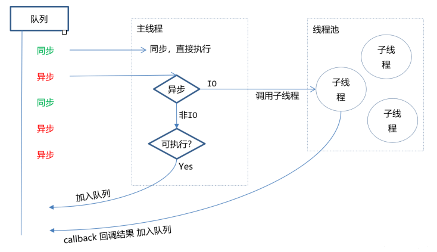


## 二、优缺点

优点：

- 处理高并发场景性能更佳
- 适合I/O密集型应用，值的是应用在运行极限时，CPU占用率仍然比较低，大部分时间是在做 I/O硬盘内存读写操作

因为`Nodejs`是单线程，带来的缺点有：

- 不适合CPU密集型应用
- 只支持单核CPU，不能充分利用CPU
- 可靠性低，一旦代码某个环节崩溃，整个系统都崩溃


## 三、应用场景

借助`Nodejs`的特点和弊端，其应用场景分类如下：

- 善于`I/O`，不善于计算。因为Nodejs是一个单线程，如果计算（同步）太多，则会阻塞这个线程
- 大量并发的I/O，应用程序内部并不需要进行非常复杂的处理
- 与 websocket 配合，开发长连接的实时交互应用程序

具体场景可以表现为如下：

- 第一大类：用户表单收集系统、后台管理系统、实时交互系统、考试系统、联网软件、高并发量的web应用程序
- 第二大类：基于web、canvas等多人联网游戏
- 第三大类：基于web的多人实时聊天客户端、聊天室、图文直播
- 第四大类：单页面浏览器应用程序
- 第五大类：操作数据库、为前端和移动端提供基于`json`的API

其实，`Nodejs`能实现几乎一切的应用，只考虑适不适合使用它


**要点**：
**作答思路：**

Node.js是一个基于Chrome V8引擎的JavaScript运行环境，它使得JavaScript能够用于服务器端编程。

优缺点：

优点：

- **事件驱动**：采用非阻塞I/O模型，能够高效处理并发请求。
- **轻量级**：不需要额外的中间件，开销小。
- **易于上手**：使用JavaScript开发，易于学习和使用。
- **丰富的库和框架**：有大量第三方库和框架支持，如Express、Mongoose等。

缺点：

- **单线程**：所有I/O操作都在单个线程上执行，不适合计算密集型任务。
- **性能瓶颈**：由于单线程，当I/O操作过多时，可能会导致性能瓶颈。
- **内存管理**：内存泄露问题较为常见，需要开发者注意内存管理。

应用场景：

- **API开发**：用于构建RESTful API或GraphQL API。
- **实时应用**：如实时聊天、实时游戏等。
- **数据处理**：用于处理大量数据，如日志分析、大数据处理等。
- **前端框架后端**：如Next.js、Nuxt.js等，用于构建全栈应用。

**考察要点**：

1. **Node.js概念**：理解Node.js的基本原理和用途。
2. **优缺点**：了解Node.js的优势和劣势。
3. **应用场景**：了解Node.js在不同场景下的应用。


---
### 702. 为什么Node在使用es module时必须加上文件扩展名?

**难度**：★★★★☆ | **题型**：QA | **分类**：全部 / Node.js

**题目**：


**参考答案**：
这个事情分两部分说。

第一个问题是，我们需要用代码内容以外的信息（比如文件扩展名来确定一段代码是否是es module。

这件事情的根子是在TC39，在设计es module时就无法从语法上严格区分一段代码到底是es module还是传统的script（注意 commonjs 本质上仍然是传统script）。

有人可能会问，难道不是有`import`、`export`语句就是es module啊？ 从开发者的理解上来说，确实是这样。但问题是，没有`import`、`export`语句也不代表就不是es module。 

曾经node社区在TC39的代表提出提案（[tc39/proposal-UnambiguousJavaScriptGrammar](https://github.com/tc39/proposal-UnambiguousJavaScriptGrammar)）来通过语法区分。可能的方案有几种：

1. 类似`"use strict"`，我们可以通过引入`"use module"`指令来解决。  
【优点：容易理解，也很容易实现，没有额外的解析成本；缺点：对于大多数已经有`export`语句的模块来说，有点脱裤子放屁。】

2. 通过`export`语句是否存在来分辨，对于本身不需要`export`的模块，开发者通过加入`export {}`（这是语法上允许的export语句，虽然啥都不导出）来标记其为es module。  
【优点：对于大多数模块来说不需要额外标记；缺点：由于`export`语句并不必然在代码头部，所以解析器需要预扫描`export`语句，决定是否是es module。】
3. 引入某种新的语法来标记。  
【优缺点：类似1】

但是这些方案在TC39讨论时都没法通过。并且可以判断，将来也不可能再引入。

> PS：提醒，TypeScript就是使用 方案2 来确定是否是es module的。】

因为不能通过代码内容本身来判断是否是es module，那就需要某种外部信息。

对于Web平台来说，是通过`<script type=module>`来标明的（也延伸到其他标签，比如需要单独的`<link rel=modulepreload>`；也延伸到其他API，如`new Worker(path, {type: 'module'})`需要额外参数标明是es module）。 

对于node.js这样的命令行来说，就要通过文件扩展名（`.mjs`）来标明，或者通过`package.json`文件中的`"type": "module"`字段来标明。

---

第二个问题是，我们需要用完整的路径（包含文件扩展名）来导入，即`import "./my-module.mjs"`而不是`import "./my-module"`。 

Node.js下的commonjs模块的resolve规则是按照服务器端脚本系统来设计的，它基于一个假设，即文件系统访问的成本是很小的（不过马后炮来说，今天的大型应用里，大量细碎小模块的resolve成本常常已经不能忽略），因此只要用起来方便，resolve规则复杂一点是ok的。

所以node.js的模块解析机制有复杂的fallback机制。比如对于`require('./my-module')` ，会先寻找该脚本同目录的`my-module`（不带有扩展名）文件，如果找不到则寻找`my-module.js`文件，如果再找不到则寻找`my-module/index.js`文件。

但如此的fallback如果无脑照搬到浏览器端，就会是多次的network roundtrip，这成本肯定是不能接受的。因此在浏览器端，`import`语句中引用的模块，就是一个标准的url，在没有其他额外处理（服务器端根据请求的url返回对应的文件，是可做类似node.js的fallback机制的）的情况下，通常也会包含完整的文件扩展名。

当年node.js加入commonjs模块时，它并不需要考虑和浏览器的一致性。即使后来前端的构建打包工具或一些前端加载器、框架等支持了commonjs模块，也是反过来去兼容node.js的。但今天node.js要加入es module，就需要考虑和浏览器的一致性。

最后，浏览器端import模块要注意的不仅是扩展名，还包括不能直接使用「裸名字」，即不能直接`import "my-module"`。如果要使用的话，需要通过import maps来预先定义。Node.js下虽然可以像`require`那样直接用`import "my-module"`，但也加入了类似import maps的机制。

【补充】

之前遗漏了一个重要差异，对于`import "./file.js"`，Web平台总是将`file.js`作为es module进行解析的，而node.js则总是依据前述外部信息对`file.js`进行解析。如后缀名为`.js`即默认按照commonjs进行解析，除非`package.json`中设定了`"type": "module"`。（node.js中commonjs模块如何当成一个es module使用，是另一个大问题，此处不赘述。）

理论上说，`file.js`不包含`export`、`import`等只允许在es module中出现的语句，也不包含一些在es module中被禁用的特性，则`file.js`既可以按照es module解析，也可以按照传统script解析。Web平台就是如此，这就要求确定一个脚本资源时（比如缓存时），不是url唯一的，而是还需要纳入解析目标（parse goal）。（当然，本来就不是url唯一，需要考虑mime type的，但es module也仍然使用`text/javascript`的mime type。）

而node.js因为要考虑既有的commonjs资产，就决定要同时支持es module和commonjs，因此对于`import "./file.js"`就不可能总是按照es module解析。另一方面node.js的模块缓存一直以来也是基于url唯一的（文件系统没有mime type）。


**要点**：
### 答题思路

1. **明确模块类型**：通过文件扩展名（如.mjs）或package.json配置，明确指示文件为ES Module，避免与CommonJS模块混淆。
2. **保持一致性**：与浏览器环境保持一致，浏览器中的ES Module通过完整URL（含扩展名）引入。
3. **避免混淆**：避免Node.js在解析模块时因缺乏扩展名信息而产生混淆或错误。

### 考察要点

- **模块化标准的理解**：了解ES Module与CommonJS模块的区别，以及它们各自的识别方式。
- **Node.js的模块解析机制**：掌握Node.js在处理不同模块类型时的解析规则和优先级。
- **一致性和兼容性的考虑**：理解Node.js在支持ES Module时需要考虑与浏览器环境的一致性，以及避免与现有CommonJS模块系统的混淆。

---
### 783. koa 框架中，该怎么处理中间件的异常？

**难度**：★★★☆☆ | **题型**：QA | **分类**：全部 / Node.js

**题目**：


**参考答案**：
Koa 中间件的异常处理是通过 `try...catch` 语句和错误处理中间件实现的。当某个中间件函数抛出了异常时，Koa 会自动将控制权交给下一个错误处理中间件，如果没有错误处理中间件，则返回默认的 500 错误响应。

下面是一个简单的 Koa 错误处理中间件示例代码：

```javascript
const Koa = require('koa');
const app = new Koa();

app.use(async (ctx, next) => {
  try {
    await next();
  } catch (err) {
    ctx.status = err.status || 500;
    ctx.body = {
      message: err.message,
      error: err.stack
    };
  }
});

app.use(async (ctx, next) => {
  if (Math.random() < 0.5) {
    throw new Error('Oops! Something went wrong.');
  } else {
    ctx.body = {
      message: 'Hello, world!'
    };
  }
});

app.listen(3000);
console.log('Server running on http://localhost:3000');
```

在上述代码中，通过 `try...catch` 捕获了第二个中间件函数中可能抛出的异常，并使用第一个中间件作为错误处理中间件进行处理。当出现异常时，第一个中间件会将错误状态码和错误信息添加到上下文对象的响应头中，并返回一个错误对象。如果没有出现异常，则执行下一个中间件函数并返回正常的响应结果。

在编写 Koa 中间件时，需要遵循良好的异常处理方式，不要在中间件函数中直接抛出异常，而应该将异常对象包装成 `Error` 对象并返回。并且，在继承洋葱模型时，需要注意错误处理中间件的顺序和位置，以保证程序的稳定运行。

**要点**：
**答题思路**：

在 Koa 框架中，处理中间件异常通常涉及到错误处理中间件的设置。这些中间件被放置在中间件栈的末尾（或几乎末尾），用于捕获并处理前面中间件中抛出的异常。

**考察要点**：

- **错误处理中间件**：了解如何编写一个错误处理中间件，该中间件能够捕获并处理前面中间件中发生的错误。
- **async/await 与 try/catch**：在 Koa 中间件中，使用 `async/await` 时，可以通过 `try/catch` 结构来捕获并处理异步操作中的错误。
- **中间件的顺序**：理解中间件在 Koa 应用中的执行顺序，以及为什么错误处理中间件应该被放置在最后。


---
### 871. NestJs、Nust.js、Next.js 这几个框架有什么区别


**难度**：★★☆☆☆ | **题型**：QA | **分类**：全部 / Node.js

**题目**：


**参考答案**：
这几个框架名字非常相似，但定位完全不同。简单来说：

* **NestJS**：Node.js 服务端开发框架。
* **Nuxt.js**：Vue 生态的全栈应用框架。
* **Next.js**：React 生态的全栈应用框架。

三者分别解决的是不同层面的问题，并不存在直接竞争关系。

---

先来看 **NestJS**。

NestJS 是基于 Node.js 构建的服务端框架，底层默认使用 Express，也可以切换到 Fastify。它借鉴了很多 Java Spring 的设计思想，例如依赖注入（DI）、模块化、装饰器以及 IoC 容器，因此对于大型团队开发来说，代码组织会更加规范。

例如，一个典型的 NestJS 项目会划分为：

```txt
Controller
    ↓
Service
    ↓
Repository / Provider
```

Controller 负责接收 HTTP 请求，Service 负责业务逻辑，Provider 提供各种依赖，例如数据库、缓存、第三方服务等。

因此，NestJS 更适合开发：

* RESTful API
* GraphQL 服务
* WebSocket 服务
* 微服务
* 企业级后台系统

对于前端来说，可以把它理解为：

> 使用 TypeScript 编写的企业级 Node.js 后端框架。

---

再来看 **Nuxt.js**。

Nuxt.js 是建立在 Vue 之上的全栈框架。

Vue 本身只能开发 SPA，而 Nuxt 在此基础上增加了很多能力，例如：

* 服务端渲染（SSR）
* 静态站点生成（SSG）
* 文件路由
* 数据获取
* API Routes
* 中间件
* SEO 优化

例如：

```txt
pages/
about.vue
```

会自动生成：

```txt
/about
```

无需手动配置 Vue Router。

Nuxt 的目标就是：

> 帮助 Vue 开发者快速构建具有 SEO 能力和服务端渲染能力的应用。

目前 Nuxt 3 基于 Vue 3 和 Nitro，除了可以渲染页面之外，也可以编写后端接口，因此已经具备一定的全栈开发能力。

---

**Next.js** 的定位与 Nuxt.js 非常相似，只不过它属于 React 生态。

Next.js 最初主要解决 React 的 SSR 问题，后来逐渐发展成为一个全栈 React 框架。

目前常见能力包括：

* SSR（服务端渲染）
* SSG（静态生成）
* ISR（增量静态再生）
* CSR（客户端渲染）
* React Server Components（RSC）
* App Router
* API Routes
* Server Actions

例如：

```txt
app/
  users/
    page.tsx
```

会自动映射成：

```txt
/users
```

和 Nuxt 一样，Next.js 采用约定式路由，大幅减少了配置工作。

随着 React Server Components 和 Server Actions 的引入，越来越多的业务逻辑可以直接运行在服务端，进一步增强了全栈开发能力。

---

虽然 Nuxt 和 Next 都属于全栈框架，但二者的技术生态不同。

Nuxt 基于 Vue，适合已经采用 Vue 技术栈的团队；Next 基于 React，在国际社区和 AI 应用领域使用更广泛，也是目前 React 官方重点推荐的开发方式。

从开发体验来看，两者都有：

* 文件路由
* 服务端渲染
* 静态生成
* API 开发能力
* 中间件
* 自动代码分割

只是底层分别建立在 Vue 和 React 之上。

---

从整体定位来看，可以把三者放在不同层级理解：

| 框架      | 技术栈                  | 主要定位       | 典型应用            |
| ------- | -------------------- | ---------- | --------------- |
| NestJS  | Node.js + TypeScript | 服务端框架      | API、微服务、后台系统    |
| Nuxt.js | Vue                  | Vue 全栈框架   | 官网、内容站、SSR 应用   |
| Next.js | React                | React 全栈框架 | 官网、AI 产品、SSR 应用 |

因此，NestJS 与 Nuxt、Next 并不是同一类产品。NestJS 主要负责构建后端服务，而 Nuxt 和 Next 更偏向于构建前端页面，并同时具备一定的后端能力。

在实际项目中，它们也经常组合使用。例如：

* Next.js + NestJS：Next.js 负责页面渲染和 BFF，NestJS 提供独立业务服务。
* Nuxt.js + NestJS：Nuxt.js 负责 Vue 前端，NestJS 提供 API 服务。

这种前后端分层的架构在企业级项目中比较常见。

**要点**：
- NestJS 是 Node.js 的企业级服务端框架，强调模块化、依赖注入和 TypeScript，适合构建 API 和微服务；
- Nuxt.js 是 Vue 生态的全栈框架，在 Vue 基础上提供 SSR、SSG、文件路由等能力；
- Next.js 是 React 生态的全栈框架，除了 SSR、SSG 外，还支持 React Server Components、Server Actions 等现代特性。

三者最大的区别在于定位不同：NestJS 负责后端服务，Nuxt.js 和 Next.js 负责全栈 Web 应用开发，分别服务于 Vue 和 React 技术栈。

---
### 907. koa和express有哪些不同？

**难度**：★★☆☆☆ | **题型**：QA | **分类**：全部 / Node.js

**题目**：


**参考答案**：
## 框架介绍

express框架是一个基于 Node.js 平台的极简、灵活的 web 应用开发框架，主要基于 Connect 中间件，并且自身封装了路由、视图处理等功能。

koa是 Express 原班人马基于 ES6 新特性重新开发的框架，主要基于 co 中间件，框架自身不包含任何中间件，很多功能需要借助第三方中间件解决，但是由于其基于 ES6 generator 特性的异步流程控制，解决了 "callback hell" 和麻烦的错误处理问题。

## 相同点

两个框架都对http进行了封装。相关的api都差不多，同一批人所写。

## 不同点

express内置了许多中间件可供使用，而koa没有。

express包含路由，视图渲染等特性，而koa只有http模块。

express的中间件模型为线型，而koa的中间件模型为U型，也可称为洋葱模型构造中间件。

express通过回调实现异步函数，在多个回调、多个中间件中写起来容易逻辑混乱。

```js
// express写法
app.get('/test', function (req, res) {
    fs.readFile('/file1', function (err, data) {
        if (err) {
            res.status(500).send('read file1 error');
        }
        fs.readFile('/file2', function (err, data) {
            if (err) {
                res.status(500).send('read file2 error');
            }
            res.type('text/plain');
            res.send(data);
        });
    });
});

```

  
koa通过generator 和 async/await 使用同步的写法来处理异步，明显好于 callback 和 promise。

```js
app.use(async (ctx, next) => {
    await next();
    var data = await doReadFile();
    ctx.response.type = 'text/plain';
    ctx.response.body = data;
});

```

## **总结**

**Express**  
 优点：线性逻辑，通过中间件形式把业务逻辑细分、简化，一个请求进来经过一系列中间件处理后再响应给用户，清晰明了。   
缺点：基于 callback 组合业务逻辑，业务逻辑复杂时嵌套过多，异常捕获困难。

  
**Koa**  
 优点：首先，借助 co 和 generator，很好地解决了异步流程控制和异常捕获问题。其次，Koa 把 Express 中内置的 router、view 等功能都移除了，使得框架本身更轻量。   
缺点：社区相对较小。

**要点**：
**答题思路：**

koa和express作为Node.js平台上两个流行的Web开发框架，它们在多个方面存在不同。从以下几个方面对比阐述：

- 1. 启动方式

- 2. 中间件机制

- 3. 异步编程方式

- 4. 错误处理

- 5. 社区和文档

- 6. 设计理念

koa和express在启动方式、中间件机制、异步编程方式、错误处理、社区和文档以及设计理念等方面都存在明显的不同。开发者在选择框架时，应根据项目的具体需求和个人的技术栈来做出决策。


---
### 955. process.nextTick, setTimeout 以及 setImmediate 三者的执行顺序？

**难度**：★★☆☆☆ | **题型**：QA | **分类**：全部 / Node.js

**题目**：


**参考答案**：
在 Node.js 中，`process.nextTick`、`setTimeout` 和 `setImmediate` 是三种用于在事件循环的不同阶段执行回调函数的方法。它们的执行顺序遵循特定的规则，这取决于事件循环的阶段。以下是这三者的执行顺序和细节：

### **1. `process.nextTick`**

- **描述**：`process.nextTick` 的回调函数会在当前操作完成后、事件循环的下一轮开始前立即执行。
- **执行时机**：在当前执行栈中的所有代码运行完后，`process.nextTick` 队列中的回调函数会被执行。它的优先级高于 `setTimeout` 和 `setImmediate`。

### **2. `setTimeout`**

- **描述**：`setTimeout` 用于设置一个定时器，在指定的延迟时间后执行回调函数。
- **执行时机**：`setTimeout` 的回调函数在指定的延迟时间后执行，具体的执行时间取决于事件循环的空闲状态和系统定时器的精度。即使延迟时间是 0，`setTimeout` 也不会立即执行，而是会等到当前操作结束并进入下一轮事件循环后执行。

### **3. `setImmediate`**

- **描述**：`setImmediate` 用于在当前事件循环的剩余部分执行回调函数。它在 I/O 事件之后执行回调。
- **执行时机**：`setImmediate` 的回调函数会在当前事件循环的所有 `poll` 阶段处理完成后执行。如果在事件循环的 `poll` 阶段没有其他 I/O 事件，它会尽快执行。

### **执行顺序示例**

```javascript
console.log('Start');

process.nextTick(() => {
  console.log('process.nextTick');
});

setTimeout(() => {
  console.log('setTimeout');
}, 0);

setImmediate(() => {
  console.log('setImmediate');
});

console.log('End');
```

### **输出顺序**

1. **`Start`** - `console.log` 执行
2. **`End`** - `console.log` 执行
3. **`process.nextTick`** - `process.nextTick` 回调执行
4. **`setTimeout`** - `setTimeout` 回调执行
5. **`setImmediate`** - `setImmediate` 回调执行

**要点**：
1. **`process.nextTick`**：在当前操作完成后、事件循环的下一轮开始前立即执行，优先级最高。
2. **`setTimeout`**：在指定的延迟时间后执行，但可能会延迟到下一轮事件循环。
3. **`setImmediate`**：在当前事件循环的 `poll` 阶段结束后执行，优先级低于 `process.nextTick` 但高于 `setTimeout`（对于 0 延迟的 `setTimeout`）。

---
### 1038. ESM 与 CJS 的差异有哪些？

**难度**：★★☆☆☆ | **题型**：QA | **分类**：全部 / Node.js / ES6

**题目**：


**参考答案**：
ECMAScript Modules（ESM）和 CommonJS（CJS）是 JavaScript 中两种主要的模块系统，它们各有特点和差异。

### **1. 语法**

- **ESM**（ECMAScript Modules）：
  - **导入**：使用 `import` 语法
    ```javascript
    import { foo } from './module.js';
    import * as bar from './module.js';
    import defaultExport from './module.js';
    ```
  - **导出**：使用 `export` 语法
    ```javascript
    export const foo = 42;
    export function bar() { ... }
    export default function() { ... }
    ```

- **CJS**（CommonJS）：
  - **导入**：使用 `require` 语法
    ```javascript
    const foo = require('./module.js').foo;
    const bar = require('./module.js');
    ```
  - **导出**：使用 `module.exports` 和 `exports`
    ```javascript
    module.exports = {
      foo: 42,
      bar: function() { ... }
    };
    // 或者
    exports.foo = 42;
    exports.bar = function() { ... };
    ```

### **2. 模块加载方式**

- **ESM**：
  - **静态**：模块加载在编译时确定，可以进行静态分析，支持树摇优化（tree-shaking）。
  - **异步**：支持异步加载（动态导入），可以使用 `import()` 来按需加载模块。
  
- **CJS**：
  - **动态**：模块加载在运行时进行，`require` 可以在任何地方调用，包括条件语句中。
  - **同步**：`require` 是同步的，所有模块在程序开始时加载。

### **3. 文件扩展名**

- **ESM**：
  - 通常使用 `.js` 文件扩展名，默认情况下会使用 `ESM` 语法，但也可以使用 `.mjs` 扩展名明确标识为 ESM 模块。
  
- **CJS**：
  - 通常使用 `.js` 文件扩展名，模块系统默认为 `CJS`。使用 `.cjs` 扩展名可以明确标识为 CJS 模块。

### **4. 模块解析**

- **ESM**：
  - **相对路径**：需要提供完整的路径（包括文件扩展名），例如 `import { foo } from './module.js';`
  - **绝对路径**：支持 URL 作为模块标识符。
  
- **CJS**：
  - **相对路径**：可以省略文件扩展名，例如 `const foo = require('./module');`，Node.js 会尝试自动解析 `.js`、`.json`、`.node` 等扩展名。

### **5. 模块缓存**

- **ESM**：
  - 模块加载结果会被缓存，后续的导入会从缓存中读取。
  
- **CJS**：
  - 模块首次 `require` 时加载，后续的 `require` 会使用缓存的结果。

### **6. 默认导出**

- **ESM**：
  - 支持默认导出，可以导出一个默认值和多个命名值。
  
- **CJS**：
  - `module.exports` 可以导出一个对象或函数，不能直接导出多个命名值。

### **7. `this` 绑定**

- **ESM**：
  - 在模块代码中，`this` 是 `undefined`。模块代码不在函数上下文中运行，而是在模块上下文中运行。
  
- **CJS**：
  - 在模块代码中，`this` 指向 `module.exports`，即模块的导出对象。

### **示例对比**

**ESM 示例：**

```javascript
// module.js
export const foo = 42;
export default function() { ... }

// main.js
import { foo } from './module.js';
import defaultExport from './module.js';
```

**CJS 示例：**

```javascript
// module.js
const foo = 42;
module.exports = function() { ... };
module.exports.foo = foo;

// main.js
const module = require('./module.js');
const foo = module.foo;
const defaultExport = module;
```


**要点**：
- **ESM** 是现代 JavaScript 的模块系统，具有静态分析、异步加载等优势，适用于现代前端和 Node.js 环境。
- **CJS** 是 Node.js 的传统模块系统，支持动态加载和同步加载，适用于老旧的 Node.js 项目。

---
### 1100. 说说对 Node 中的 Buffer 的理解？应用场景？

**难度**：★★☆☆☆ | **题型**：QA | **分类**：全部 / Node.js

**题目**：


**参考答案**：

## 一、是什么

在`Node`应用中，需要处理网络协议、操作数据库、处理图片、接收上传文件等，在网络流和文件的操作中，要处理大量二进制数据，而`Buffer`就是在内存中开辟一片区域（初次初始化为8KB），用来存放二进制数据

在上述操作中都会存在数据流动，每个数据流动的过程中，都会有一个最小或最大数据量

如果数据到达的速度比进程消耗的速度快，那么少数早到达的数据会处于等待区等候被处理。反之，如果数据到达的速度比进程消耗的数据慢，那么早先到达的数据需要等待一定量的数据到达之后才能被处理

这里的等待区就指的缓冲区（Buffer），它是计算机中的一个小物理单位，通常位于计算机的 `RAM` 中

简单来讲，`Nodejs`不能控制数据传输的速度和到达时间，只能决定何时发送数据，如果还没到发送时间，则将数据放在`Buffer`中，即在`RAM`中，直至将它们发送完毕

上面讲到了`Buffer`是用来存储二进制数据，其的形式可以理解成一个数组，数组中的每一项，都可以保存8位二进制：`00000000`，也就是一个字节

例如：

```js
const buffer = Buffer.from("why")
```

其存储过程如下图所示：

 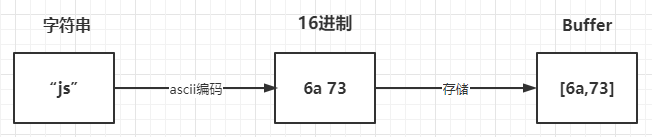


## 二、使用方法

`Buffer` 类在全局作用域中，无须`require`导入

创建`Buffer`的方法有很多种，我们讲讲下面的两种常见的形式：

- Buffer.from()

- Buffer.alloc() 

### Buffer.from()

```js
const b1 = Buffer.from('10');
const b2 = Buffer.from('10', 'utf8');
const b3 = Buffer.from([10]);
const b4 = Buffer.from(b3);

console.log(b1, b2, b3, b4); // <Buffer 31 30> <Buffer 31 30> <Buffer 0a> <Buffer 0a>
```

### Buffer.alloc() 

```js
const bAlloc1 = Buffer.alloc(10); // 创建一个大小为 10 个字节的缓冲区
const bAlloc2 = Buffer.alloc(10, 1); // 建一个长度为 10 的 Buffer,其中全部填充了值为 `1` 的字节
console.log(bAlloc1); // <Buffer 00 00 00 00 00 00 00 00 00 00>
console.log(bAlloc2); // <Buffer 01 01 01 01 01 01 01 01 01 01>
```

在上面创建`buffer`后，则能够`toString`的形式进行交互，默认情况下采取`utf8`字符编码形式，如下

```js
const buffer = Buffer.from("你好");
console.log(buffer);
// <Buffer e4 bd a0 e5 a5 bd>
const str = buffer.toString();
console.log(str);
// 你好
```

如果编码与解码不是相同的格式则会出现乱码的情况，如下：

```js
const buffer = Buffer.from("你好","utf-8 ");
console.log(buffer);
// <Buffer e4 bd a0 e5 a5 bd>
const str = buffer.toString("ascii");
console.log(str); 
// d= e%=
```

当设定的范围导致字符串被截断的时候，也会存在乱码情况，如下：

```js
const buf = Buffer.from('Node.js 技术栈', 'UTF-8');

console.log(buf)          // <Buffer 4e 6f 64 65 2e 6a 73 20 e6 8a 80 e6 9c af e6 a0 88>
console.log(buf.length)   // 17

console.log(buf.toString('UTF-8', 0, 9))  // Node.js �
console.log(buf.toString('UTF-8', 0, 11)) // Node.js 技
```

所支持的字符集有如下：

- ascii：仅支持 7 位 ASCII 数据，如果设置去掉高位的话，这种编码是非常快的
- utf8：多字节编码的 Unicode 字符，许多网页和其他文档格式都使用 UTF-8
- utf16le：2 或 4 个字节，小字节序编码的 Unicode 字符，支持代理对（U+10000至 U+10FFFF）
- ucs2，utf16le 的别名
- base64：Base64 编码
- latin：一种把 Buffer 编码成一字节编码的字符串的方式
- binary：latin1 的别名，
- hex：将每个字节编码为两个十六进制字符


## 三、应用场景

`Buffer`的应用场景常常与流的概念联系在一起，例如有如下：

- I/O操作
- 加密解密
- zlib.js


### I/O操作

通过流的形式，将一个文件的内容读取到另外一个文件

```js
const fs = require('fs');

const inputStream = fs.createReadStream('input.txt'); // 创建可读流
const outputStream = fs.createWriteStream('output.txt'); // 创建可写流

inputStream.pipe(outputStream); // 管道读写
```


### 加解密

在一些加解密算法中会遇到使用 `Buffer`，例如 `crypto.createCipheriv` 的第二个参数 `key` 为 `string` 或 `Buffer` 类型


### zlib.js

`zlib.js` 为 `Node.js` 的核心库之一，其利用了缓冲区（`Buffer`）的功能来操作二进制数据流，提供了压缩或解压功能


**要点**：
**作答思路**：

在Node.js中，Buffer是一个用于操作二进制数据的类，它提供了一种高效的方法来处理原始的内存块。Buffer类是JavaScript的一个原生实现，允许JavaScript代码以二进制形式操作数据。

应用场景：

1. **文件读写**：在处理文件时，Buffer可以用来读取或写入二进制数据。
2. **网络通信**：在处理TCP流、文件流或DOM结构时，Buffer可以用来处理二进制数据。
3. **图片和音频处理**：在处理图片、音频或其他媒体文件时，Buffer可以用来操作原始的二进制数据。
4. **加密和解密**：在执行加密或解密操作时，Buffer可以用来处理加密后的二进制数据。

**考察要点**：

1. **Buffer概念**：理解Buffer的基本原理和用途。
2. **应用场景**：了解Buffer在Node.js中的典型应用场景。


---
### 1224. 在没有async await 的时候，koa是怎么实现的洋葱模型?

**难度**：★★☆☆☆ | **题型**：QA | **分类**：全部 / Node.js

**题目**：


**参考答案**：
洋葱模型是一种中间件设计模式，它通过将请求传递给一系列中间件来处理HTTP请求，并在响应返回时再按照相反的顺序执行它们以处理响应。

在没有 `async/await` 的情况下，Koa 可以使用 ES6 中引入的生成器函数（generator functions）来实现洋葱模型。

具体地说，每个中间件都是一个生成器函数，它接收两个参数：ctx和next。ctx是请求上下文对象，包含有关当前请求的所有信息，例如请求头、请求主体等。next是一个指向下一个中间件的函数，当调用next时，它将控制权传递给下一个中间件。

下面是一个简单的 Koa 中间件示例代码：

```javascript
const Koa = require('koa');
const app = new Koa();

app.use(function *(next) {
  console.log('1. Enter middleware 1');
  yield next;
  console.log('5. Exit middleware 1');
});

app.use(function *(next) {
  console.log('2. Enter middleware 2');
  yield next;
  console.log('4. Exit middleware 2');
});

app.use(function *(next) {
  console.log('3. Enter middleware 3');
  this.body = 'Hello, world!';
});

app.listen(3000);
console.log('Server running on http://localhost:3000');
```

在上述代码中，使用 `function*()` 定义了三个 Generator 函数分别作为三个中间件，通过 `yield next` 实现了中间件之间的顺序调用。运行该程序后，输出结果如下：

```
1. Enter middleware 1
2. Enter middleware 2
3. Enter middleware 3
4. Exit middleware 2
5. Exit middleware 1
```

从输出结果可以看出，Koa 依次执行了三个中间件函数，并按照洋葱模型的顺序依次进入和退出了各个中间件函数。这种方式虽然不如 async/await 方便可读，但仍然可以简洁有效地实现洋葱模型。

需要注意的是，在上述代码中使用的 `yield next` 语句依赖于 `co` 库的支持，因此需要在程序中安装并引入 `co` 库。同时，需要注意遵循 Generator 函数相关规范和编写良好的中间件函数，以保证程序正确和稳定运行。

**要点**：
**答题思路**：

本题考察的是Koa框架在没有`async/await`时的异步处理机制，特别是其如何实现洋葱模型。洋葱模型是Koa中间件处理流程的一种形象描述，即请求和响应像洋葱一样被一层层剥开和包裹。

**考察要点**：

1. **生成器函数（Generator Functions）**：了解ES6中生成器函数的概念，以及它们如何被用于异步编程。
2. **Koa中间件机制**：理解Koa中间件是如何通过生成器函数和`next`函数实现异步控制和顺序执行的。
3. **洋葱模型的具体实现**：掌握在没有`async/await`时，Koa如何通过生成器函数和`yield`关键字来模拟异步流程，从而实现洋葱模型。


---
### 1323. PM2 部署 nodejs 有哪些优势？

**难度**：★★★☆☆ | **题型**：QA | **分类**：全部 / Node.js

**题目**：


**参考答案**：
使用 PM2 部署 Node.js 应用程序有以下优势：

### **1. 进程管理**

- **守护进程**：PM2 可以将 Node.js 应用作为守护进程运行，确保应用在崩溃后自动重启，提高了应用的可用性和稳定性。

### **2. 集群模式**

- **负载均衡**：PM2 支持集群模式，可以启动多个实例并在多个 CPU 核心上运行，充分利用服务器资源，提高性能。

### **3. 日志管理**

- **集中化日志**：PM2 提供了集中化的日志管理，便于查看和分析应用的运行日志、错误日志等，简化了运维工作。

### **4. 监控和指标**

- **实时监控**：PM2 提供了内置的监控功能，可以实时查看应用的 CPU 和内存使用情况，帮助识别性能瓶颈。

### **5. 易于管理**

- **简单的命令行工具**：PM2 提供了直观的命令行界面，可以方便地启动、停止、重启和删除应用，同时支持热重载和零停机部署。

### **6. 配置管理**

- **配置文件支持**：可以通过配置文件（如 `ecosystem.config.js`）来管理应用的启动参数，便于多个环境的配置管理。

### **7. 进程守护**

- **确保运行**：PM2 会监控应用的运行状态，并在应用崩溃或意外停止时自动重启，确保服务持续可用。

### **8. 生态系统集成**

- **与其他工具集成**：PM2 可以与其他工具（如 Docker、Kubernetes）集成，便于在不同环境中部署和管理 Node.js 应用。

**要点**：
PM2 为 Node.js 应用提供了强大的进程管理、负载均衡、日志管理和监控功能，使得开发者能够更加专注于业务逻辑，而无需过多关注应用的运维和性能问题。通过简单的命令行工具和配置管理，PM2 提高了应用的可用性和开发效率，是 Node.js 部署的不错选择。

---
### 1347. 说说对 Node 中的 Stream 的理解？应用场景？

**难度**：★★☆☆☆ | **题型**：QA | **分类**：全部 / Node.js

**题目**：


**参考答案**：
## 一、是什么

流（Stream），是一个数据传输手段，是端到端信息交换的一种方式，而且是有顺序的,是逐块读取数据、处理内容，用于顺序读取输入或写入输出

`Node.js`中很多对象都实现了流，总之它是会冒数据（以 `Buffer` 为单位）

它的独特之处在于，它不像传统的程序那样一次将一个文件读入内存，而是逐块读取数据、处理其内容，而不是将其全部保存在内存中

流可以分成三部分：`source`、`dest`、`pipe`

在`source`和`dest`之间有一个连接的管道`pipe`,它的基本语法是`source.pipe(dest)`，`source`和`dest`就是通过pipe连接，让数据从`source`流向了`dest`，如下图所示：

 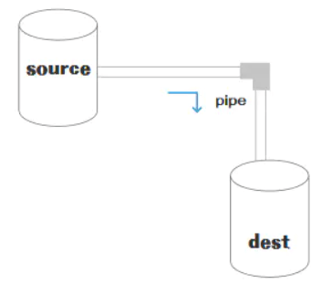


## 二、种类

在`NodeJS`，几乎所有的地方都使用到了流的概念，分成四个种类：

- 可写流：可写入数据的流。例如 fs.createWriteStream()  可以使用流将数据写入文件

- 可读流： 可读取数据的流。例如fs.createReadStream() 可以从文件读取内容

- 双工流： 既可读又可写的流。例如 net.Socket

- 转换流： 可以在数据写入和读取时修改或转换数据的流。例如，在文件压缩操作中，可以向文件写入压缩数据，并从文件中读取解压数据


在`NodeJS`中`HTTP`服务器模块中，`request` 是可读流，`response` 是可写流。还有`fs` 模块，能同时处理可读和可写文件流

可读流和可写流都是单向的，比较容易理解，而另外两个是双向的

### 双工流

之前了解过`websocket`通信，是一个全双工通信，发送方和接受方都是各自独立的方法，发送和接收都没有任何关系

如下图所示：

 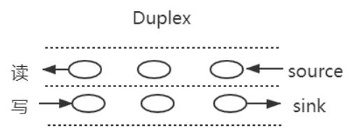

基本代码如下：

```js
const { Duplex } = require('stream');

const myDuplex = new Duplex({
  read(size) {
    // ...
  },
  write(chunk, encoding, callback) {
    // ...
  }
});
```


### 双工流

双工流的演示图如下所示：

 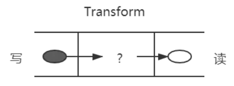

除了上述压缩包的例子，还比如一个 `babel`，把`es6`转换为，我们在左边写入 `es6`，从右边读取 `es5`

基本代码如下所示：

```js
const { Transform } = require('stream');

const myTransform = new Transform({
  transform(chunk, encoding, callback) {
    // ...
  }
});
```


## 三、应用场景

`stream`的应用场景主要就是处理`IO`操作，而`http`请求和文件操作都属于`IO`操作

思想一下，如果一次`IO`操作过大，硬件的开销就过大，而将此次大的`IO`操作进行分段操作，让数据像水管一样流动，知道流动完成

常见的场景有：

- get请求返回文件给客户端
- 文件操作
- 一些打包工具的底层操作


### get请求返回文件给客户端

使用`stream`流返回文件，`res`也是一个`stream`对象，通过`pipe`管道将文件数据返回

```js
const server = http.createServer(function (req, res) {
    const method = req.method; // 获取请求方法
    if (method === 'GET') { // get 请求
        const fileName = path.resolve(__dirname, 'data.txt');
        let stream = fs.createReadStream(fileName);
        stream.pipe(res); // 将 res 作为 stream 的 dest
    }
});
server.listen(8000);
```


### 文件操作

创建一个可读数据流`readStream`，一个可写数据流`writeStream`，通过`pipe`管道把数据流转过去

```js
const fs = require('fs')
const path = require('path')

// 两个文件名
const fileName1 = path.resolve(__dirname, 'data.txt')
const fileName2 = path.resolve(__dirname, 'data-bak.txt')
// 读取文件的 stream 对象
const readStream = fs.createReadStream(fileName1)
// 写入文件的 stream 对象
const writeStream = fs.createWriteStream(fileName2)
// 通过 pipe执行拷贝，数据流转
readStream.pipe(writeStream)
// 数据读取完成监听，即拷贝完成
readStream.on('end', function () {
    console.log('拷贝完成')
})

```


### 一些打包工具的底层操作

目前一些比较火的前端打包构建工具，都是通过`node.js`编写的，打包和构建的过程肯定是文件频繁操作的过程，离不来`stream`，如`gulp`


**要点**：
**作答思路**：

在Node.js中，Stream是一种用于处理流式数据的抽象，它可以以流的形式读取或写入数据。Stream可以是可读的、可写的，或者两者都是。

应用场景：

1. **文件读写**：使用Stream可以高效地读取或写入大文件，避免一次性将文件加载到内存中。
2. **网络通信**：在Node.js中，所有网络操作都是基于Stream进行的，如HTTP请求和响应。
3. **流式数据处理**：在处理大量数据时，可以使用Stream来分批次处理数据，而不是一次性处理所有数据。
4. **实时数据传输**：在需要实时传输数据的应用场景中，可以使用Stream来保证数据的实时性和高效性。

**考察要点**：

1. **Stream概念**：理解Stream的基本原理和用途。
2. **应用场景**：了解Stream在Node.js中的典型应用场景。


---
### 1372. 浏览器和 Node 中的事件循环有什么区别？

**难度**：★★★★☆ | **题型**：QA | **分类**：全部 / JavaScript / Node.js

**题目**：


**参考答案**：
## 浏览器

关于微任务和宏任务在浏览器的执行顺序是这样的：

* 执行一只task（宏任务）
* 执行完micro-task队列 （微任务）

如此循环往复下去

常见的 task（宏任务） 比如：setTimeout、setInterval、script（整体代码）、 I/O 操作、UI 渲染等。
常见的 micro-task 比如: new Promise().then(回调)、MutationObserver(html5新特性) 等。

## Node

Node的事件循环是libuv实现的，引用一张官网的图：

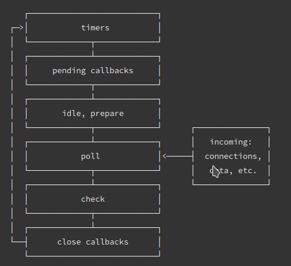

大体的task（宏任务）执行顺序是这样的：

* timers 定时器：本阶段执行已经安排的 setTimeout() 和 setInterval() 的回调函数。
* pending callbacks待定回调：执行延迟到下一个循环迭代的 I/O 回调。
* idle, prepare：仅系统内部使用。
* poll 轮询：检索新的 I/O 事件;执行与 I/O 相关的回调（几乎所有情况下，除了关闭的回调函数，它们由计时器 setImmediate() 排定的之外），其余情况 node 将在此处阻塞。
* check 检测：setImmediate() 回调函数在这里执行。
* close callbacks 关闭的回调函数：一些准备关闭的回调函数，如：socket.on('close', ...)。

微任务和宏任务在Node的执行顺序

Node 10 及以前：

* 执行完一个阶段的所有任务
* 执行完nextTick队列里面的内容
* 然后执行完微任务队列的内容

Node 11以后：
和浏览器的行为统一了，都是每执行一个宏任务就执行完微任务队列。


**要点**：
**作答思路**：

在浏览器中，事件循环是单线程的，包括渲染线程和事件触发线程。事件被添加到事件队列中，然后按照优先级被渲染线程处理。而在Node.js中，事件循环是多线程的，包括主事件循环和I/O事件循环。主事件循环负责执行同步代码，而I/O事件循环则处理异步I/O操作。

**考察要点**：

1. **浏览器事件循环**：理解浏览器中事件循环的基本原理，包括渲染线程和事件触发线程的作用。
2. **Node.js事件循环**：理解Node.js中事件循环的特点，包括主事件循环和I/O事件循环的作用。
3. **线程模型差异**：理解浏览器和Node.js在事件循环方面线程模型的差异，以及这些差异如何影响编程模型。

---
### 1417. 如果让你来设计一个分页功能, 你会怎么设计? 前后端如何交互?

**难度**：★★★☆☆ | **题型**：QA | **分类**：全部 / Node.js

**题目**：


**参考答案**：
## 一、是什么

在我们做数据查询的时候，如果数据量很大，比如几万条数据，放在一个页面显示的话显然不友好，这时候就需要采用分页显示的形式，如每次只显示10条数据


要实现分页功能，实际上就是从结果集中显示第1~10条记录作为第1页，显示第11~20条记录作为第2页，以此类推

因此，分页实际上就是从结果集中截取出第M~N条记录


## 二、如何实现

前端实现分页功能，需要后端返回必要的数据，如总的页数，总的数据量，当前页，当前的数据

```js
{
 "totalCount": 1836,   // 总的条数
 "totalPages": 92,  // 总页数
 "currentPage": 1   // 当前页数
 "data": [     // 当前页的数据
   {
 ...
   }
]
```

后端采用`mysql`作为数据的持久性存储

前端向后端发送目标的页码`page`以及每页显示数据的数量`pageSize`，默认情况每次取10条数据，则每一条数据的起始位置`start`为：

```js
const start = (page - 1) * pageSize
```

当确定了`limit`和`start`的值后，就能够确定`SQL`语句：

```JS
const sql = `SELECT * FROM record limit ${pageSize} OFFSET ${start};`
```

上诉`SQL`语句表达的意思为：截取从`start`到`start`+`pageSize`之间（左闭右开）的数据

关于查询数据总数的`SQL`语句为，`record`为表名：

```mysql
SELECT COUNT(*) FROM record
```

因此后端的处理逻辑为：

- 获取用户参数页码数page和每页显示的数目 pageSize ，其中page 是必须传递的参数，pageSize为可选参数，默认为10
- 编写 SQL 语句，利用 limit 和 OFFSET 关键字进行分页查询
- 查询数据库，返回总数据量、总页数、当前页、当前页数据给前端

代码如下所示：

```js
router.all('/api', function (req, res, next) {
  var param = '';
  // 获取参数
  if (req.method == "POST") {
    param = req.body;
  } else {
    param = req.query || req.params;
  }
  if (param.page == '' || param.page == null || param.page == undefined) {
    res.end(JSON.stringify({ msg: '请传入参数page', status: '102' }));
    return;
  }
  const pageSize = param.pageSize || 10;
  const start = (param.page - 1) * pageSize;
  const sql = `SELECT * FROM record limit ${pageSize} OFFSET ${start};`
  pool.getConnection(function (err, connection) {
    if (err) throw err;
    connection.query(sql, function (err, results) {
      connection.release();
      if (err) {
        throw err
      } else {
        // 计算总页数
        var allCount = results[0][0]['COUNT(*)'];
        var allPage = parseInt(allCount) / 20;
        var pageStr = allPage.toString();
        // 不能被整除
        if (pageStr.indexOf('.') > 0) {
          allPage = parseInt(pageStr.split('.')[0]) + 1;
        }
        var list = results[1];
        res.end(JSON.stringify({ msg: '操作成功', status: '200', totalPages: allPage, currentPage: param.page, totalCount: allCount, data: list }));
      }
    })
  })
});
```


## 三、总结

通过上面的分析，可以看到分页查询的关键在于，要首先确定每页显示的数量`pageSize`，然后根据当前页的索引`pageIndex`（从1开始），确定`LIMIT`和`OFFSET`应该设定的值：

- LIMIT 总是设定为 pageSize
- OFFSET 计算公式为 pageSize * (pageIndex - 1)

确定了这两个值，就能查询出第 `N`页的数据


**要点**：
**作答思路**：

设计分页功能时，一般考虑以下几点：

1. **前后端分离**：前后端分离的架构中，前端负责展示和用户交互，后端负责数据处理和分页逻辑。
2. **API设计**：后端API应该能够接收分页参数，如当前页码、每页显示条数等，并返回分页数据。
3. **数据处理**：后端需要处理数据，计算出分页信息，包括总条数、总页数、当前页数据等。
4. **前端展示**：前端根据后端返回的分页数据，动态生成分页控件和显示当前页数据。


---
### 1421. express 里面的"中间件"和"插件"是同一个东西吗？

**难度**：★★☆☆☆ | **题型**：QA | **分类**：全部 / Node.js

**题目**：


**参考答案**：
在 **Express** 中，**中间件（Middleware）** 和 **插件（Plugin）** 并不是完全一样的概念，虽然它们在某些场景下可能有重叠，但实际上有不同的含义和用途。

### 1. **中间件（Middleware）**
中间件是指在请求-响应周期中间的函数，用于处理请求、响应、以及错误处理等。每个中间件函数都可以访问请求对象（`req`）、响应对象（`res`）和下一个中间件（`next`）。中间件是 Express 框架的核心部分，可以在请求到达路由之前，或响应返回给客户端之前进行处理。

- **功能**：处理请求数据、验证权限、解析请求体、日志记录、处理跨域请求等。
- **用法**：你可以通过 `app.use()`、`app.get()`、`app.post()` 等方法来挂载中间件。

#### 示例：

```javascript
// 例子：一个简单的日志中间件
app.use((req, res, next) => {
  console.log(`${req.method} ${req.url}`);
  next(); // 必须调用 next() 才能继续下一个中间件
});
```

- **顺序性**：中间件是有执行顺序的，Express 按照添加的顺序执行中间件。
- **作用范围**：中间件可以针对所有路由（全局中间件）或特定的路由路径（局部中间件）进行处理。

### 2. **插件（Plugin）**
插件通常是指可以扩展应用功能的模块或工具，它们通常是一个外部库或包，能为 Express 添加额外的功能。插件可以是中间件的一部分，但更广泛的概念是指任何能够增强或扩展 Express 功能的工具。

在 Express 中，插件通常是通过 `npm` 安装的库，这些库会以中间件的形式集成到你的应用中，也可能会提供一些额外的功能，比如数据库连接、认证、文件上传等。

#### 示例：
- **插件示例**：`express-session`、`body-parser`、`cors` 等，这些都可以视为 Express 插件，它们提供额外的功能，通常是通过中间件的形式使用的。

```javascript
const session = require('express-session');
app.use(session({ secret: 'mySecret', resave: false, saveUninitialized: true }));
```

- 插件不仅仅是中间件，也可能提供其他功能，比如路由管理、扩展请求和响应对象的方法等。

### 中间件和插件的区别：
1. **作用**：
   - **中间件** 是在请求-响应周期中执行的函数，用于处理请求和响应。
   - **插件** 是外部模块，通常用来扩展 Express 的功能，可能会通过中间件、路由或其他方式集成。

2. **使用方式**：
   - 中间件是手动添加到应用中的（使用 `app.use()` 或 `router.use()`）。
   - 插件通常是通过安装外部库实现，安装后也有可能以中间件的形式添加到应用中。

3. **灵活性**：
   - 中间件通常是开发者在应用中编写的自定义逻辑。
   - 插件是由第三方库或开发者提供的，可以快速扩展应用的功能。

4. **功能范围**：
   - 中间件通常只是在请求-响应周期中起作用，处理特定的逻辑。
   - 插件通常包含更多的功能，可能不仅仅是处理请求，还可以增加额外的应用特性。

### 例子：
- **中间件**：请求日志、中间件验证、权限检查、数据处理。
- **插件**：`express-session`（提供会话管理功能）、`cors`（处理跨域请求）、`body-parser`（解析请求体）。

**要点**：
- **中间件** 是 Express 应用的一部分，用于处理请求和响应，通常由开发者自己编写。
- **插件** 是扩展 Express 功能的外部库，通常通过中间件的方式集成到应用中，但插件的功能不仅限于中间件，它可以是一个独立的工具集。

所以，**中间件** 是一种功能实现方式，而 **插件** 是一种通过集成第三方功能增强应用的机制。

---
### 1469. 说说对 node 子进程的了解

**难度**：★★☆☆☆ | **题型**：QA | **分类**：全部 / Node.js

**题目**：


**参考答案**：
Node.js 的子进程模块允许你创建和管理子进程，以便执行系统命令、运行脚本或处理后台任务。子进程的使用场景包括处理大量计算任务、执行外部命令、并行处理等。Node.js 提供了 `child_process` 模块来支持这些功能。以下是对 Node.js 子进程的详细了解：

### **1. 子进程模块（`child_process`）**

Node.js 的 `child_process` 模块提供了几种创建子进程的方法：

- `exec(command[, options], callback)`：运行一个命令，并且缓冲整个命令的输出，适合处理小型任务。
- `execFile(file[, args][, options], callback)`：直接运行一个可执行文件，不会先启动一个 shell。适合执行外部程序。
- `spawn(command[, args][, options])`：启动一个新进程来执行指定的命令，可以流式处理数据。适合处理长时间运行的任务。
- `fork(modulePath[, args][, options])`：创建一个新的 Node.js 子进程来执行指定的模块，并且自动为子进程建立通信通道。适合在 Node.js 环境中处理并行任务。

### **2. 使用示例**

#### **2.1 exec**

`exec` 适合用于执行简单的系统命令并获取结果：

```javascript
const { exec } = require('child_process');

exec('ls -l', (error, stdout, stderr) => {
  if (error) {
    console.error(`exec error: ${error}`);
    return;
  }
  console.log(`stdout: ${stdout}`);
  console.error(`stderr: ${stderr}`);
});
```

#### **2.2 execFile**

`execFile` 直接运行指定的文件：

```javascript
const { execFile } = require('child_process');

execFile('node', ['--version'], (error, stdout, stderr) => {
  if (error) {
    console.error(`execFile error: ${error}`);
    return;
  }
  console.log(`stdout: ${stdout}`);
  console.error(`stderr: ${stderr}`);
});
```

#### **2.3 spawn**

`spawn` 启动一个新进程，并且可以处理流数据：

```javascript
const { spawn } = require('child_process');

const ls = spawn('ls', ['-l']);

ls.stdout.on('data', (data) => {
  console.log(`stdout: ${data}`);
});

ls.stderr.on('data', (data) => {
  console.error(`stderr: ${data}`);
});

ls.on('close', (code) => {
  console.log(`child process exited with code ${code}`);
});
```

#### **2.4 fork**

`fork` 创建一个新的 Node.js 子进程，并且可以通过 IPC 通信：

**父进程（parent.js）**：

```javascript
const { fork } = require('child_process');

const child = fork('./child.js');

child.on('message', (message) => {
  console.log(`Received message from child: ${message}`);
});

child.send('Hello from parent');
```

**子进程（child.js）**：

```javascript
process.on('message', (message) => {
  console.log(`Received message from parent: ${message}`);
  process.send('Hello from child');
});
```

### **3. 子进程与父进程的通信**

- **标准输入/输出**：子进程可以通过 `stdin`、`stdout` 和 `stderr` 流与父进程通信。
- **IPC（Inter-Process Communication）**：通过 `fork` 创建的子进程可以使用 `process.send()` 和 `process.on('message', callback)` 进行通信。

### **4. 注意事项**

- **资源管理**：需要适当管理子进程的资源，确保子进程在完成任务后正确退出。
- **错误处理**：应处理子进程中的错误，以防止未处理的异常导致程序崩溃。
- **性能影响**：创建和管理大量子进程可能会影响性能，通常需要根据具体场景选择合适的进程管理策略。

通过以上功能，Node.js 的子进程模块能够帮助开发者在 Node.js 环境中实现并行处理和系统命令执行等功能，从而提升应用的处理能力和性能。

**要点**：
子进程的使用场景包括处理大量计算任务、执行外部命令、并行处理等。

---
### 1476. Node性能如何进行监控以及优化？

**难度**：★★★☆☆ | **题型**：QA | **分类**：全部 / Node.js

**题目**：


**参考答案**：
## 一、 是什么

`Node`作为一门服务端语言，性能方面尤为重要，其衡量指标一般有如下：

- CPU
- 内存
- I/O
- 网络


### CPU

主要分成了两部分：

- CPU负载：在某个时间段内，占用以及等待CPU的进程总数
- CPU使用率：CPU时间占用状况，等于 1 - 空闲CPU时间(idle time) / CPU总时间

这两个指标都是用来评估系统当前CPU的繁忙程度的量化指标

`Node`应用一般不会消耗很多的`CPU`，如果`CPU`占用率高，则表明应用存在很多同步操作，导致异步任务回调被阻塞


### 内存指标

内存是一个非常容易量化的指标。 内存占用率是评判一个系统的内存瓶颈的常见指标。 对于Node来说，内部内存堆栈的使用状态也是一个可以量化的指标

```js
// /app/lib/memory.js
const os = require('os');
// 获取当前Node内存堆栈情况
const { rss, heapUsed, heapTotal } = process.memoryUsage();
// 获取系统空闲内存
const sysFree = os.freemem();
// 获取系统总内存
const sysTotal = os.totalmem();

module.exports = {
  memory: () => {
    return {
      sys: 1 - sysFree / sysTotal,  // 系统内存占用率
      heap: heapUsed / heapTotal,   // Node堆内存占用率
      node: rss / sysTotal,         // Node占用系统内存的比例
    }
  }
}
```

- rss：表示node进程占用的内存总量。
- heapTotal：表示堆内存的总量。
- heapUsed：实际堆内存的使用量。
- external ：外部程序的内存使用量，包含Node核心的C++程序的内存使用量

在`Node`中，一个进程的最大内存容量为1.5GB。因此我们需要减少内存泄露


### 磁盘 I/O

硬盘的` IO` 开销是非常昂贵的，硬盘 IO 花费的 CPU 时钟周期是内存的 164000 倍

内存 `IO `比磁盘` IO` 快非常多，所以使用内存缓存数据是有效的优化方法。常用的工具如 `redis`、`memcached `等

并不是所有数据都需要缓存，访问频率高，生成代价比较高的才考虑是否缓存，也就是说影响你性能瓶颈的考虑去缓存，并且而且缓存还有缓存雪崩、缓存穿透等问题要解决


## 二、如何监控

关于性能方面的监控，一般情况都需要借助工具来实现

这里采用`Easy-Monitor 2.0`，其是轻量级的 `Node.js` 项目内核性能监控 + 分析工具，在默认模式下，只需要在项目入口文件 `require` 一次，无需改动任何业务代码即可开启内核级别的性能监控分析

使用方法如下：

在你的项目入口文件中按照如下方式引入，当然请传入你的项目名称：

```js
const easyMonitor = require('easy-monitor');
easyMonitor('你的项目名称');
```

打开你的浏览器，访问 `http://localhost:12333` ，即可看到进程界面

关于定制化开发、通用配置项以及如何动态更新配置项详见官方文档


## 三、如何优化

关于`Node`的性能优化的方式有：

- 使用最新版本Node.js
- 正确使用流 Stream
- 代码层面优化
- 内存管理优化


### 使用最新版本Node.js

每个版本的性能提升主要来自于两个方面：

- V8 的版本更新
- Node.js 内部代码的更新优化


### 正确使用流 Stream

在`Node`中，很多对象都实现了流，对于一个大文件可以通过流的形式发送，不需要将其完全读入内存

```js
const http = require('http');
const fs = require('fs');

// bad
http.createServer(function (req, res) {
    fs.readFile(__dirname + '/data.txt', function (err, data) {
        res.end(data);
    });
});

// good
http.createServer(function (req, res) {
    const stream = fs.createReadStream(__dirname + '/data.txt');
    stream.pipe(res);
});
```


### 代码层面优化

合并查询，将多次查询合并一次，减少数据库的查询次数

```js
// bad
for user_id in userIds 
     let account = user_account.findOne(user_id)

// good
const user_account_map = {}   // 注意这个对象将会消耗大量内存。
user_account.find(user_id in user_ids).forEach(account){
    user_account_map[account.user_id] =  account
}
for user_id in userIds 
    var account = user_account_map[user_id]
```


### 内存管理优化

在 V8 中，主要将内存分为新生代和老生代两代：

- 新生代：对象的存活时间较短。新生对象或只经过一次垃圾回收的对象
- 老生代：对象存活时间较长。经历过一次或多次垃圾回收的对象

若新生代内存空间不够，直接分配到老生代

通过减少内存占用，可以提高服务器的性能。如果有内存泄露，也会导致大量的对象存储到老生代中，服务器性能会大大降低

如下面情况：

```js
const buffer = fs.readFileSync(__dirname + '/source/index.htm');

app.use(
    mount('/', async (ctx) => {
        ctx.status = 200;
        ctx.type = 'html';
        ctx.body = buffer;
        leak.push(fs.readFileSync(__dirname + '/source/index.htm'));
    })
);

const leak = [];
```

`leak`的内存非常大，造成内存泄露，应当避免这样的操作，通过减少内存使用，是提高服务性能的手段之一

而节省内存最好的方式是使用池，其将频用、可复用对象存储起来，减少创建和销毁操作

例如有个图片请求接口，每次请求，都需要用到类。若每次都需要重新new这些类，并不是很合适，在大量请求时，频繁创建和销毁这些类，造成内存抖动

使用对象池的机制，对这种频繁需要创建和销毁的对象保存在一个对象池中。每次用到该对象时，就取对象池空闲的对象，并对它进行初始化操作，从而提高框架的性能


**要点**：
**作答思路：**

在Node.js中，性能监控和优化可以通过以下几种方式进行：

1. **使用Node.js内置工具**：例如使用`process.hrtime()`、`process.memoryUsage()`和`process.cpuUsage()`等方法来监控性能。
2. **使用第三方库**：例如使用`node-heapdump`来监控内存使用情况，使用`node-inspector`来调试和分析代码。
3. **使用性能分析工具**：例如使用`V8`的性能分析工具，如`--prof`和`--trace-gc`等。
4. **使用可视化工具**：例如使用`Performance API`在浏览器中监控Node.js应用的性能。
5. **代码优化**：例如使用`async/await`替代回调函数，避免全局变量，合理使用模块等。
6. **优化Node.js配置**：例如优化`package.json`中的`scripts`，使用`optimizeDeps`或`--build`等。

这些方法中，选择哪种方法取决于具体的需求和场景。

---
### 1603. 如何实现jwt鉴权机制？说说你的思路

**难度**：★★★★☆ | **题型**：QA | **分类**：全部 / Node.js

**题目**：


**参考答案**：
## 一、是什么

JWT（JSON Web Token），本质就是一个字符串书写规范，如下图，作用是用来在用户和服务器之间传递安全可靠的信息


在目前前后端分离的开发过程中，使用`token`鉴权机制用于身份验证是最常见的方案，流程如下：

- 服务器当验证用户账号和密码正确的时候，给用户颁发一个令牌，这个令牌作为后续用户访问一些接口的凭证
- 后续访问会根据这个令牌判断用户时候有权限进行访问

`Token`，分成了三部分，头部（Header）、载荷（Payload）、签名（Signature），并以`.`进行拼接。其中头部和载荷都是以`JSON`格式存放数据，只是进行了编码

 


### header

每个JWT都会带有头部信息，这里主要声明使用的算法。声明算法的字段名为`alg`，同时还有一个`typ`的字段，默认`JWT`即可。以下示例中算法为HS256

```json
{  "alg": "HS256",  "typ": "JWT" } 
```

因为JWT是字符串，所以我们还需要对以上内容进行Base64编码，编码后字符串如下：

```tex
eyJhbGciOiJIUzI1NiIsInR5cCI6IkpXVCJ9        
```


### payload

载荷即消息体，这里会存放实际的内容，也就是`Token`的数据声明，例如用户的`id`和`name`，默认情况下也会携带令牌的签发时间`iat`，通过还可以设置过期时间，如下：

```json
{
  "sub": "1234567890",
  "name": "John Doe",
  "iat": 1516239022
}
```

同样进行Base64编码后，字符串如下：

```tex
eyJzdWIiOiIxMjM0NTY3ODkwIiwibmFtZSI6IkpvaG4gRG9lIiwiaWF0IjoxNTE2MjM5MDIyfQ
```


### Signature

签名是对头部和载荷内容进行签名，一般情况，设置一个`secretKey`，对前两个的结果进行`HMACSHA25`算法，公式如下：

```js
Signature = HMACSHA256(base64Url(header)+.+base64Url(payload),secretKey)
```

一旦前面两部分数据被篡改，只要服务器加密用的密钥没有泄露，得到的签名肯定和之前的签名不一致


## 二、如何实现

`Token`的使用分成了两部分：

- 生成token：登录成功的时候，颁发token
- 验证token：访问某些资源或者接口时，验证token


### 生成 token

借助第三方库`jsonwebtoken`，通过`jsonwebtoken` 的 `sign` 方法生成一个 `token`：

- 第一个参数指的是 Payload

- 第二个是秘钥，服务端特有

- 第三个参数是 option，可以定义 token 过期时间

```js
const crypto = require("crypto"),
  jwt = require("jsonwebtoken");
// TODO:使用数据库
// 这里应该是用数据库存储，这里只是演示用
let userList = [];

class UserController {
  // 用户登录
  static async login(ctx) {
    const data = ctx.request.body;
    if (!data.name || !data.password) {
      return ctx.body = {
        code: "000002", 
        message: "参数不合法"
      }
    }
    const result = userList.find(item => item.name === data.name && item.password === crypto.createHash('md5').update(data.password).digest('hex'))
    if (result) {
      // 生成token
      const token = jwt.sign(  
        {
          name: result.name
        },
        "test_token", // secret
        { expiresIn: 60 * 60 } // 过期时间：60 * 60 s
      );
      return ctx.body = {
        code: "0",
        message: "登录成功",
        data: {
          token
        }
      };
    } else {
      return ctx.body = {
        code: "000002",
        message: "用户名或密码错误"
      };
    }
  }
}

module.exports = UserController;
```

在前端接收到`token`后，一般情况会通过`localStorage`进行缓存，然后将`token`放到`HTTP `请求头`Authorization` 中，关于`Authorization` 的设置，前面要加上 Bearer ，注意后面带有空格

```js
axios.interceptors.request.use(config => {
  const token = localStorage.getItem('token');
  config.headers.common['Authorization'] = 'Bearer ' + token; // 留意这里的 Authorization
  return config;
})
```


### 校验token

使用 `koa-jwt` 中间件进行验证，方式比较简单

```js
/ 注意：放在路由前面
app.use(koajwt({
  secret: 'test_token'
}).unless({ // 配置白名单
  path: [/\/api\/register/, /\/api\/login/]
}))
```

- secret 必须和 sign 时候保持一致
- 可以通过 unless 配置接口白名单，也就是哪些 URL 可以不用经过校验，像登陆/注册都可以不用校验
- 校验的中间件需要放在需要校验的路由前面，无法对前面的 URL 进行校验

获取`token`用户的信息方法如下：

```js
router.get('/api/userInfo',async (ctx,next) =>{    const authorization =  ctx.header.authorization // 获取jwt    const token = authorization.replace('Beraer ','')    const result = jwt.verify(token,'test_token')    ctx.body = result
```


注意：上述的`HMA256`加密算法为单秘钥的形式，一旦泄露后果非常的危险

在分布式系统中，每个子系统都要获取到秘钥，那么这个子系统根据该秘钥可以发布和验证令牌，但有些服务器只需要验证令牌

这时候可以采用非对称加密，利用私钥发布令牌，公钥验证令牌，加密算法可以选择`RS256`


## 三、优缺点

优点：

- json具有通用性，所以可以跨语言
- 组成简单，字节占用小，便于传输
- 服务端无需保存会话信息，很容易进行水平扩展
- 一处生成，多处使用，可以在分布式系统中，解决单点登录问题
- 可防护CSRF攻击

缺点：

- payload部分仅仅是进行简单编码，所以只能用于存储逻辑必需的非敏感信息
- 需要保护好加密密钥，一旦泄露后果不堪设想
- 为避免token被劫持，最好使用https协议


**要点**：
**作答思路**：

实现JWT（JSON Web Token）鉴权机制的基本思路如下：

1. **生成JWT**：在用户登录成功后，服务器端生成一个JWT，并将其发送给前端。
2. **前端保存JWT**：前端收到JWT后，将其存储在客户端，通常存储在localStorage或sessionStorage中。
3. **发送JWT**：前端在每次与服务器端通信时，将JWT作为请求头（如Authorization: Bearer <token>）发送给服务器端。
4. **服务器端验证JWT**：服务器端收到请求后，从请求头中提取JWT，并验证其有效性。
5. **访问控制**：根据JWT中的信息，服务器端决定是否允许用户访问受保护的资源。

**考察要点**：

1. **JWT生成**：理解服务器端如何生成JWT，包括签名的算法、密钥等。
2. **JWT存储和传递**：理解前端如何存储和传递JWT，以及JWT在请求头中的格式。
3. **JWT验证**：理解服务器端如何验证JWT的有效性，包括验证签名和检查过期时间。
4. **访问控制逻辑**：理解服务器端如何根据JWT中的信息控制用户对资源的访问。


---
### 1654. Node.js 是单线程的，那该如何充分利用多核 CPU 呢？

**难度**：★★★☆☆ | **题型**：QA | **分类**：全部 / Node.js

**题目**：


**参考答案**：
虽然 Node.js 是单线程运行的，但可以通过多种方式利用多核 CPU 来提升性能，尤其是在需要处理大量并发请求或计算密集型任务时。

以下是常用的多核利用方案：

### 1. **使用 Cluster 模块**
   - **原理**：Cluster 模块可以轻松地创建多个 Node.js 进程（称为工作进程），每个进程都运行相同的代码，并共享相同的服务器端口。
   - **实现**：在主进程中创建多个子进程，每个子进程独立运行，分配给 CPU 核心，让多个进程共享负载。Cluster 模块会自动根据系统的核心数量生成对应数量的子进程，以提高多核利用率。

   **示例代码**：
   ```javascript
   const cluster = require('cluster');
   const http = require('http');
   const numCPUs = require('os').cpus().length;

   if (cluster.isMaster) {
     console.log(`主进程 ${process.pid} 正在运行`);

     // 为每个 CPU fork 一个工作进程
     for (let i = 0; i < numCPUs; i++) {
       cluster.fork();
     }

     cluster.on('exit', (worker, code, signal) => {
       console.log(`工作进程 ${worker.process.pid} 已退出`);
       // 这里可以设置重新 fork 新的进程，以保证服务的高可用
       cluster.fork();
     });
   } else {
     // 工作进程可以共享相同的 TCP 连接
     http.createServer((req, res) => {
       res.writeHead(200);
       res.end('Hello World\n');
     }).listen(8000);

     console.log(`工作进程 ${process.pid} 已启动`);
   }
   ```

### 2. **使用 Child Process 模块**
   - **原理**：`child_process` 模块允许 Node.js 创建独立的子进程并与主进程进行通信，适用于需要在主进程之外完成计算密集型任务的情况。
   - **实现**：通过 `fork()`、`exec()`、`spawn()` 等方法创建子进程并执行任务，可以利用不同的 CPU 核心来分担计算负载。

   **示例代码**：
   ```javascript
   const { fork } = require('child_process');

   // 创建一个子进程
   const compute = fork('./compute.js'); // 假设有一个计算密集型的文件 compute.js

   compute.on('message', result => {
     console.log('从子进程收到结果:', result);
   });

   // 发送任务到子进程
   compute.send('开始计算');
   ```

### 3. **使用 Worker Threads 模块**
   - **原理**：Worker Threads 模块允许在单个 Node.js 进程中创建多个线程，用于运行 JavaScript。每个线程都有自己的事件循环，适合计算密集型任务且避免了进程间的资源开销。
   - **实现**：在主线程中启动多个 worker 线程来并行处理任务，通过共享 `SharedArrayBuffer` 或传递消息实现数据共享与通信。

   **示例代码**：
   ```javascript
   const { Worker, isMainThread, parentPort, workerData } = require('worker_threads');

   if (isMainThread) {
     // 主线程
     const worker = new Worker(__filename, { workerData: 42 });
     worker.on('message', (message) => {
       console.log('主线程收到消息:', message);
     });
   } else {
     // 子线程
     const result = workerData * 2; // 简单的计算任务
     parentPort.postMessage(result);
   }
   ```

### 4. **负载均衡和反向代理**
   - **原理**：通过 Nginx 或 PM2 等工具对多个 Node.js 进程进行负载均衡，将请求分配给不同进程以充分利用多核 CPU。
   - **实现**：例如使用 Nginx 作为反向代理，配置多个 Node.js 服务实例并进行轮询分发；或使用 PM2 启动集群模式，自动管理 Node.js 进程和多核利用。

### 5. **使用 PM2 集群模式**
   - **原理**：PM2 是一个强大的进程管理器，支持多核自动分配。它可以一键启动多个 Node.js 实例，让每个实例利用不同的 CPU 核心，并管理进程状态，自动重启失败进程。
   - **实现**：PM2 的集群模式可根据服务器的 CPU 核心数量自动启动等量的进程。

   **命令示例**：
   ```bash
   pm2 start app.js -i max  # 自动根据 CPU 核数启动进程
   pm2 start app.js -i 4    # 手动指定 4 个进程
   ```

**要点**：
Node.js 可以通过 Cluster 模块、Child Process 模块、Worker Threads 模块、PM2 集群模式和负载均衡等方式充分利用多核 CPU。选择方案时应根据应用的特性和场景来决定，计算密集型任务推荐 Worker Threads，而 PM2 是生产环境中简单且稳定的多核管理工具。

---
### 1678. npm 是什么？

**难度**：★☆☆☆☆ | **题型**：QA | **分类**：全部 / JavaScript / Node.js

**题目**：


**参考答案**：
npm是Node.js的包管理工具，它的诞生也极大的促进了前端的发展，在现代前端开发中都离不开npm的身影。

常见的使用场景有以下几种：

* 允许用户从NPM服务器下载别人编写的第三方包到本地使用。
* 允许用户从NPM服务器下载并安装别人编写的命令行程序到本地使用。
* 允许用户将自己编写的包或命令行程序上传到NPM服务器供别人使用。


---
### 1793. 说说 Node 文件查找的优先级以及 Require 方法的文件查找策略?

**难度**：★★★☆☆ | **题型**：QA | **分类**：全部 / Node.js

**题目**：


**参考答案**：
## 一、模块规范

`NodeJS`对`CommonJS`进行了支持和实现，让我们在开发`node`的过程中可以方便的进行模块化开发：

- 在Node中每一个js文件都是一个单独的模块
- 模块中包括CommonJS规范的核心变量：exports、module.exports、require
- 通过上述变量进行模块化开发

而模块化的核心是导出与导入，在`Node`中通过`exports`与`module.exports`负责对模块中的内容进行导出，通过`require`函数导入其他模块（自定义模块、系统模块、第三方库模块）中的内容


## 二、查找策略

`require`方法接收一下几种参数的传递：

- 原生模块：http、fs、path等
- 相对路径的文件模块：./mod或../mod
- 绝对路径的文件模块：/pathtomodule/mod
- 目录作为模块：./dirname
- 非原生模块的文件模块：mod

`require`参数较为简单，但是内部的加载却是十分复杂的，其加载优先级也各自不同，如下图：

 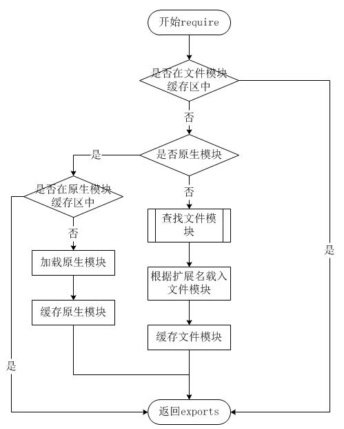

从上图可以看见，文件模块存在缓存区，寻找模块路径的时候都会优先从缓存中加载已经存在的模块


### 原生模块

而像原生模块这些，通过`require `方法在解析文件名之后，优先检查模块是否在原生模块列表中，如果在则从原生模块中加载


### 绝对路径、相对路径

如果`require`绝对路径的文件，则直接查找对应的路径，速度最快

相对路径的模块则相对于当前调用`require`的文件去查找

如果按确切的文件名没有找到模块，则 `NodeJs` 会尝试带上 `.js`、`.json `或 `.node `拓展名再加载


### 目录作为模块

默认情况是根据根目录中`package.json`文件的`main`来指定目录模块，如：

```json
{ "name" : "some-library",
  "main" : "main.js" }
```

如果这是在` ./some-library node_modules `目录中，则 `require('./some-library')` 会试图加载 `./some-library/main.js`

如果目录里没有 `package.json`文件，或者 `main`入口不存在或无法解析，则会试图加载目录下的 `index.js` 或 `index.node` 文件


### 非原生模块

在每个文件中都存在`module.paths`，表示模块的搜索路径，`require`就是根据其来寻找文件

在`window`下输出如下：

```js
[ 'c:\\nodejs\\node_modules',
'c:\\node_modules' ]
```

可以看出`module path`的生成规则为：从当前文件目录开始查找`node_modules`目录；然后依次进入父目录，查找父目录下的`node_modules`目录，依次迭代，直到根目录下的`node_modules`目录

当都找不到的时候，则会从系统`NODE_PATH`环境变量查找

#### 举个例子：

如果在`/home/ry/projects/foo.js`文件里调用了 `require('bar.js')`，则 Node.js 会按以下顺序查找：

- /home/ry/projects/node_modules/bar.js
- /home/ry/node_modules/bar.js
- /home/node_modules/bar.js
- /node_modules/bar.js

这使得程序本地化它们的依赖，避免它们产生冲突


## 三、总结

通过上面模块的文件查找策略之后，总结下文件查找的优先级：

- 缓存的模块优先级最高

- 如果是内置模块，则直接返回，优先级仅次缓存的模块
- 如果是绝对路径 / 开头，则从根目录找
- 如果是相对路径 ./开头，则从当前require文件相对位置找
- 如果文件没有携带后缀，先从js、json、node按顺序查找
- 如果是目录，则根据 package.json的main属性值决定目录下入口文件，默认情况为 index.js
- 如果文件为第三方模块，则会引入 node_modules 文件，如果不在当前仓库文件中，则自动从上级递归查找，直到根目录


**要点**：
**作答思路：**

在Node.js中，文件查找的优先级是从内向外依次查找，直到找到匹配的文件为止。具体顺序如下：

1. **模块的缓存**：如果当前模块的缓存中有该文件，直接返回。
2. **模块的目录**：检查模块的目录下是否有该文件。
3. **node_modules目录**：检查当前模块的`node_modules`目录下是否有该文件。
4. **上级目录的node_modules**：检查上级目录的`node_modules`目录下是否有该文件。
5. **全局安装的模块**：检查全局安装的模块目录下是否有该文件。
Require方法的文件查找策略是先在模块的缓存中查找，如果缓存中没有，则按照上述优先级从内向外查找。
**考察要点**：
1. **文件查找优先级**：理解Node.js中文件查找的优先级顺序。
2. **Require方法查找策略**：理解Require方法如何查找文件，以及查找顺序。


---
### 1824. 说说对中间件概念的理解，如何封装 node 中间件？

**难度**：★★★☆☆ | **题型**：QA | **分类**：全部 / Node.js

**题目**：


**参考答案**：
## 一、是什么

中间件（Middleware）是介于应用系统和系统软件之间的一类软件，它使用系统软件所提供的基础服务（功能），衔接网络上应用系统的各个部分或不同的应用，能够达到资源共享、功能共享的目的

在`NodeJS`中，中间件主要是指封装`http`请求细节处理的方法

例如在`express`、`koa`等`web`框架中，中间件的本质为一个回调函数，参数包含请求对象、响应对象和执行下一个中间件的函数

 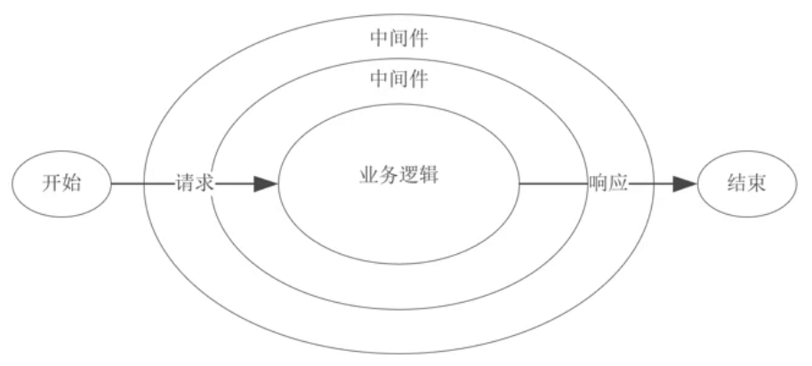

在这些中间件函数中，我们可以执行业务逻辑代码，修改请求和响应对象、返回响应数据等操作


## 二、封装

`koa`是基于`NodeJS`当前比较流行的`web`框架，本身支持的功能并不多，功能都可以通过中间件拓展实现。通过添加不同的中间件，实现不同的需求，从而构建一个 `Koa` 应用

`Koa` 中间件采用的是洋葱圈模型，每次执行下一个中间件传入两个参数：

- ctx ：封装了request 和  response 的变量
- next ：进入下一个要执行的中间件的函数

 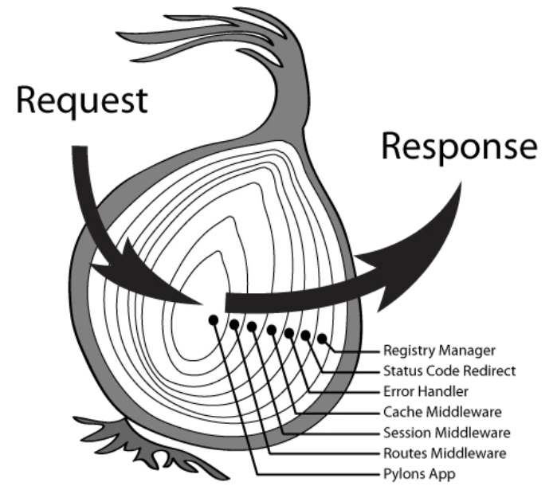


下面就针对`koa`进行中间件的封装：

`Koa `的中间件就是函数，可以是` async` 函数，或是普通函数

```js
// async 函数
app.use(async (ctx, next) => {
  const start = Date.now();
  await next();
  const ms = Date.now() - start;
  console.log(`${ctx.method} ${ctx.url} - ${ms}ms`);
});

// 普通函数
app.use((ctx, next) => {
  const start = Date.now();
  return next().then(() => {
    const ms = Date.now() - start;
    console.log(`${ctx.method} ${ctx.url} - ${ms}ms`);
  });
});
```

下面则通过中间件封装`http`请求过程中几个常用的功能：

### token校验

```js
module.exports = (options) => async (ctx, next) {
  try {
    // 获取 token
    const token = ctx.header.authorization
    if (token) {
      try {
          // verify 函数验证 token，并获取用户相关信息
          await verify(token)
      } catch (err) {
        console.log(err)
      }
    }
    // 进入下一个中间件
    await next()
  } catch (err) {
    console.log(err)
  }
}
```

### 日志模块

```js
const fs = require('fs')
module.exports = (options) => async (ctx, next) => {
  const startTime = Date.now()
  const requestTime = new Date()
  await next()
  const ms = Date.now() - startTime;
  let logout = `${ctx.request.ip} -- ${requestTime} -- ${ctx.method} -- ${ctx.url} -- ${ms}ms`;
  // 输出日志文件
  fs.appendFileSync('./log.txt', logout + '\n')
}
```

`Koa`存在很多第三方的中间件，如`koa-bodyparser`、`koa-static`等

下面再来看看它们的大体的简单实现：

### koa-bodyparser

`koa-bodyparser` 中间件是将我们的 `post` 请求和表单提交的查询字符串转换成对象，并挂在 `ctx.request.body` 上，方便我们在其他中间件或接口处取值

```js
// 文件：my-koa-bodyparser.js
const querystring = require("querystring");

module.exports = function bodyParser() {
    return async (ctx, next) => {
        await new Promise((resolve, reject) => {
            // 存储数据的数组
            let dataArr = [];

            // 接收数据
            ctx.req.on("data", data => dataArr.push(data));

            // 整合数据并使用 Promise 成功
            ctx.req.on("end", () => {
                // 获取请求数据的类型 json 或表单
                let contentType = ctx.get("Content-Type");

                // 获取数据 Buffer 格式
                let data = Buffer.concat(dataArr).toString();

                if (contentType === "application/x-www-form-urlencoded") {
                    // 如果是表单提交，则将查询字符串转换成对象赋值给 ctx.request.body
                    ctx.request.body = querystring.parse(data);
                } else if (contentType === "applaction/json") {
                    // 如果是 json，则将字符串格式的对象转换成对象赋值给 ctx.request.body
                    ctx.request.body = JSON.parse(data);
                }

                // 执行成功的回调
                resolve();
            });
        });

        // 继续向下执行
        await next();
    };
};
```


### koa-static

 `koa-static` 中间件的作用是在服务器接到请求时，帮我们处理静态文件

```js
const fs = require("fs");
const path = require("path");
const mime = require("mime");
const { promisify } = require("util");

// 将 stat 和 access 转换成 Promise
const stat = promisify(fs.stat);
const access = promisify(fs.access)

module.exports = function (dir) {
    return async (ctx, next) => {
        // 将访问的路由处理成绝对路径，这里要使用 join 因为有可能是 /
        let realPath = path.join(dir, ctx.path);

        try {
            // 获取 stat 对象
            let statObj = await stat(realPath);

            // 如果是文件，则设置文件类型并直接响应内容，否则当作文件夹寻找 index.html
            if (statObj.isFile()) {
                ctx.set("Content-Type", `${mime.getType()};charset=utf8`);
                ctx.body = fs.createReadStream(realPath);
            } else {
                let filename = path.join(realPath, "index.html");

                // 如果不存在该文件则执行 catch 中的 next 交给其他中间件处理
                await access(filename);

                // 存在设置文件类型并响应内容
                ctx.set("Content-Type", "text/html;charset=utf8");
                ctx.body = fs.createReadStream(filename);
            }
        } catch (e) {
            await next();
        }
    }
}
```


## 三、总结

在实现中间件时候，单个中间件应该足够简单，职责单一，中间件的代码编写应该高效，必要的时候通过缓存重复获取数据

`koa`本身比较简洁，但是通过中间件的机制能够实现各种所需要的功能，使得`web`应用具备良好的可拓展性和组合性

通过将公共逻辑的处理编写在中间件中，可以不用在每一个接口回调中做相同的代码编写，减少了冗杂代码，过程就如装饰者模式


**要点**：
**做答思路**：

中间件是Node.js中的一个核心概念，用于扩展和修改HTTP请求和响应。它是一个函数，可以访问请求对象（`req`）、响应对象（`res`）和下一个中间件函数。
封装Node中间件的基本步骤如下：

1. **定义中间件函数**：创建一个函数，接受`req`、`res`和`next`作为参数。
2. **执行中间件逻辑**：在中间件函数中执行所需的操作，如日志记录、身份验证、错误处理等。
3. **调用下一个中间件**：如果需要继续执行后续的中间件，调用`next()`。
示例代码：

```javascript
function myMiddleware(req, res, next) {
  console.log('中间件执行');
  next(); // 继续执行下一个中间件
}
app.use(myMiddleware);
```

**考察要点**：

1. **中间件概念**：理解中间件的作用和用途。
2. **中间件定义**：了解如何定义一个中间件函数。
3. **中间件执行流程**：理解中间件的执行顺序和如何调用下一个中间件。


---
### 1842. 在没有async/await 的时候, koa是怎么实现的洋葱模型？

**难度**：★★☆☆☆ | **题型**：QA | **分类**：全部 / Node.js

**题目**：


**参考答案**：
在没有 `async/await` 的情况下，Koa 通过生成器函数（generator functions）实现了洋葱模型（onion model）的中间件机制。生成器函数是 ES6 引入的一种新的函数类型，它允许函数在执行过程中暂停和恢复。Koa 利用生成器函数的 `yield` 关键字来控制中间件的执行顺序，实现了洋葱模型的调用和处理机制。

### **洋葱模型的概念**

洋葱模型表示中间件的执行顺序类似洋葱的层次结构。中间件按顺序执行（进入洋葱），在每个中间件执行完后，再回到之前的中间件（离开洋葱），这种模式确保了请求处理和响应的过程。

### **Koa 的实现**

在 Koa 中，洋葱模型的实现依赖于生成器函数和 `yield`。以下是如何通过生成器函数实现洋葱模型的示例：

#### **1. 创建中间件**

每个中间件是一个生成器函数，使用 `yield` 来暂停执行，等待下一个中间件完成后再继续执行。

```javascript
const Koa = require('koa');
const app = new Koa();

// 中间件 1
function middleware1(next) {
  return function* () {
    console.log('Enter Middleware 1');
    yield next(); // 暂停执行，等待下一个中间件
    console.log('Exit Middleware 1');
  }
}

// 中间件 2
function middleware2(next) {
  return function* () {
    console.log('Enter Middleware 2');
    yield next(); // 暂停执行，等待下一个中间件
    console.log('Exit Middleware 2');
  }
}

// 中间件 3
function middleware3(next) {
  return function* () {
    console.log('Enter Middleware 3');
    yield next(); // 暂停执行，等待下一个中间件
    console.log('Exit Middleware 3');
  }
}

// 应用中间件
app.use(middleware1(middleware2(middleware3(() => {
  console.log('Final handler');
}))));

app.listen(3000);
```

#### **2. Koa 的中间件执行流程**

1. **请求进入**：从最外层的中间件开始执行。
2. **执行中间件**：依次进入每个中间件，直到最内部的中间件完成。
3. **响应返回**：从最内部的中间件开始回退，依次执行 `yield` 后面的代码，最终返回到最外层中间件。

#### **3. 实现细节**

- **生成器函数**：中间件函数返回一个生成器函数，该生成器函数接受一个 `next` 函数作为参数，`next` 表示下一个中间件。
- **`yield` 操作**：`yield next()` 暂停中间件的执行，等待下一个中间件完成后再继续执行当前中间件的剩余部分。
- **中间件链**：中间件按照链式调用的方式连接起来，每个中间件的 `next` 都是下一个中间件的生成器函数。

**要点**：
- **生成器函数**：Koa 使用生成器函数来实现洋葱模型，通过 `yield` 暂停和恢复中间件的执行。
- **洋葱模型**：请求进入每个中间件时，执行链条的顺序；响应返回时，中间件按相反顺序执行。
- **中间件链**：中间件通过链式调用连接起来，形成执行和处理的层次结构。

---
### 1854. body-parser 这个中间件是做什么用的？

**难度**：★★★☆☆ | **题型**：QA | **分类**：全部 / Node.js

**题目**：


**参考答案**：
`body-parser` 是一个 Node.js 中间件，用于解析 HTTP 请求中的请求体（RequestBody），并将其转换为 JSON 格式或其他格式的数据对象。它可以帮助开发者方便地从 POST、PUT、DELETE 等请求中获取请求体数据，并进行相应的处理。

具体来说，`body-parser` 支持以下几种请求体数据格式：

1. JSON 格式：通过 `json()` 方法解析 JSON 格式的请求体数据，并将其转换为 JavaScript 对象。

2. URL 编码格式：通过 `urlencoded()` 方法解析 URL 编码格式的请求体数据，并将其转换为 JavaScript 对象。

3. 多部分数据格式：通过 `multipart()` 方法解析多部分数据格式的请求体数据，并将其转换为 JavaScript 对象。

下面是一个简单的使用 `body-parser` 解析请求体数据的示例代码：

```javascript
const express = require('express');
const bodyParser = require('body-parser');

const app = express();

// 解析 URL 编码格式的请求体数据
app.use(bodyParser.urlencoded({ extended: false }));

// 解析 JSON 格式的请求体数据
app.use(bodyParser.json());

// 处理 POST 请求
app.post('/api/login', (req, res) => {
  const { username, password } = req.body;
  console.log(`username: ${username}`);
  console.log(`password: ${password}`);
  res.send('Login Success!');
});

app.listen(3000, () => {
  console.log('Server running on http://localhost:3000');
});
```

上面使用 `body-parser` 中间件分别解析了 URL 编码格式和 JSON 格式的请求体数据，并通过 `req.body` 获取请求体数据对象。在 POST 请求的处理函数中，打印了用户输入的用户名和密码，并返回了一个登录成功的响应消息。

在使用 `body-parser` 中间件时，需要根据实际情况选择合适的解析方法，并注意配置参数，以防止出现安全漏洞和错误数据。同时，在处理 HTTP 请求时，需要对请求体数据进行有效性验证和安全性检查，以保证数据的可靠性和完整性。

**要点**：
**答题思路**：

`body-parser` 是一个流行的 Node.js 中间件，主要用于解析传入的请求体（request body），以便开发者可以在请求处理程序中以易于访问的格式（如对象）获取这些数据。

**考察要点**：

- **请求体解析**：理解 `body-parser` 如何将 HTTP 请求体中的原始数据（如 JSON、Buffer、字符串等）解析成 JavaScript 对象或其他格式。
- **中间件的作用**：了解在 Node.js 或类似框架（如 Express）中，中间件如何插入到请求处理流程中，以执行特定的任务（如请求体解析）。


---
### 1878. pm2守护进程的原理是什么?

**难度**：★★★☆☆ | **题型**：QA | **分类**：全部 / Node.js

**题目**：


**参考答案**：
 PM2 是一个用于管理 Node.js 进程的工具，它可以在后台启动、守护和监控多个 Node.js 应用程序。PM2 的守护进程原理主要包括以下几个方面：

1. 启动应用：当用户使用 PM2 启动应用时，PM2 会创建一个子进程，并将应用程序作为子进程来启动。同时，PM2 会记录该应用程序的相关信息，如 PID（进程 ID）、状态、日志等，并且会将这些信息保存到 PM2 的数据库中。

2. 监控应用：一旦应用程序被启动，PM2 就会监控它的运行情况。如果应用程序意外退出或发生异常，PM2 将会自动重启应用程序。同时，PM2 会定期检查应用程序的资源占用情况，并且可以根据需要调整进程数、CPU 使用率等参数。

3. 守护进程：为了确保 PM2 能够长时间稳定运行，PM2 本身也需要一个守护进程来监控其运行情况。该守护进程会定期检查 PM2 的健康状态，并且在 PM2 出现异常情况时进行相应的处理，例如重启进程、发送警告通知等。

4. 日志管理：PM2 还提供了丰富的日志管理功能，可以将应用程序的日志导出到文件或远程服务器，并且支持实时查看、过滤等操作。这些日志信息对于排查问题、分析业务数据等都非常有用。

综上所述，PM2 的守护进程原理主要是将应用程序作为子进程启动，并在后台监控其运行情况。同时，PM2 本身也会被一个守护进程来监控和管理，以确保整个系统的稳定性和可靠性。

**要点**：
**答题思路**：

PM2是一个Node.js进程管理器，它通过守护进程来监控和管理Node.js应用的进程。原理是PM2在启动时会创建一个守护进程，这个守护进程会一直运行，并且监控其他Node.js进程。当主进程（主应用）崩溃时，守护进程会重新启动主进程。通过这种方式，PM2确保了应用的高可用性和稳定性。

**考察要点**：

**守护进程的概念**：理解守护进程是什么，以及它在PM2中的作用。

**PM2的工作原理**：了解PM2如何使用守护进程来监控和管理Node.js进程。

**进程监控和重启**：理解PM2如何监控主进程（主应用），并在主进程崩溃时自动重启。


---