# React.js 分类题集

> 共 148 题，摘自前端面试题宝典 https://fe.ecool.fun/topic-list

### 3. React 中，构建组件的方式有哪些？

**难度**：★★★☆☆ | **题型**：QA | **分类**：全部 / React.js

**题目**：


**参考答案**：
在 React 中，构建组件的方式主要有以下几种：

### **1. 函数组件 (Function Components)**

函数组件是最常用的组件形式，使用 JavaScript 函数来定义。自 React Hooks 引入以来，函数组件得到了广泛使用。

```jsx
import React from 'react';

const MyComponent = () => {
  return <div>Hello, Function Component!</div>;
};

export default MyComponent;
```

### **2. 类组件 (Class Components)**

类组件是通过 ES6 的类语法定义的，适合需要使用生命周期方法的场景。虽然现在推荐使用函数组件和 Hooks，但类组件依然在一些老旧代码中存在。

```jsx
import React, { Component } from 'react';

class MyClassComponent extends Component {
  render() {
    return <div>Hello, Class Component!</div>;
  }
}

export default MyClassComponent;
```

### **3. 高阶组件 (Higher-Order Components, HOCs)**

高阶组件是接受一个组件作为参数并返回一个新的组件的函数。这种模式用于代码复用和逻辑封装。

```jsx
import React from 'react';

const withExtraInfo = (WrappedComponent) => {
  return (props) => {
    return (
      <div>
        <WrappedComponent {...props} />
        <p>Additional Info</p>
      </div>
    );
  };
};

export default withExtraInfo;
```

### **4. 组合组件 (Composition Components)**

通过组合多个小组件来构建复杂组件。使用组合的方式可以提高组件的复用性和可维护性。

```jsx
const ParentComponent = () => (
  <div>
    <ChildComponentA />
    <ChildComponentB />
  </div>
);
```

### **5. Render Props**

通过将一个函数作为 props 传递给组件，允许调用该函数来控制组件的渲染。这种模式用于实现复杂的逻辑和状态共享。

```jsx
const DataProvider = ({ render }) => {
  const data = { /* some data */ };
  return render(data);
};

// 使用
<DataProvider render={(data) => <MyComponent data={data} />} />
```

### **6. 自定义 Hook**

虽然不直接构建组件，但自定义 Hook 是一种封装逻辑和状态的方式，可以在函数组件中复用。

```jsx
import { useState, useEffect } from 'react';

const useFetchData = (url) => {
  const [data, setData] = useState(null);

  useEffect(() => {
    fetch(url)
      .then((response) => response.json())
      .then((data) => setData(data));
  }, [url]);

  return data;
};
```

**要点**：
在 React 中，组件可以通过函数组件、类组件、高阶组件、组合组件、Render Props 和自定义 Hook 等多种方式构建。选择合适的组件构建方式，可以提高代码的可读性、复用性和维护性。函数组件与 Hooks 是现代 React 推荐的主要开发方式。

---
### 26. 讲讲 React.memo 和 JS 的 memorize 函数的区别

**难度**：★★★☆☆ | **题型**：QA | **分类**：全部 / React.js

**题目**：


**参考答案**：
React.memo() 和 JS 的 memorize 函数都是用来对函数进行结果缓存，提高函数的性能表现。不过，它们之间还是有一些区别的：

1. **适用范围不同**：React.memo() 主要适用于优化 React 组件的性能表现，而 memorize 函数可以用于任何 JavaScript 函数的结果缓存。
2. **实现方式不同**：React.memo() 是一个 React 高阶组件（HOC），通过浅层比较 props 是否发生变化来决定是否重新渲染组件。而 memorize 函数则是通过将函数的输入参数及其计算结果保存到一个缓存对象中，以避免重复计算相同的结果。
3. **缓存策略不同**：React.memo() 的缓存策略是浅比较（shallow compare），只比较props 的第一层属性值是否相等，不会递归比较深层嵌套对象或数组的内容。而 memorize 函数的缓存策略是将输入参数转换成字符串后，作为缓存的键值。如果传入的参数不是基本类型时，则需要自己实现缓存键值的计算。
4. **应用场景不同**：React.memo() 主要适用于对不经常变化的组件进行性能优化，而 memorize 函数则主要适用于对计算量大、执行时间长的函数进行结果缓存。例如，对于状态不变的组件或纯函数，可以使用 React.memo() 进行优化；对于递归计算、复杂数学运算等耗时操作，可以使用 memorize 函数进行结果缓存。

综上所述，React.memo() 和 JS 的 memorize 函数虽然都是用于提高函数的性能表现，但其适用范围、实现方式、缓存策略和应用场景等方面还是有一定的区别。开发者需要根据具体情况来选择合适的性能优化手段，以提高应用程序的性能和响应速度。


---
### 30. Redux 状态管理器和变量挂载到 window 中有什么区别？

**难度**：★★☆☆☆ | **题型**：QA | **分类**：全部 / React.js

**题目**：


**参考答案**：
Redux 状态管理器和将变量挂载到 `window` 对象上是两种不同的状态管理方法，它们各有优缺点。

### Redux 状态管理器

**优点：**
1. **集中管理**：所有的状态都存储在 Redux store 中，方便管理和调试。
2. **可预测性**：状态变化是通过纯函数（reducers）和明确的 actions 来处理，使得状态变化可预测。
3. **中间件支持**：Redux 支持中间件，比如 `redux-thunk` 或 `redux-saga`，来处理异步操作和副作用。
4. **工具支持**：Redux 有强大的开发工具（如 Redux DevTools）来帮助调试和查看状态的变化。
5. **组件解耦**：通过 `connect` 或 `useSelector` 和 `useDispatch` 等 API，组件可以不直接依赖于具体的状态结构，增强了组件的解耦性和可测试性。

**缺点：**
1. **学习曲线**：对于新手来说，Redux 的概念和使用方式可能会比较复杂。
2. **样板代码**：Redux 的使用通常需要大量的样板代码，比如 actions、reducers 和 action creators。

### 变量挂载到 `window`

**优点：**
1. **简单直接**：直接在 `window` 对象上挂载变量可以快速实现简单的状态共享。
2. **易于访问**：全局变量可以在应用的任何地方直接访问，方便使用。

**缺点：**
1. **全局污染**：将变量挂载到 `window` 对象上可能会导致全局命名空间污染，容易引发命名冲突。
2. **不易维护**：随着应用的增长，全局变量可能会变得难以管理和维护。
3. **缺乏结构**：没有像 Redux 那样的结构化和规范化，状态管理变得不够一致和可预测。
4. **调试困难**：全局状态的变化不容易追踪，缺乏系统化的调试工具和机制。

总的来说，Redux 适合于需要复杂状态管理和维护的大型应用，而挂载到 `window` 可能适用于小型项目或简单的全局状态需求。

**要点**：
1. **概念区分**：
   - **Redux**：一个专门的状态管理库，用于集中管理和处理应用状态。
   - **挂载到 `window`**：直接在全局对象上创建全局变量，用于状态共享。

2. **优点**：
   - **Redux**：
     - 集中管理状态。
     - 状态变化可预测。
     - 支持中间件，处理异步操作。
     - 强大的开发工具支持。
     - 组件解耦。
   - **挂载到 `window`**：
     - 简单直接。
     - 易于访问。

3. **缺点**：
   - **Redux**：
     - 学习曲线较陡。
     - 需要较多的样板代码。
   - **挂载到 `window`**：
     - 全局命名空间污染。
     - 难以维护和管理。
     - 缺乏结构化和规范化。
     - 调试困难。

4. **适用场景**：
   - **Redux**：适合复杂应用和需要结构化管理状态的场景。
   - **挂载到 `window`**：适合简单应用或全局状态需求。


---
### 46. Redux 和 Vuex 有什么区别，它们有什么共同思想吗？

**难度**：★★☆☆☆ | **题型**：QA | **分类**：全部 / React.js

**题目**：


**参考答案**：
## Redux 和 Vuex区别

### 相同点

* state 共享数据
* 流程一致：定义全局state，触发，修改state
* 原理相似，通过全局注入store。

### 不同点

* 从实现原理上来说：
	* Redux 使用的是不可变数据，而Vuex的数据是可变的。Redux每次都是用新的state替换旧的state，而Vuex是直接修改
	* Redux 在检测数据变化的时候，是通过 diff 的方式比较差异的，而Vuex其实和Vue的原理一样，是通过 getter/setter来比较的
* 从表现层来说：
	* vuex定义了state、getter、mutation、action四个对象；redux定义了state、reducer、action。
	* vuex中state统一存放，方便理解；reduxstate依赖所有reducer的初始值
	* vuex有getter,目的是快捷得到state；redux没有这层，react-redux mapStateToProps参数做了这个工作。
	* vuex中mutation只是单纯赋值(很浅的一层)；redux中reducer只是单纯设置新state(很浅的一层)。他俩作用类似，但书写方式不同
	* vuex中action有较为复杂的异步ajax请求；redux中action中可简单可复杂,简单就直接发送数据对象（{type:xxx, your-data}）,复杂需要调用异步ajax（依赖redux-thunk插件）。
	* vuex触发方式有两种commit同步和dispatch异步；redux同步和异步都使用dispatch

通俗点理解就是，vuex 弱化 dispatch，通过commit进行 store状态的一次更变；取消了action概念，不必传入特定的 action形式进行指定变更；弱化reducer，基于commit参数直接对数据进行转变，使得框架更加简易;

## 共同思想

* 单一的数据源
* 变化可以预测

本质上∶ redux与vuex都是对mvvm思想的服务，将数据从视图中抽离的一种方案。


---
### 49. 怎么在代码中判断一个 React 组件是 class component 还是 function component？

**难度**：★★☆☆☆ | **题型**：QA | **分类**：全部 / React.js

**题目**：


**参考答案**：
可以使用JavaScript的`typeof`运算符和React的`Component`类来进行判断。

下面是一个示例的判断方法：

```javascript
function isClassComponent(component) {
  return (
    typeof component === 'function' &&
    !!component.prototype.isReactComponent
  );
}

// 示例用法
const MyComponent = () => <div>Hello, I'm a function component!</div>;
const MyClassComponent = class extends React.Component {
  render() {
    return <div>Hello, I'm a class component!</div>;
  }
};

console.log(isClassComponent(MyComponent)); // false
console.log(isClassComponent(MyClassComponent)); // true
```

上面定义了一个名为`isClassComponent`的函数，它接受一个组件作为参数。函数内部使用`typeof`运算符来判断该组件是否为函数类型，并通过检查`component.prototype.isReactComponent`属性来确定是否为Class组件。


---
### 59. 如何实现一个可以监听任何事件的React Hooks？

**难度**：★★☆☆☆ | **题型**：QA | **分类**：全部 / React.js

**题目**：


**参考答案**：
在 React 中，如果想实现一个可以 **监听任意 DOM 或全局事件的 Hook**，核心思路是：

1. 利用 `useEffect` 做生命周期管理，确保事件绑定和解绑正确；
2. 使用 `useRef` 保存回调函数，避免每次渲染都重新绑定；
3. 支持可配置的事件源（`window`、`document`、任意 DOM 元素）。


## 一、核心 Hook 实现

```js
import { useEffect, useRef } from 'react';

/**
 * useEventListener - 通用事件监听 Hook
 * @param {string} eventName - 事件名
 * @param {function} handler - 事件回调
 * @param {EventTarget} element - 监听目标，默认 window
 */
function useEventListener(eventName, handler, element = window) {
  // 保存 handler 的最新引用，避免每次 render 重新绑定
  const savedHandler = useRef();

  useEffect(() => {
    savedHandler.current = handler;
  }, [handler]);

  useEffect(() => {
    // 确保 element 可用
    const targetElement = element && 'addEventListener' in element ? element : window;
    if (!targetElement) return;

    // 定义事件回调，保证调用最新 handler
    const eventListener = (event) => savedHandler.current(event);

    targetElement.addEventListener(eventName, eventListener);

    // 清理函数
    return () => {
      targetElement.removeEventListener(eventName, eventListener);
    };
  }, [eventName, element]);
}

export default useEventListener;
```

---

## 二、使用示例

### 1. 监听窗口大小变化

```js
import useEventListener from './useEventListener';
import { useState } from 'react';

function WindowSize() {
  const [size, setSize] = useState({ width: window.innerWidth, height: window.innerHeight });

  useEventListener('resize', () => {
    setSize({ width: window.innerWidth, height: window.innerHeight });
  });

  return <div>窗口大小: {size.width} x {size.height}</div>;
}
```

### 2. 监听键盘事件

```js
function KeyLogger() {
  useEventListener('keydown', (e) => {
    console.log('按下的键:', e.key);
  });

  return <div>按下任意键查看控制台日志</div>;
}
```

---

## 三、设计要点

1. **避免重复绑定**：

   * `useRef` 保存 handler，`useEffect` 只在事件类型或目标改变时绑定/解绑；

2. **清理事件**：

   * `useEffect` 返回清理函数，保证组件卸载时不会造成内存泄漏；

3. **支持灵活事件源**：

   * 默认绑定到 `window`，也可以传入任意 `EventTarget` 或 DOM 元素。

4. **可复用性高**：

   * 这个 Hook 可用于监听任意事件，如鼠标、滚动、键盘、拖拽、自定义事件等。


**要点**：
* 核心是 **用 useEffect 管理绑定和解绑、用 useRef 保存最新回调**；
* 可以监听任意事件类型和事件源，保持 Hook 高复用性；
* 保证清理机制，防止内存泄漏。

---
### 83. React 的事件代理机制和原生事件绑定有什么区别？


**难度**：★★☆☆☆ | **题型**：QA | **分类**：全部 / React.js

**题目**：


**参考答案**：
* 事件传播与阻止事件的传播： React 的合成事件并没有实现事件捕获 只支持了事件冒泡。阻止事件传播 React 做了兼容性处理，只需要 e.preventDefault() 即可，原生存在兼容性问题。
* 事件类型：React 是 原生事件类型 的一个子集（React 只是实现了 DOM level3 的事件接口，有些事件 React 并没有实现，比如 window 的 resize 事件。）阻止 React 事件冒泡的行为只能用于 React 合成事件系统，但是 在原生事件中的阻止冒泡行为，却可以阻止 React 合成事件的传播。
* 事件的绑定方式：原生事件系统中支持多种不同的绑定事件的方式，React 中只有一种
* 事件对象：原生中存在 IE 的兼容性问题，React 做了兼容处理。


**要点**：
- **React 的事件代理机制**：
  - 使用事件代理到根节点，减少事件监听器数量。
  - 提供合成事件，确保跨浏览器的一致性。
  - 通过事件池优化性能。

- **原生事件绑定**：
  - 直接在 DOM 元素上绑定事件监听器。
  - 可能导致大量事件监听器，影响性能。
  - 原生事件对象可能存在浏览器兼容性问题。

React 的事件代理机制通过集中处理事件和提供一致的事件 API 来简化事件管理和提高性能，而原生事件绑定则直接操作 DOM 元素，适用于较简单或特定的场景。


---
### 94. state 和 props有什么区别？

**难度**：★☆☆☆☆ | **题型**：QA | **分类**：全部 / React.js

**题目**：


**参考答案**：
## 一、state

一个组件的显示形态可以由数据状态和外部参数所决定，而数据状态就是`state`，一般在 `constructor` 中初始化 

当需要修改里面的值的状态需要通过调用`setState`来改变，从而达到更新组件内部数据的作用，并且重新调用组件`render`方法，如下面的例子：

```jsx
class Button extends React.Component {
    constructor() {
        super();
        this.state = {
            count: 0,
        };
    }

    updateCount() {
        this.setState((prevState, props) => {
            return { count: prevState.count + 1 }
        });
    }

    render() {
        return (<button
                    onClick={() => this.updateCount()}
                    >
                Clicked {this.state.count} times
            </button>);
    }
}
```

`setState`还可以接受第二个参数，它是一个函数，会在`setState`调用完成并且组件开始重新渲染时被调用，可以用来监听渲染是否完成

```js
this.setState({
  name:'JS每日一题'
},()=>console.log('setState finished'))
```

## 二、props

`React`的核心思想就是组件化思想，页面会被切分成一些独立的、可复用的组件

组件从概念上看就是一个函数，可以接受一个参数作为输入值，这个参数就是`props`，所以可以把`props`理解为从外部传入组件内部的数据

`react`具有单向数据流的特性，所以他的主要作用是从父组件向子组件中传递数据

`props`除了可以传字符串，数字，还可以传递对象，数组甚至是回调函数，如下：

```jsx
class Welcome extends React.Component {
  render() {
    return <h1>Hello {this.props.name}</h1>;
  }
}

const element = <Welcome name="Sara" onNameChanged={this.handleName} />;
```

上述`name`属性与`onNameChanged`方法都能在子组件的`props`变量中访问

在子组件中，`props`在内部不可变的，如果想要改变它看，只能通过外部组件传入新的`props`来重新渲染子组件，否则子组件的`props`和展示形式不会改变


## 三、区别

相同点：

- 两者都是 JavaScript 对象
- 两者都是用于保存信息
- props 和 state 都能触发渲染更新

区别：

- props 是外部传递给组件的，而 state 是在组件内被组件自己管理的，一般在 constructor 中初始化
- props 在组件内部是不可修改的，但 state 在组件内部可以进行修改
- state 是多变的、可以修改


**要点**：
### 1. **定义和用途**

#### 1.1 `state` 的定义和用途

- **定义**：`state` 是组件内部的状态对象，由组件本身管理和维护。它存储组件当前的数据和动态信息，随着用户交互或其他事件发生变化。
- **用途**：用于控制组件的可变数据，决定组件的外观和行为。`state` 的变化会触发组件的重新渲染，从而更新 UI。

#### 1.2 `props` 的定义和用途

- **定义**：`props`（属性）是组件的输入参数，由父组件传递给子组件。它是只读的，组件无法修改其 `props`。
- **用途**：用于传递数据和回调函数，使得组件之间可以通信和共享信息。`props` 是组件之间传递数据的唯一途径。

### 2. **可变性**

#### 2.1 `state` 的可变性

- **可变性**：`state` 是可变的，组件可以通过调用 `setState` 或使用 React 的 `useState` 钩子来更新 `state` 的值。这会触发组件的重新渲染。
- **例子**：

     ```javascript
     const [count, setCount] = useState(0);

     const increment = () => {
       setCount(count + 1);
     };
     ```

#### 2.2 `props` 的可变性

- **不可变性**：`props` 是不可变的，组件不能直接修改 `props` 的值。如果父组件传递的 `props` 发生变化，子组件会重新渲染，但子组件不能主动修改 `props`。
- **例子**：

     ```javascript
     function ChildComponent({ title }) {
       return <h1>{title}</h1>;
     }

     function ParentComponent() {
       return <ChildComponent title="Hello World!" />;
     }
     ```

### 3. **生命周期和作用域**

#### 3.1 `state` 的生命周期和作用域

- **生命周期**：`state` 的生命周期与组件的生命周期一致。它在组件挂载时被初始化，在组件卸载时被销毁。
- **作用域**：`state` 仅限于组件内部使用，不会被其他组件直接访问或修改。

#### 3.2 `props` 的生命周期和作用域

- **生命周期**：`props` 的生命周期取决于父组件的传递时机。当父组件重新渲染时，子组件可能会收到新的 `props`。
- **作用域**：`props` 可以在组件之间传递，是组件之间通信的机制，但组件不能改变接收到的 `props`。

### 4. **使用场景**

#### 4.1 何时使用 `state`

- **场景**：当需要在组件内存储和管理动态数据时使用 `state`，如用户输入、表单数据、按钮点击后的状态等。

#### 4.2 何时使用 `props`

- **场景**：当需要从父组件向子组件传递数据或函数时使用 `props`，如配置组件、传递回调函数、共享状态等。

### 5. **示例代码**

```javascript
function Counter() {
  const [count, setCount] = useState(0); // 使用 state 管理组件内部状态

  return (
    <div>
      <p>Count: {count}</p>
      <button onClick={() => setCount(count + 1)}>Increment</button>
    </div>
  );
}

function ParentComponent() {
  return (
    <div>
      <ChildComponent title="This is a prop" />
    </div>
  );
}

function ChildComponent({ title }) {
  return <h1>{title}</h1>; // 使用 props 传递数据
}
```


---
### 130. 使用 redux 有哪些原则？

**难度**：★★★☆☆ | **题型**：QA | **分类**：全部 / React.js

**题目**：


**参考答案**：
### 核心描述

* 单一数据源：整个应用的全局 state 被存储在一棵 object tree 中，并且这个 object tree 只存在于唯一一个 store 中。
* State 是只读的：唯一改变 state 的方法就是触发 action，action 是一个用于描述已发生事情的普通对象。
* 使用纯函数来执行修改：为了描述 action 如何改变 state tree，你需要编写纯的 reducers。

### 知识拓展

* 什么时候应该使用 redux：  
   * 在应用的大量地方，都存在大量的状态  
   * 应用状态会随着时间的推移而频繁更新  
   * 更新该状态的逻辑可能很复杂  
   * 中型和大型代码量的应用，很多人协同开发
* reducer 是一个函数，接收当前的 state 和一个 action 对象，必要时决定如何更新状态，并返回新状态。reducer 必须符合以下规则：  
   * 仅使用 state 和 action 参数计算新的状态值  
   * 禁止直接修改 state。必须通过复制现有的 state 并对复制的值进行更改的方式来做不可变更新  
   * 禁止任何异步逻辑、依赖随机值或导致其他副作用代码
* reducer 遵守上述规则的原因：  
   * redux 的目标之一是使代码可预测。当函数的输出仅根据输入参数计算时，更容易理解该代码的工作原理并对其进行测试  
   * 如果一个函数依赖于自身之外的变量，或者随机行为，你永远不知道运行它时会发生什么  
   * 如果一个函数 mutate 了其他对象，比如它的参数，这可能会意外地改变应用程序的工作方式。这可能是错误的常见来源
* 不可变更新（Immutability），不能在 Redux 中更改 state 的原因：  
   * 会导致bug，例如 UI 未正确更新以显示最新值  
   * 更难理解状态更新的原因和方式  
   * 编写测试变的困难  
   * 打破了正确使用“时间旅行调试”的能力  
   * 违背了 Redux 的预期精神和使用模式


**要点**：
以下是使用 Redux 的主要原则：

### 1. **单一数据源**

- **定义**：整个应用的状态存储在一个称为 **store** 的对象中。
- **优点**：单一数据源使得状态管理更为集中和一致，方便调试和维护。所有组件都可以从同一个状态树中读取数据，而无需担心数据的不同来源可能引起的同步问题。

### 2. **状态是只读的**

- **定义**：唯一改变状态的方式是通过 **dispatch** 一个 **action**。不能直接修改状态，而是要通过动作和处理程序来描述如何更新状态。
- **优点**：保证状态的不可变性，使得状态的变化可预测且易于调试。通过 **actions** 和 **reducers** 来改变状态的过程清晰且可追溯。

### 3. **纯函数（Reducers）**

- **定义**：状态更新的逻辑由 **reducer** 函数定义，这些函数是纯函数。纯函数的定义是：对于相同的输入，总是返回相同的输出，并且没有副作用。
- **优点**：保证了状态更新的确定性和可预测性。每次状态更新都可以通过相同的 `action` 和 `reducer` 得到一致的结果，便于测试和调试。

### 4. **使用 **Action Creators****

- **定义**：使用 **action creators** 函数来创建 **actions**。这些函数返回一个 **action** 对象，而不是直接在组件中编写 **action** 对象。
- **优点**：使 **actions** 的创建和管理更为一致和集中。提高了代码的可读性和可维护性，并且方便管理和复用。

### 5. **中间件（Middleware）**

- **定义**：使用 **middleware** 来扩展 Redux 的功能，例如处理异步操作、日志记录、错误报告等。中间件是处理 **dispatch** 前的功能扩展点。
- **优点**：中间件允许在 **dispatch** 和 **reducer** 之间插入额外的逻辑，使得异步操作、日志记录和其他功能的处理更加灵活和可控。

### 6. **避免在 Reducers 中进行副作用**

- **定义**：**reducers** 不应该有副作用，例如进行 API 请求、修改外部变量等。**reducers** 只应计算下一个状态并返回它。
- **优点**：确保 **reducers** 的纯粹性和可预测性。所有副作用应通过 **middleware**（如 redux-thunk 或 redux-saga）来处理。

### 7. **结构化状态**

- **定义**：设计应用状态的结构时，确保它是平坦的而不是嵌套过深。保持状态的扁平结构可以避免复杂的状态更新逻辑。
- **优点**：平坦的状态结构更易于管理和更新，避免了深层嵌套可能导致的性能问题和更新困难。

### 8. **连接组件**

- **定义**：使用 **connect** 函数（来自 `react-redux`）将 React 组件与 Redux store 连接。组件通过 **mapStateToProps** 和 **mapDispatchToProps** 函数来接收状态和 **dispatch** 方法。
- **优点**：将组件与 Redux store 分离，使得组件更具重用性和可测试性。使组件只关心自己的数据和行为，而不需要知道 Redux 的内部实现。

---
### 131. 说说React render方法的原理？在什么时候会被触发？

**难度**：★★☆☆☆ | **题型**：QA | **分类**：全部 / React.js

**题目**：


**参考答案**：
## 一、原理

首先，`render`函数在`react`中有两种形式：

在类组件中，指的是`render`方法：

```jsx
class Foo extends React.Component {
    render() {
        return <h1> Foo </h1>;
    }
}
```

在函数组件中，指的是函数组件本身：

```js
function Foo() {
    return <h1> Foo </h1>;
}
```

在`render`中，我们会编写`jsx`，`jsx`通过`babel`编译后就会转化成我们熟悉的`js`格式，如下：

```jsx
return (
  <div className='cn'>
    <Header> hello </Header>
    <div> start </div>
    Right Reserve
  </div>
)
```

`babel`编译后：

```js
return (
  React.createElement(
    'div',
    {
      className : 'cn'
    },
    React.createElement(
      Header,
      null,
      'hello'
    ),
    React.createElement(
      'div',
      null,
      'start'
    ),
    'Right Reserve'
  )
)
```

从名字上来看，`createElement`方法用来创建元素的。

在`react`中，这个元素就是虚拟`DOM`树的节点，接收三个参数：

- type：标签
- attributes：标签属性，若无则为null

- children：标签的子节点

这些虚拟`DOM`树最终会渲染成真实`DOM`

在`render`过程中，`React` 将新调用的 `render `函数返回的树与旧版本的树进行比较，这一步是决定如何更新 `DOM` 的必要步骤，然后进行 `diff` 比较，更新 `DOM `树


## 二、触发时机

`render`的执行时机主要分成了两部分：

- 类组件调用 setState 修改状态

```jsx
class Foo extends React.Component {
  state = { count: 0 };

  increment = () => {
    const { count } = this.state;

    const newCount = count < 10 ? count + 1 : count;

    this.setState({ count: newCount });
  };

  render() {
    const { count } = this.state;
    console.log("Foo render");

    return (
      <div>
        <h1> {count} </h1>
        <button onClick={this.increment}>Increment</button>
      </div>
    );
  }
}
```

点击按钮，则调用`setState`方法，无论`count`是否发生变化，控制台都会输出`Foo render`，这就证明`render`执行了

- 函数组件通过`useState hook`修改状态

```jsx
function Foo() {
  const [count, setCount] = useState(0);

  function increment() {
    const newCount = count < 10 ? count + 1 : count;
    setCount(newCount);
  }

  console.log("Foo render");
  
  return (
    <div>
      <h1> {count} </h1>
      <button onClick={increment}>Increment</button>
    </div>
  );
}
```

函数组件通过`useState`这种形式更新数据，当数组的值不发生改变了，就不会触发`render`

- 类组件重新渲染

```js
class App extends React.Component {
  state = { name: "App" };
  render() {
    return (
      <div className="App">
        <Foo />
        <button onClick={() => this.setState({ name: "App" })}>
          Change name
        </button>
      </div>
    );
  }
}

function Foo() {
  console.log("Foo render");

  return (
    <div>
      <h1> Foo </h1>
    </div>
  );
}
```

只要点击了 `App` 组件内的 `Change name` 按钮，不管 `Foo` 具体实现是什么，都会被重新`render`渲染

- 函数组件重新渲染

```jsx
function App(){
    const [name,setName] = useState('App')

    return (
        <div className="App">
            <Foo />
            <button onClick={() => setName("aaa")}>
                { name }
            </button>
      </div>
    )
}

function Foo() {
  console.log("Foo render");

  return (
    <div>
      <h1> Foo </h1>
    </div>
  );
}
```

可以发现，使用`useState`来更新状态的时候，只有首次会触发`Foo render`，后面并不会导致`Foo render`


## 三、总结

`render`函数里面可以编写`JSX`，转化成`createElement`这种形式，用于生成虚拟`DOM`，最终转化成真实`DOM`

在` React` 中，类组件只要执行了 `setState` 方法，就一定会触发 `render` 函数执行，函数组件使用`useState`更改状态不一定导致重新`render`

组件的` props` 改变了，不一定触发 `render` 函数的执行，但是如果 `props` 的值来自于父组件或者祖先组件的 `state`

在这种情况下，父组件或者祖先组件的 `state` 发生了改变，就会导致子组件的重新渲染

所以，一旦执行了`setState`就会执行`render`方法，`useState` 会判断当前值有无发生改变确定是否执行`render`方法，一旦父组件发生渲染，子组件也会渲染

 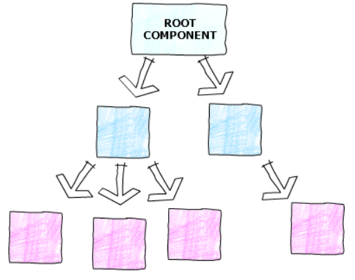


---
### 139. React 中为什么不直接使用 requestIdleCallback？

**难度**：★★★★☆ | **题型**：QA | **分类**：全部 / React.js

**题目**：


**参考答案**：
在React中，使用`requestIdleCallback`直接可能会导致一些问题，因此React并没有直接采用这个API。`requestIdleCallback`是一个浏览器提供的API，用于在浏览器空闲时执行任务，但在React中，有一些特殊的考虑：

1. **一致性问题：** `requestIdleCallback`的执行时机不是完全可控的，这可能导致在不同环境中表现不一致。React希望提供一致的行为，以确保开发者在不同浏览器和设备上获得可预测的性能表现。

2. **实时性问题：** React通常希望能够响应用户输入并立即更新UI，而`requestIdleCallback`执行的时机不一定能够满足实时性的需求。这可能导致用户体验上的问题，特别是在需要快速响应的场景中。

3. **调度器控制：** React内部有一个任务调度器，负责管理和调度任务的执行。直接使用`requestIdleCallback`可能破坏React的任务调度策略，导致不可预测的结果。

为了解决这些问题，React引入了`Scheduler`模块，该模块允许React更好地控制任务的调度和执行。React可以根据自身的需要在不同优先级下安排任务，并确保在保证实时性的同时，提供一致的性能表现。

虽然`requestIdleCallback`是一个有趣的浏览器API，但在React这样的复杂UI库中，需要更高度的控制和一致性，因此React选择了自己实现任务调度和执行的机制。

**要点**：
React 中选择不直接使用 `requestIdleCallback` 主要是因为以下几个原因：

### 1. **兼容性和一致性**

- **浏览器兼容性**：`requestIdleCallback` 并非所有浏览器都支持（特别是在较旧的浏览器中）。React 需要在各种环境中提供一致的性能和用户体验，因此更倾向于使用广泛支持的技术。

### 2. **任务调度的精细控制**

- **优先级控制**：`requestIdleCallback` 主要用于在空闲时间执行低优先级任务，但 React 需要更精细的任务调度和优先级控制，以确保高优先级任务（如用户交互）得到及时处理。React 的调度策略（如 `requestAnimationFrame` 和 `setTimeout`）可以提供更细粒度的控制。

### 3. **任务延迟和调度**

- **调度延迟**：`requestIdleCallback` 可能导致任务延迟较长时间，特别是在浏览器处于繁忙状态时。React 需要在尽可能短的时间内响应用户交互，以保持良好的用户体验。React 的调度机制可以确保重要任务（如更新渲染）尽早完成。

### 4. **维护和可预测性**

- **维护成本**：依赖 `requestIdleCallback` 可能增加代码的复杂性和维护成本，因为它需要处理浏览器兼容性和不同的行为特性。React 的调度机制提供了更可预测的行为和更容易控制的性能优化。

### 5. **现有调度策略**

- **现有策略**：React 已经实现了自己的调度机制（如 `Scheduler` 和 `Fiber`），这些机制已经很好地处理了任务的优先级和调度问题。这些机制能够在适当的时候调度任务，从而优化渲染和交互性能。

### 总结

React 不直接使用 `requestIdleCallback` 是因为它需要更精细的任务调度和优先级控制，以保证高性能的用户体验，并避免潜在的兼容性问题。React 的调度机制能够提供更一致和可控的性能优化，适应不同的环境和需求。

---
### 141. React 的虚拟 DOM 解决了什么问题？

**难度**：★★☆☆☆ | **题型**：QA | **分类**：全部 / React.js

**题目**：


**参考答案**：
在探讨 React 虚拟 DOM（Virtual DOM）所解决的问题时，不能简单地将其归结为“性能更快”，这实际上是一个常见的误区。

从长期的工程实践和框架演进来看，虚拟 DOM 核心解决了以下几个维度的挑战：

### 1. 解决跨平台与抽象层的问题

虚拟 DOM 最本质的贡献在于建立了一层**声明式的抽象**。在传统的 Web 开发中，代码直接耦合在真实的 DOM 环境中。而虚拟 DOM 将复杂的 UI 转换成了一种轻量级的 JavaScript 对象结构（即 VNode）。

这种抽象层使得 React 脱离了浏览器的物理限制。因为 VNode 只是普通的 JS 对象，它不仅可以被渲染为浏览器的 DOM，也可以被渲染为移动端的原生控件（React Native）、服务端字符串（SSR）甚至是 Canvas 绘制指令。它解决了 UI 描述与底层渲染引擎之间的强耦合问题，实现了“一次学习，随处编写”的愿景。

### 2. 解决复杂 UI 状态下的开发效率

在原生 DOM 时代，开发者需要手动管理状态与 UI 的同步。当页面状态变得错综复杂时，命令式的 DOM 操作（如 `appendChild` 或 `removeChild`）会导致代码难以维护且极易出错。

虚拟 DOM 配合 Diff 算法，将“手动更新”转变为“自动收集并批量更新”。开发者只需要关注状态（State）的变化，React 会自动计算出新旧视图的差异并进行补丁式更新。这极大地降低了心智负担，解决了在大规模应用中如何保持代码整洁与状态一致性的难题。

### 3. 解决性能的下限与补丁式优化

虽然手动编写极致优化的原生 DOM 操作在性能上理论上永远优于框架，但在生产环境下，大部分开发者很难在每一处逻辑中都做到最优。虚拟 DOM 实际上是提供了一个**性能下限的保障**。

它通过 Diff 算法避免了频繁且大面积的真实 DOM 重排（Reflow）与重绘（Repaint）。当状态发生多次变化时，虚拟 DOM 会在内存中完成所有的计算和比对，最后只对真实 DOM 进行一次最小化的、批量的修改。它解决的是在不进行精细化手动优化的前提下，依然能让复杂的 Web 应用保持流畅运行的问题。

**要点**：
* **跨平台能力**：通过对象层的抽象，实现了 UI 描述与具体渲染平台的解耦。
* **开发范式转换**：将命令式的 DOM 操作转变为声明式的数据驱动，提升了复杂业务的可维护性。
* **性能兜底**：通过批处理和 Diff 算法，在不增加开发者负担的情况下，减少了不必要的真实 DOM 操作开销。
* **研发效率**：让开发者专注于业务逻辑而非底层 DOM 树的增删改查，降低了出错概率。

---
### 143. React Portals 有什么用？

**难度**：★☆☆☆☆ | **题型**：QA | **分类**：全部 / React.js

**题目**：


**参考答案**：
React Portals 是 React 提供的一种机制，用于将子组件渲染到父组件 DOM 层次结构之外的位置。它在处理一些特殊情况下的 UI 布局或交互时非常有用。以下是一些使用 React Portals 的常见情况：

1. **在模态框中使用：** 当你需要在应用的根 DOM 结构之外显示模态框（对话框）时，React Portals 可以帮助你将模态框的内容渲染到根 DOM 之外的地方，而不影响布局。

2. **处理 z-index 问题：** 在一些复杂的布局中，可能存在 z-index 的层级关系导致组件无法按照预期的方式叠加显示。使用 React Portals 可以将组件渲染到具有更高 z-index 的容器中，以解决这些问题。

3. **在全局位置显示组件：** 如果你希望某个组件在页面的固定位置显示，而不受父组件的定位影响，React Portals 可以将该组件渲染到 body 或其他容器中。

4. **在动画中使用：** 当你需要在页面中的某个位置执行动画时，React Portals 可以帮助你将动画的内容渲染到离该位置更近的 DOM 结构中，以提高动画性能。

使用 React Portals 的基本步骤如下：

```jsx
import React from 'react';
import ReactDOM from 'react-dom';

function MyPortalComponent() {
  return ReactDOM.createPortal(
    // 子组件的内容
    <div>
      This is rendered using a portal!
    </div>,
    // 渲染目标的 DOM 元素
    document.getElementById('portal-root')
  );
}

// 在应用的根组件中渲染 MyPortalComponent
function App() {
  return (
    <div>
      {/* 此处的内容在正常的 DOM 结构中 */}
      <p>This is a normal component.</p>

      {/* 使用 React Portals 渲染到 'portal-root' 元素外 */}
      <MyPortalComponent />
    </div>
  );
}

export default App;
```

在上面的例子中，`MyPortalComponent` 中的内容会被渲染到具有 id 为 'portal-root' 的 DOM 元素里面。


---
### 159. react 中怎么捕获异常？

**难度**：★★★☆☆ | **题型**：QA | **分类**：全部 / React.js

**题目**：


**参考答案**：
## ErrorBoundary   

`EerrorBoundary` 是16版本出来的，之前的 15 版本有`unstable_handleError`。    

关于 `ErrorBoundary` 官网介绍比较详细，它能捕捉以下异常：

* 子组件的渲染
* 生命周期函数
* 构造函数

```js
class ErrorBoundary extends React.Component {
  constructor(props) {
    super(props);
    this.state = { hasError: false };
  }

  componentDidCatch(error, info) {
    // Display fallback UI
    this.setState({ hasError: true });
    // You can also log the error to an error reporting service
    logErrorToMyService(error, info);
  }

  render() {
    if (this.state.hasError) {
      // You can render any custom fallback UI
      return <h1>Something went wrong.</h1>;
    }
    return this.props.children;
  }
}


<ErrorBoundary>
  <MyWidget />
</ErrorBoundary>
```

可以考虑直接使用开源库：[react-error-boundary](https://www.npmjs.com/package/react-error-boundary)，对开发者来说，只需要关心出现错误后的处理。

```js
import {ErrorBoundary} from 'react-error-boundary'

function ErrorFallback({error, resetErrorBoundary}) {
  return (
    <div role="alert">
      <p>Something went wrong:</p>
      <pre>{error.message}</pre>
      <button onClick={resetErrorBoundary}>Try again</button>
    </div>
  )
}

const ui = (
  <ErrorBoundary
    FallbackComponent={ErrorFallback}
    onReset={() => {
      // reset the state of your app so the error doesn't happen again
    }}
  >
    <ComponentThatMayError />
  </ErrorBoundary>
)
```

遗憾的是，`error boundaries` 并不会捕捉这些错误：

* 事件处理程序
* 异步代码 (e.g. setTimeout or requestAnimationFrame callbacks)
* 服务端的渲染代码
* error boundaries自己抛出的错误

原文可见参见官网[introducing-error-boundaries](https://reactjs.org/docs/error-boundaries.html#introducing-error-boundaries)

其实官方也有解决方案：[how-about-event-handlers](https://reactjs.org/docs/error-boundaries.html#how-about-event-handlers)， 就是 try catch.    

```js
  handleClick() {
    try {
      // Do something that could throw
    } catch (error) {
      this.setState({ error });
    }
  }
```

## Error Boundary 之外

我们先看看一张表格，罗列了我们能捕获异常的手段和范围。

| 异常类型                | 同步方法 | 异步方法 | 资源加载 | Promise |  async/await    
| ---                    | :---:   |:---:    |:---:    |:---:    |:---: |
| try/catch              | √       |         |         |         |     √|
| window.onerror         | √       | √       |         |         |      |
| error             | √       | √       | √       |         |      |
| unhandledrejection |         |         |         |√        | √    |

 ### try/catch
 
 可以捕获同步和async/await的异常。 
 
 ### window.onerror , error事件 
 
 ```js
     window.addEventListener('error', this.onError, true);
     window.onerror = this.onError
 ```
 `window.addEventListener('error')` 这种可以比 `window.onerror` 多捕获资源记载异常.
 
 请注意最后一个参数是 `true`, `false`的话可能就不如你期望。   
 
 当然你如果问题这第三个参数的含义，我就有点不想理你了。拜。
 
 ### unhandledrejection
 
 请注意最后一个参数是 `true`。
 
 ```js
 window.removeEventListener('unhandledrejection', this.onReject, true)
 ```
 
其捕获未被捕获的Promise的异常。

### XMLHttpRequest 与 fetch

`XMLHttpRequest` 很好处理，自己有onerror事件。

当然你99.99%也不会自己基于`XMLHttpRequest`封装一个库， `axios` 真香，有这完毕的错误处理机制。

至于`fetch`, 自己带着catch跑，不处理就是你自己的问题了。

其实有一个库 [react-error-catch](https://www.npmjs.com/package/react-error-catch) 是基于ErrorBoudary,error与unhandledrejection封装的一个组件。  

其核心如下

```js
   ErrorBoundary.prototype.componentDidMount = function () {
        // event catch
        window.addEventListener('error', this.catchError, true);
        // async code
        window.addEventListener('unhandledrejection', this.catchRejectEvent, true);
    };
```

使用：

```js
import ErrorCatch from 'react-error-catch'

const App = () => {
  return (
  <ErrorCatch
      app="react-catch"
      user="cxyuns"
      delay={5000}
      max={1}
      filters={[]}
      onCatch={(errors) => {
        console.log('报错咯');
        // 上报异常信息到后端，动态创建标签方式
        new Image().src = `http://localhost:3000/log/report?info=${JSON.stringify(errors)}`
      }}
    >
      <Main />
    </ErrorCatch>)
}

export default 
```

利用error捕获的错误，其最主要的是提供了错误堆栈信息，对于分析错误相当不友好，尤其打包之后。

## 事件处理程序的异常捕获

### 示例

使用[decorator](http://es6.ruanyifeng.com/#docs/decorator)来重写原来的方法。

先看一下使用：

```js

   @methodCatch({ message: "创建订单失败", toast: true, report:true, log:true })
    async createOrder() {
        const data = {...};
        const res = await createOrder();
        if (!res || res.errCode !== 0) {
            return Toast.error("创建订单失败");
        }
        
        .......
        其他可能产生异常的代码
        .......
        
       Toast.success("创建订单成功");
    }
```

注意四个参数：
* message： 出现错误时，打印的错误
* toast： 出现错误，是否Toast
* report: 出现错误，是否上报
* log: 使用使用console.error打印

再看一段代码

```js
  @methodCatch({ message: "创建订单失败", toast: true, report:true, log:true })
    async createOrder() {
        const data = {...};
        const res = await createOrder();
        if (!res || res.errCode !== 0) {
            return Toast.error("创建订单失败");
        }
       
        .......
        其他可能产生异常的代码
        .......
        
       throw new CatchError("创建订单失败了，请联系管理员", {
           toast: true,
           report: true,
           log: false
       })
       
       Toast.success("创建订单成功");

    }
```

是都，没错，你可以通过抛出 自定义的`CatchError`来覆盖之前的默认选项。  

这个`methodCatch`可以捕获，同步和异步的错误，我们来一起看看全部的代码。

### 类型定义
```typescript
export interface CatchOptions {
    report?: boolean;
    message?: string;
    log?: boolean;
    toast?: boolean;
}

// 这里写到 const.ts更合理
export const DEFAULT_ERROR_CATCH_OPTIONS: CatchOptions = {
    report: true,
    message: "未知异常",
    log: true,
    toast: false
}
```
### 自定义的CatchError
```typescript
import { CatchOptions, DEFAULT_ERROR_CATCH_OPTIONS } from "@typess/errorCatch";

export class CatchError extends Error {

    public __type__ = "__CATCH_ERROR__";
    /**
     * 捕捉到的错误
     * @param message 消息
     * @options 其他参数
     */
    constructor(message: string, public options: CatchOptions = DEFAULT_ERROR_CATCH_OPTIONS) {
        super(message);
    }
}

```

### 装饰器
```typescript
import Toast from "@components/Toast";
import { CatchOptions, DEFAULT_ERROR_CATCH_OPTIONS } from "@typess/errorCatch";
import { CatchError } from "@util/error/CatchError";


const W_TYPES = ["string", "object"];
export function methodCatch(options: string | CatchOptions = DEFAULT_ERROR_CATCH_OPTIONS) {

    const type = typeof options;

    let opt: CatchOptions;

    
    if (options == null || !W_TYPES.includes(type)) { // null 或者 不是字符串或者对象
        opt = DEFAULT_ERROR_CATCH_OPTIONS;
    } else if (typeof options === "string") {  // 字符串
        opt = {
            ...DEFAULT_ERROR_CATCH_OPTIONS,
            message: options || DEFAULT_ERROR_CATCH_OPTIONS.message,
        }
    } else { // 有效的对象
        opt = { ...DEFAULT_ERROR_CATCH_OPTIONS, ...options }
    }

    return function (_target: any, _name: string, descriptor: PropertyDescriptor): any {

        const oldFn = descriptor.value;

        Object.defineProperty(descriptor, "value", {
            get() {
                async function proxy(...args: any[]) {
                    try {
                        const res = await oldFn.apply(this, args);
                        return res;
                    } catch (err) {
                        // if (err instanceof CatchError) {
                        if(err.__type__ == "__CATCH_ERROR__"){
                            err = err as CatchError;
                            const mOpt = { ...opt, ...(err.options || {}) };

                            if (mOpt.log) {
                                console.error("asyncMethodCatch:", mOpt.message || err.message , err);
                            }

                            if (mOpt.report) {
                                // TODO::
                            }

                            if (mOpt.toast) {
                                Toast.error(mOpt.message);
                            }

                        } else {
                            
                            const message = err.message || opt.message;
                            console.error("asyncMethodCatch:", message, err);

                            if (opt.toast) {
                                Toast.error(message);
                            }
                        }
                    }
                }
                proxy._bound = true;
                return proxy;
            }
        })
        return descriptor;
    }
}
```

## 总结一下

1. 利用装饰器重写原方法，达到捕获错误的目的
2. 自定义错误类，抛出它，就能达到覆盖默认选项的目的。增加了灵活性。

```js
  @methodCatch({ message: "创建订单失败", toast: true, report:true, log:true })
    async createOrder() {
        const data = {...};
        const res = await createOrder();
        if (!res || res.errCode !== 0) {
            return Toast.error("创建订单失败");
        }
       Toast.success("创建订单成功");
       
        .......
        其他可能产生异常的代码
        .......
        
       throw new CatchError("创建订单失败了，请联系管理员", {
           toast: true,
           report: true,
           log: false
       })
    }
```

## 下一步

1. 扩大成果，支持更多类型，以及hooks版本。

```typescript

@XXXCatch
classs AAA{
    @YYYCatch
    method = ()=> {
    }
}
```
2. 抽象，再抽象，再抽象

**当前方案存在的问题:**   
1. 功能局限
2. 抽象不够    
    获取选项,代理函数, 错误处理函数完全可以分离，变成通用方法。
3. 同步方法经过转换后会变为异步方法。     
    所以理论上，要区分同步和异步方案。
4. 错误处理函数再异常怎么办

之后，我们会围绕着这些问题，继续展开。


## Hooks版本

Hook的名字就叫useCatch

```typescript

const TestView: React.FC<Props> = function (props) {

    const [count, setCount] = useState(0);

    
    const doSomething  = useCatch(async function(){
        console.log("doSomething: begin");
        throw new CatchError("doSomething error")
        console.log("doSomething: end");
    }, [], {
        toast: true
    })

    const onClick = useCatch(async (ev) => {
        console.log(ev.target);
        setCount(count + 1);

        doSomething();

        const d = delay(3000, () => {
            setCount(count => count + 1);
            console.log()
        });
        console.log("delay begin:", Date.now())

        await d.run();
        
        console.log("delay end:", Date.now())
        console.log("TestView", this)
        throw new CatchError("自定义的异常，你知道不")
    },
        [count],
        {
            message: "I am so sorry",
            toast: true
        });

    return <div>
        <div><button onClick={onClick}>点我</button></div>
        <div>{count}</div>
    </div>
}

export default React.memo(TestView);
```

至于思路，基于`useMemo`,可以先看一下代码：

```typescript
export function useCatch<T extends (...args: any[]) => any>(callback: T, deps: DependencyList, options: CatchOptions =DEFAULT_ERRPR_CATCH_OPTIONS): T {    

    const opt =  useMemo( ()=> getOptions(options), [options]);
    
    const fn = useMemo((..._args: any[]) => {
        const proxy = observerHandler(callback, undefined, function (error: Error) {
            commonErrorHandler(error, opt)
        });
        return proxy;

    }, [callback, deps, opt]) as T;

    return fn;
}

```

**要点**：
在React中捕获异常，通常有以下几种方法：

**组件级别的错误边界（Error Boundaries）：**

错误边界是React组件，用于捕获其子组件树中JavaScript错误。错误边界组件本身不会捕获错误，但可以捕获其子组件的错误，然后记录这些错误，并显示备用UI，而不是整个组件树崩溃。

**全局错误处理：**

可以设置全局的异常处理器来捕获在任何地方抛出的异常。

**使用componentDidCatch生命周期方法**（仅在React 16及以前版本）：

在React 16及以前版本，可以使用componentDidCatch生命周期方法来捕获其子组件树中的异常。

从React 17开始，componentDidCatch已被弃用，并推荐使用错误边界。

**使用第三方库：**

有些第三方库，如redux，提供了中间件来捕获和记录异常。


---
### 166. 说说react中引入css的方式有哪几种？区别？

**难度**：★★☆☆☆ | **题型**：QA | **分类**：全部 / React.js

**题目**：


**参考答案**：
## 一、是什么

组件式开发选择合适的`css`解决方案尤为重要

通常会遵循以下规则：

- 可以编写局部css，不会随意污染其他组件内的原生；
- 可以编写动态的css，可以获取当前组件的一些状态，根据状态的变化生成不同的css样式；
- 支持所有的css特性：伪类、动画、媒体查询等；
- 编写起来简洁方便、最好符合一贯的css风格特点

在这一方面，`vue`使用`css`起来更为简洁：

- 通过 style 标签编写样式
- scoped 属性决定编写的样式是否局部有效
- lang 属性设置预处理器
- 内联样式风格的方式来根据最新状态设置和改变css

而在`react`中，引入`CSS`就不如`Vue`方便简洁，其引入`css`的方式有很多种，各有利弊


## 二、方式

常见的`CSS`引入方式有以下：

- 在组件内直接使用
- 组件中引入 .css 文件
- 组件中引入 .module.css 文件
- CSS in JS


### 在组件内直接使用

直接在组件中书写`css`样式，通过`style`属性直接引入，如下：

```js
import React, { Component } from "react";

const div1 = {
  width: "300px",
  margin: "30px auto",
  backgroundColor: "#44014C",  //驼峰法
  minHeight: "200px",
  boxSizing: "border-box"
};

class Test extends Component {
  constructor(props, context) {
    super(props);
  }
 
  render() {
    return (
     <div>
       <div style={div1}>123</div>
       <div style={{backgroundColor:"red"}}>
     </div>
    );
  }
}

export default Test;
```

上面可以看到，`css`属性需要转换成驼峰写法

这种方式优点：

- 内联样式, 样式之间不会有冲突
- 可以动态获取当前state中的状态

缺点：

- 写法上都需要使用驼峰标识

- 某些样式没有提示

- 大量的样式, 代码混乱

- 某些样式无法编写(比如伪类/伪元素)

 

### 组件中引入css文件

将`css`单独写在一个`css`文件中，然后在组件中直接引入

`App.css`文件：

```css
.title {
  color: red;
  font-size: 20px;
}

.desc {
  color: green;
  text-decoration: underline;
}
```

组件中引入：

```js
import React, { PureComponent } from 'react';

import Home from './Home';

import './App.css';

export default class App extends PureComponent {
  render() {
    return (
      <div className="app">
        <h2 className="title">我是App的标题</h2>
        <p className="desc">我是App中的一段文字描述</p >
        <Home/>
      </div>
    )
  }
}
```

这种方式存在不好的地方在于样式是全局生效，样式之间会互相影响


### 组件中引入 .module.css 文件

将`css`文件作为一个模块引入，这个模块中的所有`css`，只作用于当前组件。不会影响当前组件的后代组件

这种方式是`webpack`特工的方案，只需要配置`webpack`配置文件中`modules:true`即可

```jsx
import React, { PureComponent } from 'react';

import Home from './Home';

import './App.module.css';

export default class App extends PureComponent {
  render() {
    return (
      <div className="app">
        <h2 className="title">我是App的标题</h2>
        <p className="desc">我是App中的一段文字描述</p >
        <Home/>
      </div>
    )
  }
}
```

这种方式能够解决局部作用域问题，但也有一定的缺陷：

- 引用的类名，不能使用连接符(.xxx-xx)，在 JavaScript 中是不识别的
- 所有的 className 都必须使用 {style.className} 的形式来编写
- 不方便动态来修改某些样式，依然需要使用内联样式的方式；


### CSS in JS

CSS-in-JS， 是指一种模式，其中` CSS `由 `JavaScript `生成而不是在外部文件中定义

此功能并不是 React 的一部分，而是由第三方库提供，例如：

- styled-components
- emotion
- glamorous


下面主要看看`styled-components`的基本使用

本质是通过函数的调用，最终创建出一个组件：

- 这个组件会被自动添加上一个不重复的class
- styled-components会给该class添加相关的样式

基本使用如下：

创建一个`style.js`文件用于存放样式组件：

```js
export const SelfLink = styled.div`
  height: 50px;
  border: 1px solid red;
  color: yellow;
`;

export const SelfButton = styled.div`
  height: 150px;
  width: 150px;
  color: ${props => props.color};
  background-image: url(${props => props.src});
  background-size: 150px 150px;
`;
```

引入样式组件也很简单：

```jsx
import React, { Component } from "react";

import { SelfLink, SelfButton } from "./style";

class Test extends Component {
  constructor(props, context) {
    super(props);
  }  
 
  render() {
    return (
     <div>
       <SelfLink title="People's Republic of China">app.js</SelfLink>
       <SelfButton color="palevioletred" style={{ color: "pink" }} src={fist}>
          SelfButton
        </SelfButton>
     </div>
    );
  }
}

export default Test;
```


## 三、区别

通过上面四种样式的引入，可以看到：

- 在组件内直接使用`css`该方式编写方便，容易能够根据状态修改样式属性，但是大量的演示编写容易导致代码混乱
- 组件中引入 .css 文件符合我们日常的编写习惯，但是作用域是全局的，样式之间会层叠
- 引入.module.css 文件能够解决局部作用域问题，但是不方便动态修改样式，需要使用内联的方式进行样式的编写

- 通过css in js 这种方法，可以满足大部分场景的应用，可以类似于预处理器一样样式嵌套、定义、修改状态等

至于使用`react`用哪种方案引入`css`，并没有一个绝对的答案，可以根据各自情况选择合适的方案


**要点**：
### 1. **传统的 CSS 引入**

#### 1.1 全局 CSS 文件

- **定义**：在应用的入口文件（如 `index.js` 或 `App.js`）中引入全局 CSS 文件。
- **用法**：

     ```javascript
     import './styles.css';
     ```

- **特点**：
  - **全局作用**：所有样式在整个应用中都是全局的，可能导致样式冲突。
  - **简单**：适用于简单应用或不需要模块化的场景。

#### 1.2 在组件内直接引入 CSS

- **定义**：在每个组件的文件中引入 CSS 文件，使组件具有独立的样式。
- **用法**：

     ```javascript
     import './Component.css';

     function MyComponent() {
       return <div className="my-component">Hello</div>;
     }
     ```

- **特点**：
  - **局部作用**：每个组件可以有自己的 CSS 文件，避免了全局样式冲突的问题。
  - **样式管理**：在组件文件夹内管理样式，使得样式与组件紧密关联。

### 2. **CSS Modules**

#### 2.1 定义

- **定义**：CSS Modules 是一种 CSS 模块化的解决方案，通过自动生成唯一的类名来避免样式冲突。
- **用法**：

     ```javascript
     import styles from './Component.module.css';

     function MyComponent() {
       return <div className={styles.myComponent}>Hello</div>;
     }
     ```

- **特点**：
  - **局部作用**：CSS Modules 的样式是局部的，只作用于当前组件，避免了全局样式冲突。
  - **类名自动生成**：类名在编译时会被自动生成唯一标识，避免命名冲突。

### 3. **Styled Components**

#### 3.1 定义

- **定义**：`Styled Components` 是一个流行的 CSS-in-JS 库，它允许在 JavaScript 文件中直接编写 CSS。
- **用法**：

     ```javascript
     import styled from 'styled-components';

     const Button = styled.button`
       background: blue;
       color: white;
       padding: 10px;
     `;

     function MyComponent() {
       return <Button>Click me</Button>;
     }
     ```

- **特点**：
  - **组件化**：样式与组件逻辑紧密结合，样式定义在 JavaScript 文件中。
  - **动态样式**：支持动态样式，使用 props 可以动态更改样式。
  - **自动处理前缀**：自动处理浏览器前缀，确保样式兼容性。

### 4. **Emotion**

#### 4.1 定义

- **定义**：`Emotion` 是另一个流行的 CSS-in-JS 库，与 `Styled Components` 类似，但提供了更多的功能和灵活性。
- **用法**：

     ```javascript
     /** @jsxImportSource @emotion/react */
     import { css } from '@emotion/react';

     const buttonStyle = css`
       background: blue;
       color: white;
       padding: 10px;
     `;

     function MyComponent() {
       return <button css={buttonStyle}>Click me</button>;
     }
     ```

- **特点**：
  - **灵活性**：提供了类似的功能，如动态样式和自动处理浏览器前缀。
  - **轻量**：相较于 `Styled Components`，可能在某些场景下更轻量。

### 5. **Tailwind CSS**

#### 5.1 定义

- **定义**：`Tailwind CSS` 是一个实用的 CSS 框架，通过原子化的 CSS 类来快速构建样式。
- **用法**：

     ```javascript
     function MyComponent() {
       return <div className="bg-blue-500 text-white p-4">Hello</div>;
     }
     ```

- **特点**：
  - **原子化**：提供大量的原子化 CSS 类，方便快速构建样式。
  - **高可配置性**：可以自定义配置文件，生成符合需求的样式类。
  - **开发效率**：提高开发效率，但可能增加 HTML 文件的类名复杂度。

### 6. **CSS-in-JS**

#### 6.1 定义

- **定义**：CSS-in-JS 是一种将 CSS 直接嵌入到 JavaScript 文件中的方法，可以使用 JavaScript 的功能来动态控制样式。
- **用法**：通过库（如 `Styled Components` 和 `Emotion`）或手动实现。
- **特点**：
  - **动态样式**：可以根据组件的状态或 props 动态生成样式。
  - **样式管理**：样式与组件逻辑紧密结合，便于维护和管理。

### 7. **区别总结**

- **全局 CSS**：简单，但可能导致样式冲突和难以维护。
- **CSS Modules**：样式局部化，避免样式冲突，更适合大型项目。
- **Styled Components 和 Emotion**：CSS-in-JS 方案，支持动态样式和组件化，适合需要高度自定义和动态样式的场景。
- **Tailwind CSS**：原子化 CSS 框架，适合需要快速构建 UI 的项目，但可能导致 HTML 类名复杂。

根据项目需求、团队偏好和具体场景选择合适的 CSS 引入方式，可以提高开发效率和代码可维护性。


---
### 182. 我们应该在什么场景下使用  useMemo 和 useCallback ？

**难度**：★★★☆☆ | **题型**：QA | **分类**：全部 / React.js

**题目**：


**参考答案**：
## 前言

useMemo 和 useCallback 是 React 的内置 Hook，通常作为优化性能的手段被使用。他们可以用来缓存函数、组件、变量，以避免两次渲染间的重复计算。但是实践过程中，他们经常被过度使用：担心性能的开发者给每个组件、函数、变量、计算过程都套上了 memo，以至于它们在代码里好像失控了一样，无处不在。

本文希望通过分析 useMemo/useCallback 的目的、方式、成本，以及具体使用场景，帮助开发者正确的决定如何适时的使用他们。赶时间的读者可以直接拉到底部看结论。

我们先从 useMemo/useCallback 的目的说起。

## 为什么使用 useMemo 和 useCallback

使用 memo 通常有三个原因：

1. ✅ 防止不必要的 effect。
2. ❗️防止不必要的 re-render。
3. ❗️防止不必要的重复计算。

后两种优化往往被误用，导致出现大量的无效优化或冗余优化。下面详细介绍这三个优化方式。

### 防止不必要的 effect

如果一个值被 useEffect 依赖，那它可能需要被缓存，这样可以避免重复执行 effect。

```js
const Component = () => {
  // 在 re-renders 之间缓存 a 的引用
  const a = useMemo(() => ({ test: 1 }), []);

  useEffect(() => {
    // 只有当 a 的值变化时，这里才会被触发
    doSomething();
  }, [a]);

  // the rest of the code
};
```

useCallback 同理：

```js
const Component = () => {
  // 在 re-renders 之间缓存 fetch 函数
  const fetch = useCallback(() => {
    console.log('fetch some data here');
  }, []);

  useEffect(() => {
    // 仅fetch函数的值被改变时，这里才会被触发
    fetch();
  }, [fetch]);

  // the rest of the code

};
```

当变量直接或者通过依赖链成为 useEffect 的依赖项时，那它可能需要被缓存。这是 useMemo 和 useCallback 最基本的用法。

### 防止不必要的 re-render

进入重点环节了🔔。正确的阻止 re-render 需要我们明确三个问题：

1. 组件什么时候会 re-render。
2. 如何防止子组件 re-render。
3. 如何判断子组件需要缓存。

#### 1\. 组件什么时候会 re-render

三种情况：

1. 当本身的 props 或 state 改变时。
2. Context value 改变时，使用该值的组件会 re-render。
3. 当父组件重新渲染时，它所有的子组件都会 re-render，形成一条 re-render 链。

第三个 re-render 时机经常被开发者忽视，**导致代码中存在大量的无效缓存**。

例如：

```js
const App = () => {
  const [state, setState] = useState(1);

  const onClick = useCallback(() => {
    console.log('Do something on click');
  }, []);

  return (
	// 无论 onClick 是否被缓存，Page 都会 re-render 
    <Page onClick={onClick} />
  );
};
```

当使用 setState 改变 state 时，App 会 re-render，作为子组件的 Page 也会跟着 re-render。这里 useCallback 是完全无效的，它并不能阻止 Page 的 re-render。

#### 2\. 如何防止子组件 re-render

**必须同时缓存 onClick 和组件本身，才能实现 Page 不触发 re-render。**

```js
const PageMemoized = React.memo(Page);

const App = () => {
  const [state, setState] = useState(1);

  const onClick = useCallback(() => {
    console.log('Do something on click');
  }, []);

  return (
    // Page 和 onClick 同时 memorize
    <PageMemoized onClick={onClick} />
  );
};
```

由于使用了React.memo，PageMemoized 会浅比较 props 的变化后再决定是否 re-render。onClick 被缓存后不会再变化，所以 PageMemoized 不再 re-render。

然而，如果 PageMemoized 再添加一个未被缓存的 props，一切就前功尽弃 🤯 ：

```js
const PageMemoized = React.memo(Page);

const App = () => {
  const [state, setState] = useState(1);

  const onClick = useCallback(() => {
    console.log('Do something on click');
  }, []);

  return (
    // page WILL re-render because value is not memoized
    <PageMemoized onClick={onClick} value={[1, 2, 3]} />
  );
};
```

由于 value 会随着 App 的 re-render 重新定义，引用值发生变化，导致 PageMemoized 仍然会触发 re-render。

现在可以得出结论了，必须同时满足以下两个条件，子组件才不会 re-render：

1. 子组件自身被缓存。
2. 子组件所有的 prop 都被缓存。

#### 3\. 如何判断子组件需要缓存

我们已经了解，为了防止子组件 re-render，需要以下成本：

1. **开发者工作量的增加**： 一旦使用缓存，就必须保证组件本身以及所有 props 都缓存，后续添加的所有 props 都要缓存。
2. **代码复杂度和可读性的变化**：代码中出现大量缓存函数，这会增加代码复杂度，并降低易读性。

除此之外还有另外一个成本：**性能成本**。 组件的缓存是在初始化时进行，虽然每个组件缓存的性能耗费很低，通常不足1ms，但大型程序里成百上千的组件如果同时初始化缓存，成本可能会变得很可观。

所以局部使用 memo，比全局使用显的更优雅、性能更好，坏处是需要开发者主动去判断是否需要缓存该子组件。

🤨 那应该什么时候缓存组件，怎么判断一个组件的渲染是昂贵的？

很遗憾，似乎没有一个简单&无侵入&自动的衡量方式。通常来说有两个方式：

1. 人肉判断，开发或者测试人员在研发过程中感知到渲染性能问题，并进行判断。
2. 通过工具，目前有一些工具协助开发者在查看组件性能:  
   1. 如 [React Dev Tools Profiler](https://zh-hans.reactjs.org/blog/2018/09/10/introducing-the-react-profiler.html)，[这篇文章](https://medium.com/@ashr81/react-performance-code-changes-part-i-fc8f2fddb37)介绍了使用方式  
   2. 如这个 hooks：[useRenderTimes](https://ecomfe.github.io/react-hooks/#/hook/debug/use-render-times)

另外，React 在 16.5版本后提供了 [Profiler API](https://reactjs.org/docs/profiler.html)：_它可以识别出应用中渲染较慢的部分，或是可以使用类似 memoization 优化的部分_。所以可以通过 puppeteer 或 cypress 在自动化集成中测试组件性能，这很适合核心组件的性能测试。

### 防止不必要的重复计算

如 [React 文档](https://zh-hans.reactjs.org/docs/hooks-reference.html#usememo)所说，useMemo 的基本作用是，避免在每次渲染时都进行高开销的计算。

🤨 那什么是“高开销的计算”？

高开销的计算其实极少出现，如下示例，对包含 250 个 item 的数组 countries 进行排序、渲染，并计算耗时。

```js
const List = ({ countries }) => {
  const before = performance.now();
  const sortedCountries = orderBy(countries, 'name', sort);
  // this is the number we're after
  const after = performance.now() - before;

  return (
    // same
  )
};
```

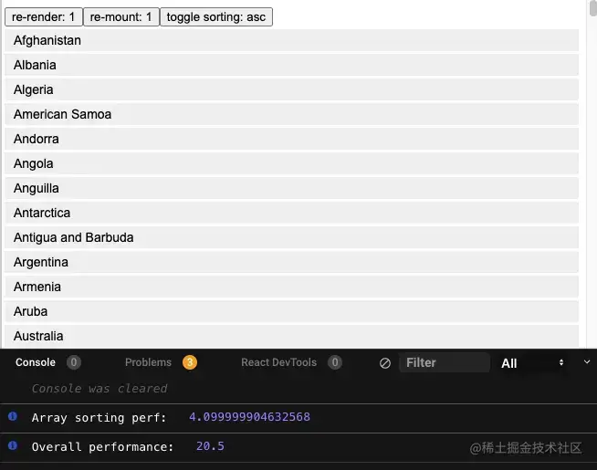

结果如图所示，排序耗时仅用了 4 毫秒，而渲染图中的 List 组件（仅仅只是 button + 文字）却用了 20 毫秒，5倍的差距，代码详见 [codesandbox.](https://codesandbox.io/s/measure-without-memo-tnhggk?file=/src/page.tsx)。 大部分情况下，我们的计算量要比这个 250 个 item 的数组少，而组件渲染要比这个 List 组件复杂的多，所以真实程序中，计算和渲染的性能差距会更大。

可见，组件渲染才是性能的瓶颈，应该把 useMemo 用在程序里渲染昂贵的组件上，而不是数值计算上。当然，除非这个计算真的很昂贵，比如阶乘计算。

至于为什么不给所有的组件都使用 useMemo，上文已经解释了。useMemo 是有成本的，它会增加整体程序初始化的耗时，并不适合全局全面使用，它更适合做局部的优化。

## 为什么 React 没有把缓存组件作为默认配置？

关于这点 Dan Abramov 在[推文](https://twitter.com/dan_abramov/status/1083897065263034368)上也给出了解释（虽然是个类比 😅）：

评论区里 react 的另一位核心开发者 Christopher Chedeau 也参与了[讨论](https://twitter.com/Vjeux/status/1083902075946205189)。 简而言之，他们认为：

1. 缓存是有成本的，小的成本可能会累加过高。
2. 默认缓存无法保证足够的正确性。

> 原因 2 的原文：correctness is not guaranteed for everything because people can mutate things. Christopher Chedeau 未给出进一步解释。或许他是指可能会导致跟 [PureComponent相同的问题](https://reactjs.org/docs/optimizing-performance.html#examples)，即浅比较 mutate things 时，由于浅比较相等，导致组件未能 update 的问题。

## 结论

讲到这里我们可以总结出 useMemo/useCallback 使用准则了：

1. **大部分的 useMemo 和 useCallback 都应该移除**，他们可能没有带来任何性能上的优化，反而增加了程序首次渲染的负担，并增加程序的复杂性。
2. 使用 useMemo 和 useCallback 优化子组件 re-render 时，**必须同时满足以下条件才有效**。  
   1. 子组件已通过 React.memo 或 useMemo 被缓存  
   2. 子组件所有的 prop 都被缓存
3. **不推荐默认给所有组件都使用缓存**，大量组件初始化时被缓存，可能导致过多的内存消耗，并影响程序初始化渲染的速度。

> 关于第三点有相反观点，详见：[Why We Memo All the Things](https://attardi.org/why-we-memo-all-the-things/?utm_source=ttalk.im&utm_medium=website&utm_campaign=Tech%2520Talk)，作者推荐默认给全部组件都加上 React.memo，并给所有 props 都套上 useMemo。他认为这样可以降低工程师心智负担，让工程师不必再自己判断什么时候使用 memorize。

**要点**：
useMemo 和 useCallback 是 React Hooks 中常用的性能优化手段,应该在以下场景下使用:

1. 计算密集型操作 - useMemo:
   - 当一个组件中存在一些复杂的计算,并且这些计算的结果会被多次使用时,可以使用 useMemo 缓存计算结果。
   - 这样可以避免每次渲染时都重复执行这些昂贵的计算操作,提高组件的性能。

2. 依赖项变化时重新创建 - useCallback:

    - 当一个组件需要传递函数给子组件时,如果该函数依赖于组件的 props 或 state,那么可以使用 useCallback 缓存该函数。

    - 这样可以确保只有当依赖项发生变化时,函数才会被重新创建,避免不必要的重新渲染。

3. memo 和 shouldComponentUpdate 配合使用 - useMemo 和 useCallback:

    - 将 useMemo 和 useCallback 与 React.memo 或shouldComponentUpdate 结合使用,可以进一步优化组件的性能。

    - 例如,对于子组件,可以使用 React.memo 进行shallow comparison比较,再配合 useMemo 和 useCallback 优化父组件。

4. 大量重复的渲染 - useMemo:

    - 当一个组件会进行大量的重复渲染时,可以使用 useMemo 缓存一些中间计算结果,减轻 CPU 负担。

    - 这样可以显著提高组件的整体性能。

总的来说,useMemo 适用于缓存昂贵的计算,useCallback 适用于缓存依赖项变化时重新创建的函数。合理使用这两个 Hooks 可以有效地优化 React 应用的性能。


---
### 211. 在 shouldComponentUpdate 或 componentWillUpdate 中使用 setState 会发生什么？

**难度**：★★☆☆☆ | **题型**：QA | **分类**：全部 / React.js

**题目**：


**参考答案**：
当调用 setState 的时候，实际上会将新的 state 合并到状态更新队列中，并对 partialState 以及 _pendingStateQueue 更新队列进行合并操作。最终通过 enqueueUpdate 执行 state 更新。

如果在 shouldComponentUpdate 或 componentWillUpdate 中使用 setState，会使得 state 队列（_pendingStateQueue）不为 null，从而调用 updateComponent 方法，updateComponent 中会继续调用 shouldComponentUpdate 和 componentWillUpdate，因此造成死循环。

**要点**：
在 `shouldComponentUpdate` 或 `componentWillUpdate` 中使用 `setState` 会导致一些潜在的问题：

### `shouldComponentUpdate` 中使用 `setState`

- **问题**：`shouldComponentUpdate` 用于决定组件是否应该更新。如果在这个方法中调用 `setState`，会导致组件重新渲染，从而触发 `shouldComponentUpdate` 再次被调用。这样会导致无限循环，因为每次调用 `setState` 都会触发重新渲染和 `shouldComponentUpdate` 调用。

### `componentWillUpdate` 中使用 `setState`

- **问题**：`componentWillUpdate` 是在组件更新之前调用的。如果在这个生命周期方法中调用 `setState`，会导致组件在更新阶段再次调用 `componentWillUpdate`。这会导致额外的渲染和不必要的更新，可能会引发性能问题或意外的行为。

### 总结

- **`shouldComponentUpdate`**：在这个方法中调用 `setState` 会导致无限更新循环。
- **`componentWillUpdate`**：在这个方法中调用 `setState` 会触发额外的渲染，可能影响性能。

通常，应避免在这些生命周期方法中调用 `setState`，并将状态更新逻辑放在 `componentDidUpdate` 中，以确保更新在组件完成渲染后进行。


---
### 222. fiber 架构的工作原理？

**难度**：★★★★☆ | **题型**：QA | **分类**：全部 / React.js

**题目**：


**参考答案**：
React 中的 Fiber 架构是一种新的协调算法，旨在提高 React 的性能和用户体验。它通过引入新的数据结构和机制，使得 React 能够更高效地处理 UI 更新。以下是 Fiber 架构的工作原理：

### **1. Fiber 数据结构**

- **Fiber 节点**：Fiber 是一个表示组件的内部数据结构，每个 Fiber 节点对应一个 React 组件。它包含了组件的状态、更新信息和子组件的引用等。
- **Fiber 树**：Fiber 节点形成了一棵 Fiber 树，类似于旧版的虚拟 DOM 树。每个 Fiber 节点指向其父节点、子节点和兄弟节点。

### **2. 工作单元和增量渲染**

- **工作单元**：渲染过程被分解为多个工作单元，每个单元代表一个小的渲染任务。这样可以将渲染过程拆分成可中断的任务，以避免长时间的阻塞。
- **增量渲染**：Fiber 允许将渲染任务拆分为增量的操作，逐步完成整个渲染过程。每次渲染会处理 Fiber 树的一部分，允许在任务之间插入中断点，从而提高了渲染的响应性。

### **3. 调度优先级**

- **优先级调度**：Fiber 引入了任务调度机制，允许根据任务的优先级来决定渲染的顺序。高优先级的任务（如用户输入、动画）会优先处理，而低优先级的任务（如数据加载）会在空闲时间处理。
- **任务中断和恢复**：Fiber 支持在渲染过程中中断并恢复任务。当重要任务需要处理时，当前的渲染任务可以被中断，待重要任务完成后再恢复继续。

### **4. 更新和协调**

- **更新队列**：每个 Fiber 节点都有一个更新队列，用于存储与组件相关的更新信息。更新队列可以包含多个更新，React 会根据更新的优先级和顺序进行协调。
- **协调过程**：Fiber 通过对比新旧 Fiber 树来决定哪些部分需要更新。这一过程称为协调（Reconciliation），它会检查节点的变更，生成更新的补丁。

### **5. 渲染阶段和提交阶段**

- **渲染阶段**：在渲染阶段，Fiber 架构会计算出需要更新的部分，但不会立即更新 DOM。这一阶段主要用于计算新的 Fiber 树，并生成更新任务。
- **提交阶段**：在提交阶段，Fiber 会将渲染阶段计算出的更新应用到实际的 DOM 上。这个阶段是同步的，确保所有的更改都被正确地应用。

### **6. 错误处理**

- **错误边界**：Fiber 提供了更好的错误处理机制，可以局部地处理渲染中的错误。即使在渲染过程中发生错误，也能保证 UI 的部分更新和恢复。

**要点**：
Fiber 架构通过引入增量渲染、任务调度、优先级管理和错误处理等机制，提高了 React 的渲染性能和用户体验。它将渲染过程拆分为多个可中断的工作单元，允许更高效地处理复杂的 UI 更新和交互。

---
### 225. 你常用的 React Hooks 有哪些？

**难度**：★☆☆☆☆ | **题型**：QA | **分类**：全部 / React.js

**题目**：


**参考答案**：
React 提供了一系列的 Hooks，用于在函数组件中添加和管理状态、副作用等功能。

以下是一些常用的 React Hooks：

1. `useState`：用于在函数组件中添加状态管理。

2. `useEffect`：用于处理副作用操作（如数据获取、订阅、事件监听等）。

3. `useContext`：用于在组件树中获取和使用共享的上下文。

4. `useReducer`：用于管理复杂状态逻辑的替代方案，类似于 Redux 的 reducer。

5. `useCallback`：用于缓存回调函数，以便在依赖未变化时避免重复创建新的函数实例。

6. `useMemo`：用于缓存计算结果，以便在依赖未变化时避免重复计算。

7. `useRef`：用于在函数组件之间保存可变的值，并且不会引发重新渲染。

8. `useLayoutEffect`：与 `useEffect` 类似，但在浏览器完成绘制之前同步执行。

9. `useImperativeHandle`：用于自定义暴露给父组件的实例值或方法。

10. `useDebugValue`：用于在开发者工具中显示自定义的钩子相关标签。


---
### 232. React构建组件的方式有哪些？有什么区别？

**难度**：★☆☆☆☆ | **题型**：QA | **分类**：全部 / React.js

**题目**：


**参考答案**：
## 一、是什么

组件就是把图形、非图形的各种逻辑均抽象为一个统一的概念（组件）来实现开发的模式

在`React`中，一个类、一个函数都可以视为一个组件

组件所存在的优势：

- 降低整个系统的耦合度，在保持接口不变的情况下，我们可以替换不同的组件快速完成需求，例如输入框，可以替换为日历、时间、范围等组件作具体的实现
- 调试方便，由于整个系统是通过组件组合起来的，在出现问题的时候，可以用排除法直接移除组件，或者根据报错的组件快速定位问题，之所以能够快速定位，是因为每个组件之间低耦合，职责单一，所以逻辑会比分析整个系统要简单
- 提高可维护性，由于每个组件的职责单一，并且组件在系统中是被复用的，所以对代码进行优化可获得系统的整体升级


## 二、如何构建

在`React`目前来讲，组件的创建主要分成了三种方式：

- 函数式创建
- 通过 React.createClass 方法创建
- 继承 React.Component 创建


### 函数式创建

在`React Hooks`出来之前，函数式组件可以视为无状态组件，只负责根据传入的`props`来展示视图，不涉及对`state`状态的操作

大多数组件可以写为无状态组件，通过简单组合构建其他组件

在`React`中，通过函数简单创建组件的示例如下：

```jsx
function HelloComponent(props, /* context */) {
  return <div>Hello {props.name}</div>
}
```


### 通过 React.createClass 方法创建

`React.createClass`是react刚开始推荐的创建组件的方式，目前这种创建方式已经不怎么用了

像上述通过函数式创建的组件的方式，最终会通过`babel`转化成`React.createClass`这种形式，转化成如下：

```jsx
function HelloComponent(props) /* context */{
  return React.createElement(
    "div",
    null,
    "Hello ",
    props.name
  );
}
```

由于上述的编写方式过于冗杂，目前基本上不使用上


### 继承 React.Component 创建

同样在`react hooks`出来之前，有状态的组件只能通过继承`React.Component`这种形式进行创建

有状态的组件也就是组件内部存在维护的数据，在类创建的方式中通过`this.state`进行访问

当调用`this.setState`修改组件的状态时，组价会再次会调用`render()`方法进行重新渲染

通过继承`React.Component`创建一个时钟示例如下：

```jsx
class Timer extends React.Component {
  constructor(props) {
    super(props);
    this.state = { seconds: 0 };
  }

  tick() {
    this.setState(state => ({
      seconds: state.seconds + 1
    }));
  }

  componentDidMount() {
    this.interval = setInterval(() => this.tick(), 1000);
  }

  componentWillUnmount() {
    clearInterval(this.interval);
  }

  render() {
    return (
      <div>
        Seconds: {this.state.seconds}
      </div>
    );
  }
}
```


## 三、区别

由于`React.createClass `创建的方式过于冗杂，并不建议使用

而像函数式创建和类组件创建的区别主要在于需要创建的组件是否需要为有状态组件：

- 对于一些无状态的组件创建，建议使用函数式创建的方式

- 由于`react hooks`的出现，函数式组件创建的组件通过使用`hooks`方法也能使之成为有状态组件，再加上目前推崇函数式编程，所以这里建议都使用函数式的方式来创建组件

在考虑组件的选择原则上，能用无状态组件则用无状态组件


**要点**：
### 1. **组件的基本类型**

#### 1.1 函数组件（Function Components）

- **定义**：函数组件是最简单的组件类型，通过一个函数定义。函数组件可以接受 `props` 作为参数，并返回 JSX 以描述 UI。
- **特点**：
  - **无状态**：函数组件通常用于定义无状态组件，或者使用 Hooks 添加状态和副作用。
  - **简洁**：代码较为简洁，不需要处理 `this` 关键字。
- **示例**：

     ```javascript
     function Greeting({ name }) {
       return <h1>Hello, {name}!</h1>;
     }
     ```

#### 1.2 类组件（Class Components）

- **定义**：类组件是通过 ES6 类来定义的组件。它需要继承自 `React.Component` 并实现 `render` 方法，返回 JSX 以描述 UI。
- **特点**：
  - **有状态**：类组件可以使用 `state` 和生命周期方法来管理状态和处理副作用。
  - **完整功能**：类组件可以实现复杂的逻辑，但代码相对较冗长。
- **示例**：

     ```javascript
     class Greeting extends React.Component {
       render() {
         const { name } = this.props;
         return <h1>Hello, {name}!</h1>;
       }
     }
     ```

### 2. **React Hooks（钩子）**

#### 2.1 使用 Hooks 的函数组件

- **定义**：Hooks 是 React 16.8 引入的功能，它允许在函数组件中使用状态和其他 React 特性。
- **特点**：
  - **状态管理**：使用 `useState` 钩子来管理组件的状态。
  - **副作用处理**：使用 `useEffect` 钩子处理副作用（如数据获取、订阅等）。
  - **更简洁**：函数组件结合 Hooks 提供了更简洁的语法和更强大的功能。
- **示例**：

     ```javascript
     import React, { useState, useEffect } from 'react';

     function Greeting({ name }) {
       const [message, setMessage] = useState('');

       useEffect(() => {
         setMessage(`Hello, ${name}!`);
       }, [name]);

       return <h1>{message}</h1>;
     }
     ```

### 3. **区别与选择**

#### 3.1 函数组件与类组件的区别

- **代码简洁度**：函数组件更简洁，适合定义简单的 UI 组件。类组件较为冗长，适合需要复杂逻辑的场景。
- **性能**：函数组件在 React 16.8 之后性能优化有所改进，与类组件的性能差异很小。函数组件配合 Hooks 能处理大部分业务场景。
- **功能**：类组件可以使用生命周期方法，但函数组件通过 Hooks 也能实现类似的功能，如 `useEffect` 代替 `componentDidMount` 和 `componentDidUpdate`。

#### 3.2 React Hooks 的优势

- **复用逻辑**：Hooks 提供了更好的逻辑复用机制（如自定义 Hooks），避免了类组件中 mixins 的问题。
- **简洁性**：函数组件配合 Hooks 可以更简洁地编写组件，避免了类组件中的 `this` 绑定问题。
- **优化**：React Hooks API 使得处理副作用和状态变得更清晰和可控。

#### 3.3 选择合适的方式

- **简单组件**：对于简单的无状态组件，推荐使用函数组件。
- **复杂逻辑**：对于需要处理复杂逻辑、状态和生命周期的组件，可以使用类组件或者函数组件配合 Hooks。
- **团队和项目惯例**：根据团队的技术栈和项目要求来选择合适的组件构建方式。如果项目已经使用 Hooks，推荐优先使用函数组件。

通过这些要点，可以清楚地展示不同类型的组件构建方式及其区别，帮助理解在不同场景下选择合适的组件构建方式。


---
### 245. 使用 react-router 跳转时，如何将参数传递给下一个页面？

**难度**：★★☆☆☆ | **题型**：QA | **分类**：全部 / React.js

**题目**：


**参考答案**：
在 `react-router` 中实现页面跳转并传递参数，可以通过以下几种方式来完成：

### 1. **通过 URL 参数传递**

**定义路由时：**

在定义路由时，可以使用 URL 参数。例如：

```jsx
<Route path="/user/:id" component={User} />
```

**跳转时：**

使用 `useHistory` 或 `useNavigate`（在 React Router v6 中）进行跳转时，可以将参数添加到 URL 中：

```jsx
import { useHistory } from 'react-router-dom'; // React Router v5

function RedirectToUser() {
  const history = useHistory();

  const handleClick = () => {
    history.push(`/user/123`); // 跳转到 /user/123
  };

  return <button onClick={handleClick}>Go to User 123</button>;
}
```

```jsx
import { useNavigate } from 'react-router-dom'; // React Router v6

function RedirectToUser() {
  const navigate = useNavigate();

  const handleClick = () => {
    navigate(`/user/123`); // 跳转到 /user/123
  };

  return <button onClick={handleClick}>Go to User 123</button>;
}
```

**接收参数：**

在目标组件中，可以使用 `useParams` 钩子（在 React Router v6 中也是 `useParams`）来接收 URL 参数：

```jsx
import { useParams } from 'react-router-dom';

function User() {
  const { id } = useParams();
  return <div>User ID: {id}</div>;
}
```

### 2. **通过查询字符串传递**

**跳转时：**

可以将参数作为查询字符串添加到 URL 中：

```jsx
import { useHistory } from 'react-router-dom'; // React Router v5

function RedirectToUser() {
  const history = useHistory();

  const handleClick = () => {
    history.push(`/user?id=123`); // 跳转到 /user?id=123
  };

  return <button onClick={handleClick}>Go to User</button>;
}
```

```jsx
import { useNavigate } from 'react-router-dom'; // React Router v6

function RedirectToUser() {
  const navigate = useNavigate();

  const handleClick = () => {
    navigate(`/user?id=123`); // 跳转到 /user?id=123
  };

  return <button onClick={handleClick}>Go to User</button>;
}
```

**接收查询参数：**

可以使用 `URLSearchParams` 来获取查询参数：

```jsx
import { useLocation } from 'react-router-dom';

function User() {
  const { search } = useLocation();
  const params = new URLSearchParams(search);
  const id = params.get('id');
  return <div>User ID: {id}</div>;
}
```

### 3. **通过状态传递**

**跳转时：**

可以将参数作为状态传递：

```jsx
import { useHistory } from 'react-router-dom'; // React Router v5

function RedirectToUser() {
  const history = useHistory();

  const handleClick = () => {
    history.push({
      pathname: '/user',
      state: { id: 123 }
    });
  };

  return <button onClick={handleClick}>Go to User</button>;
}
```

```jsx
import { useNavigate } from 'react-router-dom'; // React Router v6

function RedirectToUser() {
  const navigate = useNavigate();

  const handleClick = () => {
    navigate('/user', { state: { id: 123 } });
  };

  return <button onClick={handleClick}>Go to User</button>;
}
```

**接收状态：**

在目标组件中，可以通过 `useLocation` 钩子获取传递的状态：

```jsx
import { useLocation } from 'react-router-dom';

function User() {
  const location = useLocation();
  const id = location.state?.id;
  return <div>User ID: {id}</div>;
}
```

**要点**：
- **URL 参数**：用于路径中的动态数据，例如用户 ID。
- **查询字符串**：适用于非必需的、可选的参数。
- **状态**：适用于一次性数据传递，不显示在 URL 中。

---
### 252. 在 React 中，useEffect 钩子的作用是什么？它的参数有哪些？如何使用 useEffect 实现组件的副作用处理？

**难度**：★★☆☆☆ | **题型**：QA | **分类**：全部 / React.js

**题目**：


**参考答案**：
在 React 中，`useEffect` 是 **函数组件处理副作用的核心 Hook**，它可以替代类组件中的 `componentDidMount`、`componentDidUpdate` 和 `componentWillUnmount` 生命周期方法。

---

## 1. **作用**

`useEffect` 的主要作用是：

1. **执行副作用操作**：包括数据请求、订阅事件、DOM 操作、定时器、日志记录等。
2. **在组件挂载、更新或卸载时执行**：根据依赖数组的不同，可以控制副作用执行的时机。

> 注意：副作用指的不是纯计算，而是对组件外部世界产生影响的操作。

---

## 2. **参数**

`useEffect` 接收两个参数：

```js
useEffect(effect: () => (void | (() => void)), deps?: any[])
```

1. **`effect`**

   * 一个函数，包含副作用逻辑。
   * 可以返回一个清理函数，用于在组件卸载或副作用重新执行前进行清理。

2. **`deps`（依赖数组，可选）**

   * 指定副作用依赖的变量数组。
   * React 会在依赖变化时重新执行 `effect`。
   * 如果不传依赖数组 → 每次渲染都执行
   * 空数组 `[]` → 仅在组件挂载和卸载时执行
   * 含有依赖 `[a, b]` → 只有当 `a` 或 `b` 改变时执行

---

## 3. **使用示例**

### （1）组件挂载时执行一次副作用

```js
import { useEffect } from 'react';

function MyComponent() {
  useEffect(() => {
    console.log('组件挂载');

    return () => {
      console.log('组件卸载');
    };
  }, []); // 空依赖数组
}
```

### （2）依赖某些状态更新时执行

```js
import { useState, useEffect } from 'react';

function Counter() {
  const [count, setCount] = useState(0);

  useEffect(() => {
    console.log('count 更新为:', count);
  }, [count]); // 依赖 count
}
```

### （3）副作用中设置定时器，并在卸载时清理

```js
useEffect(() => {
  const timer = setInterval(() => {
    console.log('定时器触发');
  }, 1000);

  return () => clearInterval(timer); // 清理
}, []); // 挂载时设置，卸载时清理
```

---

## 4. **注意事项**

1. **避免依赖遗漏**

   * 所有在副作用中使用的外部变量（状态、props、函数）都应该在依赖数组中列出，否则可能出现闭包陷阱。

2. **清理副作用**

   * 在副作用中注册事件或定时器时，要返回清理函数，避免内存泄漏。

3. **多个 `useEffect` 可以共存**

   * 每个副作用可以单独声明，提高逻辑可读性。


**要点**：
* `useEffect` 用于在函数组件中处理副作用，包括数据请求、事件监听、DOM 操作等。
* 接受两个参数：副作用函数 `effect` 和依赖数组 `deps`。
* 副作用函数可以返回清理函数，避免资源泄漏。
* 依赖数组控制副作用执行时机：空数组 → 挂载/卸载一次，指定依赖 → 依赖变化时执行，不传 → 每次渲染执行。

---
### 260. 什么是JSX？

**难度**：★★☆☆☆ | **题型**：QA | **分类**：全部 / React.js

**题目**：


**参考答案**：
JSX即JavaScript XML。一种在React组件内部构建标签的类XML语法。JSX为react.js开发的一套语法糖，也是react.js的使用基础。React在不使用JSX的情况下一样可以工作，然而使用JSX可以提高组件的可读性，因此推荐使用JSX。

```react.js
class MyComponent extends React.Component {
  render() {
    let props = this.props;  
    return (
      <div className="my-component">
      <a href={props.url}>{props.name}</a>
      </div>
    );
  }
}
```

**优点**：

* 允许使用熟悉的语法来定义 HTML 元素树；
* 提供更加语义化且移动的标签；
* 程序结构更容易被直观化；
* 抽象了 React Element 的创建过程；
* 可以随时掌控 HTML 标签以及生成这些标签的代码；
* 是原生的 JavaScript。

**要点**：
- **JSX**：一种 JavaScript 语法扩展，让你在 JavaScript 代码中书写类似 HTML 的结构。
- **直观**：使组件结构的定义更加直观和易读。
- **表达式嵌入**：支持在 JSX 中嵌入 JavaScript 表达式。
- **编译**：JSX 需要被编译成标准 JavaScript，以便浏览器理解。

JSX 是 React 的核心特性之一，简化了组件的定义和 UI 的描述，使得开发和维护 React 应用变得更加高效。


---
### 288. 实现一个 useTimeout Hook

**难度**：★★★☆☆ | **题型**：QA | **分类**：全部 / React.js

**题目**：


**参考答案**：
`useTimeout` 是可以在函数式组件中，处理 `setTimeout` 计时器函数

## 解决了什么问题？

如果直接在函数式组件中使用 `setTimeout` ，会遇到以下问题：

* 多次调用setTimeout  

```js  
 function App() {  
    const [state, setState] = useState(1);  
    setTimeout(() => {  
        setState(state + 1);  
    }, 3000);  
    return (  
        // 我们原本的目的是在页面渲染完3s后修改一下state，但是你会发现当state+1后，触发了页面的重新渲染，就会重新有一个3s的定时器出现来给state+1，既而变成了每3秒+1。  
        <div> {state} </div>  
    );  
  }; 
```

* hooks 的闭包缺陷  

```js  
function App() {  
  const [count, setCount] = useState(0)  
  const [countTimeout, setCountTimeout] = useState(0)  
  useEffect(() => {  
      setTimeout(() => {  
          setCountTimeout(count)  
      }, 3000)  
      setCount(5)  
  }, [])  
  return (  
       //count发生了变化，但是3s后setTimout的count却还是0  
      <div>  
          Count: {count}  
          <br />  
          setTimeout Count: {countTimeout}  
      </div>  
  )  
}
```

## useTimeout 实现

```js
function useTimeout(callback, delay) {
  const memorizeCallback = useRef();

  useEffect(() => {
    memorizeCallback.current = callback;
  }, [callback]);

  useEffect(() => {
    if (delay !== null) {
      const timer = setTimeout(() => {
        memorizeCallback.current();
      }, delay);
      return () => {
        clearTimeout(timer);
      };
    }
  }, [delay]);
};
```

## 如何使用

```js
  // callback 回调函数， delay 延迟时间
  useTimeout(callback, delay);
```


---
### 328. useEffect 的第二个参数, 传空数组和传依赖数组有什么区别？

**难度**：★☆☆☆☆ | **题型**：QA | **分类**：全部 / React.js

**题目**：


**参考答案**：
在 React 中，useEffect 是一个常用的 Hook，它用于处理组件生命周期中的副作用。

useEffect 接收两个参数，第一个是要执行的函数，第二个是依赖数组（可选）。

当传递空数组 [] 时，useEffect 只会在组件挂载和卸载时调用一次。这种情况下，useEffect 不会监听任何变量，并且不会对组件进行重新渲染。

```js
useEffect(() => {
  // 只在挂载和卸载时执行
}, []);
```

当传递依赖数组时，useEffect 会在组件挂载和依赖项更新时调用。当依赖项中的任何一个值发生变化时，useEffect 都将被重新调用。如果依赖数组为空，则每次组件重新渲染时都会调用 useEffect。

```js
useEffect(() => {
  // 在挂载、依赖列表变化及卸载时执行
}, [dep1, dep2]);
```

下面是这两种情况的总结：

- 当传递空数组 [] 时，useEffect 只会在组件挂载和卸载时调用一次，不会对组件进行重新渲染。
- 当传递依赖数组时，useEffect 会在组件挂载和依赖项更新时调用，每次更新时都会检查依赖项列表是否有变化，如果有变化则重新执行。

如果 useEffect 中使用了闭包函数，则应该确保所有引用的变量都在依赖项中被显示声明，否则可能会导致不必要的重新渲染或者无法获取最新的状态。


---
### 329. 如何让 useEffect 支持 async/await？

**难度**：★★★★☆ | **题型**：QA | **分类**：全部 / React.js

**题目**：


**参考答案**：
大家在使用 `useEffect` 的时候，假如回调函数中使用 `async...await...` 的时候，会报错如下。

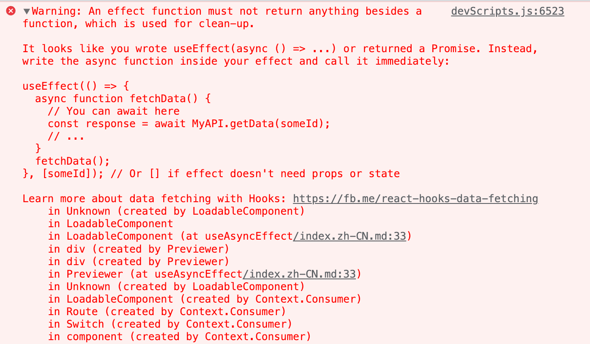


看报错，我们知道 `effect function` 应该返回一个销毁函数（`return`返回的 `cleanup` 函数），如果 `useEffect` 第一个参数传入 `async`，返回值则变成了 `Promise`，会导致 `react` 在调用销毁函数的时候报错**。

## React 为什么要这么做？
`useEffect` 作为 `Hooks` 中一个很重要的 `Hooks`，可以让你在函数组件中执行副作用操作。

它能够完成之前 `Class Component` 中的生命周期的职责。它返回的函数的执行时机如下：

- 首次渲染不会进行清理，会在下一次渲染，清除上一次的副作用。
- 卸载阶段也会执行清除操作。

不管是哪个，我们都不希望这个返回值是异步的，这样我们无法预知代码的执行情况，很容易出现难以定位的 Bug。

所以 React 就直接限制了不能 useEffect 回调函数中不能支持 async...await...

## useEffect 怎么支持 async...await...

竟然 useEffect 的回调函数不能使用 `async...await`，那我直接在它内部使用。

做法一：创建一个异步函数（`async...await` 的方式），然后执行该函数。

```js
useEffect(() => {
  const asyncFun = async () => {
    setPass(await mockCheck());
  };
  asyncFun();
}, []);
```

做法二：也可以使用 `IIFE`，如下所示：

```js
useEffect(() => {
  (async () => {
    setPass(await mockCheck());
  })();
}, []);
```

## 自定义 hooks

既然知道了怎么解决，我们完全可以将其封装成一个 hook，让使用更加的优雅。我们来看下 ahooks 的 `useAsyncEffect`，它支持所有的异步写法，包括 `generator function`。

思路跟上面一样，入参跟 useEffect 一样，一个回调函数（不过这个回调函数支持异步），另外一个依赖项 deps。**内部还是 useEffect，将异步的逻辑放入到它的回调函数里面。**

```js
function useAsyncEffect(
  effect: () => AsyncGenerator<void, void, void> | Promise<void>,
  // 依赖项
  deps?: DependencyList,
) {
  // 判断是 AsyncGenerator
  function isAsyncGenerator(
    val: AsyncGenerator<void, void, void> | Promise<void>,
  ): val is AsyncGenerator<void, void, void> {
    // Symbol.asyncIterator: https://developer.mozilla.org/zh-CN/docs/Web/JavaScript/Reference/Global_Objects/Symbol/asyncIterator
    // Symbol.asyncIterator 符号指定了一个对象的默认异步迭代器。如果一个对象设置了这个属性，它就是异步可迭代对象，可用于for await...of循环。
    return isFunction(val[Symbol.asyncIterator]);
  }
  useEffect(() => {
    const e = effect();
    // 这个标识可以通过 yield 语句可以增加一些检查点
    // 如果发现当前 effect 已经被清理，会停止继续往下执行。
    let cancelled = false;
    // 执行函数
    async function execute() {
      // 如果是 Generator 异步函数，则通过 next() 的方式全部执行
      if (isAsyncGenerator(e)) {
        while (true) {
          const result = await e.next();
          // Generate function 全部执行完成
          // 或者当前的 effect 已经被清理
          if (result.done || cancelled) {
            break;
          }
        }
      } else {
        await e;
      }
    }
    execute();
    return () => {
      // 当前 effect 已经被清理
      cancelled = true;
    };
  }, deps);
}
```

`async...await` 我们之前已经提到了，重点看看实现中变量 `cancelled` 的实现的功能。
它的作用是**中断执行**。
> 通过 `yield` 语句可以增加一些检查点，如果发现当前 `effect` 已经被清理，会停止继续往下执行。

试想一下，有一个场景，用户频繁的操作，可能现在这一轮操作 a 执行还没完成，就已经开始开始下一轮操作 b。这个时候，操作 a 的逻辑已经失去了作用了，那么我们就可以停止往后执行，直接进入下一轮操作 b 的逻辑执行。这个 `cancelled` 就是用来取消当前正在执行的一个标识符。

## 还可以支持 useEffect 的清除机制么？
可以看到上面的 `useAsyncEffect`，内部的 `useEffect` 返回函数只返回了如下：

```js
return () => {
  // 当前 effect 已经被清理
  cancelled = true;
};
```

这说明，你**通过 useAsyncEffect 没有 useEffect 返回函数中执行清除副作用的功能**。

你可能会觉得，我们将 `effect`(`useAsyncEffect` 的回调函数)的结果，放入到 `useAsyncEffect` 中不就可以了？

实现最终类似如下：

```js
function useAsyncEffect(effect: () => Promise<void | (() => void)>, dependencies?: any[]) {
  return useEffect(() => {
    const cleanupPromise = effect()
    return () => { cleanupPromise.then(cleanup => cleanup && cleanup()) }
  }, dependencies)
}
```

这种做法在github上也有讨论，上面有个大神的说法我表示很赞同：

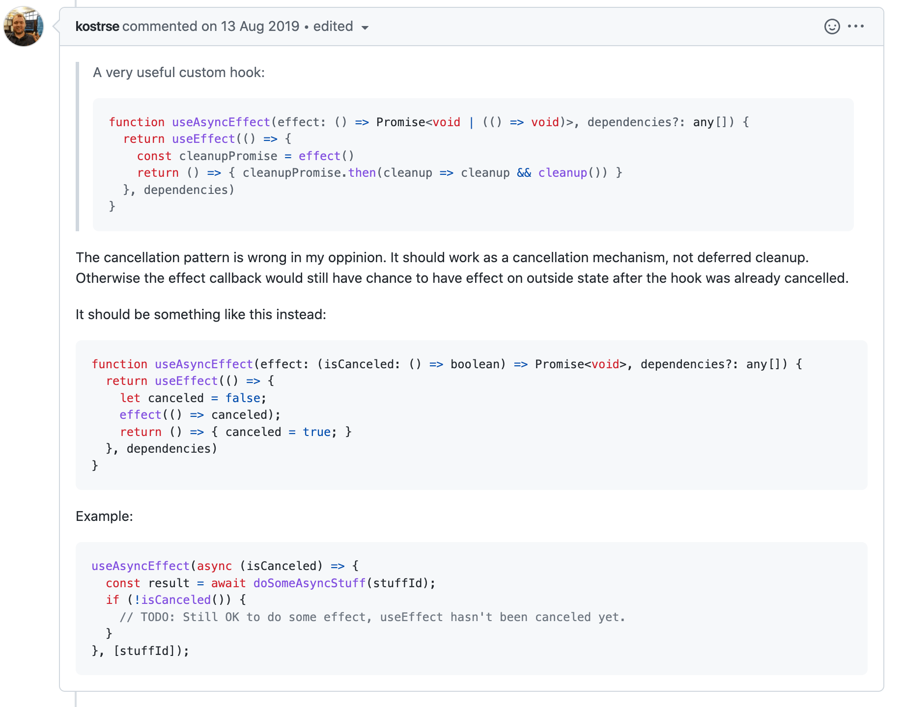


他认为这种**延迟清除机制**是不对的，应该是一种**取消机制**。否则，在钩子已经被取消之后，回调函数仍然有机会对外部状态产生影响。他的实现和例子我也贴一下，跟 `useAsyncEffect` 其实思路是一样的，如下：

实现：
```
function useAsyncEffect(effect: (isCanceled: () => boolean) => Promise<void>, dependencies?: any[]) {
  return useEffect(() => {
    let canceled = false;
    effect(() => canceled);
    return () => { canceled = true; }
  }, dependencies)
}
```

Demo:
```js
useAsyncEffect(async (isCanceled) => {
  const result = await doSomeAsyncStuff(stuffId);
  if (!isCanceled()) {
    // TODO: Still OK to do some effect, useEffect hasn't been canceled yet.
  }
}, [stuffId]);
```

其实归根结底，**我们的清除机制不应该依赖于异步函数，否则很容易出现难以定位的 bug**。


## 总结与思考
由于 `useEffect` 是在函数式组件中承担执行副作用操作的职责，它的返回值的执行操作应该是可以预期的，而不能是一个异步函数，所以不支持回调函数 `async...await` 的写法。

我们可以将 `async...await` 的逻辑封装在 `useEffect` 回调函数的内部，这就是 ahooks `useAsyncEffect` 的实现思路，而且它的范围更加广，它支持的是所有的异步函数，包括 `generator function`。


**要点**：
React 的 `useEffect` Hook 不支持直接使用 `async/await`。这是因为 `useEffect` 的回调函数必须返回一个清理函数(可选),而 `async` 函数会隐式地返回一个 Promise。

但是,您可以通过以下几种方式在 `useEffect` 中使用 `async/await`:

1. **在 useEffect 内部定义 async 函数**:

```javascript
useEffect(() => {
  async function fetchData() {
    const data = await fetchSomeData();
    // 使用 data 进行其他操作
  }
  fetchData();

  // 返回清理函数
  return () => {
    // 清理逻辑
  };
}, []);
```

在 `useEffect` 内部定义一个 `async` 函数,然后在 `useEffect` 回调中调用这个函数。这是最常见的解决方案。

2. **使用 useCallback 与 useEffect 组合**:

```javascript
const memoizedFetchData = useCallback(async () => {
  const data = await fetchSomeData();
  // 使用 data 进行其他操作
}, []);

useEffect(() => {
  memoizedFetchData();

  // 返回清理函数
  return () => {
    // 清理逻辑
  };
}, [memoizedFetchData]);
```

使用 `useCallback` 缓存 `async` 函数,然后在 `useEffect` 中调用它。这种方式可以确保 `async` 函数在依赖项不变的情况下保持不变。

3. **使用 Promise 链**:

```javascript
useEffect(() => {
  let isSubscribed = true;

  fetchSomeData()
    .then((data) => {
      if (isSubscribed) {
        // 使用 data 进行其他操作
      }
    })
    .catch((error) => {
      if (isSubscribed) {
        // 处理错误
      }
    });

  return () => {
    isSubscribed = false;
    // 清理逻辑
  };
}, []);
```

使用 Promise 链的方式来替代 `async/await`。这种方式更加明确地处理订阅状态,避免了组件卸载后仍在执行的异步操作。

虽然 `useEffect` 本身不支持 `async/await`，但是您可以通过上述几种方式来在 `useEffect` 中使用异步操作。选择哪种方式取决于具体的需求和个人编码风格。


---
### 333. 为什么React的 VM 可以提高性能？


**难度**：★★☆☆☆ | **题型**：QA | **分类**：全部 / React.js

**题目**：


**参考答案**：
因为 VM 并不是真实的操作 DOM，通过 diff 算法可以避免一些不变要的 DOM 操作，从而提高了性能。


---
### 349. React Hooks带来了什么便利？

**难度**：★★★☆☆ | **题型**：QA | **分类**：全部 / React.js

**题目**：


**参考答案**：
React Hooks 带来了许多便利，使得函数组件的开发更加简洁和高效。以下是主要的便利点：

### 1. **简化状态管理**

- **`useState`**：允许在函数组件中管理状态，避免了类组件中复杂的状态初始化和方法绑定。
  ```javascript
  const [count, setCount] = useState(0);
  ```

### 2. **简化副作用处理**

- **`useEffect`**：统一了副作用的处理，替代了 `componentDidMount`、`componentDidUpdate` 和 `componentWillUnmount`，并可以处理多种副作用场景。
  ```javascript
  useEffect(() => {
    // 执行副作用
    return () => {
      // 清理副作用
    };
  }, [dependencies]);
  ```

### 3. **共享逻辑**

- **自定义 Hooks**：允许将逻辑提取到可复用的函数中，避免了类组件中重复的逻辑和代码。
  ```javascript
  function useCustomHook() {
    const [value, setValue] = useState(0);
    // 自定义逻辑
    return [value, setValue];
  }
  ```

### 4. **更清晰的组件结构**

- **函数组件**：Hooks 使函数组件能够管理状态和副作用，简化了组件的结构，避免了类组件中的复杂生命周期方法。
  ```javascript
  function MyComponent() {
    const [count, setCount] = useState(0);

    useEffect(() => {
      // 副作用逻辑
    }, []);

    return <button onClick={() => setCount(count + 1)}>{count}</button>;
  }
  ```

### 5. **避免 this 绑定问题**

- **函数组件**：Hooks 消除了类组件中 `this` 的复杂性和绑定问题，使代码更简洁、更易理解。
  ```javascript
  function handleClick() {
    // 不需要绑定 `this`
  }
  ```

### 6. **改进了逻辑复用**

- **Hooks 组合**：可以将多个 Hooks 组合在一起，灵活地管理和复用逻辑。
  ```javascript
  function MyComponent() {
    const { data, loading } = useFetchData();
    const [count, setCount] = useState(0);

    return <div>{/* UI 逻辑 */}</div>;
  }
  ```

### 7. **提升代码的可读性和维护性**

- **逻辑集中**：通过 Hooks 将相关逻辑集中在一个地方，提升了代码的可读性和维护性。
  ```javascript
  function useCounter(initialValue) {
    const [count, setCount] = useState(initialValue);

    const increment = () => setCount(c => c + 1);
    const decrement = () => setCount(c => c - 1);

    return { count, increment, decrement };
  }
  ```

### 8. **支持异步操作**

- **`useEffect` 和自定义 Hooks**：支持处理异步操作和副作用，使得处理数据获取和副作用变得更加直观。
  ```javascript
  useEffect(() => {
    async function fetchData() {
      const response = await fetch('api/data');
      const data = await response.json();
      // 处理数据
    }

    fetchData();
  }, []);
  ```

### 9. **性能优化**

- **`useMemo` 和 `useCallback`**：提供了优化性能的工具，避免不必要的计算和函数重新创建。
  ```javascript
  const memoizedValue = useMemo(() => computeExpensiveValue(a, b), [a, b]);
  const memoizedCallback = useCallback(() => { /* callback logic */ }, [dependencies]);
  ```

### 总结

React Hooks 提供了简洁的 API，使得函数组件能够管理状态、副作用和逻辑复用，从而提升了开发效率、代码可读性和维护性。它们消除了类组件中的复杂性，使得编写和理解 React 组件变得更加直观。

**要点**：
1. **简化状态管理**：`useState` 让函数组件可以管理状态，避免了类组件的复杂性。
2. **统一副作用处理**：`useEffect` 处理副作用，替代了多种生命周期方法。
3. **逻辑复用**：自定义 Hooks 允许在多个组件中复用逻辑。
4. **避免 `this` 问题**：函数组件消除了 `this` 的复杂性。
5. **提升代码可读性**：更清晰的组件结构和逻辑集中管理。


---
### 361. 说说你对自定义hook的理解

**难度**：★☆☆☆☆ | **题型**：QA | **分类**：全部 / React.js

**题目**：


**参考答案**：
# 自定义Hook
通过自定义 Hook，可以将组件逻辑提取到可重用的函数中。

可以理解成Hook就是用来放一些重复代码的函数。

下面我将做手动实现一个列表渲染、删除的组件，然后把它做成自定义Hook。

## 示例

定义数据列表
```js
const initialState = [
  { id: 1, name: "qiu" },
  { id: 2, name: "yan" },
  { id: 2, name: "xi" }
];
```
创建一个App组件并渲染它
```js
function App(props) {
  const [state, setState] = useState(initialState);
  const deleteLi = (index) => {
    setState((state) => {
      const newState = JSON.parse(JSON.stringify(state));//深拷贝数据
      newState.splice(index, 1);
      return newState;
    });
  };
  return (
    <>
      <ul>
        {state
          ? state.map((v, index) => {
              return (
                <li key={index}>
                  {index + "、"}
                  {v.name}
                  <button
                    onClick={() => {
                      deleteLi(index);
                    }}
                  >
                    X
                  </button>
                </li>
              );
            })
          : \"加载中\"}
      </ul>
    </>
  );
}
```

上面的代码，我对一个数组进行渲染+删除操作，当点击按钮时，就会删除数组的对应index的数据，从而执行页面更新
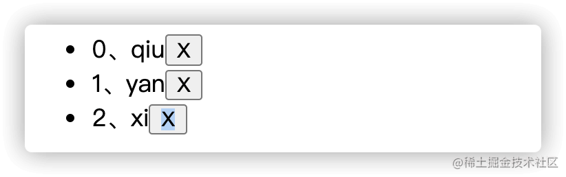

## 封装成Hook
```js
const useList = () => {
  const [state, setState] = useState(initialState);
  const deleteLi = (index) => {
    setState((state) => {
      const newState = JSON.parse(JSON.stringify(state));
      newState.splice(index, 1);
      return newState;
    });
  };
  return { state, setState, deleteLi };//返回查、改、删
};
```
我把上面的业务逻辑都放在`useList`这个函数中，并将查、改、删的API给放在一个对象中return出去。这样就形成了一个自定义Hook

## 使用自定义Hook

一般可以将自定义Hook给单独放在一个文件中，如果要使用，就引过来

```js
+ import useList from \"./useList\";
```
在需要使用的App组件中执行自定义Hook并接收API
```js
function App(props) {
  const { state, deleteLi } = useList();//这里接收return出来的查、删API
  return (
 	... //这里跟最开始的App组件里是一样的，为了页面整洁，就不贴代码了
  );
}
```

# 总结

所谓的自定义Hook，实际上就是把很多重复的逻辑都放在一个函数里面，通过闭包的方式给`return`出来，这是非常高级的方式，程序员崇尚代码简洁，如果说以后业务开发时需要大量的重复代码，我们就可以将它封装成自定义Hook。


**要点**：
自定义 Hook 是 React 16.8 引入 Hooks 之后非常强大的特性之一。它允许开发者将可重用的逻辑抽象为可复用的函数,增强了 React 组件的可复用性和可维护性。

自定义 Hook 的基本思路是:

1. **抽象可重用的逻辑**:
   - 开发者可以将一些复杂的逻辑,比如状态管理、副作用处理等,抽象为可重用的自定义 Hook。

2. **遵循 Hook 规则**:
   - 自定义 Hook 必须遵循 React Hooks 的使用规则,比如必须以 `use` 开头,不能在条件语句中使用 Hooks 等。

3. **利用 Hooks 组合**:
   - 自定义 Hook 可以组合使用其他内置 Hooks,比如 `useState`、`useEffect`、`useCallback` 等,形成更复杂的逻辑。

4. **返回复用的值**:
   - 自定义 Hook 通常会返回一些可复用的状态、函数或其他值,供组件使用。

自定义 Hook 的优点包括:

1. **提高代码复用性**:
   - 将可重用的逻辑抽象为自定义 Hook,可以在多个组件中复用该逻辑。

2. **增强代码可读性和可维护性**:
   - 自定义 Hook 可以使组件代码更加简洁和语义化,提高可读性。同时也便于后期的维护和迭代。

3. **更好的逻辑复用**:
   - 相比于 Higher-Order Components (HOC) 和 Render Props 模式,自定义 Hook 提供了更加灵活和直观的逻辑复用方式。

4. **更好的类型推导**:
   - 自定义 Hook 可以更好地利用 TypeScript 的类型推导能力,提高类型安全性。

自定义 Hook 的常见使用场景包括:

- **状态管理**: 封装复杂的状态逻辑,如表单状态、路由状态等。
- **副作用处理**: 封装复杂的副作用逻辑,如数据fetching、订阅/取消订阅等。
- **性能优化**: 封装记忆化函数、debounce/throttle 等性能优化逻辑。
- **跨组件逻辑共享**: 将跨组件的通用逻辑抽象为自定义 Hook。

自定义 Hook 是 React Hooks 体系中非常强大的特性,可以极大地提高代码的复用性、可维护性和可测试性。合理地设计和使用自定义 Hook 是React开发中的一项重要技能。


---
### 363. React 中的 forwardsRef，作用是什么， 有哪些使用场景？

**难度**：★★☆☆☆ | **题型**：QA | **分类**：全部 / React.js

**题目**：


**参考答案**：
在 React 中，`forwardRef` 是一个高阶组件（HOC），用于**转发引用（ref）**到子组件的 DOM 元素或子组件内部的某个实例上。通常，React 的 `ref` 是用来直接访问 DOM 元素或组件实例的，但是在函数组件中，`ref` 是无法直接使用的，因为函数组件没有实例。

`forwardRef` 允许我们在函数组件中**传递** `ref`，将其绑定到组件内部的 DOM 元素或组件实例上，从而能够在父组件中访问这个子组件的 DOM 或实例方法。

### 1. **`forwardRef` 的作用**
`forwardRef` 使得我们能够将 `ref` 从父组件转发到子组件中，使得父组件能够访问子组件的内部 DOM 元素或方法。

### 2. **`forwardRef` 的语法**
`forwardRef` 接受一个函数组件，并返回一个新的组件，该组件会接收 `ref` 参数并将其转发到子组件。

```jsx
import React, { forwardRef } from 'react';

// 使用 forwardRef 创建一个转发 ref 的组件
const MyButton = forwardRef((props, ref) => {
  return <button ref={ref}>{props.children}</button>;
});

export default MyButton;
```

在上面的例子中，`MyButton` 组件是一个函数组件，接受 `props` 和 `ref` 作为参数。`forwardRef` 将 `ref` 转发到 `<button>` 元素上。

### 3. **使用场景**

#### 场景 1：访问子组件的 DOM 元素
父组件想要直接访问子组件的 DOM 元素或执行某些操作（例如聚焦某个输入框）。

```jsx
import React, { useRef } from 'react';
import { forwardRef } from 'react';

// 定义一个转发 ref 的函数组件
const Input = forwardRef((props, ref) => {
  return <input ref={ref} {...props} />;
});

function ParentComponent() {
  const inputRef = useRef();

  const handleFocus = () => {
    inputRef.current.focus();  // 访问子组件的 DOM 元素，执行聚焦操作
  };

  return (
    <div>
      <Input ref={inputRef} />
      <button onClick={handleFocus}>Focus Input</button>
    </div>
  );
}

export default ParentComponent;
```

在这个例子中，`Input` 组件通过 `forwardRef` 转发 `ref`，让父组件能够直接访问并操作 `<input>` 元素，例如聚焦。

#### 场景 2：将 `ref` 转发到第三方库的组件
在使用第三方库时，通常我们需要通过 `ref` 来获取其组件的 DOM 元素或实例方法。如果该库的组件是一个函数组件，而不是类组件，`ref` 默认是无法传递的。此时可以使用 `forwardRef` 来实现。

例如，第三方库中的一个组件：

```jsx
// ThirdPartyComponent.js
import React from 'react';

function ThirdPartyComponent() {
  return <div>Some third party component</div>;
}

export default ThirdPartyComponent;
```

如果我们想要通过 `ref` 访问这个 `div`，就可以使用 `forwardRef` 进行封装：

```jsx
// WrappedComponent.js
import React, { forwardRef } from 'react';
import ThirdPartyComponent from './ThirdPartyComponent';

const WrappedComponent = forwardRef((props, ref) => {
  return <ThirdPartyComponent ref={ref} {...props} />;
});

export default WrappedComponent;
```

#### 场景 3：高阶组件中的 `ref` 转发
在某些高阶组件中，我们需要将 `ref` 转发到被包装组件的根元素。这样父组件可以使用 `ref` 获取到子组件的 DOM 元素。

```jsx
import React, { forwardRef } from 'react';

function withExtraStyles(Component) {
  return forwardRef((props, ref) => {
    return <Component ref={ref} {...props} style={{ color: 'red' }} />;
  });
}

const Button = (props) => {
  return <button {...props}>Click me</button>;
};

const StyledButton = withExtraStyles(Button);

function Parent() {
  const buttonRef = React.useRef();

  const handleClick = () => {
    console.log(buttonRef.current); // 访问按钮的 DOM 元素
  };

  return (
    <div>
      <StyledButton ref={buttonRef} onClick={handleClick} />
    </div>
  );
}
```

在这个例子中，`withExtraStyles` 是一个高阶组件（HOC），它通过 `forwardRef` 将 `ref` 转发到 `Button` 组件，并在 `StyledButton` 中添加样式。

**要点**：
`forwardRef` 是 React 中用来 **转发引用（ref）** 的一个功能。它使得父组件能够直接访问子组件中的 DOM 元素或方法。常见的使用场景包括：

- **访问子组件的 DOM 元素**：例如，在父组件中通过 `ref` 访问子组件的输入框并进行操作（如聚焦、获取值等）。
- **与第三方库兼容**：通过 `forwardRef` 将 `ref` 传递给第三方库的组件，确保父组件能够访问其 DOM 元素。
- **高阶组件中转发 `ref`**：在高阶组件中，通过 `forwardRef` 将 `ref` 转发到被包装组件的根元素，避免 `ref` 无效的问题。

使用 `forwardRef` 使得函数组件也能够支持 `ref`，并且能够灵活地控制组件的行为，尤其是在涉及到 DOM 操作或与其他库交互时。

---
### 368. react中懒加载的实现原理是什么？

**难度**：★★★★☆ | **题型**：QA | **分类**：全部 / React.js

**题目**：


**参考答案**：
随着前端应用体积的扩大，资源加载的优化是我们必须要面对的问题，动态代码加载就是其中的一个方案，webpack 提供了符合 ECMAScript 提案 的 import() 语法 ，让我们来实现动态地加载模块（注：require.ensure 与 import() 均为 webpack 提供的代码动态加载方案，在 webpack 2.x 中，require.ensure 已被 import 取代）。

在 React 16.6 版本中，新增了 React.lazy 函数，它能让你像渲染常规组件一样处理动态引入的组件，配合 webpack 的 Code Splitting ，只有当组件被加载，对应的资源才会导入 ，从而达到懒加载的效果。

## 使用 React.lazy

在实际的使用中，首先是引入组件方式的变化：

```javascript
// 不使用 React.lazy
import OtherComponent from './OtherComponent';
// 使用 React.lazy
const OtherComponent = React.lazy(() => import('./OtherComponent'))
```

React.lazy 接受一个函数作为参数，这个函数需要调用 import() 。它需要返回一个 Promise，该 Promise 需要 resolve 一个 defalut export 的 React 组件。

```react.js
import React, { Suspense } from 'react';

const OtherComponent = React.lazy(() => import('./OtherComponent'));

function MyComponent() {
  return (
    <div>
      <Suspense fallback={<div>Loading...</div>}>
        <OtherComponent />
      </Suspense>
    </div>
  );
}
```

如上代码中，通过 import()、React.lazy 和 Suspense 共同一起实现了 React 的懒加载，也就是我们常说了运行时动态加载，即 OtherComponent 组件文件被拆分打包为一个新的包（bundle）文件，并且只会在 OtherComponent 组件渲染时，才会被下载到本地。

需要注意的一点是，React.lazy 需要配合 Suspense 组件一起使用，在 Suspense 组件中渲染 React.lazy 异步加载的组件。如果单独使用 React.lazy，React 会给出错误提示。

Suspense 可以包裹多个动态加载的组件，这也意味着在加载这两个组件的时候只会有一个 loading 层，因为 loading 的实现实际是 Suspense 这个父组件去完成的，当所有的子组件对象都 resolve 后，再去替换所有子组件。这样也就避免了出现多个 loading 的体验问题。所以 loading 一般不会针对某个子组件，而是针对整体的父组件做 loading 处理。

## Webpack 动态加载

上面使用了 import() 语法，webpack 检测到这种语法会自动代码分割。使用这种动态导入语法代替以前的静态引入，可以让组件在渲染的时候，再去加载组件对应的资源，这个异步加载流程的实现机制是怎么样呢？

### import() 原理

import() 函数是由TS39提出的一种动态加载模块的规范实现，其返回是一个 promise。在浏览器宿主环境中一个import()的参考实现如下：

```javascript
function import(url) {
  return new Promise((resolve, reject) => {
    const script = document.createElement("script");
    const tempGlobal = "__tempModuleLoadingVariable" + Math.random().toString(32).substring(2);
    script.type = "module";
    script.textContent = `import * as m from "${url}"; window.${tempGlobal} = m;`;

    script.onload = () => {
      resolve(window[tempGlobal]);
      delete window[tempGlobal];
      script.remove();
    };

    script.onerror = () => {
      reject(new Error("Failed to load module script with URL " + url));
      delete window[tempGlobal];
      script.remove();
    };

    document.documentElement.appendChild(script);
  });
}
```

结合上面的代码来看，webpack 通过创建 script 标签来实现动态加载的，找出依赖对应的 chunk 信息，然后生成 script 标签来动态加载 chunk，每个 chunk 都有对应的状态：未加载 、 加载中、已加载 。

我们可以运行 React.lazy 代码来具体看看 network 的变化，为了方便辨认 chunk。我们可以在 import 里面加入 webpackChunckName 的注释，来指定包文件名称。

## Suspense 组件

Suspense 内部主要通过捕获组件的状态去判断如何加载， React.lazy 创建的动态加载组件具有 Pending、Resolved、Rejected 三种状态，当这个组件的状态为 Pending 时显示的是 Suspense 中 fallback 的内容，只有状态变为 resolve 后才显示组件。

## Error Boundaries 处理资源加载失败场景

如果遇到网络问题或是组件内部错误，页面的动态资源可能会加载失败，为了优雅降级，可以使用 Error Boundaries 来解决这个问题。

Error Boundaries 是一种组件，如果你在组件中定义了 static getDerivedStateFromError() 或 componentDidCatch() 生命周期函数，它就会成为一个 Error Boundaries 的组件。

## 总结

React.lazy() 和 React.Suspense 的提出为现代 React 应用的性能优化和工程化提供了便捷之路。 

React.lazy 可以让我们像渲染常规组件一样处理动态引入的组件，结合 Suspense 可以更优雅地展现组件懒加载的过渡动画以及处理加载异常的场景。


**要点**：
在 React 中，懒加载（Lazy Loading）是一种按需加载组件的技术，可以优化应用的性能，减少初次加载时间。

React 提供了内置的功能来实现懒加载，主要通过 `React.lazy` 和 `Suspense` 组件来完成。

### 1. **懒加载的基本原理**

#### 1.1 懒加载定义

- **定义**：懒加载是一种在需要时才加载资源（如组件）的策略，而不是在应用初始加载时一次性加载所有资源。这样可以减少初始加载时间和网络带宽的消耗，提高应用的性能。

#### 1.2 懒加载的工作原理

- **动态导入**：使用 `import()` 函数来动态加载模块（组件）。`import()` 返回一个 Promise，组件会在 Promise resolve 后才被加载。
- **组件拆分**：将大组件或不常用的组件拆分成更小的部分，这样只有在需要时才加载它们。
- **代码拆分**：与懒加载相关的一个概念，通过打包工具（如 Webpack）将代码分割成多个文件，按需加载。

### 2. **React 中懒加载的实现**

#### 2.1 `React.lazy`

- **功能**：`React.lazy` 用于定义一个懒加载的组件。它接收一个函数，该函数使用 `import()` 动态导入组件模块。
- **示例**：

  ```javascript
  import React, { Suspense } from 'react';

  // 使用 React.lazy 定义懒加载组件
  const LazyComponent = React.lazy(() => import('./LazyComponent'));

  function App() {
    return (
      <div>
        <h1>My App</h1>
        <Suspense fallback={<div>Loading...</div>}>
          <LazyComponent />
        </Suspense>
      </div>
    );
  }

  export default App;
  ```

#### 2.2 `Suspense`

- **功能**：`Suspense` 组件用于包裹懒加载组件，并定义一个 fallback UI，当懒加载组件还未加载完成时，显示该 UI。
- **示例**（在上面的例子中已经包含）：

  ```javascript
  <Suspense fallback={<div>Loading...</div>}>
    <LazyComponent />
  </Suspense>
  ```

### 3. **懒加载的实现原理**

#### 3.1 动态导入

- **动态导入**：`import()` 函数用于动态加载模块。它返回一个 Promise，该 Promise 在模块加载完成后解析。React 使用这个特性来实现懒加载。
- **模块分割**：现代 JavaScript 打包工具（如 Webpack）可以将应用拆分成多个代码块。`import()` 用于按需加载这些代码块。

#### 3.2 代码分割

- **定义**：代码分割是将应用代码分成多个文件的过程，这些文件可以按需加载，从而减少初始加载时间。
- **实现**：使用打包工具（如 Webpack）的代码分割功能，结合 React 的懒加载来实现。

### 4. **注意事项**

#### 4.1 路由组件懒加载

- **实现**：在 React Router 中，可以结合 `React.lazy` 和 `Suspense` 来实现路由组件的懒加载。
- **示例**：

     ```javascript
     import React, { Suspense } from 'react';
     import { BrowserRouter as Router, Route, Switch } from 'react-router-dom';

     const Home = React.lazy(() => import('./Home'));
     const About = React.lazy(() => import('./About'));

     function App() {
       return (
         <Router>
           <Suspense fallback={<div>Loading...</div>}>
             <Switch>
               <Route path="/about" component={About} />
               <Route path="/" component={Home} />
             </Switch>
           </Suspense>
         </Router>
       );
     }

     export default App;
     ```

#### 4.2 服务器端渲染（SSR）

- **注意**：`React.lazy` 和 `Suspense` 主要用于客户端渲染。在服务器端渲染中，需要使用不同的技术来处理懒加载组件的渲染，如使用 `loadable-components` 库。

### 5. **总结**

- **懒加载**：按需加载组件，优化应用性能和用户体验。
- **实现**：通过 `React.lazy` 和 `Suspense` 实现懒加载，使用动态导入和代码分割。
- **注意事项**：懒加载在客户端渲染中非常有效，但在服务器端渲染中需要额外处理。


---
### 372. React 中，怎么给 children 添加额外的属性？

**难度**：★★★★☆ | **题型**：QA | **分类**：全部 / React.js

**题目**：


**参考答案**：
在 React 中，`children` 是一个特殊的 prop，用于传递子组件或元素。虽然直接给 `children` 添加属性是不可能的，但可以使用一些方法来为子组件传递额外的属性。

### **方法一：使用 React.cloneElement**

`React.cloneElement` 是 React 提供的一个 API，用于克隆一个元素并添加额外的属性。这种方法适用于在渲染过程中动态地为 `children` 添加属性。

**示例**：

```javascript
import React from 'react';

function ParentComponent({ children }) {
  // 为每个子元素添加额外的属性
  const childrenWithProps = React.Children.map(children, child =>
    React.cloneElement(child, { extraProp: 'value' })
  );

  return <div>{childrenWithProps}</div>;
}

function ChildComponent(props) {
  return <div>{props.extraProp}</div>;
}

// 使用示例
export default function App() {
  return (
    <ParentComponent>
      <ChildComponent />
      <ChildComponent />
    </ParentComponent>
  );
}
```

**说明**：
- `React.Children.map` 遍历 `children` 并应用 `React.cloneElement`。
- `React.cloneElement` 克隆每个子元素，并添加 `extraProp` 属性。

### **方法二：使用 Context API**

另一种方法是使用 React 的 Context API 传递额外的属性。这种方法适用于全局传递数据或配置，尤其是当有多个嵌套组件时。

**示例**：

```javascript
import React, { createContext, useContext } from 'react';

// 创建一个 Context
const ExtraPropsContext = createContext({ extraProp: 'default' });

function ParentComponent({ children }) {
  const extraProps = { extraProp: 'value' };

  return (
    <ExtraPropsContext.Provider value={extraProps}>
      {children}
    </ExtraPropsContext.Provider>
  );
}

function ChildComponent() {
  const { extraProp } = useContext(ExtraPropsContext);

  return <div>{extraProp}</div>;
}

// 使用示例
export default function App() {
  return (
    <ParentComponent>
      <ChildComponent />
      <ChildComponent />
    </ParentComponent>
  );
}
```

**说明**：
- 使用 `createContext` 和 `Provider` 传递额外的属性。
- 使用 `useContext` 在子组件中获取这些属性。

### **方法三：通过 Props 传递**

直接将额外的属性作为普通的 prop 传递给子组件，这种方法适用于显式传递和少量的属性。

**示例**：

```javascript
import React from 'react';

function ParentComponent({ children }) {
  const extraProp = 'value';

  return (
    <div>
      {React.Children.map(children, child =>
        React.isValidElement(child) ? React.cloneElement(child, { extraProp }) : child
      )}
    </div>
  );
}

function ChildComponent(props) {
  return <div>{props.extraProp}</div>;
}

// 使用示例
export default function App() {
  return (
    <ParentComponent>
      <ChildComponent />
      <ChildComponent />
    </ParentComponent>
  );
}
```

**说明**：
- 在父组件中为子组件添加额外的 prop。

**要点**：
- **React.cloneElement**：用于在渲染过程中动态地为 `children` 添加属性。
- **Context API**：用于全局传递数据或配置，适合多个嵌套组件。
- **通过 Props 传递**：显式地将额外的属性作为 prop 传递给子组件。

---
### 393. 在 React 项目中， 是否可以不用 react-router， 使用浏览器原生 history 路由来组织页面路由？

**难度**：★★☆☆☆ | **题型**：QA | **分类**：全部 / React.js

**题目**：


**参考答案**：
在 React 项目中，**可以不用 `react-router`**，直接使用浏览器原生的 **`history`** API 来组织页面路由。实际上，`react-router` 本质上也是基于浏览器的 `history` API 实现的路由功能，它提供了一个封装好的、更易于使用的路由管理工具。

### 使用浏览器原生 `history` API 进行路由管理

React 提供了 `history` API 作为浏览器的原生路由系统，包含了 `window.history` 相关方法（如 `pushState`, `replaceState`, `popState` 等）。你可以通过这些 API 手动实现路由的控制，并结合 React 状态管理来更新页面视图。

以下是使用原生 `history` API 管理路由的基本步骤：

### 1. **创建路由管理逻辑**

使用原生 `history` API，你需要自己处理 URL 的变化、浏览器历史栈的管理以及与 React 组件的匹配。

#### 示例代码：

```javascript
import React, { useState, useEffect } from 'react';

// 简单的路由管理器
function useHistory() {
  const [location, setLocation] = useState(window.location.pathname);

  useEffect(() => {
    // 监听浏览器的历史变化
    const handlePopState = () => {
      setLocation(window.location.pathname);
    };

    window.addEventListener('popstate', handlePopState);

    return () => {
      window.removeEventListener('popstate', handlePopState);
    };
  }, []);

  const push = (path) => {
    window.history.pushState(null, '', path);
    setLocation(path);  // 更新当前路径
  };

  const replace = (path) => {
    window.history.replaceState(null, '', path);
    setLocation(path);  // 更新当前路径
  };

  return { location, push, replace };
}

const Route = ({ path, component }) => {
  return window.location.pathname === path ? component : null;
};

// 主应用组件
function App() {
  const { location, push } = useHistory();

  return (
    <div>
      <nav>
        <button onClick={() => push('/')}>Home</button>
        <button onClick={() => push('/about')}>About</button>
      </nav>

      <div>
        <Route path="/" component={<div>Home Page</div>} />
        <Route path="/about" component={<div>About Page</div>} />
      </div>
    </div>
  );
}

export default App;
```

### 2. **解释代码**

- `useHistory` 是自定义 Hook，用来管理路由的变化和浏览器的历史记录。
- `window.history.pushState` 用来修改浏览器的 URL，而不刷新页面。它会向历史记录栈中添加一个新的记录。
- `window.history.replaceState` 用来替换当前的 URL，而不新增历史记录。
- 通过监听 `popstate` 事件来处理浏览器后退、前进操作，确保页面和历史状态同步。
- `Route` 组件根据当前的 `window.location.pathname` 来判断是否匹配当前路由并渲染对应的内容。

### 3. **优缺点分析**

#### 优点：
- **控制性更强**：使用原生的 `history` API，你完全控制路由的行为，可以根据需求自由设计路由逻辑。
- **依赖较少**：不需要额外安装第三方路由库（如 `react-router`），减少了项目的依赖。
- **更细粒度的控制**：可以在路由变更时执行自定义逻辑，比如路由过渡动画、权限控制等。

#### 缺点：
- **代码复杂度较高**：需要自己处理路由匹配、页面切换、浏览器历史栈管理等逻辑，容易出现重复代码和潜在的 bug。
- **缺少功能**：像 `react-router` 提供的路由嵌套、动态路由、参数提取、重定向等功能需要你自己实现。
- **性能优化问题**：手动管理路由时，需要自己优化性能，尤其是与 React 组件的渲染结合时，可能需要更多的工作来确保视图的高效更新。

### 4. **与 `react-router` 的比较**

`react-router` 提供了大量现成的功能，如路由嵌套、重定向、动态路由匹配、路由守卫等，这些都是你使用原生 `history` API 时需要自己实现的。如果你的应用比较简单，不需要复杂的路由功能，使用原生 `history` API 是完全可行的。

但对于大型应用，`react-router` 提供了更加简洁、可扩展的路由管理方式，能大大减少开发成本，并且有广泛的社区支持。

### 5. **何时选择原生 `history` API**

你可以选择使用原生 `history` API 的情况包括：
- 应用的路由需求简单，不需要复杂的路由嵌套、动态路由、权限控制等功能。
- 希望减少第三方库的依赖，或者希望自己对路由的行为进行更细粒度的控制。
- 学习或实践如何在前端实现路由。

**要点**：
虽然 `react-router` 提供了很多便捷的功能，能够快速处理各种路由场景，但完全可以通过原生 `history` API 来管理 React 项目的路由，尤其是在简单的项目中。在选择时，需要根据项目的复杂度和需求来权衡是否使用第三方路由库。

---
### 427. 你在React项目中是如何使用Redux的? 项目结构是如何划分的？

**难度**：★★☆☆☆ | **题型**：QA | **分类**：全部 / React.js

**题目**：


**参考答案**：
## 一、背景

`redux`是用于数据状态管理，而`react`是一个视图层面的库

如果将两者连接在一起，可以使用官方推荐`react-redux`库，其具有高效且灵活的特性

`react-redux`将组件分成：

- 容器组件：存在逻辑处理
- UI 组件：只负责现显示和交互，内部不处理逻辑，状态由外部控制

通过`redux`将整个应用状态存储到`store`中，组件可以派发`dispatch`行为`action`给`store`

其他组件通过订阅`store`中的状态`state`来更新自身的视图


## 二、如何做

使用`react-redux`分成了两大核心：

- Provider
- connection

### Provider

在`redux`中存在一个`store`用于存储`state`，如果将这个`store`存放在顶层元素中，其他组件都被包裹在顶层元素之上

那么所有的组件都能够受到`redux`的控制，都能够获取到`redux`中的数据

使用方式如下：

```js
<Provider store = {store}>
    <App />
<Provider>
```


### connection

`connect`方法将`store`上的`getState `和 `dispatch `包装成组件的`props`

导入`conect`如下：

```js
import { connect } from "react-redux";
```

用法如下：

```js
connect(mapStateToProps, mapDispatchToProps)(MyComponent)
```

可以传递两个参数：

- mapStateToProps

- mapDispatchToProps


### mapStateToProps

把`redux`中的数据映射到`react`中的`props`中去

如下：

```jsx
const mapStateToProps = (state) => {
    return {
        // prop : state.xxx  | 意思是将state中的某个数据映射到props中
        foo: state.bar
    }
}
```

组件内部就能够通过`props`获取到`store`中的数据

```cons
class Foo extends Component {
    constructor(props){
        super(props);
    }
    render(){
        return(
         // 这样子渲染的其实就是state.bar的数据了
            <div>this.props.foo</div>
        )
    }
}
Foo = connect()(Foo)
export default Foo
```


### mapDispatchToProps

将`redux`中的`dispatch`映射到组件内部的`props`中

```jsx
const mapDispatchToProps = (dispatch) => { // 默认传递参数就是dispatch
  return {
    onClick: () => {
      dispatch({
        type: 'increatment'
      });
    }
  };
}

```

```js
class Foo extends Component {
    constructor(props){
        super(props);
    }
    render(){
        return(
         
             <button onClick = {this.props.onClick}>点击increase</button>
        )
    }
}
Foo = connect()(Foo);
export default Foo;
```


### 小结

整体流程图大致如下所示：

 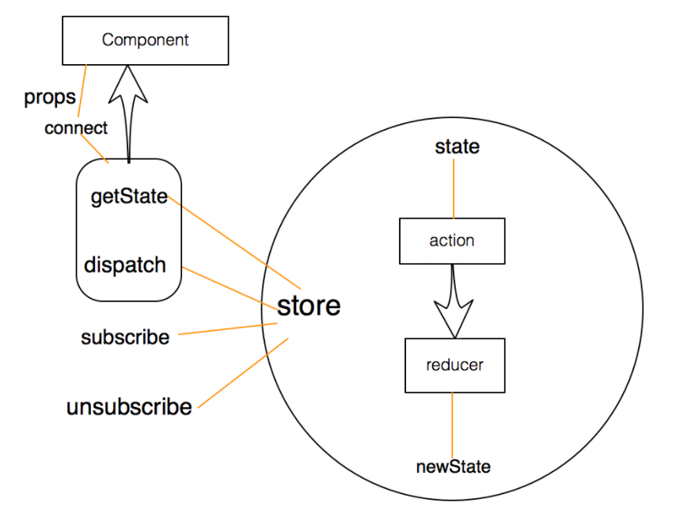


## 三、项目结构

可以根据项目具体情况进行选择，以下列出两种常见的组织结构

#### 按角色组织（MVC）

角色如下：

- reducers 
- actions
- components 
- containers 

参考如下：

```js
reducers/
  todoReducer.js
  filterReducer.js
actions/
  todoAction.js
  filterActions.js
components/
  todoList.js
  todoItem.js
  filter.js
containers/
  todoListContainer.js
  todoItemContainer.js
  filterContainer.js
```

#### 按功能组织

使用`redux`使用功能组织项目，也就是把完成同一应用功能的代码放在一个目录下，一个应用功能包含多个角色的代码

`Redux`中，不同的角色就是`reducer`、`actions`和视图，而应用功能对应的就是用户界面的交互模块

参考如下：

```js
todoList/
  actions.js
  actionTypes.js
  index.js
  reducer.js
  views/
    components.js
    containers.js
filter/
  actions.js
  actionTypes.js
  index.js
  reducer.js
  views/
    components.js
    container.js
```

每个功能模块对应一个目录，每个目录下包含同样的角色文件：

- actionTypes.js 定义action类型
- actions.js 定义action构造函数
- reducer.js  定义这个功能模块如果响应actions.js定义的动作
- views 包含功能模块中所有的React组件，包括展示组件和容器组件
- index.js 把所有的角色导入，统一导出

其中`index`模块用于导出对外的接口

```js
import * as actions from './actions.js';
import reducer from './reducer.js';
import view from './views/container.js';

export { actions, reducer, view };
```

导入方法如下：

```js
import { actions, reducer, view as TodoList } from './xxxx'
```


**要点**：
### 1. **在 React 项目中使用 Redux 的流程**

#### 1.1 安装与配置 Redux

- **安装依赖**：首先安装 Redux 和 React-Redux，通常还会使用 Redux Toolkit 来简化 Redux 的使用。

     ```bash
     npm install redux react-redux @reduxjs/toolkit
     ```

- **创建 Store**：使用 Redux Toolkit 的 `configureStore` 方法来创建 Redux 的 store。

     ```javascript
     import { configureStore } from '@reduxjs/toolkit';
     import rootReducer from './reducers';

     const store = configureStore({
       reducer: rootReducer,
     });

     export default store;
     ```

#### 1.2 创建 Reducer 和 Action

- **定义 Slice**：在 Redux Toolkit 中，通常使用 `createSlice` 方法来定义 reducer 和 action。

     ```javascript
     import { createSlice } from '@reduxjs/toolkit';

     const counterSlice = createSlice({
       name: 'counter',
       initialState: 0,
       reducers: {
         increment: (state) => state + 1,
         decrement: (state) => state - 1,
       },
     });

     export const { increment, decrement } = counterSlice.actions;
     export default counterSlice.reducer;
     ```

#### 1.3 连接 Redux 与 React

- **提供 Store**：使用 `Provider` 组件将 Redux store 提供给整个应用。

     ```javascript
     import React from 'react';
     import ReactDOM from 'react-dom';
     import { Provider } from 'react-redux';
     import store from './store';
     import App from './App';

     ReactDOM.render(
       <Provider store={store}>
         <App />
       </Provider>,
       document.getElementById('root')
     );
     ```

- **使用状态和派发动作**：使用 `useSelector` 获取状态，使用 `useDispatch` 派发动作。

     ```javascript
     import React from 'react';
     import { useSelector, useDispatch } from 'react-redux';
     import { increment, decrement } from './counterSlice';

     function Counter() {
       const count = useSelector((state) => state.counter);
       const dispatch = useDispatch();

       return (
         <div>
           <button onClick={() => dispatch(decrement())}>-</button>
           <span>{count}</span>
           <button onClick={() => dispatch(increment())}>+</button>
         </div>
       );
     }

     export default Counter;
     ```

### 2. **项目结构的划分**

#### 2.1 典型的 Redux 项目结构

- **src/**
  - **components/**：用于存放无状态的展示组件，通常只负责 UI 渲染。
  - **features/** 或 **slices/**：用于存放 Redux 相关的逻辑，每个功能模块一个文件夹。
    - **counterSlice.js**：定义 `slice` 和相关的 actions、reducers。
  - **reducers/**：用于存放 `rootReducer` 和其他手动管理的 reducers。
    - **index.js**：组合所有 reducers。
  - **store/**：用于存放 Redux 的 store 配置文件。
    - **index.js**：创建并导出 Redux store。
  - **App.js**：应用的根组件，通常在这里引入 `Provider`。
  - **index.js**：入口文件，渲染根组件。

#### 2.2 示例结构

```
src/
│
├── components/
│   └── Counter.js
│
├── features/
│   └── counterSlice.js
│
├── reducers/
│   └── index.js
│
├── store/
│   └── index.js
│
├── App.js
└── index.js
```

### 3. **使用 Redux 的注意事项**

- **全局状态管理**：Redux 适合管理跨组件或跨页面的全局状态，但对于局部状态或简单的状态管理，可以考虑使用 React 的内置 `useState` 和 `useContext`。
- **Redux Toolkit 的优势**：通过 Redux Toolkit，简化了传统 Redux 的配置流程，减少了样板代码。
- **异步操作**：通常使用 Redux Thunk 或 Redux Saga 处理异步操作，通过 `extraReducers` 或自定义中间件来实现复杂的逻辑。


---
### 428. react 中，在什么场景下需要使用 useContext？

**难度**：★★★☆☆ | **题型**：QA | **分类**：全部 / React.js

**题目**：


**参考答案**：
在 React 中，`useContext` 是一个用于在组件树中共享状态或数据的钩子。它允许我们在没有通过属性逐层传递的情况下，将数据从祖先组件传递到后代组件。`useContext` 主要用于避免 prop drilling 问题，即当需要将数据从顶层组件传递到深层嵌套的组件时，可能会涉及多层组件传递属性，代码会变得冗长和难以维护。

### 使用 `useContext` 的场景

1. **全局状态管理**：
   - 当你需要在多个组件之间共享全局状态时，`useContext` 是一个简单而有效的工具。例如，用户认证状态、主题设置或语言选择等全局数据可以通过 `useContext` 在整个应用中访问。
   
   ```javascript
   const UserContext = React.createContext();

   function App() {
       const [user, setUser] = useState(null);

       return (
           <UserContext.Provider value={user}>
               <UserProfile />
           </UserContext.Provider>
       );
   }

   function UserProfile() {
       const user = useContext(UserContext);
       return <div>{user ? `Welcome, ${user.name}` : 'Not logged in'}</div>;
   }
   ```

2. **避免 prop drilling**：
   - 当数据需要从顶层组件传递到深层嵌套的子组件时，使用 `useContext` 可以避免将数据逐层通过 `props` 传递。这样可以减少中间组件不必要的属性传递，保持代码的简洁和清晰。

   ```javascript
   const ThemeContext = React.createContext();

   function App() {
       const theme = 'dark';

       return (
           <ThemeContext.Provider value={theme}>
               <Toolbar />
           </ThemeContext.Provider>
       );
   }

   function Toolbar() {
       return (
           <div>
               <ThemedButton />
           </div>
       );
   }

   function ThemedButton() {
       const theme = useContext(ThemeContext);
       return <button className={theme}>Themed Button</button>;
   }
   ```

3. **跨组件通信**：
   - 在组件树的不同部分之间进行通信时，`useContext` 提供了一种简单的方式来共享信息，而不需要通过复杂的回调或全局事件总线。

4. **复杂应用中的配置和设置**：
   - 在需要全局配置（如路由、表单验证、国际化等）的复杂应用中，`useContext` 使得这些配置可以被所有需要的组件访问，而不需要反复传递。

5. **在与 `useReducer` 结合使用时**：
   - `useReducer` 可以用来管理复杂的本地状态。将 `useReducer` 与 `useContext` 结合使用时，可以将状态和分发函数提供给需要的组件，而无需逐层传递。

   ```javascript
   const CountContext = React.createContext();

   function reducer(state, action) {
       switch (action.type) {
           case 'increment':
               return { count: state.count + 1 };
           case 'decrement':
               return { count: state.count - 1 };
           default:
               throw new Error();
       }
   }

   function Counter() {
       const [state, dispatch] = useReducer(reducer, { count: 0 });

       return (
           <CountContext.Provider value={{ state, dispatch }}>
               <ChildComponent />
           </CountContext.Provider>
       );
   }

   function ChildComponent() {
       const { state, dispatch } = useContext(CountContext);
       return (
           <div>
               Count: {state.count}
               <button onClick={() => dispatch({ type: 'increment' })}>+</button>
               <button onClick={() => dispatch({ type: 'decrement' })}>-</button>
           </div>
       );
   }
   ```

### 适用性与注意事项

- **适用性**：
  - `useContext` 适用于需要跨多个组件共享状态的场景，避免不必要的属性传递，特别是在状态涉及到多个组件层级时。

- **注意事项**：
  - 不要滥用 `useContext`。如果数据仅在少量组件之间共享，或局部状态足够处理问题，可能并不需要使用 `useContext`。
  - `useContext` 提供的数据是引用类型的，如果上下文中的数据变化会导致使用该上下文的所有组件重新渲染。因此，确保合理组织和管理上下文的数据以避免性能问题。

**要点**：
- **`useContext` 适用于**：跨组件树共享数据、避免属性钻取、全局状态管理、跨组件通信等场景。
- **避免滥用**：仅在必要时使用 `useContext`，以避免不必要的复杂性和性能开销。

---
### 429. 在 React 中如何实现代码分割？有哪些常见方式？

**难度**：★★★☆☆ | **题型**：QA | **分类**：全部 / React.js

**题目**：


**参考答案**：
在 React 中，代码分割主要依赖于 **`React.lazy` + `Suspense`** 和 **`React Loadable`（第三方库）**，此外 Webpack 的 **`import()`** 也能实现代码分割。

常见方式如下：  

1. **`React.lazy` + `Suspense`**（官方推荐）  
   ```tsx
   const LazyComponent = React.lazy(() => import('./LazyComponent'));
   function App() {
     return (
       <Suspense fallback={<div>Loading...</div>}>
         <LazyComponent />
       </Suspense>
     );
   }
   ```

2. **`import()` 动态导入**（适用于路由懒加载）  
   ```tsx
   import { lazy } from 'react';
   const LazyPage = lazy(() => import('./pages/LazyPage'));
   ```

3. **`React Loadable`（第三方库，适用于更复杂的场景）**  
   ```tsx
   import Loadable from 'react-loadable';
   const LoadableComponent = Loadable({
     loader: () => import('./MyComponent'),
     loading: () => <div>Loading...</div>,
   });
   ```

4. **Webpack `import()` + `optimization.splitChunks`**（适用于手动分割多个模块）  
   ```js
   module.exports = {
     optimization: {
       splitChunks: {
         chunks: 'all',
       },
     },
   };
   ```

**要点**：
- **首选 `React.lazy + Suspense`** 进行懒加载，适用于组件级别的代码分割。  
- **对于路由懒加载**，可以结合 React Router 使用 `lazy`。  
- **`React Loadable`** 提供更丰富的加载状态控制。  
- **Webpack `splitChunks`** 适用于全局优化代码分割，避免重复加载。

---
### 433. React.memo() 和 useMemo() 的用法是什么，有哪些区别？

**难度**：★★★☆☆ | **题型**：QA | **分类**：全部 / React.js / 性能优化

**题目**：


**参考答案**：
在软件开发中，我们通常痴迷于性能提升以及如何使我们的应用程序执行得更快，从而为用户提供更好的体验。

Memoization 是优化性能的方法之一。 在本文中，我们将探讨它在 React 中的工作原理。

# 什么是 memoization？
在解释这个概念之前，让我们先来看一个简单的斐波那契程序：
```javascript
function fibonacci(n){
  return (n < 2) ? n : fibonacci(n-1) + fibonacci(n-2);
}
```
显然这个算法缓慢的令人绝望，因为做了非常多的冗余计算，这个时候memoization就可以派上用场了！

简单来说，memoization 是一个过程，它允许我们缓存递归/昂贵的函数调用的值，以便下次使用相同的参数调用函数时，返回缓存的值而不必重新计算函数。

这确保了我们的应用程序运行得更快，因为我们通过返回一个已经存储在内存中的值来避免重新执行函数需要的时间。

# 为什么在 React 中使用 memoization？
在 React 函数组件中，当组件中的 props 发生变化时，默认情况下整个组件都会重新渲染。 换句话说，如果组件中的任何值更新，整个组件将重新渲染，包括尚未更改其 values/props 的函数/组件。

让我们看一个发生这种情况的简单示例。 我们将构建一个基本的应用程序，告诉用户哪种酒最适合与它们选择的奶酪搭配。

我们将从设置两个组件开始。 第一个组件将允许用户选择奶酪。 然后它会显示最适合该奶酪的酒的名称。 第二个组件将是第一个组件的子组件。 在这个组件中，没有任何变化。 我们将使用这个组件来跟踪 React 重新渲染的次数。

> 注意，本示例中使用的 `classNames` 来自 Tailwind CSS。

下面是我们的父组件：`<ParentComponent />`。

```
// components/parent-component.js
import Counts from "./counts";
import Button from "./button";
import { useState, useEffect } from "react";
import constants from "../utils";
const { MOZARELLA, CHEDDAR, PARMESAN, CABERNET, CHARDONAY, MERLOT } = constants;

export default function ParentComponent() {
  const [cheeseType, setCheeseType] = useState("");
  const [wine, setWine] = useState("");
  const whichWineGoesBest = () => {
    switch (cheeseType) {
      case MOZARELLA:
        return setWine(CABERNET);
      case CHEDDAR:
        return setWine(CHARDONAY);
      case PARMESAN:
        return setWine(MERLOT);
      default:
        CHARDONAY;
    }
  };
  useEffect(() => {
    let mounted = true;
    if (mounted) {
      whichWineGoesBest();
    }
    return () => (mounted = false);
  }, [cheeseType]);

  return (
    <div className="flex flex-col justify-center items-center">
        <h3 className="text-center dark:text-gray-400 mt-10">
          Without React.memo() or useMemo()
        </h3>
      <h1 className="font-semibold text-2xl dark:text-white max-w-md text-center">
        Select a cheese and we will tell you which wine goes best!
      </h1>
      <div className="flex flex-col gap-4 mt-10">
        <Button text={MOZARELLA} onClick={() => setCheeseType(MOZARELLA)} />
        <Button text={CHEDDAR} onClick={() => setCheeseType(CHEDDAR)} />
        <Button text={PARMESAN} onClick={() => setCheeseType(PARMESAN)} />
      </div>
      {cheeseType && (
        <p className="mt-5 dark:text-green-400 font-semibold">
          For {cheeseType}, <span className="dark:text-yellow-500">{wine}</span>{" "}
          goes best.
        </p>
      )}
      <Counts />
    </div>
  );
}
```

第二个组件是 `<Counts />` 组件，它跟踪整个 `<Parent Component />` 组件重新渲染的次数。

```
// components/counts.js
import { useRef } from "react";
export default function Counts() {
  const renderCount = useRef(0);
  return (
    <div className="mt-3">
      <p className="dark:text-white">
        Nothing has changed here but I've now rendered:{" "}
        <span className="dark:text-green-300 text-grey-900">
          {(renderCount.current++)} time(s)
        </span>
      </p>
    </div>
  );
}
```

下面的例子是我们点击奶酪名字时的效果:


`<ParentComponent />` 中的 `<Counts />` 组件计算了因 `<ParentComponent />` 的更改而强制 `<Counts />` 组件重新渲染的次数。

目前，单击奶酪名字将更新显示下面的奶酪名字以及酒名。 除了 `<ParentComponent />` 会重新渲染，`<Counts />` 组件也会重新渲染，即使其中的任何内容都没有改变。

想象一下，有一个组件显示数以千计的数据，每次用户单击一个按钮时，该组件或树中的每条数据都会在不需要更新时重新渲染。 这就是 `React.memo()` 或 `useMemo()` 为我们提供性能优化所必需的地方。

现在，让我们探索 `React.memo` 以及 `useMemo()`。 之后我们将比较它们之间的差异，并了解何时应该使用一种而不是另一种。

# 什么是 React.memo()？
`React.memo()` 随 [React v16.6](https://reactjs.org/blog/2018/10/23/react-v-16-6.html) 一起发布。 虽然类组件已经允许您使用 [PureComponent](https://reactjs.org/docs/react-api.html#reactpurecomponent) 或 [shouldComponentUpdate](https://reactjs.org/docs/react-component.html#shouldcomponentupdate) 来控制重新渲染，但 React 16.6 引入了对函数组件执行相同操作的能力。

`React.memo()` 是一个[高阶组件 (HOC)](https://reactjs.org/docs/higher-order-components.html)，它接收一个组件A作为参数并返回一个组件B，如果组件B的 props（或其中的值）没有改变，则组件 B 会阻止组件 A 重新渲染 。

我们将采用上面相同的示例，但在我们的 `<Counts />` 组件中使用 `React.memo()`。 我们需要做的就是用 `React.memo()` 包裹我们的 `<Counts /> `组件，如下所示：

```
import { useRef } from "react";
function Counts() {
  const renderCount = useRef(0);
  return (
    <div className="mt-3">
      <p className="dark:text-white">
        Nothing has changed here but I've now rendered:{" "}
        <span className="dark:text-green-300 text-grey-900">
          {(renderCount.current ++)} time(s)
      </span>
      </p>
    </div>
  );
}
export default React.memo(Counts);
```

现在，当我们通过单击选择奶酪类型时，我们的 `<Counts />` 组件将不会重新渲染。


# 什么是 useMemo()？

`React.memo()` 是一个 HOC，而 [useMemo()](https://blog.logrocket.com/react-reference-guide-hooks-api/#usememo) 是一个 React Hook。 使用 `useMemo()`，我们可以返回记忆值来避免函数的依赖项没有改变的情况下重新渲染。

为了在我们的代码中使用 `useMemo()`，[React 开发者有一些建议给我们](https://blog.logrocket.com/rethinking-hooks-memoization/)：

- 您可以依赖 `useMemo()` 作为性能优化，而不是语义保证
- 函数内部引用的每个值也应该出现在依赖项数组中

对于我们的下一个示例，我们将对 `<ParentComponent />` 进行一些更改。 下面的代码仅显示对我们之前创建的 `<ParentComponent />` 的新更改。

```
// components/parent-component.js

import { useState, useEffect, useRef, useMemo } from "react";
import UseMemoCounts from "./use-memo-counts";

export default function ParentComponent() {
  const [times, setTimes] = useState(0);
  const useMemoRef = useRef(0);

  const incrementUseMemoRef = () => useMemoRef.current++;

  // uncomment the next line to test that <UseMemoCounts /> will re-render every t ime the parent re-renders.
  // const memoizedValue = useMemoRef.current++;

// the next line ensures that <UseMemoCounts /> only renders when the times value changes
const memoizedValue = useMemo(() => incrementUseMemoRef(), [times]);

  return (
    <div className="flex flex-col justify-center items-center border-2 rounded-md mt-5 dark:border-yellow-200 max-w-lg m-auto pb-10 bg-gray-900">
        <div className="mt-4 text-center">
          <button
            className="bg-indigo-200 py-2 px-10 rounded-md"
            onClick={() => setTimes(times+1)}
          >
            Force render
          </button>

          <UseMemoCounts memoizedValue={memoizedValue} />
        </div>
    </div>
  );
}
```

首先，我们引入了非常重要的 `useMemo()` Hook。 我们还引入了 `useRef()` Hook 来帮助我们跟踪在我们的组件中发生了多少次重新渲染。 接下来，我们声明一个 `times` 状态，稍后我们将更新该状态来触发/强制重新渲染。

之后，我们声明一个 `memoizedValue` 变量，用于存储 `useMemo()` Hook 的返回值。` useMemo()` Hook 调用我们的 `incrementUseMemoRef` 函数，它会在每次依赖项发生变化时将我们的 `useMemoRef.current` 值加一，即 `times` 值发生变化。

然后我们创建一个按钮来点击更新`times`的值。 单击此按钮将触发我们的 `useMemo()` Hook，更新 `memoizedValue` 的值，并重新渲染我们的 `<UseMemoCounts />` 组件。

在这个例子中，我们还将 `<Counts />` 组件重命名为 `<UseMemoCounts />`，它现在需要一个 `memoizedValue` 属性。

这是它的样子：
```
// components/use-memo-counts.js

function UseMemoCounts({memoizedValue}) {
  return (
    <div className="mt-3">
      <p className="dark:text-white max-w-md">
        I'll only re-render when you click <span className="font-bold text-indigo-400">Force render.</span> 
        </p>
      <p className="dark:text-white">I've now rendered: <span className="text-green-400">{memoizedValue} time(s)</span> </p>
    </div>
  );
}
export default UseMemoCounts;
```

现在，当我们单击任何奶酪按钮时，我们的 `memoizedValue` 不会更新。 但是当我们单击 **Force render** 按钮时，我们看到 `memoizedValue` 更新并且 `<UseMemoCounts />` 组件重新渲染。


如果您注释掉我们当前的 `memoizedValue` 行，并取消注释掉它上面的行：
```
const memoizedValue = useMemoRef.current++;
```

您将看到 `<UseMemoCounts />` 组件在每次 `<ParentComponent />` 渲染时重新渲染。

# 总结：React.memo() 和 useMemo() 的主要区别

从上面的例子中，我们可以看到 `React.memo()` 和 `useMemo()` 之间的主要区别：

- `React.memo()` 是一个高阶组件，我们可以使用它来包装我们不想重新渲染的组件，除非其中的 props 发生变化
- `useMemo()` 是一个 React Hook，我们可以使用它在组件中包装函数。 我们可以使用它来确保该函数中的值仅在其依赖项之一发生变化时才重新计算

虽然 memoization 似乎是一个可以随处使用的巧妙小技巧，但只有在绝对需要这些性能提升时才应该使用它。 Memoization 会占用运行它的机器上的内存空间，因此可能会导致意想不到的效果。

**要点**：
**作答思路：**

React.memo() 和 useMemo() 都是React中用于性能优化的工具，但它们的作用对象和使用场景不同。

1. **React.memo()**：
   - 作用于组件，用于减少不必要的渲染。
   - 只有当组件的props发生变化时，才会重新渲染组件。
   - 它是一个高阶组件，可以接受一个组件作为参数，并返回一个新的组件。
2. **useMemo()**：
   - 作用于函数组件，用于减少不必要的计算。
   - 只有当依赖项发生变化时，才会重新计算memoized的值。
   - 它是React的Hooks API的一部分，可以在函数组件中使用。
**区别**：

- **作用对象**：React.memo()作用于组件，useMemo()作用于函数组件的计算逻辑。
- **优化目的**：React.memo()优化组件的渲染，useMemo()优化函数组件中的计算。
- **使用场景**：React.memo()适用于父组件通过props传递数据给子组件，useMemo()适用于函数组件中的计算逻辑。

**考察要点**：

1. **React.memo()概念**：理解React.memo()的作用和用途。
2. **useMemo()概念**：理解useMemo()的作用和用途。


---
### 434. 说说你对 dangerouslySetInnerHTML 的理解

**难度**：★☆☆☆☆ | **题型**：QA | **分类**：全部 / React.js

**题目**：


**参考答案**：
本文介绍了在React应用程序中使用`dangerouslySetInnerHTML` 属性的原因，它相当于浏览器DOM中的`innerHTML` 属性。

## 什么是`dangerouslySetInnerHTML` ？

`dangerouslySetInnerHTML` 是一个属性，你可以在 React 应用程序中的 HTML 元素上使用，以编程方式设置其内容。你可以直接在元素上使用这个属性，而不是使用选择器来抓取HTML元素，然后设置其`innerHTML` 。

当使用`dangerouslySetInnerHTML` ，React也知道该特定元素的内容是动态的，对于该节点的子节点，它只是跳过与虚拟DOM的比较，以获得一些额外的性能。

正如该属性的名称所暗示的，使用它可能是危险的，因为它使你的代码容易受到跨站脚本（XSS）攻击。特别是当你从第三方来源获取数据或渲染用户提交的内容时，这就成为一个问题。

## 何时使用`dangerouslySetInnerHTML`

你需要设置DOM元素的HTML内容的一个用例是当你用来自富文本编辑器的数据填充一个`<div>` 。想象一下，你有一个网页，人们可以提交评论，你允许他们使用一个富文本编辑器。在这种情况下，富文本编辑器的输出很可能是带有标签的HTML，如`<p>`,`<b>`, 和`` 。

考虑一下下面的代码片段，它将在不知道其中的`<b>` 标签的情况下渲染字符串--意味着输出的只是字符串本身，没有任何粗体字，就像这样：lorem **ipsum**。

```javascript
const App = () => {
  const data = 'lorem <b>ipsum</b>';

  return (
    <div>
      {data}
    </div>
  );
}

export default App;
```

但当使用`dangerouslySetInnerHTML` ，React就会意识到HTML标签，并正确渲染它们。这一次，输出将以粗体文本正确呈现（即lorem**ipsum**）。

```ini
const App = () => {
  const data = 'lorem <b>ipsum</b>';

  return (
    <div
      dangerouslySetInnerHTML={{__html: data}}
    />
  );
}

export default App;
```

请注意，它应该是一个带有传递给`__html` 键的对象`dangerouslySetInnerHTML` 。除此之外，你使用`dangerouslySetInnerHTML` 属性的元素不应该有任何孩子，因此要使用`<div>` 元素作为自闭标签。

传递对象的要求只是另一种保障措施，以防止开发者在没有阅读文档和意识到潜在危险的情况下使用它。

## 使用时的消毒`dangerouslySetInnerHTML`

上面的例子在渲染时不会造成危险。然而，在某些情况下，HTML元素可能会执行一个脚本。

考虑一下下面的例子，一个JavaScript事件被附加到一个HTML元素上。虽然这些是无害的例子，但它们是概念的证明，表明一个HTML元素如何被利用来运行恶意脚本。

```ini
const App = () => {
  const data = `lorem <b onmouseover="alert('mouseover');">ipsum</b>`;

  return (
    <div
      dangerouslySetInnerHTML={{__html: data}}
    />
  );
}

export default App;


const App = () => {
  const data = `lorem ipsum `;

  return (
    <div
      dangerouslySetInnerHTML={{__html: data}}
    />
  );
}

export default App;
```

幸运的是，有针对HTML的净化工具，可以检测出HTML代码中潜在的恶意部分，然后输出一个干净安全的版本。最受欢迎的HTML净化工具是[DOMPurify](https://github.com/cure53/DOMPurify)。

让我们使用它的[在线演示](https://cure53.de/purify)来对上述HTML代码进行消毒，看看它是如何检测并过滤掉代码中可能在执行时产生危险的部分的。

```less
Original
lorem <b onmouseover="alert('mouseover');">ipsum</b>

Sanitized
lorem <b>ipsum</b>
```

```ini
Original
lorem ipsum 

Sanitized
lorem ipsum 
```

即使在我们信任数据来源的情况下，使用消毒剂也是很好的做法。在使用DOMPurify包的情况下，上面的一个例子会是这样的。

```javascript
import DOMPurify from 'dompurify'

const App = () => {
  const data = `lorem <b onmouseover="alert('mouseover');">ipsum</b>`
  const sanitizedData = () => ({
    __html: DOMPurify.sanitize(data)
  })

  return (
    <div
      dangerouslySetInnerHTML={sanitizedData()}
    />
  );
}

export default App;
```

`sanitizedData` 函数返回一个带有`__html` 键的对象，它有一个从`DOMPurify.sanitize` 函数返回的值。

正如预期的那样，当我们将鼠标悬停在粗体字上时，并没有执行警报函数。

请注意，由于DOMPurify需要一个DOM树，而Node环境没有，你要么使用`jsdom` 包来创建一个`window` 对象，并用它来初始化`DOMPurify` ，要么单独使用`isomorphic-dompurify` 包来代替，它同时封装了`DOMPurify` 和`jsdom` 包。

如果你喜欢第一种选择，你可以参考以下来自`DOMPurify` 的文档片段。

```ini
const createDOMPurify = require('dompurify');
const { JSDOM } = require('jsdom');

const window = new JSDOM('').window;
const DOMPurify = createDOMPurify(window);

const clean = DOMPurify.sanitize(dirty);
```

## 结论

总之，`dangerouslySetInnerHTML` 只不过是React中`innerHTML` 的替代品，应该谨慎使用。虽然这个名字暗示了使用它的危险性，但通过使用一个完善的净化器采取必要的措施，确保代码是干净的，在React节点内呈现时不会运行意外的脚本。

**要点**：
`dangerouslySetInnerHTML` 是 React 中一个非常强大但也非常危险的属性。它允许开发者直接将 HTML 字符串插入到 React 组件的 DOM 中,而不是使用 React 的标准 JSX 语法。

使用 `dangerouslySetInnerHTML` 有以下几个注意事项:

1. **XSS 风险**:
   - 由于直接插入 HTML 字符串,如果字符串中包含恶意的 JavaScript 代码,就可能导致 XSS (跨站脚本攻击)漏洞。
   - 这意味着恶意攻击者可以通过注入恶意代码来窃取用户数据或破坏页面。

2. **性能影响**:
   - 直接操作 DOM 可能会导致性能问题,因为 React 无法对其进行优化和diff。
   - 相比之下,使用标准 JSX 语法可以让 React 对 DOM 进行高效的更新和渲染。

3. **可维护性降低**:
   - 使用 `dangerouslySetInnerHTML` 会降低代码的可读性和可维护性,因为它打破了 React 的声明式渲染模型。
   - 代码中会出现一些难以理解的 HTML 字符串,使得代码变得难以维护。

因此,`dangerouslySetInnerHTML` 应该谨慎使用,只有在确实没有其他更好的解决方案时才可以考虑使用。通常情况下,我们应该尽量避免使用它,而是使用标准的 React 渲染方式。如果必须使用,则需要非常小心地对输入进行严格的过滤和消毒,以防止 XSS 攻击。


---
### 461. React 中如果绑定事件使用匿名函数有什么影响？

**难度**：★☆☆☆☆ | **题型**：QA | **分类**：全部 / React.js

**题目**：


**参考答案**：
```react.js
class Demo {
  render() {
    return <button onClick={(e) => {
      alert('我点击了按钮')
    }}>
      按钮
    </button>
  }
}

```

这样的写法，因为使用的是匿名函数，所以组件每次都会认为是一个新的 props，不会使用缓存优化，在性能上会有一定的损耗。


---
### 499. React 中怎么实现状态自动保存（KeepAlive）？

**难度**：★★★★☆ | **题型**：QA | **分类**：全部 / React.js

**题目**：


**参考答案**：
## 什么是状态保存？

假设有下述场景：

移动端中，用户访问了一个列表页，上拉浏览列表页的过程中，随着滚动高度逐渐增加，数据也将采用触底分页加载的形式逐步增加，列表页浏览到某个位置，用户看到了感兴趣的项目，点击查看其详情，进入详情页，从详情页退回列表页时，需要停留在离开列表页时的浏览位置上

类似的数据或场景还有已填写但未提交的表单、管理系统中可切换和可关闭的功能标签等，这类数据随着用户交互逐渐变化或增长，这里理解为状态，在交互过程中，因为某些原因需要临时离开交互场景，则需要对状态进行保存

在 React 中，我们通常会使用路由去管理不同的页面，而在切换页面时，路由将会卸载掉未匹配的页面组件，所以上述列表页例子中，当用户从详情页退回列表页时，会回到列表页顶部，因为列表页组件被路由卸载后重建了，状态被丢失。

## 如何实现 React 中的状态保存

在 Vue 中，我们可以非常便捷地通过 <keep-alive> 标签实现状态的保存，该标签会缓存不活动的组件实例，而不是销毁它们

而在 React 中并没有这个功能，曾经有人在官方提过相关 issue ，但官方认为这个功能容易造成内存泄露，表示暂时不考虑支持，所以我们需要自己想办法了。

## 常见的解决方式：手动保存状态

手动保存状态，是比较常见的解决方式，可以配合 React 组件的 componentWillUnmount 生命周期通过 redux 之类的状态管理层对数据进行保存，通过 componentDidMount 周期进行数据恢复

在需要保存的状态较少时，这种方式可以比较快地实现我们所需功能，但在数据量大或者情况多变时，手动保存状态就会变成一件麻烦事了

作为程序员，当然是尽可能懒啦，为了不需要每次都关心如何对数据进行保存恢复，我们需要研究如何自动保存状态

## 通过路由实现自动状态保存（通常使用 react-router）

既然 React 中状态的丢失是由于路由切换时卸载了组件引起的，那可以尝试从路由机制上去入手，**改变路由对组件的渲染行为**

我们有以下的方式去实现这个功能：

* 重写 <Route> 组件，可参考 [react-live-route](https://github.com/fi3ework/react-live-route)。重写可以实现我们想要的功能，但成本也比较高，需要注意对原始 <Route> 功能的保存，以及多个 react-router 版本的兼容
* 重写路由库，可参考 [react-keeper](https://github.com/lanistor/react-keeper) 。重写路由库成本是一般开发者无法承受的，且完全替换掉路由方案是一个风险较大的事情，需要较为慎重地考虑。
* 基于 <Route> 组件现有行为做拓展，可参考 [react-router-cache-route](https://github.com/CJY0208/react-router-cache-route) 。在阅读了 <Route> 的源码后发现，如果使用 component 或者 render 属性，都无法避免路由在不匹配时被卸载掉的命运。但将 children 属性当作方法来使用，我们就有手动控制渲染的行为的可能。

上面几种方案，主要通过路由入手实现自动状态保存的可能，但终究不是真实的、纯粹的 KeepAlive 功能。

## 模拟真实的 <KeepAlive> 功能

以下是期望的使用方式

```js
function App() {
  const [show, setShow] = useState(true)

  return (
    <div>
      <button onClick={() => setShow(show => !show)}>Toggle</button>
      {show && (
        <KeepAlive>
          <Test />
        </KeepAlive>
      )}
    </div>
  )
}
```

下面简单介绍下 [react-activation](https://github.com/CJY0208/react-activation) 的实现原理：由于 React 会卸载掉处于固有组件层级内的组件，所以我们需要将 <KeepAlive> 中的组件，也就是其 children 属性抽取出来，渲染到一个不会被卸载的组件 <Keeper> 内，再使用 DOM 操作将 <Keeper> 内的真实内容移入对应 <KeepAlive>，就可以实现此功能。


---
### 518. React中的类组件和函数组件之间有什么区别？

**难度**：★☆☆☆☆ | **题型**：QA | **分类**：全部 / React.js

**题目**：


**参考答案**：

## 类组件（Class components）

* 无论是使用函数或是类来声明一个组件，它决不能修改它自己的 props。
	* 所有 React 组件都必须是纯函数，并禁止修改其自身 props。
* React是单项数据流，父组件改变了属性，那么子组件视图会更新。
	* 属性 props是外界传递过来的，状态 state是组件本身的，状态可以在组件中任意修改
	* 组件的属性和状态改变都会更新视图。
    
```react.js
class Welcome extends React.Component {
  render() {
    return (
      <h1>Welcome { this.props.name }</h1>
    );
  }
}
ReactDOM.render(<Welcome name='react' />, document.getElementById('root'));
```

## 函数组件（functional component）

函数组件接收一个单一的 props 对象并返回了一个React元素

```react.js
function Welcome (props) {
  return <h1>Welcome {props.name}</h1>
}
ReactDOM.render(<Welcome name='react' />, document.getElementById('root'));
```

## 区别

* 语法上

两者最明显的不同就是在语法上，函数组件是一个纯函数，它接收一个props对象返回一个react元素。而类组件需要去继承React.Component并且创建render函数返回react元素，这将会要更多的代码，虽然它们实现的效果相同。

* 状态管理

因为函数组件是一个纯函数，你不能在组件中使用setState()，这也是为什么把函数组件称作为无状态组件。

如果你需要在你的组件中使用state，你可以选择创建一个类组件或者将state提升到你的父组件中，然后通过props对象传递到子组件。

* 生命周期钩子

你不能在函数组件中使用生命周期钩子，原因和不能使用state一样，所有的生命周期钩子都来自于继承的React.Component中。

因此，如果你想使用生命周期钩子，那么需要使用类组件。

**注意**：在react16.8版本中添加了hooks，使得我们可以在函数组件中使用useState钩子去管理state，使用useEffect钩子去使用生命周期函数。因此，2、3两点就不是它们的区别点。从这个改版中我们可以看出作者更加看重函数组件，而且react团队曾提及到在react之后的版本将会对函数组件的性能方面进行提升。

* 调用方式

如果SayHi是一个函数，React需要调用它：

```react.js
// 你的代码 
function SayHi() { 
    return <p>Hello, React</p> 
} 
// React内部 
const result = SayHi(props) // » <p>Hello, React</p>
```

如果SayHi是一个类，React需要先用new操作符将其实例化，然后调用刚才生成实例的render方法：

```react.js
// 你的代码 
class SayHi extends React.Component { 
    render() { 
        return <p>Hello, React</p> 
    } 
} 
// React内部 
const instance = new SayHi(props) // » SayHi {} 
const result = instance.render() // » <p>Hello, React</p>
```

可想而知，函数组件重新渲染将重新调用组件方法返回新的react元素，类组件重新渲染将new一个新的组件实例，然后调用render类方法返回react元素，这也说明为什么类组件中this是可变的。


**要点**：
- **类组件**：使用 ES6 类定义，具有状态和生命周期方法，适用于需要管理复杂状态和副作用的场景。
- **函数组件**：使用函数定义，通过 Hooks 管理状态和副作用，语法简洁，推荐用于大多数组件。

在 React 生态中，函数组件与 Hooks 已成为主流的编写组件方式，因其简洁性和灵活性被广泛推荐和使用。


---
### 553. React 中的 ref 有什么用？

**难度**：★★☆☆☆ | **题型**：QA | **分类**：全部 / React.js

**题目**：


**参考答案**：
使用 refs 获取。组件被调用时会新建一个该组件的实例。refs 会指向这个实例，可以是一个回调函数，回调函数会在组件被挂载后立即执行。

如果把 refs 放到原生 DOM 组件的 input 中，我们就可以通过 refs 得到 DOM 节点；如果把 refs 放到 React 组件中，那么我们获得的就是组件的实例，因此就可以调用实例的方法（如果想访问该组件的真实 DOM，那么可以用 React.findDOMNode 来找到 DOM 节点，但是不推崇此方法）。

refs 无法用于无状态组件，无状态组件挂载时只是方法调用，没有新建实例。在 v16 之后，可以使用 useRef。

**要点**：
在 React 中，`ref` 用于：

1. **访问 DOM 元素**：直接访问和操作 DOM 元素。

   ```javascript
   const inputRef = useRef(null);
   useEffect(() => {
     inputRef.current.focus(); // 直接操作 DOM 元素
   }, []);
   ```

2. **保存组件实例**：在类组件中获取组件实例，访问实例方法或属性。

3. **集成第三方库**：将 React 组件与非 React 库或插件集成，控制非 React 组件。

4. **实现自定义行为**：例如，管理动画或捕获焦点等操作。


---
### 564. 什么是高阶组件？

**难度**：★★☆☆☆ | **题型**：QA | **分类**：全部 / React.js

**题目**：


**参考答案**：
**高阶组件**（Higher-Order Component, HOC）是 React 中的一种设计模式，用于增强或修改组件的行为。它是一个接受组件作为参数并返回一个新组件的函数。高阶组件本质上是一个函数，它用于复用组件逻辑和功能，避免在多个组件中重复代码。

### **高阶组件的特点**

1. **函数式组件增强**：
   - **接受组件**：高阶组件（HOC）是一个函数，接受一个组件作为参数。
   - **返回新组件**：它返回一个新的组件，这个新的组件通常会封装和增强原始组件的功能。

2. **逻辑复用**：
   - **复用代码**：通过高阶组件，可以在多个组件中复用相同的逻辑和功能，而不需要重复代码。这有助于提高代码的可维护性和一致性。

3. **组件装饰**：
   - **功能增强**：高阶组件可以为原始组件添加额外的功能或数据，例如提供额外的 props、处理权限控制、数据获取等。

### **使用示例**

以下是一个简单的高阶组件的示例：

```javascript
import React from 'react';

// 高阶组件的定义
const withUserData = (WrappedComponent) => {
  return class extends React.Component {
    constructor(props) {
      super(props);
      this.state = {
        user: null,
      };
    }

    componentDidMount() {
      // 模拟数据获取
      setTimeout(() => {
        this.setState({ user: { name: 'John Doe', age: 30 } });
      }, 1000);
    }

    render() {
      // 将状态和 props 传递给原始组件
      return <WrappedComponent user={this.state.user} {...this.props} />;
    }
  };
};

// 使用高阶组件
const UserProfile = ({ user }) => {
  if (!user) {
    return <div>Loading...</div>;
  }

  return (
    <div>
      <h1>{user.name}</h1>
      <p>Age: {user.age}</p>
    </div>
  );
};

export default withUserData(UserProfile);
```

### **高阶组件的常见用途**

1. **权限控制**：
   - **示例**：可以创建一个高阶组件来检查用户权限，并根据权限控制组件的渲染或访问。

2. **数据获取**：
   - **示例**：高阶组件可以在挂载时获取数据，并将数据传递给原始组件，避免在多个组件中重复数据获取逻辑。

3. **行为增强**：
   - **示例**：高阶组件可以为组件添加额外的功能，如事件处理、日志记录等。

### **注意事项**

- **不要修改原始组件**：高阶组件应该尽量不修改原始组件的实现，而是通过组合来增强其功能。
- **组件命名**：高阶组件通常会返回一个新的组件，新的组件应该有明确的命名，以便于调试和阅读代码。
- **传递静态方法**：如果需要传递静态方法或属性，可能需要手动拷贝静态方法到新组件。

**要点**：
- **高阶组件**：是一个接受组件并返回新组件的函数，用于增强或修改组件的行为。
- **逻辑复用**：可以复用逻辑和功能，避免重复代码，提高代码的可维护性。
- **常见用途**：包括权限控制、数据获取、行为增强等。

高阶组件是一种强大的模式，用于在 React 应用中进行功能增强和逻辑复用。


---
### 565. taro 的实现原理是怎么样的？

**难度**：★★★☆☆ | **题型**：QA | **分类**：全部 / React.js / 跨端技术

**题目**：


**参考答案**：
Taro 是一个多端统一开发框架，可以使用一套代码编译成微信小程序、支付宝小程序、百度智能小程序、字节跳动小程序、QQ 小程序、快应用、H5 等多个平台的应用。

Taro 的实现原理主要基于以下几个方面：

1. **JSX 转换**：Taro 使用 Babel 插件将类似 HTML 的语法转换为 React 组件。在编译过程中，Taro 还会对 JSX 语法进行优化和压缩，以避免生成不必要的代码。

2. **多端适配**：Taro 通过封装原生 API 和提供不同的 Polyfill 实现多端适配。例如，在微信小程序中，Taro 封装了 wx 对象，使得可以使用类似 React Native 的组件化开发方式；在 H5 中，Taro 则提供了针对浏览器的 Polyfill。

3. **跨端样式处理**：Taro 通过 CSS Modules 技术和 PostCSS 插件来处理 CSS 样式。在编译过程中，Taro 会将样式文件转换为 JavaScript 对象，并按需导入到组件中。同时，Taro 提供了 @import 指令或 scss 语法等方式来支持复杂的样式表达。

4. **构建系统**：Taro 使用 webpack 构建工具来打包编译后的代码，并提供了一系列开箱即用的插件、规则和配置项，例如自动化导入组件、静态资源压缩、TypeScript 支持等。

5. **运行时性能优化**：Taro 在运行时对代码进行了一些优化，例如使用字典树实现 JSX 解析、避免使用内置事件监听器、减少对原生 API 的调用等方式来优化性能。

Taro 利用 Babel、React、Webpack 等技术，通过封装原生 API 和提供不同的 Polyfill 实现了多端适配，同时也支持复杂的样式表达和自动化导入组件等特性。这些技术的应用使得 Taro 框架在性能、可维护性、跨平台等方面都表现出色。

**要点**：
Taro 的实现原理是通过编译器将统一的代码（如 React 或 Vue 代码）转化为各个平台特定的代码，结合跨平台的组件库和 API 映射，实现一次开发、多端部署。通过这种方式，Taro 使得开发者能够更高效地构建和维护跨平台应用。

---
### 577. React 中的 createContext 和 useContext 分别有什么用？

**难度**：★★★☆☆ | **题型**：QA | **分类**：全部 / React.js

**题目**：


**参考答案**：
在 React 中，`createContext` 和 `useContext` 是处理上下文的两个相关 API，但它们的功能和用途有所不同：

### **1. `createContext`**

- **作用**：用于创建一个新的上下文对象。
- **用法**：调用 `createContext` 会返回一个上下文对象，这个对象包含 `Provider` 和 `Consumer` 组件。`Provider` 用于提供上下文的值，而 `Consumer` 用于消费上下文的值。
- **示例**：
  ```jsx
  // 创建上下文对象
  const MyContext = createContext(defaultValue);

  // 提供上下文的值
  <MyContext.Provider value={someValue}>
    {/* 子组件 */}
  </MyContext.Provider>

  // 消费上下文的值
  <MyContext.Consumer>
    {value => /* 使用上下文的值 */}
  </MyContext.Consumer>
  ```

### **2. `useContext`**

- **作用**：用于在函数组件中访问上下文的值。
- **用法**：`useContext` 是一个 Hook，用于在函数组件中消费上下文的值，而不需要使用 `Consumer` 组件。
- **示例**：
  ```jsx
  import { useContext } from 'react';

  // 在函数组件中访问上下文
  const value = useContext(MyContext);
  ```

**要点**：
- `createContext`：
  - 用于创建一个新的上下文对象。
  - 需要在组件树中使用 `Provider` 来提供上下文的值，并使用 `Consumer` 或 `useContext` 来访问这些值。

- `useContext`：
  - 用于在函数组件中直接获取上下文的值。
  - 简化了消费上下文的过程，不需要显式地使用 `Consumer` 组件，适用于函数组件中。

`createContext` 和 `useContext` 通常配合使用，`createContext` 用于创建上下文，而 `useContext` 用于在函数组件中消费这个上下文的值。

---
### 596. constructor中super与props参数一起使用的目的是什么？

**难度**：★☆☆☆☆ | **题型**：QA | **分类**：全部 / React.js

**题目**：


**参考答案**：
在调用方法之前，子类构造函数无法使用this引用super()。

在ES6中，在子类的constructor中必须先调用super才能引用this。

在constructor中可以使用this.props

* 使用props：

```react.js
class MyComponent extends React.Component {
    constructor(props) {
        super(props);
        console.log(this.props);  // Prints { name: 'sudheer',age: 30 }
    }
}
```

* 不使用props：

```react.js
class MyComponent extends React.Component {
    constructor(props) {
        super();
        console.log(this.props); // Prints undefined
        // But Props parameter is still available
        console.log(props); // Prints { name: 'sudheer',age: 30 }
    }

    render() {
        // No difference outside constructor
        console.log(this.props) // Prints { name: 'sudheer',age: 30 }
    }
}
```

上面的代码片段揭示了this.props行为仅在构造函数中有所不同。外部构造函数相同。

**要点**：
- **`super(props)`**：确保在构造函数中正确初始化 `this.props`。
- **初始化 `state` 和绑定事件处理程序**：可以在构造函数中使用 `this.props` 来初始化组件状态和绑定事件处理程序。
- **必须调用**：如果在构造函数中使用 `this.props`，需要调用 `super(props)`。

通过正确使用 `super(props)`，可以确保 React 组件在构造函数中能够正常工作，并访问到 `props`。


---
### 607. 说说 React commit 阶段的执行过程

**难度**：★★★★☆ | **题型**：QA | **分类**：全部 / React.js

**题目**：


**参考答案**：
React 的渲染流程，本质上可以分成两个大阶段：

```txt id="n33u55"
Render 阶段
Commit 阶段
```

其中：

* Render 阶段负责“计算”
* Commit 阶段负责“真正修改页面”

很多人会把 React 的更新理解成：

```txt id="ff1r0n"
setState -> 页面更新
```

但实际上：

```txt id="sc5u7h"
setState
-> Fiber Reconcile
-> Render
-> Commit
-> DOM 更新
```

真正操作 DOM 的，其实是在 commit 阶段。

---

## 一、Render 阶段和 Commit 阶段的区别

React Fiber 架构里：

### Render 阶段

主要做：

* Diff
* 计算变更
* 构建新的 Fiber Tree
* 标记副作用（flags）

这个阶段：

```txt id="5p0cdh"
可以中断
可以恢复
可以被高优先级任务抢占
```

因为它本质是“纯计算”。

例如 Concurrent Mode 下：

```txt id="t3lxw7"
渲染到一半
用户输入
React 可以暂停当前渲染
```

---

但 Commit 阶段不同。

Commit 阶段：

```txt id="p5kn7k"
不可中断
必须同步执行
```

因为：

* 要修改真实 DOM
* 要执行生命周期
* 要触发副作用

如果中断，会导致 UI 状态不一致。

所以 React 会保证：

> 一旦进入 commit，就会一次性执行完成。

---

## 二、Commit 阶段整体流程

commit 阶段在源码里主要入口是：

```txt id="7vn3tm"
commitRoot()
```

整个过程通常会分成三个子阶段：

```txt id="cpr1u1"
before mutation
mutation
layout
```

React 18 后还加入了：

```txt id="bqojw2"
passive effects
```

也就是 useEffect 的异步调度。

所以完整理解可以是：

```txt id="yoq4lj"
1. beforeMutation
2. mutation
3. layout
4. passive
```

---

# 三、beforeMutation 阶段

这个阶段：

> DOM 还没有真正修改。

React 会在这里做一些“DOM 变更前”的准备工作。

例如：

* 记录当前焦点
* 获取 DOM 旧状态
* 调用 `getSnapshotBeforeUpdate`

类组件里：

```js
getSnapshotBeforeUpdate(prevProps, prevState)
```

就是在这里执行的。

典型场景：

```txt id="t4wov9"
读取滚动位置
读取 DOM 高度
```

因为：

```txt id="eqd5uq"
再晚一点 DOM 就变了
```

所以必须在 mutation 前读取。

---

## 四、mutation 阶段

这是 commit 最核心的阶段。

React 会真正执行：

```txt id="ijm7if"
DOM 操作
```

例如：

* 插入节点
* 删除节点
* 更新属性
* 更新文本
* ref detach

本质上：

```txt id="9kg6ur"
Fiber flags -> 转换成真实 DOM 操作
```

例如：

```txt id="x0g8x0"
Placement
Update
Deletion
```

这些 flags 都是在 render 阶段提前打好的。

commit 阶段只是执行。

---

这里有个非常关键的点：

## React 并不是边 render 边改 DOM

而是：

```txt id="3r2ybr"
Render 阶段算好所有变更
Commit 阶段一次性提交
```

这也是 Fiber 能支持可中断渲染的重要原因。

---

在 mutation 阶段还会执行：

```txt id="e8i7es"
ref = null
```

因为旧 DOM 即将被替换。

---

## 五、layout 阶段

mutation 完成后：

```txt id="y4y5dr"
DOM 已经更新完成
```

此时 React 会执行：

* `componentDidMount`
* `componentDidUpdate`
* `useLayoutEffect`
* ref 赋值

这个阶段特点是：

> 可以同步读取最新 DOM。

例如：

```js
useLayoutEffect(() => {
  console.log(divRef.current.offsetHeight)
})
```

这里读取到的是：

```txt id="ih5q9x"
最新 DOM
```

因为 mutation 已经结束。

---

这里也是很多性能问题的来源。

因为：

```txt id="8x5k1u"
useLayoutEffect 是同步阻塞的
```

如果这里执行：

* 大量计算
* 强制回流
* 同步测量

会阻塞浏览器绘制。

因此：

```txt id="nlkdzg"
能用 useEffect
尽量不要用 useLayoutEffect
```

---

## 六、passive effects 阶段

也就是：

```txt id="wh5iyj"
useEffect
```

它和 layout effect 最大区别是：

```txt id="mj3ij2"
异步执行
不阻塞浏览器绘制
```

React 在 commit 后：

* 先让浏览器 paint
* 再异步调度 effect

因此：

```txt id="5hz8uy"
useEffect 不适合读取同步布局
```

因为页面可能已经绘制完成。

---

React 18 中：

```txt id="xjlwm4"
flushPassiveEffects()
```

通常会通过 Scheduler 调度。

因此：

```txt id="qv8l3v"
useEffect 并不一定立即执行
```

这也是很多面试喜欢问的点。

---

## 七、commit 阶段为什么不能中断

因为 commit 阶段已经开始：

```txt id="k0z4yz"
修改真实 UI
```

如果中断：

可能会出现：

```txt id="pm0ymf"
DOM 更新了一半
Fiber 状态没同步
```

会导致：

* UI 撕裂
* 状态不一致
* ref 错乱

因此 React 保证：

```txt id="nrn1tq"
commit 是原子性的
```

一次 commit 必须完整执行。

---

## 八、React 18 中的一些变化

React 18 后：

### Concurrent Rendering

可以中断的是：

```txt id="06jvql"
Render
```

不是：

```txt id="j1pfj0"
Commit
```

很多人容易误解。

---

另外：

### 自动批处理（Auto Batching）

会让多个 state 更新：

```txt id="s9qgup"
合并进入一次 commit
```

减少 DOM 提交次数。

---

还有：

### Transition

本质上也是：

```txt id="1m7f1y"
降低 render 优先级
```

不会影响 commit 原子性。

---

## 九、一个完整流程

一次 setState 后大致流程：

```txt id="aq38a2"
setState
-> 创建 Update
-> Fiber 调度
-> Render 阶段 Diff
-> 标记 flags
-> commitRoot
   -> beforeMutation
   -> mutation
   -> layout
-> 浏览器 paint
-> passive effects(useEffect)
```

这是 React 更新的完整主链路。


**要点**：
React 的 commit 阶段负责把 render 阶段计算出的变更真正同步到 DOM，是整个更新流程中不可中断的部分。

commit 阶段主要分为 beforeMutation、mutation、layout 和 passive effect 四个阶段：
* beforeMutation 用于读取旧 DOM 状态
* mutation 负责真实 DOM 操作
* layout 阶段执行 useLayoutEffect 和生命周期
* passive 阶段异步执行 useEffect。

React Fiber 的核心思想是 render 可中断、commit 不可中断，从而既保证并发渲染能力，又保证 UI 提交的一致性。

---
### 615. 说说 Hooks 的依赖数组原理

**难度**：★★★☆☆ | **题型**：QA | **分类**：全部 / React.js

**题目**：


**参考答案**：
这个问题的核心，不是“依赖数组怎么写”，而是：**React 是如何判断副作用是否需要重新执行的**。

依赖数组的存在，本质是为了让 React 在两次 render 之间进行一次“浅层比较（shallow compare）”，从而决定是否跳过本次 effect 的执行。

---

## 一、从 useEffect 的执行时机说起

```js
useEffect(() => {
  // effect
}, [a, b]);
```

React 在每次 render 结束后，会把 effect 收集到 Fiber 节点的 effect 链表中。

当进入 commit 阶段时，React 会：

1. 取出当前 Fiber 上一次保存的依赖数组
2. 与本次 render 生成的新依赖数组进行比较
3. 决定是否标记该 effect 需要执行

如果依赖变化，则：

* 先执行上一次的 cleanup
* 再执行新的 effect

如果依赖未变化，则跳过。

---

## 二、底层判断逻辑

React 内部判断依赖是否变化，核心逻辑类似：

```js
function areHookInputsEqual(nextDeps, prevDeps) {
  if (prevDeps === null) return false;

  for (let i = 0; i < prevDeps.length; i++) {
    if (!Object.is(nextDeps[i], prevDeps[i])) {
      return false;
    }
  }
  return true;
}
```

关键点有两个：

### 1. 使用的是 Object.is

不是 `===`，而是 `Object.is`，因此：

* `NaN` 与 `NaN` 被认为相等
* `+0` 与 `-0` 被认为不相等

这是为了和 React 内部状态更新逻辑保持一致。

### 2. 只做浅比较

依赖数组中的每一项，只做引用层级的比较。

这意味着：

```js
useEffect(() => {}, [{}]);
```

每次 render 都会重新执行，因为对象引用变化。

---

## 三、为什么依赖数组必须写全

React 不会分析 effect 内部使用了哪些变量。

依赖数组完全由开发者声明。

如果 effect 内部使用了某个变量，但没有放入依赖数组，那么：

* 变量变化时 effect 不会重新执行
* effect 内部捕获的是旧闭包中的值
* 出现“闭包陷阱”（stale closure）

例如：

```js
useEffect(() => {
  console.log(count);
}, []);
```

这里只会打印初始 count，因为 effect 永远不会重新执行。

这不是 React 的 bug，而是依赖声明不完整。

ESLint 的 `react-hooks/exhaustive-deps` 插件，本质是在做静态分析，提醒依赖缺失。

---

## 四、空数组与不写依赖的区别

```js
useEffect(() => {}, []);
```

表示：只在首次挂载时执行一次（以及卸载时 cleanup）。

而：

```js
useEffect(() => {});
```

表示：每次 render 后都执行。

这两种语义差异非常大。

---

## 五、依赖数组与性能的关系

依赖数组不是用来“优化性能”的工具，而是用来声明副作用与状态之间的关系。

如果依赖声明准确：

* effect 执行次数最少
* 逻辑正确

如果为了“减少执行”而故意删除依赖：

* 会产生逻辑错误
* 引入难以排查的状态不一致问题

真正的优化方式应该是：

* 使用 useMemo / useCallback 保持引用稳定
* 或者重构 effect 逻辑

---

## 六、从 Fiber 角度理解

每个 Hook 在 Fiber 上都会形成一个链表节点：

* memoizedState：存储上一次依赖
* next：指向下一个 Hook

在下一次 render 时：

* React 按调用顺序读取对应 Hook 节点
* 拿到上一次的依赖
* 进行对比

这也是为什么 Hook 调用顺序必须稳定。

依赖数组只是挂在这个 Hook 节点上的一段元数据。

---

## 七、一个常见误区

很多人认为依赖数组是“监听变量变化”。

实际上 React 并不会监听变量。

变量变化只是触发 render，render 之后 React 才会在 commit 阶段做依赖比较。

也就是说：

依赖数组不参与“触发更新”，只参与“是否执行副作用”。


**要点**：
Hooks 的依赖数组本质是一次浅层引用比较机制。React 在 commit 阶段通过 Object.is 逐项比较新旧依赖数组，决定是否重新执行 effect，并在变化时先执行 cleanup。依赖数组不会监听变量变化，也不负责触发 render，只用于声明副作用与状态之间的关系。依赖缺失会导致闭包捕获旧值，依赖不稳定会导致 effect 频繁执行，因此依赖必须完整且保持引用稳定。

---
### 620. 什么是虚拟DOM？

**难度**：★☆☆☆☆ | **题型**：QA | **分类**：全部 / React.js / Vue.js

**题目**：


**参考答案**：
虚拟DOM（VDOM）它是真实DOM的内存表示,一种编程概念，一种模式。它会和真实的DOM同步，比如通过ReactDOM这种库，这个同步的过程叫做调和(reconcilation)。

虚拟DOM更多是一种模式，不是一种特定的技术。


---
### 628. React 为什么要废弃  componentWillMount、componentWillReceiveProps、componentWillUpdate 这三个生命周期钩子？它们有哪些问题呢？React 又是如何解决的呢？

**难度**：★★★☆☆ | **题型**：QA | **分类**：全部 / React.js

**题目**：


**参考答案**：
React 在 16.3 版本中：

* 将 `componentWillMount`、`componentWillReceiveProps`、`componentWillUpdate` 三个生命周期钩子加上了 `UNSAFE` 前缀，变为 `UNSAFE_componentWillMount`、`UNSAFE_componentWillReceiveProps` 和 `UNSAFE_componentWillUpdate`。
* 并引入了一个新的生命周期钩子：`getDerivedStateFromProps`。

并在 17.0 以及之后的版本中：
* 删除了 `componentWillMount`、`componentWillReceiveProps`、`componentWillUpdate` 这三个生命周期钩子。
* 不过 `UNSAFE_componentWillMount`、`UNSAFE_componentWillReceiveProps` 和 `UNSAFE_componentWillUpdate` 还是可以用的。

我们知道 React 的更新流程分为：render 阶段和 commit 阶段。

`componentWillMount`、`componentWillReceiveProps`、`componentWillUpdate` 这三个生命周期钩子都是在 render 阶段执行的。

在 fiber 架构被应用之前，render 阶段是不能被打断的。当页面逐渐复杂之后，就有可能会阻塞页面的渲染，于是 React 推出了 fiber 架构。在应用 fiber 架构之后，低优先级任务的 render 阶段可以被高优先级任务打断。

而这导致的问题就是：**在 render 阶段执行的生命周期函数可能被执行多次**。

componentWillMount、componentWillReceiveProps、componentWillUpdate 这三个生命周期钩子，如果我们在其中执行一些具有副作用的操作，例如发送网络请求，就有可能导致一个同样的网络请求被执行多次，这显然不是我们想看到的。

而 React 又没法强迫开发者不去这样做，因为怎么样使用 React 是开发者的自由，所以 React 就新增了一个静态的生命周期 `getDerivedStateFromProps`，来解决这个问题。

用一个静态函数 `getDerivedStateFromProps `来取代被废弃的几个生命周期函数，这样开发者就无法通过 this 获取到组件的实例，也不能发送网络请求以及调用 this.setState。它就是强制开发者在 render 之前只做无副作用的操作，间接强制我们无法进行这些不合理不规范的操作，从而避免对生命周期的滥用。


---
### 632. useEffect的第二个参数，是如何判断实现依赖是否发生变化的？

**难度**：★☆☆☆☆ | **题型**：QA | **分类**：全部 / React.js

**题目**：


**参考答案**：
`useEffect` 的第二个参数（**依赖数组 dependency array**）本质上是 React 用来做 **变更检测（change detection）** 的机制，用于决定：

> 当前 render 完成后，这个 effect 是否需要重新执行。

核心问题是：**React 如何判断依赖“发生变化”？**

---

# 一、结论先行

React 对依赖数组执行的是：

## **逐项浅比较（shallow comparison）**

并且比较算法使用：

```
Object.is(prevDep, nextDep)
```

而不是 `===`，也不是深比较。

---

# 二、源码层面的判断逻辑（简化版）

React 在 commit 阶段会保存上一次的依赖：

```js
// pseudo code
function areHookInputsEqual(nextDeps, prevDeps) {
  if (prevDeps === null) return false;

  for (let i = 0; i < prevDeps.length; i++) {
    if (!Object.is(prevDeps[i], nextDeps[i])) {
      return false;
    }
  }
  return true;
}
```

判断规则：

| 条件                 | effect 是否重新执行 |
| ------------------ | ------------- |
| 任一依赖 Object.is 不相等 | 重新执行          |
| 全部相等               | 跳过执行          |

---

# 三、为什么使用 `Object.is` 而不是 `===`

`Object.is` 与 `===` 基本一致，但修复了两个 JS 边界问题：

| 比较            | `===` | `Object.is` |
| ------------- | ----- | ----------- |
| `NaN === NaN` | false | true        |
| `+0 === -0`   | true  | false       |

因此 React 能更精确判断数值变化。

---

# 四、重要：这是“引用比较”，不是值比较

这是很多问题的根源。

React **不会深度比较对象内容**。

---

## 示例 1：对象依赖（常见坑）

```js
useEffect(() => {
  console.log("run");
}, [{ a: 1 }]);
```

每次 render：

```js
{ a: 1 } !== { a: 1 } // 新引用
```

结果：

```
effect 每次都会执行
```

原因：

* 新对象 = 新内存地址
* Object.is 返回 false

---

## 示例 2：数组同理

```js
useEffect(() => {}, [[1,2,3]]);
```

永远触发。

---

## 示例 3：函数依赖

```js
useEffect(() => {}, [() => {}]);
```

函数每次 render 都重新创建：

```
新函数引用 → effect 重跑
```

这就是为什么需要：

```
useCallback()
```

---

# 五、React 的依赖判断流程（完整链路）

一次组件更新时：

```
render阶段
   ↓
计算新的 deps 数组
   ↓
与上一次 deps 做 Object.is 逐项比较
   ↓
是否标记 effect 为 Dirty
   ↓
commit 阶段执行 effect
```

注意：

> 比较发生在 render 之后、effect 执行之前。

---

# 六、三种依赖写法的行为差异

---

## 1️⃣ 不写依赖

```js
useEffect(fn);
```

等价于：

```
每次 render 后执行
```

---

## 2️⃣ 空数组

```js
useEffect(fn, []);
```

行为：

```
只在 mount 执行一次
```

原因：

* 没有依赖永远不会变化

---

## 3️⃣ 指定依赖

```js
useEffect(fn, [count]);
```

只有：

```
Object.is(prevCount, nextCount) === false
```

才执行。

---

# 七、高级理解：为什么 React 不做深比较？

如果 deep compare：

### 性能灾难

```js
useEffect(() => {}, [bigObject]);
```

深比较复杂度：

```
O(n) ~ O(n²)
```

在 Fiber 高频 render 下不可接受。

React 的设计原则是：

> 依赖稳定性由开发者保证，而不是框架自动推断。

---

# 八、工程级最佳实践

## 1️⃣ 稳定引用

```js
const options = useMemo(() => ({ page: 1 }), []);
```

---

## 2️⃣ 稳定函数

```js
const handler = useCallback(() => {}, []);
```

---

## 3️⃣ 拆分依赖（非常重要）

不要：

```js
useEffect(()=>{}, [user]);
```

而是：

```js
useEffect(()=>{}, [user.id]);
```

降低无意义触发。

**要点**：
`useEffect` 的依赖变化判断机制是：

> React 在每次 render 后，使用 `Object.is` 对依赖数组进行逐项浅比较，只要任一依赖的引用或值发生变化，就重新执行 effect。

---
### 638. useEffect 与 useLayoutEffect 有什么区别？

**难度**：★★☆☆☆ | **题型**：QA | **分类**：全部 / React.js

**题目**：


**参考答案**：
## 共同点

* 运用效果： useEffect 与 useLayoutEffect 两者都是用于处理副作用，这些副作用包括改变 DOM、设置订阅、操作定时器等。在函数组件内部操作副作用是不被允许的，所以需要使用这两个函数去处理。
* 使用方式： useEffect 与 useLayoutEffect 两者底层的函数签名是完全一致的，都是调用的 mountEffectImpl方法，在使用上也没什么差异，基本可以直接替换。

## 不同点

* 使用场景： useEffect 在 React 的渲染过程中是被异步调用的，用于绝大多数场景；而 useLayoutEffect 会在所有的 DOM 变更之后同步调用，主要用于处理 DOM 操作、调整样式、避免页面闪烁等问题。也正因为是同步处理，所以需要避免在 useLayoutEffect 做计算量较大的耗时任务从而造成阻塞。
* 使用效果： useEffect是按照顺序执行代码的，改变屏幕像素之后执行（先渲染，后改变DOM），当改变屏幕内容时可能会产生闪烁；useLayoutEffect是改变屏幕像素之前就执行了（会推迟页面显示的事件，先改变DOM后渲染），不会产生闪烁。useLayoutEffect总是比useEffect先执行。

在未来的趋势上，两个 API 是会长期共存的，暂时没有删减合并的计划，需要开发者根据场景去自行选择。React 团队的建议非常实用，如果实在分不清，先用 useEffect，一般问题不大；如果页面有异常，再直接替换为 useLayoutEffect 即可。


---
### 642. React有哪些性能优化的方法？

**难度**：★★★★☆ | **题型**：QA | **分类**：全部 / React.js

**题目**：


**参考答案**：
React 渲染性能优化的三个方向，其实也适用于其他软件开发领域，这三个方向分别是:

* 减少计算的量。 -> 对应到 React 中就是减少渲染的节点 或者 降低组件渲染的复杂度
* 利用缓存。-> 对应到 React 中就是如何避免重新渲染，利用函数式编程的 memo 方式来避免组件重新渲染
* 精确重新计算的范围。 对应到 React 中就是绑定组件和状态关系, 精确判断更新的'时机'和'范围'. 只重新渲染'脏'的组件，或者说降低渲染范围

## 减少渲染的节点/降低渲染计算量(复杂度)

首先从计算的量上下功夫，减少节点渲染的数量或者降低渲染的计算量可以显著的提高组件渲染性能。

### 不要在渲染函数都进行不必要的计算

比如不要在渲染函数(render)中进行数组排序、数据转换、订阅事件、创建事件处理器等等. 渲染函数中不应该放置太多副作用

### 减少不必要的嵌套

有些团队是重度的 styled-components 用户，其实大部分情况下我们都不需要这个玩意，比如纯静态的样式规则，以及需要重度性能优化的场景。除了性能问题，另外一个困扰我们的是它带来的节点嵌套地狱(如上图)。

所以我们需要理性地选择一些工具，比如使用原生的 CSS，减少 React 运行时的负担.

一般不必要的节点嵌套都是滥用高阶组件/RenderProps 导致的。所以还是那句话‘只有在必要时才使用 xxx’。 有很多种方式来代替高阶组件/RenderProps，例如优先使用 props、React Hooks

### 虚拟列表

虚拟列表是常见的‘长列表'和'复杂组件树'优化方式，它优化的本质就是减少渲染的节点。

虚拟列表只渲染当前视口可见元素。

虚拟列表常用于以下组件场景:

* 无限滚动列表，grid, 表格，下拉列表，spreadsheets
* 无限切换的日历或轮播图
* 大数据量或无限嵌套的树
* 聊天窗，数据流(feed), 时间轴
* 等等

### 惰性渲染

惰性渲染的初衷本质上和虚表一样，也就是说我们只在必要时才去渲染对应的节点。

举个典型的例子，我们常用 Tab 组件，我们没有必要一开始就将所有 Tab 的 panel 都渲染出来，而是等到该 Tab 被激活时才去惰性渲染。

还有很多场景会用到惰性渲染，例如树形选择器，模态弹窗，下拉列表，折叠组件等等。

### 选择合适的样式方案

在样式运行时性能方面大概可以总结为：CSS > 大部分CSS-in-js > inline style

## 避免重新渲染

减少不必要的重新渲染也是 React 组件性能优化的重要方向. 为了避免不必要的组件重新渲染需要在做到两点:

* 保证组件纯粹性。即控制组件的副作用，如果组件有副作用则无法安全地缓存渲染结果
* 通过shouldComponentUpdate生命周期函数来比对 state 和 props, 确定是否要重新渲染。对于函数组件可以使用React.memo包装

另外这些措施也可以帮助你更容易地优化组件重新渲染:

### 简化 props

如果一个组件的 props 太复杂一般意味着这个组件已经违背了‘单一职责’，首先应该尝试对组件进行拆解. ② 另外复杂的 props 也会变得难以维护, 比如会影响shallowCompare效率, 还会让组件的变动变得难以预测和调试.

简化的 props 更容易理解, 且可以提高组件缓存的命中率

### 不变的事件处理器

避免使用箭头函数形式的事件处理器, 例如:

```javascript
<ComplexComponent onClick={evt => onClick(evt.id)} otherProps={values} />
```

假设 ComplexComponent 是一个复杂的 PureComponent, 这里使用箭头函数，其实每次渲染时都会创建一个新的事件处理器，这会导致 ComplexComponent 始终会被重新渲染.

更好的方式是使用实例方法:

```javascript
class MyComponent extends Component {
  render() {
    <ComplexComponent onClick={this.handleClick} otherProps={values} />;
  }
  handleClick = () => {
    /*...*/
  };
}
```

即使现在使用hooks，我依然会使用useCallback来包装事件处理器，尽量给下级组件暴露一个静态的函数:

```javascript
const handleClick = useCallback(() => {
  /*...*/
}, []);

return <ComplexComponent onClick={handleClick} otherProps={values} />;
```

但是如果useCallback依赖于很多状态，你的useCallback可能会变成这样:

```javascript
const handleClick = useCallback(() => {
  /*...*/
  // 🤭
}, [foo, bar, baz, bazz, bazzzz]);
```

这种写法实在让人难以接受，这时候谁还管什么函数式非函数式的。我是这样处理的:

```javascript
function useRefProps<T>(props: T) {
  const ref = useRef < T > props;
  // 每次渲染更新props
  useEffect(() => {
    ref.current = props;
  });
}

function MyComp(props) {
  const propsRef = useRefProps(props);

  // 现在handleClick是始终不变的
  const handleClick = useCallback(() => {
    const { foo, bar, baz, bazz, bazzzz } = propsRef.current;
    // do something
  }, []);
}
```

设计更方便处理的 Event Props. 有时候我们会被逼的不得不使用箭头函数来作为事件处理器：

```javascript
<List>
  {list.map(i => (
    <Item key={i.id} onClick={() => handleDelete(i.id)} value={i.value} />
  ))}
</List>
```

上面的 onClick 是一个糟糕的实现，它没有携带任何信息来标识事件来源，所以这里只能使用闭包形式，更好的设计可能是这样的:

```javascript
// onClick传递事件来源信息
const handleDelete = useCallback((id: string) => {
  /*删除操作*/
}, []);

return (
  <List>
    {list.map(i => (
      <Item key={i.id} id={i.id} onClick={handleDelete} value={i.value} />
    ))}
  </List>
);
```

如果是第三方组件或者 DOM 组件呢? 实在不行，看能不能传递data-*属性:

```javascript
const handleDelete = useCallback(event => {
  const id = event.currentTarget.dataset.id;
  /*删除操作*/
}, []);

return (
  <ul>
    {list.map(i => (
      <li key={i.id} data-id={i.id} onClick={handleDelete} value={i.value} />
    ))}
  </ul>
);
```

### 不可变数据

不可变数据可以让状态变得可预测，也让 shouldComponentUpdate '浅比较'变得更可靠和高效。

相关的工具有Immutable.js、Immer、immutability-helper 以及 seamless-immutable。

### 简化 state

不是所有状态都应该放在组件的 state 中. 例如缓存数据。按照我的原则是：如果需要组件响应它的变动, 或者需要渲染到视图中的数据才应该放到 state 中。这样可以避免不必要的数据变动导致组件重新渲染.

### 使用 recompose 精细化比对

尽管 hooks 出来后，recompose 宣称不再更新了，但还是不影响我们使用 recompose 来控制shouldComponentUpdate方法, 比如它提供了以下方法来精细控制应该比较哪些 props:

```javascript
 /* 相当于React.memo */
 pure()
 /* 自定义比较 */
 shouldUpdate(test: (props: Object, nextProps: Object) => boolean): HigherOrderComponent
 /* 只比较指定key */
 onlyUpdateForKeys( propKeys: Array<string>): HigherOrderComponent
```

其实还可以再扩展一下，比如omitUpdateForKeys忽略比对某些 key.

## 精细化渲染


所谓精细化渲染指的是只有一个数据来源导致组件重新渲染, 比如说 A 只依赖于 a 数据，那么只有在 a 数据变动时才渲染 A, 其他状态变化不应该影响组件 A。

Vue 和 Mobx 宣称自己性能好的一部分原因是它们的'响应式系统', 它允许我们定义一些‘响应式数据’，当这些响应数据变动时，依赖这些响应式数据视图就会重新渲染。

### 响应式数据的精细化渲染

大部分情况下，响应式数据可以实现视图精细化的渲染, 但它还是不能避免开发者写出低效的程序. 本质上还是因为组件违背‘单一职责’.

举个例子，现在有一个 MyComponent 组件，依赖于 A、B、C 三个数据源，来构建一个 vdom 树。现在的问题是什么呢？现在只要 A、B、C 任意一个变动，那么 MyComponent 整个就会重新渲染。

更好的做法是让组件的职责更单一，精细化地依赖响应式数据，或者说对响应式数据进行‘隔离’. 如下图, A、B、C 都抽取各自的组件中了，现在 A 变动只会渲染 A 组件本身，而不会影响父组件和 B、C 组件。

对于 Vue 或者 Mobx 来说，一个组件的渲染函数就是一个依赖收集的上下文。上面 List 组件渲染函数内'访问'了所有的列表项数据，那么 Vue 或 Mobx 就会认为你这个组件依赖于所有的列表项，这样就导致，只要任意一个列表项的属性值变动就会重新渲染整个 List 组件。

解决办法也很简单，就是将数据隔离抽取到单一职责的组件中。对于 Vue 或 Mobx 来说，越细粒度的组件，可以收获更高的性能优化效果。

### 不要滥用 Context

其实 Context 的用法和响应式数据正好相反。笔者也看过不少滥用 Context API 的例子, 说到底还是没有处理好‘状态的作用域问题’.

首先要理解 Context API 的更新特点，它是可以穿透React.memo或者shouldComponentUpdate的比对的，也就是说，一旦 Context 的 Value 变动，所有依赖该 Context 的组件会全部 forceUpdate.

这个和 Mobx 和 Vue 的响应式系统不同，Context API 并不能细粒度地检测哪些组件依赖哪些状态，所以说上节提到的‘精细化渲染’组件模式，在 Context 这里就成为了‘反模式’.


  


**要点**：
React 性能优化要点：

### 1. **避免不必要的重新渲染**

- **`React.memo`**：优化函数组件，避免不必要的渲染。
- **`PureComponent`**：继承自 `React.PureComponent`，自动实现浅比较。
- **`shouldComponentUpdate`**：控制类组件是否重新渲染。

### 2. **优化组件更新**

- **使用 `key` 属性**：提高列表渲染效率。
- **避免新对象/函数**：使用 `useCallback` 和 `useMemo` 避免每次渲染时创建新对象和函数。

### 3. **懒加载和代码分割**

- **`React.lazy` 和 `Suspense`**：按需加载组件，减少初始加载时间。

### 4. **优化 Context 使用**

- **避免深层嵌套**：将 Context 分割成更小的独立部分，减少不必要的渲染。

### 5. **优化图片和媒体**

- **现代格式**：使用 WebP 或 AVIF 减少图片大小。
- **懒加载**：使用 `loading="lazy"` 属性进行图片懒加载。

### 6. **服务端渲染（SSR）和静态生成（SSG）**

- **SSR**：在服务器端生成 HTML，提高首屏渲染速度和 SEO（使用 Next.js 等框架）。
- **SSG**：在构建时生成静态页面，适用于内容不频繁变动的页面。

### 7. **减少依赖**

- **清理不必要的依赖**：减少包体积，优化应用性能。
- **避免大型库**：在高层引入大型库，利用代码分割和 Tree Shaking。

### 8. **利用浏览器缓存**

- **缓存策略**：使用 Service Worker 或 HTTP 缓存头部来缓存静态资源，提升加载速度。

### 9. **事件处理优化**

- **事件代理**：将事件处理程序添加到父级元素，减少事件处理程序数量。
- **避免频繁绑定**：使用 `useCallback` 优化事件处理函数。

### 10. **优化布局和绘制**

- **`requestAnimationFrame`**：优化动画性能，避免阻塞主线程。
- **减少 DOM 操作**：减少直接对 DOM 的频繁操作，利用 React 的虚拟 DOM。

### 11. **使用性能优化库**

- **`reselect`**：优化 Redux 选择器，避免重复计算。
- **`React Query` 或 `SWR`**：管理和缓存数据请求，减少不必要的重新渲染。

这些优化策略能帮助提升 React 应用的整体性能和用户体验。


---
### 653. react中，父子组件的生命周期执行顺序是怎么样的？

**难度**：★★☆☆☆ | **题型**：QA | **分类**：全部 / React.js

**题目**：


**参考答案**：
React的生命周期从广义上分为三个阶段：挂载、渲染、卸载，因此可以把React的生命周期分为两类：挂载卸载过程和更新过程。

## 一、挂载卸载过程

1. constructor，完成了React数据的初始化；

2. componentWillMount，组件初始化数据后，但是还未渲染DOM前；

3. componentDidMount，组件第一次渲染完成，此时dom节点已经生成；

4. componentWillUnmount，组件的卸载和数据的销毁。

## 二、更新过程

1. componentWillReceiveProps (nextProps)，父组件改变后的props需要重新渲染组件时；

2. shouldComponentUpdate(nextProps,nextState)，主要用于性能优化(部分更新)，因为react父组件的重新渲染会导致其所有子组件的重新渲染，这个时候其实我们是不需要所有子组件都跟着重新渲染的，在这里return false可以阻止组件的更新；

3. componentWillUpdate (nextProps,nextState)，shouldComponentUpdate返回true后，组件进入重新渲染的流程；

4. componentDidUpdate(prevProps,prevState)，组件更新完毕后触发；

5. render()，渲染时触发。

## 三、父子组件加载顺序

观察父子组件的挂载生命周期函数，可以发现挂载时，子组件的挂载钩子先被触发；卸载时，子组件的卸载钩子后被触发。

我们经常在挂载函数上注册监听器，说明此时是可以与页面交互的，也就是说其实所有挂载钩子都是在父组件实际挂载到dom树上才触发的，不过是在父组件挂载后依次触发子组件的 componentDidmount ，最后再触发自身的挂载钩子，说白了，componentDidMount 其实是异步钩子。

相反，卸载的时候父节点先被移除，再从上至下依次触发子组件的卸载钩子；

但是我们也经常在卸载钩子上卸载监听器，这说明 componentWillUnmount 其实在父组件从dom树上卸载前触发的，先触发自身的卸载钩子，但此时并未从dom树上剥离，然后依次尝试触发所有子组件的卸载钩子，最后，父组件从dom树上完成实际卸载。


---
### 686. 使用 useState （const [test, setTest] = useState([])）时，为什么连续调用 setTest({...test, newValue}) 会出现值的丢失？

**难度**：★★★☆☆ | **题型**：QA | **分类**：全部 / React.js

**题目**：


**参考答案**：
useState是异步执行的，也就是执行 setTest 后，不会立即更新 test 的结果，多次调用时，出现了值覆盖的情况。

如果本次的状态更新依赖于上一次最近的状态更新，那么我们可以给 setTest 传递一个函数进去，函数的参数即为最后一次更新的状态的值：

```react
setTest(prevState => ([
	...prevState,
    newValue
]))
```


---
### 697. 说说你对 useContext 的理解

**难度**：★☆☆☆☆ | **题型**：QA | **分类**：全部 / React.js

**题目**：


**参考答案**：
# 什么是Context
`context`（上下文）可以看成是扩大版的`props`，它可以将全局的数据通过`provider`接口传递value给局部的组件，让包围在`provider`中的局部组件可以获取到全局数据的读写接口

全局变量可以看成是全局的上下文

而上下文则是局部的全局变量，因为只有包围在`provider`中的局部组件才可以获取到这些全局变量的读写接口
# 用法
* 创建context
* 设置`provider`并通过value接口传递state
* 局部组件获取读写接口

# 案例理解

案例理解是最快的方式，我在下面的代码中，将设置一个父组件，一个子组件，通过useContext来传递state，并在子组件上设置一个按钮来改变全局state

```js
import React, { createContext, useContext, useState } from \"react\";
const initialState = { m: 100, n: 50 }; // 定义初始state
const X = createContext(); // 创建Context
let a = 0;
export default function App() {
  console.log(`render了${a}次`);//用来检查执行App函数多少次
  const [state, setState] = useState(initialState); // 创建state读写接口
  a += 1;
  return (
    <X.Provider value={{ state, setState }}> // 通过provider提供value给包围里内部组件，只有包围里的组件才有效
      <Father></Father>
    </X.Provider>
  );
}

const Father = (props) => {
  const { state, setState } = useContext(X);//拿到 名字为X的上下文的value，用两个变量来接收读写接口
  const addN = () => {
    setState((state) => {
      return { ...state, n: state.n + 1 };
    });
  };
  const addM = () => {
    setState((state) => {
      return { ...state, m: state.m + 1 };
    });
  };
  return (
    <div>
      爸爸组件
      <div>n:{state.n}</div>
      <Child />
      <button onClick={addN}>设置n</button>
      <button onClick={addM}>设置m</button>
    </div>
  );
};
const Child = (props) => {
  const { state } = useContext(X); // 读取state
  return (
    <div>
      儿子组件
      <div>m:{state.m}</div>
    </div>
  );
};
```
拿到读写接口的组件就可以控制state数据

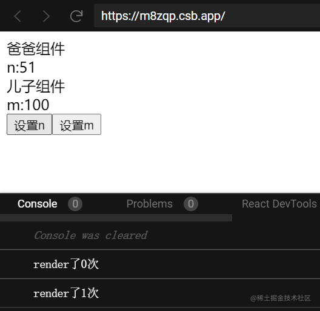

>tips：注意到最上层的变量a没？这是我用来测试的，我发现点击按钮后会触发App函数并更新页面，说明react下使用`context`来修改数据的时候，都会重新进行全局执行，而不是数据响应式的。

# 总结

我们学习到`Context`上下文的基本概念和作用，并且通过小案例总结得出`context`的使用方法：
* 使用`creacteContext`创建一个上下文
* 设置`provider`并通过`value`接口传递`state`数据
* 局部组件从`value`接口中传递的数据对象中获取读写接口

**要点**：
`useContext` 是 React Hooks 中的一个非常有用的 Hook,它为我们提供了一种在组件树中共享数据的方式。

`useContext` 的作用是:

1. **跨组件共享数据**
   - 通过创建一个 Context 对象,我们可以在组件树的任何层级共享数据,而无需通过层层传递 props。

2. **减少"prop drilling"**
   - 在组件层级较深的情况下,使用 `useContext` 可以大大减少"prop drilling"的问题,即将 props 一级一级往下传递的问题。

`useContext` 的基本使用方式如下:

1. 创建 Context 对象

   ```javascript
   const MyContext = React.createContext(defaultValue);
   ```

2. 在组件树的某个层级提供 Context 值

   ```javascript
   function ParentComponent() {
     return (
       <MyContext.Provider value={someValue}>
         <ChildComponent />
       </MyContext.Provider>
     );
   }
   ```

3. 在需要使用 Context 值的组件中使用 `useContext`

   ```javascript
   function ChildComponent() {
     const value = useContext(MyContext);
     // 使用 value 进行渲染
   }
   ```

`useContext` 的常见使用场景包括:

1. **主题配置**
   - 在应用中共享主题配置,如字体、颜色等。

2. **身份验证状态**
   - 在应用中共享当前登录用户的信息。

3. **应用全局状态**
   - 在应用中共享诸如语言设置、购物车等全局状态。

需要注意的是,`useContext` 虽然可以方便地跨组件共享数据,但也可能带来一些问题:

1. **过度使用可能导致组件树过于耦合**
   - 过度依赖 Context 可能会让组件树过于耦合,降低组件的可复用性。

2. **性能问题**
   - 如果 Context 的值频繁变化,可能会导致使用该 Context 的组件频繁re-render,影响性能。

因此,在使用 `useContext` 时,需要权衡利弊,只在确实需要跨组件共享数据的场景下使用。同时,也要注意合理地设计 Context 的粒度和生命周期,避免性能问题。


---
### 703. react 的虚拟dom是怎么实现的？


**难度**：★★★☆☆ | **题型**：QA | **分类**：全部 / React.js

**题目**：


**参考答案**：
React 的虚拟 DOM 是一种在内存中表示 DOM 结构的机制，用于优化实际 DOM 的操作。它通过减少直接 DOM 操作的次数和复杂度，提高了性能。以下是虚拟 DOM 的实现原理和关键步骤：

### 1. **虚拟 DOM 的基本概念**

- **虚拟 DOM**：是一个轻量级的 JavaScript 对象，表示实际 DOM 树的结构和内容。虚拟 DOM 的主要目的是提供一种高效的方式来更新和渲染 UI。
- **React 组件**：组件渲染时生成虚拟 DOM，React 根据这些虚拟 DOM 计算实际 DOM 的更新。

### 2. **虚拟 DOM 的创建**

- **组件渲染**：每当组件的状态或属性发生变化时，React 会调用组件的 render 方法，生成新的虚拟 DOM 树。
  ```javascript
  function MyComponent() {
    return <div>Hello, World!</div>;
  }
  ```
  上述代码生成的虚拟 DOM 结构可能是 `{ type: 'div', props: { children: 'Hello, World!' } }`。

### 3. **虚拟 DOM 的比较（Diffing）**

- **Diff 算法**：React 使用高效的 diff 算法来比较新旧虚拟 DOM。Diff 算法的主要目的是找出两个虚拟 DOM 树之间的差异，并生成最小的变更集，以便更新实际 DOM。
- **主要策略**：
  - **分层比较**：React 先比较两个虚拟 DOM 树的根节点，然后递归比较子节点。只有发生实际变化的部分才会被更新。
  - **节点类型优化**：React 假设同一层级的节点不会改变类型，从而快速跳过不同类型节点的比较。
  - **Key 属性优化**：使用 `key` 属性来标识列表中的元素，帮助 React 识别和重用元素，提高列表渲染的效率。

### 4. **更新实际 DOM**

- **计算差异**：React 根据 diff 算法计算出需要对实际 DOM 进行的最小变更。例如，添加、删除或修改 DOM 元素。
- **批量更新**：React 将这些变更批量应用到实际 DOM 上，从而减少重绘和重排的次数。
  ```javascript
  // 实际 DOM 更新
  ReactDOM.render(<MyComponent />, rootElement);
  ```

### 5. **优化虚拟 DOM 的更新**

- **函数式更新**：使用函数式组件和 Hooks（如 `useState`, `useEffect`）可以更精确地控制组件的更新，避免不必要的虚拟 DOM 生成和比较。
- **Memoization**：使用 `React.memo` 和 `useMemo` 等工具来缓存组件和计算结果，减少虚拟 DOM 的不必要更新。
  ```javascript
  const MemoizedComponent = React.memo(function MyComponent(props) {
    // 组件实现
  });
  ```

### 6. **示例代码**

- **创建虚拟 DOM**：
  ```javascript
  const virtualDOM = {
    type: 'div',
    props: {
      children: [
        { type: 'h1', props: { children: 'Hello, World!' } }
      ]
    }
  };
  ```

- **更新实际 DOM**：
  ```javascript
  // 渲染组件，生成虚拟 DOM
  ReactDOM.render(<MyComponent />, document.getElementById('root'));
  ```

### 总结

1. **创建虚拟 DOM**：每次组件渲染时，React 生成新的虚拟 DOM 树。
2. **比较虚拟 DOM**：使用 diff 算法找出新旧虚拟 DOM 的差异。
3. **更新实际 DOM**：将计算出的差异批量应用到实际 DOM 上，提高性能。

虚拟 DOM 的实现使得 React 在更新 UI 时更加高效，通过减少直接 DOM 操作和优化更新过程，提升了应用的性能和响应速度。

**要点**：
React 的虚拟 DOM 实现包括以下关键步骤：

1. **创建虚拟 DOM**：组件渲染时生成虚拟 DOM 对象，表示 UI 结构。

2. **比较虚拟 DOM（Diffing）**：
   - 使用 diff 算法比较新旧虚拟 DOM 树。
   - 生成最小的变更集，减少实际 DOM 操作。

3. **更新实际 DOM**：
   - 将计算出的差异批量应用到真实 DOM 上，优化性能。

虚拟 DOM 的主要优点是减少了直接 DOM 操作的次数，提升了应用的性能和响应速度。


---
### 709. 为什么 react 需要 fiber 架构，而 Vue 却不需要？


**难度**：★★★☆☆ | **题型**：QA | **分类**：全部 / React.js / Vue.js

**题目**：


**参考答案**：
React引入Fiber架构的主要原因是为了实现更好的异步渲染和更高效的任务调度。Fiber架构使得React能够更细粒度地控制和中断渲染过程，以便更好地响应用户交互、实现懒加载等功能。Vue在设计上采用了不同的策略，因此并不需要类似于Fiber的架构。

以下是一些原因解释为什么React选择了Fiber架构，而Vue没有类似的架构：

1. **异步渲染和任务优先级：** React的Fiber架构使得实现异步渲染和任务优先级变得更加容易。这对于复杂的用户界面和大规模应用中的性能优化非常重要。React可以通过中断和恢复渲染过程，根据任务的优先级调度渲染工作，从而更好地响应用户输入和满足实时性要求。

2. **更好的中断和恢复机制：** Fiber架构提供了一种更灵活的中断和恢复机制，允许React在渲染过程中暂停、中断，然后根据优先级恢复。这使得React能够更好地处理复杂的渲染逻辑，并在需要时放弃低优先级的工作。

3. **增量更新：** Fiber允许React实现增量更新，即只更新变化的部分而不必重新渲染整个组件树。这对于提高渲染性能和减少不必要的工作非常有帮助。

Vue在设计上采用了一种不同的响应式系统和渲染机制，不需要像React那样进行复杂的中断和任务调度。Vue的设计目标可能更注重简洁性和开发体验，而React的目标之一是提供更灵活和强大的性能优化工具。每个框架在设计上都有权衡和取舍，选择适合其目标和使用场景的策略。

**要点**：
React引入Fiber架构的主要原因是实现更好的异步渲染和更高效的任务调度。Fiber架构使得React能够更细粒度地控制和中断渲染过程，以便更好地响应用户交互、实现懒加载等功能。Vue在设计上采用了不同的策略，因此并不需要类似于Fiber的架构。

以下是React选择Fiber架构，而Vue没有类似架构的原因：

1. **异步渲染和任务优先级**：React的Fiber架构支持异步渲染和任务优先级，这对于复杂的用户界面和大规模应用中的性能优化非常重要。
2. **更好的中断和恢复机制**：Fiber架构提供了一种更灵活的中断和恢复机制，允许React在渲染过程中暂停、中断，然后根据优先级恢复。
3. **增量更新**：Fiber允许React实现增量更新，即只更新变化的部分而不必重新渲染整个组件树。

Vue的设计上采用了不同的响应式系统和渲染机制，不需要像React那样进行复杂的中断和任务调度。Vue的设计目标可能更注重简洁性和开发体验，而React的目标之一是提供更灵活和强大的性能优化工具。每个框架在设计上都有权衡和取舍，选择适合其目标和使用场景的策略。


---
### 728. Redux 中异步的请求怎么处理

**难度**：★★★☆☆ | **题型**：QA | **分类**：全部 / React.js

**题目**：


**参考答案**：
一般的异步请求，可以在 `componentDidmount` 中直接进⾏请求，⽆须借助redux。

但是在⼀定规模的项⽬中,上述⽅法很难进⾏异步流的管理,通常情况下我们会借助redux的异步中间件进⾏异步处理。

redux异步流中间件其实有很多，当下主流的异步中间件有两种`redux-thunk`、`redux-saga`。

## （1）使用react-thunk中间件

### redux-thunk优点:

* 体积⼩: redux-thunk的实现⽅式很简单，只有不到20⾏代码
* 使⽤简单: redux-thunk没有引⼊像`redux-saga`或者`redux-observable`额外的范式，上⼿简单

### redux-thunk缺陷:

* 样板代码过多: 与redux本身⼀样,通常⼀个请求需要⼤量的代码,⽽且很多都是重复性质的
* 耦合严重: 异步操作与redux的action偶合在⼀起,不⽅便管理
* 功能孱弱: 有⼀些实际开发中常⽤的功能需要⾃⼰进⾏封装

##（2）使用redux-saga中间件

### redux-saga优点:

* 异步解耦: 异步操作被被转移到单独 saga.js 中，不再是掺杂在 action.js 或 component.js 中
* action摆脱`thunk function`: dispatch 的参数依然是⼀个纯粹的 action (FSA)，⽽不是充满 “⿊魔法” thunk function
* 异常处理: 受益于 `generator function` 的 saga 实现，代码异常/请求失败 都可以直接通过 `try/catch` 语法直接捕获处理
* 功能强⼤: `redux-saga`提供了⼤量的 Saga 辅助函数和 Effect 创建器供开发者使⽤,开发者⽆须封装或者简单封装即可使⽤
* 灵活: redux-saga可以将多个Saga可以串⾏/并⾏组合起来,形成⼀个⾮常实⽤的异步flow
* 易测试，提供了各种case的测试⽅案，包括mock task，分⽀覆盖等等

### redux-saga缺陷:

* 额外的学习成本: `redux-saga`不仅在使⽤难以理解的 `generator function`，⽽且有数⼗个API，学习成本远超redux-thunk。最重要的是你的额外学习成本是只服务于这个库的，与`redux-observable`不同，`redux-observable`虽然也有额外学习成本但是背后是rxjs和⼀整套思想
* 体积庞⼤: 体积略⼤,代码近2000⾏，min版25KB左右
* 功能过剩: 实际上并发控制等功能很难⽤到，但是我们依然需要引⼊这些代码
* ts⽀持不友好: yield⽆法返回TS类型

`redux-saga`可以捕获action，然后执行一个函数，那么可以把异步代码放在这个函数中。


---
### 733. 列举几个常见的 Hook?

**难度**：★★☆☆☆ | **题型**：QA | **分类**：全部 / React.js

**题目**：


**参考答案**：
在 React 中，Hooks 是一组可以让函数组件拥有状态和副作用的 API。

以下是一些常见的 Hook 及其用途：

### 1. **`useState`**

- **用途**：在函数组件中添加状态。
- **示例**：
  ```javascript
  import React, { useState } from 'react';

  function Counter() {
    const [count, setCount] = useState(0);

    return (
      <div>
        <p>You clicked {count} times</p>
        <button onClick={() => setCount(count + 1)}>Click me</button>
      </div>
    );
  }
  ```

### 2. **`useEffect`**

- **用途**：在函数组件中处理副作用，如数据获取、订阅和手动 DOM 操作。
- **示例**：
  ```javascript
  import React, { useEffect, useState } from 'react';

  function Example() {
    const [data, setData] = useState(null);

    useEffect(() => {
      fetch('https://api.example.com/data')
        .then(response => response.json())
        .then(data => setData(data));
    }, []); // 空数组表示只在组件挂载时执行一次

    return <div>{data ? `Data: ${data}` : 'Loading...'}</div>;
  }
  ```

### 3. **`useContext`**

- **用途**：在组件中访问 React 的 Context。
- **示例**：
  ```javascript
  import React, { useContext, createContext } from 'react';

  const MyContext = createContext('defaultValue');

  function Display() {
    const value = useContext(MyContext);
    return <div>{value}</div>;
  }

  function App() {
    return (
      <MyContext.Provider value="Hello, World!">
        <Display />
      </MyContext.Provider>
    );
  }
  ```

### 4. **`useReducer`**

- **用途**：管理复杂状态逻辑，类似于 Redux 的 reducer。
- **示例**：
  ```javascript
  import React, { useReducer } from 'react';

  const initialState = { count: 0 };

  function reducer(state, action) {
    switch (action.type) {
      case 'increment':
        return { count: state.count + 1 };
      case 'decrement':
        return { count: state.count - 1 };
      default:
        throw new Error();
    }
  }

  function Counter() {
    const [state, dispatch] = useReducer(reducer, initialState);

    return (
      <div>
        <p>Count: {state.count}</p>
        <button onClick={() => dispatch({ type: 'increment' })}>Increment</button>
        <button onClick={() => dispatch({ type: 'decrement' })}>Decrement</button>
      </div>
    );
  }
  ```

### 5. **`useMemo`**

- **用途**：优化性能，通过记忆化计算结果，避免不必要的重新计算。
- **示例**：
  ```javascript
  import React, { useMemo, useState } from 'react';

  function ExpensiveComponent({ compute }) {
    const result = useMemo(() => compute(), [compute]);
    return <div>Result: {result}</div>;
  }

  function App() {
    const [count, setCount] = useState(0);

    const compute = () => {
      // 模拟一个计算过程
      return count * 2;
    };

    return (
      <div>
        <button onClick={() => setCount(count + 1)}>Increment</button>
        <ExpensiveComponent compute={compute} />
      </div>
    );
  }
  ```

### 6. **`useCallback`**

- **用途**：记忆化回调函数，避免在依赖项变化时重新创建函数。
- **示例**：
  ```javascript
  import React, { useCallback, useState } from 'react';

  function Button({ onClick }) {
    console.log('Button rendered');
    return <button onClick={onClick}>Click me</button>;
  }

  function App() {
    const [count, setCount] = useState(0);

    const handleClick = useCallback(() => {
      alert('Button clicked!');
    }, []); // 依赖项为空数组表示回调函数不会变化

    return (
      <div>
        <p>Count: {count}</p>
        <button onClick={() => setCount(count + 1)}>Increment</button>
        <Button onClick={handleClick} />
      </div>
    );
  }
  ```

### 7. **`useRef`**

- **用途**：在函数组件中创建可变的引用，通常用于访问 DOM 元素或保存任何可变数据。
- **示例**：
  ```javascript
  import React, { useRef } from 'react';

  function FocusInput() {
    const inputRef = useRef(null);

    const handleClick = () => {
      inputRef.current.focus();
    };

    return (
      <div>
        <input ref={inputRef} type="text" />
        <button onClick={handleClick}>Focus the input</button>
      </div>
    );
  }
  ```

这些 Hooks 提供了处理状态、副作用、上下文、性能优化等常见需求的功能，使得函数组件变得更加灵活和强大。

**要点**：
1. **`useState`**：管理组件状态。
2. **`useEffect`**：处理副作用（例如数据获取、订阅）。
3. **`useContext`**：访问上下文数据。
4. **`useReducer`**：管理复杂状态逻辑。
5. **`useMemo`**：优化性能，缓存计算结果。
6. **`useCallback`**：缓存函数，防止不必要的重新创建。


---
### 746. react 中，数组用useState做状态管理的时候，使用push，pop，splice等直接更改数组对象，会引起页面渲染吗？

**难度**：★★☆☆☆ | **题型**：QA | **分类**：全部 / React.js

**题目**：


**参考答案**：
在 React 中，直接使用 `push`、`pop`、`splice` 等方法修改数组不会触发页面重新渲染。React 的状态更新机制依赖于状态的不可变性（immutability），即通过创建新的状态对象来更新状态。直接修改原始状态对象（如数组）不会创建新的对象引用，因此 React 不会检测到状态的变化，也不会触发重新渲染。

### 为什么直接修改数组不触发渲染

React 使用 `Object.is`（或其变体）来检查状态是否发生了变化。直接对数组进行 `push`、`pop`、`splice` 等操作，修改了原始数组的内容，但数组的引用（内存地址）没有改变。React 仅通过引用变化来判断状态是否更新，因此直接修改原始数组不会触发更新。

### 正确的做法

为了触发渲染，应该遵循不可变数据模式，即通过创建新数组来更新状态。以下是使用 `useState` 管理数组状态的推荐方法：

#### 示例：使用 `concat`、`slice`、`map` 等方法

```javascript
import React, { useState } from 'react';

function MyComponent() {
    const [items, setItems] = useState([1, 2, 3]);

    // 添加新项
    const addItem = (item) => {
        setItems(prevItems => [...prevItems, item]);
    };

    // 移除最后一项
    const removeLastItem = () => {
        setItems(prevItems => prevItems.slice(0, -1));
    };

    // 更新特定项
    const updateItem = (index, newItem) => {
        setItems(prevItems => prevItems.map((item, i) => i === index ? newItem : item));
    };

    return (
        <div>
            <button onClick={() => addItem(4)}>Add Item</button>
            <button onClick={removeLastItem}>Remove Last Item</button>
            <ul>
                {items.map((item, index) => (
                    <li key={index}>{item}</li>
                ))}
            </ul>
        </div>
    );
}

export default MyComponent;
```

### 解释

1. **添加新项**：
   - 使用展开运算符 `[...prevItems, item]` 创建一个新数组，并将新项添加到末尾。

2. **移除最后一项**：
   - 使用 `slice(0, -1)` 创建一个新数组，去除最后一项。

3. **更新特定项**：
   - 使用 `map` 方法创建一个新数组，并根据条件更新特定项。

**要点**：
- **直接修改原始数组**：如 `push`、`pop`、`splice` 等，不会触发 React 的渲染更新。
- **使用不可变数据模式**：通过创建新的数组来更新状态，确保 React 能够检测到状态变化并触发渲染。

---
### 802. taro 2.x 和 taro 3 最大区别是什么？

**难度**：★★☆☆☆ | **题型**：QA | **分类**：全部 / React.js

**题目**：


**参考答案**：
`Taro 2.x` 和 `Taro 3` 的最大区别可以总结为以下几个方面：

1. **编译方式**：Taro 2.x 使用 Gulp 构建工具进行编译，而 Taro 3 改为使用 Webpack 进行构建。这使得 Taro 3 在编译速度、可扩展性、构建配置等方面有了更好的表现。

2. **React 版本升级**：Taro 2.x 使用的是 React 16 版本，而 Taro 3 升级到了 React 17 版本。React 17 引入了一些新特性，例如以初始渲染器为基础的事件处理、重新设计的事件系统等，从而提高了性能和稳定性。

3. **API 改进**：Taro 3 对 API 进行了改进，并引入了新的特性。例如，在 JSX 中可以使用 class 关键字来定义 CSS 样式；增加 useReady 钩子函数在小程序生命周期 onReady 被触发时执行；引入了快应用和 H5 等新平台的支持等。

4. **插件机制**：Taro 3 引入了插件机制，使得开发者可以通过插件实现更多的功能和特性，例如对 TypeScript 支持的扩展、国际化支持等。

5. **性能优化**：Taro 3 在性能方面进行了优化，例如使用虚拟 DOM 进行局部更新，减少对原生 API 的调用等。同时，Taro 3 可以根据平台的不同生成更小的代码包。

`Taro 3` 引入了一些新特性和优化，并提高了性能、可扩展性和稳定性。

如果需要使用 Taro 框架开发多端应用，建议选择 Taro 3。


---
### 825. React18新特性

**难度**：★★★★☆ | **题型**：QA | **分类**：全部 / React.js

**题目**：


**参考答案**：
React 18 引入了许多重要的特性，主要集中在以下方面：

### 1. **并发渲染 (Concurrent Rendering)**

React 18 引入了 **并发模式**，它允许 React 在后台异步渲染部分组件，从而提高用户界面的响应速度。并发渲染的引入可以显著提高复杂应用的性能，尤其是当涉及到大量状态更新时。

**主要特点：**
- **自动批处理**：React 18 中的并发渲染自动批处理多个状态更新，避免了多次渲染的浪费。
- **`startTransition` API**：使开发者能够标记不需要优先渲染的更新，减少应用的卡顿感。

### 2. **Suspense 的改进**

React 18 中对 **Suspense** 进行了改进，使其能够支持更多的场景，特别是在数据获取和代码分割的场景中。通过与并发模式结合，Suspense 可以使应用的加载过程更加平滑和高效。

**新特性：**
- **`Suspense` 支持在服务端渲染（SSR）中**：React 18 支持在服务器端渲染时使用 `Suspense`，从而实现更灵活的渲染过程。
- **`SuspenseList`**：可以将多个 Suspense 组件组合起来，使多个异步加载的组件能够更平滑地显示。

### 3. **React Server Components (实验性功能)**

React Server Components 是 React 18 中的一个实验性特性，它允许在服务器上渲染一部分 UI，而将其他部分交给客户端渲染。这样可以减少 JavaScript 的体积，优化应用的加载速度，尤其是在复杂的应用中。

**主要特点：**
- 将 React 组件拆分为 "客户端组件" 和 "服务器组件"，服务器组件不需要发送到客户端，减少了 JavaScript 包的大小。
- 提供更高效的数据加载和渲染流程。

### 4. **`useId` Hook**

React 18 引入了 `useId` hook，用于生成独一无二的 ID，特别是在服务端渲染和客户端渲染中需要保证一致性时。`useId` 可以帮助开发者避免由于客户端和服务端渲染结果不一致导致的 ID 冲突问题。

**用途：**
- 生成一致的、唯一的 ID，确保在服务器端渲染时和客户端渲染时 ID 一致。

### 5. **并发 Suspense 和流控制（Streaming and Suspense）**

React 18 在 **流式渲染**（Streaming Rendering）方面做了很多增强。流式渲染允许应用按需加载组件，并且这些组件可以并行加载，从而加速页面的呈现速度。

**主要特点：**
- 使用流式渲染，开发者可以更好地控制在服务器上渲染哪些部分，然后根据需要将其传输到客户端。
- 与 Suspense 配合，能更好地支持部分内容的异步加载。

### 6. **更好的 SSR 支持（服务端渲染）**

React 18 加强了对服务端渲染（SSR）的支持，包括对 Suspense 的支持，使得 SSR 渲染更加高效和灵活。React 18 引入了一个新的 SSR API，提供了更多的流控制和数据加载优化，允许更快的页面加载。

### 7. **React 18 中的自动批处理（Automatic Batching）**

React 18 引入了自动批处理机制，它使得在多个状态更新中，只会触发一次渲染，从而减少渲染次数，提高性能。以前，状态更新的批处理只有在事件处理函数中有效，而 React 18 将这种机制扩展到所有异步操作中（如 `setTimeout`, `Promise`, `fetch` 等）。

### 8. **`useSyncExternalStore` Hook**

React 18 提供了 `useSyncExternalStore` Hook，用于订阅外部的、同步的数据源，并能够确保与 React 的渲染周期同步。这对于外部数据源（例如 Redux、zustand 等）非常有用，能够确保应用状态的一致性。

**用途：**
- 用于访问外部存储（如 Redux store）时，确保状态的同步更新，特别是在服务端渲染的情况下。

### 9. **更新的 `useEffect` 和 `useLayoutEffect` 行为**

React 18 对 `useEffect` 和 `useLayoutEffect` 的行为进行了优化，特别是如何与并发渲染结合。这些优化减少了副作用的执行时机，提高了性能和用户体验。

### 10. **增强的开发者工具**

React 18 引入了对 **React DevTools** 的改进，使得开发者能够更好地调试和理解并发渲染、Suspense 和其他新特性。React DevTools 会显示更多关于组件的加载状态和渲染阶段的信息，帮助开发者分析性能瓶颈和优化路径。

**要点**：
React 18 引入了许多性能优化和开发者友好的特性，尤其是在并发渲染、Suspense、服务端渲染（SSR）以及流式渲染方面。React 18 的核心目标是提高性能，优化开发体验，减少 JavaScript 包的大小，提升页面加载速度，并支持更复杂的应用结构。

---
### 846. 使用 React hooks 怎么实现类里面的所有生命周期？

**难度**：★★★☆☆ | **题型**：QA | **分类**：全部 / React.js

**题目**：


**参考答案**：
在 React 16.8 之前，函数组件也称为无状态组件，因为函数组件也不能访问 react 生命周期，也没有自己的状态。react 自 16.8 开始，引入了 Hooks 概念，使得函数组件中也可以拥有自己的状态，并且可以模拟对应的生命周期。

我们应该在什么时候使用 Hooks 呢？

官方并不建议我们把原有的 class 组件，大规模重构成 Hooks，而是有一个渐进过程:

* 首先，原有的函数组件如果需要自己的状态或者需要访问生命周期函数，那么用 Hooks 是再好不过了；
* 另外就是，我们可以先在一些逻辑较简单的组件上尝试 Hooks ，在使用起来相对较熟悉，且组内人员比较能接受的前提下，再扩大 Hooks 的使用范围。

那么相对于传统class， Hooks 有哪些优势?

* State Hook 使得组件内的状态的设置和更新相对独立，这样便于对这些状态单独测试并复用。
* Hook 将组件中相互关联的部分拆分成更小的函数（比如设置订阅或请求数据），而并非强制按照生命周期划分，这样使得各个逻辑相对独立和清晰。

### class 生命周期在 Hooks 中的实现

Hooks 组件更接近于实现状态同步，而不是响应生命周期事件。但是，由于我们先熟悉的 class 的生命周期，在写代码时，难免会受此影响，那么 Hooks 中如何模拟 class 的中的生命周期呢：

总结：

| class 组件                 | Hooks 组件                                       |
| ------------------------ | ---------------------------------------------- |
| constructor              | useState                                       |
| getDerivedStateFromProps | useEffect 手动对比 props， 配合 useState 里面 update 函数 |
| shouldComponentUpdate    | React.memo                                     |
| render                   | 函数本身                                           |
| componentDidMount        | useEffect 第二个参数为\[\]                           |
| componentDidUpdate       | useEffect 配合useRef                             |
| componentWillUnmount     | useEffect 里面返回的函数                              |
| componentDidCatch        | 无                                              |
| getDerivedStateFromError | 无                                              |

代码实现：

```js
import React, { useState, useEffect, useRef, memo } from 'react';

// 使用 React.memo 实现类似 shouldComponentUpdate 的优化， React.memo 只对 props 进行浅比较
const UseEffectExample = memo((props) => {
    console.log("===== UseStateExample render=======");
    // 声明一个叫 “count” 的 state 变量。
    const [count, setCount] = useState(0);
    const [count2, setCount2] = useState(0);
    const [fatherCount, setFatherCount] = useState(props.fatherCount)

    console.log(props);

    // 模拟 getDerivedStateFromProps
    useEffect(() => {
        // props.fatherCount 有更新，才执行对应的修改，没有更新执行另外的逻辑
        if(props.fatherCount == fatherCount ){
            console.log("======= 模拟 getDerivedStateFromProps=======");
            console.log(props.fatherCount, fatherCount);
        }else{
            setFatherCount(props.fatherCount);
            console.log(props.fatherCount, fatherCount);
        }
    })

    // 模拟DidMount
    useEffect(() => {
        console.log("=======只渲染一次(相当于DidMount)=======");
        console.log(count);
    }, [])

    // 模拟DidUpdate
    const mounted = useRef();
    useEffect(() => {
        console.log(mounted);
        if (!mounted.current) {
            mounted.current = true;
          } else {
            console.log("======count 改变时才执行(相当于DidUpdate)=========");
            console.log(count);
          }
    }, [count])

    // 模拟 Didmount和DidUpdate 、 unmount
    useEffect(() => {
    	// 在 componentDidMount，以及 count 更改时 componentDidUpdate 执行的内容
        console.log("======初始化、或者 count 改变时才执行(相当于Didmount和DidUpdate)=========");
        console.log(count);
        return () => {
        	
            console.log("====unmount=======");
            console.log(count);
        }
    }, [count])

    return (
        <div>
            <p>You clicked {count} times</p>
            <button onClick={() => setCount(count + 1)}>
                Click me
            </button>

            <button onClick={() => setCount2(count2 + 1)}>
                Click me2
            </button>
        </div>
    );
});

export default UseEffectExample;
```

### 注意事项

* useState 只在初始化时执行一次，后面不再执行；
* useEffect 相当于是 componentDidMount，componentDidUpdate 和 componentWillUnmount 这三个函数的组合，可以通过传参及其他逻辑，分别模拟这三个生命周期函数；
* useEffect 第二个参数是一个数组，如果数组为空时，则只执行一次（相当于componentDidMount）；如果数组中有值时，则该值更新时，useEffect 中的函数才会执行；如果没有第二个参数，则每次render时，useEffect 中的函数都会执行；
* React 保证了每次运行 effect 的同时，DOM 都已经更新完毕，也就是说 effect 中的获取的 state 是最新的，但是需要注意的是，effect 中返回的函数（其清除函数）中，获取到的 state 是更新前的。
* 传递给 useEffect 的函数在每次渲染中都会有所不同，这是刻意为之的。事实上这正是我们可以在 effect 中获取最新的 count 的值，而不用担心其过期的原因。每次我们重新渲染，都会生成新的 effect，替换掉之前的。某种意义上讲，effect 更像是渲染结果的一部分 —— 每个 effect “属于”一次特定的渲染。
* effect 的清除阶段（返回函数）在每次重新渲染时都会执行，而不是只在卸载组件的时候执行一次。它会在调用一个新的 effect 之前对前一个 effect 进行清理，从而避免了我们手动去处理一些逻辑 。为了说明这一点，下面按时间列出一个可能会产生的订阅和取消订阅操作调用序列：  
```js
function FriendStatus(props) {  
	// ...  
	useEffect(() => {  
    	// ...  
      	ChatAPI.subscribeToFriendStatus(props.friend.id, handleStatusChange);  
    	return () => {  
    		ChatAPI.unsubscribeFromFriendStatus(props.friend.id, handleStatusChange);  
    	};  
	});  
    
    // ...
}
    
// Mount with { friend: { id: 100 } } props  
ChatAPI.subscribeToFriendStatus(100, handleStatusChange);     // 运行第一个 effect  

// Update with { friend: { id: 200 } } props  
ChatAPI.unsubscribeFromFriendStatus(100, handleStatusChange); // 清除上一个 effect  
ChatAPI.subscribeToFriendStatus(200, handleStatusChange);     // 运行下一个 effect  

// Update with { friend: { id: 300 } } props  
ChatAPI.unsubscribeFromFriendStatus(200, handleStatusChange); // 清除上一个 effect  
ChatAPI.subscribeToFriendStatus(300, handleStatusChange);     // 运行下一个 effect  

// Unmount  
ChatAPI.unsubscribeFromFriendStatus(300, handleStatusChange); // 清除最后一个 effect  
```

**要点**：
- **`useEffect`**：处理副作用，模拟 `componentDidMount`、`componentDidUpdate` 和 `componentWillUnmount`。
- **`useState`** 和 **`useReducer`**：处理状态管理，分别对应类组件中的状态和复杂的状态逻辑。
- **`useLayoutEffect`**：用于同步 DOM 更新，类似于 `componentDidMount` 和 `componentDidUpdate` 的同步调用。

---
### 866. 怎么获取函数组件的实例？

**难度**：★★☆☆☆ | **题型**：QA | **分类**：全部 / React.js

**题目**：


**参考答案**：
在 React 中，函数组件没有实例，因此传统的 `ref` 机制（用于访问类组件实例的方法）不适用。不过，可以通过以下几种方式在函数组件中使用 `ref` 来访问 DOM 元素或函数组件的内部逻辑：

### **1. 访问 DOM 元素**

对于函数组件中引用 DOM 元素，可以使用 `useRef` 来创建一个 ref，并将其绑定到 DOM 元素上：

```jsx
import React, { useRef, useEffect } from 'react';

const MyComponent = () => {
  const inputRef = useRef(null);

  useEffect(() => {
    // 访问 DOM 元素
    if (inputRef.current) {
      inputRef.current.focus(); // 例如，设置焦点
    }
  }, []);

  return <input ref={inputRef} />;
};
```

### **2. 使用 `forwardRef` 转发 Ref**

要在函数组件中访问子组件的 DOM 元素或通过 ref 传递组件实例，可以使用 `React.forwardRef` 来转发 ref：

```jsx
import React, { forwardRef, useRef, useImperativeHandle, useEffect } from 'react';

// 子组件使用 forwardRef 来接收父组件的 ref
const ChildComponent = forwardRef((props, ref) => {
  const localRef = useRef();

  useImperativeHandle(ref, () => ({
    focus: () => {
      if (localRef.current) {
        localRef.current.focus();
      }
    }
  }));

  return <input ref={localRef} />;
});

// 父组件使用 ref 来访问子组件的方法
const ParentComponent = () => {
  const childRef = useRef();

  useEffect(() => {
    // 调用子组件的 focus 方法
    if (childRef.current) {
      childRef.current.focus();
    }
  }, []);

  return <ChildComponent ref={childRef} />;
};
```

### **3. `useImperativeHandle` 的作用**

`useImperativeHandle` 钩子允许你定制通过 ref 访问的实例值。例如，可以将特定的方法暴露给父组件，通过 ref 调用这些方法：

```jsx
import React, { useRef, useImperativeHandle, forwardRef } from 'react';

const CustomInput = forwardRef((props, ref) => {
  const localRef = useRef();

  useImperativeHandle(ref, () => ({
    focus: () => {
      localRef.current.focus();
    }
  }));

  return <input ref={localRef} {...props} />;
});

const ParentComponent = () => {
  const inputRef = useRef();

  const handleClick = () => {
    if (inputRef.current) {
      inputRef.current.focus();
    }
  };

  return (
    <div>
      <CustomInput ref={inputRef} />
      <button onClick={handleClick}>Focus Input</button>
    </div>
  );
};
```

**要点**：
- **DOM 元素**：可以直接使用 `useRef` 来获取函数组件内部的 DOM 元素。
- **函数组件实例**：函数组件没有实例，但可以通过 `forwardRef` 和 `useImperativeHandle` 来转发 ref 并暴露特定的接口或方法。

---
### 879. React 中，怎么实现父组件调用子组件中的方法？

**难度**：★★★☆☆ | **题型**：QA | **分类**：全部 / React.js

**题目**：


**参考答案**：
 要实现父组件调用子组件中的方法，需要通过以下步骤进行操作：

1. 在子组件中，创建一个公开的方法。这可以通过在子组件类中定义一个方法或者使用 React Hooks 中的 `useImperativeHandle` 来实现。

   - 如果是类组件，可以在子组件类中定义一个方法，并将其挂载到实例上。例如：

     ```jsx
     class ChildComponent extends React.Component {
       childMethod() {
         // 子组件中需要执行的操作
       }

       render() {
         // 子组件的渲染逻辑
       }
     }
     ```

   - 如果是函数式组件，可以使用 `useImperativeHandle` Hook 将指定的方法暴露给父组件。例如：

     ```jsx
     import { forwardRef, useImperativeHandle } from 'react';

     function ChildComponent(props, ref) {
       useImperativeHandle(ref, () => ({
         childMethod() {
           // 子组件中需要执行的操作
         }
       }));

       // 子组件的渲染逻辑
     }

     export default forwardRef(ChildComponent);
     ```

2. 在父组件中，首先引用或创建对子组件的引用。可以使用 `ref` 对象来保存对子组件的引用。

   - 如果是类组件，可以使用 `createRef` 创建一个 `ref` 对象，并将其传递给子组件的 `ref` prop。例如：

     ```jsx
     class ParentComponent extends React.Component {
       constructor(props) {
         super(props);
         this.childRef = React.createRef();
       }

       handleClick() {
         // 调用子组件的方法
         this.childRef.current.childMethod();
       }

       render() {
         return (
           <div>
             <ChildComponent ref={this.childRef} />
             <button onClick={() => this.handleClick()}>调用子组件方法</button>
           </div>
         );
       }
     }
     ```

   - 如果是函数式组件，可以使用 `useRef` 创建一个 `ref` 对象，并将其传递给子组件的 `ref` prop。例如：

     ```jsx
     function ParentComponent() {
       const childRef = useRef(null);

       const handleClick = () => {
         // 调用子组件的方法
         childRef.current.childMethod();
       };

       return (
         <div>
           <ChildComponent ref={childRef} />
           <button onClick={handleClick}>调用子组件方法</button>
         </div>
       );
     }
     ```

通过以上步骤，父组件就能够成功调用子组件中暴露的方法了。请注意，在函数式组件中，需要使用 `forwardRef` 来包裹子组件，并通过 `ref` 参数来定义暴露的方法。


---
### 917. React中，useRef、ref、forwardsRef 的区别是什么?

**难度**：★★☆☆☆ | **题型**：QA | **分类**：全部 / React.js

**题目**：


**参考答案**：
`useRef`、`ref` 和 `forwardRef` 都涉及到引用（refs）的使用，但它们的用途和行为有所不同。下面是它们的主要区别：

### **1. `useRef`**

- **用途**：在函数组件中创建和管理引用。`useRef` 返回一个可变的 `ref` 对象，该对象的 `.current` 属性可以用来访问 DOM 节点或保存任意值。
- **使用方式**：
  ```javascript
  import { useRef, useEffect } from 'react';

  function MyComponent() {
    const inputRef = useRef(null);

    useEffect(() => {
      inputRef.current.focus(); // 访问和操作 DOM 元素
    }, []);

    return <input ref={inputRef} />;
  }
  ```

- **特点**：
  - `useRef` 创建的引用对象在组件的整个生命周期内保持不变。
  - 可以用来保存任意数据，除了 DOM 节点。

### **2. `ref`**

- **用途**：在类组件中使用，或者通过 `React.forwardRef` 在函数组件中使用，来访问 DOM 节点或组件实例。
- **使用方式**：
  ```javascript
  class MyClassComponent extends React.Component {
    constructor(props) {
      super(props);
      this.inputRef = React.createRef();
    }

    componentDidMount() {
      this.inputRef.current.focus(); // 访问和操作 DOM 元素
    }

    render() {
      return <input ref={this.inputRef} />;
    }
  }
  ```

  ```javascript
  function MyFunctionComponent(props, ref) {
    return <input ref={ref} />;
  }
  const ForwardedComponent = React.forwardRef(MyFunctionComponent);
  ```

- **特点**：
  - `ref` 用于访问类组件的实例或函数组件的 DOM 元素。
  - 在函数组件中使用 `ref` 需要配合 `React.forwardRef` 使用。

### **3. `forwardRef`**

- **用途**：允许函数组件接收 `ref` 并将其转发到子组件的 DOM 元素或其他组件。
- **使用方式**：
  ```javascript
  import React, { forwardRef } from 'react';

  const MyComponent = forwardRef((props, ref) => (
    <input ref={ref} {...props} />
  ));

  function App() {
    const inputRef = useRef(null);

    useEffect(() => {
      inputRef.current.focus(); // 访问和操作 DOM 元素
    }, []);

    return <MyComponent ref={inputRef} />;
  }
  ```

- **特点**：
  - `forwardRef` 高阶组件允许函数组件接收 `ref`，并将 `ref` 转发到子组件的 DOM 元素或其他组件上。
  - 适用于需要将 `ref` 传递给深层组件的情况。

**要点**：
- **`useRef`**：在函数组件中创建和管理引用，适用于访问 DOM 元素或保存任意数据。
- **`ref`**：用于类组件和通过 `forwardRef` 的函数组件来访问 DOM 节点或组件实例。
- **`forwardRef`**：允许函数组件接收和转发 `ref`，使得 `ref` 能够传递到子组件的 DOM 元素。

---
### 918. 怎么判断一个对象是否是 React 元素？

**难度**：★☆☆☆☆ | **题型**：QA | **分类**：全部 / React.js

**题目**：


**参考答案**：
如果想要判断一个对象是否是 React 元素，可以使用 `React.isValidElement()` 方法进行判断。该方法接收一个参数，返回一个布尔值，用于表示指定的对象是否是 React 元素。

以下是一个示例代码：

```javascript
import React from 'react';

const MyComponent = () => {
  return <div>Hello, world!</div>;
}

const elem = <MyComponent />;

console.log(React.isValidElement(elem)); // true
console.log(React.isValidElement({}));   // false
```

在上述代码中，定义了一个简单的组件 `MyComponent`，并通过 JSX 语法创建了一个 React 元素 `elem`。然后，使用 `React.isValidElement()` 方法对 `elem` 和一个普通对象 `{}` 进行判断，并输出结果。

需要注意的是，`React.isValidElement()` 方法只能用于判断是否为 React 元素，并不能判断元素的类型和其他属性。如果需要获取元素的类型或其他属性，可以直接访问元素的属性，例如 `type`、`props`、`key` 等。


---
### 920. 说说你对React Router的理解？常用的Router组件有哪些？

**难度**：★★☆☆☆ | **题型**：QA | **分类**：全部 / React.js

**题目**：


**参考答案**：
## 一、是什么

`react-router`等前端路由的原理大致相同，可以实现无刷新的条件下切换显示不同的页面

路由的本质就是页面的`URL`发生改变时，页面的显示结果可以根据`URL`的变化而变化，但是页面不会刷新

因此，可以通过前端路由可以实现单页(SPA)应用

`react-router`主要分成了几个不同的包：

- react-router: 实现了路由的核心功能
- react-router-dom： 基于 react-router，加入了在浏览器运行环境下的一些功能
- react-router-native：基于 react-router，加入了 react-native 运行环境下的一些功能

- react-router-config: 用于配置静态路由的工具库


## 二、有哪些

这里主要讲述的是`react-router-dom`的常用`API`，主要是提供了一些组件：

- BrowserRouter、HashRouter
- Route
- Link、NavLink
- switch
- redirect


### BrowserRouter、HashRouter

`Router`中包含了对路径改变的监听，并且会将相应的路径传递给子组件

`BrowserRouter`是`history`模式，`HashRouter`模式

使用两者作为最顶层组件包裹其他组件

```jsx
import { BrowserRouter as Router } from "react-router-dom";

export default function App() {
  return (
    <Router>
      <main>
        <nav>
          <ul>
            <li>
              < a href=" ">Home</ a>
            </li>
            <li>
              < a href="/about">About</ a>
            </li>
            <li>
              < a href="/contact">Contact</ a>
            </li>
          </ul>
        </nav>
      </main>
    </Router>
  );
}
```


### Route

`Route`用于路径的匹配，然后进行组件的渲染，对应的属性如下：

- path 属性：用于设置匹配到的路径
- component 属性：设置匹配到路径后，渲染的组件
- render 属性：设置匹配到路径后，渲染的内容
- exact 属性：开启精准匹配，只有精准匹配到完全一致的路径，才会渲染对应的组件

```jsx
import { BrowserRouter as Router, Route } from "react-router-dom";

export default function App() {
  return (
    <Router>
      <main>
        <nav>
          <ul>
            <li>
              < a href="/">Home</ a>
            </li>
            <li>
              < a href="/about">About</ a>
            </li>
            <li>
              < a href="/contact">Contact</ a>
            </li>
          </ul>
        </nav>
        <Route path="/" render={() => <h1>Welcome!</h1>} />
      </main>
    </Router>
  );
}
```


### Link、NavLink

通常路径的跳转是使用`Link`组件，最终会被渲染成`a`元素，其中属性`to`代替`a`标题的`href`属性

`NavLink`是在`Link`基础之上增加了一些样式属性，例如组件被选中时，发生样式变化，则可以设置`NavLink`的一下属性：

- activeStyle：活跃时（匹配时）的样式
- activeClassName：活跃时添加的class

如下：

```js
<NavLink to="/" exact activeStyle={{color: "red"}}>首页</NavLink>
<NavLink to="/about" activeStyle={{color: "red"}}>关于</NavLink>
<NavLink to="/profile" activeStyle={{color: "red"}}>我的</NavLink>
```

如果需要实现`js`实现页面的跳转，那么可以通过下面的形式：

通过`Route`作为顶层组件包裹其他组件后,页面组件就可以接收到一些路由相关的东西，比如`props.history`

```jsx
const Contact = ({ history }) => (
  <Fragment>
    <h1>Contact</h1>
    <button onClick={() => history.push("/")}>Go to home</button>
    <FakeText />
  </Fragment>
);
```

`props `中接收到的`history`对象具有一些方便的方法，如`goBack`，`goForward`,`push`


### redirect

用于路由的重定向，当这个组件出现时，就会执行跳转到对应的`to`路径中，如下例子：

```js
const About = ({
  match: {
    params: { name },
  },
}) => (
  // props.match.params.name
  <Fragment>
    {name !== "tom" ? <Redirect to="/" /> : null}
    <h1>About {name}</h1>
    <FakeText />
  </Fragment>
)
```

上述组件当接收到的路由参数`name` 不等于 `tom` 的时候，将会自动重定向到首页


### switch

`swich`组件的作用适用于当匹配到第一个组件的时候，后面的组件就不应该继续匹配

如下例子：

```jsx
<Switch>
  <Route exact path="/" component={Home} />
  <Route path="/about" component={About} />
  <Route path="/profile" component={Profile} />
  <Route path="/:userid" component={User} />
  <Route component={NoMatch} />
</Switch>
```

如果不使用`switch`组件进行包裹，相同 path 的就会被匹配到，然后一起展示。


除了一些路由相关的组件之外，`react-router`还提供一些`hooks`，如下：

- useHistory
- useParams
- useLocation


### useHistory

`useHistory`可以让组件内部直接访问`history`，无须通过`props`获取

```js
import { useHistory } from "react-router-dom";

const Contact = () => {
  const history = useHistory();
  return (
    <Fragment>
      <h1>Contact</h1>
      <button onClick={() => history.push("/")}>Go to home</button>
    </Fragment>
  );
};
```


### useParams


```jsx
const About = () => {
  const { name } = useParams();
  return (
    // props.match.params.name
    <Fragment>
      {name !== "John Doe" ? <Redirect to="/" /> : null}
      <h1>About {name}</h1>
      <Route component={Contact} />
    </Fragment>
  );
};
```


### useLocation

`useLocation` 会返回当前 `URL `的 `location `对象

```jsx
import { useLocation } from "react-router-dom";

const Contact = () => {
  const { pathname } = useLocation();

  return (
    <Fragment>
      <h1>Contact</h1>
      <p>Current URL: {pathname}</p >
    </Fragment>
  );
};
```


## 三、参数传递

这些路由传递参数主要分成了三种形式：

- 动态路由的方式
- search传递参数
- to传入对象


### 动态路由

动态路由的概念指的是路由中的路径并不会固定

例如将`path`在`Route`匹配时写成`/detail/:id`，那么 `/detail/abc`、`/detail/123`都可以匹配到该`Route`

```jsx
<NavLink to="/detail/abc123">详情</NavLink>

<Switch>
    ... 其他Route
    <Route path="/detail/:id" component={Detail}/>
    <Route component={NoMatch} />
</Switch>
```

获取参数方式如下：

```jsx
console.log(props.match.params.xxx)
```


### search传递参数

在跳转的路径中添加了一些query参数；

```jsx
<NavLink to="/detail2?name=why&age=18">详情2</NavLink>

<Switch>
  <Route path="/detail2" component={Detail2}/>
</Switch>
```

获取形式如下：

```js
console.log(props.location.search)
```


### to传入对象

传递方式如下：

```jsx
<NavLink to={{
    pathname: "/detail2", 
    query: {name: "kobe", age: 30},
    state: {height: 1.98, address: "洛杉矶"},
    search: "?apikey=123"
  }}>
  详情2
</NavLink>
```

获取参数的形式如下：

```js
console.log(props.location)
```


**要点**：
可以从以下几个要点展开：

### 1. **React Router 的理解**

- **定义与功能**：React Router 是 React 应用中最常用的路由管理库，主要用于管理单页应用（SPA）的页面导航。它允许开发者通过配置路由，定义不同路径对应的组件，使得应用在 URL 变化时能够渲染不同的内容，而无需刷新整个页面。
- **核心思想**：React Router 的核心思想是通过路径和组件的映射关系，实现页面的组件化管理，使得应用程序能够根据 URL 变化，动态加载和渲染对应的 React 组件。
- **无刷新导航**：React Router 利用了浏览器的 `history` API 或 `hash` 来实现前端路由，这样在导航时不会触发页面刷新，提高了用户体验。
- **嵌套路由**：React Router 支持嵌套路由，可以在父路由中定义子路由，从而实现复杂页面结构的路由管理。
- **动态路由**：支持路径参数和查询参数，可以在路径中定义动态部分，从而根据不同的参数渲染相应的组件。

### 2. **常用的 Router 组件**

#### 2.1 BrowserRouter

- **功能**：基于 HTML5 的 `history` API，适用于现代浏览器，URL 显示为干净的路径。
- **使用场景**：适合需要干净 URL 的应用，通常用于生产环境中。

#### 2.2 HashRouter

- **功能**：基于 URL 的 `hash` 部分，路径中包含 `#` 符号。
- **使用场景**：适合不希望配置服务器端路由或需要兼容旧浏览器的场景。

#### 2.3 MemoryRouter

- **功能**：将路由状态保存在内存中，与浏览器的 URL 无关。
- **使用场景**：用于需要完全自定义路由行为的场景，如测试环境或 React Native 应用。

#### 2.4 Route

- **功能**：定义路径与组件的映射关系。当 URL 匹配指定路径时，渲染对应的组件。
- **使用场景**：是 React Router 中最基础的组件，用于创建和管理应用中的路由。

#### 2.5 Switch (在 React Router v6 中被替换为 Routes)

- **功能**：用于包裹多个 `Route` 组件，确保在路径匹配时仅渲染第一个匹配的路由。
- **使用场景**：在路径可能匹配多个 `Route` 时，用于确保只渲染一个组件。

#### 2.6 Link

- **功能**：用于创建导航链接，替代传统的 `<a>` 标签，避免页面刷新。
- **使用场景**：在应用内创建导航链接时使用。

#### 2.7 NavLink

- **功能**：类似于 `Link`，但可以为当前选中的路由链接添加样式或类名。
- **使用场景**：适用于需要区分当前选中的导航链接的场景，比如导航菜单。

#### 2.8 Redirect (在 React Router v6 中被替换为 Navigate)

- **功能**：用于实现路由的重定向，当匹配到指定路径时，自动导航到另一个路径。
- **使用场景**：需要在某些条件下重定向用户时使用。

### 3. **React Router 的版本演变**

- **版本更新**：React Router 的 API 在不断演变，特别是在 React Router v6 中，组件的用法和命名都有一些变化，如 `Switch` 变为 `Routes`，`Redirect` 变为 `Navigate`。
- **学习与适应**：理解和适应不同版本的变化是使用 React Router 时的一个重要部分。


---
### 938. 实现 useUpdate 方法，调用时强制组件重新渲染

**难度**：★★☆☆☆ | **题型**：QA | **分类**：全部 / React.js

**题目**：


**参考答案**：
可以利用 `useReducer` 每次调用 `updateReducer` 方法，来达到强制组件重新渲染的目的。

```js
import { useReducer } from 'react';

const updateReducer = (num: number): number => (num + 1) % 1_000_000;

export default function useUpdate(): () => void {
  const [, update] = useReducer(updateReducer, 0);

  return update;
}
```


---
### 949. 说说你对immutable的理解？如何应用在react项目中？

**难度**：★★★☆☆ | **题型**：QA | **分类**：全部 / React.js

**题目**：


**参考答案**：
## 一、是什么

Immutable，不可改变的，在计算机中，即指一旦创建，就不能再被更改的数据

对 `Immutable `对象的任何修改或添加删除操作都会返回一个新的 `Immutable `对象

`Immutable` 实现的原理是 `Persistent Data Structure`（持久化数据结构）:

- 用一种数据结构来保存数据
- 当数据被修改时，会返回一个对象，但是新的对象会尽可能的利用之前的数据结构而不会对内存造成浪费

也就是使用旧数据创建新数据时，要保证旧数据同时可用且不变，同时为了避免 `deepCopy `把所有节点都复制一遍带来的性能损耗，`Immutable` 使用了 `Structural Sharing`（结构共享）

如果对象树中一个节点发生变化，只修改这个节点和受它影响的父节点，其它节点则进行共享

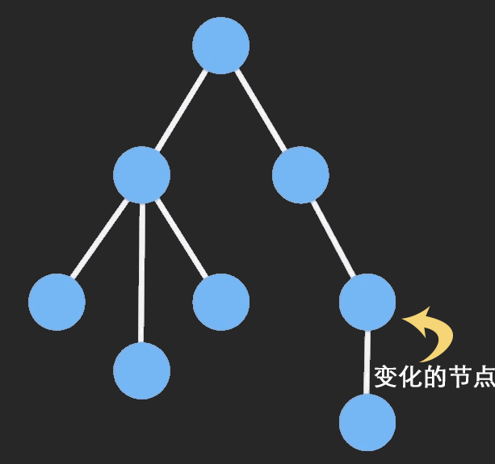


## 二、如何使用

使用`Immutable`对象最主要的库是`immutable.js`

immutable.js 是一个完全独立的库，无论基于什么框架都可以用它

其出现场景在于弥补 Javascript 没有不可变数据结构的问题，通过 structural sharing来解决的性能问题

内部提供了一套完整的 Persistent Data Structure，还有很多易用的数据类型，如`Collection`、`List`、`Map`、`Set`、`Record`、`Seq`，其中：

- List: 有序索引集，类似 JavaScript 中的 Array

- Map: 无序索引集，类似 JavaScript 中的 Object

- Set: 没有重复值的集合


主要的方法如下：

- fromJS()：将一个js数据转换为Immutable类型的数据

```js
const obj = Immutable.fromJS({a:'123',b:'234'})
```

- toJS()：将一个Immutable数据转换为JS类型的数据
- is()：对两个对象进行比较

```js
import { Map, is } from 'immutable'
const map1 = Map({ a: 1, b: 1, c: 1 })
const map2 = Map({ a: 1, b: 1, c: 1 })
map1 === map2   //false
Object.is(map1, map2) // false
is(map1, map2) // true
```

- get(key)：对数据或对象取值

- getIn([]) ：对嵌套对象或数组取值，传参为数组，表示位置

```js
let abs = Immutable.fromJS({a: {b:2}});
abs.getIn(['a', 'b']) // 2
abs.getIn(['a', 'c']) // 子级没有值

let arr = Immutable.fromJS([1 ,2, 3, {a: 5}]);
arr.getIn([3, 'a']); // 5
arr.getIn([3, 'c']); // 子级没有值
```

- 

如下例子：使用方法如下：

```js
import Immutable from 'immutable';
foo = Immutable.fromJS({a: {b: 1}});
bar = foo.setIn(['a', 'b'], 2);   // 使用 setIn 赋值
console.log(foo.getIn(['a', 'b']));  // 使用 getIn 取值，打印 1
console.log(foo === bar);  //  打印 false
```

如果换到原生的`js`，则对应如下：

```js
let foo = {a: {b: 1}};
let bar = foo;
bar.a.b = 2;
console.log(foo.a.b);  // 打印 2
console.log(foo === bar);  //  打印 true
```


## 三、在React中应用

使用 `Immutable `可以给 `React` 应用带来性能的优化，主要体现在减少渲染的次数

在做`react`性能优化的时候，为了避免重复渲染，我们会在`shouldComponentUpdate()`中做对比，当返回`true`执行`render`方法

`Immutable`通过`is`方法则可以完成对比，而无需像一样通过深度比较的方式比较

在使用`redux`过程中也可以结合`Immutable`，不使用`Immutable`前修改一个数据需要做一个深拷贝

```jsx
import '_' from 'lodash';

const Component = React.createClass({
  getInitialState() {
    return {
      data: { times: 0 }
    }
  },
  handleAdd() {
    let data = _.cloneDeep(this.state.data);
    data.times = data.times + 1;
    this.setState({ data: data });
  }
}
```

使用 Immutable 后：

```jsx
getInitialState() {
  return {
    data: Map({ times: 0 })
  }
},
  handleAdd() {
    this.setState({ data: this.state.data.update('times', v => v + 1) });
    // 这时的 times 并不会改变
    console.log(this.state.data.get('times'));
  }
```

同理，在`redux`中也可以将数据进行`fromJS`处理

```js
import * as constants from './constants'
import {fromJS} from 'immutable'
const defaultState = fromJS({ //将数据转化成immutable数据
    home:true,
    focused:false,
    mouseIn:false,
    list:[],
    page:1,
    totalPage:1
})
export default(state=defaultState,action)=>{
    switch(action.type){
        case constants.SEARCH_FOCUS:
            return state.set('focused',true) //更改immutable数据
        case constants.CHANGE_HOME_ACTIVE:
            return state.set('home',action.value)
        case constants.SEARCH_BLUR:
            return state.set('focused',false)
        case constants.CHANGE_LIST:
            // return state.set('list',action.data).set('totalPage',action.totalPage)
            //merge效率更高，执行一次改变多个数据
            return state.merge({
                list:action.data,
                totalPage:action.totalPage
            })
        case constants.MOUSE_ENTER:
            return state.set('mouseIn',true)
        case constants.MOUSE_LEAVE:
            return state.set('mouseIn',false)
        case constants.CHANGE_PAGE:
            return state.set('page',action.page)
        default:
            return state
    }
}
```


**要点**：
### 1. **Immutable 的定义与背景**

#### 1.1 Immutable 的定义

- **Immutable 数据结构**：Immutable（不可变）数据结构指的是一旦创建就不能被修改的数据结构。任何对其内容的修改操作都会返回一个新的数据结构，而不是直接修改原数据结构。
- **优势**：
  - **避免副作用**：通过避免直接修改数据，减少了副作用和潜在的错误。
  - **提高性能**：可以利用结构共享和浅比较优化性能，尤其在处理大数据集和复杂状态时。
  - **简化调试**：数据的不可变性使得状态变得可预测，更容易调试和测试。

#### 1.2 常用 Immutable 数据结构库

- **Immutable.js**：由 Facebook 开发的一个库，提供了不可变的数据结构，如 `Map`、`List`、`Set` 等。
- **Immer**：一个用于简化不可变更新操作的库，通过代理对象允许以“可变”的方式编写代码，但实际操作的是不可变数据。

### 2. **Immutable 数据结构的应用**

#### 2.1 在 React 中的应用场景

- **状态管理**：不可变数据结构在状态管理中非常有用，可以帮助我们确保状态的不可变性，简化状态更新逻辑。
- **性能优化**：由于不可变数据结构支持高效的浅比较，可以减少不必要的组件重新渲染，提高应用性能。

#### 2.2 使用 Immutable.js

- **安装**：

     ```bash
     npm install immutable
     ```

- **示例**：

     ```javascript
     import { Map } from 'immutable';

     const state = Map({
       user: Map({
         name: 'Alice',
         age: 25
       })
     });

     // 更新状态
     const newState = state.setIn(['user', 'age'], 26);

     // 输出：25
     console.log(state.getIn(['user', 'age'])); 
     // 输出：26
     console.log(newState.getIn(['user', 'age']));
     ```

#### 2.3 使用 Immer

- **安装**：

     ```bash
     npm install immer
     ```

- **示例**：

     ```javascript
     import produce from 'immer';

     const initialState = {
       user: {
         name: 'Alice',
         age: 25
       }
     };

     const newState = produce(initialState, draft => {
       draft.user.age = 26;
     });

     // 输出：25
     console.log(initialState.user.age); 
     // 输出：26
     console.log(newState.user.age);
     ```

### 3. **在 React 中应用 Immutable**

#### 3.1 在 Redux 中使用 Immutable

- **Immutable.js**：可以用于 Redux 的状态管理，确保状态的不可变性，减少了 reducer 中对状态的直接修改。
- **示例**：

     ```javascript
     import { createStore } from 'redux';
     import { Map } from 'immutable';

     const initialState = Map({
       counter: 0
     });

     function reducer(state = initialState, action) {
       switch (action.type) {
         case 'INCREMENT':
           return state.update('counter', count => count + 1);
         default:
           return state;
       }
     }

     const store = createStore(reducer);
     ```

#### 3.2 使用 Immutable 数据结构优化性能

- **PureComponent 和 shouldComponentUpdate**：在使用不可变数据结构时，可以利用 `PureComponent` 或 `shouldComponentUpdate` 进行优化，避免不必要的渲染。
- **示例**：

     ```javascript
     import React, { PureComponent } from 'react';
     import { Map } from 'immutable';

     class MyComponent extends PureComponent {
       render() {
         return <div>{this.props.data.get('value')}</div>;
       }
     }

     const data = Map({ value: 42 });

     function App() {
       return <MyComponent data={data} />;
     }
     ```

#### 3.3 状态更新的不可变性

- **避免直接修改**：在处理状态更新时，避免直接修改原状态对象，使用不可变操作来生成新的状态。
- **示例**：

     ```javascript
     function updateState(state, newValue) {
       return {
         ...state,
         value: newValue
       };
     }
     ```

### 4. **总结**

- **不可变数据结构**：提供了一种更可靠、更高效的方式来管理状态，减少副作用和潜在的错误。
- **库选择**：`Immutable.js` 提供了丰富的数据结构和操作方法，适合大规模应用。`Immer` 提供了更直观的 API，适合简化不可变数据的操作。
- **在 React 中的应用**：通过不可变数据结构优化性能、简化状态管理和调试，使 React 组件和状态管理更加高效和可控。


---
### 954. 为什么 useState 返回的是数组而不是对象？

**难度**：★★★★☆ | **题型**：QA | **分类**：全部 / React.js

**题目**：


**参考答案**：
useState 的用法：

```js
const [count, setCount] = useState(0)
```

可以看到 useState 返回的是一个数组，那么为什么是返回数组而不是返回对象呢？

要回答这个问题得弄明白 ES6 的解构赋值(destructring assignment)语法 , 来看 2 个简单的示例：

* 数组的解构赋值：

```js
const foo = ['one', 'two', 'three'];

const [red, yellow, green] = foo;
console.log(red); // "one"
console.log(yellow); // "two"
console.log(green); // "three"
```

* 对象的解构赋值：

```js
const user = {
    id: 42,
    is_verified: true
};

const { id, is_verified } = user;

console.log(id); // 42
console.log(is_verified); // true 
```

搞清楚了解构赋值，那上面的问题就比较好解释了。

如果 `useState` 返回数组，那么你可以顺便对数组中的变量命名，代码看起来也比较干净。而如果是对象的话返回的值必须和 `useState` 内部实现返回的对象同名，这样你只能在 `function component` 中使用一次，想要多次使用 `useState` 必须得重命名返回值。

```js
// 第一次使用
const { state, setState } = useState(false)
// 第二次使用
const { state: counter, setState: setCounter} = useState(0)
```

当然事情总是有两面性的，使用 array 也存在一些问题：

* 返回值强顺序，灵活性比较低。array[0] 为值，array[1] 为改变值的方法。
* 返回的值基本都得使用，对于有些返回值不想使用的话代码看起来有些怪，比如只想用 setState, 就得这么写：`const [, setState] = useState(false)`。
* 返回的参数不能太多，否则处理上面 2 个场景会很麻烦。

如果在自定义的Hook中遇到了以上几个问题，不妨试试返回 object。

简单总结一下，在自定义 hook 的时候可以遵循一个简单原则：当参数大于 2 个的时候返回值的类型返回 `object`， 否则返回数组。


**要点**：
`useState` 返回一个数组而不是对象，主要是为了简化状态管理和更新过程，使得状态的获取和更新更为直观和一致。这个设计决定让 React 的函数式组件更加简洁、易于维护，并减少了潜在的复杂性。

---
### 956. react是否支持给标签设置自定义的属性，比如给video标签设置webkit-playsinline？

**难度**：★★★★☆ | **题型**：QA | **分类**：全部 / React.js

**题目**：


**参考答案**：
如果你在react中这么样写：

```js
// Your code:
<div mycustomattribute="something" />
```

在react 15中将被渲染成：

```js
// React 15 output:
<div />
```

在react 16及之后的版本中将被渲染成：

```js
// React 16 output:
<div mycustomattribute="something" />
```

但这个会有限制，如果自定义的属性不是 `string`, `number` 或者 `object`，该属性依然会被忽略。

所以目前可以这样添加 webkit-playsinline 属性：

```js
<video width="750" height="500" controls webkit-playsinline="true">
	<source src="https://media.w3.org/2010/05/sintel/trailer.mp4" type="video/mp4"/>
</video>
```

另外，还可以通过 `setAttribute` 进行设置，比如：

```js
import * as React from 'react';
import { Component } from 'react';

export class VideoComponent extends Component {
  videoContainer: HTMLDivElement;
  componentDidMount() {
    const video = document.createElement('video');
    video.autoplay = true;
    video.loop = true;
    video.muted = true; // fixes autoplay in chrome
    video.setAttribute('playsinline', 'true'); // fixes autoplay in webkit (ie. mobile safari)

    const source = document.createElement('source');
    source.src = '/path/to/your/video.mp4';
    source.type = 'video/mp4';
    video.appendChild(source);

    this.videoContainer.appendChild(video);
  }
  render() {
    return (
      <div ref={(ref) => { this.videoContainer = ref; }} />
    );
  }
}

```


**要点**：
React 确实支持给标签设置自定义属性,包括 `webkit-playsinline` 这样的非标准属性。

在 React 中,您可以通过标准的 JSX 语法直接将自定义属性添加到元素上:

```jsx
<video webkit-playsinline />
```

或者使用动态属性的语法:

```jsx
<video {...{ 'webkit-playsinline': true }} />
```

React 会将这些自定义属性原样渲染到 DOM 元素上。这意味着您可以使用任何合法的 HTML 属性,包括非标准的供应商前缀属性,如 `webkit-playsinline`。

需要注意的是,虽然 React 支持自定义属性,但并不意味着所有浏览器都会识别和处理这些属性。一些非标准属性可能只在特定的浏览器环境下有效,所以在使用时需要谨慎,并做好跨浏览器的兼容性测试。


---
### 957. React 和 Vue 在技术层面有哪些区别？

**难度**：★★★☆☆ | **题型**：QA | **分类**：全部 / React.js / Vue.js

**题目**：


**参考答案**：
React 和 Vue 是当前比较流行的前端框架，它们在技术层面有以下区别：

- 组件化方式不同：React 是基于组件实现的，组件包含了状态和行为，所有组件共享一个状态树。Vue 也是基于组件实现的，但是每个组件都有自己的状态，并且可以很容易地将数据和行为绑定在一起。

- 数据驱动方式不同：React 使用单向数据流来管理数据，即从父组件到子组件的传递，所以 React 中组件之间的数据交互相对更加复杂。Vue 则使用双向数据绑定来管理数据，使得组件之间的数据交互更加简洁。

- 模板语法不同：React 使用 JSX 语法，将 HTML 和 JavaScript 结合在一起，使得编写组件更加直观和灵活。Vue 则使用模板语法，并且支持模板内的表达式和指令，使得编写组件具有更高的可读性和可维护性。

- 生命周期不同：React 组件的生命周期分为三个阶段：初始化、更新和卸载。Vue 组件的生命周期分为八个阶段：创建、挂载、更新、销毁等。

- 状态管理方式不同：React 使用 Redux 或者 MobX 来管理应用程序的状态。Vue 则提供了自己的状态管理库 Vuex，可以更方便地管理组件之间的共享状态。

- 性能优化方式不同：React 使用虚拟 DOM 技术来实现高效的渲染性能，可以减少每次渲染时需要操作真实 DOM 的次数。Vue 则使用模板编译和响应式系统来实现高效的渲染性能，并且还提供了一些优化技术，例如懒加载和缓存等。

开发人员可以根据项目需求和个人喜好选择合适的框架。

**要点**：
React 和 Vue 是当前流行的前端框架，它们在技术层面有以下区别：

- **组件化方式**：React 采用组件化，组件封装了状态和行为，共享状态树。Vue 组件也有自己的状态，数据和行为绑定更简单。
- **数据驱动**：React 使用单向数据流，从父组件到子组件，数据交互更复杂。Vue 采用双向数据绑定，数据交互更简洁。
- **模板语法**：React 使用 JSX，结合 HTML 和 JavaScript，编写组件更直观。Vue 使用模板语法，支持表达式和指令，可读性和维护性更高。
- **生命周期**：React 生命周期分为初始化、更新、卸载三个阶段。Vue 生命周期包括创建、挂载、更新、销毁等八个阶段。
- **状态管理**：React 通常使用 Redux 或 MobX 管理状态。Vue 则使用 Vuex 管理共享状态。
- **性能优化**：React 使用虚拟 DOM 优化渲染性能。Vue 使用模板编译和响应式系统，并提供懒加载和缓存等技术。


---
### 975. React Hooks当中的useEffect是如何区分生命周期钩子的


**难度**：★★☆☆☆ | **题型**：QA | **分类**：全部 / React.js

**题目**：


**参考答案**：
useEffect可以看成是 `componentDidMount`，`componentDidUpdate` 和 `componentWillUnmount` 三者的结合。

useEffect(callback, [source])接收两个参数，调用方式如下：

```react.js
useEffect(() => {
   console.log('mounted');
   
   return () => {
       console.log('willUnmount');
   }
 }, [source]);
```

生命周期函数的调用主要是通过第二个参数`[source]`来进行控制，有如下几种情况：

* [source]参数不传时，则每次都会优先调用上次保存的函数中返回的那个函数，然后再调用外部那个函数；
* [source]参数传[]时，则外部的函数只会在初始化时调用一次，返回的那个函数也只会最终在组件卸载时调用一次；
* [source]参数有值时，则只会监听到数组中的值发生变化后才优先调用返回的那个函数，再调用外部的函数。


**要点**：
`useEffect` 是 React Hooks 中用于处理副作用的钩子，它可以用来模拟类组件中的生命周期方法。通过配置 `useEffect` 的依赖项，你可以在函数组件中实现类似于以下生命周期钩子的功能：

### 1. **`componentDidMount`**

- **用法**：当组件挂载（首次渲染）时执行一次的副作用。
- **实现方式**：

  ```javascript
  useEffect(() => {
    // 执行副作用（类似 componentDidMount）
    console.log('Component did mount');

    // 可选：返回一个清理函数（用于组件卸载时执行）
    return () => {
      console.log('Component will unmount');
    };
  }, []); // 依赖数组为空，表示只在挂载时执行
  ```

### 2. **`componentDidUpdate`**

- **用法**：当组件更新时执行副作用。可以通过依赖数组来指定哪些状态或 props 更改时触发副作用。
- **实现方式**：

  ```javascript
  useEffect(() => {
    // 执行副作用（类似 componentDidUpdate）
    console.log('Component did update');

    // 可选：返回一个清理函数（用于更新前执行）
    return () => {
      console.log('Cleanup before next update');
    };
  }, [dependencies]); // 依赖数组包含会导致副作用的变量
  ```

### 3. **`componentWillUnmount`**

- **用法**：当组件卸载时执行副作用清理。
- **实现方式**：

  ```javascript
  useEffect(() => {
    // 执行副作用（类似 componentDidMount）
    console.log('Component mounted');

    // 返回一个清理函数（类似 componentWillUnmount）
    return () => {
      console.log('Component will unmount');
    };
  }, []); // 依赖数组为空，表示只在挂载和卸载时执行
  ```

### 4. **组合副作用**

- **用法**：你可以将多个副作用合并到一个 `useEffect` 中，但通常将不同的副作用分开处理，以保持代码的清晰。
- **实现方式**：

  ```javascript
  useEffect(() => {
    // 第一个副作用
    console.log('Effect 1');

    return () => {
      // 清理第一个副作用
      console.log('Cleanup 1');
    };
  }, [dependency1]); // 依赖数组包含 dependency1

  useEffect(() => {
    // 第二个副作用
    console.log('Effect 2');

    return () => {
      // 清理第二个副作用
      console.log('Cleanup 2');
    };
  }, [dependency2]); // 依赖数组包含 dependency2
  ```

### 5. **注意事项**

- **依赖数组**：`useEffect` 的依赖数组决定了副作用的执行时机。如果依赖数组为空，副作用只会在组件挂载和卸载时执行。如果包含依赖项，副作用会在这些依赖项发生变化时执行。
- **清理函数**：在副作用中返回一个清理函数，可以用来清除定时器、取消订阅等。清理函数会在组件卸载或副作用更新之前执行。

### 总结

- **`componentDidMount`**：通过空依赖数组实现。
- **`componentDidUpdate`**：通过包含依赖项的依赖数组实现。
- **`componentWillUnmount`**：通过返回清理函数实现。


---
### 978. 简单介绍下React中的 diff 算法


**难度**：★★★★☆ | **题型**：QA | **分类**：全部 / React.js

**题目**：


**参考答案**：
diff 算法主要基于三个规律：

* DOM 节点的跨层级移动的操作特别少，可以忽略不计
* 拥有相同类的两个组件将会生成相似的树形结构，拥有不同类的两个组件将会生成不同的树形结构
* 对于同一层级的一组子节点，可以通过唯一的 id 进行区分

## tree diff

因为上面的三个策略中的第一点， DOM 节点的跨级操作比较少，那么 diff 算法只会对相同层级的 DOM 节点进行比较。如果发现节点不存在 那么会将该节点以及其子节点完全删除，不会再继续比较。如果出现了 DOM 节点的跨层级的移动操作，那么会删除改节点以及其所有的子节点，然后再移动后的位置重新创建。

## component diff

如果是同一类型的组件，那么会继续对比 VM 数

如果不是同一类型的组件，那么会将其和其子节点完全替换，不会再进行比对

同一类型的组件，有可能 VM 没有任何的变化，如果可以确定的知道这点，那么就可以节省大量的 diff 时间，所以用户可以设置 shouldComponentUpdate() 来判断是否需要进行 diff 算法。

## element diff

当节点处于同一层级的时候时，有三种操作：INSERT_MAKEUP插入、 MOVE_EXISTING 移动、 REMOVE_NODE 删除

这里 React 有一个优化策略，对于同一层级的同组子节点，添加唯一的 key 进行区分。这样的话，就可以判断出来是否是移动节点。通过 key 发现新旧集合中的节点都是相同的节点，就只需要进行移动操作就可以。


**要点**：
React 的 diff 算法用于高效地更新虚拟 DOM 和实际 DOM 的过程。它的主要目标是最小化对实际 DOM 的操作，从而提高性能。以下是简单介绍：

### **Diff 算法概述**

1. **虚拟 DOM 树比较**：
   - **比较**：React 使用虚拟 DOM 树来表示组件的当前状态。每当组件的状态或属性发生变化时，React 会创建一个新的虚拟 DOM 树并将其与旧的虚拟 DOM 树进行比较。
   - **目标**：通过比较旧的虚拟 DOM 树和新的虚拟 DOM 树，找出需要更新的部分。

2. **算法原理**：
   - **树的层级比较**：React diff 算法采用逐层比较的策略。它只比较同一层级的节点，而不是整个树。这样可以提高性能，避免不必要的计算。
   - **同层级节点比较**：在同一层级上，React 通过比较节点的类型和属性来判断节点是否发生变化。如果节点类型相同，React 会进一步比较属性和子节点。

3. **优化策略**：
   - **唯一 Key 属性**：对于列表中的元素，React 使用 `key` 属性来标识每个元素，帮助算法识别和匹配元素，避免重新渲染整个列表。
   - **组件更新**：对于函数组件和类组件，React 会根据组件的 `render` 方法返回的新虚拟 DOM 和之前的虚拟 DOM 进行比较，只有在有必要时才会更新实际 DOM。

4. **更新策略**：
   - **局部更新**：通过比较，React 能够精确地确定哪些部分需要更新，只对这些部分进行实际 DOM 更新，从而减少性能开销。
   - **重用节点**：在可能的情况下，React 会重用现有的 DOM 节点，减少不必要的 DOM 操作。

### **总结**

React 的 diff 算法通过对虚拟 DOM 树的逐层比较和局部更新策略，能够高效地更新实际 DOM，减少性能开销。使用唯一的 `key` 属性和优化的节点比较机制，使得算法能够快速识别变化并进行最小化的 DOM 更新。


---
### 985. 子组件是一个 Portal，发生点击事件能冒泡到父组件吗？

**难度**：★★★☆☆ | **题型**：QA | **分类**：全部 / React.js

**题目**：


**参考答案**：
React 的 Portal 通过 React 的 context 和事件冒泡的机制工作。

在理解这个问题之前，首先要了解一些基本知识：

1. **React Context**：React 使用 context 来存储组件树的一些信息，比如事件处理程序。当组件使用 Portal 时，Portal 在 React 内部仍然保持在父组件树中，即使在 DOM 上渲染到其他地方。也就是说，Portal 的 context 依然从其父组件继承而来。

2. **DOM 事件冒泡**：DOM 中的事件（例如点击事件）通常会从触发事件的元素开始，然后逐步向上冒泡到父元素，直到 document 元素。在这个过程中，事件会按照 DOM 树的层级一层层地向上传递。

3. **React 的事件代理**：React 使用事件代理模式将所有事件都代理到顶层（`document` 或者 `root` DOM 节点）进行处理。这意味着当在子组件中触发一个事件时，无论子组件是否使用了 Portal，React 都会将事件传递到其父组件，然后逐级往上冒泡，直到到达代理事件的顶层。

在 React 中，当一个子组件使用 Portal 将其内容渲染到其他 DOM 节点时，尽管在 DOM 结构上子组件不再是父组件的直接子节点，但在 React 的组件树中，子组件仍然是父组件的子节点。这意味着 React 在监听和处理事件时，会沿着组件树的路径（而不是 DOM 树的路径）冒泡事件。因此，子组件中触发的事件仍然会冒泡到父组件。

总结：Portal 在 DOM 结构上将子组件渲染到其他位置，但在 React 的组件树中，它仍然是父组件的子组件。这使得事件可以从子组件沿着组件树冒泡到父组件。


---
### 986. React Router 中，HashRouter 和 BrowserRouter 的区别和原理？

**难度**：★★☆☆☆ | **题型**：QA | **分类**：全部 / React.js

**题目**：


**参考答案**：
`React Router` 是一个用于处理 React 应用中的路由的库，其中 `HashRouter` 和 `BrowserRouter` 是两种主要的路由器组件。它们的主要区别在于路由的实现方式和 URL 的处理方式。下面是它们的区别和原理：

### **1. `HashRouter`**

#### **原理**

- **哈希路由**：`HashRouter` 使用 URL 的哈希（`#`）部分来保持和同步路由信息。哈希路由器将路由信息附加在 URL 的 `#` 之后，浏览器不会将其发送到服务器，这样所有的路由信息都在客户端处理。
  
  **例如**：
  - 当前 URL：`http://example.com/#/home`
  - `HashRouter` 解析 URL 中的 `#/home` 部分来决定显示哪个组件。

- **工作机制**：
  - 浏览器的哈希变化不会导致页面重新加载，只会更新 `window.location.hash`。
  - 当 URL 中的哈希部分变化时，`HashRouter` 会监听这些变化并更新路由。

#### **优点**

- **服务器配置简化**：由于路由信息不发送到服务器，服务器不需要对这些路由信息进行处理。适用于不需要配置服务器的场景。
  
#### **缺点**

- **URL 体验较差**：哈希值对用户不太友好，不支持传统的 URL 链接和书签功能。

### **2. `BrowserRouter`**

#### **原理**

- **HTML5 History API**：`BrowserRouter` 使用 HTML5 的 `History API` 来管理路由。它通过 `pushState` 和 `replaceState` 操作历史记录，来改变浏览器的 URL 地址而不重新加载页面。
  
  **例如**：
  - 当前 URL：`http://example.com/home`
  - `BrowserRouter` 直接解析 `/home` 来决定显示哪个组件。

- **工作机制**：
  - 通过 `History API` 更新浏览器的 URL，并监听这些变化来更新路由。
  - 需要服务器配置来处理路由，因为所有的路由信息都会发送到服务器，服务器需要进行相应的处理和配置。

#### **优点**

- **更干净的 URL**：没有 `#` 符号，URL 更符合传统的路由标准。
- **更好的用户体验**：支持完整的 URL 链接和书签功能。

#### **缺点**

- **服务器配置要求**：需要服务器进行配置以支持前端路由，通常需要配置服务器将所有的请求重定向到应用的入口点（如 `index.html`）。


**要点**：
- **`HashRouter`**：
  - **原理**：使用 URL 的哈希部分（`#`）来管理路由。
  - **优点**：不需要服务器配置，适合不支持 HTML5 History API 的浏览器。
  - **缺点**：URL 中包含 `#` 符号，不太友好。

- **`BrowserRouter`**：
  - **原理**：使用 HTML5 History API 管理路由，URL 更干净。
  - **优点**：支持传统的 URL 链接和书签功能，用户体验更好。
  - **缺点**：需要服务器配置来处理路由。

---
### 1004. 说说 React 中，scheduler 的调度机制原理

**难度**：★★★★☆ | **题型**：QA | **分类**：全部 / React.js

**题目**：


**参考答案**：
React 中的 `scheduler` 是调度 React 渲染更新任务的核心机制，特别是在 Concurrent 模式下，它扮演了“操作系统调度器”一样的角色。理解其原理，可以从它解决的问题出发，再深入到内部的优先级模型与调度策略。

### 一、调度机制产生的背景

React 在早期版本中是**同步渲染**模型，一旦状态更新，整个组件树就会被同步更新，期间浏览器无法响应用户输入或动画，造成卡顿。

为了解决这一问题，引入了 **Fiber 架构** 和 **scheduler 调度系统**，实现了：

* 可中断的渲染任务；
* 不同优先级的任务调度；
* 浏览器空闲时处理低优先任务；
* 实现「渐进式渲染」、避免主线程长时间阻塞。

### 二、Scheduler 的调度模型核心理念

Scheduler 的核心目标是将一大段渲染任务 **切分为多个小任务（task）**，并通过一个调度系统 **按优先级、可中断、延迟的方式执行它们**，从而提高主线程的可控性和响应性。

这类似于时间切片算法 + 优先级调度。

#### 关键概念包括：

* **任务优先级（Priority Levels）**
  React 定义了几个优先级级别，反映任务的紧急程度：

  * `Immediate`：如用户点击、键盘输入；
  * `UserBlocking`：如输入框联想；
  * `Normal`：普通更新；
  * `Low`：非关键更新；
  * `Idle`：浏览器空闲时处理，如预加载。

* **任务时间切片（Time Slicing）**
  每次调度执行时不会一口气跑完所有任务，而是检测是否已占用主线程太久（超时 or 超过一帧时间），如果超时，则暂停本轮任务，让出主线程。

* **任务中断与恢复**
  渲染过程中可以中断，比如执行到一半发现有更高优先级的任务进入，就会中止当前任务并先处理高优先任务（preemption）。

* **过期时间（Expiration Time）与延迟处理**
  某些任务允许延迟处理（如 transition），React 会评估任务是否即将过期，再决定是否立即处理。


### 三、调度过程整体流程

1. **任务注册（scheduleCallback）**
   每当有更新（如 `setState`）发生，React 会根据上下文为它生成一个任务，并通过 `scheduler.scheduleCallback(priority, callback)` 加入任务队列。

2. **任务入队（Min Heap）**
   Scheduler 会将任务放入一个按过期时间排序的小顶堆中，确保即将过期的任务先执行。

3. **任务执行与让权**
   React 利用 `MessageChannel` 或 `requestIdleCallback` 等 API 创建宏任务循环，每次调度时检查：

   * 当前时间是否还有空余；
   * 是否有高优先级任务；
   * 若当前任务未完成，记录中断点，下次从此处恢复。

4. **任务完成，进入 commit 阶段**
   所有 Fiber 节点处理完成后（即 “render phase” 完成），进入不可中断的 commit 阶段，将变更应用到 DOM。

### 四、React 与 Scheduler 的关系

React 的 Fiber 架构依赖 scheduler 实现以下能力：

* **优先级调度**：让关键交互（如点击）优先渲染；
* **并发渲染**：允许某个组件的渲染“可暂停可恢复”；
* **过渡更新（`startTransition`）**：标记低优先更新，调度器延后处理；
* **精细控制任务粒度**：通过链式 Fiber 节点遍历 + scheduler 控制调度，提升灵活性。


### 五、调度机制带来的用户感知提升

* 滑动页面不再卡顿；
* 页面渐进式加载更自然；
* 表单输入更加跟手；
* 复杂组件更新不阻塞整个 UI。

**要点**：
* React 的调度机制依赖 scheduler 模块，它模拟了类似操作系统的时间切片 + 优先级调度；
* 支持任务打断、中断恢复和过期管理，避免主线程长时间阻塞；
* scheduler 是 Fiber 架构中实现并发更新的关键基础；
* 最终目标是提升 React 应用的响应性与可交互性，特别适用于大规模 UI 或复杂场景。

---
### 1034. 在 React 项目中，一般怎么处理错误？

**难度**：★★☆☆☆ | **题型**：QA | **分类**：全部 / React.js

**题目**：


**参考答案**：
在 React 项目中，错误处理一般分为 **组件级错误** 和 **全局错误**，主要采用 **错误边界（Error Boundaries）**、**`try...catch`**、**全局监听** 以及 **日志上报** 等方式。

### 1. **错误边界（Error Boundaries）**（处理渲染、生命周期方法中的错误）  
```tsx
class ErrorBoundary extends React.Component {
  state = { hasError: false };

  static getDerivedStateFromError(error: Error) {
    return { hasError: true };
  }

  componentDidCatch(error: Error, info: React.ErrorInfo) {
    console.error('Error:', error, info);
  }

  render() {
    if (this.state.hasError) return <h1>出错了！</h1>;
    return this.props.children;
  }
}

// 使用：
<ErrorBoundary>
  <MyComponent />
</ErrorBoundary>
```

### 2. **`try...catch` 处理事件错误**
React 事件处理程序不会被 `ErrorBoundary` 捕获，需要手动用 `try...catch` 处理：
```tsx
const handleClick = () => {
  try {
    // 可能出错的代码
  } catch (error) {
    console.error('事件错误:', error);
  }
};
<button onClick={handleClick}>点击</button>
```

### 3. **全局监听（`window.onerror`、`unhandledrejection`）**
对于 **未捕获的 JavaScript 错误**，可以用 `window.onerror` 或 `unhandledrejection` 进行兜底：
```tsx
window.onerror = (message, source, lineno, colno, error) => {
  console.error('全局错误:', { message, source, lineno, colno, error });
};

window.addEventListener('unhandledrejection', (event) => {
  console.error('Promise 未捕获错误:', event.reason);
});
```

### 4. **日志上报**
可以结合 **Sentry** 或其他监控系统，将错误上报：
```tsx
import * as Sentry from '@sentry/react';
Sentry.init({ dsn: 'your-dsn-url' });

<Sentry.ErrorBoundary fallback={<h1>出错了</h1>}>
  <MyComponent />
</Sentry.ErrorBoundary>;
```

**要点**：
- **渲染、生命周期错误** → **使用 `ErrorBoundary`**  
- **事件处理错误** → **手动 `try...catch`**  
- **全局错误** → **监听 `window.onerror` 和 `unhandledrejection`**  
- **日志上报** → **结合 Sentry 进行监控**

---
### 1060. 使用React Hooks有什么优势？

**难度**：★★☆☆☆ | **题型**：QA | **分类**：全部 / React.js

**题目**：


**参考答案**：
hooks 是react 16.8 引入的特性，他允许你在不写class的情况下操作state 和react的其他特性。

React Hooks 要解决的问题是状态共享，是继 render-props 和 higher-order components 之后的第三种状态共享方案，不会产生 JSX 嵌套地狱问题。

这个状态指的是状态逻辑，所以称为状态逻辑复用会更恰当，因为只共享数据处理逻辑，不会共享数据本身。


---
### 1063. useMemo 和 useCallback 有什么区别？

**难度**：★★☆☆☆ | **题型**：QA | **分类**：全部 / React.js

**题目**：


**参考答案**：
 在 React 中，`useMemo` 和 `useCallback` 都是用来优化性能的钩子函数，但它们的用途和作用稍有不同。

1. **useMemo**:
`useMemo` 的主要作用是在组件重新渲染时，用来缓存计算结果，以避免不必要的重复计算。它接收两个参数：一个回调函数和一个依赖数组。回调函数用于进行计算，而依赖数组用于指定在数组中列出的依赖项发生变化时，才重新计算并返回新的值，否则会返回上一次缓存的值。

```jsx
const memoizedValue = useMemo(() => {
  // 进行耗时的计算
  return someValue;
}, [dependency1, dependency2]);
```

在上面的示例中，只有当 `dependency1` 或者 `dependency2` 发生变化时，`useMemo` 才会重新计算并返回新的值，否则会复用之前的值。

2. **useCallback**:
`useCallback` 的作用是在组件重新渲染时，返回一个记忆化的回调函数，以避免不必要的函数重新创建。它也接收两个参数：一个回调函数和一个依赖数组。当依赖项发生变化时，会返回一个新的回调函数，否则会复用之前的回调函数。

```jsx
const memoizedCallback = useCallback(() => {
  // 处理事件的回调函数
}, [dependency1, dependency2]);
```

在这个示例中，只有当 `dependency1` 或者 `dependency2` 发生变化时，`useCallback` 才会返回一个新的回调函数，否则会返回之前的回调函数。

总结区别：
- `useMemo` 主要用于缓存计算结果，适用于任何需要缓存值的场景。
- `useCallback` 主要用于缓存回调函数，适用于需要传递给子组件的事件处理函数，以避免不必要的重新渲染。

另外，在大多数情况下，你不必在每个函数组件中都使用 `useMemo` 或 `useCallback`。

只有当你在性能测试中发现了性能问题，或者在特定情况下需要优化函数的创建和计算时，再考虑使用这些钩子。

**要点**：
1. **实现原理**：
   - **`useCallback`** 实际上是 `useMemo` 的一种特殊用法，具体来说，它是 `useMemo` 用于函数的简化版本。`useCallback(fn, deps)` 的实现类似于 `useMemo(() => fn, deps)`，即它记忆一个函数并返回。
   - **`useMemo`** 是一个通用的 Hook，用于记忆任何类型的计算结果，而不仅仅是函数。

2. **用途**：
   - **`useCallback`** 专注于函数的记忆，主要用于避免传递给子组件的函数每次渲染时都被重新创建，从而可能导致子组件不必要的重新渲染。
   - **`useMemo`** 用于记忆任何计算结果，如对象、数组或其他值，目的是避免在每次渲染时重新计算，从而提高性能。

3. **返回值**：
   - **`useCallback`** 返回记忆化的回调函数。
   - **`useMemo`** 返回记忆化的计算结果，可以是任何类型的值（函数、对象、数组等）。

### **示例**

- **`useCallback`**：

  ```javascript
  import { useCallback } from 'react';

  function Component({ onClick }) {
    const handleClick = useCallback(() => {
      console.log('Button clicked');
    }, []); // 依赖为空时，handleClick 永远是同一个函数实例

    return <button onClick={handleClick}>Click me</button>;
  }
  ```

- **`useMemo`**：

  ```javascript
  import { useMemo } from 'react';

  function Component({ data }) {
    const processedData = useMemo(() => {
      return data.map(item => item * 2);
    }, [data]); // 仅在 data 改变时重新计算

    return (
      <div>
        {processedData.map(item => (
          <div key={item}>{item}</div>
        ))}
      </div>
    );
  }
  ```

### **总结**

- **`useCallback`** 是 `useMemo` 用于函数的一种简化形式，用于记忆函数实例。
- **`useMemo`** 是更通用的工具，用于记忆计算结果，适用于各种数据类型。

虽然 `useCallback` 可以看作是 `useMemo` 的一个特定用例，但它们在语义上是有区别的，旨在解决不同的性能优化问题。

---
### 1068. React 中的 useRef 是如何实现的？

**难度**：★★★★☆ | **题型**：QA | **分类**：全部 / React.js

**题目**：


**参考答案**：
`useRef` 是 React 提供的一个 Hook，用于创建一个**可变的引用对象**，这个对象在组件整个生命周期内保持**稳定不变的引用地址**。理解 `useRef` 的实现，可以从其运行原理、React 内部的 Hook 数据结构、以及调用时机三个角度来展开。

### 一、表面行为理解

调用：

```tsx
const myRef = useRef(initialValue);
```

返回的对象形如：

```ts
{ current: initialValue }
```

特性：

* `myRef.current` 可以读写；
* 修改 `current` 不会引起组件重新渲染；
* 函数组件每次执行时返回的 `myRef` 是同一个对象（引用地址不变）；
* 可用于访问 DOM，也可作为任意可变容器（如缓存、标志位等）。

### 二、React 内部实现原理

React 在执行函数组件时，会记录当前的 **Fiber 节点** 以及该组件下每个 Hook 的数据。

在 `useRef` 中，其内部调用类似于：

```ts
function useRef(initialValue) {
  const hook = mountWorkInProgressHook(); // 挂载阶段：创建 hook 节点
  const ref = { current: initialValue };
  hook.memoizedState = ref;
  return ref;
}
```

在更新阶段：

```ts
function useRef(initialValue) {
  const hook = updateWorkInProgressHook(); // 更新阶段：复用上次的 hook 节点
  return hook.memoizedState; // 返回上次存下来的 ref 对象
}
```

这背后涉及的是 React 对 **Hook 链表结构的维护**。每次调用 Hook（不论是 `useState`、`useRef`、`useEffect`），都会挂载或读取对应的 Hook 节点，并在其中缓存需要保留的状态数据。

因此 `useRef` 实际上就是在当前 Fiber 节点的 Hook 链表中存储了一个对象，整个组件生命周期中都能访问这个对象，并且不会因为组件重新执行而被替换引用。

### 三、为什么 useRef 不会引发重新渲染？

因为：

* `useRef` 返回的是一个普通对象（非 Proxy、非响应式）；
* React 不会监听 `ref.current` 的变动，也不会将它作为更新触发源；
* 修改 `current` 时只是改变了对象的属性值，并不会触发状态系统或视图更新。

这与 `useState` 的行为不同，后者内部是通过 `dispatchSetState` 来触发调度。

因此 `useRef` 更适合作为“组件外的静态存储空间”，如：

* 存储定时器 ID、上一次的值；
* 持久化某个 mutable 值；
* 持有一个 DOM 元素的引用。


### 四、结合 DOM 使用时发生了什么？

```tsx
const inputRef = useRef(null);

useEffect(() => {
  inputRef.current.focus();
}, []);
```

在组件渲染完挂载时，React 会把真实 DOM 节点赋值给 `inputRef.current`。这是因为：

* React 的 `ref` 属性在内部会将 DOM 节点挂载到 `.current`；
* 对于 `useRef` 返回的对象，它天然就具有 `current` 字段，正好作为容器使用。

这个绑定行为是 React 内部的 `attachRef` 逻辑完成的，不是 `useRef` 本身做的。


**要点**：
* `useRef` 返回一个 `{ current }` 对象，这个对象在组件生命周期内地址不变；
* React 会在 Fiber 节点上挂载 Hook 链表，`useRef` 的值通过 `memoizedState` 保留；
* 修改 `current` 不会引起组件更新，因为没有触发调度流程；
* 既可用于获取 DOM，也适用于存放任意可变值，常用于记录中间状态或缓存值；
* 核心价值在于“持久 + 不引发更新”。

---
### 1073. 简述下 React 的生命周期？每个生命周期都做了什么？

**难度**：★★☆☆☆ | **题型**：QA | **分类**：全部 / React.js

**题目**：


**参考答案**：
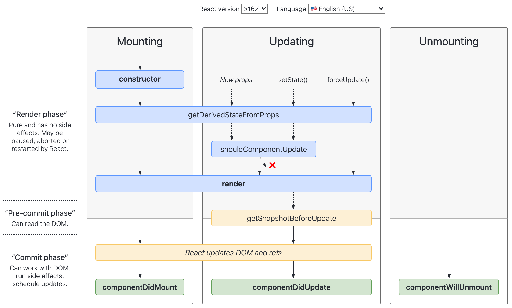

## 挂载

当组件实例被创建并插入 DOM 中时，其生命周期调用顺序如下：

* constructor()
* static getDerivedStateFromProps()
* render()
* componentDidMount()

## 更新

当组件的 props 或 state 发生变化时会触发更新。组件更新的生命周期调用顺序如下：

* static getDerivedStateFromProps()
* shouldComponentUpdate()
* render()
* getSnapshotBeforeUpdate()
* componentDidUpdate()

## 卸载

当组件从 DOM 中移除时会调用如下方法：

* componentWillUnmount()

## 错误处理

渲染过程，生命周期，或子组件的构造函数中抛出错误时，会调用如下方法：

* static getDerivedStateFromError()
* componentDidCatch()


## 具体介绍

### render()

render() 方法是 class 组件中唯一必须实现的方法。

当 render 被调用时，它会检查 this.props 和 this.state 的变化并返回以下类型之一：

* React 元素。通常通过 JSX 创建。例如，<div /> 会被 React 渲染为 DOM 节点，<MyComponent /> 会被 React 渲染为自定义组件，无论是 <div /> 还是 <MyComponent /> 均为 React 元素。
* 数组或 fragments。 使得 render 方法可以返回多个元素。欲了解更多详细信息，请参阅 fragments 文档。
* Portals。可以渲染子节点到不同的 DOM 子树中。欲了解更多详细信息，请参阅有关 portals 的文档
* 字符串或数值类型。它们在 DOM 中会被渲染为文本节点
* 布尔类型或 null。什么都不渲染。（主要用于支持返回 test && <Child /> 的模式，其中 test 为布尔类型。）

render() 函数应该为纯函数，这意味着在不修改组件 state 的情况下，每次调用时都返回相同的结果，并且它不会直接与浏览器交互。

如需与浏览器进行交互，请在 componentDidMount() 或其他生命周期方法中执行你的操作。保持 render() 为纯函数，可以使组件更容易思考。

### constructor()

如果不初始化 state 或不进行方法绑定，则不需要为 React 组件实现构造函数。

在 React 组件挂载之前，会调用它的构造函数。在为 React.Component 子类实现构造函数时，应在其他语句之前前调用 super(props)。否则，this.props 在构造函数中可能会出现未定义的 bug。

通常，在 React 中，构造函数仅用于以下两种情况：

通过给 this.state 赋值对象来初始化内部 state。

* 为事件处理函数绑定实例
* 在 constructor() 函数中不要调用 setState() 方法。如果你的组件需要使用内部 state，请直接在构造函数中为 this.state 赋值初始 state。

只能在构造函数中直接为 this.state 赋值。如需在其他方法中赋值，你应使用 this.setState() 替代。

要避免在构造函数中引入任何副作用或订阅。如遇到此场景，请将对应的操作放置在 componentDidMount 中。

### componentDidMount()

componentDidMount() 会在组件挂载后（插入 DOM 树中）立即调用。依赖于 DOM 节点的初始化应该放在这里。如需通过网络请求获取数据，此处是实例化请求的好地方。

这个方法是比较适合添加订阅的地方。如果添加了订阅，请不要忘记在 componentWillUnmount() 里取消订阅

你可以在 componentDidMount() 里直接调用 setState()。它将触发额外渲染，但此渲染会发生在浏览器更新屏幕之前。如此保证了即使在 render() 两次调用的情况下，用户也不会看到中间状态。请谨慎使用该模式，因为它会导致性能问题。通常，你应该在 constructor() 中初始化 state。如果你的渲染依赖于 DOM 节点的大小或位置，比如实现 modals 和 tooltips 等情况下，你可以使用此方式处理。

### componentDidUpdate()

componentDidUpdate() 会在更新后会被立即调用。首次渲染不会执行此方法。

当组件更新后，可以在此处对 DOM 进行操作。如果你对更新前后的 props 进行了比较，也可以选择在此处进行网络请求。（例如，当 props 未发生变化时，则不会执行网络请求）。

```react.js
componentDidUpdate(prevProps) {
  // 典型用法（不要忘记比较 props）：
  if (this.props.userID !== prevProps.userID) {
    this.fetchData(this.props.userID);
  }
}
```

你也可以在 componentDidUpdate() 中直接调用 setState()，但请注意它必须被包裹在一个条件语句里，正如上述的例子那样进行处理，否则会导致死循环。它还会导致额外的重新渲染，虽然用户不可见，但会影响组件性能。不要将 props “镜像”给 state，请考虑直接使用 props。 欲了解更多有关内容，请参阅为什么 props 复制给 state 会产生 bug。

如果组件实现了 getSnapshotBeforeUpdate() 生命周期（不常用），则它的返回值将作为 componentDidUpdate() 的第三个参数 “snapshot” 参数传递。否则此参数将为 undefined。

### componentWillUnmount()

componentWillUnmount() 会在组件卸载及销毁之前直接调用。在此方法中执行必要的清理操作，例如，清除 timer，取消网络请求或清除在 componentDidMount() 中创建的订阅等。

componentWillUnmount() 中不应调用 setState()，因为该组件将永远不会重新渲染。组件实例卸载后，将永远不会再挂载它。

### shouldComponentUpdate()

根据 shouldComponentUpdate() 的返回值，判断 React 组件的输出是否受当前 state 或 props 更改的影响。默认行为是 state 每次发生变化组件都会重新渲染。大部分情况下，你应该遵循默认行为。

当 props 或 state 发生变化时，shouldComponentUpdate() 会在渲染执行之前被调用。返回值默认为 true。首次渲染或使用 forceUpdate() 时不会调用该方法。

此方法仅作为性能优化的方式而存在。不要企图依靠此方法来“阻止”渲染，因为这可能会产生 bug。你应该考虑使用内置的 PureComponent 组件，而不是手动编写 shouldComponentUpdate()。PureComponent 会对 props 和 state 进行浅层比较，并减少了跳过必要更新的可能性。

如果你一定要手动编写此函数，可以将 this.props 与 nextProps 以及 this.state 与nextState 进行比较，并返回 false 以告知 React 可以跳过更新。请注意，返回 false 并不会阻止子组件在 state 更改时重新渲染。

我们不建议在 shouldComponentUpdate() 中进行深层比较或使用 JSON.stringify()。这样非常影响效率，且会损害性能。

目前，如果 shouldComponentUpdate() 返回 false，则不会调用 UNSAFE_componentWillUpdate()，render() 和 componentDidUpdate()。后续版本，React 可能会将 shouldComponentUpdate 视为提示而不是严格的指令，并且，当返回 false 时，仍可能导致组件重新渲染。

### static getDerivedStateFromProps()

getDerivedStateFromProps 会在调用 render 方法之前调用，并且在初始挂载及后续更新时都会被调用。它应返回一个对象来更新 state，如果返回 null 则不更新任何内容。

此方法适用于罕见的用例，即 state 的值在任何时候都取决于 props。例如，实现 <Transition> 组件可能很方便，该组件会比较当前组件与下一组件，以决定针对哪些组件进行转场动画。

派生状态会导致代码冗余，并使组件难以维护。 确保你已熟悉这些简单的替代方案：

* 如果你需要执行副作用（例如，数据提取或动画）以响应 props 中的更改，请改用 componentDidUpdate。
* 如果只想在 prop 更改时重新计算某些数据，请使用 memoization helper 代替。
* 如果你想在 prop 更改时“重置”某些 state，请考虑使组件完全受控或使用 key 使组件完全不受控代替。

此方法无权访问组件实例。如果你需要，可以通过提取组件 props 的纯函数及 class 之外的状态，在getDerivedStateFromProps()和其他 class 方法之间重用代码。

请注意，不管原因是什么，都会在每次渲染前触发此方法。这与 UNSAFE_componentWillReceiveProps 形成对比，后者仅在父组件重新渲染时触发，而不是在内部调用 setState 时。

### getSnapshotBeforeUpdate()

getSnapshotBeforeUpdate() 在最近一次渲染输出（提交到 DOM 节点）之前调用。它使得组件能在发生更改之前从 DOM 中捕获一些信息（例如，滚动位置）。此生命周期方法的任何返回值将作为参数传递给 componentDidUpdate()。

此用法并不常见，但它可能出现在 UI 处理中，如需要以特殊方式处理滚动位置的聊天线程等。

应返回 snapshot 的值（或 null）。

### Error boundaries

Error boundaries 是 React 组件，它会在其子组件树中的任何位置捕获 JavaScript 错误，并记录这些错误，展示降级 UI 而不是崩溃的组件树。Error boundaries 组件会捕获在渲染期间，在生命周期方法以及其整个树的构造函数中发生的错误。

如果 class 组件定义了生命周期方法 static getDerivedStateFromError() 或 componentDidCatch() 中的任何一个（或两者），它就成为了 Error boundaries。通过生命周期更新 state 可让组件捕获树中未处理的 JavaScript 错误并展示降级 UI。

仅使用 Error boundaries 组件来从意外异常中恢复的情况；不要将它们用于流程控制。

### static getDerivedStateFromError()

此生命周期会在后代组件抛出错误后被调用。 它将抛出的错误作为参数，并返回一个值以更新 state。

### componentDidCatch()

此生命周期在后代组件抛出错误后被调用。 它接收两个参数：

* error —— 抛出的错误。
* info —— 带有 componentStack key 的对象，其中包含有关组件引发错误的栈信息。

componentDidCatch() 会在“提交”阶段被调用，因此允许执行副作用。 它应该用于记录错误之类的情况。

React 的开发和生产构建版本在 componentDidCatch() 的方式上有轻微差别。

在开发模式下，错误会冒泡至 window，这意味着任何 window.onerror 或 window.addEventListener('error', callback) 会中断这些已经被 componentDidCatch() 捕获的错误。

相反，在生产模式下，错误不会冒泡，这意味着任何根错误处理器只会接受那些没有显式地被 componentDidCatch() 捕获的错误。


**要点**：
React 的生命周期方法是类组件中的特性，用于在组件的不同阶段执行特定的代码。

在 React 16.3 之前，生命周期方法主要分为三个阶段：挂载（Mounting）、更新（Updating）和卸载（Unmounting）。

React 16.3 引入了新的生命周期方法，并且在 React 16.8 中引入了 Hooks，使得函数组件也能处理类似的逻辑。

以下是类组件生命周期方法的详细描述：

### 1. **挂载（Mounting）**

组件被创建并插入到 DOM 中的过程。

- **`constructor(props)`**
  - **作用**：构造函数，用于初始化组件状态和绑定事件处理函数。
  - **调用时机**：组件创建时调用，第一次渲染之前。

- **`static getDerivedStateFromProps(nextProps, prevState)`**
  - **作用**：在每次渲染之前调用，允许组件根据 props 更新状态。
  - **调用时机**：挂载和更新时都会调用。

- **`render()`**
  - **作用**：渲染组件的 UI。必须实现的核心方法。
  - **调用时机**：组件的第一次渲染和每次更新时调用。

- **`componentDidMount()`**
  - **作用**：组件挂载完成后调用。通常用于进行数据获取、订阅或设置 DOM 操作。
  - **调用时机**：组件第一次渲染完成后调用。

### 2. **更新（Updating）**

组件由于 props 或 state 的变化而重新渲染的过程。

- **`static getDerivedStateFromProps(nextProps, prevState)`**
  - **作用**：如前所述，也会在更新时调用，以便根据新的 props 更新状态。

- **`shouldComponentUpdate(nextProps, nextState)`**
  - **作用**：用于控制组件是否应该更新。返回 `false` 可以阻止组件更新。
  - **调用时机**：在组件的 props 或 state 变化时调用，决定是否重新渲染组件。

- **`render()`**
  - **作用**：渲染组件的 UI，如前所述。

- **`getSnapshotBeforeUpdate(prevProps, prevState)`**
  - **作用**：在实际 DOM 更新之前调用，可以获取 DOM 的状态，以便在 `componentDidUpdate` 中使用。
  - **调用时机**：组件更新时，在 `render` 之后，实际 DOM 更新之前。

- **`componentDidUpdate(prevProps, prevState, snapshot)`**
  - **作用**：组件更新完成后调用。可以用于处理更新后的 DOM 或发送网络请求等。
  - **调用时机**：组件更新完成后调用。

### 3. **卸载（Unmounting）**

组件从 DOM 中移除的过程。

- **`componentWillUnmount()`**
  - **作用**：组件卸载前调用。用于清理资源，如取消订阅、清除定时器等。
  - **调用时机**：组件被从 DOM 中移除之前调用。

### 4. **错误处理（Error Handling）**

处理组件树中 JavaScript 错误的生命周期方法。

- **`componentDidCatch(error, info)`**
  - **作用**：捕获子组件树中的错误，记录错误信息或显示备用 UI。
  - **调用时机**：组件树中发生错误时调用。

### 5. **总结**

- **挂载**：`constructor`、`getDerivedStateFromProps`、`render`、`componentDidMount`
- **更新**：`getDerivedStateFromProps`、`shouldComponentUpdate`、`render`、`getSnapshotBeforeUpdate`、`componentDidUpdate`
- **卸载**：`componentWillUnmount`
- **错误处理**：`componentDidCatch`

### 6. **函数组件中的生命周期**

在函数组件中，使用 Hooks 实现类似的功能：

- **`useState`**：管理组件状态。
- **`useEffect`**：处理副作用，可以模拟 `componentDidMount`、`componentDidUpdate` 和 `componentWillUnmount`。
- **`useMemo`** 和 **`useCallback`**：用于性能优化，类似于 `shouldComponentUpdate`。
- **`useRef`**：管理可变的引用，类似于 `componentDidMount` 和 `componentDidUpdate` 中的 DOM 操作。

使用这些 Hooks，可以在函数组件中实现和类组件类似的生命周期管理逻辑。


---
### 1094. 下面代码中，点击 “+3” 按钮后，age 的值是什么？

**难度**：★☆☆☆☆ | **题型**：QA | **分类**：全部 / React.js

**题目**：
```js
import { useState } from 'react';

export default function Counter() {
  const [age, setAge] = useState(42);
  function increment() {
    setAge(age + 1); 
  }
  return (
    <>
      <h1>Your age: {age}</h1>
      <button onClick={() => {
        increment();
        increment();
        increment();
      }}>+3</button>
    </>
  );
}

```

**参考答案**：
点击 +3 时，可能只更新为 43。

这是因为 `setAge(age + 1)` 即使多次调用，也不会立即更新组件状态，而是会进行合并，最终只触发一次重新渲染。

如果要实现调用三次就增加 3 ，可以将 `increment` 改为函数式更新：

```js
function increment() {
    setAge(a => a + 1); // 函数式更新
}
```


---
### 1117. 说说 React render 阶段的执行过程

**难度**：★★★★☆ | **题型**：QA | **分类**：全部 / React.js

**题目**：


**参考答案**：
React 的 render 阶段本质上是 **一次可中断、可恢复的虚拟树计算过程**，目标不是直接更新 DOM，而是**计算出下一次 UI 应该长什么样，并生成变更描述**。真正的 DOM 操作发生在后续的 commit 阶段。

理解 render 阶段，需要从 Fiber 架构、调度机制以及 diff 过程三个层面来看。

---

## 一、整体定位：render 阶段在 React 更新流程中的位置

一次 React 更新大致分为两个阶段：

```text
Trigger Update
   ↓
Render Phase（可中断，纯计算）
   ↓
Commit Phase（不可中断，真实 DOM 更新）
```

render 阶段的职责只有一个：

> 根据新的 state / props，计算新的 Fiber 树，并找出需要变更的节点。

它不会：

* 操作 DOM
* 执行 layout
* 触发副作用（effect 在 commit 执行）

---

## 二、更新触发后的入口

当发生以下行为时：

* `setState`
* `dispatch`
* 父组件重新 render
* context 更新

React 会：

1. 创建一个 Update 对象
2. 放入对应 Fiber 的 updateQueue
3. 调度调和流程（scheduleUpdateOnFiber）

随后进入 render 工作循环。

---

## 三、Fiber：render 阶段的核心数据结构

React 不再直接递归组件树，而是构建 **Fiber Tree**。

每个 Fiber 可以理解为：

```text
组件的一次渲染任务单元
```

包含：

* 组件类型
* props / state
* hooks 状态
* 子节点、兄弟节点、父节点
* effect 标记（Placement / Update / Deletion）

React 同时维护两棵树：

```text
current tree（当前页面）
workInProgress tree（正在计算的新树）
```

render 阶段就是构建 workInProgress。

---

## 四、render 阶段的执行循环（核心）

render 阶段由一个循环驱动：

```text
workLoop → performUnitOfWork
```

React 会逐个处理 Fiber 节点，而不是一次递归到底。

### 每个 Fiber 的执行流程：

```text
beginWork → reconcile children → completeWork
```

---

### 1. beginWork（向下阶段）

职责：

* 执行函数组件
* 读取 hooks
* 计算 JSX
* 生成子 Fiber

例如函数组件：

```js
function App() {
  const [count] = useState(0);
  return <Child count={count} />;
}
```

在 beginWork 中：

* 调用组件函数
* 执行 hooks
* 得到 React Element
* 与旧 children 做 diff

---

### 2. Diff / Reconciliation（子节点协调）

React 会比较：

```text
旧 Fiber children
VS
新 React elements
```

并决定：

* 复用节点（Update）
* 新增节点（Placement）
* 删除节点（Deletion）

这里采用：

> 同层比较 + key 优化

避免跨层复杂度爆炸。

---

### 3. completeWork（向上阶段）

当子节点处理完成后，进入回溯阶段：

* 创建 DOM（但不挂载）
* 收集 effect 标记
* 构建 effect list

此阶段逐层向父节点返回。

---

## 五、为什么 render 阶段可以被中断

Fiber 的核心优势在于：

```text
每个 Fiber 是一个可暂停的工作单元
```

React Scheduler 会：

* 判断当前是否需要让出主线程
* 如果时间片耗尽 → 暂停 render
* 浏览器空闲后继续

这就是 Concurrent Rendering 的基础。

因此 render 阶段具有：

* 可中断
* 可恢复
* 可丢弃（高优先级更新可打断低优先级）

---

## 六、render 阶段不会执行的事情

这是面试高频误区：

render 阶段 **不会执行副作用**：

* `useEffect`
* DOM 操作
* ref 回调
* layout 读取

原因是 render 可能被重复执行或丢弃。

React 必须保证 render 是：

```text
Pure + Side-effect free
```

---

## 七、render 阶段的产物

render 完成后得到：

1. 一棵新的 workInProgress Fiber Tree
2. effect list（需要执行的变更）

随后进入 commit 阶段：

```text
before mutation
mutation（DOM 更新）
layout effects
passive effects
```

---

## 八、一次完整 render 的时间线（总结视角）

```text
setState
  ↓
创建 update
  ↓
调度 scheduler
  ↓
构建 workInProgress Fiber
  ↓
beginWork（执行组件）
  ↓
diff children
  ↓
completeWork（收集 effect）
  ↓
生成 effect list
  ↓
进入 commit 阶段
```


**要点**：
React 的 render 阶段是基于 Fiber 架构的可中断计算过程，其核心目标是根据最新状态构建 workInProgress Fiber 树并完成节点 diff；执行流程由 beginWork 向下遍历生成子 Fiber，再由 completeWork 向上回溯收集 effect 标记；该阶段只进行虚拟树计算，不执行 DOM 操作或副作用，从而支持时间切片、优先级调度以及并发渲染能力，最终为 commit 阶段提供精确的更新描述。

---
### 1119. React 中，如何避免使用 context 时， 引起整个挂载节点树的重新渲染

**难度**：★★★☆☆ | **题型**：QA | **分类**：全部 / React.js

**题目**：


**参考答案**：
在 React 中，使用 `context` 的一个常见问题是，当 `context` 的值发生变化时，整个依赖该 `context` 的组件树会重新渲染。

为了避免这种性能开销，可以采用以下优化策略：

### **1. 将 Context 分离到更小的粒度**
将 `context` 拆分成多个独立的 `context`，每个 `context` 只管理独立的数据，而不是将所有状态集中在一个 `context` 中。

**示例：**
```jsx
const UserContext = React.createContext();
const ThemeContext = React.createContext();

// 分离用户数据和主题数据到不同的 context
function App() {
  return (
    <UserContext.Provider value={{ name: 'John' }}>
      <ThemeContext.Provider value="dark">
        <SomeComponent />
      </ThemeContext.Provider>
    </UserContext.Provider>
  );
}
```

这种方式能确保更改 `ThemeContext` 的值时，不会导致依赖 `UserContext` 的组件重新渲染。

---

### **2. 使用 `React.memo` 优化子组件**
如果某些组件只需要 `context` 的一部分值，但渲染逻辑中不直接依赖它们，可以通过 `React.memo` 阻止不必要的渲染。

**示例：**
```jsx
const UserContext = React.createContext();

function UserName() {
  const { name } = React.useContext(UserContext);
  console.log('UserName renders'); // 检查是否重新渲染
  return <div>User: {name}</div>;
}

const MemoizedUserName = React.memo(UserName);

function App() {
  const [user, setUser] = React.useState({ name: 'John' });

  return (
    <UserContext.Provider value={user}>
      <MemoizedUserName />
      <button onClick={() => setUser({ name: 'Doe' })}>Change Name</button>
    </UserContext.Provider>
  );
}
```

---

### **3. 使用 `context` 的选择器**
借助外部库（如 `react-context-selector`）实现细粒度选择器，只订阅 `context` 的部分值，而不是整个 `context` 对象。

**示例：**
```jsx
import { createContext, useContextSelector } from 'use-context-selector';

const UserContext = createContext();

function UserName() {
  const name = useContextSelector(UserContext, user => user.name);
  console.log('UserName renders'); // 检查是否重新渲染
  return <div>User: {name}</div>;
}

function App() {
  const [user, setUser] = React.useState({ name: 'John', age: 30 });

  return (
    <UserContext.Provider value={user}>
      <UserName />
      <button onClick={() => setUser({ name: 'Doe', age: 30 })}>
        Change Name
      </button>
    </UserContext.Provider>
  );
}
```

在这种方式下，`UserName` 只会重新渲染当 `user.name` 发生变化时，而不会受到 `user.age` 的影响。

---

### **4. 使用嵌套 `Provider`**
对于大型项目，可以将 `context` 的范围限制到尽可能小的组件子树。

**示例：**
```jsx
const UserContext = React.createContext();

function UserName() {
  const { name } = React.useContext(UserContext);
  return <div>User: {name}</div>;
}

function App() {
  const [user, setUser] = React.useState({ name: 'John' });

  return (
    <>
      <UserContext.Provider value={user}>
        <UserName />
      </UserContext.Provider>
      {/* 其他子树不受 UserContext 的影响 */}
    </>
  );
}
```

---

### **5. 通过子组件的 props 传递 context 的值**
当 `context` 只需要被特定子组件使用时，可以直接将其值作为 `props` 传递，而不是通过 `useContext`。

**示例：**
```jsx
function UserName({ name }) {
  console.log('UserName renders'); // 检查是否重新渲染
  return <div>User: {name}</div>;
}

function App() {
  const [user, setUser] = React.useState({ name: 'John' });

  return (
    <>
      <UserName name={user.name} />
      <button onClick={() => setUser({ name: 'Doe' })}>Change Name</button>
    </>
  );
}
```


**要点**：
1. **分离 Context**：减少依赖的组件范围。
2. **使用 React.memo**：避免无关组件重渲染。
3. **使用选择器**：只订阅需要的 `context` 部分值。
4. **嵌套 Provider**：限制影响范围。
5. **直接传递 Props**：绕过 `context` 带来的渲染问题。

---
### 1124. 单页应用如何提高加载速度？


**难度**：★★☆☆☆ | **题型**：QA | **分类**：全部 / React.js / Vue.js

**题目**：


**参考答案**：
为了提高网页性能，可以采取以下优化措施：

1. **代码分割**：将代码拆分为小块，按需加载，减少加载时间。
2. **缓存资源**：利用浏览器缓存重复使用的文件，如CSS、JS、图片等。
3. **预加载关键资源**：提前加载首页所需的关键资源，如JS、CSS或数据。
4. **图片格式优化**：选择合适的图片格式，压缩文件大小，使用字体文件代替小图标。
5. **Gzip压缩**：使用Gzip压缩减少文件大小，提高传输效率。
6. **CDN使用**：通过CDN缓存和传递文件，加快下载速度和提高可靠性。
7. **API请求优化**：减少API调用次数，使用缓存和延迟加载技术优化API效率。
8. **服务器端渲染**：使用SSR生成HTML，减少客户端渲染时间，但可能增加服务器负担。

**要点**：
提高单页应用（SPA）加载速度可以通过以下几种方法实现：

1. **代码分割**：
   - **动态导入**：使用动态导入（`import()`）将应用代码拆分成多个文件，按需加载。这样可以减少初始加载时的 JavaScript 文件大小。
   - **路由懒加载**：对不同的路由组件进行懒加载，只有在用户访问特定路由时才加载相关组件。

2. **优化资源**：
   - **压缩和混淆**：使用工具（如 Webpack、Terser）压缩和混淆 JavaScript 和 CSS 文件，减少文件大小。
   - **图像优化**：对图像进行压缩和优化，使用适当的格式和尺寸，并考虑使用响应式图像或懒加载技术。

3. **缓存策略**：
   - **浏览器缓存**：使用缓存策略（如 HTTP 缓存头）来缓存静态资源，减少重复加载。
   - **Service Worker**：使用 Service Worker 实现离线缓存和更复杂的缓存策略。

4. **使用 CDN**：
   - **内容分发网络**：将静态资源（如 JavaScript、CSS、图像）托管在 CDN 上，利用 CDN 的全球分发能力，提高资源加载速度。

5. **减少 HTTP 请求**：
   - **合并文件**：合并多个 CSS 和 JavaScript 文件，减少 HTTP 请求次数。
   - **使用内联资源**：对于小的 CSS 和 JavaScript 资源，可以考虑内联到 HTML 文件中。

6. **懒加载和预加载**：
   - **懒加载**：懒加载资源（如图片和组件），仅在需要时加载，减少初始加载的负担。
   - **预加载**：预加载关键资源，如在用户可能访问的页面上预加载必要的 JavaScript 和 CSS 文件。

7. **性能优化**：
   - **代码优化**：避免不必要的重新渲染和计算，优化渲染性能。
   - **异步操作**：尽量将耗时的操作（如数据获取）放在异步任务中，避免阻塞主线程。

8. **分析和监控**：
   - **性能分析**：使用工具（如 Lighthouse、WebPageTest）分析应用性能，识别瓶颈并进行优化。
   - **实时监控**：监控应用性能指标，及时发现和解决性能问题。

通过以上方法，可以显著提高单页应用的加载速度和整体性能。

---
### 1127. 为什么不能直接使用 this.state 改变数据？

**难度**：★☆☆☆☆ | **题型**：QA | **分类**：全部 / React.js

**题目**：


**参考答案**：
react中不能直接修改state，因为并不会重新触发render。

以如下方式更新状态，组件不会重新渲染。

```react.js
//Wrong
This.state.message =”Hello world”;
```

而是需要使用setState()方法，状态改变时，组件通过重新渲染做出响应。

```react.js
//Correct
This.setState({message: ‘Hello World’});
```

setState通过一个队列机制来实现 state 更新。当执行 setState 的时候，会将需要更新的 state 合并后放入状态队列，而不会立刻更新 this.state。队列机制可以高效的批量更新 state，如果不通过 setState 而直接修改 this.state，那么该 state 将不会被放入状态队列中，当下次调用 setState 并对状态队列进行合并时，将会忽略之前被直接修改的 state，而造成无法预知的错误。

**要点**：
在 React 中，不能直接使用 `this.state` 来改变组件的状态，是因为直接修改 `this.state` 会绕过 React 的状态管理机制，导致一些问题。

以下是具体原因：

### 1. **React 状态更新的原理**

- **状态不可变性**：React 通过 `this.setState()` 来更新状态，这种方式是设计上的要求，保证了状态管理的可预测性和一致性。
- **批量更新**：`this.setState()` 支持批量更新，React 会合并多个状态更新，优化性能，减少重新渲染的次数。如果直接修改 `this.state`，React 不会知道状态发生了变化，从而无法进行批量更新和性能优化。

### 2. **组件重新渲染**

- **触发更新**：`this.setState()` 会触发 React 重新渲染组件，从而更新用户界面。如果直接修改 `this.state`，React 不会检测到状态的变化，也就不会触发重新渲染，导致界面不更新。
- **通知机制**：`this.setState()` 会触发 React 的生命周期方法和更新过程，使组件与用户界面的变化保持同步。

### 3. **异步更新**

- **异步行为**：`this.setState()` 是异步的，这意味着 React 可能会批量处理多个状态更新以提高性能。直接修改 `this.state` 无法保证异步更新的正确性和顺序，可能导致不可预期的行为。

### 4. **维护一致性**

- **数据一致性**：通过 `this.setState()` 更新状态，React 会确保状态的变化被正确地记录和应用。直接修改 `this.state` 会绕过这种一致性检查，可能导致数据不一致和调试困难。

### **总结**

- **不可直接修改**：不能直接修改 `this.state`，应该使用 `this.setState()` 来更新状态。
- **状态管理**：`this.setState()` 确保了状态更新的可预测性、性能优化和一致性。
- **触发重新渲染**：`this.setState()` 能够触发组件重新渲染，保持界面与状态同步。

遵循 React 的状态管理机制，可以确保组件的状态和界面正确同步，并提高应用的稳定性和可维护性。


---
### 1131. React Reconciler 为何要采用 fiber 架构？

**难度**：★★★★☆ | **题型**：QA | **分类**：全部 / React.js

**题目**：


**参考答案**：
React Reconciler 采用 Fiber 架构主要是为了提升性能和用户体验。Fiber 是 React 16 引入的一种新的协调算法，它相对于旧版的 Reconciler 具备以下优势：

### **1. 增量渲染**

- **旧版 Reconciler**：一次性计算并更新整个 UI 树，可能会导致性能瓶颈，尤其是在大型应用中。
- **Fiber 架构**：支持增量渲染，将渲染任务拆分为小的单元，分批执行。这样可以在长时间运行的任务中插入中断点，使得 UI 更响应式。

### **2. 中断和优先级**

- **旧版 Reconciler**：一旦开始更新，渲染过程无法中断，可能会阻塞用户交互。
- **Fiber 架构**：允许中断和恢复工作，可以根据任务的优先级来调整渲染顺序。低优先级的任务可以在高优先级任务完成后再继续执行，提高了用户交互的流畅性。

### **3. 任务调度**

- **旧版 Reconciler**：没有任务调度机制，所有更新都按顺序执行。
- **Fiber 架构**：使用任务调度机制（Scheduler）来管理和调度不同优先级的更新任务，确保重要任务（如用户输入、动画）优先处理。

### **4. 异常处理**

- **旧版 Reconciler**：异常处理能力有限，无法优雅地处理渲染过程中的错误。
- **Fiber 架构**：允许局部错误处理，确保在渲染过程中即使发生异常，也能保证 UI 的部分更新和恢复。

### **5. 渲染中断与恢复**

- **旧版 Reconciler**：无法中断和恢复渲染。
- **Fiber 架构**：支持在渲染过程中中断并恢复，能够平滑处理长时间运行的任务。

### **6. 事务管理**

- **旧版 Reconciler**：处理复杂的事务和操作较为困难。
- **Fiber 架构**：将渲染任务分解为独立的事务，每个事务可以独立地管理和控制，简化了复杂操作的管理。

**要点**：
Fiber 架构的引入使得 React 在性能、响应性、错误处理和任务调度方面得到了显著提升。它通过增量渲染、中断恢复、优先级调度等机制，使得 React 更加高效和用户友好。

---
### 1151. React 19 有哪些新特性？

**难度**：★★★☆☆ | **题型**：QA | **分类**：全部 / React.js

**题目**：


**参考答案**：
### Action

React 应用的一个常见场景是执行数据突变，然后更新状态作为响应。举个栗子，当用户提交表单更改姓名时，我们会发出 API 请求，然后处理响应。

回首往昔，我们需要手动处理待定状态、错误、乐观更新和顺序请求。

举个栗子，我们会这样处理 `useState` 中的待定状态和错误状态：

```jsx
// Action 之前的写法
function UpdateName({}) {
  const [name, setName] = useState('')
  const [error, setError] = useState(null)
  const [isPending, setIsPending] = useState(false)
  const handleSubmit = async () => {
    setIsPending(true)
    const error = await updateName(name)
    setIsPending(false)

    if (error) {
      setError(error)
      return
    }
    redirect('/path')
  }

  return (
    <div>
      <input value={name} onChange={event => setName(event.target.value)} />
      <button onClick={handleSubmit} disabled={isPending}>
        Update
      </button>
      {error && <p>{error}</p>}
    </div>
  )
}
```

在 React 19 中，我们添加了在过渡中使用异步函数的支持，自动处理待定状态、错误、表单和乐观更新。

举个栗子，我们可以使用 `useTransition` 处理待定状态：

```jsx
// 使用 action 中的待定状态
function UpdateName({}) {
  const [name, setName] = useState('')
  const [error, setError] = useState(null)
  const [isPending, startTransition] = useTransition()
  const handleSubmit = async () => {
    startTransition(async () => {
      const error = await updateName(name)

      if (error) {
        setError(error)
        return
      }
      redirect('/path')
    })
  }

  return (
    <div>
      <input value={name} onChange={event => setName(event.target.value)} />
      <button onClick={handleSubmit} disabled={isPending}>
        Update
      </button>
      {error && <p>{error}</p>}
    </div>
  )
}
```

异步过渡会立即把 `isPending` 状态设置为 `true`，发出异步请求，并在任何过渡后把 `isPending` 切换为 `false`。这允许我们在数据更改时，保持当前 UI 的响应能力和交互性。

粉丝请注意，**按照惯例，使用异步过渡的函数称为“Action”（操作）**。

Action 会自动为我们管理提交数据：

-   **待定状态**：Action 提供待定状态，该状态在请求开始时启动，且在提交最终状态更新时自动重置。
-   **乐观更新**：Action 支持全新的 `useOptimistic` hook，因此我们可以在提交请求时，向用户表演即时反馈。
-   **错误处理**：Action 提供错误处理，这样我们可以在请求失败时显示错误边界，且自动将乐观更新恢复为其原始值。
-   **表单**：`<form>` 元素现在支持将函数传递给 `action` 和 `formAction` 属性。将函数传递给 `action` 属性默认使用 Action，并在提交后自动重置表单。

React 19 构建于 Action 之上，引入 `useOptimistic` 来管理乐观更新，并引入全新的 `React.useActionState` hook 来处理 Action 的常见情况。

在 `react-dom` 中，我们添加了 `<form>` Action 自动管理表单，并添加了 `useFormStatus` 支持表单中 Action 的常见情况。

在 React 19 中，上述例子可以简化为：

```jsx
// 使用 <form> Action 和 useActionState
function ChangeName({ name, setName }) {
  const [error, submitAction, isPending] = useActionState(
    async (previousState, formData) => {
      const error = await updateName(formData.get('name'))
      if (error) {
        return error
      }
      redirect('/path')
    }
  )

  return (
    <form action={submitAction}>
      <input type="text" name="name" />
      <button type="submit" disabled={isPending}>
        Update
      </button>
      {error && <p>{error}</p>}
    </form>
  )
}
```

### 新型 hook：`useActionState`

为了使 Action 更容易处理常见情况，我们添加了一个全新的 `useActionState` hook：

```jsx
const [error, submitAction, isPending] = useActionState(
  async (previousState, newName) => {
    const error = await updateName(newName)
    if (error) {
      // 我们可以返回该 Action 的任何结果。
      // 比如，这里我们只返回了 error。
      return error
    }
    // 处理成功的逻辑
  }
)
```

`useActionState` 接受一个“Action”函数，并返回一个包装的 Action 来调用。

这能奏效，因为 Action 可以组合。当调用包装的 Action 时，`useActionState` 会返回 Action 的结果作为 `data`，并将 Action 的待定状态返回为 `pending`。

请注意，`React.useActionState` 以前在 Canary 版本中被称为 `ReactDOM.useFormState`，但我们已将其重命名，并弃用 `useFormState`。

### React DOM：`<form>` Action

Action 还集成了 React 19 `react-dom` 中的 `<form>` 新功能。

我们添加了对将函数作为 `action` 和 `<form>`、`<input>`、`<button>` 等元素的 `formAction` 属性传递的支持，使用 Action 自动提交表单的元素：

```jsx
<form action={actionFunction}>
```

当 `<form>` Action 成功时，React 会自动重置非受控组件的表单。如果我们需要手动重置 `<form>`，可以调用全新的 `requestFormReset` React DOM API。

### React DOM：新型 hook：`useFormStatus`

在设计系统中，通常会编写需要访问其所在 `<form>` 信息的设计组件，而无需将 `props` 向下透传到组件。

这可以通过 Context 实现，但为了使常见情况更容易，我们添加了一个全新的 `useFormStatus` Hook：

```jsx
import { useFormStatus } from 'react-dom'

function DesignButton() {
  const { pending } = useFormStatus()
  return <button type="submit" disabled={pending} />
}
```

`useFormStatus` 读取父级 `<form>` 的状态，就好像表单是 Context provider 一样。

### 新型 hook：`useOptimistic`

执行数据突变时的另一种常见 UI 模式是，在异步请求进行时乐观地展示最终状态。

在 React 19 中，我们添加了一个全新的 `useOptimistic` hook，从而简化此操作：

```jsx
function ChangeName({ currentName, onUpdateName }) {
  const [optimisticName, setOptimisticName] = useOptimistic(currentName)

  const submitAction = async formData => {
    const newName = formData.get('name')
    setOptimisticName(newName)
    const updatedName = await updateName(newName)
    onUpdateName(updatedName)
  }

  return (
    <form action={submitAction}>
      <p>Your name is: {optimisticName}</p>
      <p>
        <label>Change Name:</label>
        <input
          type="text"
          name="name"
          disabled={currentName !== optimisticName}
        />
      </p>
    </form>
  )
}
```

当 `updateName` 请求正在进行时，`useOptimistic` hook 会立即渲染 `optimisticName`。当更新完成或出错时，React 会自动切换回 `currentName` 的值。

### 新型 API：`use`

在 React 19 中，我们引入了一个全新的 `use` API 来读取渲染中的资源。

举个栗子，我们可以使用 `use` 读取 promise 对象，React 会暂停直到该 promise 对象解决：

```jsx
import { use } from 'react'

function Comments({ commentsPromise }) {
  // use 会暂停直到 promise 解决。
  const comments = use(commentsPromise)
  return comments.map(comment => <p key={comment.id}>{comment}</p>)
}

function Page({ commentsPromise }) {
  // 当 use 在 Comments 组件中暂停时，
  // 这个 Suspense 会展示出来。
  return (
    <Suspense fallback={<div>Loading...</div>}>
      <Comments commentsPromise={commentsPromise} />
    </Suspense>
  )
}
```

粉丝请注意，**`use` 不支持渲染中创建的 promise 对象**。

如果我们尝试将渲染中创建的 promise 对象传递给 `use`，React 会发出警告。

要修复此问题，我们需要传递一个支持缓存 promise 对象的框架或 Suspense 驱动的库中的 promise 对象。将来，我们计划发布某些功能，更轻松地在渲染中缓存 promise 对象。

我们还可以使用 `use` 读取 Context，这允许我们条件读取 Context，比如在提前返回后：

```jsx
import { use } from 'react'
import ThemeContext from './ThemeContext'

function Heading({ children }) {
  if (children == null) {
    return null
  }
  // 由于提前返回，
  // 这里使用 useContext 无法奏效。
  const theme = use(ThemeContext)
  return <h1 style={{ color: theme.color }}>{children}</h1>
}
```

`use` API 能且仅能在 `render` 中调用，类似于 hook。与 hook 不同，`use` 可以条件调用。未来我们计划支持更多方式使用 `use` 在渲染中消费资源。

## React 服务器组件

### 服务器组件

服务器组件是一个新选项，允许在打包之前在与客户端应用或 SSR 服务器分开的环境中提前渲染组件。

这个独立的环境是服务器组件中的“服务器”。服务器可以在构建时在 CI 服务器上运行一次，也可以使用 Web 服务器针对每个请求运行。

React 19 包含 Canary 版本中包含的所有服务器组件功能。这意味着，伴随服务器组件一起提供的库现在可以将 React 19 作为具有 `react-server` 导出条件的 peer 依赖，以便在支持全栈 React 架构的框架中使用。

粉丝请注意，**如何建立对服务器组件的支持**？

虽然 React 19 的服务器组件是稳定的，且不会在主版本间损坏，但用于实现服务器组件的打包器器或框架的底层 API 不遵循语义化版本规范，且可能在 React 19.x 的次版本间损坏。

为了支持服务器组件作为打包器或框架，我们建议锁定特定的 React 版本，或者使用 Canary 版本。我们会继续与打包器和框架合作，以稳定将来用于实现服务器组件的 API。

### Server Action（服务器操作）

服务器操作允许客户端组件调用在服务器上执行的异步函数。

当使用 `"use server"` 指令定义服务器操作时，您的框架会自动创建对服务器函数的引用，并将该引用传递给客户端组件。当客户端调用该函数时，React 会向服务器发送请求来执行该函数，并返回结果。

请注意，**没有专属服务器组件的指令**。

一个常见的误区是，服务器组件会使用 `"use server"` 表示，但其实服务器组件没有专属指令。`"use server"` 指令用于服务器操作。

服务器操作可以在服务器组件中创建，并作为属性传递给客户端组件，也可以在客户端组件中导入和使用。


---
### 1155. react 和 vue 有什么区别？

**难度**：★★★☆☆ | **题型**：QA | **分类**：全部 / React.js / Vue.js

**题目**：


**参考答案**：
# 前言

React 是由Facebook创建的JavaScript UI框架，React推广了 Virtual DOM( 虚拟 DOM )并创造了 JSX 语法。JSX 语法的出现允许我们在 javascript 中书写 HTML 代码。

VUE 是由尤雨溪开发的，VUE 使用了模板系统而不是JSX，因其实模板系统都是用的普通的 HTML，所以对应用的升级更方便、更容易，而不需要整体重构。

VUE 相较于 React 更容易上手，如果是一个有一定开发经验的开发者，甚至都不需要花额外的时间去学习，直接一遍开发一遍查文挡即可。

# VUE 与 React 区别

React 的思路是 HTML in JavaScript 也可以说是 All in JavaScript，通过 JavaScript 来生成 HTML，所以设计了 JSX 语法，还有通过 JS 来操作 CSS，社区的styled-component、JSS等。

Vue 是把 HTML，CSS，JavaScript 组合到一起，用各自的处理方式，Vue 有单文件组件，可以把 HTML、CSS、JS 写到一个文件中，HTML 提供了模板引擎来处理。

React 整体是函数式的思想，在 React 中是单向数据流，推崇结合 immutable 来实现数据不可变。

而 Vue 的思想是响应式的，也就是基于是数据可变的，通过对每一个属性建立 Watcher 来监听，当属性变化的时候，响应式的更新对应的虚拟 DOM。

如上，所以 React 的性能优化需要手动去做，而Vue的性能优化是自动的，但是Vue的响应式机制也有问题，就是当 state 特别多的时候，Watcher 会很多，会导致卡顿。

# React 与 VUE 共同点

React 与 Vue 存在很多共同点，例如他们都是 JavaScript 的 UI 框架，专注于创造前端的富应用。不同于早期的 JavaScript 框架“功能齐全”，Reat 与 Vue 只有框架的骨架，其他的功能如路由、状态管理等是框架分离的组件。

## 优势

### React  

* 灵活性和响应性：它提供最大的灵活性和响应能力。
* 丰富的JavaScript库：来自世界各地的贡献者正在努力添加更多功能。
* 可扩展性：由于其灵活的结构和可扩展性，React已被证明对大型应用程序更好。
* 不断发展： React得到了Facebook专业开发人员的支持，他们不断寻找改进方法。
* Web或移动平台： React提供React Native平台，可通过相同的React组件模型为iOS和Android开发本机呈现的应用程序。

### Vue

* 易于使用： Vue.js包含基于HTML的标准模板，可以更轻松地使用和修改现有应用程序。
* 更顺畅的集成：无论是单页应用程序还是复杂的Web界面，Vue.js都可以更平滑地集成更小的部件，而不会对整个系统产生任何影响。
* 更好的性能，更小的尺寸：它占用更少的空间，并且往往比其他框架提供更好的性能。
* 精心编写的文档：通过详细的文档提供简单的学习曲线，无需额外的知识; HTML和JavaScript将完成工作。
* 适应性：整体声音设计和架构使其成为一种流行的JavaScript框架。
* 它提供无障碍的迁移，简单有效的结构和可重用的模板。

# 总结

如上所说的 Vue 的响应式机制也有问题，当 state 特别多的时候，Watcher 会很多，会导致卡顿，所以大型应用（状态特别多的）一般用 React，更加可控。

可对于易用性来说，VUE 是更容易上手的，对于项目来说新人更容易接手。

使用 React 的公司：Facebook，Instagram，Netflix，纽约时报，雅虎，WhatsApp，Codecademy，Dropbox，Airbnb，Asana，微软等。

使用 Vue 的公司：Facebook，Netflix，Adobe，Grammarly，Behance，小米，阿里巴巴，Codeship，Gitlab和Laracasts等。

所以，技术没有哪个更好或者是更优秀，只要适合自己的才是最合适的。

**要点**：
React和Vue的区别：

1. **设计理念**：
   - React：强调组件化，使用JSX语法，适合构建大型应用。
   - Vue：渐进式框架，易于上手，也支持组件化，适合从简单到复杂的各种应用。

2. **数据绑定**：
   - React：单向数据流，通过props和state传递数据。
   - Vue：默认双向数据绑定，通过v-model等指令实现。

3. **模板语法**：
   - React：使用JSX，需要编译成JavaScript。
   - Vue：基于HTML的模板语法，更加直观。

4. **性能优化**：
   - React：通过虚拟DOM和生命周期方法优化。
   - Vue：通过getter/setter的依赖追踪系统优化。

5. **生态系统**：
   - 两者都拥有庞大的生态系统和活跃的社区支持，但React的生态系统可能更为庞大，包含更多第三方库和工具。

6. **学习曲线**：
   - React可能因其JSX和函数式编程的概念而具有较高的学习曲线。
   - Vue则因其更直观的模板语法和接近原生JavaScript的语法而可能更容易上手。


---
### 1169. 什么是受控组件？

**难度**：★★☆☆☆ | **题型**：QA | **分类**：全部 / React.js

**题目**：


**参考答案**：
**受控组件**（Controlled Component）是指一个表单元素的值由 React 组件的状态（`state`）控制，而不是由 DOM 元素自身控制。也就是说，表单元素的值和状态都是由 React 组件的 `state` 进行管理的，表单元素的值由组件的 `state` 决定，并通过事件处理函数来更新 `state`。

### **受控组件的特点**

1. **状态管理**：
   - **由组件状态控制**：受控组件的表单元素（如 `<input>`、`<textarea>` 和 `<select>`）的值由 React 组件的 `state` 控制。表单元素的值始终与组件的 `state` 保持同步。

2. **单向数据流**：
   - **从上到下**：表单元素的值由组件的 `state` 决定，当用户输入或选择时，事件处理函数会更新组件的 `state`，进而重新渲染表单元素。数据流是单向的，即数据从组件的 `state` 流向表单元素。

3. **事件处理**：
   - **更新状态**：每当用户对表单元素进行交互时（如输入文本、选择选项），会触发相应的事件处理函数，这些函数会更新组件的 `state`。组件的 `render` 方法会根据更新后的 `state` 重新渲染表单元素。

### **受控组件的示例**

以下是一个使用受控组件的示例，其中 `<input>` 元素的值由组件的 `state` 控制：

```javascript
import React, { useState } from 'react';

function ControlledForm() {
  // 初始化状态
  const [value, setValue] = useState('');

  // 处理输入变化的函数
  const handleChange = (event) => {
    setValue(event.target.value);
  };

  // 处理表单提交的函数
  const handleSubmit = (event) => {
    event.preventDefault();
    alert('提交的值: ' + value);
  };

  return (
    <form onSubmit={handleSubmit}>
      <label>
        输入内容:
        {/* 受控组件 */}
        <input type="text" value={value} onChange={handleChange} />
      </label>
      <button type="submit">提交</button>
    </form>
  );
}

export default ControlledForm;
```


**要点**：
- **受控组件**：表单元素的值由组件的 `state` 控制，表单的值和状态通过 `state` 管理。
- **单向数据流**：表单值从 `state` 流向表单元素，用户的输入会触发事件更新 `state`。
- **事件处理**：通过事件处理函数更新组件的 `state`，从而重新渲染表单元素。

使用受控组件可以使表单数据更容易管理和验证，并且与组件的状态保持一致。


---
### 1174. React中，能否直接将 props 的值复制给 state？

**难度**：★★☆☆☆ | **题型**：QA | **分类**：全部 / React.js

**题目**：


**参考答案**：
应该避免这种写法：

```react.js
constructor(props) {
 super(props);
 // 不要这样做
 this.state = { color: props.color };
}
```

因为这样做毫无必要（你可以直接使用 this.props.color），同时还产生了 bug（更新 prop 中的 color 时，并不会影响 state）。

只有在你刻意忽略 prop 更新的情况下使用。

此时，应将 prop 重命名为 initialColor 或 defaultColor。必要时，你可以修改它的 key，以强制 **重置** 其内部 state。

**要点**：
在 React 中，直接将 `props` 的值复制给 `state` 是一种不推荐的做法。虽然技术上可以实现，但这样做可能会导致一些潜在的问题。

这里是为什么以及如何处理这个情况的详细说明：

### 为什么不推荐直接将 `props` 的值复制给 `state`？

1. **状态同步问题**：
   - **描述**：如果你将 `props` 直接复制到 `state`，当 `props` 发生变化时，`state` 不会自动更新。这可能导致 UI 显示的内容与实际的 `props` 不一致。
   - **示例**：

     ```javascript
     import React, { Component } from 'react';

     class MyComponent extends Component {
       constructor(props) {
         super(props);
         this.state = {
           value: props.value // 直接将 props 复制到 state
         };
       }

       render() {
         return <div>{this.state.value}</div>;
       }
     }
     ```

     在这个例子中，如果 `props.value` 发生变化，`state.value` 不会自动更新，因此 UI 中的内容不会同步变化。

2. **数据源不一致**：
   - **描述**：组件的 `state` 和 `props` 应该有明确的职责。`props` 应该用于传递数据和事件处理程序，而 `state` 用于组件内部的局部状态。将 `props` 直接复制到 `state` 会混淆这两个概念，使得状态管理更加复杂。

### 推荐的做法

1. **使用 `props` 直接渲染**：
   - **描述**：如果组件只依赖于 `props` 的值来渲染 UI，可以直接在 `render` 方法中使用 `props`。
   - **示例**：

     ```javascript
     import React from 'react';

     function MyComponent({ value }) {
       return <div>{value}</div>;
     }
     ```

2. **如果需要在 `state` 中存储初始值**：
   - **描述**：如果你确实需要在 `state` 中存储 `props` 的初始值，并且希望在后续更新中手动处理 `props` 变化，可以使用 `componentDidUpdate` 或 `useEffect` 来同步 `props` 和 `state`。
   - **示例（类组件）**：

     ```javascript
     import React, { Component } from 'react';

     class MyComponent extends Component {
       constructor(props) {
         super(props);
         this.state = {
           value: props.value
         };
       }

       componentDidUpdate(prevProps) {
         if (prevProps.value !== this.props.value) {
           this.setState({ value: this.props.value });
         }
       }

       render() {
         return <div>{this.state.value}</div>;
       }
     }
     ```

   - **示例（函数组件）**：

     ```javascript
     import React, { useState, useEffect } from 'react';

     function MyComponent({ value }) {
       const [internalValue, setInternalValue] = useState(value);

       useEffect(() => {
         setInternalValue(value);
       }, [value]);

       return <div>{internalValue}</div>;
     }
     ```

### 结论

- **直接将 `props` 的值复制到 `state`**：不推荐，因为它可能导致 `state` 和 `props` 不一致，并增加了状态管理的复杂性。
- **推荐做法**：直接使用 `props` 渲染 UI，或在需要时同步 `props` 到 `state`，确保在 `props` 更新时适当地更新 `state`。


---
### 1176. React 的事件代理机制和原生事件绑定混用会有什么问题？

**难度**：★★☆☆☆ | **题型**：QA | **分类**：全部 / React.js

**题目**：


**参考答案**：
我们在平时的开发中应该尽可能的避免 React 的事件代理机制和原生事件绑定混用。

React 的合成事件层，并没有将事件直接绑定到 DOM 元素上，所以使用 e.stopPropagation() 来阻止原生 DOM 的冒泡的行为是不行的。阻止 React 事件冒泡的行为只能用于 React 合成事件系统，但是 在原生事件中的阻止冒泡行为，却可以阻止 React 合成事件的传播。


---
### 1182. 说说你对 React 生态的了解

**难度**：★★☆☆☆ | **题型**：QA | **分类**：全部 / React.js

**题目**：


**参考答案**：
React 的生态系统非常丰富，是支撑其成为主流前端框架的重要原因之一。

可以从几个主要方面简要说明：

---

### 1. **状态管理**
- **Redux**：经典的状态管理方案，适合大型应用，配合中间件（如 redux-thunk、redux-saga）处理异步逻辑。
- **Zustand / Jotai / Recoil**：更现代、轻量的替代方案，适合中小型项目。
- **React Context + useReducer**：适合简单全局状态的共享，不依赖外部库。

---

### 2. **路由管理**
- **React Router**：React 官方推荐的路由库，支持嵌套路由、懒加载、动态路由等。
- **Next.js 自带路由**：基于文件系统的路由方案，简化配置流程。

---

### 3. **异步数据管理**
- **SWR / React Query**：支持缓存、自动重试、请求去重、依赖刷新等功能，极大提升了数据请求体验。
- **Axios / Fetch**：底层请求库，通常配合上述工具使用。

---

### 4. **组件库**
- **Ant Design / Material UI**：完整的企业级组件库，满足常规开发需求。
- **Tailwind CSS + Headless UI**：更注重样式和结构分离，适合需要高度定制的项目。
- **shadcn/ui**：基于 Tailwind 构建，现代化、高可定制的新兴组件库。

---

### 5. **框架扩展**
- **Next.js**：服务端渲染 + 静态生成的 React 应用框架，支持 SEO、路由、API 路由等。
- **Remix**：强调服务端优先的路由框架，增强数据获取和页面渲染逻辑。

---

### 6. **构建工具**
- **Vite / Webpack / Parcel**：React 可以在这些工具中灵活运行，Vite 更现代、热更新更快。
- **Create React App (CRA)**：React 官方脚手架，适合快速搭建项目。

---

### 7. **测试工具**
- **Jest**：React 官方推荐的测试框架。
- **React Testing Library**：以用户视角测试组件行为，更贴近真实交互。
- **Cypress / Playwright**：端到端测试工具，测试完整用户流程。

---

### 8. **动画与交互**
- **Framer Motion**：流畅强大的动画库，配合 React 使用简单高效。
- **React Spring**：基于物理的动画方案，适合复杂动画场景。

**要点**：
React 的生态围绕组件化、状态管理、路由、数据请求、构建和测试等各个方面，提供了从开发到部署的完整工具链。根据项目规模和需求的不同，可以灵活选型构建不同复杂度的应用。React 本身的“库而非框架”特性，也为其生态的多样性和活力提供了基础。

---
### 1196. 说说对Redux中间件的理解？常用的中间件有哪些？实现原理？

**难度**：★★★☆☆ | **题型**：QA | **分类**：全部 / React.js

**题目**：


**参考答案**：
## 一、是什么

中间件（Middleware）是介于应用系统和系统软件之间的一类软件，它使用系统软件所提供的基础服务（功能），衔接网络上应用系统的各个部分或不同的应用，能够达到资源共享、功能共享的目的

在上篇文章中，了解到了`Redux`整个工作流程，当`action`发出之后，`reducer`立即算出`state`，整个过程是一个同步的操作

那么如果需要支持异步操作，或者支持错误处理、日志监控，这个过程就可以用上中间件

`Redux`中，中间件就是放在就是在`dispatch`过程，在分发`action`进行拦截处理，如下图：

 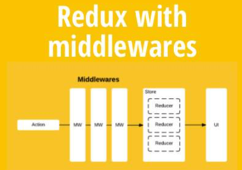

其本质上一个函数，对`store.dispatch`方法进行了改造，在发出 `Action `和执行 `Reducer `这两步之间，添加了其他功能


## 二、常用的中间件

有很多优秀的`redux`中间件，如：

- redux-thunk：用于异步操作
- redux-logger：用于日志记录

上述的中间件都需要通过`applyMiddlewares`进行注册，作用是将所有的中间件组成一个数组，依次执行

然后作为第二个参数传入到`createStore`中

```js
const store = createStore(
  reducer,
  applyMiddleware(thunk, logger)
);
```

### redux-thunk

`redux-thunk`是官网推荐的异步处理中间件

默认情况下的`dispatch(action)`，`action`需要是一个`JavaScript`的对象

`redux-thunk`中间件会判断你当前传进来的数据类型，如果是一个函数，将会给函数传入参数值（dispatch，getState）

- dispatch函数用于我们之后再次派发action
- getState函数考虑到我们之后的一些操作需要依赖原来的状态，用于让我们可以获取之前的一些状态

所以`dispatch`可以写成下述函数的形式：

```js
const getHomeMultidataAction = () => {
  return (dispatch) => {
    axios.get("http://xxx.xx.xx.xx/test").then(res => {
      const data = res.data.data;
      dispatch(changeBannersAction(data.banner.list));
      dispatch(changeRecommendsAction(data.recommend.list));
    })
  }
}
```


### redux-logger


如果想要实现一个日志功能，则可以使用现成的`redux-logger`

```js
import { applyMiddleware, createStore } from 'redux';
import createLogger from 'redux-logger';
const logger = createLogger();

const store = createStore(
  reducer,
  applyMiddleware(logger)
);
```

这样我们就能简单通过中间件函数实现日志记录的信息


## 三、实现原理

首先看看`applyMiddlewares`的源码

```js
export default function applyMiddleware(...middlewares) {
  return (createStore) => (reducer, preloadedState, enhancer) => {
    var store = createStore(reducer, preloadedState, enhancer);
    var dispatch = store.dispatch;
    var chain = [];

    var middlewareAPI = {
      getState: store.getState,
      dispatch: (action) => dispatch(action)
    };
    chain = middlewares.map(middleware => middleware(middlewareAPI));
    dispatch = compose(...chain)(store.dispatch);

    return {...store, dispatch}
  }
}
```

所有中间件被放进了一个数组`chain`，然后嵌套执行，最后执行`store.dispatch`。可以看到，中间件内部（`middlewareAPI`）可以拿到`getState`和`dispatch`这两个方法

在上面的学习中，我们了解到了`redux-thunk`的基本使用

内部会将`dispatch`进行一个判断，然后执行对应操作，原理如下：

```js
function patchThunk(store) {
    let next = store.dispatch;

    function dispatchAndThunk(action) {
        if (typeof action === "function") {
            action(store.dispatch, store.getState);
        } else {
            next(action);
        }
    }

    store.dispatch = dispatchAndThunk;
}
```

实现一个日志输出的原理也非常简单，如下：

```js
let next = store.dispatch;

function dispatchAndLog(action) {
  console.log("dispatching:", addAction(10));
  next(addAction(5));
  console.log("新的state:", store.getState());
}

store.dispatch = dispatchAndLog;
```


**要点**：
### 1. **对 Redux 中间件的理解**

- **定义与作用**：Redux 中间件是一个可以在动作（action）被发起之后、到达 reducer 之前对该动作进行拦截和处理的函数。它的作用是扩展 Redux 的功能，允许你在 dispatch 动作时执行额外的逻辑，如异步操作、日志记录、错误处理等。
- **工作流程**：中间件可以通过 `store.dispatch` 捕获动作，然后在中间件中处理这些动作，或者直接传递给下一个中间件。最终，处理后的动作会被传递给 reducer 来更新状态。
- **使用场景**：中间件通常用于处理异步操作（如 API 请求），日志记录，调试，或者在状态更新之前做一些前置操作。

### 2. **常用的 Redux 中间件**

#### 2.1 Redux Thunk

- **功能**：允许你在 dispatch 动作时传递一个函数，而不是一个普通的对象。这个函数可以执行异步操作，然后手动 dispatch 动作来更新状态。
- **使用场景**：适用于简单的异步逻辑，如通过 `fetch` 请求数据，并根据请求结果 dispatch 不同的动作。
- **实现原理**：Thunk 中间件检查传递给 `dispatch` 的是否为函数，如果是函数，就调用它并传递 `dispatch` 和 `getState` 作为参数，使得你可以在函数内部执行异步操作，然后根据需要 dispatch 其他动作。

   ```javascript
   const fetchUser = (userId) => {
     return async (dispatch) => {
       dispatch({ type: 'FETCH_USER_REQUEST' });
       try {
         const response = await fetch(`/api/users/${userId}`);
         const user = await response.json();
         dispatch({ type: 'FETCH_USER_SUCCESS', payload: user });
       } catch (error) {
         dispatch({ type: 'FETCH_USER_FAILURE', error });
       }
     };
   };
   ```

#### 2.2 Redux Saga

- **功能**：使用 generator 函数管理应用的副作用（如数据获取、缓存、导航等）。与 Thunk 不同，Saga 通过监听特定动作并运行相应的副作用函数来处理异步操作。
- **使用场景**：适用于复杂的异步操作和流控制，例如串行或并行执行多个异步任务、错误重试等。
- **实现原理**：Saga 使用 `redux-saga` 库中的 `takeEvery`、`takeLatest` 等 effect 函数监听特定动作，然后执行与动作相关的异步逻辑。它通过 generator 函数的控制流程，可以暂停执行等待异步操作的结果。

   ```javascript
   import { call, put, takeLatest } from 'redux-saga/effects';

   function* fetchUser(action) {
     try {
       const user = yield call(fetch, `/api/users/${action.userId}`);
       yield put({ type: 'FETCH_USER_SUCCESS', user });
     } catch (error) {
       yield put({ type: 'FETCH_USER_FAILURE', error });
     }
   }

   function* mySaga() {
     yield takeLatest('FETCH_USER_REQUEST', fetchUser);
   }
   ```

#### 2.3 Redux Logger

- **功能**：在每次 dispatch 动作时，自动打印出动作的类型、动作的 payload 以及状态更新前后的差异。
- **使用场景**：主要用于开发环境下的调试，帮助开发者跟踪动作的触发和状态的变化。
- **实现原理**：Logger 中间件在动作被传递给 reducer 之前拦截，并打印出相关信息，之后再将动作传递给下一个中间件或 reducer。

   ```javascript
   import { createLogger } from 'redux-logger';
   const logger = createLogger({
     collapsed: true,
     diff: true,
   });
   ```

#### 2.4 Redux DevTools Extension

- **功能**：提供一个强大的开发工具，可以跟踪、回放、导出/导入动作历史，以及时间旅行调试等功能。
- **使用场景**：用于开发时详细查看动作的变化及状态树的演变，方便调试复杂的应用逻辑。
- **实现原理**：通过一个特殊的中间件，将 Redux 的动作和状态传递到 DevTools 中，进行可视化展示和操作。

### 3. **Redux 中间件的实现原理**

- **中间件的本质**：Redux 中间件的本质是一个高阶函数，它可以嵌套在 `dispatch` 方法的调用过程中。每个中间件通过接受 `store` 的 `dispatch` 和 `getState` 方法，返回一个接收 `next` 函数的函数，该 `next` 函数代表链中的下一个中间件或最终的 reducer。

   ```javascript
   const middleware = store => next => action => {
     // 中间件逻辑
     return next(action);
   };
   ```

- **中间件的执行流程**：当一个动作被 dispatch 时，所有中间件会按定义顺序依次执行。每个中间件可以在动作传递给下一个中间件前做一些处理，如修改动作、执行副作用、或阻止动作的进一步传递。


---
### 1230. 下面函数组件的输出分别是什么？

**难度**：★★★☆☆ | **题型**：QA | **分类**：全部 / React.js

**题目**：
下面是一个简单的函数组件，有两个按钮：“alert”、“add”。

如果先点击“alert”按钮，再点击一次“add”按钮，那么弹窗框中的值和页面中展示`value`分别是什么？

```js
const FunctionComponent = () => {
  const [value, setValue] = useState(1)

  const log = () => {
    setTimeout(() => {
      alert(value)
    }, 3000);
  }

  return (
    <div>
      <p>FunctionComponent</p>
      <div>value: {value}</div>
      <button onClick={log}>alert</button>
      <button onClick={() => setValue(value + 1)}>add</button>
    </div>
  )
}
```

**参考答案**：
弹出的值是 **1**，页面显示的值是 **2**

我们发现弹出的值和当前页面显示的值不相同。

换句话说：**log 方法内的 value 和点击动作触发那一刻的 value 相同，value 的后续变化不会对 log 方法内的 value 造成影响**。

这种现象被称为“闭包陷阱”或者被叫做“Capture Value” ：函数式组件每次render 都会生产一个新的 log 函数，这个新的 log 函数会产生一个在当前这个阶段 value 值的闭包。

上面例子 “闭包陷阱” 的分析：

1. 初始次渲染，生成一个 log 函数（value = 1）
2. value 为 1 时，点击 alert 按钮执行 log 函数（value = 1）
3. 点击按钮增加 value，比如 value 增加到 6，组件 render ，生成一个新的 log 函数（value = 6）
4. 计时器触发，log 函数（value = 1）弹出闭包内的 value 为 1

如何让弹窗中展示最新的value值呢？

## 使用 useRef 解决闭包陷阱的问题

```js
const FunctionComponent = () => {
  const [value, setValue] = useState(1)
  const countRef = useRef(value)

  const log = () => {
    setTimeout(() => {
      alert(countRef.current)
    }, 3000);
  }

  useEffect(() => {
    countRef.current = value
  }, [value])

  return (
    <div>
      <p>FunctionComponent</p>
      <div>value: {value}</div>
      <button onClick={log}>alert</button>
      <button onClick={() => setValue(value + 1)}>add</button>
    </div>
  )
}
```

**useRef** 每次 render 时都会返回**同一个引用类型的对象**，我们设置值和读取值都在这个对象上处理，这样就能获取到最新的 value 值了。


---
### 1261. 在react中怎么实现组件间的过渡动画？

**难度**：★★☆☆☆ | **题型**：QA | **分类**：全部 / React.js

**题目**：


**参考答案**：
## 一、是什么

在日常开发中，页面切换时的转场动画是比较基础的一个场景

当一个组件在显示与消失过程中存在过渡动画，可以很好的增加用户的体验

在`react`中实现过渡动画效果会有很多种选择，如`react-transition-group`，`react-motion`，`Animated`，以及原生的`CSS`都能完成切换动画


## 二、如何实现

在`react`中，`react-transition-group`是一种很好的解决方案，其为元素添加`enter`，`enter-active`，`exit`，`exit-active`这一系列勾子

可以帮助我们方便的实现组件的入场和离场动画

其主要提供了三个主要的组件：

- CSSTransition：在前端开发中，结合 CSS 来完成过渡动画效果
- SwitchTransition：两个组件显示和隐藏切换时，使用该组件
- TransitionGroup：将多个动画组件包裹在其中，一般用于列表中元素的动画

### CSSTransition

其实现动画的原理在于，当`CSSTransition`的`in`属性置为`true`时，`CSSTransition`首先会给其子组件加上`xxx-enter`、`xxx-enter-active`的`class`执行动画

当动画执行结束后，会移除两个`class`，并且添加`-enter-done`的`class`

所以可以利用这一点，通过`css`的`transition`属性，让元素在两个状态之间平滑过渡，从而得到相应的动画效果

当`in`属性置为`false`时，`CSSTransition`会给子组件加上`xxx-exit`和`xxx-exit-active`的`class`，然后开始执行动画，当动画结束后，移除两个`class`，然后添加`-enter-done`的`class`

如下例子：

```jsx
export default class App2 extends React.PureComponent {

  state = {show: true};

  onToggle = () => this.setState({show: !this.state.show});

  render() {
    const {show} = this.state;
    return (
      <div className={'container'}>
        <div className={'square-wrapper'}>
          <CSSTransition
            in={show}
            timeout={500}
            classNames={'fade'}
            unmountOnExit={true}
          >
            <div className={'square'} />
          </CSSTransition>
        </div>
        <Button onClick={this.onToggle}>toggle</Button>
      </div>
    );
  }
}
```

对应`css`样式如下：

```css
.fade-enter {
  opacity: 0;
  transform: translateX(100%);
}

.fade-enter-active {
  opacity: 1;
  transform: translateX(0);
  transition: all 500ms;
}

.fade-exit {
  opacity: 1;
  transform: translateX(0);
}

.fade-exit-active {
  opacity: 0;
  transform: translateX(-100%);
  transition: all 500ms;
}
```


### SwitchTransition

`SwitchTransition`可以完成两个组件之间切换的炫酷动画

比如有一个按钮需要在`on`和`off`之间切换，我们希望看到`on`先从左侧退出，`off`再从右侧进入

`SwitchTransition`中主要有一个属性`mode`，对应两个值：

- in-out：表示新组件先进入，旧组件再移除；
- out-in：表示就组件先移除，新组建再进入

`SwitchTransition`组件里面要有`CSSTransition`，不能直接包裹你想要切换的组件

里面的`CSSTransition`组件不再像以前那样接受`in`属性来判断元素是何种状态，取而代之的是`key`属性

下面给出一个按钮入场和出场的示例，如下：

```jsx
import { SwitchTransition, CSSTransition } from "react-transition-group";

export default class SwitchAnimation extends PureComponent {
  constructor(props) {
    super(props);

    this.state = {
      isOn: true
    }
  }

  render() {
    const {isOn} = this.state;

    return (
      <SwitchTransition mode="out-in">
        <CSSTransition classNames="btn"
                       timeout={500}
                       key={isOn ? "on" : "off"}>
          {
          <button onClick={this.btnClick.bind(this)}>
            {isOn ? "on": "off"}
          </button>
        }
        </CSSTransition>
      </SwitchTransition>
    )
  }

  btnClick() {
    this.setState({isOn: !this.state.isOn})
  }
}
```

`css`文件对应如下：

```css
.btn-enter {
  transform: translate(100%, 0);
  opacity: 0;
}

.btn-enter-active {
  transform: translate(0, 0);
  opacity: 1;
  transition: all 500ms;
}

.btn-exit {
  transform: translate(0, 0);
  opacity: 1;
}

.btn-exit-active {
  transform: translate(-100%, 0);
  opacity: 0;
  transition: all 500ms;
}
```


### TransitionGroup

当有一组动画的时候，就可将这些`CSSTransition`放入到一个`TransitionGroup`中来完成动画

同样`CSSTransition`里面没有`in`属性，用到了`key`属性

`TransitionGroup`在感知`children`发生变化的时候，先保存移除的节点，当动画结束后才真正移除

其处理方式如下：

- 插入的节点，先渲染dom，然后再做动画

- 删除的节点，先做动画，然后再删除dom

如下：

```jsx
import React, { PureComponent } from 'react'
import { CSSTransition, TransitionGroup } from 'react-transition-group';

export default class GroupAnimation extends PureComponent {
  constructor(props) {
    super(props);

    this.state = {
      friends: []
    }
  }

  render() {
    return (
      <div>
        <TransitionGroup>
          {
            this.state.friends.map((item, index) => {
              return (
                <CSSTransition classNames="friend" timeout={300} key={index}>
                  <div>{item}</div>
                </CSSTransition>
              )
            })
          }
        </TransitionGroup>
        <button onClick={e => this.addFriend()}>+friend</button>
      </div>
    )
  }

  addFriend() {
    this.setState({
      friends: [...this.state.friends, "coderwhy"]
    })
  }
}
```

对应`css`如下：

```css
.friend-enter {
    transform: translate(100%, 0);
    opacity: 0;
}

.friend-enter-active {
    transform: translate(0, 0);
    opacity: 1;
    transition: all 500ms;
}

.friend-exit {
    transform: translate(0, 0);
    opacity: 1;
}

.friend-exit-active {
    transform: translate(-100%, 0);
    opacity: 0;
    transition: all 500ms;
}
```

**要点**：
### 1. **使用 React Transition Group**

#### 1.1 介绍 React Transition Group

- **定义**：`React Transition Group` 是 React 官方提供的一个用于处理组件过渡动画的库。它允许你在组件进入、退出或变化时添加过渡动画效果。
- **安装**：你可以通过 npm 或 yarn 安装：

     ```bash
     npm install react-transition-group
     ```

- **核心组件**：
  - **CSSTransition**：为单个元素添加过渡动画。
  - **TransitionGroup**：管理一组带动画的组件，可以实现多个组件之间的过渡效果。

#### 1.2 使用 CSSTransition 实现过渡动画

- **基本用法**：通过 `CSSTransition` 包裹需要动画的组件，配置 `timeout` 和 `classNames` 等属性。`classNames` 属性定义了动画的 CSS 类前缀，而 `timeout` 则是动画的持续时间。
- **示例**：

     ```javascript
     import React, { useState } from 'react';
     import { CSSTransition } from 'react-transition-group';
     import './styles.css';

     function MyComponent() {
       const [inProp, setInProp] = useState(false);

       return (
         <div>
           <CSSTransition in={inProp} timeout={300} classNames="fade">
             <div className="my-component">Hello, world!</div>
           </CSSTransition>
           <button onClick={() => setInProp(!inProp)}>Toggle</button>
         </div>
       );
     }

     export default MyComponent;
     ```

     **CSS**：

     ```css
     .fade-enter {
       opacity: 0;
     }
     .fade-enter-active {
       opacity: 1;
       transition: opacity 300ms;
     }
     .fade-exit {
       opacity: 1;
     }
     .fade-exit-active {
       opacity: 0;
       transition: opacity 300ms;
     }
     ```

#### 1.3 使用 TransitionGroup 实现组件列表的过渡

- **基本用法**：当你有一组组件需要进行过渡动画时，可以使用 `TransitionGroup` 来管理这些组件。它与 `CSSTransition` 结合使用，支持组件的添加、移除动画。
- **示例**：

     ```javascript
     import React, { useState } from 'react';
     import { TransitionGroup, CSSTransition } from 'react-transition-group';
     import './styles.css';

     function MyComponent() {
       const [items, setItems] = useState([1, 2, 3]);

       const addItem = () => {
         setItems([...items, items.length + 1]);
       };

       const removeItem = (index) => {
         setItems(items.filter((_, i) => i !== index));
       };

       return (
         <div>
           <button onClick={addItem}>Add Item</button>
           <TransitionGroup>
             {items.map((item, index) => (
               <CSSTransition key={item} timeout={300} classNames="fade">
                 <div>
                   Item {item} <button onClick={() => removeItem(index)}>Remove</button>
                 </div>
               </CSSTransition>
             ))}
           </TransitionGroup>
         </div>
       );
     }

     export default MyComponent;
     ```

### 2. **使用 Framer Motion**

#### 2.1 介绍 Framer Motion

- **定义**：`Framer Motion` 是一个强大的动画库，允许你轻松地为 React 组件添加动画效果。它不仅支持简单的过渡动画，还支持复杂的物理效果和路径动画。
- **安装**：

     ```bash
     npm install framer-motion
     ```

#### 2.2 使用 Framer Motion 实现过渡动画

- **基本用法**：通过 `motion` 组件来替代普通的 HTML 元素，并使用 `initial`、`animate` 和 `exit` 属性定义进入、更新和退出时的动画效果。
- **示例**：

     ```javascript
     import React, { useState } from 'react';
     import { motion, AnimatePresence } from 'framer-motion';

     function MyComponent() {
       const [isVisible, setIsVisible] = useState(true);

       return (
         <div>
           <AnimatePresence>
             {isVisible && (
               <motion.div
                 initial={{ opacity: 0 }}
                 animate={{ opacity: 1 }}
                 exit={{ opacity: 0 }}
                 transition={{ duration: 0.5 }}
               >
                 Hello, world!
               </motion.div>
             )}
           </AnimatePresence>
           <button onClick={() => setIsVisible(!isVisible)}>Toggle</button>
         </div>
       );
     }

     export default MyComponent;
     ```

### 3. **使用 CSS 过渡和动画**

- **定义**：你也可以直接使用 CSS 的 `transition` 或 `animation` 属性来实现过渡效果。通过控制组件的 class 切换，来触发相应的 CSS 动画。
- **示例**：

     ```javascript
     function MyComponent() {
       const [isVisible, setIsVisible] = useState(false);

       return (
         <div>
           <div className={`box ${isVisible ? 'visible' : ''}`}>Hello, world!</div>
           <button onClick={() => setIsVisible(!isVisible)}>Toggle</button>
         </div>
       );
     }
     ```

     **CSS**：

     ```css
     .box {
       opacity: 0;
       transition: opacity 0.5s ease-in-out;
     }
     .box.visible {
       opacity: 1;
     }
     ```

### 4. **总结与注意事项**

- 选择适合的动画库或方法：根据项目的需求和复杂度，可以选择 `React Transition Group`、`Framer Motion` 或纯 CSS 进行动画实现。
- 性能优化：尽量减少不必要的重绘和重排，使用 `requestAnimationFrame` 进行复杂动画优化。


---
### 1270. 说说你对 React Hook的闭包陷阱的理解，有哪些解决方案？

**难度**：★★★★☆ | **题型**：QA | **分类**：全部 / React.js

**题目**：


**参考答案**：
本文从 一个hooks中 “奇怪”（其实符合逻辑） 的 “闭包陷阱” 的场景切入，试图讲清楚其背后的因果。同时，在许多 react hooks 奇技淫巧的文章里，也能看到 `useRef` 的身影，那么为什么使用 `useRef` 又能摆脱 这个 “闭包陷阱” ？ 搞清楚这些问题，将能较大的提升对 react hooks 的理解。

react hooks 一出现便受到了许多开发人员的追捧,或许在使用react hooks 的时候遇到 “闭包陷阱” 是每个开发人员在开发的时候都遇到过的事情，有的两眼懵逼、有的则稳如老狗瞬间就定义到了问题出现在何处。

(以下react示范demo，均为react 16.8.3 版本)

你一定遭遇过以下这个场景：
```js
function App(){
    const [count, setCount] = useState(1);
    useEffect(()=>{
        setInterval(()=>{
            console.log(count)
        }, 1000)
    }, [])
}
```
在这个定时器里面去打印 `count` 的值，会发现，不管在这个组件中的其他地方使用 `setCount` 将 `count` 设置为任何值，还是设置多少次，打印的都是1。是不是有一种，尽管历经千帆，我记得的还是你当初的模样的感觉？ hhh... 接下来，我将尽力的尝试将我理解的，为什么会发生这么个情况说清楚，并且浅谈一些hooks其他的特性。如果有错误，希望各位同学能救救孩子，不要让我带着错误的认知活下去了。。。

## 1、一个熟悉的闭包场景

首先从一个各位jser都很熟悉的场景入手。
```js
for ( var i=0; i<5; i++ ) {
    setTimeout(()=>{
        console.log(i)
    }, 0)
}
```

我就不说为什么最终，打印的都是5的原因了。直接贴出使用闭包打印 0...4的代码：
```js
for ( var i=0; i<5; i++ ) {
   (function(i){
         setTimeout(()=>{
            console.log(i)
        }, 0)
   })(i)
}
```

这个原理其实就是使用闭包，定时器的回调函数去引用立即执行函数里定义的变量，形成闭包保存了立即执行函数执行时 i 的值，异步定时器的回调函数才如我们想要的打印了顺序的值。

其实，`useEffect` 的哪个场景的原因，跟这个，简直是一样的，**`useEffect` 闭包陷阱场景的出现，是 react 组件更新流程以及 `useEffect` 的实现的自然而然结果**。

## 2 浅谈hooks原理，理解useEffect 的 “闭包陷阱” 出现原因。

首先，可能都听过react的 Fiber 架构，其实可以认为一个 Fiber节点就对应的是一个组件。对于 `classComponent` 而言，有 `state` 是一件很正常的事情，Fiber对象上有一个 `memoizedState` 用于存放组件的 `state`。ok，现在看 hooks 所针对的 `FunctionComponnet`。 无论开发者怎么折腾，一个对象都只能有一个 `state` 属性或者 `memoizedState`  属性，可是，谁知道可爱的开发者们会在 `FunctionComponent` 里写上多少个 `useState`，`useEffect` 等等 ? 所以，react用了链表这种数据结构来存储 `FunctionComponent` 里面的 hooks。比如：

```js
function App(){
    const [count, setCount] = useState(1)
    const [name, setName] = useState('chechengyi')
    useEffect(()=>{
        
    }, [])
    const text = useMemo(()=>{
        return 'ddd'
    }, [])
}
```
在组件第一次渲染的时候，为每个hooks都创建了一个对象

```ts
type Hook = {
  memoizedState: any,
  baseState: any,
  baseUpdate: Update<any, any> | null,
  queue: UpdateQueue<any, any> | null,
  next: Hook | null,
};
```

最终形成了一个链表。


这个对象的`memoizedState`属性就是用来存储组件上一次更新后的 `state`,`next`毫无疑问是指向下一个hook对象。在组件更新的过程中，hooks函数执行的顺序是不变的，就可以根据这个链表拿到当前hooks对应的`Hook`对象，函数式组件就是这样拥有了state的能力。当前，具体的实现肯定比这三言两语复杂很多。

所以，知道为什么不能将hooks写到if else语句中了把？因为这样可能会导致顺序错乱，导致当前hooks拿到的不是自己对应的Hook对象。

`useEffect` 接收了两个参数，一个回调函数和一个数组。数组里面就是 `useEffect` 的依赖，当为 [] 的时候，回调函数只会在组件第一次渲染的时候执行一次。如果有依赖其他项，react 会判断其依赖是否改变，如果改变了就会执行回调函数。说回最初的场景：
```js
function App(){
    const [count, setCount] = useState(1);
    useEffect(()=>{
        setInterval(()=>{
            console.log(count)
        }, 1000)
    }, [])
    function click(){ setCount(2) }
}
```
好，开动脑袋开始想象起来，组件第一次渲染执行 `App()`，执行 `useState` 设置了初始状态为1，所以此时的 `count` 为1。然后执行了 `useEffect`，回调函数执行，设置了一个定时器每隔 1s 打印一次 `count`。

接着想象如果 `click` 函数被触发了，调用 `setCount(2)` 肯定会触发react的更新，更新到当前组件的时候也是执行 `App()`，之前说的链表已经形成了哈，此时 `useState` 将 `Hook` 对象 上保存的状态置为2， 那么此时 `count` 也为2了。然后在执行 `useEffect` 由于依赖数组是一个空的数组，所以此时回调并不会被执行。

ok，这次更新的过程中根本就没有涉及到这个定时器，这个定时器还在坚持的，默默的，每隔1s打印一次 `count`。 注意这里打印的 `count` ，是组件第一次渲染的时候 `App()` 时的 `count`， `count`的值为1，**因为在定时器的回调函数里面被引用了，形成了闭包一直被保存**。


## 2 难道真的要在依赖数组里写上的值，才能拿到新鲜的值？
仿佛都习惯性都去认为，只有在依赖数组里写上我们所需要的值，才能在更新的过程中拿到最新鲜的值。那么看一下这个场景：
```jsx
function App() {
  return <Demo1 />
}

function Demo1(){
  const [num1, setNum1] = useState(1)
  const [num2, setNum2] = useState(10)

  const text = useMemo(()=>{
    return `num1: ${num1} | num2:${num2}`
  }, [num2])

  function handClick(){
    setNum1(2)
    setNum2(20)
  }

  return (
    <div>
      {text}
      <div><button onClick={handClick}>click!</button></div>
    </div>
  )
}
```
`text` 是一个 `useMemo` ，它的依赖数组里面只有num2，没有num1，却同时使用了这两个state。当点击button 的时候，num1和num2的值都改变了。那么，只写明了依赖num2的 text 中能否拿到 num1 最新鲜的值呢？

如果你装了 `react` 的 eslint 插件，这里也许会提示你错误，因为在text中你使用了 num1 却没有在依赖数组中添加它。 但是执行这段代码会发现，是可以正常拿到num1最新鲜的值的。

如果理解了之前第一点说的“闭包陷阱”问题，肯定也能理解这个问题。

为什么呢，再说一遍，这个依赖数组存在的意义，是react为了判定，在**本次更新**中，是否需要执行其中的回调函数，这里依赖了的num2，而num2改变了。回调函数自然会执行， 这时形成的闭包引用的就是最新的num1和num2，所以，自然能够拿到新鲜的值。问题的关键，在于回调函数执行的时机，闭包就像是一个照相机，把回调函数执行的那个时机的那些值保存了下来。之前说的定时器的回调函数我想就像是一个从1000年前穿越到现代的人，虽然来到了现代，但是身上的血液、头发都是1000年前的。

## 3 为什么使用useRef能够每次拿到新鲜的值？
大白话说：因为初始化的 `useRef` 执行之后，返回的都是同一个对象。写到这里宝宝又不禁回忆起刚学js那会儿，捧着红宝书啃时候的场景了：

```js
var A = {name: 'chechengyi'}
var B = A
B.name = 'baobao'
console.log(A.name) // baobao
```

对，这就是这个场景成立的最根本原因。

也就是说，在组件每一次渲染的过程中。 比如 `ref = useRef()` 所返回的都是同一个对象，每次组件更新所生成的`ref`指向的都是同一片内存空间， 那么当然能够每次都拿到最新鲜的值了。犬夜叉看过把？一口古井连接了现代世界与500年前的战国时代，这个同一个对象也将这些个被保存于不同闭包时机的变量了联系了起来。

使用一个例子或许好理解一点：
```js
/* 将这些相关的变量写在函数外 以模拟react hooks对应的对象 */
let isC = false
let isInit = true; // 模拟组件第一次加载
let ref = {
	current: null
}

function useEffect(cb){
// 这里用来模拟 useEffect 依赖为 [] 的时候只执行一次。
if (isC) return
isC = true
cb()
}

function useRef(value){
// 组件是第一次加载的话设置值 否则直接返回对象
	if ( isInit ) {
		ref.current = value
		isInit = false
	}
	return ref
}

function App(){
	let ref_ = useRef(1)
	ref_.current++
	useEffect(()=>{
		setInterval(()=>{
			console.log(ref.current) // 3
		}, 2000)
	})
}

// 连续执行两次 第一次组件加载 第二次组件更新
App()
App()
```

所以，提出一个合理的设想。只要我们能保证每次组件更新的时候，`useState` 返回的是同一个对象的话？我们也能绕开闭包陷阱这个情景吗？ 试一下吧。

```jsx
function App() {
  // return <Demo1 />
  return <Demo2 />
}

function Demo2(){
  const [obj, setObj] = useState({name: 'chechengyi'})

  useEffect(()=>{
    setInterval(()=>{
      console.log(obj)
    }, 2000)
  }, [])
  
  function handClick(){
    setObj((prevState)=> {
      var nowObj = Object.assign(prevState, {
        name: 'baobao',
        age: 24
      })
      console.log(nowObj == prevState)
      return nowObj
    })
  }
  return (
    <div>
      <div>
        <span>name: {obj.name} | age: {obj.age}</span>
        <div><button onClick={handClick}>click!</button></div>
      </div>
    </div>
  )
}
```
简单说下这段代码，在执行 `setObj` 的时候，传入的是一个函数。这种用法就不用我多说了把？然后 `Object.assign` 返回的就是传入的第一个对象。总儿言之，就是在设置的时候返回了同一个对象。

执行这段代码发现，确实点击button后，定时器打印的值也变成了：
```js
{
    name: 'baobao',
    age: 24 
}
```


**要点**：
React Hook 的闭包陷阱是一个常见的问题,它发生在使用 Hook 时,特别是在处理事件处理函数或异步操作时。

闭包陷阱的本质是,在 Hook 内部定义的函数会捕获 Hook 函数执行时的状态,而不是最新的状态。这可能会导致一些意想不到的行为,比如事件处理函数无法访问最新的状态,或者异步操作使用了过期的数据。

造成这个问题的原因是,React Hook 的设计使得组件函数在每次渲染时都会重新定义内部的函数,而这些函数会关闭当时的状态。

解决这个问题的主要方案有以下几种:

1. **使用 useCallback Hook**:
   - `useCallback` 可以缓存函数引用,确保函数在依赖项不变的情况下保持不变。
   - 这样可以确保事件处理函数访问的是最新的状态。

2. **使用 useRef 保存引用**:
   - 可以使用 `useRef` Hook 保存状态的引用,并在需要访问最新状态时使用 `ref.current`。
   - 这样可以确保即使在事件处理函数或异步操作中,也能访问到最新的状态。

3. **使用 dependency array 进行优化**:
   - 在使用 `useEffect`、`useCallback` 等 Hook 时,仔细检查依赖项数组,确保它包含了所有需要的依赖项。
   - 这样可以确保 Hook 内部的函数能访问到最新的状态。

4. **使用 React 18 的 `useTransition` Hook**:
   - React 18 引入了 `useTransition` Hook,可以帮助开发者更好地控制状态更新的优先级。
   - 这样可以避免一些异步操作使用过期状态的问题。

5. **使用 ESLint 插件检查**:
   - 可以使用 ESLint 插件,如 `exhaustive-deps`,自动检查 Hook 依赖项的完整性。
   - 这可以帮助开发者及早发现闭包陷阱问题。

---
### 1272. redux-thunk 和 redux 是什么关系？

**难度**：★★☆☆☆ | **题型**：QA | **分类**：全部 / React.js

**题目**：


**参考答案**：
`redux-thunk` 是一个 Redux 中间件，用于处理异步操作和复杂的逻辑。它与 Redux 关系密切，但有不同的功能和作用。下面是它们之间的关系和作用：

### **1. Redux 的基本概念**

- **Redux**：一个状态管理库，用于管理 JavaScript 应用的状态。Redux 采用单一的全局状态树，状态通过 Reducers 进行管理和更新，状态的变更通过 Action 和 Dispatch 来触发。

### **2. Redux 的局限性**

- **同步操作**：Redux 本身仅支持同步操作。这意味着，当你在 Redux 中发起 Action 时，Redux 期望这些 Action 是纯粹的同步操作，没有涉及到异步的请求或复杂的逻辑。

### **3. `redux-thunk` 的作用**

- **异步操作**：`redux-thunk` 是一个中间件，用于处理异步操作。它允许 Action Creators 返回函数而不是普通的 Action 对象。这个函数可以执行异步操作（如 API 请求），然后在操作完成后 dispatch 其他 Actions 来更新状态。

- **中间件**：`redux-thunk` 是 Redux 的中间件之一。中间件是 Redux 的一种扩展机制，用于在 dispatch Action 之前或之后插入额外的逻辑。`redux-thunk` 使得 Action Creators 能够返回函数而不是普通的 Action 对象。

### **4. 使用示例**

- **没有 `redux-thunk`**：
  ```javascript
  // Action Creator
  function fetchData() {
    return {
      type: 'FETCH_DATA',
      payload: data
    };
  }
  ```

- **使用 `redux-thunk`**：
  ```javascript
  // Action Creator with redux-thunk
  function fetchData() {
    return function(dispatch) {
      // 异步操作
      fetch('https://api.example.com/data')
        .then(response => response.json())
        .then(data => {
          dispatch({
            type: 'FETCH_DATA_SUCCESS',
            payload: data
          });
        })
        .catch(error => {
          dispatch({
            type: 'FETCH_DATA_FAILURE',
            payload: error
          });
        });
    };
  }
  ```

### **5. 集成**

- **配置 Store**：
  - 在 Redux Store 中使用 `redux-thunk` 中间件，需要通过 `applyMiddleware` 将其应用到 Redux Store 的创建过程中。

  ```javascript
  import { createStore, applyMiddleware } from 'redux';
  import thunk from 'redux-thunk';
  import rootReducer from './reducers';

  const store = createStore(
    rootReducer,
    applyMiddleware(thunk)
  );
  ```

**要点**：
- **Redux** 主要用于同步状态管理。
- **`redux-thunk`** 作为中间件扩展了 Redux，支持异步操作和复杂的逻辑，使 Action Creators 可以返回函数以处理异步请求和状态更新。

---
### 1279. React 为什么要自己实现调度器， 而不是直接使用 requestIdleCallback ？

**难度**：★★★☆☆ | **题型**：QA | **分类**：全部 / React.js

**题目**：


**参考答案**：
主要是因为以下几个原因：

### 1. **对任务优先级的精确控制**
React 需要根据不同类型的任务（例如更新视图、处理事件、执行动画等）来控制任务的优先级，而 `requestIdleCallback` 并不提供足够细粒度的优先级控制。

- **React 的调度器**（比如 React Fiber 调度器）允许它精确地控制任务的优先级，支持 **高优先级任务**（例如用户输入）和 **低优先级任务**（例如空闲时的渲染更新）。
- `requestIdleCallback` 只提供了一个简单的空闲时间回调，它并没有内建对任务优先级的控制能力。所有的任务都会在浏览器空闲时执行，这样可能会导致一些高优先级任务被低优先级任务阻塞，无法及时处理。

### 2. **任务的中断与抢占**
React 需要在渲染过程中支持任务的中断和抢占，以保证用户交互的流畅性和响应性。React 调度器实现了 **时间切片** 和 **任务中断**，可以在渲染过程中暂停低优先级的任务，去执行高优先级的任务（比如响应用户输入）。

- **`requestIdleCallback`** 是在浏览器空闲时才执行的，无法灵活地中断正在进行的任务并优先处理高优先级任务。因此，React 需要更细粒度的调度来中断低优先级的渲染任务，确保用户交互的即时反馈。

### 3. **跨浏览器兼容性**
`requestIdleCallback` 是一个相对较新的浏览器 API，并不是所有浏览器都支持它，特别是在旧版浏览器中。为了确保 React 在更多浏览器上都能正常工作，React 选择使用自定义的调度机制来处理任务，而不依赖于 `requestIdleCallback`。

- React 的调度器（例如 Fiber 调度器）能在所有浏览器中正常工作，而不依赖于特定的浏览器 API。

### 4. **能耗管理**
React 自己实现的调度器可以对空闲时间和浏览器的任务执行进行优化，最大限度地减少电池消耗和资源浪费。通过精确控制何时以及如何执行任务，React 可以避免不必要的计算，尤其是在移动设备上。

- `requestIdleCallback` 调度任务的时机完全取决于浏览器空闲的状态，这可能导致在设备负载较高时浏览器频繁执行不必要的回调，消耗更多电量和计算资源。

### 5. **更强的可定制性**
React 需要支持许多不同类型的任务，例如事件处理、动画、数据加载和视图更新。React 自己的调度器能够更灵活地处理这些任务的优先级和执行时机。而 `requestIdleCallback` 仅提供一个回调，无法处理那么多类型的任务。

**要点**：
- **优先级控制**：React 需要精确控制任务优先级，`requestIdleCallback` 无法满足这一需求。
- **中断与抢占**：React 需要中断低优先级任务，确保高优先级任务优先执行，而 `requestIdleCallback` 无法做到这一点。
- **跨浏览器兼容性**：React 自定义调度器支持更广泛的浏览器，避免依赖不被所有浏览器支持的 `requestIdleCallback`。
- **性能优化**：React 调度器能更好地进行能效和性能优化，避免不必要的任务执行。
- **任务灵活性**：React 需要处理复杂的任务调度，而 `requestIdleCallback` 只是一个简单的空闲时间回调，无法满足 React 的复杂需求。

---
### 1280. mobx 和 redux 有什么区别？

**难度**：★★☆☆☆ | **题型**：QA | **分类**：全部 / React.js

**题目**：


**参考答案**：
## 共同点

* 为了解决状态管理混乱、无法有效同步的问题，统一维护管理应用状态
* 某一状态只有一个可信数据来源（通常命名为store，指状态容器）
* 操作更新状态方式统一，并且可控（通常以action方式提供更新状态的途径）
* 支持将store与React组件连接，如`react-redux`，`mobx-react`

## 区别

Redux更多的是遵循Flux模式的一种实现，是一个 JavaScript 库，它关注点主要是以下几方面∶

* Action∶ 一个JavaScript对象，描述动作相关信息，主要包含type属性和payload属性∶
* Reducer∶ 定义应用状态如何响应不同动作（action），如何更新状态;
* Store∶ 管理action和reducer及其关系的对象，主要提供以下功能∶
	* 维护应用状态并支持访问状态(getState());
	* 支持监听action的分发，更新状态(dispatch(action)); 
    * 支持订阅store的变更(subscribe(listener));
* 异步流∶ 由于Redux所有对store状态的变更，都应该通过action触发，异步任务（通常都是业务或获取数据任务）也不例外，而为了不将业务或数据相关的任务混入React组件中，就需要使用其他框架配合管理异步任务流程，如redux-thunk，redux-saga等;

Mobx是一个透明函数响应式编程的状态管理库，它使得状态管理简单可伸缩∶

* Action∶定义改变状态的动作函数，包括如何变更状态;
* Store∶ 集中管理模块状态（State）和动作(action)
* Derivation（衍生）∶ 从应用状态中派生而出，且没有任何其他影响的数据

## 对比总结

* redux将数据保存在单一的store中，mobx将数据保存在分散的多个store中
* redux使用`plain object`保存数据，需要手动处理变化后的操作;mobx适用`observable`保存数据，数据变化后自动处理响应的操作
* redux使用不可变状态，这意味着状态是只读的，不能直接去修改它，而是应该返回一个新的状态，同时使用纯函数;mobx中的状态是可变的，可以直接对其进行修改
* mobx相对来说比较简单，在其中有很多的抽象，mobx更多的使用面向对象的编程思维;redux会比较复杂，因为其中的函数式编程思想掌握起来不是那么容易，同时需要借助一系列的中间件来处理异步和副作用
* mobx中有更多的抽象和封装，调试会比较困难，同时结果也难以预测;而redux提供能够进行时间回溯的开发工具，同时其纯函数以及更少的抽象，让调试变得更加的容易

**要点**：
MobX 和 Redux 都是用于管理 React 应用状态的流行库，但它们的设计理念和实现方式有显著的不同。以下是它们之间的主要区别：

### 1. **设计理念**

- **Redux**:
  - **功能**：基于 Flux 架构，侧重于功能性和明确的状态管理。
  - **核心思想**：单一数据源（store），状态是只读的，通过 `actions` 描述状态的变化，`reducers` 处理这些变化。
  - **不可变性**：状态是不可变的，每次状态更新都需要返回一个新的状态对象。

- **MobX**:
  - **功能**：基于响应式编程，侧重于简化状态管理和组件之间的状态共享。
  - **核心思想**：状态可以是可变的，通过 `observable` 使状态成为响应式，组件会自动反应状态变化。
  - **可变性**：状态是可变的，直接修改状态并不会造成副作用。

### 2. **状态管理**

- **Redux**:
  - **单一 store**：整个应用的状态存储在一个全局的 store 中。
  - **纯函数（reducers）**：状态的更新通过纯函数 `reducers` 进行，接收当前状态和 `action`，返回新的状态。
  - **不可变更新**：状态更新需要创建新的状态对象，避免直接修改现有状态。

- **MobX**:
  - **多个 store**：可以有多个 store，每个 store 管理独立的状态。
  - **响应式状态**：状态使用 `observable` 标记，组件通过 `observer` 进行响应式更新。状态的更新是通过直接修改变量完成的。
  - **自动反应**：组件自动跟踪状态变化，无需手动触发更新。

### 3. **中间件和异步处理**

- **Redux**:
  - **中间件**：支持中间件（如 `redux-thunk`、`redux-saga`）来处理异步操作和其他副作用。
  - **中间件的作用**：用于在 `dispatch` 和 `reducer` 之间插入额外的逻辑，例如异步操作、日志记录等。

- **MobX**:
  - **内置支持**：MobX 自身不需要中间件来处理异步操作。可以使用 `async/await` 直接在 action 中处理异步请求。
  - **简洁性**：异步操作可以通过直接在 action 中进行，简化了状态管理。

### 4. **学习曲线和复杂性**

- **Redux**:
  - **学习曲线**：学习和使用 Redux 可能需要较多的时间和精力，尤其是在配置中间件和理解 `actions`、`reducers` 的概念时。
  - **复杂性**：对于小型项目，Redux 的样板代码可能显得冗余，但在大型项目中，它提供了一种清晰的状态管理模式。

- **MobX**:
  - **学习曲线**：MobX 的学习曲线相对较平缓，因为它更接近于自然的 JavaScript 编程模型。
  - **简洁性**：提供了一种更直观的方式来处理状态和反应式编程，适合于中小型项目和快速开发。

### 5. **开发工具和调试**

- **Redux**:
  - **开发工具**：Redux 提供了强大的开发工具（如 Redux DevTools），可以方便地查看状态变化、调试和回溯状态。
  - **调试**：可以很容易地追踪每个 `action` 和 `state` 的变化，查看状态的历史记录。

- **MobX**:
  - **开发工具**：MobX 的开发工具（如 MobX Developer Tools）也提供了一些调试功能，但相对来说不如 Redux 的工具成熟。
  - **调试**：调试可能需要更多的依赖于代码的日志和自定义工具，状态变化可能不如 Redux 那样透明。

### 总结

- **Redux** 更适合于需要明确和可预测状态管理的应用，特别是大型应用。它强调不可变性和单一数据源，通过中间件处理异步操作和副作用。
- **MobX** 更适合于需要简单和响应式状态管理的应用，特别是中小型项目。它提供了一种直接修改状态并自动反应的机制，简化了异步处理。

选择 Redux 还是 MobX 取决于项目的复杂性、团队的需求以及个人的偏好。

---
### 1302. 说说你对 createPortal 的了解

**难度**：★★☆☆☆ | **题型**：QA | **分类**：全部 / React.js

**题目**：


**参考答案**：
`ReactDOM.createPortal` 是 React 的一个 API，用于将子节点渲染到 DOM 的不同部分，而不是当前组件的父级节点中。这对于需要在 DOM 的不同层级中插入内容（如模态框、工具提示、下拉菜单等）非常有用，因为它允许我们将子元素渲染到指定的 DOM 节点中，保持其逻辑上的位置和结构。

### **`createPortal` 的用法**

```jsx
ReactDOM.createPortal(child, container)
```

- **`child`**：要渲染的子元素或 React 元素。
- **`container`**：要将 `child` 渲染到的 DOM 节点。

### **特点和使用场景**

1. **DOM 层级结构**：
   - 通过 `createPortal`，你可以将子元素插入到 DOM 的任意位置，这对于需要在页面不同层级中展示内容的情况很有帮助。例如，模态框通常需要渲染在页面的顶层。

2. **维持 React 组件的生命周期和状态**：
   - 使用 `createPortal` 渲染的元素仍然保持在 React 组件树中，因此它们会遵循 React 的生命周期方法，状态和上下文不会受到影响。

3. **避免 CSS 影响**：
   - 在某些情况下，使用 `createPortal` 可以避免子组件的 CSS 被父组件的样式干扰，因为渲染到的 DOM 节点通常是在 `body` 或其他顶层容器中。

### **示例**

```jsx
import React from 'react';
import ReactDOM from 'react-dom';

class Modal extends React.Component {
  render() {
    return ReactDOM.createPortal(
      <div className="modal">
        <h1>I'm a modal!</h1>
        <button onClick={this.props.onClose}>Close</button>
      </div>,
      document.body  // Modal 将被渲染到 body 元素中
    );
  }
}

export default Modal;
```

### **原理**

- `createPortal` 创建的组件会挂载到指定的 DOM 节点 `container` 中，但它仍然在 React 的组件树中。这意味着 React 可以处理它的生命周期和更新，而不是直接操作 DOM。

**要点**：
- **功能**：允许将 React 组件渲染到 DOM 的不同位置，支持顶层显示和避免层级影响。
- **应用场景**：模态框、下拉菜单、工具提示等需要独立显示的组件。
- **优点**：维持 React 组件的生命周期，避免样式干扰，灵活地控制渲染位置。

`createPortal` 提供了一种强大的方式来控制组件的渲染位置和层级，使得 UI 设计更加灵活和模块化。

---
### 1305. 如何在React中应用样式？

**难度**：★★☆☆☆ | **题型**：QA | **分类**：全部 / React.js

**题目**：


**参考答案**：
将样式应用于React组件有三种方法。

## 外部样式表

在此方法中，你可以将外部样式表导入到组件使用类中。 但是你应该使用className而不是class来为React元素应用样式, 这里有一个例子。

```react.js
import React from 'react';
import './App.css';
import { Header } from './header/header';
import { Footer } from './footer/footer';
import { Dashboard } from './dashboard/dashboard';
import { UserDisplay } from './userdisplay';

function App() {
  return (
    <div className="App">
      <Header />
      <Dashboard />
      <UserDisplay />
      <Footer />
    </div>
  );
}

export default App;
```

## 内联样式

在这个方法中，我们可以直接将 props 传递给HTML元素，属性为style。这里有一个例子。这里需要注意的重要一点是，我们将javascript对象传递给style，这就是为什么我们使用 `backgroundColor` 而不是CSS方法`backbackground-color`。

```react.js
import React from 'react';

export const Header = () => {

    const heading = 'TODO App'

    return(
        <div style={{backgroundColor:'orange'}}>
            <h1>{heading}</h1>
        </div>
    )
}
```

## 定义样式对象并使用它

因为我们将javascript对象传递给style属性，所以我们可以在组件中定义一个style对象并使用它。下面是一个示例，你也可以将此对象作为 props 传递到组件树中。

```react.js
import React from 'react';

const footerStyle = {
    width: '100%',
    backgroundColor: 'green',
    padding: '50px',
    font: '30px',
    color: 'white',
    fontWeight: 'bold'
}

export const Footer = () => {
    return(
        <div style={footerStyle}>
            All Rights Reserved 2019
        </div>
    )
}
```


**要点**：
- **内联样式**：快速应用样式，但不支持伪类和媒体查询。
- **外部 CSS 文件**：传统方式，适合全局样式，但可能导致样式冲突。
- **CSS Modules**：局部样式，避免冲突，需配置支持。
- **Styled Components 和 Emotion**：CSS-in-JS 解决方案，样式局部作用域，动态样式，需引入库。

选择适当的样式方式可以根据项目需求、团队偏好和维护性来决定。


---
### 1345. 说说你在React项目是如何捕获错误的？

**难度**：★★★☆☆ | **题型**：QA | **分类**：全部 / React.js

**题目**：


**参考答案**：
## 一、是什么

错误在我们日常编写代码是非常常见的

举个例子，在`react`项目中去编写组件内`JavaScript`代码错误会导致 `React` 的内部状态被破坏，导致整个应用崩溃，这是不应该出现的现象

作为一个框架，`react`也有自身对于错误的处理的解决方案


## 二、如何做

为了解决出现的错误导致整个应用崩溃的问题，`react16`引用了**错误边界**新的概念

错误边界是一种 `React` 组件，这种组件可以捕获发生在其子组件树任何位置的 `JavaScript` 错误，并打印这些错误，同时展示降级 `UI`，而并不会渲染那些发生崩溃的子组件树

错误边界在渲染期间、生命周期方法和整个组件树的构造函数中捕获错误

形成错误边界组件的两个条件：

- 使用了  static getDerivedStateFromError()
- 使用了 componentDidCatch()

抛出错误后，请使用 `static getDerivedStateFromError()` 渲染备用 UI ，使用 `componentDidCatch()` 打印错误信息，如下：

```jsx
class ErrorBoundary extends React.Component {
  constructor(props) {
    super(props);
    this.state = { hasError: false };
  }

  static getDerivedStateFromError(error) {
    // 更新 state 使下一次渲染能够显示降级后的 UI
    return { hasError: true };
  }

  componentDidCatch(error, errorInfo) {
    // 你同样可以将错误日志上报给服务器
    logErrorToMyService(error, errorInfo);
  }

  render() {
    if (this.state.hasError) {
      // 你可以自定义降级后的 UI 并渲染
      return <h1>Something went wrong.</h1>;
    }

    return this.props.children; 
  }
}
```

然后就可以把自身组件的作为错误边界的子组件，如下：

```jsx
<ErrorBoundary>
  <MyWidget />
</ErrorBoundary>
```

下面这些情况无法捕获到异常：

- 事件处理
- 异步代码
- 服务端渲染
- 自身抛出来的错误

在`react 16`版本之后，会把渲染期间发生的所有错误打印到控制台

除了错误信息和 JavaScript 栈外，React 16 还提供了组件栈追踪。现在你可以准确地查看发生在组件树内的错误信息：

 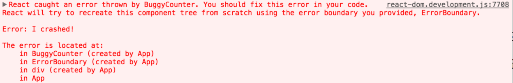

可以看到在错误信息下方文字中存在一个组件栈，便于我们追踪错误

对于错误边界无法捕获的异常，如事件处理过程中发生问题并不会捕获到，是因为其不会在渲染期间触发，并不会导致渲染时候问题

这种情况可以使用`js`的`try...catch...`语法，如下：

```jsx
class MyComponent extends React.Component {
  constructor(props) {
    super(props);
    this.state = { error: null };
    this.handleClick = this.handleClick.bind(this);
  }

  handleClick() {
    try {
      // 执行操作，如有错误则会抛出
    } catch (error) {
      this.setState({ error });
    }
  }

  render() {
    if (this.state.error) {
      return <h1>Caught an error.</h1>
    }
    return <button onClick={this.handleClick}>Click Me</button>
  }
}
```


除此之外还可以通过监听`onerror`事件

```js
window.addEventListener('error', function(event) { ... })
```


**要点**：
在 React 项目中，捕获错误是一个重要的任务，以确保应用在运行时能够处理异常情况，并提供良好的用户体验。React 提供了多种机制来捕获和处理错误。

以下是如何在 React 项目中捕获错误的主要方法：

### 1. **错误边界（Error Boundaries）**

#### 1.1 定义

- **错误边界**：React 16 引入的概念，用于捕获渲染过程中、生命周期方法中的错误。错误边界是一个 React 组件，它可以捕获其子组件树中的 JavaScript 错误，并显示备用 UI。

#### 1.2 实现

- **创建错误边界组件**：实现 `componentDidCatch` 和 `static getDerivedStateFromError` 生命周期方法来处理错误。
- **示例**：

     ```javascript
     import React from 'react';

     class ErrorBoundary extends React.Component {
       constructor(props) {
         super(props);
         this.state = { hasError: false };
       }

       static getDerivedStateFromError() {
         // 更新状态以便下一个渲染可以显示降级 UI
         return { hasError: true };
       }

       componentDidCatch(error, info) {
         // 你可以将错误日志记录到远程服务器
         console.error("Error caught by ErrorBoundary:", error, info);
       }

       render() {
         if (this.state.hasError) {
           // 渲染降级 UI
           return <h1>Something went wrong.</h1>;
         }

         return this.props.children; 
       }
     }

     // 使用错误边界
     function App() {
       return (
         <ErrorBoundary>
           <MyComponent />
         </ErrorBoundary>
       );
     }
     ```

### 2. **捕获异步代码中的错误**

#### 2.1 使用 `try-catch` 语句

- **定义**：在异步操作中使用 `try-catch` 语句来捕获和处理错误。
- **示例**：

     ```javascript
     async function fetchData() {
       try {
         const response = await fetch('https://api.example.com/data');
         if (!response.ok) {
           throw new Error('Network response was not ok');
         }
         const data = await response.json();
         // 处理数据
       } catch (error) {
         console.error('Fetch error:', error);
         // 处理错误
       }
     }
     ```

#### 2.2 使用 `Promise.catch`

- **定义**：在使用 `Promise` 时，使用 `.catch` 方法来捕获错误。
- **示例**：

     ```javascript
     fetch('https://api.example.com/data')
       .then(response => {
         if (!response.ok) {
           throw new Error('Network response was not ok');
         }
         return response.json();
       })
       .then(data => {
         // 处理数据
       })
       .catch(error => {
         console.error('Fetch error:', error);
         // 处理错误
       });
     ```

### 3. **全局错误处理**

#### 3.1 使用 `window.onerror`

- **定义**：通过 `window.onerror` 可以捕获全局的 JavaScript 错误。
- **示例**：

     ```javascript
     window.onerror = function (message, source, lineno, colno, error) {
       console.error('Global error caught:', { message, source, lineno, colno, error });
       // 处理错误，如记录日志到远程服务器
       return true; // 防止浏览器默认处理
     };
     ```

#### 3.2 使用 `window.addEventListener('unhandledrejection')`

- **定义**：用于捕获未处理的 Promise 拒绝。
- **示例**：

     ```javascript
     window.addEventListener('unhandledrejection', function (event) {
       console.error('Unhandled promise rejection:', event.reason);
       // 处理错误，如记录日志到远程服务器
     });
     ```

### 4. **日志记录与监控**

#### 4.1 使用日志记录服务

- **定义**：集成日志记录服务（如 Sentry、LogRocket）来捕获和记录运行时错误，并生成错误报告。
- **示例**：

     ```javascript
     import * as Sentry from '@sentry/react';
     import { Integrations } from '@sentry/tracing';

     Sentry.init({
       dsn: 'YOUR_SENTRY_DSN',
       integrations: [new Integrations.BrowserTracing()],
       tracesSampleRate: 1.0,
     });

     // 在错误边界中使用 Sentry 记录错误
     componentDidCatch(error, info) {
       Sentry.captureException(error);
       console.error('Error caught by ErrorBoundary:', error, info);
     }
     ```

### 5. **总结**

- **错误边界**：用于捕获组件树中的渲染错误和生命周期错误，并显示备用 UI。
- **异步代码错误处理**：使用 `try-catch` 和 `.catch` 捕获异步操作中的错误。
- **全局错误处理**：通过 `window.onerror` 和 `window.addEventListener('unhandledrejection')` 捕获全局错误和未处理的 Promise 拒绝。
- **日志记录与监控**：集成日志记录服务来记录和分析运行时错误。


---
### 1366. 如果在 useEffect 的第一个参数中 return 了一个函数，那么第二个参数分别传空数组和传依赖数组，该函数分别是在什么时候执行？

**难度**：★☆☆☆☆ | **题型**：QA | **分类**：全部 / React.js

**题目**：


**参考答案**：
在 React 中，当 useEffect 第一个参数中返回一个函数时，这个函数会在组件卸载时执行。当传递空数组 [] 时，useEffect 只会在组件挂载和卸载时调用一次，因此返回的函数也只会在组件卸载时执行一次。

```js
useEffect(() => {
  // 在挂载时执行

  return () => {
    // 在卸载时执行
  }
}, []);
```

当传递依赖数组时，useEffect 会在组件挂载和依赖项更新时调用，因此返回的函数也会随着组件更新而执行。每次组件重新渲染时都会检查依赖项列表是否有变化，如果有变化则重新执行 useEffect，并在执行新的 useEffect 前先执行上一个 useEffect 返回的函数（如果存在）。

```js
useEffect(() => {
  // 在挂载、依赖列表变化及卸载时执行

  return () => {
    // 在下一次 useEffect 执行前执行
  }
}, [dep1, dep2]);
```

需要注意，这个函数的作用通常是清除 effect 留下的副作用，例如取消定时器、取消订阅等等。在函数中应该清理掉之前设置的任何 effect，在组件卸载时避免不必要的内存泄漏和资源浪费。


---
### 1387. 简述下 React 的事件代理机制？

**难度**：★★★☆☆ | **题型**：QA | **分类**：全部 / React.js

**题目**：


**参考答案**：
React 并不会把所有的处理函数直接绑定在真实的节点上。而是把所有的事件绑定到结构的最外层，使用一个统一的事件监听器，这个事件监听器上维持了一个映射来保存所有组件内部的事件监听和处理函数。

当组件挂载或卸载时，只是在这个统一的事件监听器上插入或删除一些对象。

当事件发生时，首先被这个统一的事件监听器处理，然后在映射里找到真正的事件处理函数并调用。

这样做的优点是解决了兼容性问题，并且简化了事件处理和回收机制（不需要手动的解绑事件，React 已经在内部处理了）。但是有些事件 React 并没有实现，比如 window 的 resize 事件。

## 2023.2.19更新:

在`React@17.0.3`版本中：

* 所有事件都是委托在`id = root`的DOM元素中（网上很多说是在`document`中，`17`版本不是了）；
* 在应用中所有节点的事件监听其实都是在`id = root`的DOM元素中触发；
* `React`自身实现了一套事件冒泡捕获机制；
* `React`实现了合成事件`SyntheticEvent`；
* `React`在`17`版本不再使用事件池了（网上很多说使用了对象池来管理合成事件对象的创建销毁，那是`16`版本及之前）；
* 事件一旦在`id = root`的DOM元素中委托，其实是一直在触发的，只是没有绑定对应的回调函数；

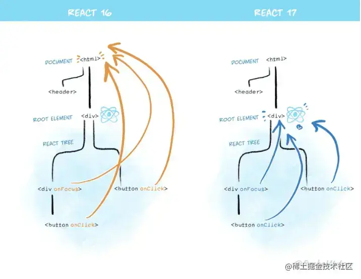 

盗用一张官方图，按官方解释，之所以会将事件委托从`document`中移到`id = root`的DOM元素，是为了**可以更加安全地进行新旧版本 React 树的嵌套**。


**要点**：
React 的事件代理机制通过以下方式提高了事件处理的性能和一致性：

1. **事件代理**：
   - **绑定到根节点**：React 将所有事件处理程序绑定到根 DOM 节点（通常是 `document`）上，而不是每个事件目标元素。这减少了需要附加的事件监听器数量。

2. **事件合成**：
   - **合成事件**：React 使用合成事件（`SyntheticEvent`）来封装原生浏览器事件。合成事件提供一致的 API 和跨浏览器的兼容性。

3. **事件池**：
   - **事件对象复用**：React 使用事件池来复用事件对象，从而减少内存分配和垃圾回收的开销。事件对象在事件处理完毕后会被重用。

4. **事件冒泡**：
   - **冒泡处理**：事件会从目标元素向上冒泡到根节点，React 会在这个过程中处理事件。这与原生事件的冒泡机制相同。

5. **性能优化**：
   - **减少事件监听器**：通过事件代理，React 减少了 DOM 元素上的事件监听器，提高了性能，特别是对于动态生成的大量元素。

**总结**：React 的事件代理机制通过集中处理事件、使用合成事件、事件对象复用等方式，提高了事件处理的效率和一致性。


---
### 1415. 什么是 React？

**难度**：★☆☆☆☆ | **题型**：QA | **分类**：全部 / React.js

**题目**：


**参考答案**：
React是一个简单的javascript UI库，用于构建高效、快速的用户界面。

它是一个轻量级库，因此很受欢迎。它遵循组件设计模式、声明式编程范式和函数式编程概念，以使前端应用程序更高效。

它使用虚拟DOM来有效地操作DOM。

它遵循从高阶组件到低阶组件的单向数据流。


---
### 1430. 说说你对 useMemo 的理解

**难度**：★☆☆☆☆ | **题型**：QA | **分类**：全部 / React.js

**题目**：


**参考答案**：
# Memo
在class的时代，我们一般是通过pureComponent来对数据进行一次浅比较，引入Hook特性后，我们可以使用Memo进行性能提升。

在此之前，我们来做一个实验
```js
import React, { useState } from "react";
import ReactDOM from "react-dom";

import "./styles.css";

function App() {
  const [n, setN] = useState(0);
  const [m, setM] = useState(10);
  console.log("执行最外层盒子了");
  return (
    <>
      <div>
        最外层盒子
        <Child1 value={n} />
        <Child2 value={m} />
        <button
          onClick={() => {
            setN(n + 1);
          }}
        >
          n+1
        </button>
        <button
          onClick={() => {
            setM(m + 1);
          }}
        >
          m+1
        </button>
      </div>
    </>
  );
}
function Child1(props) {
  console.log("执行子组件1了");
  return <div>子组件1上的n：{props.value}</div>;
}
function Child2(props) {
  console.log("执行子组件2了");
  return <div>子组件2上的m：{props.value}</div>;
}

const rootElement = document.getElementById("root");
ReactDOM.render(<App />, rootElement);
```
上面的代码我设置了两个子组件，分别读取父组件上的n跟m，然后父组件上面设置两个点击按钮，当点击后分别让设置的n、m加1。以下是第一次渲染时log控制台的结果

```!
执行最外层盒子了 
执行子组件1了 
执行子组件2了 
```

跟想象中一样，render时先进入App函数，执行，发现里面的两个child函数，执行，创建虚拟dom，创建实体dom，最后将画面渲染到页面上。


# 使用Memo优化
当我点击n+1按钮时，此时state里面的n必然+1，也会重新引发render渲染，并把新的n更新到视图中。

我们再看控制台
```!
执行最外层盒子了 
执行子组件1了 
执行子组件2了 
+ 执行最外层盒子了 
+ 执行子组件1了 
+ 执行子组件2了 //为什么组件2也渲染了，里面的m没有变化 
```
你会发现子组件2也渲染了，显然react重新把所有的函数都执行了一遍，把未曾有n数据的子组件2也重新执行了。

如何优化？我们可以使用`memo`把子组件改成以下代码
```js
const Child1 = React.memo((props) => {
  console.log("执行子组件1了");
  return <div>子组件1上的n：{props.value}</div>;
});

const Child2 = React.memo((props) => {
  console.log("执行子组件2了");
  return <div>子组件2上的m：{props.value}</div>;
});
```
再重新点击试试？
```!
执行最外层盒子了 
执行子组件1了 
执行子组件2了 
+ 执行最外层盒子了 
+ 执行子组件1了 
```
会发现没有执行子组件2了

这样的话react就会只执行对应state变化的组件，而没有变化的组件，则复用上一次的函数，也许memo也有memory的意思，代表记忆上一次的函数，不重新执行（我瞎猜的- -！！）

# 出现bug
上面的代码虽然已经优化好了性能，但是会有一个bug

上面的代码是由父组件控制`<button>`的，如果我把控制state的函数传递给子组件，会怎样呢？
```html
 <Child2 value={m} onClick={addM} /> //addM是修改M的函数
```

点击按钮让n+1
```!
执行最外层盒子了 
执行子组件1了 
执行子组件2了 
+ 执行最外层盒子了 
+ 执行子组件1了 
+ 执行子组件2了 
```
又重新执行子组件2。

为什么会这样？因为App重新执行了，它会修改addM函数的地址（函数是复杂数据类型），而addM又作为props传递给子组件2，那么就会引发子组件2函数的重新执行。

# useMemo
这时候就要用useMemo解决问题。

`useMemo(()=>{},[])`

useMemo接收两个参数，分别是函数和一个数组（实际上是依赖），函数里return 函数,数组内存放依赖。
```js
const addM = useMemo(() => {
    return () => {
      setM({ m: m.m + 1 });
    };
  }, [m]); //表示监控m变化
```
使用方式就跟useEffect似的。

# useCallback
上面的代码很奇怪有没有
```js
useMemo(() => {
    return () => {
      setM({ m: m.m + 1 });
    };
  }, [m])
```
react就给我们准备了语法糖，useCallback。它是这样写的
```javascript
  const addM = useCallback(() => {
    setM({ m: m.m + 1 });
  }, [m]);
```
是不是看上去正常多了？

# 最终代码

```js
import React, { useCallback, useMemo, useState } from "react";
import ReactDOM from "react-dom";

import "./styles.css";

function App() {
  const [n, setN] = useState(0);
  const [m, setM] = useState({ m: 1 });
  console.log("执行最外层盒子了");
  const addN = useMemo(() => {
    return () => {
      setN(n + 1);
    };
  }, [n]);
  const addM = useCallback(() => {
    setM({ m: m.m + 1 });
  }, [m]);
  return (
    <>
      <div>
        最外层盒子
        <Child1 value={n} click={addN} />
        <Child2 value={m} click={addM} />
        <button onClick={addN}>n+1</button>
        <button onClick={addM}>m+1</button>
      </div>
    </>
  );
}
const Child1 = React.memo((props) => {
  console.log("执行子组件1了");
  return <div>子组件1上的n：{props.value}</div>;
});

const Child2 = React.memo((props) => {
  console.log("执行子组件2了");
  return <div>子组件2上的m：{props.value.m}</div>;
});

const rootElement = document.getElementById("root");
ReactDOM.render(<App />, rootElement);
```

# 总结
* 使用`memo`可以帮助我们优化性能，让`react`没必要执行不必要的函数
* 由于复杂数据类型的地址可能发生改变，于是传递给子组件的`props`也会发生变化，这样还是会执行不必要的函数，所以就用到了`useMemo`这个api
* `useCallback`是`useMemo`的语法糖

**要点**：
`useMemo` 是 React Hooks 中的一个非常有用的 Hook,它可以帮助我们进行性能优化。

`useMemo` 的作用是:

1. **缓存计算结果**
   - `useMemo` 允许我们缓存一个需要计算的值,只有当它的依赖项发生变化时,才会重新计算并返回新的值。这可以避免不必要的重复计算,提高性能。

2. **避免不必要的re-render**
   - 通过缓存计算结果,`useMemo` 可以避免子组件不必要的re-render,提高整体应用的性能。

`useMemo` 的基本使用方式如下:

```javascript
const memoizedValue = useMemo(() => computeExpensiveValue(a, b), [a, b]);
```

- `useMemo` 接受两个参数:
  1. 一个函数,返回需要缓存的值。这个函数会在依赖项发生变化时才会被调用。
  2. 一个依赖项数组,用于指定哪些值的变化会触发重新计算。

`useMemo` 的常见使用场景包括:

1. **记忆化昂贵的计算**
   - 如果一个函数的计算比较昂贵,可以使用 `useMemo` 缓存计算结果,避免重复计算。

2. **避免不必要的re-render**
   - 如果一个组件的渲染依赖一个复杂的对象或数组,使用 `useMemo` 缓存该值,可以避免不必要的re-render。

3. **性能优化**
   - 在处理大量数据,或复杂计算的场景下,使用 `useMemo` 进行性能优化非常有帮助。

需要注意的是,过度使用 `useMemo` 也可能会带来问题,比如增加复杂度和潜在的内存泄漏。因此在使用 `useMemo` 时,需要权衡利弊,只在确实需要提高性能的场景下使用。

 `useMemo` 是一个非常有用的 Hook,可以帮助我们缓存计算结果,避免不必要的re-render,提高应用的整体性能。合理地使用 `useMemo` 是 React 开发中的一项重要技能。


---
### 1434. 说说你对 useReducer 的理解

**难度**：★★★☆☆ | **题型**：QA | **分类**：全部 / React.js

**题目**：


**参考答案**：
`useReducer` 是 React 提供的一个 Hook，用于在函数组件中管理状态。它与 `useState` 类似，但通常在需要处理复杂状态逻辑时使用，特别是当状态的更新依赖于先前的状态或需要多个值时。`useReducer` 的设计灵感来源于 Redux，它通过将状态管理逻辑抽象为一个“reducer”函数来让状态的变更变得更加清晰和可控。

### 1. **`useReducer` 的基本语法**

`useReducer` 接受两个参数：
- **reducer**：一个纯函数，用于处理状态的更新。它接收当前状态和一个动作对象，然后返回一个新的状态。
- **initialState**：初始状态，可以是任意类型的值（数字、对象、数组等）。

```js
const [state, dispatch] = useReducer(reducer, initialState);
```

- `state`：当前的状态值。
- `dispatch`：一个函数，用来分发动作，触发状态更新。

### 2. **`reducer` 函数的定义**

`reducer` 函数接收两个参数：
- **state**：当前的状态。
- **action**：包含了要更新状态的指令或者数据的对象。

`reducer` 函数根据 `action` 的不同类型，返回一个新的状态。

```js
function reducer(state, action) {
  switch (action.type) {
    case 'increment':
      return { count: state.count + 1 };
    case 'decrement':
      return { count: state.count - 1 };
    default:
      return state;
  }
}
```

### 3. **如何使用 `useReducer`**

在使用 `useReducer` 时，你需要：
1. 定义一个 `reducer` 函数来指定如何更新状态。
2. 使用 `useReducer` 获取 `state` 和 `dispatch`。
3. 使用 `dispatch` 来触发状态更新。

#### 示例：简单的计数器

```js
import React, { useReducer } from 'react';

// 定义初始状态
const initialState = { count: 0 };

// 定义 reducer 函数
function reducer(state, action) {
  switch (action.type) {
    case 'increment':
      return { count: state.count + 1 };
    case 'decrement':
      return { count: state.count - 1 };
    default:
      return state;
  }
}

function Counter() {
  const [state, dispatch] = useReducer(reducer, initialState);

  return (
    <div>
      <p>Count: {state.count}</p>
      <button onClick={() => dispatch({ type: 'increment' })}>Increment</button>
      <button onClick={() => dispatch({ type: 'decrement' })}>Decrement</button>
    </div>
  );
}

export default Counter;
```

在上面的例子中，`useReducer` 管理了计数器的状态。`dispatch` 函数用于触发不同类型的动作（`increment` 和 `decrement`），`reducer` 函数根据动作类型返回新的状态。

### 4. **使用场景**

`useReducer` 适合处理以下场景：
- **复杂状态逻辑**：当一个状态依赖于多个字段时，或者状态更新涉及多个值的变化，`useReducer` 提供了更好的结构化方式。
- **多个状态更新依赖于先前的状态**：当状态更新涉及先前状态的计算时（例如，多个操作之间的连锁反应），使用 `useReducer` 更容易控制和管理。
- **优化性能**：在某些情况下，`useReducer` 可以帮助避免不必要的重渲染，因为它可以更精确地控制状态更新和渲染过程，尤其是当使用 `dispatch` 更新复杂状态时。

#### 例子：表单管理

对于一个表单，如果每个输入字段的状态都需要管理，并且每个字段的更新需要独立处理，`useReducer` 会比 `useState` 更具可维护性。

```js
import React, { useReducer } from 'react';

// 初始状态
const initialState = { name: '', email: '' };

// reducer 函数
function reducer(state, action) {
  switch (action.type) {
    case 'SET_NAME':
      return { ...state, name: action.payload };
    case 'SET_EMAIL':
      return { ...state, email: action.payload };
    default:
      return state;
  }
}

function Form() {
  const [state, dispatch] = useReducer(reducer, initialState);

  const handleNameChange = (e) => {
    dispatch({ type: 'SET_NAME', payload: e.target.value });
  };

  const handleEmailChange = (e) => {
    dispatch({ type: 'SET_EMAIL', payload: e.target.value });
  };

  return (
    <form>
      <input
        type="text"
        value={state.name}
        onChange={handleNameChange}
        placeholder="Name"
      />
      <input
        type="email"
        value={state.email}
        onChange={handleEmailChange}
        placeholder="Email"
      />
    </form>
  );
}

export default Form;
```

### 5. **`useReducer` 与 `useState` 的区别**

- **状态管理复杂度**：`useReducer` 通常用于复杂状态管理，特别是当状态依赖于多个字段，或者更新逻辑复杂时。而 `useState` 更适合处理简单的、独立的状态。
- **可预测性和结构化**：`useReducer` 可以通过 `reducer` 函数将状态更新逻辑结构化，便于管理和调试。而 `useState` 每次更新状态都需要单独处理更新逻辑，随着状态复杂度增加，代码会变得难以维护。
- **性能**：`useReducer` 和 `useState` 在性能上没有显著的差异，但 `useReducer` 更适合在需要多次更新状态或复杂状态操作时使用。

**要点**：
`useReducer` 是一个用于在函数组件中管理复杂状态的 React Hook。它通过将状态更新逻辑封装在一个纯函数（reducer）中，提供了更结构化和可控的方式来更新状态。`useReducer` 非常适用于那些需要多步骤、复杂状态变化的场景，比如表单管理、游戏状态、数据交互等。相比于 `useState`，`useReducer` 提供了更强的扩展性和可维护性，尤其是在处理多个状态更新之间的依赖关系时。

---
### 1438. 为什么 react 组件中， 都需要声明 `import React from 'react';`

**难度**：★★☆☆☆ | **题型**：QA | **分类**：全部 / React.js

**题目**：


**参考答案**：
与 React 的早期设计和 JSX 语法的处理密切相关，具体来说，主要是以下原因：

### 1. **JSX 需要 React**
在 React 的早期版本中，JSX（JavaScript XML）是通过 JavaScript 语法扩展来实现的。JSX 代码本质上是一个类似 XML 的语法糖，它会被 Babel 转换为 `React.createElement()` 调用。

例如，下面的 JSX 代码：
```jsx
const element = <h1>Hello, world!</h1>;
```

在 Babel 转译后，会变成类似如下的代码：
```javascript
const element = React.createElement('h1', null, 'Hello, world!');
```

可以看到，JSX 最终会被转换为 `React.createElement()` 的调用。因此，在使用 JSX 时，必须导入 `React`，否则编译器会找不到 `React.createElement` 函数，导致错误。

### 2. **React 需要作为一个全局对象**
`React.createElement()` 是创建 React 元素的基础函数。为了能够正确生成虚拟 DOM 和管理组件，React 库提供了必要的 API。因此，导入 `React` 是为了能够调用这些方法。

### 3. **Babel 的转换（之前的工作原理）**
在 JSX 编译阶段，Babel 会将 JSX 转换为 `React.createElement()` 函数调用。因此，React 在 JSX 文件中成为了必需的导入项。如果没有导入 React，Babel 在转换过程中将无法找到 `React.createElement`，从而导致错误。

### **随着 React 17 的更新：**
自 React 17 版本开始，**JSX 转换**的工作有所变化。React 17 引入了新的 JSX 转换方式，允许开发者不再显式地导入 `React`。这是通过新的 JSX 编译器来实现的，不再需要将 JSX 转换为 `React.createElement` 调用。

在 React 17 及以后的版本中，Babel 会自动处理 `React` 的引入，具体来说：

- **不再需要显式地导入 React**：如果你使用了 React 17 或更高版本，并且配置了正确的 Babel 插件（如 `@babel/preset-react`），JSX 的编译器会自动将 `React` 导入到每个文件中，从而不再需要手动编写 `import React from 'react';`。

### 4. **向后兼容**
虽然 React 17 之后不再强制要求显式导入 `React`，但由于许多项目仍然使用较旧的 React 版本，或者代码库中有其他工具、库的兼容性问题，开发者可能仍然看到许多项目中保留 `import React from 'react';`。此外，如果你使用 TypeScript，或者一些特殊的工具链配置，可能仍然需要手动导入。

**要点**：
- **React 16 及以下**：在使用 JSX 时必须导入 `React`，因为 JSX 语法最终会被转换为 `React.createElement()` 调用。
- **React 17 及以上**：如果启用了新的 JSX 转换方式（默认启用），则不再需要显式导入 `React`，Babel 会自动处理。

尽管在 React 17 之后你可以省略 `import React from 'react';`，但很多项目仍然保持兼容性，尤其是较老的项目，可能仍然需要保留这个导入语句。

---
### 1451. 为什么不能在循环、条件或嵌套函数中调用 Hooks？

**难度**：★★★☆☆ | **题型**：QA | **分类**：全部 / React.js

**题目**：


**参考答案**：
React 对 Hooks 的实现，本质上依赖 **调用顺序（call order）** 来完成状态与组件实例之间的绑定，而不是依赖变量名或函数标识。

在函数组件执行时，React 会把组件当作一个普通函数重新执行一遍。每一次 render，React 内部都会维护一个指针（可以理解为当前 Hook 游标），按照代码执行顺序依次读取或创建 Hook 状态。例如第一次遇到 `useState`，就取 Hook 链表中的第一个节点；第二次遇到 `useEffect`，就取第二个节点，以此类推。

换句话说，React 并不知道“这是哪个 useState”，它只知道“这是第几个 Hook”。

如果 Hook 出现在条件、循环或嵌套函数中，就会破坏这种稳定的调用顺序。

以条件语句为例：

```js
if (visible) {
  useEffect(() => {});
}
```

当 `visible = true` 时，这个 Hook 会被执行，占据某一个 Hook 位置；当下一次 render 变成 `false` 时，这个 Hook 不再执行，后面的 Hook 全部向前移动一位。此时 React 仍然按旧顺序读取状态，结果就是：

* 状态错位（state mismatch）
* effect 与错误的 state 绑定
* 出现难以预测的 UI 行为

循环中调用 Hooks 的问题本质相同。循环次数一旦变化，Hook 调用数量就变化，React 内部的 Hook 链表无法正确对齐。

嵌套函数的问题则在于：Hooks 必须发生在组件 render 的同步执行路径中。嵌套函数可能不会在每次 render 被调用，或者调用次数不同，这同样会导致 Hook 注册顺序不稳定。

React 团队选择这种设计，并不是限制能力，而是为了获得三个关键收益：

第一，避免为每个 Hook 建立复杂的标识系统，使 Hook 实现保持极低运行时成本。
第二，让函数组件具备可预测的状态恢复能力，使 Fiber 在中断与恢复渲染时仍能正确关联状态。
第三，使 Hook 调用在并发渲染（Concurrent Rendering）下仍然可重放（replayable）。

因此官方提出了 **Rules of Hooks**：

* Hook 只能在 React 函数组件或自定义 Hook 的顶层调用
* Hook 调用顺序在每一次 render 中必须完全一致

ESLint 的 `react-hooks/rules-of-hooks` 本质上就是在静态分析阶段保证这一点。

需要注意的是，条件逻辑并不是不能写，而是应该放在 Hook 内部：

```js
useEffect(() => {
  if (!visible) return;
  // side effect
}, [visible]);
```

这样 Hook 的调用顺序保持稳定，而执行逻辑仍然可以动态控制。

**要点**：
React 通过“调用顺序”而不是标识符来管理 Hook 状态；循环、条件或嵌套函数会导致 Hook 调用次数或顺序发生变化，从而破坏 React 内部 Hook 链表的映射关系，引发状态错位与不可预测行为。因此 Hooks 必须在组件顶层以固定顺序执行，这是 Hooks 能够高性能、可恢复并支持并发渲染的前提。

---
### 1466. React中的VM 一定会提高性能吗？

**难度**：★★☆☆☆ | **题型**：QA | **分类**：全部 / React.js

**题目**：


**参考答案**：
不一定，因为 VM 只是通过 diff 算法避免了一些不需要变更的 DOM 操作，最终还是要操作 DOM 的，并且 diff 的过程也是有成本的。

对于某些场景，比如都是需要变更 DOM 的操作，因为 VM 还会有额外的 diff 算法的成本在里面，所以 VM 的方式并不会提高性能，甚至比原生 DOM 要慢。

但是正如尤大大说的，这是一个性能 vs 可维护性的取舍。

框架的意义在于为你掩盖底层的 DOM 操作，让你用更声明式的方式来描述你的目的，从而让你的代码更容易维护。

没有任何框架可以比纯手动的优化 DOM 操作更快，因为框架的 DOM 操作层需要应对任何上层 API 可能产生的操作，它的实现必须是普适的。

针对任何一个 benchmark，都可以写出比任何框架更快的手动优化，但是那有什么意义呢？在构建一个实际应用的时候，出于可维护性的考虑，不可能在每一个地方都去做手动优化。

**要点**：
虚拟 DOM 是 React 的核心概念之一，用于提高性能。以下是关于虚拟 DOM 是否一定会提高性能的详细分析：

### 1. **虚拟 DOM 的作用**

- **描述**：虚拟 DOM 是一个在内存中表示的轻量级的 DOM 树。当组件状态更新时，React 会首先更新虚拟 DOM，然后通过与旧的虚拟 DOM 进行比较（称为“diffing”），确定实际 DOM 上的最小更改，并将这些更改应用到真实 DOM 上。
- **优点**：
  - **减少直接 DOM 操作**：直接操作真实 DOM 通常是性能开销较大的操作，虚拟 DOM 减少了这种操作的频率。
  - **高效的更新机制**：通过 diff 算法和批量更新，虚拟 DOM 能够有效地减少实际 DOM 更新的次数和复杂度。

### 2. **性能提升的前提**

- **组件更新复杂度**：虚拟 DOM 的性能提升效果与组件更新的复杂度有关。对于简单的组件和少量更新，虚拟 DOM 的性能提升可能不明显。
- **差异化更新**：虚拟 DOM 的性能优势在于它能减少不必要的 DOM 操作，特别是在复杂 UI 和频繁更新的情况下。对于频繁更新的复杂组件，虚拟 DOM 能够显著提升性能。

### 3. **虚拟 DOM 的局限性**

- **性能开销**：虚拟 DOM 本身需要占用内存和计算资源。对于非常简单的页面，虚拟 DOM 的引入可能带来额外的性能开销，不一定能提高性能。
- **并发场景**：在高并发或大规模数据处理场景中，虚拟 DOM 的性能提升效果可能受到限制，尤其是当更新频繁且大量时。React 的并发模式（Concurrent Mode）在这方面提供了进一步优化。

### 4. **优化虚拟 DOM 的使用**

- **组件优化**：使用 `React.memo`、`PureComponent`、`useCallback` 和 `useMemo` 等优化工具，可以减少不必要的虚拟 DOM 更新，提高性能。
- **合理的状态管理**：确保组件状态的管理合理，避免不必要的重新渲染和虚拟 DOM 更新。
- **代码分割**：通过代码分割和懒加载技术，减少初始加载的虚拟 DOM 大小，提升性能。

### 5. **实际应用中的效果**

- **一般情况下**：对于大多数应用，虚拟 DOM 提供的性能提升是显著的，特别是在处理复杂组件和大量动态更新时。
- **特定场景**：在某些特定场景下，如极其简单的页面或低频次更新的页面，虚拟 DOM 的性能提升可能不明显。

### 总结

虚拟 DOM 通常能够提高性能，特别是在复杂组件和频繁更新的场景中，通过减少直接 DOM 操作和优化更新过程。但它并不是在所有情况下都能显著提高性能，特别是对于非常简单的页面或极少更新的场景。此外，React 的并发模式和其他优化技术可以进一步提升虚拟 DOM 的性能表现。


---
### 1486. React Fiber是什么？

**难度**：★★★★☆ | **题型**：QA | **分类**：全部 / React.js

**题目**：


**参考答案**：
## Fiber 出现的背景

首先要知道的是，JavaScript 引擎和页面渲染引擎两个线程是互斥的，当其中一个线程执行时，另一个线程只能挂起等待。

在这样的机制下，如果 JavaScript 线程长时间地占用了主线程，那么渲染层面的更新就不得不长时间地等待，界面长时间不更新，会导致页面响应度变差，用户可能会感觉到卡顿。

而这正是 React 15 的 Stack Reconciler 所面临的问题，即是 JavaScript 对主线程的超时占用问题。Stack Reconciler 是一个同步的递归过程，使用的是 JavaScript 引擎自身的函数调用栈，它会一直执行到栈空为止，所以当 React 在渲染组件时，从开始到渲染完成整个过程是一气呵成的。如果渲染的组件比较庞大，js 执行会占据主线程较长时间，会导致页面响应度变差。

而且所有的任务都是按照先后顺序，没有区分优先级，这样就会导致优先级比较高的任务无法被优先执行。

## Fiber 是什么

Fiber 的中文翻译叫纤程，与进程、线程同为程序执行过程，Fiber 就是比线程还要纤细的一个过程。纤程意在对渲染过程实现进行更加精细的控制。

从架构角度来看，Fiber 是对 React 核心算法（即调和过程）的重写。

从编码角度来看，Fiber 是 React 内部所定义的一种数据结构，它是 Fiber 树结构的节点单位，也就是 React 16 新架构下的"虚拟 DOM"。

一个 fiber 就是一个 JavaScript 对象，Fiber 的数据结构如下：

```
type Fiber = {
  // 用于标记fiber的WorkTag类型，主要表示当前fiber代表的组件类型如FunctionComponent、ClassComponent等
  tag: WorkTag,
  // ReactElement里面的key
  key: null | string,
  // ReactElement.type，调用`createElement`的第一个参数
  elementType: any,
  // The resolved function/class/ associated with this fiber.
  // 表示当前代表的节点类型
  type: any,
  // 表示当前FiberNode对应的element组件实例
  stateNode: any,

  // 指向他在Fiber节点树中的`parent`，用来在处理完这个节点之后向上返回
  return: Fiber | null,
  // 指向自己的第一个子节点
  child: Fiber | null,
  // 指向自己的兄弟结构，兄弟节点的return指向同一个父节点
  sibling: Fiber | null,
  index: number,

  ref: null | (((handle: mixed) => void) & { _stringRef: ?string }) | RefObject,

  // 当前处理过程中的组件props对象
  pendingProps: any,
  // 上一次渲染完成之后的props
  memoizedProps: any,

  // 该Fiber对应的组件产生的Update会存放在这个队列里面
  updateQueue: UpdateQueue<any> | null,

  // 上一次渲染的时候的state
  memoizedState: any,

  // 一个列表，存放这个Fiber依赖的context
  firstContextDependency: ContextDependency<mixed> | null,

  mode: TypeOfMode,

  // Effect
  // 用来记录Side Effect
  effectTag: SideEffectTag,

  // 单链表用来快速查找下一个side effect
  nextEffect: Fiber | null,

  // 子树中第一个side effect
  firstEffect: Fiber | null,
  // 子树中最后一个side effect
  lastEffect: Fiber | null,

  // 代表任务在未来的哪个时间点应该被完成，之后版本改名为 lanes
  expirationTime: ExpirationTime,

  // 快速确定子树中是否有不在等待的变化
  childExpirationTime: ExpirationTime,

  // fiber的版本池，即记录fiber更新过程，便于恢复
  alternate: Fiber | null,
}
```

## Fiber 如何解决问题的

Fiber 把一个渲染任务分解为多个渲染任务，而不是一次性完成，把每一个分割得很细的任务视作一个"执行单元"，React 就会检查现在还剩多少时间，如果没有时间就将控制权让出去，故任务会被分散到多个帧里面，中间可以返回至主进程控制执行其他任务，最终实现更流畅的用户体验。

即是实现了"增量渲染"，实现了可中断与恢复，恢复后也可以复用之前的中间状态，并给不同的任务赋予不同的优先级，其中每个任务更新单元为 React Element 对应的 Fiber 节点。

## Fiber 实现原理

实现的方式是requestIdleCallback这一 API，但 React 团队 polyfill 了这个 API，使其对比原生的浏览器兼容性更好且拓展了特性。

> window.requestIdleCallback()方法将在浏览器的空闲时段内调用的函数排队。这使开发者能够在主事件循环上执行后台和低优先级工作，而不会影响延迟关键事件，如动画和输入响应。函数一般会按先进先调用的顺序执行，然而，如果回调函数指定了执行超时时间 timeout，则有可能为了在超时前执行函数而打乱执行顺序。

requestIdleCallback回调的执行的前提条件是当前浏览器处于空闲状态。

即requestIdleCallback的作用是在浏览器一帧的剩余空闲时间内执行优先度相对较低的任务。首先 React 中任务切割为多个步骤，分批完成。在完成一部分任务之后，将控制权交回给浏览器，让浏览器有时间再进行页面的渲染。等浏览器忙完之后有剩余时间，再继续之前 React 未完成的任务，是一种合作式调度。

简而言之，由浏览器给我们分配执行时间片，我们要按照约定在这个时间内执行完毕，并将控制权还给浏览器。

React 16 的Reconciler基于 Fiber 节点实现，被称为 Fiber Reconciler。

作为静态的数据结构来说，每个 Fiber 节点对应一个 React element，保存了该组件的类型（函数组件/类组件/原生组件等等）、对应的 DOM 节点等信息。

作为动态的工作单元来说，每个 Fiber 节点保存了本次更新中该组件改变的状态、要执行的工作。

每个 Fiber 节点有个对应的 React element，多个 Fiber 节点是如何连接形成树呢？靠如下三个属性：

```js
// 指向父级Fiber节点
this.return = null
// 指向子Fiber节点
this.child = null
// 指向右边第一个兄弟Fiber节点
this.sibling = null
```


**要点**：
React Fiber 是 React 的一种新架构，旨在解决早期 React 版本中处理更新和渲染的性能瓶颈。它在 React 16 中引入，带来了许多改进和新特性。以下是 React Fiber 的简要介绍：

### **React Fiber 的主要目标和特点**

1. **可中断的渲染**：
   - **优先级管理**：Fiber 允许 React 在渲染过程中根据任务的优先级进行中断和恢复。这意味着高优先级的任务（如用户输入）可以打断低优先级的任务（如后台数据加载），提高了用户体验。

2. **增量更新**：
   - **分片渲染**：Fiber 使 React 可以将渲染任务拆分成多个小的片段（或单元），逐步完成渲染。这有助于防止长时间的渲染过程阻塞主线程，提高了页面的响应性。

3. **灵活的调度**：
   - **调度策略**：Fiber 引入了调度机制，允许 React 更智能地安排和优先处理不同的渲染任务。通过优先级队列，React 可以优化任务调度，以响应用户操作和其他事件。

4. **错误处理**：
   - **错误边界**：Fiber 使得实现错误边界成为可能。错误边界允许开发者捕获和处理组件树中的 JavaScript 错误，并防止整个应用崩溃。

5. **复用现有的 DOM 元素**：
   - **元素复用**：Fiber 改进了对 DOM 元素的复用策略，使得 React 可以更高效地更新现有的 DOM 元素，而不是重新创建和销毁它们。

### **Fiber 的内部结构**

- **Fiber 节点**：每个组件的渲染任务被表示为一个 Fiber 节点，包含有关组件的状态、属性和子节点的信息。Fiber 节点组成了一个 Fiber 树，这棵树描述了整个应用的渲染结构。

- **调度和优先级**：Fiber 通过调度器来管理任务的优先级和执行顺序，确保重要任务（如用户交互）优先处理。

### **总结**

React Fiber 是 React 的一种新的渲染引擎，带来了可中断渲染、增量更新、灵活调度和更好的错误处理等性能和体验优化。它通过改进的任务调度和优先级管理，使得 React 应用能够在处理复杂界面和大量数据时保持更高的性能和响应性。


---
### 1492. 说说对 React 中Element、Component、Node、Instance 四个概念的理解

**难度**：★★★☆☆ | **题型**：QA | **分类**：全部 / React.js

**题目**：


**参考答案**：
在 React 中，Element、Component、Node、Instance 是四个重要的概念。

1. Element：Element 是 React 应用中最基本的构建块，它是一个普通的 JavaScript 对象，用来描述 UI 的一部分。Element 可以是原生的 DOM 元素，也可以是自定义的组件。它的作用是用来向 React 描述开发者想在页面上 render 什么内容。Element 是不可变的，一旦创建就不能被修改。

2. Component：Component 是 React 中的一个概念，它是由 Element 构成的，可以是函数组件或者类组件。Component 可以接收输入的数据（props），并返回一个描述 UI 的 Element。Component 可以被复用，可以在应用中多次使用。分为 `Class Component` 以及 `Function Component`。

3. Node：Node 是指 React 应用中的一个虚拟节点，它是 Element 的实例。Node 包含了 Element 的所有信息，包括类型、属性、子节点等。Node 是 React 内部用来描述 UI 的一种数据结构，它可以被渲染成真实的 DOM 元素。

4. Instance：Instance 是指 React 应用中的一个组件实例，它是 Component 的实例。每个 Component 在应用中都会有一个对应的 Instance，它包含了 Component 的所有状态和方法。Instance 可以被用来操作组件的状态，以及处理用户的交互事件等。


---
### 1504. React 是怎么渲染出页面的？

**难度**：★★★☆☆ | **题型**：QA | **分类**：全部 / React.js

**题目**：


**参考答案**：
React 渲染页面的过程主要包括以下几个步骤：

### **1. 创建虚拟 DOM**

- **组件定义**：当你定义一个组件并调用 `render` 方法时，React 会根据组件的 JSX 结构创建一个虚拟 DOM。这是一个轻量级的 JavaScript 对象，描述了 UI 的结构。

### **2. 渲染到真实 DOM**

- **初始渲染**：在组件首次渲染时，React 会将虚拟 DOM 转换为实际的 DOM 元素，并将其插入到页面中。通常是通过 `ReactDOM.render()` 方法完成的。

```jsx
import ReactDOM from 'react-dom';

ReactDOM.render(<MyComponent />, document.getElementById('root'));
```

### **3. 组件更新**

- **状态或属性变化**：当组件的状态（state）或属性（props）发生变化时，React 会重新调用组件的 `render` 方法，生成新的虚拟 DOM。

### **4. Diff 算法**

- **比较新旧虚拟 DOM**：React 使用高效的 Diff 算法对比新旧虚拟 DOM，以找到需要更新的部分。这个过程称为“调和”（reconciliation）。

### **5. 更新真实 DOM**

- **最小化 DOM 操作**：根据 Diff 算法的结果，React 会计算出最小的 DOM 更新操作，只对那些发生变化的部分进行实际更新，而不是重新渲染整个页面。

### **6. 生命周期方法**

- **调用生命周期方法**：在渲染过程中，React 会调用组件的生命周期方法，例如 `componentDidMount`、`componentDidUpdate` 等，以允许开发者在不同的渲染阶段执行特定的逻辑。

### **7. 批处理更新**

- **批量更新**：在事件处理时，React 会将多个状态更新合并为一次渲染，减少不必要的 DOM 操作，提高性能。

### **8. 异步渲染**

- **并发渲染**：从 React 16 开始，React 支持异步渲染，可以在不阻塞主线程的情况下进行 UI 更新，以提升用户体验。

**要点**：
React 渲染页面的过程包括创建虚拟 DOM、将其渲染到真实 DOM、处理组件更新、使用 Diff 算法优化更新、调用生命周期方法、进行批处理更新以及支持异步渲染。

---
### 1509. setState 是同步，还是异步的？

**难度**：★★★☆☆ | **题型**：QA | **分类**：全部 / React.js

**题目**：


**参考答案**：
PS: 2022年10月更新答案

# react18之前。

setState在不同情况下可以表现为异步或同步。

在Promise的状态更新、js原生事件、setTimeout、setInterval..中是同步的。

在react的合成事件中，是异步的。

---

# react18之后。

setState都会表现为异步（即批处理）。  
[官方详细说明。](https://github.com/reactwg/react-18/discussions/21)

## react18之前版本的解释

在React中，如果是由React引发的事件处理（比如通过onClick引发的事件处理），调用setState不会同步更新this.state，除此之外的setState调用会同步执行this.state 。所谓“除此之外”，指的是绕过React通过addEventListener直接添加的事件处理函数，还有通过setTimeout/setInterval产生的异步调用。

原因： 在React的setState函数实现中，会根据一个变量isBatchingUpdates判断是直接更新this.state还是放到队列中回头再说，而isBatchingUpdates默认是false，也就表示setState会同步更新this.state，但是，有一个函数batchedUpdates，这个函数会把isBatchingUpdates修改为true，而当React在调用事件处理函数之前就会调用这个batchedUpdates，造成的后果，就是由React控制的事件处理过程setState不会同步更新this.state。

注意： setState的“异步”并不是说内部由异步代码实现，其实本身执行的过程和代码都是同步的，只是合成事件和钩子函数的调用顺序在更新之前，导致在合成事件和钩子函数中没法立马拿到更新后的值，形式了所谓的“异步”，当然可以通过第二个参数 setState(partialState, callback) 中的callback拿到更新后的结果。

综上，setState 只在合成事件和 hook() 中是“异步”的，在 原生事件和 setTimeout 中都是同步的。


**要点**：
* react18之前。

setState在不同情况下可以表现为异步或同步。

在Promise的状态更新、js原生事件、setTimeout、setInterval..中是同步的。

在react的合成事件中，是异步的。

* react18之后。

setState都会表现为异步（即批处理）。


---
### 1536. React中的路由懒加载是什么？原理是什么？

**难度**：★★★★☆ | **题型**：QA | **分类**：全部 / React.js

**题目**：


**参考答案**：
## React.lazy 是什么

随着前端应用体积的扩大，资源加载的优化是我们必须要面对的问题，动态代码加载就是其中的一个方案。

webpack 提供了符合 ECMAScript 提案 的 import() 语法 ，让我们来实现动态地加载模块（注：require.ensure 与 import() 均为 webpack 提供的代码动态加载方案，在 webpack 2.x 中，require.ensure 已被 import 取代）。

在 React 16.6 版本中，新增了 React.lazy 函数，它能让你像渲染常规组件一样处理动态引入的组件，配合 webpack 的 Code Splitting ，只有当组件被加载，对应的资源才会导入 ，从而达到懒加载的效果。

## 使用 React.lazy

在实际的使用中，首先是引入组件方式的变化：

```
// 不使用 React.lazy
import OtherComponent from './OtherComponent';
// 使用 React.lazy
const OtherComponent = React.lazy(() => import('./OtherComponent'))
```

React.lazy 接受一个函数作为参数，这个函数需要调用 import() 。它需要返回一个 Promise，该 Promise 需要 resolve 一个 defalut export 的 React 组件。

React.lazy 方法返回的是一个 lazy 组件的对象，类型是 react.lazy，并且 lazy 组件具有 _status 属性，与 Promise 类似它具有 Pending、Resolved、Rejected 三个状态，分别代表组件的加载中、已加载、和加载失败三中状态。

需要注意的一点是，React.lazy 需要配合 Suspense 组件一起使用，在 Suspense 组件中渲染 React.lazy 异步加载的组件。如果单独使用 React.lazy，React 会给出错误提示。

## 实现原理

### Webpack 动态加载

上面使用了 import() 语法，webpack 检测到这种语法会自动代码分割。使用这种动态导入语法代替以前的静态引入，可以让组件在渲染的时候，再去加载组件对应的资源，这个异步加载流程的实现机制是怎么样呢？

webpack 是通过创建 script 标签来实现动态加载的，找出依赖对应的 chunk 信息，然后生成 script 标签来动态加载 chunk，每个 chunk 都有对应的状态：未加载 、 加载中、已加载 。

### Suspense 组件

Suspense 内部主要通过捕获组件的状态去判断如何加载，上面我们提到 React.lazy 创建的动态加载组件具有 Pending、Resolved、Rejected 三种状态，当这个组件的状态为 Pending 时显示的是 Suspense 中 fallback 的内容，只有状态变为 resolve 后才显示组件。

### Error Boundaries 处理资源加载失败场景

如果遇到网络问题或是组件内部错误，页面的动态资源可能会加载失败，为了优雅降级，可以使用 Error Boundaries 来解决这个问题。

Error Boundaries 是一种组件，如果你在组件中定义了 static getDerivedStateFromError() 或 componentDidCatch() 生命周期函数，它就会成为一个 Error Boundaries 的组件。

它的用法也非常的简单，可以直接当作一个组件去使用，如下：

```javascript
<ErrorBoundary>
  <MyWidget />
</ErrorBoundary>
```

## 总结

React.lazy() 和 React.Suspense 的提出为现代 React 应用的性能优化和工程化提供了便捷之路。 React.lazy 可以让我们像渲染常规组件一样处理动态引入的组件，结合 Suspense 可以更优雅地展现组件懒加载的过渡动画以及处理加载异常的场景。


**要点**：
在 React 中，路由懒加载是指在用户访问特定路由时才加载相应的组件，而不是在应用初始化时一次性加载所有路由组件。这样可以显著提高初始加载速度，并优化用户体验。路由懒加载通常与 React 的懒加载和代码分割功能结合使用。

### 路由懒加载的原理

1. **代码分割**：
   - **定义**：代码分割是一种将应用代码拆分成更小的块的技术，这些代码块可以按需加载。React 支持通过动态导入（`import()`）来实现代码分割。
   - **实现**：使用 Webpack 等打包工具，结合 `React.lazy` 和 `Suspense`，将路由组件拆分成单独的代码块，只在需要时加载。

2. **动态导入**：
   - **定义**：动态导入是指使用 `import()` 函数异步加载模块。它返回一个 Promise，组件会在 Promise resolve 后被加载。
   - **实现**：`React.lazy` 用于包装动态导入的组件，返回一个可以懒加载的组件。

3. **懒加载组件**：
   - **定义**：`React.lazy` 是 React 提供的一个函数，用于定义懒加载的组件。与 `Suspense` 组件配合使用，可以在组件加载过程中显示一个 fallback UI。

4. **路由配置**：
   - **定义**：结合 React Router，懒加载组件可以在路由配置中使用。通过将路由组件设置为懒加载组件，确保只有在用户访问特定路由时才加载相关组件。

### 实现路由懒加载的步骤

1. **安装依赖**：
   - 确保你已经安装了 `react-router-dom` 和 React（如果尚未安装）：

     ```bash
     npm install react-router-dom
     ```

2. **定义懒加载组件**：
   - 使用 `React.lazy` 和动态导入来定义懒加载的组件。
   - **示例**：

     ```javascript
     import React, { Suspense } from 'react';
     import { BrowserRouter as Router, Route, Switch } from 'react-router-dom';

     // 使用 React.lazy 定义懒加载组件
     const Home = React.lazy(() => import('./Home'));
     const About = React.lazy(() => import('./About'));
     const Contact = React.lazy(() => import('./Contact'));

     function App() {
       return (
         <Router>
           <Suspense fallback={<div>Loading...</div>}>
             <Switch>
               <Route path="/" exact component={Home} />
               <Route path="/about" component={About} />
               <Route path="/contact" component={Contact} />
             </Switch>
           </Suspense>
         </Router>
       );
     }

     export default App;
     ```

3. **使用 `Suspense` 组件**：
   - **定义**：`Suspense` 用于包裹懒加载组件，并定义一个 fallback UI，当懒加载组件还未加载完成时显示该 UI。
   - **实现**：在路由配置中，使用 `Suspense` 组件来处理懒加载状态。
   - **示例**（在上述代码中已包含）：

     ```javascript
     <Suspense fallback={<div>Loading...</div>}>
       <Switch>
         <Route path="/" exact component={Home} />
         <Route path="/about" component={About} />
         <Route path="/contact" component={Contact} />
       </Switch>
     </Suspense>
     ```

### 关键点

1. **动态导入（`import()`）**：用于异步加载模块，返回一个 Promise。
2. **`React.lazy`**：用于定义懒加载组件，接受动态导入的模块。
3. **`Suspense`**：用于包裹懒加载组件，定义一个 fallback UI，处理加载过程中的显示。

### 总结

- **路由懒加载**：在用户访问特定路由时才加载相应组件，优化初始加载速度。
- **实现原理**：结合代码分割、动态导入、`React.lazy` 和 `Suspense` 来实现。
- **步骤**：定义懒加载组件，使用 `Suspense` 处理加载状态，将懒加载组件用于路由配置。

通过这些步骤和原理，可以有效地实现 React 中的路由懒加载，提高应用的性能和用户体验。


---
### 1553. React 组件间怎么进行通信？

**难度**：★★★☆☆ | **题型**：QA | **分类**：全部 / React.js

**题目**：


**参考答案**：
## 一、是什么

我们将组件间通信可以拆分为两个词：

- 组件
- 通信

`React`的组件灵活多样，按照不同的方式可以分成很多类型的组件

而通信指的是发送者通过某种媒体以某种格式来传递信息到收信者以达到某个目的，广义上，任何信息的交通都是通信

组件间通信即指组件通过某种方式来传递信息以达到某个目的


## 二、如何通信

组件传递的方式有很多种，根据传送者和接收者可以分为如下：

- 父组件向子组件传递
- 子组件向父组件传递
- 兄弟组件之间的通信
- 父组件向后代组件传递
- 非关系组件传递


### 父组件向子组件传递

由于`React`的数据流动为单向的，父组件向子组件传递是最常见的方式

父组件在调用子组件的时候，只需要在子组件标签内传递参数，子组件通过`props`属性就能接收父组件传递过来的参数

```jsx
function EmailInput(props) {
  return (
    <label>
      Email: <input value={props.email} />
    </label>
  );
}

const element = <EmailInput email="123124132@163.com" />;
```


### 子组件向父组件传递

子组件向父组件通信的基本思路是，父组件向子组件传一个函数，然后通过这个函数的回调，拿到子组件传过来的值

父组件对应代码如下：

```jsx
class Parents extends Component {
  constructor() {
    super();
    this.state = {
      price: 0
    };
  }

  getItemPrice(e) {
    this.setState({
      price: e
    });
  }

  render() {
    return (
      <div>
        <div>price: {this.state.price}</div>
        {/* 向子组件中传入一个函数  */}
        <Child getPrice={this.getItemPrice.bind(this)} />
      </div>
    );
  }
}
```

子组件对应代码如下：

```jsx
class Child extends Component {
  clickGoods(e) {
    // 在此函数中传入值
    this.props.getPrice(e);
  }

  render() {
    return (
      <div>
        <button onClick={this.clickGoods.bind(this, 100)}>goods1</button>
        <button onClick={this.clickGoods.bind(this, 1000)}>goods2</button>
      </div>
    );
  }
}
```


### 兄弟组件之间的通信

如果是兄弟组件之间的传递，则父组件作为中间层来实现数据的互通，通过使用父组件传递

```jsx
class Parent extends React.Component {
  constructor(props) {
    super(props)
    this.state = {count: 0}
  }
  setCount = () => {
    this.setState({count: this.state.count + 1})
  }
  render() {
    return (
      <div>
        <SiblingA
          count={this.state.count}
        />
        <SiblingB
          onClick={this.setCount}
        />
      </div>
    );
  }
}
```


### 父组件向后代组件传递

父组件向后代组件传递数据是一件最普通的事情，就像全局数据一样

使用`context`提供了组件之间通讯的一种方式，可以共享数据，其他数据都能读取对应的数据

通过使用`React.createContext`创建一个`context`

```js
 const PriceContext = React.createContext('price')
```

`context`创建成功后，其下存在`Provider`组件用于创建数据源，`Consumer`组件用于接收数据，使用实例如下：

`Provider`组件通过`value`属性用于给后代组件传递数据：

```jsx
<PriceContext.Provider value={100}>
</PriceContext.Provider>
```

如果想要获取`Provider`传递的数据，可以通过`Consumer`组件或者或者使用`contextType`属性接收，对应分别如下：

```jsx
class MyClass extends React.Component {
  static contextType = PriceContext;
  render() {
    let price = this.context;
    /* 基于这个值进行渲染工作 */
  }
}
```

`Consumer`组件：

````jsx
<PriceContext.Consumer>
    { /*这里是一个函数*/ }
    {
        price => <div>price：{price}</div>
    }
</PriceContext.Consumer>
````

### 非关系组件传递

如果组件之间关系类型比较复杂的情况，建议将数据进行一个全局资源管理，从而实现通信，例如`redux`。关于`redux`的使用后续再详细介绍


## 三、总结

由于`React`是单向数据流，主要思想是组件不会改变接收的数据，只会监听数据的变化，当数据发生变化时它们会使用接收到的新值，而不是去修改已有的值

因此，可以看到通信过程中，数据的存储位置都是存放在上级位置中


**要点**：
1. **Props**：父组件通过 `props` 传递数据和回调函数给子组件。
2. **Context**：`Context` 提供全局数据，多个组件可以访问，无需逐层传递 `props`。
3. **Redux**：用于全局状态管理，多个组件共享和管理应用状态。
4. **状态提升**：将共享状态提升到最近的共同父组件，然后通过 `props` 传递给子组件。
5. **Event Bus**：通过事件发布-订阅模式实现组件间通信的方式


---
### 1568. React 的循环渲染中，为什么不推荐使用 index 作为元素的 key？

**难度**：★★☆☆☆ | **题型**：QA | **分类**：全部 / React.js

**题目**：


**参考答案**：
在 React 中，`key` 是用于标识每个列表项的唯一标识符，以便在渲染过程中有效跟踪每个元素的变化。

虽然可以使用 `index` 作为 `key`，但并不推荐这样做，原因如下：

### **1. 会导致不必要的重新渲染**
当使用 `index` 作为 `key` 时，如果列表项的顺序发生变化（如增删或移动），React 无法正确识别哪个项是真正变化的。它可能会重用错误的 DOM 节点，导致性能问题或错误的 UI 展现。

**示例：**
```jsx
const items = ['A', 'B', 'C'];
// 使用 index 作为 key
{items.map((item, index) => (
  <div key={index}>{item}</div>
))}

// 假设删除了第一个项
const newItems = ['B', 'C'];
```
React 会将第二个列表项 `B` 误认为是原来的第一个项，因为它们的 `key` 是相同的。

---

### **2. 导致状态错乱**
如果列表项中有状态（如输入框的值），当列表顺序变化时，状态可能被错误地绑定到其他项上，造成用户体验问题。

**示例：**
```jsx
function App() {
  const [items, setItems] = React.useState(['A', 'B', 'C']);
  
  const handleRemove = () => setItems(['B', 'C']);
  
  return (
    <>
      {items.map((item, index) => (
        <input key={index} defaultValue={item} />
      ))}
      <button onClick={handleRemove}>Remove First</button>
    </>
  );
}
```
移除第一项后，输入框的值会混乱，因为 React 认为 `B` 的输入框与原来的第一个输入框是同一个节点。

---

### **3. 不满足唯一性要求**
React 要求每个 `key` 在同一级别的列表中必须是唯一的。如果使用 `index` 作为 `key`，当列表项的内容本身需要独立标识时，`index` 无法提供准确的唯一性。

---

### **推荐的做法**
1. **使用唯一标识符**：如果列表项有唯一的 `id`，优先使用 `id` 作为 `key`。
   ```jsx
   const items = [{ id: 1, name: 'A' }, { id: 2, name: 'B' }];
   {items.map(item => (
     <div key={item.id}>{item.name}</div>
   ))}
   ```

2. **动态生成唯一标识符**：如果列表项没有唯一 `id`，可以使用库（如 `uuid`）生成唯一的 `key`。

3. **仅在静态列表中使用 `index`**：如果列表内容不会动态增删或重排，可以安全使用 `index`。 

**要点**：
- 使用 `index` 作为 `key` 会引发 **性能问题** 和 **UI 或状态混乱**，不适用于动态列表。
- 推荐使用能唯一标识列表项的数据（如 `id`），在无法提供唯一标识的情况下，需谨慎使用 `index` 作为 `key`。

---
### 1577. 说说React Jsx转换成真实DOM过程？

**难度**：★★☆☆☆ | **题型**：QA | **分类**：全部 / React.js

**题目**：


**参考答案**：
## 一、是什么

`react`通过将组件编写的`JSX`映射到屏幕，以及组件中的状态发生了变化之后 `React`会将这些「变化」更新到屏幕上

在前面文章了解中，`JSX`通过`babel`最终转化成`React.createElement`这种形式，例如：

```jsx
<div>
  
  <Hello />
</div>
```

会被`babel`转化成如下：

```jsx
React.createElement(
  "div",
  null,
  React.createElement("img", {
    src: "avatar.png",
    className: "profile"
  }),
  React.createElement(Hello, null)
);
```

在转化过程中，`babel`在编译时会判断 JSX 中组件的首字母：

- 当首字母为小写时，其被认定为原生 `DOM` 标签，`createElement` 的第一个变量被编译为字符串

- 当首字母为大写时，其被认定为自定义组件，createElement 的第一个变量被编译为对象

最终都会通过`RenderDOM.render(...)`方法进行挂载，如下：

```jsx
ReactDOM.render(<App />,  document.getElementById("root"));
```


## 二、过程

在`react`中，节点大致可以分成四个类别：

- 原生标签节点
- 文本节点
- 函数组件
- 类组件

如下所示：

```jsx
class ClassComponent extends Component {
  static defaultProps = {
    color: "pink"
  };
  render() {
    return (
      <div className="border">
        <h3>ClassComponent</h3>
        <p className={this.props.color}>{this.props.name}</p >
      </div>
    );
  }
}

function FunctionComponent(props) {
  return (
    <div className="border">
      FunctionComponent
      <p>{props.name}</p >
    </div>
  );
}

const jsx = (
  <div className="border">
    <p>xx</p >
    < a href=" ">xxx</ a>
    <FunctionComponent name="函数组件" />
    <ClassComponent name="类组件" color="red" />
  </div>
);
```

这些类别最终都会被转化成`React.createElement`这种形式

`React.createElement`其被调用时会传⼊标签类型`type`，标签属性`props`及若干子元素`children`，作用是生成一个虚拟`Dom`对象，如下所示：

```js
function createElement(type, config, ...children) {
    if (config) {
        delete config.__self;
        delete config.__source;
    }
    // ! 源码中做了详细处理，⽐如过滤掉key、ref等
    const props = {
        ...config,
        children: children.map(child =>
   typeof child === "object" ? child : createTextNode(child)
  )
    };
    return {
        type,
        props
    };
}
function createTextNode(text) {
    return {
        type: TEXT,
        props: {
            children: [],
            nodeValue: text
        }
    };
}
export default {
    createElement
};
```

`createElement`会根据传入的节点信息进行一个判断：

- 如果是原生标签节点， type 是字符串，如div、span
- 如果是文本节点， type就没有，这里是 TEXT
- 如果是函数组件，type 是函数名
- 如果是类组件，type 是类名

虚拟`DOM`会通过`ReactDOM.render`进行渲染成真实`DOM`，使用方法如下：

```jsx
ReactDOM.render(element, container[, callback])
```

当首次调用时，容器节点里的所有 `DOM` 元素都会被替换，后续的调用则会使用 `React` 的 `diff`算法进行高效的更新

如果提供了可选的回调函数`callback`，该回调将在组件被渲染或更新之后被执行

`render`大致实现方法如下：

```js
function render(vnode, container) {
    console.log("vnode", vnode); // 虚拟DOM对象
    // vnode _> node
    const node = createNode(vnode, container);
    container.appendChild(node);
}

// 创建真实DOM节点
function createNode(vnode, parentNode) {
    let node = null;
    const {type, props} = vnode;
    if (type === TEXT) {
        node = document.createTextNode("");
    } else if (typeof type === "string") {
        node = document.createElement(type);
    } else if (typeof type === "function") {
        node = type.isReactComponent
            ? updateClassComponent(vnode, parentNode)
        : updateFunctionComponent(vnode, parentNode);
    } else {
        node = document.createDocumentFragment();
    }
    reconcileChildren(props.children, node);
    updateNode(node, props);
    return node;
}

// 遍历下子vnode，然后把子vnode->真实DOM节点，再插入父node中
function reconcileChildren(children, node) {
    for (let i = 0; i < children.length; i++) {
        let child = children[i];
        if (Array.isArray(child)) {
            for (let j = 0; j < child.length; j++) {
                render(child[j], node);
            }
        } else {
            render(child, node);
        }
    }
}
function updateNode(node, nextVal) {
    Object.keys(nextVal)
        .filter(k => k !== "children")
        .forEach(k => {
        if (k.slice(0, 2) === "on") {
            let eventName = k.slice(2).toLocaleLowerCase();
            node.addEventListener(eventName, nextVal[k]);
        } else {
            node[k] = nextVal[k];
        }
    });
}

// 返回真实dom节点
// 执行函数
function updateFunctionComponent(vnode, parentNode) {
    const {type, props} = vnode;
    let vvnode = type(props);
    const node = createNode(vvnode, parentNode);
    return node;
}

// 返回真实dom节点
// 先实例化，再执行render函数
function updateClassComponent(vnode, parentNode) {
    const {type, props} = vnode;
    let cmp = new type(props);
    const vvnode = cmp.render();
    const node = createNode(vvnode, parentNode);
    return node;
}
export default {
    render
};
```


## 三、总结

在`react`源码中，虚拟`Dom`转化成真实`Dom`整体流程如下图所示：

 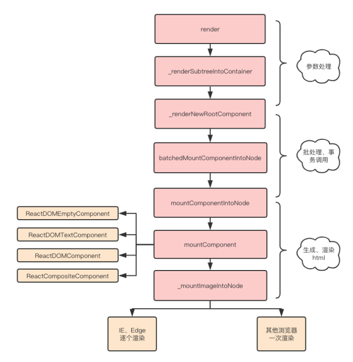

其渲染流程如下所示：

- 使用React.createElement或JSX编写React组件，实际上所有的 JSX 代码最后都会转换成React.createElement(...) ，Babel帮助我们完成了这个转换的过程。
- createElement函数对key和ref等特殊的props进行处理，并获取defaultProps对默认props进行赋值，并且对传入的孩子节点进行处理，最终构造成一个虚拟DOM对象
- ReactDOM.render将生成好的虚拟DOM渲染到指定容器上，其中采用了批处理、事务等机制并且对特定浏览器进行了性能优化，最终转换为真实DOM


**要点**：
### 1. **JSX 概述**

#### 1.1 JSX 定义

- **定义**：JSX 是一种 JavaScript 的语法扩展，看起来像 XML 或 HTML。它使得定义 React 组件的 UI 更加直观和简洁。
- **转换**：JSX 需要通过编译工具（如 Babel）转换为 JavaScript，才能在浏览器中执行。

### 2. **JSX 转换为 JavaScript**

#### 2.1 编译过程

- **Babel**：Babel 是常用的 JavaScript 编译器，它会将 JSX 代码转换为 JavaScript 代码。通常，JSX 被转换为 `React.createElement` 函数调用。
- **示例**：

     ```jsx
     // JSX
     const element = <h1>Hello, world!</h1>;

     // 编译后的 JavaScript
     const element = React.createElement('h1', null, 'Hello, world!');
     ```

### 3. **React 的虚拟 DOM（Virtual DOM）**

#### 3.1 虚拟 DOM 定义

- **定义**：虚拟 DOM 是 React 使用的一个轻量级的 JavaScript 对象，它是实际 DOM 的一种抽象表示。它允许 React 高效地更新和渲染 UI。
- **创建虚拟 DOM**：`React.createElement` 函数返回一个虚拟 DOM 对象，其中包含了组件的结构和内容。

#### 3.2 虚拟 DOM 的作用

- **提高性能**：虚拟 DOM 通过将真实 DOM 的操作最小化，减少了直接操作 DOM 的性能开销。
- **高效更新**：React 通过虚拟 DOM 来计算实际 DOM 的最小变更，并只更新那些发生变化的部分。

### 4. **虚拟 DOM 到真实 DOM 的转换**

#### 4.1 渲染过程

- **创建虚拟 DOM 树**：当 React 组件首次渲染时，`React.createElement` 生成的虚拟 DOM 树会被创建。
- **Diff 算法**：React 使用虚拟 DOM 的 Diff 算法来比较新旧虚拟 DOM 树的差异。它会找到最小的差异并计算出需要更新的部分。
- **更新真实 DOM**：React 将这些差异应用到真实 DOM 中，实现最小化更新。

#### 4.2 渲染过程的详细步骤

   1. **组件渲染**：
      - 当组件的状态或属性发生变化时，React 会重新调用组件的 render 方法，生成新的虚拟 DOM。
   2. **虚拟 DOM 比较**：
      - React 使用 Diff 算法比较新旧虚拟 DOM 树。Diff 算法通过逐层比较虚拟 DOM 节点，找到变化的部分。
   3. **计算差异**：
      - React 计算出新旧虚拟 DOM 树之间的差异，生成一个更新补丁。
   4. **更新真实 DOM**：
      - React 将生成的更新补丁应用到真实 DOM 中，只更新那些发生变化的部分，从而实现高效的 UI 更新。

### 5. **React 组件生命周期中的渲染过程**

#### 5.1 生命周期钩子

- **mounting**：组件初次挂载到 DOM 中时，`componentDidMount` 钩子会被调用。
- **updating**：组件在接收到新的属性或状态时，`componentDidUpdate` 钩子会被调用。
- **unmounting**：组件从 DOM 中卸载时，`componentWillUnmount` 钩子会被调用。

### 6. **总结**

- **JSX 转换**：JSX 通过编译工具（如 Babel）转换为 JavaScript 代码，通常是 `React.createElement` 函数调用。
- **虚拟 DOM**：虚拟 DOM 是 React 的核心特性之一，它通过高效的差异比较和最小化的更新策略提高性能。
- **渲染过程**：React 通过虚拟 DOM 计算和应用差异，确保 UI 更新的高效性和准确性。


---
### 1581. 说说对受控组件和非受控组件的理解，以及应用场景？

**难度**：★★☆☆☆ | **题型**：QA | **分类**：全部 / React.js

**题目**：


**参考答案**：
## 一、受控组件

受控组件，简单来讲，就是受我们控制的组件，组件的状态全程响应外部数据

举个简单的例子：

```jsx
class TestComponent extends React.Component {
  constructor (props) {
    super(props);
    this.state = { username: 'lindaidai' };
  }
  render () {
    return <input name="username" value={this.state.username} />
  }
}
```

这时候当我们在输入框输入内容的时候，会发现输入的内容并无法显示出来，也就是`input`标签是一个可读的状态

这是因为`value`被`this.state.username`所控制住。当用户输入新的内容时，`this.state.username`并不会自动更新，这样的话`input`内的内容也就不会变了

如果想要解除被控制，可以为`input`标签设置`onChange`事件，输入的时候触发事件函数，在函数内部实现`state`的更新，从而导致`input`框的内容页发现改变

因此，受控组件我们一般需要初始状态和一个状态更新事件函数


## 二、非受控组件

非受控组件，简单来讲，就是不受我们控制的组件

一般情况是在初始化的时候接受外部数据，然后自己在内部存储其自身状态

当需要时，可以使用` ref ` 查询 `DOM `并查找其当前值，如下：

```jsx
import React, { Component } from 'react';

export class UnControll extends Component {
  constructor (props) {
    super(props);
    this.inputRef = React.createRef();
  }
  handleSubmit = (e) => {
    console.log('我们可以获得input内的值为', this.inputRef.current.value);
    e.preventDefault();
  }
  render () {
    return (
      <form onSubmit={e => this.handleSubmit(e)}>
        <input defaultValue="lindaidai" ref={this.inputRef} />
        <input type="submit" value="提交" />
      </form>
    )
  }
}
```

关于`refs`的详情使用可以参考[之前文章](https://mp.weixin.qq.com/s/ZBKWcslVBi0IKQgz7lYzbA)


## 三、应用场景

大部分时候推荐使用受控组件来实现表单，因为在受控组件中，表单数据由`React`组件负责处理

如果选择非受控组件的话，控制能力较弱，表单数据就由`DOM`本身处理，但更加方便快捷，代码量少

针对两者的区别，其应用场景如下图所示：

 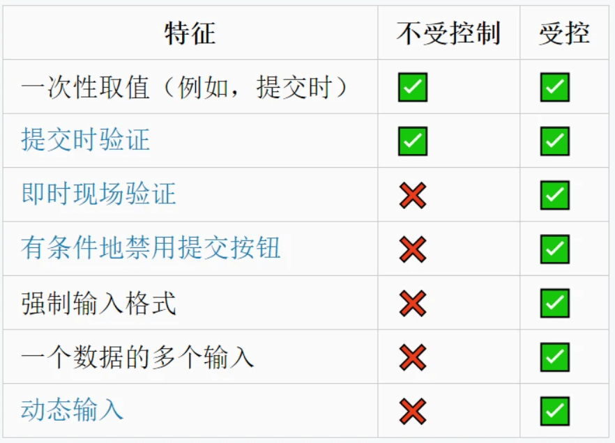


---
### 1605. React 中，fiber 是如何实现时间切片的？

**难度**：★★★★☆ | **题型**：QA | **分类**：全部 / React.js

**题目**：


**参考答案**：
Fiber 的时间切片（Time Slicing）是一种优化 React 渲染性能的技术，它允许将长时间运行的任务分解成多个小任务，以便在主线程上交替执行其他任务，从而提高用户界面的响应性。以下是时间切片在 Fiber 架构中实现的主要原理和步骤：

### **1. 任务拆分和优先级**

- **任务拆分**：Fiber 架构允许将长时间运行的任务（如组件更新）拆分成多个小的 Fiber 节点处理单元。这些小任务可以在浏览器的空闲时间中逐步完成，而不是一次性处理所有任务。
- **优先级调度**：React 为不同的更新任务分配不同的优先级。例如，用户输入相关的更新（如点击和输入事件）通常会被赋予较高的优先级，而低优先级的更新（如数据预取）则可能在用户操作之后执行。优先级调度可以确保重要的任务优先处理。

### **2. 任务调度**

- **调度器（Scheduler）**：React 使用调度器来控制任务的执行。调度器决定何时执行 Fiber 节点的更新工作，以及在主线程上分配的时间片。调度器会根据任务的优先级和浏览器的空闲时间来安排任务执行。
- **时间片切换**：时间切片的核心思想是将长时间运行的任务分割成多个时间片（时间段），并在每个时间片内处理一部分任务。在每个时间片结束时，React 会检查是否有更高优先级的任务需要处理，或者是否需要将当前任务暂停，等待下一次时间片继续处理。

### **3. Fiber 节点的处理**

- **工作单元**：每个 Fiber 节点代表一个工作单元，处理 Fiber 节点的任务被称为“工作单元”。在时间切片过程中，React 会逐步处理这些工作单元，以便将渲染任务拆分成较小的部分。
- **中断与恢复**：如果在处理 Fiber 节点的过程中，浏览器遇到用户交互（如点击或滚动），React 可以中断当前任务，并优先处理这些用户交互相关的高优先级任务。一旦用户交互处理完成，React 会恢复中断的任务，继续处理剩余的 Fiber 节点。

### **4. 流程实现**

1. **任务开始**：当 React 开始执行更新任务时，它会将任务拆分成多个 Fiber 节点的处理单元，并根据优先级安排这些任务。
2. **调度执行**：调度器会分配时间片来处理这些 Fiber 节点。每个时间片内，React 会处理一定数量的 Fiber 节点，更新虚拟 DOM 和实际 DOM。
3. **检查任务状态**：在每个时间片结束时，React 会检查是否有高优先级任务需要处理，或者是否需要暂停当前任务。调度器决定是否继续执行当前任务或切换到其他任务。
4. **恢复执行**：如果任务被中断，React 会在下一次时间片中恢复执行，继续处理未完成的 Fiber 节点。

### **5. 用户交互**

- **响应用户操作**：时间切片技术确保用户操作（如输入、点击）能够及时响应。React 在处理高优先级任务时，能够快速响应用户交互，提高页面的交互性能。
- **优化渲染**：通过将长时间运行的任务分解成多个时间片，React 能够避免阻塞主线程，提高页面的整体性能和响应性。

### **总结**

Fiber 的时间切片实现使得 React 能够高效地处理长时间运行的渲染任务，通过将任务拆分成多个小任务，并在主线程上分配时间片来逐步完成这些任务。这种方法可以显著提高用户界面的响应性和性能，确保高优先级任务能够及时处理，并优化页面渲染体验。


---
### 1610. React 中的 hooks 和 memorizedState 是什么关系?

**难度**：★★★☆☆ | **题型**：QA | **分类**：全部 / React.js

**题目**：


**参考答案**：
在 React 中，**Hooks** 和 **MemorizedState** 都与组件的状态管理和性能优化有关，但它们的作用和实现方式不同。

### **Hooks**

Hooks 是 React 16.8 引入的一组 API，使函数组件能够拥有状态和副作用管理的能力，之前这些特性只有在类组件中才可以使用。常用的 Hooks 包括：

- **`useState`**：用于在函数组件中添加状态。
- **`useEffect`**：用于处理副作用，如数据获取和订阅。
- **`useContext`**：用于在组件树中共享状态。
- **`useReducer`**：用于处理更复杂的状态逻辑。
- **`useMemo`** 和 **`useCallback`**：用于性能优化，避免不必要的重新渲染。

### **MemorizedState**

**MemorizedState** 是 React 内部的一种实现机制，用于优化组件的性能。它是 React 在内部管理组件状态时使用的一种状态存储方式，尤其是与 Hooks 的实现密切相关。

- **在 React 中，`useState` 和 `useReducer` 的实现依赖于 MemorizedState**：当你调用 `useState` 或 `useReducer` 时，React 会为每个组件实例创建一个 `MemorizedState` 对象来存储状态。这些状态在组件重新渲染时会被保留，确保组件的状态在生命周期中保持一致。
- **`MemorizedState` 的作用是优化性能**：它帮助 React 追踪状态的变化，并在组件重新渲染时有效地管理和更新状态。

### **Hooks 与 MemorizedState 的关系**

1. **状态管理**：Hooks（如 `useState` 和 `useReducer`）允许你在函数组件中管理状态。它们背后使用了 MemorizedState 来存储和管理这些状态。

2. **性能优化**：
   - **`useMemo` 和 `useCallback`**：这些 Hooks 依赖于 MemorizedState 来缓存计算结果和函数，从而避免不必要的重新计算和重新渲染。
   - **MemorizedState 的缓存机制**：React 使用 MemorizedState 来缓存组件的状态和计算结果，这与 `useMemo` 和 `useCallback` 的功能类似，但在更底层的实现中起作用。

3. **内部实现**：
   - **`useState` 和 `useReducer`**：当调用这些 Hooks 时，React 内部会创建一个 MemorizedState 对象来存储状态值。
   - **性能优化 Hooks**：`useMemo` 和 `useCallback` 使用 MemorizedState 来存储缓存的计算结果或函数引用，从而避免每次渲染时重新计算。


**要点**：
- **Hooks**：React 提供的 API，用于在函数组件中管理状态和副作用。
- **MemorizedState**：React 内部使用的机制，帮助管理和优化组件的状态，确保状态在渲染间保持一致并优化性能。

Hooks 使得函数组件能够拥有状态和副作用，而 MemorizedState 是 React 内部实现的一部分，用于高效地管理和缓存这些状态和计算结果。

---
### 1614. React中为什么要给组件设置 key？

**难度**：★☆☆☆☆ | **题型**：QA | **分类**：全部 / React.js

**题目**：


**参考答案**：
在开发过程中，我们需要保证某个元素的 key 在其同级元素中具有唯一性。

在 React Diff 算法中React 会借助元素的 Key 值来判断该元素是新创建的还是被移动而来的元素，从而减少不必要的元素重新渲染。

此外，React 还需要借助 Key 值来判断元素与本地状态的关联关系。


---
### 1620. 为什么不能用数组下标来作为react组件中的key？

**难度**：★★☆☆☆ | **题型**：QA | **分类**：全部 / React.js

**题目**：


**参考答案**：
react 使用diff算法，使用key来做同级比对。如果使用数组下标作为key，有以下情况：

* 在数组头部或中部插入或删除元素： 所有key对应的节点的值发生更改，进行重新渲染。造成性能损耗
* 而如果使用数组中唯一值来作为key：不管是在何处插入或删除节点，其他key对应的节点的值未发生更改，只需插入或删除操作的数组节点。


---
### 1623. React Hooks 在使用上有哪些限制？

**难度**：★★☆☆☆ | **题型**：QA | **分类**：全部 / React.js

**题目**：


**参考答案**：
React Hooks 的限制主要有两条：

* 不要在循环、条件或嵌套函数中调用 Hook；
* 在 React 的函数组件中调用 Hook。

那为什么会有这样的限制呢？就得从 Hooks 的设计说起。Hooks 的设计初衷是为了改进 React 组件的开发模式。在旧有的开发模式下遇到了三个问题。

* 组件之间难以复用状态逻辑。过去常见的解决方案是高阶组件、render props 及状态管理框架。
* 复杂的组件变得难以理解。生命周期函数与业务逻辑耦合太深，导致关联部分难以拆分。
* 人和机器都很容易混淆类。常见的有 this 的问题，但在 React 团队中还有类难以优化的问题，他们希望在编译优化层面做出一些改进。

这三个问题在一定程度上阻碍了 React 的后续发展，所以为了解决这三个问题，Hooks 基于函数组件开始设计。然而第三个问题决定了 Hooks 只支持函数组件。

那为什么不要在循环、条件或嵌套函数中调用 Hook 呢？因为 Hooks 的设计是**类似于数组**实现。在调用时按顺序加入数组中，如果使用循环、条件或嵌套函数很有可能导致数组取值错位，执行错误的 Hook。当然，**实质上 React 的源码里不是数组，是链表**。

这些限制会在编码上造成一定程度的心智负担，新手可能会写错，为了避免这样的情况，可以引入 ESLint 的 Hooks 检查插件进行预防。


---
### 1629. Redux中的connect有什么作用？

**难度**：★★★☆☆ | **题型**：QA | **分类**：全部 / React.js

**题目**：


**参考答案**：
connect负责连接React和Redux

## 获取state
connect 通过 context获取 Provider 中的 store，通过 store.getState() 获取整个store tree 上所有state

## 包装原组件

将state和action通过props的方式传入到原组件内部 `wrapWithConnect` 返回—个 `ReactComponent` 对象 Connect，Connect重新 render 外部传入的原组件 `WrappedComponent` ，并把 connect 中传入的 `mapStateToProps`，`mapDispatchToProps`与组件上原有的 props 合并后，通过属性的方式传给 `WrappedComponent`

## 监听store tree变化

connect缓存了`store tree`中state的状态，通过当前state状态 和变更前 state 状态进行比较，从而确定是否调用 `this.setState()`方法触发 Connect 及其子组件的重新渲染


---
### 1633. forwardRef 作用是什么？

**难度**：★★☆☆☆ | **题型**：QA | **分类**：全部 / React.js

**题目**：


**参考答案**：
`forwardRef` 是 React 的一个高阶组件（HOC），用于将父组件的 `ref` 转发到子组件的 DOM 节点或组件实例中。它使得父组件能够直接访问子组件的 DOM 元素或方法。这在一些情况下非常有用，比如需要在父组件中操作子组件的 DOM 元素或调用子组件的方法时。

### **使用场景**

1. **访问子组件的 DOM 节点：** 当需要对子组件的 DOM 元素进行操作（例如，获取焦点、调整大小等），而这个子组件是由其他组件包裹的情况下。

2. **组合高阶组件和 `ref`：** 在使用高阶组件（HOC）时，`ref` 不会自动转发到被包裹的组件中。使用 `forwardRef` 可以将 `ref` 转发到正确的组件或 DOM 元素。

### **基本用法**

```javascript
import React, { forwardRef, useRef, useImperativeHandle } from 'react';

// 子组件
const Input = forwardRef((props, ref) => {
  const inputRef = useRef(null);

  useImperativeHandle(ref, () => ({
    focus: () => {
      inputRef.current.focus();
    }
  }));

  return <input ref={inputRef} {...props} />;
});

// 父组件
function ParentComponent() {
  const inputRef = useRef(null);

  const handleClick = () => {
    if (inputRef.current) {
      inputRef.current.focus(); // 调用子组件的 focus 方法
    }
  };

  return (
    <div>
      <Input ref={inputRef} />
      <button onClick={handleClick}>Focus Input</button>
    </div>
  );
}

export default ParentComponent;
```

### **关键点**

- **`forwardRef`**：是一个 React 函数，用于包装组件并转发 `ref`。
- **`useImperativeHandle`**：用来自定义暴露给父组件的 `ref` 实例。可以将特定的函数或属性暴露给父组件。

**要点**：
`forwardRef` 是在 React 中处理组件间 `ref` 传递的强大工具，它使得父组件可以直接操作子组件的 DOM 节点或方法，从而提升了组件的灵活性和可重用性。

---
### 1635. setState 之后发生了什么


**难度**：★★★☆☆ | **题型**：QA | **分类**：全部 / React.js

**题目**：


**参考答案**：
**简单版本**： React 利用状态队列机制实现了 setState 的“异步”更新，避免频繁的重复更新 state。

首先将新的 state 合并到状态更新队列中，然后根据更新队列和 shouldComponentUpdate 的状态来判断是否需要更新组件。

**复杂版本**：

* enqueueSetState 将 state 放入队列中，并调用 enqueueUpdate 处理要更新的 Component
* 如果组件当前正处于 update 事务中，则先将 Component 存入 dirtyComponent 中。否则调用batchedUpdates 处理。
* batchedUpdates 发起一次 transaction.perform() 事务
* 开始执行事务初始化，运行，结束三个阶段
	* 初始化：事务初始化阶段没有注册方法，故无方法要执行
	* 运行：执行 setSate 时传入的 callback 方法
	* 结束：更新 isBatchingUpdates 为 false，并执行 FLUSH_BATCHED_UPDATES 这个 wrapper 中的close方法，FLUSH_BATCHED_UPDATES在close阶段，会循环遍历所有的 dirtyComponents，调用updateComponent 刷新组件，并执行它的 pendingCallbacks, 也就是 setState 中设置的 callback。


**要点**：
当调用 `setState` 时，React 会经历以下几个步骤：

### 1. **更新队列**

- **状态更新**：`setState` 将更新请求放入更新队列中。此时，React 会合并新的状态与当前状态，创建一个新的状态对象。

### 2. **重新渲染**

- **标记更新**：React 将标记需要重新渲染的组件。组件的 `render` 方法会在下一次重新渲染周期中被调用，以便生成新的虚拟 DOM。

### 3. **虚拟 DOM 比较（Diffing）**

- **生成虚拟 DOM**：组件的 `render` 方法生成新的虚拟 DOM 树。
- **比较虚拟 DOM**：React 使用 diff 算法比较新的虚拟 DOM 树和旧的虚拟 DOM 树，找出差异。

### 4. **更新实际 DOM**

- **计算差异**：根据 diff 算法计算出最小的差异（补丁）。
- **批量更新**：将这些差异批量应用到实际 DOM 上，以优化性能并减少重绘次数。

### 5. **生命周期方法**

- **触发生命周期方法**：
  - **类组件**：`componentDidUpdate` 方法在组件更新后被调用，可以在这个方法中执行副作用。
  - **函数组件**：`useEffect` 钩子中的副作用会在组件更新后执行。

### 6. **回调函数**

- **执行回调**：如果 `setState` 调用时传递了回调函数（第二个参数），它将在组件更新并重新渲染完成后执行。

### 总结

1. **更新队列**：将状态更新请求放入队列。
2. **重新渲染**：标记组件需要重新渲染，生成新的虚拟 DOM。
3. **虚拟 DOM 比较**：计算新旧虚拟 DOM 之间的差异。
4. **更新实际 DOM**：应用差异，更新实际 DOM。
5. **生命周期方法**：触发相关生命周期方法或副作用。
6. **回调函数**：执行传递给 `setState` 的回调函数。

这个过程确保了 React 能够高效地更新 UI，同时保持组件状态的一致性。


---
### 1702. 如何通过 React.memo 优化条件渲染？

**难度**：★★☆☆☆ | **题型**：QA | **分类**：全部 / React.js

**题目**：


**参考答案**：
使用 `React.memo` 优化条件渲染，主要是通过减少不必要的渲染来提高组件的性能。

`React.memo` 是一个高阶组件，在组件的 **props** 没有变化时跳过渲染，从而避免不必要的 DOM 更新。

### **1. React.memo 的基本原理**
`React.memo` 是对函数组件的优化。当组件的 **props** 没有变化时，它会跳过该组件的渲染。通常情况下，React 会重新渲染组件，即使 **props** 没有改变，但通过 `React.memo`，我们可以控制这种行为。

### **2. 条件渲染的优化**
在 React 中，条件渲染通常是根据某些条件来判断是否显示某个组件，比如通过 `&&` 或 `if` 来控制组件的显示与隐藏：

```jsx
function MyComponent({ shouldRender }) {
  return (
    <div>
      {shouldRender && <ExpensiveComponent />}
    </div>
  );
}
```

### **3. 使用 `React.memo` 优化条件渲染**

假设 `ExpensiveComponent` 是一个渲染非常消耗性能的组件，在条件渲染的场景下，我们可以通过 `React.memo` 来避免 `ExpensiveComponent` 的重复渲染，尤其是当 `shouldRender` 没有变化时。

#### **步骤 1：优化条件渲染**
我们可以对 `ExpensiveComponent` 使用 `React.memo` 来缓存它的渲染结果，只有当它的 **props** 发生变化时才重新渲染：

```jsx
const ExpensiveComponent = React.memo(function ExpensiveComponent({ data }) {
  console.log('ExpensiveComponent rendered');
  return <div>{data}</div>;
});
```

#### **步骤 2：父组件的条件渲染**
然后，在父组件中做条件渲染时，`ExpensiveComponent` 会根据 **props** 是否变化来决定是否重新渲染：

```jsx
function ParentComponent({ shouldRender, data }) {
  return (
    <div>
      {shouldRender && <ExpensiveComponent data={data} />}
    </div>
  );
}
```

### **4. 自定义比较函数（可选）**
如果默认的浅比较不满足要求（即某些复杂的对象或深层嵌套的对象），我们可以传递一个自定义比较函数来决定是否更新组件：

```jsx
const ExpensiveComponent = React.memo(
  function ExpensiveComponent({ data }) {
    console.log('ExpensiveComponent rendered');
    return <div>{data}</div>;
  },
  (prevProps, nextProps) => {
    // 自定义比较函数：只有当 data 发生变化时才重新渲染
    return prevProps.data === nextProps.data;
  }
);
```

### **5. 优化场景**
- **避免不必要的重新渲染**：当父组件重新渲染，但子组件的 props 没有变化时，可以使用 `React.memo` 防止子组件的重新渲染。
- **条件渲染的场景**：当有复杂的组件或组件树需要根据某个条件渲染时，使用 `React.memo` 可以避免不必要的渲染。

**要点**：
- **`React.memo`** 通过 **props 比较** 来决定是否跳过组件渲染，从而优化性能。
- 适用于组件的 **props** 在某些情况下不会变化的场景。
- 如果组件接收的 **props** 比较复杂，可以提供一个 **自定义比较函数** 来优化判断。

---
### 1706. react  和 react-dom 是什么关系？

**难度**：★☆☆☆☆ | **题型**：QA | **分类**：全部 / React.js

**题目**：


**参考答案**：
`react` 和 `react-dom` 是 React 库的两个主要部分，它们分别负责处理不同的事务。它们之间的关系可以理解为：

1. **`react`：** 这是 React 库的核心部分，包含了 React 的核心功能，如组件、状态、生命周期等。它提供了构建用户界面所需的基本构建块。当你编写 React 组件时，你实际上是在使用 `react` 包。

2. **`react-dom`：** 这是 React 专门为 DOM 环境提供的包，它包含了与浏览器 DOM 相关的功能。`react-dom` 提供了用于在浏览器中渲染 React 组件的方法，包括 `ReactDOM.render`。在 Web 开发中，`react-dom` 被用于将 React 应用渲染到浏览器的 DOM 中。

基本上，`react` 和 `react-dom` 是为了分离 React 的核心功能，以便更好地处理不同的环境和平台。这种分离使得 React 更加灵活，可以适应不同的渲染目标，而不仅仅局限于浏览器环境。

在使用 React 开发 Web 应用时，通常会同时安装和引入这两个包：

```bash
npm install react react-dom
```

然后在代码中引入：

```jsx
import React from 'react';
import ReactDOM from 'react-dom';

const App = () => {
  return <h1>Hello, React!</h1>;
};

ReactDOM.render(<App />, document.getElementById('root'));
```

在上面的例子中，`react` 库提供了 `App` 组件的定义，而 `react-dom` 库提供了 `ReactDOM.render` 方法，用于将组件渲染到 HTML 页面中。这种分工让 React 在不同平台上能够更灵活地适应各种渲染目标。


---
### 1735. React 中，如何实现类似于 Vue-router 提供的路由守卫？

**难度**：★★★☆☆ | **题型**：QA | **分类**：全部 / React.js

**题目**：


**参考答案**：
在 React 中，虽然没有像 Vue-router 这样内置的路由守卫功能，但我们可以通过组合 React Router 和一些自定义逻辑来实现类似于 Vue-router 提供的路由守卫功能。

下面介绍几种实现方式。

### **方法一：使用 `useEffect` 钩子在组件层面实现**

对于需要进行路由守卫的组件，可以在组件的 `useEffect` 中添加相应的导航逻辑。这种方式类似于 Vue 的 `beforeRouteEnter` 守卫。

```js
import { useEffect } from 'react';
import { useNavigate } from 'react-router-dom';

function ProtectedComponent() {
  const navigate = useNavigate();

  useEffect(() => {
    const isAuthenticated = checkAuthentication(); // 自定义的身份验证逻辑
    if (!isAuthenticated) {
      navigate('/login'); // 如果未登录，重定向到登录页面
    }
  }, [navigate]);

  return <div>Protected Content</div>;
}
```

### **方法二：使用高阶组件 (Higher-Order Component)**

通过高阶组件（HOC），可以将路由守卫的逻辑封装在组件外部，从而实现类似全局路由守卫的功能。

```js
import { useNavigate } from 'react-router-dom';
import React, { useEffect } from 'react';

const withAuthGuard = (WrappedComponent) => {
  return (props) => {
    const navigate = useNavigate();

    useEffect(() => {
      const isAuthenticated = checkAuthentication(); // 自定义的验证逻辑
      if (!isAuthenticated) {
        navigate('/login'); // 如果未通过验证，重定向
      }
    }, [navigate]);

    return <WrappedComponent {...props} />;
  };
};

const ProtectedComponent = () => {
  return <div>Protected Content</div>;
};

export default withAuthGuard(ProtectedComponent);
```

### **方法三：通过 React Router `Outlet` 和中间件模式**

React Router 提供了 `<Outlet />` 组件，它可以允许我们将路由守卫逻辑应用到某些路由集合上。可以通过中间件模式对路由进行守卫。

```js
import { Navigate, Outlet } from 'react-router-dom';

const ProtectedRoute = ({ isAuthenticated }) => {
  return isAuthenticated ? <Outlet /> : <Navigate to="/login" />;
};

// 使用：
<Route path="/protected" element={<ProtectedRoute isAuthenticated={authStatus} />}>
  <Route path="dashboard" element={<Dashboard />} />
  <Route path="settings" element={<Settings />} />
</Route>
```

在上面的例子中，如果用户未通过身份验证，`ProtectedRoute` 将重定向到 `/login`，否则允许继续加载子路由。

### **方法四：在路由配置中实现路由守卫逻辑**

可以通过在路由配置中直接实现身份验证或其他守卫逻辑。

```js
import { Route, Routes, Navigate } from 'react-router-dom';

function PrivateRoute({ element: Component, isAuthenticated, ...rest }) {
  return (
    <Route
      {...rest}
      element={isAuthenticated ? <Component /> : <Navigate to="/login" />}
    />
  );
}

function App() {
  const isAuthenticated = checkAuthentication(); // 自定义验证逻辑

  return (
    <Routes>
      <Route path="/login" element={<Login />} />
      <PrivateRoute path="/dashboard" element={<Dashboard />} isAuthenticated={isAuthenticated} />
    </Routes>
  );
}
```

### **方法五：使用 Redux 或 Context 实现全局守卫**

结合 `useContext` 或 `Redux`，可以将身份验证状态存储在全局状态中，然后在每个需要守卫的组件或路由上进行判断。

1. **通过 Context 实现：**

```js
import { useContext, useEffect } from 'react';
import { AuthContext } from './AuthProvider';
import { useNavigate } from 'react-router-dom';

function ProtectedComponent() {
  const { isAuthenticated } = useContext(AuthContext);
  const navigate = useNavigate();

  useEffect(() => {
    if (!isAuthenticated) {
      navigate('/login'); // 重定向到登录页面
    }
  }, [isAuthenticated, navigate]);

  return <div>Protected Content</div>;
}
```

2. **通过 Redux 实现：**

```js
import { useSelector } from 'react-redux';
import { useNavigate } from 'react-router-dom';

function ProtectedComponent() {
  const isAuthenticated = useSelector(state => state.auth.isAuthenticated);
  const navigate = useNavigate();

  useEffect(() => {
    if (!isAuthenticated) {
      navigate('/login');
    }
  }, [isAuthenticated, navigate]);

  return <div>Protected Content</div>;
}
```


**要点**：
在 React 中实现类似 Vue-router 的路由守卫，常见的方式包括使用 `useEffect` 钩子、封装高阶组件、利用 React Router 的 `<Outlet />` 组件进行中间件式守卫、在路由配置中实现守卫逻辑，或者通过全局状态管理工具（如 Redux 或 Context）进行守卫。

---
### 1744. react-router 里的 <Link> 标签和 <a> 标签有什么区别？

**难度**：★★★☆☆ | **题型**：QA | **分类**：全部 / React.js

**题目**：


**参考答案**：
对比 <a> 标签, Link 避免了不必要的重新渲染。

react-router是伴随着react框架出现的路由系统，它也是公认的一种优秀的路由解决方案。在使用react-router时候，我们常常会使用其自带的路径跳转组件Link,通过实现跳转；

react-router 接管了其默认的链接跳转行为，与传统的页面跳转有区别的是，Link 的 **“跳转”** 行为只会触发相匹配的对应的页面内容更新，而不会刷新整个页面。

Link 跳转做了三件事情：

* 有onclick那就执行onclick
* click的时候阻止a标签默认事件
* 根据跳转 href，用 history 跳转，此时只是链接变了，并没有刷新页面

而 a 标签就是普通的超链接了，用于从当前页面跳转到href指向的另一个页面（非锚点情况）。


**要点**：
- **`<Link>`**：用于客户端导航，避免页面刷新，集成 React Router 的路由功能。
- **`<a>`**：用于传统的 HTML 超链接，会导致页面刷新，适用于标准的页面导航。

在使用 React Router 进行单页应用开发时，推荐使用 `<Link>` 标签来实现路由导航，以充分利用 SPA 的性能优势和用户体验。


---
### 1769. 说说React服务端渲染怎么做？原理是什么？

**难度**：★★☆☆☆ | **题型**：QA | **分类**：全部 / React.js

**题目**：


**参考答案**：
## 一、是什么

服务端渲染（`Server-Side Rendering` ，简称`SSR`），指由服务侧完成页面的 `HTML` 结构拼接的页面处理技术，发送到浏览器，然后为其绑定状态与事件，成为完全可交互页面的过程

 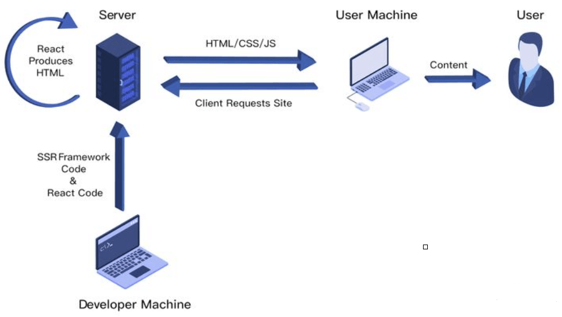

其解决的问题主要有两个：

- SEO，由于搜索引擎爬虫抓取工具可以直接查看完全渲染的页面
- 加速首屏加载，解决首屏白屏问题


## 二、如何做

在`react`中，实现`SSR`主要有两种形式：

- 手动搭建一个 SSR 框架
- 使用成熟的SSR 框架，如 Next.JS


这里主要以手动搭建一个`SSR`框架进行实现

首先通过`express`启动一个`app.js`文件，用于监听3000端口的请求，当请求根目录时，返回`HTML`，如下：

```js
const express = require('express')
const app = express()
app.get('/', (req,res) => res.send(`
<html>
   <head>
       <title>ssr demo</title>
   </head>
   <body>
       Hello world
   </body>
</html>
`))

app.listen(3000, () => console.log('Exampleapp listening on port 3000!'))
```

然后再服务器中编写`react`代码，在`app.js`中进行应引用

```jsx
import React from 'react'

const Home = () =>{

    return <div>home</div>

}

export default Home
```

为了让服务器能够识别`JSX`，这里需要使用`webpakc`对项目进行打包转换，创建一个配置文件`webpack.server.js`并进行相关配置，如下：

```js
const path = require('path')    //node的path模块
const nodeExternals = require('webpack-node-externals')

module.exports = {
    target:'node',
    mode:'development',           //开发模式
    entry:'./app.js',             //入口
    output: {                     //打包出口
        filename:'bundle.js',     //打包后的文件名
        path:path.resolve(__dirname,'build')    //存放到根目录的build文件夹
    },
    externals: [nodeExternals()],  //保持node中require的引用方式
    module: {
        rules: [{                  //打包规则
           test:   /\.js?$/,       //对所有js文件进行打包
           loader:'babel-loader',  //使用babel-loader进行打包
           exclude: /node_modules/,//不打包node_modules中的js文件
           options: {
               presets: ['react','stage-0',['env', { 
                                  //loader时额外的打包规则,对react,JSX，ES6进行转换
                    targets: {
                        browsers: ['last 2versions']   //对主流浏览器最近两个版本进行兼容
                    }
               }]]
           }
       }]
    }
}
```

接着借助`react-dom`提供了服务端渲染的 `renderToString`方法，负责把`React`组件解析成`html`

```js
import express from 'express'
import React from 'react'//引入React以支持JSX的语法
import { renderToString } from 'react-dom/server'//引入renderToString方法
import Home from'./src/containers/Home'

const app= express()
const content = renderToString(<Home/>)
app.get('/',(req,res) => res.send(`
<html>
   <head>
       <title>ssr demo</title>
   </head>
   <body>
        ${content}
   </body>
</html>
`))

app.listen(3001, () => console.log('Exampleapp listening on port 3001!'))
```

上面的过程中，已经能够成功将组件渲染到了页面上

但是像一些事件处理的方法，是无法在服务端完成，因此需要将组件代码在浏览器中再执行一遍，这种服务器端和客户端共用一套代码的方式就称之为**同构**

通俗讲，“同构”就是一套React代码在服务器上运行一遍，到达浏览器又运行一遍：

- 服务端渲染完成页面结构
- 浏览器端渲染完成事件绑定

浏览器实现事件绑定的方式为让浏览器去拉取`JS`文件执行，让`JS`代码来控制，因此需要引入`script`标签

通过`script`标签为页面引入客户端执行的`react`代码，并通过`express`的`static`中间件为`js`文件配置路由，修改如下：

```js
import express from 'express'
import React from 'react'//引入React以支持JSX的语法
import { renderToString } from'react-dom/server'//引入renderToString方法
import Home from './src/containers/Home'
 
const app = express()
app.use(express.static('public'));
//使用express提供的static中间件,中间件会将所有静态文件的路由指向public文件夹
 const content = renderToString(<Home/>)
 
app.get('/',(req,res)=>res.send(`
<html>
   <head>
       <title>ssr demo</title>
   </head>
   <body>
        ${content}
   <script src="/index.js"></script>
   </body>
</html>
`))

 app.listen(3001, () =>console.log('Example app listening on port 3001!'))
```

然后再客户端执行以下`react`代码，新建`webpack.client.js`作为客户端React代码的`webpack`配置文件如下：

```js
const path = require('path')                    //node的path模块

module.exports = {
    mode:'development',                         //开发模式
    entry:'./src/client/index.js',              //入口
    output: {                                   //打包出口
        filename:'index.js',                    //打包后的文件名
        path:path.resolve(__dirname,'public')   //存放到根目录的build文件夹
    },
    module: {
        rules: [{                               //打包规则
           test:   /\.js?$/,                    //对所有js文件进行打包
           loader:'babel-loader',               //使用babel-loader进行打包
           exclude: /node_modules/,             //不打包node_modules中的js文件
           options: {
               presets: ['react','stage-0',['env', {     
                    //loader时额外的打包规则,这里对react,JSX进行转换
                    targets: {
                        browsers: ['last 2versions']   //对主流浏览器最近两个版本进行兼容
                    }
               }]]
           }
       }]
    }
}
```

这种方法就能够简单实现首页的`react`服务端渲染，过程对应如下图：

 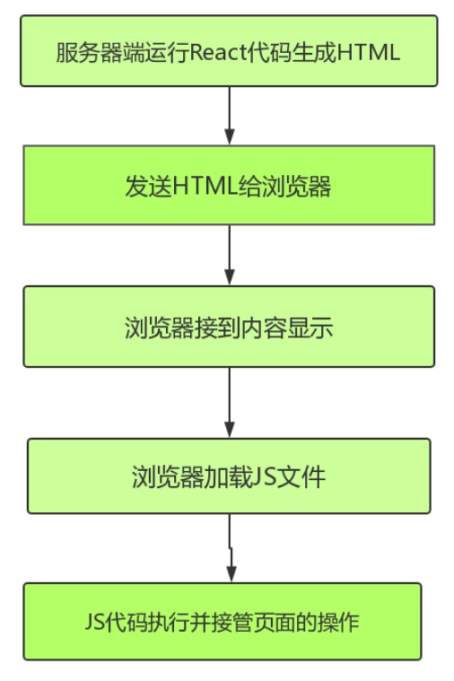

在做完初始渲染的时候，一个应用会存在路由的情况，配置信息如下：

```js
import React from 'react'                   //引入React以支持JSX
import { Route } from 'react-router-dom'    //引入路由
import Home from './containers/Home'        //引入Home组件

export default (
    <div>
        <Route path="/" exact component={Home}></Route>
    </div>
)
```

然后可以通过`index.js`引用路由信息，如下：

```js
import React from 'react'
import ReactDom from 'react-dom'
import { BrowserRouter } from'react-router-dom'
import Router from'../Routers'

const App= () => {
    return (
        <BrowserRouter>
           {Router}
        </BrowserRouter>
    )
}

ReactDom.hydrate(<App/>, document.getElementById('root'))
```

这时候控制台会存在报错信息，原因在于每个`Route`组件外面包裹着一层`div`，但服务端返回的代码中并没有这个`div`

解决方法只需要将路由信息在服务端执行一遍，使用使用`StaticRouter`来替代`BrowserRouter`，通过`context`进行参数传递

```js
import express from 'express'
import React from 'react'//引入React以支持JSX的语法
import { renderToString } from 'react-dom/server'//引入renderToString方法
import { StaticRouter } from 'react-router-dom'
import Router from '../Routers'
 
const app = express()
app.use(express.static('public'));
//使用express提供的static中间件,中间件会将所有静态文件的路由指向public文件夹

app.get('/',(req,res)=>{
    const content  = renderToString((
        //传入当前path
        //context为必填参数,用于服务端渲染参数传递
        <StaticRouter location={req.path} context={{}}>
           {Router}
        </StaticRouter>
    ))
    res.send(`
   <html>
       <head>
           <title>ssr demo</title>
       </head>
       <body>
       <div id="root">${content}</div>
       <script src="/index.js"></script>
       </body>
   </html>
    `)
})


app.listen(3001, () => console.log('Exampleapp listening on port 3001!'))
```

这样也就完成了路由的服务端渲染


## 三、原理

整体`react`服务端渲染原理并不复杂，具体如下：

`node server` 接收客户端请求，得到当前的请求`url` 路径，然后在已有的路由表内查找到对应的组件，拿到需要请求的数据，将数据作为 `props`、`context`或者`store` 形式传入组件

然后基于 `react` 内置的服务端渲染方法 `renderToString()`把组件渲染为 `html`字符串在把最终的 `html `进行输出前需要将数据注入到浏览器端

浏览器开始进行渲染和节点对比，然后执行完成组件内事件绑定和一些交互，浏览器重用了服务端输出的 `html` 节点，整个流程结束


**要点**：
React 服务端渲染（Server-Side Rendering，SSR）是一种在服务器端生成 HTML 内容并将其发送到客户端的技术。这种方式可以提高页面加载速度和 SEO 效果。

下面详细介绍 React 服务端渲染的实现方法和原理。

### 1. **服务端渲染的基本原理**

#### 1.1 原理概述

- **服务器生成 HTML**：在服务器端渲染过程中，服务器会执行 React 组件并生成相应的 HTML 内容。然后将这个 HTML 发送到客户端浏览器。
- **客户端渲染**：浏览器接收到 HTML 后，会解析并渲染页面，同时加载 JavaScript 代码以实现客户端交互。客户端 React 代码会接管服务器渲染的内容，进行后续的渲染和更新。

#### 1.2 优点

- **更快的初次加载**：由于页面在服务器端已经渲染好，用户可以更快地看到页面内容。
- **更好的 SEO**：搜索引擎爬虫可以抓取到完全渲染的 HTML，提高页面的搜索引擎排名。
- **更好的用户体验**：减少了客户端渲染的时间，提高了用户体验。

### 2. **实现 React 服务端渲染**

#### 2.1 基本步骤

1. **设置服务器**：
   - 使用 Node.js 服务器（如 Express）来处理 HTTP 请求并生成服务器渲染的 HTML。

2. **渲染 React 组件**：
   - 使用 `ReactDOMServer` 提供的 `renderToString` 方法将 React 组件渲染成 HTML 字符串。

3. **发送 HTML 到客户端**：
   - 将生成的 HTML 字符串作为响应发送到客户端，客户端接收并展示页面内容。

4. **客户端接管**：
   - 客户端 JavaScript 代码加载后，会接管由服务器渲染的内容，使其变得可交互。

#### 2.2 示例代码

**服务器端代码（Node.js + Express）**：

```javascript
const express = require('express');
const React = require('react');
const ReactDOMServer = require('react-dom/server');
const App = require('./App'); // 你的 React 组件
const fs = require('fs');
const path = require('path');

const app = express();

app.use(express.static(path.resolve(__dirname, 'public')));

app.get('*', (req, res) => {
  const appHtml = ReactDOMServer.renderToString(<App />);

  fs.readFile(path.resolve(__dirname, 'public', 'index.html'), 'utf8', (err, data) => {
    if (err) {
      return res.status(500).send('Some error happened');
    }

    return res.send(
      data.replace('<div id="root"></div>', `<div id="root">${appHtml}</div>`)
    );
  });
});

app.listen(3000, () => {
  console.log('Server is listening on port 3000');
});
```

**客户端代码（React 组件）**：

```javascript
import React from 'react';
import ReactDOM from 'react-dom';
import App from './App'; // 你的 React 组件

ReactDOM.hydrate(<App />, document.getElementById('root'));
```

### 3. **服务端渲染中的数据预取**

#### 3.1 数据预取概述

- **定义**：在服务端渲染过程中，确保组件在渲染之前能够获取所需的数据。数据预取可以在服务端获取数据，然后将其传递给客户端。

#### 3.2 实现数据预取

1. **获取数据**：
   - 在服务端渲染前，调用数据获取函数来获取数据。

2. **传递数据**：
   - 将获取的数据嵌入到 HTML 中，并在客户端使用这些数据进行渲染。

3. **客户端初始化**：
   - 在客户端使用嵌入的数据来初始化组件状态。

**示例代码**：

**服务器端数据预取**：

```javascript
app.get('*', async (req, res) => {
  const data = await fetchData(); // 假设这是一个异步数据获取函数
  const appHtml = ReactDOMServer.renderToString(<App data={data} />);

  fs.readFile(path.resolve(__dirname, 'public', 'index.html'), 'utf8', (err, data) => {
    if (err) {
      return res.status(500).send('Some error happened');
    }

    return res.send(
      data.replace('<div id="root"></div>', `<div id="root" data-initial-data='${JSON.stringify(data)}'>${appHtml}</div>`)
    );
  });
});
```

**客户端数据初始化**：

```javascript
import React from 'react';
import ReactDOM from 'react-dom';
import App from './App';

const initialData = JSON.parse(document.getElementById('root').getAttribute('data-initial-data'));

ReactDOM.hydrate(<App initialData={initialData} />, document.getElementById('root'));
```

### 4. **总结**

- **服务端渲染**：通过在服务器端渲染 React 组件并将 HTML 发送到客户端，提高初次加载速度和 SEO 效果。
- **实现步骤**：设置服务器，渲染组件，发送 HTML，客户端接管。
- **数据预取**：在服务端获取数据并传递给客户端，确保组件在渲染时拥有必要的数据。


---
### 1820. 说说React事件和原生事件的执行顺序

**难度**：★★☆☆☆ | **题型**：QA | **分类**：全部 / React.js

**题目**：


**参考答案**：
我们知道，`React`在内部对事件做了统一的处理，合成事件是一个比较大的概念

### 为什么要有合成事件
1. 在传统的事件里，不同的浏览器需要兼容不同的写法，在合成事件中`React`提供统一的事件对象，抹平了浏览器的兼容性差异
2. `React`通过顶层监听的形式，通过事件委托的方式来统一管理所有的事件，可以在事件上区分事件优先级，优化用户体验

`React`在合成事件上对于`16`版本和`17`版本的合成事件有很大不同，我们也会简单聊聊区别。

### 概念

###### 事件委托

事件委托的意思就是可以通过给父元素绑定事件委托，通过事件对象的`target`属性可以获取到当前触发目标阶段的`dom`元素，来进行统一管理

比如写原生`dom`循环渲染的时候，我们要给每一个子元素都添加`dom`事件，这种情况最简单的方式就是通过事件委托在父元素做一次委托，通过`target`属性判断区分做不同的操作

###### 事件监听

事件监听主要用到了`addEventListener`这个函数，具体怎么用可以[点击](https://developer.mozilla.org/zh-CN/docs/Web/API/EventTarget/addEventListener)进行查看
事件监听和事件绑定的最大区别就是事件监听可以给一个事件监听多个函数操作，而事件绑定只有一次

``` js
// 可以监听多个，不会被覆盖
eventTarget.addEventListener('click', () => {});
eventTarget.addEventListener('click', () => {});

eventTarget.onclick = function () {};
eventTarget.onclick = function () {}; // 第二个会把第一个覆盖
```

###### 事件执行顺序
``` html
<div>
  <span>点我</span>
</div>
```
当我们点击`span`标签的时候会经过这么三个过程，在路径内的元素绑定的事件都会进行触发
> 捕获阶段 => 目标阶段 => 冒泡阶段
> 
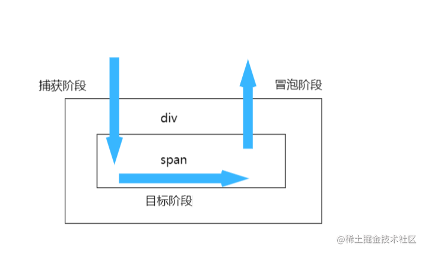

### 合成事件
在看之前先看一下这几个问题
- 原生事件和合成事件的执行顺序是什么？
- 合成事件在什么阶段下会被执行？
- 阻止原生事件的冒泡，会影响到合成事件的执行吗？
- 阻止合成事件的冒泡，会影响到原生事件的执行吗？

下面一个例子说清楚，[点击在线查看编辑](https://codesandbox.io/s/determined-glitter-oxh8kj?file=/src/App.js)

```jsx
import React, { useRef, useEffect } from "react";
import "./styles.css";

const logFunc = (target, isSynthesizer, isCapture = false) => {
    const info = `${isSynthesizer ? "合成" : "原生"}事件，${
        isCapture ? "捕获" : "冒泡"}阶段，${target}元素执行了`;
    
    console.log(info);
};

const batchManageEvent = (targets, funcs, isRemove = false) => {
    targets.forEach((target, targetIndex) => {
        funcs[targetIndex].forEach((func, funcIndex) => {
            target[isRemove ? "removeEventListener" : "addEventListener"](
                "click",
                func,
                !funcIndex
            );
        });
    });
};

export default function App() {
    const divDom = useRef();
    const h1Dom = useRef();
    useEffect(() => {
    
        const docClickCapFunc = () => logFunc("document", false, true);
        const divClickCapFunc = () => logFunc("div", false, true);
        const h1ClickCapFunc = () => logFunc("h1", false, true);
        const docClickFunc = () => logFunc("document", false);
        const divClickFunc = () => logFunc("div", false);
        const h1ClickFunc = () => logFunc("h1", false);

        batchManageEvent(
            [document, divDom.current, h1Dom.current],
            [
                [docClickCapFunc, docClickFunc],
                [divClickCapFunc, divClickFunc],
                [h1ClickCapFunc, h1ClickFunc]
            ]
        );

        return () => {
            batchManageEvent(
                   [document, divDom.current, h1Dom.current],
                [
                    [docClickCapFunc, docClickFunc],
                    [divClickCapFunc, divClickFunc],
                    [h1ClickCapFunc, h1ClickFunc]
                ],
                true
            );
        };
    }, []);

    return (
        <div
          ref={divDom}
          className="App1"
          onClickCapture={() => logFunc("div", true, true)}
          onClick={() => logFunc("div", true)}
        >
          <h1
            ref={h1Dom}
            onClickCapture={() => logFunc("h1", true, true)}
            onClick={() => logFunc("h1", true)}
          >
            Hello CodeSandbox
          </h1>
        </div>
    );
}

```
看这个例子，当我们点击`h1`的时候

会先执行原生事件事件流，当执行到`document`的冒泡阶段的时候做了个拦截，在这个阶段开始执行合成事件

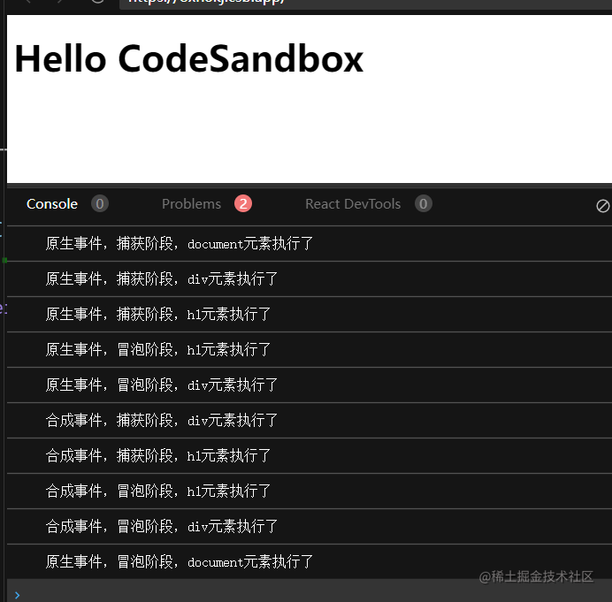

我们用一个图简单描述一下

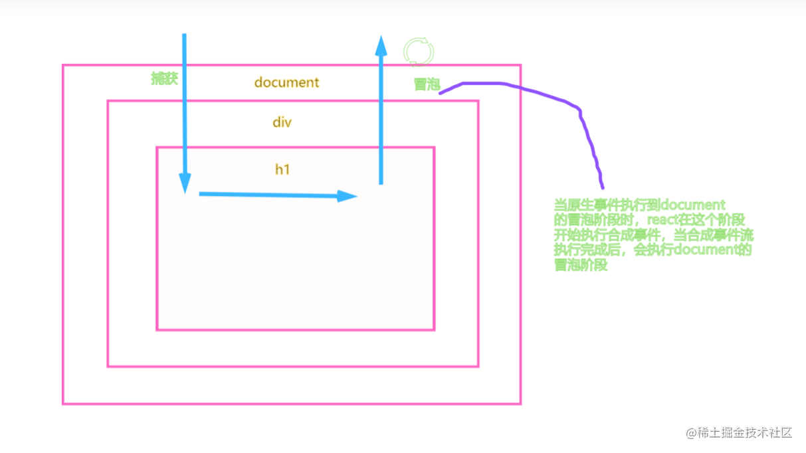

知道上面的概念，那我们回答开始阶段的后面两个问题

当我们把上面的`demo`的原生`div`的`stopPropagation()`  方法调用阻止捕获和冒泡阶段中当前事件的进一步传播，会阻止后续的所有事件执行


``` jsx
// ...
const divClickCapFunc = (e) => {
    e.stopPropagation(); // 增加原生捕获阶段的阻止事件
    logFunc("div", false, true);
};
// ...
```

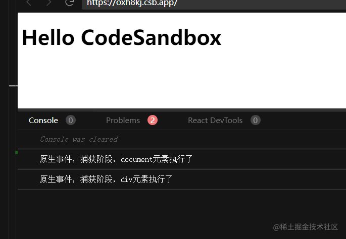

我们可以看到，当阻止之后，我们点击`h1`，事件流运行到`div`的捕获阶段就不触发了，后续的所有的包括合成事件也都不会触发

那当我们给合成事件的事件流中断了会发生什么呢？

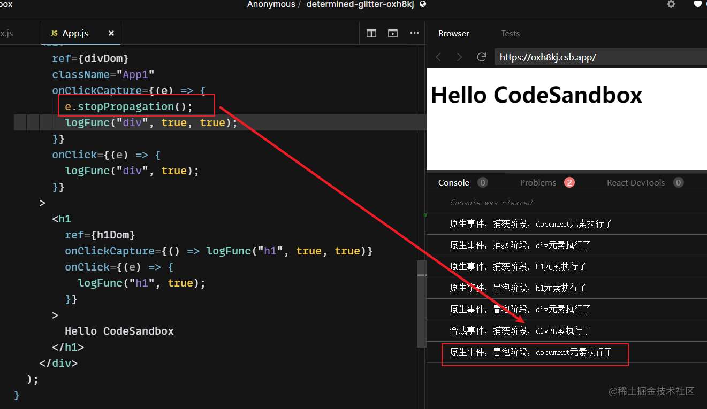

可以看到运行到捕获阶段的`div`之后被阻止传播了，后续的所有合成事件都不会执行了，但是原生的`document`冒泡还是会执行完。

### 模拟阶段
``` html
<!DOCTYPE html>
<html lang="en">
  <head>
    <meta charset="utf-8" />
    <meta name="viewport" content="width=device-width, initial-scale=1.0, maximum-scale=1.0, maximum-scale=1, user-scalable=no" />
    <meta name="theme-color" content="#000000" />
    <meta name="description" content="Web site created using create-react-app" />
    <link href="favicon.ico" type="image/x-icon" rel="icon" />
    <title>浅谈React合成事件</title>
  </head>
  <body>
    <div id="wrapper">
      <h1 id="content">hello</h1>
    </div>
  </body>
  <script>
    const logFunc = (target, isSynthesizer, isCapture = false) => {
      const info = `${isSynthesizer ? '合成' : '原生'}事件，${isCapture ? '捕获' : '冒泡'}阶段，${target}元素执行了`;
      console.log(info);
    };
    // document的派发事件函数
    const dispatchEvent = currentDom => {
      let current = currentDom;
      let eventCallbacks = []; // 存储冒泡事件回调函数
      let eventCaptureCallbacks = []; // 存储冒泡事件回调函数
      // 收集事件流一路上的所有回调函数
      while (current) {
        if (current.onClick) {
          eventCallbacks.push(current.onClick);
        }
        if (current.onClickCapture) {
          // 捕获阶段由外到内，所以需要把回调函数放到数组的最前面
          eventCaptureCallbacks.unshift(current.onClickCapture);
        }
        current = current.parentNode;
      }
      // 执行调用
      eventCaptureCallbacks.forEach(callback => callback());
      eventCallbacks.forEach(callback => callback());
    };
    const wrapperDom = document.getElementById('wrapper');
    const contentDom = document.getElementById('content');

    // 一路上注册原生事件
    document.addEventListener('click', () => logFunc('document', false, true), true);
    wrapperDom.addEventListener('click', () => logFunc('div', false, true), true);
    contentDom.addEventListener('click', () => logFunc('h1', false, true), true);
    contentDom.addEventListener('click', () => logFunc('h1', false));
    wrapperDom.addEventListener('click', () => logFunc('div', false));
    document.addEventListener('click', e => {
      dispatchEvent(e.target); // 这里收集一路上的事件进行派发
      logFunc('document', false);
    });

    // 模拟合成事件
    wrapperDom.onClick = () => logFunc('div', true);
    wrapperDom.onClickCapture = () => logFunc('div', true, true);
    contentDom.onClick = () => logFunc('h1', true);
    contentDom.onClickCapture = () => logFunc('h1', true, true);
  </script>
</html>

```
点击`h1`可以看到一路上的注册的所有事件已经执行了

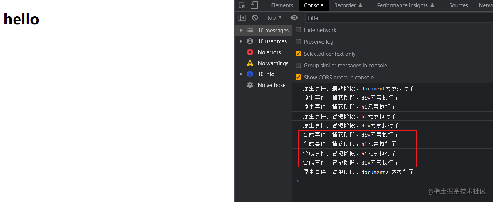

`React16`给`document`上加的统一的拦截判发事件会在一定情况下出问题，下面举个例子简单说明一下

### 16案例

[点我](https://codesandbox.io/s/practical-lichterman-1lhvb1?file=/src/App.js:0-924)查看在线案例

``` jsx
import React, { useEffect, useState } from 'react';
import './styles.css';

const Modal = ({ onClose }) => {
  useEffect(() => {
    document.addEventListener('click', onClose);
    return () => {
      document.removeEventListener('click', onClose);
    };
  }, [onClose]);
  return (
    <div
      style={{ width: 300, height: 300, backgroundColor: 'red' }}
      onClick={e => {
        e.stopPropagation();
        // e.nativeEvent.stopImmediatePropagation();
      }}
    >
      Modal
    </div>
  );
};

function App() {
  const [visible, setVisible] = useState(false);
  return (
    <div className="App">
      <button
        onClick={() => {
          setVisible(true);
        }}
      >
        点我弹出modal
      </button>
      {visible && <Modal onClose={() => setVisible(false)} />}
    </div>
  );
}
export default App;
```

写完之后点击按钮`Modal`被弹出来, 但是点击`modal`里面的内容`modal`就隐藏了，添加阻止事件流函数还是不行


原因就是点击之后，事件冒泡到`document`上，同时也执行了他身上挂载的方法，解决办法就是给点击事件添加
`e.nativeEvent.stopImmediatePropagation();`

**注意**，这里有读者反馈，使用  `e.nativeEvent.stopPropagation()` 也能解决点击Modal内部导致被关闭的问题，实际上是不行的，因为这时候 `e.nativeEvent.currentTarget` 已经是 `document`了，必须调用 `stopImmediatePropagation` 才能阻止在当前节点上的冒泡！可以参考 [这个demo](https://codesandbox.io/p/sandbox/condescending-rain-2kyjwf)：

`stopImmediatePropagation`和`stopPropagation`的区别就是，前者会阻止当前节点下所有的事件监听的函数，后者不会

那`react17`及之后做了什么改变呢

### 16和17的区别

在`17`版本中，`React`把事件节点绑定函数绑定在了`render`的根节点上，避免了上述的问题,

用上面的`demo`的在线案例把版本改成17之后，可以发现事件的执行顺序变了

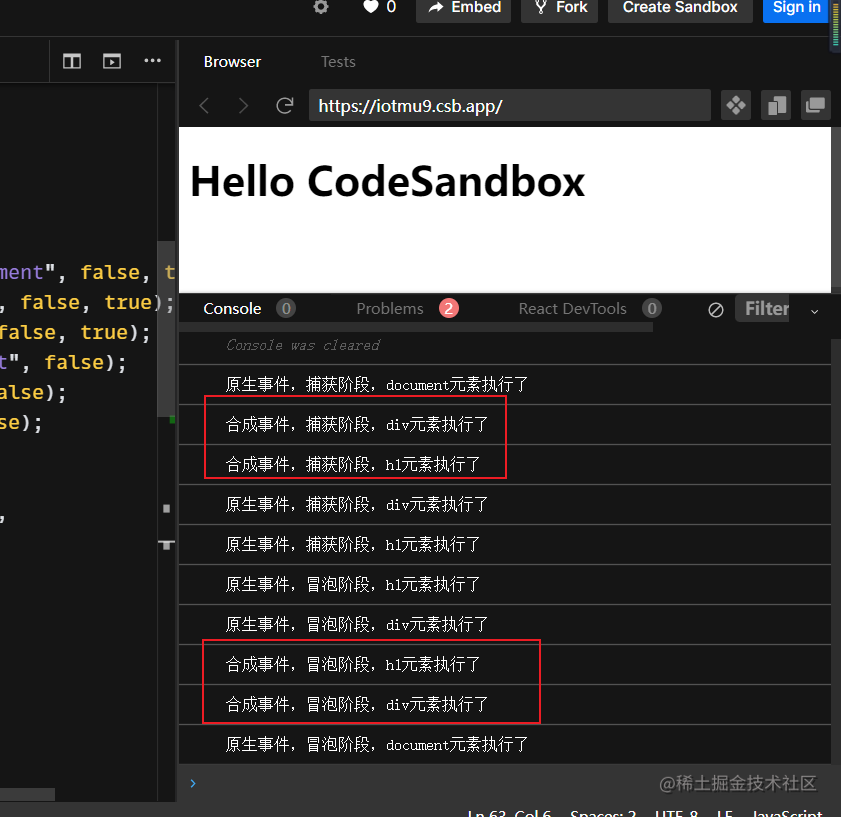

### 模拟17版本
``` html
<!DOCTYPE html>
<html lang="en">
  <head>
    <meta charset="utf-8" />
    <meta name="viewport" content="width=device-width, initial-scale=1.0, maximum-scale=1.0, maximum-scale=1, user-scalable=no" />
    <meta name="theme-color" content="#000000" />
    <meta name="description" content="Web site created using create-react-app" />
    <link href="favicon.ico" type="image/x-icon" rel="icon" />
    <title>浅谈React合成事件</title>
  </head>
  <body>
    <div id="root">
      <div id="wrapper">
        <h1 id="content">hello</h1>
      </div>
    </div>
  </body>
  <script>
    const logFunc = (target, isSynthesizer, isCapture = false) => {
      const info = `${isSynthesizer ? '合成' : '原生'}事件，${isCapture ? '捕获' : '冒泡'}阶段，${target}元素执行了`;
      console.log(info);
    };
    // document的派发事件函数
    const dispatchEvent = (currentDom, useCapture = false) => {
      let current = currentDom;
      let eventCallbacks = []; // 存储冒泡事件回调函数
      const eventTypeName = useCapture ? 'onClickCapture' : 'onClick'; // 冒泡事件或者捕获事件的名称
      const actionName = useCapture ? 'unshift' : 'push';
      while (current) {
        if (current[eventTypeName]) {
          eventCallbacks[actionName](current[eventTypeName]);
        }
        current = current.parentNode;
      }
      eventCallbacks.forEach(callback => callback());
    };
    const wrapperDom = document.getElementById('wrapper');
    const contentDom = document.getElementById('content');
    const root = document.getElementById('root');

    // 一路上注册原生事件
    document.addEventListener('click', () => logFunc('document', false, true), true);
    root.addEventListener(
      'click',
      e => {
        dispatchEvent(e.target, true);
        logFunc('root', false, true);
      },
      true
    );
    wrapperDom.addEventListener('click', () => logFunc('div', false, true), true);
    contentDom.addEventListener('click', () => logFunc('h1', false, true), true);
    contentDom.addEventListener('click', () => logFunc('h1', false));
    wrapperDom.addEventListener('click', () => logFunc('div', false));
    root.addEventListener('click', e => {
      dispatchEvent(e.target); // 这里收集一路上的事件进行派发
      logFunc('root', false);
    });
    document.addEventListener('click', () => logFunc('document', false));
    // 模拟合成事件
    wrapperDom.onClick = () => logFunc('div', true);
    wrapperDom.onClickCapture = () => logFunc('div', true, true);
    contentDom.onClick = () => logFunc('h1', true);
    contentDom.onClickCapture = () => logFunc('h1', true, true);
  </script>
</html>

```

区别就是在外层增加了一个`root`模拟根节点，修改了`dispatchEvent`的逻辑

可以看到，效果已经和`17`版本的一样了

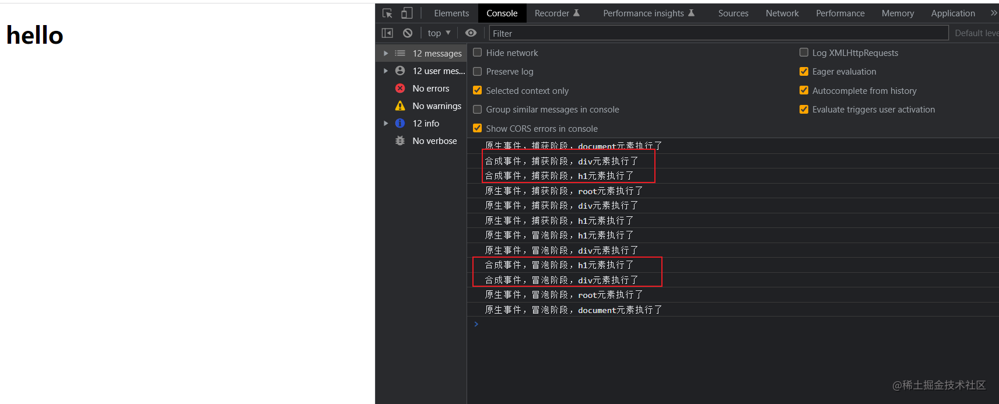

回看`16demo`，切换版本到`17`，当我们切换到`17`的时候，用`stopPropagation`就可以解决问题了,
原因就是他在`root`节点上绑定的事件冒泡函数，`stopPropagation`切断了事件流，不会流向到`document`身上了

### 总结
* `16`版本先执行原生事件，当冒泡到`document`时，统一执行合成事件，
* `17`版本在原生事件执行前先执行合成事件捕获阶段，原生事件执行完毕执行冒泡阶段的合成事件,通过根节点来管理所有的事件
 
原生的阻止事件流会阻断合成事件的执行，合成事件阻止后也会影响到后续的原生执行

**要点**：
1. **事件传播阶段**
   - 当一个事件发生时,事件会首先在 DOM 树的根节点开始捕获,然后一路向下传播到目标元素(事件源)。这个过程称为"捕获阶段"。
   - 到达目标元素后,事件会开始在 DOM 树向上冒泡,这个过程称为"冒泡阶段"。

2. **React 事件系统**
   - React 事件系统完全模拟了 DOM 事件的传播机制,包括捕获阶段和冒泡阶段。
   - 当一个 React 事件被触发时,它会先在 React 合成事件系统中进行捕获和冒泡,然后再传播到原生 DOM 事件。

3. **事件执行顺序**
   - 当一个 React 事件被触发时,它的执行顺序如下:
     1. React 事件捕获阶段
     2. 原生 DOM 事件捕获阶段
     3. 原生 DOM 事件处理程序
     4. React 事件冒泡阶段
   - 也就是说,React 事件会先于原生 DOM 事件执行。

4. **阻止事件传播**
   - 在 React 事件处理程序中,可以使用 `event.stopPropagation()` 来阻止事件继续向上冒泡。
   - 在原生 DOM 事件处理程序中,可以使用 `event.stopPropagation()` 来阻止事件继续传播。

---
### 1830. 说说你对Redux的理解？其工作原理？

**难度**：★★☆☆☆ | **题型**：QA | **分类**：全部 / React.js

**题目**：


**参考答案**：
## 一、是什么

`React`是用于构建用户界面的，帮助我们解决渲染`DOM`的过程

而在整个应用中会存在很多个组件，每个组件的`state`是由自身进行管理，包括组件定义自身的`state`、组件之间的通信通过`props`传递、使用`Context`实现数据共享

如果让每个组件都存储自身相关的状态，理论上来讲不会影响应用的运行，但在开发及后续维护阶段，我们将花费大量精力去查询状态的变化过程

这种情况下，如果将所有的状态进行集中管理，当需要更新状态的时候，仅需要对这个管理集中处理，而不用去关心状态是如何分发到每一个组件内部的

`redux`就是一个实现上述集中管理的容器，遵循三大基本原则：

- 单一数据源
- state 是只读的
- 使用纯函数来执行修改

注意的是，`redux`并不是只应用在`react`中，还与其他界面库一起使用，如`Vue`


## 二、工作原理

`redux `要求我们把数据都放在 `store `公共存储空间

一个组件改变了 `store` 里的数据内容，其他组件就能感知到 `store `的变化，再来取数据，从而间接的实现了这些数据传递的功能

工作流程图如下所示：

 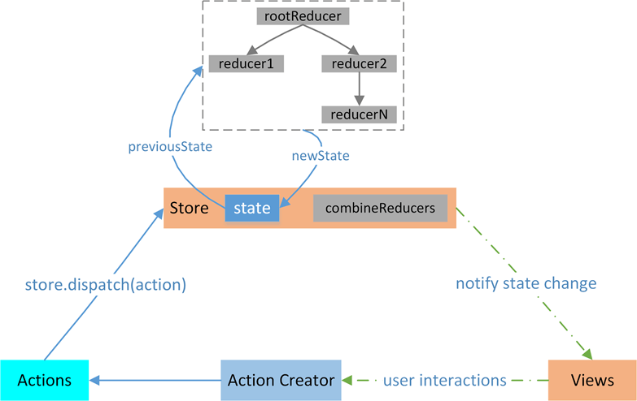

根据流程图，可以想象，`React Components` 是借书的用户， `Action Creactor` 是借书时说的话(借什么书)， `Store` 是图书馆管理员，`Reducer` 是记录本(借什么书，还什么书，在哪儿，需要查一下)， `state` 是书籍信息

整个流程就是借书的用户需要先存在，然后需要借书，需要一句话来描述借什么书，图书馆管理员听到后需要查一下记录本，了解图书的位置，最后图书馆管理员会把这本书给到这个借书人

转换为代码是，`React Components` 需要获取一些数据, 然后它就告知 `Store` 需要获取数据，这就是就是 `Action Creactor` , `Store` 接收到之后去 `Reducer` 查一下， `Reducer` 会告诉 `Store` 应该给这个组件什么数据


## 三、如何使用

创建一个`store`的公共数据区域

```js
import { createStore } from 'redux' // 引入一个第三方的方法
const store = createStore() // 创建数据的公共存储区域（管理员）
```

还需要创建一个记录本去辅助管理数据，也就是`reduecer`，本质就是一个函数，接收两个参数`state`，`action`，返回`state`

```js
// 设置默认值
const initialState = {
  counter: 0
}

const reducer = (state = initialState, action) => {
}
```

然后就可以将记录本传递给`store`，两者建立连接。如下：

```js
const store = createStore(reducer)
```

如果想要获取`store`里面的数据，则通过`store.getState()`来获取当前`state`

```js
console.log(store.getState());
```

下面再看看如何更改`store`里面数据，是通过`dispatch`来派发`action`，通常`action`中都会有`type`属性，也可以携带其他的数据

```js
store.dispatch({
  type: "INCREMENT"
})

store.dispath({
  type: "DECREMENT"
})

store.dispatch({
  type: "ADD_NUMBER",
  number: 5
})
```

下面再来看看修改`reducer`中的处理逻辑：

```js
const reducer = (state = initialState, action) => {
  switch (action.type) {
    case "INCREMENT":
      return {...state, counter: state.counter + 1};
    case "DECREMENT":
      return {...state, counter: state.counter - 1};
    case "ADD_NUMBER":
      return {...state, counter: state.counter + action.number}
    default: 
      return state;
  }
}
```

注意，`reducer`是一个纯函数，不需要直接修改`state`

这样派发`action`之后，既可以通过`store.subscribe`监听`store`的变化，如下：

```js
store.subscribe(() => {
  console.log(store.getState());
})
```

在`React`项目中，会搭配`react-redux`进行使用

完整代码如下：

```js
const redux = require('redux');

const initialState = {
  counter: 0
}

// 创建reducer
const reducer = (state = initialState, action) => {
  switch (action.type) {
    case "INCREMENT":
      return {...state, counter: state.counter + 1};
    case "DECREMENT":
      return {...state, counter: state.counter - 1};
    case "ADD_NUMBER":
      return {...state, counter: state.counter + action.number}
    default: 
      return state;
  }
}

// 根据reducer创建store
const store = redux.createStore(reducer);

store.subscribe(() => {
  console.log(store.getState());
})

// 修改store中的state
store.dispatch({
  type: "INCREMENT"
})
// console.log(store.getState());

store.dispatch({
  type: "DECREMENT"
})
// console.log(store.getState());

store.dispatch({
  type: "ADD_NUMBER",
  number: 5
})
// console.log(store.getState());
```


### 小结

- createStore可以帮助创建 store
- store.dispatch 帮助派发 action , action 会传递给 store
- store.getState 这个方法可以帮助获取 store 里边所有的数据内容
- store.subscrible 方法订阅 store 的改变，只要 store 发生改变， store.subscrible 这个函数接收的这个回调函数就会被执行


**要点**：
### 1. **对 Redux 的理解**

#### 1.1 Redux 的定义

- **定义**：Redux 是一个用于 JavaScript 应用的状态管理库，最常用于 React 应用。它通过一个全局的状态树（state tree）来管理应用的状态，使得状态的管理更加可预测和可控。
- **设计思想**：Redux 的设计基于 Flux 架构模式，其核心思想是单向数据流，通过集中式的状态管理，使应用状态变化更容易追踪和调试。

#### 1.2 Redux 的核心概念

- **Store**：Redux 应用的唯一数据源，存储全局的状态。它通过 `createStore` 方法创建，并通过 `getState` 方法获取当前状态。
- **Action**：描述应用中发生的事件或操作的普通 JavaScript 对象，通常包含一个 `type` 属性和一些可选的 `payload` 数据。Action 是状态改变的唯一途径。
- **Reducer**：是一个纯函数，接收当前的 `state` 和 `action`，根据 `action` 的类型返回新的状态。Reducer 不能修改传入的 `state`，而是返回一个新的 `state` 对象。
- **Dispatch**：用于发送 `action` 给 Redux store，以触发状态的变化。通过调用 `store.dispatch(action)` 来进行状态更新。
- **Middleware**：在 `dispatch` 和 `reducer` 之间的可选扩展，用于处理异步操作、日志记录、错误处理等。

#### 1.3 Redux 的优点

- **可预测性**：通过严格规定状态如何变化，使得状态变化更加可预测和可追踪。
- **调试工具**：Redux 的时间旅行调试工具（Redux DevTools）使得开发者可以轻松地查看状态的演变过程。
- **可扩展性**：Redux 通过中间件扩展功能，适用于各种复杂场景，如异步操作和日志管理。

### 2. **Redux 的工作原理**

#### 2.1 单一数据源

- **核心理念**：Redux 通过一个唯一的全局 `store` 来存储应用的状态，这个 `store` 是整个应用的唯一数据源。应用中的所有组件都依赖于这个 `store` 来获取和更新状态。

#### 2.2 Action 发起与 Dispatch

- **Action 的作用**：用户在应用中触发某个操作时，会产生一个 `action`，它是一个描述状态变化的普通对象。
- **Dispatch 的作用**：`dispatch` 方法将 `action` 发送给 Redux store，告诉 store 状态即将发生变化。

#### 2.3 Reducer 处理 Action

- **Reducer 的作用**：`store` 收到 `action` 后，会调用对应的 `reducer`。`reducer` 是一个纯函数，它根据当前的 `state` 和 `action` 返回一个新的 `state` 对象。
- **状态不可变性**：Reducer 不能直接修改当前状态，而是返回一个全新的状态对象，从而保证状态的不可变性和数据流的纯净性。

#### 2.4 Store 更新与订阅

- **状态更新**：Reducer 返回的新状态会替换 store 中的当前状态。然后 Redux 会通知所有订阅了 store 的视图层（如 React 组件）进行重新渲染。
- **视图层的订阅**：视图层通过订阅 store 来监听状态变化，当状态发生变化时，视图会根据新的状态进行更新。

### 3. **Redux 的数据流**

Redux 的数据流是单向的，遵循以下过程：

1. **组件发起 action**：用户在界面上的操作（如点击按钮）会触发一个 action。
2. **dispatch action**：这个 action 会通过 `dispatch` 方法发送给 store。
3. **reducer 处理 action**：store 调用 reducer，传入当前的 state 和 action，reducer 根据 action 的类型返回新的 state。
4. **store 更新 state**：store 接收新的 state 并存储。
5. **订阅者更新视图**：订阅了 store 的组件会接收到新的 state，并重新渲染界面。

### 4. **Redux 的典型代码示例**

```javascript
// actions.js
export const increment = () => ({
  type: 'INCREMENT',
});

export const decrement = () => ({
  type: 'DECREMENT',
});

// reducer.js
const initialState = { count: 0 };

function counterReducer(state = initialState, action) {
  switch (action.type) {
    case 'INCREMENT':
      return { ...state, count: state.count + 1 };
    case 'DECREMENT':
      return { ...state, count: state.count - 1 };
    default:
      return state;
  }
}

export default counterReducer;

// store.js
import { createStore } from 'redux';
import counterReducer from './reducer';

const store = createStore(counterReducer);

export default store;
```


---
### 1838. React Fiber 是如何实现更新过程可控？

**难度**：★★★★☆ | **题型**：QA | **分类**：全部 / React.js

**题目**：


**参考答案**：
更新过程的可控主要体现在下面几个方面：

* 任务拆分
* 任务挂起、恢复、终止
* 任务具备优先级

## 任务拆分

在 React Fiber 机制中，它采用"化整为零"的思想，将调和阶段（Reconciler）递归遍历 VDOM 这个大任务分成若干小任务，每个任务只负责一个节点的处理。

## 任务挂起、恢复、终止

* workInProgress tree

workInProgress 代表当前正在执行更新的 Fiber 树。在 render 或者 setState 后，会构建一颗 Fiber 树，也就是 workInProgress tree，这棵树在构建每一个节点的时候会收集当前节点的副作用，整棵树构建完成后，会形成一条完整的副作用链。

* currentFiber tree

currentFiber 表示上次渲染构建的 Filber 树。在每一次更新完成后 workInProgress 会赋值给 currentFiber。在新一轮更新时 workInProgress tree 再重新构建，新 workInProgress 的节点通过 alternate 属性和 currentFiber 的节点建立联系。

在新 workInProgress tree 的创建过程中，会同 currentFiber 的对应节点进行 Diff 比较，收集副作用。同时也会复用和 currentFiber 对应的节点对象，减少新创建对象带来的开销。也就是说无论是创建还是更新、挂起、恢复以及终止操作都是发生在 workInProgress tree 创建过程中的。workInProgress tree 构建过程其实就是循环的执行任务和创建下一个任务。

### 挂起

当第一个小任务完成后，先判断这一帧是否还有空闲时间，没有就挂起下一个任务的执行，记住当前挂起的节点，让出控制权给浏览器执行更高优先级的任务。

### 恢复

在浏览器渲染完一帧后，判断当前帧是否有剩余时间，如果有就恢复执行之前挂起的任务。如果没有任务需要处理，代表调和阶段完成，可以开始进入渲染阶段。

* 如何判断一帧是否有空闲时间的呢？

使用前面提到的 RIC (RequestIdleCallback) 浏览器原生 API，React 源码中为了兼容低版本的浏览器，对该方法进行了 Polyfill。

* 恢复执行的时候又是如何知道下一个任务是什么呢？

答案是在前面提到的链表。在 React Fiber 中每个任务其实就是在处理一个 FiberNode 对象，然后又生成下一个任务需要处理的 FiberNode。

### 终止

其实并不是每次更新都会走到提交阶段。当在调和过程中触发了新的更新，在执行下一个任务的时候，判断是否有优先级更高的执行任务，如果有就终止原来将要执行的任务，开始新的 workInProgressFiber 树构建过程，开始新的更新流程。这样可以避免重复更新操作。这也是在 React 16 以后生命周期函数 componentWillMount 有可能会执行多次的原因。

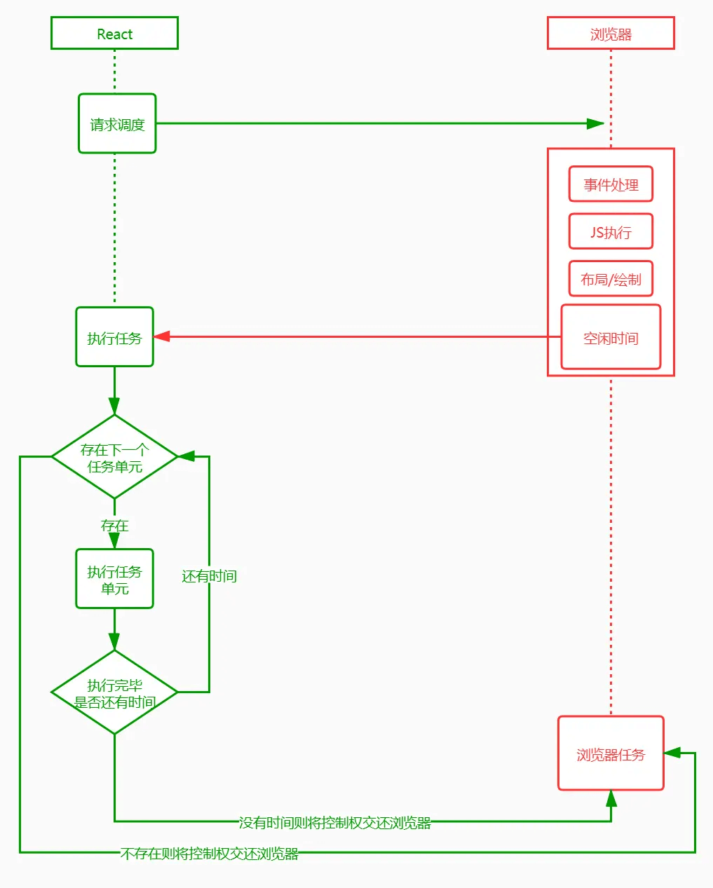

## 任务具备优先级

React Fiber 除了通过挂起，恢复和终止来控制更新外，还给每个任务分配了优先级。具体点就是在创建或者更新 FiberNode 的时候，通过算法给每个任务分配一个到期时间（expirationTime）。在每个任务执行的时候除了判断剩余时间，如果当前处理节点已经过期，那么无论现在是否有空闲时间都必须执行该任务。过期时间的大小还代表着任务的优先级。

任务在执行过程中顺便收集了每个 FiberNode 的副作用，将有副作用的节点通过 firstEffect、lastEffect、nextEffect 形成一条副作用单链表 A1(TEXT)-B1(TEXT)-C1(TEXT)-C1-C2(TEXT)-C2-B1-B2(TEXT)-B2-A。

其实最终都是为了收集到这条副作用链表，有了它，在接下来的渲染阶段就通过遍历副作用链完成 DOM 更新。这里需要注意，更新真实 DOM 的这个动作是一气呵成的，不能中断，不然会造成视觉上的不连贯（commit）。


**要点**：
React Fiber 是 React 的一个核心更新算法，旨在提高更新过程的灵活性和性能。

### 1. **引入 Fiber 架构**

- **什么是 Fiber？**
  - Fiber 是 React 的一种新的协调算法，用于管理和调度更新。它允许 React 在多个帧中分片地完成任务，使更新过程更具响应性和可控性。

### 2. **优先级调度**

- **任务优先级**：
  - Fiber 架构引入了优先级调度机制，将更新任务分为不同的优先级。例如，用户交互事件（如点击）通常具有更高的优先级，而数据获取等低优先级任务则可能被推迟处理。
  - **实现方式**：使用优先级队列，确保高优先级的任务可以在较低优先级的任务之前完成。

### 3. **分片更新**

- **更新分片**：
  - Fiber 允许将更新任务分片成较小的单元（Fiber 节点），使得每次更新只处理一个 Fiber 节点的更新，从而避免长时间阻塞主线程。
  - **实现方式**：在每一帧中，React 处理一个小的 Fiber 节点，允许 UI 在每帧之间保持响应。

### 4. **可中断的任务**

- **任务可中断性**：
  - Fiber 使得任务在执行过程中可以被中断和恢复。长时间运行的任务可以被分割成较小的部分，React 可以在空闲时间恢复任务，确保页面保持响应。
  - **实现方式**：通过 Fiber 的调度器，任务在需要时可以被挂起，并在之后的空闲时间继续执行。

### 5. **增量渲染**

- **增量渲染**：
  - Fiber 支持增量渲染，即在一次更新中只渲染部分组件。这样可以减少每次渲染的工作量，并提升性能。
  - **实现方式**：通过 Fiber 节点的链表结构，逐步应用更新，避免全量渲染。

### 6. **恢复和回溯**

- **恢复和回溯**：
  - Fiber 支持恢复和回溯机制。在更新过程中，如果发现错误或需要中断，Fiber 可以回退到安全的状态，保证应用的一致性和稳定性。
  - **实现方式**：使用 Fiber 树的结构来保存中间状态和更新历史，必要时可以回到之前的状态。

### 总结

- **优先级调度**：引入优先级机制，确保高优先级任务优先处理。
- **分片更新**：将更新分片为较小单元，减少长时间阻塞。
- **可中断的任务**：支持任务的中断和恢复，提升响应性。
- **增量渲染**：支持逐步渲染，减少每次渲染的工作量。
- **恢复和回溯**：支持回退机制，保证应用一致性。

React Fiber 的这些特性使得 React 的更新过程更加灵活、可控，提升了应用的性能和用户体验。


---
### 1852. 说说React Router有几种模式，以及实现原理？

**难度**：★★☆☆☆ | **题型**：QA | **分类**：全部 / React.js

**题目**：


**参考答案**：
## 一、是什么

在单页应用中，一个`web`项目只有一个`html`页面，一旦页面加载完成之后，就不用因为用户的操作而进行页面的重新加载或者跳转，其特性如下：

- 改变 url 且不让浏览器向服务器发送请求

- 在不刷新页面的前提下动态改变浏览器地址栏中的URL地址

其中主要分成了两种模式：

- hash 模式：在url后面加上#，如http://127.0.0.1:5500/home/#/page1
- history 模式：允许操作浏览器的曾经在标签页或者框架里访问的会话历史记录


## 二、使用

`React Router`对应的`hash`模式和`history`模式对应的组件为：

- HashRouter
- BrowserRouter


这两个组件的使用都十分的简单，作为最顶层组件包裹其他组件，如下所示

```jsx
// 1.import { BrowserRouter as Router } from "react-router-dom";
// 2.import { HashRouter as Router } from "react-router-dom";

import React from 'react';
import {
  BrowserRouter as Router,
  // HashRouter as Router  
  Switch,
  Route,
} from "react-router-dom";
import Home from './pages/Home';
import Login from './pages/Login';
import Backend from './pages/Backend';
import Admin from './pages/Admin';


function App() {
  return (
    <Router>
        <Route path="/login" component={Login}/>
        <Route path="/backend" component={Backend}/>
        <Route path="/admin" component={Admin}/>
        <Route path="/" component={Home}/>
    </Router>
  );
}

export default App;
```


## 三、实现原理

路由描述了 `URL` 与 `UI `之间的映射关系，这种映射是单向的，即 URL 变化引起 UI 更新（无需刷新页面）

下面以`hash`模式为例子，改变`hash`值并不会导致浏览器向服务器发送请求，浏览器不发出请求，也就不会刷新页面

`hash` 值改变，触发全局 `window` 对象上的 `hashchange` 事件。所以 `hash` 模式路由就是利用 `hashchange` 事件监听 `URL` 的变化，从而进行 `DOM` 操作来模拟页面跳转

`react-router`也是基于这个特性实现路由的跳转

下面以`HashRouter`组件分析进行展开：


## HashRouter

`HashRouter`包裹了整应用，

通过`window.addEventListener('hashChange',callback)`监听`hash`值的变化，并传递给其嵌套的组件

然后通过`context`将`location`数据往后代组件传递，如下：

```jsx
import React, { Component } from 'react';
import { Provider } from './context'
// 该组件下Api提供给子组件使用
class HashRouter extends Component {
  constructor() {
    super()
    this.state = {
      location: {
        pathname: window.location.hash.slice(1) || '/'
      }
    }
  }
  // url路径变化 改变location
  componentDidMount() {
    window.location.hash = window.location.hash || '/'
    window.addEventListener('hashchange', () => {
      this.setState({
        location: {
          ...this.state.location,
          pathname: window.location.hash.slice(1) || '/'
        }
      }, () => console.log(this.state.location))
    })
  }
  render() {
    let value = {
      location: this.state.location
    }
    return (
      <Provider value={value}>
        {
          this.props.children
        }
      </Provider>
    );
  }
}

export default HashRouter;

```


### Router

`Router`组件主要做的是通过`BrowserRouter`传过来的当前值，通过`props`传进来的`path`与`context`传进来的`pathname`进行匹配，然后决定是否执行渲染组件

```js
import React, { Component } from 'react';
import { Consumer } from './context'
const { pathToRegexp } = require("path-to-regexp");
class Route extends Component {
  render() {
    return (
      <Consumer>
        {
          state => {
            console.log(state)
            let {path, component: Component} = this.props
            let pathname = state.location.pathname
            let reg = pathToRegexp(path, [], {end: false})
            // 判断当前path是否包含pathname
            if(pathname.match(reg)) {
              return <Component></Component>
            }
            return null
          }
        }
      </Consumer>
    );
  }
}
export default Route;

```


**要点**：
可以从以下几个方面展开：

### 1. **React Router 的几种模式**

#### 1.1 BrowserRouter 模式

- **定义**：基于 HTML5 的 `history` API（包括 `pushState`、`replaceState` 和 `popstate` 事件）。
- **特点**：URL 干净（没有 `#` 符号），适合现代 Web 应用，支持浏览器的前进和后退功能。
- **实现原理**：通过 `history` API 操作浏览器的历史记录栈，在用户导航时，改变浏览器的 URL，但不会触发页面刷新；组件会监听 `popstate` 事件，根据当前的 URL 渲染相应的组件。

#### 1.2 HashRouter 模式

- **定义**：基于 URL 的 `hash` 部分（`#` 后面的部分），不依赖服务器的配置。
- **特点**：URL 带有 `#` 符号，不会导致浏览器向服务器发送请求，适用于不希望配置服务器的单页应用。
- **实现原理**：利用 `window.location.hash` 和 `hashchange` 事件，监听 URL 的 `hash` 变化，根据不同的 `hash` 渲染对应的组件，`hash` 部分的改变不会触发页面的刷新。

#### 1.3 MemoryRouter 模式

- **定义**：不与浏览器 URL 同步，所有的路由状态都保存在内存中。
- **特点**：不操作 URL，适用于需要自定义路由行为的场景，比如测试环境或 React Native 应用。
- **实现原理**：使用内部的 `history` 对象管理路由状态，并通过状态变化控制组件渲染，而不是通过 URL 的变化。

### 2. **实现原理的深入解析**

#### 2.1 URL 同步与组件渲染

- **核心思路**：React Router 的核心思想是根据当前的 URL 状态，匹配到对应的路由配置，然后渲染相应的组件。
- **组件的匹配机制**：通过 `Route` 组件和 `Switch` 组件实现路径的匹配，当 `path` 属性匹配当前 URL 时，渲染对应的子组件。

#### 2.2 `history` 模块的作用

- **定义**：React Router 使用了 `history` 模块管理路由的历史栈，它是一个可以独立于浏览器历史的对象。
- **功能**：`history` 对象暴露了 `push`、`replace` 等方法，允许程序在不刷新页面的情况下，更新 URL 和状态。

#### 2.3 动态路由与参数获取

- **实现方式**：通过路径中的参数（如 `/users/:id`），React Router 可以从 URL 中解析出动态参数，并传递给组件。
- **原理**：通过 `path-to-regexp` 等工具库，将 URL 模板解析为正则表达式，在 URL 变化时进行匹配和提取参数。

### 3. **模式选择的注意事项**

- **SEO 和服务器配置**：如果需要支持服务器端渲染或良好的 SEO，通常会选择 `BrowserRouter`，并配置服务器的路由重定向。
- **兼容性和配置成本**：如果不希望修改服务器配置或者希望兼容较旧的浏览器，可以选择 `HashRouter`。

通过讲解这些模式及其实现原理，可以展示对 React Router 的理解以及在实际项目中做出选择的能力。


---
### 1855. react-router 和原生路由有什么区别？

**难度**：★★☆☆☆ | **题型**：QA | **分类**：全部 / React.js

**题目**：


**参考答案**：
`react-router` 和原生路由（基于浏览器的 `history` API）在本质上都用于管理前端页面的路由，但它们有不同的设计理念、功能和使用场景。

以下是它们的主要区别：

### 1. **抽象层级**
- **`react-router`**：
  - `react-router` 是一个高层次的路由库，基于浏览器的 `history` API 构建，封装了很多复杂的路由逻辑，并提供了一些额外的功能（如嵌套路由、动态路由、路由守卫等）。
  - 它会自动处理浏览器 URL 和应用状态的同步，使用起来更为方便和简洁，适合 React 应用的开发。
  - 具有更多的抽象和功能，能简化开发中的很多路由操作。

- **原生路由（`history` API）**：
  - 原生路由直接依赖浏览器的 `window.history` API，通过 `pushState`、`replaceState` 和 `popstate` 事件来实现路由管理。它没有像 `react-router` 那样的封装和高级功能。
  - 原生路由更基础，只是修改浏览器 URL 并响应页面状态变化，开发者需要手动处理路由的匹配、组件的渲染和视图更新等。

### 2. **功能对比**
| 功能                         | **`react-router`**                                 | **原生路由 (`history` API)**                    |
|------------------------------|---------------------------------------------------|------------------------------------------------|
| **路由匹配**                  | 自动匹配 URL 和对应组件，支持嵌套路由、动态路由   | 需要手动判断当前 URL 和组件匹配关系             |
| **路由嵌套**                  | 支持嵌套路由和子路由                             | 无内建嵌套路由，需要手动实现                   |
| **参数提取**                  | 自动提取路由中的动态参数，如 `:id`                | 需要手动解析 URL，提取参数                     |
| **路由守卫（认证、权限控制）** | 提供 `<Route>` 的 `render` 属性，支持路由守卫     | 需要手动处理 URL 变更时的权限逻辑               |
| **重定向功能**                | 提供 `<Redirect>` 或 `useNavigate` 进行重定向    | 需要手动实现 URL 修改来进行重定向               |
| **历史记录管理**              | 内建的历史记录管理，可以操作浏览器历史栈           | 通过 `pushState` 和 `replaceState` 操作浏览器历史记录 |
| **页面更新与组件渲染**        | 自动处理 URL 变化和组件渲染                     | 需要手动处理组件的渲染和页面更新逻辑             |

### 3. **实现方式**
- **`react-router`**：
  - 内部封装了对 `history` API 的使用，提供了更方便的 API 让开发者使用。`react-router` 通过 `Router` 和 `Route` 等组件来提供页面跳转和路由匹配。
  - 它不仅处理 URL 的变化，还会根据路径变化重新渲染相应的 React 组件。

- **原生路由 (`history` API)**：
  - 原生路由只是依赖浏览器的历史 API。你需要使用 `window.history.pushState` 和 `window.history.replaceState` 来管理 URL，而需要手动监听 `popstate` 事件来处理浏览器后退、前进。
  - 路由的管理、组件渲染以及视图更新逻辑都需要你手动实现。

### 4. **开发效率**
- **`react-router`**：
  - 提供了很多开箱即用的功能，如路由嵌套、动态路由、路由守卫、重定向、参数传递等。
  - 可以通过更简洁的 API 来实现复杂的路由功能，减少了开发者的代码量。
  - 它通过 React 的 `context` 和 hooks（如 `useNavigate`、`useLocation`）来管理路由状态，符合 React 生态的设计模式。

- **原生路由 (`history` API)**：
  - 需要开发者手动处理很多逻辑，例如组件的匹配、路由更新时的视图渲染、动态参数的提取、URL 的同步更新等。
  - 代码实现较为繁琐，开发效率较低，尤其是当需要处理嵌套路由、权限控制等复杂功能时。

### 5. **与 React 的集成**
- **`react-router`**：
  - `react-router` 是为 React 设计的，内建了与 React 组件的紧密集成，能够自动与 React 的渲染周期配合。
  - 使用 `Route` 组件来声明路由，自动根据 URL 渲染对应的组件，支持动态加载和懒加载。

- **原生路由 (`history` API)**：
  - 使用原生 `history` API 时，开发者需要手动管理 URL 和组件的关系，手动处理视图的更新。通常需要与 React 的 `useEffect`、`useState` 等 hooks 结合来实现组件的渲染和更新。

### 6. **复杂度与扩展性**
- **`react-router`**：
  - 由于内建了很多高级功能，它的学习曲线稍高，但对于中大型应用，`react-router` 提供了极高的扩展性，适合复杂的路由需求。
  - 如果应用的路由需求较为复杂，如路由嵌套、动态路由、权限控制、懒加载等，`react-router` 无疑是更优的选择。

- **原生路由 (`history` API)**：
  - 对于简单的应用，或者开发者想完全控制路由的行为时，使用原生的 `history` API 可能更合适，代码更简洁，也能避免引入第三方库。
  - 但如果需要实现复杂的路由功能，手动实现会变得繁琐且容易出错，缺乏灵活性和扩展性。

### 7. **使用场景**
- **`react-router`**：
  - 适用于中大型 React 项目，尤其是当需要多个页面、动态路由、路由嵌套、懒加载等复杂功能时。
  - 当需要处理多个视图和更复杂的导航场景时，`react-router` 是更好的选择。

- **原生路由 (`history` API)**：
  - 适用于小型项目，或者对于路由逻辑有特定需求的项目，可以避免引入额外的库，完全控制路由行为。
  - 如果只是单一页面应用且路由比较简单，原生 `history` API 完全足够。


**要点**：
| **特点**              | **`react-router`**                        | **原生路由 (`history` API)**                 |
|-----------------------|------------------------------------------|---------------------------------------------|
| **功能复杂度**         | 高，提供完整的路由功能                   | 低，只有基础的路由控制                     |
| **使用便捷性**         | 高，开箱即用，支持嵌套路由等             | 低，需要手动实现很多功能                   |
| **代码量**             | 少，简洁易用                            | 多，手动管理路由和视图渲染                   |
| **扩展性与灵活性**     | 强，适用于复杂的项目                    | 弱，适用于简单场景                           |
| **与 React 的集成**    | 完全集成，使用 React 组件和 hooks       | 手动集成，需要手动管理组件更新和 URL 状态   |
| **适用场景**           | 中大型应用，复杂路由需求                | 小型应用，简单路由需求                     |

### 结论：

- 对于中大型应用，或者需要复杂路由管理的场景，**`react-router`** 提供了更加完整和高效的解决方案。
- 对于小型应用，或者当你想完全控制路由逻辑时，使用 **原生 `history` API** 会更加灵活、简洁。

---
### 1857. useState 是如何实现的？

**难度**：★★★★☆ | **题型**：QA | **分类**：全部 / React.js

**题目**：


**参考答案**：
`useState` 是 React 的一个 Hook，用于在函数组件中管理状态。它使函数组件能够拥有类似于类组件中的 `this.state` 和 `this.setState` 的功能。`useState` 的实现涉及到 React 的内部机制，包括状态管理、更新队列和组件的重新渲染。

下面是 `useState` 的实现原理：

### **1. 状态的初始化**

当你调用 `useState` 时，可以传递一个初始状态值或一个函数用于计算初始状态。React 会将这个初始状态值存储在一个内部的状态容器中。

```javascript
const [state, setState] = useState(initialState);
```

### **2. 内部数据结构**

React 使用一个叫做“Hooks List”的数据结构来管理各个组件的 Hook 状态。在每次组件渲染时，React 会使用这个数据结构来跟踪组件的 Hook 调用顺序和状态。

- **Fiber 树**：每个组件在 React 的 Fiber 树中都有一个与之对应的 Fiber 节点。Fiber 节点中包含了该组件的状态信息和相关的 Hook 信息。
- **Hooks 链表**：`useState` 和其他 Hooks 会在 Fiber 节点中按照调用顺序形成一个链表。每个 Hook 记录了其当前的状态值和更新函数。

### **3. 状态的更新**

当调用 `setState` 时，React 会将状态更新请求加入到更新队列中。更新队列是 React 用于管理所有状态变更的机制。每当 `setState` 被调用时，React 会将新的状态值和当前状态值进行比较，决定是否需要触发重新渲染。

```javascript
function setState(newState) {
  // 更新队列中加入新的状态值
  updateQueue.push(newState);

  // 标记 Fiber 节点需要重新渲染
  scheduleUpdate();
}
```

### **4. 触发重新渲染**

在调用 `setState` 后，React 会安排重新渲染过程。这包括以下几个步骤：

1. **调度更新**：将更新请求加入调度队列，React 会在适当的时候处理这些更新。
2. **重新渲染组件**：React 会调用组件函数，执行 `useState` 和其他 Hook。
3. **比较新旧状态**：React 会比较新旧状态，计算出哪些组件需要更新。
4. **提交更新**：将计算好的更新提交到 DOM 中。

### **5. 状态的持久化**

在每次组件渲染时，React 会通过 Hooks 链表来保持状态的一致性。即使组件重新渲染，`useState` 会从 Fiber 节点中获取之前保存的状态值，确保状态在多次渲染中保持不变。

### **6. 实现细节**

`useState` 的实现细节包括但不限于以下方面：

- **状态保存**：在 Fiber 节点上保存状态值和更新函数。
- **更新机制**：通过调度更新机制来处理状态变化。
- **依赖管理**：确保 Hooks 的调用顺序和依赖关系正确，避免错误的状态管理。

**要点**：
`useState` 是一个用来管理函数组件状态的 Hook。它的实现依赖于 React 的内部数据结构（Fiber 树和 Hooks 链表），通过更新队列和调度机制来处理状态变化和组件的重新渲染。`useState` 使函数组件可以拥有类似于类组件的状态管理能力，同时保持了函数组件的简洁性。

---
### 1858. React.PureComponent 和 React.Component 有什么区别？


**难度**：★★★☆☆ | **题型**：QA | **分类**：全部 / React.js

**题目**：


**参考答案**：
PureComponent 和 Component的区别是：Component需要手动实现 shouldComponentUpdate，而 PureComponent 通过浅对比默认实现了 shouldComponentUpdate 方法。

浅比较(shallowEqual)，即react源码中的一个函数，然后根据下面的方法进行是不是PureComponent的判断，帮我们做了本来应该我们在 shouldComponentUpdate 中做的事情

```js
if (this._compositeType === CompositeTypes.PureClass) {
  shouldUpdate = !shallowEqual(prevProps, nextProps) || ! shallowEqual(inst.state, nextState);
}
```

注意： 浅比较只比较了第一层，复杂数据结构可能会导致更新问题

总结: PureComponent 不仅会影响本身，而且会影响子组件，所以 PureComponent 最佳情况是展示组件

**要点**：
- **`React.Component`**：基类组件，提供默认的渲染逻辑，适用于需要完全控制渲染行为的组件。
- **`React.PureComponent`**：在 `props` 或 `state` 没有发生变化时阻止组件重新渲染，使用浅比较进行优化，适用于性能优化需求较高的场景。

`React.PureComponent` 可以提高性能，但也需要注意它的浅比较特性，对于复杂数据结构或需要深层比较的情况，可能需要使用 `React.Component` 并手动实现 `shouldComponentUpdate`。


---
### 1864. 说说Fiber的含义与数据结构

**难度**：★★★☆☆ | **题型**：QA | **分类**：全部 / React.js

**题目**：


**参考答案**：
在 React 的 Fiber 架构中，“Fiber” 是一种表示组件及其状态的内部数据结构。它是对 React 组件的详细描述，旨在提高组件的渲染性能和用户体验。以下是 Fiber 的含义和数据结构的详细解释：

### **1. Fiber 的含义**

- **Fiber 是一种内部数据结构**：它用于表示每个 React 组件的状态和属性。每个 Fiber 对象包含有关组件的信息，如更新状态、子组件、位置信息等。
- **Fiber 的目标**：通过 Fiber 数据结构，React 可以更高效地处理 UI 更新，支持增量渲染、任务中断和优先级调度。

### **2. Fiber 数据结构**

Fiber 数据结构由多个字段组成，每个字段用于存储与组件相关的不同信息。主要字段包括：

- **`tag`**：指示 Fiber 节点的类型，如函数组件、类组件或 DOM 元素。
- **`key`**：唯一标识 Fiber 节点的键，用于优化子节点的匹配。
- **`elementType`**：组件的类型，表示组件的类型（函数组件、类组件等）。
- **`type`**：组件的具体类型或组件实例。例如，对于 DOM 元素，它可能是 `'div'` 或 `'span'`；对于类组件，它是类构造函数。
- **`return`**：指向 Fiber 节点的父节点。形成 Fiber 树的父子关系。
- **`child`**：指向 Fiber 节点的第一个子节点。用于构建 Fiber 树的结构。
- **`sibling`**：指向 Fiber 节点的下一个兄弟节点。用于在同一层级遍历子节点。
- **`stateNode`**：保存与组件关联的实际 DOM 节点或组件实例。例如，对于类组件，它是组件的实例；对于 DOM 元素，它是实际的 DOM 节点。
- **`alternate`**：指向 Fiber 节点的旧版本（即上一次渲染时的 Fiber 节点）。用于比较新旧 Fiber 树，进行更新和协调。
- **`updateQueue`**：保存组件的更新队列，包含需要应用的更新信息。每个更新记录可能包含一个新的状态或属性。
- **`effectTag`**：用于标记 Fiber 节点的更新效果（如插入、更新或删除）。在提交阶段，React 会根据这些标记进行实际的 DOM 更新。
- **`pendingProps`** 和 **`memoizedProps`**：分别表示待处理的属性和已记忆的属性。`pendingProps` 是新传入的属性，而 `memoizedProps` 是上一次渲染时的属性。

### **3. Fiber 树**

- **Fiber 树结构**：Fiber 树类似于虚拟 DOM 树，表示组件的层级结构。每个 Fiber 节点代表一个组件或 DOM 元素。Fiber 树通过 `return`、`child` 和 `sibling` 字段构建成树形结构。
- **更新和协调**：在 Fiber 架构中，React 使用 Fiber 数据结构来处理组件更新和协调（Reconciliation）。通过比较新旧 Fiber 树，React 可以计算出需要更新的部分并生成补丁。

### **4. Fiber 的优势**

- **增量渲染**：Fiber 支持将渲染任务拆分为多个增量的工作单元，允许中断和恢复渲染，避免长时间的阻塞。
- **优先级调度**：Fiber 引入了任务优先级调度，允许高优先级的任务（如用户输入）优先处理，提高响应性。
- **错误边界**：Fiber 提供了更好的错误处理机制，可以局部地处理渲染中的错误，保证应用的稳定性。

**要点**：
Fiber 是 React 内部用于表示组件的高级数据结构，通过引入新的数据字段和机制，支持更高效的渲染和更新过程。它的设计目标是提升 React 的性能和用户体验，使得 UI 更新变得更加流畅和响应。

---
### 1868. 在 React 中可以做哪些性能优化？

**难度**：★★☆☆☆ | **题型**：QA | **分类**：全部 / React.js / 性能优化

**题目**：


**参考答案**：
* 使用 shouldComponentUpdate 避免不需要的渲染，但是如果对 props 和 state 做深比较，代价很大，所以需要根据业务进行些取舍；在有子组件的情况下，为了避免子组件的重复渲染，可以通过父组件来判断子组件是否需要 PureRender。

* 将 props 设置为数组或对象：每次调用 React 组件都会创建新组件，就算传入的数组或对象的值没有改变，他们的引用地址也会发生改变，比如，如果按照如下的写法，那么每次渲染时 style 都是一个新对象

```react.js
// 不推荐
<button style={{ color: 'red' }} />

// 推荐
const style = { color: 'red' }
<button style={style} />

// 不推荐
<button style={this.props.style || {} } />  

// 推荐
const defaultStyle = {}
<button style={this.props.style || defaultStyle } />   
```

* 将函数的绑定移动到构造函数内：可以避免每次都绑定事件。
* 使用 immutable 不可变数据，在我们项目中使用引用类型时，为了避免对原始数据的影响，一般建议使用 shallowCopy 和 deepCopy 对数据进行处理，但是这样会造成 CPU 和 内存的浪费，所以推荐使用 immutable，优点如下
	* 降低了“可变”带来的复杂度
	* 节省内存，immutable 使用结构共享尽量复用内存，没有被引用的对象会被垃圾回收
	* 可以更好的做撤销/重做，复制/粘贴，时间旅行
	* 不会有并发问题（因为数据本身就是不可变的）
	* 拥抱函数式编程
* 给子组件设置一个唯一的 key，因为在 diff 算法中，会用 key 作为唯一标识优化渲染


**要点**：
**答题思路**：

1. 使用`React.memo`或`PureComponent`减少不必要的渲染。
2. 利用`useCallback`和`useMemo`缓存函数和计算结果。
3. 合理使用`shouldComponentUpdate`生命周期方法。
4. 使用懒加载（`React.lazy`和`Suspense`）按需加载组件。
5. 优化渲染列表，使用`key`属性帮助React识别列表项。
6. 避免在渲染方法中创建新的对象或函数。
7. 使用`useReducer`代替在复杂组件中的多个`useState`调用。
8. 减少组件层级，避免不必要的嵌套。
9. 使用Web Workers处理复杂计算，避免阻塞主线程。
10. 使用`React.Fragment`避免额外的DOM层级。

**考察要点**：对React性能优化策略的理解和应用。


---
### 1893. Fiber 为什么是 React 性能的一个飞跃？

**难度**：★★★★☆ | **题型**：QA | **分类**：全部 / React.js

**题目**：


**参考答案**：
## 什么是 Fiber

Fiber 的英文含义是“纤维”，它是比线程（Thread）更细的线，比线程（Thread）控制得更精密的执行模型。在广义计算机科学概念中，Fiber 又是一种协作的（Cooperative）编程模型（协程），帮助开发者用一种【既模块化又协作化】的方式来编排代码。

在 React 中，Fiber 就是 React 16 实现的一套新的更新机制，让 React 的更新过程变得可控，避免了之前采用递归需要一气呵成影响性能的做法。

## React Fiber 中的时间分片

把一个耗时长的任务分成很多小片，每一个小片的运行时间很短，虽然总时间依然很长，但是在每个小片执行完之后，都给其他任务一个执行的机会，这样唯一的线程就不会被独占，其他任务依然有运行的机会。

React Fiber 把更新过程碎片化，每执行完一段更新过程，就把控制权交还给 React 负责任务协调的模块，看看有没有其他紧急任务要做，如果没有就继续去更新，如果有紧急任务，那就去做紧急任务。

### Stack Reconciler

基于栈的 Reconciler，浏览器引擎会从执行栈的顶端开始执行，执行完毕就弹出当前执行上下文，开始执行下一个函数，直到执行栈被清空才会停止。然后将执行权交还给浏览器。由于 React 将页面视图视作一个个函数执行的结果。每一个页面往往由多个视图组成，这就意味着多个函数的调用。

如果一个页面足够复杂，形成的函数调用栈就会很深。每一次更新，执行栈需要一次性执行完成，中途不能干其他的事儿，只能"一心一意"。结合前面提到的浏览器刷新率，JS 一直执行，浏览器得不到控制权，就不能及时开始下一帧的绘制。如果这个时间超过 16ms，当页面有动画效果需求时，动画因为浏览器不能及时绘制下一帧，这时动画就会出现卡顿。不仅如此，因为事件响应代码是在每一帧开始的时候执行，如果不能及时绘制下一帧，事件响应也会延迟。

### Fiber Reconciler

#### 链表结构

在 React Fiber 中用链表遍历的方式替代了 React 16 之前的栈递归方案。在 React 16 中使用了大量的链表。

* 使用多向链表的形式替代了原来的树结构；

```html
<div id="A">
A1
<div id="B1">
  B1
  <div id="C1"></div>
</div>
<div id="B2">
  B2
</div>
</div>
```
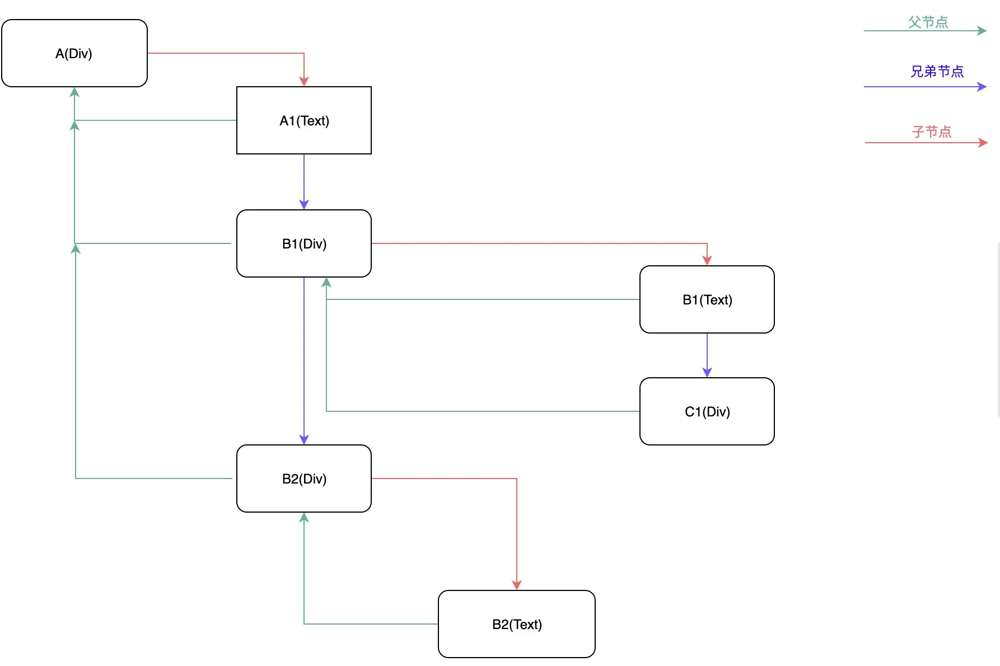

* 副作用单链表；

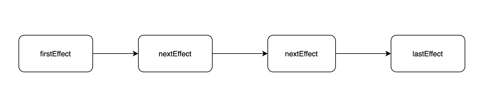

* 状态更新单链表；

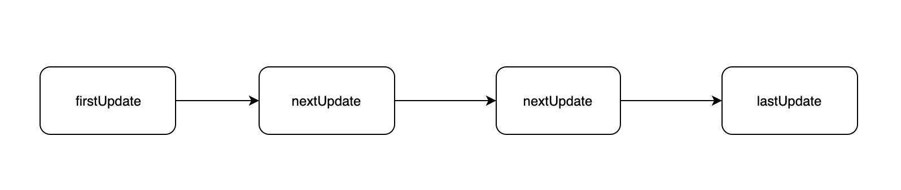

链表是一种简单高效的数据结构，它在当前节点中保存着指向下一个节点的指针；遍历的时候，通过操作指针找到下一个元素。

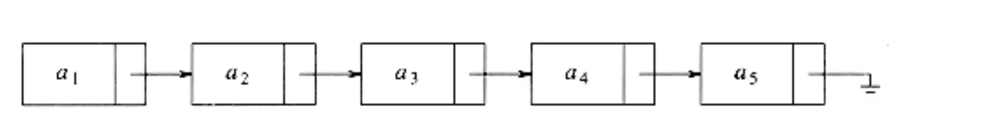

链表相比顺序结构数据格式的好处就是：

* 操作更高效，比如顺序调整、删除，只需要改变节点的指针指向就好了。
* 不仅可以根据当前节点找到下一个节点，在多向链表中，还可以找到他的父节点或者兄弟节点。

但链表也不是完美的，缺点就是：

* 比顺序结构数据更占用空间，因为每个节点对象还保存有指向下一个对象的指针。
* 不能自由读取，必须找到他的上一个节点。

React 用空间换时间，更高效的操作可以方便根据优先级进行操作。同时可以根据当前节点找到其他节点，在下面提到的挂起和恢复过程中起到了关键作用。


**要点**：
React Fiber 是 React 的更新算法的一次重要升级：

### 1. **优先级调度**

- **描述**：Fiber 引入了任务优先级调度机制，可以将更新任务按优先级分组处理。例如，用户交互（点击、输入）通常具有较高的优先级，而网络请求等低优先级任务则可以延迟处理。
- **影响**：通过优先级调度，React 可以确保高优先级的任务及时完成，提高用户体验。

### 2. **分片更新**

- **描述**：Fiber 支持将更新任务分片成较小的单元（Fiber 节点），在每一帧中只处理一部分更新。
- **影响**：这种分片处理避免了长时间阻塞主线程，使得 UI 保持响应，提升了性能和流畅度。

### 3. **可中断的任务**

- **描述**：Fiber 允许任务在执行过程中被中断并在之后的空闲时间继续。长时间运行的任务不会阻塞主线程，而是被分解成多个较小的任务。
- **影响**：这使得 React 能够在用户操作和动画期间保持流畅，避免了长时间的卡顿。

### 4. **增量渲染**

- **描述**：Fiber 支持增量渲染，即在一次更新中只渲染部分组件。这样可以减少每次渲染的工作量。
- **影响**：增量渲染提高了渲染效率，避免了全量渲染的性能开销。

### 5. **恢复和回溯**

- **描述**：Fiber 支持恢复和回溯机制，可以在更新过程中回退到安全的状态。
- **影响**：这保证了应用的一致性和稳定性，即使在遇到错误或需要中断的情况下。

### 6. **灵活的更新机制**

- **描述**：Fiber 架构的设计允许 React 更加灵活地管理和调度更新任务，包括支持异步渲染和中断任务的能力。
- **影响**：这种灵活性提升了 React 的性能和响应能力，使其能够适应各种复杂的用户交互和应用场景。

### 总结

React Fiber 通过引入优先级调度、分片更新、可中断任务、增量渲染、恢复和回溯机制，使得 React 在处理复杂更新和用户交互时更加高效、流畅和稳定。这些改进使 Fiber 成为 React 性能的重要飞跃。


---
### 1895. 不同版本的 React 都做过哪些优化？

**难度**：★★★★☆ | **题型**：QA | **分类**：全部 / React.js

**题目**：


**参考答案**：
React渲染页面的两个阶段：

* 调度阶段（reconciliation）：在这个阶段 React 会更新数据生成新的 Virtual DOM，然后通过Diff算法，快速找出需要更新的元素，放到更新队列中去，得到新的更新队列。
* 渲染阶段（commit）：这个阶段 React 会遍历更新队列，**将其所有的变更一次性更新到DOM上**。

## React 15 架构

React15架构可以分为两层：

* Reconciler（协调器）—— 负责找出变化的组件；
* Renderer（渲染器）—— 负责将变化的组件渲染到页面上；

在React15及以前，Reconciler采用递归的方式创建虚拟DOM，递归过程是不能中断的。如果组件树的层级很深，递归会占用线程很多时间，递归更新时间超过了16ms，用户交互就会卡顿。

为了解决这个问题，React16将递归的无法中断的更新重构为异步的可中断更新，由于曾经用于递归的虚拟DOM数据结构已经无法满足需要。于是，全新的Fiber架构应运而生。

## React 16 架构

为了解决同步更新长时间占用线程导致页面卡顿的问题，也为了探索运行时优化的更多可能，React开始重构并一直持续至今。重构的目标是实现Concurrent Mode（并发模式）。

从v15到v16，React团队花了两年时间将源码架构中的Stack Reconciler重构为Fiber Reconciler。

React16架构可以分为三层：

* Scheduler（调度器）—— 调度任务的优先级，高优任务优先进入Reconciler；
* Reconciler（协调器）—— 负责找出变化的组件：更新工作从递归变成了可以中断的循环过程。Reconciler内部采用了Fiber的架构；
* Renderer（渲染器）—— 负责将变化的组件渲染到页面上。

## React 17 优化

React16的expirationTimes模型只能区分是否>=expirationTimes决定节点是否更新。React17的lanes模型可以选定一个更新区间，并且动态的向区间中增减优先级，可以处理更细粒度的更新。

>Lane用二进制位表示任务的优先级，方便优先级的计算（位运算），不同优先级占用不同位置的“赛道”，而且存在批的概念，优先级越低，“赛道”越多。高优先级打断低优先级，新建的任务需要赋予什么优先级等问题都是Lane所要解决的问题。

Concurrent Mode的目的是实现一套可中断/恢复的更新机制。其由两部分组成：

* 一套协程架构：Fiber Reconciler
* 基于协程架构的启发式更新算法：控制协程架构工作方式的算法


**要点**：
### 1. **React 15**

- **DOM 更新优化**：
  - 引入了改进的虚拟 DOM 算法，提高了更新效率。
  - 对 `reconciliation`（协调）算法进行了优化，以减少不必要的 DOM 操作。
- **错误处理**：
  - 增强了错误边界，提供了更好的错误处理能力。

### 2. **React 16**

- **Fiber 架构**：
  - **引入**：彻底重写了协调算法，引入了 Fiber 架构。
  - **优先级调度**：支持任务优先级调度，允许异步渲染，提升了 UI 响应能力。
  - **增量渲染**：支持将更新任务分片，避免了长时间阻塞主线程。
  - **可中断任务**：支持中断和恢复任务，提高了任务执行的灵活性。
- **错误边界**：
  - 引入了错误边界机制（`Error Boundaries`），用于捕获和处理渲染过程中的错误。
- **Fragments 和 Portals**：
  - **Fragments**：允许返回多个子元素而不增加额外的 DOM 节点。
  - **Portals**：允许将子组件渲染到父组件以外的 DOM 节点中。

### 3. **React 17**

- **事件系统改进**：
  - **事件委托**：事件处理器现在附加到根节点，改进了事件系统的性能和一致性。
  - **事件冒泡**：更好地处理事件冒泡，改进了事件传播的控制。
- **无破坏性更新**：
  - **兼容性**：使新版本与旧版本的 React 代码兼容，减少升级时的问题。
  - **功能增强**：在确保向后兼容的同时，优化了组件的更新机制。
- **逐步弃用旧 API**：
  - **清理**：逐步弃用和优化了旧的生命周期方法，为未来版本做准备。

### 4. **React 18**

- **Concurrent Mode（并发模式）**：
  - **引入**：引入并发模式，允许在后台进行任务处理，以提升应用的响应性。
  - **自动批处理**：在并发模式下，支持自动批处理多个状态更新，减少渲染次数。
- **Suspense 和 Transition**：
  - **Suspense**：扩展了对 Suspense 的支持，不仅仅用于代码分割，还可以用于数据加载。
  - **Transition**：引入了 `startTransition` API，允许将某些更新标记为非紧急，从而改善用户体验。
- **改进的服务端渲染（SSR）**：
  - **改进**：优化了服务端渲染，支持流式渲染，使首屏加载更快。
  - **React Server Components**：支持服务器组件，可以从服务器直接渲染组件，减少前端 JavaScript 的体积。

### 5. **React 19 (未来预期优化)**

- **进一步优化并发模式**：
  - **预测**：进一步改进并发模式的性能和易用性。
  - **新特性**：可能会引入新的特性或 API 以增强并发渲染的能力。
- **更多功能改进**：
  - **功能增强**：继续改进 Suspense 和 Concurrent Mode，提供更强大的功能和更好的开发体验。
  - **性能提升**：进一步优化虚拟 DOM 和渲染机制，提升性能。

### 总结

- **React 15**：引入了改进的虚拟 DOM 算法和错误处理。
- **React 16**：引入了 Fiber 架构，支持异步渲染和错误边界。
- **React 17**：改进了事件系统，增强了向后兼容性，逐步弃用旧 API。
- **React 18**：引入并发模式、Suspense 和 Transition，优化了服务端渲染。

每个版本都在不断优化 React 的性能、功能和开发体验，使其能够更好地应对复杂的应用场景和用户需求。


---
### 1907. Next.js 中的 AppRouter 和 PageRouter 有什么区别？

**难度**：★★★☆☆ | **题型**：QA | **分类**：全部 / React.js

**题目**：


**参考答案**：
在 Next.js 中，App Router 和 Page Router 代表了两种不同的路由体系，它们不仅仅是目录结构上的差异，更深层次上体现了 Next.js 从传统页面路由向以 React Server Components 为核心的现代应用架构的转变。

**Page Router** 是 Next.js 自早期版本就存在的路由机制，遵循的是 `pages` 目录驱动的约定式路由。它的设计理念非常接近传统的 SPA 框架：

* 所有页面组件都是客户端组件，页面切换通过内置的 `Link` 组件完成。
* 数据获取方式依赖 `getServerSideProps`、`getStaticProps` 和 `getInitialProps`，这种模式有一定约束性，开发者需要明确区分静态渲染和服务端渲染的场景。
* 在代码组织上，业务逻辑和页面视图容易耦合到同一组件中，长远来看会影响代码的模块化和可维护性。

**App Router** 则是自 Next.js 13 引入的新一代路由方案，它以 `app` 目录为核心，充分利用了 React 18 的新特性，尤其是 Server Components：

* 默认支持 **React Server Components**，意味着页面和组件可以天然地运行在服务端，减少了前端 bundle 体积，提升性能。
* 提供了全新的 **数据获取模式**，通过 `fetch` 的服务端调用和 `async` 组件来实现，开发者无需再显式区分 SSR/SSG，而是以“组件即数据边界”的思路来组织逻辑。
* 更加灵活的 **布局系统**，支持嵌套 Layout、模板以及 Server Actions，使得应用在结构化、模块化和复用性上有显著提升。
* 渲染模型也更先进，例如 Streaming 和 Suspense 的原生支持，使得用户能更快看到页面的首屏内容。

如果从项目实际落地来看，Page Router 更适合传统的中小型项目或老项目迁移时的平滑过渡，而 App Router 则面向中大型、需要可扩展性和性能优化的新项目。它代表了 Next.js 的未来方向，后续生态和新特性都会优先支持 App Router。

**要点**：
* Page Router 基于 `pages` 目录，依赖传统的数据获取 API，逻辑偏向客户端，适合早期项目。
* App Router 基于 `app` 目录，默认 Server Components，支持 Streaming/Suspense，更现代化，适合复杂和长生命周期的项目。
* 本质区别在于渲染模型、数据获取方式和架构组织理念，App Router 是 Next.js 的演进方向。

---