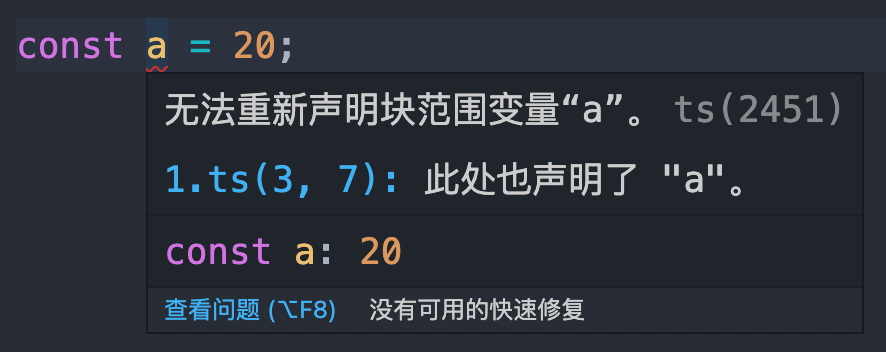
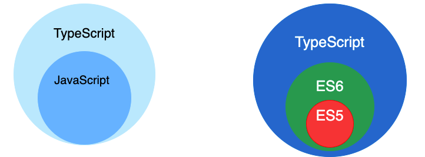
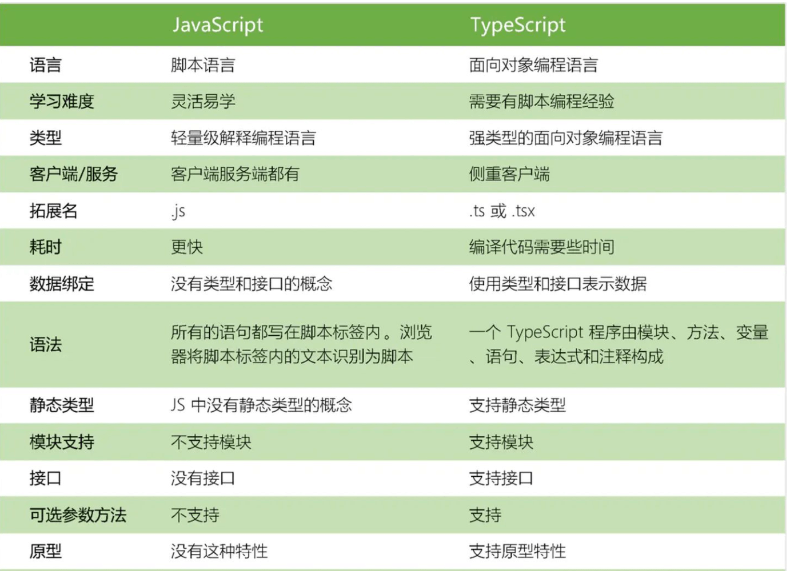
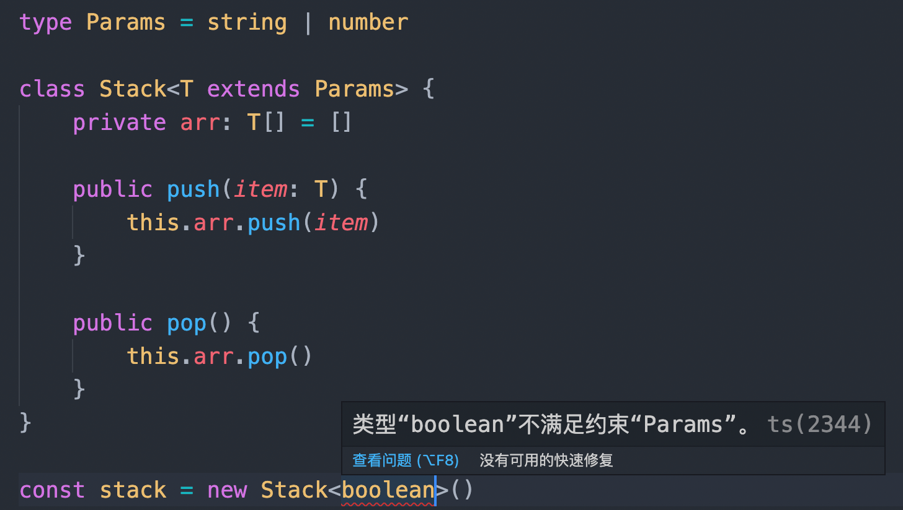
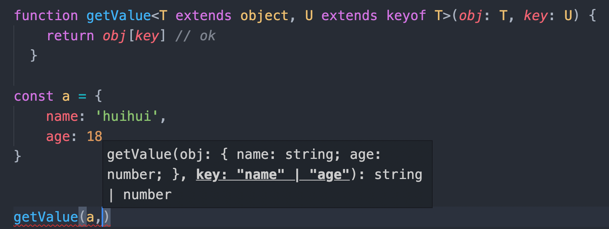

# Typescript 分类题集

> 共 61 题，摘自前端面试题宝典 https://fe.ecool.fun/topic-list

### 33. typescript 中的 is 关键字有什么用？

**难度**：★★★☆☆ | **题型**：QA | **分类**：全部 / Typescript

**题目**：


**参考答案**：
TypeScript 中的 `is` 关键字用于类型保护，可以在运行时判断一个对象是否属于某个类型，并根据不同的类型执行不同的逻辑。

具体来说，`is` 关键字通常和 `instanceof` 运算符一起使用，用于判断一个对象是否是某个类的实例。例如：

```typescript
class Animal {
    name: string;
    constructor(name: string) {
        this.name = name;
    }
}

class Dog extends Animal {
    breed: string;
    constructor(name: string, breed: string) {
        super(name);
        this.breed = breed;
    }
}

function isDog(animal: Animal): animal is Dog {
    return (animal as Dog).breed !== undefined;
}

let a1 = new Animal("Tom");
let d1 = new Dog("Tony", "Poodle");

console.log(isDog(a1));  // false
console.log(isDog(d1));  // true
```

在上面的代码中，我们定义了一个 `isDog` 函数，它接受一个 `Animal` 类型的参数，返回值是一个布尔值。如果这个参数是 `Dog` 类型的实例，则返回 `true`；否则返回 `false`。注意，这里我们使用 `animal is Dog` 语法来显式地指定返回值类型为布尔值，表示这个函数就是一个类型谓词函数。

在 `isDog` 函数中，我们通过判断传入的 `animal` 参数是否含有 `breed` 属性，来判断它是否是 `Dog` 类型的实例。如果是，则返回 `true`；否则返回 `false`。

最后，我们可以通过调用 `isDog` 函数来判断一个对象是否是 `Dog` 类型的实例，并根据不同的类型执行相应的逻辑。

**要点**：
**作答思路：**

在TypeScript中，`is`关键字通常与类型保护（Type Guards）一起使用，用于确定一个值是否属于某种类型。它允许你安全地检查一个变量是否属于某种类型，而不是假设它是该类型。

**考察要点**：

1. **类型保护**：理解类型保护的作用和用途。
2. **is关键字用法**：了解如何使用`is`关键字进行类型保护。


---
### 80. Typescript中 interface 和 type 的差别是什么？

**难度**：★★★☆☆ | **题型**：QA | **分类**：全部 / Typescript

**题目**：


**参考答案**：
## 相同点

* 都可以描述一个对象或者函数

**interface**
```typescript
interface User {
  name: string
  age: number
}

interface SetUser {
  (name: string, age: number): void;
}
```

**type**
```typescript
type User = {
  name: string
  age: number
};

type SetUser = (name: string, age: number)=> void;
```

* 都允许拓展（extends）

interface 和 type 都可以拓展，并且两者并不是相互独立的，也就是说 interface 可以 extends type, type 也可以 extends interface 。 虽然效果差不多，但是两者语法不同。

**interface extends interface**
```typescript
interface Name { 
  name: string; 
}
interface User extends Name { 
  age: number; 
}
```

**type extends type**
```typescript
type Name = { 
  name: string; 
}
type User = Name & { age: number  };
```

**interface extends type**
```typescript
type Name = { 
  name: string; 
}
interface User extends Name { 
  age: number; 
}
```

**type extends interface**
```typescript
interface Name { 
  name: string; 
}
type User = Name & { 
  age: number; 
}
```

## 不同点

* type 可以而 interface 不行

**type 可以声明基本类型别名，联合类型，元组等类型**
```typescript
// 基本类型别名
type Name = string

// 联合类型
interface Dog {
    wong();
}
interface Cat {
    miao();
}

type Pet = Dog | Cat

// 具体定义数组每个位置的类型
type PetList = [Dog, Pet]
```

**type 语句中还可以使用 typeof 获取实例的 类型进行赋值**
```typescript
// 当你想获取一个变量的类型时，使用 typeof
let div = document.createElement('div');
type B = typeof div
```

**其他骚操作**
```typescript
type StringOrNumber = string | number;  
type Text = string | { text: string };  
type NameLookup = Dictionary<string, Person>;  
type Callback<T> = (data: T) => void;  
type Pair<T> = [T, T];  
type Coordinates = Pair<number>;  
type Tree<T> = T | { left: Tree<T>, right: Tree<T> };
```

* interface 可以而 type 不行

**interface 能够声明合并**

```typescript
interface User {
  name: string
  age: number
}

interface User {
  sex: string
}

/*
User 接口为 {
  name: string
  age: number
  sex: string 
}
*/
```

一般来说，如果不清楚什么时候用interface/type，能用 interface 实现，就用 interface , 如果不能就用 type 。


**要点**：
**作答思路：**

在TypeScript中，`interface`和`type`都可以用来定义类型，但它们之间有一些区别：

1. **定义方式**：
   - `interface`用于定义对象的形状（Shape），可以包含方法和属性。
   - `type`用于定义类型别名，可以包含联合类型、元组、字面量等。
2. **扩展性**：
   - `interface`是可扩展的，可以合并多个接口。
   - `type`是不可扩展的，不能合并多个类型。
3. **默认值**：
   - `interface`可以包含默认值。
   - `type`不能包含默认值。
4. **属性要求**：
   - `interface`要求属性必须存在。
   - `type`不要求属性必须存在。
5. **使用场景**：
   - `interface`通常用于定义对象的形状，如组件的props和state。
   - `type`通常用于定义函数参数和返回值的类型。

**考察要点**：

1. **定义方式**：理解`interface`和`type`定义类型的不同方式。
2. **扩展性**：了解`interface`和`type`在扩展性方面的差异。
3. **使用场景**：了解`interface`和`type`在实际应用中的使用场景。


---
### 102. 请实现下面的 product 方法

**难度**：★☆☆☆☆ | **题型**：QA | **分类**：全部 / Typescript

**题目**：
/**
 * @file 计算数组笛卡尔积
 */

// 示例
product([1, 2], [3, 4]) // [[1, 3], [1, 4], [2, 3], [2, 4]]

function product(xList: number[], yList: number[]): [number, number][] {
    // 补全内部实现
    throw new Error('功能待实现');
}

export default {}

**参考答案**：
```ts
/**
 * @file 计算数组笛卡尔积
 */

// 示例
console.log(product([1, 2], [3, 4])); // [[1, 3], [1, 4], [2, 3], [2, 4]]

function product(xList: number[], yList: number[]): [number, number][] {
  // 参考答案
  return xList.reduce((v, t) => {
    return v.concat(yList.map((item) => [t, item]));
  }, [] as [number, number][]);
}

export default {};
```


---
### 107. tsconfig.json文件有什么用？

**难度**：★★☆☆☆ | **题型**：QA | **分类**：全部 / Typescript

**题目**：


**参考答案**：
tsconfig.json文件是JSON格式的文件。 

在tsconfig.json文件中，可以指定不同的选项来告诉编译器如何编译当前项目。

目录中包含tsconfig.json文件，表明该目录是TypeScript项目的根目录。


```
// 常用配置
{
  /*
      tsconfig.json是ts编译器的配置文件，ts可以根据它的信息来对待吗进行编译 可以再tsconfig中写注释
      include : 用来指定哪些文件需要被编译
      exclude : 用来指定哪些文件不需要被编译 ：默认node_module
      extends : 用来指定继承的配置文件
      files   : 用来指定被编译的文件列表，只有编译少量文件才使用
      compilerOptions : 编译器的选项是配置文件中非常重要也是非常复杂的配置选项
  */
  "include":[
    // ** : 任意目录 ， * : 任意文件
    "./src/**/*"
  ],
  "exclude": [
    "./src/hello/**/*"
  ],
  // "extends": "./configs/base",
  "files": [
    "1.ts",
    // "2.ts"
  ],
  "compilerOptions": {
    // 用来指定 ES 版本 ESNext : 最新版。 'ES3', 'ES5', 'ES6'/'ES2015', 'ES2016', 'ES2017', 'ES2018', 'ES2019', 'ES2020', 'ESNext'
    "target": "ES2020",
    // 指定要使用模块化的规范 : 'None', 'CommonJS', 'AMD', 'System', 'UMD', 'ES6'/'ES2015', 'ES2020' or 'ESNext'
    "module": "ESNext",
    // 用来指定项目中要使用的库 'ES5', 'ES6', 'ES2015', 'ES7', 'ES2016', 'ES2017', 'ES2018', 'ESNext', 'DOM', 'DOM.Iterable',
    //                          'WebWorker', 'ScriptHost', 'ES2015.Core', 'ES2015.Collection', 'ES2015.Generator', 'ES2015.Iterable', 
    //                          'ES2015.Promise', 'ES2015.Proxy', 'ES2015.Reflect', 'ES2015.Symbol', 'ES2015.Symbol.WellKnown', 
    //                          'ES2016.Array.Include', 'ES2017.object', 'ES2017.Intl', 'ES2017.SharedMemory', 'ES2017.String', 
    //                          'ES2017.TypedArrays', 'ES2018.Intl', 'ES2018.Promise', 'ES2018.RegExp', 'ESNext.AsyncIterable', 
    //                          'ESNext.Array', 'ESNext.Intl', 'ESNext.Symbol'
    // 运行在浏览器中不用设置，运行在node或其他中才需要设置
    // "lib":[]，
    // 用来指定编译后文件的存放位置
    "outDir":"./dist",
    // 将代码合并为一个文件,设置之后所有的全局作用域中的代码会合并到同一个文件中 但是只能在  'amd' and 'system' 中才能使用
    // "outFile": "./dist/app.js",
    // 是否对js文件进行编译，默认false
    "allowJs": false,
    // 是否检查js代码是否符合语法规范，默认false
    "checkJs": false,
    // 是否移除注释，默认false
    "removeComments":false,
    // 是否不生成编译后文件，默认false
    "noEmit": false,
    // 当有错误时是否生成文件，默认false
    "noEmitOnError": false,
    // 是否生成sourceMap，默认false  这个文件里保存的，是转换后代码的位置，和对应的转换前的位置。有了它，出错的时候，通过断点工具可以直接显示原始代码，而不是转换后的代码。
    "sourceMap":false,

    // 所有的严格检查的总开关，默认false
    "strict": false,
    // 编译后的文件是否开启严格模式，默认false
    "alwaysStrict": false,
    // 不允许隐式的any，默认false(允许)
    "noImplicitAny": false,
    // 不允许隐式的this，默认false(允许)
    "noImplicitThis": false,
    // 是否严格的检查空值，默认false 检查有可能为null的地方
    "strictNullChecks": true,
    // 是否严格检查bind、call和apply的参数列表，默认false  检查是否有多余参数
    "strictBindCallApply":false,
    // 是否严格检查函数的类型，
    "strictFunctionTypes":false,
    // 是否严格检查属性是否初始化，默认false
    "strictPropertyInitialization":false,

    // 是否检查switch语句包含正确的break，默认false
    "noFallthroughCasesInSwitch":false,
    // 检查函数没有隐式的返回值，默认false
    "noImplicitReturns":false,
    // 是否检查检查未使用的局部变量，默认false
    "noUnusedLocals":false,
    // 是否检查未使用的参数，默认false
    "noUnusedParameters":false,

    // 是否检查不可达代码报错，默认false   true，忽略不可达代码 false，不可达代码将引起错误
    "allowUnreachableCode":false
  }
}
```


**要点**：
**作答思路：**

`tsconfig.json`文件是TypeScript的配置文件，用于指定项目中的编译选项。它定义了如何将TypeScript代码编译成JavaScript代码，以及相关的编译选项和规则。

**考察要点**：

1. **配置文件的作用**：理解`tsconfig.json`文件的作用和用途。
2. **编译选项和规则**：了解`tsconfig.json`文件中可以配置的编译选项和规则。


---
### 122. 如何定义一个数组，它的元素可能是字符串类型，也可能是数值类型？

**难度**：★☆☆☆☆ | **题型**：QA | **分类**：全部 / Typescript

**题目**：


**参考答案**：
```typescript
 // 方法1：
let arr1: (number | string)[] = [1]
arr1.push(1)
arr1.push('3')

// 方法2：
let  arr2 : Array<string | number> = [1, '2']
arr2.push(1)
arr2.push('3')

// 方法3：
type newType = number|string
let arr3:newType []= [3]
arr3.push(1)
arr4.push('5')
```


---
### 134. in 运算符作用是什么？

**难度**：★★☆☆☆ | **题型**：QA | **分类**：全部 / Typescript

**题目**：


**参考答案**：
在 TypeScript 中，`in` 运算符用于检查一个对象是否具有特定的属性。它的基本语法是：

```typescript
property in object
```

- **`property`**：要检查的属性名，可以是字符串字面量或符号。
- **`object`**：要检查的对象。

### **用途**

1. **检查对象是否包含某个属性**

   `in` 运算符用于检查某个对象是否拥有指定的属性。它会返回一个布尔值，表示属性是否存在。

   **示例**：

   ```typescript
   const person = { name: "Alice", age: 30 };

   console.log("name" in person); // true
   console.log("gender" in person); // false
   ```

   在这个示例中，`"name" in person` 返回 `true`，因为 `person` 对象具有 `name` 属性。`"gender" in person` 返回 `false`，因为 `person` 对象没有 `gender` 属性。

2. **类型保护**

   `in` 运算符也可以用作类型保护，用于在条件判断中检查对象是否具有特定的属性，从而确定对象的具体类型。

   **示例**：

   ```typescript
   type Cat = { type: 'cat'; meow: () => void };
   type Dog = { type: 'dog'; bark: () => void };

   function handleAnimal(animal: Cat | Dog) {
     if ("meow" in animal) {
       animal.meow(); // 类型保护确保 animal 是 Cat
     } else {
       animal.bark(); // 类型保护确保 animal 是 Dog
     }
   }
   ```

   在这个示例中，通过检查 `animal` 对象是否具有 `meow` 属性来判断它是 `Cat` 还是 `Dog`。`"meow" in animal` 和 `"bark" in animal` 用于确定对象的具体类型，并执行相应的方法。

**要点**：
- **`in` 运算符**：用于检查一个对象是否具有特定的属性。
- **语法**：`property in object`，返回布尔值。
- **类型保护**：在条件判断中用于确定对象的具体类型，增强类型安全性。

---
### 172. TypeScript中的变量以及如何声明？

**难度**：★☆☆☆☆ | **题型**：QA | **分类**：全部 / Typescript

**题目**：


**参考答案**：
变量是内存中用于存储值的命名空间。

在 TypeScript 中声明变量的类型语法在变量名称后包括一个冒号（:)，后跟其类型。 与 JavaScript 相似，我们使用var关键字声明变量。

在Typescript中声明变量时，必须遵循某些规则：

* 变量名称必须是字母或数字。
* 不能以数字开头名称。
* 除下划线（ _ ）和美元（ $ ）符号外，它不能包含空格和特殊字符。


---
### 219. 什么是TypeScript映射文件？

**难度**：★★★☆☆ | **题型**：QA | **分类**：全部 / Typescript

**题目**：


**参考答案**：
* TypeScript Map文件是一个源映射文件，其中包含有关我们原始文件的信息。
* .map文件是源映射文件，可让工具在发出的JavaScript代码和创建它的TypeScript源文件之间进行映射。
* 许多调试器可以使用这些文件，因此我们可以调试TypeScript文件而不是JavaScript文件。


---
### 220. 请实现下面的 mergeArray 方法

**难度**：★☆☆☆☆ | **题型**：QA | **分类**：全部 / Typescript

**题目**：
```ts
/**
 * @file 合并两个有序数组
 */

function merge(arr: number[], arr2: number[]): number[] {
    // 补全此处代码
    throw new Error('功能待实现');
}

// 参数数组从小到大排列
console.log(merge([1, 2, 3], [2, 5, 6])) // [ 1, 2, 2, 3, 5, 6 ]

export default {}
```

**参考答案**：
```ts
/**
 * @file 合并两个有序数组
 */

function merge(arr: number[], arr2: number[]): number[] {
  // 参考答案
  return arr.concat(arr2).sort((a: number, b: number) => a - b);
}

// 参数数组从小到大排列
console.log(merge([1, 2, 3], [2, 5, 6])); // [ 1, 2, 2, 3, 5, 6 ]

export default {};
```


---
### 236. 如何在TypeScript中实现继承？

**难度**：★★☆☆☆ | **题型**：QA | **分类**：全部 / Typescript

**题目**：


**参考答案**：
继承是一种从另一个类获取一个类的属性和行为的机制。它是OOPs语言的一个重要方面，并且具有从现有类创建新类的能力，继承成员的类称为基类，继承这些成员的类称为派生类。

继承可以通过使用extend关键字来实现。我们可以通过下面的例子来理解它。
```
class Shape {     
   Area:number     
   constructor(area:number) {     
      this.Area = area    
   }     
}     
class Circle extends Shape {     
   display():void {     
      console.log("圆的面积: "+this.Area)     
   }     
}    
var obj = new Circle(320);     
obj.display()  
```


**要点**：
**作答思路：**

在TypeScript中，可以通过`extends`关键字来实现继承。子类可以继承父类的属性和方法，并且可以覆盖父类的方法。

**考察要点**：

1. **继承概念**：理解继承的概念和用途。
2. **实现方式**：了解如何在TypeScript中使用`extends`关键字来实现继承。


---
### 277. 请实现下面的 myMap 方法

**难度**：★☆☆☆☆ | **题型**：QA | **分类**：全部 / Typescript

**题目**：
```ts
/**
 * @file 实现数组 map 方法
 */

function myMap<T, R>(arr: T[], callbackFn: (v: T) => R): R[] {
    // 补全此处代码，可以使用除数组 map 以外的其他任何函数
    throw new Error('功能待实现');
}
// 测试
console.log(myMap([1, 2, 3], v => v * 2)) // [2, 4, 6]

export default {};
```

**参考答案**：
```ts
/**
 * @file 实现数组 map 方法
 */

function myMap<T, R>(arr: T[], callbackFn: (v: T) => R): R[] {
  // 参考答案
  var arr1: R[] = [];
  for (var i = 0; i < arr.length; i++) {
    arr1[i] = callbackFn(arr[i]);
  }
  return arr1;
}
// 测试
console.log(myMap([1, 2, 3], (v) => v * 2)); // [2, 4, 6]

export default {};
```


---
### 282. 如何检查TypeScript中的null和undefined ？

**难度**：★★★★☆ | **题型**：QA | **分类**：全部 / Typescript

**题目**：


**参考答案**：
通过使用一个缓冲检查，我们可以检查空和未定义:
```
if (x == null) {  
}  
```
如果我们使用严格的检查，它将总是对设置为null的值为真，而对未定义的变量不为真。

例子
```
var a: number;  
var b: number = null;  
function check(x, name) {  
    if (x == null) {  
        console.log(name + ' == null');  
    }  
    if (x === null) {  
        console.log(name + ' === null');  
    }  
    if (typeof x === 'undefined') {  
        console.log(name + ' is undefined');  
    }  
}  
check(a, 'a');  
check(b, 'b');  
```
输出
```
"a == null"  
"a is undefined"  
"b == null"  
"b === null"  
```


**要点**：
**作答思路：**

在TypeScript中，可以通过类型保护（Type Guard）来检查`null`和`undefined`。以下是几种检查`null`和`undefined`的方法：

1. **使用typeof和===操作符**：

   ```typescript
   if (typeof value === 'undefined' || value === null) {
     // 处理null或undefined
   }
   ```

3. **使用`!`操作符进行强制类型转换**：

   ```typescript
   if (value !== null && value !== undefined) {
     // 确保value不是null或undefined
   }
   ```

4. **使用联合类型**：

   ```typescript
   function check(value: string | null | undefined): boolean {
     return value !== null && value !== undefined;
   }
   ```

5. **使用类型断言**：

   ```typescript
   if (value as string !== undefined) {
     // 假设value是string类型，并且不为undefined
   }
   ```

**考察要点**：

1. **类型保护**：理解如何使用类型保护来检查`null`和`undefined`。
2. **强制类型转换**：了解如何使用`!`操作符进行强制类型转换。


---
### 351. Typescript中never 和 void 的区别？

**难度**：★★☆☆☆ | **题型**：QA | **分类**：全部 / Typescript

**题目**：


**参考答案**：
`never` 和 `void` 都是用来表示函数的返回类型，但它们有着不同的含义和用途。

下面是两者的区别和使用场景：

### **1. `void`**

**`void`** 类型表示函数没有返回值，通常用于那些没有返回值的函数。可以把它看作是函数的“空”类型，表示该函数执行完毕后没有任何结果返回。

#### **用法：**
- **函数没有返回值时：**
  当一个函数没有返回任何内容时，我们通常会将其返回类型设置为 `void`。

  ```typescript
  function logMessage(message: string): void {
    console.log(message);
  }
  ```

  这里的 `logMessage` 函数没有返回任何值，因此它的返回类型是 `void`。

- **`void` 与 `undefined` 的区别**：
  - `void` 表示没有返回值，而 `undefined` 是一个实际的值，表示变量未被赋值。
  - 在 `void` 类型的函数中，返回 `undefined` 或不返回任何内容都是允许的，但不能返回其他类型的值。

  ```typescript
  function example(): void {
    // 可以返回 `undefined`，也可以不返回任何值
    return undefined;
  }
  ```

#### **总结：**
- `void` 用于表示函数没有返回值。
- `void` 并不是说函数没有任何副作用，它只是指示该函数不返回任何值。

---

### **2. `never`**

**`never`** 类型表示从不返回的函数，即这些函数无法正常结束，它们要么会抛出错误，要么会进入无限循环。因此，`never` 类型表示一个函数永远不会返回。

#### **用法：**
- **抛出错误的函数：**
  如果一个函数总是抛出错误并且没有正常的返回值（即它的执行会被终止），它的返回类型应该是 `never`。

  ```typescript
  function throwError(message: string): never {
    throw new Error(message);
  }
  ```

  这个 `throwError` 函数抛出一个错误，因此它的返回类型是 `never`。

- **无限循环的函数：**
  如果一个函数进入一个无限循环，也不返回任何东西，它的返回类型也应该是 `never`。

  ```typescript
  function infiniteLoop(): never {
    while (true) {
      // 无限循环
    }
  }
  ```

  由于 `infiniteLoop` 函数会永远执行下去，永远不会返回，它的返回类型是 `never`。

#### **总结：**
- `never` 类型用于表示那些不会正常返回的函数，通常是因为它们会抛出异常或进入无限循环。
- `never` 强调了函数的不可达性，即函数不会正常结束。

---

### **3. `void` 与 `never` 的区别总结**

| **特性**                | **`void`**                                       | **`never`**                                      |
|-------------------------|-------------------------------------------------|-------------------------------------------------|
| **定义**                | 表示没有返回值的函数。                          | 表示永远不会返回的函数，通常用于抛出异常或进入无限循环。 |
| **返回值**              | 可以返回 `undefined`，也可以不返回任何值。     | 不能返回任何值，通常抛出异常或进入无限循环。         |
| **用法场景**            | 用于没有返回值的函数，如事件处理函数。         | 用于那些无法正常返回的函数，如抛出错误的函数或无限循环函数。|
| **示例**                | `function log(): void { console.log('Hello'); }` | `function throwError(): never { throw new Error('Error'); }` |

**要点**：
- `void` 表示函数没有返回值，允许函数返回 `undefined` 或不返回任何内容。
- `never` 表示函数不会正常返回，通常是因为它抛出了异常或进入了无限循环，意味着函数的执行不会终止并且不会返回任何值。

---
### 358. 说说 TypeScript 中，有哪些内置的类型方法和工具类型

**难度**：★★★☆☆ | **题型**：QA | **分类**：全部 / Typescript

**题目**：


**参考答案**：
## **1. 核心工具类型**
TypeScript 自带的一些通用工具类型，用于在类型系统中执行变换操作：

### **1.1. 映射类型**
- **`Partial<T>`**  
  将类型 `T` 的所有属性变为可选属性。  
  ```typescript
  type User = { name: string; age: number };
  type PartialUser = Partial<User>; // { name?: string; age?: number }
  ```

- **`Required<T>`**  
  将类型 `T` 的所有属性变为必需属性。  
  ```typescript
  type User = { name?: string; age?: number };
  type RequiredUser = Required<User>; // { name: string; age: number }
  ```

- **`Readonly<T>`**  
  将类型 `T` 的所有属性变为只读属性。  
  ```typescript
  type User = { name: string; age: number };
  type ReadonlyUser = Readonly<User>; // { readonly name: string; readonly age: number }
  ```

- **`Record<K, T>`**  
  构造一个对象类型，其键是类型 `K` 的属性，值是类型 `T`。  
  ```typescript
  type Role = "admin" | "user";
  type Permissions = Record<Role, boolean>; // { admin: boolean; user: boolean }
  ```

- **`Pick<T, K>`**  
  从类型 `T` 中选择指定的属性 `K`，构造新的类型。  
  ```typescript
  type User = { name: string; age: number; address: string };
  type UserName = Pick<User, "name">; // { name: string }
  ```

- **`Omit<T, K>`**  
  从类型 `T` 中剔除指定的属性 `K`，构造新的类型。  
  ```typescript
  type User = { name: string; age: number; address: string };
  type UserWithoutAddress = Omit<User, "address">; // { name: string; age: number }
  ```

---

### **1.2. 条件类型**
- **`Exclude<T, U>`**  
  从类型 `T` 中剔除可以赋值给 `U` 的类型。  
  ```typescript
  type T = "a" | "b" | "c";
  type Excluded = Exclude<T, "a">; // "b" | "c"
  ```

- **`Extract<T, U>`**  
  从类型 `T` 中提取可以赋值给 `U` 的类型。  
  ```typescript
  type T = "a" | "b" | "c";
  type Extracted = Extract<T, "a" | "b">; // "a" | "b"
  ```

- **`NonNullable<T>`**  
  移除类型 `T` 中的 `null` 和 `undefined`。  
  ```typescript
  type T = string | null | undefined;
  type NonNullableT = NonNullable<T>; // string
  ```

- **`ReturnType<T>`**  
  获取函数 `T` 的返回值类型。  
  ```typescript
  type Fn = () => number;
  type Result = ReturnType<Fn>; // number
  ```

- **`InstanceType<T>`**  
  获取构造函数类型 `T` 的实例类型。  
  ```typescript
  class User {
      name = "John";
  }
  type UserInstance = InstanceType<typeof User>; // User
  ```

---

### **1.3. 工具类型**
- **`Parameters<T>`**  
  获取函数 `T` 的参数类型的元组。  
  ```typescript
  type Fn = (name: string, age: number) => void;
  type Params = Parameters<Fn>; // [string, number]
  ```

- **`ConstructorParameters<T>`**  
  获取构造函数类型 `T` 的参数类型的元组。  
  ```typescript
  type Constructor = new (name: string, age: number) => {};
  type Params = ConstructorParameters<Constructor>; // [string, number]
  ```

- **`ThisParameterType<T>`**  
  提取函数类型 `T` 的 `this` 参数类型。  
  ```typescript
  function fn(this: { x: number }, y: number) {}
  type This = ThisParameterType<typeof fn>; // { x: number }
  ```

- **`OmitThisParameter<T>`**  
  从函数类型 `T` 中移除 `this` 参数。  
  ```typescript
  function fn(this: { x: number }, y: number) {}
  type Fn = OmitThisParameter<typeof fn>; // (y: number) => void
  ```

---

## **2. 内置的类型工具**

### **2.1. 基本类型辅助工具**
- **`Awaited<T>`**  
  获取 `Promise` 的解析值类型。  
  ```typescript
  type T = Promise<number>;
  type Resolved = Awaited<T>; // number
  ```

- **`Uppercase<S>` / `Lowercase<S>`**  
  转换字符串类型为大写或小写。  
  ```typescript
  type Upper = Uppercase<"hello">; // "HELLO"
  type Lower = Lowercase<"WORLD">; // "world"
  ```

- **`Capitalize<S>` / `Uncapitalize<S>`**  
  将字符串类型的首字母变为大写或小写。  
  ```typescript
  type Cap = Capitalize<"hello">; // "Hello"
  type Uncap = Uncapitalize<"World">; // "world"
  ```

**要点**：
TypeScript 内置的类型方法和工具类型非常丰富，主要用于：
1. **映射类型**（如 `Partial`、`Readonly`）：操作属性的可选性、只读性等。
2. **条件类型**（如 `Exclude`、`Extract`）：从联合类型中筛选或剔除类型。
3. **函数工具类型**（如 `Parameters`、`ReturnType`）：获取函数的参数和返回值类型。
4. **字符串类型工具**（如 `Uppercase`、`Capitalize`）：对字符串类型进行变换。

---
### 362. 使用ts实现一个判断入参是否是数组类型的方法？

**难度**：★★☆☆☆ | **题型**：QA | **分类**：全部 / Typescript

**题目**：


**参考答案**：
unknown 用于变量类型不确定，但肯定可以确定的情形下，比如下面这个示例中，入参总归会有个值，根据这个值的类型进行不同的处理，这里使用 unknown 替代 any 则会更加类型安全。

```ts
function isArray(x: unknown): boolean {
  if (Array.isArray(x)) {
    return true;
  }
  return false;
}
```


---
### 521. unknown 是什么类型？

**难度**：★★☆☆☆ | **题型**：QA | **分类**：全部 / Typescript

**题目**：


**参考答案**：
在 TypeScript 中，`unknown` 表示一个未知的值。它是 TypeScript 3.0 引入的，相比 `any` 类型，`unknown` 更加安全，因为它要求在进行操作之前必须先进行类型检查。

### **特点和使用**

1. **类型安全性**：

   - **`unknown`**：代表任何值，但在你对 `unknown` 类型的值进行操作之前，必须首先进行类型检查或类型断言。这意味着你不能直接对 `unknown` 类型的值进行任何操作，直到你明确知道它的实际类型。
   - **`any`**：允许对值进行任何操作，不需要先进行类型检查。这可能会导致类型安全问题，因为你可以对 `any` 类型的值进行任何操作而不受到编译器的约束。

2. **类型保护**：

   - 当你将一个值的类型声明为 `unknown` 时，必须使用类型保护机制（如 `typeof`、`instanceof` 或类型断言）来确保类型安全。

**示例**：

```typescript
function handleUnknown(value: unknown) {
  if (typeof value === 'string') {
    // 只有在 value 确定为 string 类型时才能使用 string 方法
    console.log(value.toUpperCase());
  } else if (typeof value === 'number') {
    // 只有在 value 确定为 number 类型时才能使用 number 方法
    console.log(value.toFixed(2));
  } else {
    console.log('Unsupported type');
  }
}
```

在这个示例中，`handleUnknown` 函数对 `unknown` 类型的值进行了类型检查，确保在实际操作之前确认了它的类型。这种方式比直接使用 `any` 更安全，因为它强制要求进行类型检查。

### **`unknown` 和 `any` 的区别**

- **类型安全性**：
  - **`unknown`**：必须进行类型检查后才能使用。编译器会强制你确保类型安全。
  - **`any`**：允许对值进行任何操作，没有类型检查限制，可能会导致潜在的类型错误。

- **适用场景**：
  - **`unknown`**：适用于需要处理不确定类型的值，但仍希望保持类型安全的场景。
  - **`any`**：适用于当你确定不会对值进行任何操作或者在类型转换时无法确定类型的场景，但使用 `any` 会丧失类型安全。

**要点**：
- **`unknown` 类型**：表示一个未知的值，在对其进行操作之前必须进行类型检查或类型断言。它提供了比 `any` 更严格的类型安全。
- **与 `any` 的比较**：
  - **`unknown`**：要求在操作之前进行类型检查。
  - **`any`**：允许任何操作，但可能会导致类型安全问题。

---
### 531. 联合类型是什么？

**难度**：★☆☆☆☆ | **题型**：QA | **分类**：全部 / Typescript

**题目**：


**参考答案**：
在 TypeScript 中，**联合类型**（Union Types）是一种允许一个变量同时接受多个不同类型值的类型。这种类型通过使用竖线（`|`）来定义多个可能的类型，表示变量可以是这些类型中的任何一种。

### **定义联合类型**

联合类型的语法是将多个类型用竖线分隔。例如：

```typescript
let value: string | number;
```

在上面的例子中，`value` 可以是 `string` 类型或 `number` 类型的值。

### **使用联合类型**

联合类型非常适合处理一个变量可能有多种不同类型的情况。它允许更灵活的函数参数、返回值和变量类型。

**示例 1：函数参数**

```typescript
function printId(id: number | string) {
  console.log(`The ID is: ${id}`);
}

printId(101);         // 这是一个 number
printId("202");       // 这是一个 string
```

在这个例子中，`printId` 函数的参数 `id` 可以是 `number` 或 `string` 类型。

**示例 2：类型保护**

使用联合类型时，你通常需要使用类型保护来确定实际的类型，以便对值进行正确的操作。

```typescript
function printLength(value: string | string[]) {
  if (typeof value === 'string') {
    console.log(`Length of string: ${value.length}`);
  } else {
    console.log(`Length of array: ${value.length}`);
  }
}

printLength("Hello, world!"); // 输出: Length of string: 13
printLength(["a", "b", "c"]); // 输出: Length of array: 3
```

在这个例子中，`typeof` 操作符用于区分 `string` 和 `string[]` 类型，并进行相应的处理。

**示例 3：对象类型的联合**

```typescript
type Bird = { type: 'bird'; fly: () => void };
type Fish = { type: 'fish'; swim: () => void };

function move(animal: Bird | Fish) {
  if (animal.type === 'bird') {
    animal.fly();
  } else {
    animal.swim();
  }
}
```

在这个例子中，`move` 函数接受 `Bird` 或 `Fish` 类型的对象。根据对象的 `type` 属性，函数可以调用相应的方法。

### **联合类型的优势**

- **灵活性**：允许变量、参数或返回值接受多种类型。
- **类型安全**：与普通类型检查和类型保护一起使用，能够确保在编译时捕获潜在的类型错误。

**要点**：
- **联合类型**（Union Types）允许一个变量、参数或返回值接受多种不同的类型，通过使用竖线（`|`）来定义。
- **类型保护**：使用 `typeof`、`instanceof` 或自定义类型保护来确保操作的正确性。
- **适用场景**：适用于处理可能具有多种类型的值或情况。

联合类型提高了代码的灵活性和可维护性，同时保持了类型安全。

---
### 542. 你了解 ts 工具类型 Exclude 与 Omit 的使用吗？及它们两个的区别？

**难度**：★★★☆☆ | **题型**：QA | **分类**：全部 / Typescript

**题目**：


**参考答案**：
`Exclude` 和 `Omit` 都是 TypeScript 中的 **工具类型**（Utility Types），它们的作用是处理和转换类型的集合，在实际开发中高效地操作类型。

### 1. **`Exclude` 类型**
`Exclude` 是 TypeScript 提供的一个工具类型，它的作用是从联合类型中排除指定的类型。

#### 语法：
```typescript
Exclude<T, U>
```
- `T` 是目标类型。
- `U` 是要排除的类型。

`Exclude<T, U>` 的作用是构建一个新的类型，它是从 `T` 中排除掉所有在 `U` 中的类型。

#### 示例：
```typescript
type A = string | number | boolean;
type B = string | boolean;

type Result = Exclude<A, B>; // Result 类型为: number
```
在这个例子中，`Exclude<A, B>` 表示从 `A` 类型中排除掉了 `string` 和 `boolean`，因此 `Result` 的类型就是 `number`。

### 2. **`Omit` 类型**
`Omit` 是 TypeScript 中的另一个工具类型，它用于从一个类型中排除指定的键（属性）。

#### 语法：
```typescript
Omit<T, K>
```
- `T` 是目标类型。
- `K` 是要排除的属性键。

`Omit<T, K>` 会构建一个新的类型，它是从 `T` 中排除掉了 `K` 中的所有属性。

#### 示例：
```typescript
interface Person {
  name: string;
  age: number;
  address: string;
}

type OmittedPerson = Omit<Person, 'address'>;
// OmittedPerson 类型为: { name: string; age: number; }
```
在这个例子中，`Omit<Person, 'address'>` 表示从 `Person` 类型中排除了 `address` 属性，最终结果是一个不包含 `address` 属性的新类型 `{ name: string; age: number; }`。

### `Exclude` 和 `Omit` 的区别
- **`Exclude`**：用于处理联合类型，排除某些类型（通常是值类型）以产生一个新的联合类型。它关注的是类型的**值**，而不是对象的**属性**。
  
- **`Omit`**：用于处理对象类型，从对象中排除掉指定的属性，生成一个新的对象类型。它关注的是类型的**属性**，而非值。

#### 例子对比：
- **`Exclude`**：从联合类型中移除指定的值类型。
  
  ```typescript
  type A = string | number | boolean;
  type B = string | boolean;

  type Result = Exclude<A, B>; // Result 是 number
  ```

- **`Omit`**：从对象类型中移除指定的属性。
  
  ```typescript
  interface Person {
    name: string;
    age: number;
    address: string;
  }

  type OmittedPerson = Omit<Person, 'address'>; // OmittedPerson 是 { name: string; age: number }
  ```

**要点**：
- **`Exclude`** 用于联合类型，移除指定的类型元素。
- **`Omit`** 用于对象类型，移除指定的属性。

---
### 544. TypeScript 的主要特点是什么？

**难度**：★★☆☆☆ | **题型**：QA | **分类**：全部 / Typescript

**题目**：


**参考答案**：
* 跨平台：TypeScript 编译器可以安装在任何操作系统上，包括 Windows、macOS 和 Linux。
* ES6 特性：TypeScript 包含计划中的 ECMAScript 2015 (ES6) 的大部分特性，例如箭头函数。
* 面向对象的语言：TypeScript 提供所有标准的 OOP 功能，如类、接口和模块。
* 静态类型检查：TypeScript 使用静态类型并帮助在编译时进行类型检查。因此，你可以在编写代码时发现编译时错误，而无需运行脚本。
* 可选的静态类型：如果你习惯了 JavaScript 的动态类型，TypeScript 还允许可选的静态类型。
* DOM 操作：您可以使用 TypeScript 来操作 DOM 以添加或删除客户端网页元素。

**要点**：
**作答思路**：

TypeScript的主要特点包括：

1. **静态类型**：TypeScript是JavaScript的超集，提供了静态类型检查，这有助于在开发阶段发现错误。
2. **模块化**：支持模块化编程，允许将代码组织成模块，并通过`import`和`export`来共享代码。
3. **泛型**：支持泛型编程，允许创建可重用的组件，这些组件可以处理多种数据类型。
4. **接口**：提供接口（Interface）来定义对象的结构，可以用于类型检查和对象交互。
5. **类**：支持面向对象编程，允许定义类和继承。
6. **命名空间**：支持命名空间，用于组织全局作用域的代码。
7. **编译为JavaScript**：TypeScript代码需要编译为JavaScript才能在浏览器或Node.js中运行。

**考察要点**：

1. **静态类型**：理解TypeScript如何通过静态类型检查提高代码质量。
2. **模块化和泛型**：了解TypeScript如何支持模块化和泛型编程。
3. **接口和类**：理解TypeScript如何通过接口和类支持面向对象编程。
4. **编译为JavaScript**：理解TypeScript代码需要编译为JavaScript才能运行。


---
### 550. 如何将 unknown 类型指定为一个更具体的类型？

**难度**：★★☆☆☆ | **题型**：QA | **分类**：全部 / Typescript

**题目**：


**参考答案**：
* 使用 typeof 进行类型判断（这些缩小类型范围的技术都有助于TS基于控制流程下的类型分析）
```ts
  function unknownToString(value: unknown): string {
    if (typeof value === "string") {
     return value;
    }
  
    return String(value);
  }
```

* 对 unknown 类型使用类型断言

要强制编译器信任类型为 unknown 的值为给定类型，则可以使用类型断言：

```ts
  const value: unknown = "Hello World";
  const foo: string = value; // Error
  const bar: string = value as string; // OK
```

断言错了时语法能通过检测，但是运行的时候就会报错了！

```ts
  const value: unknown = "Hello World";

  const bar: number = value as number; // runtime Error
```

**要点**：
**作答思路：**

在TypeScript中，可以将`unknown`类型指定为一个更具体的类型，通过类型断言（Type Assertion）或类型保护（Type Guard）来实现。

1. **类型断言**：

   ```typescript
   let value: unknown;
   if (typeof value === 'string') {
     value = 'hello';
   }
   ```

2. **类型保护**：

   ```typescript
   let value: unknown;
   if (typeof value === 'string') {
     value = 'hello';
   } else if (typeof value === 'number') {
     value = 42;
   }
   ```

**考察要点**：

1. **类型断言**：理解如何使用类型断言将`unknown`类型指定为一个更具体的类型。
2. **类型保护**：理解如何使用类型保护来安全地处理`unknown`类型。


---
### 560. 在开发过程中， 使用过哪些 TS 的特性或者能力？

**难度**：★★☆☆☆ | **题型**：QA | **分类**：全部 / Typescript

**题目**：


**参考答案**：
可以从以下这些方向作答：

### 1. **类型注解（Type Annotations）**
使用类型注解来显式地声明变量、函数参数和返回值的类型，从而保证代码的类型安全，避免类型错误。

#### 示例：
```typescript
let username: string = "Alice";
let age: number = 30;

function greet(name: string): string {
  return `Hello, ${name}!`;
}
```
通过类型注解，TS 能在编译时检查类型错误，减少运行时错误。

### 2. **接口（Interfaces）**
接口定义了对象的结构，常用于类型约束、函数参数和返回值的类型定义，确保代码符合预期的结构。

#### 示例：
```typescript
interface Person {
  name: string;
  age: number;
  greet(): void;
}

const person: Person = {
  name: "Alice",
  age: 30,
  greet() {
    console.log("Hello!");
  },
};
```
通过接口定义对象或类的规范，增强了代码的可读性和可维护性。

### 3. **类型推导（Type Inference）**
TS 会根据变量或表达式的值自动推导出类型，在不显式声明类型时，依然能享受到类型安全的优势。

#### 示例：
```typescript
let greeting = "Hello, world!"; // TS 自动推导类型为 string
greeting = 42; // 错误：类型 'number' 不能赋给类型 'string'
```
类型推导减少了冗余的类型注解，提高了开发效率。

### 4. **联合类型（Union Types）**
允许一个变量或参数可以是多种类型中的任意一种，使用 `|` 符号来表示。

#### 示例：
```typescript
function printId(id: string | number) {
  console.log(id);
}

printId(123); // OK
printId("abc"); // OK
```
联合类型使得类型更加灵活，能够适应不同类型的输入。

### 5. **字面量类型（Literal Types）**
允许将特定的值作为类型，从而使得类型更加精确。通常用于枚举类型、状态码等场景。

#### 示例：
```typescript
type Direction = "up" | "down" | "left" | "right";

function move(direction: Direction) {
  console.log(`Moving ${direction}`);
}

move("up"); // OK
move("north"); // 错误：'north' 不能赋给类型 'Direction'
```
字面量类型帮助减少了错误的输入，确保函数接收到预期的值。

### 6. **泛型（Generics）**
泛型使得函数、类、接口能够支持多种类型，而不需要具体指定类型。通过泛型，开发者能够编写更具复用性的代码。

#### 示例：
```typescript
function identity<T>(value: T): T {
  return value;
}

let result = identity("Hello"); // 推导出 T 为 string
let numberResult = identity(42); // 推导出 T 为 number
```
泛型使得代码能够适应多种类型，增强了灵活性。

### 7. **类型别名（Type Aliases）**
通过 `type` 关键字可以为复杂的类型定义一个别名，简化类型定义并提高可读性。

#### 示例：
```typescript
type Point = { x: number; y: number };
const point: Point = { x: 10, y: 20 };
```
类型别名使得复杂类型的表示更加简洁和可读。

### 8. **交叉类型（Intersection Types）**
交叉类型允许将多个类型合并成一个类型，表示该类型需要满足多个类型的要求。

#### 示例：
```typescript
interface Person {
  name: string;
}

interface Employee {
  employeeId: number;
}

type EmployeePerson = Person & Employee;

const emp: EmployeePerson = {
  name: "Alice",
  employeeId: 123,
};
```
交叉类型帮助我们将多个接口合并为一个类型，扩展了对象的属性。

### 9. **类型守卫（Type Guards）**
类型守卫用于在运行时检查一个值的类型，并相应地缩小其类型范围。

#### 示例：
```typescript
function isString(value: unknown): value is string {
  return typeof value === "string";
}

let input: unknown = "Hello";

if (isString(input)) {
  console.log(input.length); // input 被认为是 string 类型
}
```
类型守卫让代码更具安全性，通过检查类型确保访问属性时不会出错。

### 10. **声明文件（Declaration Files）**
TS 支持声明文件（`.d.ts`），使得 JavaScript 库或模块可以被类型检查，增强对第三方库的类型支持。

#### 示例：
```typescript
declare module "some-js-lib" {
  export function someFunction(): void;
}
```
通过声明文件，可以为未包含类型定义的 JavaScript 库提供类型支持，从而享受 TS 的类型检查。

### 11. **装饰器（Decorators）**
装饰器是 TypeScript 提供的一种元编程技术，通常用于类和类成员的修饰，可以用于注入依赖、方法拦截等场景。

#### 示例：
```typescript
function log(target: any, key: string) {
  console.log(`Method ${key} was called`);
}

class MyClass {
  @log
  myMethod() {
    console.log("Executing method");
  }
}
```
装饰器是 TypeScript 提供的高级功能，广泛应用于框架（如 Angular）中，增强了类的行为。

### 12. **模块系统（Module System）**
TypeScript 默认使用 ES6 模块系统，可以通过 `import` 和 `export` 引入和导出模块，这使得代码更具模块化、可维护性更强。

#### 示例：
```typescript
// math.ts
export function add(a: number, b: number): number {
  return a + b;
}

// app.ts
import { add } from './math';
console.log(add(2, 3));
```
TS 的模块化系统与 ES6 完全兼容，方便与其他模块进行集成。

**要点**：
- **类型注解**：增强类型安全，避免运行时错误。
- **接口和类型别名**：定义结构清晰的类型，保证代码的可维护性。
- **泛型**：提高代码复用性和灵活性。
- **类型守卫**：确保在运行时处理正确的类型。
- **模块化和声明文件**：增强模块化支持，处理 JavaScript 库的类型定义。

---
### 562. TypeScript 的内置数据类型有哪些？

**难度**：★☆☆☆☆ | **题型**：QA | **分类**：全部 / Typescript

**题目**：


**参考答案**：
* boolean：表示布尔值，可以是 true 或 false。 
* number：表示数字，包括整数和浮点数。 
* string：表示字符串。可以使用单引号或双引号来表示字符串。 
* void：表示没有任何返回值的函数的返回类型。 
* null 和 undefined：这两个类型是所有类型的子类型。 symbol：表示独特的值，类似于数字或字符串。

除此之外，TypeScript 还支持以下复合类型：

* array：表示一个元素类型为 T 的数组。例如，number[] 表示一个数字数组。 
* tuple：表示已知元素数量和类型的数组。例如，[string, number] 表示一个字符串和数字组成的元组。 
* enum：表示一个命名的常量枚举。 
* any：表示任意类型。 
* unknown：与 any 类似，但是在更严格的类型检查下使用。 
* object：表示非原始类型的对象。 
* 还有一些其他的类型，例如 never、union 和 intersection，它们可以用于描述更复杂的类型。

**要点**：
**作答思路：**

TypeScript 内置的数据类型包括：

1. **基本数据类型**：
   - `string`：字符串类型。
   - `number`：数值类型。
   - `boolean`：布尔类型。
   - `void`：表示无值，通常用于函数返回类型。
   - `null`：表示空值。
   - `undefined`：表示未定义。
2. **复合数据类型**：
   - `object`：表示非原始数据类型。
   - `function`：表示函数类型。
3. **枚举类型**：
   - `enum`：用于定义一组命名的常量。
4. **联合类型**：
   - 使用`|`符号将多个类型组合在一起，表示一个值可以是这些类型的任意一个。
5. **元组类型**：
   - 使用`[]`将多个不同类型的值组合在一起，表示一个值可以是这些类型的任意一个。
6. **任意类型**：
   - `any`：表示一个值可以是任何类型。
7. **never类型**：
   - 表示永远不会发生的情况，通常用于函数返回类型。
8. **void类型**：
   - 表示没有任何类型，通常用于函数返回类型。

**考察要点**：

1. **基本数据类型**：理解TypeScript中的基本数据类型。
2. **复合数据类型**：理解TypeScript中的复合数据类型。
3. **枚举类型**：了解TypeScript中的枚举类型。
4. **联合类型和元组类型**：理解TypeScript中的联合类型和元组类型。
5. **任意类型和never类型**：了解TypeScript中的任意类型和never类型。


---
### 593. 什么是Typescript的方法重载？

**难度**：★★☆☆☆ | **题型**：QA | **分类**：全部 / Typescript

**题目**：


**参考答案**：
在TypeScript中，方法重载（Method Overloading）是一种允许函数在不同参数数量或参数类型下具有不同的返回类型或行为的特性。这允许您以一种更灵活的方式定义函数，并根据传入的参数类型或数量来选择适当的行为或返回类型。

方法重载通常用于提供更加严格的类型检查和更好的类型推断，以及在代码中提供更清晰的接口。它使得函数可以根据不同的参数签名，提供不同的实现方式，而无需使用额外的运行时检查。

要定义方法重载，您需要按照以下步骤进行：

1. 首先，定义一个函数的多个签名（overload signatures）。每个签名包含一个参数列表和一个返回类型。
2. 然后，定义一个实际的函数体，这个函数体实现了多个签名所涵盖的不同情况。

这里有一个简单的例子，演示了如何在TypeScript中使用方法重载：

```typescript
function greet(name: string): string;
function greet(age: number): string;
function greet(value: string | number): string {
  if (typeof value === "string") {
    return `Hello, ${value}!`;
  } else {
    return `You are ${value} years old!`;
  }
}

console.log(greet("Lydia")); // Output: "Hello, Lydia!"
console.log(greet(30)); // Output: "You are 30 years old!"
```

上面定义了`greet`函数的两个不同的签名：一个接受`string`类型参数，另一个接受`number`类型参数。然后，我们实现了一个函数体，根据传入的参数类型进行相应的处理。

使用方法重载，TypeScript能够更好地检查函数调用，以确保传递的参数类型与预期的类型相符，并提供适当的类型推断，从而增加代码的类型安全性和可读性。

**要点**：
**作答思路：**

在TypeScript中，方法重载（Method Overloading）是指在同一个类中，可以定义多个同名的方法，但它们的参数列表不同。这样，可以根据不同的参数调用不同的方法实现。

**考察要点**：

1. **方法重载概念**：理解方法重载的概念和用途。
2. **实现方式**：了解如何在TypeScript中实现方法重载。


---
### 630. TypeScript中的类型有哪些？

**难度**：★★★☆☆ | **题型**：QA | **分类**：全部 / Typescript

**题目**：


**参考答案**：
### 一、原始类型（Primitive Types）

这些与 JavaScript 的基本类型一致：

* `string`：字符串，例如 `'hello'`
* `number`：数字，例如 `42`
* `boolean`：布尔值，例如 `true`
* `null`：表示空值（需开启 strictNullChecks 才完全生效）
* `undefined`：未定义
* `bigint`：任意精度整数
* `symbol`：独一无二的值


### 二、对象类型（Object Types）

包括：

* `object`：非原始类型的集合
* 接口（`interface`）：声明对象的结构
* 类型别名（`type`）：更灵活的结构定义
* 类（`class`）：面向对象编程结构
* 数组类型：`string[]`、`Array<number>`
* 元组（Tuple）：固定长度与类型的数组，如 `[string, number]`
* 函数类型：定义输入输出签名，如 `(x: number, y: number) => number`


### 三、特殊类型

* `any`：关闭类型检查，允许任何值（**不推荐在生产环境滥用**）
* `unknown`：更安全的 `any`，必须先类型缩小才能使用
* `never`：永远不会发生的值，通常用于抛错或死循环
* `void`：通常用于无返回值的函数
* `enum`：枚举类型，表示一组命名常量


### 四、联合类型与交叉类型

* **联合类型（Union）**：值可以是多种类型之一，例如 `string | number`
* **交叉类型（Intersection）**：同时拥有多个类型的特性，例如 `{ name: string } & { age: number }`


### 五、类型工具与泛型系统

#### 泛型（Generics）

通过参数化定义可复用的类型逻辑：

```ts
function identity<T>(value: T): T {
  return value;
}
```

#### 条件类型（Conditional Types）

基于类型判断的逻辑分支：

```ts
type IsString<T> = T extends string ? true : false;
```

#### 映射类型（Mapped Types）

用于批量构造新类型：

```ts
type Readonly<T> = {
  [P in keyof T]: T[P];
}
```

#### 索引类型（Indexed Access Types）

取类型中的某个属性类型：

```ts
type Age = Person['age'];
```

### 六、内置工具类型（Utility Types）

TypeScript 提供了丰富的内置工具类型，用于操作已有类型：

* `Partial<T>`：将所有属性设为可选
* `Required<T>`：将所有属性设为必填
* `Readonly<T>`：将所有属性设为只读
* `Pick<T, K>`：从 T 中挑选某些属性
* `Omit<T, K>`：从 T 中排除某些属性
* `Record<K, T>`：构造键为 K，值为 T 的对象类型
* `Exclude<T, U>`：从 T 中排除 U
* `Extract<T, U>`：从 T 中提取 U

### 七、字面量类型与模板字面量类型

* **字面量类型**：`'GET' | 'POST'` 等限定值
* **模板字面量类型**（TypeScript 4.1+）：

```ts
type EventName = `on${Capitalize<string>}`;
```

### 八、类型守卫与类型推导机制

* 类型守卫：如 `typeof`、`instanceof`、用户自定义类型谓词（`x is T`）；
* 类型推导：TS 能自动推断变量、函数返回值等的类型，减少冗余注解。


**要点**：
* TypeScript 类型系统包含基本类型、对象类型、特殊类型、工具类型等多个层级；
* 支持高级特性如泛型、条件类型、映射类型等，使类型系统更具表达力；
* 熟练使用类型系统可大幅提升开发效率、增强代码可维护性与可读性；
* TypeScript 的核心价值不仅是“加类型”，更是通过类型构造语言提升开发质量。

---
### 645. 枚举和常量枚举的区别

**难度**：★☆☆☆☆ | **题型**：QA | **分类**：全部 / Typescript

**题目**：


**参考答案**：
在 TypeScript 中，**枚举（`enum`）** 和 **常量枚举（`const enum`）** 都用于定义一组命名的常量，但它们之间有一些重要的区别。下面是它们的主要区别及使用场景：

### **1. 定义方式**

- **普通枚举（`enum`）**：

  普通枚举在编译时会生成一个对象，包含枚举成员及其对应的值。在代码中使用枚举成员时，TypeScript 会将其替换为相应的值。

  ```typescript
  enum Color {
    Red = 1,
    Green,
    Blue
  }

  let colorName: string = Color[2]; // 'Green'
  let colorValue: number = Color.Red; // 1
  ```

- **常量枚举（`const enum`）**：

  常量枚举在编译时不会生成对象代码，而是将所有的枚举成员值直接内联到代码中。这使得 `const enum` 更高效，但也失去了反向映射的功能。

  ```typescript
  const enum Color {
    Red = 1,
    Green,
    Blue
  }

  let colorValue: number = Color.Red; // 1
  ```

  在编译后，`Color.Red` 会被直接替换为 `1`，而不会生成 `Color` 对象。

### **2. 反向映射**

- **普通枚举**：
  
  普通枚举会生成一个包含反向映射的对象，使得可以通过值找到对应的枚举名称。

  ```typescript
  enum Color {
    Red = 1,
    Green,
    Blue
  }

  console.log(Color[2]); // 'Green'
  ```

- **常量枚举**：

  常量枚举不生成反向映射对象。它只会在编译时内联值，因此无法通过值获取对应的枚举名称。

  ```typescript
  const enum Color {
    Red = 1,
    Green,
    Blue
  }

  // 无法通过值获取名称
  // console.log(Color[2]); // 编译错误
  ```

### **3. 编译后的输出**

- **普通枚举**：

  编译后会生成一个包含所有枚举值的对象。

  ```javascript
  var Color;
  (function (Color) {
      Color[Color["Red"] = 1] = "Red";
      Color[Color["Green"] = 2] = "Green";
      Color[Color["Blue"] = 3] = "Blue";
  })(Color || (Color = {}));
  ```

- **常量枚举**：

  编译后不会生成额外的对象，枚举值会被直接替换到代码中。

  ```javascript
  var colorValue = 1; // 直接内联值
  ```

### **4. 性能**

- **普通枚举**：

  由于生成了对象，普通枚举在运行时会有一定的开销。

- **常量枚举**：

  常量枚举由于不生成对象，只是在编译时内联值，因此在性能上更优。

### **5. 使用场景**

- **普通枚举**：适用于需要枚举值和名称双向映射的场景，例如调试、日志记录等。

- **常量枚举**：适用于性能要求较高的场景，或者不需要反向映射的场合，例如常量值的替代。

**要点**：
- **普通枚举**：生成对象，支持反向映射，适用于需要双向映射的场景。
- **常量枚举**：不生成对象，内联值，性能更高，但不支持反向映射。

---
### 665. Typescript中什么是类类型接口？

**难度**：★★☆☆☆ | **题型**：QA | **分类**：全部 / Typescript

**题目**：


**参考答案**：
* 如果接口用于一个类的话，那么接口会表示“行为的抽象”
* 对类的约束，让类去实现接口，类可以实现多个接口
* 接口只能约束类的公有成员（实例属性/方法），无法约束私有成员、构造函数、静态属性/方法


---
### 751. TypeScript 中的类型断言是什么？

**难度**：★★☆☆☆ | **题型**：QA | **分类**：全部 / Typescript

**题目**：


**参考答案**：
TypeScript 中的类型断言的工作方式类似于其他语言中的类型转换，但没有 C# 和 Java 等语言中可能的类型检查或数据重组。类型断言对运行时没有影响，仅由编译器使用。

类型断言本质上是类型转换的软版本，它建议编译器将变量视为某种类型，但如果它处于不同的形式，则不会强制它进入该模型。


---
### 754. 说说对 TypeScript 中命名空间与模块的理解？区别？

**难度**：★☆☆☆☆ | **题型**：QA | **分类**：全部 / Typescript

**题目**：


**参考答案**：
## 一、模块

`TypeScript` 与` ECMAScript` 2015 一样，任何包含顶级 `import` 或者 `export` 的文件都被当成一个模块

相反地，如果一个文件不带有顶级的`import`或者`export`声明，那么它的内容被视为全局可见的

例如我们在在一个 `TypeScript` 工程下建立一个文件 `1.ts`，声明一个变量`a`，如下：

```ts
const a = 1
```

然后在另一个文件同样声明一个变量`a`，这时候会出现错误信息

 

提示重复声明`a`变量，但是所处的空间是全局的

如果需要解决这个问题，则通过`import`或者`export`引入模块系统即可，如下：

```ts
const a = 10;

export default a
```

在`typescript`中，`export`关键字可以导出变量或者类型，用法与`es6`模块一致，如下：

```ts
export const a = 1
export type Person = {
    name: String
}
```

通过`import` 引入模块，如下：

```ts
import { a, Person } from './export';
```


## 二、命名空间

命名空间一个最明确的目的就是解决重名问题

命名空间定义了标识符的可见范围，一个标识符可在多个名字空间中定义，它在不同名字空间中的含义是互不相干的

这样，在一个新的名字空间中可定义任何标识符，它们不会与任何已有的标识符发生冲突，因为已有的定义都处于其他名字空间中

`TypeScript` 中命名空间使用 `namespace` 来定义，语法格式如下：

```ts
namespace SomeNameSpaceName {
   export interface ISomeInterfaceName {      }
   export class SomeClassName {      }
}
```

以上定义了一个命名空间 `SomeNameSpaceName`，如果我们需要在外部可以调用 `SomeNameSpaceName` 中的类和接口，则需要在类和接口添加 `export` 关键字

使用方式如下：

```ts
SomeNameSpaceName.SomeClassName
```

命名空间本质上是一个对象，作用是将一系列相关的全局变量组织到一个对象的属性，如下：

```ts
namespace Letter {
  export let a = 1;
  export let b = 2;
  export let c = 3;
  // ...
  export let z = 26;
}
```

编译成`js`如下：

```js
var Letter;
(function (Letter) {
    Letter.a = 1;
    Letter.b = 2;
    Letter.c = 3;
    // ...
    Letter.z = 26;
})(Letter || (Letter = {}));
```


## 三、区别

- 命名空间是位于全局命名空间下的一个普通的带有名字的  JavaScript  对象，使用起来十分容易。但就像其它的全局命名空间污染一样，它很难去识别组件之间的依赖关系，尤其是在大型的应用中

- 像命名空间一样，模块可以包含代码和声明。 不同的是模块可以声明它的依赖

- 在正常的TS项目开发过程中并不建议用命名空间，但通常在通过 d.ts 文件标记 js 库类型的时候使用命名空间，主要作用是给编译器编写代码的时候参考使用


**要点**：
**作答思路：**

在TypeScript中，命名空间（Namespace）和模块（Module）都是用于组织代码和提高代码可维护性的机制。它们的主要区别在于：

1. **命名空间**：
   - 命名空间用于组织全局作用域的代码，通常用于大型项目。
   - 命名空间之间不能相互引用，每个命名空间都是独立的。
   - 命名空间通过导入（Import）和导出（Export）来共享成员。
2. **模块**：
   - 模块用于组织代码块，可以包含多个文件。
   - 模块之间可以通过`import`和`export`进行相互引用。
   - 模块可以在编译时生成单个文件或多个文件，这取决于配置。

**考察要点**：

1. **命名空间概念**：理解命名空间的作用和用途。
2. **模块概念**：理解模块的作用和用途。


---
### 788. 解释一下TypeScript中的枚举。

**难度**：★☆☆☆☆ | **题型**：QA | **分类**：全部 / Typescript

**题目**：


**参考答案**：
枚举是TypeScipt数据类型，它允许我们定义一组命名常量。 使用枚举使记录意图或创建一组不同的案例变得更加容易。 它是相关值的集合，可以是数字值或字符串值。

```typescript
enum Gender {
    Male,
    Female
    Other
}
console.log(Gender.Male); // Output: 0

//We can also access an enum value by it's number value.
console.log(Gender[1]); // Output: Female
```


---
### 794. TypeScript中的方法重写是什么?

**难度**：★★★☆☆ | **题型**：QA | **分类**：全部 / Typescript

**题目**：


**参考答案**：
如果子类(子类)具有与父类中声明的相同的方法，则称为方法覆盖。换句话说，在派生类或子类中重新定义基类方法。

方法重写的规则

* 该方法必须具有与父类相同的名称
* 该方法必须具有与父类相同的参数。
* 必须有一个IS-A关系(继承)。

例子
```
class NewPrinter extends Printer {  
    doPrint(): any {  
        super.doPrint();  
        console.log("Called Child class.");  
    }  
    doInkJetPrint(): any {  
        console.log("Called doInkJetPrint().");  
    }  
}  
let printer: new () => NewPrinter;  
printer.doPrint();  
printer.doInkJetPrint();  
```

**要点**：
**作答思路：**

在TypeScript中，方法重写（Method Overriding）是指子类覆盖父类的方法。当子类的方法与父类的方法同名时，子类的方法会覆盖父类的方法。

**考察要点**：

1. **方法重写概念**：理解方法重写的概念和用途。
2. **覆盖规则**：了解方法重写的覆盖规则和条件。


---
### 818. 说说 const 和 readonly 的区别

**难度**：★☆☆☆☆ | **题型**：QA | **分类**：全部 / Typescript

**题目**：


**参考答案**：
`const` 和 `readonly` 是 TypeScript 中用于处理不可变数据的关键字，但它们用于不同的场景和具有不同的功能。

以下是它们的主要区别：

### **1. `const`**

- **作用范围**：`const` 是 JavaScript 的一个关键字，用于声明常量。它确保声明的变量在初始化后不能被重新赋值。
- **适用对象**：`const` 用于变量声明，适用于基本数据类型和对象（如数组和对象字面量）。注意，`const` 声明的对象的属性是可以修改的，但不能重新赋值整个对象。

  ```javascript
  // 基本数据类型
  const x = 10;
  x = 20; // 编译错误

  // 对象
  const obj = { name: "John" };
  obj.name = "Doe"; // 合法，修改对象属性
  obj = { name: "Jane" }; // 编译错误，不能重新赋值
  ```

- **作用**：`const` 确保变量引用的地址（或基本类型的值）在初始化后不会改变，但对象的内容仍然可以被修改。

### **2. `readonly`**

- **作用范围**：`readonly` 是 TypeScript 特有的关键字，用于指定类的属性或接口的属性为只读。这意味着这些属性在对象创建后不能被修改。

- **适用对象**：`readonly` 主要用于类和接口，应用于类的属性、接口的属性和数组类型。

  ```typescript
  // 在类中使用
  class Person {
    readonly name: string;

    constructor(name: string) {
      this.name = name;
    }
  }

  const person = new Person("John");
  person.name = "Doe"; // 编译错误，属性为只读

  // 在接口中使用
  interface ReadOnlyPerson {
    readonly name: string;
  }

  const person: ReadOnlyPerson = { name: "John" };
  person.name = "Doe"; // 编译错误，属性为只读

  // 在数组中使用
  const numbers: readonly number[] = [1, 2, 3];
  numbers[0] = 4; // 编译错误，数组为只读
  ```

- **作用**：`readonly` 确保属性在对象创建后不可修改，适用于对象的属性、数组和元组。

**要点**：
- **`const`**：
  - 用于声明常量，确保变量在初始化后不能被重新赋值。
  - 适用于基本数据类型和对象的引用。
  - 对象的属性是可以修改的，但整个对象不能重新赋值。

- **`readonly`**：
  - 用于定义只读属性，确保对象的属性在初始化后不能被修改。
  - 适用于类、接口、数组和元组等。
  - 对象的属性或数组的元素在创建后不可修改。

---
### 829. TypeScript 中的 getter/setter 是什么？你如何使用它们？

**难度**：★★★☆☆ | **题型**：QA | **分类**：全部 / Typescript

**题目**：


**参考答案**：
Getter 和 setter 是特殊类型的方法，可帮助你根据程序的需要委派对私有变量的不同级别的访问。

Getters 允许你引用一个值但不能编辑它。Setter 允许你更改变量的值，但不能查看其当前值。这些对于实现封装是必不可少的。

例如，新雇主可能能够了解get公司的员工人数，但无权set了解员工人数。

```typescript
const fullNameMaxLength = 10;
class Employee {
  private _fullName: string = "";
  get fullName(): string {
    return this._fullName;
  }
  set fullName(newName: string) {
    if (newName && newName.length > fullNameMaxLength) {
      throw new Error("fullName has a max length of " + fullNameMaxLength);
    }
    this._fullName = newName;
  }
}
let employee = new Employee();
employee.fullName = "Bob Smith";
if (employee.fullName) {
  console.log(employee.fullName);
}
```

**要点**：
**作答思路：**

在TypeScript中，`getter`和`setter`是一对用于读取和修改类属性的方法。它们用于封装对属性的访问，以提供更好的数据保护和类型检查。
使用`getter`和`setter`的步骤如下：

1. **定义属性**：在类中定义一个属性。
2. **定义getter**：为属性定义一个getter方法，它没有参数，并返回属性值。
3. **定义setter**：为属性定义一个setter方法，它接受一个参数，并设置属性值。
4. **使用getter和setter**：通过属性名来调用getter和setter，而不是直接访问属性。

**考察要点**：

1. **getter和setter概念**：理解getter和setter的基本概念和用途。
2. **使用步骤**：了解如何定义和使用getter和setter。


---
### 830. 请补充 objToArray 函数

**难度**：★☆☆☆☆ | **题型**：QA | **分类**：全部 / Typescript / 编程题

**题目**：
```typescript
/**
 * @file objToArray
 *
 * 将对象按照要求转为数组
 * 注意console示例运行结果
 */
type Obj = Record<string, string>;
interface FormatItem {
  key: string;
  op: string;
  value: string;
}

function objToArray(obj: Record<string, Obj>): FormatItem[] {
  // 补全此处代码
  throw new Error("功能待实现");
}

console.log(
  objToArray({
    key1: {
      op1: "value1",
    },
    key2: {
      op2: "value2",
    },
  })
);
// result示例
// [
//     {key: 'key1', op: 'op1', value: 'value1'},
//     {key: 'key2', op: 'op2', value: 'value2'}
// ]

export default {};
```

**参考答案**：
参考答案：

```ts
/**
 * @file objToArray
 *
 * 将对象按照要求转为数组
 * 注意console示例运行结果
 */
type Obj = Record<string, string>;
interface FormatItem {
  key: string;
  op: string;
  value: string;
}

function objToArray(obj: Record<string, Obj>): FormatItem[] {
  return Object.keys(obj).reduce((value: Array<FormatItem>, key: string) => {
    var op: string = Object.keys(obj[key])[0];
    value.push({ key: key, op: op, value: obj[key][op] });
    return value;
  }, []);
}

console.log(
  objToArray({
    key1: {
      op1: "value1",
    },
    key2: {
      op2: "value2",
    },
  })
);
// result示例
// [
//     {key: 'key1', op: 'op1', value: 'value1'},
//     {key: 'key2', op: 'op2', value: 'value2'}
// ]

export default {};
```

**要点**：
**作答思路：**

将一个对象转换为数组，其中每个数组元素都是一个格式化的对象，包含了对象的键、操作和值。

1. **定义类型**：首先，定义了两个类型：`Obj`用于表示对象中的键值对，`FormatItem`用于表示数组中的每个元素，它包含了键、操作和值。
2. **创建函数**：创建一个函数`objToArray`，它接受一个`Record<string, Obj>`类型的对象作为参数。
3. **使用reduce方法**：在`objToArray`函数内部，使用`Object.keys(obj)`获取对象的所有键，然后使用`reduce`方法遍历这些键。
4. **提取操作和值**：在`reduce`方法中，对于每个键，使用`Object.keys(obj[key])[0]`来获取键对应的操作（由于每个键对应的值只有一个操作，所以取第一个键即可），并使用`obj[key][op]`来获取操作对应的值。
5. **添加到数组中**：将提取出的键、操作和值添加到`value`数组中，作为新的`FormatItem`对象。
6. **返回数组**：`reduce`方法遍历完成后，返回包含所有`FormatItem`对象的数组。


---
### 836. TypeScript 中的类是什么？你如何定义它们？

**难度**：★★☆☆☆ | **题型**：QA | **分类**：全部 / Typescript

**题目**：


**参考答案**：
类表示一组相关对象的共享行为和属性。

例如，我们的类可能是Student，其所有对象都具有该attendClass方法。另一方面，John是一个单独的 type 实例，Student可能有额外的独特行为，比如attendExtracurricular.

你使用关键字声明类class：
```
class Student {    
    studCode: number;    
    studName: string;    
    constructor(code: number, name: string) {    
    	this.studName = name;    
    	this.studCode = code; 
    }
 }
```


---
### 851. 请实现下面的 sum 方法

**难度**：★☆☆☆☆ | **题型**：QA | **分类**：全部 / Typescript

**题目**：
```ts
/**
 * @file 假设加法是一个异步过程，如何计算多个数组之和？
 */
function sleep(ms: number) {
    return new Promise(r => {
        setTimeout(() => {
            r(undefined)
        }, ms);
    })
}

async function asyncAdd(a: number, b: number) {
    await sleep(1000);
    return a + b;
}

function sum(arr: number[]): Promise<number> {
    // 补全这里代码，涉及 arr 中两数求和只能使用 asyncAdd，禁止使用加号
    throw new Error('功能待实现');
}

console.time('a')
sum([1, 2, 3, 4, 5, 6, 7, 8])
    .then(v => {
        console.log(v) // 36
        console.timeEnd('a') // a: <耗时>
    })

export default {}
```

**参考答案**：
```ts
/**
 * @file 假设加法是一个异步过程，如何计算多个数组之和？
 */
function sleep(ms: number) {
  return new Promise((r) => {
    setTimeout(() => {
      r(undefined);
    }, ms);
  });
}

async function asyncAdd(a: number, b: number) {
  await sleep(1000);
  return a + b;
}

async function sum(arr: number[]): Promise<number> {
  // 参考答案
  var s: number = arr[0];
  for (var i = 1; i < arr.length; i++) {
    s = await asyncAdd(s, arr[i]);
  }
  return s;
}

console.time("a");
sum([1, 2, 3, 4, 5, 6, 7, 8]).then((v) => {
  console.log(v); // 36
  console.timeEnd("a"); // a: <耗时>
});

export default {};

```

**要点**：
**作答思路：**

1. **定义异步加法函数**：首先，定义一个异步加法函数`asyncAdd`，该函数接受两个数字`a`和`b`，并返回它们的和。由于加法是异步的，需要使用`sleep`函数来模拟异步操作。

2. **使用循环累加**：对于数组`arr`中的每个数字，使用`asyncAdd`函数将当前累加的和`s`与下一个数字相加。由于加法是异步的，需要在循环中使用`await`关键字来等待每个加法操作的完成。

3. **返回最终结果**：循环结束后，`s`中存储的就是数组中所有数字的和。返回这个和作为`sum`函数的最终结果。

4. **使用Promise处理异步操作**：由于`sum`函数内部使用了`asyncAdd`函数，因此`sum`函数本身也返回一个`Promise`。这样，可以使用`then`方法来处理异步操作的结果。


---
### 855. TypeScript 中的模块是什么？

**难度**：★☆☆☆☆ | **题型**：QA | **分类**：全部 / Typescript

**题目**：


**参考答案**：
TypeScript 中的模块是相关变量、函数、类和接口的集合。
你可以将模块视为包含执行任务所需的一切的容器。可以导入模块以轻松地在项目之间共享代码。
```
module module_name{
  class xyz{
    export sum(x, y){
      return x+y;
    }
  }
}
```


---
### 873. 为什么推荐使用 TypeScript ？

**难度**：★☆☆☆☆ | **题型**：QA | **分类**：全部 / Typescript

**题目**：


**参考答案**：
TypeScript是微软公司开发和维护的一种面向对象的编程语言。它是JavaScript的超集，包含其所有元素。

强类型和弱类型、静态类型和动态类型是两组不同的概念。

类型强弱是针对类型转换是否显示来区分，静态和动态类型是针对类型检查的时机来区分。

TS对JS的改进主要是静态类型检查，静态类型检查有何意义？标准答案是“静态类型更有利于构建大型应用”。

推荐使用TypeScript的原因有：

* TypeScript简化了JavaScript代码，使其更易于阅读和调试。
* TypeScript是开源的。
* TypeScript为JavaScript ide和实践（如静态检查）提供了高效的开发工具。
* TypeScript使代码更易于阅读和理解。
* 使用TypeScript，我们可以大大改进普通的JavaScript。
* TypeScript为我们提供了ES6（ECMAScript 6）的所有优点，以及更高的生产率。
* TypeScript通过对代码进行类型检查，可以帮助我们避免在编写JavaScript时经常遇到的令人痛苦的错误。
* 强大的类型系统，包括泛型。
* TypeScript只不过是带有一些附加功能的JavaScript。
* TypeScript代码可以按照ES5和ES6标准编译，以支持最新的浏览器。
* 与ECMAScript对齐以实现兼容性。
* 以JavaScript开始和结束。
* 支持静态类型。
* TypeScript将节省开发人员的时间。
* TypeScript是ES3、ES5和ES6的超集。


**要点**：
**作答思路：**

推荐使用TypeScript的原因包括：

1. **静态类型检查**：TypeScript提供了静态类型检查，可以在开发过程中发现潜在的错误，提高代码质量。
2. **模块化**：支持模块化编程，可以将代码组织成模块，并通过`import`和`export`来共享代码。
3. **泛型**：支持泛型编程，允许创建可重用的组件，这些组件可以处理多种数据类型。
4. **接口**：提供接口（Interface）来定义对象的结构，可以用于类型检查和对象交互。
5. **编译为JavaScript**：TypeScript代码需要编译为JavaScript才能在浏览器或Node.js中运行，这意味着它具有与JavaScript完全兼容的运行时。
6. **大型项目支持**：适合大型项目，因为它提供了更好的代码组织和维护。
7. **生态系统**：拥有丰富的第三方库和工具，可以方便地集成到项目中。

**考察要点**：

1. **静态类型检查**：理解静态类型检查如何提高代码质量。
2. **模块化和泛型**：了解TypeScript如何支持模块化和泛型编程。
3. **大型项目支持**：了解TypeScript如何支持大型项目的开发。


---
### 883. TypeScript 和 JavaScript 的区别是什么？

**难度**：★☆☆☆☆ | **题型**：QA | **分类**：全部 / Typescript

**题目**：


**参考答案**：
Typescript 是 JavaScript 的超集，可以被编译成 JavaScript 代码。用 JavaScript 编写的代码，在 TypeScript 中依然有效。Typescript 是纯面向对象的编程语言，包含类和接口的概念。 程序员可以用它来编写面向对象的服务端或客户端程序，并将它们编译成 JavaScript 代码。


---
### 927. 实现下面的 firstSingleChar 方法

**难度**：★☆☆☆☆ | **题型**：QA | **分类**：全部 / Typescript

**题目**：
```ts
/**
 * @file 找出字符串中第一个只出现一次的字符
 */

function firstSingleChar(str: string) {
    // 补全此处代码
    throw new Error('功能待实现');
}

// a 和 b 都出现了两次，只有 c 出现了一次，返回 c
console.log(firstSingleChar('abcba')) // c
// b c d 都出现了一次，返回第一个
console.log(firstSingleChar('aabcdee')) // b
// a 和 b 都出现了多次，没有只出现一次的元素，返回 undefined
console.log(firstSingleChar('aaaabbbb')) // undefined

export default {}
```

**参考答案**：
```ts
/**
 * @file 找出字符串中第一个只出现一次的字符
 */

function firstSingleChar(str: string) {
  // 参考答案
  return str.split("").filter((item: string, index: number, arr: string[]) => {
    arr.splice(index, 1);
    return !arr.includes(item);
  })[0];
}

// a 和 b 都出现了两次，只有 c 出现了一次，返回 c
console.log(firstSingleChar("abcba")); // c
// b c d 都出现了一次，返回第一个
console.log(firstSingleChar("aabcdee")); // b
// a 和 b 都出现了多次，没有只出现一次的元素，返回 undefined
console.log(firstSingleChar("aaaabbbb")); // undefined
console.log(firstSingleChar("dabvb"));

export default {};
```

**要点**：
**作答思路**：

实现思路是遍历字符串中的每个字符，并检查该字符是否只出现一次。

1. **字符串分割**：首先，使用`split("")`方法将输入的字符串`str`分割成一个字符数组。
2. **过滤条件**：定义一个过滤函数，它接受三个参数：当前字符`item`、当前字符的索引`index`和字符数组`arr`。
3. **移除当前字符**：在过滤函数内部，使用`splice`方法从字符数组中移除当前字符及其索引。
4. **检查字符唯一性**：在过滤函数内部，使用`includes`方法检查移除当前字符后，字符数组中是否仍然包含该字符。如果不包含，则说明该字符只出现了一次。
5. **返回结果**：在`filter`函数的外部，使用`[0]`索引来获取第一个满足过滤条件的字符。如果没有任何字符满足条件，则返回`undefined`。


---
### 1031. ts中any和unknown有什么区别？

**难度**：★★☆☆☆ | **题型**：QA | **分类**：全部 / Typescript

**题目**：


**参考答案**：
unknown 和 any 的主要区别是 unknown 类型会更加严格：在对 unknown 类型的值执行大多数操作之前，我们必须进行某种形式的检查。而在对 any 类型的值执行操作之前，我们不必进行任何检查。

举例说明：

```ts
let foo: any = 123;
console.log(foo.msg); // 符合TS的语法
let a_value1: unknown = foo;   // OK
let a_value2: any = foo;      // OK
let a_value3: string = foo;   // OK

let bar: unknown = 222; // OK 
console.log(bar.msg); // Error
let k_value1: unknown = bar;   // OK
let K_value2: any = bar;      // OK
let K_value3: string = bar;   // Error
```

因为bar是一个未知类型(任何类型的数据都可以赋给 `unknown` 类型)，所以不能确定是否有msg属性。不能通过TS语法检测；而 unknown 类型的值也不能将值赋给 any 和 unknown 之外的类型变量

## 总结

any 和 unknown 都是顶级类型，但是 unknown 更加严格，不像 any 那样不做类型检查，反而 unknown 因为未知性质，不允许访问属性，不允许赋值给其他有明确类型的变量。


**要点**：
**作答思路：**

在TypeScript中，`any`和`unknown`都是用来表示可以被赋值给任意类型的类型。它们的主要区别在于：

1. **`any`**：
   - 允许你将任何类型赋值给`any`类型的变量。
   - 在编译时，不会对`any`类型进行类型检查。
   - 可以通过类型断言将`any`类型指定为一个更具体的类型。
2. **`unknown`**：
   - 允许你将任何类型赋值给`unknown`类型的变量。
   - 在编译时，会进行类型检查。
   - 不能通过类型断言将`unknown`类型指定为一个更具体的类型，需要使用类型保护（Type Guard）来验证类型。

**考察要点**：

1. **类型定义**：理解`any`和`unknown`类型的定义和用法。
2. **编译时检查**：理解在编译时，`any`和`unknown`类型的类型检查差异。
3. **类型断言和保护**：理解如何使用类型断言和类型保护来处理`any`和`unknown`类型的变量。


---
### 1041. 说一说TypeScript中的类及其特性。

**难度**：★★☆☆☆ | **题型**：QA | **分类**：全部 / Typescript

**题目**：


**参考答案**：
TypeScript 引入了类，以便它们可以利用诸如封装和抽象之类的面向对象技术的好处。

TypeScript 编译器将 TypeScript 中的类编译为普通的 JavaScript 函数，以跨平台和浏览器工作。

一个类包括以下内容：

* 构造器（Constructor）
* 属性（Properties）
* 方法（Methods）

```
class Employee {
    empID: number;
    empName: string;
 
    constructor(ID: number, name: string) {
        this.empName = name;
        this.empID = ID;
    }
 
    getSalary(): number {
        return 40000;
    }
}
```
类的其他特性有：

* 继承（Inheritance）
* 封装（Encapsulation）
* 多态（Polymorphism）
* 抽象（Abstraction）

**要点**：
**作答思路：**

在TypeScript中，类（Class）是面向对象编程的基础，用于创建具有属性和方法的抽象实体。类具有以下特性：

1. **属性**：类可以定义私有、公共或受保护的属性，用于存储数据。
2. **方法**：类可以定义私有、公共或受保护的方法，用于执行操作。
3. **继承**：类可以继承另一个类，子类可以重写父类的方法。
4. **构造函数**：类有一个构造函数，用于初始化类的实例。
5. **静态属性**：类可以定义静态属性，这些属性属于类本身，而不是类的实例。
6. **静态方法**：类可以定义静态方法，这些方法也属于类本身，而不是类的实例。
7. **抽象类**：抽象类不能被实例化，主要用于定义继承关系。

**考察要点**：

1. **类的基本概念**：理解类在面向对象编程中的基本概念和用途。
2. **属性和方法**：了解如何在类中定义属性和方法。
3. **继承和抽象类**：理解类在继承和抽象类方面的特性。


---
### 1061. 如何管理和优化 tsconfig？

**难度**：★★★☆☆ | **题型**：QA | **分类**：全部 / Typescript

**题目**：


**参考答案**：
tsconfig 的管理与优化，本质上是在**类型安全、开发体验与工程效率之间做长期平衡**。它并不是一次性配置文件，而是随着项目规模、团队协作方式和构建体系不断演进的工程资产。

首先需要明确 tsconfig 在工程中的角色定位。它既是 TypeScript 编译器的输入约束，也是 IDE 类型分析与提示能力的基础配置。如果把 tsconfig 仅当作“让项目能跑起来的必要文件”，往往会在项目中后期暴露出类型失控、编译缓慢或不同环境行为不一致的问题。因此，治理 tsconfig 的第一步，是将其视为**工程规范的一部分**，而不是单纯的工具配置。

在实际管理中，通常会通过“分层”的方式来降低复杂度。将通用且稳定的配置抽离为基础 tsconfig，由不同运行环境或子项目通过 `extends` 继承，再在局部覆盖差异化选项。这种方式可以避免在多个 tsconfig 中重复维护同一组 compilerOptions，也能清晰表达哪些约束是全局共识，哪些是特定场景的取舍。例如，类型严格性、模块解析策略往往属于全局约束，而是否生成声明文件、是否开启 sourceMap 则更偏向构建阶段需求。

在优化层面，类型严格性的管理尤为关键。一次性开启所有严格选项，在历史项目中通常不可行，反而会导致大量噪音，削弱团队对类型系统的信任度。更可持续的做法，是以 `strict` 为目标方向，但通过逐步引入单项严格规则，让类型质量随时间提升，而不是通过一次激进配置制造阻力。tsconfig 在这里承担的是“收紧边界”的角色，而不是制造阻断。

编译性能同样是 tsconfig 优化中不可忽视的一环。随着项目体量增大，合理控制 `include`、`exclude` 范围，避免将无关文件纳入类型分析，是最直接也最有效的手段。同时，明确区分“类型检查”与“代码转译”的职责，可以避免在开发阶段承担不必要的编译成本。在一些工程中，会通过不同 tsconfig 分别服务于 IDE 类型检查与构建流程，从而兼顾体验与效率。

在 Monorepo 或组件库场景下，tsconfig 还承担着依赖边界约束的职责。通过 project references 明确包之间的依赖关系，不仅可以加速增量编译，也能在类型层面阻止不合法的跨包引用。这类配置一旦稳定下来，往往比 lint 规则更可靠，因为它直接作用于编译阶段。

长期来看，tsconfig 的优化不是“调参数”，而是通过持续审视哪些约束是必要的、哪些已经不再适用，让类型系统始终贴合真实的工程状态。当 tsconfig 能够稳定表达团队的工程共识时，它的价值才真正体现出来。

**要点**：
tsconfig 应被视为工程规范而非临时配置；通过分层与继承降低维护成本；类型严格性需要渐进式收紧而非一次性激进开启；合理控制编译范围以优化性能；在复杂工程中利用 tsconfig 约束依赖边界，使类型系统服务于长期可维护性。

---
### 1130. 请实现下面的 myAll 方法

**难度**：★☆☆☆☆ | **题型**：QA | **分类**：全部 / Typescript

**题目**：
```ts
/**
 * @file 实现 PromiseAll 方法
 */

import { sleep } from "./8.sleep";

async function myAll<T extends unknown[] | []>(values: T): Promise<{ [P in keyof T]: Awaited<T[P]> }> {
    // 补全此处代码，使用 Promise.all 以外的语法完成
    throw new Error('功能待实现');
}

// 一秒钟后返回结果 value
async function request(value: string) {
    await sleep(1000);
    return value;
}
async function main() {
    console.log('start');
    const res = await myAll([
        request('a'),
        request('b'),
        request('c'),
    ])
    console.log(res); // 预期输出 start 一秒后输出 ['a', 'b', 'c']
}
main()

export default {}
```

**参考答案**：
```ts
/**
 * @file 实现 PromiseAll 方法
 */

import { sleep } from "./8.sleep";

async function myAll<T extends unknown[] | []>(
  values: T
): Promise<{ [P in keyof T]: Awaited<T[P]> }> {
  // 补全此处代码，使用 Promise.all 以外的语法完成
  // throw new Error('功能待实现');
  var arr = [];
  for (var i = 0; i < values.length; i++) {
    arr.push(await values[i]);
  }
  return arr as { [P in keyof T]: Awaited<T[P]> };
}

// 一秒钟后返回结果 value
async function request(value: string) {
  await sleep(1000);
  return value;
}
async function main() {
  console.log("start");
  const res = await myAll([request("a"), request("b"), request("c")]);
  console.log(res); // 预期输出 start 一秒后输出 ['a', 'b', 'c']
}
main();

export default {};

```

**要点**：
**作答思路**：

实现`myAll`方法的基本思路是遍历传入的异步操作数组，并对每个操作进行异步等待，然后将所有操作的结果收集到一个对象中。

实现思路：

1. **定义函数**：创建一个函数`myAll`，它接受一个异步操作数组作为参数。
2. **创建结果对象**：创建一个空的对象，用于存储每个异步操作的结果。
3. **遍历操作数组**：使用数组的`forEach`方法遍历每个异步操作。
4. **等待每个操作完成**：对每个异步操作使用`await`关键字来等待其完成。
5. **存储结果**：将每个操作的结果存储在结果对象中。
6. **返回结果对象**：遍历完成后，返回包含所有结果的对象。


---
### 1133. 说说你对 typescript 的理解？与 javascript 的区别？

**难度**：★★☆☆☆ | **题型**：QA | **分类**：全部 / Typescript

**题目**：


**参考答案**：
## 一、是什么

`TypeScript` 是 `JavaScript` 的类型的超集，支持`ES6`语法，支持面向对象编程的概念，如类、接口、继承、泛型等

> 超集，不得不说另外一个概念，子集，怎么理解这两个呢，举个例子，如果一个集合A里面的的所有元素集合B里面都存在，那么我们可以理解集合B是集合A的超集，集合A为集合B的子集

 

其是一种静态类型检查的语言，提供了类型注解，在代码编译阶段就可以检查出数据类型的错误

同时扩展了` JavaScript` 的语法，所以任何现有的` JavaScript` 程序可以不加改变的在 `TypeScript` 下工作

为了保证兼容性，`typescript`在编译阶段需要编译器编译成纯`Javascript`来运行，是为大型应用之开发而设计的语言，如下：

`tsx`文件如下：

```tsx
const hello : string = "Hello World!"
console.log(hello)
```

编译文件后：

```js
const hello = "Hello World!"
console.log(hello)
```

## 二、特性

`typescript`的特性主要有如下：

- **类型批注和编译时类型检查** ：在编译时批注变量类型
- **类型推断**：ts中没有批注变量类型会自动推断变量的类型
- **类型擦除**：在编译过程中批注的内容和接口会在运行时利用工具擦除
- **接口**：ts中用接口来定义对象类型
- **枚举**：用于取值被限定在一定范围内的场景
- **Mixin**：可以接受任意类型的值
- **泛型编程**：写代码时使用一些以后才指定的类型
- **名字空间**：名字只在该区域内有效，其他区域可重复使用该名字而不冲突
- **元组**：元组合并了不同类型的对象，相当于一个可以装不同类型数据的数组
- ...

### 类型批注

通过类型批注提供在编译时启动类型检查的静态类型，这是可选的，而且可以忽略而使用`JavaScript`常规的动态类型

```tsx
function Add(left: number, right: number): number {
 return left + right;
}
```


对于基本类型的批注是`number`、`bool`和`string`，而弱或动态类型的结构则是`any`类型


### 类型推断

当类型没有给出时，TypeScript编译器利用类型推断来推断类型，如下：

```ts
let str = 'string'
```

变量`str`被推断为字符串类型，这种推断发生在初始化变量和成员，设置默认参数值和决定函数返回值时

如果由于缺乏声明而不能推断出类型，那么它的类型被视作默认的动态`any`类型


### 接口

接口简单来说就是用来描述对象的类型 数据的类型有`number`、` null`、` string`等数据格式，对象的类型就是用接口来描述的

```tsx
interface Person {
    name: string;
    age: number;
}

let tom: Person = {
    name: 'Tom',
    age: 25
};
```


## 三、区别

- TypeScript 是 JavaScript 的超集，扩展了 JavaScript 的语法
- TypeScript 可处理已有的 JavaScript 代码，并只对其中的 TypeScript 代码进行编译
- TypeScript 文件的后缀名 .ts （.ts，.tsx，.dts），JavaScript 文件是 .js
- 在编写 TypeScript 的文件的时候就会自动编译成 js 文件

更多的区别如下图所示：

 


**要点**：
**作答思路：**

TypeScript是JavaScript的一个超集，它添加了静态类型检查和一些其他特性。与JavaScript的区别主要在于：

1. **静态类型**：
   - TypeScript提供了类型检查，这意味着在开发过程中可以捕获潜在的错误。
   - JavaScript是动态类型，类型在运行时确定。
2. **模块化**：
   - TypeScript支持模块化编程，允许将代码组织成模块，并使用`import`和`export`来共享代码。
   - JavaScript模块化是通过CommonJS、AMD或ES6模块系统实现的。
3. **泛型**：
   - TypeScript支持泛型，这允许你创建可重用的组件，这些组件可以处理多种数据类型。
   - JavaScript没有原生的泛型支持，但可以使用第三方库如TypeScript来实现。
4. **接口和类型**：
   - TypeScript提供了丰富的类型系统，包括接口（Interface）、类（Class）等。
   - JavaScript的类型系统相对简单，主要依赖于原型链和`typeof`操作符。
5. **编译为JavaScript**：
   - TypeScript需要编译为JavaScript才能在浏览器或Node.js中运行。
   - JavaScript是直接运行的。

**考察要点**：

1. **TypeScript概念**：理解TypeScript的基本原理和用途。
2. **与JavaScript的区别**：了解TypeScript与JavaScript在类型系统、模块化、泛型等方面的区别。


---
### 1172. 解释如何使用 TypeScript mixin。

**难度**：★★☆☆☆ | **题型**：QA | **分类**：全部 / Typescript

**题目**：


**参考答案**：
Mixin 本质上是在相反方向上工作的继承。Mixins 允许你通过组合以前类中更简单的部分类设置来构建新类。

相反，类A继承类B来获得它的功能，类B从类A需要返回一个新类的附加功能。


---
### 1179. 纯 TS 项目工程中, 如何使用 alias path?

**难度**：★★☆☆☆ | **题型**：QA | **分类**：全部 / Typescript

**题目**：


**参考答案**：
在纯 TypeScript 项目中使用 alias path 可以简化模块的导入路径，以下是关键的步骤：

### **1. 配置 `tsconfig.json`**

首先，在项目的根目录中找到或创建 `tsconfig.json` 文件。然后，使用 `paths` 和 `baseUrl` 属性来配置路径别名。

#### **示例 `tsconfig.json` 配置**：

```json
{
  "compilerOptions": {
    "baseUrl": "./", // 基础目录，所有路径别名都是相对于这个目录
    "paths": {
      "@components/*": ["src/components/*"],
      "@utils/*": ["src/utils/*"],
      "@models/*": ["src/models/*"]
    },
    "moduleResolution": "node",
    "target": "es6",
    "module": "commonjs",
    "outDir": "./dist",
    "strict": true
  },
  "include": ["src/**/*"]
}
```

### **2. 配置构建工具**

如果你的项目使用了构建工具（如 Webpack、Vite），还需要配置相应的工具来识别这些别名。

#### **Webpack 配置**：

在 `webpack.config.js` 文件中，配置 `resolve.alias`。

```javascript
const path = require('path');

module.exports = {
  // ...其他配置
  resolve: {
    alias: {
      '@components': path.resolve(__dirname, 'src/components/'),
      '@utils': path.resolve(__dirname, 'src/utils/'),
      '@models': path.resolve(__dirname, 'src/models/')
    },
    extensions: ['.ts', '.js']
  }
};
```

#### **Vite 配置**：

在 `vite.config.ts` 文件中，配置 `resolve.alias`。

```typescript
import { defineConfig } from 'vite';
import { resolve } from 'path';

export default defineConfig({
  resolve: {
    alias: {
      '@components': resolve(__dirname, 'src/components'),
      '@utils': resolve(__dirname, 'src/utils'),
      '@models': resolve(__dirname, 'src/models')
    }
  }
});
```

### **3. 使用别名**

在代码中使用路径别名进行模块导入。

#### **示例**：

```typescript
// 以前的导入方式
// import Button from '../../components/Button';

// 使用别名
import Button from '@components/Button';
```

### **4. IDE 支持**

确保你的 IDE 支持 TypeScript 路径别名。例如，在 VSCode 中，TypeScript 支持自动识别别名路径，但可能需要重启编辑器来应用更改。

### **5. 运行和测试**

在配置完成后，运行构建和测试过程，确保路径别名配置正确，模块导入能够正常工作。

**要点**：
在纯 TypeScript 项目中使用 alias path 主要涉及以下步骤：
1. **配置 `tsconfig.json`**：设置 `baseUrl` 和 `paths`。
2. **配置构建工具**：根据使用的工具配置路径别名（Webpack、Vite 等）。
3. **使用别名**：在代码中按配置的别名路径进行模块导入。
4. **IDE 支持**：确保 IDE 支持路径别名配置。

---
### 1219. never 是什么类型，详细讲一下

**难度**：★★★☆☆ | **题型**：QA | **分类**：全部 / Typescript

**题目**：


**参考答案**：
在 TypeScript 中，`never` 是一个特殊的类型，它表示“从不”发生的值。换句话说，`never` 类型用于表示那些不可能存在的值或永远不会完成的情况。它通常用于以下几种场景：

### **1. 不可能的返回值**

`never` 类型常用于函数的返回类型，表示该函数不会正常返回。通常这种情况发生在函数抛出错误或者函数进入无限循环时。

**示例**：

```typescript
function throwError(message: string): never {
  throw new Error(message);  // 函数抛出错误，不会返回任何值
}

function infiniteLoop(): never {
  while (true) {
    // 永远不会退出循环
  }
}
```

在上述示例中，`throwError` 函数会抛出一个错误，因此它不会正常返回到调用者，`infiniteLoop` 函数则会一直无限循环，也不会返回任何值。

### **2. 类型保护中的 `never`**

`never` 类型也可以用于类型保护来确保所有可能的情况都被处理。常用于 `switch` 语句或其他条件语句中，确保每个分支都已被处理。

**示例**：

```typescript
type Animal = "dog" | "cat";

function getAnimalSound(animal: Animal): string {
  switch (animal) {
    case "dog":
      return "Woof!";
    case "cat":
      return "Meow!";
    default:
      // 确保所有可能的值都已处理
      const _exhaustiveCheck: never = animal;
      throw new Error(`Unhandled case: ${_exhaustiveCheck}`);
  }
}
```

在这个示例中，`_exhaustiveCheck` 被赋值为 `animal`，这是为了确保 `switch` 语句中的每个可能的分支都被处理。如果有遗漏，TypeScript 编译器将会报错。

### **3. 作为函数参数**

`never` 类型也可以用于函数参数中，表示函数参数类型应该从不出现这种情况。例如，某些类型保护函数可以返回 `never` 来表示某种类型的不存在。

**示例**：

```typescript
function assertNever(x: never): never {
  throw new Error(`Unexpected value: ${x}`);
}

function handle(value: "a" | "b") {
  switch (value) {
    case "a":
      console.log("Handling 'a'");
      break;
    case "b":
      console.log("Handling 'b'");
      break;
    default:
      assertNever(value);  // 如果 value 不是 "a" 或 "b"，将会触发类型错误
  }
}
```


**要点**：
- **`never` 类型**：表示不可能发生的值，适用于不会返回值的函数或不可能到达的代码路径。
- **应用场景**：
  - **函数**：函数不会正常返回（例如抛出错误或无限循环）。
  - **类型保护**：确保所有分支都处理完毕。
  - **函数参数**：表示函数参数的值从不出现。

---
### 1334. 说说 Typscript 的 extends 关键字会在哪些场景下使用？

**难度**：★★★☆☆ | **题型**：QA | **分类**：全部 / Typescript

**题目**：


**参考答案**：
如果你有看过 `TypeScript` 官方文档，起码熟悉这两个：

1. `extends` 关键字可以实现 `interface` 类型的扩展，这个也是 `interface` 与 `type` 类型别名实现扩展的区别之一，类型别名通过 `&` 交叉类型来实现类型扩展
  
1. `extends` 关键字可用于 `class` 的继承

比如定义个 `Animal` 接口

```ts
 interface Animal {
   name: string
 }
 ​
 interface Person extends Animal {
   level: number
 }
 ​
 const person: Person = {
   name: 'Perter',
   level: 1
 }
 ​
 interface Dog extends Animal {
   leg: number
 }
 ​
 const dog: Dog = {
   name: 'BaGong',
   leg: 4
 }
 ​
```

如果使用 `class`

```ts
 class Animal {
   move() {
     console.log("Moving along!");
   }
 }
  
 class Person extends Animal {
   talk(info: string) {
     console.log(info)
   }
 }
 ​
 const person = new Person();
 // Base class method
 person.move();
 // Derived class method
 person.talk('hello world')
 ​
 class Dog extends Animal {
   woof(times: number) {
     for (let i = 0; i < times; i++) {
       console.log("woof!");
     }
   }
 }
  
 const d = new Dog();
 // Base class method
 d.move();
 // Derived class method
 d.woof(3);
 ​
```

这种方式就是在践行 `extends` 单词的本意 `扩展`。

## **`extends` 实现类型约束**

很贴切的列子就是 `Typescript` 的工具类型 `Pick`，可以通过从一个类型中选取一组属性集合来构造一个新的类型。

接下来让我们实现下：

```ts
 type MyPick<T, Keys> = {
   [key in Keys]: T[key] // error: Type 'key' cannot be used to index type 'T'.
 }
```

如果你直接这么写，`ts` 编译器肯定是要报错的。因为用户传入的属性集合中很可能在 `T` 中不存在！

所以我们需要对属性集合 `Keys` **进行约束**，约束其必须为 `T` 的属性集合子集。

```ts
 type MyPick<T, Keys extends keyof T> = {
   [key in Keys]: T[key]
 }
 ​
 // 使用
 interface Todo {
   title: string;
   description: string;
   completed: boolean;
 }
  
 type TodoPreview = MyPick<Todo, "title" | "completed">;
  
 const todo: TodoPreview = {
   title: "Clean room",
   completed: false,
 };
  
 todo; // ok
```

这是第二种方式，对泛型参数进行约束。

## **`extends` 实现条件类型判断**

在 `TypeScript` 类型体操基础动作中，有一种动作叫：**条件类型**，条件类型主要用于去判断两个类型之间的关系。

比如工具类型 `Exclude` 的实现，就是基于条件类型：

```ts
 type MyExclude<T, Key> =  T extends Key ? never : T
```

可以实现基于联合类型 `Key` ，排除联合类型 `T` 中匹配的类型。

```ts
 type T0 = MyExclude<"a" | "b" | "c", "a">; // type T0 = "b" | "c"
 ​
 type T1 = MyExclude<"a" | "b" | "c", "a" | "b">; // type T1 = "c"
```

在多数工具类型中，都用到了这个特性，最常见的就是递归类型。递归三要素之一就是要有终止条件，而我们就可以通过 `extends` 实现终止条件的判断。

比如

* 实现一个 [DeepReadonly](https://github.com/type-challenges/type-challenges/blob/main/questions/00009-medium-deep-readonly/README.md) 工具类型，可以做到将对象类型的所有属性转为只读：

```text
 type DeepReadonly<T> = keyof T extends never ? T : {
   readonly [Key in keyof T]: DeepReadonly<T[Key]> : T[Key]
 } 
```

* 实现一个 [TrimLeft](https://github.com/type-challenges/type-challenges/blob/main/questions/00106-medium-trimleft/README.md) ，可以实现移除字符串类型的左边空格：

```ts
 type Space = ' ' | '\n' | '\t'
 type TrimLeft<S extends string> = S extends `${Space}${infer R}` ? TrimLeft<R> : S
 ​
 type trimed = TrimLeft<'  Hello World  '> // expected to be 'Hello World  '
```

* 实现一个 [KebabCase](https://github.com/type-challenges/type-challenges/blob/main/questions/00612-medium-kebabcase/README.md) 类型，可以实现对字符串类型的驼峰转横杠：

```ts
 type KebabCase<T extends string> = T extends `${infer F}${infer R}` ? R extends Uncapitalize<R> ?  `${Uncapitalize<F>}${KebabCase<R>}`
   : `${Uncapitalize<F>}-${KebabCase<R>}`
   : T;
 ​
 type FooBarBaz = KebabCase<"FooBarBaz">;
 const foobarbaz: FooBarBaz = "foo-bar-baz";
 ​
 type DoNothing = KebabCase<"do-nothing">;
 const doNothing: DoNothing = "do-nothing";

```

**要点**：
`extends` 关键字常见的用途包括：
1. **接口继承**：使一个接口可以继承另一个接口。
2. **类继承**：允许一个类继承另一个类，获得父类的属性和方法。
3. **条件类型**：用来判断类型是否满足某个条件，并基于此做出不同的处理。
4. **泛型约束**：用来约束泛型参数，确保泛型类型满足特定条件。
5. **联合类型判断**：判断一个类型是否属于某个联合类型。
6. **索引签名继承**：在继承时加入对索引签名的支持。

---
### 1342. TypeScript中有哪些声明变量的方式？

**难度**：★☆☆☆☆ | **题型**：QA | **分类**：全部 / Typescript

**题目**：


**参考答案**：
1. 使用 `let` 关键字：
   ```typescript
   let x: number = 10;
   ```

2. 使用 `const` 关键字来声明常量：
   ```typescript
   const pi: number = 3.14;
   ```

3. 使用 `var` 关键字（不推荐，通常在ES6之前使用）：
   ```typescript
   var name: string = "John";
   ```

4. 使用函数作用域声明变量：
   ```typescript
   function example() {
       var localVar: number = 42;
   }
   ```

5. 使用函数参数的方式声明变量：
   ```typescript
   function greet(name: string) {
       console.log(`Hello, ${name}!`);
   }
   ```

6. 使用对象字面量声明变量：
   ```typescript
   let person: { name: string, age: number } = { name: "Alice", age: 30 };
   ```

7. 使用数组字面量声明数组变量：
   ```typescript
   let numbers: number[] = [1, 2, 3, 4, 5];
   ```

8. 使用接口声明对象的结构：
   ```typescript
   interface Person {
       name: string;
       age: number;
   }
   
   let person: Person = { name: "Bob", age: 25 };
   ```

9. 使用类来声明对象：
   ```typescript
   class Animal {
       constructor(public name: string, public species: string) {}
   }
   
   let cat: Animal = new Animal("Fluffy", "Cat");
   ```

**要点**：
**作答思路：**

在TypeScript中，有多种声明变量的方式，包括：

1. **let和const**：
   - `let`声明的变量可以在同一作用域内重新赋值。
   - `const`声明的变量一旦被赋值就不能再被修改。
2. **var**：
   - 类似于`let`，但它的作用域是全局的或函数级的。
3. **默认值**：
   - 可以为变量指定默认值，如果未赋值则使用默认值。
4. **解构赋值**：
   - 从对象或数组中解构变量，并分别赋值给多个变量。
5. **模板字符串**：
   - 用于创建字符串，可以包含变量和表达式。
6. **类型注解**：
   - 在变量声明时，可以为变量添加类型注解，以提供类型提示。
7. **类型推断**：
   - TypeScript可以自动推断变量的类型，通常基于赋值操作。

**考察要点**：

1. **变量声明方式**：了解在TypeScript中声明变量的不同方式。
2. **作用域和可变性**：理解`let`、`const`和`var`声明变量的作用域和可变性。


---
### 1407. 请实现下面的 sleep 方法

**难度**：★★★☆☆ | **题型**：QA | **分类**：全部 / Typescript

**题目**：
```ts
/**
 * @file 返回一个 Promise，并在 ms 毫秒后 Promise 变为完成状态
 */

export function sleep(ms: number): Promise<undefined> {
  // 补全此处代码
    throw new Error('功能待实现');
}

async function main(){
    console.log('a')
    await sleep(1000);
    console.log('b');
    await sleep(1000);
    console.log('c');
}
main()

export default {}
```

**参考答案**：
```ts
/**
 * @file 返回一个 Promise，并在 ms 毫秒后 Promise 变为完成状态
 */

export function sleep(ms: number): Promise<undefined> {
  // 参考答案
  return new Promise(
    (
      resolve: (value: undefined) => void,
      reject: (value: undefined) => void
    ) => {
      setTimeout(() => {
        resolve(undefined);
      }, ms);
    }
  );
}

async function main() {
  console.log("a");
  await sleep(1000);
  console.log("b");
  await sleep(1000);
  console.log("c");
}
main();

export default {};

```

**要点**：
**作答思路：**

创建一个`Promise`，并在指定的毫秒数后将其解决（即变为完成状态）。

1. **创建Promise**：使用`new Promise`创建一个新的`Promise`实例。
2. **设置超时**：使用`setTimeout`设置一个定时器，指定在多少毫秒后执行回调函数。
3. **解决Promise**：在定时器到期时，调用`resolve`函数，并传入一个值（在这个例子中，传入`undefined`）。
4. **处理拒绝**：虽然在这个例子中没有使用`reject`函数，但你可以添加错误处理逻辑，例如当定时器设置有误时拒绝`Promise`。
5. **返回Promise**：最后，返回这个`Promise`实例。


---
### 1414. Boolean 和 boolean 有什么区别？

**难度**：★★★☆☆ | **题型**：QA | **分类**：全部 / Typescript

**题目**：


**参考答案**：
在 TypeScript 中，`Boolean` 和 `boolean` 都与布尔类型（true 或 false）相关，但它们有本质的区别：

### 1. **`boolean`（小写）**
`boolean` 是 TypeScript 中的 **原始类型**，它表示一种简单的布尔值类型。它只能是两个值之一：`true` 或 `false`。

- `boolean` 类型用于变量、参数、返回值等处，表示值本身是布尔值。

#### 示例：
```typescript
let isActive: boolean = true;
let isAvailable: boolean = false;
```
在上面的例子中，`isActive` 和 `isAvailable` 只能是 `true` 或 `false`，这是 TypeScript 中的基本类型。

### 2. **`Boolean`（大写）**
`Boolean` 是 JavaScript 的 **内置对象类型**，它是一个构造函数，类似于其他对象类型（例如 `String`、`Number`）。当你使用 `Boolean` 时，实际上是在引用一个对象类型，它可以通过 `new Boolean()` 来实例化一个布尔对象。

#### 示例：
```typescript
let isActiveObject: Boolean = new Boolean(true);
let isAvailableObject: Boolean = new Boolean(false);
```
- 这里的 `Boolean` 是构造函数，而 `boolean` 是原始类型。
- `new Boolean(true)` 会返回一个布尔对象，而不是原始的布尔值。

### **区别总结：**
1. **`boolean`**：表示原始布尔类型，可以是 `true` 或 `false`，用于变量、函数返回值等。它是一个 **基本数据类型**。
   
2. **`Boolean`**：表示布尔对象类型，实际上是 `Boolean` 构造函数的实例。它是一个 **对象类型**，通过 `new Boolean()` 创建，通常不推荐这样做，因为它的行为可能导致一些不必要的复杂性。布尔对象在比较时会转换为 `true`，即使它的值是 `false`。

#### 例子：
```typescript
const isTrue: boolean = true;
const isFalse: Boolean = new Boolean(false);

console.log(isTrue == false);  // false
console.log(isFalse == false); // true
console.log(isFalse === false); // false
```
- 在第一个 `console.log` 中，`isTrue` 是原始的布尔值 `true`，因此与 `false` 不相等。
- 在第二个 `console.log` 中，`isFalse` 是布尔对象，即使它的值是 `false`，但是因为布尔对象本身会被转换为 `true`，因此与 `false` 比较时是 `true`。
- 在第三个 `console.log` 中，由于严格比较 `===`，布尔对象 `isFalse` 和原始的 `false` 不相等。

**要点**：
- Boolean 是 JavaScript 中的内置构造函数，用于布尔值的类型转换或创建布尔对象。
- boolean 是 TypeScript 的基本类型

---
### 1418. 使用TS实现一个判断传入参数是否是数组类型的方法

**难度**：★★☆☆☆ | **题型**：QA | **分类**：全部 / Typescript / 编程题

**题目**：


**参考答案**：
unknown 用于变量类型不确定，但肯定可以确定的情形下，比如下面这个示例中，参数总归会有个值，根据这个值的类型进行不同的处理，这里使用 unknown 替代 any 则会更加类型安全。

```typescript
function isArray(x: unknown): boolean {
	return Array.isArray(x)
}
```


---
### 1422. extends 条件类型怎么定义？

**难度**：★★☆☆☆ | **题型**：QA | **分类**：全部 / Typescript

**题目**：


**参考答案**：
在 TypeScript 中，**条件类型**（Conditional Types）是一种根据类型条件选择不同类型的机制。`extends` 关键字在条件类型中用于表示一个类型是否满足特定条件。条件类型的基本语法如下：

```typescript
T extends U ? X : Y
```

- **`T`**：待检查的类型。
- **`U`**：用于比较的类型。
- **`X`**：如果 `T` 满足 `U` 的条件，则结果类型。
- **`Y`**：如果 `T` 不满足 `U` 的条件，则结果类型。

### **定义条件类型**

**示例 1：基本的条件类型**

```typescript
type TrueType = true extends true ? 'Yes' : 'No';  // 'Yes'
type FalseType = false extends true ? 'Yes' : 'No'; // 'No'
```

在这个例子中：
- `true` 确实可以 `extends` `true`，所以 `TrueType` 的结果是 `'Yes'`。
- `false` 不可以 `extends` `true`，所以 `FalseType` 的结果是 `'No'`。

**示例 2：基于泛型的条件类型**

```typescript
type IsString<T> = T extends string ? 'Yes' : 'No';

type Result1 = IsString<string>;  // 'Yes'
type Result2 = IsString<number>;  // 'No'
```

在这个例子中，`IsString` 是一个泛型条件类型：
- 当 `T` 是 `string` 时，结果是 `'Yes'`。
- 当 `T` 不是 `string` 时，结果是 `'No'`。

**示例 3：复杂的条件类型**

可以结合多个条件进行复杂的判断。

```typescript
type IsStringOrNumber<T> = T extends string | number ? 'String or Number' : 'Other';

type Test1 = IsStringOrNumber<string>;   // 'String or Number'
type Test2 = IsStringOrNumber<number>;   // 'String or Number'
type Test3 = IsStringOrNumber<boolean>;  // 'Other'
```

在这个例子中：
- `IsStringOrNumber` 判断 `T` 是否是 `string` 或 `number`，结果是 `'String or Number'`。
- 否则，结果是 `'Other'`。

**示例 4：条件类型与联合类型**

```typescript
type ElementType<T> = T extends (infer U)[] ? U : T;

type NumberArray = ElementType<number[]>;  // number
type StringType = ElementType<string>;      // string
```

在这个例子中：
- `ElementType` 用于提取数组类型中的元素类型。
- `number[]` 的元素类型是 `number`。
- `string` 不是数组类型，因此 `ElementType<string>` 结果是 `string`。

### **条件类型的高级用法**

**条件类型的分布式条件类型**：
- 当条件类型与联合类型一起使用时，条件类型会分布到联合的每个成员上。

```typescript
type Distribute<T> = T extends any ? T : never;

type Result = Distribute<'a' | 'b'>;  // 'a' | 'b'
```

在这个例子中，`Distribute` 将条件类型 `T extends any ? T : never` 应用于 `'a' | 'b'`，结果是 `'a' | 'b'`。

**递归条件类型**：
- 条件类型也可以用于递归类型的处理，例如构建深度递归类型。

```typescript
type Flatten<T> = T extends (infer U)[]
  ? U extends any[] 
    ? Flatten<U>
    : U
  : T;

type Result1 = Flatten<number[]>;          // number
type Result2 = Flatten<number[][][]>;     // number
```

**要点**：
- **条件类型**：允许在类型系统中进行条件判断，基于类型的条件选择不同的类型。
- **语法**：`T extends U ? X : Y`，用于根据 `T` 是否扩展 `U` 选择 `X` 或 `Y`。
- **应用场景**：用于创建复杂的类型转换和类型推断逻辑。

---
### 1429. infer 关键字是什么？

**难度**：★★★☆☆ | **题型**：QA | **分类**：全部 / Typescript

**题目**：


**参考答案**：
在 TypeScript 中，**`infer`** 关键字用于在条件类型中推断类型。它允许你在条件类型中声明一个类型变量并推断它的类型，通常用来提取或推断复杂类型的内部结构。

### **使用 `infer` 关键字**

`infer` 关键字只能在条件类型中使用，并用于声明一个局部的类型变量，该变量的类型由条件类型的条件部分推断得出。它主要用于提取和操作类型的内部细节。

### **基本语法**

```typescript
type ConditionalType<T> = T extends SomeType<infer U> ? U : FallbackType;
```

- **`SomeType<infer U>`**：在条件类型的条件部分，`SomeType` 是一个带有类型参数的类型，`U` 是我们要推断的类型变量。
- **`U`**：被推断的类型变量，可以在条件为 `true` 时使用。
- **`FallbackType`**：当条件为 `false` 时的备用类型。

### **示例**

**示例 1：推断数组的元素类型**

```typescript
type ElementType<T> = T extends (infer U)[] ? U : never;

type NumberArray = ElementType<number[]>;  // number
type StringArray = ElementType<string[]>;  // string
type NotArray = ElementType<number>;       // never
```

在这个例子中：
- `ElementType` 用于提取数组类型中的元素类型。
- 对于 `number[]` 类型，`ElementType<number[]>` 推断出元素类型是 `number`。
- 对于 `string[]` 类型，`ElementType<string[]>` 推断出元素类型是 `string`。
- 对于非数组类型，`ElementType<number>` 的结果是 `never`。

**示例 2：推断函数的返回类型**

```typescript
type ReturnType<T> = T extends (...args: any[]) => infer R ? R : never;

type Func = () => string;
type Result = ReturnType<Func>;  // string
```

在这个例子中：
- `ReturnType` 用于推断函数类型的返回值类型。
- 对于函数 `() => string`，`ReturnType<Func>` 推断出返回值类型是 `string`。

**示例 3：推断 Promise 的解析类型**

```typescript
type PromiseType<T> = T extends Promise<infer U> ? U : never;

type StringPromise = PromiseType<Promise<string>>;  // string
type NumberPromise = PromiseType<Promise<number>>;  // number
type NotPromise = PromiseType<number>;              // never
```

在这个例子中：
- `PromiseType` 用于提取 `Promise` 的解析类型。
- 对于 `Promise<string>`，`PromiseType<Promise<string>>` 推断出解析类型是 `string`。
- 对于非 `Promise` 类型，`PromiseType<number>` 的结果是 `never`。

**要点**：
- **`infer` 关键字**：用于在条件类型中声明和推断类型变量。它能提取或操作复杂类型的内部结构。
- **使用场景**：适用于需要从类型中提取子类型或进行类型转换的情况，例如提取数组元素类型、函数返回类型或 `Promise` 的解析类型。

---
### 1579. 实现下面的 reverseWord 方法

**难度**：★☆☆☆☆ | **题型**：QA | **分类**：全部 / Typescript

**题目**：
```ts
/**
 * @file 反转句子
 * 
 * 同时满足以下条件：1、去除首尾空格，2、单词间隔中多个空格变成一个；
 * 注意console示例运行结果
 */

function reverseWord(str: string) {
    // 补全此处代码
    throw new Error('功能待实现');
}

console.log(reverseWord('the sky is blue')); // blue is sky the
// 去除首尾空格
console.log(reverseWord("  hello world  ")); // world hello
// 单词间隔中多个空格变成一个
console.log(reverseWord("a good   example")); // example good a

export default {}
```

**参考答案**：
```ts
/**
 * @file 反转句子
 * 
 * 同时满足以下条件：1、去除首尾空格，2、单词间隔中多个空格变成一个；
 * 注意console示例运行结果
 */

function reverseWord(str: string):string {
    // 参考答案
    return (<string[]>str.match(/\S+/g)).reverse().join(" ");
}

console.log(reverseWord('the sky is blue')); // blue is sky the
// 去除首尾空格
console.log(reverseWord("  hello world  ")); // world hello
// 单词间隔中多个空格变成一个
console.log(reverseWord("a good   example")); // example good a

export default {}
```

**要点**：
**作答思路：**

反转句子中的单词顺序，并处理句子中的空格问题。

1. **正则表达式匹配**：使用正则表达式`/\S+/g`来匹配句子中的所有单词。`\S`匹配任何非空白字符，`+`表示匹配一个或多个这样的字符，`g`表示全局匹配，即匹配所有这样的字符串。
2. **数组反序**：将匹配到的单词数组`str.match(/\S+/g)`通过`.reverse()`方法进行反序。
3. **空格处理**：将反序后的单词数组通过`.join(" ")`方法连接成一个字符串，其中每个单词之间用一个空格分隔。这样处理后，句子中的多个空格会被合并成一个空格。


---
### 1717. 什么是TypeScript Declare关键字?

**难度**：★★☆☆☆ | **题型**：QA | **分类**：全部 / Typescript

**题目**：


**参考答案**：
我们知道所有的JavaScript库/框架都没有TypeScript声明文件，但是我们希望在TypeScript文件中使用它们时不会出现编译错误。为此，我们使用declare关键字。在我们希望定义可能存在于其他地方的变量的环境声明和方法中，可以使用declare关键字。

例如，假设我们有一个名为myLibrary的库，它没有TypeScript声明文件，在全局命名空间中有一个名为myLibrary的命名空间。如果我们想在TypeScript代码中使用这个库，我们可以使用以下代码:
```
declare var myLibrary;  
```
TypeScript运行时将把myLibrary变量赋值为任意类型。这是一个问题，我们不会得到智能感知在设计时，但我们将能够使用库在我们的代码。

**要点**：
**作答思路：**

在TypeScript中，`declare`关键字用于声明全局变量、函数、类等，这些声明不会被编译成JavaScript代码，而是用于提供类型信息。`declare`声明的类型不会在运行时被创建，因此不会影响代码的执行。

**考察要点**：

1. **声明类型**：理解`declare`关键字用于声明类型。
2. **编译时作用**：了解`declare`声明在编译时的作用，即提供类型信息。


---
### 1720. TypeScript支持的访问修饰符有哪些？

**难度**：★☆☆☆☆ | **题型**：QA | **分类**：全部 / Typescript

**题目**：


**参考答案**：
TypeScript支持访问修饰符 public，private 和 protected，它们决定了类成员的可访问性。

* 公共（public），类的所有成员，其子类以及该类的实例都可以访问。

* 受保护（protected），该类及其子类的所有成员都可以访问它们。 但是该类的实例无法访问。

* 私有（private），只有类的成员可以访问它们。

如果未指定访问修饰符，则它是隐式公共的，因为它符合 JavaScript 的便利性。


---
### 1743. TypeScript中的 Declare 关键字有什么用？

**难度**：★☆☆☆☆ | **题型**：QA | **分类**：全部 / Typescript

**题目**：


**参考答案**：
JavaScript库或框架没有TypeScript声明文件。 但是，如果要在TypeScript文件中使用它们而没有任何编译错误，则必须使用declare关键字。 declare关键字用于环境声明和您要定义可能在其他位置存在的变量的方法。

如果要在我们的TypeScript代码中使用该库，则可以使用以下代码：

```typescript
declare var myLibrary;
```

TypeScript运行时会将myLibrary变量分配为 any。


---
### 1781. Typescript中什么是装饰器，它们可以应用于什么？

**难度**：★☆☆☆☆ | **题型**：QA | **分类**：全部 / Typescript

**题目**：


**参考答案**：
装饰器是一种特殊的声明，它允许你通过使用@<name>注释标记来一次性修改类或类成员。每个装饰器都必须引用一个将在运行时评估的函数。

例如，装饰器@sealed将对应于sealed函数。任何标有 的@sealed都将用于评估sealed函数。
```
function sealed(target) {
  // do something with 'target' ...
}
```

它们可以附加到：

* 类声明
* 方法
* 配件
* 特性
* 参数

注意：默认情况下不启用装饰器。要启用它们，你必须`experimentalDecorators从tsconfig.json`文件或命令行编辑编译器选项中的字段。

**要点**：
**作答思路：**

在TypeScript中，装饰器（Decorator）是一种特殊类型的声明，它允许你对类（Class）、方法（Method）、访问器（Accessor）、属性（Property）和参数（Parameter）进行操作。装饰器不改变函数的执行逻辑，而是通过增强函数的功能来影响代码。
装饰器可以应用于：

1. **类**：在类声明之前使用装饰器，可以用于控制类的生成、类的属性访问等。
2. **方法**：在方法声明之前使用装饰器，可以用于控制方法的执行、方法的属性访问等。
3. **访问器**：在访问器声明之前使用装饰器，可以用于控制访问器的生成、访问器的属性访问等。
4. **属性**：在属性声明之前使用装饰器，可以用于控制属性的生成、属性的属性访问等。
5. **参数**：在参数声明之前使用装饰器，可以用于控制参数的生成、参数的属性访问等。
装饰器通常以函数的形式出现，它们接受一个目标对象作为参数，并根据目标对象的不同类型执行不同的操作。装饰器可以在代码的任何地方使用，并且可以组合使用多个装饰器。

**考察要点**：

1. **装饰器概念**：理解装饰器的基本概念和用途。
2. **应用场景**：了解装饰器可以应用于哪些类型的声明。


---
### 1827. Typescript中泛型是什么？

**难度**：★★☆☆☆ | **题型**：QA | **分类**：全部 / Typescript

**题目**：


**参考答案**：
## 一、是什么

泛型程序设计（generic programming）是程序设计语言的一种风格或范式

泛型允许我们在强类型程序设计语言中编写代码时使用一些以后才指定的类型，在实例化时作为参数指明这些类型
在`typescript`中，定义函数，接口或者类的时候，不预先定义好具体的类型，而在使用的时候在指定类型的一种特性

假设我们用一个函数，它可接受一个 `number` 参数并返回一个` number` 参数，如下写法：

```ts
function returnItem (para: number): number {
    return para
}
```

如果我们打算接受一个 `string` 类型，然后再返回 `string`类型，则如下写法：

```ts
function returnItem (para: string): string {
    return para
}
```

上述两种编写方式，存在一个最明显的问题在于，代码重复度比较高

虽然可以使用 `any`类型去替代，但这也并不是很好的方案，因为我们的目的是接收什么类型的参数返回什么类型的参数，即在运行时传入参数我们才能确定类型

这种情况就可以使用泛型，如下所示：

```ts
function returnItem<T>(para: T): T {
    return para
}
```

可以看到，泛型给予开发者创造灵活、可重用代码的能力


## 二、使用方式

泛型通过`<>`的形式进行表述，可以声明：

- 函数

- 接口
- 类


### 函数声明

声明函数的形式如下：

```ts
function returnItem<T>(para: T): T {
    return para
}
```

定义泛型的时候，可以一次定义**多个类型参数**，比如我们可以同时定义泛型 `T` 和 泛型 `U`：

```ts
function swap<T, U>(tuple: [T, U]): [U, T] {
    return [tuple[1], tuple[0]];
}

swap([7, 'seven']); // ['seven', 7]
```


### 接口声明

声明接口的形式如下：

```ts
interface ReturnItemFn<T> {
    (para: T): T
}
```

那么当我们想传入一个number作为参数的时候，就可以这样声明函数:

```ts
const returnItem: ReturnItemFn<number> = para => para
```

###

### 类声明

使用泛型声明类的时候，既可以作用于类本身，也可以作用与类的成员函数

下面简单实现一个元素同类型的栈结构，如下所示：

```ts
class Stack<T> {
    private arr: T[] = []

    public push(item: T) {
        this.arr.push(item)
    }

    public pop() {
        this.arr.pop()
    }
}
```

使用方式如下：

```ts
const stack = new Stacn<number>()
```

如果上述只能传递 `string` 和 `number` 类型，这时候就可以使用 `<T extends xx>` 的方式猜实现**约束泛型**，如下所示：

 


除了上述的形式，泛型更高级的使用如下：

例如要设计一个函数，这个函数接受两个参数，一个参数为对象，另一个参数为对象上的属性，我们通过这两个参数返回这个属性的值

这时候就设计到泛型的索引类型和约束类型共同实现

### 索引类型、约束类型

索引类型 `keyof T` 把传入的对象的属性类型取出生成一个联合类型，这里的泛型 U 被约束在这个联合类型中，如下所示：

```ts
function getValue<T extends object, U extends keyof T>(obj: T, key: U) {
  return obj[key] // ok
}
```

上述为什么需要使用泛型约束，而不是直接定义第一个参数为 `object`类型，是因为默认情况 `object` 指的是`{}`，而我们接收的对象是各种各样的，一个泛型来表示传入的对象类型，比如 `T extends object`

使用如下图所示：

 


### 多类型约束

例如如下需要实现两个接口的类型约束：

```ts
interface FirstInterface {
  doSomething(): number
}

interface SecondInterface {
  doSomethingElse(): string
}

```

可以创建一个接口继承上述两个接口，如下：

```ts
interface ChildInterface extends FirstInterface, SecondInterface {

}
```

正确使用如下：

```ts
class Demo<T extends ChildInterface> {
  private genericProperty: T

  constructor(genericProperty: T) {
    this.genericProperty = genericProperty
  }
  useT() {
    this.genericProperty.doSomething()
    this.genericProperty.doSomethingElse()
  }
}
```

通过泛型约束就可以达到多类型约束的目的


## 三、应用场景

通过上面初步的了解，后述在编写 `typescript` 的时候，定义函数，接口或者类的时候，不预先定义好具体的类型，而在使用的时候在指定类型的一种特性的时候，这种情况下就可以使用泛型

灵活的使用泛型定义类型，是掌握`typescript` 必经之路


**要点**：
**作答思路：**

在TypeScript中，泛型（Generics）是一种编程技术，允许你创建可重用的组件，这些组件可以处理多种数据类型。泛型允许你在不指定具体类型的情况下定义函数、类或接口，从而提高代码的复用性和可维护性。

**考察要点**：

1. **泛型概念**：理解泛型的基本概念和用途。
2. **使用方式**：了解如何在TypeScript中使用泛型。


---
### 1872. 请实现下面的 treePath 方法

**难度**：★☆☆☆☆ | **题型**：QA | **分类**：全部 / Typescript

**题目**：
```ts
/**
 * @file 二叉树所有路径
 */

type Tree = {
    value: number;
    left?: Tree;
    right?: Tree;
}
const tree: Tree = {
    value: 1,
    left: {
        value: 2,
        right: { value: 5 }
    },
    right: { value: 3 }
};
function treePath(root: Tree): string[] {
    // 补全此处代码
    throw new Error('功能待实现');
}
console.log(treePath(tree)) // [ '1->2->5', '1->3' ]

export default {}
```

**参考答案**：
```ts
/**
 * @file 二叉树所有路径
 */

type Tree = {
  value: number;
  left?: Tree;
  right?: Tree;
};

const tree: Tree = {
  value: 1,
  left: {
    value: 2,
    right: { value: 5 },
  },
  right: { value: 3 },
};

function treePath(root: Tree): string[] {
  const answer: [] = [];
  let tmp: [][] = [];
  const travel = (r: Tree) => {
    if (r == null) {
      return;
    }
    //@ts-ignore
    tmp.push(r.value);
    if (r.left == null && r.right == null) {
      //@ts-ignore
      answer.push(tmp);
      tmp = [tmp[0]];
      return;
    }
    if (r.left) travel(r.left);
    if (r.right) travel(r.right);
  };
  travel(root);
  //@ts-ignore
  return answer.map((t) => t.join("->"));
}
console.log(treePath(tree)); // [ '1->2->5', '1->3' ]

export default {};
```


**要点**：
**作答思路**：

实现思路是遍历二叉树并收集所有路径，然后将路径格式化为字符串形式。

1. **定义树节点类型**：首先，定义了一个`Tree`类型，表示二叉树节点，其中包含`value`、`left`和`right`属性。
2. **构建树结构**：使用一个对象来构建二叉树的示例结构，其中包含了根节点和两个子节点。
3. **定义树路径函数**：创建一个`treePath`函数，它接受一个`Tree`类型的根节点作为参数。
4. **初始化变量**：在`treePath`函数内部，初始化两个数组：`answer`用于存储所有路径的数组，`tmp`用于存储当前路径的数组。
5. **递归遍历函数**：定义一个`travel`函数，它是一个递归函数，用于遍历二叉树。
6. **递归遍历逻辑**：在`travel`函数中，首先检查当前节点是否为`null`，如果是，则返回。然后将当前节点的`value`添加到`tmp`数组中。如果当前节点是叶子节点（即左右子节点都为`null`），则将当前路径的副本添加到`answer`数组中，并将`tmp`数组重置为只包含当前节点的`value`。接着递归地调用`travel`函数来处理左子节点和右子节点。
7. **格式化路径**：在`treePath`函数的最后，使用`map`函数将`answer`数组中的路径数组转换为字符串数组，每个路径字符串由路径数组中的值通过`->`连接而成。。


---