# 工具 分类题集

> 共 40 题，摘自前端面试题宝典 https://fe.ecool.fun/topic-list

### 2. babel-polyfill 有什么用？

**难度**：★★☆☆☆ | **题型**：QA | **分类**：全部 / 工具

**题目**：


**参考答案**：
Babel默认只转换新的JavaScript句法（syntax），而不转换新的API，比如Iterator、Generator、Set、Maps、Proxy、Reflect、Symbol、Promise等全局对象，以及一些定义在全局对象上的方法（比如Object.assign）都不会转码。

举例来说，ES6在Array对象上新增了Array.from方法。Babel就不会转码这个方法。如果想让这个方法运行，必须使用babel-polyfill，为当前环境提供一个垫片。


---
### 4. git merge master 与 git merge origin master 有什么区别？

**难度**：★☆☆☆☆ | **题型**：QA | **分类**：全部 / 工具

**题目**：


**参考答案**：
`git merge master` 和 `git merge origin master` 之间的区别在于合并的分支来源：

1. **`git merge master`**：这是将**本地**的 `master` 分支合并到当前分支。假设你在另一个分支（比如 `feature-branch`）上，执行 `git merge master` 会将你本地 `master` 分支的最新更改合并到 `feature-branch`。注意，这里的 `master` 分支是指你机器上本地版本的 `master` 分支，而不是远程仓库的最新版本。

2. **`git merge origin master`**：这是将**远程**仓库中的 `master` 分支合并到当前分支。`origin` 是默认指向远程仓库的别名。执行 `git merge origin master` 时，合并的是从远程仓库拉取的 `master` 分支，而不是本地的 `master` 分支。

**要点**：
- `git merge master`：合并本地的 `master` 分支。
- `git merge origin master`：合并远程的 `master` 分支

在执行 `git merge origin master` 前，通常建议先执行 `git fetch origin`，以确保拉取了远程仓库的最新代码。

---
### 41. git 中 rebase、reset、revert 有什么区别？

**难度**：★☆☆☆☆ | **题型**：QA | **分类**：全部 / 工具

**题目**：


**参考答案**：
在Git中，`rebase`、`reset`和`revert`是三个常用的操作命令，它们用于处理提交历史、撤销更改或应用更改。它们的主要区别如下：

1. `Rebase`（变基）：`git rebase`命令用于将一个分支的提交应用到另一个分支上，从而重新组织提交历史。它可以用于合并分支或消除分支之间的差异。通过变基，可以使得代码提交历史更加清晰、线性，并且可以避免生成大量的合并提交。

2. `Reset`（重置）：`git reset`命令用于移动HEAD和分支引用以回退或前进到特定的提交。它可以用来撤销提交、取消暂存的更改或者改变工作目录中的文件状态。使用不同的选项，例如`--soft`、`--mixed`和`--hard`，可以控制重置的行为。注意，重置会修改提交历史，因此在与他人共享代码时应谨慎使用。

3. `Revert`（还原）：`git revert`命令用于创建一个新的提交，该提交撤销了指定提交的更改。与重置不同，还原是通过创建新的提交来撤销更改，而不是直接修改提交历史。这种方式能够保持提交历史的完整性，并且是安全的，因为它不会影响其他开发者所使用的分支。

以下是简要总结：

- `Rebase`：重新组织提交历史，合并分支或消除差异。
- `Reset`：移动HEAD和分支引用以回退或前进到特定的提交，修改提交历史。
- `Revert`：创建一个新的提交，撤销指定提交的更改，保持提交历史的完整性。

**要点**：
- **`rebase`**：
  - **功能**：将提交移动到另一个基点之上。
  - **用途**：整理提交历史、更新分支。
  - **注意**：修改历史，需谨慎处理共享分支。

- **`reset`**：
  - **功能**：重置分支到指定提交，选择是否修改索引和工作目录。
  - **用途**：撤销提交、修改历史。
  - **注意**：`--hard` 会丢弃更改，适用于本地修改。

- **`revert`**：
  - **功能**：生成一个新的提交以撤销某次提交的更改。
  - **用途**：回滚错误提交，保持历史记录完整。
  - **注意**：不会修改历史记录，适用于公共分支。


---
### 185. git pull 和 git fetch 有什么区别？

**难度**：★☆☆☆☆ | **题型**：QA | **分类**：全部 / 工具

**题目**：


**参考答案**：
git pull 命令从中央存储库中提取特定分支的新更改或提交，并更新本地存储库中的目标分支。

git fetch 也用于相同的目的，但它的工作方式略有不同。当你执行 git fetch 时，它会从所需的分支中提取所有新提交，并将其存储在本地存储库中的新分支中。如果要在目标分支中反映这些更改，必须在 git fetch 之后执行git merge。只有在对目标分支和获取的分支进行合并后才会更新目标分支。为了方便起见，请记住以下等式：

>git pull = git fetch + git merge


---
### 318. 如果有 git 仓库需要迁移，应该怎么操作？

**难度**：★☆☆☆☆ | **题型**：QA | **分类**：全部 / 工具

**题目**：


**参考答案**：
将一个 Git 仓库从一个远程地址迁移到另一个远程地址，通常可以通过以下步骤完成：

### **1. 检查当前仓库状态**
- 确保本地仓库的所有更改已提交并同步到当前远程仓库。
- 使用以下命令检查状态：
  ```bash
  git status
  git remote -v
  ```

---

### **2. 克隆或进入现有仓库**
如果需要迁移的仓库未在本地：
```bash
git clone <当前远程仓库地址>
cd <仓库名>
```

如果已存在本地仓库：
```bash
cd <现有仓库路径>
```

---

### **3. 添加新的远程地址**
为新的目标仓库设置一个新的远程名称，例如 `new-origin`：
```bash
git remote add new-origin <新仓库地址>
```

验证是否添加成功：
```bash
git remote -v
```

---

### **4. 推送到新的仓库**
将所有分支和标签推送到新远程地址：
1. 推送所有分支：
   ```bash
   git push new-origin --all
   ```
2. 推送所有标签：
   ```bash
   git push new-origin --tags
   ```

---

### **5. 检查新远程是否成功**
确保代码和分支在新的远程仓库已成功迁移：
- 在新的仓库地址检查文件和提交记录。
- 在本地运行以下命令检查同步状态：
  ```bash
  git fetch new-origin
  git branch -r
  ```

---

### **6. 删除旧远程（可选）**
如果不再需要旧的远程仓库，可以移除旧的 `origin`：
```bash
git remote remove origin
```
并将新的远程重命名为 `origin`：
```bash
git remote rename new-origin origin
```

---

### **7. 更新依赖服务（如 CI/CD）**
如果该仓库与任何 CI/CD 服务（如 Jenkins、GitHub Actions）集成，记得更新相关配置文件中的远程地址。

---

### **8. 迁移注意事项**
1. **迁移私有仓库：**
   - 确保目标仓库设置了与源仓库一致的权限。
   - 如果迁移到 GitHub、GitLab 等平台，可以使用它们提供的迁移工具。
2. **大文件处理：**
   如果仓库包含大文件，可能需要启用 Git LFS，并将文件正确上传到新仓库：
   ```bash
   git lfs install
   git lfs migrate import --include="*.largefileextension"
   git push new-origin --all
   ```

**要点**：
迁移 Git 仓库的基本流程是：
1. 检查当前仓库状态；
2. 添加新的远程地址；
3. 推送分支和标签到新远程；
4. 验证迁移效果；
5. 可选地移除旧远程地址；
6. 更新相关服务配置。  
通过上述步骤，可以确保仓库完整迁移，不丢失历史记录和文件内容。

---
### 415. 为什么推荐将静态资源放到cdn上？

**难度**：★★☆☆☆ | **题型**：QA | **分类**：全部 / 计算机网络 / 工具

**题目**：


**参考答案**：
## 静态资源是什么

### 静态资源

静态资源是指在不同请求中访问到的数据都相同的静态文件。例如：图片、视频、网站中的文件（html、css、js）、软件安装包、apk文件、压缩包文件等。

### 动态资源
动态资源是指在不同请求中访问到的数据不相同的动态内容。例如：网站中的文件（asp、jsp、php、perl、cgi）、API接口、数据库交互请求等。

## CDN是什么
内容分发网络，Content Delivery Network或Content Ddistribute Network，简称CDN，是建立并覆盖在承载网之上，由分布在不同区域的边缘节点服务器群组成的分布式网络。

**CDN加速的本质是缓存加速**。将服务器上存储的静态内容缓存在CDN节点上，当访问这些静态内容时，无需访问服务器源站，就近访问CDN节点即可获取相同内容，从而达到加速的效果，同时减轻服务器源站的压力。

CDN应用广泛，解决因分布、带宽、服务器性能带来的访问延迟问题，适用于站点加速、点播、直播等场景。使用户可就近取得所需内容，解决 Internet网络拥挤的状况，提高用户访问网站的响应速度和成功率。


由于访问动态内容时，每次都需要访问服务器，由服务器动态生成实时的数据并返回。因此CDN的缓存加速不适用于加速动态内容，CDN无法缓存实时变化的动态内容。对于动态内容请求，CDN节点只能转发回服务器源站，没有加速效果。

## CDN的作用

**1. 加速网站的访问**

**2. 为了实现跨运营商、跨地域的全网覆盖**

互联不互通、区域ISP地域局限、出口带宽受限制等种种因素都造成了网站的区域性无法访问。CDN加速可以覆盖全球的线路，通过和运营商合作，部署IDC资源，在全国骨干节点商，合理部署CDN边缘分发存储节点，充分利用带宽资源，平衡源站流量。

**3. 为了保障你的网站安全**

CDN的负载均衡和分布式存储技术，可以加强网站的可靠性，相当无无形中给你的网站添加了一把保护伞，应对绝大部分的互联网攻击事件。防攻击系统也能避免网站遭到恶意攻击。

**4. 为了异地备援**

当某个服务器发生意外故障时，系统将会调用其他临近的健康服务器节点进行服务，进而提供接近100%的可靠性，这就让你的网站可以做到永不宕机。

**5. 为了节约成本投入**

使用CDN加速可以实现网站的全国铺设，你根据不用考虑购买服务器与后续的托管运维，服务器之间镜像同步，也不用为了管理维护技术人员而烦恼，节省了人力、精力和财力。

**6. 为了让你更专注业务本身**

CDN加速厂商一般都会提供一站式服务，业务不仅限于CDN，还有配套的云存储、大数据服务、视频云服务等，而且一般会提供7x24运维监控支持，保证网络随时畅通，你可以放心使用。并且将更多的精力投入到发展自身的核心业务之上。


## CDN工作原理


* 当用户点击网站页面上的内容URL，经过本地DNS系统解析，DNS系统会最终将域名的解析权交给CNAME指向的CDN专用DNS服务器。
* CDN的DNS服务器将CDN的全局负载均衡设备IP地址返回用户。
* 用户向CDN的全局负载均衡设备发起内容URL访问请求。
* CDN全局负载均衡设备根据用户IP地址，以及用户请求的内容URL，选择一台用户所属区域的区域负载均衡设备，告诉用户向这台设备发起请求。
* 区域负载均衡设备会为用户选择一台合适的缓存服务器提供服务，选择的依据包括：根据用户IP地址，判断哪一台服务器距用户最近；根据用户所请求的URL中携带的内容名称，判断哪一台服务器上有用户所需内容；查询各个服务器当前的负载情况，判断哪一台服务器尚有服务能力。基于以上这些条件的综合分析之后，区域负载均衡设备会向全局负载均衡设备返回一台缓存服务器的IP地址。
* 全局负载均衡设备把服务器的IP地址返回给用户。
* 用户向缓存服务器发起请求，缓存服务器响应用户请求，将用户所需内容传送到用户终端。如果这台缓存服务器上并没有用户想要的内容，而区域均衡设备依然将它分配给了用户，那么这台服务器就要向它的上一级缓存服务器请求内容，直至追溯到网站的源服务器将内容拉到本地。

DNS服务器根据用户IP地址，将域名解析成相应节点的缓存服务器IP地址，实现用户就近访问。使用CDN服务的网站，只需将其域名解析权交给CDN的GSLB设备，将需要分发的内容注入CDN，就可以实现内容加速了。

## 当没有CDN时

今天我们看到的网站系统基本上都是基于B/S架构的。B/S架构，即Browser-Server（浏览器 服务器）架构。

用户通过浏览器等方式访问网站的过程：

* 用户在自己的浏览器中输入要访问的网站域名。
* 浏览器向本地DNS服务器请求对该域名的解析。
* 本地DNS服务器中如果缓存有这个域名的解析结果，则直接响应用户的解析请求。
* 本地DNS服务器中如果没有关于这个域名的解析结果的缓存，则以递归方式向整个DNS系统请求解析，获得应答后将结果反馈给浏览器。
* 浏览器得到域名解析结果，就是该域名相应的服务设备的IP地址。
* 浏览器向服务器请求内容。
* 服务器将用户请求内容传送给浏览器。

**要点**：
静态资源是指在不同请求中访问到的数据都相同的文件，如图片、视频、HTML、CSS、JS等。动态资源则是指在不同请求中访问到的数据不相同的文件，如网站中的ASP、JSP、PHP等文件，API接口，数据库交互请求等。

CDN（内容分发网络）是一种分布式网络，由分布在不同区域的边缘节点服务器群组成。CDN通过缓存静态内容，使得用户可以直接从最近的CDN节点获取内容，从而加速访问速度并减轻源站的压力。CDN不适用于动态内容的加速，因为动态内容需要服务器实时生成。

CDN的作用包括加速网站访问、实现跨运营商和地域的全网覆盖、保障网站安全、异地备援、节约成本投入以及让网站运营者更专注于业务本身。

CDN的工作原理是用户通过浏览器访问网站时，DNS服务器将域名解析成CDN节点的IP地址，CDN根据用户的IP地址和请求内容选择最近的缓存服务器，如果缓存服务器上有请求内容则直接响应，否则向上级服务器请求内容。

没有CDN时，用户通过浏览器访问网站，本地DNS服务器解析域名，浏览器向服务器请求内容，服务器响应请求并将内容传送给浏览器。


---
### 430. Webpack 中的 chunk 是什么？

**难度**：★★★☆☆ | **题型**：QA | **分类**：全部 / 工具

**题目**：


**参考答案**：
在 Webpack 中，"chunk" 指的是打包过程中生成的代码块。理解 chunk 的功能和作用，有助于更好地优化应用的性能和加载速度。

### **1. 什么是 Chunk**

- **定义**：Chunk 是 Webpack 在构建过程中生成的一个或多个模块的集合。每个 chunk 可以被视为一个独立的代码块，可能包含多个模块的代码。

### **2. Chunk 的类型**

- **主 Chunk（Main Chunk）**：这是入口文件生成的主要代码块，包含了应用的核心逻辑。
- **异步 Chunk**：通过动态导入（`import()`）或代码分割（code splitting）生成的代码块，这些块在应用运行时按需加载。

### **3. Chunk 的生成**

- **入口点**：Webpack 根据入口配置生成主 Chunk。每个入口文件都会生成一个对应的 chunk。
- **代码分割**：通过 `import()` 或其他代码分割策略，Webpack 可以将大文件拆分成多个小 chunk，提升加载性能。

### **4. Chunk 的作用**

- **懒加载**：异步 Chunk 允许在需要时加载特定模块，减少初始加载的 JavaScript 文件大小，提高页面加载速度。
- **缓存优化**：Chunk 可以独立地被缓存，如果某个 chunk 发生变化，其他未变化的 chunk 依然可以利用缓存，提升性能。
- **并行加载**：浏览器可以并行请求多个 chunk，提高整体加载效率。

### **5. Chunk 的配置**

Webpack 提供了多种方式来控制 chunk 的生成和优化，例如：

- **SplitChunksPlugin**：用于提取公共模块和优化 chunk 之间的依赖。
- **Dynamic Imports**：通过动态导入语法，开发者可以显式地创建异步 chunk。

### **6. Chunk 结构**

每个 chunk 包含以下信息：

- **ID**：每个 chunk 的唯一标识。
- **文件名**：生成的文件名称。
- **依赖关系**：该 chunk 依赖的模块和其他 chunk。
- **模块列表**：实际包含的模块代码。

**要点**：
在 Webpack 中，chunk 是实现代码分割和优化的重要概念。通过合理利用 chunk，可以显著提高应用的性能，改善用户体验。理解 chunk 的生成、类型及其作用，有助于在构建过程中做出更优化的选择。

---
### 456. 说说对git pull 和 git fetch 的理解？有什么区别？

**难度**：★★★☆☆ | **题型**：QA | **分类**：全部 / 工具

**题目**：


**参考答案**：
## 一、是什么
先回顾两个命令的定义
- git fetch 命令用于从另一个存储库下载对象和引用
- git pull 命令用于从另一个存储库或本地分支获取并集成(整合)

再来看一次`git`的工作流程图，如下所示：

 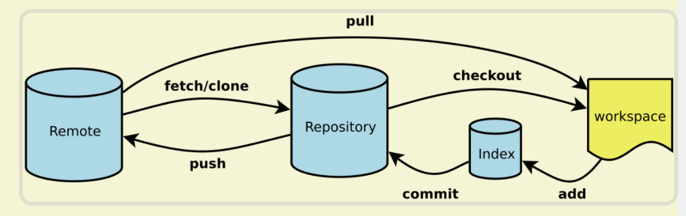

可以看到，`git fetch`是将远程主机的最新内容拉到本地，用户在检查了以后决定是否合并到工作本机分支中

而`git pull` 则是将远程主机的最新内容拉下来后直接合并，即：`git pull = git fetch + git merge`，这样可能会产生冲突，需要手动解决

在我们本地的`git`文件中对应也存储了`git`本地仓库分支的`commit ID `和 跟踪的远程分支的`commit ID`，对应文件如下：

-  .git/refs/head/[本地分支]
-  .git/refs/remotes/[正在跟踪的分支]

使用 `git fetch`更新代码，本地的库中`master`的`commitID`不变

但是与`git`上面关联的那个`orign/master`的`commit ID`发生改变

这时候我们本地相当于存储了两个代码的版本号，我们还要通过`merge`去合并这两个不同的代码版本

 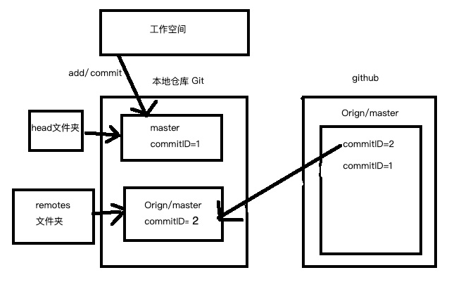

也就是`fetch`的时候本地的`master`没有变化，但是与远程仓关联的那个版本号被更新了，接下来就是在本地`merge`合并这两个版本号的代码

相比之下，使用`git pull`就更加简单粗暴，会将本地的代码更新至远程仓库里面最新的代码版本，如下图：

 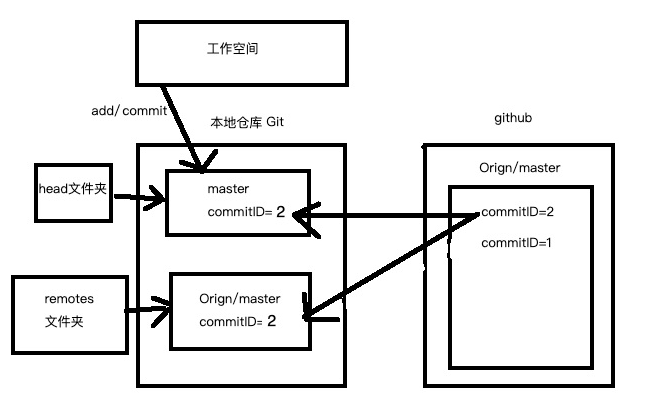


## 二、用法

一般远端仓库里有新的内容更新，当我们需要把新内容下载的时候，就使用到`git pull`或者`git fetch`命令

### fetch

用法如下：

```cmd
git fetch <远程主机名> <远程分支名>:<本地分支名>
```

例如从远程的`origin`仓库的`master`分支下载代码到本地并新建一个`temp`分支

```cmd
git fetch origin master:temp
```

如果上述没有冒号，则表示将远程`origin`仓库的`master`分支拉取下来到本地当前分支

这里`git fetch`不会进行合并，执行后需要手动执行`git merge`合并，如下：

```cmd
git merge temp
```


### pull

两者的用法十分相似，`pull`用法如下：

```cmd
git pull <远程主机名> <远程分支名>:<本地分支名>
```

例如将远程主机`origin`的`master`分支拉取过来，与本地的`branchtest`分支合并，命令如下：

```cmd
git pull origin master:branchtest
```

同样如果上述没有冒号，则表示将远程`origin`仓库的`master`分支拉取下来与本地当前分支合并


## 三、区别

相同点：

- 在作用上他们的功能是大致相同的，都是起到了更新代码的作用

不同点：

- git pull是相当于从远程仓库获取最新版本，然后再与本地分支merge，即git pull = git fetch + git merge
- 相比起来，git fetch 更安全也更符合实际要求，在 merge 前，我们可以查看更新情况，根据实际情况再决定是否合并


---
### 465. 说说你对git rebase 和 git merge的理解？以及它们的区别？

**难度**：★★☆☆☆ | **题型**：QA | **分类**：全部 / 工具

**题目**：


**参考答案**：
## 一、是什么

在使用 `git` 进行版本管理的项目中，当完成一个特性的开发并将其合并到 `master` 分支时，会有两种方式：

- git merge
- git rebase

`git rebase` 与 `git merge`都有相同的作用，都是将一个分支的提交合并到另一分支上，但是在原理上却不相同


用法上两者也十分的简单：

### git merge

将当前分支合并到指定分支，命令用法如下：

```cmd
git merge xxx
```


### git rebase

将当前分支移植到指定分支或指定`commit`之上，用法如下：

```cmd
git rebase -i <commit>
```

常见的参数有`--continue`，用于解决冲突之后，继续执行`rebase`

```cmd
git rebase --continue
```


## 二、分析

### git merge

通过`git merge`将当前分支与`xxx`分支合并，产生的新的`commit`对象有两个父节点

如果“指定分支”本身是当前分支的一个直接子节点，则会产生快照合并

举个例子，`bugfix`分支是从`maste`r分支分叉出来的，如下所示：

 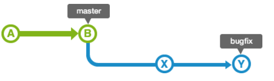

合并` bugfix`分支到`master`分支时，如果`master`分支的状态没有被更改过，即 `bugfix`分支的历史记录包含`master`分支所有的历史记录

所以通过把`master`分支的位置移动到`bugfix`的最新分支上，就完成合并

如果`master`分支的历史记录在创建`bugfix`分支后又有新的提交，如下情况：

 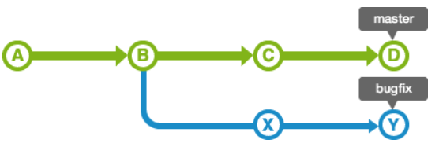

这时候使用`git merge`的时候，会生成一个新的提交，并且`master`分支的`HEAD`会移动到新的分支上，如下：

 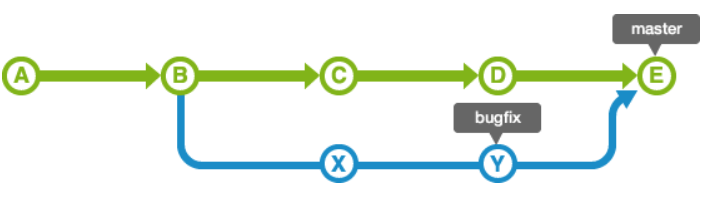


从上面可以看到，会把两个分支的最新快照以及二者最近的共同祖先进行三方合并，合并的结果是生成一个新的快照


### git rebase

同样，`master`分支的历史记录在创建`bugfix`分支后又有新的提交，如下情况：

 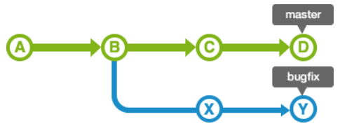

通过`git rebase`，会变成如下情况：

 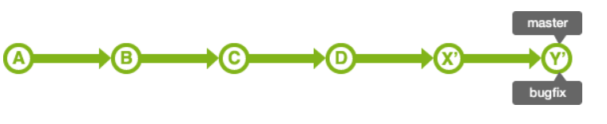

在移交过程中，如果发生冲突，需要修改各自的冲突，如下：

 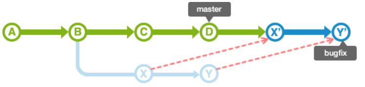

`rebase`之后，`master`的`HEAD`位置不变。因此，要合并`master`分支和`bugfix`分支

 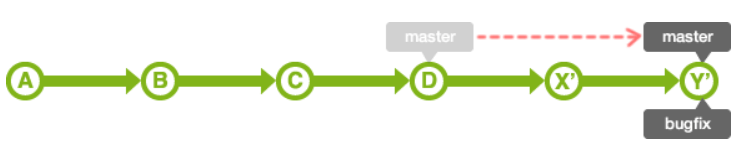

从上面可以看到，`rebase`会找到不同的分支的最近共同祖先，如上图的`B`

然后对比当前分支相对于该祖先的历次提交，提取相应的修改并存为临时文件（老的提交`X`和`Y`也没有被销毁，只是简单地不能再被访问或者使用）

然后将当前分支指向目标最新位置`D`, 然后将之前另存为临时文件的修改依序应用


## 三、区别

从上面可以看到，`merge`和`rebasea`都是合并历史记录，但是各自特性不同：

### merge

通过`merge`合并分支会新增一个`merge commit`，然后将两个分支的历史联系起来

其实是一种非破坏性的操作，对现有分支不会以任何方式被更改，但是会导致历史记录相对复杂


### rebase

`rebase `会将整个分支移动到另一个分支上，有效地整合了所有分支上的提交

主要的好处是历史记录更加清晰，是在原有提交的基础上将差异内容反映进去，消除了 ` git merge `所需的不必要的合并提交


---
### 480. npm 和 yarn有哪些不一样的地方？

**难度**：★★★☆☆ | **题型**：QA | **分类**：全部 / 工具

**题目**：


**参考答案**：
## 早期的npm

其实在最早期的`npm`版本(npm v2)，`npm`的设计可以说是非常的简单，在安装依赖的时候会将依赖放到 `node_modules`文件中。同时，如果某个直接依赖A依赖于其他的依赖包B，那么依赖B会作为间接依赖，安装到依赖A的文件夹`node_modules`中，然后可能多个包之间也会有出现同样的依赖递归的，如果项目一旦过大,那么必然会形成一棵巨大的依赖树，依赖包会出现重复，形成`嵌套地狱`。

那么我们如何去理解"嵌套地狱"呢？

- 首先,项目的依赖树的层级过于深，如果有问题不利于排查和调试
- 在依赖的分支中,可能会出现同样版本的相互依赖的问题

那么这样的重复问题会带来什么后果呢？

- 首先,会使得安装的结果占据了大量的空间资源,造成了资源的浪费
- 同时,因为安装的依赖重复,会造成在安装依赖时,安装时间过长
- 甚至是,因为目录层级过深,导致文件路径过长,会在`windows`系统下删除`node_modules`文件,出现删除不掉的情况

那么, 后面的版本是如何一步步进行优化的呢？后面会陆续的揭晓。


## npm or yarn 开发中的一点疑惑

你在实际的开发会不会出现这样的一些情况：

1. 当你项目依赖出现问题的时候，我们会不会是直接删除 `node_modules 和 lockfiles`依赖，再重新 `npm install`，删除大法是否真的好用？这样的使用方案会不会带来什么问题？
2. 把所有的依赖包都安装到`dependencies`中，对`devDependencies` 不区分会不会有问题?
3. 一个项目中，你使用 `yarn`，我使用`npm`，会不会有问题呢？
4. 还有一个问题，`lockfiles 文件` 我们提交代码的时候需不需要提交到仓库中呢？

## npm的安装机制和核心原理

我们可以先来看看 npm 的核心目标

> Bring the best of open source to you, your team and your company.

意思是 给你和你的团队、你的公司带来最好的开源库和依赖。 通过这句话,我们可以了解到 npm 最重要的一点就是安装和维护依赖。那么，让我们先来看一看`npm`的安装机制是怎样的呢？

### npm的安装机制

下面我们会通过一个流程图来具体学习`npm install`的安装机制

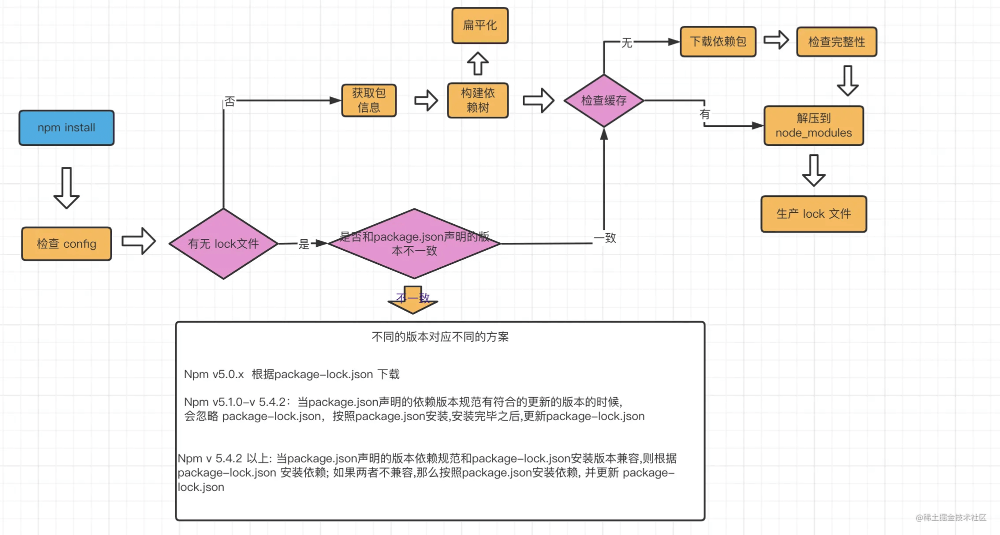

`npm install`执行之后，首先会检查和获取 `npm的配置`，这里的优先级为：

`项目级的.npmrc文件 > 用户级的 .npmrc文件 > 全局级的 .npmrc > npm内置的 .npmrc 文件`

然后检查项目中是否有 `package-lock.json`文件

- 如果有，检查 `package-lock.json`和 `package.json`声明的依赖是否一致：
  
  - 一致。直接使用`package-lock.json`中的信息,从网络或者缓存中加载依赖。
  - 不一致。根据上述流程中的不同版本进行处理。
- 如果没有，那么会根据`package.json`递归构建依赖树，然后就会根据构建好的依赖去下载完整的依赖资源，在下载的时候，会检查有没有相关的资源缓存：
  
  - 存在。直接解压到`node_modules`文件中。
  - 不存在。从npm远端仓库下载包，校验包的完整性，同时添加到缓存中，解压到 `node_modules`中。

最后，生成 `package-lock.json` 文件。

其实，在我们实际的项目开发中，使用npm作为团队的最佳实践: `同一个项目团队，应该保持npm 版本的一致性`。

从上面的安装流程，不知道大家注意到了一点没有，在实际的项目开发中，如果每次都去安装对应依赖时，如果相关的依赖包体积过大或者是依赖于网络，无疑会增加安装的时间成本。那么，缓存在这里的就是一个解决问题的好办法。

## yarn的出现

yarn 是一个由`Facebook`、`Google`、`Exponent`和`Tilde`构建的新的JavaScript包管理器。它的出现是为了解决历史上`npm`的某些不足(比如npm对于依赖的完整性和一致性的保证,以及npm安装过程中速度很慢的问题)

当npm还处于`v3`时期的时候，一个叫`yarn`的包管理工具横空出世。在2016年，npm还没有package-lock.json文件，安装的时候速度很慢，稳定性很差，`yarn`的出现很好的解决了一下的一些问题：

- **确定性:** 通过yarn.lock等机制，即使是不同的安装顺序，相同的依赖关系在任何的环境和容器中，都可以以相同的方式安装。(那么,此时的npm v5之前,并没有package-lock.json机制，只有默认并不会使用 npm-shrinkwrap.json)
  
- **采用模块扁平化的安装模式:** 将不同版本的依赖包，按照一定的策略，归结为单个版本。以避免创建多个版本造成工程的冗余(目前的npm也有相同的优化)
  
- **网络性能更好:** `yarn`采用了请求排队的理念，类似于并发池连接，能够更好的利用网络资源；同时也引入了一种安装失败的重试机制。
  
- **采用缓存机制，实现了离线模式** (目前的npm也有类似的实现)
  

我们可以来看一下 `yarn.lock`的结构：

```
"@babel/cli@^7.1.6", "@babel/cli@^7.5.5":
  version "7.8.4"
  resolved "http://npm.in.zhihu.com/@babel%2fcli/-/cli-7.8.4.tgz#505fb053721a98777b2b175323ea4f090b7d3c1c"
  integrity sha1-UF+wU3IamHd7KxdTI+pPCQt9PBw=
  dependencies:
    commander "^4.0.1"
    convert-source-map "^1.1.0"
    fs-readdir-recursive "^1.1.0"
    glob "^7.0.0"
    lodash "^4.17.13"
    make-dir "^2.1.0"
    slash "^2.0.0"
    source-map "^0.5.0"
  optionalDependencies:
    chokidar "^2.1.8"
```

熟悉npm的`package-lock.json`文件的朋友，可能一眼就看到了一些不同; `package-lock.json`采用的是`JSON`的结构，而`yarn`并没有采用这种结构，而是一种自定义的标记方式;我们可以看出新的自定义的方式，也同样保持了高度的可读性。

**相比于npm,Yarn另一个显著的区别就是yarn.lock的子依赖的版本不是固定的版本**。这其实就说明了一个问题：一个单独的`yarn.lock`的问题并不能确定`node_modules`的文件结构，还需要`package.json`的配合。

### yarn的安装机制

上面一小节我们对npm的安装机制有了一些基本的了解,现在让我们先来简单的看一下`Yarn`的安装理念。

简单来说, `Yarn`的安装大致分为5个步骤：

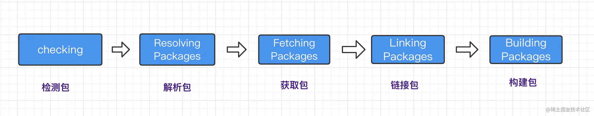

检测(checking) ---> 解析包(Resolving Packages) ---> 获取包(Fetching) ---> 链接包(Linking Packages) ---> 构建包(Building Packages)

那么接下来我们要开始具体分析这些过程中都做了哪些事情:

**检测包**

这一步，最主要的目的就是检测我们的项目中是否存在npm相关的文件,比如`package-lock.json`等;如果有,就会有相关的提示用户注意：这些文件可能会存在冲突。在这一步骤中
也会检测系统OS, CPU等信息。

**解析包**

这一步会解析依赖树中的每一个包的信息:

首先呢,获取到`首层依赖`: 也就是我们当前所处的项目中的`package.json`定义的`dependencies`、`devDependencies`、`optionalDependencies`的内容。

紧接着**会采用遍历首层依赖的方式来获取包的依赖信息**,以及递归查找每个依赖下嵌套依赖的版本信息，并将解析过的包和正在进行解析包呢`用Set数据结构进行存储`,这样就可以保证`同一版本范围内的包`不会进行重复的解析:

- 对于没有解析过的包A, 首次尝试从 `yarn.lock`中获取版本信息,并且标记为已解析
- 如果在`yarn.lock`中没有找到包A， 则向`Registry`发起请求获取满足版本范围内的已知的最高版本的包信息,获取之后将该包标记为已解析。

总之，经过解析包这一步之后呢,我们就已经确定了解析包的具体版本信息和包的下载地址。

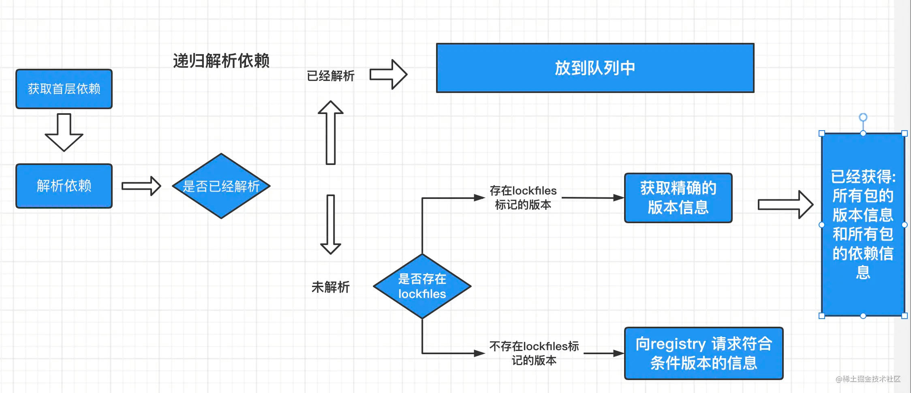

**获取包**

这一步首先我们会检查缓存中是否有当前依赖的包,同时呢将缓存中不存在的包下载到缓存的目录中。但是这里有一个小问题需要大家思考一下:

比如: 如何去判断缓存中有当前的依赖包呢？

**其实呢,在Yarn中会根据 cacheFolder+slug+node_modules+pkg.name 生成一个路径;判断系统中是否存在该path,如果存在证明已经有缓存,不用重新下载。这个path也就是依赖包缓存的具体路径。**

那么对于没有命中的缓存包呢？在 `Yarn` 中存在一个Fetch队列,按照具体的规则进行网络请求。如果下载的包是一个file协议,或者是相对路径,就说明指向一个本地目录,此时会调用Fetch From Local从离线缓存中获取包;否则调用 Fetch From External 获取包,最终获取的结果使用 fs.createWriteStream 写入到缓存目录。

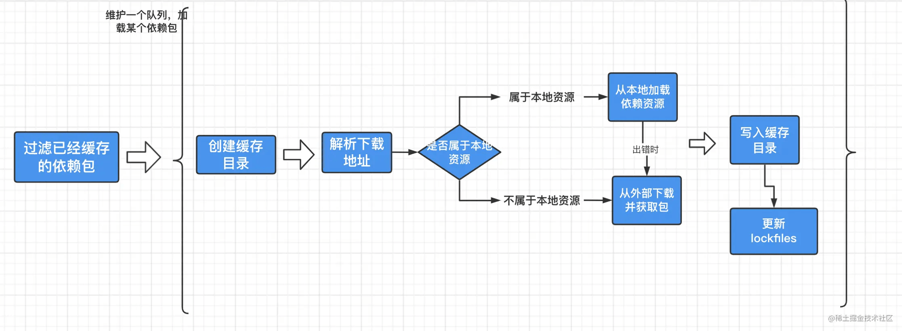

**链接包**

我们上一步已经把依赖放到了缓存目录,那么下一步,我们应该要做什么事情呢？是不是应该把项目中的依赖复制到`node_modules`目录下呢,没错;只不过此时需要遵循一个扁平化的原则。复制依赖之前, `Yarn`会先解析 `peerDepdencies`，如果找不到符合要求的`peerDepdencies`的包,会有 `warning`提示，并最终拷贝依赖到项目中。

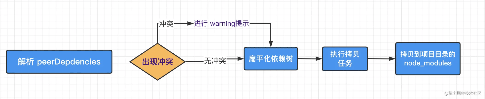

**构建包**

如果依赖包中存在二进制包需要进行编译，那么会在这一步进行。

**要点**：
- **性能**：Yarn 在早期版本的性能通常优于 NPM，但 NPM 在后续版本中也有了显著改进。
- **锁文件**：Yarn 和 NPM 都使用锁文件来确保依赖的一致性，但文件格式和实现略有不同。
- **工作区**：Yarn 的工作区功能早于 NPM 提供支持，但 NPM 也在 7.x 版本中加入了类似功能。
- **离线模式**：Yarn 提供更强大的离线模式。
- **安全性**：两者都提供了安全审计功能。


---
### 493. 说说Git 中 HEAD、工作树和索引之间的区别？

**难度**：★★★☆☆ | **题型**：QA | **分类**：全部 / 工具

**题目**：


**参考答案**：
## 一、HEAD

在`git`中，可以存在很多分支，其本质上是一个指向`commit`对象的可变指针，而`Head`是一个特别的指针，是一个指向你正在工作中的本地分支的指针

简单来讲，就是你现在在哪儿，HEAD 就指向哪儿

例如当前我们处于`master`分支，所以`HEAD`这个指针指向了`master`分支指针

 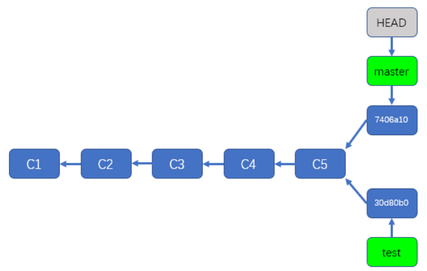

然后通过调用`git checkout test`切换到`test`分支，那么`HEAD`则指向`test`分支，如下图：

 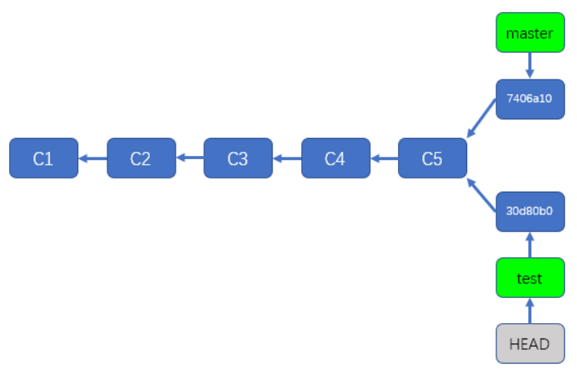

但我们在`test`分支再一次`commit`信息的时候，`HEAD`指针仍然指向了`test`分支指针，而`test`分支指针已经指向了最新创建的提交，如下图：

 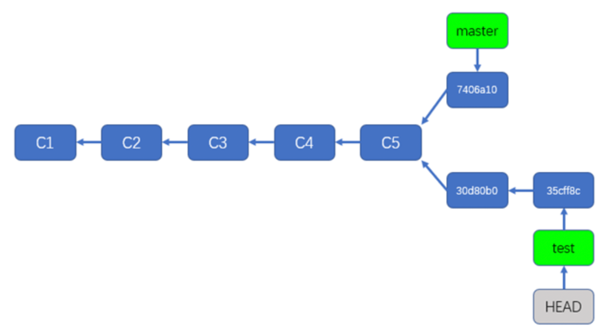

这个`HEAD`存储的位置就在`.git/HEAD`目录中，查看信息可以看到`HEAD`指向了另一个文件

```cmd
$ cat .git/HEAD
ref: refs/heads/master

$ cat .git/refs/heads/master
7406a10efcc169bbab17827aeda189aa20376f7f
```

这个文件的内容是一串哈希码，而这个哈希码正是`master`分支上最新的提交所对应的哈希码

所以，当我们切换分支的时候，`HEAD`指针通常指向我们所在的分支，当我们在某个分支上创建新的提交时，分支指针总是会指向当前分支的最新提交

所以，HEAD指针 ——–> 分支指针 ——–> 最新提交


## 二、工作树和索引

在`Git`管理下，大家实际操作的目录被称为工作树，也就是工作区域

在数据库和工作树之间有索引，索引是为了向数据库提交作准备的区域，也被称为暂存区域

 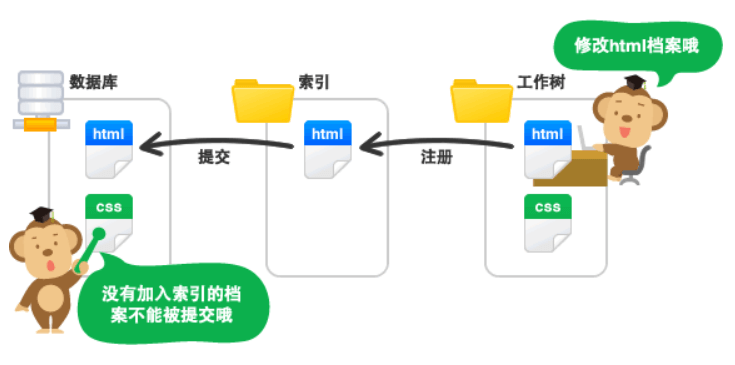

`Git`在执行提交的时候，不是直接将工作树的状态保存到数据库，而是将设置在中间索引区域的状态保存到数据库

因此，要提交文件，首先需要把文件加入到索引区域中。

所以，凭借中间的索引，可以避免工作树中不必要的文件提交，还可以将文件修改内容的一部分加入索引区域并提交


## 三、区别

从所在的位置来看：

- HEAD 指针通常指向我们所在的分支，当我们在某个分支上创建新的提交时，分支指针总是会指向当前分支的最新提交

- 工作树是查看和编辑的（源）文件的实际内容

- 索引是放置你想要提交给 git仓库文件的地方，如工作树的代码通过 git add 则添加到 git 索引中，通过git commit 则将索引区域的文件提交到 git 仓库中


---
### 568. 如何检查Javascript中的内存泄漏？

**难度**：★★☆☆☆ | **题型**：QA | **分类**：全部 / 工具

**题目**：


**参考答案**：
## 浏览器

Chrome 浏览器查看内存占用，按照以下步骤操作。

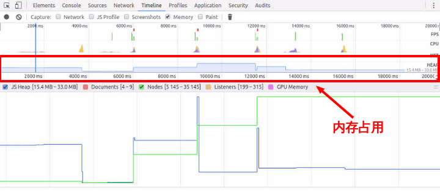

```
1、打开开发者工具，选择 Timeline 面板
2、在顶部的Capture字段里面勾选 Memory
3、点击左上角的录制按钮。
4、在页面上进行各种操作，模拟用户的使用情况。
5、一段时间后，点击对话框的 stop 按钮，面板上就会显示这段时间的内存占用情况。
```

如果内存占用基本平稳，接近水平，就说明不存在内存泄漏。

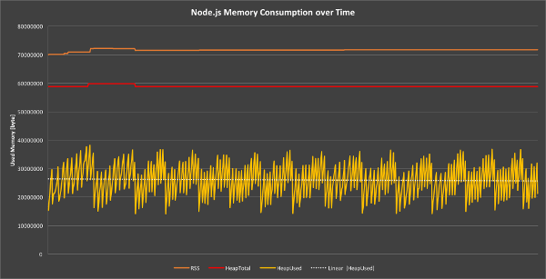

反之，就是内存泄漏了。


## 命令行

命令行可以使用 Node 提供的process.memoryUsage方法。

```js
console.log(process.memoryUsage());
// { rss: 27709440,
//  heapTotal: 5685248,
//  heapUsed: 3449392,
//  external: 8772 }
```

process.memoryUsage返回一个对象，包含了 Node 进程的内存占用信息。该对象包含四个字段，单位是字节，含义如下。

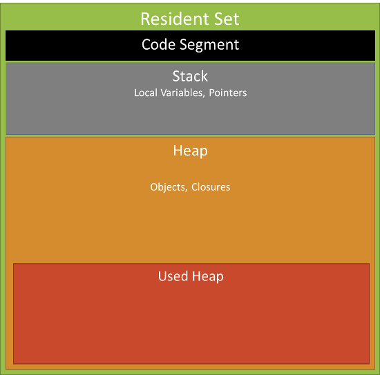

```
rss（resident set size）：所有内存占用，包括指令区和堆栈。
heapTotal："堆"占用的内存，包括用到的和没用到的。
heapUsed：用到的堆的部分。
external： V8 引擎内部的 C++ 对象占用的内存。
```

判断内存泄漏，以 `heapUsed` 字段为准。


---
### 668. 说说你对跨平台的理解

**难度**：★★★☆☆ | **题型**：QA | **分类**：全部 / 工具 / 跨端技术

**题目**：


**参考答案**：
我们知道，cpu 有不同的架构和指令集，上层也有不同的操作系统，一个系统的可执行文件在另一个系统上就是不可执行的，比如 windows 的 exe 文件在 mac 上就不能直接执行。不同的系统就是不同的运行平台。可执行文件是不跨平台的。

不同平台提供的 api 不同，所以代码逻辑可能也不同，需要不同平台单独维护代码。这样就带来了几个问题：

- 多平台各自开发，怎么保证功能是一致的
- 多平台各自开发，那是不是得各自测试，开发和测试的人力都是多份的

所以出现了跨平台的一些技术，目标是一份代码跑在任意平台。

我们先来看一些各领域的跨平台方案：

### 浏览器

操作系统不同，浏览器上跑的网页的代码确实同一份。浏览器就是一种历史悠久的跨平台方案。

网页跨平台不意味着浏览器也是跨平台的，浏览器的可执行文件还是每个平台单独开发和编译的，但是他们支持的网页解析逻辑一样，这样上面跑的网页就是跨平台的。

浏览器提供了一个容器，屏蔽了底层差异，提供了统一的 api（dom api），这样就可以实现同一份代码跑在不同平台的统一的容器里。这个容器叫做浏览器引擎，由 js 引擎、渲染引擎等构成。


### docker 

docker 是一种虚拟化技术，可以在操作系统之上加一个虚拟层，在这层之上划分一到多个容器，容器里再去跑系统、app，这样可以实现硬件和软件的分离，动态分配硬件资源给容器，并且方便 app 运行环境的整体迁移（保存成镜像）。


docker 很明显也是一种跨平台技术，同一个镜像可以跑在任何操作系统的 docker 上。只要不同操作系统实现同样的容器即可。

### jvm

java 是一门编译 + 解释的语言，java 源码编译成字节码，然后字节码直接在 vm 上解释执行。

java 为什么这么火呢？主要是因为跨平台。

c、c++ 这种语言写的代码需要编译成不同操作系统上的可执行文件来跑，而且每个平台的代码可能还不一样，需要写多份。

java 因为提供了 jvm 容器，只要把源码编译成 jvm 能解释的字节码就行了，而且 jdk 提供了统一的 api，分别由不同操作系统的底层 api 来实现，这样对于 java 代码来说，不同操作系统的代码是一致的。


jvm 也是通过容器的技术实现了一份代码跑在多个平台，而且 jre 提供了统一的 api，屏蔽掉了底层的差异。

### node、deno

node 和 deno 也是跨平台的技术，通过提供一套一致的 api，让其上的 js 代码可以跨平台。这些 api 也是不同平台各自实现的。


## electron

electron 内置了 chromium，并为其注入了 node 的 api 和一些 GUI 相关的 api，是基于两大跨平台技术综合而成的跨平台方案。基于这些方案的组合使得 electron 支持用前端技术开发桌面端。


## 跨平台方案的优缺点

跨平台方案的优点很明显，就是一份代码跑在不同平台的同样的容器内，不用不同平台单独开发，节省成本。

但是跨平台方案也有缺点：

- 因为多了一层容器，所以性能相比直接调用系统 api 会有所下降

- 为了实现多平台的一致，需要提供一套统一的 api，这套 api 有两个难题：
     - api 怎么设计。要综合不同平台的能力，取一个合适的集合来实现。设计上有一定难度。node、deno、java 都抽象了操作系统的能力，提供了各自的跨平台 api
 
     - 部分 api 很难做到多平台的一致性

     - 当容器没有提供的能力需要扩展的时候比较麻烦，比如 js 引擎的 bridge、 jvm 的 jni、node 的 c++ addon 等都是为这个容器扩展能力的方式
     
     


---
### 691. 说说你对低代码的了解

**难度**：★★★☆☆ | **题型**：QA | **分类**：全部 / 工具

**题目**：


**参考答案**：
低代码的热潮在几年前就火过，从阿里钉钉跨平台协作方式，再到飞书上的审批流程，以及目前我们接触到的表单审批、投票的模板，这些都是关于低代码的实现方式。随着企业数字化转型和云计算的不断发展，低代码平台又一次成为热门话题被越来越多的人讨论。

# 低代码平台概述

低代码开发平台，英文全称“Low-Code Development Platform”，简称 LCDP，是通过少量代码或零代码就可以快速生成新应用，实现业务应用的快速交付的应用平台。广义上的低代码平台包括低代码和零代码，它们都属于 APaaS（应用平台即服务）。

低代码这一概念首次出现于 20 世纪 80 年代，在近 40 年的历程中，整个发展经历如下图所示：


△（图片来源于网络）

第一阶段是探索期，主要是基于 20 世纪 80 年代就有美国公司和实验室开始研究程序可视化编程这个领域，做出了4GL “第四代编程语言”，后来衍生成 VPL（Visual Programming Language可视化编程语言）。

第二阶段是发展期，2014年，由研究机构 Forrester Research 正式提出了“低代码/无代码”的概念。

第三阶段是爆发期，2018年，荷兰公司Mendix以7亿美元被西门子收购、美国低代码独角兽企业 Outsystem 获得1.5亿美元的融资。此次收购事件以及融资事件的发生将低代码市场带入资本方的视野，低代码市场开始进入爆发期。

低代码平台代替了程序员开发数千行具有复杂代码和语法的行。它的作用是让开发人员以及业务人员，通过“拖拉拽”的方式使用平台，来创建完整的应用程序。同时突破了传统业务之间沟通的复杂度和交付时间周期长的特点，能够持续进行开发。

# 低代码、无代码

低代码平台包括低代码和无代码，二者区别如下：

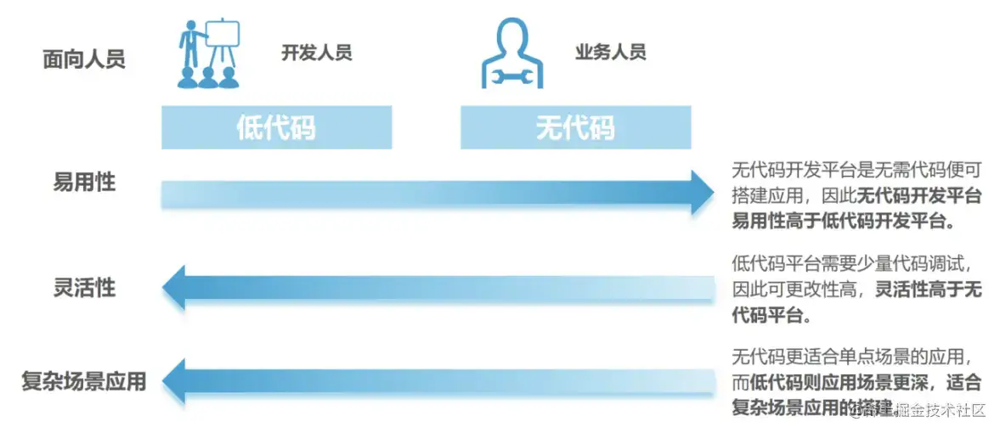

△（图片来源于网络）

-   无代码：主要面向业务人员，零开发经验的业务人员通过拖拽等方式，无需编写代码，即可快速搭建各种应用。无代码更适合单点场景的应用，平台应用性高于低代码。
    
-   低代码：主要面向开发人员，通过自动代码生成和可视化编程，只需要少量代码，即可快速搭建各种应用。低代码的市场占有率高，适合复杂场景交互应用的搭建。平台灵活性高于无代码。
    

但本质上低代码与无代码都能够降低开发门槛、快速响应业务需求、提升开发效率。

接下来我们来看看具体的低代码平台技术路线。

# 低代码平台的技术路线

因低代码平台源自于集成开发环境（Integrated Development Environment，IDE）的可视化、模块化与集成化特点，同时根据目标人群对象的使用，大体分为两条线路：第一条为业务复用型，主要包含应用开发平台、智能表格、SAAS 聚合，特点是数据与逻辑完全分离、各自独立的模型驱动，适合开发人员。第二条为开发工具型，主要包含在线 IDE、DSL 开发框架、组件代码库，特点是数据与储存结构合一的表单驱动，适合业务人员使用。

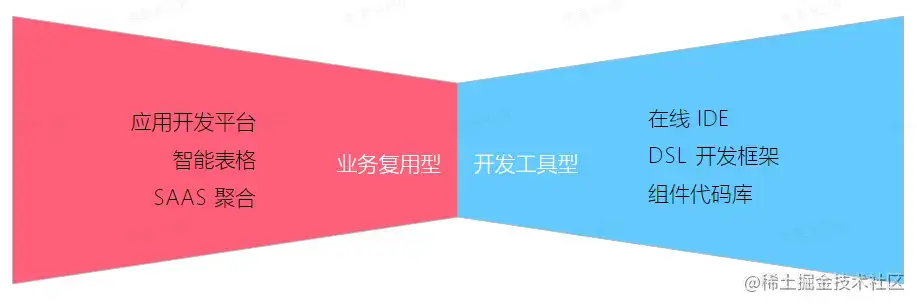

△（图片来源于网络）

#### 适合开发人员的技术路线

我们首先来看下适用于开发人员的技术路线模型驱动。由模型驱动对软件所涉及到的功能进行建模，然后以应用开发平台为核心，承载各种开发工具和复杂逻辑，并将其可视化。然后辅以少量代码，就能够作为技术中台核心帮助开发者快速产出一整套系符合企业需求的系统。具体处理场景示例如下：

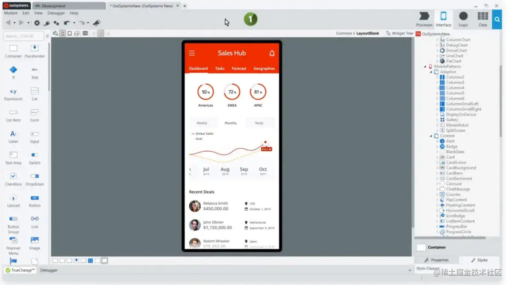

开发人员通过图中左右两边进行操作，左边是一些特定组件，拖到中间的画布里面。图中的板块都是相互独立的，需要通过右边的语法把它们进行关联，再生成所需要的场景化应用，这是模型驱动的一种方式。

#### 适合业务人员的技术路线

该路线是非IT模式，以表单驱动数据为核心，通过拖拽构建数据表方式展开业务分析设计。以做到完全去IDE化，像搭积木一样按流程构建程序逻辑。适合完全零基础人员，比如人事行政进行资料归档、OA审批，销售人员客户管理等。

处理场景示例如下：

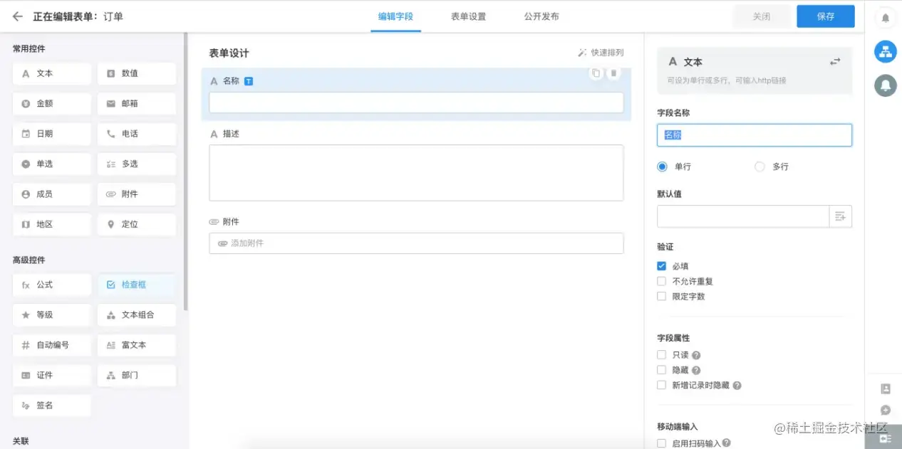

左边是拖拽组件，中间是画布，右边是编辑属性。我们通过左边拖拽表单将事件排列在上面，进行简单的数据收集。右边是对表单进行数据处理，比如标题、宽度、必填线等设置。适合业务人员去操作填写数据表格，快速生成自己想要的数据收集，这是表单驱动的一种方式。

对于这类技术路线的产品，又拍云在2020年曾经开发过一套，我们接下来通过又拍云低代码产品来看一下表单驱动的具体应用场景。

# 低代码可视化拖拽平台的应用

该产品使用拖拉拽的方式，生成所需要的表单。生成表单后，显示面板会把表单数组包括的 json 数据拿出，再通过它识别组件的顺序进行编译后展示。产品页面结构如下：

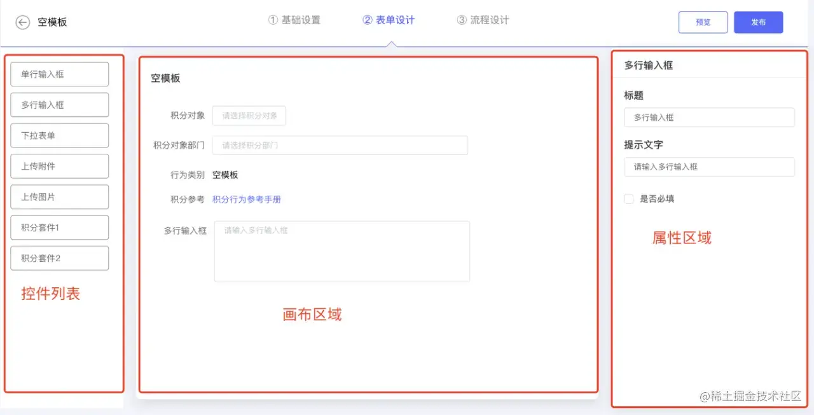

△ 产品页面结构

#### 编辑器实现思路

该产品的编辑器实现思路如下：

首先，使用数组 componentData 维护编辑器中的数据。

其次，将组件通过拖拽事件，拖拽到画布上进行移动布局。当然一个组件要设为可拖拽，那就需要为它添加 draggable 属性，而且在将组件列表中的组件拖拽到画布中时还会经历两个关键事件：

-   dragstart 事件
    
-   drop 事件
    

**dragstart 事件**，它在拖拽刚开始时触发，主要用于将拖拽的组件信息传递给布，下图是示例代码：


**drop 事件**，在拖拽结束时触发，主要作用是用于接收拖拽的组件信息，示例代码如下图：


之后使用 push() 方法将新的组件数据添加到 componentData。比如又拍云使用的 VLE 框架就是通过属性来识别我们想要的组件。具体为组件 V-item 是文本数据宽，可以通过其对应的属性值进行上下数据绑定，把数据填到结成数组里面。

组件数据如下：

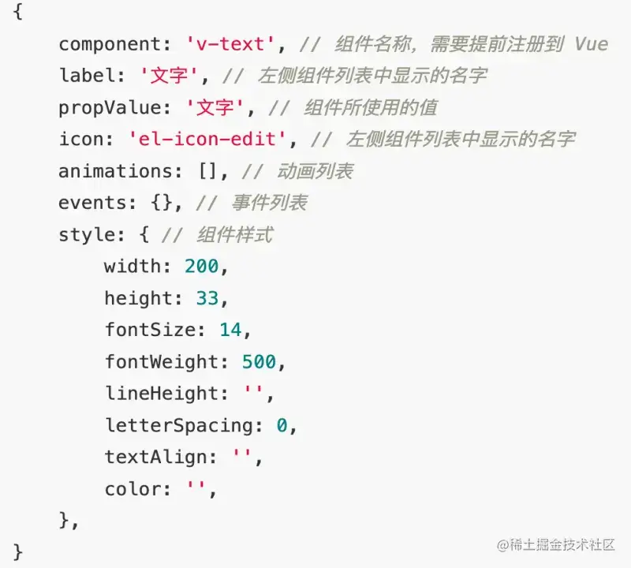

最后，我们使用 v-for 指令遍历 componentData，主要通过 is 属性来识别出真正要渲染的是哪个组件，将每个组件逐个渲染到画布。例如要渲染的组件数据是 { component: 'v-text' }，则  会被转换为 。

编辑器渲染的核心代码如下所示：

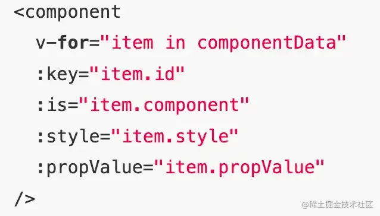

全部完成后我们来看一下整体，如果将画布设为相对定位 position: relative，然后将每个组件设为绝对定位 position: absolute，只要通过监听三个事件就可以进行移动，这三个事件分别为：

-   Mousedown 事件，在组件上按下鼠标时，记录组件当前的位置，即 css 中的 left 和 top。
    
-   Mousemove 事件，每次鼠标移动时，都用当前最新的 left 和 top 减去最开始的 left 和 top，从而计算出移动距离，再改变组件位置。
    
-   Mouseup 事件，鼠标抬起时结束移动。
    

以上就是编译器的整体实现思路。

# 浅谈低代码平台的未来

根据咨询机构 Gartner 的市场分析来看，2023 年全球超过 50% 的大中型企业将把低代码应用平台作为主要的占领应用平台之一。预计到2024年，低代码应用程序开发将占总应用开发的65%以上。这就引出了两个问题：传统的软件开发会被取代吗？低代码是未来的趋势吗？

实际上，低代码开发并不会取代传统的软件开发，但它将改变在某些领域中的软件开发，改变那些重复低效的业务，这意味着公司不需要为这种业务招聘大量的开发人员，而是安排更多的专业软件开发人员面向客户的需求以及复杂和独特的软件开发问题。

尽管相较于原生的开发模式，低代码开发平台能够显著提升开发效率，尤其适合业务变化快、预算有限、开发时间紧迫的企业应用场景；但是低代码平台也有明显的局限性，至少就目前来说，它主要用于搭建企业软件。因为此类软件架构是有一定规律的，但娱乐、社交等软件开发比较深层交互的东西低代码还是无法实现的。


---
### 710. 说说Git中 fork, clone,branch这三个概念，有什么区别?

**难度**：★★★☆☆ | **题型**：QA | **分类**：全部 / 工具

**题目**：


**参考答案**：
## 一、是什么

### fork

`fork`，英语翻译过来就是叉子，动词形式则是分叉，如下图，从左到右，一条直线变成多条直线

 

转到`git`仓库中，`fork`则可以代表分叉、克隆 出一个（仓库的）新拷贝

 

包含了原来的仓库（即upstream repository，上游仓库）所有内容，如分支、Tag、提交

如果想将你的修改合并到原项目中时，可以通过的 Pull Request 把你的提交贡献回 原仓库

### clone

`clone`，译为克隆，它的作用是将文件从远程代码仓下载到本地，从而形成一个本地代码仓

执行`clone`命令后，会在当前目录下创建一个名为`xxx`的目录，并在这个目录下初始化一个 `.git` 文件夹，然后从中读取最新版本的文件的拷贝

默认配置下远程 `Git` 仓库中的每一个文件的每一个版本都将被拉取下来

### branch

`branch`，译为分支，其作用简单而言就是开启另一个分支， 使用分支意味着你可以把你的工作从开发主线上分离开来，以免影响开发主线

` Git` 处理分支的方式十分轻量，创建新分支这一操作几乎能在瞬间完成，并且在不同分支之间的切换操作也是一样便捷

在我们开发中，默认只有一条`master`分支，如下图所示：

 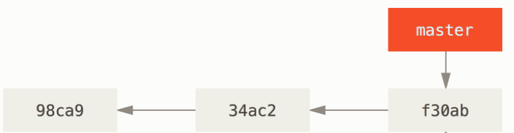

通过`git branch `可以创建一个分支，但并不会自动切换到新分支中去

 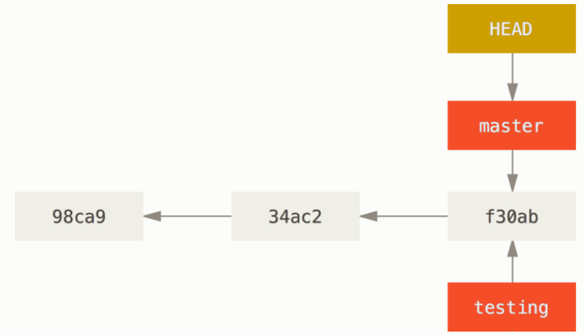

通过`git checkout`可以切换到另一个`testing`分支

 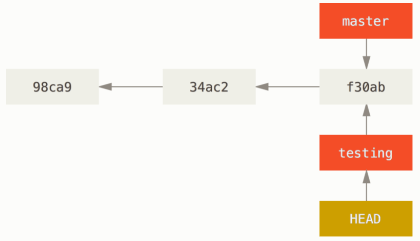


## 二、如何使用

### fork

当你在`github`发现感兴趣开源项目的时候，可以通过点击`github`仓库中右上角`fork`标识的按钮，如下图：

 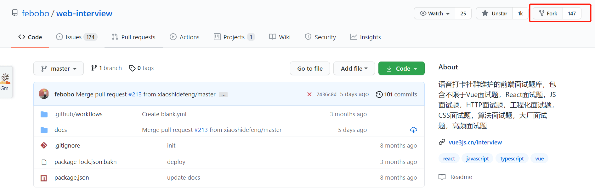

点击这个操作后会将这个仓库的文件、提交历史、issues和其余东西的仓库复制到自己的`github`仓库中，而你本地仓库是不会存在任何更改

然后你就可以通过`git clone`对你这个复制的远程仓库进行克隆

后续更改任何东西都可以在本地完成，如`git add`、`git commit`一系列的操作，然后通过`push`命令推到自己的远程仓库

如果希望对方接受你的修改，可以通过发送`pull requests`给对方，如果对方接受。则会将你的修改内容更新到仓库中

 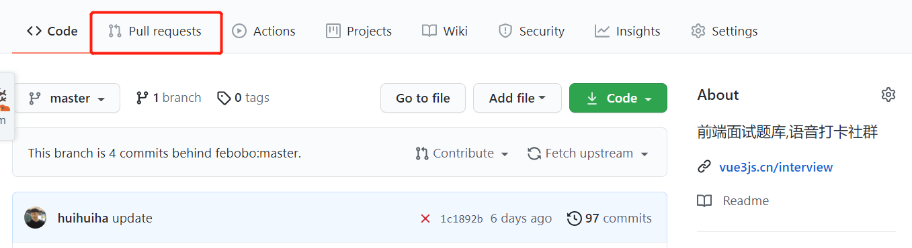

整体流程如下图：

 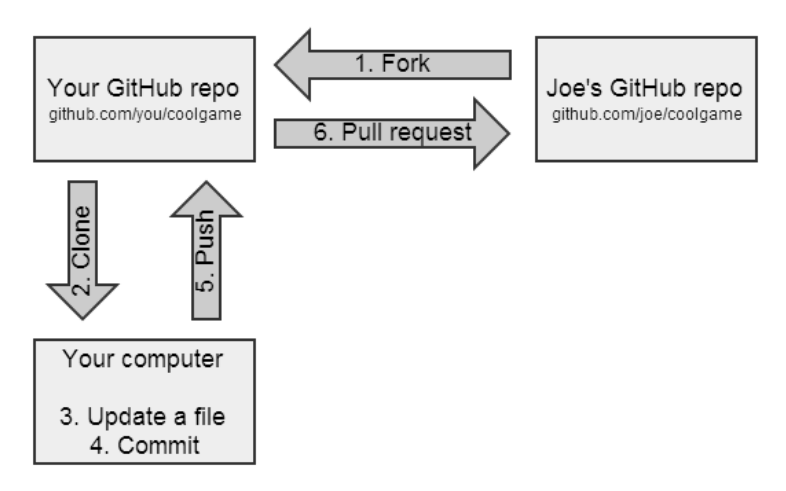


### clone

在`github`中，开源项目右侧存在`code`按钮，点击后则会显示开源项目`url`信息，如下图所示：

 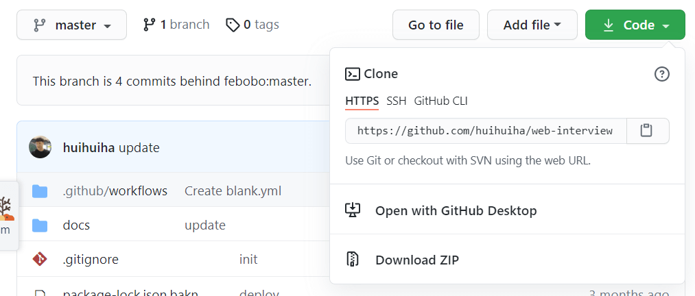

通过`git clone xxx`则能完成远程项目的下载


### branch

可通过`git branch`进行查看当前的分支状态，

如果给了`--list`，或者没有非选项参数，现有的分支将被列出；当前的分支将以绿色突出显示，并标有星号

以及通过`git branch`创建一个新的分支出来


## 三、区别

其三者区别如下：

- fork 只能对代码仓进行操作，且 fork 不属于 git 的命令，通常用于代码仓托管平台的一种“操作”
- clone 是 git 的一种命令，它的作用是将文件从远程代码仓下载到本地，从而形成一个本地代码仓
- branch 特征与 fork 很类似，fork 得到的是一个新的、自己的代码仓，而 branch 得到的是一个代码仓的一个新分支


---
### 777. 说说你对版本管理的理解？

**难度**：★☆☆☆☆ | **题型**：QA | **分类**：全部 / 工具

**题目**：


**参考答案**：
版本控制（Version control），是维护工程蓝图的标准作法，能追踪工程蓝图从诞生一直到定案的过程。此外，版本控制也是一种软件工程技巧，借此能在软件开发的过程中，确保由不同人所编辑的同一程序文件都得到同步

透过文档控制，能记录任何工程项目内各个模块的改动历程，并为每次改动编上序号

一种简单的版本控制形式如下：赋给图的初版一个版本等级“A”。当做了第一次改变后，版本等级改为“B”，以此类推

版本控制能提供项目的设计者，将设计恢复到之前任一状态的选择权

简言之，你的修改只要提到到版本控制系统，基本都可以找回，版本控制系统就像一台时光机器，可以让你回到任何一个时间点


---
### 778. 说说 git 发生冲突的场景？如何解决？

**难度**：★★★☆☆ | **题型**：QA | **分类**：全部 / 工具

**题目**：


**参考答案**：
## 一、是什么

一般情况下，出现分支的场景有如下：

- 多个分支代码合并到一个分支时
- 多个分支向同一个远端分支推送

具体情况就是，多个分支修改了同一个文件（任何地方）或者多个分支修改了同一个文件的名称

如果两个分支中分别修改了不同文件中的部分，是不会产生冲突，直接合并即可

应用在命令中，就是`push`、`pull`、`stash`、`rebase`等命令下都有可能产生冲突情况，从本质上来讲，都是`merge`和`patch`（应用补丁）时产生冲突


## 二、分析

在本地主分值`master`创建一个`a.txt`文件，文件起始位置写上`master commit`，如下：

 

然后提交到仓库：

- git add a.txt
- git commit -m 'master first commit'

创建一个新的分支`featurel1`分支，并进行切换，如下：

```cmd
git checkout -b featurel1
```

然后修改`a.txt`文件首行文字为 `featurel commit`，然后添加到暂存区，并开始进行提交到仓库：

- git add a.txt
- git commit -m 'featurel  first change'

然后通过`git checkout master`切换到主分支，通过`git merge`进行合并，发现不会冲突

此时`a.txt`文件的内容变成`featurel commit`，没有出现冲突情况，这是因为`git`在内部发生了快速合并

> 如果当前分支的每一个提交(commit)都已经存在另一个分支里了，git 就会执行一个“快速向前”(fast forward)操作
>
> git 不创建任何新的提交(commit)，只是将当前分支指向合并进来的分支

如果此时切换到`featurel`分支，将文件的内容修改成`featrue second commit`，然后提交到本地仓库

然后切换到主分支，如果此时在`a.txt`文件再次修改，修改成`mastet second commit`，然后再次提交到本地仓库

此时，`master`分支和`feature1`分支各自都分别有新的提交，变成了下图所示：

 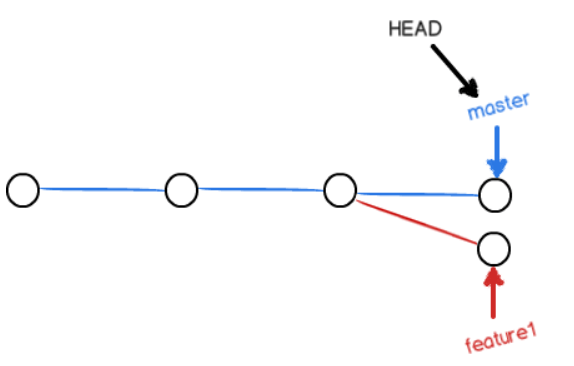

这种情况下，无法执行快速合并，只能试图把各自的修改合并起来，但这种合并就可能会有冲突

现在通过`git merge featurel`进行分支合并，如下所示：

 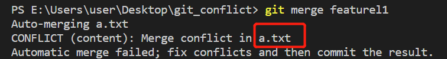

从冲突信息可以看到，`a.txt`发生冲突，必须手动解决冲突之后再提交

而`git status`同样可以告知我们冲突的文件：

 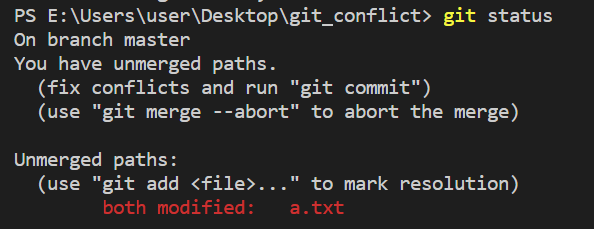

打开`a.txt`文件，可以看到如下内容：

 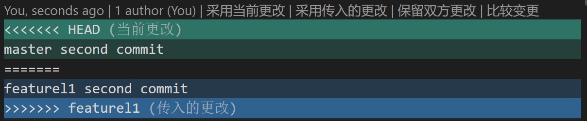

`git`用`<<<<<<<`，`=======`，`>>>>>>>`标记出不同分支的内容：

- <<<<<<< 和 ======= 之间的区域就是当前更改的内容
- ======= 和 >>>>>>> 之间的区域就是传入进来更改的内容

现在要做的事情就是将冲突的内容进行更改，对每个文件使用 `git add` 命令来将其标记为冲突已解决。 一旦暂存这些原本有冲突的文件，`Git `就会将它们标记为冲突已解决然后再提交：

- git add a.txt
- git commit -m "conflict fixed"

此时`master`分支和`feature1`分支变成了下图所示：

 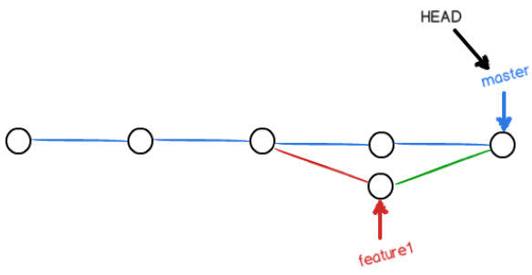

使用`git log`命令可以看到合并的信息：

 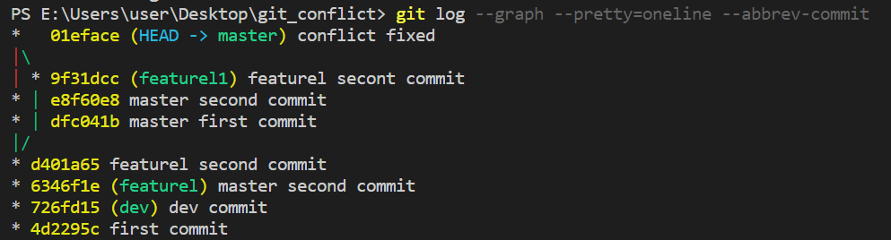


## 三、总结

当`Git`无法自动合并分支时，就必须首先解决冲突，解决冲突后，再提交，合并完成

解决冲突就是把`Git`合并失败的文件手动编辑为我们希望的内容，再提交


---
### 785. 数据Mock是什么？

**难度**：★☆☆☆☆ | **题型**：QA | **分类**：全部 / 工具

**题目**：


**参考答案**：
Mock 数据是前端开发过程中必不可少的一环，是分离前后端开发的关键链路。 

通过预先跟服务器端约定好的接口，模拟请求数据甚至逻辑，能够让前端开发独立自主，不会被服务端的开发所阻塞。

前后端同时开发的时候，后端接口数据没有出来，前端可以mock假数据，模拟开发。

Mock.js 是常用的辅助生成模拟数据的三方库，借助他可以提升我们的 mock 数据能力。


---
### 882. 说说 Eslint 进行代码检查的原理

**难度**：★★★☆☆ | **题型**：QA | **分类**：全部 / 工具

**题目**：


**参考答案**：
**ESLint** 的工作原理是通过解析代码，生成抽象语法树（AST），然后基于一系列的规则进行检查，最后输出代码中的潜在问题、风格不一致等。

### **ESLint 的工作原理**

1. **解析代码（Parsing）**：
   - ESLint 会使用一个解析器（通常是 **Espree**，它是基于 **Acorn** 的）将源代码解析为抽象语法树（AST）。AST 是一种描述源代码结构的树形数据结构，其中的每个节点表示代码中的不同结构（如语句、表达式、标识符等）。
   - ESLint 支持 JavaScript、TypeScript 和其他语言的语法，用户可以配置解析器（例如，`@typescript-eslint/parser` 来解析 TypeScript）。

   例如，ESLint 会把以下代码：
   ```javascript
   const x = 5;
   console.log(x);
   ```
   解析为 AST 结构，节点会表示出常量声明、赋值和函数调用等内容。

2. **加载规则（Rule Loading）**：
   - ESLint 会加载一系列配置的规则，通常通过 `.eslintrc` 配置文件或其他配置文件来定义。规则可以是内置的，也可以是通过插件提供的。
   - ESLint 的规则是功能性代码的集合，规则会遍历 AST，根据代码的结构进行检查。如果代码违反了某个规则，就会触发警告或错误。

3. **规则应用（Rule Application）**：
   - 在 AST 解析后，ESLint 会逐个规则检查 AST 中的每个节点。例如，如果你有一个规则要求函数参数必须是小写的，那么 ESLint 会遍历 AST，查找所有函数参数，并验证它们的名称。
   - 每个规则都可以自定义其严重性等级（`error`, `warn`, `off`），并且规则可以根据开发者需求被关闭、调整或扩展。

   例如，检查如下规则：
   - `no-unused-vars`：检查是否有未使用的变量。
   - `eqeqeq`：要求使用严格等于（`===`）而不是非严格等于（`==`）。
   - `semi`：强制在语句的末尾加分号。

   规则在执行时会检查 AST 中的相应节点，判断其是否符合规则要求。

4. **生成报告（Reporting）**：
   - ESLint 会将代码中发现的问题根据规则的配置生成报告。报告中会指出问题的类型、出现的位置（如行号、列号），以及提示开发者如何修复。
   - 如果启用了自动修复功能（`--fix`），ESLint 会尝试修复一些简单的问题（如缺少分号、格式化代码等）。

   例如，下面的代码会违反 `no-unused-vars` 规则：
   ```javascript
   const x = 5;
   console.log('Hello');
   ```
   ESLint 会报告 `x` 变量未被使用，并指出行号。

### **ESLint 的工作流程**

1. **获取源代码**：ESLint 会获取待检查的源代码，可以是 JavaScript、TypeScript 或其他支持的语言。

2. **解析源代码**：使用解析器将源代码转换为抽象语法树（AST）。

3. **加载规则**：根据配置文件加载规则，检查代码是否符合这些规则。

4. **执行规则检查**：针对每个 AST 节点，执行各个规则并检查是否符合规定。

5. **生成结果**：ESLint 根据规则的检查结果生成报告，展示哪些地方违反了规则，提供详细的错误信息和修复建议。

6. **修复代码（可选）**：如果启用了自动修复功能，ESLint 可以修复一些简单的代码问题。

### **ESLint 配置与插件**

- **配置文件**：
  ESLint 通过配置文件（如 `.eslintrc.js`、`.eslintrc.json` 等）来管理规则、解析器、环境等信息。常见的配置选项包括：
  - `rules`：启用的规则及其配置。
  - `env`：指定环境（如浏览器、Node.js）。
  - `extends`：继承其他配置（如 Airbnb 风格）。
  - `parser`：指定解析器（如 `@typescript-eslint/parser`）。

- **插件和扩展**：
  ESLint 支持插件机制，用户可以安装和使用第三方插件（如 `eslint-plugin-react`、`eslint-plugin-import`）来扩展规则。插件可以定义额外的规则，甚至添加自定义的解析器和环境配置。

### **常见的 ESLint 规则**
- **代码质量相关**：
  - `no-unused-vars`: 禁止声明未使用的变量。
  - `eqeqeq`: 强制使用严格相等 `===`。
  - `no-console`: 禁止使用 `console`。
  - `no-debugger`: 禁止使用 `debugger`。

- **代码风格相关**：
  - `semi`: 强制使用分号。
  - `quotes`: 强制使用单引号或双引号。
  - `indent`: 强制使用一致的缩进（如 2 空格或 4 空格）。

- **最佳实践相关**：
  - `curly`: 强制所有控制语句使用大括号（即使它们的代码块只有一行）。
  - `no-eval`: 禁止使用 `eval()`。

**要点**：
- **ESLint** 是通过解析代码生成抽象语法树（AST），并基于一系列配置的规则来检查代码质量和风格。
- ESLint 的规则应用是逐个 AST 节点进行的，检查是否符合规定的代码规范。
- 配置文件允许开发者根据项目需求自定义规则、解析器和环境配置，灵活应用。
- 自动修复功能使得 ESLint 不仅能够报告问题，还能自动修复一些简单的代码问题。

---
### 887. 说说你对Git的理解？

**难度**：★☆☆☆☆ | **题型**：QA | **分类**：全部 / 工具

**题目**：


**参考答案**：
## 一、是什么

git，是一个分布式版本控制软件，最初目的是为更好地管理`Linux`内核开发而设计

分布式版本控制系统的客户端并不只提取最新版本的文件快照，而是把代码仓库完整地镜像下来。这么一来，任何一处协同工作用的服务器发生故障，事后都可以用任何一个镜像出来的本地仓库恢复

 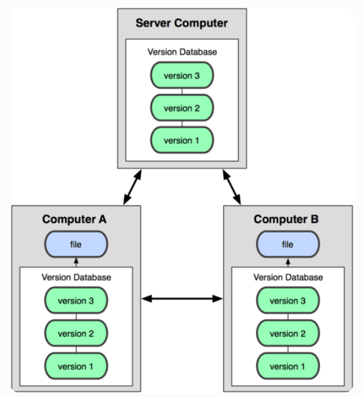

项目开始，只有一个原始版仓库，别的机器可以`clone`这个原始版本库，那么所有`clone`的机器，它们的版本库其实都是一样的，并没有主次之分

所以在实现团队协作的时候，只要有一台电脑充当服务器的角色，其他每个人都从这个“服务器”仓库`clone`一份到自己的电脑上，并且各自把各自的提交推送到服务器仓库里，也从服务器仓库中拉取别人的提交

`github`实际就可以充当这个服务器角色，其是一个开源协作社区，提供`Git`仓库托管服务，既可以让别人参与你的开源项目，也可以参与别人的开源项目


## 二、工作原理

当我们通过`git init`创建或者`git clone`一个项目的时候，项目目录会隐藏一个`.git`子目录，其作用是用来跟踪管理版本库的

`Git` 中所有数据在存储前都计算校验和，然后以校验和来引用，所以在我们修改或者删除文件的时候，`git`能够知道

`Git `用以计算校验和的机制叫做 SHA-1 散列（hash，哈希）， 这是一个由 40 个十六进制字符（0-9 和 a-f）组成字符串，基于 Git 中文件的内容或目录结构计算出来，如下：

```text
24b9da6552252987aa493b52f8696cd6d3b00373
```

当我们修改文件的时候，`git`就会修改文件的状态，可以通过`git status`进行查询，状态情况如下：

- 已修改（modified）：表示修改了文件，但还没保存到数据库中。
- 已暂存（staged）：表示对一个已修改文件的当前版本做了标记，使之包含在下次提交的快照中。
- 已提交（committed）：表示数据已经安全的保存在本地数据库中。

文件状态对应的，不同状态的文件在` Git `中处于不同的工作区域，主要分成了四部分：

- 工作区：相当于本地写代码的区域，如 git clone 一个项目到本地，相当于本地克隆了远程仓库项目的一个副本
- 暂存区：暂存区是一个文件，保存了下次将提交的文件列表信息，一般在 Git 仓库目录中
- 本地仓库：提交更新，找到暂存区域的文件，将快照永久性存储到 Git 本地仓库
- 远程仓库：远程的仓库，如 github

 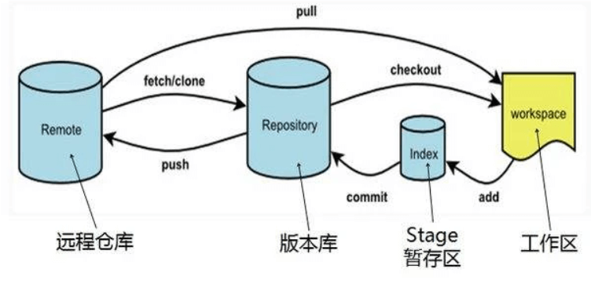


## 三、命令

从上图可以看到，`git`日常简单的使用就只有上图6个命令：

- add
- commit 
- push
- pull
- clone
- checkout

但实际上还有很多命令，如果想要熟练使用，还有60个多命令，通过这些命令的配合使用，能够提高个人工作效率和团队协助能力


---
### 902. 了解语义化版本 SemVer（Semantic Versioning）吗？

**难度**：★★☆☆☆ | **题型**：QA | **分类**：全部 / 工具

**题目**：


**参考答案**：
Semantic Versioning（语义化版本控制）是一种版本控制规范，旨在帮助开发者清晰地表达软件版本之间的变化，并确保版本更新对用户的影响可预见和可管理。SemVer 的核心在于使用三段式版本号：`MAJOR.MINOR.PATCH`。

### **版本号结构**

1. **MAJOR**（主版本号）
   - **变更**：当你做了不兼容的 API 修改时。
   - **示例**：`2.0.0`，`3.0.0`

2. **MINOR**（次版本号）
   - **变更**：当你在不破坏向后兼容的情况下添加功能时。
   - **示例**：`1.1.0`，`1.2.0`

3. **PATCH**（修订号）
   - **变更**：当你做了向后兼容的问题修复时。
   - **示例**：`1.0.1`，`1.0.2`

### **版本号附加信息**

- **预发布版本**：用 `-` 后缀来标识预发布阶段版本，比如 `1.0.0-alpha.1`。
- **构建元数据**：用 `+` 后缀来附加构建信息，比如 `1.0.0+20130313144700`。

### **遵循 SemVer 的好处**

- **清晰的变化记录**：通过主版本号、次版本号和修订号，开发者可以迅速了解软件的变化程度。
- **向后兼容性**：明确声明了变更的兼容性，用户可以根据版本号来判断更新的影响。
- **可靠的版本管理**：通过预发布和构建元数据，提供了更多版本管理的灵活性和信息。

### **版本更新**

在升级版本时，常常使用一些符号来指定允许升级的范围，其中包括 ^ 和 ~ 等。

- ^ 表示向后兼容地升级版本号，只允许升级到次版本号或修订版本号，不允许升级到主版本号。
- ~ 表示只允许升级到修订版本号，不允许升级到次版本号或主版本号。

例如，对于版本号为 1.2.3：

- ^1.2.3 允许升级到 1.2.4、1.3.0 等修订号或次版号的版本，但不允许升级到 2.0.0。
- ~1.2.3 只允许升级到 1.2.4、1.2.5 等修订版本号的版本，但不允许升级到 1.3.0、2.0.0 等更高的版本。


**要点**：
Semantic Versioning 提供了一种标准化的方式来表示版本号的变化，使得版本管理更加透明和可靠，有助于开发者和用户之间更好地沟通和管理版本更新。

---
### 914. babel 和 babel ployfill 有什么关系？

**难度**：★★★☆☆ | **题型**：QA | **分类**：全部 / 工具

**题目**：


**参考答案**：
* 先来理解下 babel 到底是做什么的？

简单来讲，babel解决语法层面的问题。用于将ES6+的高级语法转为ES5。

* babel polyfill 又是做什么的？

如果要解决API层面的问题，需要使用垫片。比如常见的有babel-polyfill、babel-runtime 和 babel-plugin-transform-runtime。


---
### 961. 说说你对git stash 的理解？应用场景？

**难度**：★☆☆☆☆ | **题型**：QA | **分类**：全部 / 工具

**题目**：


**参考答案**：
## 一、是什么

stash，译为存放，在 git 中，可以理解为保存当前工作进度，会把暂存区和工作区的改动进行保存，这些修改会保存在一个栈上

后续你可以在任何时候任何分支重新将某次的修改推出来，重新应用这些更改的代码

默认情况下，`git stash`会缓存下列状态的文件：

- 添加到暂存区的修改（staged changes）
- Git跟踪的但并未添加到暂存区的修改（unstaged changes）

但以下状态的文件不会缓存：

- 在工作目录中新的文件（untracked files）
- 被忽略的文件（ignored files）

如果想要上述的文件都被缓存，可以使用`-u`或者`--include-untracked`可以工作目录新的文件，使用`-a`或者`--all`命令可以当前目录下的所有修改


## 二、如何使用

关于`git stash`常见的命令如下：

- git stash
- git stash save

- git stash list
- git stash pop
- git stash apply
- git stash show

- git stash drop
- git stash clear


### git stash

保存当前工作进度，会把暂存区和工作区的改动保存起来


### git stash save

`git stash save`可以用于存储修改.并且将`git`的工作状态切回到`HEAD`也就是上一次合法提交上

如果给定具体的文件路径,`git stash`只会处理路径下的文件.其他的文件不会被存储，其存在一些参数：

- --keep-index 或者 -k 只会存储为加入 git 管理的文件

- --include-untracked 为追踪的文件也会被缓存,当前的工作空间会被恢复为完全清空的状态
- -a 或者 --all 命令可以当前目录下的所有修改，包括被 git 忽略的文件


### git stash list

显示保存进度的列表。也就意味着，`git stash`命令可以多次执行，当多次使用`git stash`命令后，栈里会充满未提交的代码，如下：

 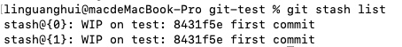

其中，`stash@{0}`、`stash@{1}`就是当前`stash`的名称


### git stash pop

`git stash pop` 从栈中读取最近一次保存的内容，也就是栈顶的`stash`会恢复到工作区

也可以通过 `git stash pop` + `stash`名字执行恢复哪个`stash`恢复到当前目录

如果从`stash`中恢复的内容和当前目录中的内容发生了冲突，则需要手动修复冲突或者创建新的分支来解决冲突


### git stash apply

将堆栈中的内容应用到当前目录，不同于`git stash pop`，该命令不会将内容从堆栈中删除

也就说该命令能够将堆栈的内容多次应用到工作目录中，适应于多个分支的情况

同样，可以通过`git stash apply` + `stash`名字执行恢复哪个`stash`恢复到当前目录


### git stash show

查看堆栈中最新保存的`stash`和当前目录的差异

通过使用`git stash show -p`查看详细的不同

通过使用`git stash show stash@{1}`查看指定的`stash`和当前目录差异

 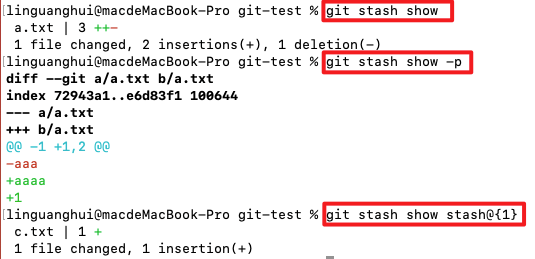


### git stash drop

`git stash drop` + `stash`名称表示从堆栈中移除某个指定的stash


### git stash clear

删除所有存储的进度


## 三、应用场景

当你在项目的一部分上已经工作一段时间后，所有东西都进入了混乱的状态， 而这时你想要切换到另一个分支或者拉下远端的代码去做一点别的事情

但是你创建一次未完成的代码的`commit`提交，这时候就可以使用`git stash`

例如以下场景：

当你的开发进行到一半,但是代码还不想进行提交 ,然后需要同步去关联远端代码时.如果你本地的代码和远端代码没有冲突时,可以直接通过`git pull`解决

但是如果可能发生冲突怎么办.直接`git pull`会拒绝覆盖当前的修改，这时候就可以依次使用下述的命令：

- git stash
- git pull
- git stash pop

或者当你开发到一半，现在要修改别的分支问题的时候，你也可以使用`git stash`缓存当前区域的代码

- git stash：保存开发到一半的代码
- git commit -m '修改问题'
- git stash pop：将代码追加到最新的提交之后


---
### 997. 怎么进行移动端的调试？

**难度**：★★☆☆☆ | **题型**：QA | **分类**：全部 / 工具

**题目**：


**参考答案**：
* vConsole：Web 调试面板

vConsole 会在你网页中加一个悬浮的小按钮，可以点击它来打开关闭调试面板，并查看 DOM、Console、Network和 本地存储 等信息。基本可以满足普通前端开发的需求。使用方法也很简单，通过npm安装或者直接在需要的页面引入 js文件 ，然后 new VConsole() 就可以了。

*  Charles

Charles 是一款强大的抓包工具，可以截取包括 https 在内的各种网络请求并方便的查看具体信息。有 Mac、Windows 和 Linux多版本，通过配置 WIFI 代理，也可以拦截手机发出的请求。毕竟前端相当一部分报错是网络错误或数据不符合预期导致的（甩锅后端😄）。所以通过拦截 http 请求,查看具体的请求信息和数据，能获取很多有用的信息，可以在一定程度上帮助 debug。

* Chrome浏览器 + Android

使用Chrome中的 Inspect，直接在PC端调试android机器中的webview的页面。

* Mac + IOS + Safari

方法基本同上


---
### 1017. 说说Git常用的命令有哪些？

**难度**：★★☆☆☆ | **题型**：QA | **分类**：全部 / 工具

**题目**：


**参考答案**：
## 一、前言

`git `的操作可以通过命令的形式如执行，日常使用就如下图6个命令即可

 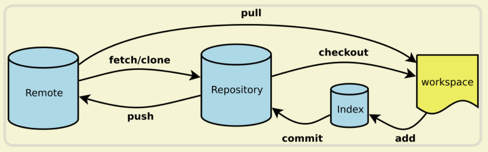

实际上，如果想要熟练使用，超过60多个命令需要了解，下面则介绍下常见的的`git `命令


## 二、有哪些


## 配置

`Git `自带一个 `git config` 的工具来帮助设置控制 `Git `外观和行为的配置变量，在我们安装完`git`之后，第一件事就是设置你的用户名和邮件地址

后续每一个提交都会使用这些信息，它们会写入到你的每一次提交中，不可更改

设置提交代码时的用户信息命令如下：

- git config [--global] user.name "[name]" 
- git config [--global] user.email "[email address]"


### 启动

一个`git`项目的初始有两个途径，分别是：

- git init [project-name]：创建或在当前目录初始化一个git代码库
- git clone url：下载一个项目和它的整个代码历史


### 日常基本操作

在日常工作中，代码常用的基本操作如下：

- git init 初始化仓库，默认为 master 分支
- git add . 提交全部文件修改到缓存区
- git add <具体某个文件路径+全名> 提交某些文件到缓存区
- git diff  查看当前代码 add后，会 add 哪些内容
- git diff --staged查看现在 commit 提交后，会提交哪些内容
- git status 查看当前分支状态
- git pull <远程仓库名> <远程分支名> 拉取远程仓库的分支与本地当前分支合并
- git pull <远程仓库名> <远程分支名>:<本地分支名> 拉取远程仓库的分支与本地某个分支合并
- git commit -m "<注释>" 提交代码到本地仓库，并写提交注释
- git commit -v 提交时显示所有diff信息
- git commit --amend [file1] [file2] 重做上一次commit，并包括指定文件的新变化

关于提交信息的格式，可以遵循以下的规则：

- feat: 新特性，添加功能
- fix: 修改 bug
- refactor: 代码重构
- docs: 文档修改
- style: 代码格式修改, 注意不是 css 修改
- test: 测试用例修改
- chore: 其他修改, 比如构建流程, 依赖管理


### 分支操作

- git branch 查看本地所有分支
- git branch -r 查看远程所有分支
- git branch -a 查看本地和远程所有分支
- git merge <分支名> 合并分支
- git merge --abort 合并分支出现冲突时，取消合并，一切回到合并前的状态
- git branch <新分支名> 基于当前分支，新建一个分支
- git checkout --orphan <新分支名> 新建一个空分支（会保留之前分支的所有文件）
- git branch -D <分支名> 删除本地某个分支
- git push <远程库名> :<分支名> 删除远程某个分支
- git branch <新分支名称> <提交ID> 从提交历史恢复某个删掉的某个分支
- git branch -m <原分支名> <新分支名> 分支更名
- git checkout <分支名> 切换到本地某个分支
- git checkout <远程库名>/<分支名> 切换到线上某个分支
- git checkout -b <新分支名> 把基于当前分支新建分支，并切换为这个分支


### 远程同步

远程操作常见的命令：

- git fetch [remote] 下载远程仓库的所有变动
- git remote -v 显示所有远程仓库
- git pull [remote] [branch] 拉取远程仓库的分支与本地当前分支合并
- git fetch 获取线上最新版信息记录，不合并
- git push [remote] [branch] 上传本地指定分支到远程仓库
- git push [remote] --force 强行推送当前分支到远程仓库，即使有冲突
- git push [remote] --all 推送所有分支到远程仓库


### 撤销

- git checkout [file] 恢复暂存区的指定文件到工作区
- git checkout [commit] [file]  恢复某个commit的指定文件到暂存区和工作区
- git checkout . 恢复暂存区的所有文件到工作区
- git reset [commit] 重置当前分支的指针为指定commit，同时重置暂存区，但工作区不变
- git reset --hard 重置暂存区与工作区，与上一次commit保持一致
- git reset [file] 重置暂存区的指定文件，与上一次commit保持一致，但工作区不变

- git revert [commit]  后者的所有变化都将被前者抵消，并且应用到当前分支

> `reset`：真实硬性回滚，目标版本后面的提交记录全部丢失了
>
> `revert`：同样回滚，这个回滚操作相当于一个提价，目标版本后面的提交记录也全部都有


### 存储操作

你正在进行项目中某一部分的工作，里面的东西处于一个比较杂乱的状态，而你想转到其他分支上进行一些工作，但又不想提交这些杂乱的代码，这时候可以将代码进行存储

- git stash 暂时将未提交的变化移除
- git stash pop 取出储藏中最后存入的工作状态进行恢复，会删除储藏

- git stash list 查看所有储藏中的工作
- git stash apply <储藏的名称>  取出储藏中对应的工作状态进行恢复，不会删除储藏
- git stash clear 清空所有储藏中的工作
- git stash drop <储藏的名称>  删除对应的某个储藏


## 三、总结

`git`常用命令速查表如下所示：

 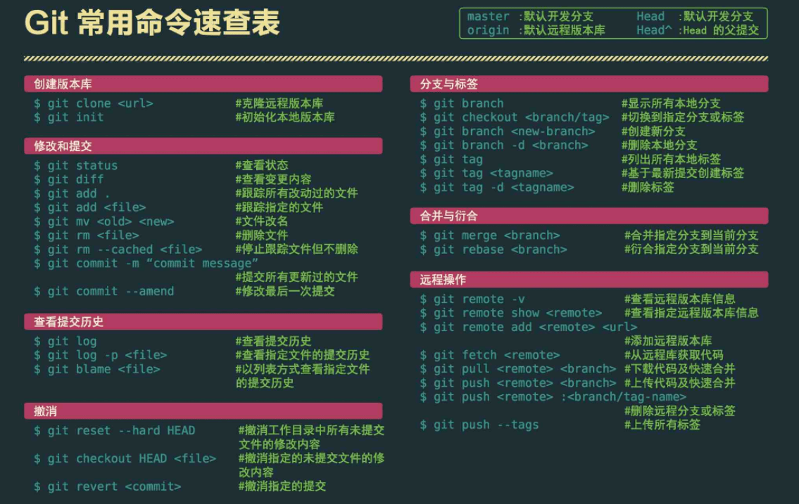


---
### 1079. 什么是 git stash？

**难度**：★☆☆☆☆ | **题型**：QA | **分类**：全部 / 工具

**题目**：


**参考答案**：
通常情况下，当你一直在处理项目的某一部分时，如果你想要在某个时候切换分支去处理其他事情，事情会处于混乱的状态。问题是，你不想把完成了一半的工作的提交，以便你以后就可以回到当前的工作。解决这个问题的答案是 git stash。

再解释什么是git stash。

stash 会将你的工作目录，即修改后的跟踪文件和暂存的更改保存在一堆未完成的更改中，你可以随时重新应用这些更改。


---
### 1165. 谈谈对 babel-polyfill 的了解

**难度**：★★★☆☆ | **题型**：QA | **分类**：全部 / 工具

**题目**：


**参考答案**：
babel polyfill 有三种：

* babel-polyfill
* babel-runtime
* babel-plugin-transform-runtime

## babel-polyfill

babel-polyfill通过向全局对象和内置对象的prototype上添加方法来实现的。所以这会造成全局空间污染。

babel-polyfill使用的两种方式：

* webpack.config.js 中：

配置webpack.config.js里的entry设置为entry: ['babel-polyfill',path.join(__dirname, 'index.js')]

* 业务 js 中：

在webpack.config.js配置的主入口index.js文件的最顶层键入

```js
import 'babel-polyfill'
```

两者打印出来的大小都是一样的，打包后大小是280KB，如果没有使用babel-polyfill，大小是3.43kb。

两则相差大概81.6倍。原因是webpack把babel-polyfill整体全部都打包进去了。而babel-polyfill肯定也实现了所有ES6新API的垫片,文件一定不会小。

那么有没有一种办法,根据实际代码中用到的ES6新增API ,来使用对应的垫片,而不是全部加载进去呢?

是的，有的。那就是 `babel-runtime & babel-plugin-transform-runtime`，他们可以实现按需加载。

## babel-runtime

简单说 babel-runtime 更像是一种按需加载的实现，比如你哪里需要使用 Promise，只要在这个文件头部

```js
import Promise from 'babel-runtime/core-js/promise'
```

就行了。

不过如果你许多文件都要使用 Promise，难道每个文件都要 import 一下吗？当然不是，Babel 官方已考虑这种情况，只需要使用 babel-plugin-transform-runtime 就可以解决手动 import 的苦恼了。

## babel-plugin-transform-runtime

babel-plugin-transform-runtime 装了就不需要装 babel-runtime了，因为前者依赖后者。
总的来说，babel-plugin-transform-runtime 就是可以在我们使用新 API 时 自动 import babel-runtime 里面的 polyfill，具体插件做了以下三件事情：

* 当我们使用 async/await 时，自动引入 babel-runtime/regenerator
* 当我们使用 ES6 的静态事件或内置对象时，自动引入 babel-runtime/core-js
* 移除内联 babel helpers 并替换使用 babel-runtime/helpers  来替换

babel-plugin-transform-runtime 优点：

* 不会污染全局变量
* 多次使用只会打包一次
* 依赖统一按需引入,无重复引入,无多余引入
* 避免 babel 编译的工具函数在每个模块里重复出现，减小库和工具包的体积

使用方式：

在 .babelrc 中配置：

```
plugins: ["tranform-runtime"]
```

打包后大小为 17.4kb，比之前的280kb要小很多。


**要点**：
- **`babel-polyfill`**：是用于向 JavaScript 环境添加缺失特性的库，特别是在旧版浏览器中提供现代特性支持。
- **`core-js` 和 `regenerator-runtime`**：从 Babel 7.4 开始，推荐使用这两个库来替代 `babel-polyfill`。
- **兼容性**：通过 polyfill，可以让现代 JavaScript 代码在旧版浏览器中运行，避免兼容性问题。


---
### 1168. ESLint 是什么？

**难度**：★★☆☆☆ | **题型**：QA | **分类**：全部 / 工具

**题目**：


**参考答案**：
ESLint是一个用来识别 ECMAScript 并且按照规则给出报告的代码检测工具，使用它可以避免低级错误和统一代码的风格。如果每次在代码提交之前都进行一次eslint代码检查，就不会因为某个字段未定义为undefined或null这样的错误而导致服务崩溃，可以有效的控制项目代码的质量。

在许多方面，它和 JSLint、JSHint 相似，除了少数的例外：

* ESLint 使用 Espree 解析 JavaScript。
* ESLint 使用 AST 去分析代码中的模式。
* ESLint 是完全插件化的。每一个规则都是一个插件并且你可以在运行时添加更多的规则。


---
### 1180. 说说你对 V8 引擎的了解

**难度**：★★★☆☆ | **题型**：QA | **分类**：全部 / 工具

**题目**：


**参考答案**：
V8 引擎是 Google 开发的一个开源 JavaScript 引擎，广泛应用于 Chrome 浏览器和 Node.js。它主要负责将 JavaScript 代码转换为高效的机器代码，以便快速执行。

以下是对 V8 引擎的核心特性和工作原理的介绍：

### **1. 核心特性**

- **即时编译（JIT Compilation）**：V8 将 JavaScript 代码转换为机器代码，并直接执行。这种即时编译方式提高了执行速度，因为 V8 可以在运行时优化代码。

- **垃圾回收（Garbage Collection）**：V8 使用高效的垃圾回收机制来自动管理内存，减少内存泄漏和碎片化的问题。V8 的垃圾回收器包括标记-清除（Mark-and-Sweep）和标记-整理（Mark-and-Compact）算法。

- **优化编译**：V8 使用多种优化技术来提升性能，包括内联缓存（Inline Caching）、逃逸分析（Escape Analysis）、和编译时间优化。

### **2. 工作原理**

- **解析和编译**：
  - **解析**：V8 首先将 JavaScript 源代码解析成抽象语法树（AST）。
  - **预处理**：生成中间字节码（Interpreter Bytecode），V8 使用它来快速执行代码。
  - **编译**：V8 使用 TurboFan 编译器将字节码编译成优化后的机器代码。

- **执行和优化**：
  - **解释器（Ignition）**：V8 的解释器 Ignition 负责执行字节码。它提供了较快的启动时间和即时反馈。
  - **优化编译器（TurboFan）**：Ignition 会收集执行信息，并将热点代码编译成高效的机器代码，优化执行性能。

- **内存管理**：
  - **垃圾回收**：V8 的垃圾回收器周期性地清理不再使用的对象。它使用了一个基于分代的垃圾回收策略，将对象分为年轻代（Young Generation）和老年代（Old Generation）来优化回收效率。

### **3. 关键技术**

- **内联缓存（Inline Caching）**：用于加速属性访问和方法调用，通过缓存最近的查找结果来提高效率。

- **逃逸分析（Escape Analysis）**：用于分析对象的作用域，从而减少不必要的内存分配和提升性能。

- **并行编译**：V8 支持多线程编译，利用多核处理器提高编译效率。

### **4. 应用**

- **浏览器**：V8 是 Google Chrome 和其他基于 Chromium 的浏览器（如 Microsoft Edge）的核心 JavaScript 引擎。
  
- **服务器端**：V8 是 Node.js 的核心组件，使其能够高效执行 JavaScript 代码并处理 I/O 操作。


**要点**：
V8 引擎通过即时编译、优化技术和高效的内存管理，使 JavaScript 执行速度更快。其架构设计和优化策略极大地提高了 Web 应用和服务器端应用的性能和响应速度。

---
### 1197. 有了解过 Protobuf 吗？

**难度**：★★☆☆☆ | **题型**：QA | **分类**：全部 / 工具

**题目**：


**参考答案**：
**Protobuf（Protocol Buffers）** 是由 Google 开发的一种高效、跨语言的**序列化协议**。它被广泛用于数据交换，尤其是在分布式系统、微服务和网络通信中。

### **1. Protobuf 的特点**
1. **高效性**  
   - **紧凑**：采用二进制格式，体积小，数据传输更快。相比 JSON 和 XML，Protobuf 更节省带宽和存储空间。
   - **高性能**：序列化和反序列化速度快，适合对性能敏感的场景。

2. **跨语言支持**  
   - 支持多种编程语言（如 C++, Java, Python, Go, JavaScript 等），适合跨平台开发。

3. **良好的可扩展性**  
   - 通过字段编号（field numbers）进行数据标识，向协议添加新字段时不会破坏旧字段，支持向后和向前兼容。

4. **类型安全**  
   - 使用静态类型，能在编译阶段发现潜在的类型错误。

---

### **2. Protobuf 的基本工作原理**
#### **2.1. 编写 `.proto` 文件**
`.proto` 文件定义了数据结构和通信接口的格式，类似于接口的契约。  
示例：
```proto
syntax = "proto3";

message Person {
  int32 id = 1;           // 唯一 ID
  string name = 2;        // 姓名
  string email = 3;       // 邮箱
  repeated string tags = 4; // 标签列表
}
```

#### **2.2. 编译 `.proto` 文件**
使用 Protobuf 的编译器（`protoc`）将 `.proto` 文件编译为目标语言的代码（如 Java、Python 等），生成序列化和反序列化的工具类。

命令示例：
```bash
protoc --python_out=. person.proto
```

#### **2.3. 使用生成的代码**
在应用中使用生成的类进行数据的序列化（编码）和反序列化（解码）。

序列化示例（Python）：
```python
import person_pb2

# 创建消息对象
person = person_pb2.Person()
person.id = 123
person.name = "Alice"
person.email = "alice@example.com"
person.tags.extend(["developer", "protobuf"])

# 序列化为二进制
data = person.SerializeToString()

# 反序列化
decoded_person = person_pb2.Person()
decoded_person.ParseFromString(data)
print(decoded_person)
```

---

### **3. Protobuf 的版本**
- **Proto2**：支持可选字段和默认值，但比较复杂，使用时需要明确指定字段的 presence。
- **Proto3**：简化了 Proto2，默认所有字段是 optional，没有默认值的概念，广泛应用于现代项目。

---

### **4. Protobuf 的应用场景**
1. **微服务通信**  
   在 gRPC 中，Protobuf 是默认的数据序列化格式，提供高性能的 RPC 调用。

2. **存储和传输数据**  
   适用于需要传输大量小型、高频数据的场景，比如 IoT 设备与云端通信。

3. **跨语言的数据交换**  
   数据结构通过 `.proto` 文件定义，生成不同语言的代码，保证一致性。

4. **日志和持久化**  
   用于存储结构化日志或配置文件，替代 JSON 或 XML。

---

### **5. Protobuf 的优缺点**
#### **优点**
- 高效的序列化性能。
- 体积小，适合低带宽传输。
- 支持多语言和良好的向后兼容性。

#### **缺点**
- 可读性差（相比 JSON/XML，二进制格式不易调试）。
- 编码较复杂，需要 `.proto` 文件和编译器支持。
- 不支持动态字段（必须预先定义所有字段）。

---

### **6. 与其他数据格式的对比**
| 特性            | Protobuf       | JSON           | XML            |
|-----------------|---------------|----------------|----------------|
| **格式**        | 二进制         | 文本            | 文本            |
| **可读性**      | 差             | 好              | 好              |
| **性能**        | 高             | 中              | 低              |
| **体积**        | 小             | 中              | 大              |
| **可扩展性**    | 好             | 好              | 好              |
| **类型支持**    | 强类型         | 弱类型          | 弱类型          |

**要点**：
Protobuf 是一种高效的二进制序列化协议，适用于分布式系统、微服务和跨平台数据交换。它的优势在于高性能、低体积和良好的类型安全性，但调试和动态字段的支持较弱。如果需要性能和可扩展性，可以优先考虑使用 Protobuf，尤其是在 gRPC 等高性能通信场景下。

---
### 1221. 说说你对 npx 的了解？

**难度**：★★☆☆☆ | **题型**：QA | **分类**：全部 / 工具

**题目**：


**参考答案**：
`npx` 是 npm 包管理器的一个附加工具，从 npm 5.2.0 版本开始引入。它主要用于简化执行 Node.js 包和模块的过程，特别是那些作为命令行工具使用的包。

### **`npx` 的主要功能和特点**

1. **运行本地或全局包**：
   - 可以直接执行 `node_modules/.bin` 中的可执行文件，无需全局安装。例如，运行 `npx eslint .` 会使用本地项目中安装的 `eslint`。

2. **临时使用包**：
   - 不需要全局安装一个命令行工具，可以直接运行。例如，`npx create-react-app my-app` 会临时下载并运行 `create-react-app`，然后删除它。

3. **指定版本**：
   - 可以指定要运行的包的版本。比如，`npx lodash@4.17.21` 会运行指定版本的 `lodash`。

4. **自动下载**：
   - 如果指定的命令或包未安装，`npx` 会自动从 npm 注册表下载并执行，而不需要手动安装。

5. **简化命令执行**：
   - 对于在项目中需要使用的命令行工具，`npx` 可以避免全局安装，使项目依赖更干净、更易于管理。

### **使用场景**

- **运行开发工具**：
  - 比如，`npx eslint .` 用于在项目中运行 ESLint，而不需要全局安装 ESLint。

- **创建新项目**：
  - 使用 `npx create-react-app my-app` 来创建一个新的 React 项目，无需全局安装 `create-react-app`。

- **执行一次性命令**：
  - 例如，运行一个 npm 包的脚本一次，`npx cowsay "Hello World"` 会执行 `cowsay` 命令并打印输出。

### **示例**

1. **运行本地包**：
   ```bash
   npx webpack --config webpack.config.js
   ```

2. **临时运行包**：
   ```bash
   npx cowsay "Hello!"
   ```

3. **运行特定版本**：
   ```bash
   npx create-react-app@4.0.0 my-app
   ```

**要点**：
`npx` 是一个强大的工具，它简化了 Node.js 包的使用，尤其是在临时执行和版本控制方面，使得运行和管理 Node.js 工具更加方便和灵活。

---
### 1260. 说说你对git reset 和 git revert 的理解？区别？

**难度**：★★☆☆☆ | **题型**：QA | **分类**：全部 / 工具

**题目**：


**参考答案**：
## 一、是什么

### git reset

`reset`用于回退版本，可以遗弃不再使用的提交

执行遗弃时，需要根据影响的范围而指定不同的参数，可以指定是否复原索引或工作树内容

 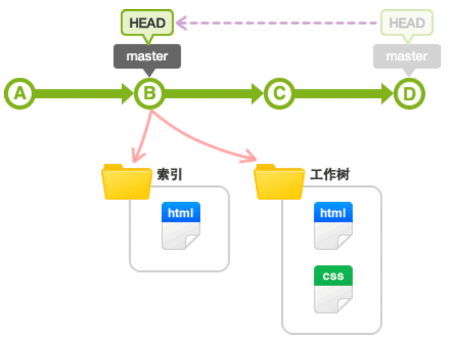


### git revert

在当前提交后面，新增一次提交，抵消掉上一次提交导致的所有变化，不会改变过去的历史，主要是用于安全地取消过去发布的提交

 


## 二、如何用

### git reset

当没有指定`ID`的时候，默认使用`HEAD`，如果指定`ID`，那么就是基于指向`ID`去变动暂存区或工作区的内容

```cmd
// 没有指定ID, 暂存区的内容会被当前ID版本号的内容覆盖，工作区不变
git reset

// 指定ID，暂存区的内容会被指定ID版本号的内容覆盖，工作区不变
git reset <ID> 
```

日志`ID`可以通过查询，可以`git log`进行查询，如下：

```cmd
commit a7700083ace1204ccdff9f71631fb34c9913f7c5 (HEAD -> master)
Author: linguanghui <linguanghui@baidu.com>
Date:   Tue Aug 17 22:34:40 2021 +0800

    second commit

commit e31118663ce66717edd8a179688a7f3dde5a9393
Author: linguanghui <linguanghui@baidu.com>
Date:   Tue Aug 17 22:20:01 2021 +0800

    first commit
```

常见命令如下：

- --mixed（默认）：默认的时候，只有暂存区变化

- --hard参数：如果使用 --hard 参数，那么工作区也会变化

- --soft：如果使用 --soft 参数，那么暂存区和工作区都不会变化

 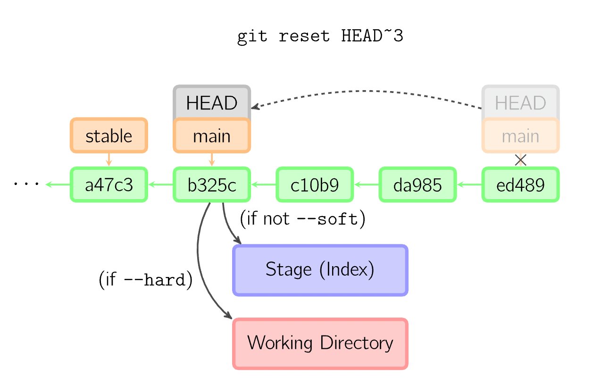


### git revert

跟`git reset`用法基本一致，`git revert` 撤销某次操作，此次操作之前和之后的 `commit`和`history`都会保留，并且把这次撤销，作为一次最新的提交，如下：

```cmd
git revert <commit_id> 
```

如果撤销前一个版本，可以通过如下命令：

```cmd
git revert HEAD
```

撤销前前一次，如下：

```cmd
git revert HEAD^
```

## 三、区别

撤销（revert）被设计为撤销公开的提交（比如已经push）的安全方式，`git reset`被设计为重设本地更改

因为两个命令的目的不同，它们的实现也不一样：重设完全地移除了一堆更改，而撤销保留了原来的更改，用一个新的提交来实现撤销

两者主要区别如下：

- git revert是用一次新的commit来回滚之前的commit，git reset是直接删除指定的commit
- git reset 是把HEAD向后移动了一下，而git revert是HEAD继续前进，只是新的commit的内容和要revert的内容正好相反，能够抵消要被revert的内容
- 在回滚这一操作上看，效果差不多。但是在日后继续 merge 以前的老版本时有区别

> git revert是用一次逆向的commit“中和”之前的提交，因此日后合并老的branch时，之前提交合并的代码仍然存在，导致不能够重新合并
>
> 但是git reset是之间把某些commit在某个branch上删除，因而和老的branch再次merge时，这些被回滚的commit应该还会被引入

- 如果回退分支的代码以后还需要的情况则使用`git revert`， 如果分支是提错了没用的并且不想让别人发现这些错误代码，则使用`git reset`


**要点**：
- **`git reset`**：
  - **功能**：重置分支到指定提交，修改提交历史。
  - **选项**：`--soft`、`--mixed`、`--hard`。
  - **用途**：清理本地修改、调整提交历史。
  - **注意**：可能修改历史，不适用于已推送的分支。

- **`git revert`**：
  - **功能**：生成一个新的提交，撤销指定提交的更改。
  - **用途**：在共享分支上安全地撤销提交，保持历史完整。
  - **注意**：不会修改历史记录，只是添加新的撤销提交。

`git reset` 和 `git revert` 是 Git 中重要的历史修改工具，选择使用哪一个取决于是否需要修改提交历史和是否与其他协作者共享代码。


---
### 1322. 怎么使用 git 将多次提交压缩成一次提交？

**难度**：★★★☆☆ | **题型**：QA | **分类**：全部 / 工具

**题目**：


**参考答案**：
在使用 Git 作为版本控制的时候，我们可能会由于各种各样的原因提交了许多临时的 commit，而这些 commit 拼接起来才是完整的任务。那么我们为了避免太多的 commit 而造成版本控制的混乱，通常我们推荐将这些 commit 合并成一个。

* 查看提交历史，git log

首先你要知道自己想合并的是哪几个提交，可以使用git log命令来查看提交历史，假如最近4条历史如下：

```
commit 3ca6ec340edc66df13423f36f52919dfa3......

commit 1b4056686d1b494a5c86757f9eaed844......

commit 53f244ac8730d33b353bee3b24210b07......

commit 3a4226b4a0b6fa68783b07f1cee7b688.......
```

历史记录是按照时间排序的，时间近的排在前面。

* git rebase

想要合并1-3条，有两个方法：

1.从HEAD版本开始往过去数3个版本
```
git rebase -i HEAD~3
```

2.指名要合并的版本之前的版本号
```
git rebase -i 3a4226b
```
请注意3a4226b这个版本是不参与合并的，可以把它当做一个坐标

* 选取要合并的提交

1.执行了rebase命令之后，会弹出一个窗口，头几行如下：
```
pick 3ca6ec3   '注释**********'

pick 1b40566   '注释*********'

pick 53f244a   '注释**********'
```

2.将pick改为squash或者s,之后保存并关闭文本编辑窗口即可。改完之后文本内容如下：

```
pick 3ca6ec3   '注释**********'

s 1b40566   '注释*********'

s 53f244a   '注释**********'
```

3.然后保存退出，Git会压缩提交历史，如果有冲突，需要修改，修改的时候要注意，保留最新的历史，不然我们的修改就丢弃了。修改以后要记得敲下面的命令：
```
git add .  

git rebase --continue  
```

如果你想放弃这次压缩的话，执行以下命令：

```
git rebase --abort  
```

4.如果没有冲突，或者冲突已经解决，则会出现如下的编辑窗口：
```
# This is a combination of 4 commits.  
#The first commit’s message is:  
注释......
# The 2nd commit’s message is:  
注释......
# The 3rd commit’s message is:  
注释......
# Please enter the commit message for your changes. Lines starting # with ‘#’ will be ignored, and an empty message aborts the commit.
```

5.输入wq保存并推出, 再次输入git log查看 commit 历史信息，你会发现这两个 commit 已经合并了。


---
### 1539. 怎么实现 commit lint？

**难度**：★★☆☆☆ | **题型**：QA | **分类**：全部 / 工具

**题目**：


**参考答案**：
### **实现 Commit Lint 的步骤**

`Commit Lint` 是一种对 Git 提交信息进行格式化检查的工具，通常用于确保提交信息符合团队约定（例如 [Conventional Commits](https://www.conventionalcommits.org/) 标准），提高代码可维护性和提交信息的可读性。

以下是实现 Commit Lint 的具体步骤：

---

### **1. 安装必要的依赖**

**依赖工具**：

- `commitlint`：用于校验提交信息。
- `@commitlint/config-conventional`：遵循 Conventional Commits 的预设规则。
- `husky`：用于 Git 钩子管理。

执行以下命令：

```bash
npm install --save-dev @commitlint/{config-conventional,cli} husky
```

---

### **2. 配置 Commit Lint**

在项目根目录创建 `commitlint.config.js` 文件：

```javascript
module.exports = {
  extends: ['@commitlint/config-conventional'],
};
```

---

### **3. 初始化 Husky**

Husky 用于触发 Git 钩子，在 `commit-msg` 阶段执行 Commit Lint。

1. 初始化 Husky：

   ```bash
   npx husky install
   ```

2. 在 `package.json` 中添加一条安装后自动启用 Husky 的脚本：

   ```json
   {
     "scripts": {
       "prepare": "husky install"
     }
   }
   ```

3. 添加 `commit-msg` 钩子：

   ```bash
   npx husky add .husky/commit-msg 'npx --no-install commitlint --edit "$1"'
   ```

   这会在 `.husky/commit-msg` 文件中添加如下内容：

   ```bash
   #!/bin/sh
   . "$(dirname "$0")/_/husky.sh"

   npx --no-install commitlint --edit "$1"
   ```

---

### **4. 验证提交信息**

使用 [Conventional Commits](https://www.conventionalcommits.org/) 规范，以下是一些符合规范的提交示例：

- `feat: add new login feature`
- `fix: correct header display issue`
- `docs: update README with usage instructions`
- `style: fix formatting for CSS`

如果提交信息不符合规范，提交会被拦截，并提示错误信息。

---

### **5. 自定义规则（可选）**

如果团队有自定义的提交规范，可以在 `commitlint.config.js` 中添加规则。例如：

```javascript
module.exports = {
  extends: ['@commitlint/config-conventional'],
  rules: {
    'type-enum': [
      2,
      'always',
      ['feat', 'fix', 'docs', 'style', 'refactor', 'test', 'chore'],
    ],
    'header-max-length': [2, 'always', 72], // 限制标题长度为 72 字符
  },
};
```

---

### **6. 配合 lint-staged（可选）**

为了确保提交代码时执行代码格式化和检查，可以引入 `lint-staged`。

安装依赖：

```bash
npm install --save-dev lint-staged
```

在 `package.json` 中添加：

```json
{
  "lint-staged": {
    "*.js": ["eslint --fix", "git add"]
  }
}
```

通过 Husky 添加 `pre-commit` 钩子：

```bash
npx husky add .husky/pre-commit 'npx lint-staged'
```

---

### **7. 测试流程**

1. 执行 `git commit`，输入符合或不符合规范的提交信息。
2. 检查是否会被拦截，确认 Commit Lint 是否生效。

**要点**：
实现 Commit Lint 需要依赖 `commitlint` 和 `husky`，关键点是通过 Git 钩子（`commit-msg`）拦截不符合提交规范的信息。同时，你可以根据团队需求自定义规则，配合 `lint-staged` 等工具进一步规范开发流程。

---
### 1669. 你了解 Git 的 Worktree 吗？

**难度**：★★★☆☆ | **题型**：QA | **分类**：全部 / 工具

**题目**：


**参考答案**：
Git Worktree 是 Git 提供的一种 **在同一个仓库中同时检出多个工作目录（working directory）** 的机制，本质目的是解决“一个仓库只能对应一个当前分支”的限制。

在传统 Git 使用方式下，一个仓库目录只能 checkout 一个分支。如果正在开发 feature 分支，此时需要紧急修复线上 bug，就必须经历：

* stash 当前修改
* 切换分支
* 修复问题
* 再切回原分支恢复现场

这个过程不仅低效，而且容易产生冲突或遗漏。Worktree 的出现，就是为了避免这种上下文切换成本。

---

### 一、Worktree 的核心原理

Git 仓库实际上由两部分组成：

* `.git`：对象数据库（commit、tree、blob、refs）
* working directory：当前检出的文件

Worktree 允许 **多个 working directory 共享同一个 `.git` 对象库**。

也就是说：

* commit history 只有一份
* objects 只有一份
* 但可以有多个独立的代码目录，每个目录对应不同分支

Git 内部会在 `.git/worktrees/` 下维护额外工作区的元信息，每个 worktree 都拥有自己的 HEAD、index 和 checkout 状态。

因此它不是复制仓库，而是“多视图”。

---

### 二、基本使用方式

创建一个新的工作目录并检出分支：

```bash
git worktree add ../project-hotfix hotfix-branch
```

执行后会发生：

* 在 `../project-hotfix` 创建新目录
* 自动 checkout `hotfix-branch`
* 两个目录同时存在且互不影响

查看当前 worktree：

```bash
git worktree list
```

删除工作区：

```bash
git worktree remove ../project-hotfix
```

---

### 三、为什么它比 clone 更有价值

很多人第一反应是：重新 clone 一个仓库不就行了吗？

区别在于底层成本模型不同。

clone：

* 会复制完整 objects 数据
* 占用大量磁盘
* fetch 需要重复下载

worktree：

* 所有工作区共享 object database
* 几乎瞬时创建
* 磁盘占用极小
* fetch 一次，全部 worktree 可见

对于大型 monorepo 或包含大量历史记录的仓库，差异非常明显。

---

### 四、典型工程场景

在真实开发中，Worktree 的价值主要体现在并行上下文。

**1）并行开发多个分支**

一个目录开发 feature，另一个目录运行 release 分支调试问题，不需要频繁切换。

**2）紧急 hotfix**

线上 bug 修复可以直接开一个独立目录处理，不污染当前开发环境。

**3）多版本调试**

例如需要同时运行 v1 与 v2 服务进行对比测试。

**4）CI 或自动化脚本**

构建系统可以为不同分支创建临时 worktree，而无需重复 clone。

---

### 五、一些容易踩的点

Worktree 对分支存在“占用关系”。

一个分支不能同时被多个 worktree checkout，否则 Git 无法确定 HEAD 所属。因此删除 worktree 前要确保没有未提交修改。

另外，删除目录不能直接用 `rm -rf`，否则 Git 会留下 dangling worktree 记录，需要执行：

```bash
git worktree prune
```

进行清理。

---

### 六、设计层面的理解

Worktree 实际上体现的是 Git 的核心设计思想：

Git 管理的是 **内容数据库（content-addressable storage）**，工作目录只是数据库的一种投影。Worktree 让一个数据库可以同时投影出多个状态视图。

这也是为什么它几乎没有额外性能成本。


**要点**：
Git Worktree 允许多个工作目录共享同一个仓库对象库，从而同时检出多个分支，避免频繁 checkout 带来的上下文切换问题。其核心依赖 Git 的对象数据库与工作区分离设计，相比 clone 具有更低的磁盘与网络成本，适用于并行开发、hotfix、版本对比和 CI 场景，本质是同一仓库的多工作视图机制。

---
### 1675. 说一下 vite 的构建流程

**难度**：★★☆☆☆ | **题型**：QA | **分类**：全部 / 工具

**题目**：


**参考答案**：
Vite 是一个基于现代浏览器原生 ES 模块的开发服务器和构建工具，其构建流程相较于传统的打包工具有所不同。

下面是 Vite 的构建流程简要说明：

1. **启动开发服务器**：通过运行 `vite` 命令，Vite 启动一个开发服务器。
2. **解析入口模块**：当用户访问应用程序时，Vite 会解析入口模块（通常是 `index.html`）。它会分析该模块的依赖关系，并将其作为构建的起点。
3. **按需编译**：Vite 会根据需要实时编译每个模块。当浏览器请求某个模块时，Vite 会检查该模块是否已经被编译，如果没有，它将根据模块的类型（如 `.js`、`.vue`）采取不同的编译策略。
    - 对于 JavaScript 文件，Vite 使用 esbuild 进行快速的原生 ES 模块转换，生成浏览器可直接执行的代码。
    - 对于 Vue 单文件组件（`.vue` 文件），Vite 使用 `@vue/compiler-sfc` 解析并编译它们成为 JavaScript 代码。
4. **提供虚拟模块**：完成编译后，Vite 会将模块包裹在一个虚拟模块中，并将该模块作为一个请求的响应返回给浏览器。这样浏览器可以直接加载这些虚拟模块，无需打包成独立文件。
5. **处理静态资源**：Vite 会对静态资源（如 CSS、图片等）进行特殊处理，并返回给浏览器以供使用。
6. **热模块替换（HMR）**：Vite 内置了热模块替换功能，使得在开发过程中修改代码后，可以实时更新浏览器中的页面，而无需刷新整个页面。

总结起来，Vite 的构建流程主要是基于原生 ES 模块的按需编译，每个模块都被实时编译并返回给浏览器。它采用了虚拟模块的概念，使得浏览器可以直接加载这些模块，提升了开发的速度和效率。此外，Vite 还支持热模块替换，可以在开发过程中实时更新代码。

**要点**：
回答“Vite 的构建流程”时，可以从以下几个要点展开：

### 1. **Vite 的基本架构**

- **开发服务器**：Vite 使用原生的 ES 模块，并通过浏览器支持的动态导入功能，实现了开发阶段的快速启动和热更新。
- **构建阶段**：Vite 在构建阶段使用 Rollup 进行打包，这使得它不仅适用于开发，还能进行高效的生产构建。

### 2. **开发阶段的流程**

- **模块解析和请求拦截**：Vite 拦截浏览器发出的模块请求，通过 ESBuild 快速编译 TypeScript 和 JSX 等文件。
- **热模块替换 (HMR)**：Vite 内置了高效的 HMR 功能，当代码发生变化时，仅重新编译和发送受影响的模块，保证了快速的开发反馈。

### 3. **生产构建阶段的流程**

- **依赖预构建**：Vite 在生产构建之前，会对第三方依赖进行预构建和缓存，以提升构建性能。
- **Rollup 打包**：Vite 使用 Rollup 进行最终的打包，生成优化后的静态资源文件，如 JS、CSS、HTML。
- **代码分割和压缩**：通过 Rollup 插件，Vite 实现了代码分割、Tree Shaking、CSS 提取、代码压缩等优化。

### 4. **插件系统**

- **插件扩展性**：Vite 支持 Rollup 插件和自己的插件 API，允许开发者扩展其功能，例如支持不同类型的文件、增加自定义的编译步骤等。

### 5. **与传统构建工具的比较**

- **启动速度**：与 Webpack 等工具相比，Vite 的启动速度更快，尤其在大型项目中表现更优。
- **模块更新**：Vite 的 HMR 更高效，因为它直接利用浏览器的 ES 模块能力，无需像 Webpack 那样的复杂转换。

这些要点可以帮助你清晰地阐述 Vite 的构建流程，展现对其架构和工作原理的理解。


---
### 1766. 如何迁移仓库，同时保留原有的提交记录和分支？

**难度**：★☆☆☆☆ | **题型**：QA | **分类**：全部 / 工具

**题目**：


**参考答案**：
```
git clone 仓库地址
cd 项目
git push --mirror 新的仓库地址
```


---
### 1777. 前端领域有哪些跨端方案？

**难度**：★☆☆☆☆ | **题型**：QA | **分类**：全部 / 工具 / 跨端技术

**题目**：


**参考答案**：

跨平台指的是跨操作系统，而跨端是指客户端。

客户端的特点就是有界面、有逻辑，所以包含逻辑跨端和渲染跨端。主要的客户端有 web、安卓、ios、iot 设备等。

现在主流的跨端方案有 react native、weex、flutter、kraken 以及各家自研的跨端引擎等。

### react native

跨端包括逻辑跨端和渲染跨端，rn 的逻辑跨端是基于 js 引擎，通过 bridge 注入一些设备能力的 api，而渲染跨端则是使用安卓、ios 实现 react 的 virtual dom 的渲染。


其中 native api 和组件（灰色画出的部分）并没有做到双端一致，而且有的时候扩展图中灰色部分需要原生配合，混杂 rn 代码和自己扩展的代码导致代码比较难管理。最著名的事件就是 airbnb 从最大的 react native 支持者到弃用 react native。

### weex

weex 也是类似的思路来实现跨端的，不过他对接的上层 ui 框架是 vue，而且努力做到了双端的组件 和 api 的一致性（虽然后续维护跟不上了）。架构和上图类似。

### flutter

flutter 是近些年流行的跨端方案，跨的端包括安卓、ios、web 等。它最大的特点是渲染不是基于操作系统的组件，而是直接基于绘图库（skia）来绘制的，这样做到了渲染的跨端。逻辑的跨端也不是基于 js 引擎，而是自研的 dart vm 来跨端，通过 dart 语言来写逻辑，


### kraken

跨端包括两部分，渲染跨端和逻辑跨端。有时候只需要渲染跨端、有时候只需要逻辑跨端，有的时候需要完整的跨端引擎，这 3 种情况都有各自的适用场景。

kraken 就是一个跨端渲染引擎，基于 flutter 的绘图能力实现了 css 的渲染，实现了渲染的跨端。


### 自研渲染引擎

跨端引擎很依赖底层实现的组件和 api，用开源方案也一样得扩展这部分，所以有一定规模的团队都会选择自研。

自研跨端引擎会和 rn、weex 不同：

- 渲染部分不需要实现 virtual dom 的渲染，而是直接对接 dom api，上层应用基于这些 dom api 实现跨端渲染。这样理论上可以对接任意前端框架。

- 逻辑部分也是基于 js 引擎，通过 binding 直接注入一些 c++ 实现的 api，或者运行时通过 bridge 来注入一些安卓、ios 实现的 api。


自研跨端引擎的好处是组件和 api 可以自己扩展，更快的响应业务的需求。其中组件和 api 的双端一致性，以及统一的 api 的设计都是难点。

## 跨端的通用原理是什么

其实跨端和跨平台的思路类似，都是实现一个容器，给它提供统一的 api，这套 api 由不同的平台各自实现，保证一致的功能。

具体一些的话，跨端分为渲染和逻辑跨端，有的时候只需要单独的渲染跨端方案（比如 karen）和逻辑跨端方案，有的时候需要完整的跨端引擎。

weex、react native 的渲染部分都是通过实现了 virtual dom 的渲染，用安卓、ios 各自的渲染方式实现，逻辑部分使用 js 引擎，通过 bridge 注入一些安卓、ios 的 api。

flutter 则是直接使用 skia 绘图库绘制，并且逻辑跨端使用 dart vm。

但是不管具体实现怎样，思路都大同小异：**跨端引擎需要实现一个渲染引擎、实现一个 vm，基于这套架构实现各种组件和 api，跨端容器上层对接一个 ui 框架，再上层的业务代码可以基于容器的 api 实现跨端的渲染和逻辑**

## web container

这两天 web container 比较火，其实也是一种跨平台技术，它是在浏览器里面实现的容器，通过 wasm 实现了 node 的 api，这样在这个容器里面可以跑 node 代码。其实思路比较常见，但是是一个新场景。


浏览器容器之上又跑了个容器，容器套娃。


---
### 1779. Git，GitHub与GitLab分别是什么？有什么区别？


**难度**：★☆☆☆☆ | **题型**：QA | **分类**：全部 / 工具

**题目**：


**参考答案**：
* Git是一款免费、开源的分布式版本控制系统
* GitHub是一个面向开源及私有软件项目的托管平台，因为只支持git作为唯一的版本库格式进行托管，故名GitHub。
* GitLab 是一个用于仓库管理系统的开源项目，使用Git作为代码管理工具，并在此基础上搭建起来的web服务。安装方法是参考GitLab在GitHub上的Wiki页面。

## Git，GitHub与GitLab的区别

* Git是一种版本控制系统，是一种工具，用于代码的存储和版本控制。
* GitHub是一个基于Git实现的在线代码仓库，是目前全球最大的代码托管平台，可以帮助程序员之间互相交流和学习。
* GitLab是一个基于Git实现的在线代码仓库软件，你可以用GitLab自己搭建一个类似于GitHub一样的仓库，但是GitLab有完善的管理界面和权限控制，一般用于在企业、学校等内部网络搭建Git私服。
* GitHub和GiLlab两个都是基于Web的Git远程仓库，它们都提供了分享开源项目的平台，为开发团队提供了存储、分享、发布和合作开发项目的中心化云存储的场所。从代码的私有性上来看，GitLab 是一个更好的选择。但是对于开源项目而言，GitHub 依然是代码托管的首选。


---
### 1894. git pull 命令实际上是哪两个操作的融合？

**难度**：★☆☆☆☆ | **题型**：QA | **分类**：全部 / 工具

**题目**：


**参考答案**：
`git pull` 实际上是 **`git fetch` + `git merge`** 两个操作的组合。

---

### 1. **`git fetch`**

* 从远程仓库获取最新的分支和提交信息，但 **不会自动合并到当前分支**。
* 它只是把远程仓库的变化更新到本地的远程分支（如 `origin/main`）。

```bash
git fetch origin
```

执行后，本地会得到最新的远程提交记录，但当前工作分支不会改变。

---

### 2. **`git merge`**

* 将某个分支的更新合并到当前分支。
* 如果有冲突需要手动解决。

```bash
git merge origin/main
```

这一步会把远程最新提交的内容整合到当前分支。

---

### 3. **`git pull`**

```bash
git pull origin main
```

* 等效于：

```bash
git fetch origin main
git merge origin/main
```

* **流程**：

  1. 拉取远程分支的最新提交到本地（`fetch`）。
  2. 将这些更新合并到当前分支（`merge`）。

* 可选参数：

  * `--rebase`：用 `rebase` 替代 `merge`，保持提交历史线性。

    ```bash
    git pull --rebase origin main
    ```


**要点**：
`git pull` 是**获取远程更新 + 合并到本地分支**的快捷操作，本质就是 `fetch + merge` 的组合。

可以把它理解为一个“一步完成远程更新”的高层命令，但在处理冲突时仍然需要人工干预。

---