# 工程化 分类题集

> 共 87 题，摘自前端面试题宝典 https://fe.ecool.fun/topic-list

### 9. webpack、rollup、parcel优劣

**难度**：★☆☆☆☆ | **题型**：QA | **分类**：全部 / 工程化

**题目**：


**参考答案**：
<ul><li>webpack适用于大型复杂的前端站点构建: webpack有强大的loader和插件生态,打包后的文件实际上就是一个立即执行函数，这个立即执行函数接收一个参数，这个参数是模块对象，键为各个模块的路径，值为模块内容。立即执行函数内部则处理模块之间的引用，执行模块等,这种情况更适合文件依赖复杂的应用开发.</li><li> rollup适用于基础库的打包，如vue、d3等: Rollup 就是将各个模块打包进一个文件中，并且通过 Tree-shaking 来删除无用的代码,可以最大程度上降低代码体积,但是rollup没有webpack如此多的的如代码分割、按需加载等高级功能，其更聚焦于库的打包，因此更适合库的开发.</li><li>parcel适用于简单的实验性项目: 他可以满足低门槛的快速看到效果,但是生态差、报错信息不够全面都是他的硬伤，除了一些玩具项目或者实验项目不建议使用<br/><br/></li></ul>


---
### 14. Webpack的Tree Shaking与Vite的Dead Code Elimination有何异同？

**难度**：★★★★☆ | **题型**：QA | **分类**：全部 / 工程化

**题目**：


**参考答案**：
在现代前端构建工具中，**Tree Shaking**（摇树优化）和 **Dead Code Elimination**（DCE，死代码消除）虽然最终目标都是为了减小产物体积，但它们的实现路径和侧重点有所不同。

简单来说：**Tree Shaking 是基于模块关系的“导出过滤”，而 DCE 是基于代码执行逻辑的“无效擦除”。**

---

### 1. Webpack 的 Tree Shaking

Webpack 的 Tree Shaking 深度依赖于 **ES 模块（ESM）** 的静态结构。

* **核心原理**：Webpack 在构建过程中，会通过静态分析识别出哪些模块导出了但没有被 `import`。它会在生成的 bundle 中标记这些未使用的导出，最后由压缩工具（如 Terser 或 ESBuild）进行删除。
* **关键依赖**：
* **静态分析**：必须使用 `import/export`，不能使用 CommonJS 的 `require`（因为 require 是动态的）。
* **Side Effects（副作用）**：这是 Webpack 的痛点。如果一个模块仅仅被引入但未被使用，但它修改了全局变量，Webpack 默认不敢删。开发者需要在 `package.json` 中配置 `"sideEffects": false` 来告知 Webpack 放心摇树。


---

### 2. Vite 的优化策略（Rollup 驱动）

Vite 在生产环境构建时使用的是 **Rollup**。Rollup 的 Tree Shaking 被公认为比 Webpack 更为激进和精准。

* **更细粒度的分析**：Rollup 不仅关注模块间的导出关系，还会分析代码内部的**属性访问**。如果一个对象被导出，但它的某个属性从未被访问过，Rollup 往往能更智能地将其剥离。
* **Vite 的 DCE**：在开发阶段，Vite 几乎不做 Tree Shaking（为了极致的 HMR 速度）。在生产阶段，Vite 结合了 Rollup 的 Tree Shaking 和 ESBuild 的压缩能力。
* **Dead Code Elimination (DCE) 的内涵**：DCE 的范畴更广。例如，代码中有一段 `if (false) { ... }`，这不属于模块导出问题，而是逻辑死路。Vite/Rollup 能够识别并直接删除这些永远不会执行的语句。

---

### 3. 两者的异同对比

| 特性 | Webpack (Tree Shaking) | Vite/Rollup (DCE + Tree Shaking) |
| --- | --- | --- |
| **底层依据** | 主要依赖 ESM 的静态导入导出关系。 | 基于更深层的 AST（抽象语法树）分析。 |
| **副作用处理** | 较为保守，高度依赖 `sideEffects` 配置。 | 默认分析更精准，能更好地识别纯函数调用。 |
| **压缩阶段配合** | 标记未使用代码，由 Terser 执行最终删除。 | 在打包过程中就尽量减少无用代码进入 bundle。 |
| **处理广度** | 侧重于“模块级别”的剔除。 | 既有模块剔除，也有强力的代码块逻辑消除。 |

---

### 4. 为什么 DCE 有时会“失效”？

无论是 Webpack 还是 Vite，最怕的就是**副作用（Side Effects）**。

* **场景**：如果你在代码中写了 `const a = window.someInjectedFunc()`，构建工具无法确定删除 `a` 是否会破坏程序的全局环境，因此即使 `a` 没被使用，它也会被保留。
* **解决方案**：使用 `/*#__PURE__*/` 注释。这会显式告诉构建工具：这个函数调用是没有副作用的，如果结果没被用到，请直接删掉它。

**要点**：
* **Tree Shaking** 是从外部看：这个模块提供的“果实”没人要，那就摇下来。
* **DCE** 是从内部看：这行代码执行了也没意义（或者跑不到），那就擦掉。

Vite (Rollup) 的优势在于其预设的 Tree Shaking 算法更符合现代 JS 特性，生成的产物通常更干净；而 Webpack 则提供了更丰富的插件和配置来精细控制这个过程。

---
### 53. 说说 package.json 中 dependencies、devDependencies、peerDependencies 有哪些不同，分别适合什么场景

**难度**：★★☆☆☆ | **题型**：QA | **分类**：全部 / 工程化

**题目**：


**参考答案**：
本质在于**依赖在不同运行阶段的作用范围和安装策略不同**。

理解它们的差异，关键是要区分：

* 当前包是一个「应用」还是一个「库」
* 依赖是否在**运行时（runtime）** 或 **开发/构建时（build-time）** 被使用

---

### 一、dependencies —— 运行时依赖

`dependencies` 是**项目在运行时所需的依赖**。
当项目被打包部署或发布为 npm 包后，这部分依赖仍然是必须的。

常见场景：

* 在 Vue / React 项目中，`vue`、`react`、`axios`、`vue-router` 这类会直接被打包进入生产代码的库。
* 在 Node.js 服务中，`express`、`koa`、`mysql` 等在代码运行时会被直接 `require/import`。

这部分依赖在执行 `npm install` 或 `pnpm install` 时会自动安装，且在生产环境下部署时依然存在。

---

### 二、devDependencies —— 开发时依赖

`devDependencies` 是**仅在开发和构建阶段使用**的依赖。
这类依赖不会出现在最终的生产代码中，也不会在项目打包后的运行环境中被使用。

典型场景包括：

* 构建工具类依赖：`vite`、`webpack`、`rollup`、`esbuild`
* 编译/转译依赖：`typescript`、`babel`、`sass`
* 测试工具：`jest`、`vitest`
* 代码检查工具：`eslint`、`prettier`

比如：
当项目部署时，构建完成后这些依赖已不再需要，因此它们仅作为开发阶段依赖存在。

---

### 三、peerDependencies —— 共享运行环境依赖

`peerDependencies` 用于**声明当前库所依赖的外部包，但不直接安装，而是由使用方（宿主项目）来提供**。

这种机制通常出现在组件库或插件开发中。
例如，一个基于 Vue 3 封装的组件库需要使用 Vue，但希望宿主项目能自行决定 Vue 的版本。
此时组件库可以这样声明：

```json
{
  "peerDependencies": {
    "vue": "^3.3.0"
  }
}
```

这样，当用户在项目中安装该组件库时，如果没有安装 Vue 或版本不兼容，npm/yarn/pnpm 会发出警告提示。

典型使用场景：

* 插件依赖主框架：Vue 插件依赖 Vue、React Hook 库依赖 React
* UI 组件库避免重复打包宿主框架
* 第三方库扩展主框架功能（如 `eslint-plugin-*`、`vite-plugin-*`）

---

### 四、区别总结

| 类型                   | 由谁安装      | 在生产环境是否需要 | 典型用途         |
| -------------------- | --------- | --------- | ------------ |
| **dependencies**     | 当前项目      | 是         | 运行时依赖        |
| **devDependencies**  | 当前项目      | 否         | 开发、构建、测试依赖   |
| **peerDependencies** | 使用者（宿主项目） | 取决于宿主项目   | 声明对外部依赖的兼容关系 |

---

### 五、实际使用建议

* **前端应用项目**：
  大多数依赖放在 `dependencies`，构建工具、测试工具放在 `devDependencies`。

* **组件库或 npm 包项目**：
  运行时真正打包进去的依赖放在 `dependencies`，
  构建工具放在 `devDependencies`，
  外部宿主框架（如 Vue、React）声明在 `peerDependencies`。

例如，一个基于 Element Plus 封装的业务组件库：

```json
{
  "dependencies": {
    "lodash-es": "^4.17.21"
  },
  "devDependencies": {
    "vite": "^5.0.0",
    "typescript": "^5.3.0"
  },
  "peerDependencies": {
    "element-plus": "^2.5.0",
    "vue": "^3.3.0"
  }
}
```
 

**要点**：
1. `dependencies`：运行时必须依赖。
2. `devDependencies`：仅开发、构建阶段使用。
3. `peerDependencies`：由宿主项目提供的共享依赖，用于库开发。
4. 在应用中重点区分运行与构建环境，在组件库中重点区分内部依赖与外部宿主框架。

---
### 65. 说说 webpack 异步加载的原理

**难度**：★☆☆☆☆ | **题型**：QA | **分类**：全部 / 工程化

**题目**：


**参考答案**：
Webpack 的异步加载（懒加载）原理主要涉及动态导入（`import()`）和代码分割（Code Splitting）。这种方式可以优化页面的加载速度和性能，通过按需加载模块来减少初始加载的资源量。以下是详细的原理和实现过程：

### **1. 动态导入（Dynamic Imports）**

动态导入是一种在运行时按需加载模块的方法。在 Webpack 中，动态导入语法是 `import()`，它返回一个 `Promise`，当模块加载完成时，`Promise` 会被解析。

```javascript
import('./module.js')
  .then(module => {
    // 使用加载的模块
    const func = module.default;
    func();
  })
  .catch(err => {
    // 处理加载失败
    console.error('Failed to load module', err);
  });
```

### **2. 代码分割（Code Splitting）**

代码分割是指将代码分割成多个小块，只有在需要的时候才加载这些小块。Webpack 通过以下几种方式实现代码分割：

- **入口点分割**：
  - 将代码分割成多个入口文件，每个入口文件对应一个独立的 bundle。例如，可以为不同的页面或功能创建不同的入口文件。

  ```javascript
  // webpack.config.js
  module.exports = {
    entry: {
      main: './src/main.js',
      admin: './src/admin.js'
    },
    // ...
  };
  ```

- **动态导入（异步导入）**：
  - 使用 `import()` 语法按需加载模块。当模块被异步导入时，Webpack 会将其打包成独立的 chunk，只在需要时加载。

  ```javascript
  // 在组件中使用异步导入
  button.addEventListener('click', () => {
    import('./lazyModule.js')
      .then(module => {
        module.load();
      })
      .catch(err => {
        console.error('Failed to load module', err);
      });
  });
  ```

- **CommonChunkPlugin**：
  - Webpack 的 `CommonsChunkPlugin` 可以将多个入口文件共享的代码提取到一个公共的 chunk 中，从而避免重复的代码，优化加载性能。

  ```javascript
  // webpack.config.js
  const HtmlWebpackPlugin = require('html-webpack-plugin');
  const webpack = require('webpack');

  module.exports = {
    // ...
    plugins: [
      new HtmlWebpackPlugin({
        template: './src/index.html'
      }),
      new webpack.optimize.CommonsChunkPlugin({
        name: 'vendor',
        minChunks: (module) => module.context && module.context.includes('node_modules')
      })
    ]
  };
  ```

### **3. Webpack 如何处理异步加载**

- **编译阶段**：
  - 在编译阶段，Webpack 会分析代码中的动态导入（`import()`），并为每个动态导入创建一个新的 chunk。

- **生成阶段**：
  - Webpack 在生成阶段会创建多个文件（chunks），包括主 bundle 和按需加载的 chunks。每个 chunk 对应一个独立的文件，通常在 `dist` 目录中。

- **运行时**：
  - 当代码运行时，Webpack 生成的 runtime 代码会负责加载和注入这些异步 chunks。Webpack 会动态插入 `<script>` 标签来请求这些 chunks，并在它们加载完成后执行相关代码。

### **4. 实现机制**

- **代码分割和 Chunk 管理**：
  - Webpack 将应用代码分割成多个 chunks，使用 runtime 代码来加载这些 chunks。每个 chunk 会被写入一个独立的文件中，运行时通过动态插入 `<script>` 来加载。

- **异步模块加载**：
  - Webpack 使用 `import()` 和 `require.ensure()`（老旧的语法）来实现异步模块加载。Webpack 生成的代码会在运行时执行异步加载请求，并处理加载结果。

- **缓存和 Chunk ID**：
  - Webpack 使用文件名和 chunk ID 来缓存和标识 chunks。这样可以避免重复加载和确保正确的缓存策略。

**要点**：
Webpack 的异步加载原理通过动态导入和代码分割来优化应用的加载性能。动态导入允许按需加载模块，代码分割则将代码拆分成多个独立的 chunks。Webpack 在编译时分析代码，生成多个 chunks，在运行时通过动态加载和注入这些 chunks 来实现异步加载，从而提升页面加载速度和用户体验。

---
### 72. 为什么 SPA 应用都会提供一个 hash 路由，好处是什么？

**难度**：★★☆☆☆ | **题型**：QA | **分类**：全部 / 工程化

**题目**：


**参考答案**：
单页应用（SPA）提供 hash 路由的原因主要涉及到历史记录管理和页面状态的保存。

以下是使用 hash 路由的优点：

### **1. **浏览器兼容性**

- **历史记录支持**：Hash 路由利用 URL 中的 `#`（哈希标记）来管理页面状态。这种方法在所有现代浏览器中都得到支持，即使是在旧版浏览器中也能正常工作，因为哈希部分不会引发浏览器的页面重新加载。
  
### **2. **无需服务器配置**

- **避免服务器配置问题**：Hash 路由不会发送 HTTP 请求到服务器，只是在客户端进行路由解析，因此不需要额外配置服务器来处理路由。这减少了服务器的复杂性，并避免了在服务器端处理路由相关的配置。

### **3. **页面状态管理**

- **维护状态**：Hash 路由允许在 URL 中嵌入应用状态信息，使得页面在刷新或重新加载时可以恢复到之前的状态。例如，`/page#section` 可以表示应用的不同部分，用户刷新页面时，应用会自动跳转到对应的状态或部分。

### **4. **前进和后退功能**

- **浏览器导航**：使用 hash 路由时，浏览器的前进和后退按钮能够正常工作，用户可以在不同的状态之间进行导航，而不需要页面重新加载。这提供了更好的用户体验和页面流畅性。

### **5. **简化 URL 管理**

- **简化 URL 管理**：通过 hash 路由可以简单地在 URL 中存储状态，而不需要处理复杂的 URL 解析和服务器端重定向。这使得应用程序在开发过程中更容易管理和调试。

### 示例

- **Hash 路由的 URL 示例**：
  ```plaintext
  http://example.com/#/home
  http://example.com/#/profile/123
  ```

- **相应的 JavaScript 路由处理**：
  ```javascript
  window.addEventListener('hashchange', function() {
    const hash = window.location.hash;
    // 根据 hash 值更新应用的视图或状态
  });
  ```

**要点**：
- **兼容性**：Hash 路由在所有浏览器中都得到支持，避免了兼容性问题。
- **无需服务器配置**：不需要在服务器端配置路由规则，简化了部署和维护。
- **页面状态管理**：可以在 URL 中保存和恢复应用状态。
- **浏览器导航**：支持浏览器的前进和后退功能，提升用户体验。
- **简化管理**：简化了 URL 和状态管理，使开发更容易。

---
### 81. npm script 了解多少？

**难度**：★★☆☆☆ | **题型**：QA | **分类**：全部 / 工程化

**题目**：


**参考答案**：
`npm script` 是 Node.js 的包管理工具 npm 提供的功能，用于在 `package.json` 文件中定义自定义的命令和脚本。它使得在项目中执行常见的开发任务变得更加简便和一致。下面是对 `npm script` 的详细理解：

### **1. 基本概念**

- **定义**：`npm scripts` 是在 `package.json` 文件的 `scripts` 字段中定义的一组命令。你可以在这里定义任何你想要的命令，并通过 `npm run <script>` 执行它们。

  ```json
  {
    "scripts": {
      "start": "node server.js",
      "test": "jest",
      "build": "webpack --config webpack.config.js"
    }
  }
  ```

### **2. 常见的 npm 脚本**

- **启动脚本** (`start`): 这是一个特殊的脚本，可以通过 `npm start` 直接运行。通常用来启动应用程序或开发服务器。

  ```json
  "scripts": {
    "start": "node app.js"
  }
  ```

- **测试脚本** (`test`): 另一个特殊的脚本，`npm test` 会默认执行这个脚本。通常用来运行测试用例。

  ```json
  "scripts": {
    "test": "mocha"
  }
  ```

- **构建脚本** (`build`): 用来构建项目，比如打包前端代码、编译 TypeScript 等。

  ```json
  "scripts": {
    "build": "webpack"
  }
  ```

### **3. 执行顺序和生命周期**

- **执行**：通过 `npm run <script>` 命令执行指定的脚本。如果脚本中有空格或特殊字符，通常需要用引号括起来。

  ```bash
  npm run build
  ```

- **预设和后置脚本**：`npm` 支持一些特殊的脚本名称，这些脚本在特定的生命周期事件中自动执行。例如：

  - `pre<name>`：在 `<name>` 脚本运行之前执行。
  - `post<name>`：在 `<name>` 脚本运行之后执行。

  ```json
  "scripts": {
    "prebuild": "echo 'Preparing to build...'",
    "build": "webpack",
    "postbuild": "echo 'Build completed!'"
  }
  ```

  执行 `npm run build` 时，`prebuild` 脚本会先执行，然后执行 `build`，最后执行 `postbuild`。

### **4. 脚本中使用的命令和工具**

- **可以使用任意命令**：脚本中可以使用任何可执行的命令，比如 `node`、`npm`、`webpack`、`babel` 等。

  ```json
  "scripts": {
    "lint": "eslint .",
    "format": "prettier --write 'src/**/*.{js,jsx}'"
  }
  ```

- **跨平台支持**：为了在不同操作系统（Windows、Linux、macOS）上兼容，有时需要用到跨平台的工具如 `cross-env` 来设置环境变量。

  ```json
  "scripts": {
    "start": "cross-env NODE_ENV=development node server.js"
  }
  ```

### **5. 脚本的参数传递**

- **传递参数**：可以将参数传递给脚本，通过 `--` 符号分隔。例如：

  ```bash
  npm run build -- --env=production
  ```

  在 `package.json` 中，`build` 脚本可以通过 `process.argv` 获取到这些参数。

### **6. 环境变量**

- **设置环境变量**：可以在脚本中设置环境变量来影响脚本的行为。

  ```json
  "scripts": {
    "start": "NODE_ENV=production node app.js"
  }
  ```

  在 Windows 上，环境变量的设置方式略有不同，需要使用 `cross-env` 或类似工具。

### **7. 脚本的复用**

- **复用命令**：可以将复杂的命令拆分成多个脚本，或者将常用的命令提取到脚本中，避免在多个地方重复编写命令。

  ```json
  "scripts": {
    "lint": "eslint src",
    "format": "prettier --write src",
    "fix": "npm run lint && npm run format"
  }
  ```

**要点**：
`npm scripts` 提供了一种灵活、强大且简单的方法来管理和自动化开发任务。通过合理使用 `npm scripts`，可以显著提高开发效率，简化工作流。

---
### 104. 说说你对前端工程化的理解

**难度**：★★★★☆ | **题型**：QA | **分类**：全部 / 工程化

**题目**：


**参考答案**：
 前端工程化是指将前端开发中的设计、开发、测试和部署等环节进行标准化和自动化，以提高开发效率和代码质量，并降低维护成本。

具体而言，前端工程化包括以下方面：

1. 模块化：使用模块化思想可以将复杂的代码拆分成小的可重用的模块，并且使得不同模块之间的依赖关系更加清晰。

2. 自动化构建：通过使用构建工具（如 Gulp、Webpack、Rollup 等），可以自动化地完成代码编译、压缩、打包、转换、优化等任务，从而提高开发效率。

3. 自动化测试：通过使用自动化测试框架和工具（如 Jest、Mocha、Chai、Selenium 等），可以自动化地完成单元测试、集成测试、UI 测试等任务，从而提高代码质量并减少故障。

4. 自动化部署：通过使用自动化部署工具（如 Jenkins、Travis CI、GitLab CI/CD 等），可以自动化地完成代码上传、服务器部署、数据库更新等任务，从而减少手动操作产生的错误和漏洞。

5. 规范化管理：通过使用代码规范（如 ESLint、Stylelint、Prettier 等）和版本控制系统（如 Git），可以规范开发流程和代码风格，提高代码可读性和可维护性。

前端工程化是将前端开发中的设计、开发、测试和部署等环节进行标准化和自动化，以提高开发效率和代码质量，并降低维护成本。

它是一种现代化的开发方式，适用于各种大小项目的开发，并且可以在不断变化的技术环境中保持竞争力。

**要点**：
前端工程化通过规范化项目结构、使用现代工具链、自动化常见任务、实施代码质量管理和优化性能，来提高前端开发的效率和质量。

工程化的目标是让开发过程更加可控、可维护，并能够适应不断变化的技术和业务需求。


---
### 129. 微前端中的路由加载流程是怎么样的？

**难度**：★★★★☆ | **题型**：QA | **分类**：全部 / 工程化

**题目**：


**参考答案**：
在微前端架构中，路由的加载涉及到主应用和各个微应用之间的协作。

以下是微前端中路由加载的主要步骤和机制：

### **1. 主应用路由管理**

- **配置路由**：主应用负责管理全局路由配置，定义每个路径对应的微应用。路由配置可以包括路径、微应用的 URL、加载方式等信息。

### **2. 路由匹配**

- **监听路由变化**：当用户导航到某个路径时，主应用监听路由变化并解析当前路径。
- **匹配微应用**：主应用根据路由配置匹配相应的微应用，决定需要加载哪个微应用。

### **3. 微应用加载**

- **异步加载**：主应用通过动态导入或 AJAX 请求异步加载匹配到的微应用的代码。可以是通过 URL 加载，也可以是从本地缓存中获取。
- **注册微应用**：在加载成功后，主应用会注册微应用，通常包括调用微应用的初始化方法，并传递必要的参数，如路由信息、用户状态等。

### **4. 渲染微应用**

- **插入 DOM**：主应用将微应用的 DOM 元素插入到指定的容器中，并调用微应用的挂载函数（如 `mount`），进行渲染。
- **微应用内部路由**：微应用可以使用自身的路由系统进行内部路由管理，允许子路由的定义和处理。

### **5. 路由变化处理**

- **内部路由监听**：微应用内部监听路由变化，动态更新视图和数据。
- **与主应用交互**：如果用户在微应用中进行导航，微应用可以通过事件或回调通知主应用进行路由切换。

### **6. 卸载微应用**

- **清理和卸载**：当路由变化到其他微应用时，主应用会卸载当前微应用，调用其卸载方法（如 `unmount`），并清理相关资源。

**要点**：
微前端中的路由加载是通过主应用管理全局路由并动态加载相应微应用的过程。主应用负责路由匹配和微应用的加载，而微应用则处理自身的路由逻辑和渲染。这样的设计实现了各个微应用的独立性，同时保持了整体应用的协调性和可维护性。

---
### 148. 如何检测模块之间的循环依赖？

**难度**：★★★★☆ | **题型**：QA | **分类**：全部 / 工程化

**题目**：


**参考答案**：
从工程和运行时的视角看，模块循环依赖并不是一个“是否存在”的简单问题，而是**在什么阶段发现、以什么粒度发现，以及是否会造成实际语义问题**。检测循环依赖的本质，是对模块依赖图进行分析，并在合适的阶段暴露风险。

在**构建期或静态分析阶段**，循环依赖通常通过遍历模块依赖图来识别。无论是 ES Module 还是 CommonJS，只要将模块视为节点、`import / require` 视为有向边，就可以在图上做深度优先遍历。当遍历过程中再次访问到当前递归路径上的节点时，就意味着形成了一个依赖环。这类检测不依赖代码执行，因此可以在打包、编译或 CI 阶段完成。构建工具之所以更容易发现问题，是因为它们已经完整掌握了模块解析结果，可以在不运行代码的情况下给出全量视图。

在 **JavaScript 运行时阶段**，循环依赖的检测更多是“被动发现”的。运行时会维护模块的加载和执行状态，当一个模块在尚未执行完成时就被另一个模块访问其导出，运行时并不会直接报错，而是暴露“未完全初始化”的导出。这种情况下问题往往通过异常行为体现出来，例如导出值为 `undefined` 或状态不完整。调试时可以通过运行时的模块状态、加载顺序日志或在初始化阶段打断点来定位隐含的循环路径。

从 **规范层面**看，ES Module 和 CommonJS 对循环依赖的表现不同。ES Module 在链接阶段就建立了依赖关系，并通过“实时绑定”缓解一部分循环问题，但如果在模块初始化阶段就读取尚未完成初始化的绑定，依然会产生时序错误。CommonJS 由于是执行时加载，循环依赖更容易导致半成品对象被消费，问题也更隐蔽。因此，在 CommonJS 项目中，循环依赖往往只能通过工具或运行时行为间接发现。

在**工程实践中**，检测循环依赖通常依赖专门的分析工具或构建器能力。这类工具通过解析源码、构建依赖图并输出依赖环路径，帮助定位问题模块。其价值不在于告诉“有循环”，而在于明确指出循环链路，使工程人员能够判断这是一个可接受的设计，还是一个必须拆解的架构问题。

在更高维度上，架构层面的检测往往比工具更重要。通过分层设计、依赖方向约束和模块职责划分，可以在设计阶段避免形成环。一旦依赖只能从上层流向下层，循环依赖在图结构上就不可能出现，这也是大型项目中最有效、成本最低的防御方式。

因此，循环依赖的检测并不是单一手段，而是**静态分析、运行时观察和架构约束**三者协同的结果。

**要点**：
循环依赖本质是模块依赖图中的有向环；构建期可通过静态分析和图遍历提前发现；运行时更多通过异常行为间接暴露问题；ES Module 与 CommonJS 在循环依赖下的表现不同；长期有效的治理方式是通过清晰的分层和依赖方向约束从架构上避免环的产生。

---
### 153. Webpack 怎么配置多入口应用， 并实现公共依赖的提取？

**难度**：★★☆☆☆ | **题型**：QA | **分类**：全部 / 工程化

**题目**：


**参考答案**：
可以通过以下步骤实现：

### **1. 配置多入口**

在 Webpack 配置中，可以定义多个入口点，每个入口对应一个输出文件。

```javascript
const path = require('path');

module.exports = {
  entry: {
    app1: './src/app1/index.js',
    app2: './src/app2/index.js',
  },
  output: {
    filename: '[name].bundle.js', // 使用入口名称生成文件名
    path: path.resolve(__dirname, 'dist'),
  },
};
```

### **2. 提取公共依赖**

使用 `SplitChunksPlugin` 来提取公共依赖，确保不同入口点共享的模块只打包一次，减少重复代码。

```javascript
module.exports = {
  // ...其他配置
  optimization: {
    splitChunks: {
      chunks: 'all', // 从所有块中提取公共模块
      cacheGroups: {
        vendor: {
          test: /[\\/]node_modules[\\/]/, // 只提取来自 node_modules 的模块
          name: 'vendor', // 公共依赖的名称
          chunks: 'all',
        },
      },
    },
  },
};
```

### **3. 处理输出文件**

通过以上配置，Webpack 将生成多个入口文件以及一个包含公共依赖的文件。例如：

- `app1.bundle.js`
- `app2.bundle.js`
- `vendor.bundle.js`（公共依赖）

### **4. HTML 文件引入**

可以使用 `HtmlWebpackPlugin` 来生成 HTML 文件，自动引入打包生成的 JavaScript 文件。

```javascript
const HtmlWebpackPlugin = require('html-webpack-plugin');

module.exports = {
  // ...其他配置
  plugins: [
    new HtmlWebpackPlugin({
      template: './src/app1/index.html',
      filename: 'app1.html',
      chunks: ['vendor', 'app1'], // 引入公共依赖和 app1
    }),
    new HtmlWebpackPlugin({
      template: './src/app2/index.html',
      filename: 'app2.html',
      chunks: ['vendor', 'app2'], // 引入公共依赖和 app2
    }),
  ],
};
```

### **总结**

通过上述配置，Webpack 能够有效管理多入口应用，提取公共依赖，确保代码的复用性和加载效率。每个入口点都可以独立打包，并且公共依赖仅打包一次，优化了整体性能。


---
### 155. 浏览器是否支持 CommonJs 规范？

**难度**：★★☆☆☆ | **题型**：QA | **分类**：全部 / 工程化

**题目**：


**参考答案**：
浏览器本身不直接支持 CommonJS 规范。CommonJS 主要是为服务器端（如 Node.js）设计的模块规范，通常用于服务器环境中处理模块的加载和管理。

### **CommonJS 规范概述**

- **模块导出**：使用 `module.exports` 和 `exports` 导出模块。
- **模块加载**：使用 `require()` 函数导入模块。

例如，CommonJS 模块的代码如下：

**math.js**:
```javascript
// 导出模块
module.exports = {
  add: function(a, b) {
    return a + b;
  }
};
```

**app.js**:
```javascript
// 导入模块
const math = require('./math');
console.log(math.add(1, 2));
```

### **浏览器的支持情况**

- **浏览器不支持 CommonJS**：浏览器的 JavaScript 环境不原生支持 CommonJS 模块系统。浏览器的模块系统是基于 ES6 的模块化标准（ESM），即 `import` 和 `export` 语法。

### **如何在浏览器中使用 CommonJS**

为了在浏览器中使用 CommonJS 模块，通常需要使用打包工具来处理模块系统的转换：

1. **使用打包工具**：工具如 Webpack、Browserify 或 Parcel 可以将 CommonJS 模块打包成浏览器可以理解的格式。它们会将 CommonJS 模块和依赖打包成一个或多个 JavaScript 文件，并在浏览器中执行。

   **使用 Webpack 打包**：
   - Webpack 会解析 CommonJS 模块，并将其打包成一个浏览器可用的文件。Webpack 会使用自己的模块系统和加载器，将 CommonJS 模块转换成浏览器支持的格式。

2. **使用模块加载器**：一些库（如 Browserify）可以将 CommonJS 模块转换成浏览器可以理解的格式。它们可以将 CommonJS 模块打包成一个包含所有依赖的 JavaScript 文件。

### **示例**

使用 Webpack 将 CommonJS 模块打包成浏览器支持的格式：

1. **项目结构**：
   ```
   project/
   ├── src/
   │   ├── math.js
   │   └── app.js
   └── webpack.config.js
   ```

2. **`math.js`** (CommonJS 模块)：
   ```javascript
   module.exports = {
     add: function(a, b) {
       return a + b;
     }
   };
   ```

3. **`app.js`** (CommonJS 模块)：
   ```javascript
   const math = require('./math');
   console.log(math.add(1, 2));
   ```

4. **`webpack.config.js`** (Webpack 配置)：
   ```javascript
   const path = require('path');

   module.exports = {
     entry: './src/app.js',
     output: {
       filename: 'bundle.js',
       path: path.resolve(__dirname, 'dist')
     },
     mode: 'development'
   };
   ```

5. **构建项目**：
   ```bash
   npx webpack
   ```

6. **生成的 `bundle.js` 文件可以在浏览器中使用**。

**要点**：
- **浏览器不原生支持 CommonJS**：浏览器不直接支持 CommonJS 规范。
- **使用打包工具**：通过 Webpack、Browserify 等工具将 CommonJS 模块转换为浏览器支持的格式。
- **ESM 规范**：现代浏览器原生支持 ES6 模块（`import` 和 `export`），并推荐使用该标准进行模块化开发。

---
### 162. 在避免幽灵依赖上，有哪些实践？

**难度**：★★☆☆☆ | **题型**：QA | **分类**：全部 / 工程化

**题目**：


**参考答案**：
幽灵依赖的本质问题在于：**代码在运行或构建阶段依赖了“并未在自身依赖声明中出现的包”**。这类依赖往往来自包管理器的扁平化安装策略，一旦依赖树发生变化，就可能在不修改代码的情况下直接导致构建失败或线上异常。因此，避免幽灵依赖的核心目标，是让依赖关系在工程层面“显式、可约束、可校验”。

在工程实践中，首先需要从依赖解析机制入手进行约束。选择支持严格依赖隔离的包管理器是一个基础手段，例如通过 pnpm 的非扁平化 node_modules 结构，让未声明的依赖在物理路径上不可访问，从机制层面暴露问题。这类问题越早在本地开发阶段暴露，修复成本越低。

在依赖声明层面，要求每一个被直接使用的第三方包都必须显式写入 `dependencies` 或 `devDependencies`。配合 lint 或构建校验工具，可以在 CI 阶段对源码中的 import 语句进行静态分析，发现“使用了但未声明”的包并直接失败构建，从流程上阻断幽灵依赖进入主分支。这种校验在多人协作和长期维护的项目中尤为关键。

在单仓或组件库场景下，幽灵依赖往往以另一种形式出现，即错误地依赖了宿主环境中已经存在的包。此时需要严格区分 `dependencies` 与 `peerDependencies` 的职责边界：真正由使用方提供、且需要保持版本对齐的依赖应声明为 `peerDependencies`，而非隐式地依赖外部环境已经安装的版本。否则一旦使用方依赖结构变化，问题会立刻显现。

此外，构建工具层面的约束同样重要。通过在打包阶段启用严格的模块解析或 external 校验，可以防止构建产物在“无感知”的情况下引用未声明依赖。对于库型项目，定期在一个“最小依赖环境”中进行打包与测试，有助于验证其依赖声明是否完整。

从工程习惯上看，幽灵依赖问题往往源于“能跑就行”的心态。通过锁定包管理器版本、统一安装工具、并将依赖校验纳入 CI 的必经流程，可以将这类问题从个人习惯问题转化为系统性约束，从而长期稳定地消除风险。

**要点**：
避免幽灵依赖的关键在于让依赖显式化和可校验；通过严格依赖隔离的包管理器在机制层面暴露问题；借助静态分析与 CI 校验阻断未声明依赖；合理区分 dependencies 与 peerDependencies，避免隐式依赖宿主环境；在流程和工具层面建立长期约束，防止问题反复出现。

---
### 199. webpack有哪些常见的Plugin

**难度**：★☆☆☆☆ | **题型**：QA | **分类**：全部 / 工程化

**题目**：


**参考答案**：
<ul><li> define-plugin：定义环境变量</li><li> html-webpack-plugin：简化html文件创建</li><li> uglifyjs-webpack-plugin：通过<code>UglifyES</code>压缩<code>ES6</code>代码</li><li> webpack-parallel-uglify-plugin: 多核压缩,提高压缩速度</li><li> webpack-bundle-analyzer: 可视化webpack输出文件的体积</li><li> mini-css-extract-plugin: CSS提取到单独的文件中,支持按需加载<br/><br/></li></ul>


---
### 202. 说说 webpack-dev-server 的原理

**难度**：★★★☆☆ | **题型**：QA | **分类**：全部 / 工程化

**题目**：


**参考答案**：
webpack-dev-server 是一个基于 Express.js 的开发服务器，它提供了一个用于开发环境的实时重载（live reloading）和热模块替换（Hot Module Replacement，HMR）的解决方案。

其工作原理如下：

1. **启动开发服务器**：通过运行 webpack-dev-server 命令或在配置文件中设置 devServer 属性，我们可以启动 webpack-dev-server。它将监听指定的端口，并根据配置文件中的配置进行工作。

2. **编译和构建**：当启动 webpack-dev-server 后，它将使用 webpack 来编译和构建项目。它会读取 webpack 配置文件中的配置信息，并根据这些配置进行代码的打包处理。

3. **内存中的文件系统**：webpack-dev-server 将所有的项目文件存储在内存中的虚拟文件系统中，而不是写入磁盘。这使得每次修改源代码时，无需重新写入磁盘，可以更快地更新文件。

4. **请求转发**：当浏览器请求文件时，例如 HTML、CSS、JavaScript 或静态资源等，webpack-dev-server 会监视这些请求，并将请求路由到内存中的虚拟文件系统中对应的文件。这意味着开发服务器能够直接提供文件，而无需访问实际的物理文件。

5. **自动刷新和热模块替换**：一旦文件发生更改，webpack-dev-server 会通过 WebSocket 与浏览器建立连接，并向浏览器发送更新通知。浏览器接收到通知后，可以选择重新加载整个页面或仅更新受影响的模块，从而实现实时重载和热模块替换。

总结起来，webpack-dev-server 的原理是通过在内存中创建虚拟文件系统来提供开发服务器功能。它监听文件变化并通过 WebSocket 与浏览器通信，以实现实时重载和热模块替换，提供高效的开发环境。

**要点**：
- **启动和配置**：通过 `webpack-dev-server` 启动开发服务器并配置监听、HMR、代理等功能。
- **监听文件变化**：监视文件变化并进行增量编译，提高构建速度。
- **热模块替换（HMR）**：实现模块的热替换，快速应用代码变更而无需刷新整个页面。
- **静态文件服务和代理**：提供静态文件服务和请求代理功能，解决开发中的静态资源和跨域问题。
- **服务器与客户端通信**：通过 WebSocket 实现服务器和客户端之间的实时通信，以便于文件更新和自动刷新。

`webpack-dev-server` 使前端开发过程更加高效，通过快速的增量构建和热模块替换提升开发体验。


---
### 237. Vite 开发服务器和浏览器之间是如何通信的（websocket + HTTP/1.1）？引入 HTTP/2 或 HTTP/3 会带来哪些改进？

**难度**：★★★☆☆ | **题型**：QA | **分类**：全部 / 工程化

**题目**：


**参考答案**：
在 Vite 的开发模式下，浏览器与开发服务器之间的通信是**分层、分工明确的**：模块代码与资源的获取依赖 HTTP，而状态同步与变更通知则依赖 WebSocket。这种设计既贴合浏览器能力，又能将不同通信场景的复杂度控制在合适的层级。

首先看 HTTP/1.1 在 Vite 中承担的角色。开发服务器本质上是一个按需编译的模块分发器，浏览器通过 `<script type="module">` 触发对各个 ES Module 的请求。每一次 `import`，都会对应一次 HTTP 请求，请求的结果是经过 Vite 中间件处理后的模块源码。为了避免频繁的重新请求，Vite 会通过 ETag、缓存控制头以及 URL 版本标识来配合浏览器缓存策略，但在模块数量较多时，HTTP/1.1 仍然不可避免地面临并发连接数限制与请求队头阻塞的问题。

WebSocket 在这一架构中承担的是“控制通道”的职责。开发服务器在启动时与浏览器建立一条持久的 WebSocket 连接，用于推送文件变更、HMR 更新指令、错误信息等事件。当文件发生变更时，服务端并不会通过 HTTP 主动推送模块内容，而是通过 WebSocket 告知客户端“哪些模块失效了”，由浏览器再通过 HTTP 请求拉取最新代码。这种“通知 + 拉取”的模式，使得代码传输仍然遵循标准的模块加载语义，而实时性和状态同步交由 WebSocket 负责。

在引入 HTTP/2 之后，最直接的改进体现在模块请求层面。HTTP/2 的多路复用能力允许多个模块请求在同一条 TCP 连接上并发进行，从根本上缓解了 HTTP/1.1 中的队头阻塞问题。对于 Vite 这种以大量小模块请求为特征的开发模式而言，这可以显著降低首次加载和页面重载时的等待时间。同时，HTTP/2 的头部压缩也会减少重复请求头带来的额外开销，使模块加载更加高效。不过需要注意的是，HTTP/2 的 Server Push 在 Vite 场景中价值有限，因为模块依赖关系是由浏览器原生 ESM 决定的，服务端很难准确预测推送顺序。

进一步引入 HTTP/3，则主要改善的是连接层的稳定性和时延表现。HTTP/3 基于 QUIC 协议，避免了 TCP 层的队头阻塞，在弱网或高延迟环境下，模块加载和重连的体验会更加平滑。对于频繁断连、重连的开发场景，HTTP/3 可以减少握手成本和连接恢复时间，从而提升整体的开发体验。不过在本地开发环境中，由于网络条件通常较好，这类收益往往不如在远程开发或云端开发场景中明显。

总体来看，Vite 当前基于 HTTP/1.1 + WebSocket 的通信模型已经能够满足核心需求，而 HTTP/2 与 HTTP/3 更多是对**模块请求效率和连接质量**的渐进式优化，并不会改变 Vite 的核心通信范式。


**要点**：
Vite 通过 HTTP 负责模块与资源的按需拉取，通过 WebSocket 负责 HMR 与状态事件的实时推送；HTTP/1.1 在大量模块请求场景下存在并发与队头阻塞问题；HTTP/2 通过多路复用和头部压缩显著提升模块加载效率；HTTP/3 进一步在高延迟或不稳定网络下改善连接建立与恢复体验，但不改变整体通信模型。

---
### 238. 与webpack类似的工具还有哪些？区别？

**难度**：★★☆☆☆ | **题型**：QA | **分类**：全部 / 工程化

**题目**：


**参考答案**：
## 一、模块化工具

模块化是一种处理复杂系统分解为更好的可管理模块的方式

可以用来分割，组织和打包应用。每个模块完成一个特定的子功能，所有的模块按某种方法组装起来，成为一个整体(`bundle`)

在前端领域中，并非只有`webpack`这一款优秀的模块打包工具，还有其他类似的工具，例如`Rollup`、`Parcel`、`snowpack`，以及最近风头无两的`Vite`

通过这些模块打包工具，能够提高我们的开发效率，减少开发成本

这里没有提及`gulp`、`grunt`是因为它们只是定义为构建工具，不能类比

### Rollup

`Rollup` 是一款 `ES Modules` 打包器，从作用上来看，`Rollup` 与 `Webpack` 非常类似。不过相比于 `Webpack`，`Rollup `要小巧的多

现在很多我们熟知的库都都使用它进行打包，比如：`Vue`、`React`和`three.js`等

举个例子：

```js
// ./src/messages.js
export default {
  hi: 'Hey Guys, I am zce~'
}

// ./src/logger.js
export const log = msg => {
  console.log('---------- INFO ----------')
  console.log(msg)
  console.log('--------------------------')
}

export const error = msg => {
  console.error('---------- ERROR ----------')
  console.error(msg)
  console.error('---------------------------')
}

// ./src/index.js
import { log } from './logger'
import messages from './messages'
log(messages.hi)
```

然后通过`rollup`进行打包

```js
$ npx rollup ./src/index.js --file ./dist/bundle.js
```

打包结果如下图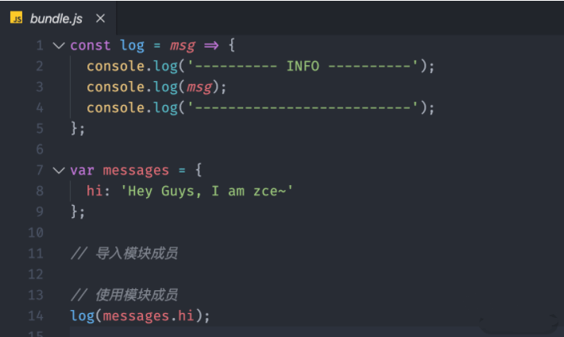

可以看到，代码非常简洁，完成不像`webpack`那样存在大量引导代码和模块函数

并且`error`方法由于没有被使用，输出的结果中并无`error`方法，可以看到，`rollup`默认开始`Tree-shaking` 优化输出结果

因此，可以看到`Rollup`的优点：

- 代码效率更简洁、效率更高
- 默认支持 Tree-shaking

但缺点也十分明显，加载其他类型的资源文件或者支持导入 `CommonJS` 模块，又或是编译 `ES` 新特性，这些额外的需求 `Rollup `需要使用插件去完成

综合来看，`rollup`并不适合开发应用使用，因为需要使用第三方模块，而目前第三方模块大多数使用`CommonJs`方式导出成员，并且`rollup`不支持`HMR`，使开发效率降低

但是在用于打包` JavaScript` 库时，`rollup`比 `webpack` 更有优势，因为其打包出来的代码更小、更快，其存在的缺点可以忽略


### Parcel

Parcel ，是一款完全零配置的前端打包器，它提供了 “傻瓜式” 的使用体验，只需了解简单的命令，就能构建前端应用程序

`Parcel` 跟 `Webpack` 一样都支持以任意类型文件作为打包入口，但建议使用`HTML`文件作为入口，该`HTML`文件像平时一样正常编写代码、引用资源。如下所示：

```js
<!-- ./src/index.html -->
<!DOCTYPE html>
<html lang="en">
<head>
  <meta charset="UTF-8">
  <title>Parcel Tutorials</title>
</head>
<body>
  <script src="main.js"></script>
</body>
</html>
```

main.js文件通过`ES Moudle`方法导入其他模块成员

```js
// ./src/main.js
import { log } from './logger'
log('hello parcel')
// ./src/logger.js
export const log = msg => {
  console.log('---------- INFO ----------')
  console.log(msg)
}
```

运行之后，使用命令打包

```cmd
npx parcel src/index.html
```

执行命令后，`Parcel`不仅打包了应用，同时也启动了一个开发服务器，跟`webpack Dev Server`一样

跟`webpack`类似，也支持模块热替换，但用法更简单

同时，`Parcel`有个十分好用的功能：支持自动安装依赖，像`webpack`开发阶段突然使用安装某个第三方依赖，必然会终止`dev server`然后安装再启动。而`Parcel`则免了这繁琐的工作流程

同时，`Parcel`能够零配置加载其他类型的资源文件，无须像`webpack`那样配置对应的`loader`

打包命令如下：

```cmd
npx parcel src/index.html
```

由于打包过程是多进程同时工作，构建速度会比`Webpack` 快，输出文件也会被压缩，并且样式代码也会被单独提取到单个文件中

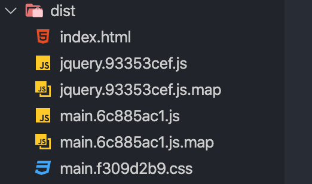

可以感受到，`Parcel `给开发者一种很大的自由度，只管去实现业务代码，其他事情用`Parcel`解决


### Snowpack

Snowpack，是一种闪电般快速的前端构建工具，专为现代`Web`设计，较复杂的打包工具（如`Webpack`或`Parcel`）的替代方案，利用`JavaScript`的本机模块系统，避免不必要的工作并保持流畅的开发体验

开发阶段，每次保存单个文件时，`Webpack`和`Parcel`都需要重新构建和重新打包应用程序的整个`bundle`。而`Snowpack`为你的应用程序每个文件构建一次，就可以永久缓存，文件更改时，`Snowpack`会重新构建该单个文件

下图给出`webpack`与`snowpack`打包区别：

 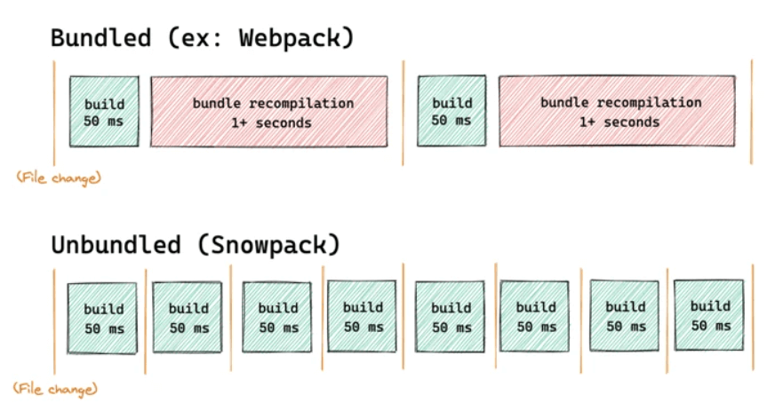

在重新构建每次变更时没有任何的时间浪费，只需要在浏览器中进行HMR更新

### Vite

vite ，是一种新型前端构建工具，能够显著提升前端开发体验

它主要由两部分组成：

- 一个开发服务器，它基于 原生 ES 模块 提供了丰富的内建功能，如速度快到惊人的 [模块热更新HMR
- 一套构建指令，它使用 Rollup打包你的代码，并且它是预配置的，可以输出用于生产环境的优化过的静态资源

其作用类似`webpack `+ `webpack-dev-server`，其特点如下：

- 快速的冷启动
- 即时的模块热更新
- 真正的按需编译

`vite`会直接启动开发服务器，不需要进行打包操作，也就意味着不需要分析模块的依赖、不需要编译，因此启动速度非常快

利用现代浏览器支持`ES Module`的特性，当浏览器请求某个模块的时候，再根据需要对模块的内容进行编译，这种方式大大缩短了编译时间

原理图如下所示：

 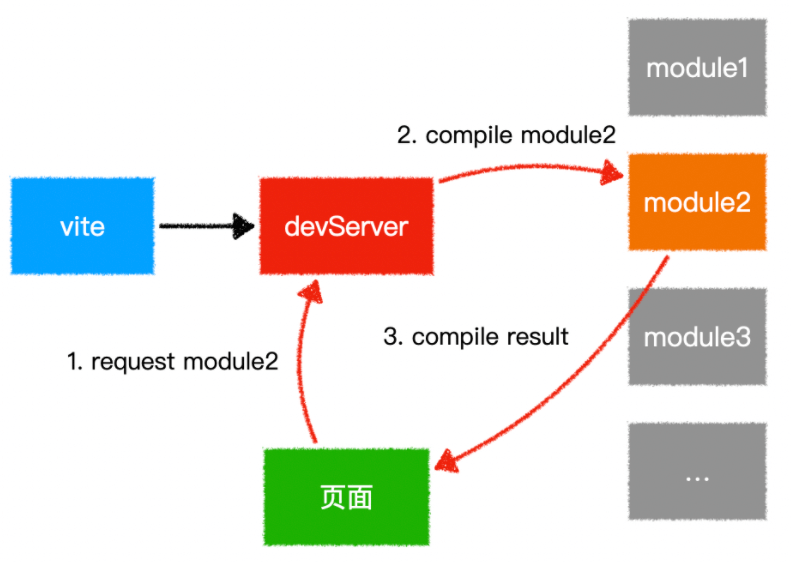

在热模块`HMR`方面，当修改一个模块的时候，仅需让浏览器重新请求该模块即可，无须像`webpack`那样需要把该模块的相关依赖模块全部编译一次，效率更高


### webpack

相比上述的模块化工具，`webpack`大而全，很多常用的功能做到开箱即用。有两大最核心的特点：**一切皆模块**和**按需加载**

与其他构建工具相比，有如下优势：

- 智能解析：对 CommonJS 、 AMD 、ES6 的语法做了兼容
- 万物模块：对 js、css、图片等资源文件都支持打包
- 开箱即用：HRM、Tree-shaking等功能
- 代码分割：可以将代码切割成不同的 chunk，实现按需加载，降低了初始化时间
- 插件系统，具有强大的 Plugin 接口，具有更好的灵活性和扩展性
- 易于调试：支持 SourceUrls 和 SourceMaps
- 快速运行：webpack 使用异步 IO 并具有多级缓存，这使得 webpack 很快且在增量编译上更加快
- 生态环境好：社区更丰富，出现的问题更容易解决


**要点**：
- **Webpack**：灵活性高，功能全面，适合大型应用和复杂需求，但配置可能较复杂。
- **Rollup**：专注于 ES6 模块和库打包，树摇效果好，配置简单。
- **Parcel**：零配置、快速启动，适合快速开发和原型设计。
- **Vite**：现代化的构建工具，提供极速启动和高效开发体验，适合现代前端项目。


---
### 247. 聊聊 vite 和 webpack 的区别

**难度**：★★☆☆☆ | **题型**：QA | **分类**：全部 / 工程化

**题目**：


**参考答案**：
Vite 和 Webpack 都是前端打包工具，它们的作用类似，但实现方式和使用方法有所不同。以下是它们之间的一些区别：

1. **构建速度**：Vite 的构建速度比 Webpack 更快，因为 Vite 在开发环境下使用了浏览器原生的 ES 模块加载，而不是像 Webpack 一样使用打包后的文件进行模块加载。在 Vite 中，每个模块都可以独立地进行编译和缓存，这意味着它只需要重新编译修改过的模块，而不是整个应用程序。这使得 Vite 开发起来更加高效。

2. **配置复杂度**：Vite 的配置相对更简单，因为它无需进行大量的配置，只需指定一些基本的选项就可以开始开发。Webpack 的配置更加复杂，需要针对具体项目进行不同的配置，且需要理解各种插件、Loader 等概念。

3. **生态环境**：Webpack 的生态环境更加成熟，在社区中拥有广泛的支持和丰富的插件库。而 Vite 尚处于发展阶段，尽管其已经获得了很多关注，但其生态系统仍然不太完善。

4. **功能特性**：Webpack 是一个功能更加全面的打包工具，支持各种 Loader 和插件，可以处理多种类型的文件和资源。而 Vite 的设计初衷是专注于开发环境下的快速构建，因此其对一些高级特性的支持相对较少。

综上所述，Vite 更适合用于开发环境下的快速构建，而 Webpack 则更适合用于生产环境下的复杂应用程序的打包处理。选择使用哪种工具需要根据具体项目需求进行评估。

**要点**：
- **Webpack**：成熟的模块打包工具，功能强大但配置复杂，适合需要高度定制和复杂构建需求的项目。
- **Vite**：现代化的开发工具，提供快速的开发体验和优化的生产构建，适合追求开发效率和现代化特性的项目。

选择 Vite 还是 Webpack 取决于项目的需求和开发团队的偏好。如果重点是开发体验和快速反馈，Vite 是一个很好的选择。如果需要高度定制化和广泛的插件支持，Webpack 可能更适合。


---
### 296. 什么情况下会导致 webpack treeShaking 失效？

**难度**：★★★☆☆ | **题型**：QA | **分类**：全部 / 工程化

**题目**：


**参考答案**：
Webpack 的 tree-shaking 是一种优化技术，用于去除未使用的代码，从而减小最终打包文件的大小。尽管 tree-shaking 是一个强大的工具，但在一些情况下，它可能会失效。以下是导致 Webpack tree-shaking 失效的一些常见情况：

### **1. 未使用 ES6 模块语法**

- **问题**：Webpack 的 tree-shaking 依赖于 ES6 模块语法（`import` 和 `export`）来确定哪些代码是未使用的。如果你使用了 CommonJS 模块语法（`require` 和 `module.exports`），Webpack 将无法进行有效的 tree-shaking。
- **解决方案**：确保在你的代码中使用 ES6 模块语法。

### **2. 动态导入和动态属性访问**

- **问题**：动态导入（`import()`）和动态属性访问（例如 `require(variable)` 或 `import(variable)`）使得 Webpack 无法静态分析和确定哪些模块或代码是未使用的。
- **解决方案**：尽量避免在 tree-shaking 的上下文中使用动态导入或动态属性访问。如果必须使用，确保它们在编译时能够被正确解析。

### **3. 非纯函数的副作用**

- **问题**：如果模块或函数具有副作用（例如修改全局状态、改变外部变量），Webpack 可能无法安全地移除这些模块，因为它不能确定这些副作用是否被实际使用。
- **解决方案**：将副作用从纯函数中分离，并使用 `sideEffects` 配置项告诉 Webpack 哪些模块有副作用，哪些没有副作用。

### **4. Webpack 配置问题**

- **问题**：错误的 Webpack 配置可能会导致 tree-shaking 失效。例如，`mode` 配置项应该设置为 `'production'`，因为 Webpack 在开发模式下不会进行 tree-shaking。
- **解决方案**：确保 Webpack 的 `mode` 配置为 `'production'`，并检查 `optimization` 配置项以确保启用了相关的优化选项。

### **5. `package.json` 中的 `sideEffects` 配置**

- **问题**：如果 `package.json` 文件中的 `sideEffects` 配置不正确，Webpack 可能会保留那些实际上可以被移除的代码。
- **解决方案**：确保在 `package.json` 中正确配置 `sideEffects` 字段。例如，如果你的项目没有副作用的代码，可以将其设置为 `false`，否则需要显式列出哪些文件或模块有副作用。

### **6. 引用外部库**

- **问题**：引用外部库时，如果外部库没有正确使用 ES6 模块语法，Webpack 无法进行有效的 tree-shaking。
- **解决方案**：选择支持 ES6 模块语法的外部库，并尽量避免引用不支持 tree-shaking 的库。

### **7. Webpack 插件和加载器**

- **问题**：某些 Webpack 插件和加载器可能会影响 tree-shaking 过程。例如，某些插件可能会在构建过程中引入额外的代码或修改输出。
- **解决方案**：仔细检查使用的插件和加载器，确保它们不会干扰 tree-shaking 过程。使用官方推荐的插件和加载器，以确保与 Webpack 的兼容性。

**要点**：
- 使用 ES6 模块语法 (`import`/`export`)
- 避免动态导入和动态属性访问
- 确保代码没有副作用或正确配置 `sideEffects`
- 确保 Webpack 配置正确，`mode` 设置为 `'production'`
- 选择支持 ES6 模块的外部库
- 注意 Webpack 插件和加载器的影响

---
### 303. 说下Vite的原理

**难度**：★★★★☆ | **题型**：QA | **分类**：全部 / Vue.js / 工程化

**题目**：


**参考答案**：
# 背景
这里的背景介绍会从与`Vite`紧密相关的两个概念的发展史说起，一个是`JavaScript`的模块化标准，另一个是前端构建工具。

### 共存的模块化标准
为什么`JavaScript`会有多种共存的模块化标准？因为js在设计之初并没有模块化的概念，随着前端业务复杂度不断提高，模块化越来越受到开发者的重视，社区开始涌现多种模块化解决方案，它们相互借鉴，也争议不断，形成多个派系，从`CommonJS`开始，到`ES6`正式推出`ES Modules`规范结束，所有争论，终成历史，`ES Modules`也成为前端重要的基础设施。

- **CommonJS**：现主要用于Node.js（Node@13.2.0开始支持直接使用ES Module）
- **AMD**：`require.js` 依赖前置，市场存量不建议使用
- **CMD**：`sea.js` 就近执行，市场存量不建议使用
- **ES Module**：ES语言规范，标准，趋势，未来

对模块化发展史感兴趣的可以看下[《前端模块化开发那点历史》@玉伯](https://github.com/seajs/seajs/issues/588 "《前端模块化开发那点历史》")，而`Vite`的核心正是依靠浏览器对ES Module规范的实现。

### 发展中的构建工具

近些年前端工程化发展迅速，各种构建工具层出不穷，目前`Webpack`仍然占据统治地位，npm 每周下载量达到两千多万次。下面是我按 npm 发版时间线列出的开发者比较熟知的一些构建工具。

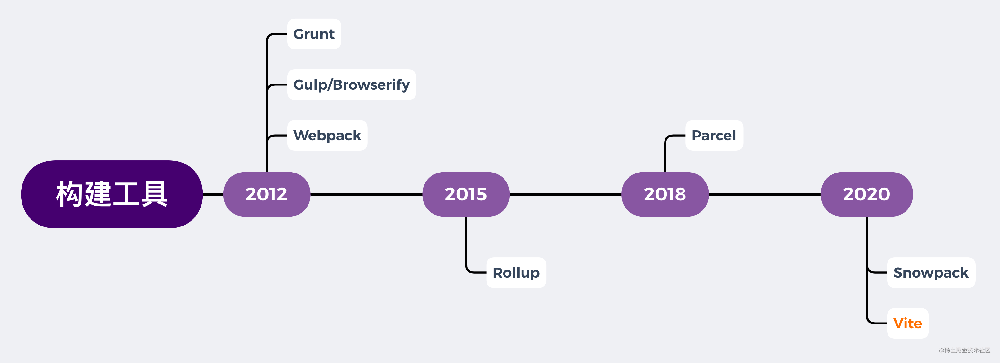


### 当前工程化痛点

现在常用的构建工具如`Webpack`，主要是通过抓取-编译-构建整个应用的代码（也就是常说的打包过程），生成一份编译、优化后能良好兼容各个浏览器的的生产环境代码。在开发环境流程也基本相同，需要先将整个应用构建打包后，再把打包后的代码交给`dev server`（开发服务器）。

`Webpack`等构建工具的诞生给前端开发带来了极大的便利，但随着前端业务的复杂化，js代码量呈指数增长，打包构建时间越来越久，`dev server`（开发服务器）性能遇到瓶颈：
- **缓慢的服务启动：** 大型项目中`dev server`启动时间达到几十秒甚至几分钟。

- **缓慢的HMR热更新：** 即使采用了 HMR 模式，其热更新速度也会随着应用规模的增长而显著下降，已达到性能瓶颈，无多少优化空间。

**缓慢的开发环境，大大降低了开发者的幸福感，在以上背景下`Vite`应运而生。**

---

# 什么是Vite？
**基于esbuild与Rollup，依靠浏览器自身ESM编译功能， 实现极致开发体验的新一代构建工具！**

### 概念
先介绍以下文中会经常提到的一些基础概念：
- **依赖：** 指开发不会变动的部分(npm包、UI组件库)，esbuild进行预构建。
- **源码：** 浏览器不能直接执行的非js代码(.jsx、.css、.vue等)，vite只在浏览器请求相关源码的时候进行转换，以提供ESM源码。

### 开发环境
- 利用浏览器原生的`ES Module`编译能力，省略费时的编译环节，直给浏览器开发环境源码，`dev server`只提供轻量服务。
- 浏览器执行ESM的`import`时，会向`dev server`发起该模块的`ajax`请求，服务器对源码做简单处理后返回给浏览器。
- `Vite`中HMR是在原生 ESM 上执行的。当编辑一个文件时，Vite 只需要精确地使已编辑的模块失活，使得无论应用大小如何，HMR 始终能保持快速更新。
- 使用`esbuild`处理项目依赖，`esbuild`使用go编写，比一般`node.js`编写的编译器快几个数量级。

### 生产环境
- 集成`Rollup`打包生产环境代码，依赖其成熟稳定的生态与更简洁的插件机制。

### 处理流程对比
`Webpack`通过先将整个应用打包，再将打包后代码提供给`dev server`，开发者才能开始开发。

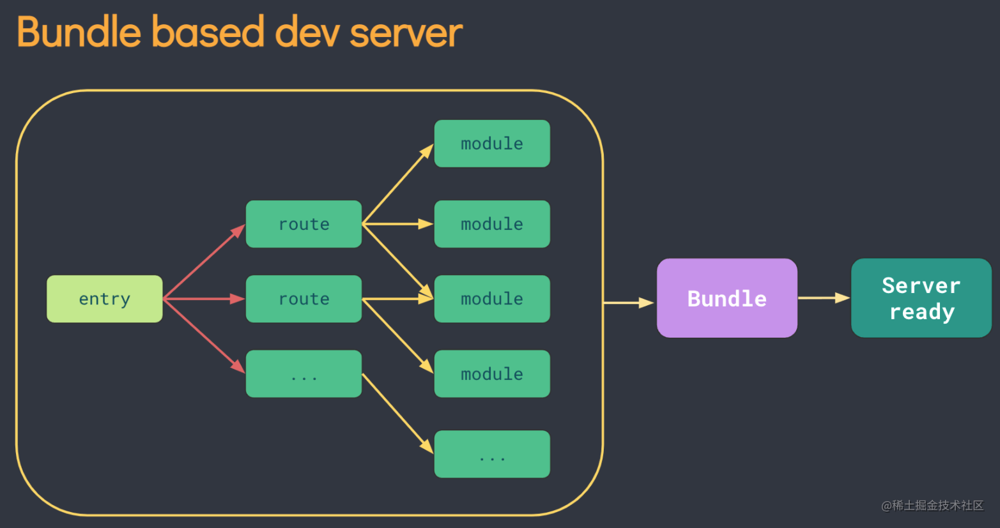


`Vite`直接将源码交给浏览器，实现`dev server`秒开，浏览器显示页面需要相关模块时，再向`dev server`发起请求，服务器简单处理后，将该模块返回给浏览器，实现真正意义的按需加载。
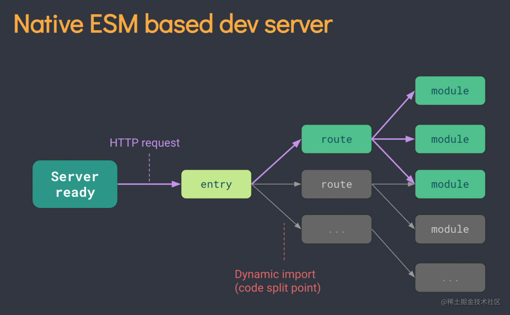

---
# 基本用法
### 创建vite项目
```shell
$ npm create vite@latest
```
### 选取模板
`Vite` 内置6种常用模板与对应的TS版本，可满足前端大部分开发场景，可以点击下列表格中模板直接在 [StackBlitz](https://vite.new/ "StackBlitz") 中在线试用，还有其他更多的 [社区维护模板](https://github.com/vitejs/awesome-vite#templates "社区维护模板")可以使用。
|JavaScript                          | TypeScript                                |
| ----------------------------------- | ----------------------------------------- |
| [vanilla](https://vite.new/vanilla) | [vanilla-ts](https://vite.new/vanilla-ts) |
| [vue](https://vite.new/vue)         | [vue-ts](https://vite.new/vue-ts)         |
| [react](https://vite.new/react)     | [react-ts](https://vite.new/react-ts)     |
| [preact](https://vite.new/preact)   | [preact-ts](https://vite.new/preact-ts)   |
| [lit](https://vite.new/lit)         | [lit-ts](https://vite.new/lit-ts)         |
| [svelte](https://vite.new/svelte)   | [svelte-ts](https://vite.new/svelte-ts)|

### 启动
```json
{
  "scripts": {
    "dev": "vite", // 启动开发服务器，别名：`vite dev`，`vite serve`
    "build": "vite build", // 为生产环境构建产物
    "preview": "vite preview" // 本地预览生产构建产物
  }
}
```
---
# 实现原理

### ESbuild 编译
`esbuild` 使用go编写，cpu密集下更具性能优势，编译速度更快，以下摘自官网的构建速度对比：   
**浏览器：“开始了吗？”**   
**服务器：“已经结束了。”**   
**开发者：“好快，好喜欢！！”**

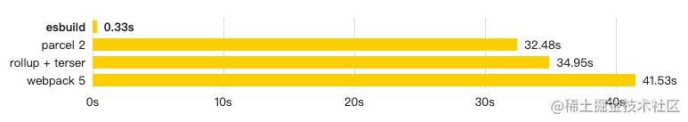


### 依赖预构建

- **模块化兼容：** 如开头背景所写，现仍共存多种模块化标准代码，`Vite`在预构建阶段将依赖中各种其他模块化规范(CommonJS、UMD)转换 成ESM，以提供给浏览器。
- **性能优化：** npm包中大量的ESM代码，大量的`import`请求，会造成网络拥塞。`Vite`使用`esbuild`，将有大量内部模块的ESM关系转换成单个模块，以减少 `import`模块请求次数。

### 按需加载

- 服务器只在接受到import请求的时候，才会编译对应的文件，将ESM源码返回给浏览器，实现真正的按需加载。

### 缓存

- **HTTP缓存：** 充分利用`http`缓存做优化，依赖（不会变动的代码）部分用max-age,immutable **强缓存**，源码部分用304**协商缓存**，提升页面打开速度。
- **文件系统缓存：** `Vite`在预构建阶段，将构建后的依赖缓存到`node_modules/.vite` ，相关配置更改时，或手动控制时才会重新构建，以提升预构建速度。

### 重写模块路径

浏览器`import`只能引入相对/绝对路径，而开发代码经常使用`npm`包名直接引入`node_module`中的模块，需要做路径转换后交给浏览器。
- `es-module-lexer` 扫描 import 语法
- `magic-string` 重写模块的引入路径

```js
// 开发代码
import { createApp } from 'vue'

// 转换后
import { createApp } from '/node_modules/vue/dist/vue.js'
```


# 源码分析
与`Webpack-dev-server`类似`Vite`同样使用`WebSocket`与客户端建立连接，实现热更新，源码实现基本可分为两部分，源码位置在:

- `vite/packages/vite/src/client` client（用于客户端）
- `vite/packages/vite/src/node` server（用于开发服务器）

client 代码会在启动服务时注入到客户端，用于客户端对于`WebSocket`消息的处理（如更新页面某个模块、刷新页面）；server 代码是服务端逻辑，用于处理代码的构建与页面模块的请求。

简单看了下源码（vite@2.7.2），核心功能主要是以下几个方法（以下为源码截取，部分逻辑做了删减）：   
1. 命令行启动服务`npm run dev`后，源码执行`cli.ts`，调用`createServer`方法，创建http服务，监听开发服务器端口。

```js
// 源码位置 vite/packages/vite/src/node/cli.ts
const { createServer } = await import('./server')
try {
    const server = await createServer({
        root,
        base: options.base,
        ...
    })
    if (!server.httpServer) {
        throw new Error('HTTP server not available')
    }
    await server.listen()
}
```
2. `createServer`方法的执行做了很多工作，如整合配置项、创建http服务（早期通过koa创建）、创建`WebSocket`服务、创建源码的文件监听、插件执行、optimize优化等。下面注释中标出。

```js
// 源码位置 vite/packages/vite/src/node/server/index.ts
export async function createServer(
    inlineConfig: InlineConfig = {}
): Promise<ViteDevServer> {
    // Vite 配置整合
    const config = await resolveConfig(inlineConfig, 'serve', 'development')
    const root = config.root
    const serverConfig = config.server

    // 创建http服务
    const httpServer = await resolveHttpServer(serverConfig, middlewares, httpsOptions)

    // 创建ws服务
    const ws = createWebSocketServer(httpServer, config, httpsOptions)

    // 创建watcher，设置代码文件监听
    const watcher = chokidar.watch(path.resolve(root), {
        ignored: [
            '**/node_modules/**',
            '**/.git/**',
            ...(Array.isArray(ignored) ? ignored : [ignored])
        ],
        ...watchOptions
    }) as FSWatcher

    // 创建server对象
    const server: ViteDevServer = {
        config,
        middlewares,
        httpServer,
        watcher,
        ws,
        moduleGraph,
        listen,
        ...
    }

    // 文件监听变动，websocket向前端通信
    watcher.on('change', async (file) => {
        ...
        handleHMRUpdate()
    })

    // 非常多的 middleware
    middlewares.use(...)
    
    // optimize
    const runOptimize = async () => {...}

    return server
}
```
3. 使用[chokidar](https://www.npmjs.com/package/chokidar "chokidar")监听文件变化，绑定监听事件。

```js
// 源码位置 vite/packages/vite/src/node/server/index.ts
  const watcher = chokidar.watch(path.resolve(root), {
    ignored: [
      '**/node_modules/**',
      '**/.git/**',
      ...(Array.isArray(ignored) ? ignored : [ignored])
    ],
    ignoreInitial: true,
    ignorePermissionErrors: true,
    disableGlobbing: true,
    ...watchOptions
  }) as FSWatcher
```

4. 通过 [ws](https://www.npmjs.com/package/ws "ws") 来创建`WebSocket`服务，用于监听到文件变化时触发热更新，向客户端发送消息。

```js
// 源码位置 vite/packages/vite/src/node/server/ws.ts
export function createWebSocketServer(...){
    let wss: WebSocket
    const hmr = isObject(config.server.hmr) && config.server.hmr
    const wsServer = (hmr && hmr.server) || server

    if (wsServer) {
        wss = new WebSocket({ noServer: true })
        wsServer.on('upgrade', (req, socket, head) => {
            // 服务就绪
            if (req.headers['sec-websocket-protocol'] === HMR_HEADER) {
                wss.handleUpgrade(req, socket as Socket, head, (ws) => {
                    wss.emit('connection', ws, req)
                })
            }
        })
    } else {
        ...
    }
    // 服务准备就绪，就能在浏览器控制台看到熟悉的打印 [vite] connected.
    wss.on('connection', (socket) => {
        socket.send(JSON.stringify({ type: 'connected' }))
        ...
    })
    // 失败
    wss.on('error', (e: Error & { code: string }) => {
        ...
    })
    // 返回ws对象
    return {
        on: wss.on.bind(wss),
        off: wss.off.bind(wss),
        // 向客户端发送信息
        // 多个客户端同时触发
        send(payload: HMRPayload) {
            const stringified = JSON.stringify(payload)
            wss.clients.forEach((client) => {
                // readyState 1 means the connection is open
                client.send(stringified)
            })
        }
    }
}
```
5. 在服务启动时会向浏览器注入代码，用于处理客户端接收到的`WebSocket`消息，如重新发起模块请求、刷新页面。

```js
//源码位置 vite/packages/vite/src/client/client.ts
async function handleMessage(payload: HMRPayload) {
  switch (payload.type) {
    case 'connected':
      console.log(`[vite] connected.`)
      break
    case 'update':
      notifyListeners('vite:beforeUpdate', payload)
      ...
      break
    case 'custom': {
      notifyListeners(payload.event as CustomEventName<any>, payload.data)
      ...
      break
    }
    case 'full-reload':
      notifyListeners('vite:beforeFullReload', payload)
      ...
      break
    case 'prune':
      notifyListeners('vite:beforePrune', payload)
      ...
      break
    case 'error': {
      notifyListeners('vite:error', payload)
      ...
      break
    }
    default: {
      const check: never = payload
      return check
    }
  }
}
```
---

# 优势

- 快！快！非常快！！
- 高度集成，开箱即用。
- 基于ESM急速热更新，无需打包编译。
- 基于`esbuild`的依赖预处理，比`Webpack`等node编写的编译器快几个数量级。
- 兼容`Rollup`庞大的插件机制，插件开发更简洁。
- 不与`Vue`绑定，支持`React`等其他框架，独立的构建工具。
- 内置SSR支持。
- 天然支持TS。

# 不足
- `Vue`仍为第一优先支持，量身定做的编译插件，对`React`的支持不如`Vue`强大。
- 虽然已经推出2.0正式版，已经可以用于正式线上生产，但目前市场上实践少。
- 生产环境集成`Rollup`打包，与开发环境最终执行的代码不一致。
---
# 与 webpack 对比
由于`Vite`主打的是开发环境的极致体验，生产环境集成`Rollup`，这里的对比主要是`Webpack-dev-server`与`Vite-dev-server`的对比：

- 到目前很长时间以来`Webpack`在前端工程领域占统治地位，`Vite`推出以来备受关注，社区活跃，GitHub star 数量激增，目前达到37.4K
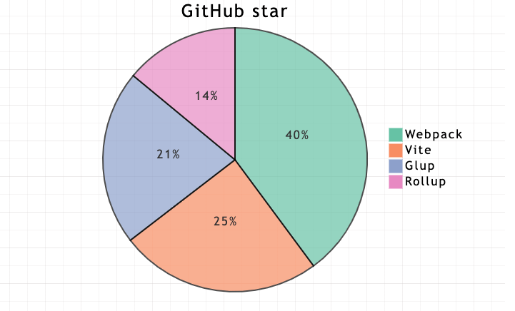
- `Webpack`配置丰富使用极为灵活但上手成本高，`Vite`开箱即用配置高度集成
- `Webpack`启动服务需打包构建，速度慢，`Vite`免编译可秒开
- `Webpack`热更新需打包构建，速度慢，`Vite`毫秒响应
- `Webpack`成熟稳定、资源丰富、大量实践案例，`Vite`实践较少
- `Vite`使用`esbuild`编译，构建速度比`webpack`快几个数量级
---
# 兼容性
- 默认目标浏览器是在`script`标签上支持原生 ESM 和 原生 ESM 动态导入
- 可使用官方插件 `@vitejs/plugin-legacy`，转义成传统版本和相对应的`polyfill`
---
# 未来探索
- 传统构建工具性能已到瓶颈，主打开发体验的`Vite`，可能会受到欢迎。
- 主流浏览器基本支持ESM，ESM将成为主流。
- `Vite`在`Vue3.0`代替`vue-cli`，作为官方脚手架，会大大提高使用量。
- `Vite2.0`推出后，已可以在实际项目中使用`Vite`。
- 如果觉得直接使用`Vite`太冒险，又确实有`dev server`速度慢的问题需要解决，可以尝试用`Vite`单独搭建一套`dev server`
---
# 相关资源
### 官方插件
除了支持现有的`Rollup`插件系统外，官方提供了四个最关键的插件
- `@vitejs/plugin-vue` 提供 Vue3 单文件组件支持
- `@vitejs/plugin-vue-jsx`  提供 Vue3 JSX 支持（专用的 Babel 转换插件）
- `@vitejs/plugin-react` 提供完整的 React 支持
- `@vitejs/plugin-legacy` 为打包后的文件提供传统浏览器兼容性支持


**要点**：
Vite 是一个基于 ESbuild 和 Rollup 的新一代前端构建工具，它旨在提供极致的开发体验。Vite 的工作原理包括依赖预构建、按需加载和文件系统缓存等，这些特性使得 Vite 在开发环境中能够快速启动和响应。Vite 的主要特点包括：

1. **快速启动**：Vite 利用浏览器原生的 ES Module 解析能力，直接提供开发环境源码，无需等待整个应用的构建。
2. **按需编译**：Vite 只在浏览器请求相关模块时进行编译，从而实现真正的按需加载。
3. **依赖预构建**：Vite 使用 esbuild 对项目依赖进行预构建，以提高编译速度。
4. **缓存优化**：Vite 利用 HTTP 缓存和文件系统缓存来优化性能。
5. **生产环境集成**：Vite 集成 Rollup 进行生产环境打包，提供成熟的插件机制。
6. **高度集成**：Vite 提供了开箱即用的配置，简化了开发流程。
7. **支持多种框架**：Vite 不仅支持 Vue，也支持 React 等其他框架。
8. **内置 SSR 支持**：Vite 内置了服务端渲染支持。
9. **TypeScript 支持**：Vite 原生支持 TypeScript。

Vite 与 Webpack 的主要区别在于 Vite 更注重开发环境的性能，而 Webpack 则提供了更丰富的配置和更灵活的构建流程。尽管 Vite 在生产环境中使用 Rollup 打包，但它的开发环境体验已经足够强大，适合大多数前端开发需求。


---
### 334. ES6 代码转成 ES5 代码的实现思路是什么？

**难度**：★★★☆☆ | **题型**：QA | **分类**：全部 / 工程化

**题目**：


**参考答案**：
将 ES6 代码转换为 ES5 代码的过程涉及将新特性和语法转换成 ES5 兼容的代码。这个过程通常由 JavaScript 转换器（如 Babel）自动完成，但了解其实现思路是很有帮助的。以下是实现思路的概述：

### **1. 词法分析（Lexical Analysis）**

- **目标**：将源代码分解为更小的部分（tokens），例如关键字、标识符、操作符等。
- **步骤**：
  - 读取源代码字符流。
  - 将字符流转换为一系列的 tokens（例如 `let`, `const`, `=>`）。

### **2. 语法分析（Parsing）**

- **目标**：将 tokens 转换为抽象语法树（AST）。
- **步骤**：
  - 解析 tokens 以构建一个表示代码结构的树形结构（AST）。
  - AST 是代码的语法结构模型，包含了代码的所有语法信息。

### **3. 代码转换（Code Transformation）**

- **目标**：将 AST 中的 ES6 特性转换为 ES5 兼容的代码。
- **步骤**：
  - **箭头函数**：将箭头函数转换为普通函数。
  - **类和构造函数**：将 ES6 类转换为 ES5 构造函数和原型方法。
  - **模板字符串**：将模板字符串转换为字符串连接操作。
  - **`let` 和 `const`**：将块级作用域的变量替换为使用 `var`。
  - **解构赋值**：将解构赋值语法转换为传统的赋值语法。
  - **生成器**：将生成器函数转换为普通函数，使用生成器实现机制（如迭代器）。
  - **Promise**：将 Promise 对象转换为 ES5 兼容的异步处理方法。
  - **模块**：将 ES6 模块导入和导出转换为 ES5 模块定义（如使用 CommonJS）。

### **4. 生成代码（Code Generation）**

- **目标**：将转换后的 AST 重新生成为源代码。
- **步骤**：
  - 遍历转换后的 AST。
  - 生成对应的 ES5 代码字符串。

### **5. 优化和代码美化（Optional）**

- **目标**：对生成的代码进行优化和美化，以提高性能和可读性。
- **步骤**：
  - 进行代码压缩、去除多余的空格和注释。
  - 合并和优化代码结构。

### **示例**

假设我们有一个简单的 ES6 代码：

```javascript
const add = (a, b) => a + b;
```

转换为 ES5 的过程如下：

1. **词法分析**：将代码分解为 tokens，如 `const`, `add`, `=`, `()`, `=>`, `a + b`.
2. **语法分析**：构建 AST，表示函数声明和箭头函数。
3. **代码转换**：
   - 将箭头函数转换为普通函数。
   - 替换 `const` 为 `var`（如果需要支持旧版环境）。

转换后的 ES5 代码：

```javascript
var add = function(a, b) {
  return a + b;
};
```

**要点**：
ES6 到 ES5 的转换包括解析、转换和生成步骤，涵盖了各种 ES6 新特性的处理。使用工具如 Babel，可以自动完成这些步骤，帮助开发者在不同环境中保持代码的兼容性。

---
### 343. babel-runtime 有什么作用？

**难度**：★★★☆☆ | **题型**：QA | **分类**：全部 / 工程化

**题目**：


**参考答案**：
`babel-runtime` 是 Babel 生态中的核心工具库，主要用于解决代码转换过程中的**重复辅助函数注入**和**全局污染**问题。

其作用机制和实际价值可从以下几个维度深入分析：

### 一、核心作用原理
1. **辅助函数集中管理**  
   当 Babel 转换 ES6+ 语法（如 `class`、`async/await`）时，会自动生成一些辅助函数（helper functions）。默认情况下这些函数会被直接插入到每个需要它们的文件中，导致：
   - 多个文件存在相同的函数定义
   - 打包后代码体积冗余

   `babel-runtime` 将这些辅助函数统一抽取到独立的模块中，通过 `require` 引用，避免重复定义。

2. **全局命名空间保护**  
   对于 `Promise`、`Symbol` 等新 API 的 polyfill，传统方案会直接修改全局对象。而 `babel-runtime` 通过模拟独立的沙箱环境提供这些功能，避免与其他库或业务代码冲突。

### 二、典型应用场景
#### 1. 库/组件开发
```javascript
// 原始代码
class MyComponent {} 

// 传统 Babel 转换后（无 runtime）
function _classCallCheck(instance, Constructor) { /*...*/ } // 重复注入
var MyComponent = function MyComponent() {
  _classCallCheck(this, MyComponent);
};

// 使用 babel-runtime 转换后
var _classCallCheck2 = require("babel-runtime/helpers/classCallCheck");
var MyComponent = function MyComponent() {
  (0, _classCallCheck2.default)(this, MyComponent);
};
```

#### 2. 按需 polyfill 加载
```javascript
// 配置 .babelrc
{
  "plugins": [
    ["transform-runtime", {
      "polyfill": false, // 仅使用 helpers
      "regenerator": true // 单独处理 generator
    }]
  ]
}
```

### 三、技术实现细节
1. **运行时依赖结构**  
   `babel-runtime` 提供的模块包括：
   - `helpers/`: 编译生成的辅助函数（如 `_extends`、`_asyncToGenerator`）
   - `core-js/`: 按需加载的 polyfill（如 `Symbol`、`Promise`）
   - `regenerator/`: 处理 generator 函数的运行时

2. **与 `babel-polyfill` 的差异**  
   | 特性                | `babel-runtime`                  | `babel-polyfill`       |
   |---------------------|----------------------------------|------------------------|
   | 引入方式            | 按需模块化引入                   | 全局一次性引入         |
   | 污染全局            | 否                               | 是                     |
   | 适用场景            | 库开发                           | 应用开发               |
   | 体积影响            | 按需加载，更优                   | 全量引入，体积较大     |


### 四、最佳实践方案
1. **项目配置**  
   安装必要依赖：
   ```bash
   npm install --save-dev @babel/plugin-transform-runtime
   npm install --save @babel/runtime
   ```

2. **Babel 插件配置**  
   ```javascript
   // babel.config.js
   module.exports = {
     plugins: [
       ["@babel/plugin-transform-runtime", {
         "absoluteRuntime": false,
         "corejs": 3, // 指定 core-js 版本
         "version": "^7.15.0" // runtime 版本
       }]
     ]
   };
   ```

3. **Tree-shaking 优化**  
   配合 Webpack/Rollup 的 treeshaking 功能，可进一步消除未使用的 runtime 模块。

### 五、性能影响分析
1. **打包体积对比**  
   - 未使用 runtime：辅助函数在每个文件重复出现，500KB 项目可能增加 50-100KB  
   - 使用 runtime：辅助函数集中引用，相同项目仅增加 10-20KB

2. **内存占用**  
   运行时模块会被浏览器缓存，多个页面共用同一份 runtime 代码。

**要点**：
- **代码复用**：解决辅助函数重复定义问题，优化打包体积  
- **环境隔离**：避免 polyfill 污染全局命名空间  
- **工程规范**：适合公共库开发，保证代码纯净度  
- **按需加载**：配合 `core-js` 可实现精细化的 polyfill 控制  
- **生态协同**：需与 `@babel/plugin-transform-runtime` 插件配合使用

---
### 379. webpack 分包的方式有哪些？

**难度**：★★★☆☆ | **题型**：QA | **分类**：全部 / 工程化

**题目**：


**参考答案**：
在 Webpack 中，分包（或代码分割）是一种优化技术，用于将应用程序的代码拆分成多个较小的包，从而提高加载性能和效率。

Webpack 提供了多种方式来实现代码分割：

### **1. 入口点分割（Entry Points Split）**

**定义**：通过配置多个入口点，将应用程序分成多个独立的包。每个入口点可以生成一个单独的 bundle。

**示例**：
```javascript
module.exports = {
  entry: {
    app: './src/app.js',
    admin: './src/admin.js'
  },
  output: {
    filename: '[name].bundle.js',
    path: path.resolve(__dirname, 'dist')
  }
};
```

在这个例子中，`app` 和 `admin` 是两个入口点，每个入口点生成一个独立的 bundle 文件。

### **2. 动态导入（Dynamic Imports）**

**定义**：使用 `import()` 函数动态加载模块。Webpack 会将动态导入的模块分割成单独的 chunks，在需要时异步加载。

**示例**：
```javascript
// 在需要的时候动态加载模块
function loadComponent() {
  import('./components/MyComponent')
    .then(module => {
      const MyComponent = module.default;
      // 使用 MyComponent
    })
    .catch(err => {
      console.error('Failed to load component', err);
    });
}
```

### **3. 提取公共代码（CommonsChunkPlugin）**

**定义**：提取多个入口点之间的公共模块到一个单独的 bundle 中。Webpack 4 及以上版本使用了 `optimization.splitChunks` 取代 `CommonsChunkPlugin`。

**示例**（Webpack 4+）：
```javascript
module.exports = {
  optimization: {
    splitChunks: {
      chunks: 'all'
    }
  }
};
```

`splitChunks` 插件会分析所有的 chunks，并提取出公共模块，生成一个或多个独立的公共 chunks。

### **4. 异步组件（Code-Splitting with React.lazy）**

**定义**：在 React 中使用 `React.lazy` 和 `Suspense` 实现组件的异步加载。

**示例**：
```javascript
import React, { Suspense, lazy } from 'react';

const MyComponent = lazy(() => import('./MyComponent'));

function App() {
  return (
    <div>
      <Suspense fallback={<div>Loading...</div>}>
        <MyComponent />
      </Suspense>
    </div>
  );
}
```

在这个例子中，`MyComponent` 会在需要时异步加载。

### **5. 动态导入和懒加载**

**定义**：使用动态导入实现懒加载，将大文件或不常用的代码按需加载，减少初始加载时间。

**示例**：
```javascript
const loadLibrary = () => {
  return import('some-library')
    .then(library => {
      // 使用加载的库
    });
};
```

### **6. 提取第三方库（ExtractPlugin）**

**定义**：使用 `MiniCssExtractPlugin` 提取 CSS 样式到单独的文件。对于较大的项目，常常将样式单独分割出来有助于缓存和优化。

**示例**：
```javascript
const MiniCssExtractPlugin = require('mini-css-extract-plugin');

module.exports = {
  module: {
    rules: [
      {
        test: /\.css$/,
        use: [MiniCssExtractPlugin.loader, 'css-loader']
      }
    ]
  },
  plugins: [
    new MiniCssExtractPlugin({
      filename: '[name].css'
    })
  ]
};
```

### **7. Webpack 插件**

Webpack 插件可以进一步帮助你优化代码分割。例如：

- **BundleAnalyzerPlugin**：可视化显示打包后的 bundle 文件，以便分析和优化代码分割。
- **CompressionWebpackPlugin**：对生成的 bundle 进行压缩以减少文件体积。

**示例**：
```javascript
const BundleAnalyzerPlugin = require('webpack-bundle-analyzer').BundleAnalyzerPlugin;

module.exports = {
  plugins: [
    new BundleAnalyzerPlugin()
  ]
};
```

**要点**：
Webpack 提供了多种代码分割的方式，包括入口点分割、动态导入、提取公共代码、异步组件、动态导入和懒加载、提取第三方库等。这些技术可以帮助优化应用程序的加载性能和效率，使用户体验更加流畅。

---
### 381. 如何组织 monorepo 工程？

**难度**：★★☆☆☆ | **题型**：QA | **分类**：全部 / 工程化

**题目**：


**参考答案**：
组织 monorepo 工程（单一代码库管理多个项目或包）是一个关键的工程管理任务。它需要合理的结构和工具，以确保项目的可维护性、可扩展性和协作效率。以下是一些常见的实践和工具来组织 monorepo 工程：

### **1. 项目结构**

#### **目录结构**

- **根目录**：包含全局配置文件（如 `package.json`、`tsconfig.json`）、构建工具配置、CI/CD 配置等。
- **`packages/` 或 `modules/` 目录**：包含多个子项目或包，每个包有自己的目录。
  - 每个包应包含自己的 `package.json` 文件、源代码、测试文件等。
- **`libs/` 目录**：可以用于共享库或工具模块，这些库可以被多个子项目使用。
- **`scripts/` 目录**：包含用于构建、测试、发布等的脚本。
- **`docs/` 目录**：包含文档，如项目说明、开发指南等。

#### **示例结构**

```
monorepo/
├── packages/
│   ├── app1/
│   │   ├── src/
│   │   ├── package.json
│   │   └── ...
│   ├── app2/
│   │   ├── src/
│   │   ├── package.json
│   │   └── ...
│   └── lib/
│       ├── src/
│       ├── package.json
│       └── ...
├── scripts/
├── docs/
├── package.json
└── tsconfig.json
```

### **2. 工具和框架**

#### **包管理**

- **[Lerna](https://lerna.js.org/)**：管理 JavaScript 项目的多包仓库，提供版本控制、包发布、依赖管理等功能。
- **[Yarn Workspaces](https://classic.yarnpkg.com/en/docs/workspaces/)**：通过 workspaces 支持多包管理，可以优化依赖安装和提升构建效率。
- **[Nx](https://nx.dev/)**：支持 monorepo 的开发工具，提供高级功能，如构建优化、依赖图分析、代码生成等。

#### **构建工具**

- **[Webpack](https://webpack.js.org/)**：用于打包和构建 JavaScript 和资源文件。
- **[Vite](https://vitejs.dev/)**：现代前端构建工具，提供更快的开发和构建体验。
- **[Babel](https://babeljs.io/)**：用于转译现代 JavaScript 代码，使其兼容旧版浏览器。

#### **CI/CD 工具**

- **[GitHub Actions](https://github.com/features/actions)**、**[GitLab CI](https://docs.gitlab.com/ee/ci/)**、**[CircleCI](https://circleci.com/)**：用于自动化构建、测试和部署流程。

### **3. 版本控制和依赖管理**

#### **版本控制**

- **单一版本**：所有包使用相同的版本号，可以简化发布和版本管理，但可能需要更多的协调。
- **独立版本**：每个包有自己的版本号，提供更细粒度的版本控制，适用于需要单独更新包的场景。

#### **依赖管理**

- **集中式依赖管理**：将所有依赖定义在根目录的 `package.json` 中，确保依赖的一致性和简化版本冲突问题。
- **分散式依赖管理**：每个包有自己的 `package.json`，允许不同的包使用不同版本的依赖，适用于包之间的依赖不一致的情况。

### **4. 开发流程和最佳实践**

#### **代码共享**

- **创建共享库**：将通用功能、工具函数、组件等提取到共享库中，以便在多个项目之间复用。
- **版本管理**：为共享库设置适当的版本管理策略，确保各个项目能够使用兼容的版本。

#### **构建和测试**

- **统一构建**：设置统一的构建脚本和配置，以确保所有包的构建过程一致。
- **隔离测试**：为每个包编写独立的测试用例，并设置测试脚本，确保每个包的功能正常。

#### **文档和规范**

- **编写文档**：提供详细的文档，说明项目结构、开发规范、包的使用方法等。
- **代码规范**：统一代码风格和规范，以提高代码的一致性和可维护性。

### **5. 维护和扩展**

- **自动化工具**：使用工具自动化常见任务，如依赖更新、版本发布等，减少人工干预。
- **监控和分析**：监控各个包的健康状况和性能，定期进行代码审查和性能优化。

**要点**：
组织 monorepo 工程需要合理的目录结构、适合的工具和框架、有效的版本控制和依赖管理策略。

通过设置统一的开发流程和最佳实践，可以确保项目的可维护性和可扩展性，提高团队的协作效率。

---
### 387. 在Babel里，stage0、stage1、stage2 和 stage3 分别代表什么含义？

**难度**：★☆☆☆☆ | **题型**：QA | **分类**：全部 / 工程化

**题目**：


**参考答案**：
在 Babel 中，`stage0`、`stage1`、`stage2` 和 `stage3` 代表了 ECMAScript 提案（即提案中的新特性）不同的阶段。这些阶段帮助开发者理解提案的新特性在哪个阶段，并且这些特性是否已经被批准或者正在开发中。

这些阶段来自于 **TC39**（JavaScript 的标准化委员会），它决定了 ECMAScript 的更新和新特性的提案。不同阶段的提案有不同的稳定性和成熟度。

### 各阶段的含义：

#### 1. **Stage 0: "Proposals"**
   - **含义**：这个阶段的特性还处于初步阶段，通常是刚刚开始被提议和讨论的功能。这些提案通常没有经过严格的讨论，且可能会被弃用或完全修改。
   - **特性稳定性**：非常不稳定，不适合生产环境。
   - **Babel 中的表现**：在 Babel 的配置中启用 `stage-0` 时，所有处于 Stage 0 的提案都会被启用。使用这些特性意味着你正在实验或尝试一些新语法，这些特性可能并不最终成为标准。

#### 2. **Stage 1: "Proposal"**
   - **含义**：Stage 1 表示这个特性已被正式提出并且开始被详细讨论，已经有了基本的设计和实现想法。此时该特性通常已经过了初步的评审，但还远未成熟。
   - **特性稳定性**：开始稳定，但仍然可能有重大变化或被废弃。
   - **Babel 中的表现**：启用 `stage-1` 会启用所有 Stage 1 的提案特性，通常这些特性已经经过一些实践和讨论，但尚未广泛应用。

#### 3. **Stage 2: "Draft"**
   - **含义**：Stage 2 的提案表示它已经是一个相对成熟的草案，特性设计已经较为固定，通常已经通过了初步的审查，并在多个环境中得到验证。
   - **特性稳定性**：相对稳定，可能会进行小幅调整，但变动不会太大。
   - **Babel 中的表现**：启用 `stage-2` 会启用所有 Stage 2 的提案特性，通常这些特性已经非常接近最终版本，可以放心使用在开发中。

#### 4. **Stage 3: "Candidate"**
   - **含义**：Stage 3 的特性已进入候选阶段，并且经过了广泛的讨论和测试。它们通常被认为是即将成为标准的特性，经过了充分的验证，并且没有重大变化。
   - **特性稳定性**：稳定，基本上已经确定成为 ECMAScript 的一部分，几乎没有变化的风险。
   - **Babel 中的表现**：启用 `stage-3` 会启用所有 Stage 3 的提案特性。Stage 3 的特性通常会在未来的 ECMAScript 版本中成为正式标准，可以放心地在生产环境中使用。

### 这些阶段的影响：
- **Stage 0** 到 **Stage 3** 的变化反映了提案特性的成熟度和可用性。在项目中使用较早阶段的提案特性可能带来风险，因为这些特性可能会发生重大变化或被取消。而使用 Stage 3 特性则相对安全，因为它们已经很接近最终的规范。
- 在 **Babel** 中，通常建议使用 `stage-3` 或更高的特性，在生产环境中避免使用处于早期阶段的提案，以确保代码的稳定性。

### Babel 的默认配置（2019年后）
- Babel 官方从 2019 年后不再默认启用这些阶段的插件，默认只启用 Stage 3 及其以上的提案。这意味着，除非你明确启用 Stage 0 或 Stage 1，否则 Babel 不会处理这些提案。

**要点**：
- **Stage 0**：刚刚提出的提案，极其不稳定，实验性质。
- **Stage 1**：已提出并讨论，特性仍在快速变化。
- **Stage 2**：较为稳定的草案，经过初步验证和审查。
- **Stage 3**：候选阶段，接近最终标准，稳定并已得到广泛测试。

---
### 398. 什么是 CI/CD？

**难度**：★★☆☆☆ | **题型**：QA | **分类**：全部 / 工程化

**题目**：


**参考答案**：
CI/CD 是一种软件工程实践，用于自动化软件的构建、测试和部署过程。CI/CD 是“持续集成”（Continuous Integration）和“持续交付”或“持续部署”（Continuous Delivery/Continuous Deployment）的缩写。这些实践旨在提高软件开发过程的效率、可靠性和质量。

### **持续集成（Continuous Integration, CI）**

- **定义**：持续集成是一种开发实践，其中开发人员频繁地（通常是每天多次）将代码集成到主干分支中。每次集成都触发自动化的构建和测试过程。
- **目标**：
  - **减少集成问题**：通过频繁集成，及早发现并解决集成问题。
  - **确保代码质量**：自动运行单元测试和集成测试，确保代码的正确性。
  - **提高开发效率**：减少合并冲突和测试时间，通过自动化过程提高开发效率。
- **流程**：
  1. **提交代码**：开发人员将代码提交到版本控制系统。
  2. **触发构建**：CI 系统检测到代码提交后，自动触发构建过程。
  3. **自动测试**：运行自动化测试，确保新提交的代码不会引入错误。
  4. **生成报告**：生成构建和测试报告，并提供反馈。

### **持续交付（Continuous Delivery, CD）**

- **定义**：持续交付是在持续集成的基础上，进一步自动化部署过程。确保软件在任何时间点都可以部署到生产环境中，只需进行最后的手动批准。
- **目标**：
  - **快速发布**：减少软件发布的周期，使新功能和修复能够更快地交付给用户。
  - **降低风险**：通过频繁的小规模发布，降低单次发布的风险。
  - **保持软件可发布状态**：确保代码始终处于可发布的状态，进行更多的验证和测试。
- **流程**：
  1. **持续集成**：将代码集成到主干分支并进行自动构建和测试。
  2. **自动部署到预生产环境**：将通过测试的代码自动部署到预生产环境进行进一步验证。
  3. **手动批准**：在最终部署到生产环境之前，通常需要人工批准。

### **持续部署（Continuous Deployment, CD）**

- **定义**：持续部署是持续交付的进一步延伸。与持续交付不同，持续部署自动将通过测试的代码直接部署到生产环境中，而不需要人工干预。
- **目标**：
  - **实现完全自动化**：使整个发布过程完全自动化，代码一旦通过测试即自动发布。
  - **快速反馈**：通过自动化发布获取用户反馈，迅速响应用户需求。
- **流程**：
  1. **持续集成**：将代码集成到主干分支并进行自动构建和测试。
  2. **自动部署到生产环境**：通过测试的代码自动部署到生产环境。

### **CI/CD 的工具**

- **CI 工具**：
  - **Jenkins**：一个开源的自动化服务器，广泛用于持续集成和持续交付。
  - **GitHub Actions**：GitHub 提供的自动化工作流工具，用于 CI/CD。
  - **CircleCI**：一个云端 CI/CD 工具，支持快速构建和测试。

- **CD 工具**：
  - **GitLab CI/CD**：集成于 GitLab 的 CI/CD 工具，用于持续集成、交付和部署。
  - **Azure DevOps**：微软提供的 CI/CD 和 DevOps 工具，支持多种平台和语言。
  - **Travis CI**：一个托管的 CI/CD 工具，常用于开源项目的构建和测试。


**要点**：
- **持续集成（CI）**：频繁集成代码并自动构建和测试，以保持代码质量和减少集成问题。
- **持续交付（CD）**：自动化部署过程，使软件随时可部署到生产环境中，通常需要人工批准。
- **持续部署（CD）**：在持续交付的基础上，自动将代码部署到生产环境中，实现完全自动化。

CI/CD 实践帮助团队提高软件开发的效率、稳定性和质量，使得软件发布过程更加可靠和可控。


---
### 402. 谈谈你对 Webpack的认识

**难度**：★★☆☆☆ | **题型**：QA | **分类**：全部 / 工程化

**题目**：


**参考答案**：
Webpack 是一个现代 JavaScript 应用的静态模块打包工具，广泛应用于前端开发中。

以下是 Webpack 的一些重要知识点：

### **1. 模块化打包**

- **核心功能**：Webpack 的主要功能是将应用中的不同模块（如 JavaScript、CSS、图片等）打包成一个或多个输出文件，支持 CommonJS、AMD 和 ES6 模块等多种模块化方案。

### **2. 配置灵活性**

- **高度可定制**：Webpack 通过配置文件提供了极大的灵活性，允许开发者根据项目需求定制构建流程和优化策略，支持多种配置选项和插件。

### **3. 代码分割与懒加载**

- **性能优化**：Webpack 支持代码分割（Code Splitting），可以将应用分割为多个 chunk，从而实现按需加载，提高加载性能，尤其适合大型应用。

### **4. 热模块替换 (HMR)**

- **开发体验提升**：Webpack 的热模块替换功能允许开发者在修改代码时无需刷新页面即可看到更改，提高了开发效率和用户体验。

### **5. 插件和 Loader 生态**

- **扩展性**：Webpack 拥有丰富的插件和 Loader 生态，可以处理各种类型的文件和资源，支持 CSS 预处理器、图片压缩、代码优化等多种功能。

### **6. Tree Shaking**

- **死代码消除**：Webpack 支持树摇（Tree Shaking）技术，可以在打包时自动移除未使用的代码，减小最终文件体积，提高性能。

### **7. 兼容性和社区支持**

- **广泛应用**：Webpack 在业界得到了广泛的应用，拥有活跃的社区和丰富的文档资源，开发者可以很容易找到帮助和学习材料。

### **8. 适用场景**

- **多样性**：Webpack 适用于各种前端项目，尤其是大型应用、单页应用（SPA）和需要复杂构建流程的项目。

**要点**：
Webpack 是一款功能强大的构建工具，通过模块化打包、灵活配置、性能优化等特性，极大地提升了前端开发的效率和应用性能。了解 Webpack 的核心概念和功能，有助于开发者在项目中更有效地管理资源和优化性能。

---
### 408. webpack的Loader和Plugin的不同

**难度**：★☆☆☆☆ | **题型**：QA | **分类**：全部 / 工程化

**题目**：


**参考答案**：
<p><strong>不同的作用:</strong><br/> </p><ul><li> <strong>Loader</strong>直译为&quot;加载器&quot;。Webpack将一切文件视为模块，但是webpack原生是只能解析js文件，如果想将其他文件也打包的话，就会用到<code>loader</code>。 所以Loader的作用是让webpack拥有了加载和解析<em>非JavaScript文件</em>的能力。</li><li> <strong>Plugin</strong>直译为&quot;插件&quot;。Plugin可以扩展webpack的功能，让webpack具有更多的灵活性。 在 Webpack 运行的生命周期中会广播出许多事件，Plugin 可以监听这些事件，在合适的时机通过 Webpack 提供的 API 改变输出结果。</li></ul><p> <strong>不同的用法:</strong><br/> </p><ul><li> <strong>Loader</strong>在<code>module.rules</code>中配置，也就是说他作为模块的解析规则而存在。 类型为数组，每一项都是一个<code>Object</code>，里面描述了对于什么类型的文件（<code>test</code>），使用什么加载(<code>loader</code>)和使用的参数（<code>options</code>）</li><li> <strong>Plugin</strong>在<code>plugins</code>中单独配置。 类型为数组，每一项是一个<code>plugin</code>的实例，参数都通过构造函数传入。</li></ul><p><br/></p>


---
### 411. Webpack 中的运行时 chunk 是什么？在项目工程中， 如何打包和加载这个运行时 chunk ?

**难度**：★★★★☆ | **题型**：QA | **分类**：全部 / 工程化

**题目**：


**参考答案**：
在 Webpack 中，**运行时 Chunk**（Runtime Chunk）是负责管理 Webpack 打包后生成的模块交互的代码，它包含了 Webpack 的模块加载逻辑，例如模块引入、模块之间的依赖解析、异步加载逻辑等。在项目运行时，Webpack 需要这个运行时代码来确保应用程序能够正确加载、解析并执行各个模块。

### **运行时 Chunk 的作用**

- **模块管理**：它维护模块的依赖图，确保正确加载所需的模块。
- **异步加载**：处理按需加载（如 `import()`），通过 `JSONP` 等机制异步加载模块。
- **哈希映射**：在生产环境中，运行时 Chunk 会帮助 Webpack 跟踪模块和文件的哈希值，确保浏览器能够正确缓存和更新资源。

### **打包运行时 Chunk**

Webpack 提供了配置项来将运行时代码抽离成一个单独的文件（chunk），而不是与业务逻辑一起打包。这样做的好处是：

1. **缓存优化**：运行时代码较为稳定，不经常变化，抽离后可以更好地利用浏览器缓存。
2. **减少 bundle 大小**：将运行时代码与业务逻辑分开，减少业务 bundle 的体积。

### **如何打包运行时 Chunk**

你可以通过在 Webpack 配置中使用 `optimization.runtimeChunk` 来将运行时代码提取为单独的 Chunk。

#### **配置示例**

```javascript
module.exports = {
  // 其他配置...
  optimization: {
    runtimeChunk: {
      name: 'runtime', // 自定义运行时 chunk 的名字
    },
  },
};
```

#### **配置说明**

- **`optimization.runtimeChunk`**：设置为 `true` 或 `{ name: 'runtime' }` 可以将运行时代码抽离到一个单独的 Chunk 中。
  - 设置为 `true`：Webapck 会生成一个默认的 `runtime` 文件。
  - 设置为 `{ name: 'runtime' }`：你可以为这个运行时 Chunk 自定义名字。

#### **打包后的输出文件**

配置完成后，Webpack 会将运行时代码打包成一个单独的 `runtime.[hash].js` 文件，这个文件需要与业务代码一起在 HTML 页面中引入。

### **加载运行时 Chunk**

打包运行时 Chunk 后，需要确保在页面中正确引入：

1. **手动引入**：在 `index.html` 中引入生成的运行时文件。
   
   ```html
   <script src="/dist/runtime.js"></script>
   <script src="/dist/main.js"></script>
   ```

2. **自动引入**：通过 `HtmlWebpackPlugin` 自动注入到生成的 HTML 文件中。

   ```javascript
   const HtmlWebpackPlugin = require('html-webpack-plugin');

   module.exports = {
     // 其他配置...
     plugins: [
       new HtmlWebpackPlugin({
         template: './src/index.html',
       }),
     ],
   };
   ```

`HtmlWebpackPlugin` 会自动将生成的所有 Chunk（包括运行时 Chunk）注入到生成的 HTML 文件中。

**要点**：
- **运行时 Chunk** 是 Webpack 管理模块和依赖关系的代码。
- 通过 `optimization.runtimeChunk` 配置，可以将运行时代码提取到一个单独的文件中，优化缓存和加载性能。
- 可以通过手动或自动方式在 HTML 中加载运行时 Chunk，以确保 Webpack 正确加载和运行模块。

---
### 451. webpack 在打包时，给生成的文件名上添加的 hash 码，是如何生成的？

**难度**：★★☆☆☆ | **题型**：QA | **分类**：全部 / 工程化

**题目**：


**参考答案**：
在 Webpack 中，打包时生成的文件名上添加的 `hash` 码是为了确保缓存的文件在内容发生变化时能更新，避免用户浏览器缓存旧版本文件。Webpack 生成的 `hash` 值通常是通过文件内容的哈希值来计算的，确保文件内容变化时，文件名也会变化。

Webpack 中有三种常用的 `hash` 方式，它们的生成依据不同：

####  **[hash]**
`[hash]` 是基于整个构建过程的内容生成的哈希值。它是 Webpack 打包过程中所有文件（包括代码、图片、资源等）内容的总体哈希。如果构建过程中任何文件内容发生变化，`[hash]` 就会变化。

**缺点**：如果构建过程中只是某一个文件的内容变化，其他文件的哈希值也会变化，因为 `[hash]` 是针对所有文件一起计算的。因此，它通常不适合缓存控制。

#### **[chunkhash]**
`[chunkhash]` 是基于 **每个输出 chunk** 内容生成的哈希值。每个代码块（或模块）都会有一个不同的哈希值，只有当该代码块的内容变化时，该代码块的哈希值才会发生变化。这个方法对缓存非常友好，因为即使项目中的某个模块发生变化，只有那个模块的哈希值会改变，其他模块依然保持不变。

`[chunkhash]` 通常用于 JavaScript、CSS 文件等资源的命名。

#### **[contenthash]**
`[contenthash]` 是基于文件内容生成的哈希值，通常用于生成静态资源文件（如图片、字体、CSS）。与 `chunkhash` 不同，`[contenthash]` 是针对单个文件内容生成的哈希值，确保只有当文件内容发生变化时，文件名才会变化。

`[contenthash]` 最适合用于 CSS 和图片等静态资源，它只会在资源内容发生变化时才改变哈希值，不会受到其他文件内容变动的影响。

**要点**：
- **[hash]**：基于整个构建过程，适用于构建时所有文件的哈希值，但对缓存优化不友好。
- **[chunkhash]**：基于每个代码块内容的哈希值，适合 JS 和 CSS 等文件，能够优化缓存。
- **[contenthash]**：基于文件内容生成的哈希值，适合静态资源（如图片、CSS），能提供最好的缓存控制。

PS：在开发模式下，WebPack 通常会使用 `dev-server` 来支持热更新和快速编译，因此不使用哈希文件名（通常会使用 `[name].js` 这样的文件名），而是动态加载资源，减少了开发时的性能消耗。

---
### 490. 对于一个使用 Webpack 的项目，如果需要直接通过 script 标签引入第三方的资源，应该怎么处理？

**难度**：★★★☆☆ | **题型**：QA | **分类**：全部 / 工程化

**题目**：


**参考答案**：
在使用 Webpack 的项目中，若需要通过 `script` 标签直接引入第三方资源（比如外部的 CDN 库或脚本），可以通过以下几种方式来处理：

### 1. **使用 `html-webpack-plugin` 插件**
`html-webpack-plugin` 插件是 Webpack 中常用的插件之一，可以帮助自动化地将 `script` 标签引入到生成的 HTML 文件中。如果你需要引入第三方的外部资源，可以通过该插件在 `head` 或 `body` 中插入 `<script>` 标签。

#### 步骤：

1. **安装 `html-webpack-plugin` 插件**
   首先确保你已经安装了 `html-webpack-plugin` 插件。
   ```bash
   npm install html-webpack-plugin --save-dev
   ```

2. **配置 `html-webpack-plugin`**
   在 `webpack.config.js` 中，配置 `html-webpack-plugin` 插件来引入第三方脚本。

   ```javascript
   const HtmlWebpackPlugin = require('html-webpack-plugin');

   module.exports = {
     entry: './src/index.js', // 你的入口文件
     output: {
       filename: 'bundle.js',
       path: __dirname + '/dist'
     },
     plugins: [
       new HtmlWebpackPlugin({
         template: 'src/index.html',  // 你的模板文件
         scriptLoading: 'defer', // 这里配置脚本加载方式，'defer' 表示异步加载脚本
         inject: 'body', // 控制脚本注入的位置，可以是 'head' 或 'body'
         // 添加外部资源的 <script> 标签
         external: {
           scripts: [
             'https://cdn.jsdelivr.net/npm/vue@2.6.14/dist/vue.js', // 通过 CDN 引入外部库
             'https://cdn.jsdelivr.net/npm/axios/dist/axios.min.js'
           ]
         }
       })
     ]
   };
   ```

3. **通过 `html-webpack-plugin` 插件动态插入外部 `<script>` 标签**
   `html-webpack-plugin` 会自动将模板文件中的外部资源（比如 `https://cdn.jsdelivr.net/npm/vue@2.6.14/dist/vue.js`）转换成实际的 `<script>` 标签，并插入到生成的 `index.html` 文件中。

   这时，外部脚本就会在页面中直接加载。

### 2. **通过 `externals` 配置**
如果你希望避免将外部资源打包到 Webpack 构建的输出文件中，而是希望直接通过 `<script>` 标签加载这些资源，可以使用 `externals` 配置。

`externals` 允许你指定哪些模块不应该被打包，而是通过 `script` 标签或外部引用来加载。这样可以有效减小打包后的文件体积，特别是对于像 jQuery、React、Vue 这样的常见第三方库，通常会从 CDN 加载。

#### 示例：

```javascript
module.exports = {
  entry: './src/index.js', // 你的入口文件
  output: {
    filename: 'bundle.js',
    path: __dirname + '/dist'
  },
  externals: {
    'vue': 'Vue',   // 将 vue 设置为外部资源，表示通过 <script> 标签引入
    'axios': 'axios' // 将 axios 设置为外部资源，表示通过 <script> 标签引入
  }
};
```

在这个配置中：
- `vue` 和 `axios` 会被排除在 Webpack 打包之外。
- 在生成的 HTML 文件中，Vue 和 Axios 库需要通过 `<script>` 标签从 CDN 引入，例如：
  ```html
  <script src="https://cdn.jsdelivr.net/npm/vue@2.6.14/dist/vue.js"></script>
  <script src="https://cdn.jsdelivr.net/npm/axios/dist/axios.min.js"></script>
  ```

### 3. **通过 `webpack` 的 `ProvidePlugin` 插件**
如果你希望将第三方库（例如 jQuery、Vue、Axios）作为全局变量直接注入到每个模块中，避免每次都要通过 `import` 来加载，可以使用 `ProvidePlugin` 插件。

#### 示例：

```javascript
const webpack = require('webpack');

module.exports = {
  entry: './src/index.js', // 你的入口文件
  output: {
    filename: 'bundle.js',
    path: __dirname + '/dist'
  },
  plugins: [
    new webpack.ProvidePlugin({
      'Vue': 'vue',  // 自动提供 Vue，避免每个文件都需要 import Vue
      'axios': 'axios'  // 自动提供 axios，避免每个文件都需要 import axios
    })
  ]
};
```

### 4. **手动添加 `<script>` 标签**
如果你不想使用 Webpack 的自动化工具，而是希望自己控制外部脚本的引入，可以手动在 HTML 模板中加入 `<script>` 标签。

例如，在 `index.html` 文件中直接添加：
```html
<!DOCTYPE html>
<html lang="en">
<head>
  <meta charset="UTF-8">
  <meta name="viewport" content="width=device-width, initial-scale=1.0">
  <title>Webpack Example</title>
  <!-- 手动添加外部 CDN 引入 -->
  <script src="https://cdn.jsdelivr.net/npm/vue@2.6.14/dist/vue.js"></script>
  <script src="https://cdn.jsdelivr.net/npm/axios/dist/axios.min.js"></script>
</head>
<body>
  <div id="app"></div>
  <script src="bundle.js"></script>
</body>
</html>
```

**要点**：
在 Webpack 项目中，若需要通过 `script` 标签引入第三方资源，有以下几种常见方式：
1. 使用 `html-webpack-plugin` 插件来自动将外部资源插入到 HTML 文件中。
2. 使用 `externals` 配置将第三方库从打包中排除，并通过外部 `script` 标签加载。
3. 使用 `ProvidePlugin` 插件将外部库自动作为全局变量注入到每个模块中。
4. 手动在 HTML 模板中插入 `<script>` 标签。

---
### 522. 如何治理项目中的 barrels files？

**难度**：★★☆☆☆ | **题型**：QA | **分类**：全部 / 工程化

**题目**：


**参考答案**：
Barrel files 通常指的是**通过一个聚合文件统一导出同一目录下多个模块的导出方式**，最常见的形式是使用 `index.ts` 或 `index.js`，将分散在不同文件中的内容集中对外暴露。

Barrel files（通常是 `index.ts` 统一导出）的问题本质不在于“是否使用”，而在于**失去边界和约束之后，对依赖关系、构建性能和可维护性产生的系统性影响**。治理的目标也不是简单禁止，而是让它们回到“可控、可预期”的使用范围。

从问题根源看，barrel files 往往在项目早期被用来追求“导入路径简洁”，但随着模块数量增长，它们逐渐演变为隐式依赖的放大器。一次看似无害的 `import { A } from '@/components'`，实际会触发整个目录的解析与依赖收集，在打包阶段影响 Tree Shaking，在开发阶段增加无谓的模块加载与热更新波及范围。同时，这种集中导出还会弱化模块之间的真实依赖关系，使得代码阅读和重构成本持续上升。

治理的第一步通常不是技术手段，而是**重新明确使用场景**。在基础设施层或稳定的公共模块中，barrel files 可以作为对外 API 的“门面”，用于刻意收敛导出范围，形成清晰的使用边界；但在业务模块内部，尤其是频繁变动的目录中，让每个文件直接暴露自己的入口，反而更有利于维护真实的依赖关系。一旦这一原则被确立，后续治理才有判断标准。

在工程层面，需要逐步削弱对“目录级导入”的依赖。通过规范 import 路径，鼓励显式指向具体模块文件，可以显著降低隐式依赖带来的副作用。这类规范如果仅依赖约定，往往难以长期坚持，因此通常会配合 lint 规则或代码审查机制，将“禁止或限制某些目录使用 barrel 导入”变成自动化约束，而不是人工提醒。

对于已经大量存在的 barrel files，治理过程应当是渐进的。可以优先处理公共组件、工具函数等高频引用区域，将“只导出对外稳定 API”与“内部实现文件”拆分开来，避免一个 index 文件承担过多职责。在性能敏感或构建体量较大的项目中，还可以结合打包分析工具，识别哪些 barrel files 对构建结果产生了实际影响，再针对性拆解，而不是全量重构。

在库型项目或 Monorepo 场景下，barrel files 的治理还需要与依赖边界管理结合起来。对外暴露的 barrel 应被视为契约，一旦发布就尽量保持稳定；内部包之间则应避免通过“上层 barrel”进行跨包引用，否则会在无形中打破包的物理边界，制造新的幽灵依赖风险。

整体来看，治理 barrel files 的核心并不是“删掉 index.ts”，而是通过规范、工具和边界设计，让导出结构与真实模块关系保持一致，从而减少隐式成本。

**要点**：
Barrel files 的问题在于放大隐式依赖而非形式本身；治理关键是明确使用边界，将其限制在对外 API 层；在业务内部鼓励显式模块导入以保持真实依赖关系；通过 lint 和流程约束防止滥用；对存量问题采用渐进式拆解，避免一次性重构带来的风险。

---
### 604. Hash模式如何影响SEO？如何通过预渲染优化？

**难度**：★★★☆☆ | **题型**：QA | **分类**：全部 / 工程化

**题目**：


**参考答案**：
在单页面应用（SPA）的开发中，路由模式的选择不仅关乎 URL 的美观度，更直接决定了搜索引擎优化（SEO）的成败。

### 1. Hash 模式对 SEO 的影响

Hash 模式（即 URL 中带有 `#`）对 SEO 的影响主要是**负面**的，原因如下：

* **搜索引擎的“视而不见”**：根据 HTTP 规范，`#` 及其后面的内容被称为“片段标识符”（Fragment Identifier），它是用来指导浏览器行为的，**永远不会被发送到服务器**。
* **内容无法索引**：传统的爬虫在访问 `example.com/#/about` 时，只会看到 `example.com/` 的内容。对于爬虫来说，无论你的 Hash 路径如何变化，它们看到的都是同一个空壳 HTML。
* **无法通过标准方式处理**：虽然 Google 曾提出过 `#!`（Shebang）方案来尝试抓取 Hash 内容，但该方案早在 2015 年就已被废弃。目前主流的 SEO 建议是**全面转向 History 模式**。

---

### 2. 预渲染（Prerendering）的原理

为了解决 SPA 这种“先有壳、后有内容”带来的 SEO 困境，预渲染成为了一种性价比极高的平衡方案。

**预渲染的工作流程**：
在项目**打包构建阶段**（Build Time），预渲染工具（如 `prerender-spa-plugin`）会在后台启动一个无头浏览器（Headless Browser，如 Puppeteer），模拟用户访问各个路由路径，并将渲染生成的完整 DOM 结构直接导出为静态的 `.html` 文件。

---

### 3. 如何通过预渲染优化 SEO？

通过预渲染，你可以让 Hash 模式（或 History 模式）的项目在爬虫面前呈现为“纯静态网站”。

#### A. 配置步骤

1. **确定路由列表**：指定哪些页面需要 SEO（通常是首页、产品页、文章页）。
2. **构建拦截**：在 Webpack 或 Vite 插件中配置预渲染插件。
3. **生成静态页**：打包后，你的 `dist` 目录会生成对应的文件夹结构，例如 `/about/index.html`。

#### B. 核心优势

* **快如闪电的首屏**：用户访问时直接下载包含内容的 HTML，无需等待 JS 解析和 API 请求，极大地提升了 **FCP（首次内容绘制）**。
* **爬虫可见性**：当爬虫抓取 `example.com/about` 时，它获取到的是已经填充好文本和 Meta 标签的 HTML，完美解决索引问题。

#### C. 与服务端渲染（SSR）的区别

| 特性 | 预渲染 (Prerendering) | 服务端渲染 (SSR) |
| --- | --- | --- |
| **执行时机** | 构建项目时（一次性） | 用户请求时（实时） |
| **服务器压力** | 极低（纯静态文件托管） | 较高（需运行 Node.js 渲染逻辑） |
| **动态性** | 低（内容更新需重新打包） | 高（内容实时更新） |
| **适用场景** | 静态营销页、文档、博客 | 电商、社交媒体、高频更新平台 |

---

### 4. 工程实践建议

如果你由于某些限制（如不支持服务器端重写）必须使用 **Hash 模式** 却又想做 SEO：

1. **伪装路径**：通过预渲染工具，将 `/#/about` 对应的静态内容生成在 `/about/index.html`。
2. **TDK 动态注入**：在预渲染时，确保每个页面的 `title`、`description` 和 `keywords` 已经根据数据正确注入。
3. **混合模式**：对于纯动态内容，依然使用异步加载；对于需要被索引的文本，在构建阶段完成预渲染。


**要点**：
* **Hash 痛点**：由于 URL 锚点不发往后端，导致爬虫难以获取 JS 动态生成的页面内容。
* **预渲染定义**：在构建期将 SPA “快照化”为静态 HTML 的技术。
* **性能加持**：既解决了 SEO 抓取问题，又大幅优化了首屏加载性能。
* **选型逻辑**：内容更新不频繁的项目首选预渲染，实时性要求高的项目选 SSR。

---
### 623. 说说如何借助webpack来优化前端性能？

**难度**：★★☆☆☆ | **题型**：QA | **分类**：全部 / 工程化

**题目**：


**参考答案**：
## 一、背景

随着前端的项目逐渐扩大，必然会带来的一个问题就是性能

尤其在大型复杂的项目中，前端业务可能因为一个小小的数据依赖，导致整个页面卡顿甚至奔溃

一般项目在完成后，会通过`webpack`进行打包，利用`webpack`对前端项目性能优化是一个十分重要的环节


## 二、如何优化


通过`webpack`优化前端的手段有：

- JS代码压缩
- CSS代码压缩
- Html文件代码压缩
- 文件大小压缩
- 图片压缩
- Tree Shaking
- 代码分离
- 内联 chunk


### JS代码压缩

`terser`是一个`JavaScript`的解释、绞肉机、压缩机的工具集，可以帮助我们压缩、丑化我们的代码，让`bundle`更小

在`production`模式下，`webpack` 默认就是使用 `TerserPlugin` 来处理我们的代码的。如果想要自定义配置它，配置方法如下：

```js
const TerserPlugin = require('terser-webpack-plugin')
module.exports = {
    ...
    optimization: {
        minimize: true,
        minimizer: [
            new TerserPlugin({
                parallel: true // 电脑cpu核数-1
            })
        ]
    }
}
```

属性介绍如下：

-  extractComments：默认值为true，表示会将注释抽取到一个单独的文件中，开发阶段，我们可设置为 false ，不保留注释
-  parallel：使用多进程并发运行提高构建的速度，默认值是true，并发运行的默认数量： os.cpus().length - 1
-  terserOptions：设置我们的terser相关的配置：
   - compress：设置压缩相关的选项，mangle：设置丑化相关的选项，可以直接设置为true
   - mangle：设置丑化相关的选项，可以直接设置为true
   - toplevel：底层变量是否进行转换
   - keep_classnames：保留类的名称
   - keep_fnames：保留函数的名称


### CSS代码压缩

`CSS`压缩通常是去除无用的空格等，因为很难去修改选择器、属性的名称、值等

CSS的压缩我们可以使用另外一个插件：`css-minimizer-webpack-plugin`

```cmd
npm install css-minimizer-webpack-plugin -D
```

配置方法如下：

```js
const CssMinimizerPlugin = require('css-minimizer-webpack-plugin')
module.exports = {
    // ...
    optimization: {
        minimize: true,
        minimizer: [
            new CssMinimizerPlugin({
                parallel: true
            })
        ]
    }
}
```


### Html文件代码压缩

使用`HtmlWebpackPlugin`插件来生成`HTML`的模板时候，通过配置属性`minify`进行`html`优化

```js
module.exports = {
    ...
    plugin:[
        new HtmlwebpackPlugin({
            ...
            minify:{
                minifyCSS:false, // 是否压缩css
                collapseWhitespace:false, // 是否折叠空格
                removeComments:true // 是否移除注释
            }
        })
    ]
}
```

设置了`minify`，实际会使用另一个插件`html-minifier-terser`


### 文件大小压缩

对文件的大小进行压缩，减少`http`传输过程中宽带的损耗

```js
npm install compression-webpack-plugin -D
```

```js
new ComepressionPlugin({
    test:/\.(css|js)$/,  // 哪些文件需要压缩
    threshold:500, // 设置文件多大开始压缩
    minRatio:0.7, // 至少压缩的比例
    algorithm:"gzip", // 采用的压缩算法
})
```


### 图片压缩

一般来说在打包之后，一些图片文件的大小是远远要比 `js` 或者 `css` 文件要来的大，所以图片压缩较为重要

配置方法如下：

```js
module: {
  rules: [
    {
      test: /\.(png|jpg|gif)$/,
      use: [
        {
          loader: 'file-loader',
          options: {
            name: '[name]_[hash].[ext]',
            outputPath: 'images/',
          }
        },
        {
          loader: 'image-webpack-loader',
          options: {
            // 压缩 jpeg 的配置
            mozjpeg: {
              progressive: true,
              quality: 65
            },
            // 使用 imagemin**-optipng 压缩 png，enable: false 为关闭
            optipng: {
              enabled: false,
            },
            // 使用 imagemin-pngquant 压缩 png
            pngquant: {
              quality: '65-90',
              speed: 4
            },
            // 压缩 gif 的配置
            gifsicle: {
              interlaced: false,
            },
            // 开启 webp，会把 jpg 和 png 图片压缩为 webp 格式
            webp: {
              quality: 75
            }
          }
        }
      ]
    },
  ]
} 
```


### Tree Shaking

`Tree Shaking` 是一个术语，在计算机中表示消除死代码，依赖于`ES Module`的静态语法分析（不执行任何的代码，可以明确知道模块的依赖关系）

在`webpack`实现`Trss shaking`有两种不同的方案：

- usedExports：通过标记某些函数是否被使用，之后通过Terser来进行优化的
- sideEffects：跳过整个模块/文件，直接查看该文件是否有副作用

两种不同的配置方案， 有不同的效果


#### usedExports

配置方法也很简单，只需要将`usedExports`设为`true`

```js
module.exports = {
    ...
    optimization:{
        usedExports
    }
}
```

使用之后，没被用上的代码在`webpack`打包中会加入`unused harmony export mul`注释，用来告知 `Terser` 在优化时，可以删除掉这段代码

 如下面`sum`函数没被用到，`webpack`打包会添加注释，`terser`在优化时，则将该函数去掉

 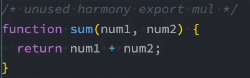


#### sideEffects

`sideEffects`用于告知`webpack compiler`哪些模块时有副作用，配置方法是在`package.json`中设置`sideEffects`属性

如果`sideEffects`设置为false，就是告知`webpack`可以安全的删除未用到的`exports`

如果有些文件需要保留，可以设置为数组的形式

```js
"sideEffecis":[    "./src/util/format.js",    "*.css" // 所有的css文件]
```


上述都是关于`javascript`的`tree shaking`，`css`同样也能够实现`tree shaking`

#### css tree shaking

`css`进行`tree shaking`优化可以安装`PurgeCss`插件

```cmd
npm install purgecss-plugin-webpack -D
```

```js
const PurgeCssPlugin = require('purgecss-webpack-plugin')module.exports = {    ...    plugins:[        new PurgeCssPlugin({            path:glob.sync(`${path.resolve('./src')}/**/*`), {nodir:true}// src里面的所有文件            satelist:function(){                return {                    standard:["html"]                }            }        })    ]}
```

- paths：表示要检测哪些目录下的内容需要被分析，配合使用glob
- 默认情况下，Purgecss会将我们的html标签的样式移除掉，如果我们希望保留，可以添加一个safelist的属性


### 代码分离

将代码分离到不同的`bundle`中，之后我们可以按需加载，或者并行加载这些文件

默认情况下，所有的`JavaScript`代码（业务代码、第三方依赖、暂时没有用到的模块）在首页全部都加载，就会影响首页的加载速度

代码分离可以分出出更小的`bundle`，以及控制资源加载优先级，提供代码的加载性能

这里通过`splitChunksPlugin`来实现，该插件`webpack`已经默认安装和集成，只需要配置即可

默认配置中，chunks仅仅针对于异步（async）请求，我们可以设置为initial或者all

```js
module.exports = {    ...    optimization:{        splitChunks:{            chunks:"all"        }    }}
```

`splitChunks`主要属性有如下：

- Chunks，对同步代码还是异步代码进行处理
- minSize： 拆分包的大小, 至少为minSize，如何包的大小不超过minSize，这个包不会拆分
- maxSize： 将大于maxSize的包，拆分为不小于minSize的包
- minChunks：被引入的次数，默认是1


### 内联chunk

可以通过`InlineChunkHtmlPlugin`插件将一些`chunk`的模块内联到`html`，如`runtime`的代码（对模块进行解析、加载、模块信息相关的代码），代码量并不大，但是必须加载的

```js
const InlineChunkHtmlPlugin = require('react-dev-utils/InlineChunkHtmlPlugin')const HtmlWebpackPlugin = require('html-webpack-plugin')module.exports = {    ...    plugin:[        new InlineChunkHtmlPlugin(HtmlWebpackPlugin,[/runtime.+\.js/]}
```


### 三、总结

关于`webpack`对前端性能的优化，可以通过文件体积大小入手，其次还可通过分包的形式、减少http请求次数等方式，实现对前端性能的优化


**要点**：
1. **代码分割**：使用动态导入和多个入口点减少初次加载文件大小。
2. **Tree Shaking**：启用 `mode: 'production'` 和配置 `usedExports` 去除未使用的代码。
3. **压缩代码**：使用 `TerserPlugin` 和 `css-minimizer-webpack-plugin` 压缩 JavaScript 和 CSS。
4. **启用缓存**：配置 `cache` 选项使用文件系统缓存加速构建。
5. **提取公共代码**：配置 `splitChunks` 提取共享模块到单独文件。
6. **优化资源**：使用 `url-loader` 和 `image-minimizer-webpack-plugin` 压缩图片和字体。
7. **热模块替换**：在开发中启用 HMR 提高开发效率。
8. **分析打包文件**：使用 `webpack-bundle-analyzer` 识别并优化大型文件。


---
### 654. 如何提高webpack的构建速度？

**难度**：★★★☆☆ | **题型**：QA | **分类**：全部 / 工程化

**题目**：


**参考答案**：
Webpack 的构建过程本质上包括**模块解析、加载、编译、优化、输出**等多个阶段，因此优化手段也需从多个维度入手。

以下从**开发模式（`webpack-dev-server`）和生产模式（`webpack build`）两个阶段**，分别分析提高构建速度的关键策略。

---

## 一、通用优化策略

### 1. **合理使用缓存**

* **开启持久化缓存**（Webpack 5）：

  ```js
  module.exports = {
    cache: {
      type: 'filesystem',
    },
  };
  ```

  能将模块编译结果缓存到磁盘，避免重复编译。

* **`babel-loader` 开启缓存**：

  ```js
  {
    loader: 'babel-loader',
    options: {
      cacheDirectory: true
    }
  }
  ```

### 2. **减少模块解析范围**

* **使用 `include` / `exclude` 精准匹配**

  ```js
  {
    test: /\.js$/,
    loader: 'babel-loader',
    include: path.resolve(__dirname, 'src'),
    exclude: /node_modules/
  }
  ```

* **配置 `resolve.extensions` 精简后缀解析**

  ```js
  resolve: {
    extensions: ['.js', '.ts']
  }
  ```

* **配置 `resolve.alias` 减少深层查找**

  ```js
  resolve: {
    alias: {
      '@': path.resolve(__dirname, 'src')
    }
  }
  ```

### 3. **并行/多进程处理**

* **使用 `thread-loader`** 处理 JS/TS 转译等耗时任务：

  ```js
  {
    test: /\.js$/,
    use: ['thread-loader', 'babel-loader']
  }
  ```

* **使用 `terser-webpack-plugin` 的并行压缩**：
  Webpack 5 中默认已启用，手动配置时可设置：

  ```js
  optimization: {
    minimize: true,
    minimizer: [new TerserPlugin({ parallel: true })]
  }
  ```

---

## 二、开发阶段优化（提升热更新和增量编译速度）

### 1. **使用 `webpack-dev-server` + HMR**

* 启用热模块替换（HMR），只更新变更部分，提高效率；
* 配合 React Fast Refresh、Vue HMR 插件，提升开发体验。

### 2. **开启 `source-map` 优化模式**

* 开发阶段推荐：

  ```js
  devtool: 'cheap-module-source-map'
  ```

  比 `eval-source-map` 更快，调试体验仍可接受。

### 3. **使用模块缓存机制**

* Webpack 会将未变更模块缓存，如果未配置 `module.id`，建议开启：

  ```js
  optimization: {
    moduleIds: 'deterministic'
  }
  ```

---

## 三、生产阶段优化（压缩构建产物）

### 1. **Tree Shaking（摇树优化）**

* 确保使用 `ESModule` 规范（`import`/`export`），否则无法移除无用代码；
* 设置 `sideEffects: false`，移除副作用模块（需谨慎）：

  ```json
  // package.json
  {
    "sideEffects": false
  }
  ```

### 2. **合理分包 + 动态引入**

* 利用 `SplitChunksPlugin` 拆分公共依赖和第三方库，减少重复打包：

  ```js
  optimization: {
    splitChunks: {
      chunks: 'all',
    },
  }
  ```

* 对大型路由模块按需加载，减少初始构建体积。

### 3. **缩小构建目标范围**

* 使用 `IgnorePlugin` 忽略无用语言包等：

  ```js
  new webpack.IgnorePlugin({
    resourceRegExp: /^\.\/locale$/,
    contextRegExp: /moment$/,
  });
  ```

* 精简 polyfill，例如使用 `core-js-pure` 或按需引入。

---

## 四、其他技巧与工具

### 1. **使用 `webpack-bundle-analyzer` 分析体积**

```js
const { BundleAnalyzerPlugin } = require('webpack-bundle-analyzer');
```

定位冗余依赖和重复打包问题。

### 2. **使用轻量替代库**

* 用 `dayjs` 替代 `moment`；
* 用 `lodash-es` + Tree Shaking 替代整个 lodash。

### 3. **升级到 Webpack 5**

Webpack 5 提供了更好的缓存机制、更快的构建性能和内置优化能力。

**要点**：
* Webpack 构建慢的根源在于**模块数量多、体积大、处理流程长**；
* 提升构建速度需从**缓存、并发、范围控制、按需加载**四个方向优化；
* 区分开发和生产环境进行有针对性的配置调整；
* 借助生态工具（如 thread-loader、BundleAnalyzer、TerserPlugin）提升自动化与调试效率；
* 保持依赖精简、代码可维护，有助于从源头优化构建时间。

---
### 664. webpack 5 的主要升级点有哪些？

**难度**：★★★☆☆ | **题型**：QA | **分类**：全部 / 工程化

**题目**：


**参考答案**：
-  持久缓存（Persistent Caching）： Webpack 5引入了更好的持久缓存机制，利用了更稳定的HashedModuleIdsPlugin和NamedChunksPlugin，以改善构建性能。
- Tree-shaking 改进： Webpack 5对Tree-shaking进行了改进，提供了更好的代码优化，以便删除未使用的代码。
- 支持 WebAssembly（WASM）： Webpack 5 对 WebAssembly 提供了原生的支持，使得在项目中使用 WebAssembly 更加方便。
- 支持 ES6 模块导入（Dynamic Import）： Webpack 5对动态导入语法（import()）提供了更好的支持，可以更轻松地进行代码分割。
- 模块联邦（Module Federation）： 这是Webpack 5中的一项重大功能，允许将多个独立的Webpack构建连接在一起，实现模块共享，从而更好地支持微服务架构。
- 缓存组（Caching Groups）： 新的缓存组概念被引入，可以更细粒度地控制模块的缓存策略。
- 内置代码分割优化（optimization.splitChunks）： Webpack 5通过optimization.splitChunks进行了重新设计，提供了更灵活的配置选项，使得代码分割更为强大和易用。
- 默认配置优化： Webpack 5 默认配置中的一些优化，使得开箱即用的性能更好。
- 提高构建性能： Webpack 5引入了一些性能优化，包括更快的持久化缓存、更快的构建速度等。
- 移除废弃特性： 作为更新，Webpack 5移除了一些过时的特性和API，因此在升级时需要注意潜在的破坏性变化。

**要点**：
可以从以下几个关键点展开：

### 1. **模块联邦 (Module Federation)**

- **功能概述**：模块联邦允许多个独立的应用程序共享代码（例如，组件或模块），而不需要重新打包。这对于微前端架构特别有用，可以实现跨项目共享代码的动态加载。
- **优势**：减少代码重复，提高应用程序的加载速度和可维护性。

### 2. **持久化缓存**

- **功能概述**：Webpack 5 引入了持久化缓存功能，默认基于文件系统进行缓存，显著加快了二次构建速度。
- **优势**：减少了构建时间，特别是在大型项目中，提升了开发体验。

### 3. **树摇优化 (Tree Shaking) 改进**

- **功能概述**：Webpack 5 对 Tree Shaking 进行了增强，可以更好地识别和删除无用代码，尤其是在 CommonJS 模块中。
- **优势**：构建出的包体积更小，性能更优。

### 4. **增强的代码拆分**

- **功能概述**：通过更智能的默认配置和优化选项，Webpack 5 提供了更细粒度的代码拆分（Code Splitting）。
- **优势**：更有效的按需加载，减少初始加载时间。

### 5. **改进的输出文件系统和构建目标**

- **功能概述**：Webpack 5 支持基于 `output.clean` 选项自动清理输出目录，同时引入了多种构建目标（如 `browserslist`），方便开发者更精确地为特定环境构建代码。
- **优势**：构建过程更灵活、定制性更强。

### 6. **废弃的模块和插件**

- **功能概述**：一些不再推荐使用的模块和插件被移除或标记为废弃，例如 `Node.js Polyfills`（因为这些不再需要或有更好的替代方案）。
- **优势**：减少不必要的依赖和过时的代码，更加符合现代 JavaScript 开发的最佳实践。

### 7. **WebAssembly 支持改进**

- **功能概述**：Webpack 5 提供了更好的 WebAssembly 支持，包括通过 `WebAssembly` 模块的动态加载。
- **优势**：让 WebAssembly 和 JavaScript 能够更无缝地集成和互操作。

### 8. **开发工具改进**

- **功能概述**：新的分析和调试工具，帮助开发者更好地理解和优化其打包后的代码。
- **优势**：提高了开发效率，特别是在分析包大小和依赖关系时。

这些要点展示了 Webpack 5 的新特性和改进，强调了它在性能优化、开发体验和模块管理方面的进步。


---
### 671. Vite 预构建的原理和作用是什么？

**难度**：★★★☆☆ | **题型**：QA | **分类**：全部 / 工程化

**题目**：


**参考答案**：
Vite 的预构建本质上是一次**针对第三方依赖的提前处理过程**，目的是在开发阶段消除浏览器原生 ES Module 机制在实际工程中带来的性能与兼容性问题，从而保证启动速度和模块加载效率。

从原理上看，Vite 在启动开发服务器时，会扫描项目的入口文件以及其依赖关系，识别出来自 `node_modules` 的第三方依赖。这些依赖通常存在几个典型问题：一是大量使用 CommonJS 或 UMD 规范，浏览器无法直接执行；二是包体结构复杂，存在大量深层依赖，若按原始形式通过 ESM 在浏览器中逐个请求，会导致网络请求数量激增。预构建阶段，Vite 使用 esbuild 将这些第三方依赖统一转换为浏览器可直接执行的 ESM 格式，并进行依赖扁平化和合并处理，最终输出到本地的缓存目录中。

在运行时，浏览器实际加载的是预构建后的依赖文件，而不是直接访问 `node_modules`。这使得依赖的解析成本和网络开销在开发服务器启动时一次性完成，避免了每次页面刷新都重复触发复杂的模块解析。同时，Vite 会基于依赖内容生成哈希，一旦依赖版本或内容发生变化，才会触发重新预构建，从而在性能和一致性之间取得平衡。

从作用层面看，预构建解决的核心并不是“加快打包”，而是**让开发环境下的 ESM 真正可用**。它一方面弥补了浏览器与 Node.js 模块生态之间的规范差异，另一方面显著减少了开发阶段的模块请求数量，提升冷启动和页面首次加载速度。此外，通过统一依赖的导出形式，也降低了不同包在 default export、named export 行为上的不确定性，减少运行时错误。

需要注意的是，预构建主要服务于开发阶段，对生产构建的影响有限。生产环境仍由 Rollup 进行完整的打包、Tree Shaking 和优化，两者职责清晰分离。

**要点**：
Vite 预构建通过 esbuild 在开发服务器启动时将第三方依赖统一转换为浏览器可用的 ESM，并进行合并与缓存；其核心作用是解决 CommonJS 兼容性和过多模块请求的问题，显著提升开发阶段的冷启动和加载性能；该机制主要作用于开发环境，与生产构建流程相互独立、各司其职。

---
### 714. babel 的核心库有哪些？

**难度**：★★★☆☆ | **题型**：QA | **分类**：全部 / 工程化

**题目**：


**参考答案**：
Babel 是一个广泛使用的 JavaScript 编译器，通常用于将最新版本的 JavaScript 代码转换为兼容性更强的代码。

Babel 的核心库主要包括以下几个：

### 1. **@babel/core**
这是 Babel 的核心库，是整个编译过程的中心。它提供了 Babel 转换的主功能，负责将源代码进行解析、转换和生成。你通常会在项目中通过 `@babel/core` 来调用 Babel 的 API。

- **主要功能**：
  - 解析（Parsing）：将 JavaScript 代码解析成抽象语法树（AST）。
  - 转换（Transformation）：根据配置对 AST 进行处理（如转换箭头函数、类、模块等）。
  - 生成（Generation）：将转换后的 AST 转换回 JavaScript 代码。

- **常见用法**：
  ```bash
  npm install --save-dev @babel/core
  ```

### 2. **@babel/preset-env**
`@babel/preset-env` 是一个智能预设（preset），它可以根据目标环境来决定需要哪些 Babel 插件，以便将现代 JavaScript 语法转换成兼容性更好的代码。它常用于配置 Babel，指定浏览器的兼容性范围，自动为你选择合适的转换和 polyfill。

- **主要功能**：
  - 根据浏览器支持情况自动决定要应用哪些转换。
  - 支持插件的自动配置。
  
- **常见用法**：
  ```bash
  npm install --save-dev @babel/preset-env
  ```

  在 `.babelrc` 或 `babel.config.js` 文件中配置：
  ```json
  {
    "presets": [
      ["@babel/preset-env", {
        "targets": "> 0.25%, not dead" // 目标浏览器支持
      }]
    ]
  }
  ```

### 3. **@babel/preset-react**
`@babel/preset-react` 是用于 React 项目的一个预设，它允许 Babel 将 JSX 代码转换为 JavaScript，支持 React 特性，如 JSX、自动化的 `React.createElement` 调用等。

- **主要功能**：
  - 将 JSX 转换为 JavaScript。
  - 启用 React 特定的转换，例如 Class 属性名的支持等。

- **常见用法**：
  ```bash
  npm install --save-dev @babel/preset-react
  ```

  在 `.babelrc` 或 `babel.config.js` 文件中配置：
  ```json
  {
    "presets": ["@babel/preset-react"]
  }
  ```

### 4. **@babel/plugin-transform-arrow-functions**
这个插件专门用来将箭头函数转换为常规的函数表达式。如果目标环境不支持箭头函数（例如旧版本的浏览器），你可以使用该插件进行转换。

- **主要功能**：
  - 将箭头函数语法（`=>`）转换为普通函数表达式。
  
- **常见用法**：
  ```bash
  npm install --save-dev @babel/plugin-transform-arrow-functions
  ```

  在 `.babelrc` 或 `babel.config.js` 文件中配置：
  ```json
  {
    "plugins": ["@babel/plugin-transform-arrow-functions"]
  }
  ```

### 5. **@babel/plugin-transform-classes**
`@babel/plugin-transform-classes` 用于将 ES6+ 的类转换为兼容旧版 JavaScript 的构造函数形式。

- **主要功能**：
  - 将 ES6 的类（`class`）语法转换为基于原型的构造函数。
  
- **常见用法**：
  ```bash
  npm install --save-dev @babel/plugin-transform-classes
  ```

  在 `.babelrc` 或 `babel.config.js` 文件中配置：
  ```json
  {
    "plugins": ["@babel/plugin-transform-classes"]
  }
  ```

### 6. **@babel/plugin-transform-modules-commonjs**
该插件将 ES6 模块（`import` / `export`）转换为 CommonJS 模块。它常用于在 Node.js 环境下，尤其是旧版本的 Node.js，不支持 ES6 模块时。

- **主要功能**：
  - 将 `import` / `export` 转换为 CommonJS 模块语法（`require` / `module.exports`）。
  
- **常见用法**：
  ```bash
  npm install --save-dev @babel/plugin-transform-modules-commonjs
  ```

  在 `.babelrc` 或 `babel.config.js` 文件中配置：
  ```json
  {
    "plugins": ["@babel/plugin-transform-modules-commonjs"]
  }
  ```

### 7. **@babel/cli**
`@babel/cli` 提供了一个命令行工具，允许你在终端中直接运行 Babel 来转译文件。它适用于那些需要手动运行 Babel 的场景，或者需要在脚本中调用 Babel 的项目。

- **主要功能**：
  - 提供命令行接口来运行 Babel 转译。
  
- **常见用法**：
  ```bash
  npm install --save-dev @babel/cli
  ```

  使用命令行运行 Babel：
  ```bash
  npx babel src --out-dir dist
  ```

### 8. **@babel/polyfill / core-js / regenerator-runtime**
在一些较旧的浏览器中，某些 JavaScript 特性（如 Promise、async/await、Object.assign 等）可能不被支持。通过引入 `core-js` 和 `regenerator-runtime`，可以在环境中补充这些特性，使得应用在较老的浏览器上也能正常运行。

- **主要功能**：
  - 提供 polyfill，支持 JavaScript 新特性的兼容性。
  
- **常见用法**：
  ```bash
  npm install --save core-js regenerator-runtime
  ```

### 9. **@babel/plugin-proposal-class-properties**
这个插件使得 Babel 支持类属性的语法（`class properties`）。这是一个 ECMAScript 提案，使得可以在类内部直接定义成员变量，而不需要在构造函数中声明。

- **主要功能**：
  - 将类属性（如 `static` 或实例属性）转换为 ES5 可执行的代码。
  
- **常见用法**：
  ```bash
  npm install --save-dev @babel/plugin-proposal-class-properties
  ```

  在 `.babelrc` 或 `babel.config.js` 文件中配置：
  ```json
  {
    "plugins": ["@babel/plugin-proposal-class-properties"]
  }
  ```

**要点**：
常用的核心库包括：

- **@babel/core**：核心库，提供转换的基本功能。
- **@babel/preset-env**：根据目标环境智能选择插件，进行现代 JavaScript 的转换。
- **@babel/preset-react**：处理 React JSX 语法。
- **插件系列**：包括箭头函数、类、模块等的转换插件。

---
### 736. 说说webpack中常见的Loader？解决了什么问题？

**难度**：★★☆☆☆ | **题型**：QA | **分类**：全部 / 工程化

**题目**：


**参考答案**：
## 一、是什么

`loader` 用于对模块的"源代码"进行转换，在 `import` 或"加载"模块时预处理文件

`webpack`做的事情，仅仅是分析出各种模块的依赖关系，然后形成资源列表，最终打包生成到指定的文件中。如下图所示：

 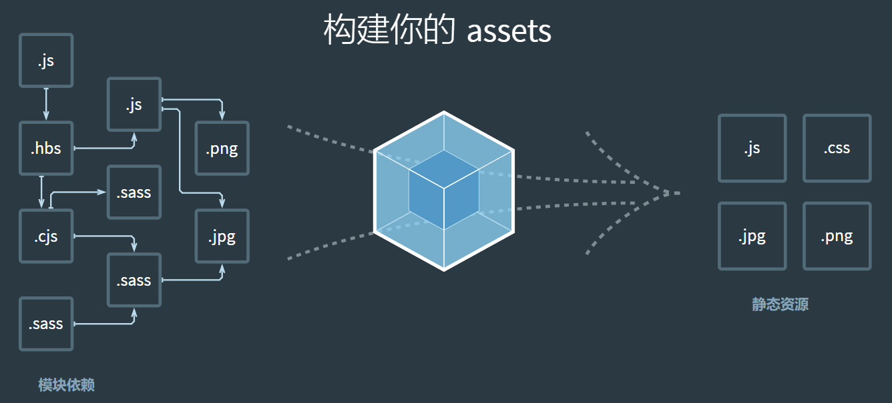

在`webpack`内部中，任何文件都是模块，不仅仅只是`js`文件

默认情况下，在遇到`import`或者`load`加载模块的时候，`webpack`只支持对`js`文件打包

像`css`、`sass`、`png`等这些类型的文件的时候，`webpack`则无能为力，这时候就需要配置对应的`loader`进行文件内容的解析

在加载模块的时候，执行顺序如下：

 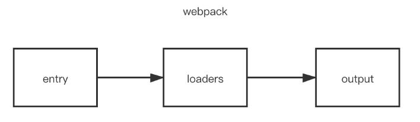


当 `webpack` 碰到不识别的模块的时候，`webpack` 会在配置的中查找该文件解析规则


关于配置`loader`的方式有三种：

- 配置方式（推荐）：在 webpack.config.js文件中指定 loader
- 内联方式：在每个 import 语句中显式指定 loader
- CLI 方式：在 shell 命令中指定它们


### 配置方式

关于`loader`的配置，我们是写在`module.rules`属性中，属性介绍如下：

- `rules`是一个数组的形式，因此我们可以配置很多个`loader`

- 每一个`loader`对应一个对象的形式，对象属性`test` 为匹配的规则，一般情况为正则表达式

- 属性`use`针对匹配到文件类型，调用对应的 `loader` 进行处理

代码编写，如下形式：

```js
module.exports = {
  module: {
    rules: [
      {
        test: /\.css$/,
        use: [
          { loader: 'style-loader' },
          {
            loader: 'css-loader',
            options: {
              modules: true
            }
          },
          { loader: 'sass-loader' }
        ]
      }
    ]
  }
};
```


## 二、特性

这里继续拿上述代码，来讲讲`loader`的特性

从上述代码可以看到，在处理`css`模块的时候，`use`属性中配置了三个`loader`分别处理`css`文件

因为`loader `支持链式调用，链中的每个` loader `会处理之前已处理过的资源，最终变为`js`代码。顺序为相反的顺序执行，即上述执行方式为`sass-loader`、`css-loader`、`style-loader`

除此之外，`loader`的特性还有如下：

- loader 可以是同步的，也可以是异步的
- loader 运行在 Node.js 中，并且能够执行任何操作
- 除了常见的通过 `package.json` 的 `main` 来将一个 npm 模块导出为 loader，还可以在 module.rules 中使用 `loader` 字段直接引用一个模块
- 插件(plugin)可以为 loader 带来更多特性
- loader 能够产生额外的任意文件

可以通过 loader 的预处理函数，为 JavaScript 生态系统提供更多能力。用户现在可以更加灵活地引入细粒度逻辑，例如：压缩、打包、语言翻译和更多其他特性


## 三、常见的loader

在页面开发过程中，我们经常性加载除了`js`文件以外的内容，这时候我们就需要配置响应的`loader`进行加载

常见的`loader`如下：

- style-loader: 将css添加到DOM的内联样式标签style里
- css-loader :允许将css文件通过require的方式引入，并返回css代码
- less-loader: 处理less
- sass-loader: 处理sass
- postcss-loader: 用postcss来处理CSS
- autoprefixer-loader: 处理CSS3属性前缀，已被弃用，建议直接使用postcss
- file-loader: 分发文件到output目录并返回相对路径
- url-loader: 和file-loader类似，但是当文件小于设定的limit时可以返回一个Data Url
- html-minify-loader: 压缩HTML
- babel-loader :用babel来转换ES6文件到ES


下面给出一些常见的`loader`的使用：

### css-loader

分析 `css` 模块之间的关系，并合成⼀个 `css`

```bash
npm install --save-dev css-loader
```

```js
rules: [
  ...,
 {
  test: /\.css$/,
    use: {
      loader: "css-loader",
      options: {
     // 启用/禁用 url() 处理
     url: true,
     // 启用/禁用 @import 处理
     import: true,
        // 启用/禁用 Sourcemap
        sourceMap: false
      }
    }
 }
]
```

如果只通过`css-loader`加载文件，这时候页面代码设置的样式并没有生效

原因在于，`css-loader`只是负责将`.css`文件进行一个解析，而并不会将解析后的`css`插入到页面中

如果我们希望再完成插入`style`的操作，那么我们还需要另外一个`loader`，就是`style-loader`


### style-loader

把 `css-loader` 生成的内容，用 `style` 标签挂载到页面的 `head` 中

```bash
npm install --save-dev style-loader
```

```js
rules: [
  ...,
 {
  test: /\.css$/,
    use: ["style-loader", "css-loader"]
 }
]
```

同一个任务的 `loader` 可以同时挂载多个，处理顺序为：从右到左，从下往上


### less-loader

开发中，我们也常常会使用`less`、`sass`、`stylus`预处理器编写`css`样式，使开发效率提高，这里需要使用`less-loader`

```cmd
npm install less-loader -D
```

```js
rules: [
  ...,
 {
  test: /\.css$/,
    use: ["style-loader", "css-loader","less-loader"]
 }
]
```


### raw-loader

在 `webpack `中通过 `import `方式导入文件内容，该`loader `并不是内置的，所以首先要安装

```bash
npm install --save-dev raw-loader
```

然后在 webpack.config.js 中进行配置

```javascript
module.exports = {  ...,  module: {      rules: [      {        test: /\.(txt|md)$/,        use: 'raw-loader'     }    ] }}
```


### file-loader

把识别出的资源模块，移动到指定的输出⽬目录，并且返回这个资源在输出目录的地址(字符串)

```bash
npm install --save-dev file-loader
```

```javascript
rules: [  ..., {  test: /\.(png|jpe?g|gif)$/,    use: {      loader: "file-loader",      options: {        // placeholder 占位符 [name] 源资源模块的名称        // [ext] 源资源模块的后缀        name: "[name]_[hash].[ext]",        //打包后的存放位置        outputPath: "./images",        // 打包后文件的 url        publicPath: './images',      }    } }]
```


### url-loader

可以处理理 `file-loader` 所有的事情，但是遇到图片格式的模块，可以选择性的把图片转成 `base64`  格式的字符串，并打包到 `js` 中，对小体积的图片比较合适，大图片不合适。

```bash
npm install --save-dev url-loader
```

```javascript
rules: [  ..., {  test: /\.(png|jpe?g|gif)$/,    use: {      loader: "url-loader",      options: {        // placeholder 占位符 [name] 源资源模块的名称        // [ext] 源资源模块的后缀        name: "[name]_[hash].[ext]",        //打包后的存放位置        outputPath: "./images"        // 打包后文件的 url        publicPath: './images',        // 小于 100 字节转成 base64 格式        limit: 100      }    } }]
```


---
### 741. 从 yarn 迁移到 pnpm 的过程中，需要注意哪些问题？如何避免幽灵依赖？

**难度**：★★★☆☆ | **题型**：QA | **分类**：全部 / 工程化

**题目**：


**参考答案**：
从 yarn 迁移到 pnpm，并不是一次“安装工具替换”的操作，而是一次**依赖解析模型的切换**。pnpm 通过严格的依赖隔离来换取确定性和可维护性，因此迁移过程中暴露的问题，往往不是 pnpm 本身的问题，而是工程中长期被 yarn 扁平化结构掩盖的隐性风险。

首先需要关注的是 node_modules 结构变化带来的直接影响。yarn 的扁平化安装使得大量未在当前包声明中的依赖在物理路径上可被访问，而 pnpm 的非扁平结构会立即阻断这种访问。一旦项目中存在幽灵依赖，迁移后的首次安装或运行阶段就会出现模块找不到的错误。这类问题不应通过配置回退去“绕过”，而应回到依赖声明本身，补齐真正被使用的依赖或调整依赖归属。

在迁移过程中，lockfile 的处理同样关键。pnpm 使用独立的锁文件格式，其解析和去重策略与 yarn 不同，因此不能简单复用原有 lockfile。正确做法是清理旧的锁文件和 node_modules，确保依赖树在 pnpm 规则下被重新计算。否则，容易在不同环境中产生不可复现的安装结果，削弱 pnpm 的确定性优势。

对于 Monorepo 或多包项目，需要特别注意包间依赖的显式声明。在 yarn 环境下，某些包可能通过“向上查找”的方式间接访问到其他包的依赖，而 pnpm 会严格要求每个包只访问自身声明的依赖。这意味着迁移时往往需要补充 workspace 内部包的 dependencies 或 peerDependencies 声明，才能保证构建和运行行为符合预期。

在工具链层面，还需要审视构建、测试和脚本中是否存在对 node_modules 结构的隐式假设。例如某些脚本直接拼接路径访问依赖文件，在 pnpm 下往往会失效。这类问题通常需要通过标准的模块解析方式重构，而不是针对 pnpm 做特殊兼容。

要避免幽灵依赖，关键并不在于某一个配置项，而在于**将依赖显式化并建立持续校验机制**。pnpm 本身已经通过结构设计解决了“能否访问”的问题，剩下的工作是配合 lint、CI 校验和规范约束，确保任何被直接使用的依赖都被正确声明。一旦这些机制建立起来，幽灵依赖就不再是一个反复出现的问题。

整体来看，pnpm 迁移的过程更像一次“依赖健康检查”。短期内可能暴露问题，但从长期工程稳定性和可维护性角度看，这些问题本就需要被正视和修复。

**要点**：
迁移到 pnpm 意味着切换到严格依赖隔离模型；幽灵依赖会在迁移中被集中暴露，应通过补齐依赖声明而非回退配置解决；需重新生成 lockfile，避免混用旧状态；在 Monorepo 中显式声明包间依赖；通过工具和流程持续校验，系统性避免幽灵依赖。

---
### 749. 说说webpack的构建流程?

**难度**：★★★☆☆ | **题型**：QA | **分类**：全部 / 工程化

**题目**：


**参考答案**：
## 一、运行流程

`webpack` 的运行流程是一个串行的过程，它的工作流程就是将各个插件串联起来

在运行过程中会广播事件，插件只需要监听它所关心的事件，就能加入到这条`webpack`机制中，去改变`webpack`的运作，使得整个系统扩展性良好

从启动到结束会依次执行以下三大步骤：

- 初始化流程：从配置文件和 `Shell` 语句中读取与合并参数，并初始化需要使用的插件和配置插件等执行环境所需要的参数
- 编译构建流程：从 Entry 发出，针对每个 Module 串行调用对应的 Loader 去翻译文件内容，再找到该 Module 依赖的 Module，递归地进行编译处理
- 输出流程：对编译后的 Module 组合成 Chunk，把 Chunk 转换成文件，输出到文件系统

 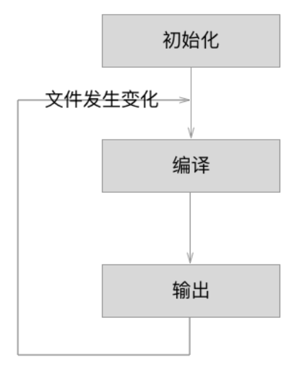


### 初始化流程

从配置文件和 `Shell` 语句中读取与合并参数，得出最终的参数

配置文件默认下为`webpack.config.js`，也或者通过命令的形式指定配置文件，主要作用是用于激活`webpack`的加载项和插件

关于文件配置内容分析，如下注释：

```js
var path = require('path');
var node_modules = path.resolve(__dirname, 'node_modules');
var pathToReact = path.resolve(node_modules, 'react/dist/react.min.js');

module.exports = {
  // 入口文件，是模块构建的起点，同时每一个入口文件对应最后生成的一个 chunk。
  entry: './path/to/my/entry/file.js'，
  // 文件路径指向(可加快打包过程)。
  resolve: {
    alias: {
      'react': pathToReact
    }
  },
  // 生成文件，是模块构建的终点，包括输出文件与输出路径。
  output: {
    path: path.resolve(__dirname, 'build'),
    filename: '[name].js'
  },
  // 这里配置了处理各模块的 loader ，包括 css 预处理 loader ，es6 编译 loader，图片处理 loader。
  module: {
    loaders: [
      {
        test: /\.js$/,
        loader: 'babel',
        query: {
          presets: ['es2015', 'react']
        }
      }
    ],
    noParse: [pathToReact]
  },
  // webpack 各插件对象，在 webpack 的事件流中执行对应的方法。
  plugins: [
    new webpack.HotModuleReplacementPlugin()
  ]
};
```

`webpack` 将 `webpack.config.js` 中的各个配置项拷贝到 `options` 对象中，并加载用户配置的 ` plugins`

完成上述步骤之后，则开始初始化`Compiler`编译对象，该对象掌控者`webpack`声明周期，不执行具体的任务，只是进行一些调度工作

```js
class Compiler extends Tapable {
    constructor(context) {
        super();
        this.hooks = {
            beforeCompile: new AsyncSeriesHook(["params"]),
            compile: new SyncHook(["params"]),
            afterCompile: new AsyncSeriesHook(["compilation"]),
            make: new AsyncParallelHook(["compilation"]),
            entryOption: new SyncBailHook(["context", "entry"])
            // 定义了很多不同类型的钩子
        };
        // ...
    }
}

function webpack(options) {
  var compiler = new Compiler();
  ...// 检查options,若watch字段为true,则开启watch线程
  return compiler;
}
...
```

`Compiler` 对象继承自 `Tapable`，初始化时定义了很多钩子函数


### 编译构建流程

根据配置中的 `entry` 找出所有的入口文件

```js
module.exports = {
  entry: './src/file.js'
}
```

初始化完成后会调用`Compiler`的`run`来真正启动`webpack`编译构建流程，主要流程如下：

- `compile` 开始编译
- `make` 从入口点分析模块及其依赖的模块，创建这些模块对象
- `build-module` 构建模块
- `seal` 封装构建结果
- `emit` 把各个chunk输出到结果文件


#### compile 编译

执行了`run`方法后，首先会触发`compile`，主要是构建一个`Compilation`对象

该对象是编译阶段的主要执行者，主要会依次下述流程：执行模块创建、依赖收集、分块、打包等主要任务的对象


#### make 编译模块

当完成了上述的`compilation`对象后，就开始从`Entry`入口文件开始读取，主要执行`_addModuleChain()`函数，如下：

```js
_addModuleChain(context, dependency, onModule, callback) {
   ...
   // 根据依赖查找对应的工厂函数
   const Dep = /** @type {DepConstructor} */ (dependency.constructor);
   const moduleFactory = this.dependencyFactories.get(Dep);
   
   // 调用工厂函数NormalModuleFactory的create来生成一个空的NormalModule对象
   moduleFactory.create({
       dependencies: [dependency]
       ...
   }, (err, module) => {
       ...
       const afterBuild = () => {
        this.processModuleDependencies(module, err => {
         if (err) return callback(err);
         callback(null, module);
           });
    };
       
       this.buildModule(module, false, null, null, err => {
           ...
           afterBuild();
       })
   })
}
```

过程如下：

`_addModuleChain`中接收参数`dependency`传入的入口依赖，使用对应的工厂函数`NormalModuleFactory.create`方法生成一个空的`module`对象

回调中会把此`module`存入`compilation.modules`对象和`dependencies.module`对象中，由于是入口文件，也会存入`compilation.entries`中

随后执行`buildModule`进入真正的构建模块`module`内容的过程


#### build module 完成模块编译

这里主要调用配置的`loaders`，将我们的模块转成标准的`JS`模块

在用` Loader` 对一个模块转换完后，使用 `acorn` 解析转换后的内容，输出对应的抽象语法树（`AST`），以方便 `Webpack `后面对代码的分析

从配置的入口模块开始，分析其 `AST`，当遇到` require `等导入其它模块语句时，便将其加入到依赖的模块列表，同时对新找出的依赖模块递归分析，最终搞清所有模块的依赖关系


### 输出流程

#### seal 输出资源

`seal`方法主要是要生成`chunks`，对`chunks`进行一系列的优化操作，并生成要输出的代码

`webpack` 中的 `chunk` ，可以理解为配置在 `entry` 中的模块，或者是动态引入的模块

根据入口和模块之间的依赖关系，组装成一个个包含多个模块的 `Chunk`，再把每个 `Chunk` 转换成一个单独的文件加入到输出列表


#### emit 输出完成

在确定好输出内容后，根据配置确定输出的路径和文件名

```js
output: {
    path: path.resolve(__dirname, 'build'),
        filename: '[name].js'
}
```

在 `Compiler` 开始生成文件前，钩子 `emit` 会被执行，这是我们修改最终文件的最后一个机会

从而`webpack`整个打包过程则结束了


### 小结

 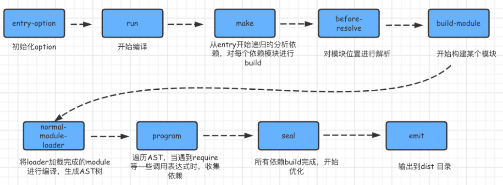


---
### 750. webpack的module、bundle、chunk分别指的是什么？

**难度**：★★★☆☆ | **题型**：QA | **分类**：全部 / 工程化

**题目**：


**参考答案**：
在Webpack中，`module`、`bundle`和`chunk`是三个不同的概念：

**Module（模块）**：
- `module`指的是Webpack处理的代码的单个文件。这可以是JavaScript、CSS、图片或其他类型的文件。
- 在Webpack中，每个文件都被视为一个独立的模块，它们可以通过`import`、`require`等方式引入和导出。
- 模块可以包含代码、依赖关系和其他相关资源，它们通常用于组织和管理应用程序的各个部分。

**Bundle（捆绑包）**：
- `bundle`是由Webpack根据模块之间的依赖关系生成的最终输出文件。它将多个模块打包成一个或多个捆绑包。
- 在开发过程中，Webpack会根据入口文件（entry）和模块之间的依赖关系，递归地构建一个或多个捆绑包。
- 捆绑包通常是用于在浏览器中加载和执行的最终文件，包含了应用程序所需的所有代码和资源。

**Chunk（代码块）**：
- `chunk`是Webpack在构建过程中生成的代码块，它是一种逻辑上的概念，表示一组相互依赖的模块。
- 当Webpack构建应用程序时，它会根据依赖关系将模块组织成不同的代码块，例如按需加载（懒加载）时生成的分割代码块。
- 默认情况下，Webpack会将所有入口点（entry point）及其依赖的模块打包到一个主要的初始代码块中。但是，通过使用代码分割（code splitting）技术，可以将应用程序拆分成多个代码块，以实现按需加载和优化性能。

综上所述：
- `module`是Webpack处理的单个文件，代表了应用程序的组成部分。
- `bundle`是由Webpack生成的最终输出文件，它包含了所有模块的代码和资源。
- `chunk`是逻辑上的代码块，表示一组相互依赖的模块。它可以根据需要进行拆分和加载。


---
### 752. 如何提高webpack的打包速度

**难度**：★☆☆☆☆ | **题型**：QA | **分类**：全部 / 工程化

**题目**：


**参考答案**：
<ul><li>happypack: 利用进程并行编译loader,利用缓存来使得 rebuild 更快,遗憾的是作者表示已经不会继续开发此项目,类似的替代者是<a href="https://links.jianshu.com/go?to=https%3A%2F%2Fgithub.com%2Fwebpack-contrib%2Fthread-loader" target="_blank">thread-loader</a> </li><li> <a href="https://links.jianshu.com/go?to=https%3A%2F%2Fwebpack.docschina.org%2Fconfiguration%2Fexternals%2F" target="_blank">外部扩展(externals)</a>: 将不怎么需要更新的第三方库脱离webpack打包，不被打入bundle中，从而减少打包时间,比如jQuery用script标签引入</li><li>dll: 采用webpack的 DllPlugin 和 DllReferencePlugin 引入dll，让一些基本不会改动的代码先打包成静态资源,避免反复编译浪费时间</li><li>利用缓存: <code>webpack.cache</code>、babel-loader.cacheDirectory、<code>HappyPack.cache</code>都可以利用缓存提高rebuild效率</li><li>缩小文件搜索范围: 比如babel-loader插件,如果你的文件仅存在于src中,那么可以<code>include: path.resolve(__dirname, &#x27;src&#x27;)</code>,当然绝大多数情况下这种操作的提升有限,除非不小心build了node_modules文件<br/></li></ul>


---
### 763. webpack 中的 Loader ，链式调用顺序会影响编译结果吗？

**难度**：★★☆☆☆ | **题型**：QA | **分类**：全部 / 工程化

**题目**：


**参考答案**：
会，而且这是 Webpack Loader 机制中**非常关键且经常被误解的一点**：

> **Loader 的链式调用顺序不仅会影响编译结果，而且很多语法是否能正确工作，完全取决于 Loader 的执行顺序。**

理解这个问题的关键在于：**Loader 本质是一个“源码转换流水线（transform pipeline）”。**

---

## 一、Loader 本质：源码的逐步转换

在 Webpack 中 hookup 的 Loader，并不是同时运行的，它们会对模块源码进行**一层一层的转换**：

```text
原始源码 → loaderA → loaderB → loaderC → 最终 JS 模块
```

每个 Loader：

* 接收上一个 Loader 的输出
* 返回新的源码字符串（或 AST 转换结果）
* 交给下一个 Loader

因此：

> Loader 顺序决定了“谁先处理源码”，自然会影响最终产物。

---

## 二、关键规则：执行顺序与书写顺序相反

Webpack Loader 的执行规则是：

```text
配置顺序：从左到右
执行顺序：从右到左
```

例如：

```js
use: ['style-loader', 'css-loader', 'postcss-loader']
```

真实执行顺序：

```text
postcss-loader
→ css-loader
→ style-loader
```

原因是：

* 最右侧 Loader 最先接触原始资源
* 每个 Loader 向左传递转换结果

可以把它理解为函数组合：

```js
style(css(postcss(source)))
```

---

## 三、为什么顺序会直接影响编译结果

因为不同 Loader 处理的是**不同语义阶段的代码**。

### 典型例子：CSS 处理链

```js
use: ['style-loader', 'css-loader']
```

职责：

* `css-loader`：解析 CSS → 转成 JS module
* `style-loader`：把 CSS 注入 DOM

正确流程：

```text
CSS → css-loader(变成JS) → style-loader(执行注入)
```

如果顺序写反：

```js
use: ['css-loader', 'style-loader']
```

执行变成：

```text
style-loader → css-loader
```

此时：

* style-loader 收到的是原始 CSS
* 它期望的是 JS 模块
* 编译或运行直接异常

---

### 再看 Babel + TypeScript

```js
use: ['babel-loader', 'ts-loader']
```

执行顺序：

```text
ts-loader → babel-loader
```

正确原因：

1. TypeScript 先转 JS
2. Babel 再做语法降级 / polyfill

如果反过来：

```text
babel-loader → ts-loader
```

Babel 无法解析 TS 类型语法，直接报错。

---

## 四、Loader 阶段不仅只有一个（高级理解）

Webpack Loader 实际存在多个执行阶段：

```text
pitch 阶段：从左 → 右
normal 阶段：从右 → 左
```

即：

```text
pitch(loader1)
pitch(loader2)
pitch(loader3)

normal(loader3)
normal(loader2)
normal(loader1)
```

`pitch` 可以：

* 提前终止后续 Loader
* 改写执行流程
* 返回自定义模块内容

这也是 `style-loader` 等 Loader 能实现高级能力的原因。

---

## 五、为什么 Webpack 采用“反向执行”

本质是为了符合编译直觉：

* 最靠近资源的 Loader 先处理原始文件
* 后续 Loader 处理已经转换后的结果

类似编译器 pipeline：

```text
源码 → 语法转换 → 模块化 → 运行时代码
```

---

## 六、工程实践中的顺序原则

经验上可以总结为一个规律：

> **越接近“源码形态”的 Loader 越靠右，越接近“运行时”的 Loader 越靠左**

例如：

```text
源码转换类      → 右侧
模块解析类      → 中间
运行时注入类    → 左侧
```

**要点**：
Webpack Loader 是一个按流水线执行的源码转换系统，Loader 的链式顺序直接决定源码被处理的阶段；配置顺序为从左到右，但执行顺序为从右到左，每个 Loader 都处理前一个 Loader 的输出，因此顺序错误会导致语义阶段错乱甚至编译失败；通常应遵循“靠近源码的 Loader 放右侧，靠近运行时的 Loader 放左侧”的原则，同时 Loader 还存在 pitch 与 normal 两阶段执行机制，使顺序对最终编译结果具有决定性影响。

---
### 797. babel 的工作流程是怎么样的？

**难度**：★★★☆☆ | **题型**：QA | **分类**：全部 / 工程化

**题目**：


**参考答案**：
Babel 是一个广泛使用的 JavaScript 编译器，用于将现代 JavaScript 代码（ES6+）转译为兼容旧版浏览器和环境的 JavaScript 代码。

Babel 的工作流程可以分为以下几个步骤：

### **1. 解析（Parsing）**

**任务**：将源代码解析成抽象语法树（AST）。

- **输入**：原始的 JavaScript 源代码。
- **处理**：Babel 使用解析器（如 `@babel/parser`）将源代码转换为抽象语法树（AST），AST 是一种树形结构，描述了代码的语法和结构。
- **输出**：AST。

**示例**：
```javascript
const code = 'const x = 1;';
const ast = parser.parse(code);
```

### **2. 转换（Transformation）**

**任务**：基于配置将 AST 转换成新的 AST。

- **输入**：原始 AST 和 Babel 插件。
- **处理**：在这个阶段，Babel 会应用配置中指定的插件来对 AST 进行转换。每个插件实现了一种特定的转换规则（例如，将箭头函数转换为普通函数）。
- **输出**：转换后的 AST。

**示例**：
```javascript
const transformedAst = transform(ast, { plugins: ['@babel/plugin-transform-arrow-functions'] });
```

### **3. 生成（Code Generation）**

**任务**：将转换后的 AST 生成最终的 JavaScript 代码。

- **输入**：转换后的 AST。
- **处理**：Babel 使用代码生成器（如 `@babel/generator`）将转换后的 AST 重新生成 JavaScript 代码。
- **输出**：最终的 JavaScript 源代码。

**示例**：
```javascript
const output = generator.generate(transformedAst);
const code = output.code;
```

### **4. 其他处理（Optional）**

根据具体配置，Babel 可能还会进行一些额外的处理：

- **源码映射（Source Maps）**：生成映射文件，以帮助调试原始代码和转换后的代码之间的关系。
- **插件和预设的处理**：应用特定的 Babel 插件和预设，以处理不同的 JavaScript 特性和语法。
- **环境配置**：根据不同的运行环境生成不同的输出（如浏览器或 Node.js）。

### **完整工作流程**

1. **解析**：将源代码解析为 AST。
2. **转换**：对 AST 进行转换，生成新的 AST。
3. **生成**：将转换后的 AST 生成最终的 JavaScript 代码。
4. **其他处理**：可选的额外处理，如源码映射和环境配置。

### **配置**

Babel 的工作流程受到配置文件（如 `.babelrc`、`babel.config.js`）的控制。配置文件定义了 Babel 使用的插件、预设、源代码映射等设置。

#### **示例 `.babelrc` 配置**

```json
{
  "presets": ["@babel/preset-env"],
  "plugins": ["@babel/plugin-transform-arrow-functions"]
}
```

通过这种配置，Babel 将使用 `@babel/preset-env` 预设将现代 JavaScript 代码转换为兼容旧版浏览器的代码，并应用 `@babel/plugin-transform-arrow-functions` 插件将箭头函数转换为普通函数。

Babel 使得开发者能够使用最新的 JavaScript 特性，同时确保代码在各种环境中兼容运行。

**要点**：
1. **解析**：将源代码解析为 AST。
2. **转换**：对 AST 进行转换，生成新的 AST。
3. **生成**：将转换后的 AST 生成最终的 JavaScript 代码。
4. **其他处理**：可选的额外处理，如源码映射和环境配置。

---
### 816. package.json 里面 sideEffects 属性的作用是什么？

**难度**：★★☆☆☆ | **题型**：QA | **分类**：全部 / 工程化

**题目**：


**参考答案**：
`package.json` 中的 `sideEffects` 属性主要用于优化 JavaScript 打包工具（如 Webpack）的 tree shaking 过程。`tree shaking` 是一种优化技术，它会移除未使用的代码，以减小打包后的文件体积。

### `sideEffects` 属性的作用

- **标记模块是否有副作用**：`sideEffects` 属性告诉打包工具，模块中的代码是否有副作用（side effects）。副作用指的是在模块被导入时，会影响全局状态或其他模块的情况，例如修改全局变量、运行脚本、导入 CSS 文件等。

- **优化代码打包**：
  - **`"sideEffects": false`**：表示该包中的所有模块都没有副作用，意味着如果某个模块没有被引用，打包工具可以安全地删除它。这种情况下，打包工具会更积极地进行 tree shaking，从而移除未使用的代码。
  - **`"sideEffects": true`**：表示该包中的所有模块都有副作用，打包工具不会移除未使用的模块。
  - **数组形式**：你可以使用一个数组来指定哪些文件有副作用。例如，`"sideEffects": ["*.css", "*.scss"]` 表示 `.css` 和 `.scss` 文件有副作用，打包工具在进行 tree shaking 时不会移除它们，而对于其他文件，打包工具会根据导入情况决定是否移除。

### 示例

```json
{
  "name": "my-package",
  "version": "1.0.0",
  "sideEffects": false
}
```

- 在上面的例子中，`sideEffects: false` 表示 `my-package` 中的所有模块都没有副作用，因此未被使用的模块将会被移除。

### 使用场景

- **无副作用的库**：例如纯函数库（如 lodash），它们没有副作用，适合使用 `sideEffects: false`。
- **有副作用的模块**：例如导入 CSS、Polyfill、或一些修改全局对象的代码，可以通过 `"sideEffects": ["*.css"]` 这样的配置指定副作用文件。  

**要点**：
- **优化打包**：通过准确配置 `sideEffects`，可以显著减少打包后的代码体积，提高加载性能。
- **灵活性**：提供了细粒度控制，以便开发者根据模块的副作用情况进行配置。

在配置 `sideEffects` 时，需要谨慎考虑模块的行为，以确保打包工具不会误删有用的代码。

---
### 838. 一个使用了 Webpack 的前端项目，该怎么配置，实现使用 babel-loader 来编译 tsx 文件？

**难度**：★★★☆☆ | **题型**：QA | **分类**：全部 / 工程化

**题目**：


**参考答案**：
需要配置 Babel 和 TypeScript，同时在 Webpack 中添加合适的规则来处理 TypeScript 和 React 文件。

### 1. **安装必要的依赖**

首先，安装相关依赖库，包括 `babel-loader`、Babel 的预设（用于处理现代 JavaScript、React 和 TypeScript）、TypeScript 及其他工具。

```bash
npm install --save-dev babel-loader @babel/core @babel/preset-env @babel/preset-react @babel/preset-typescript typescript
```

### 2. **创建 Babel 配置**

在项目根目录下创建一个 `.babelrc` 或 `babel.config.json` 文件，配置 Babel 来支持 TypeScript、React 和现代 JavaScript 的编译。

```json
{
  "presets": [
    "@babel/preset-env",        // 转译现代 JavaScript
    "@babel/preset-react",      // 支持 React 的 JSX
    "@babel/preset-typescript"  // 支持 TypeScript
  ]
}
```

### 3. **创建 TypeScript 配置**

在项目根目录下创建或编辑 `tsconfig.json` 文件，用于 TypeScript 的类型检查和配置。

```json
{
  "compilerOptions": {
    "target": "ESNext",                  // 将 TypeScript 转译为最新的 JS 版本
    "module": "ESNext",
    "jsx": "react-jsx",                  // 让 TypeScript 处理 JSX
    "strict": true,                      // 启用严格模式检查
    "moduleResolution": "node",          // 使用 Node 模块解析方式
    "esModuleInterop": true,             // 启用与 ES 模块的兼容
    "skipLibCheck": true,                // 跳过库的类型检查
    "forceConsistentCasingInFileNames": true // 强制一致的文件名大小写
  },
  "include": ["src/**/*"]                // 包含 src 文件夹中的所有文件
}
```

### 4. **配置 Webpack**

接下来，你需要在 `webpack.config.js` 中配置 Webpack 以使用 `babel-loader` 来处理 `.tsx` 文件。以下是 Webpack 的配置示例：

```javascript
const path = require('path');

module.exports = {
  entry: './src/index.tsx', // 指定项目的入口文件
  output: {
    path: path.resolve(__dirname, 'dist'), // 输出目录
    filename: 'bundle.js'                  // 输出的文件名
  },
  resolve: {
    extensions: ['.js', '.jsx', '.ts', '.tsx'], // 允许省略的文件扩展名
  },
  module: {
    rules: [
      {
        test: /\.(ts|tsx)$/,               // 匹配 .ts 和 .tsx 文件
        exclude: /node_modules/,           // 排除 node_modules 目录
        use: {
          loader: 'babel-loader',          // 使用 babel-loader 进行处理
        },
      },
    ],
  },
  devtool: 'source-map',                   // 可选：生成 source map 以便调试
};
```

### **关键点解析：**

- **`resolve.extensions`**：确保 Webpack 能解析 `.ts` 和 `.tsx` 文件的扩展名。这样可以在导入模块时省略扩展名。
- **`module.rules`**：指定 Webpack 使用 `babel-loader` 来处理 `.ts` 和 `.tsx` 文件。
- **`test: /\.(ts|tsx)$/`**：匹配所有 TypeScript 文件，包括 React 的 `.tsx` 文件。
- **`exclude: /node_modules/`**：避免处理 `node_modules` 中的文件，提升编译速度。

### 5. **编译并运行项目**

配置完成后，你可以通过 Webpack 打包项目。运行以下命令来生成开发模式下的代码：

```bash
npx webpack --mode development
```

或者通过开发服务器运行项目：

```bash
npx webpack serve
```

**要点**：
- 通过 `babel-loader` 处理 `.tsx` 文件，可以利用 Babel 来编译 React + TypeScript 代码，支持现代 JavaScript 和 JSX 语法。
- 配置 Babel 来转译 TypeScript，并在 Webpack 中添加相应的规则来处理 `.tsx` 文件。
- 同时使用 TypeScript 编译配置（`tsconfig.json`）和 Babel 的预设来确保类型检查和代码转换都能正常运行。

---
### 840. npm lock 文件了解多少？

**难度**：★★☆☆☆ | **题型**：QA | **分类**：全部 / 工程化

**题目**：


**参考答案**：
`package-lock.json` 是 npm 的一个锁文件，用于记录项目中实际安装的依赖树的确切版本和依赖关系。这个文件是 npm 5.0.0 引入的，目的是确保不同开发环境和部署环境中的依赖一致性。

### **`package-lock.json` 的功能和特点**

1. **锁定版本**：
   - 锁定项目中每个依赖包的确切版本，确保在不同的环境中安装时得到相同的版本。

2. **记录依赖树**：
   - 记录项目所有直接和间接依赖的完整树结构，包括每个包的版本、来源和完整性校验信息。

3. **提高安装速度**：
   - 在安装时，npm 可以直接使用 `package-lock.json` 来确定确切的依赖版本，而不是根据 `package.json` 进行解析，从而提高安装速度。

4. **确保一致性**：
   - 保证团队中所有开发者、测试和生产环境中安装的依赖版本一致，从而避免因不同版本造成的问题。

### **`package-lock.json` 的结构**

`package-lock.json` 文件的结构主要包括以下几个部分：

- **`name` 和 `version`**：
  - 项目的名称和版本。
  
- **`lockfileVersion`**：
  - 锁文件的版本，npm 会根据不同的版本生成不同的锁文件格式。
  
- **`dependencies`**：
  - 记录直接依赖的详细信息，包括每个依赖包的版本、解析 URL 和文件哈希。
  
- **`devDependencies`**：
  - 记录开发依赖的详细信息。
  
- **`engines`**：
  - 记录项目所需的 Node.js 版本信息。

- **`packages`**：
  - 详细记录项目中每一个依赖的完整信息，包括包的源 URL 和完整性校验码等。

### **如何使用 `package-lock.json`**

- **安装依赖**：
  - 使用 `npm install` 命令时，npm 会读取 `package-lock.json` 文件，并按文件中的依赖树安装确切的版本。

- **保持一致性**：
  - 当其他开发者拉取代码或进行部署时，`package-lock.json` 确保他们的环境中使用的是相同版本的依赖。

- **检查依赖**：
  - 可以通过 `npm ci` 命令（相较于 `npm install` 更加依赖于 `package-lock.json`）来确保完全一致的依赖环境。


**要点**：
`package-lock.json` 文件是 npm 的一个关键组成部分，确保了在不同环境中安装的依赖版本一致，提高了依赖管理的稳定性和可靠性。

---
### 910. npm 中的“幽灵依赖”是什么？

**难度**：★★☆☆☆ | **题型**：QA | **分类**：全部 / 工程化

**题目**：


**参考答案**：
“幽灵依赖”（Phantom Dependencies）指的是在项目的 `package.json` 文件中没有显式列出，但在代码中却被使用的依赖。这种依赖通常在实际的 `package.json` 中并没有被列为 `dependencies` 或 `devDependencies`，但由于某些原因（如子依赖）在项目中仍然存在，并可能影响应用的行为。

### **成因**

- **子依赖**：项目中某些依赖的依赖（即子依赖）在你的项目中被使用，但你没有直接在 `package.json` 中声明它。
- **不一致的版本**：某些工具或库可能在开发过程中自动安装或更新了依赖，导致依赖关系不明确。
- **手动修改**：在某些情况下，开发者可能手动修改了 `node_modules` 目录中的依赖，而没有相应更新 `package.json` 文件。

### **风险**

- **不可预测性**：由于“幽灵依赖”未被显式列出，可能导致项目在不同环境或不同开发机器上表现不一致。
- **难以调试**：如果出现问题，很难追踪这些未列出的依赖，可能导致调试困难。
- **维护难度**：在进行升级或清理依赖时，“幽灵依赖”可能会导致意外的错误或不兼容问题。

### **解决方法**

1. **显式声明依赖**：确保在 `package.json` 中显式列出所有直接使用的依赖。
2. **使用工具**：使用像 `npm ls` 或 `yarn list` 等工具来查看项目中所有的依赖关系，识别并处理任何潜在的幽灵依赖。
3. **清理依赖**：定期进行依赖清理和更新，确保 `package.json` 和 `node_modules` 中的依赖保持一致。
4. **使用包管理工具**：使用现代的包管理工具（如 `npm`、`yarn`、`pnpm`）来自动管理和维护依赖关系。


---
### 976. 说说webpack的热更新是如何做到的？原理是什么？

**难度**：★★★☆☆ | **题型**：QA | **分类**：全部 / 工程化

**题目**：


**参考答案**：
### 一、是什么

`HMR `全称 `Hot Module Replacement`，可以理解为模块热替换，指在应用程序运行过程中，替换、添加、删除模块，而无需重新刷新整个应用

例如，我们在应用运行过程中修改了某个模块，通过自动刷新会导致整个应用的整体刷新，那页面中的状态信息都会丢失

如果使用的是 `HMR`，就可以实现只将修改的模块实时替换至应用中，不必完全刷新整个应用

在`webpack`中配置开启热模块也非常的简单，如下代码：

```js
const webpack = require('webpack')
module.exports = {
  // ...
  devServer: {
    // 开启 HMR 特性
    hot: true
    // hotOnly: true
  }
}
```

通过上述这种配置，如果我们修改并保存`css`文件，确实能够以不刷新的形式更新到页面中

但是，当我们修改并保存`js`文件之后，页面依旧自动刷新了，这里并没有触发热模块

所以，`HMR `并不像 `Webpack` 的其他特性一样可以开箱即用，需要有一些额外的操作

我们需要去指定哪些模块发生更新时进行`HRM`，如下代码：

```js
if(module.hot){
    module.hot.accept('./util.js',()=>{
        console.log("util.js更新了")
    })
}
```


## 二、实现原理

首先来看看一张图，如下：

 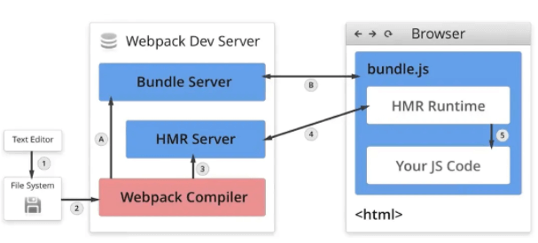

- Webpack Compile：将 JS 源代码编译成 bundle.js
- HMR Server：用来将热更新的文件输出给 HMR Runtime
- Bundle Server：静态资源文件服务器，提供文件访问路径
- HMR Runtime：socket服务器，会被注入到浏览器，更新文件的变化
- bundle.js：构建输出的文件
- 在HMR Runtime 和 HMR Server之间建立 websocket，即图上4号线，用于实时更新文件变化

上面图中，可以分成两个阶段：

- 启动阶段为上图 1 - 2 - A - B

在编写未经过`webpack`打包的源代码后，`Webpack Compile` 将源代码和 `HMR Runtime` 一起编译成 `bundle `文件，传输给` Bundle Server` 静态资源服务器

- 更新阶段为上图 1 - 2 - 3 - 4

当某一个文件或者模块发生变化时，`webpack `监听到文件变化对文件重新编译打包，编译生成唯一的` hash `值，这个`hash `值用来作为下一次热更新的标识

根据变化的内容生成两个补丁文件：`manifest`（包含了 `hash` 和 `chundId `，用来说明变化的内容）和` chunk.js` 模块

由于`socket`服务器在`HMR Runtime` 和 `HMR Server`之间建立 `websocket`链接，当文件发生改动的时候，服务端会向浏览器推送一条消息，消息包含文件改动后生成的`hash`值，如下图的`h`属性，作为下一次热更细的标识

 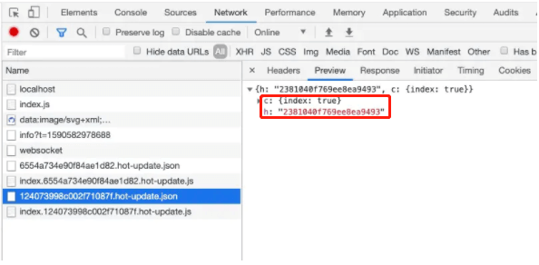

在浏览器接受到这条消息之前，浏览器已经在上一次` socket` 消息中已经记住了此时的` hash` 标识，这时候我们会创建一个 `ajax` 去服务端请求获取到变化内容的 `manifest` 文件

`mainfest`文件包含重新`build`生成的`hash`值，以及变化的模块，对应上图的`c`属性

浏览器根据 `manifest` 文件获取模块变化的内容，从而触发`render`流程，实现局部模块更新

 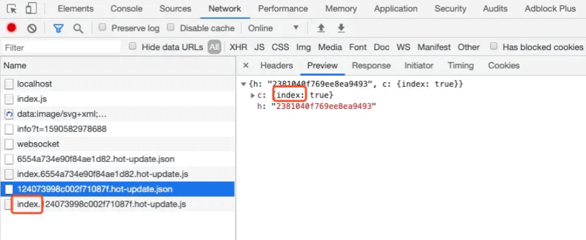


## 三、总结

关于`webpack`热模块更新的总结如下：

- 通过`webpack-dev-server`创建两个服务器：提供静态资源的服务（express）和Socket服务
- express server 负责直接提供静态资源的服务（打包后的资源直接被浏览器请求和解析）
- socket server 是一个 websocket 的长连接，双方可以通信
- 当 socket server 监听到对应的模块发生变化时，会生成两个文件.json（manifest文件）和.js文件（update chunk）
- 通过长连接，socket server 可以直接将这两个文件主动发送给客户端（浏览器）
- 浏览器拿到两个新的文件后，通过HMR runtime机制，加载这两个文件，并且针对修改的模块进行更新


---
### 1051. 为什么现代前端应用需要打包工具进行打包编译？

**难度**：★★☆☆☆ | **题型**：QA | **分类**：全部 / 工程化

**题目**：


**参考答案**：
## 打包构建必要性

现代前端应用需要打包工具进行打包编译的主要原因有以下几点：

1. 模块化管理：现代前端应用通常采用模块化的开发方式，将代码划分为多个模块，每个模块具有独立的功能和依赖关系。打包工具可以将这些模块进行分析，将它们打包成一个或多个静态文件，方便管理和维护。

2. 解决浏览器兼容性问题：不同的浏览器对于 JavaScript 和 CSS 的支持程度不同，而且随着新特性的不断出现，旧版浏览器可能无法完全支持。打包工具可以通过转译、压缩和兼容性处理等手段，将当前前端代码转化为浏览器可识别和运行的代码，解决兼容性问题。

3. 静态资源处理和优化：现代前端应用涉及大量的静态资源，如图片、字体等。打包工具可以对这些资源进行处理和优化，如图片压缩、字体文件打包等，以减小资源文件的体积，提高页面的加载速度和性能。

4. 代码分割和按需加载：打包工具可以将应用程序拆分成多个小块，实现代码分割和按需加载。这样可以实现懒加载，只在需要时加载特定的代码块，提高页面的加载速度。

5. 开发环境支持：打包工具通常提供开发服务器和热模块替换（HMR）等功能，方便开发人员进行开发和调试。开发服务器可以实时预览代码变化，HMR 可以在修改代码后只替换修改的部分，而不是整个页面刷新，提高开发效率。

6. 提升性能：打包工具可以通过代码优化、压缩和混淆等技术手段，减小文件体积，提升应用程序的加载速度和执行效率。

7. 支持多种前端技术：现代前端应用通常使用多种前端技术和语言，如JavaScript、CSS、TypeScript、Sass等。打包工具可以集成这些技术，并提供相应的编译、转译和处理功能，使开发人员能够更轻松地使用这些技术。

8. 自动化工作流程：打包工具可以配合其他构建工具和自动化任务运行器，如Webpack配合Grunt或Gulp，实现自动化的构建和部署流程。这可以减少手动操作，提高开发效率和代码质量。

9. 第三方库管理：现代前端应用通常使用大量的第三方库和框架，这些库可能包含多个文件和依赖关系。打包工具可以自动管理这些库的依赖关系，并将它们打包为单个文件，减少网络请求和提高代码的可维护性。

10. 高度可定制化：打包工具通常提供丰富的插件和配置选项，允许开发人员根据项目需求进行定制。可以灵活配置打包过程中的各种处理和优化方式，以满足项目的具体需求。

总结 - 现代前端应用需要打包工具进行打包编译的原因是为了： **实现模块化管理、解决兼容性问题、静态资源处理和优化、代码分割和按需加载、开发环境支持、性能提升、多技术支持、自动化工作流程、第三方库管理和可定制化等方面的需求**。


---
### 1080. webpack loader 和 plugin 实现原理

**难度**：★★★★☆ | **题型**：QA | **分类**：全部 / 工程化

**题目**：


**参考答案**：
本文讨论的核心内容如下：

1. `webpack`进行打包的基本原理
2. 如何自己实现一个`loader`和`plugin`

注： 本文使用的`webpack`版本是`v4.43.0`, `webpack-cli`版本是`v3.3.11`，`node`版本是`v12.14.1`，`npm`版本`v6.13.4`(如果你喜欢`yarn`也是可以的)，演示用的`chrome`浏览器版本`81.0.4044.129（正式版本） （64 位）`

# 1\. webpack打包基本原理

webpack的一个核心功能就是把我们写的模块化的代码，打包之后，生成可以在浏览器中运行的代码，我们这里也是从简单开始，一步步探索webpack的打包原理

## 1.1 一个简单的需求

我们首先建立一个空的项目，使用`npm init -y`快速初始化一个`package.json`，然后安装`webpack webpack-cli`

接下来，在根目录下创建`src`目录，`src`目录下创建`index.js`，`add.js`，`minus.js`，根目录下创建`index.html`，其中`index.html`引入`index.js`，在`index.js`引入`add.js`，`minus.js`，

目录结构如下：

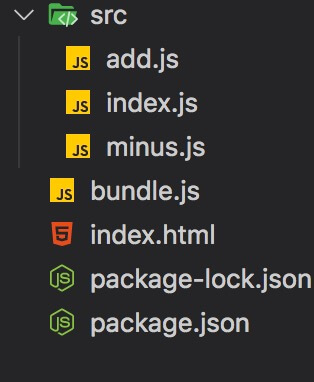

文件内容如下：

```
// add.js
export default (a, b) => {
    return a + b
}
// minus.js
export const minus = (a, b) => {
    return a - b
}
// index.js
import add from './add.js'
import { minus } from './minus.js'

const sum = add(1, 2)
const division = minus(2, 1)
console.log('sum>>>>>', sum)
console.log('division>>>>>', division)

```

```
<!--index.html-->
<!DOCTYPE html>
<html lang="en">
<head>
    <meta charset="UTF-8">
    <meta name="viewport" content="width=device-width, initial-scale=1.0">
    <title>demo</title>
</head>
<body>
    <script src="./src/index.js"></script>
</body>
</html>

```

这样直接在`index.html`引入`index.js`的代码，在浏览器中显然是不能运行的，你会看到这样的错误

```
Uncaught SyntaxError: Cannot use import statement outside a module

```

是的，我们不能在`script`引入的`js`文件里，使用`es6`模块化语法

## 1.2 实现webpack打包核心功能

我们首先在项目根目录下再建立一个bundle.js，这个文件用来对我们刚刚写的模块化`js`代码文件进行打包

我们首先来看webpack官网对于其打包流程的描述：

`it internally builds a dependency graph which maps every module your project needs and generates one or more bundles（webpack会在内部构建一个 依赖图(dependency graph)，此依赖图会映射项目所需的每个模块，并生成一个或多个 bundle）`

在正式开始之前，结合上面`webpack`官网说明进行分析，明确我们进行打包工作的基本流程如下：

1. 首先，我们需要读到入口文件里的内容（也就是index.js的内容）
2. 其次，分析入口文件，递归的去读取模块所依赖的文件内容，生成依赖图
3. 最后，根据依赖图，生成浏览器能够运行的最终代码

### 1\. 处理单个模块（以入口为例）

#### 1.1 获取模块内容

既然要读取文件内容，我们需要用到`node.js`的核心模块`fs`，我们首先来看读到的内容是什么：

```
// bundle.js
const fs = require('fs')
const getModuleInfo = file => {
    const body = fs.readFileSync(file, 'utf-8')
    console.log(body)
}
getModuleInfo('./src/index.js')

```

我们定义了一个方法`getModuleInfo`，这个方法里我们读出文件内容，打印出来，输出的结果如下图：

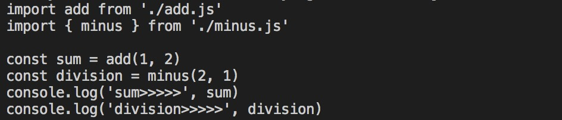

我们可以看到，入口文件`index.js`的所有内容都以字符串形式输出了，我们接下来可以用正则表达式或者其它一些方法，从中提取到`import`以及`export`的内容以及相应的路径文件名，来对入口文件内容进行分析，获取有用的信息。但是如果`import`和`export`的内容非常多，这会是一个很麻烦的过程，这里我们借助`babel`提供的功能，来完成入口文件的分析 

#### 1.2 分析模块内容

我们安装`@babel/parser`，演示时安装的版本号为`^7.9.6`

这个babel模块的作用，就是把我们js文件的代码内容，转换成js对象的形式，这种形式的js对象，称做`抽象语法树(Abstract Syntax Tree, 以下简称AST)`

```
// bundle.js
const fs = require('fs')
const parser = require('@babel/parser')
const getModuleInfo = file => {
    const body = fs.readFileSync(file, 'utf-8')
    const ast = parser.parse(body, {
        // 表示我们要解析的是es6模块
       sourceType: 'module' 
    })
    console.log(ast)
    console.log(ast.program.body)
}
getModuleInfo('./src/index.js')

```

使用`@babel/parser`的`parse`方法把入口文件转化称为了`AST`，我们打印出了`ast`，注意文件内容是在`ast.program.body`中，如下图所示：

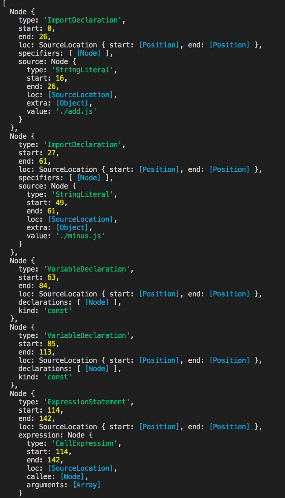

入口文件内容被放到一个数组中，总共有六个`Node`节点，我们可以看到，每个节点有一个`type`属性，其中前两个的`type`属性是`ImportDeclaration`，这对应了我们入口文件的两条`import`语句，并且，每一个`type`属性是`ImportDeclaration`的节点，其`source.value`属性是引入这个模块的相对路径，这样我们就得到了入口文件中对打包有用的重要信息了。 

接下来要对得到的ast做处理，返回一份结构化的数据，方便后续使用。

#### 1.3 对模块内容做处理

对`ast.program.body`部分数据的获取和处理，本质上就是对这个数组的遍历，在循环中做数据处理，这里同样引入一个babel的模块`@babel/traverse`来完成这项工作。

安装`@babel/traverse`，演示时安装的版本号为`^7.9.6`

```
const fs = require('fs')
const path = require('path')
const parser = require('@babel/parser')
const traverse = require('@babel/traverse').default

const getModuleInfo = file => {
    const body = fs.readFileSync(file, 'utf-8')
    const ast = parser.parse(body, {
       sourceType: 'module' 
    })
    const deps = {}
    traverse(ast, {
        ImportDeclaration({ node }) {
            const dirname = path.dirname(file);
            const absPath = './' + path.join(dirname, node.source.value)
            deps[node.source.value] = absPath
        }
    })
    console.log(deps)
}
getModuleInfo('./src/index.js')

```

创建一个对象`deps`，用来收集模块自身引入的依赖，使用`traverse`遍历`ast`，我们只需要对`ImportDeclaration`的节点做处理，注意我们做的处理实际上就是把相对路径转化为绝对路径，这里我使用的是`Mac`系统，如果是`windows`系统,注意斜杠的区别

获取依赖之后，我们需要对`ast`做语法转换，把`es6`的语法转化为`es5`的语法，使用`babel`核心模块`@babel/core`以及`@babel/preset-env`完成

安装`@babel/core @babel/preset-env`，演示时安装的版本号均为`^7.9.6`

```
const fs = require('fs')
const path = require('path')
const parser = require('@babel/parser')
const traverse = require('@babel/traverse').default
const babel = require('@babel/core')

const getModuleInfo = file => {
    const body = fs.readFileSync(file, 'utf-8')
    const ast = parser.parse(body, {
       sourceType: 'module' 
    })
    const deps = {}
    traverse(ast, {
        ImportDeclaration({ node }) {
            const dirname = path.dirname(file);
            const absPath = './' + path.join(dirname, node.source.value)
            deps[node.source.value] = absPath
        }
    })
    const { code } = babel.transformFromAst(ast, null, {
        presets: ["@babel/preset-env"]
    })
    const moduleInfo = { file, deps, code }
    console.log(moduleInfo)
    return moduleInfo
}
getModuleInfo('./src/index.js')

```

如下图所示，我们最终把一个模块的代码，转化为一个对象形式的信息，这个对象包含文件的绝对路径，文件所依赖模块的信息，以及模块内部经过`babel`转化后的代码

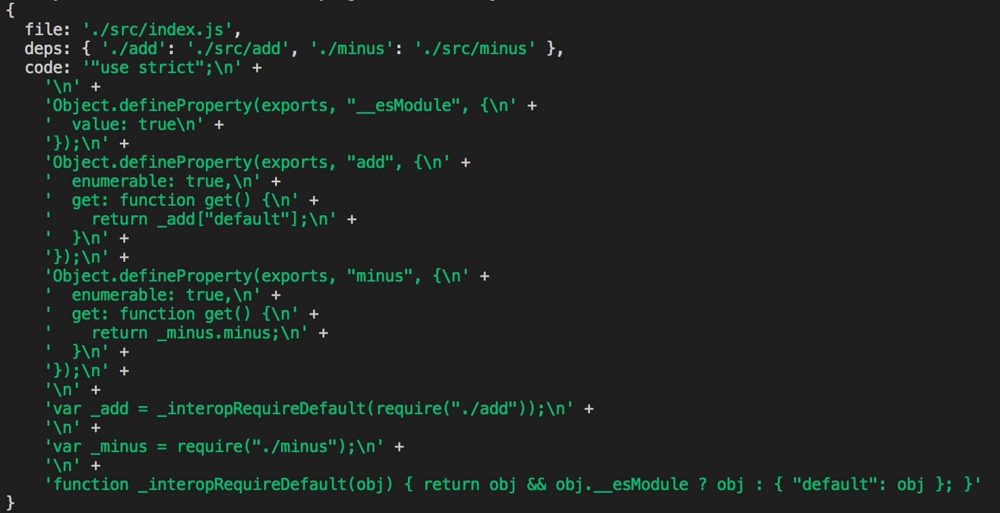

### 2\. 递归的获取所有模块的信息

这个过程，也就是获取`依赖图(dependency graph)`的过程，这个过程就是从入口模块开始，对每个模块以及模块的依赖模块都调用`getModuleInfo`方法就行分析，最终返回一个包含所有模块信息的对象

```
const parseModules = file => {
    // 定义依赖图
    const depsGraph = {}
    // 首先获取入口的信息
    const entry = getModuleInfo(file)
    const temp = [entry]
    for (let i = 0; i < temp.length; i++) {
        const item = temp[i]
        const deps = item.deps
        if (deps) {
            // 遍历模块的依赖，递归获取模块信息
            for (const key in deps) {
                if (deps.hasOwnProperty(key)) {
                    temp.push(getModuleInfo(deps[key]))
                }
            }
        }
    }
    temp.forEach(moduleInfo => {
        depsGraph[moduleInfo.file] = {
            deps: moduleInfo.deps,
            code: moduleInfo.code
        }
    })
    console.log(depsGraph)
    return depsGraph
}
parseModules('./src/index.js')

```

获得的depsGraph对象如下图：

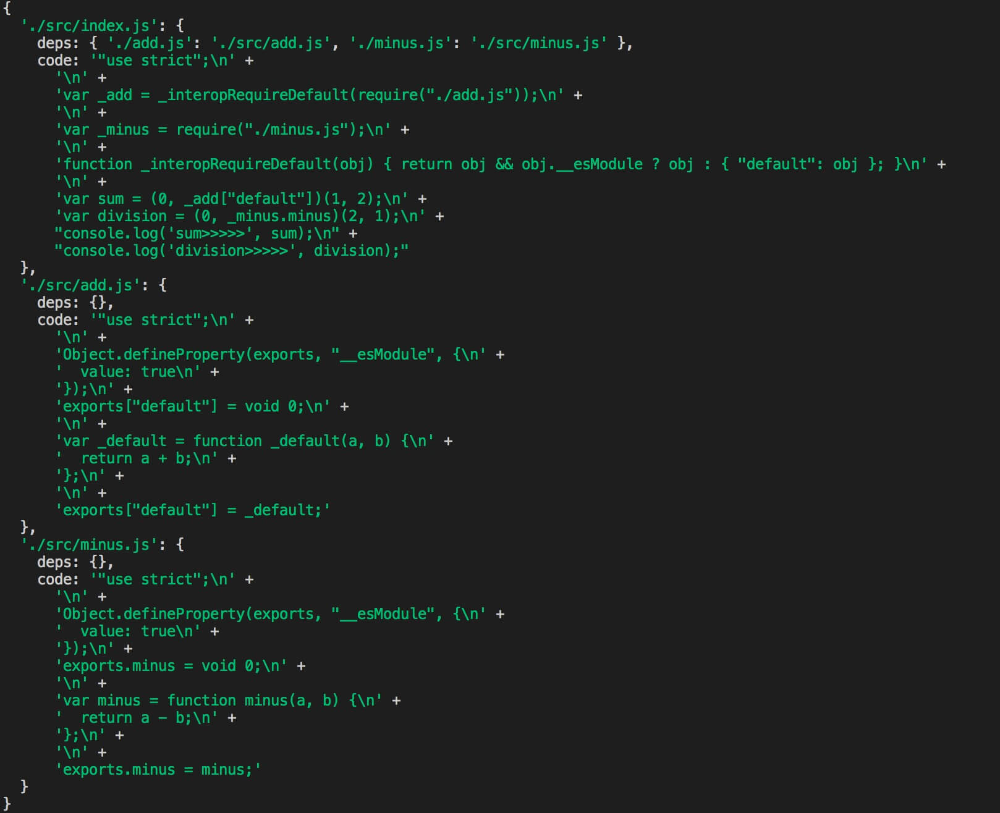

我们最终得到的模块分析数据如上图所示，接下来，我们就要根据这里获得的模块分析数据，来生产最终浏览器运行的代码。

### 3\. 生成最终代码

在我们实现之前，观察上一节最终得到的依赖图，可以看到，最终的code里包含exports以及require这样的语法，所以，我们在生成最终代码时，要对exports和require做一定的实现和处理

我们首先调用之前说的parseModules方法，获得整个应用的依赖图对象：

```
const bundle = file => {
    const depsGraph = JSON.stringify(parseModules(file))
}

```

接下来我们应该把依赖图对象中的内容，转换成能够执行的代码，以字符串形式输出。 我们把整个代码放在自执行函数中，参数是依赖图对象

```
const bundle = file => {
    const depsGraph = JSON.stringify(parseModules(file))
    return `(function(graph){
        function require(file) {
            var exports = {};
            return exports
        }
        require('${file}')
    })(${depsGraph})`
}

```

接下来内容其实很简单，就是我们取得入口文件的code信息，去执行它就好了，使用eval函数执行，初步写出代码如下：

```
const bundle = file => {
    const depsGraph = JSON.stringify(parseModules(file))
    return `(function(graph){
        function require(file) {
            var exports = {};
            (function(code){
                eval(code)
            })(graph[file].code)
            return exports
        }
        require('${file}')
    })(${depsGraph})`
}

```

上面的写法是有问题的，我们需要对file做绝对路径转化，否则`graph[file].code`是获取不到的，定义adsRequire方法做相对路径转化为绝对路径

```
const bundle = file => {
    const depsGraph = JSON.stringify(parseModules(file))
    return `(function(graph){
        function require(file) {
            var exports = {};
            function absRequire(relPath){
                return require(graph[file].deps[relPath])
            }
            (function(require, exports, code){
                eval(code)
            })(absRequire, exports, graph[file].code)
            return exports
        }
        require('${file}')
    })(${depsGraph})`
}

```

接下来，我们只需要执行bundle方法，然后把生成的内容写入一个JavaScript文件即可

```
const content = bundle('./src/index.js')
// 写入到dist/bundle.js
fs.mkdirSync('./dist')
fs.writeFileSync('./dist/bundle.js', content)

```

最后，我们在index.html引入这个`./dist/bundle.js`文件，我们可以看到控制台正确输出了我们想要的结果

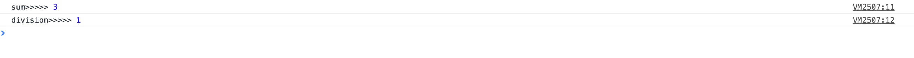

### 4\. bundle.js的完整代码

```
const fs = require('fs')
const path = require('path')
const parser = require('@babel/parser')
const traverse = require('@babel/traverse').default
const babel = require('@babel/core')

const getModuleInfo = file => {
    const body = fs.readFileSync(file, 'utf-8')
    console.log(body)
    const ast = parser.parse(body, {
       sourceType: 'module' 
    })
    // console.log(ast.program.body)
    const deps = {}
    traverse(ast, {
        ImportDeclaration({ node }) {
            const dirname = path.dirname(file);
            const absPath = './' + path.join(dirname, node.source.value)
            deps[node.source.value] = absPath
        }
    })
    const { code } = babel.transformFromAst(ast, null, {
        presets: ["@babel/preset-env"]
    })
    const moduleInfo = { file, deps, code }
    return moduleInfo
}

const parseModules = file => {
    // 定义依赖图
    const depsGraph = {}
    // 首先获取入口的信息
    const entry = getModuleInfo(file)
    const temp = [entry]
    for (let i = 0; i < temp.length; i++) {
        const item = temp[i]
        const deps = item.deps
        if (deps) {
            // 遍历模块的依赖，递归获取模块信息
            for (const key in deps) {
                if (deps.hasOwnProperty(key)) {
                    temp.push(getModuleInfo(deps[key]))
                }
            }
        }
    }
    temp.forEach(moduleInfo => {
        depsGraph[moduleInfo.file] = {
            deps: moduleInfo.deps,
            code: moduleInfo.code
        }
    })
    // console.log(depsGraph)
    return depsGraph
}


// 生成最终可以在浏览器运行的代码
const bundle = file => {
    const depsGraph = JSON.stringify(parseModules(file))
    return `(function(graph){
        function require(file) {
            var exports = {};
            function absRequire(relPath){
                return require(graph[file].deps[relPath])
            }
            (function(require, exports, code){
                eval(code)
            })(absRequire, exports, graph[file].code)
            return exports
        }
        require('${file}')
    })(${depsGraph})`
}


const build = file => {
    const content = bundle(file)
    // 写入到dist/bundle.js
    fs.mkdirSync('./dist')
    fs.writeFileSync('./dist/bundle.js', content)
}

build('./src/index.js')

```

# 2\. 手写`loader`和`plugin`

## 2.1 如何自己实现一个`loader`

loader本质上就是一个函数，这个函数会在我们在我们加载一些文件时执行

### 2.1.1 如何实现一个同步`loader`

首先我们初始化一个项目，项目结构如图所示：

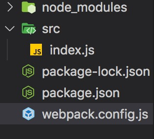

其中index.js和webpack.config.js的文件内容如下： 

```
// index.js
console.log('我要学好前端，因为学好前端可以： ')

// webpack.config.js
const path = require('path')
module.exports = {
    mode: 'development',
    entry: {
        main: './src/index.js'
    },
    output: {
        path: path.resolve(__dirname, 'dist'),
        filename: '[name].js'
    }
}

```

我们在根目录下创建`syncLoader.js`，用来实现一个同步的loader，注意这个函数必须返回一个`buffer`或者`string`

```
// syncloader.ja
module.exports = function (source) {
    console.log('source>>>>', source)
    return source
}

```

同时，我们在`webpack.config.js`中使用这个`loader`，我们这里使用`resolveLoader`配置项，指定`loader`查找文件路径，这样我们使用`loader`时候可以直接指定`loader`的名字

```
const path = require('path')
module.exports = {
    mode: 'development',
    entry: {
        main: './src/index.js'
    },
    output: {
        path: path.resolve(__dirname, 'dist'),
        filename: '[name].js'
    },
    resolveLoader: {
        // loader路径查找顺序从左往右
        modules: ['node_modules', './']
    },
    module: {
        rules: [
            {
                test: /\.js$/,
                use: 'syncLoader'
            }
        ]
    }
}

```

接下来我们运行打包命令，可以看到命令行输出了source内容，也就是loader作用文件的内容。

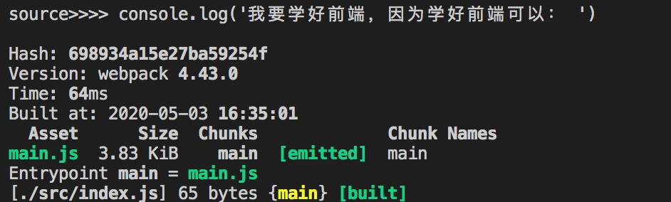

接着我们改造我们的loader: 

```
module.exports = function (source) {
    source += '升值加薪'
    return source
}

```

我们再次运行打包命令，去观察打包后的代码：

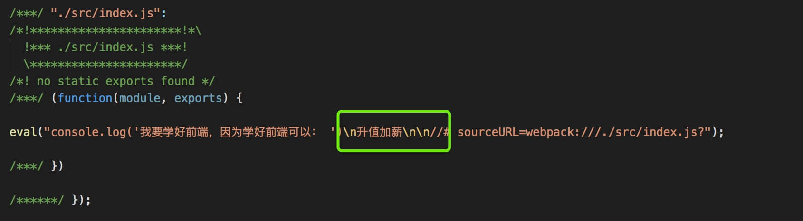

这样，我们就实现了一个简单的loader，为我们的文件增加一条信息。 我们可以尝试在`loader`的函数里打印`this`，发现输出结果是非常长的一串内容，`this`上有很多我们可以在`loader`中使用的有用信息，所以，对于`loader`的编写，一定不要使用箭头函数，那样会改变`this`的指向。 

一般来说，我们会去使用官方推荐的`loader-utils`包去完成更加复杂的`loader`的编写

我们继续安装`loader-utils`，版本是`^2.0.0`

我们首先改造`webpack.config.js`：

```
const path = require('path')

module.exports = {
    mode: 'development',
    entry: {
        main: './src/index.js'
    },
    output: {
        path: path.resolve(__dirname, 'dist'),
        filename: '[name].js'
    },
    resolveLoader: {
        // loader路径查找顺序从左往右
        modules: ['node_modules', './']
    },
    module: {
        rules: [
            {
                test: /\.js$/,
                use: {
                    loader: 'syncLoader',
                    options: {
                        message: '升值加薪'
                    }
                }
            }
        ]
    }
}

```

注意到，我们为我们的`loader`增加了`options`配置项，接下来在loader函数里使用loader-utils获取配置项内容，拼接内容，我们依然可以得到与之前一样的打包结果

```
// syncLoader.js
const loaderUtils = require('loader-utils')
module.exports = function (source) {
    const options = loaderUtils.getOptions(this)
    console.log(options)
    source += options.message
    // 可以传递更详细的信息
    this.callback(null, source)
}

```

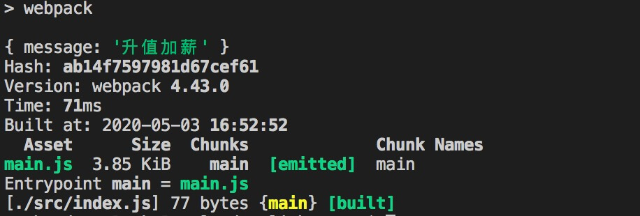

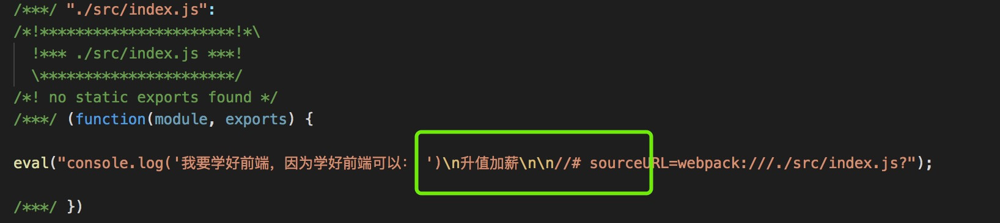

这样，我们就完成了一个简单的同步`loader`的编写

### 2.1.2 如何实现一个异步`loader`

和同步loader的编写方式非常相似，我们在根目录下建立一个asyncLoader.js的文件，内容如下：

```
const loaderUtils = require('loader-utils')
module.exports = function (source) {
    const options = loaderUtils.getOptions(this)
    const asyncfunc = this.async()
    setTimeout(() => {
        source += '走上人生颠覆'
        asyncfunc(null, res)
    }, 200)
}

```

注意这里的`this.async()`，用官方的话来说就是`Tells the loader-runner that the loader intends to call back asynchronously. Returns this.callback.`也就是让webpack知道这个loader是异步运行，返回的是和同步使用时一致的`this.callback`

接下来我们修改webpack.config.js

```
const path = require('path')
module.exports = {
    mode: 'development',
    entry: {
        main: './src/index.js'
    },
    output: {
        path: path.resolve(__dirname, 'dist'),
        filename: '[name].js'
    },
    resolveLoader: {
        // loader路径查找顺序从左往右
        modules: ['node_modules', './']
    },
    module: {
        rules: [
            {
                test: /\.js$/,
                use: [
                    {
                        loader: 'syncLoader',
                        options: {
                            message: '走上人生巅峰'
                        }
                    },
                    {
                        loader: 'asyncLoader'
                    }
                ]
            }
        ]
    }
}

```

注意loader执行顺序是从下网上的，所以首先为文本写入‘升值加薪’，然后写入‘走上人生巅峰’

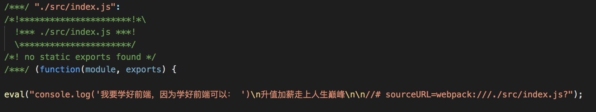

到此，我们简单介绍了如何手写一个`loader`，在实际项目中，可以考虑一部分公共的简单逻辑，可以通过编写一个`loader`来完成(比如国际化文本替换)

## 2.2 如何自己实现一个`plugin`

`plugin`通常是在`webpack`在打包的某个时间节点做一些操作，我们使用`plugin`的时候，一般都是`new Plugin()`这种形式使用，所以，首先应该明确的是，`plugin`应该是一个类。

我们初始化一个与上一接实现loader时候一样的项目，根目录下创建一个`demo-webpack-plugin.js`的文件，我们首先在`webpack.config.js`中使用它

```
const path = require('path')
const DemoWebpackPlugin = require('./demo-webpack-plugin')
module.exports = {
    mode: 'development',
    entry: {
        main: './src/index.js'
    },
    output: {
        path: path.resolve(__dirname, 'dist'),
        filename: '[name].js'
    },
    plugins: [
        new DemoWebpackPlugin()
    ]
}

```

再来看`demo-webpack-plugin.js`的实现

```
class DemoWebpackPlugin {
    constructor () {
        console.log('plugin init')
    }
    apply (compiler) {

    }
}

module.exports = DemoWebpackPlugin

```

我们在`DemoWebpackPlugin`的构造函数打印一条信息，当我们执行打包命令时，这条信息就会输出，`plugin`类里面需要实现一个`apply`方法，`webpack`打包时候，会调用`plugin`的`aplly`方法来执行`plugin`的逻辑，这个方法接受一个`compiler`作为参数，这个`compiler`是`webpack`实例

plugin的核心在于，apply方法执行时，可以操作webpack本次打包的各个时间节点（hooks，也就是生命周期勾子），在不同的时间节点做一些操作

关于webpack编译过程的各个生命周期勾子，可以参考[Compiler Hooks](https://v4.webpack.js.org/api/compiler-hooks/)

同样，这些hooks也有同步和异步之分，下面演示`compiler hooks`的写法，一些重点内容可以参考注释：

```
class DemoWebpackPlugin {
    constructor () {
        console.log('plugin init')
    }
    // compiler是webpack实例
    apply (compiler) {
        // 一个新的编译(compilation)创建之后（同步）
        // compilation代表每一次执行打包，独立的编译
        compiler.hooks.compile.tap('DemoWebpackPlugin', compilation => {
            console.log(compilation)
        })
        // 生成资源到 output 目录之前（异步）
        compiler.hooks.emit.tapAsync('DemoWebpackPlugin', (compilation, fn) => {
            console.log(compilation)
            compilation.assets['index.md'] = {
                // 文件内容
                source: function () {
                    return 'this is a demo for plugin'
                },
                // 文件尺寸
                size: function () {
                    return 25
                }
            }
            fn()
        })
    }
}

module.exports = DemoWebpackPlugin

```

我们的这个`plugin`的作用就是，打包时候自动生成一个`md`文档，文档内容是很简单的一句话

上述异步hooks的写法也可以是以下两种：

```
// 第二种写法(promise)
compiler.hooks.emit.tapPromise('DemoWebpackPlugin', (compilation) => {
    return new Promise((resolve, reject) => {
        setTimeout(() => {
            resolve()
        }, 1000)
    }).then(() => {
        console.log(compilation.assets)
        compilation.assets['index.md'] = {
            // 文件内容
            source: function () {
                return 'this is a demo for plugin'
            },
            // 文件尺寸
            size: function () {
                return 25
            }
        }
    })
})
// 第三种写法(async await)
compiler.hooks.emit.tapPromise('DemoWebpackPlugin', async (compilation) => {
    await new Promise((resolve, reject) => {
        setTimeout(() => {
            resolve()
        }, 1000)
    })
    console.log(compilation.assets)
    compilation.assets['index.md'] = {
        // 文件内容
        source: function () {
            return 'this is a demo for plugin'
        },
        // 文件尺寸
        size: function () {
            return 25
        }
    }
})

```

最终的输出结果都是一样的，在每次打包时候生成一个md文档

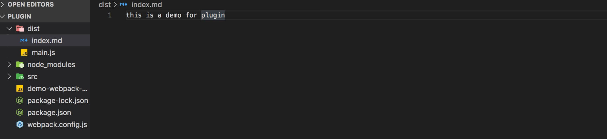


**要点**：
- **Loader**：
  - **作用**：处理和转换模块（文件），用于文件的预处理。
  - **原理**：链式处理文件，通过 `module.rules` 配置，处理模块的转换。
  - **使用方式**：配置 `module.rules`，定义处理流程。

- **Plugin**：
  - **作用**：扩展 Webpack 的功能，执行更复杂的任务。
  - **原理**：利用 Webpack 生命周期钩子，注册到构建过程的不同阶段。
  - **使用方式**：配置 `plugins`，通过实现 `apply` 方法定义插件行为。

Loader 和 Plugin 是 Webpack 的核心组件，通过这两者，开发者可以实现对构建过程的深度控制和自定义。


---
### 1115. 如何优化打包后的 JS bundle 体积？

**难度**：★★★★☆ | **题型**：QA | **分类**：全部 / 工程化

**题目**：


**参考答案**：
优化打包后的 JS bundle 体积，本质上是在**减少无效代码进入产物、延迟非关键代码加载，以及让工具链正确理解“哪些代码可以被安全移除”**。它不是单一技巧能解决的问题，而是工程策略与构建能力共同作用的结果。

首先需要解决的是“为什么多余代码会被打进来”。在绝大多数项目中，bundle 体积膨胀并非来自业务代码本身，而是第三方依赖被整体引入、无法被 Tree Shaking，或在无意中触发了全量打包。因此，优化的起点通常是让构建工具具备**足够精确的静态分析能力**。这意味着优先使用 ESM 语法、避免动态 require、避免通过 barrel files 或不透明的聚合入口引入依赖，从而让打包器明确知道哪些导出从未被使用。

在此基础上，Tree Shaking 是否真正生效，取决于依赖本身是否“可摇”。即使业务侧写法正确，如果依赖包内部存在副作用代码、混合模块规范或过度聚合的导出结构，也会导致无法消除无用模块。这类问题的治理思路，通常不是在打包阶段做补救，而是在依赖选择和使用方式上进行约束，例如只引入精细化模块入口，或在必要时替换为更轻量、结构更清晰的实现。

当“该不该打进来”的问题被控制住之后，下一步关注的是“什么时候加载”。即使代码最终必须存在，也未必需要在首屏加载。通过合理的代码分割，将不同路由、不同业务场景或低频能力拆分为独立 chunk，可以显著降低首包体积。这种拆分并不是越细越好，而是围绕用户访问路径进行切分，确保首屏只加载完成首次交互所必需的最小集合，其余能力按需加载。

在构建输出层面，压缩与优化依然不可忽视，但它们更多是“锦上添花”。开启高质量的压缩、移除调试代码、消除无意义的分支判断，可以进一步降低体积，但前提是代码结构已经足够清晰。如果前面的依赖治理和加载策略没有做好，再激进的压缩也只能得到有限收益。

在大型项目中，体积优化还需要具备可观测性。通过持续分析 bundle 构成，识别哪些模块在版本迭代中持续增长、哪些依赖引入后几乎未被使用，可以将优化从“经验驱动”转为“数据驱动”。这类分析一旦形成机制，就能防止 bundle 体积在长期演进中失控。

整体来看，bundle 体积优化并不是追求极限数字，而是确保每一份进入首屏的代码都有明确价值，其余代码在合适的时间、以合适的方式加载。

**要点**：
JS bundle 优化的核心是减少无效代码进入产物并延迟非关键代码加载；依赖治理和可 Tree Shaking 的代码结构是前提；通过合理代码分割降低首屏体积；压缩与移除调试代码属于后置优化；结合构成分析工具，才能在长期演进中持续控制体积增长。

---
### 1149. vite 使用了哪些编译器，分别有什么作用？

**难度**：★★★☆☆ | **题型**：QA | **分类**：全部 / 工程化

**题目**：


**参考答案**：
Vite 使用多种编译器来处理不同类型的文件，以实现快速开发和打包。这些编译器负责将源码转化为浏览器可执行的代码。

以下是 Vite 常用的编译器及其作用：

### 1. **esbuild**
   - **作用**：`esbuild` 是 Vite 的核心工具之一，主要用于**JavaScript 和 TypeScript 的快速编译**。它在开发时为 Vite 提供了超快的模块解析、转译和捆绑性能。
   - **特点**：`esbuild` 是用 Go 编写的，速度非常快，适合处理大规模的模块；在生产环境中常用于预构建依赖项、编译 TypeScript 和移除开发标记（如 `console.log`）。
   - **应用场景**：处理 JavaScript/TypeScript 文件，依赖预构建，简化和加速开发构建过程。

### 2. **Rollup**
   - **作用**：Vite 使用 `Rollup` 作为其**生产构建的底层工具**，负责打包、优化和输出最终的生产代码。`Rollup` 处理模块的依赖关系和代码优化，比如 Tree-shaking。
   - **特点**：`Rollup` 具备丰富的插件生态，支持各种文件类型的处理和优化，适用于生产环境的打包。
   - **应用场景**：主要用于生产构建阶段，将所有代码打包为高效的生产文件。

### 3. **@vitejs/plugin-vue / @vitejs/plugin-react**
   - **作用**：`@vitejs/plugin-vue` 和 `@vitejs/plugin-react` 是 Vite 官方提供的插件，用于**支持 Vue 和 React 框架**。它们分别支持 Vue 的 SFC（单文件组件）和 React 的 JSX/TSX 语法。
   - **特点**：通过集成框架插件，可以直接在 Vite 中解析和编译 Vue 的 SFC 文件（包括 `<template>`、`<script>` 和 `<style>` 等部分），或支持 React 语法和 HMR（热重载）。
   - **应用场景**：项目使用 Vue 或 React 时，需引入相应插件来解析框架特有的语法。

### 4. **PostCSS**
   - **作用**：`PostCSS` 是一种**CSS 转换工具**，通过插件处理 CSS 文件。Vite 使用 `PostCSS` 编译和优化 CSS，例如为 CSS 添加浏览器前缀、支持嵌套规则。
   - **特点**：`PostCSS` 可以定制插件链，满足不同项目的需求，比如自动修复 CSS 兼容性问题。
   - **应用场景**：处理纯 CSS 文件和 `Sass`、`Less` 等预处理器生成的 CSS 文件。

### 5. **CSS 预处理器（Sass、Less、Stylus）**
   - **作用**：Vite 支持集成 `Sass`、`Less`、`Stylus` 等**CSS 预处理器**。预处理器用于增强 CSS 功能，提供变量、嵌套、循环等语法。
   - **特点**：Vite 通过预处理器插件编译 `.scss`、`.less` 等文件格式，并将其转换为普通 CSS。
   - **应用场景**：在样式开发中使用 Sass、Less 等预处理器时，通过 Vite 配置实现无缝转换。

### 6. **Babel（可选）**
   - **作用**：虽然 Vite 默认不使用 `Babel`，但可以在特殊需求下集成 Babel 进行**高级语法转换或插件支持**，例如对较旧浏览器的兼容性处理。
   - **特点**：`Babel` 是一款灵活的 JavaScript 编译器，支持许多插件和预设，可以细致控制 JavaScript 转译。
   - **应用场景**：对于需要兼容老旧浏览器、使用特定插件或语法特性的项目，可以通过 Vite 配置 Babel 支持。

**要点**：
Vite 使用 `esbuild` 实现快速开发、`Rollup` 实现生产构建，结合框架插件和 CSS 预处理器插件，处理项目中常见的编译需求。通过合理使用这些编译器，Vite 实现了高性能和灵活性的兼容，在开发和生产环境中表现出色。

---
### 1156. 你对 babel 了解吗，能不能说说几个 stage 代表什么意思？

**难度**：★☆☆☆☆ | **题型**：QA | **分类**：全部 / 工程化

**题目**：


**参考答案**：
Babel 是一个广泛使用的 JavaScript 编译器，它可以将新版本的 JavaScript 代码转换为向后兼容的旧版本代码。

Babel 通过使用不同的插件集合来支持各个 ECMAScript（ES）提案的不同阶段，这些阶段被称为 "stage"。

以下是几个常见的 Babel stage（阶段）及其代表的意思：

1. **Stage 0 - Strawman（展示阶段）**:
   - 这是提案中最初的阶段，表明该提案还处于初始阶段，可能只是一个想法或草案，并没有正式进入 ECMAScript 规范的流程中。

2. **Stage 1 - Proposal（建议阶段）**:
   - 在这个阶段，提案已经成为了正式的 ECMAScript 提案，已经有了详细的规范和设计说明，并且正在讨论和收集反馈。

3. **Stage 2 - Draft（草案阶段）**:
   - 草案阶段表明该提案已经比较成熟，在语言规范中进行了初步定义，并且正在进行实验和实现。

4. **Stage 3 - Candidate（候选阶段）**:
   - 候选阶段表明该提案已经基本成熟，规范已经稳定，并且已经有了多个浏览器或环境的实现和测试。

5. **Stage 4 - Finished（完成阶段）**:
   - 完成阶段表明该提案已经准备好被纳入下一个版本的 ECMAScript 规范中，并且已经通过了所有必要的测试和审查。

需要注意的是，不是所有的提案都会按照这个阶段流程发展。一些重要的提案可能直接进入较高的阶段，而其他的提案可能在某个阶段停滞或被废弃。

Babel 提供了一系列插件集合，用于转译各个不同阶段的 ECMAScript 提案。根据你的需求，在 Babel 的配置文件中可以选择不同的插件集合，以支持你希望使用的 ECMAScript 特性。

**要点**：
- **Stage 0**：实验性，尚未经过正式标准化。
- **Stage 1**：初步设计和讨论阶段。
- **Stage 2**：稳定性较高的草案阶段。
- **Stage 3**：接近最终标准的候选阶段。
- **Stage 4**：已成为正式 ECMAScript 标准的一部分。

Babel 通过支持这些不同阶段的特性，帮助开发者使用最新的 JavaScript 语法和功能，同时保持代码的兼容性和稳定性。


---
### 1157. webpack 中的 webpack-dev-server 为什么不适用于线上环境？

**难度**：★☆☆☆☆ | **题型**：QA | **分类**：全部 / 工程化

**题目**：


**参考答案**：
`webpack-dev-server` 通常不适用于线上环境，原因如下：

### 1. **性能和内存限制**
   - `webpack-dev-server` 将打包后的文件保存在内存中，而不是写入磁盘，这样可以加快开发时的构建速度。但是在生产环境中，这种方式会占用大量内存，尤其是处理大型应用时，对服务器资源消耗较大，不适合持久化的线上部署需求。

### 2. **缺乏优化**
   - 生产环境代码通常需要经过压缩、去除未使用代码（Tree-shaking）、分包等优化步骤，以减小文件大小和提升加载速度。而 `webpack-dev-server` 主要针对开发环境设计，不会对代码进行这些生产级优化，直接用于线上会导致加载速度慢、用户体验差。

### 3. **安全性问题**
   - `webpack-dev-server` 主要用于本地开发，没有针对线上环境的安全配置。默认配置下，它没有针对 XSS、CSRF 等攻击进行专门的保护，也没有对敏感信息进行过滤，线上直接使用会带来安全风险。

### 4. **缺少持久化支持**
   - `webpack-dev-server` 的内存存储方式不适合生产环境的文件持久化需求。例如，文件需要长期存储并可以缓存以减少服务器压力，而 `webpack-dev-server` 会在每次重启时重新生成文件，导致无法持久提供文件。

### 5. **不支持高并发**
   - 由于 `webpack-dev-server` 的设计主要是为了快速响应开发中的变化，缺乏针对高并发的优化。在生产环境中，多个用户同时请求会导致响应时间延长，影响用户体验。

### 6. **日志和监控不足**
   - `webpack-dev-server` 没有提供生产环境所需的日志和监控功能，例如请求日志、错误日志、性能监控等。这些功能对于监控线上应用的健康状况和及时定位问题非常关键。

**要点**：
`webpack-dev-server` 是为了开发阶段的便捷和高效而设计的。线上环境更适合通过 `webpack` 生产构建输出静态文件，然后由 `Nginx`、`Apache` 等服务器托管，从而提供更好的性能、安全性和稳定性。

---
### 1194. 说说webpack proxy工作原理？为什么能解决跨域?

**难度**：★★★☆☆ | **题型**：QA | **分类**：全部 / 工程化

**题目**：


**参考答案**：
## 一、是什么

`webpack proxy`，即`webpack`提供的代理服务

基本行为就是接收客户端发送的请求后转发给其他服务器

其目的是为了便于开发者在开发模式下解决跨域问题（浏览器安全策略限制）

想要实现代理首先需要一个中间服务器，`webpack`中提供服务器的工具为`webpack-dev-server`

#### webpack-dev-server

`webpack-dev-server`是 `webpack` 官方推出的一款开发工具，将自动编译和自动刷新浏览器等一系列对开发友好的功能全部集成在了一起

目的是为了提高开发者日常的开发效率，**只适用在开发阶段**

关于配置方面，在`webpack`配置对象属性中通过`devServer`属性提供，如下：

```js
// ./webpack.config.js
const path = require('path')

module.exports = {
    // ...
    devServer: {
        contentBase: path.join(__dirname, 'dist'),
        compress: true,
        port: 9000,
        proxy: {
            '/api': {
                target: 'https://api.github.com'
            }
        }
        // ...
    }
}
```

`devServetr`里面`proxy`则是关于代理的配置，该属性为对象的形式，对象中每一个属性就是一个代理的规则匹配

属性的名称是需要被代理的请求路径前缀，一般为了辨别都会设置前缀为` /api`，值为对应的代理匹配规则，对应如下：

- target：表示的是代理到的目标地址
- pathRewrite：默认情况下，我们的 /api-hy 也会被写入到URL中，如果希望删除，可以使用pathRewrite
- secure：默认情况下不接收转发到https的服务器上，如果希望支持，可以设置为false
- changeOrigin：它表示是否更新代理后请求的 headers 中host地址


## 二、工作原理

 `proxy`工作原理实质上是利用`http-proxy-middleware` 这个`http`代理中间件，实现请求转发给其他服务器

举个例子：

在开发阶段，本地地址为`http://localhost:3000`，该浏览器发送一个前缀带有`/api`标识的请求到服务端获取数据，但响应这个请求的服务器只是将请求转发到另一台服务器中

```js
const express = require('express');
const proxy = require('http-proxy-middleware');

const app = express();

app.use('/api', proxy({target: 'http://www.example.org', changeOrigin: true}));
app.listen(3000);

// http://localhost:3000/api/foo/bar -> http://www.example.org/api/foo/bar
```


## 三、跨域

在开发阶段， `webpack-dev-server` 会启动一个本地开发服务器，所以我们的应用在开发阶段是独立运行在 `localhost `的一个端口上，而后端服务又是运行在另外一个地址上

所以在开发阶段中，由于浏览器同源策略的原因，当本地访问后端就会出现跨域请求的问题

通过设置`webpack proxy`实现代理请求后，相当于浏览器与服务端中添加一个代理者

当本地发送请求的时候，代理服务器响应该请求，并将请求转发到目标服务器，目标服务器响应数据后再将数据返回给代理服务器，最终再由代理服务器将数据响应给本地

 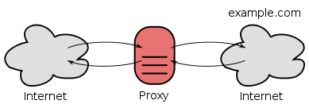

在代理服务器传递数据给本地浏览器的过程中，两者同源，并不存在跨域行为，这时候浏览器就能正常接收数据

注意：**服务器与服务器之间请求数据并不会存在跨域行为，跨域行为是浏览器安全策略限制**


---
### 1204. webpack的构建流程是什么

**难度**：★☆☆☆☆ | **题型**：QA | **分类**：全部 / 工程化

**题目**：


**参考答案**：
<p>Webpack 的运行流程是一个串行的过程，从启动到结束会依次执行以下流程：<br/> </p><ol><li>初始化参数：从配置文件和 Shell 语句中读取与合并参数，得出最终的参数；</li><li>开始编译：用上一步得到的参数初始化 Compiler 对象，加载所有配置的插件，执行对象的 run 方法开始执行编译；</li><li>确定入口：根据配置中的 entry 找出所有的入口文件；</li><li>编译模块：从入口文件出发，调用所有配置的 Loader 对模块进行翻译，再找出该模块依赖的模块，再递归本步骤直到所有入口依赖的文件都经过了本步骤的处理；</li><li>完成模块编译：在经过第4步使用 Loader 翻译完所有模块后，得到了每个模块被翻译后的最终内容以及它们之间的依赖关系；</li><li>输出资源：根据入口和模块之间的依赖关系，组装成一个个包含多个模块的 Chunk，再把每个 Chunk 转换成一个单独的文件加入到输出列表，这步是可以修改输出内容的最后机会；</li><li>输出完成：在确定好输出内容后，根据配置确定输出的路径和文件名，把文件内容写入到文件系统。</li></ol><p> </p>


---
### 1206. vite 和  webpack 在热更新的实现上有什么区别？

**难度**：★★★☆☆ | **题型**：QA | **分类**：全部 / 工程化

**题目**：


**参考答案**：
在热更新（HMR，Hot Module Replacement）实现上，Vite 和 Webpack 有显著的区别。Vite 采用了一种与 Webpack 不同的模块处理方式，使得开发体验更为迅速流畅。

以下是 Vite 和 Webpack 在 HMR 实现上的主要区别：

### 1. **开发服务器模式**
   - **Vite**：基于原生 ES 模块（ESM）的浏览器加载方式，利用浏览器的 ESM 能力直接从开发服务器中按需加载模块。Vite 将应用代码以模块的形式直接提供给浏览器，无需构建整个依赖图。这种模式减少了构建步骤，从而显著提升热更新的速度。
   - **Webpack**：使用内置的开发服务器将所有模块打包到一个 Bundle 中，然后由 HMR 插件管理模块更新。Webpack 构建时需要对整个应用依赖图进行一次性打包，因此初始启动和更新的速度相对较慢。

### 2. **模块重载机制**
   - **Vite**：当检测到文件变化时，Vite 会**精确地更新变动的模块**，仅重载发生变化的部分。由于 Vite 基于 ESM 设计，它可以通过 `import.meta.hot` API 将热更新精确定位到特定模块，大大减少了不必要的代码重新加载。
   - **Webpack**：HMR 插件会更新模块或模块树的整个部分，即使只是一个小的模块更改，Webpack 可能仍需重新打包相关的代码块并重新加载。

### 3. **依赖预构建**
   - **Vite**：在启动时，`esbuild` 会对依赖进行预构建并缓存，浏览器可直接请求缓存的模块。因为依赖模块基本不会变动，Vite 的 HMR 只需对应用模块进行热更新。依赖模块预构建避免了每次更改时的重复解析，使得热更新更轻量。
   - **Webpack**：没有预构建缓存机制，所有依赖在开发和更新时都要重新打包和处理。Webpack 的 HMR 需分析整个依赖图，并在变动时重新生成部分代码，影响热更新效率。

### 4. **构建和更新性能**
   - **Vite**：通过原生 ESM 和逐模块加载机制，初始构建时只加载应用代码，更新时只更新变动部分。热更新只需重载特定模块，整个过程无需打包，显著提升速度。
   - **Webpack**：初始构建会生成整个应用的 Bundle，更新时也需重新打包部分代码。模块热替换涉及打包、编译和代码注入，尤其在大型应用中，热更新速度较慢，且会随着应用增大而变慢。

### 5. **模块处理方式**
   - **Vite**：基于 ESM，无需插件即可实现模块热重载，Vite 通过 `import.meta.hot.accept()` 接受模块更新并应用，开发者可以在模块中使用 `import.meta.hot` 检查模块的热更新状态。
   - **Webpack**：需要 HMR 插件和 Webpack 特定配置来支持模块热更新。Webpack 的热更新依赖 `module.hot`，通过该 API 来管理模块更新和重新加载。


**要点**：
Vite 基于 ESM 架构，直接将模块提供给浏览器，因而在模块热更新时不需要重新打包，极大提高了 HMR 的速度和开发体验。相比之下，Webpack 由于打包依赖和插件管理，更新时需要重新构建部分代码，使得 HMR 速度在大型项目中有所限制。

因此，Vite 的 HMR 更轻量、响应更快，适合现代开发场景，而 Webpack 在大型、复杂应用中具备更灵活的配置支持。

---
### 1207. Husky 和 lint-staged 有什么区别？

**难度**：★★☆☆☆ | **题型**：QA | **分类**：全部 / 工程化

**题目**：


**参考答案**：
**Husky** 和 **lint-staged** 都是前端开发中常用的工具，用来提升代码质量，特别是在代码提交和推送阶段进行校验和格式化。它们各自有不同的作用和使用场景，通常可以配合使用。

### **1. Husky**
**Husky** 是一个 Git 钩子工具，允许你在 Git 提交（`commit`）、推送（`push`）等操作时，自动执行指定的命令。它让你能够在这些 Git 操作前后运行脚本，通常用于代码检查、格式化、单元测试等工作。

#### 主要作用：
- **Git 钩子管理**：它通过配置 Git 钩子（如 `pre-commit`、`pre-push` 等）来执行任务。
- **与 Git 操作集成**：可以在 Git 操作的不同生命周期内执行自定义的命令，比如在提交代码前运行 `eslint` 或者在推送前运行测试。

#### 常见用途：
- 在 `git commit` 之前，自动执行代码检查（如 `eslint` 或 `prettier`），保证代码符合规范。
- 在 `git push` 之前，自动执行单元测试，确保不会将未通过测试的代码推送到远程仓库。
  
#### 示例：
```bash
# 在安装 Husky 后，添加 Git 钩子
npx husky-init
npm install
```

然后，你可以在 `.husky/pre-commit` 文件中添加如下一行命令，来确保在提交代码之前运行 lint 检查：
```bash
npx lint-staged
```

### **2. lint-staged**
**lint-staged** 是一个工具，用于仅对暂存（staged）的文件（即已经通过 `git add` 添加到暂存区的文件）执行 lint 校验或格式化。它的目的是提高效率，避免对整个项目的所有文件进行校验，只对即将提交的文件进行检查。

#### 主要作用：
- **只检查暂存的文件**：与 Husky 配合使用时，可以保证只检查那些已经加入 Git 暂存区的文件，而不是整个项目。
- **与 Husky 配合**：通常在 `pre-commit` 钩子中运行 `lint-staged`，确保只有被修改的文件通过 Lint 检查或格式化，避免对未修改的文件浪费计算资源。

#### 常见用途：
- 运行 `eslint`、`prettier`、`stylelint` 等工具，只对修改的文件进行检查和格式化。
- 执行 Git 钩子时，避免不必要的操作，提升效率。

#### 示例：
```bash
// 在 package.json 中配置 lint-staged
{
  "lint-staged": {
    "*.js": "eslint --fix",
    "*.css": "stylelint --fix",
    "*.json": "prettier --write"
  }
}
```

在 Git 提交时，`lint-staged` 只会检查那些已经暂存的 `.js`、`.css` 和 `.json` 文件，并自动修复它们。

### **区别总结**

| **特性**          | **Husky**                        | **lint-staged**                  |
|-------------------|----------------------------------|----------------------------------|
| **作用**          | 管理和执行 Git 钩子             | 只对暂存的文件执行校验和格式化 |
| **工作原理**      | 触发 Git 提交、推送等操作时执行脚本 | 只检查 Git 暂存区中的文件       |
| **常见场景**      | 在 Git 操作前执行检查和脚本      | 在 Git 提交前只检查修改的文件   |
| **配置方式**      | 配置 Git 钩子，如 `pre-commit`  | 配置哪些文件需要执行哪些操作    |
| **是否与 Git 操作结合** | 是，直接与 Git 提交、推送操作挂钩 | 是，与 Git 提交操作结合，但只检查暂存文件 |

### **如何配合使用 Husky 和 lint-staged**

- **Husky** 负责在 Git 提交或推送时触发钩子事件。
- **lint-staged** 配合 `pre-commit` 钩子，只对暂存区中的文件进行 lint 校验和自动修复。

#### 配合示例：
1. 安装 Husky 和 lint-staged：
   ```bash
   npm install husky lint-staged --save-dev
   ```

2. 启用 Husky：
   ```bash
   npx husky-init
   npm install
   ```

3. 配置 `lint-staged` 来处理文件：
   在 `package.json` 中添加 `lint-staged` 配置：
   ```json
   {
     "lint-staged": {
       "*.js": "eslint --fix",
       "*.css": "stylelint --fix"
     }
   }
   ```

4. 配置 Husky 钩子：
   在 `.husky/pre-commit` 文件中添加：
   ```bash
   npx lint-staged
   ```

这样，每次提交时，Husky 会触发 `pre-commit` 钩子，运行 `lint-staged`，`lint-staged` 会只检查那些已经暂存的文件，并对其进行自动修复或格式化。

**要点**：
- **Husky** 用于管理 Git 钩子，执行某些操作（如校验、测试等）在 Git 提交前或推送前进行。
- **lint-staged** 主要用于只对暂存区的文件执行校验或格式化，避免浪费不必要的资源。

这两个工具通常一起使用，在提交时既能确保代码规范，又能提高效率。

---
### 1265. 如何清理源码里面没有被使用的代码？主要是 JS、TS、CSS 代码

**难度**：★★★☆☆ | **题型**：QA | **分类**：全部 / 工程化

**题目**：


**参考答案**：
清理未使用的代码（又称为**代码剔除**、**死代码移除**）是前端开发中的一项常见任务，能够有效减小项目体积，提升性能。对于 JS/TS 和 CSS 代码，清理的方式有所不同。下面我将介绍一些常见的方法和工具来清理源码中的未使用代码。

### 1. **JavaScript/TypeScript 未使用代码清理**

#### **工具：Webpack + Tree Shaking**
- **Tree Shaking** 是 Webpack 的一种优化技术，主要通过移除未使用的 ES6 模块代码来减小最终打包文件的体积。Tree Shaking 能够有效剔除未使用的 JavaScript/TypeScript 函数和变量。
  
##### **配置 Webpack Tree Shaking**
1. 确保使用 **ES6 模块**（`import/export`），因为 Tree Shaking 只会对 ES6 模块起作用。
2. 启用 **`mode: production`** 来启用 Webpack 内置的优化和 Tree Shaking 功能。
3. **配置 `sideEffects`**，以告知 Webpack 哪些文件没有副作用，以便更好地进行树摇。

```json
// package.json
{
  "sideEffects": [
    "*.css",
    "*.scss", 
    "src/some-module.js"
  ]
}
```

#### **工具：ESLint + TSLint (or typescript-eslint)**
ESLint 或 TSLint 能帮助你检测和清理一些潜在的未使用代码。
- **`no-unused-vars`** 规则可以检测未使用的变量。
- **`no-unused-imports`** 可以检查未使用的导入。

##### **ESLint 配置示例：**
```json
{
  "rules": {
    "no-unused-vars": ["error", { "argsIgnorePattern": "^_" }]
  }
}
```

- **`tslint`**（对于旧的 TypeScript 项目）或 **`typescript-eslint`** 插件可用于检查 TypeScript 文件中的未使用代码。

#### **工具：Unused Files Webpack Plugin**
`unused-files-webpack-plugin` 可以帮助检测项目中未使用的文件和模块。

安装插件：
```bash
npm install unused-files-webpack-plugin --save-dev
```

配置 Webpack：
```js
const UnusedFilesWebpackPlugin = require("unused-files-webpack-plugin").default;

module.exports = {
  plugins: [
    new UnusedFilesWebpackPlugin({
      patterns: ['src/**/*.js', 'src/**/*.ts'],
      failOnUnused: false, // 如果检测到未使用的文件则失败
    }),
  ],
};
```

### 2. **CSS 未使用代码清理**

#### **工具：PurgeCSS**
PurgeCSS 是一款常用的工具，用来清理未使用的 CSS 代码。它可以在项目构建时根据实际使用情况删除多余的 CSS。

**配置 PurgeCSS：**
1. 安装 PurgeCSS：

```bash
npm install purgecss --save-dev
```

2. 配置 PurgeCSS 的文件扫描路径：

```js
const Purgecss = require('purgecss')

const purge = new Purgecss({
  content: ['./src/**/*.html', './src/**/*.js'], // 扫描 HTML 和 JS 文件
  css: ['./src/styles.css'], // 需要清理的 CSS 文件
})

const result = purge.purge()
```

#### **工具：PurgeCSS 集成到 Webpack**
你也可以在 Webpack 中使用 `PurgeCSS` 插件来自动清理未使用的 CSS。

安装插件：
```bash
npm install purgecss-webpack-plugin --save-dev
```

配置 Webpack：
```js
const PurgecssWebpackPlugin = require('purgecss-webpack-plugin');
const glob = require('glob');
const path = require('path');

module.exports = {
  plugins: [
    new PurgecssWebpackPlugin({
      paths: glob.sync(path.join(__dirname, 'src/**/*.js')),
    }),
  ],
};
```

#### **工具：TailwindCSS 自带 Purge 功能**
如果你使用的是 **TailwindCSS**，它内置了 PurgeCSS 功能，能够自动清理未使用的 CSS 类。只需要在 `tailwind.config.js` 中配置 `purge` 选项即可。

```js
module.exports = {
  purge: ['./src/**/*.html', './src/**/*.js'],
  darkMode: false,
  theme: {
    extend: {},
  },
  variants: {
    extend: {},
  },
  plugins: [],
}
```

#### **工具：CSSNano**
`cssnano` 是一个用于压缩 CSS 的工具，它也能帮助剔除一些无用的 CSS。

```bash
npm install cssnano --save-dev
```

### 3. **其他推荐的做法**
- **定期检查和清理未使用代码**：可以结合团队的开发流程，定期进行代码审查，确保不再使用的代码和模块及时移除。
- **使用现代的框架和构建工具**：例如 React, Vue, Angular 等现代框架，通常都有类似的工具和机制来清理未使用的代码。
- **使用模块化思想**：始终保持代码的模块化，避免直接引入整个库或者大模块，而是引入真正需要的部分，这有助于减少不必要的代码加载。


**要点**：
- **JS/TS 清理**：通过 Webpack 的 Tree Shaking、ESLint 或 TSLint、Unused Files Webpack Plugin 等工具，能有效清理未使用的 JS 和 TS 代码。
- **CSS 清理**：使用 PurgeCSS、TailwindCSS 内置的 purge 功能，或者 cssnano 来清理无用的 CSS 代码。
- **定期代码审查**：定期检查项目中的未使用代码，确保项目保持干净和高效。

---
### 1267. 前后端分离是什么？

**难度**：★★★☆☆ | **题型**：QA | **分类**：全部 / 工程化

**题目**：


**参考答案**：
前后端分离，顾名思义，就是前端与后端分开。分开什么？分开开发，分开部署。

这里以java web开发作为例子：我们学web开发的时候会接触到spring mvc框架，spring mvc开发时前端一般都用jsp作为展示页面，后端用servlet处理请求。再到springboot框架，前端使用thymeleaf或者freemarker作为模板引擎展示，后端用controller处理请求。

其中jsp和thymeleaf，freemarker都有一个共同点：页面都是可以内嵌java代码的。页面里面嵌入了java（后端程序设计语言）代码，就导致页面和后端服务的耦合度特别高——前后端开发的时候粘在一起了。

而如果我们要部署spring mvc/springboot的项目的话，前后端代码也都是打包在一个war包/jar包里的，部署的时候也是一起部署的，就导致前端要修改/后端要修改的话项目都要重新打包部署——前后端部署也粘在一起了。

怎样才算分开开发呢？那当然就是前端页面只用写html + js + css，后端不用写jsp，不用使用thymeleaf等模板引擎来做html的渲染了。

怎样才算分开部署呢？将前端项目和后端项目分开成两部分分别部署到服务器里。

所以，前端项目和后端项目分开开发，分开部署的都算是前后端分离。

## 我们为什么要前后端分离

* 项目变大后难以更新维护

我们也都知道，一个项目开发出来之后，都会一直更新维护。

那每次项目更新升级都会添加新功能，代码量也会增加，项目也会越来越大。如果采取前后端不分离的开发方式，前后端的更新迭代对于前端工程师和后端工程师或是全栈工程师而言也是巨大的压力：当一个页面需要前端工程师和后端工程师一起才能做好的时候，对他们而言，沟通可能是比代码更令人头疼的问题；当一个项目开发团队都是全栈工程师，如果项目变大，首先令人头疼的问题应该是：怎样才能招到合格的全栈工程师——毕竟全栈工程师对程序员的要求更高。而且当前端页面或后端接口出现问题时，我们不得不重新打包编译整个项目以进行项目的更新与维护，而项目越大，打包与编译所耗费的时间就越长。

* 项目耦合太严重难以复用

上文也有提到，如果使用模板引擎或是jsp这种特殊的页面，都会出现在页面上写java代码的情况。那么如果想要进行代码复用，难度肯定是特别高的：每次复用后端接口都需要重新修改前端页面，并在上面添加java代码。

* 项目加载更加耗费资源和时间

如果要加载一个使用了thymeleaf的页面，首先我们需要调用thymeleaf引擎来解析页面上的java代码，然后再对页面进行渲染，而一般的静态页面只需要直接渲染就可以。如果我们项目需要承载更多的并发的时候，我们也只能将前后端结合的部署包进行多包部署以扩充系统性能，但这样也浪费了一部分资源。

## 前后端分离有什么好处

* 提升前端与后端开发效率

前端与后端可以分开干了，各干各的，各自都只需要负责各自擅长的东西：前端只需要管html，css和js，后端只需要管java。只要商量确定好接口文档，甚至连开发进度都可以不统一：前端用js来mock数据进行测试，后端用postman等接口测试工具来做接口测试。

* 项目更新维护变简单

当我们需要更新维护前端页面时，只需要对前端项目的bug进行修缮，然后对前端项目进行打包部署就行，后端也是一样。而当团队需要扩招的时候，擅长单一职责（前端/后端）的人也更好找。

* 提高接口复用率

如果我们需要开发一个相似的项目，或者复用之前项目的后端模块，只需要将模块拿出来后进行小改动就行。而不是像以前一样大费周折，还要将接口对应的旧页面上的相应java代码移植到新的页面上（甚至还会出现不兼容的情况）。

* 让页面加载变得更快

我们将前端页面打包成静态页面进行部署，用户只需要访问静态页面就行，比起需要多一步解析交互代码的thymeleaf等模板引擎，普通的html页面肯定会快上一些，而有的时候这就不只是快上那么一点了。甚至我们可以引入nodejs作为中间岛，将前端页面的渲染放在nodejs上进行处理，直接将结果呈现反馈给浏览器。

* 提升服务器资源利用率

如果我们需要扩充系统并发量，只需要把前端页面在不超过后端接口QPS的情况下进行分包部署，做好负载均衡就行。而不需要将整个项目分包部署，尤其是多部署后端服务——这特别占用服务器资源。而如果超过了后端接口的QPS，后端当然也要分包部署了。

## 前后端分离带来的问题

* 跨域问题（CORS）

跨域问题应该是最常见的问题了。当我们用到Ajax进行数据请求的时候，跨域问题就会出现。这个问题的解决方法也是特别简单的，后端在返回的请求header中添加Access-Control-Allow-Origin就可以解决了。不同应用场景有不同设置方法，而这个问题百度来答案比什么都快。

* 单点登录问题

这个问题也是最近我在做项目对接的时候遇到的，具体是在对接cas的单点认证时，请求服务的单点登录接口是直接接入门户网站的，而这个接口对接的是后端而不是前端。当我们从门户访问接入应用的单点登录链接时，请求是直接发送到后端的。由于前端没接入nodejs，所以并没有办法将请求直接发送到前端进行登录验证。而整个认证流程都在后端进行的话，前端页面就无法正常获取登录后的jwt了。所以要在第一步请求的时候，将生成的token和jsessionid写入前端的认证处理页面来做页面跳转和登录认证的进一步进行。


**要点**：
前后端分离是一种将前端和后端开发职责分开的架构模式，通过定义 API 接口进行通信。这种模式提升了开发效率和系统的可维护性，同时允许前后端独立发展和更新。然而，它也带来了接口设计、跨域问题和调试难度等挑战。


---
### 1277. webpack的热更新是如何做到的？说明其原理

**难度**：★★☆☆☆ | **题型**：QA | **分类**：全部 / 工程化

**题目**：


**参考答案**：
<p>webpack的热更新又称热替换（Hot Module Replacement），缩写为HMR。 这个机制可以做到不用刷新浏览器而将新变更的模块替换掉旧的模块。</p><p><br/> 首先要知道server端和client端都做了处理工作<br/> </p><ol><li>第一步，在 webpack 的 watch 模式下，文件系统中某一个文件发生修改，webpack 监听到文件变化，根据配置文件对模块重新编译打包，并将打包后的代码通过简单的 JavaScript 对象保存在内存中。</li><li>第二步是 webpack-dev-server 和 webpack 之间的接口交互，而在这一步，主要是 dev-server 的中间件 webpack-dev-middleware 和 webpack 之间的交互，webpack-dev-middleware 调用 webpack 暴露的 API对代码变化进行监控，并且告诉 webpack，将代码打包到内存中。</li><li>第三步是 webpack-dev-server 对文件变化的一个监控，这一步不同于第一步，并不是监控代码变化重新打包。当我们在配置文件中配置了devServer.watchContentBase 为 true 的时候，Server 会监听这些配置文件夹中静态文件的变化，变化后会通知浏览器端对应用进行 live reload。注意，这儿是浏览器刷新，和 HMR 是两个概念。</li><li>第四步也是 webpack-dev-server 代码的工作，该步骤主要是通过 sockjs（webpack-dev-server 的依赖）在浏览器端和服务端之间建立一个 websocket 长连接，将 webpack 编译打包的各个阶段的状态信息告知浏览器端，同时也包括第三步中 Server 监听静态文件变化的信息。浏览器端根据这些 socket 消息进行不同的操作。当然服务端传递的最主要信息还是新模块的 hash 值，后面的步骤根据这一 hash 值来进行模块热替换。</li><li>webpack-dev-server/client 端并不能够请求更新的代码，也不会执行热更模块操作，而把这些工作又交回给了 webpack，webpack/hot/dev-server 的工作就是根据 webpack-dev-server/client 传给它的信息以及 dev-server 的配置决定是刷新浏览器呢还是进行模块热更新。当然如果仅仅是刷新浏览器，也就没有后面那些步骤了。</li><li>HotModuleReplacement.runtime 是客户端 HMR 的中枢，它接收到上一步传递给他的新模块的 hash 值，它通过 JsonpMainTemplate.runtime 向 server 端发送 Ajax 请求，服务端返回一个 json，该 json 包含了所有要更新的模块的 hash 值，获取到更新列表后，该模块再次通过 jsonp 请求，获取到最新的模块代码。这就是上图中 7、8、9 步骤。</li><li>而第 10 步是决定 HMR 成功与否的关键步骤，在该步骤中，HotModulePlugin 将会对新旧模块进行对比，决定是否更新模块，在决定更新模块后，检查模块之间的依赖关系，更新模块的同时更新模块间的依赖引用。</li><li>最后一步，当 HMR 失败后，回退到 live reload 操作，也就是进行浏览器刷新来获取最新打包代码。</li></ol><p> </p>


---
### 1285. 说说你对 SSG 的理解

**难度**：★☆☆☆☆ | **题型**：QA | **分类**：全部 / HTML / 工程化

**题目**：


**参考答案**：
SSG（Static Site Generation，静态网站生成）是指在构建时预先生成静态页面，并将这些页面部署到 CDN 或者其他存储服务中，以提升 Web 应用的性能和用户体验。

具体来说，SSG 的实现方式通常包括以下几个步骤：

1. 在开发阶段，使用模板引擎等技术创建静态页面模板；
2. 将需要展示的数据从后台 API 中获取或者通过其他渠道获取，并将其填充到静态页面模板中，生成完整的 HTML 页面；
3. 使用构建工具（例如 Gatsby、Next.js 等）对静态页面进行构建，生成静态 HTML、CSS 和 JavaScript 文件；
4. 部署生成好的静态文件到服务器或者 CDN 上，以供用户访问。

相比于传统的动态网页，SSG 具有如下优势：

1. 加载速度快：由于不需要每次请求都动态地渲染页面，SSG 可以减少页面加载时间，从而提高用户体验和搜索引擎排名；
2. 安全性高：由于没有后台代码和数据库，SSG 不容易受到 SQL 注入等攻击；
3. 成本低：由于不需要动态服务器等设备，SSG 可以降低网站的运维成本和服务器负担。

需要注意的是，SSG 不适用于频繁更新的内容和动态交互等场景，但对于内容较为稳定和更新较少的网站则是一个性能优化的好选择。


---
### 1317. webpack 中的 webpack-dev-server 有什么作用？

**难度**：★★☆☆☆ | **题型**：QA | **分类**：全部 / 工程化

**题目**：


**参考答案**：
`webpack-dev-server` 是 Webpack 提供的一个开发服务器工具，用于提升开发效率。它启动一个本地服务器并提供实时刷新和模块热替换（HMR）功能，让开发者可以实时查看代码变更效果，而不需要每次都手动重新编译和刷新浏览器。

### 主要作用和特点

1. **提供本地开发服务器**
   - `webpack-dev-server` 启动一个本地服务器，默认运行在 `localhost:8080`，通过配置可以自定义端口和主机地址。它支持静态资源托管，可以将项目的构建结果直接输出到内存中供浏览器使用，而不会写入硬盘，提升构建速度。

2. **模块热替换（HMR）**
   - `webpack-dev-server` 支持模块热替换，即当代码发生变化时，只重新编译和刷新受影响的模块，而不是整个页面。这种局部更新机制避免了页面整体刷新，减少状态丢失，提升开发体验。例如：在修改 CSS 或 JavaScript 代码时，页面会局部更新，不会导致页面整体刷新。

3. **自动刷新**
   - 每次代码变动并重新打包后，`webpack-dev-server` 会自动通知浏览器刷新页面，方便开发者即时查看最新效果，而不需要手动刷新。

4. **代理 API 请求**
   - `webpack-dev-server` 可以配置代理，将特定的 API 请求转发到其他服务器。这在开发环境中处理跨域请求非常有用。开发者可以通过配置 `devServer.proxy` 来实现请求代理，从而解决前后端分离开发中常见的跨域问题。

5. **内存中编译和打包**
   - 与生产环境不同，`webpack-dev-server` 不会将编译结果写入磁盘，而是保存在内存中，以提高构建和重新编译的速度。这对于开发环境非常高效，使得代码更改后响应速度更快。

### 简单配置示例

在 `webpack.config.js` 中可以添加以下配置来启用 `webpack-dev-server`：

```javascript
module.exports = {
  // 其他 webpack 配置
  devServer: {
    contentBase: './dist',      // 指定托管的目录
    hot: true,                  // 启用 HMR 功能
    open: true,                 // 自动打开浏览器
    port: 8080,                 // 设置端口
    proxy: {                    // 配置 API 代理
      '/api': {
        target: 'http://localhost:3000',  // 代理到的服务器地址
        changeOrigin: true
      }
    }
  }
};
```

**要点**：
`webpack-dev-server` 提供了一个本地开发服务器环境，结合实时刷新和模块热替换等功能，提升了开发效率。代理 API 和内存中打包等特性让开发体验更流畅，是 Webpack 配置中不可缺少的部分。

---
### 1321. webpack 中 module、chunk 、bundle 的区别是什么？

**难度**：★★★★☆ | **题型**：QA | **分类**：全部 / 工程化

**题目**：


**参考答案**：
在 Webpack 中，`module`、`chunk` 和 `bundle` 是处理构建过程中的不同概念：

### **1. Module（模块）**

- **定义**：模块是代码的基本单位。在 Webpack 中，几乎所有的内容都被视为模块，包括 JavaScript 文件、CSS 文件、图片等。
- **作用**：模块是 Webpack 构建的基础，Webpack 会根据配置将模块解析、转换和打包。模块可以是 ES6 模块、CommonJS 模块等。

### **2. Chunk（代码块）**

- **定义**：Chunk 是 Webpack 将多个模块打包后生成的代码块。它可以看作是一个或多个模块的集合。
- **作用**：Chunk 是打包优化的关键，Webpack 会根据配置（如代码分割）将模块分配到不同的 Chunk 中。Chunk 有助于实现懒加载、按需加载等功能，提高页面加载性能。

### **3. Bundle（捆绑包）**

- **定义**：Bundle 是 Webpack 输出的最终文件，它是由一个或多个 Chunk 合并生成的。
- **作用**：Bundle 是 Webpack 输出到磁盘上的实际文件，可以被浏览器加载和执行。一个项目中可以生成多个 Bundle，例如主应用的 Bundle 和按需加载的 Bundle。

### **关系总结**

- **Module** 是 Webpack 中的基本构建块，每个模块会被处理并转化。
- **Chunk** 是 Webpack 将多个模块组合后的代码块，便于分割和优化。
- **Bundle** 是最终输出的文件，它可以包含一个或多个 Chunk，最终交付给浏览器。

### **简单示例**

假设有以下配置和文件：

- **`index.js`**：一个 JavaScript 模块。
- **`app.js`**：另一个 JavaScript 模块。
- **`styles.css`**：一个 CSS 模块。

Webpack 可能会生成：

- **`main.js`**：一个 Bundle，其中包含多个 Chunk（如 `app.chunk.js` 和 `vendor.chunk.js`）。
- **`vendor.chunk.js`**：一个 Chunk，包含第三方库。
- **`app.chunk.js`**：一个 Chunk，包含应用代码的模块。

最终，**`main.js`** 作为主 Bundle，可能会引入不同的 Chunk 文件，并通过 `script` 标签加载到 HTML 中。


---
### 1327. 如何实现Webpack的按需加载与预加载？

**难度**：★★★☆☆ | **题型**：QA | **分类**：全部 / 工程化

**题目**：


**参考答案**：
在 Webpack 中，“按需加载”和“预加载”并不是两个孤立的能力，而是**围绕代码拆分（Code Splitting）建立的一套资源调度策略**。前者解决首屏体积和加载时机问题，后者解决“即将用到但还没用到”的性能窗口问题。

按需加载的基础是 **动态依赖**。Webpack 在构建阶段会分析 `import()` 语法或等价的动态引用形式，将其拆分为独立的 chunk。与静态 `import` 不同，`import()` 并不会在初始 bundle 中被直接执行，而是被转换为一个运行时加载函数：当代码路径真正走到这里时，Webpack 才会通过插入 `<script>` 标签的方式请求对应的 chunk。这样，路由级组件、低频功能模块就可以被延迟加载，从而显著降低首屏 JS 体积。在单页应用中，路由懒加载本质上就是对这一机制的工程化封装。

在运行时层面，Webpack 会维护一个 chunk 状态表，确保每个异步 chunk 只会被加载和执行一次。即使多个地方同时触发同一个动态 `import()`，最终也会复用同一份请求和执行结果，这一点与模块单次初始化的原则是一致的。

预加载则是在“按需加载”的基础上，**提前把未来可能用到的资源放入浏览器加载队列**。Webpack 通过在动态 `import()` 中添加魔法注释来声明加载意图。例如，`webpackPrefetch` 表示在浏览器空闲时低优先级加载该 chunk，而 `webpackPreload` 则表示与当前资源并行、高优先级加载。Webpack 会据此在主 bundle 中生成对应的 `<link rel="prefetch">` 或 `<link rel="preload">` 标签，把资源调度权交给浏览器。

两者的差异不在“是否提前加载”，而在于**加载优先级和时机**。`preload` 更适合首屏渲染后立即会用到的模块，例如首屏之后立刻进入的交互逻辑；`prefetch` 更适合不确定是否会用到、但命中概率较高的模块，例如下一个路由页面。在网络受限场景下，滥用 `preload` 反而可能挤占关键资源带宽，这是需要重点权衡的地方。

在工程实践中，按需加载通常是默认策略，而预加载是一种“精细化调优手段”。是否启用预加载，往往需要结合用户路径、页面停留时间和网络条件进行验证，而不是一次性全量配置。

**要点**：
Webpack 按需加载基于动态 `import()` 进行代码拆分；运行时通过 chunk 缓存保证只加载一次；预加载通过 `webpackPrefetch` 和 `webpackPreload` 控制资源提前加载；`preload` 高优先级、`prefetch` 低优先级；实际项目中应结合用户路径和网络条件谨慎使用预加载。

---
### 1341. webpack tree-shaking 在什么情况下会失效？

**难度**：★★★★☆ | **题型**：QA | **分类**：全部 / 工程化

**题目**：


**参考答案**：
Webpack 的 Tree Shaking 是一种优化技术，旨在删除未使用的代码，以减小最终构建包的体积。但有些场景下，可能会导致 Tree Shaking 失效：

### **1. 使用 CommonJS 模块**

- **问题**：CommonJS 模块（如 `require()` 和 `module.exports`）的动态导入特性使得 Webpack 难以静态分析哪些代码是未使用的。
- **解决**：尽量使用 ES6 模块语法（`import` 和 `export`），它们可以被静态分析，从而更好地支持 Tree Shaking。

### **2. 动态导入**

- **问题**：使用动态导入（如 `import('module')`）时，Webpack 无法静态分析导入的模块，可能无法进行有效的 Tree Shaking。
- **解决**：尽量避免动态导入，或确保动态导入的模块在编译时能够被正确识别和处理。

### **3. 使用副作用的模块**

- **问题**：如果模块有副作用（例如执行全局操作），Webpack 可能会保留这些模块，即使它们的部分导出未被使用。
- **解决**：在 `package.json` 中的 `sideEffects` 字段明确标记副作用，告诉 Webpack 哪些模块有副作用，从而进行更精确的 Tree Shaking。

  ```json
  {
    "sideEffects": ["*.css"]
  }
  ```

### **4. 在 `package.json` 中未正确配置 `sideEffects`**

- **问题**：如果没有在 `package.json` 文件中配置 `sideEffects`，Webpack 默认假设所有模块都有副作用，可能导致未使用的模块未被剔除。
- **解决**：正确配置 `sideEffects` 字段以明确声明哪些文件或模块存在副作用，帮助 Webpack 更好地进行 Tree Shaking。

### **5. 使用动态属性**

- **问题**：动态属性或方法（如 `obj[prop]`）使得 Webpack 难以确定哪些代码是未使用的。
- **解决**：尽量避免动态属性访问，使用静态属性和方法，以便 Webpack 能够进行有效的静态分析。

### **6. 未正确配置 Webpack**

- **问题**：某些 Webpack 配置可能导致 Tree Shaking 失效，例如不正确的 `mode` 设置。
- **解决**：确保 `mode` 设置为 `production`，因为在 `development` 模式下，Tree Shaking 可能不会生效。


**要点**：
tree-shaking 生效的要素：
- **使用 ES6 模块**：优先使用 `import` 和 `export` 语法。
- **避免动态导入**：静态导入更易于分析。
- **正确配置 `sideEffects`**：在 `package.json` 中标记有副作用的模块。
- **避免动态属性**：使用静态属性和方法。
- **配置 Webpack**：确保 `mode` 设置为 `production`。

---
### 1344. 如何编写 Babel 插件？Babel 的工作流程是怎样的？不同预设的作用是什么？

**难度**：★★★★☆ | **题型**：QA | **分类**：全部 / 工程化

**题目**：


**参考答案**：
理解 Babel 插件，前提是先理解 Babel 在整个编译链路中所处的位置。Babel 并不是“字符串级别的替换工具”，而是一个**基于 AST 的源码转换器**，插件和预设都只是围绕 AST 这一核心抽象展开的不同组织方式。

Babel 的工作流程可以概括为三个连续阶段。源码首先会被解析器转换为抽象语法树，这一步只负责把代码结构化，并不涉及任何语义修改。随后进入转换阶段，这是 Babel 的核心能力所在：插件会以访问者的形式遍历 AST，在合适的节点上读取、修改或替换结构。最后，经过修改的 AST 会被重新生成代码，输出为浏览器或运行环境可执行的 JavaScript。整个过程中，插件只参与“中间那一步”，即 AST 的遍历与变换。

编写 Babel 插件，本质上就是**声明一组 AST 节点的访问规则**。插件通常以函数形式存在，返回一个 visitor 对象，用来描述在遍历过程中对哪些节点感兴趣，以及遇到这些节点时应当执行什么逻辑。插件代码并不直接操作源码字符串，而是通过 Babel 提供的 path、types 等工具，对 AST 进行结构化修改。这种方式的优势在于语义层面足够精确，不会受到代码格式、换行或注释的干扰。

在实际编写插件时，一个常见的思路是先明确“要解决的是语法问题还是语义问题”。如果只是语法层面的转换，例如新语法降级、表达式结构替换，插件往往只需要关注局部节点；而如果涉及作用域、变量提升或执行顺序，就必须结合 Babel 的作用域系统，确保修改后的代码在语义上仍然成立。这也是 Babel 插件开发中最容易出错的地方：AST 改对了，但运行行为发生了变化。

预设（preset）的角色，则是对插件的一种**组合与抽象**。单个插件通常只解决一个非常具体的问题，而预设通过约定好的插件集合，解决一整类需求。例如面向语法兼容性的预设，会根据目标运行环境决定启用哪些语法转换插件；面向框架的预设，则会组合 JSX、装饰器、类型剥离等一系列能力。预设本身并不引入新的转换能力，它的价值在于降低配置和维护成本，让使用者无需逐一理解和引入底层插件。

不同类型的预设，其关注点也不同。面向环境的预设关注的是“代码要跑在哪里”，因此核心在于语法降级和特性兼容；面向语言扩展的预设关注的是“源码写成什么样”，例如 TypeScript 或 JSX，本质上是在移除或转换运行时无法识别的语法；面向框架或工具链的预设，则更多是工程层面的整合，确保 Babel 与上层生态顺畅协作。

整体来看，Babel 插件解决的是“如何改一棵 AST”，而预设解决的是“在什么场景下，应该启用哪些修改”。二者共同构成了 Babel 可扩展、可组合的核心能力。


**要点**：
Babel 的流程由解析、转换、生成三阶段构成，插件只参与 AST 转换；编写插件等同于声明 AST 访问与修改规则，而非字符串替换；复杂插件需要结合作用域和语义分析；预设是插件的组合抽象，用于降低配置成本；不同预设分别服务于环境兼容、语言扩展和工程整合等不同目标。

---
### 1352. 面试官：说说Loader和Plugin的区别？编写Loader，Plugin的思路？

**难度**：★★☆☆☆ | **题型**：QA | **分类**：全部 / 工程化

**题目**：


**参考答案**：
## 一、区别

前面两节我们有提到`Loader`与`Plugin`对应的概念，先来回顾下

- loader 是文件加载器，能够加载资源文件，并对这些文件进行一些处理，诸如编译、压缩等，最终一起打包到指定的文件中
- plugin 赋予了 webpack 各种灵活的功能，例如打包优化、资源管理、环境变量注入等，目的是解决 loader 无法实现的其他事

从整个运行时机上来看，如下图所示：


可以看到，两者在运行时机上的区别：

-  loader 运行在打包文件之前
-  plugins 在整个编译周期都起作用

在` Webpack` 运行的生命周期中会广播出许多事件，`Plugin` 可以监听这些事件，在合适的时机通过` Webpack `提供的 `API `改变输出结果

对于`loader`，实质是一个转换器，将A文件进行编译形成B文件，操作的是文件，比如将`A.scss`或`A.less`转变为`B.css`，单纯的文件转换过程


## 二、编写loader

在编写 `loader` 前，我们首先需要了解 `loader` 的本质

其本质为函数，函数中的 `this` 作为上下文会被 `webpack` 填充，因此我们不能将 `loader`设为一个箭头函数

函数接受一个参数，为 `webpack` 传递给 `loader` 的文件源内容

函数中 `this` 是由 `webpack` 提供的对象，能够获取当前 `loader` 所需要的各种信息

函数中有异步操作或同步操作，异步操作通过 `this.callback` 返回，返回值要求为 `string` 或者 `Buffer`

代码如下所示：

```js
// 导出一个函数，source为webpack传递给loader的文件源内容
module.exports = function(source) {
    const content = doSomeThing2JsString(source);
    
    // 如果 loader 配置了 options 对象，那么this.query将指向 options
    const options = this.query;
    
    // 可以用作解析其他模块路径的上下文
    console.log('this.context');
    
    /*
     * this.callback 参数：
     * error：Error | null，当 loader 出错时向外抛出一个 error
     * content：String | Buffer，经过 loader 编译后需要导出的内容
     * sourceMap：为方便调试生成的编译后内容的 source map
     * ast：本次编译生成的 AST 静态语法树，之后执行的 loader 可以直接使用这个 AST，进而省去重复生成 AST 的过程
     */
    this.callback(null, content); // 异步
    return content; // 同步
}
```

一般在编写`loader`的过程中，保持功能单一，避免做多种功能

如` less `文件转换成 `css `文件也不是一步到位，而是 `less-loader`、`css-loader`、` style-loader `几个 `loader `的链式调用才能完成转换


## 三、编写plugin

由于`webpack`基于发布订阅模式，在运行的生命周期中会广播出许多事件，插件通过监听这些事件，就可以在特定的阶段执行自己的插件任务

在之前也了解过，`webpack`编译会创建两个核心对象：

- compiler：包含了 webpack 环境的所有的配置信息，包括 options，loader 和 plugin，和 webpack 整个生命周期相关的钩子
- compilation：作为 plugin 内置事件回调函数的参数，包含了当前的模块资源、编译生成资源、变化的文件以及被跟踪依赖的状态信息。当检测到一个文件变化，一次新的 Compilation 将被创建

如果自己要实现`plugin`，也需要遵循一定的规范：

- 插件必须是一个函数或者是一个包含 `apply` 方法的对象，这样才能访问`compiler`实例
- 传给每个插件的 `compiler` 和 `compilation` 对象都是同一个引用，因此不建议修改
- 异步的事件需要在插件处理完任务时调用回调函数通知 `Webpack` 进入下一个流程，不然会卡住


实现`plugin`的模板如下：

```js
class MyPlugin {
    // Webpack 会调用 MyPlugin 实例的 apply 方法给插件实例传入 compiler 对象
  apply (compiler) {
    // 找到合适的事件钩子，实现自己的插件功能
    compiler.hooks.emit.tap('MyPlugin', compilation => {
        // compilation: 当前打包构建流程的上下文
        console.log(compilation);
        
        // do something...
    })
  }
}
```

在 `emit` 事件发生时，代表源文件的转换和组装已经完成，可以读取到最终将输出的资源、代码块、模块及其依赖，并且可以修改输出资源的内容


---
### 1354.  package.json 文件中的 devDependencies 和 dependencies 对象有什么区别？

**难度**：★★☆☆☆ | **题型**：QA | **分类**：全部 / 工程化

**题目**：


**参考答案**：
前端项目的 `package.json` 文件中，`dependencies` 和 `devDependencies` 对象都用于指定项目所依赖的软件包，但它们在项目的开发和生产环境中的使用有所不同。

1. **dependencies**：
   - `dependencies` 是指定项目在生产环境中运行所需要的依赖项。
   - 这些依赖项通常包括运行时需要的库、框架、工具等。
   - 当你通过 `npm install` 或 `npm ci` 安装依赖时，默认会安装 `dependencies` 中的包。
   - 这些依赖项会被打包和部署到生产环境中，因此它们对于项目的运行是必需的。

2. **devDependencies**：
   - `devDependencies` 是指定在开发过程中所需要的依赖项。
   - 这些依赖项通常包括开发、测试、构建、部署等过程中所需的工具、库等。
   - 例如，测试框架、构建工具、代码检查工具等通常属于 `devDependencies`。
   - 当你在开发环境中使用 `npm install` 安装依赖时，只会安装 `dependencies` 中的包。要安装 `devDependencies` 中的包，你需要额外使用 `npm install --dev` 或 `npm install --only=dev` 等命令。
   - 这些依赖项不会被打包到生产环境中，因为它们只在开发过程中需要，对于实际部署和运行项目并不需要。

总的来说，`dependencies` 中的依赖项是项目运行所必需的，而 `devDependencies` 中的依赖项则是在开发过程中需要的辅助工具和库。


---
### 1367. 如何优化 pnpm 的分包策略？

**难度**：★★★☆☆ | **题型**：QA | **分类**：全部 / 工程化

**题目**：


**参考答案**：
在现代大型 Monorepo（单体多仓库）架构中，`pnpm` 凭借其**内容寻址存储（Content-addressable storage）**和**硬链接（Hard Links）**技术，已经成为了包管理的首选。

优化 pnpm 的分包策略，本质上是平衡 **“构建速度”**、**“依赖体积”** 和 **“团队协作成本”**。

以下是深度优化的四个核心策略：

### 1. 完善 Workspace 配置：精确定义边界

分包的第一步是合理规划 `pnpm-workspace.yaml`。

* **按职能分包**：不要把所有代码都塞进 `packages/`。建议采用垂直化目录结构：
* `apps/`：具体业务应用（Vue/React 项目）。
* `packages/shared/`：纯工具函数、通用 UI 组件。
* `packages/config/`：通用的 ESLint、Tailwind、Tsconfig 配置包。


* **排除无关路径**：通过通配符过滤，避免 pnpm 在扫描工作区时包含 `node_modules` 或构建产物。

### 2. 利用 `pnpm.overrides` 强制版本对齐

在分包项目中，不同子包可能依赖了同一插件的不同版本（例如 `lodash@4.1.0` 和 `lodash@4.1.7`）。这会导致 `pnpm` 存储多个副本，甚至引起类型冲突。

* **策略**：在根目录的 `package.json` 中使用 `overrides`（或 `resolutions`）字段，强制全量工作区使用统一的依赖版本。
* **收益**：减小 `p-lock` 文件体积，确保所有子包在相同的环境下运行。

### 3. 使用 `workspace:` 协议与发布解耦

在子包互相引用时，务必使用 `workspace:` 协议。

* **语法**：`"common-ui": "workspace:*"`。
* **优化逻辑**：
* **本地联动**：开发时，pnpm 会直接通过软链接（Symlinks）指向本地源码，修改即生效，无需手动编译。
* **打包替换**：在执行 `pnpm publish` 或构建时，pnpm 会自动将 `workspace:*` 替换为具体的版本号。


### 4. 优化递归执行与过滤（Filtering）

当项目达到几十个子包时，运行 `pnpm install` 或 `pnpm build` 会变得缓慢。

* **增量构建**：利用 `--filter` 命令。
* `pnpm build --filter "...@apps/web"`：仅构建 web 应用及其所有本地依赖包。
* `pnpm build --filter "shared-utils^..."`：仅构建依赖了该工具包的上游应用。


* **并行度控制**：在 CI/CD 中，通过 `--parallel` 开启最大并行任务，或者通过 `-C` 在特定子包目录下运行命令。

### 5. 缓存与存储优化

* **共享存储（Shared Store）**：确保所有项目公用一个 `~/.pnpm-store`。这样即使你有 10 个项目都用了 React，磁盘上也只会占一份空间。
* **`hoist-pattern` 配置**：如果你遇到了“幻影依赖”问题（某个包没声明却能用），可以在 `.npmrc` 中设置 `shamefully-hoist=true`，但这会破坏 pnpm 的严格安全性，**非必要不建议使用**。

---

### 配合 Turborepo 增强分包性能

如果你的分包策略已经很完善，但构建依然慢，建议在 pnpm 之上引入 **Turborepo**。

* **任务编排**：它能识别 pnpm 工作区中的依赖图谱。
* **远程缓存**：如果 A 同事编译过了某个子包，B 同事拉取代码后可以直接命中缓存，实现“秒级构建”。


**要点**：
优化 pnpm 分包的核心在于：**目录结构清晰化、依赖版本单一化、引用协议标准化、以及构建指令精细化。**

---
### 1373. Babel的原理是什么

**难度**：★☆☆☆☆ | **题型**：QA | **分类**：全部 / 工程化

**题目**：


**参考答案**：
<p style="text-align:start;text-indent:2em;">babel 的转译过程分为三个阶段，这三步具体是：</p><ul><li>解析 Parse: 将代码解析生成抽象语法树( 即AST )，即词法分析与语法分析的过程</li><li>转换 Transform: 对于 AST 进行变换一系列的操作，babel 接受得到 AST 并通过 babel-traverse 对其进行遍历，在此过程中进行添加、更新及移除等操作</li><li>生成 Generate: 将变换后的 AST 再转换为 JS 代码, 使用到的模块是 babel-generator</li></ul>


---
### 1381. 微前端的设计原则有哪些？

**难度**：★★☆☆☆ | **题型**：QA | **分类**：全部 / 工程化

**题目**：


**参考答案**：
微前端的设计原则主要包括以下几点：

### **1. 技术独立性**

- **自由选择技术栈**：每个微前端可以独立选择技术栈，不同的团队可以使用最适合其需求的框架和工具。

### **2. 解耦性**

- **独立部署和开发**：微前端应该是独立的模块，能够单独开发、测试和部署，减少相互依赖。

### **3. 版本兼容性**

- **版本控制**：确保不同版本的微前端可以共存，避免因版本不兼容导致的功能失效。

### **4. 用户体验一致性**

- **统一的用户界面**：尽管技术栈不同，各个微前端应保持一致的用户体验和界面风格，通过设计系统或样式库实现。

### **5. 消息传递**

- **通信机制**：设计有效的通信机制，使得不同微前端之间能够进行数据传递和事件通知。

### **6. 监控与性能**

- **监控机制**：每个微前端应具备独立的监控能力，以便于追踪性能、错误和用户行为。

### **7. 渐进式迁移**

- **逐步引入**：可以逐步将传统单体应用迁移到微前端架构，而不需要一次性重构整个系统。

### **8. 安全性**

- **安全隔离**：确保微前端之间的安全性，避免数据泄露或跨站脚本攻击等安全问题。

### **9. 可测试性**

- **独立测试**：每个微前端应具备独立的测试能力，包括单元测试、集成测试和端到端测试。

**要点**：
微前端的设计原则旨在提高系统的灵活性、可维护性和团队的开发效率。通过实现技术独立性、解耦性和一致的用户体验，微前端架构可以有效应对现代应用程序的复杂性和动态需求。

---
### 1424. Vite 热更新（HMR）的原理是什么？从文件增量更新开始，整个过程是如何实现的？

**难度**：★★☆☆☆ | **题型**：QA | **分类**：全部 / 工程化

**题目**：


**参考答案**：
Vite 的热更新机制建立在 **ES Module 原生能力 + 精细化模块依赖图** 之上，本质目标是在文件发生变化时，将影响范围严格控制在“最小可替换单元”，避免整页刷新，同时保证模块状态和依赖一致性。

当本地文件发生变更时，流程从文件系统的增量监听开始。Vite 在开发阶段通过 Node 层的文件监听能力捕获变更事件，并将变更限定到具体的模块文件，而不是粗粒度地触发一次重新构建。这一步的关键在于，Vite 并不重新打包应用，而是只关心“哪个模块变了”。

在识别到变更模块后，Vite 会基于开发阶段维护的模块依赖图进行分析。这个依赖图以单个 ES Module 为最小节点，清晰记录了模块之间的 import / export 关系。变更发生后，Vite 会从变更模块向上查找依赖它的父模块，判断这些模块是否具备热更新边界。所谓热更新边界，本质上是模块是否显式声明了可以接受自身或子模块更新，例如通过 `import.meta.hot.accept`，或者在框架层由插件自动注入接收逻辑。

如果在依赖链上能够找到有效的热更新边界，Vite 就会将本次更新限定在该边界之内。服务端会重新编译受影响的模块（通常只涉及单个文件或极少数文件），并通过 WebSocket 向浏览器推送更新通知，告知哪些模块需要被替换以及对应的更新类型。

浏览器侧接收到更新消息后，会通过动态 `import` 拉取最新版本的模块代码。由于模块 URL 中带有版本标识或时间戳，浏览器可以绕过缓存，确保获取的是最新内容。随后，HMR 运行时会执行模块的 dispose 与 accept 回调，用新的模块实例替换旧实例，并在不刷新页面的前提下完成依赖注入和状态恢复。对于组件型框架（如 Vue、React），框架插件会在这一阶段接管更新逻辑，只替换组件定义或 render 逻辑，而尽可能保留组件状态。

如果在依赖图向上回溯的过程中始终找不到可接受更新的边界，Vite 会判定当前变更无法安全热替换，此时会退化为一次整页刷新，以保证运行结果的正确性。

整体来看，Vite 的 HMR 并不是“编译层面的热替换”，而是建立在模块级别的精确失效与重新加载之上。原生 ESM 的模块隔离特性，使得变更传播路径清晰可控，这也是其热更新速度显著快于传统打包器的根本原因。

**要点**：
Vite 的 HMR 从文件系统增量变更监听开始，通过模块依赖图精确定位受影响模块；基于热更新边界判断更新传播范围；服务端按需重新编译并通过 WebSocket 推送更新；浏览器侧动态加载新模块并完成安全替换；若无法找到可接受边界，则退化为整页刷新，整体依托原生 ESM 实现高效、细粒度的热更新。

---
### 1440. 你了解 rspack 吗？它与 Webpack 的区别是什么？

**难度**：★★★☆☆ | **题型**：QA | **分类**：全部 / 工程化

**题目**：


**参考答案**：
Rspack 是一个**以 Rust 实现、以 Webpack 生态为目标兼容对象的新一代构建工具**。可以将其理解为：在不改变 Webpack 使用心智和生态资产的前提下，对构建性能和架构进行一次系统性重构。

从定位上看，Rspack 并不是试图提出一套全新的构建模型，而是明确选择了“兼容优先”的路线。它在设计之初就对齐了 Webpack 的核心概念，例如 entry、loader、plugin、chunk、module graph 等，并尽可能复用现有的配置方式和插件生态。这使得它更像是 Webpack 的“高性能实现版本”，而不是像 Vite 那样从开发模式开始重塑工作流。

二者最核心的差异来自实现语言和架构层面。Webpack 基于 JavaScript 运行在 Node.js 之上，其模块解析、依赖构建和打包过程本质受限于单线程模型和 JS 运行时性能；Rspack 则将这些核心路径下沉到 Rust 实现，通过原生多线程和更高效的内存管理，大幅降低了构建和增量更新的时间成本。这种差异在大规模项目、复杂 loader 链路以及频繁重编译的场景中尤为明显。

在编译模型上，Rspack 并未彻底推翻 Webpack 的同步式 loader 机制和插件生命周期，而是在内部对模块图构建、代码生成等阶段进行了更激进的并行化处理。这也是为什么在相同配置和相同项目规模下，Rspack 往往能在保持行为一致的前提下获得数量级上的性能提升。但相应地，这也意味着某些依赖 Webpack 内部实现细节的插件，在 Rspack 中可能存在兼容边界。

从生态成熟度来看，Webpack 依然占据绝对优势。其插件体系经过多年演进，覆盖了几乎所有复杂工程场景；Rspack 虽然在配置层面高度兼容，但在一些非主流插件、深度定制 loader 或极端构建场景下，仍然需要进行适配或取舍。因此，Rspack 更适合被视为一种**在性能瓶颈明确时的工程升级方案**，而不是无差别替换。

在使用体验上，两者的差异更多体现在“规模效应”上。对于中小型项目，Webpack 的构建时间往往仍在可接受范围内，Rspack 带来的收益并不总是决定性的；而在大型前端工程、Monorepo 或需要频繁全量与增量构建的场景中，Rspack 的性能优势会直接转化为研发效率提升。


**要点**：
Rspack 是以 Rust 实现、目标兼容 Webpack 生态的高性能构建工具；核心差异在于实现语言和并行化能力，带来显著的构建与增量编译性能提升；其编译模型与 Webpack 保持高度一致，但对依赖内部细节的插件存在兼容边界；Webpack 生态成熟度更高，Rspack 更适合作为性能瓶颈明确场景下的工程升级选择。

---
### 1461. webpack 中的 externals 作用是什么？

**难度**：★☆☆☆☆ | **题型**：QA | **分类**：全部 / 工程化

**题目**：


**参考答案**：
在 Webpack 中，`externals` 是一个配置选项，用于指定哪些模块不应该被打包到最终的 bundle 中。这个选项的主要作用是避免将某些依赖项包括在打包文件中，而是将这些依赖项作为外部资源进行加载。以下是 `externals` 的详细作用和使用场景：

### **1. 避免重复打包**

如果你的项目依赖某些库，而这些库在运行时会从 CDN 或其他外部来源加载（比如 jQuery、React），你可以使用 `externals` 来避免将这些库重复打包到你的 bundle 中。这样可以减少 bundle 的体积，避免冗余的代码。

### **2. 提高加载性能**

通过将常用的第三方库（如 React、Lodash）标记为外部依赖，用户可以从 CDN 上加载这些库，通常 CDN 会提供更好的性能和缓存策略，从而提高页面的加载速度。

### **3. 兼容环境**

在一些特定环境下（如在某些特殊的构建配置中），你可能希望某些库或模块在运行时由外部提供，而不是被打包到应用中。使用 `externals` 可以方便地将这些库标记为外部依赖。

### **如何使用 `externals`**

在 `webpack.config.js` 中配置 `externals` 选项。例如，如果你希望将 `react` 和 `react-dom` 标记为外部依赖，可以这样配置：

```javascript
module.exports = {
  // ...
  externals: {
    react: 'React',
    'react-dom': 'ReactDOM'
  }
};
```

在这个例子中：

- `react: 'React'` 表示在打包过程中，`import React from 'react'` 会被处理为使用全局变量 `React`，而不是打包到 bundle 中。
- `react-dom: 'ReactDOM'` 表示在打包过程中，`import ReactDOM from 'react-dom'` 会被处理为使用全局变量 `ReactDOM`，而不是打包到 bundle 中。

### **使用场景示例**

- **使用 CDN 提供库**：当你通过 CDN 加载库时，可以将这些库设置为外部依赖。例如，通过 CDN 加载的 `jQuery`：

  ```javascript
  externals: {
    jquery: 'jQuery'
  }
  ```

  这样在打包时，`import $ from 'jquery'` 会被替换为使用全局变量 `jQuery`。

- **多页面应用**：在多页面应用中，多个页面可能共享一些库，使用 `externals` 可以避免在每个页面的 bundle 中都包含这些共享库。

- **第三方插件**：当你的应用依赖某些大型的第三方插件，且这些插件在运行时会由其他地方提供时，可以使用 `externals` 将其排除在打包之外。

**要点**：
`externals` 在 Webpack 中的作用是将特定的模块标记为外部依赖，避免将它们打包到最终的 bundle 中。这样可以减少打包文件的体积，提高加载性能，并在特定环境下实现更好的兼容性。通过配置 `externals`，你可以确保常用的第三方库或插件在运行时由外部提供。

---
### 1507. 说说你对webpack的理解？解决了什么问题？

**难度**：★☆☆☆☆ | **题型**：QA | **分类**：全部 / 工程化

**题目**：


**参考答案**：
## 一、背景

`Webpack` 最初的目标是实现前端项目的模块化，旨在更高效地管理和维护项目中的每一个资源

#### 模块化

最早的时候，我们会通过文件划分的形式实现模块化，也就是将每个功能及其相关状态数据各自单独放到不同的` JS` 文件中

约定每个文件是一个独立的模块，然后再将这些`js`文件引入到页面，一个`script`标签对应一个模块，然后调用模块化的成员

```html
<script src="module-a.js"></script>
<script src="module-b.js"></script>
```

但这种模块弊端十分的明显，模块都是在全局中工作，大量模块成员污染了环境，模块与模块之间并没有依赖关系、维护困难、没有私有空间等问题

项目一旦变大，上述问题会尤其明显

随后，就出现了命名空间方式，规定每个模块只暴露一个全局对象，然后模块的内容都挂载到这个对象中

```js
window.moduleA = {
  method1: function () {
    console.log('moduleA#method1')
  }
}
```

这种方式也并没有解决第一种方式的依赖等问题

再后来，我们使用立即执行函数为模块提供私有空间，通过参数的形式作为依赖声明，如下

```js
// module-a.js
(function ($) {
  var name = 'module-a'

  function method1 () {
    console.log(name + '#method1')
    $('body').animate({ margin: '200px' })
  }
    
  window.moduleA = {
    method1: method1
  }
})(jQuery)
```

上述的方式都是早期解决模块的方式，但是仍然存在一些没有解决的问题。例如，我们是用过`script`标签在页面引入这些模块的，这些模块的加载并不受代码的控制，时间一久维护起来也十分的麻烦

理想的解决方式是，在页面中引入一个` JS `入口文件，其余用到的模块可以通过代码控制，按需加载进来

除了模块加载的问题以外，还需要规定模块化的规范，如今流行的则是`CommonJS `、`ES Modules`


## 二、问题

从后端渲染的`JSP`、`PHP`，到前端原生`JavaScript`，再到`jQuery`开发，再到目前的三大框架`Vue`、`React`、`Angular`

开发方式，也从`javascript`到后面的`es5`、`es6、7、8、9、10`，再到`typescript`，包括编写`CSS`的预处理器`less`、`scss`等

现代前端开发已经变得十分的复杂，所以我们开发过程中会遇到如下的问题：

- 需要通过模块化的方式来开发
- 使用一些高级的特性来加快我们的开发效率或者安全性，比如通过ES6+、TypeScript开发脚本逻辑，通过sass、less等方式来编写css样式代码
- 监听文件的变化来并且反映到浏览器上，提高开发的效率
- JavaScript 代码需要模块化，HTML 和 CSS 这些资源文件也会面临需要被模块化的问题
- 开发完成后我们还需要将代码进行压缩、合并以及其他相关的优化

而`webpack`恰巧可以解决以上问题


## 三、是什么

`webpack` 是一个用于现代` JavaScript `应用程序的静态模块打包工具

- 静态模块

这里的静态模块指的是开发阶段，可以被 `webpack` 直接引用的资源（可以直接被获取打包进`bundle.js`的资源）

当 `webpack `处理应用程序时，它会在内部构建一个依赖图，此依赖图对应映射到项目所需的每个模块（不再局限`js`文件），并生成一个或多个 `bundle`

 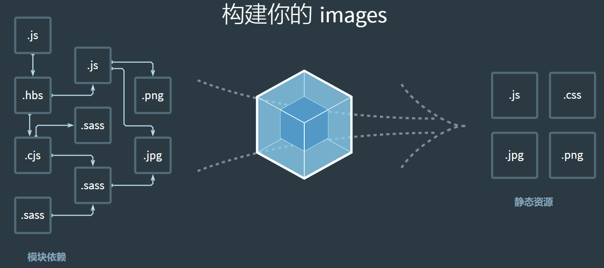

#### `webpack`的能力：

**编译代码能力**，提高效率，解决浏览器兼容问题
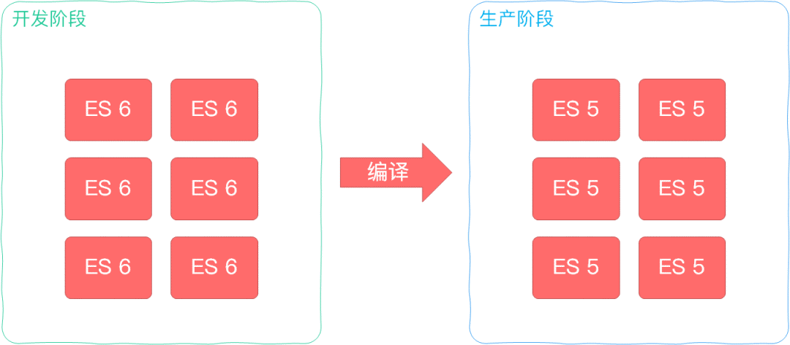
**模块整合能力**，提高性能，可维护性，解决浏览器频繁请求文件的问题
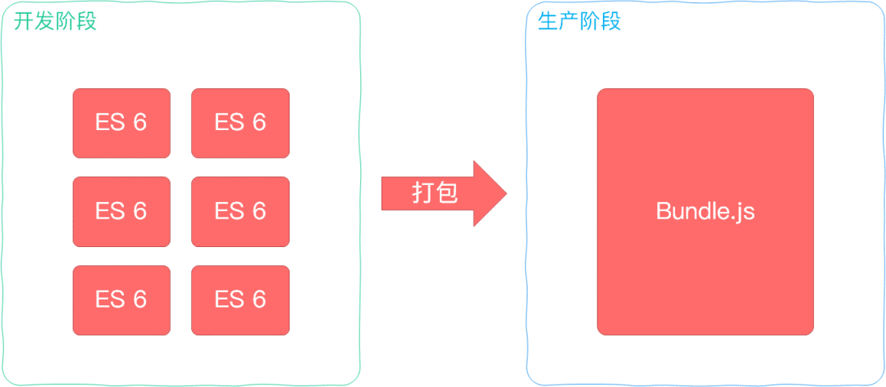
**万物皆可模块能力**，项目维护性增强，支持不同种类的前端模块类型，统一的模块化方案，所有资源文件的加载都可以通过代码控制
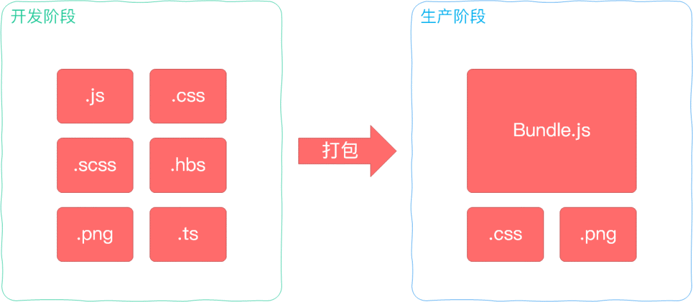


---
### 1596. 说说webpack中常见的Plugin？解决了什么问题？

**难度**：★★☆☆☆ | **题型**：QA | **分类**：全部 / 工程化

**题目**：


**参考答案**：
## 一、是什么

`Plugin`（Plug-in）是一种计算机应用程序，它和主应用程序互相交互，以提供特定的功能

是一种遵循一定规范的应用程序接口编写出来的程序，只能运行在程序规定的系统下，因为其需要调用原纯净系统提供的函数库或者数据

`webpack`中的`plugin`也是如此，`plugin`赋予其各种灵活的功能，例如打包优化、资源管理、环境变量注入等，它们会运行在 `webpack` 的不同阶段（钩子 / 生命周期），贯穿了`webpack`整个编译周期

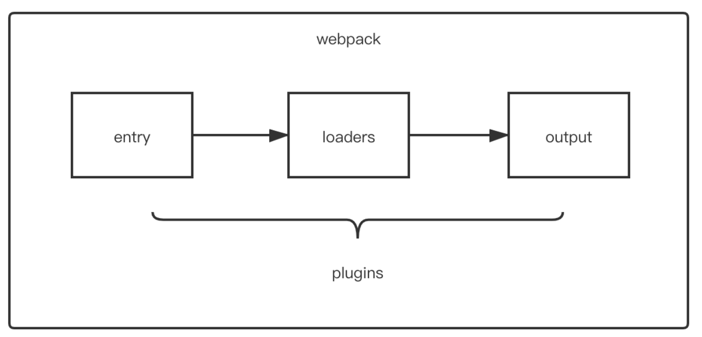

目的在于解决`loader` 无法实现的其他事

### 配置方式

这里讲述文件的配置方式，一般情况，通过配置文件导出对象中`plugins`属性传入`new`实例对象。如下所示：

```js
const HtmlWebpackPlugin = require('html-webpack-plugin'); // 通过 npm 安装
const webpack = require('webpack'); // 访问内置的插件
module.exports = {
  ...
  plugins: [
    new webpack.ProgressPlugin(),
    new HtmlWebpackPlugin({ template: './src/index.html' }),
  ],
};
```


## 二、特性

其本质是一个具有`apply`方法`javascript`对象

`apply` 方法会被 `webpack compiler `调用，并且在整个编译生命周期都可以访问 `compiler `对象

```javascript
const pluginName = 'ConsoleLogOnBuildWebpackPlugin';

class ConsoleLogOnBuildWebpackPlugin {
  apply(compiler) {
    compiler.hooks.run.tap(pluginName, (compilation) => {
      console.log('webpack 构建过程开始！');
    });
  }
}

module.exports = ConsoleLogOnBuildWebpackPlugin;
```

`compiler hook` 的 `tap `方法的第一个参数，应是驼峰式命名的插件名称

关于整个编译生命周期钩子，有如下：

- entry-option ：初始化 option
- run
- compile： 真正开始的编译，在创建 compilation 对象之前
- compilation ：生成好了 compilation 对象
- make 从 entry 开始递归分析依赖，准备对每个模块进行 build
- after-compile： 编译 build 过程结束
- emit ：在将内存中 assets 内容写到磁盘文件夹之前
- after-emit ：在将内存中 assets 内容写到磁盘文件夹之后
- done： 完成所有的编译过程
- failed： 编译失败的时候


## 三、常见的Plugin

常见的`plugin`有如图所示：

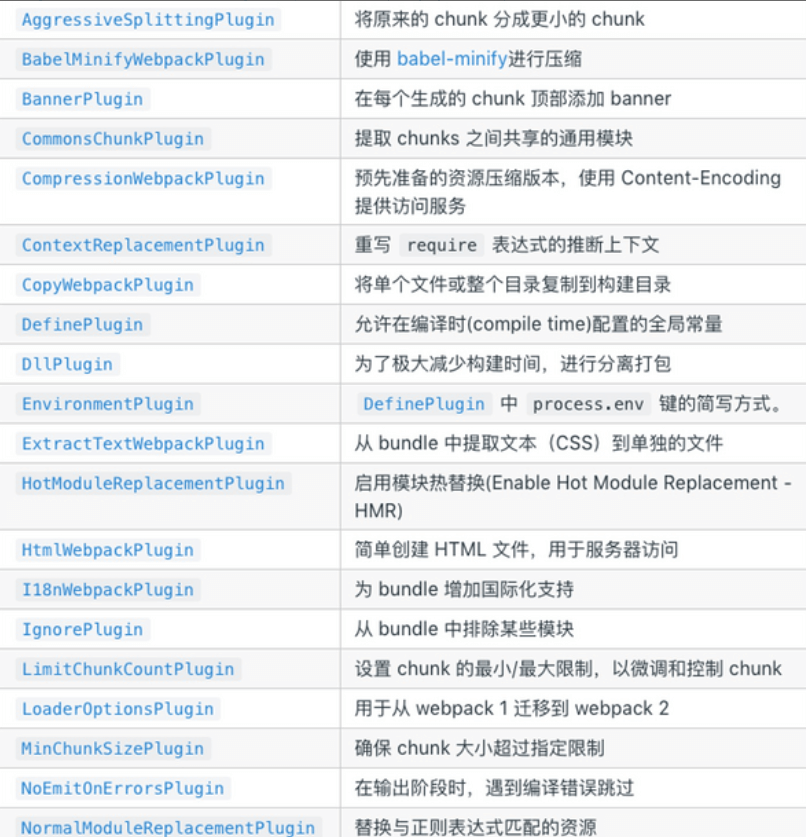


下面介绍几个常用的插件用法：

### HtmlWebpackPlugin

在打包结束后，⾃动生成⼀个 `html` ⽂文件，并把打包生成的` js` 模块引⼊到该 `html` 中

```bash
npm install --save-dev html-webpack-plugin
```

```js
// webpack.config.js
const HtmlWebpackPlugin = require("html-webpack-plugin");
module.exports = {
 ...
  plugins: [
     new HtmlWebpackPlugin({
       title: "My App",
       filename: "app.html",
       template: "./src/html/index.html"
     }) 
  ]
};
```

```html
<!--./src/html/index.html-->
<!DOCTYPE html>
<html lang="en">
<head>
    <meta charset="UTF-8">
    <meta name="viewport" content="width=device-width, initial-scale=1.0">
    <meta http-equiv="X-UA-Compatible" content="ie=edge">
    <title><%=htmlWebpackPlugin.options.title%></title>
</head>
<body>
    <h1>html-webpack-plugin</h1>
</body>
</html>
```

在 `html` 模板中，可以通过 `<%=htmlWebpackPlugin.options.XXX%>` 的方式获取配置的值

更多的配置可以自寻查找


### clean-webpack-plugin

删除（清理）构建目录

```bash
npm install --save-dev clean-webpack-plugin
```

```js
const {CleanWebpackPlugin} = require('clean-webpack-plugin');
module.exports = {
 ...
  plugins: [
    ...,
    new CleanWebpackPlugin(),
    ...
  ]
}
```


### mini-css-extract-plugin

提取 `CSS` 到一个单独的文件中

```bash
npm install --save-dev mini-css-extract-plugin
```

```js
const MiniCssExtractPlugin = require('mini-css-extract-plugin');module.exports = { ...,  module: {   rules: [    {     test: /\.s[ac]ss$/,     use: [      {       loader: MiniCssExtractPlugin.loader     },          'css-loader',          'sass-loader'        ]   }   ] },  plugins: [    ...,    new MiniCssExtractPlugin({     filename: '[name].css'    }),    ...  ]}
```


### DefinePlugin

允许在编译时创建配置的全局对象，是一个`webpack`内置的插件，不需要安装

```js
const { DefinePlugun } = require('webpack')module.exports = { ...    plugins:[        new DefinePlugin({            BASE_URL:'"./"'        })    ]}
```

这时候编译`template`模块的时候，就能通过下述形式获取全局对象

```html
<link rel="icon" href="<%= BASE_URL%>favicon.ico>"
```


### copy-webpack-plugin

复制文件或目录到执行区域，如`vue`的打包过程中，如果我们将一些文件放到`public`的目录下，那么这个目录会被复制到`dist`文件夹中

```cmd
npm install copy-webpack-plugin -D
```

```js
new CopyWebpackPlugin({    parrerns:[        {            from:"public",            globOptions:{                ignore:[                    '**/index.html'                ]            }        }    ]})
```

复制的规则在`patterns`属性中设置：

- from：设置从哪一个源中开始复制
- to：复制到的位置，可以省略，会默认复制到打包的目录下

- globOptions：设置一些额外的选项，其中可以编写需要忽略的文件


---
### 1661. webpack 是如何给 web 应用注入环境变量的，说说它的原理

**难度**：★★★☆☆ | **题型**：QA | **分类**：全部 / 工程化

**题目**：


**参考答案**：
Webpack 注入环境变量的原理主要通过插件和内置的定义机制来实现。具体步骤如下：

### **1. 使用 `DefinePlugin` 插件**

Webpack 的 `DefinePlugin` 插件可以用来创建全局常量，这些常量会在编译时替换代码中的变量。这是注入环境变量的常见方式。

#### **配置步骤**

1. **安装 Webpack**：
   ```bash
   npm install webpack --save-dev
   ```

2. **配置 `DefinePlugin`**：
   在 Webpack 配置文件 (`webpack.config.js`) 中使用 `DefinePlugin` 插件来定义环境变量。

   ```javascript
   const webpack = require('webpack');
   
   module.exports = {
     // 其他配置
     plugins: [
       new webpack.DefinePlugin({
         'process.env.NODE_ENV': JSON.stringify(process.env.NODE_ENV),
         'process.env.API_URL': JSON.stringify(process.env.API_URL),
       })
     ]
   };
   ```

   - `process.env.NODE_ENV` 和 `process.env.API_URL` 在代码中将被替换为对应的环境变量值。

3. **在代码中使用**：
   ```javascript
   console.log('API URL:', process.env.API_URL);
   ```

   在构建时，`process.env.API_URL` 会被替换为配置中的实际值。

### **2. 环境变量的定义**

环境变量通常通过操作系统、CI/CD 环境、或 `.env` 文件进行定义。在开发过程中，可以通过 `cross-env` 等工具来设置环境变量：

#### **设置环境变量**

1. **安装 `cross-env`**：
   ```bash
   npm install cross-env --save-dev
   ```

2. **在 `package.json` 的 `scripts` 部分配置**：
   ```json
   "scripts": {
     "start": "cross-env NODE_ENV=development webpack serve",
     "build": "cross-env NODE_ENV=production webpack"
   }
   ```

   - `cross-env` 用于在不同操作系统上统一设置环境变量。

### **3. 使用 `dotenv` 插件（可选）**

为了更方便地管理环境变量，特别是在开发环境中，可以使用 `dotenv` 插件将 `.env` 文件中的变量加载到 `process.env` 中。

#### **配置步骤**

1. **安装 `dotenv`**：
   ```bash
   npm install dotenv --save
   ```

2. **在 Webpack 配置中加载环境变量**：
   ```javascript
   const path = require('path');
   const webpack = require('webpack');
   require('dotenv').config();
   
   module.exports = {
     // 其他配置
     plugins: [
       new webpack.DefinePlugin({
         'process.env.NODE_ENV': JSON.stringify(process.env.NODE_ENV),
         'process.env.API_URL': JSON.stringify(process.env.API_URL),
       })
     ]
   };
   ```

3. **创建 `.env` 文件**：
   ```plaintext
   NODE_ENV=development
   API_URL=https://api.example.com
   ```

**要点**：
Webpack 通过 `DefinePlugin` 插件注入环境变量，这些变量在编译时会被替换成对应的值。你可以使用操作系统环境变量、`cross-env` 工具、或者 `dotenv` 插件来设置和管理这些环境变量。这样可以在不同环境下（开发、测试、生产）注入不同的配置，实现环境依赖的代码优化和安全管理。

---
### 1684. Webpack 有哪些常见配置？

**难度**：★★☆☆☆ | **题型**：QA | **分类**：全部 / 工程化

**题目**：


**参考答案**：
Webpack 的配置文件（通常为 `webpack.config.js`）中包含多种常见配置项，以下是一些主要的配置选项：

### **1. Entry**

- **入口**：定义应用的入口点，可以是单个文件或多个文件。
  ```javascript
  entry: './src/index.js',
  ```

### **2. Output**

- **输出**：配置打包后文件的输出位置和文件名。
  ```javascript
  output: {
    filename: 'bundle.js',
    path: path.resolve(__dirname, 'dist'),
  },
  ```

### **3. Loaders**

- **文件处理**：使用 loaders 处理非 JavaScript 文件（如 CSS、图片、字体等）。
  ```javascript
  module: {
    rules: [
      {
        test: /\.css$/,
        use: ['style-loader', 'css-loader'],
      },
      {
        test: /\.(png|jpg|gif)$/,
        use: ['file-loader'],
      },
    ],
  },
  ```

### **4. Plugins**

- **插件**：用于扩展 Webpack 的功能，执行各种任务（如压缩、优化等）。
  ```javascript
  plugins: [
    new HtmlWebpackPlugin({
      template: './src/index.html',
    }),
    new CleanWebpackPlugin(),
  ],
  ```

### **5. Mode**

- **模式**：指定构建模式（`development` 或 `production`），影响默认的优化设置。
  ```javascript
  mode: 'development', // or 'production'
  ```

### **6. DevServer**

- **开发服务器**：配置 Webpack Dev Server，用于本地开发时的实时刷新和热模块替换。
  ```javascript
  devServer: {
    contentBase: './dist',
    hot: true,
  },
  ```

### **7. Resolve**

- **模块解析**：配置模块解析的选项，包括别名和文件扩展名。
  ```javascript
  resolve: {
    extensions: ['.js', '.jsx'],
    alias: {
      '@': path.resolve(__dirname, 'src'),
    },
  },
  ```

### **8. Optimization**

- **优化设置**：配置打包优化选项，如代码分割和压缩。
  ```javascript
  optimization: {
    splitChunks: {
      chunks: 'all',
    },
    minimize: true,
  },
  ```

### **9. Devtool**

- **源映射**：配置调试源映射，帮助开发者调试代码。
  ```javascript
  devtool: 'source-map',
  ```

### **10. Performance**

- **性能提示**：配置性能提示，帮助识别打包后的文件大小。
  ```javascript
  performance: {
    hints: 'warning',
    maxAssetSize: 100000, // 100kb
  },
  ```


---
### 1695. 如何用webpack来优化前端性能

**难度**：★★☆☆☆ | **题型**：QA | **分类**：全部 / 性能优化 / 工程化

**题目**：


**参考答案**：
<p>用webpack优化前端性能是指优化webpack的输出结果，让打包的最终结果在浏览器运行快速高效。<br/> </p><ul><li>压缩代码:删除多余的代码、注释、简化代码的写法等等方式。可以利用webpack的<code>UglifyJsPlugin</code>和<code>ParallelUglifyPlugin</code>来压缩JS文件， 利用<code>cssnano</code>（css-loader?minimize）来压缩css</li><li> </li><li>利用CDN加速: 在构建过程中，将引用的静态资源路径修改为CDN上对应的路径。可以利用webpack对于<code>output</code>参数和各loader的<code>publicPath</code>参数来修改资源路径</li><li>Tree Shaking: 将代码中永远不会走到的片段删除掉。可以通过在启动webpack时追加参数<code>--optimize-minimize</code>来实现</li><li>Code Splitting: 将代码按路由维度或者组件分块(chunk),这样做到按需加载,同时可以充分利用浏览器缓存</li><li>提取公共第三方库:  SplitChunksPlugin插件来进行公共模块抽取,利用浏览器缓存可以长期缓存这些无需频繁变动的公共代码</li></ul><p></p>

**要点**：
<p><strong>答题思路</strong>：阐述使用Webpack优化前端性能的方法，并简要说明每个方法的作用。</p><p></p><p>1. 使用最新版本的Webpack，以利用其性能优化特性。</p><p>2. 减少Loader的使用，尽量减少处理步骤。</p><p>3. 利用Webpack的缓存功能，如使用cache-loader或HardSourceWebpackPlugin。</p><p>4. 使用externals功能，将第三方库排除在bundle之外，减少构建时间。</p><p>5. 分割代码，使用SplitChunksPlugin进行代码分割，减少单文件大小。</p><p>6. 压缩代码，使用TerserPlugin等插件进行压缩。</p><p>7. 利用tree-shaking去除无用代码。</p><p>8. 使用动态导入（如import()）实现懒加载，按需加载资源。</p><p>9. 设置合理的resolve.extensions和resolve.alias，减少解析时间。</p><p>10. 使用Webpack Bundle Analyzer分析打包结果，进一步优化。</p><p></p><p><strong>考察要点</strong>：对Webpack优化策略的掌握程度。</p><p></p><p></p><p></p>

---
### 1696. esbuild 和 rollup 都是 vite 的基础依赖，它们有什么不同呢？

**难度**：★★★☆☆ | **题型**：QA | **分类**：全部 / 工程化

**题目**：


**参考答案**：
`esbuild` 和 `Rollup` 都是 Vite 的基础依赖，但它们在用途、性能和特性上有所不同。

以下是它们的一些区别：

### 1. **编写语言与性能**
   - **esbuild**：用 Go 语言编写，具有极高的编译速度。在多线程环境下，Go 的并行编译处理方式使 `esbuild` 能够迅速解析和打包模块，比大多数 JavaScript 编写的工具快得多。
   - **Rollup**：用 JavaScript 编写，处理模块和代码优化的性能较好，但在编译速度上略逊于 `esbuild`。它更专注于模块化打包和优化。

### 2. **应用场景**
   - **esbuild**：主要用于**开发阶段的预构建与快速转译**。Vite 使用 `esbuild` 对 JavaScript/TypeScript 模块进行快速转换和依赖预构建，以支持热更新（HMR）和快速开发体验。
   - **Rollup**：主要用于**生产构建**，Vite 在生产模式下使用 `Rollup` 进行模块打包、依赖分析和输出优化。`Rollup` 能更好地处理 Tree-shaking 和代码拆分，以生成高效的生产环境代码。

### 3. **插件系统和生态**
   - **esbuild**：插件系统相对简单，功能侧重于基础的编译和转换。`esbuild` 的插件系统不如 `Rollup` 的成熟，适合高性能、轻量级的插件需求。
   - **Rollup**：拥有成熟的插件生态，支持丰富的自定义打包功能。开发者可以利用各种插件（如代码拆分、压缩、Polyfill 插件）优化代码，使 Rollup 非常适合复杂的生产打包需求。

### 4. **模块化支持**
   - **esbuild**：支持 ES Modules 和 CommonJS 转换，但不如 Rollup 完整和灵活。例如，在处理动态导入、按需加载和复杂依赖解析时，`esbuild` 可能会遇到限制。
   - **Rollup**：以模块化为核心，支持更复杂的模块关系解析和优化。特别是在处理混合模块格式的代码库时，`Rollup` 的灵活性更高。

### 5. **Tree-shaking 和优化能力**
   - **esbuild**：支持基础的 Tree-shaking，但不如 Rollup 细致。它的主要关注点是性能而非极致的输出优化，因此在依赖剔除和代码压缩方面较为简单。
   - **Rollup**：内置了强大的 Tree-shaking 功能，可以深入分析代码依赖，剔除未使用的代码。特别适合构建生产环境的代码包，确保打包输出尽可能小。

### 6. **代码拆分和按需加载**
   - **esbuild**：不直接支持复杂的代码拆分和按需加载，适用于简单的模块打包。
   - **Rollup**：可以利用代码拆分和动态导入功能，将代码拆分为多个小包，以便按需加载，提高页面加载性能。

**要点**：
在 Vite 中，`esbuild` 用于开发阶段的快速预构建和转换，为开发者带来流畅的热更新体验；而 `Rollup` 主要用于生产构建，凭借其优秀的插件系统和优化能力，生成优化的生产环境代码包。两者结合，发挥各自优势，共同提供高性能的开发和生产打包支持。

---
### 1712. Webpack中 loader的作用是什么，以及常用loader有哪些

**难度**：★☆☆☆☆ | **题型**：QA | **分类**：全部 / 工程化

**题目**：


**参考答案**：
<p><strong>loader作用</strong>：</p><p style="text-align:start;text-indent:2em;"></p><p style="text-align:start;text-indent:2em;">（1）实现对不同格式文件的处理，比如将Scss转换为CSS，或将 TypeScript转化为Javascript。</p><p style="text-align:start;text-indent:2em;">（2）可以编译文件，从而使其能够添加到依赖关系中。loader是 WebPack最重要的部分之一。通过使用不同的 loader，我们能够调用外部的脚本或者工具，实现对不同格式文件的处理。loader需要在 webpack.config.js里单独用 module进行配置。</p><p></p><p></p><p><strong>常用的 loader如下</strong>：</p><p></p><p>file-loader：把文件输出到一个文件夹中，在代码中通过相对 URL 去引用输出的文件<br/> url-loader：和 file-loader 类似，但是能在文件很小的情况下以 base64 的方式把文件内容注入到代码中去<br/> source-map-loader：加载额外的 Source Map 文件，以方便断点调试<br/> image-loader：加载并且压缩图片文件<br/> babel-loader：把 ES6 转换成 ES5<br/> css-loader：加载 CSS，支持模块化、压缩、文件导入等特性<br/> style-loader：把 CSS 代码注入到 JavaScript 中，通过 DOM 操作去加载 CSS。<br/> eslint-loader：通过 ESLint 检查 JavaScript 代码<br/><br/></p>


---
### 1731. npm script 生命周期有哪些?

**难度**：★★☆☆☆ | **题型**：QA | **分类**：全部 / 工程化

**题目**：


**参考答案**：
在 `npm` 中，`scripts` 部分允许你定义和运行自定义的脚本命令。`npm` 脚本有一个生命周期的概念，其中包括一系列的预定义和自定义的生命周期钩子。生命周期钩子的执行顺序和作用如下：

### **1. 生命周期钩子概述**

在 `npm` 中，生命周期钩子是一些特定的脚本命令，`npm` 会在特定的时间点自动运行这些命令。例如，安装包之前、之后或者在发布时。

### **2. 生命周期钩子的具体阶段**

1. **`prepublish`**
   - **触发时间**：在 `npm publish` 和 `npm install` 时。
   - **作用**：用于在包发布之前进行准备工作（如构建、测试等）。
   - **说明**：`prepublish` 在 `npm install` 和 `npm publish` 之前执行。

2. **`prepare`**
   - **触发时间**：在 `npm install` 和 `npm publish` 时。
   - **作用**：用于构建、准备包的内容等（如运行编译、构建脚本）。这个阶段在 `prepublish` 之后执行。
   - **说明**：`prepare` 主要用于在本地开发和发布之前执行准备工作。

3. **`prepublishOnly`**
   - **触发时间**：在 `npm publish` 时。
   - **作用**：仅在发布包时执行。不会在 `npm install` 时触发。
   - **说明**：这个钩子在 `npm publish` 时执行，但在 `npm install` 时不会触发。

4. **`postpublish`**
   - **触发时间**：在 `npm publish` 后。
   - **作用**：用于在包发布之后进行清理或其他操作（如发送通知）。
   - **说明**：`postpublish` 在包发布之后执行。

5. **`preinstall`**
   - **触发时间**：在包的安装之前。
   - **作用**：用于在包安装之前执行任何必要的操作（如设置环境）。
   - **说明**：`preinstall` 在运行 `npm install` 之前执行。

6. **`install`**
   - **触发时间**：在包的安装过程中。
   - **作用**：用于在包安装过程中执行自定义操作。
   - **说明**：`install` 在 `preinstall` 之后执行。

7. **`postinstall`**
   - **触发时间**：在包安装之后。
   - **作用**：用于在包安装后执行清理、构建或其他操作（如启动本地服务器）。
   - **说明**：`postinstall` 在 `install` 之后执行。

8. **`preuninstall`**
   - **触发时间**：在包卸载之前。
   - **作用**：用于在包卸载之前执行任何必要的操作（如清理）。
   - **说明**：`preuninstall` 在包卸载之前执行。

9. **`uninstall`**
   - **触发时间**：在包卸载过程中。
   - **作用**：用于在包卸载过程中执行自定义操作。
   - **说明**：`uninstall` 在 `preuninstall` 之后执行。

10. **`postuninstall`**
    - **触发时间**：在包卸载之后。
    - **作用**：用于在包卸载之后执行清理或其他操作。
    - **说明**：`postuninstall` 在包卸载之后执行。

### **3. 脚本执行顺序**

当执行 `npm install` 或 `npm publish` 时，`npm` 会按照以下顺序运行这些脚本：

1. `preinstall`
2. `install`
3. `postinstall`
4. `prepublish` （在 `npm publish` 时）
5. `prepare`
6. `publish` （在 `npm publish` 时）
7. `postpublish`

当卸载包时，执行顺序为：

1. `preuninstall`
2. `uninstall`
3. `postuninstall`

### **4. 使用脚本**

在 `package.json` 中定义的自定义脚本与生命周期钩子无关，但可以与这些钩子一起使用。例如：

```json
{
  "scripts": {
    "build": "webpack",
    "test": "jest",
    "prepublishOnly": "npm run build",
    "postinstall": "npm run test"
  }
}
```

在这个例子中：
- `prepublishOnly` 钩子在发布前运行 `npm run build`。
- `postinstall` 钩子在安装后运行 `npm run test`。

通过合理利用生命周期钩子，可以在不同阶段自动执行必要的操作，确保项目的一致性和可靠性。


---
### 1753. webpack treeShaking机制的原理是什么？

**难度**：★★★☆☆ | **题型**：QA | **分类**：全部 / 工程化

**题目**：


**参考答案**：
> Tree shaking 是一种通过清除多余代码方式来优化项目打包体积的技术，专业术语叫 Dead code elimination

## tree shaking如何工作的呢?

虽然 tree shaking 的概念在 1990 就提出了，但直到 ES6 的 ES6-style 模块出现后才真正被利用起来。

在ES6以前，我们可以使用CommonJS引入模块：require()，这种引入是动态的，也意味着我们可以基于条件来导入需要的代码：

```js
let dynamicModule;
// 动态导入
if (condition) {
  myDynamicModule = require("foo");
} else {
  myDynamicModule = require("bar");
}
```

但是CommonJS规范无法确定在实际运行前需要或者不需要某些模块，所以CommonJS不适合tree-shaking机制。在 ES6 中，引入了完全静态的导入语法：import。这也意味着下面的导入是不可行的：

```js
// 不可行，ES6 的import是完全静态的
if (condition) {
  myDynamicModule = require("foo");
} else {
  myDynamicModule = require("bar");
}
```

我们只能通过导入所有的包后再进行条件获取。如下：

```js
import foo from "foo";
import bar from "bar";

if (condition) {
  // foo.xxxx
} else {
  // bar.xxx
}
```

ES6的import语法可以完美使用tree shaking，因为可以在代码不运行的情况下就能分析出不需要的代码。

看完上面的分析，你可能还是有点懵，这里我简单做下总结：因为tree shaking只能在静态modules下工作。ECMAScript 6 模块加载是静态的,因此整个依赖树可以被静态地推导出解析语法树。所以在 ES6 中使用 tree shaking 是非常容易的。

## tree shaking的原理是什么?

看完上面的分析，相信这里你可以很容易的得出题目的答案了：

* ES6 Module引入进行静态分析，故而编译的时候正确判断到底加载了那些模块
* 静态分析程序流，判断那些模块和变量未被使用或者引用，进而删除对应代码

## common.js 和 es6 中模块引入的区别？

从这道题目我们可以很容易的引申出来另外一道“明星”面试题：common.js 和 es6 中模块引入的区别？

CommonJS 是一种模块规范，最初被应用于 Nodejs，成为 Nodejs 的模块规范。运行在浏览器端的 JavaScript 由于也缺少类似的规范，在 ES6 出来之前，前端也实现了一套相同的模块规范 (例如: AMD)，用来对前端模块进行管理。自 ES6 起，引入了一套新的 ES6 Module 规范，在语言标准的层面上实现了模块功能，而且实现得相当简单，有望成为浏览器和服务器通用的模块解决方案。但目前浏览器对 ES6 Module 兼容还不太好，我们平时在 Webpack 中使用的 export 和 import，会经过 Babel 转换为 CommonJS 规范。在使用上的差别主要有：

1、CommonJS 模块输出的是一个值的拷贝，ES6 模块输出的是值的引用。

2、CommonJS 模块是运行时加载，ES6 模块是编译时输出接口。

3、CommonJs 是单个值导出，ES6 Module可以导出多个

4、CommonJs 是动态语法可以写在判断里，ES6 Module 静态语法只能写在顶层

5、CommonJs 的 this 是当前模块，ES6 Module的 this 是 undefined


**要点**：
- **Tree Shaking** 是一种优化技术，通过静态分析 ES6 模块来识别和去除未使用的代码。
- **Webpack** 通过分析模块的依赖关系和导入/导出语句，标记未使用的代码，并在构建过程中移除这些死代码。
- **前提条件**：需要使用 ES6 模块，并确保在生产模式下构建。

Tree Shaking 是现代 JavaScript 构建工具的重要特性，能够显著减少最终代码包的体积，提升应用性能。


---
### 1770. 说说你对 Source Map  的了解

**难度**：★★★☆☆ | **题型**：QA | **分类**：全部 / 工程化

**题目**：


**参考答案**：
Source Maps 是一种帮助开发者在调试时映射压缩或转译后的代码到源代码的工具。它们对于在开发过程中调试复杂的前端应用程序非常重要，尤其是当代码经过了编译、转译或压缩处理后。

以下是对 Source Maps 的详细介绍：

### **1. Source Maps 的作用**

- **调试**：帮助开发者在调试时看到原始的源代码，而不是经过转译或压缩后的代码。这使得调试更加直观和高效。
- **错误跟踪**：提供了更精确的错误堆栈跟踪信息，使得调试工具能够显示原始代码中的错误位置，而不是转译后的代码行。
- **代码可读性**：在生产环境中，通常会使用压缩代码来减少文件大小，但在调试时，通过 Source Maps 可以查看和调试原始代码。

### **2. Source Map 的基本概念**

Source Map 是一个 JSON 文件，包含了源代码和转译或压缩后的代码之间的映射信息。主要包括以下内容：

- **version**：Source Map 的版本号。
- **file**：生成的文件名（通常是压缩或转译后的文件名）。
- **sources**：源文件的数组（原始的源代码文件）。
- **sourcesContent**：源文件内容的数组（可选，原始源文件的内容）。
- **names**：源代码中变量、函数等标识符的数组（可选）。
- **mappings**：一种编码格式的映射字符串，用于表示源文件和生成文件之间的关系。

### **3. Source Map 的生成**

现代前端工具（如 Webpack、Babel、TypeScript）通常会自动生成 Source Maps 文件。生成 Source Maps 的配置示例如下：

- **Webpack**：

  ```javascript
  module.exports = {
    // ...
    devtool: 'source-map', // 生成独立的 .map 文件
  };
  ```

- **Babel**：

  ```javascript
  {
    "presets": ["@babel/preset-env"],
    "sourceMaps": "both" // 生成内联或外部 Source Maps
  }
  ```

### **4. Source Map 的类型**

- **内联 Source Maps**：将 Source Map 数据直接嵌入到生成的文件中，通常使用 `data:` URI。
  
  ```javascript
  //# sourceMappingURL=data:application/json;base64,eyJ2...
  ```

- **外部 Source Maps**：将 Source Map 数据存储在单独的 `.map` 文件中，生成文件末尾添加 `sourceMappingURL` 注释来引用外部 Source Map 文件。
  
  ```javascript
  //# sourceMappingURL=app.js.map
  ```

### **5. Source Map 的使用**

浏览器开发者工具（如 Chrome DevTools）能够自动识别 Source Map 文件，并在调试时显示原始源代码。开发者可以：

- **设置断点**：在原始源代码中设置断点，而不是在转译后的代码中。
- **查看错误**：查看原始源代码中的错误和堆栈跟踪信息。
- **代码导航**：在原始源代码中导航和编辑代码。

### **6. Source Map 的安全性**

在生产环境中，需要谨慎处理 Source Map 文件：

- **防止泄露敏感信息**：Source Map 文件可能包含源代码和调试信息，因此不要将其暴露给未授权的用户。
- **控制访问**：确保 Source Map 文件的访问控制，防止泄露内部代码或敏感信息。

### **7. Source Map 的工具**

- **Source Map Visualizer**：用于可视化和分析 Source Map 文件的工具。
- **Source Map Explorer**：帮助开发者分析打包文件大小和 Source Map 的工具。

**要点**：
通过 Source Maps，开发者能够更容易地调试和维护前端应用程序，尤其是在经过复杂的构建流程后。正确使用 Source Maps 可以大大提升调试效率和代码质量。

---
### 1836. 为什么 webpack 可以通过文件打包，让浏览器可以支持 CommonJS 规范？

**难度**：★★★★☆ | **题型**：QA | **分类**：全部 / 工程化

**题目**：


**参考答案**：
尽管浏览器本身不直接支持 CommonJS 模块规范，Webpack 通过以下步骤将模块化的代码打包成浏览器可以读取的格式：

### 1. **解析依赖**

Webpack 会解析项目中所有的模块及其依赖关系。它会从入口文件开始，递归地分析所有导入的模块（`import` 或 `require`），构建出一个完整的依赖图（dependency graph）。

### 2. **转换模块**

Webpack 使用加载器（loaders）将不同类型的文件（如 JavaScript、CSS、图片等）转换成浏览器可以理解的格式。例如，使用 Babel 将 ES6+ 代码转换为兼容的 ES5 代码，或者将 SCSS 转换为 CSS。

### 3. **打包模块**

Webpack 将所有模块和它们的依赖关系打包成一个或多个文件。为了实现这一点，它会将所有模块的代码合并到一个输出文件中，通常是一个或多个 JavaScript 文件。

### 4. **封装模块**

为了使浏览器能够理解这些模块，Webpack 会将模块封装在一个自执行的函数中，并将模块代码转换成一个浏览器可以执行的格式。这包括：

- **定义模块**：将每个模块的代码包裹在一个匿名函数中，并将模块暴露为一个对象或函数。
- **管理模块加载**：使用一个模块加载器（如 Webpack 自带的 `__webpack_require__` 函数）来处理模块之间的依赖关系和加载。

### 5. **生成输出**

Webpack 将打包好的代码输出为一个或多个 JavaScript 文件。这些文件包含了所有的模块和依赖关系，以确保浏览器可以加载并执行模块化的代码。

### **示例**

假设有两个模块：`math.js` 和 `app.js`。

**math.js**:
```javascript
export function add(a, b) {
  return a + b;
}
```

**app.js**:
```javascript
import { add } from './math';
console.log(add(1, 2));
```

Webpack 会将这些模块打包成一个文件，类似于：

```javascript
(function(modules) {
  // Webpack 自定义的 require 函数
  function __webpack_require__(moduleId) {
    var module = { exports: {} };
    modules[moduleId](module, module.exports, __webpack_require__);
    return module.exports;
  }

  // 入口点
  __webpack_require__(0);
})({
  // 模块定义
  0: function(module, exports, __webpack_require__) {
    var add = __webpack_require__(1).add;
    console.log(add(1, 2));
  },
  1: function(module, exports) {
    function add(a, b) {
      return a + b;
    }
    exports.add = add;
  }
});
```

**要点**：
- **解析依赖**：构建依赖图。
- **转换模块**：使用加载器转换文件。
- **打包模块**：将模块合并成输出文件。
- **封装模块**：将模块代码封装为浏览器可以执行的格式。
- **生成输出**：输出打包好的 JavaScript 文件。

---