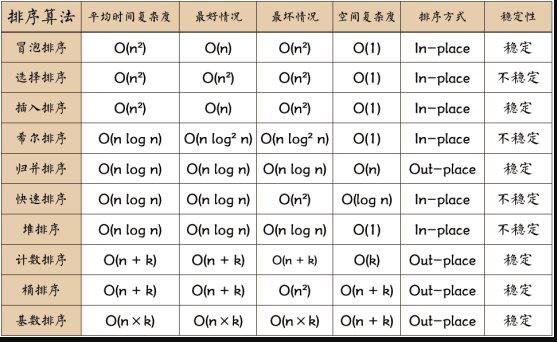
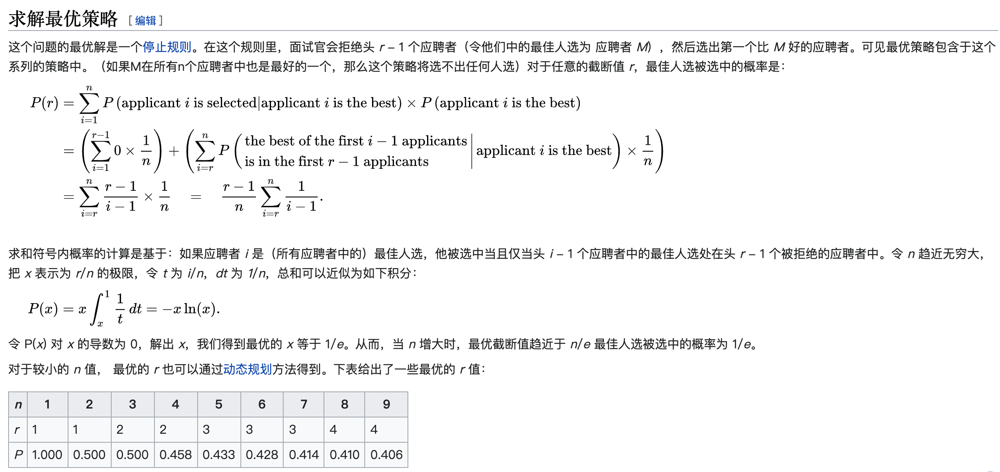

# 算法 分类题集

> 共 22 题，摘自前端面试题宝典 https://fe.ecool.fun/topic-list

### 24. 请手写“堆排序”

**难度**：★★★★☆ | **题型**：QA | **分类**：全部 / 算法 / 编程题

**题目**：


**参考答案**：
## 算法简介

堆排序（Heapsort）是指利用堆这种数据结构所设计的一种排序算法。堆积是一个近似完全二叉树的结构，并同时满足堆积的性质：即子结点的键值或索引总是小于（或者大于）它的父节点。

## 算法描述

具体算法描述如下：

* 将初始待排序关键字序列(R1,R2….Rn)构建成大顶堆，此堆为初始的无序区；
* 将堆顶元素R[1]与最后一个元素R[n]交换，此时得到新的无序区(R1,R2,……Rn-1)和新的有序区(Rn),且满足R[1,2…n-1]<=R[n]；
* 由于交换后新的堆顶R[1]可能违反堆的性质，因此需要对当前无序区(R1,R2,……Rn-1)调整为新堆，然后再次将R[1]与无序区最后一个元素交换，得到新的无序区(R1,R2….Rn-2)和新的有序区(Rn-1,Rn)。不断重复此过程直到有序区的元素个数为n-1，则整个排序过程完成。

## 代码实现

```javascript
/*方法说明：堆排序
@param  array 待排序数组*/
function heapSort(array) {
    console.time('堆排序耗时');
    if (Object.prototype.toString.call(array).slice(8, -1) === 'Array') {
        //建堆
        var heapSize = array.length, temp;
        for (var i = Math.floor(heapSize / 2) - 1; i >= 0; i--) {
            heapify(array, i, heapSize);
        }

        //堆排序
        for (var j = heapSize - 1; j >= 1; j--) {
            temp = array[0];
            array[0] = array[j];
            array[j] = temp;
            heapify(array, 0, --heapSize);
        }
        console.timeEnd('堆排序耗时');
        return array;
    } else {
        return 'array is not an Array!';
    }
}
/*方法说明：维护堆的性质
@param  arr 数组
@param  x   数组下标
@param  len 堆大小*/
function heapify(arr, x, len) {
    if (Object.prototype.toString.call(arr).slice(8, -1) === 'Array' && typeof x === 'number') {
        var l = 2 * x + 1, r = 2 * x + 2, largest = x, temp;
        if (l < len && arr[l] > arr[largest]) {
            largest = l;
        }
        if (r < len && arr[r] > arr[largest]) {
            largest = r;
        }
        if (largest != x) {
            temp = arr[x];
            arr[x] = arr[largest];
            arr[largest] = temp;
            heapify(arr, largest, len);
        }
    } else {
        return 'arr is not an Array or x is not a number!';
    }
}
var arr=[91,60,96,13,35,65,46,65,10,30,20,31,77,81,22];
console.log(heapSort(arr));//[10, 13, 20, 22, 30, 31, 35, 46, 60, 65, 65, 77, 81, 91, 96]

```

## 算法分析

* 最佳情况：T(n) = O(nlogn)
* 最差情况：T(n) = O(nlogn)
* 平均情况：T(n) = O(nlogn)


---
### 32. base64 的编码原理是什么？

**难度**：★★☆☆☆ | **题型**：QA | **分类**：全部 / 算法

**题目**：


**参考答案**：
Base64 是一种编码方法，用于将二进制数据（如图像、音频、文件等）编码为 ASCII 字符串。这种编码方式将数据转换为一组可打印字符，通常用于在需要文本数据的环境中传输二进制数据，例如在电子邮件、JSON 数据、XML 数据等场景中。Base64 编码原理如下：

### **1. 编码过程**

#### **1.1 数据分组**

- Base64 编码将输入数据按每 3 个字节（24 位）一组进行分组。
- 每个 3 字节的数据块由 24 位二进制数据组成，相当于 3 * 8 = 24 位。

#### **1.2 分割与映射**

- 将这 24 位的二进制数据分成 4 组，每组 6 位。即：24 位 / 6 位 = 4 组。
- 每组 6 位的二进制数据被映射到一个 Base64 字符集中的字符。Base64 字符集共有 64 个字符，这些字符包括：
  - 大写字母：A-Z
  - 小写字母：a-z
  - 数字：0-9
  - 特殊字符：`+` 和 `/`

  例如，字符集的第一个字符是 'A'，它代表 6 位二进制数 `000000`，字符集的最后一个字符是 '/'，它代表 6 位二进制数 `111111`。

#### **1.3 填充**

- 如果输入数据的字节数不是 3 的倍数，Base64 编码会在编码的结果末尾添加 `=` 作为填充符号，以保证编码后的字符数是 4 的倍数。
- `=` 表示填充的字节数：
  - 一个 `=` 表示编码过程中缺少 1 个字节。
  - 两个 `=` 表示编码过程中缺少 2 个字节。

### **2. 解码过程**

解码过程是编码过程的反向操作：

#### **2.1 反向映射**

- 将 Base64 字符串中的每个字符映射回 6 位的二进制数据。
- 使用 Base64 字符集的索引将字符转换为 6 位的二进制数。

#### **2.2 合并与分组**

- 将所有 6 位的二进制数据重新组合为 24 位的二进制数据块。
- 将 24 位数据块拆分为 3 个字节（24 位 / 8 位 = 3 字节）。

#### **2.3 去除填充**

- 移除解码过程中添加的填充符号 `=`，恢复原始数据的字节。

### **示例**

#### **编码示例**

将字符串 "hello" 编码为 Base64：

1. **转换为二进制**：
   - `h` = `01101000`
   - `e` = `01100101`
   - `l` = `01101100`
   - `l` = `01101100`
   - `o` = `01101111`

   合并为：`01101000 01100101 01101100 01101100 01101111`

2. **分组**：
   - 24 位块 1：`01101000 01100101 01101100`（`011010`、`000110`、`010101`、`101100`）
   - 24 位块 2：`01101100 01101111`（`011011`、`000110`、`111100`）

3. **映射到 Base64 字符集**：
   - `011010` -> `a`
   - `000110` -> `G`
   - `010101` -> `V`
   - `101100` -> `s`
   - `011011` -> `b`
   - `000110` -> `G`
   - `111100` -> `8`

   Base64 编码结果为 `aGVsbG8=`

#### **解码示例**

将 Base64 字符串 `aGVsbG8=` 解码：

1. **映射回二进制**：
   - `a` -> `011010`
   - `G` -> `000110`
   - `V` -> `010101`
   - `s` -> `101100`
   - `b` -> `011011`
   - `G` -> `000110`
   - `8` -> `111100`

2. **合并和恢复**：
   - 合并为：`01101000 01100101 01101100 01101100 01101111`

3. **转换为原始字符串**：
   - `01101000` -> `h`
   - `01100101` -> `e`
   - `01101100` -> `l`
   - `01101100` -> `l`
   - `01101111` -> `o`

   原始字符串为 "hello"

**要点**：
Base64 编码通过将数据块分组、映射到字符集、处理填充等步骤，将二进制数据转换为可打印的 ASCII 字符串。解码过程则将 Base64 字符串转换回原始二进制数据。此编码方法在需要将二进制数据表示为文本格式时非常有用。

---
### 246. 常见数组排序算法有哪些？

**难度**：★☆☆☆☆ | **题型**：QA | **分类**：全部 / 算法

**题目**：


**参考答案**：
如图所示：


## 快速排序：
先从数列中取出一个数作为“基准”。

分区过程：将比这个“基准”大的数全放到“基准”的右边，小于或等于“基准”的数全放到“基准”的左边。
再对左右区间重复第二步，直到各区间只有一个数。
```javascript
var quickSort = function(arr) {
    if (arr.length <= 1) { return arr; }
    var pivotIndex = Math.floor(arr.length / 2);   //基准位置（理论上可任意选取）
    var pivot = arr.splice(pivotIndex, 1)[0];  //基准数
    var left = [];
    var right = [];
    for (var i = 0; i < arr.length; i++){
        if (arr[i] < pivot) {
            left.push(arr[i]);
        } else {
            right.push(arr[i]);
        }
    }
    return quickSort(left).concat([pivot], quickSort(right));  //链接左数组、基准数构成的数组、右数组
};
```


## 选择排序：
首先在未排序序列中找到最小（大）元素，存放到排序序列的起始位置                     
再从剩余未排序元素中继续寻找最小（大）元素，然后放到已排序序列的末尾。                     
重复第二步，直到所有元素均排序完毕。
```javascript
function selectionSort(arr) {
    var len = arr.length;
    var minIndex, temp;
    for (var i = 0; i < len - 1; i++) {
        minIndex = i;
        for (var j = i + 1; j < len; j++) {
            if (arr[j] < arr[minIndex]) {     // 寻找最小的数
                minIndex = j;                 // 将最小数的索引保存
            }
        }
        temp = arr[i];
        arr[i] = arr[minIndex];
        arr[minIndex] = temp;
    }
    return arr;
}
```

## 插入排序：
将第一待排序序列第一个元素看做一个有序序列，把第二个元素到最后一个元素当成是未排序序列。                    
从头到尾依次扫描未排序序列，将扫描到的每个元素插入有序序列的适当位置。（如果待插入的元素与有序序列中的某个元素相等，则将待插入元素插入到相等元素的后面。）
```javascript
function insertionSort(arr) {
    var len = arr.length;
    var preIndex, current;
    for (var i = 1; i < len; i++) {
        preIndex = i - 1;
        current = arr[i];
        while(preIndex >= 0 && arr[preIndex] > current) {
            arr[preIndex+1] = arr[preIndex];
            preIndex--;
        }
        arr[preIndex+1] = current;
    }
    return arr;
}
```

## 冒泡法排序：
比较相邻的元素。如果第一个比第二个大，就交换他们两个。             
对每一对相邻元素作同样的工作，从开始第一对到结尾的最后一对。这步做完后，最后的元素会是最大的数。                            
针对所有的元素重复以上的步骤，除了最后一个。                  
持续每次对越来越少的元素重复上面的步骤，直到没有任何一对数字需要比较。
```javascript
function bubbleSort(arr) {
    var len = arr.length;
    for (var i = 0; i < len - 1; i++) {
        for (var j = 0; j < len - 1 - i; j++) {
            if (arr[j] > arr[j+1]) {        // 相邻元素两两对比
                var temp = arr[j+1];        // 元素交换
                arr[j+1] = arr[j];
                arr[j] = temp;
            }
        }
    }
    return arr;
}
```

## 希尔排序
1959年Shell发明，第一个突破O(n2)的排序算法，是简单插入排序的改进版。
它与插入排序的不同之处在于，它会优先比较距离较远的元素。希尔排序又叫缩小增量排序。

先将整个待排序的记录序列分割成为若干子序列分别进行直接插入排序，具体算法描述：                                 
选择一个增量序列t1，t2，…，tk，其中ti>tj，tk=1；                                    
按增量序列个数k，对序列进行k 趟排序；                                    
每趟排序，根据对应的增量ti，将待排序列分割成若干长度为m 的子序列，分别对各子表进行直接插入排序。
仅增量因子为1 时，整个序列作为一个表来处理，表长度即为整个序列的长度。
```javascript
function shellSort(arr) {
    var len = arr.length,
        temp,
        gap = 1;
    while (gap < len / 3) {          // 动态定义间隔序列
        gap = gap * 3 + 1;
    }
    for (gap; gap > 0; gap = Math.floor(gap / 3)) {
        for (var i = gap; i < len; i++) {
            temp = arr[i];
            for (var j = i-gap; j > 0 && arr[j]> temp; j-=gap) {
                arr[j + gap] = arr[j];
            }
            arr[j + gap] = temp;
        }
    }
    return arr;
}
```

## 归并排序
直接上代码了
```js
function mergeSort(arr){
    var len = arr.length;
    if(len <2)
        return arr;
    var mid = Math.floor(len/2),
        left = arr.slice(0,mid),
        right =arr.slice(mid);
    //send left and right to the mergeSort to broke it down into pieces
    //then merge those
    return merge(mergeSort(left),mergeSort(right));
}

function merge(left, right){
    var result = [],
        lLen = left.length,
        rLen = right.length,
        l = 0,
        r = 0;
    while(l < lLen && r < rLen){
        if(left[l] < right[r]){
            result.push(left[l++]);
        }
        else{
            result.push(right[r++]);
        }
    }
    //remaining part needs to be addred to the result
    return result.concat(left.slice(l)).concat(right.slice(r));
}
```


**要点**：
### **1. 冒泡排序 (Bubble Sort)**

- **原理**：通过重复遍历数组，每次比较相邻的元素，并交换它们的位置。每次遍历都会将最大的元素移动到数组的末尾。
- **时间复杂度**：最坏情况和平均情况均为 O(n^2)，最佳情况为 O(n)（当数组已经有序时）。
- **优点**：实现简单，适合教学和理解排序概念。
- **缺点**：效率低，不适合处理大数据量的排序。

### **2. 选择排序 (Selection Sort)**

- **原理**：每次从未排序的部分中选择最小（或最大）的元素，将其放到已排序部分的末尾。
- **时间复杂度**：最坏情况、最佳情况和平均情况均为 O(n^2)。
- **优点**：实现简单，不需要额外的存储空间。
- **缺点**：效率低，特别是在处理大量数据时。


### **3. 插入排序 (Insertion Sort)**

- **原理**：将数组分为已排序部分和未排序部分，每次从未排序部分中取一个元素，插入到已排序部分的正确位置。
- **时间复杂度**：最坏情况和平均情况均为 O(n^2)，最佳情况为 O(n)（当数组已经有序时）。
- **优点**：简单且对小数据量和几乎已排序的数组非常高效。
- **缺点**：效率低，对大数据量排序时不够高效。


### **4. 快速排序 (Quick Sort)**

- **原理**：选择一个“基准”元素，将数组分为两个部分，小于基准的元素放在基准左边，大于基准的元素放在基准右边，然后递归地对这两个部分进行排序。
- **时间复杂度**：平均情况为 O(n log n)，最坏情况为 O(n^2)（当数组已经有序时，或基准选择不当）。
- **优点**：平均情况下性能优秀，是实用的排序算法之一。
- **缺点**：最坏情况下效率低，对栈空间的要求较高。

### **5. 归并排序 (Merge Sort)**

- **原理**：将数组分成两半，递归地对两半进行排序，然后将两个已排序的半部分合并成一个排序的数组。
- **时间复杂度**：最坏情况、最佳情况和平均情况均为 O(n log n)。
- **优点**：稳定且高效，对大数据量排序特别适合。
- **缺点**：需要额外的存储空间。


### **6. 堆排序 (Heap Sort)**

- **原理**：将数组视为一棵完全二叉树，构建最大堆（或最小堆），将堆顶元素（最大或最小）移到数组末尾，然后重新调整堆，重复这个过程。
- **时间复杂度**：最坏情况、最佳情况和平均情况均为 O(n log n)。
- **优点**：无需额外的存储空间，不依赖于递归。
- **缺点**：实现较复杂。


### **7. 桶排序 (Bucket Sort)**

- **原理**：将数组分到多个桶中，每个桶内排序后，再合并各个桶中的元素。
- **时间复杂度**：最坏情况和平均情况均为 O(n^2)，最佳情况为 O(n)（当桶内排序很快时）。
- **优点**：适用于特定类型的数据（如范围有限的整数）。
- **缺点**：对数据分布有要求，需要额外的空间。

---
### 263. 合并K个升序链表

**难度**：★★★★☆ | **题型**：QA | **分类**：全部 / 算法

**题目**：
给你一个链表数组，每个链表都已经按升序排列。

请你将所有链表合并到一个升序链表中，返回合并后的链表。

示例 1：
```
输入：lists = [[1,4,5],[1,3,4],[2,6]]
输出：[1,1,2,3,4,4,5,6]
解释：链表数组如下：
[
  1->4->5,
  1->3->4,
  2->6
]
将它们合并到一个有序链表中得到。
1->1->2->3->4->4->5->6
```

示例 2：

```
输入：lists = []
输出：[]
```

示例 3：

```
输入：lists = [[]]
输出：[]
```

提示：

* k == lists.length
* 0 <= k <= 10^4
* 0 <= lists[i].length <= 500
* -10^4 <= lists[i][j] <= 10^4
* lists[i] 按 升序 排列
* lists[i].length 的总和不超过 10^4

```javascript
/**
 * Definition for singly-linked list.
 * function ListNode(val, next) {
 *     this.val = (val===undefined ? 0 : val)
 *     this.next = (next===undefined ? null : next)
 * }
 */
/**
 * @param {ListNode[]} lists
 * @return {ListNode}
 */
var mergeKLists = function(lists) {

};
```

**参考答案**：
```javascript
/**
 * Definition for singly-linked list.
 * function ListNode(val) {
 *     this.val = val;
 *     this.next = null;
 * }
 */
/**
 * @param {ListNode[]} lists
 * @return {ListNode}
 */
var mergeKLists = function(lists) {
    if (lists.length === 0) return null;
    return mergeArr(lists);
};
function mergeArr(lists) {
    if (lists.length <= 1) return lists[0];
    let index = Math.floor(lists.length / 2);
    const left = mergeArr(lists.slice(0, index))
    const right = mergeArr(lists.slice(index));
    return merge(left, right);
}
function merge(l1, l2) {
    if (l1 == null && l2 == null) return null;
    if (l1 != null && l2 == null) return l1;
    if (l1 == null && l2 != null) return l2;
    let newHead = null, head = null;
    while (l1 != null && l2 != null) {
        if (l1.val < l2.val) {
            if (!head) {
                newHead = l1;
                head = l1;
            } else {
                newHead.next = l1;
                newHead = newHead.next;
            }
            l1 = l1.next;
        } else {
            if (!head) {
                newHead = l2;
                head = l2;
            } else {
                newHead.next = l2;
                newHead = newHead.next;
            }
            l2 = l2.next;
        }
    }
    newHead.next = l1 ? l1 : l2;
    return head;
}
```


---
### 335. 不重复最大子串

**难度**：★★☆☆☆ | **题型**：QA | **分类**：全部 / 算法

**题目**：
给定一个字符串，请实现一个函数来找到其中的不重复最大子串。例如，对于字符串"abcabcbb"，不重复最大子串是"abc"，长度为3。

* 请写出实现该功能的代码，并说明其时间复杂度。
* 考虑到性能优化，你认为还有哪些改进空间？请提出优化思路并实现优化后的代码。

**参考答案**：
## 一、滑动窗口实现

```js
function lengthOfLongestSubstring(s) {
  let set = new Set();
  let left = 0, maxLen = 0;
  
  for (let right = 0; right < s.length; right++) {
    while (set.has(s[right])) {
      set.delete(s[left]);
      left++;
    }
    set.add(s[right]);
    maxLen = Math.max(maxLen, right - left + 1);
  }
  
  return maxLen;
}

// 测试
console.log(lengthOfLongestSubstring("abcabcbb")); // 输出 3
```

### 思路

* 使用 **滑动窗口** `[left, right]` 遍历字符串。
* 用 `Set` 存储当前窗口内字符。
* 当遇到重复字符时，移动左指针，直到窗口内无重复字符。
* 每次窗口扩大时更新最大长度。

### 时间复杂度

* 每个字符 **最多进出窗口一次** → O(n)
* 空间复杂度：O(min(n, Σ))，Σ 是字符集大小。

---

## 二、性能优化

上面方法每遇到重复字符，需要 **逐个删除左边字符**。可以进一步优化为 **直接跳过重复字符的索引**，使用 **Map 存储字符上次出现的索引**。

### 优化实现（使用 Map）

```js
function lengthOfLongestSubstringOptimized(s) {
  const map = new Map();
  let maxLen = 0, left = 0;

  for (let right = 0; right < s.length; right++) {
    if (map.has(s[right]) && map.get(s[right]) >= left) {
      left = map.get(s[right]) + 1; // 直接跳过重复字符
    }
    map.set(s[right], right);
    maxLen = Math.max(maxLen, right - left + 1);
  }

  return maxLen;
}

// 测试
console.log(lengthOfLongestSubstringOptimized("abcabcbb")); // 输出 3
```

### 优化说明

* **直接跳过重复字符**，减少了删除操作。
* 对比 `Set` 方法，尤其在遇到长重复序列时性能更好。
* 时间复杂度仍然是 O(n)，但常数时间更低。
* 空间复杂度 O(min(n, Σ))，Σ 是字符集大小。


**要点**：
1. **滑动窗口** 是解决最长不重复子串问题的核心思想。
2. **Set 方法**简单直观，但每遇到重复字符可能多次移动左指针。
3. **Map 优化**通过记录字符索引，**直接跳过重复区域**，减少不必要操作。
4. 时间复杂度 O(n)，空间复杂度 O(Σ)。

---
### 357. 怎么实现洗牌算法？

**难度**：★★★☆☆ | **题型**：QA | **分类**：全部 / 算法

**题目**：
洗牌算法是将原来的数组进行打散，使原数组的某个数在打散后的数组中的每个位置上等概率的出现，即为乱序算法。

请使用 js 实现一个洗牌算法。

**参考答案**：
# 洗牌算法(shuffle)的js实现

## Fisher-Yates

先看最经典的 [Fisher-Yates](http://en.wikipedia.org/wiki/Fisher-Yates_shuffle) 的洗牌算法

这里有一个该算法的[可视化实现](https://bost.ocks.org/mike/shuffle/)

其算法思想就是 **从原始数组中随机抽取一个新的元素到新数组中**
1. 从还没处理的数组（假如还剩n个）中，产生一个[0, n]之间的随机数 random
2. 从剩下的n个元素中把第 random 个元素取出到新数组中 
3. 删除原数组第random个元素
4. 重复第 2 3 步直到所有元素取完
5. 最终返回一个新的打乱的数组 

按步骤一步一步来就很简单的实现

``` js
function shuffle(arr){
    var result = [],
        random;
    while(arr.length>0){
        random = Math.floor(Math.random() * arr.length);
        result.push(arr[random])
        arr.splice(random, 1)
    }
    return result;
}
```

这种算法要去除原数组 arr 中的元素，所以时间复杂度为 O(n2)
## Knuth-Durstenfeld Shuffle

Fisher-Yates 洗牌算法的一个变种是 Knuth Shuffle

**每次从未处理的数组中随机取一个元素，然后把该元素放到数组的尾部，即数组的尾部放的就是已经处理过的元素**，这是一种原地打乱的算法，每个元素随机概率也相等，时间复杂度从 Fisher 算法的 O(n2)提升到了 O(n)
1. 选取数组(长度n)中最后一个元素(arr[length-1])，将其与n个元素中的任意一个交换，此时最后一个元素已经确定
2. 选取倒数第二个元素(arr[length-2])，将其与n-1个元素中的任意一个交换
3. 重复第 1 2 步，直到剩下1个元素为止

``` js
function shuffle(arr){
    var length = arr.length,
        temp,
        random;
    while(0 != length){
        random = Math.floor(Math.random() * length)
        length--;
        // swap
        temp = arr[length];
        arr[length] = arr[random];
        arr[random] = temp;
    }
    return arr;
}
```

Durstenfeld Shuffle的算法是从数组第一个开始，和Knuth的区别是遍历的方向不同
## Other
### Array.sort()

利用Array的sort方法可以更简洁的实现打乱，对于数量小的数组来说足够。因为随着数组元素增加，随机性会变差。

``` js
[1,2,3,4,5,6].sort(function(){
    return .5 - Math.random();
})
```
### ES6

Knuth-Durstenfeld shuffle 的 ES6 实现，代码更简洁

``` js

function shuffle(arr){
    let n = arr.length, random;
    while(0!=n){
        random =  (Math.random() * n--) >>> 0; // 无符号右移位运算符向下取整
        [arr[n], arr[random]] = [arr[random], arr[n]] // ES6的结构赋值实现变量互换
    }
    return arr;
}
```


---
### 384. 去除字符串中出现次数最少的字符，不改变原字符串的顺序。

**难度**：★☆☆☆☆ | **题型**：QA | **分类**：全部 / 算法 / 编程题

**题目**：
实现删除字符串中出现次数最少的字符，若出现次数最少的字符有多个，则把出现次数最少的字符都删除。输出删除这些单词后的字符串，字符串中其它字符保持原来的顺序。

```js
“ababac” —— “ababa”
“aaabbbcceeff” —— “aaabbb”
```

**参考答案**：
可以通过以下步骤使用 JavaScript 去除字符串中出现次数最少的字符，同时不改变原字符串的顺序：

1. 定义一个对象来存储每个字符出现的次数。

2. 遍历字符串，将每个字符出现的次数保存到对象中。

3. 找出出现次数最少的字符，并将其从对象中删除。

4. 遍历字符串并根据存储的次数对象过滤出符合条件的字符。

5. 将符合条件的字符拼接成新的字符串并返回。

下面是代码示例：

```javascript
function removeLeastFrequentChar(str) {
  // 定义存储每个字符出现次数的对象
  const charMap = {};

  // 遍历字符串并将每个字符出现的次数保存到对象中
  for (let i = 0; i < str.length; i++) {
    const char = str[i];
    if (!charMap[char]) {
      charMap[char] = 1;
    } else {
      charMap[char]++;
    }
  }

  // 找出出现次数最少的字符，并将其从对象中删除
  const minCount = Math.min(...Object.values(charMap));
  for (const key in charMap) {
    if (charMap.hasOwnProperty(key)) {
      if (charMap[key] === minCount) {
        delete charMap[key];
      }
    }
  }

  // 遍历字符串并根据存储的次数对象过滤出符合条件的字符
  const filteredChars = [];
  for (let i = 0; i < str.length; i++) {
    const char = str[i];
    if (charMap[char]) {
      filteredChars.push(char);
    }
  }

  // 将符合条件的字符拼接成新的字符串并返回
  return filteredChars.join("");
}
```


---
### 435. 什么是时间复杂度？

**难度**：★★☆☆☆ | **题型**：QA | **分类**：全部 / 算法

**题目**：


**参考答案**：
> 时间复杂度的计算并不是计算程序具体运行的时间，而是算法执行语句的次数。

随着n的不断增大，时间复杂度不断增大，算法花费时间越多。

## 常见的时间复杂度

* 常数阶O(1)
* 对数阶O(log2 n)
* 线性阶O(n)
* 线性对数阶O(n log2 n)
* 平方阶O(n^2)
* 立方阶O(n^3)
* k次方阶O(n^K)
* 指数阶O(2^n)

## 计算方法

* 选取相对增长最高的项
* 最高项系数是都化为1
* 若是常数的话用O(1)表示

举个例子：如f(n)=3*n^4+3n+300 则 O(n)=n^4

通常我们计算时间复杂度都是计算最坏情况。计算时间复杂度的要注意的几个点:

* 如果算法的执行时间不随n的增加而增长，假如算法中有上千条语句，执行时间也不过是一个较大的常数。此类算法的时间复杂度是O(1)。

举例如下：代码执行100次，是一个常数，复杂度也是O(1)。
```javascript
let x = 1;
while (x <100) {
	x++;
}
```

* 有多个循环语句时候，算法的时间复杂度是由嵌套层数最多的循环语句中最内层语句的方法决定的。

举例如下：在下面for循环当中，外层循环每执行一次，内层循环要执行n次，执行次数是根据n所决定的，时间复杂度是O(n^2)。

```javascript
for (i = 0; i < n; i++){
  for (j = 0; j < n; j++) {
  	// ...code
  }
}
```

* 循环不仅与n有关，还与执行循环判断条件有关。

举例如下：在代码中，如果arr[i]不等于1的话，时间复杂度是O(n)。如果arr[i]等于1的话，循环不执行，时间复杂度是O(0)。

```javascript
for(var i = 0; i<n && arr[i] !=1; i++) {
	// ...code
}
```


---
### 459. 请手写“快速排序”

**难度**：★★★☆☆ | **题型**：QA | **分类**：全部 / 算法 / 编程题

**题目**：


**参考答案**：
## 算法简介

快速排序的基本思想：通过一趟排序将待排记录分隔成独立的两部分，其中一部分记录的关键字均比另一部分的关键字小，则可分别对这两部分记录继续进行排序，以达到整个序列有序。

## 算法描述和实现

快速排序使用分治法来把一个串（list）分为两个子串（sub-lists）。具体算法描述如下：

* 从数列中挑出一个元素，称为 “基准”（pivot）；
* 重新排序数列，所有元素比基准值小的摆放在基准前面，所有元素比基准值大的摆在基准的后面（相同的数可以到任一边）。在这个分区退出之后，该基准就处于数列的中间位置。这个称为分区（partition）操作；
* 递归地（recursive）把小于基准值元素的子数列和大于基准值元素的子数列排序。

## 代码实现

```javascript
/*方法说明：快速排序
@param  array 待排序数组*/
//方法一
function quickSort(array, left, right) {
    if (Object.prototype.toString.call(array).slice(8, -1) === 'Array' && typeof left === 'number' && typeof right === 'number') {
        if (left < right) {
            var x = array[right], i = left - 1, temp;
            for (var j = left; j <= right; j++) {
                if (array[j] <= x) {
                    i++;
                    temp = array[i];
                    array[i] = array[j];
                    array[j] = temp;
                }
            }
            quickSort(array, left, i - 1);
            quickSort(array, i + 1, right);
        }
        return array;
    } else {
        return 'array is not an Array or left or right is not a number!';
    }
}

//方法二
var quickSort2 = function(arr) {
    if (arr.length <= 1) {
    return arr;
  }

  const pivotIndex = Math.floor(arr.length / 2);
  const pivot = arr[pivotIndex];
  const less = [];
  const greater = [];

  for (let i = 0; i < arr.length; i++) {
    if (i === pivotIndex) {
      continue;
    }

    if (arr[i] < pivot) {
      less.push(arr[i]);
    } else {
      greater.push(arr[i]);
    }
  }

  return [...quickSort2(less), pivot, ...quickSort2(greater)];
};

var arr=[3,44,38,5,47,15,36,26,27,2,46,4,19,50,48];
console.log(quickSort(arr,0,arr.length-1));//[2, 3, 4, 5, 15, 19, 26, 27, 36, 38, 44, 46, 47, 48, 50]
console.log(quickSort2(arr));//[2, 3, 4, 5, 15, 19, 26, 27, 36, 38, 44, 46, 47, 48, 50]
```

## 算法分析

* 最佳情况：T(n) = O(nlogn)
* 最差情况：T(n) = O(n2)
* 平均情况：T(n) = O(nlogn)


---
### 464. 写一个 LRU 缓存函数

**难度**：★★★☆☆ | **题型**：QA | **分类**：全部 / JavaScript / 算法 / 编程题

**题目**：


**参考答案**：
关于缓存，有个常见的例子是，当用户访问不同站点时，浏览器需要缓存在对应站点的一些信息，这样当下次访问同一个站点的时候，就可以使访问速度变快（因为一部分数据可以直接从缓存读取）。 但是想想内存空间是有限的，所以必须有一些规则来管理缓存的使用，而LRU（Least Recently Used） Cache就是其中之一，直接翻译就是“最不经常使用的数据，重要性是最低的，应该优先删除”。

## 需求分析

假设我们要实现一个简化版的这个功能，先整理下需求：

* 需要提供put方法，用于写入不同的缓存数据，假设每条数据形式是{'域名','info'},例如{'https://segmentfault.com': '一些关键信息'}（如果是同一站点重复写入，就覆盖）;
* 当缓存达到上限时， 调用put写入缓存之前, 要删除最近最少使用的数据；
* 提供get方法，用于读取缓存数据，同时需要把被读取的数据，移动到最近使用数据 ；
* 考虑到读取性能，希望get操作的复杂度是O(1)（简单理解就是，读取缓存时不能去遍历所有数据）

## 数据选型

首先题目里很明显的提到了，需要能够标记数据的插入或使用顺序， 所以肯定不能简单使用object实现，需要借助数组，或者es6的Map和Set实现(Map和Set数据遍历是有序的，遍历顺序即插入顺序)；

其次需要实现O(1)复杂度，那就也无法用单纯使用数组来实现，所以可以考虑的只有Map和Set，那么最后再考虑下数据重复性的问题，会发现这道题不太需要考虑这个场景，所以我们可以先使用Map来实现。

由于Map的特性是：新插入的数据排在后面，旧数据放在前面， 所以我们只要专注于维持这个逻辑就好了:

* 如果遇到要删除数据，则优先从前面删除, 因为最前面的必定是最不常用数据；
* 如果读取某条数据，则应该把数据放到末尾，保证该数据变为最近使用数据；

## 算法实现

接下来就可以一步步是实现代码了，首先是最基本的 构造函数:

```js
// 第一步代码
class LRUCache {
    constructor(n){
        this.size = n; // 初始化最大缓存数据条数n
        this.data = new Map(); // 初始化缓存空间map
    }
}
```

接下来是put方法，put方法要处理3个逻辑：

1、如果待写入的域名，已存在于内存之中，直接更新数据并移动到末尾；
2、如果当前未达到缓存数量上限，直接写入新数据；
3、如果当前已经达到缓存数量上限， 要先删除最不经常使用的数据，再写入数据；


其他都可以直接操作，移动到末尾这个行为，可以拆成"先删除该数据，再从末尾重新插入一条该数据"，这样就简单多了。所以我们继续更新代码：
```js
// 第一步代码
class LRUCache {
    constructor(n){
        this.size = n; // 初始化最大缓存数据条数n
        this.data = new Map(); // 初始化缓存空间map
    }
    // 第二步代码
    put(domain, info){
        if(this.data.has(domain)){
            this.data.delete(domain); // 移除数据
            this.data.set(domain, info)// 在末尾重新插入数据
            return;
        }
        if(this.data.size >= this.size) {
            // 删除最不常用数据
            const firstKey= this.data.keys().next().value; // 不必当心data为空，因为this.size 一般不会取0，满足this.data.size >= this.size时，this.data自然也不为空。
            this.data.delete(firstKey);
        }
        this.data.set(domain, info) // 写入数据
    }
}
```

接着就只剩下get方法了，get方法同样也要处理2种逻辑：

1、根据给定的key，查找是否有对应的信息，若不存在则返回false；
2、若第一步结果存在，则把被访问数据移动到末尾；

```js
// 第一步代码
class LRUCache {
    constructor(n){
        this.size = n; // 初始化最大缓存数据条数n
        this.data = new Map(); // 初始化缓存空间map
    }
    
    // 第二步代码
    put(domain, info){
        if(this.data.size >= this.size) {
        // 删除最不常用数据
        const firstKey= [...this.data.keys()][0];// 次数不必当心data为空，因为this.size 一般不会取0，满足this.data.size >= this.size时，this.data自然也不为空。
        this.data.delete(firstKey);
        }
        this.data.set(domain, info) // 写入数据
    }

    // 第三步代码
    get(domain) {
        if(!this.data.has(domain)){
            return false;
        }
        const info = this.data.get(domain); //获取结果
        this.data.delete(domain); // 移除数据
        this.data.set(domain, info); // 重新添加该数据
        return info;
    }
}
```

这一步要稍微注意的是，我们是先移除数据后添加数据，严格遵循最大数量不超过n。


**要点**：
在JavaScript中实现一个LRU（Least Recently Used，最近最少使用）缓存函数，我们可以使用JavaScript的`Map`对象，因为`Map`对象可以保持键值对的插入顺序，这正好符合LRU缓存的需求。当缓存达到容量上限时，我们需要移除最老（最少使用）的元素来为新元素腾出空间。

```javascript
class LRUCache {
    constructor(capacity) {
        this.cache = new Map();
        this.capacity = capacity;
    }

    get(key) {
        if (!this.cache.has(key)) {
            return -1; // 或者null，根据你的需要返回
        }
        // 当访问某个元素时，我们认为它是最近使用的，所以删除旧的并重新插入
        let value = this.cache.get(key);
        this.cache.delete(key);
        this.cache.set(key, value);
        return value;
    }

    put(key, value) {
        if (this.cache.has(key)) {
            // 如果key已存在，先删除旧的，再插入新的
            this.cache.delete(key);
        } else if (this.cache.size >= this.capacity) {
            // 如果缓存已满，删除最老的元素
            this.cache.delete(this.cache.keys().next().value);
        }
        // 插入新的键值对
        this.cache.set(key, value);
    }
}

// 使用示例
const cache = new LRUCache(2);

cache.put(1, 1);
cache.put(2, 2);
console.log(cache.get(1));       // 返回  1

cache.put(3, 3);                 // 该操作会使密钥 2 作废
console.log(cache.get(2));       // 返回 -1 (未找到)

cache.put(4, 4);                 // 该操作会使密钥 1 作废
console.log(cache.get(1));       // 返回 -1 (未找到)

console.log(cache.get(3));       // 返回  3
console.log(cache.get(4));       // 返回  4
```


---
### 468. 最大的钻石

**难度**：★★★★☆ | **题型**：QA | **分类**：全部 / 算法 / 趣味题

**题目**：
1 楼到 n 楼的每层电梯门口都放着一颗钻石，钻石大小不一。你乘坐电梯从 1 楼到 n 楼，每层楼电梯门都会打开一次，只能拿一次钻石，问怎样才能拿到「最大」的一颗？

**参考答案**：
题中包含一个隐藏条件：随机放置。所有的分析都是基于随机放置给出的。换句话说，如果放置钻石是人为干预大小，那么本题的所以分析则全部不成立。

其实这个问题的原型叫做秘书问题，该类问题全部属于最佳停止问题。

这类问题都有着统一的解法：



所以到我们的题目里，我们也是可以直接给出答案：我们要选择先放弃前 37%（就是1/e）的钻石，此后选择比前 37% 都大的第一颗钻石。


---
### 494. 实现一个函数，判断输入是不是回文字符串。

**难度**：★☆☆☆☆ | **题型**：QA | **分类**：全部 / 算法

**题目**：
“回文串”是一个正读和反读都一样的字符串，比如“level”或者“noon”等等就是回文串。

**参考答案**：
* 解法一
```js
function isPlalindrome(input) {
  if (typeof input !== 'string') return false;
  return input.split('').reverse().join('') === input;
}
```

* 解法二
```js
function isPlalindrome(input) {
  if (typeof input !== 'string') return false;
  let i = 0, j = input.length - 1
  while(i < j) {
      if(input.charAt(i) !== input.charAt(j)) return false
      i ++
      j --
  }
  return true
}
```


---
### 688. 请手写“选择排序”

**难度**：★★★☆☆ | **题型**：QA | **分类**：全部 / 算法 / 编程题

**题目**：


**参考答案**：
## 算法简介

选择排序(Selection-sort)是一种简单直观的排序算法。它的工作原理：首先在未排序序列中找到最小（大）元素，存放到排序序列的起始位置，然后，再从剩余未排序元素中继续寻找最小（大）元素，然后放到已排序序列的末尾。以此类推，直到所有元素均排序完毕。

## 算法步骤

* 首先在未排序序列中找到最小（大）元素，存放到排序序列的起始位置
* 再从剩余未排序元素中继续寻找最小（大）元素，然后放到已排序序列的末尾。
* 重复第二步，直到所有元素均排序完毕。

## 代码实现
```javascript
function selectionSort(arr) {
    var len = arr.length;
    var minIndex, temp;
    console.time('选择排序耗时');
    for (var i = 0; i < len - 1; i++) {
        minIndex = i;
        for (var j = i + 1; j < len; j++) {
            if (arr[j] < arr[minIndex]) {     //寻找最小的数
                minIndex = j;                 //将最小数的索引保存
            }
        }
        temp = arr[i];
        arr[i] = arr[minIndex];
        arr[minIndex] = temp;
    }
    console.timeEnd('选择排序耗时');
    return arr;
}
var arr=[3,44,38,5,47,15,36,26,27,2,46,4,19,50,48];
console.log(selectionSort(arr));//[2, 3, 4, 5, 15, 19, 26, 27, 36, 38, 44, 46, 47, 48, 50]
```

## 算法分析

* 最佳情况：T(n) = O(n2)
* 最差情况：T(n) = O(n2)
* 平均情况：T(n) = O(n2)


---
### 711. 移动零

**难度**：★★☆☆☆ | **题型**：QA | **分类**：全部 / 算法

**题目**：
给定一个数组 nums，编写一个函数将所有 0 移动到数组的末尾，同时保持非零元素的相对顺序。

示例:

* 输入: [0,1,0,3,12]
* 输出: [1,3,12,0,0]

说明:

* 必须在原数组上操作，不能拷贝额外的数组。
* 尽量减少操作次数。

**参考答案**：
### 解法1：

```js
function zeroMove(array) {
  let len = array.length;
  let j = 0;
  for (let i = 0; i < len - j; i++) {
    if (array[i] === 0) {
      array.push(0);
      array.splice(i, 1);
      i--;
      j++;
    }
  }
  return array;
}
```

### 解法2：算法思路

```js
function moveZeroToLast(arr) {
  let index = 0;
  for (let i = 0, length = arr.length; i < length; i++) {
    if (arr[i] === 0) {
      index++;
    } else if (index !== 0) {
      arr[i - index] = arr[i];
      arr[i] = 0;
    }
  }
  return arr;
}
```


---
### 1033. 如何判断一个单向链表是否是循环链表？

**难度**：★★☆☆☆ | **题型**：QA | **分类**：全部 / 算法

**题目**：


**参考答案**：
判断一个单向链表是否是循环链表，常用的两种方法是**哈希表法**和**快慢指针法**（也称为**Floyd 判圈算法**）。这两种方法都能有效地检测链表是否有环，但它们的时间复杂度和空间复杂度不同。

### 1. **哈希表法**

**原理**：使用一个哈希表来记录链表中每个节点的引用。如果在遍历过程中遇到一个已经在哈希表中的节点，则说明链表有环。

**步骤**：

1. 创建一个空的哈希表。
2. 遍历链表的每个节点：
   - 如果当前节点已经存在于哈希表中，则链表有环。
   - 否则，将当前节点加入哈希表。
3. 如果遍历完链表没有发现重复的节点，则链表无环。

**代码示例**（JavaScript）：

```javascript
function hasCycle(head) {
  const visited = new Set();
  let current = head;
  
  while (current) {
    if (visited.has(current)) {
      return true; // 链表有环
    }
    visited.add(current);
    current = current.next;
  }
  
  return false; // 链表无环
}
```

**优点**：简单直观。

**缺点**：需要额外的空间来存储哈希表，空间复杂度为 O(n)。

### 2. **快慢指针法（Floyd 判圈算法）**

**原理**：使用两个指针，一个快指针（每次移动两个节点）和一个慢指针（每次移动一个节点）。如果链表有环，快指针和慢指针最终会在环内相遇。如果链表无环，快指针会先到达链表末尾（即 `null`）。

**步骤**：

1. 初始化快指针和慢指针，都指向链表头部。
2. 移动快指针两步，慢指针一步。
3. 如果快指针和慢指针相遇，则链表有环。
4. 如果快指针到达链表末尾（即 `null`），则链表无环。

**代码示例**（JavaScript）：

```javascript
function hasCycle(head) {
  let slow = head;
  let fast = head;
  
  while (fast && fast.next) {
    slow = slow.next;        // 慢指针每次走一步
    fast = fast.next.next;   // 快指针每次走两步
    
    if (slow === fast) {
      return true;  // 快慢指针相遇，链表有环
    }
  }
  
  return false; // 快指针到达末尾，链表无环
}
```

**优点**：不需要额外的空间，空间复杂度为 O(1)。

**缺点**：相对复杂一些，但更节省空间。

**要点**：
- **哈希表法**：简单直观，但需要 O(n) 的额外空间。
- **快慢指针法**：空间复杂度为 O(1)，但实现相对复杂。

---
### 1089. 请手写“冒泡排序”

**难度**：★☆☆☆☆ | **题型**：QA | **分类**：全部 / 算法 / 编程题

**题目**：


**参考答案**：
## 算法描述

冒泡排序是一种简单的排序算法。它重复地走访过要排序的数列，一次比较两个元素，如果它们的顺序错误就把它们交换过来。走访数列的工作是重复地进行直到没有再需要交换，也就是说该数列已经排序完成。这个算法的名字由来是因为越小的元素会经由交换慢慢“浮”到数列的顶端。

## 算法步骤

* 比较相邻的元素。如果第一个比第二个大，就交换他们两个。
* 对每一对相邻元素作同样的工作，从开始第一对到结尾的最后一对。这步做完后，最后的元素会是最大的数。
* 针对所有的元素重复以上的步骤，除了最后一个。
* 持续每次对越来越少的元素重复上面的步骤，直到没有任何一对数字需要比较。

```javascript
function bubbleSort(arr) {
    var len = arr.length;
    for (var i = 0; i < len; i++) {
        for (var j = 0; j < len - 1 - i; j++) {
            if (arr[j] > arr[j+1]) {        //相邻元素两两对比
                var temp = arr[j+1];        //元素交换
                arr[j+1] = arr[j];
                arr[j] = temp;
            }
        }
    }
    return arr;
}
var arr=[3,44,38,5,47,15,36,26,27,2,46,4,19,50,48];
console.log(bubbleSort(arr));//[2, 3, 4, 5, 15, 19, 26, 27, 36, 38, 44, 46, 47, 48, 50]
```

## 改进冒泡排序

设置一标志性变量pos,用于记录每趟排序中最后一次进行交换的位置。由于pos位置之后的记录均已交换到位,故在进行下一趟排序时只要扫描到pos位置即可。

```javascript
function bubbleSort2(arr) {
    console.time('改进后冒泡排序耗时');
    var i = arr.length-1;  //初始时,最后位置保持不变
    while ( i> 0) {
        var pos= 0; //每趟开始时,无记录交换
        for (var j= 0; j< i; j++)
            if (arr[j]> arr[j+1]) {
                pos= j; //记录交换的位置
                var tmp = arr[j]; arr[j]=arr[j+1];arr[j+1]=tmp;
            }
        i= pos; //为下一趟排序作准备
     }
     console.timeEnd('改进后冒泡排序耗时');
     return arr;
}
var arr=[3,44,38,5,47,15,36,26,27,2,46,4,19,50,48];
console.log(bubbleSort2(arr));//[2, 3, 4, 5, 15, 19, 26, 27, 36, 38, 44, 46, 47, 48, 50]
```

## 继续优化

传统冒泡排序中每一趟排序操作只能找到一个最大值或最小值,我们考虑利用在每趟排序中进行正向和反向两遍冒泡的方法一次可以得到两个最终值(最大者和最小者) , 从而使排序趟数几乎减少了一半。

```javascript
function bubbleSort3(arr3) {
    var low = 0;
    var high= arr.length-1; //设置变量的初始值
    var tmp,j;
    console.time('2.改进后冒泡排序耗时');
    while (low < high) {
        for (j= low; j< high; ++j) //正向冒泡,找到最大者
            if (arr[j]> arr[j+1]) {
                tmp = arr[j]; arr[j]=arr[j+1];arr[j+1]=tmp;
            }
        --high;                 //修改high值, 前移一位
        for (j=high; j>low; --j) //反向冒泡,找到最小者
            if (arr[j]<arr[j-1]) {
                tmp = arr[j]; arr[j]=arr[j-1];arr[j-1]=tmp;
            }
        ++low;                  //修改low值,后移一位
    }
    console.timeEnd('2.改进后冒泡排序耗时');
    return arr3;
}
var arr=[3,44,38,5,47,15,36,26,27,2,46,4,19,50,48];
console.log(bubbleSort3(arr));//[2, 3, 4, 5, 15, 19, 26, 27, 36, 38, 44, 46, 47, 48, 50]
```


---
### 1153. 请手写“归并排序”

**难度**：★★★★☆ | **题型**：QA | **分类**：全部 / 算法 / 编程题

**题目**：


**参考答案**：
## 算法简介

归并排序是建立在归并操作上的一种有效的排序算法。该算法是采用分治法（Divide and Conquer）的一个非常典型的应用。归并排序是一种稳定的排序方法。将已有序的子序列合并，得到完全有序的序列；即先使每个子序列有序，再使子序列段间有序。若将两个有序表合并成一个有序表，称为2-路归并。

## 算法描述

具体算法描述如下：

* 把长度为n的输入序列分成两个长度为n/2的子序列；
* 对这两个子序列分别采用归并排序；
* 将两个排序好的子序列合并成一个最终的排序序列。

```javascript
function mergeSort(arr) {  //采用自上而下的递归方法
    var len = arr.length;
    if(len < 2) {
        return arr;
    }
    var middle = Math.floor(len / 2),
        left = arr.slice(0, middle),
        right = arr.slice(middle);
    return merge(mergeSort(left), mergeSort(right));
}

function merge(left, right)
{
    var result = [];
    console.time('归并排序耗时');
    while (left.length && right.length) {
        if (left[0] <= right[0]) {
            result.push(left.shift());
        } else {
            result.push(right.shift());
        }
    }

    while (left.length)
        result.push(left.shift());

    while (right.length)
        result.push(right.shift());
    console.timeEnd('归并排序耗时');
    return result;
}
var arr=[3,44,38,5,47,15,36,26,27,2,46,4,19,50,48];
console.log(mergeSort(arr));
```

## 算法分析

* 最佳情况：T(n) = O(n)
* 最差情况：T(n) = O(nlogn)
* 平均情况：T(n) = O(nlogn)


---
### 1258. 什么是尾调用优化和尾递归？

**难度**：★★☆☆☆ | **题型**：QA | **分类**：全部 / JavaScript / 算法

**题目**：


**参考答案**：
## 什么是尾调用？

尾调用的概念非常简单，一句话就能说清楚，就是指某个函数的最后一步是调用另一个函数。

```javascript
function f(x){
  return g(x);
}
```

上面代码中，函数f的最后一步是调用函数g，这就叫尾调用。

以下两种情况，都不属于尾调用。

```javascript
// 情况一
function f(x){
  let y = g(x);
  return y;
}

// 情况二
function f(x){
  return g(x) + 1;
}
```

上面代码中，情况一是调用函数g之后，还有别的操作，所以不属于尾调用，即使语义完全一样。情况二也属于调用后还有操作，即使写在一行内。

尾调用不一定出现在函数尾部，只要是最后一步操作即可。

```
function f(x) {
  if (x > 0) {
    return m(x)
  }
  return n(x);
}
```

上面代码中，函数m和n都属于尾调用，因为它们都是函数f的最后一步操作。

## 尾调用优化

尾调用之所以与其他调用不同，就在于它的特殊的调用位置。

我们知道，函数调用会在内存形成一个"调用记录"，又称"调用帧"（call frame），保存调用位置和内部变量等信息。如果在函数A的内部调用函数B，那么在A的调用记录上方，还会形成一个B的调用记录。等到B运行结束，将结果返回到A，B的调用记录才会消失。如果函数B内部还调用函数C，那就还有一个C的调用记录栈，以此类推。所有的调用记录，就形成一个"调用栈"（call stack）。

尾调用由于是函数的最后一步操作，所以不需要保留外层函数的调用记录，因为调用位置、内部变量等信息都不会再用到了，只要直接用内层函数的调用记录，取代外层函数的调用记录就可以了。

```javascript
function f() {
  let m = 1;
  let n = 2;
  return g(m + n);
}
f();

// 等同于
function f() {
  return g(3);
}
f();

// 等同于
g(3);
```

上面代码中，如果函数g不是尾调用，函数f就需要保存内部变量m和n的值、g的调用位置等信息。但由于调用g之后，函数f就结束了，所以执行到最后一步，完全可以删除 f() 的调用记录，只保留 g(3) 的调用记录。

这就叫做"尾调用优化"（Tail call optimization），即只保留内层函数的调用记录。如果所有函数都是尾调用，那么完全可以做到每次执行时，调用记录只有一项，这将大大节省内存。这就是"尾调用优化"的意义。

## 尾递归

函数调用自身，称为递归。如果尾调用自身，就称为尾递归。

递归非常耗费内存，因为需要同时保存成千上百个调用记录，很容易发生"栈溢出"错误（stack overflow）。但对于尾递归来说，由于只存在一个调用记录，所以永远不会发生"栈溢出"错误。

```javascript
function factorial(n) {
  if (n === 1) return 1;
  return n * factorial(n - 1);
}

factorial(5) // 120
```

上面代码是一个阶乘函数，计算n的阶乘，最多需要保存n个调用记录，复杂度 O(n) 。

如果改写成尾递归，只保留一个调用记录，复杂度 O(1) 。

```javascript
function factorial(n, total) {
  if (n === 1) return total;
  return factorial(n - 1, n * total);
}

factorial(5, 1) // 120
```

"尾调用优化"对递归操作意义重大，所以一些函数式编程语言将其写入了语言规格。ES6也是如此，第一次明确规定，所有 ECMAScript 的实现，都必须部署"尾调用优化"。这就是说，在 ES6 中，只要使用尾递归，就不会发生栈溢出，相对节省内存。


**要点**：
### 尾调用的定义

- **概念**：尾调用是指函数的最后一步是调用另一个函数。
- **示例**：`function f(x){ return g(x); }`，其中函数 `f` 的最后一步是调用 `g`。
- **非尾调用**：
  - `function f(x){ let y = g(x); return y; }`：调用 `g` 后还有其他操作。
  - `function f(x){ return g(x) + 1; }`：调用 `g` 后还有其他操作，即使写在一行内。

### 尾调用优化

- **调用记录**：函数调用会在内存中形成一个调用记录，即调用帧，用于保存调用位置和内部变量等信息。
- **优化机制**：由于尾调用是函数的最后一步，不需要保留外层函数的调用记录，只保留内层函数的调用记录。
- **内存节省**：优化后，每次执行时只保留一项调用记录，大大节省内存。

### 尾递归

- **定义**：函数调用自身称为递归，如果尾调用自身，就称为尾递归。
- **优化意义**：由于尾递归只存在一个调用记录，所以永远不会发生栈溢出错误。
- **示例**：阶乘函数 `factorial` 可以从非尾递归优化为尾递归，从而避免栈溢出问题。

### ES6 对尾调用的支持

- **规定**：ES6 明确规定，所有 ECMAScript 的实现都必须部署尾调用优化。
- **应用**：这意味着在 ES6 中，只要使用尾递归，就不会发生栈溢出，相对节省内存。

### 总结

- 尾调用是指函数的最后一步是调用另一个函数。
- 尾调用优化允许只保留内层函数的调用记录，从而节省内存。
- 尾递归是尾调用的特殊情况，即函数调用自身。
- ES6 明确规定了尾调用优化的支持，使得尾递归成为一种高效且安全的递归方式。


---
### 1395. 请手写“希尔排序”

**难度**：★★★★☆ | **题型**：QA | **分类**：全部 / 算法 / 编程题

**题目**：


**参考答案**：
## 算法简介

希尔排序的核心在于间隔序列的设定。既可以提前设定好间隔序列，也可以动态的定义间隔序列。动态定义间隔序列的算法是《算法（第4版》的合著者Robert Sedgewick提出的。

## 算法描述

先将整个待排序的记录序列分割成为若干子序列分别进行直接插入排序，具体算法描述：

* 选择一个增量序列t1，t2，…，tk，其中ti>tj，tk=1；
* 按增量序列个数k，对序列进行k 趟排序；
* 每趟排序，根据对应的增量ti，将待排序列分割成若干长度为m 的子序列，分别对各子表进行直接插入排序。仅增量因子为1 时，整个序列作为一个表来处理，表长度即为整个序列的长度。

## 代码实现

```javascript
function shellSort(arr) {
    var len = arr.length,
        temp,
        gap = 1;
    console.time('希尔排序耗时:');
    while(gap < len/5) {          //动态定义间隔序列
        gap =gap*5+1;
    }
    for (gap; gap > 0; gap = Math.floor(gap/5)) {
        for (var i = gap; i < len; i++) {
            temp = arr[i];
            for (var j = i-gap; j >= 0 && arr[j] > temp; j-=gap) {
                arr[j+gap] = arr[j];
            }
            arr[j+gap] = temp;
        }
    }
    console.timeEnd('希尔排序耗时:');
    return arr;
}
var arr=[3,44,38,5,47,15,36,26,27,2,46,4,19,50,48];
console.log(shellSort(arr));//[2, 3, 4, 5, 15, 19, 26, 27, 36, 38, 44, 46, 47, 48, 50]

```

## 算法分析

* 最佳情况：T(n) = O(nlog2 n)
* 最坏情况：T(n) = O(nlog2 n)
* 平均情况：T(n) =O(nlog n)


---
### 1547. 请手写“插入排序”

**难度**：★★★☆☆ | **题型**：QA | **分类**：全部 / 算法 / 编程题

**题目**：


**参考答案**：
## 算法简介

插入排序（Insertion-Sort）是一种简单直观的排序算法。它的工作原理是通过构建有序序列，对于未排序数据，在已排序序列中从后向前扫描，找到相应位置并插入。插入排序在实现上，通常采用in-place排序（即只需用到O(1)的额外空间的排序），因而在从后向前扫描过程中，需要反复把已排序元素逐步向后挪位，为最新元素提供插入空间。

## 算法描述

一般来说，插入排序都采用in-place在数组上实现。具体算法描述如下：

* 从第一个元素开始，该元素可以认为已经被排序；
* 取出下一个元素，在已经排序的元素序列中从后向前扫描；
* 如果该元素（已排序）大于新元素，将该元素移到下一位置；
* 重复步骤3，直到找到已排序的元素小于或者等于新元素的位置；
* 将新元素插入到该位置后；
* 重复步骤2~5。

## 代码实现

```javascript
function insertionSort(array) {
    if (Object.prototype.toString.call(array).slice(8, -1) === 'Array') {
        console.time('插入排序耗时：');
        for (var i = 1; i < array.length; i++) {
            var key = array[i];
            var j = i - 1;
            while (j >= 0 && array[j] > key) {
                array[j + 1] = array[j];
                j--;
            }
            array[j + 1] = key;
        }
        console.timeEnd('插入排序耗时：');
        return array;
    } else {
        return 'array is not an Array!';
    }
}
```

## 改进插入排序

查找插入位置时使用二分查找的方式

```javascript
function binaryInsertionSort(array) {
    if (Object.prototype.toString.call(array).slice(8, -1) === 'Array') {
        console.time('二分插入排序耗时：');

        for (var i = 1; i < array.length; i++) {
            var key = array[i], left = 0, right = i - 1;
            while (left <= right) {
                var middle = parseInt((left + right) / 2);
                if (key < array[middle]) {
                    right = middle - 1;
                } else {
                    left = middle + 1;
                }
            }
            for (var j = i - 1; j >= left; j--) {
                array[j + 1] = array[j];
            }
            array[left] = key;
        }
        console.timeEnd('二分插入排序耗时：');

        return array;
    } else {
        return 'array is not an Array!';
    }
}
var arr=[3,44,38,5,47,15,36,26,27,2,46,4,19,50,48];
console.log(binaryInsertionSort(arr));//[2, 3, 4, 5, 15, 19, 26, 27, 36, 38, 44, 46, 47, 48, 50]
```

## 算法分析

* 最佳情况：输入数组按升序排列。T(n) = O(n)
* 最坏情况：输入数组按降序排列。T(n) = O(n2)
* 平均情况：T(n) = O(n2)


---
### 1652. 介绍下深度优先遍历和广度优先遍历，如何实现？

**难度**：★★☆☆☆ | **题型**：QA | **分类**：全部 / 算法

**题目**：


**参考答案**：
深度优先遍历（DFS）和广度优先遍历（BFS）是两种常见的图或树的遍历算法。它们用于遍历和搜索图或树的数据结构。下面是对这两种遍历算法的详细介绍和实现方法。

### **深度优先遍历（DFS）**

**描述**：
- **深度优先遍历** 是一种优先深入到树或图的深层节点的遍历策略。它尽可能深入到每一个分支的末端，然后回溯到上一层继续遍历。

**实现方式**：
1. **递归实现**：
   - 使用递归函数遍历每个节点。
2. **栈实现**：
   - 使用栈来模拟递归过程，手动维护节点的遍历状态。

**递归实现示例**（以树为例）：
```javascript
function dfsRecursive(node, visited = new Set()) {
  if (!node || visited.has(node.value)) return;

  // 访问当前节点
  console.log(node.value);
  visited.add(node.value);

  // 遍历所有子节点
  for (let child of node.children) {
    dfsRecursive(child, visited);
  }
}
```

**栈实现示例**（以树为例）：
```javascript
function dfsStack(root) {
  const stack = [root];
  const visited = new Set();

  while (stack.length > 0) {
    const node = stack.pop();
    if (!node || visited.has(node.value)) continue;

    // 访问当前节点
    console.log(node.value);
    visited.add(node.value);

    // 将子节点加入栈
    for (let child of node.children) {
      stack.push(child);
    }
  }
}
```

### **广度优先遍历（BFS）**

**描述**：
- **广度优先遍历** 是一种优先遍历树或图的所有相邻节点的遍历策略。它从根节点开始，逐层向外扩展，访问所有同一层的节点，然后再向下一层扩展。

**实现方式**：
- 使用队列来存储待访问的节点，保证节点按照层次的顺序被访问。

**实现示例**（以树为例）：
```javascript
function bfs(root) {
  const queue = [root];
  const visited = new Set();

  while (queue.length > 0) {
    const node = queue.shift();
    if (!node || visited.has(node.value)) continue;

    // 访问当前节点
    console.log(node.value);
    visited.add(node.value);

    // 将子节点加入队列
    for (let child of node.children) {
      queue.push(child);
    }
  }
}
```


**要点**：
- **深度优先遍历（DFS）**：
  - **策略**：尽可能深入到每个分支的末端。
  - **实现**：递归或栈。
  - **适用场景**：适用于需要处理深层嵌套的场景，如解决迷宫问题。

- **广度优先遍历（BFS）**：
  - **策略**：逐层遍历，优先访问同一层的节点。
  - **实现**：队列。
  - **适用场景**：适用于找到最短路径或处理层次结构的场景，如寻找最短路径问题。

---
### 1823. 深度遍历与广度遍历有什么区别？

**难度**：★☆☆☆☆ | **题型**：QA | **分类**：全部 / 算法

**题目**：


**参考答案**：
深度遍历（Depth-First Search, DFS）和广度遍历（Breadth-First Search, BFS）是图和树结构中常用的遍历方法。它们在访问节点的顺序和策略上有明显的不同。以下是它们的主要区别：

### 1. **深度遍历（DFS）**

- **策略**：优先深入到每个分支的尽头，然后回溯到上一个节点，继续探索其他未访问的分支。
- **数据结构**：通常使用栈（可以是显式栈或递归调用的系统栈）来实现。
- **特点**：
  - **遍历顺序**：沿着树的深度方向进行，先访问子节点再访问兄弟节点。
  - **路径**：可能找到到目标节点的一条路径，但不一定是最短路径。
  - **空间复杂度**：在最坏情况下，栈的空间复杂度是 O(h)，其中 h 是树的高度。

- **示例**：
  ```javascript
  function dfs(node, visited) {
      if (node === null) return;
      console.log(node.value); // 访问节点
      visited.add(node); // 标记为已访问
      for (const neighbor of node.neighbors) {
          if (!visited.has(neighbor)) {
              dfs(neighbor, visited);
          }
      }
  }
  ```

### 2. **广度遍历（BFS）**

- **策略**：从根节点开始，逐层访问每个节点的所有直接子节点，然后再访问这些子节点的子节点，以此类推。
- **数据结构**：通常使用队列来实现。
- **特点**：
  - **遍历顺序**：先访问当前层的所有节点，然后再访问下一层节点。
  - **路径**：总是找到到目标节点的最短路径（如果图中的边权值相等）。
  - **空间复杂度**：在最坏情况下，队列的空间复杂度是 O(w)，其中 w 是图中最大宽度（即最大层级节点数）。

- **示例**：
  ```javascript
  function bfs(startNode) {
      const queue = [startNode];
      const visited = new Set();
      visited.add(startNode);

      while (queue.length > 0) {
          const node = queue.shift(); // 从队列前端取出节点
          console.log(node.value); // 访问节点

          for (const neighbor of node.neighbors) {
              if (!visited.has(neighbor)) {
                  visited.add(neighbor);
                  queue.push(neighbor); // 将未访问的邻居添加到队列
              }
          }
      }
  }
  ```

**要点**：
- **深度遍历（DFS）**：
  - 使用栈（递归调用栈或显式栈）。
  - 适合需要彻底探索每个分支的场景。
  - 不一定找到最短路径。
  - 可能使用更多的内存，特别是在深度很大的树或图中。

- **广度遍历（BFS）**：
  - 使用队列。
  - 适合寻找最短路径或按层级处理节点的场景。
  - 可以保证找到最短路径（对于无权图）。
  - 可能使用更多的内存，特别是在宽度很大的树或图中。

---