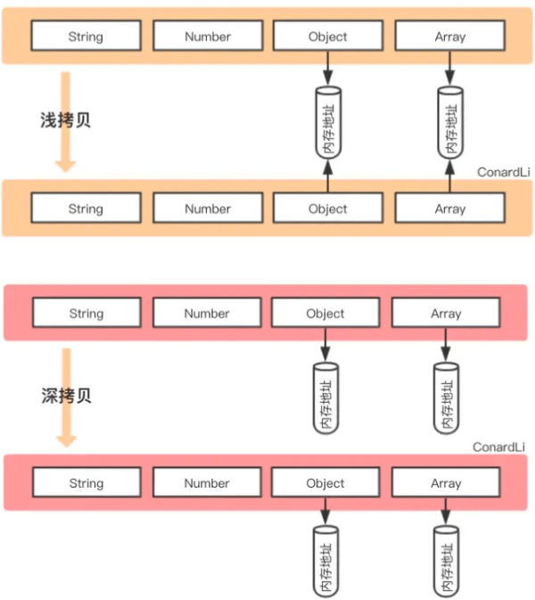
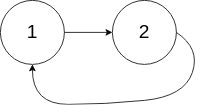
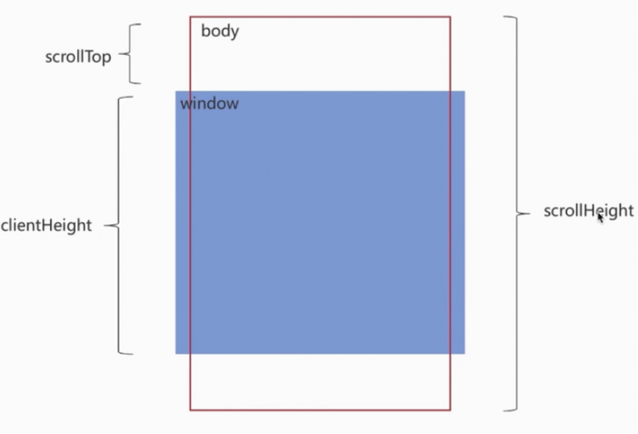
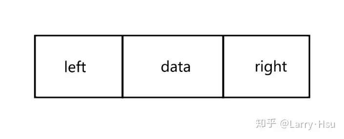
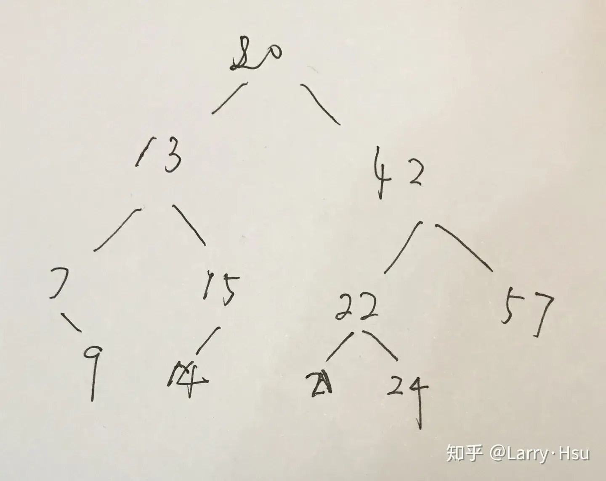
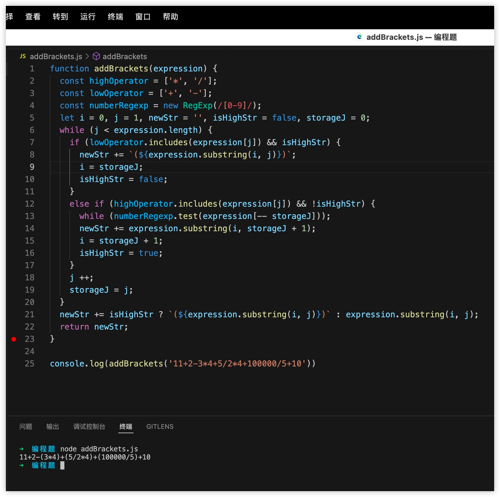
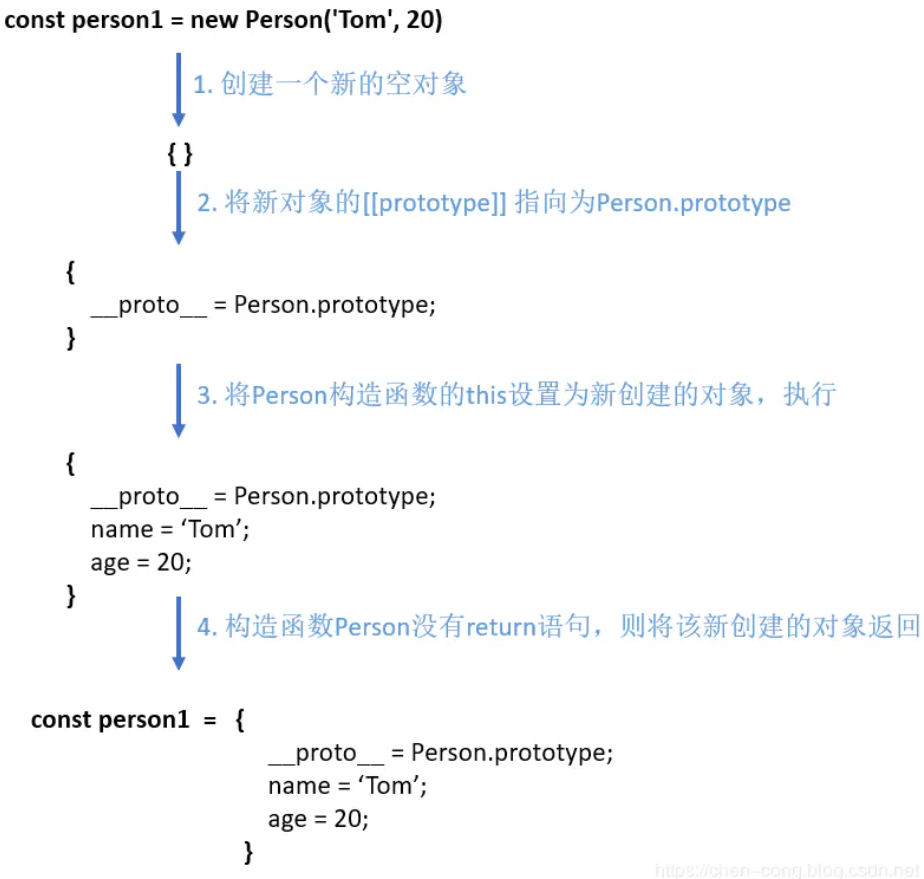
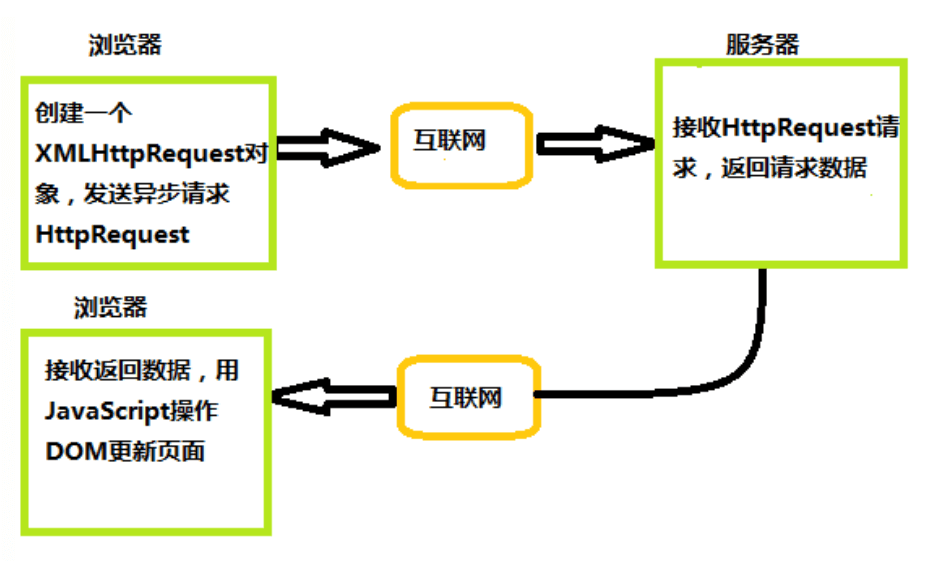
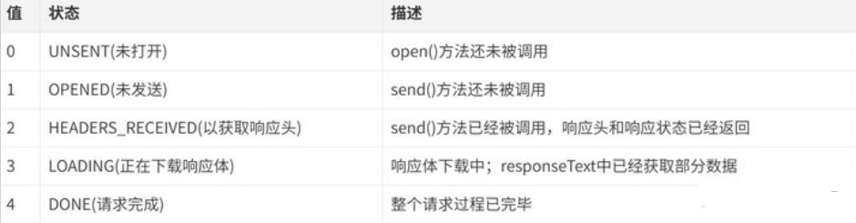

# 编程题 分类题集

> 共 136 题，摘自前端面试题宝典 https://fe.ecool.fun/topic-list

### 6. 实现深拷贝

**难度**：★★★★☆ | **题型**：QA | **分类**：全部 / 编程题

**题目**：


**参考答案**：
```js
const cloneDeep1 = (target, hash = new WeakMap()) => {
  // 对于传入参数处理
  if (typeof target !== 'object' || target === null) {
    return target;
  }
  // 哈希表中存在直接返回
  if (hash.has(target)) return hash.get(target);

  const cloneTarget = Array.isArray(target) ? [] : {};
  hash.set(target, cloneTarget);

  // 针对Symbol属性
  const symKeys = Object.getOwnPropertySymbols(target);
  if (symKeys.length) {
    symKeys.forEach(symKey => {
      if (typeof target[symKey] === 'object' && target[symKey] !== null) {
        cloneTarget[symKey] = cloneDeep1(target[symKey]);
      } else {
        cloneTarget[symKey] = target[symKey];
      }
    })
  }

  for (const i in target) {
    if (Object.prototype.hasOwnProperty.call(target, i)) {
      cloneTarget[i] =
        typeof target[i] === 'object' && target[i] !== null
        ? cloneDeep1(target[i], hash)
        : target[i];
    }
  }
  return cloneTarget;
}

```


---
### 24. 请手写“堆排序”

**难度**：★★★★☆ | **题型**：QA | **分类**：全部 / 算法 / 编程题

**题目**：


**参考答案**：
## 算法简介

堆排序（Heapsort）是指利用堆这种数据结构所设计的一种排序算法。堆积是一个近似完全二叉树的结构，并同时满足堆积的性质：即子结点的键值或索引总是小于（或者大于）它的父节点。

## 算法描述

具体算法描述如下：

* 将初始待排序关键字序列(R1,R2….Rn)构建成大顶堆，此堆为初始的无序区；
* 将堆顶元素R[1]与最后一个元素R[n]交换，此时得到新的无序区(R1,R2,……Rn-1)和新的有序区(Rn),且满足R[1,2…n-1]<=R[n]；
* 由于交换后新的堆顶R[1]可能违反堆的性质，因此需要对当前无序区(R1,R2,……Rn-1)调整为新堆，然后再次将R[1]与无序区最后一个元素交换，得到新的无序区(R1,R2….Rn-2)和新的有序区(Rn-1,Rn)。不断重复此过程直到有序区的元素个数为n-1，则整个排序过程完成。

## 代码实现

```javascript
/*方法说明：堆排序
@param  array 待排序数组*/
function heapSort(array) {
    console.time('堆排序耗时');
    if (Object.prototype.toString.call(array).slice(8, -1) === 'Array') {
        //建堆
        var heapSize = array.length, temp;
        for (var i = Math.floor(heapSize / 2) - 1; i >= 0; i--) {
            heapify(array, i, heapSize);
        }

        //堆排序
        for (var j = heapSize - 1; j >= 1; j--) {
            temp = array[0];
            array[0] = array[j];
            array[j] = temp;
            heapify(array, 0, --heapSize);
        }
        console.timeEnd('堆排序耗时');
        return array;
    } else {
        return 'array is not an Array!';
    }
}
/*方法说明：维护堆的性质
@param  arr 数组
@param  x   数组下标
@param  len 堆大小*/
function heapify(arr, x, len) {
    if (Object.prototype.toString.call(arr).slice(8, -1) === 'Array' && typeof x === 'number') {
        var l = 2 * x + 1, r = 2 * x + 2, largest = x, temp;
        if (l < len && arr[l] > arr[largest]) {
            largest = l;
        }
        if (r < len && arr[r] > arr[largest]) {
            largest = r;
        }
        if (largest != x) {
            temp = arr[x];
            arr[x] = arr[largest];
            arr[largest] = temp;
            heapify(arr, largest, len);
        }
    } else {
        return 'arr is not an Array or x is not a number!';
    }
}
var arr=[91,60,96,13,35,65,46,65,10,30,20,31,77,81,22];
console.log(heapSort(arr));//[10, 13, 20, 22, 30, 31, 35, 46, 60, 65, 65, 77, 81, 91, 96]

```

## 算法分析

* 最佳情况：T(n) = O(nlogn)
* 最差情况：T(n) = O(nlogn)
* 平均情况：T(n) = O(nlogn)


---
### 28. 实现Object.assign

**难度**：★★★☆☆ | **题型**：QA | **分类**：全部 / 编程题

**题目**：


**参考答案**：
Object.assign()方法用于将所有可枚举属性的值从一个或多个源对象复制到目标对象。它将返回目标对象（请注意这个操作是浅拷贝）

```js
Object.defineProperty(Object, 'assign', {
  value: function(target, ...args) {
    if (target == null) {
      return new TypeError('Cannot convert undefined or null to object');
    }
    
    // 目标对象需要统一是引用数据类型，若不是会自动转换
    const to = Object(target);

    for (let i = 0; i < args.length; i++) {
      // 每一个源对象
      const nextSource = args[i];
      if (nextSource !== null) {
        // 使用for...in和hasOwnProperty双重判断，确保只拿到本身的属性、方法（不包含继承的）
        for (const nextKey in nextSource) {
          if (Object.prototype.hasOwnProperty.call(nextSource, nextKey)) {
            to[nextKey] = nextSource[nextKey];
          }
        }
      }
    }
    return to;
  },
  // 不可枚举
  enumerable: false,
  writable: true,
  configurable: true,
})
```


---
### 44. Promise 的 finally 怎么实现的？

**难度**：★★★★☆ | **题型**：QA | **分类**：全部 / JavaScript / 编程题

**题目**：


**参考答案**：
Promise.prototype.finally 方法是 ES2018 引入的一个方法，用于在 Promise 执行结束后无论成功与否都会执行的操作。在实际应用中，finally 方法通常用于释放资源、清理代码或更新 UI 界面等操作。

以下是一个简单的实现方式：

```js
Promise.prototype.finally = function(callback) {
  const P = this.constructor;
  return this.then(
    value => P.resolve(callback()).then(() => value),
    reason => P.resolve(callback()).then(() => { throw reason })
  );
}
```

我们定义了一个名为 finally 的函数，它使用了 Promise 原型链的方式实现了 finally 方法。该函数接收一个回调函数作为参数，并返回一个新的 Promise 对象。如果原始 Promise 成功，则会先调用 callback 函数，然后将结果传递给下一个 Promise；如果失败，则会先调用 callback 函数，然后将错误信息抛出。

可以看到，在实现中，我们首先通过 this.constructor 获取当前 Promise 实例的构造函数，然后分别处理 Promise 的 resolved 和 rejected 状态的情况。在 resolved 状态时，我们先调用 callback 函数，然后将结果传递给新创建的 Promise 对象；在 rejected 状态时，我们也是先调用 callback 函数，然后将错误信息抛出。

这样，我们就完成了 Promise.prototype.finally 方法的实现。


---
### 95. 请在不使用 setTimeout 的前提下，实现 setInterval

**难度**：★★★★☆ | **题型**：QA | **分类**：全部 / 编程题

**题目**：


**参考答案**：
可以通过递归调用函数来实现 `setInterval`，而不使用 `setTimeout`。

下面是一个简单的实现示例：

```javascript
function mySetInterval(callback, interval) {
  let start = Date.now();

  function loop() {
    const now = Date.now();
    const elapsed = now - start;

    if (elapsed >= interval) {
      callback(); // 执行回调函数
      start = Date.now(); // 重置开始时间
    }

    requestAnimationFrame(loop); // 请求下一帧
  }

  loop(); // 启动循环
}

// 使用示例
mySetInterval(() => {
  console.log('Hello, World!');
}, 1000);
```

### **解释**

- **递归调用**：`loop` 函数在每一帧调用自己，形成一个循环。
- **时间检查**：在每次调用时检查经过的时间，如果超过设定的间隔，就执行回调函数，并重置开始时间。
- **`requestAnimationFrame`**：使用 `requestAnimationFrame` 确保在浏览器的重绘周期内进行调用，这样可以更有效地利用浏览器资源。


---
### 103. 实现一个方法，从某个数值数组中，获取最小正数（非零非负数）的索引值

**难度**：★☆☆☆☆ | **题型**：QA | **分类**：全部 / 编程题

**题目**：


**参考答案**：
```js
function findNonZeroMinIndex(arr) {
  let min = Infinity;
  let index = -1;
  for (let i = 0; i < arr.length; i++) {
    if (arr[i] > 0 && arr[i] < min) {
      min = arr[i];
      index = i;
    }
  }
  return index;
}
```

使用循环和条件判断来遍历数组，查找满足条件（即非零非负数）并且值最小的元素，并返回其索引。

如果数组中没有满足条件的元素，则返回 -1。


---
### 110. 实现一个类，其实例可以链式调用，它有一个 sleep 方法，可以 sleep 一段时间后再后续调用

**难度**：★★★★☆ | **题型**：QA | **分类**：全部 / 编程题

**题目**：
```js
const boy = new PlayBoy('Tom') 
boy.sayHi().sleep(1000).play('王者').sleep(2000).play('跳一跳') 
// 输出 
// 大家好我是Tom 
// 1s 之后 
// 我在玩王者 
// 2s 之后 
// 我在玩跳一跳
```

**参考答案**：
实现思想：创建一个任务队列，在每个方法中都往任务队列里追加一个函数，利用队列的先进先出的思想来控制函数的执行顺序。

```js
// 首先 定义一个类 PlayBoy 
class PlayBoy {
  constructor(name) {
    this.name = name
    this.queue = []  //创建一个任务队列（利用队列的先进先出性质来模拟链式调用函数的执行顺序）
    setTimeout(()=>{ // 进入异步任务队列 也是开启 自定义任务队列 queue 的入口
      this.next()  // next是类PlayBoy 原型上的方法，用来从queue 任务队列中取出函数执行 
    },0)
 
    return this
  }
}

PlayBoy.prototype.sayHi = function () {
 
  const fn = () => {
    console.log('hi')
    this.next()
  }
  this.queue.push(fn)
  return this
}

PlayBoy.prototype.sleep = function (timer) {
 
  const fn = () => {
    setTimeout(() => {
      this.next()
    }, timer)
  }
  this.queue.push(fn)
  return this
}

PlayBoy.prototype.play = function () {
 
  const fn = () => {
    console.log('play')
    this.next()
  }
  this.queue.push(fn)
  return this
}

PlayBoy.prototype.next = function () {
  const fn = this.queue.shift()  // 从任务队列中取出函数 函数存在的话即调用
 
  fn && fn()
}

new PlayBoy().sayHi().sleep(5000).play()
```


---
### 117. 使用 js 实现有序数组原地去重

**难度**：★★★☆☆ | **题型**：QA | **分类**：全部 / 编程题

**题目**：
 

**参考答案**：
原地去重有序数组，也就是在不创建新数组的情况下修改原始数组。

可以使用双指针的方法，以下是一个示例的实现：

```javascript
function removeDuplicates(nums) {
  if (nums.length === 0) {
    return 0;
  }
  
  let slow = 0;
  
  for (let fast = 1; fast < nums.length; fast++) {
    if (nums[fast] !== nums[slow]) {
      slow++;
      nums[slow] = nums[fast];
    }
  }
  
  return slow + 1;
}

// 示例用法
const nums = [1, 1, 2, 2, 2, 3, 4, 4, 5];
const length = removeDuplicates(nums);

console.log("去重后的数组：", nums.slice(0, length));
console.log("数组长度：", length);
```

在上面的代码中，我们定义了一个 `removeDuplicates` 函数，它接受一个有序数组 `nums` 作为参数。通过使用双指针来遍历数组，其中 `slow` 表示慢指针，用于记录当前不重复元素的位置。

我们从数组的第二个元素（即下标为1的元素）开始遍历，将其与慢指针指向的元素进行比较。如果它们不相等，说明遇到了一个新的不重复元素，将慢指针后移一位，并将新的元素放入该位置。如果它们相等，则跳过该元素，继续向后遍历。

最后，返回慢指针的位置加1，即为去重后的数组长度。可以通过 `nums.slice(0, length)` 来获取去重后的数组。


---
### 125. 深拷贝浅拷贝有什么区别？怎么实现深拷贝？

**难度**：★★★★☆ | **题型**：QA | **分类**：全部 / JavaScript / 编程题

**题目**：


**参考答案**：
## 一、数据类型存储

前面文章我们讲到，`JavaScript`中存在两大数据类型：

- 基本类型
- 引用类型 

基本类型数据保存在在栈内存中

引用类型数据保存在堆内存中，引用数据类型的变量是一个指向堆内存中实际对象的引用，存在栈中


## 二、浅拷贝

浅拷贝，指的是创建新的数据，这个数据有着原始数据属性值的一份精确拷贝

如果属性是基本类型，拷贝的就是基本类型的值。如果属性是引用类型，拷贝的就是内存地址

即浅拷贝是拷贝一层，深层次的引用类型则共享内存地址

下面简单实现一个浅拷贝

```js
function shallowClone(obj) {
    const newObj = {};
    for(let prop in obj) {
        if(obj.hasOwnProperty(prop)){
            newObj[prop] = obj[prop];
        }
    }
    return newObj;
}
```

在`JavaScript`中，存在浅拷贝的现象有：

- `Object.assign`
- `Array.prototype.slice()`, `Array.prototype.concat()`
- 使用拓展运算符实现的复制


### Object.assign

```js
var obj = {
    age: 18,
    nature: ['smart', 'good'],
    names: {
        name1: 'fx',
        name2: 'xka'
    },
    love: function () {
        console.log('fx is a great girl')
    }
}
var newObj = Object.assign({}, obj);
```


### slice()

```js
const fxArr = ["One", "Two", "Three"]
const fxArrs = fxArr.slice(0)
fxArrs[1] = "love";
console.log(fxArr) // ["One", "Two", "Three"]
console.log(fxArrs) // ["One", "love", "Three"]
```


### concat()

```js
const fxArr = ["One", "Two", "Three"]
const fxArrs = fxArr.concat()
fxArrs[1] = "love";
console.log(fxArr) // ["One", "Two", "Three"]
console.log(fxArrs) // ["One", "love", "Three"]
```


### 拓展运算符

```js
const fxArr = ["One", "Two", "Three"]
const fxArrs = [...fxArr]
fxArrs[1] = "love";
console.log(fxArr) // ["One", "Two", "Three"]
console.log(fxArrs) // ["One", "love", "Three"]
```


## 三、深拷贝

深拷贝开辟一个新的栈，两个对象的属性完全相同，但是对应两个不同的地址，修改一个对象的属性，不会改变另一个对象的属性

常见的深拷贝方式有：

- _.cloneDeep()

- jQuery.extend()
- JSON.stringify()
- 手写循环递归


### _.cloneDeep()

```js
const _ = require('lodash');
const obj1 = {
    a: 1,
    b: { f: { g: 1 } },
    c: [1, 2, 3]
};
const obj2 = _.cloneDeep(obj1);
console.log(obj1.b.f === obj2.b.f);// false
```


### jQuery.extend()

```js
const $ = require('jquery');
const obj1 = {
    a: 1,
    b: { f: { g: 1 } },
    c: [1, 2, 3]
};
const obj2 = $.extend(true, {}, obj1);
console.log(obj1.b.f === obj2.b.f); // false
```


### JSON.stringify()

```js
const obj2=JSON.parse(JSON.stringify(obj1));
```

但是这种方式存在弊端，会忽略`undefined`、`symbol`和`函数`

```js
const obj = {
    name: 'A',
    name1: undefined,
    name3: function() {},
    name4:  Symbol('A')
}
const obj2 = JSON.parse(JSON.stringify(obj));
console.log(obj2); // {name: "A"}
```


### 循环递归

```js
function deepClone(obj, hash = new WeakMap()) {
  if (obj === null) return obj; // 如果是null或者undefined我就不进行拷贝操作
  if (obj instanceof Date) return new Date(obj);
  if (obj instanceof RegExp) return new RegExp(obj);
  // 可能是对象或者普通的值  如果是函数的话是不需要深拷贝
  if (typeof obj !== "object") return obj;
  // 是对象的话就要进行深拷贝
  if (hash.get(obj)) return hash.get(obj);
  let cloneObj = new obj.constructor();
  // 找到的是所属类原型上的constructor,而原型上的 constructor指向的是当前类本身
  hash.set(obj, cloneObj);
  for (let key in obj) {
    if (obj.hasOwnProperty(key)) {
      // 实现一个递归拷贝
      cloneObj[key] = deepClone(obj[key], hash);
    }
  }
  return cloneObj;
}
```


## 四、区别

下面首先借助两张图，可以更加清晰看到浅拷贝与深拷贝的区别

 

从上图发现，浅拷贝和深拷贝都创建出一个新的对象，但在复制对象属性的时候，行为就不一样

浅拷贝只复制属性指向某个对象的指针，而不复制对象本身，新旧对象还是共享同一块内存，修改对象属性会影响原对象

```js
// 浅拷贝
const obj1 = {
    name : 'init',
    arr : [1,[2,3],4],
};
const obj3=shallowClone(obj1) // 一个浅拷贝方法
obj3.name = "update";
obj3.arr[1] = [5,6,7] ; // 新旧对象还是共享同一块内存

console.log('obj1',obj1) // obj1 { name: 'init',  arr: [ 1, [ 5, 6, 7 ], 4 ] }
console.log('obj3',obj3) // obj3 { name: 'update', arr: [ 1, [ 5, 6, 7 ], 4 ] }
```

但深拷贝会另外创造一个一模一样的对象，新对象跟原对象不共享内存，修改新对象不会改到原对象

```js
// 深拷贝
const obj1 = {
    name : 'init',
    arr : [1,[2,3],4],
};
const obj4=deepClone(obj1) // 一个深拷贝方法
obj4.name = "update";
obj4.arr[1] = [5,6,7] ; // 新对象跟原对象不共享内存

console.log('obj1',obj1) // obj1 { name: 'init', arr: [ 1, [ 2, 3 ], 4 ] }
console.log('obj4',obj4) // obj4 { name: 'update', arr: [ 1, [ 5, 6, 7 ], 4 ] }
```

### 小结

前提为拷贝类型为引用类型的情况下：

- 浅拷贝是复制内存中的地址，拷贝前后的对象，因为引用类型共享了同一块内存，修改会相互影响。
- 深拷贝是递归拷贝深层次，属性为对象时，深拷贝是新开栈，两个对象指向不同的地址

**要点**：
JS数据类型分别基本数据类型和引用数据类型，基本数据类型保存的是值，引用类型保存的是引用地址(this指针)。

浅拷贝共用一个引用地址，深拷贝会创建新的内存地址。

#### 浅拷贝方法

- 直接对象复制
- Object.assign

#### 深拷贝

- JSON.stringify转为字符串再JSON.parse
- 深度递归遍历

---
### 132. 实现 Promise 

**难度**：★★★★★ | **题型**：QA | **分类**：全部 / 编程题

**题目**：


**参考答案**：
```js
// 模拟实现Promise
// Promise利用三大手段解决回调地狱：
// 1. 回调函数延迟绑定
// 2. 返回值穿透
// 3. 错误冒泡

// 定义三种状态
const PENDING = 'PENDING';      // 进行中
const FULFILLED = 'FULFILLED';  // 已成功
const REJECTED = 'REJECTED';    // 已失败

class Promise {
  constructor(exector) {
    // 初始化状态
    this.status = PENDING;
    // 将成功、失败结果放在this上，便于then、catch访问
    this.value = undefined;
    this.reason = undefined;
    // 成功态回调函数队列
    this.onFulfilledCallbacks = [];
    // 失败态回调函数队列
    this.onRejectedCallbacks = [];

    const resolve = value => {
      // 只有进行中状态才能更改状态
      if (this.status === PENDING) {
        this.status = FULFILLED;
        this.value = value;
        // 成功态函数依次执行
        this.onFulfilledCallbacks.forEach(fn => fn(this.value));
      }
    }
    const reject = reason => {
      // 只有进行中状态才能更改状态
      if (this.status === PENDING) {
        this.status = REJECTED;
        this.reason = reason;
        // 失败态函数依次执行
        this.onRejectedCallbacks.forEach(fn => fn(this.reason))
      }
    }
    try {
      // 立即执行executor
      // 把内部的resolve和reject传入executor，用户可调用resolve和reject
      exector(resolve, reject);
    } catch(e) {
      // executor执行出错，将错误内容reject抛出去
      reject(e);
    }
  }
  then(onFulfilled, onRejected) {
    onFulfilled = typeof onFulfilled === 'function' ? onFulfilled : value => value;
    onRejected = typeof onRejected === 'function'? onRejected :
      reason => { throw new Error(reason instanceof Error ? reason.message : reason) }
    // 保存this
    const self = this;
    return new Promise((resolve, reject) => {
      if (self.status === PENDING) {
        self.onFulfilledCallbacks.push(() => {
          // try捕获错误
          try {
            // 模拟微任务
            setTimeout(() => {
              const result = onFulfilled(self.value);
              // 分两种情况：
              // 1. 回调函数返回值是Promise，执行then操作
              // 2. 如果不是Promise，调用新Promise的resolve函数
              result instanceof Promise ? result.then(resolve, reject) : resolve(result);
            })
          } catch(e) {
            reject(e);
          }
        });
        self.onRejectedCallbacks.push(() => {
          // 以下同理
          try {
            setTimeout(() => {
              const result = onRejected(self.reason);
              // 不同点：此时是reject
              result instanceof Promise ? result.then(resolve, reject) : resolve(result);
            })
          } catch(e) {
            reject(e);
          }
        })
      } else if (self.status === FULFILLED) {
        try {
          setTimeout(() => {
            const result = onFulfilled(self.value);
            result instanceof Promise ? result.then(resolve, reject) : resolve(result);
          });
        } catch(e) {
          reject(e);
        }
      } else if (self.status === REJECTED) {
        try {
          setTimeout(() => {
            const result = onRejected(self.reason);
            result instanceof Promise ? result.then(resolve, reject) : resolve(result);
          })
        } catch(e) {
          reject(e);
        }
      }
    });
  }
  catch(onRejected) {
    return this.then(null, onRejected);
  }
  static resolve(value) {
    if (value instanceof Promise) {
      // 如果是Promise实例，直接返回
      return value;
    } else {
      // 如果不是Promise实例，返回一个新的Promise对象，状态为FULFILLED
      return new Promise((resolve, reject) => resolve(value));
    }
  }
  static reject(reason) {
    return new Promise((resolve, reject) => {
      reject(reason);
    })
  }
  static all(promiseArr) {
    const len = promiseArr.length;
    const values = new Array(len);
    // 记录已经成功执行的promise个数
    let count = 0;
    return new Promise((resolve, reject) => {
      for (let i = 0; i < len; i++) {
        // Promise.resolve()处理，确保每一个都是promise实例
        Promise.resolve(promiseArr[i]).then(
          val => {
            values[i] = val;
            count++;
            // 如果全部执行完，返回promise的状态就可以改变了
            if (count === len) resolve(values);
          },
          err => reject(err),
        );
      }
    })
  }
  static race(promiseArr) {
    return new Promise((resolve, reject) => {
      promiseArr.forEach(p => {
        Promise.resolve(p).then(
          val => resolve(val),
          err => reject(err),
        )
      })
    })
  }
}

```


---
### 140. 实现 Function.prototype.bind

**难度**：★★☆☆☆ | **题型**：QA | **分类**：全部 / 编程题

**题目**：


**参考答案**：
```js
Function.prototype.bind = function(context, ...args) {
  if (typeof this !== 'function') {
    throw new Error("Type Error");
  }
  // 保存this的值
  var self = this;

  return function F() {
    // 考虑new的情况
    if(this instanceof F) {
      return new self(...args, ...arguments)
    }
    return self.apply(context, [...args, ...arguments])
  }
}

```


---
### 154. 实现函数parallelRequests(urls, maxConcurrent)

**难度**：★★★★☆ | **题型**：QA | **分类**：全部 / 编程题

**题目**：
```javascript
// 要求：
// 1. 最多同时执行maxConcurrent个请求
// 2. 请求完成（无论成功/失败）后立即补位新请求
// 3. 返回Promise，结果为所有请求响应数组（顺序需与urls一致）
function parallelRequests(urls, maxConcurrent) {
  // 请补充实现
}
```

**参考答案**：
## 实现代码

```javascript
function parallelRequests(urls, maxConcurrent) {
  return new Promise((resolve, reject) => {
    const results = new Array(urls.length); // 保证结果顺序
    let nextIndex = 0;                      // 下一个要发起请求的索引
    let activeCount = 0;                    // 当前并发中的请求数
    let finishedCount = 0;                  // 已完成的请求数

    function runNext() {
      // 所有请求完成
      if (finishedCount === urls.length) {
        resolve(results);
        return;
      }

      // 启动新请求（补位）
      while (activeCount < maxConcurrent && nextIndex < urls.length) {
        const current = nextIndex;
        const url = urls[nextIndex];
        nextIndex++;
        activeCount++;

        // 这里假设请求方式是 fetch，可替换为任意返回 Promise 的请求函数
        Promise.resolve(fetch(url))
          .then(res => res)
          .catch(err => err) // 失败也记录结果，不中断整体流程
          .then(result => {
            results[current] = result;
          })
          .finally(() => {
            activeCount--;
            finishedCount++;
            runNext(); // 请求完成后立即补位
          });
      }
    }

    runNext();
  });
}
```

---

## 设计思路说明

### 1. 并发控制的核心

* 使用 `activeCount` 记录**当前正在执行的请求数量**
* 通过 `while (activeCount < maxConcurrent)` 启动新请求
* 请求完成后在 `finally` 中 **立即补位**

这是一个典型的**请求池（request pool）/并发调度器**模型。

---

### 2. 如何保证结果顺序

* 结果数组 `results` 预先按 `urls.length` 创建
* 每个请求在启动时保存自己的索引 `current`
* 无论请求完成顺序如何，始终写入 `results[current]`

这样可以做到：

> **执行顺序无序，结果顺序有序**

---

### 3. 为什么用 `finally`

```js
.finally(() => {
  activeCount--;
  finishedCount++;
  runNext();
});
```

* **成功 / 失败都会执行**
* 满足题目要求：

  > 请求完成（无论成功/失败）后立即补位新请求
* 避免因异常导致并发池“卡死”

---

### 4. 返回整体 Promise 的时机

```js
if (finishedCount === urls.length) {
  resolve(results);
}
```

* 所有请求都完成后，统一 resolve
* 不因单个请求失败 reject（更符合“批量请求”的实际业务需求）
* 如果你希望“只要有一个失败就 reject”，可以在 `catch` 中直接 `reject(err)`

---

## 时间与空间复杂度

* **时间复杂度**：O(n)（调度本身）
* **空间复杂度**：O(n)（结果数组）


---
### 171. 使用 reduce 实现 map

**难度**：★★★☆☆ | **题型**：QA | **分类**：全部 / 编程题

**题目**：


**参考答案**：
从语义上看，`map` 的核心并不是“遍历”，而是**基于原集合生成一个等长的新集合，并保持索引顺序不变**。`reduce` 本身并不限定结果结构，它只是提供了一种“逐步累积结果”的机制，因此完全可以用来表达 `map` 的行为。

在实现上，关键在于：把 `reduce` 的累加器当作“结果数组”，在每一次迭代中，将当前元素经过映射函数处理后追加到累加器中。这样，累加器最终就变成了 `map` 的返回值。

一个等价且语义清晰的实现如下：

```js
function mapByReduce(array, mapper) {
  return array.reduce((result, current, index, source) => {
    result.push(mapper(current, index, source))
    return result
  }, [])
}
```

这个实现与原生 `Array.prototype.map` 在行为上是一致的：不会修改原数组，返回一个新数组，映射函数能够拿到当前值、索引以及原数组。`reduce` 在这里承担的角色，是把“每一步的映射结果”持续累积到同一个输出容器中。

需要注意的是，用 `reduce` 实现 `map` 更多是一种**表达能力上的练习**，而不是工程上的推荐写法。在可读性和意图表达上，直接使用 `map` 更清晰，也更符合团队协作中的直觉。`reduce` 更适合用于那些无法直接用单一高阶函数表达的聚合场景，而不是替代已经存在、语义明确的 API。

从底层角度看，这两者在复杂度上并无本质差异，时间复杂度同为 O(n)，空间复杂度也都需要一个新的结果数组。差别更多体现在抽象层级和代码可维护性上。


**要点**：
`map` 的本质是等长映射并返回新数组；`reduce` 可以通过累加器承载结果数组来实现同样行为；实现时在每次迭代中 push 映射结果并返回累加器；工程实践中应优先使用语义更明确的 `map`，`reduce` 更适合复杂聚合逻辑。

---
### 188. 斐波拉契数列是什么，用 JS 实现，用尾调优化斐波拉契数列

**难度**：★★★☆☆ | **题型**：QA | **分类**：全部 / 编程题

**题目**：


**参考答案**：
斐波那契数列（Fibonacci Sequence）是一种经典的数列，每个数都是前两个数的和。通常的数列从 0 和 1 开始，数列的定义如下：

- \( F(0) = 0 \)
- \( F(1) = 1 \)
- 对于 \( n > 1 \)，\( F(n) = F(n-1) + F(n-2) \)

### JavaScript 实现

斐波那契数列可以用递归方法、迭代方法或尾调用优化方法来实现。尾调用优化（Tail Call Optimization, TCO）是一种优化技术，允许编译器在函数的最后一步调用另一个函数时，重用当前函数的栈帧，从而避免栈溢出。

### 1. 基本递归实现（不优化）

```javascript
function fibonacci(n) {
    if (n <= 1) return n;
    return fibonacci(n - 1) + fibonacci(n - 2);
}

console.log(fibonacci(10)); // 输出: 55
```

### 2. 尾调用优化实现

尾调用优化需要确保递归调用是函数的最后一步。下面是尾调用优化的斐波那契数列实现：

```javascript
function fibonacci(n) {
    function tailRecursiveFib(n, a = 0, b = 1) {
        if (n === 0) return a;
        if (n === 1) return b;
        return tailRecursiveFib(n - 1, b, a + b);
    }
    
    return tailRecursiveFib(n);
}

console.log(fibonacci(10)); // 输出: 55
```

### 解释

1. **尾递归函数 `tailRecursiveFib`**：
   - 该函数接收三个参数：`n`（剩余的步骤）、`a`（当前的斐波那契数）和 `b`（下一个斐波那契数）。
   - 如果 `n` 为 0，返回 `a`，否则，如果 `n` 为 1，返回 `b`。
   - 否则，递归调用 `tailRecursiveFib`，将 `n-1` 作为新的步骤，`b` 作为当前的斐波那契数，`a + b` 作为下一个斐波那契数。

2. **尾调用优化**：
   - 在递归调用中，`tailRecursiveFib` 是函数的最后一步调用，因此可以进行尾调用优化，避免了传统递归中的栈深度问题。

**要点**：
- **斐波那契数列**：每个数是前两个数的和，常见的递归和迭代实现方式。
- **尾调用优化**：通过尾递归实现可以提高性能和避免栈溢出问题，特别是在处理大规模的递归调用时。

尾调用优化在某些 JavaScript 引擎中可能不被完全支持，但良好的编程实践是尽量使用尾递归来避免性能瓶颈。

---
### 214. 使用js实现二分查找

**难度**：★★☆☆☆ | **题型**：QA | **分类**：全部 / JavaScript / 编程题

**题目**：


**参考答案**：
二分查找，也称为折半查找，是指在有序的数组里找出指定的值，返回该值在数组中的索引。

查找步骤如下：

1. 从有序数组的最中间元素开始查找，如果该元素正好是指定查找的值，则查找过程结束。否则进行下一步;
2. 如果指定要查找的元素大于或者小于中间元素，则在数组大于或小于中间元素的那一半区域查找，然后重复第一步的操作;
3. 重复以上过程，直到找到目标元素的索引，查找成功;或者直到子数组为空，查找失败。

优点是比较次数少，查找速度快，平均性能好；
其缺点是要求待查表为**有序表**，且插入删除困难。因此，折半查找方法适用于不经常变动而查找频繁的有序列表。

## 实现方式

### 非递归

```js
//arr:数组;key:查找的元素
function search(arr, key) {
    //初始索引开始位置和结束位置
    var start = 0,
        end = arr.length - 1;
    while(start <= end) {
        //取上限和下限中间的索引
        var mid = parseInt((end + start) /2);
        if(key == arr[mid]) {
            //如果找到则直接返回
            return mid;
        } else if(key > arr[mid]) {
            //如果key是大于数组中间索引的值则将索引开始位置设置为中间索引+1
            start = mid + 1;
        } else {
            //如果key是小于数组中间索引的值则将索引结束位置设置为中间索引-1
            end = mid -1;
        }
    }
    //如果在循环内没有找到查找的key(start<=end)的情况则返回-1
    return -1;
}
var arr = [0,13,21,35,46,52,68,77,89,94];
search(arr, 68); //6
search(arr, 1); //-1
```

### 递归
```js
//arr:数组;key:查找的元素;start:开始索引;end:结束索引
function search2(arr,key,start,end){
    //首先判断当前起始索引是否大于结束索引,如果大于说明没有找到元素返回-1
    if(start > end) {
        return -1;
    }
    //如果手动调用不写start和end参数会当做第一次运行默认值
    //三元表达式:如果不写end参数则为undefined说明第一次调用所以结束索引为arr.length-1
    //如果是递归调用则使用传进来的参数end值
    var end= end===undefined ? arr.length-1 : end;
    //如果 || 前面的为真则赋值start,如果为假则赋值后面的0
    //所以end变量没有写var end = end || arr.length-1;这样如果递归调用时候传参end为0时会被转化为false,导致赋值给arr.length-1造成无限循环溢出;
    var start=start || 0;
    //取中间的索引
    var mid=parseInt((start+end)/2);
    if(key==arr[mid]){
        //如果找到则直接返回
        return mid;
    }else if(key<arr[mid]){
        //如果key小于则递归调用自身,将结束索引设置为中间索引-1
        return search2(arr,key,start,mid-1);
    }else{
        //如果key大于则递归调用自身,将起始索引设置为中间索引+1
        return search2(arr,key,mid+1,end);
    }
}
var arr = [0,13,21,35,46,52,68,77,89,94];
search2(arr, 77); //7
search2(arr, 99); //-1
```


---
### 216. 使用Promise封装一个异步加载图片的方法

**难度**：★★★☆☆ | **题型**：QA | **分类**：全部 / JavaScript / 编程题

**题目**：


**参考答案**：
这个比较简单，只需要在图片的onload函数中，使用resolve返回一下就可以了。

```js
function loadImg(url) {
  return new Promise((resolve, reject) => {
    const img = new Image();
    img.onload = function() {
      resolve(img);
    };
    img.onerror = function() {
    	reject(new Error('Could not load image at' + url));
    };
    img.src = url;
  });

```


---
### 224. 如何判断一个对象是否为空对象？

**难度**：★★★☆☆ | **题型**：QA | **分类**：全部 / 编程题

**题目**：


**参考答案**：
```js
function checkNullObj(obj) {
  return Object.keys(obj).length === 0;
}
```


---
### 230. 字符串解码

**难度**：★★☆☆☆ | **题型**：QA | **分类**：全部 / 编程题

**题目**：
给定一个经过编码的字符串，返回它解码后的字符串。编码规则为：`k[encoded_string]`，表示 `encoded_string` 重复 `k` 次。其中 `k` 为正整数，`encoded_string` 不包含数字。

示例：

* 输入：`"3[a]2[bc]"`
* 输出：`"aaabcbc"`

**参考答案**：
这个问题本质是一个 **嵌套结构解析问题**。
核心难点不在重复，而在于：

* 支持多位数字
* 支持嵌套结构
* 正确处理括号边界

例如：

```
3[a2[c]]
```

这种情况下不能简单正则替换，必须用结构化解析。

---

# 一、解题思路

推荐使用 **栈（Stack）**。

因为每遇到 `[`，意味着进入一层新的子表达式；
每遇到 `]`，意味着当前子表达式结束，需要回到上一层。

可以维护两个栈：

* 数字栈（存放 k）
* 字符串栈（存放上一层结果）

遍历字符串，逻辑如下：

1. 遇到数字 → 构建当前倍数
2. 遇到 `[` → 把当前倍数和当前字符串压栈，重置状态
3. 遇到 `]` → 出栈，拼接字符串
4. 遇到普通字符 → 追加到当前字符串

---

# 二、实现代码

```js
function decodeString(s) {
  const numStack = [];
  const strStack = [];
  
  let currentNum = 0;
  let currentStr = "";

  for (let char of s) {
    if (!isNaN(char)) {
      // 处理多位数
      currentNum = currentNum * 10 + Number(char);
    } else if (char === "[") {
      numStack.push(currentNum);
      strStack.push(currentStr);
      
      currentNum = 0;
      currentStr = "";
    } else if (char === "]") {
      const repeatTimes = numStack.pop();
      const prevStr = strStack.pop();
      currentStr = prevStr + currentStr.repeat(repeatTimes);
    } else {
      currentStr += char;
    }
  }

  return currentStr;
}
```

---

# 三、执行过程示例

输入：

```
"3[a]2[bc]"
```

流程：

1. 读到 `3` → currentNum = 3
2. 遇到 `[` → 入栈
3. 读到 `a` → currentStr = "a"
4. 遇到 `]` → 出栈 → "aaa"
5. 读到 `2` → currentNum = 2
6. 读到 `bc`
7. 遇到 `]` → 拼接 → "aaabcbc"

---

# 四、时间复杂度

时间复杂度：O(n)

每个字符只遍历一次，
字符串拼接整体复杂度与输出规模线性相关。

空间复杂度：O(n)

主要来自栈与输出字符串。

---

# 五、为什么不能用正则

正则无法优雅处理嵌套结构：

```
3[a2[c]]
```

括号是典型的“上下文相关结构”，必须借助栈或递归解析。

---

# 六、本质理解

这是一个典型的：

* 语法结构解析问题
* 栈处理嵌套问题
* 局部结果逐层展开

核心思想是：
遇到 `[` 进入子环境，
遇到 `]` 回到父环境。


**要点**：
该问题本质是一个嵌套结构解析问题，适合使用栈进行处理。通过数字栈与字符串栈保存中间状态，在遇到 `]` 时进行回溯拼接即可。时间复杂度为 O(n)，能够正确处理多位数字和多层嵌套结构。

---
### 266. 将下面的数组转成树状结构

**难度**：★★★☆☆ | **题型**：QA | **分类**：全部 / 编程题

**题目**：
根据 `id` 和 `parent_id` 的对应关系，进行下面的转换。

原始数据：

```json
[
  { "id": 12, "parent_id": 1, "name": "朝阳区" },
  { "id": 241, "parent_id": 24, "name": "田林街道" },
  { "id": 31, "parent_id": 3, "name": "广州市" },
  { "id": 13, "parent_id": 1, "name": "昌平区" },
  { "id": 2421, "parent_id": 242, "name": "上海科技绿洲" },
  { "id": 21, "parent_id": 2, "name": "静安区" },
  { "id": 242, "parent_id": 24, "name": "漕河泾街道" },
  { "id": 22, "parent_id": 2, "name": "黄浦区" },
  { "id": 11, "parent_id": 1, "name": "顺义区" },
  { "id": 2, "parent_id": 0, "name": "上海市" },
  { "id": 24, "parent_id": 2, "name": "徐汇区" },
  { "id": 1, "parent_id": 0, "name": "北京市" },
  { "id": 2422, "parent_id": 242, "name": "漕河泾开发区" },
  { "id": 32, "parent_id": 3, "name": "深圳市" },
  { "id": 33, "parent_id": 3, "name": "东莞市" },
  { "id": 3, "parent_id": 0, "name": "广东省" }
]
```

转换后的结构：

```json
[{
	"id": 2,
	"parent_id": 0,
	"name": "上海市",
	"children": [{
		"id": 21,
		"parent_id": 2,
		"name": "静安区",
		"children": []
	}, {
		"id": 22,
		"parent_id": 2,
		"name": "黄浦区",
		"children": []
	}, {
		"id": 24,
		"parent_id": 2,
		"name": "徐汇区",
		"children": [{
			"id": 241,
			"parent_id": 24,
			"name": "田林街道",
			"children": []
		}, {
			"id": 242,
			"parent_id": 24,
			"name": "漕河泾街道",
			"children": [{
				"id": 2421,
				"parent_id": 242,
				"name": "上海科技绿洲",
				"children": []
			}, {
				"id": 2422,
				"parent_id": 242,
				"name": "漕河泾开发区",
				"children": []
			}]
		}]
	}]
}, {
	"id": 1,
	"parent_id": 0,
	"name": "北京市",
	"children": [{
		"id": 12,
		"parent_id": 1,
		"name": "朝阳区",
		"children": []
	}, {
		"id": 13,
		"parent_id": 1,
		"name": "昌平区",
		"children": []
	}, {
		"id": 11,
		"parent_id": 1,
		"name": "顺义区",
		"children": []
	}]
}, {
	"id": 3,
	"parent_id": 0,
	"name": "广东省",
	"children": [{
		"id": 31,
		"parent_id": 3,
		"name": "广州市",
		"children": []
	}, {
		"id": 32,
		"parent_id": 3,
		"name": "深圳市",
		"children": []
	}, {
		"id": 33,
		"parent_id": 3,
		"name": "东莞市",
		"children": []
	}]
}]
```

**参考答案**：
 
这种数据和嵌套对象相互转换的题目，在手写题环节很常见，今天我们就来介绍几种解法。

## 方法一

很容易想到的一个方法就是利用递归：每次遍历时，找到将本次遍历的根节点作为父节点的所有子节点，直至找不到有子节点的。

```js
/**
 * 数组转树形结构
 * @param {array} list 被转换的数组
 * @param {number|string} root 根节点（最外层节点）
 * @returns array
 */
function arrayToTree(list, root) {
  return list
    .filter(item => item.parent_id === root)
    .map(item => ({ ...item, children: arrayToTree(list, item.id) }))
}
```

代码很简洁，`filter` 和 `map` 方法也是数组中很常见的方法，相信大家也很好理解。

## 方法二

可以利用浅拷贝是拷贝对象的内存地址的特性，我们修改拷贝后，所有引用都会同步修改。利用这个特点，我们将子节点依次放入父节点，最后将最外层父节点返回即可。

```js
/**
 * 数组转树形结构
 * @param {array} list 被转换的数组
 * @param {number|string} root 根节点（最外层节点）的 id
 * @return array
 */
function arrayToTree(list, root) {
  const result = [] // 用于存放结果
  const map = {} // 用于存放 list 下的节点

  // 1. 遍历 list，将 list 下的所有节点以 id 作为索引存入 map
  for (const item of list) {
    map[item.id] = { ...item } // 浅拷贝
  }

  // 2. 再次遍历，将根节点放入最外层，子节点放入父节点
  for (const item of list) {
    // 3. 获取节点的 id 和 父 id
    const { id, parent_id } = item // ES6 解构赋值
    // 4. 如果是根节点，存入 result
    if (item.parent_id === root) {
      result.push(map[id])
    } else {
      // 5. 反之，存入到父节点
      map[parent_id].children
        ? map[parent_id].children.push(map[id])
        : (map[parent_id].children = [map[id]])
    }
  }

  // 将结果返回
  return result
}
```

代码中有注释，相信大家多读几遍也能理解。

## 方法三

针对方法二，我们也可以有些优化，只需要一次遍历，就能获取到结果

```js
/**
 * 数组转树形结构
 * @param {array} list 被转换的数组
 * @param {number|string} root 根节点（最外层节点）
 * @returns array
 */
function arrayToTree(list, root) {
  const result = [] // 用于存放结果
  const map = {} // 用于存放 list 下的节点

  // 遍历 list
  for (const item of list) {
    // 1. 获取节点的 id 和 父 id
    const { id, parent_id } = item // ES6 解构赋值

    // 2. 将节点存入 map
    if (!map[id]) map[id] = {}

    // 3. 根据 id，将节点与之前存入的子节点合并
    map[id] = map[id].children
      ? { ...item, children: map[id].children }
      : { ...item }

    // 4. 如果是根节点，存入 result
    if (parent_id === root) {
      result.push(map[id])
    } else {
      // 5. 反之，存入父节点
      if (!map[parent_id]) map[parent_id] = {}
      if (!map[parent_id].children) map[parent_id].children = []
      map[parent_id].children.push(map[id])
    }
  }

  // 将结果返回
  return result
}
```


---
### 275. 实现一个方法，可以对两个数组的维数进行对比

**难度**：★★☆☆☆ | **题型**：QA | **分类**：全部 / 编程题

**题目**：


**参考答案**：
“维度”是指数组的嵌套层级。例如，`[1, 2]` 是一个 1 维数组，而 `[[1], [2]]` 是一个 2 维数组。

以下是一个示例函数，用于计算数组的维度并对比两个数组的维度：

```javascript
// 计算数组的维度
function getArrayDepth(arr) {
  if (!Array.isArray(arr)) return 0;
  return 1 + (arr.length > 0 ? getArrayDepth(arr[0]) : 0);
}

// 对比两个数组的维度
function compareArrayDepth(arr1, arr2) {
  const depth1 = getArrayDepth(arr1);
  const depth2 = getArrayDepth(arr2);
  
  if (depth1 > depth2) {
    return 1; // arr1 的维度更高
  } else if (depth1 < depth2) {
    return -1; // arr2 的维度更高
  } else {
    return 0; // 两个数组的维度相同
  }
}

// 示例
const array1 = [1, [2, [3]]];
const array2 = [1, 2, 3];

console.log(compareArrayDepth(array1, array2)); // 输出 1，array1 的维度更高
```

### **解释**

1. **`getArrayDepth` 函数**：
   - 递归计算数组的深度。如果数组为空，则返回 0。
   - 否则，递归计算第一个元素的深度，并加 1 作为当前数组的深度。

2. **`compareArrayDepth` 函数**：
   - 使用 `getArrayDepth` 计算两个数组的维度。
   - 比较两个维度，返回 1、-1 或 0 表示哪个数组的维度更高，或者维度相同。


---
### 281. 数组去重

**难度**：★☆☆☆☆ | **题型**：QA | **分类**：全部 / 编程题

**题目**：
```js
const arr = [1, 1, '1', 17, true, true, false, false, 'true', 'a', {}, {}];
// => [1, '1', 17, true, false, 'true', 'a', {}, {}]
```


**参考答案**：
* 方法一：利用Set
```js
const res1 = Array.from(new Set(arr));
```

* 方法二：两层for循环+splice
```js
const unique1 = arr => {
  let len = arr.length;
  for (let i = 0; i < len; i++) {
    for (let j = i + 1; j < len; j++) {
      if (arr[i] === arr[j]) {
        arr.splice(j, 1);
        // 每删除一个树，j--保证j的值经过自加后不变。同时，len--，减少循环次数提升性能
        len--;
        j--;
      }
    }
  }
  return arr;
}
```

* 方法三：利用indexOf
```js
const unique2 = arr => {
  const res = [];
  for (let i = 0; i < arr.length; i++) {
    if (res.indexOf(arr[i]) === -1) res.push(arr[i]);
  }
  return res;
}
```

当然也可以用include、filter，思路大同小异。

* 方法四：利用include
```js
const unique3 = arr => {
  const res = [];
  for (let i = 0; i < arr.length; i++) {
    if (!res.includes(arr[i])) res.push(arr[i]);
  }
  return res;
}
```

* 方法五：利用filter
```js
const unique4 = arr => {
  return arr.filter((item, index) => {
    return arr.indexOf(item) === index;
  });
}
```

* 方法六：利用Map
```js
const unique5 = arr => {
  const map = new Map();
  const res = [];
  for (let i = 0; i < arr.length; i++) {
    if (!map.has(arr[i])) {
      map.set(arr[i], true)
      res.push(arr[i]);
    }
  }
  return res;
}
```


---
### 290. 实现mergePromise函数

**难度**：★★★★☆ | **题型**：QA | **分类**：全部 / JavaScript / 编程题

**题目**：
实现mergePromise函数，把传进去的数组按顺序先后执行，并且把返回的数据先后放到数组data中。

```js
const time = (timer) => {
  return new Promise(resolve => {
    setTimeout(() => {
      resolve()
    }, timer)
  })
}
const ajax1 = () => time(2000).then(() => {
  console.log(1);
  return 1
})
const ajax2 = () => time(1000).then(() => {
  console.log(2);
  return 2
})
const ajax3 = () => time(1000).then(() => {
  console.log(3);
  return 3
})

function mergePromise () {
  // 在这里写代码
}

mergePromise([ajax1, ajax2, ajax3]).then(data => {
  console.log("done");
  console.log(data); // data 为 [1, 2, 3]
});

// 要求分别输出
// 1
// 2
// 3
// done
// [1, 2, 3]

```

**参考答案**：
这道题有点类似于Promise.all()，不过.all()不需要管执行顺序，只需要并发执行就行了。但是这里需要等上一个执行完毕之后才能执行下一个。

解题思路：

* 定义一个数组data用于保存所有异步操作的结果
* 初始化一个`const promise = Promise.resolve()`，然后循环遍历数组，在promise后面添加执行ajax任务，同时要将添加的结果重新赋值到promise上。

```js
function mergePromise (ajaxArray) {
  // 存放每个ajax的结果
  const data = [];
  let promise = Promise.resolve();
  ajaxArray.forEach(ajax => {
  	// 第一次的then为了用来调用ajax
  	// 第二次的then是为了获取ajax的结果
    promise = promise.then(ajax).then(res => {
      data.push(res);
      return data; // 把每次的结果返回
    })
  })
  // 最后得到的promise它的值就是data
  return promise;
}
```


---
### 314. 实现：setObjectValue(obj: object, keys: string[], value: any) 方法， 支持安全设置对象的值

**难度**：★★★☆☆ | **题型**：QA | **分类**：全部 / 编程题

**题目**：


**参考答案**：
要实现一个 `setObjectValue` 方法，能够安全地设置对象的值，并支持通过键路径访问和设置值，可以按照以下步骤进行：

### **功能说明**

- **`obj`**: 需要修改的对象。
- **`keys`**: 一个字符串数组，表示键路径，例如 `['a', 'b', 'c']` 代表 `obj.a.b.c`。
- **`value`**: 要设置的值。

### **实现代码**

```typescript
function setObjectValue(obj: object, keys: string[], value: any): void {
  if (!keys.length) return;

  // 遍历 keys 除了最后一个键
  let current = obj;
  for (let i = 0; i < keys.length - 1; i++) {
    const key = keys[i];

    // 如果当前路径的对象不存在，则创建它
    if (!(key in current)) {
      // 使用空对象作为默认值
      (current as any)[key] = {};
    }
    
    // 移动到下一个嵌套的对象
    current = (current as any)[key];
  }

  // 设置最后一个键的值
  const lastKey = keys[keys.length - 1];
  (current as any)[lastKey] = value;
}

// 示例用法
const obj = {};
setObjectValue(obj, ['a', 'b', 'c'], 42);
console.log(obj); // 输出: { a: { b: { c: 42 } } }
```

### **说明**

1. **初始化检查**: 如果 `keys` 数组为空，则直接返回，不执行任何操作。
2. **遍历键路径**: 遍历 `keys` 除了最后一个键。对于每个键，如果当前对象中不存在这个键，则创建一个新的对象。这样可以确保嵌套路径的所有中间对象都存在。
3. **设置值**: 在最后一个键的位置设置目标值。

### **注意事项**

- **对象检测**: 在遍历中，使用 `(current as any)[key]` 来动态访问对象属性。确保中间对象可以被正确初始化。
- **深度克隆**: 如果需要避免对已有对象的影响，可以考虑实现深度克隆，但这超出了当前需求范围。

这种实现方式可以有效地处理复杂的嵌套路径，并保证在设置值之前路径中的所有部分都被正确创建。


---
### 353. 实现银行卡号每隔四位加一个空格， 例如：6222023100014763381 -->6222 0231 0001 4763 381

**难度**：★★☆☆☆ | **题型**：QA | **分类**：全部 / 编程题

**题目**：


**参考答案**：
### **1. 使用正则表达式**

```javascript
function formatCardNumber(cardNumber) {
  // 移除非数字字符（如果有的话）
  const cleaned = cardNumber.replace(/\D/g, '');

  // 使用正则表达式在每四位后插入一个空格
  const formatted = cleaned.replace(/(.{4})/g, '$1 ').trim();

  return formatted;
}

// 示例
const cardNumber = '6222023100014763381';
console.log(formatCardNumber(cardNumber)); // 输出: "6222 0231 0001 4763 381"
```

### **2. 使用字符串操作**

```javascript
function formatCardNumber(cardNumber) {
  // 移除非数字字符（如果有的话）
  const cleaned = cardNumber.replace(/\D/g, '');

  let formatted = '';
  for (let i = 0; i < cleaned.length; i += 4) {
    if (i > 0) {
      formatted += ' ';
    }
    formatted += cleaned.substring(i, i + 4);
  }

  return formatted;
}

// 示例
const cardNumber = '6222023100014763381';
console.log(formatCardNumber(cardNumber)); // 输出: "6222 0231 0001 4763 381"
```

### **3. 使用 Array 的 `reduce` 方法**

```javascript
function formatCardNumber(cardNumber) {
  // 移除非数字字符（如果有的话）
  const cleaned = cardNumber.replace(/\D/g, '');

  return cleaned.split('')
    .reduce((acc, digit, index) => {
      if (index > 0 && index % 4 === 0) {
        acc += ' ';
      }
      return acc + digit;
    }, '');
}

// 示例
const cardNumber = '6222023100014763381';
console.log(formatCardNumber(cardNumber)); // 输出: "6222 0231 0001 4763 381"
```

**要点**：
- **正则表达式** 方法简洁且易于理解，适用于大多数情况。
- **字符串操作** 方法更直观，对于处理自定义逻辑非常有用。
- **`reduce` 方法** 适合喜欢函数式编程的开发者，处理起来可能更灵活。

---
### 367. 请按以下要求实现方法 fn ：遇到退格字符就删除前面的字符，遇到两个退格就删除两个字符

**难度**：★★★☆☆ | **题型**：QA | **分类**：全部 / 编程题

**题目**：
```js
// 比较含有退格的字符串，"<-"代表退格键，"<"和"-"均为正常字符
// 输入："a<-b<-", "c<-d<-"，结果：true，解释：都为""
// 输入："<-<-ab<-", "<-<-<-<-a"，结果：true，解释：都为"a"
// 输入："<-<ab<-c", "<<-<a<-<-c"，结果：false，解释："<ac" !== "c"

function fn(str1, str2) {

}
```

**参考答案**：
```js 
function fn(str1, str2) { 

  const doDelete = (str) => {
    let flag = 0;// 0 - 正常字符；1 - <；2 - <-
    const stack = [];
    for(let i = 0; i < str.length; i++) {
      const char = str[i];
      stack.push(char);

      if(char === '<' && !flag) {
        flag += 1
      } else if(flag === 1) {
        if(char === '-') {
          flag += 1
        } else {
          flag -= 1
        }
      }

      if(flag === 2) {
        stack.pop();
        stack.pop();
        stack.pop();
        flag = 0
      }
    }
    // console.log(String(stack))
    return String(stack);
  }

  return doDelete(str1) === doDelete(str2);
}

console.log(fn("a<-b<-", "c<-d<-"))
console.log(fn("<-<-ab<-", "<-<-<-<-a"))
console.log(fn("<-<ab<-c", "<<-<a<-<-c"))
```


---
### 376. 实现一个将多维数组展示的方法


**难度**：★★☆☆☆ | **题型**：QA | **分类**：全部 / 编程题

**题目**：


**参考答案**：
**方法一：ES6新增的数组扩展方法flat()**

```javascript
let arr = [1,2,3,[4,5],6];
let res = arr.flat();//[1,2,3,4,5,6]
```

可能会有小伙伴说flat()默认只能拉伸一层，如果需要处理的是多层嵌套数组呢？

```javascript
let arr1 = [1,2,3,[4,5,[6,7]],8];
let res1 = arr.flat(3); //参数3代表三维数组的展开，结果为[1,2,3,4,5,6,7,8]

let arr2 = [1,2,3,[4,5,[6,7,[8]]],9];
let res2 = arr2.flat(4); //参数4代表思维数组的展开，结果为[1,2,3,4,5,6,7,8,9]

......
```

不过这样处理的话，对于已知的数组维度是可以处理的，那么对于未知嵌套层级的数组是相当不友好的，那么针对未知的多维嵌套数组我们应该用什么方法展开呢？看代码：

```javascript
let arr3 = [1,2,3,[4,5,[6,7,[8]]],9];
let res3 = arr3.flat(Infinity); //参数为Infinity,结果为[1,2,3,4,5,6,7,8,9]
```

这样不管你要处理的数组是几层嵌套关系，都会处理成你想要的一维数组。

**方法二：apply()结合concat()使用以展开成一维数组**

```javascript
let arr4 = [1,2,3,[4,5],6];
let res4 = [].concat.apply([],arr4);//结果为[1,2,3,4,5,6]
```

这个方法虽然可以处理，不过有一个缺陷需要指出，那就是该方法只能将二维数组展开为一维，二维以上的多维数组的处理就需要循环遍历一层层的使用该方法了，有点麻烦，如果想使用简单的方法，请参考方法一。

**方法三：reduce()结合concat()方法**

```javascript
let arr5 = [[0, 1], [2, 3]];
let res5 = arr5.reduce(
  (acc, cur) => {
    return acc.concat(cur);
  }
);//结果为[0,2,3,4]
```

需要注意的是此方法和方法二类似，处理多维数组的时候需要进行其他处理。

**方法四：针对方法一和方法二的缺陷，可以使用递归的方法进行展开**

```javascript
let arr6 = [1,2,[3,4,[5,6],7],8]
function flatten(arr){
	let res6 = [];
	for(let i=0; i < arr.length; i++){
		if(Array.isArray(arr[i])){
			res6 = res6.concat(flatten(arr[i])) 
		}else{
			res6.push(arr[i])
		}
	}
	return res6;
}
Flatten(arr6);//结果为[1,2,3,4,5,6,7,8]
```

**方法五：使用toString()和split(',')方法**

如果数组的元素都是数字，那么我们可以考虑使用 toString 方法，因为：toString会将数组中的数以逗号形式结合起来。toString()之后再split(',')转成数组，并将其转换回数字数组：

```javascript
var arr = [1, [2, [3, 4],[5,[6],[7,8]]]];
var arrStr = arr.toString();
console.log(arrStr);//1,2,3,4,5,6,7,8
var strArr = arrStr.split(',');
console.log(strArr)//["1", "2", "3", "4", "5", "6", "7", "8"]
```

该方法只适用于数组内全部是数字的情况。

**方法六：使用reduce和concat方法，结合递归，利用重写原型的另一种方法**

```javascript
Array.prototype.flatten=function(){
  return this.reduce(function(prev, cur) {
    var moreArr = [].concat(cur).some(Array.isArray); //判断cur是不是一个数组
    return prev.concat(moreArr ? cur.flatten() : cur);
  },[]);
};
var bbb = [1,2,3,[4,[5,6,[7,8]]]]
var ccc=bbb.flatten();
console.log(ccc);//结果为[1, 2, 3, 4, 5, 6, 7, 8]
```

**方法七：es6扩展运算符**

```javascript
function flatten(arr){
  while(arr.some(item=>Array.isArray(item))){
    arr = [].concat(...arr);
  }
  return arr;
}
var sunArr = [1,2,3,[4,[5,[6]]]];
flatten(sunArr);//结果为 [1, 2, 3, 4, 5, 6]
```


---
### 384. 去除字符串中出现次数最少的字符，不改变原字符串的顺序。

**难度**：★☆☆☆☆ | **题型**：QA | **分类**：全部 / 算法 / 编程题

**题目**：
实现删除字符串中出现次数最少的字符，若出现次数最少的字符有多个，则把出现次数最少的字符都删除。输出删除这些单词后的字符串，字符串中其它字符保持原来的顺序。

```js
“ababac” —— “ababa”
“aaabbbcceeff” —— “aaabbb”
```

**参考答案**：
可以通过以下步骤使用 JavaScript 去除字符串中出现次数最少的字符，同时不改变原字符串的顺序：

1. 定义一个对象来存储每个字符出现的次数。

2. 遍历字符串，将每个字符出现的次数保存到对象中。

3. 找出出现次数最少的字符，并将其从对象中删除。

4. 遍历字符串并根据存储的次数对象过滤出符合条件的字符。

5. 将符合条件的字符拼接成新的字符串并返回。

下面是代码示例：

```javascript
function removeLeastFrequentChar(str) {
  // 定义存储每个字符出现次数的对象
  const charMap = {};

  // 遍历字符串并将每个字符出现的次数保存到对象中
  for (let i = 0; i < str.length; i++) {
    const char = str[i];
    if (!charMap[char]) {
      charMap[char] = 1;
    } else {
      charMap[char]++;
    }
  }

  // 找出出现次数最少的字符，并将其从对象中删除
  const minCount = Math.min(...Object.values(charMap));
  for (const key in charMap) {
    if (charMap.hasOwnProperty(key)) {
      if (charMap[key] === minCount) {
        delete charMap[key];
      }
    }
  }

  // 遍历字符串并根据存储的次数对象过滤出符合条件的字符
  const filteredChars = [];
  for (let i = 0; i < str.length; i++) {
    const char = str[i];
    if (charMap[char]) {
      filteredChars.push(char);
    }
  }

  // 将符合条件的字符拼接成新的字符串并返回
  return filteredChars.join("");
}
```


---
### 400. 实现数组的flat方法，支持深度层级参数

**难度**：★★☆☆☆ | **题型**：QA | **分类**：全部 / 编程题

**题目**：


**参考答案**：
实现 `Array.prototype.flat` 方法，支持指定深度层级的数组扁平化，可以按照以下步骤进行：

1. **定义函数**：创建一个 `flat` 方法，接受一个可选的深度层级参数。
2. **递归处理**：根据深度层级递归地将嵌套的数组元素展开。
3. **处理非数组元素**：将非数组元素直接添加到结果中。

### 实现代码

```javascript
Array.prototype.myFlat = function(depth = 1) {
    // 如果深度为 0，直接返回当前数组的副本
    if (depth < 1) {
        return [...this];
    }

    // 递归扁平化数组
    const flatten = (arr, d) => {
        let result = [];
        for (const item of arr) {
            // 如果元素是数组并且深度大于 0，则递归扁平化
            if (Array.isArray(item) && d > 0) {
                result.push(...flatten(item, d - 1));
            } else {
                result.push(item);
            }
        }
        return result;
    };

    return flatten(this, depth);
};

// 示例用法
const arr = [1, [2, [3, [4, 5]]], 6];
console.log(arr.myFlat());       // 输出: [1, 2, [3, [4, 5]], 6]
console.log(arr.myFlat(1));      // 输出: [1, 2, [3, [4, 5]], 6]
console.log(arr.myFlat(2));      // 输出: [1, 2, 3, [4, 5], 6]
console.log(arr.myFlat(3));      // 输出: [1, 2, 3, 4, 5, 6]
console.log(arr.myFlat(0));      // 输出: [1, [2, [3, [4, 5]]], 6]
```

### 解释

1. **深度检查**：
   - `depth = 1`：设定默认深度为 1。
   - 如果深度为 0，则返回数组的浅拷贝。

2. **递归扁平化函数 `flatten`**：
   - 遍历数组中的每个元素。
   - 如果元素是数组且当前深度大于 0，则递归调用 `flatten`，将深度减 1。
   - 否则，直接将元素推入结果数组中。

3. **合并结果**：
   - 使用展开运算符 `...` 合并递归结果。

### 总结

- **自定义 `flat` 方法**：实现了支持指定深度层级的数组扁平化。
- **递归处理**：处理多层嵌套数组，深度层级控制扁平化的程度。
- **灵活性**：支持不同深度层级的扁平化操作，可以处理各种嵌套结构。


---
### 414. 写一个返回数据类型的函数，要求自定义的类实例化的对象返回定义的类名

**难度**：★★☆☆☆ | **题型**：QA | **分类**：全部 / JavaScript / 编程题

**题目**：


**参考答案**：
Javascript是一门动态类型的语言，一个变量从声明到最后使用，可能经过了很多个函数，而数据类型也会发生改变，那么，对一个变量的数据类型判断就显得尤为重要。

# 获取数据类型

我们先来看下怎么获取一个数据的类型。

## typeof是否能正确判断类型？

由于由于历史原因，在判断原始类型时，`typeof null`会等于`object`。而且对于对象（Object）、数组（Array）来说，都会转换成`object`。例子如下：

```javascript
    typeof 1 // 'number'
    typeof "1" // 'string'
    typeof null // 'object'
    typeof undefined // 'undefined'
    
    typeof [] // 'object'
    typeof {} // 'object'
    typeof function() {} // 'function'
```
所以我们可以发现，typeof可以判断基本数据类型，但是难以判断除了函数以外的复杂数据类型。于是我们可以使用第二种方法，通常用来判断复杂数据类型，也可以用来判断基本数据类型。

对于返回值为`object`，有三种情况：
- 值为null
- 值为object
- 值为array

对于null，我们可以直接用===来进行判断，那么数组和对象呢？不急，我们接着说。

## instanceof是否能正确判断类型？

`instanceof`是通过原型链来判断的，但是对于对象来说，`Array`也会被转换成`Object`，而且也不能区分基本类型`string`和`boolean`。可以左边放你要判断的内容，右边放类型来进行JS类型判断，只能用来判断复杂数据类型,因为instanceof 是用于检测构造函数（右边）的 prototype 属性是否出现在某个实例对象（左边）的原型链上。例如：

```javascript
    function Func() {}
    const func = new Func()
    console.log(func instanceof Func) // true
    
    const obj = {}
    const arr = []
    obj instanceof Object // true
    arr instanceof Object // true
    arr instanceof Array // true
    
    const str = "abc"
    const str2 = new String("abc")
    str instanceof String // false
    str2 instanceof String // true
```

单独使用`instanceof`好像也是不行的，但是我们对于typeof已经得出结论，不能区分数组和对象，那么，我们结合下`instanceof`，来写一个完整的判断逻辑

```javascript
    function myTypeof(data) {
        const type = typeof data
        if (data === null) {
            return 'null'
        }
        if (type !== 'object') {
            return type
        }
        if (data instanceof Array) {
            return 'array'
        }
        return 'object'
    }
```
## constructor

constructor 判断方法跟instanceof相似,但是constructor检测Object与instanceof不一样,constructor还可以处理基本数据类型的检测,不仅仅是对象类型。

注意:

1. null和undefined没有constructor;
2. 判断数字时使用(),比如  (123).constructor,如果写成123.constructor会报错
3. constructor在类继承时会出错,因为Object被覆盖掉了,检测结果就不对了

```javascript
    function A() {};
    function B() {};
    A.prototype = new B();
    console.log(A.constructor === B)  // false

    var C = new A();
    console.log(C.constructor === B)  // true
    console.log(C.constructor === A)  // false 

    C.constructor = A;
    console.log(C.constructor === A);  // true
    console.log(C.constructor === B);  // false
```

## Array.isArray()

Array.isArray() 用于确定传递的值是否是一个 Array。如果对象是 Array ，则返回true，否则为false。

```javascript
    Array.isArray([1, 2, 3]); // true
    Array.isArray({foo: 123}); // false
    Array.isArray("foobar"); // false
    Array.isArray(undefined); // false
```

## 正则判断

我们可以把对象和数组转成一个字符串，这样就可以做格式判断，从而得到最终的类型。

```javascript
    function myTypeof(data) {
        const str = JSON.stringify(data)
        if (/^{.*}$/.test(data)) {
            return 'object'
        }
        if (/^\[.*\]$/.test(data)) {
            return 'array'
        }
    }
```


## Object.prototype.toString.call()

上面我们通过`typeof`和`instanceof`实现了一版类型判断，那么是否有其他渠道，使我们的代码更加简洁吗？答案就是使用`Object.prototype.toString.call()`。

每个对象都有一个`toString()`方法，当要将对象表示为文本值或以预期字符串的方式引用对象时，会自动调用该方法。默认情况下，从`Object`派生的每个对象都会继承`toString()`方法。如果此方法未在自定义对象中被覆盖，则`toString()`返回`[Object type]`，其中`type`是对象类型。所以就有以下例子：

```javascript
    Object.prototype.toString.call(new Date()) // [object Date]
    Object.prototype.toString.call("1") // [object String]
    Object.prototype.toString.call(1) // [object Numer]
    Object.prototype.toString.call(undefined) // [object Undefined]
    Object.prototype.toString.call(null) // [object Null]
```

所以综合上述知识点，我们可以封装出以下通用类型判断方法：

```javascript
    function myTypeof(data) {
        var toString = Object.prototype.toString;
        var dataType = data instanceof Element ? "Element" : toString.call(data).replace(/\[object\s(.+)\]/, "$1")
        return dataType
    };

    myTypeof("a") // String
    myTypeof(1) // Number
    myTypeof(window) // Window
    myTypeof(document.querySelector("h1")) // Element
```

# 获取实例化对象的类名

题目中的第二个要求，是对于自定义的类实例化的对象，需要返回定义的类名。

这个也比较简单，我们对于上述获取的 Object 类型的数据，直接使用 `xx.constructor.name` 即可获取到这个数据对应的类名。

# 最终实现

```js
function myTypeof(data) {
    var toString = Object.prototype.toString;
    var dataType = data instanceof Element ? "Element" : toString.call(data).replace(/\[object\s(.+)\]/, "$1")

    if(dataType === 'Object'){
        return data.constructor.name
    }

    return dataType
};
```


**要点**：
```js
function myTypeof(data) {
    var toString = Object.prototype.toString;
    var dataType = data instanceof Element ? "Element" : toString.call(data).replace(/\[object\s(.+)\]/, "$1")

    if(dataType === 'Object'){
        return data.constructor.name
    }

    return dataType
};
```


---
### 437. 如何做 promise 缓存？上一次调用函数的 promise 没有返回， 那么下一次调用函数依然返回上一个 promise

**难度**：★★★☆☆ | **题型**：QA | **分类**：全部 / 编程题

**题目**：


**参考答案**：
为了实现 Promise 缓存，即在函数被调用时，如果之前已经有相同的 Promise 正在执行，则返回之前的 Promise，而不是创建一个新的，可以使用一个缓存机制来存储 Promise 对象。这种做法可以避免对相同请求的重复发起，从而提高性能。

以下是一个简单的示例来实现 Promise 缓存：

```javascript
// 创建一个缓存对象
const promiseCache = new Map();

function fetchData(url) {
  // 如果缓存中已经有这个 URL 的 Promise，则直接返回
  if (promiseCache.has(url)) {
    return promiseCache.get(url);
  }

  // 创建新的 Promise 并缓存
  const promise = new Promise((resolve, reject) => {
    // 模拟一个网络请求
    setTimeout(() => {
      console.log(`Fetching data from ${url}`);
      resolve(`Data from ${url}`);
    }, 1000);
  });

  // 缓存 Promise 对象
  promiseCache.set(url, promise);

  // 返回缓存的 Promise 对象
  return promise;
}

// 使用示例
fetchData('https://api.example.com/data1')
  .then(data => console.log(data))
  .catch(error => console.error(error));

fetchData('https://api.example.com/data1')
  .then(data => console.log(data))
  .catch(error => console.error(error));
```

### **工作原理**

1. **创建缓存**: 使用一个 `Map` 对象来存储 URL 和其对应的 Promise。`Map` 用于将 URL 映射到正在进行的 Promise 对象。

2. **检查缓存**: 在每次调用 `fetchData` 函数时，首先检查缓存中是否已经存在对应 URL 的 Promise。如果存在，直接返回缓存的 Promise。

3. **创建新的 Promise**: 如果缓存中没有对应 URL 的 Promise，则创建一个新的 Promise，模拟网络请求，并将其存入缓存中。

4. **返回缓存的 Promise**: 返回缓存的 Promise 对象，这样后续对相同 URL 的请求将复用已有的 Promise。

### **注意事项**

- **缓存失效**: 如果需要处理缓存失效的问题，可以设置超时机制或在某些条件下清除缓存。
  
- **多并发请求**: 上述示例代码适用于单线程环境，在实际应用中要考虑并发情况，确保缓存机制线程安全（如使用锁机制）。

- **Promise 状态**: 如果 Promise 已经被缓存，即使它的状态是 `pending`，返回的也是同一个 Promise 对象。这样即使多次调用相同 URL 的 `fetchData`，也不会创建新的请求。

### **改进**

可以对缓存机制进行更详细的设计，如使用对象来处理不同的请求参数，添加缓存过期机制，或对请求参数进行更复杂的缓存策略。


---
### 441. 实现AJAX

**难度**：★★☆☆☆ | **题型**：QA | **分类**：全部 / 编程题

**题目**：


**参考答案**：
```js
const getJSON = function(url) {
  return new Promise((resolve, reject) => {
    const xhr = XMLHttpRequest ? new XMLHttpRequest() : new ActiveXObject('Mscrosoft.XMLHttp');
    xhr.open('GET', url, true);
    xhr.setRequestHeader('Accept', 'application/json');
    xhr.onreadystatechange = function() {
      if (xhr.readyState !== 4) return;
      if (xhr.status === 200 || xhr.status === 304) {
        resolve(xhr.responseText);
      } else {
        reject(new Error(xhr.responseText));
      }
    }
    xhr.send();
  })
}

```


---
### 447. 使用原生js给一个按钮绑定两个onclick事件

**难度**：★☆☆☆☆ | **题型**：QA | **分类**：全部 / JavaScript / 编程题

**题目**：


**参考答案**：
```javascript
//事件监听 绑定多个事件
var btn = document.getElementById("btn");

btn.addEventListener("click",hello1);
btn.addEventListener("click",hello2);

function hello1(){
 alert("hello 1");
}
function hello2(){
 alert("hello 2");
}
```


---
### 459. 请手写“快速排序”

**难度**：★★★☆☆ | **题型**：QA | **分类**：全部 / 算法 / 编程题

**题目**：


**参考答案**：
## 算法简介

快速排序的基本思想：通过一趟排序将待排记录分隔成独立的两部分，其中一部分记录的关键字均比另一部分的关键字小，则可分别对这两部分记录继续进行排序，以达到整个序列有序。

## 算法描述和实现

快速排序使用分治法来把一个串（list）分为两个子串（sub-lists）。具体算法描述如下：

* 从数列中挑出一个元素，称为 “基准”（pivot）；
* 重新排序数列，所有元素比基准值小的摆放在基准前面，所有元素比基准值大的摆在基准的后面（相同的数可以到任一边）。在这个分区退出之后，该基准就处于数列的中间位置。这个称为分区（partition）操作；
* 递归地（recursive）把小于基准值元素的子数列和大于基准值元素的子数列排序。

## 代码实现

```javascript
/*方法说明：快速排序
@param  array 待排序数组*/
//方法一
function quickSort(array, left, right) {
    if (Object.prototype.toString.call(array).slice(8, -1) === 'Array' && typeof left === 'number' && typeof right === 'number') {
        if (left < right) {
            var x = array[right], i = left - 1, temp;
            for (var j = left; j <= right; j++) {
                if (array[j] <= x) {
                    i++;
                    temp = array[i];
                    array[i] = array[j];
                    array[j] = temp;
                }
            }
            quickSort(array, left, i - 1);
            quickSort(array, i + 1, right);
        }
        return array;
    } else {
        return 'array is not an Array or left or right is not a number!';
    }
}

//方法二
var quickSort2 = function(arr) {
    if (arr.length <= 1) {
    return arr;
  }

  const pivotIndex = Math.floor(arr.length / 2);
  const pivot = arr[pivotIndex];
  const less = [];
  const greater = [];

  for (let i = 0; i < arr.length; i++) {
    if (i === pivotIndex) {
      continue;
    }

    if (arr[i] < pivot) {
      less.push(arr[i]);
    } else {
      greater.push(arr[i]);
    }
  }

  return [...quickSort2(less), pivot, ...quickSort2(greater)];
};

var arr=[3,44,38,5,47,15,36,26,27,2,46,4,19,50,48];
console.log(quickSort(arr,0,arr.length-1));//[2, 3, 4, 5, 15, 19, 26, 27, 36, 38, 44, 46, 47, 48, 50]
console.log(quickSort2(arr));//[2, 3, 4, 5, 15, 19, 26, 27, 36, 38, 44, 46, 47, 48, 50]
```

## 算法分析

* 最佳情况：T(n) = O(nlogn)
* 最差情况：T(n) = O(n2)
* 平均情况：T(n) = O(nlogn)


---
### 464. 写一个 LRU 缓存函数

**难度**：★★★☆☆ | **题型**：QA | **分类**：全部 / JavaScript / 算法 / 编程题

**题目**：


**参考答案**：
关于缓存，有个常见的例子是，当用户访问不同站点时，浏览器需要缓存在对应站点的一些信息，这样当下次访问同一个站点的时候，就可以使访问速度变快（因为一部分数据可以直接从缓存读取）。 但是想想内存空间是有限的，所以必须有一些规则来管理缓存的使用，而LRU（Least Recently Used） Cache就是其中之一，直接翻译就是“最不经常使用的数据，重要性是最低的，应该优先删除”。

## 需求分析

假设我们要实现一个简化版的这个功能，先整理下需求：

* 需要提供put方法，用于写入不同的缓存数据，假设每条数据形式是{'域名','info'},例如{'https://segmentfault.com': '一些关键信息'}（如果是同一站点重复写入，就覆盖）;
* 当缓存达到上限时， 调用put写入缓存之前, 要删除最近最少使用的数据；
* 提供get方法，用于读取缓存数据，同时需要把被读取的数据，移动到最近使用数据 ；
* 考虑到读取性能，希望get操作的复杂度是O(1)（简单理解就是，读取缓存时不能去遍历所有数据）

## 数据选型

首先题目里很明显的提到了，需要能够标记数据的插入或使用顺序， 所以肯定不能简单使用object实现，需要借助数组，或者es6的Map和Set实现(Map和Set数据遍历是有序的，遍历顺序即插入顺序)；

其次需要实现O(1)复杂度，那就也无法用单纯使用数组来实现，所以可以考虑的只有Map和Set，那么最后再考虑下数据重复性的问题，会发现这道题不太需要考虑这个场景，所以我们可以先使用Map来实现。

由于Map的特性是：新插入的数据排在后面，旧数据放在前面， 所以我们只要专注于维持这个逻辑就好了:

* 如果遇到要删除数据，则优先从前面删除, 因为最前面的必定是最不常用数据；
* 如果读取某条数据，则应该把数据放到末尾，保证该数据变为最近使用数据；

## 算法实现

接下来就可以一步步是实现代码了，首先是最基本的 构造函数:

```js
// 第一步代码
class LRUCache {
    constructor(n){
        this.size = n; // 初始化最大缓存数据条数n
        this.data = new Map(); // 初始化缓存空间map
    }
}
```

接下来是put方法，put方法要处理3个逻辑：

1、如果待写入的域名，已存在于内存之中，直接更新数据并移动到末尾；
2、如果当前未达到缓存数量上限，直接写入新数据；
3、如果当前已经达到缓存数量上限， 要先删除最不经常使用的数据，再写入数据；


其他都可以直接操作，移动到末尾这个行为，可以拆成"先删除该数据，再从末尾重新插入一条该数据"，这样就简单多了。所以我们继续更新代码：
```js
// 第一步代码
class LRUCache {
    constructor(n){
        this.size = n; // 初始化最大缓存数据条数n
        this.data = new Map(); // 初始化缓存空间map
    }
    // 第二步代码
    put(domain, info){
        if(this.data.has(domain)){
            this.data.delete(domain); // 移除数据
            this.data.set(domain, info)// 在末尾重新插入数据
            return;
        }
        if(this.data.size >= this.size) {
            // 删除最不常用数据
            const firstKey= this.data.keys().next().value; // 不必当心data为空，因为this.size 一般不会取0，满足this.data.size >= this.size时，this.data自然也不为空。
            this.data.delete(firstKey);
        }
        this.data.set(domain, info) // 写入数据
    }
}
```

接着就只剩下get方法了，get方法同样也要处理2种逻辑：

1、根据给定的key，查找是否有对应的信息，若不存在则返回false；
2、若第一步结果存在，则把被访问数据移动到末尾；

```js
// 第一步代码
class LRUCache {
    constructor(n){
        this.size = n; // 初始化最大缓存数据条数n
        this.data = new Map(); // 初始化缓存空间map
    }
    
    // 第二步代码
    put(domain, info){
        if(this.data.size >= this.size) {
        // 删除最不常用数据
        const firstKey= [...this.data.keys()][0];// 次数不必当心data为空，因为this.size 一般不会取0，满足this.data.size >= this.size时，this.data自然也不为空。
        this.data.delete(firstKey);
        }
        this.data.set(domain, info) // 写入数据
    }

    // 第三步代码
    get(domain) {
        if(!this.data.has(domain)){
            return false;
        }
        const info = this.data.get(domain); //获取结果
        this.data.delete(domain); // 移除数据
        this.data.set(domain, info); // 重新添加该数据
        return info;
    }
}
```

这一步要稍微注意的是，我们是先移除数据后添加数据，严格遵循最大数量不超过n。


**要点**：
在JavaScript中实现一个LRU（Least Recently Used，最近最少使用）缓存函数，我们可以使用JavaScript的`Map`对象，因为`Map`对象可以保持键值对的插入顺序，这正好符合LRU缓存的需求。当缓存达到容量上限时，我们需要移除最老（最少使用）的元素来为新元素腾出空间。

```javascript
class LRUCache {
    constructor(capacity) {
        this.cache = new Map();
        this.capacity = capacity;
    }

    get(key) {
        if (!this.cache.has(key)) {
            return -1; // 或者null，根据你的需要返回
        }
        // 当访问某个元素时，我们认为它是最近使用的，所以删除旧的并重新插入
        let value = this.cache.get(key);
        this.cache.delete(key);
        this.cache.set(key, value);
        return value;
    }

    put(key, value) {
        if (this.cache.has(key)) {
            // 如果key已存在，先删除旧的，再插入新的
            this.cache.delete(key);
        } else if (this.cache.size >= this.capacity) {
            // 如果缓存已满，删除最老的元素
            this.cache.delete(this.cache.keys().next().value);
        }
        // 插入新的键值对
        this.cache.set(key, value);
    }
}

// 使用示例
const cache = new LRUCache(2);

cache.put(1, 1);
cache.put(2, 2);
console.log(cache.get(1));       // 返回  1

cache.put(3, 3);                 // 该操作会使密钥 2 作废
console.log(cache.get(2));       // 返回 -1 (未找到)

cache.put(4, 4);                 // 该操作会使密钥 1 作废
console.log(cache.get(1));       // 返回 -1 (未找到)

console.log(cache.get(3));       // 返回  3
console.log(cache.get(4));       // 返回  4
```


---
### 466. 请仅使用 css，实现类似 ChatGPT 中，文案一个个输出的打字机效果

**难度**：★★★☆☆ | **题型**：QA | **分类**：全部 / 编程题

**题目**：


**参考答案**：
可以使用纯 CSS 的动画 `@keyframes` 搭配 `ch` 单位实现。

下面是一个基础的示例：

### **HTML 结构**

```html
<div class="typewriter">
  <p class="text">你好，我是 xx 机器人，很高兴为你服务。</p>
</div>
```

### **CSS 实现打字机效果**

```css
.typewriter {
  width: fit-content;
  white-space: nowrap;
  overflow: hidden;
  border-right: 2px solid black; /* 光标效果 */
}

.text {
  display: inline-block;
  animation: typing 3s steps(20, end), blink 0.7s step-end infinite;
  font-family: monospace;
  font-size: 18px;
}

@keyframes typing {
  from {
    width: 0;
  }
  to {
    width: 21ch; /* 与文字字符数相同 */
  }
}

@keyframes blink {
  50% {
    border-color: transparent;
  }
}
```

### 说明：
- `steps(n)`：打字机的关键，让字符一个个出现。`n` 需要与字符数量匹配。
- `overflow: hidden + white-space: nowrap`：隐藏还未“打印”的字符。
- `border-right`：模拟打字机的光标，并配合 `blink` 动画闪烁。

**要点**：
使用 `@keyframes` + `steps()` + `overflow` 实现字符逐个显示的打字机效果，再配合 `border-right` 营造光标感。纯 CSS 可实现基本效果，复杂场景可结合 JS 控制 timing 和内容。

---
### 485. 如何实现一个轮播图组件？

**难度**：★★★☆☆ | **题型**：QA | **分类**：全部 / 编程题

**题目**：


**参考答案**：
可以按照以下步骤来进行：

1. **HTML 结构**：首先，在 HTML 中创建一个容器元素，用于包裹轮播图的内容。在容器内部，使用 `<ul>` 元素创建一个无序列表，并为每个轮播项（图片或其他内容）创建一个 `<li>` 元素。

   ```html
   <div class="carousel-container">
     <ul class="carousel-list">
       <li></li>
       <li></li>
       <li></li>
     </ul>
   </div>
   ```

2. **CSS 样式**：为轮播图容器和轮播项添加必要的 CSS 样式，例如设置容器的宽度和高度，将轮播项设置为水平排列等。

   ```css
   .carousel-container {
     width: 500px;
     height: 300px;
     overflow: hidden; /* 隐藏超出容器范围的内容 */
     position: relative;
   }

   .carousel-list {
     list-style: none;
     margin: 0;
     padding: 0;
     width: 300%; /* 水平排列的轮播项总宽度为 300% */
     position: absolute;
     top: 0;
     left: 0;
   }

   .carousel-list li {
     float: left;
     width: 33.33%; /* 每个轮播项的宽度为容器宽度的 1/3 */
   }
   ```

3. **JavaScript 功能**：使用 JavaScript 来实现轮播图组件的功能，包括自动切换轮播项、导航控制、动画效果等。

   - 定义一个计数器变量，用于跟踪当前显示的轮播项索引。
   - 创建一个函数，用于自动切换轮播项。可以使用 `setInterval()` 函数来定时调用该函数。
   - 创建函数，用于切换到下一个或指定的轮播项。可以使用 `classList` 属性来添加和移除 CSS 类以显示和隐藏轮播项。
   - 创建函数，用于处理导航控制（如点击左右箭头或指示器）以切换轮播项。
   - 可以使用 CSS 过渡或动画效果来实现平滑的切换效果。

   ```javascript
   const carouselList = document.querySelector('.carousel-list');
   let currentIndex = 0;

   function autoSwitch() {
     // 切换到下一个轮播项
     currentIndex++;
     if (currentIndex === carouselList.children.length) {
       currentIndex = 0;
     }
     switchTo(currentIndex);
   }

   function switchTo(index) {
     carouselList.style.transform = `translateX(-${index * 100}%)`;
   }

   setInterval(autoSwitch, 3000); // 每隔 3 秒自动切换

   // 添加导航控制逻辑，例如点击按钮或指示器
   // ...

   // 可以根据需要添加其他功能，如动画效果等
   ```

可以根据需求进行定制和扩展，例如添加导航控制、指示器、动画效果等来增强用户体验。


---
### 500. 手写实现 Promise.allSettled

**难度**：★★★☆☆ | **题型**：QA | **分类**：全部 / 编程题

**题目**：


**参考答案**：
手写实现 `Promise.allSettled` 方法，涉及创建一个新的 `Promise` 对象，该对象在所有输入的 `Promise` 对象都完成（无论成功还是失败）时解决，并返回每个 `Promise` 对象的状态和结果。

### **实现步骤**

1. **接收输入**：接受一个 `Promise` 对象的可迭代对象（通常是数组）。
2. **初始化**：创建一个新的 `Promise` 对象，用于最终的结果。
3. **处理每个 `Promise`**：遍历输入的 `Promise` 对象，处理每个 `Promise` 的状态（成功或失败）。
4. **收集结果**：将每个 `Promise` 对象的状态和结果收集到一个数组中。
5. **完成处理**：在所有 `Promise` 对象都完成后，返回结果数组。

### **实现代码**

```javascript
function promiseAllSettled(promises) {
  return new Promise((resolve) => {
    // 结果数组
    const results = [];
    let completedCount = 0;

    // 遍历每个 Promise
    promises.forEach((promise, index) => {
      // 确保 promise 是一个 Promise 对象
      Promise.resolve(promise).then(
        (value) => {
          results[index] = { status: 'fulfilled', value };
        },
        (reason) => {
          results[index] = { status: 'rejected', reason };
        }
      ).finally(() => {
        // 记录已完成的 Promise 数量
        completedCount++;
        // 如果所有 Promise 都完成了
        if (completedCount === promises.length) {
          resolve(results);
        }
      });
    });
  });
}

// 示例用法
const p1 = Promise.resolve(1);
const p2 = Promise.reject(new Error('Failed'));
const p3 = new Promise((resolve) => setTimeout(resolve, 100, 3));

promiseAllSettled([p1, p2, p3]).then(results => {
  console.log(results);
  /*
  [
    { status: 'fulfilled', value: 1 },
    { status: 'rejected', reason: Error('Failed') },
    { status: 'fulfilled', value: 3 }
  ]
  */
});
```

### **说明**

1. **接收和处理**：
   - 使用 `Promise.resolve(promise)` 确保每个输入都是 `Promise` 对象，方便处理非 `Promise` 对象。
   - 在每个 `Promise` 成功时，将 `{ status: 'fulfilled', value }` 记录到结果数组中。
   - 在每个 `Promise` 失败时，将 `{ status: 'rejected', reason }` 记录到结果数组中。

2. **最终处理**：
   - 使用 `finally()` 方法确保无论 `Promise` 成功还是失败，最终都能够执行并检查是否所有 `Promise` 对象都完成。
   - 当所有 `Promise` 对象都完成时，调用 `resolve(results)` 传递结果数组。

这种实现方法确保了处理所有 `Promise` 对象，无论它们的结果如何，并在所有 `Promise` 完成后提供最终结果。


---
### 504. 实现 instanceof

**难度**：★★☆☆☆ | **题型**：QA | **分类**：全部 / 编程题

**题目**：


**参考答案**：
instanceof运算符用于检测构造函数的prototype属性是否出现在某个实例对象的原型链上。


```js
const myInstanceof = (left, right) => {
  // 基本数据类型都返回false
  if (typeof left !== 'object' || left === null) return false;
  let proto = Object.getPrototypeOf(left);
  while (true) {
    if (proto === null) return false;
    if (proto === right.prototype) return true;
    proto = Object.getPrototypeOf(proto);
  }
}

```


---
### 530. 实现发布订阅模式

**难度**：★★☆☆☆ | **题型**：QA | **分类**：全部 / 编程题

**题目**：


**参考答案**：
发布订阅模式（Publish–Subscribe Pattern）是一种典型的 **消息通信模式**。其核心思想是将消息的发送者（Publisher）与接收者（Subscriber）进行解耦，消息不会直接发送给某个具体对象，而是发布到一个事件或主题（Topic）上，由所有订阅该事件的监听者统一接收。

在前端应用中，这种模式常用于 **组件通信、事件总线、状态变化通知、插件系统等场景**。例如一个模块只负责发布事件，而其他模块只需要订阅事件即可响应变化，双方不需要知道彼此的存在。

实现发布订阅模式通常需要三个核心能力：

* 注册订阅（subscribe / on）
* 发布事件（publish / emit）
* 取消订阅（unsubscribe / off）

本质上可以通过维护一个 **事件名 → 回调函数列表** 的映射结构来实现。

一个简单实现如下：

```javascript
class EventEmitter {
  constructor() {
    this.events = Object.create(null);
  }

  on(eventName, handler) {
    if (!this.events[eventName]) {
      this.events[eventName] = [];
    }
    this.events[eventName].push(handler);
  }

  emit(eventName, ...args) {
    const handlers = this.events[eventName];
    if (!handlers) return;

    handlers.forEach(fn => fn(...args));
  }

  off(eventName, handler) {
    const handlers = this.events[eventName];
    if (!handlers) return;

    this.events[eventName] = handlers.filter(fn => fn !== handler);
  }
}
```

使用方式如下：

```javascript
const bus = new EventEmitter();

function listener(data) {
  console.log("收到消息:", data);
}

bus.on("message", listener);

bus.emit("message", "hello");

bus.off("message", listener);
```

当调用 `emit` 时，会找到对应事件的所有订阅函数并依次执行，从而实现消息广播。

在工程实践中，通常还会扩展一些能力以增强可用性。例如支持 **一次性订阅（once）**，在触发一次后自动取消监听；支持 **事件队列拷贝**，避免在事件执行过程中修改数组导致遍历问题；或者支持 **命名空间事件**，方便大型系统进行事件隔离。

一个常见的 `once` 实现方式是通过包装函数：

```javascript
once(eventName, handler) {
  const wrapper = (...args) => {
    handler(...args);
    this.off(eventName, wrapper);
  };

  this.on(eventName, wrapper);
}
```

需要注意的是，在大型应用中如果发布订阅系统设计不当，也可能导致问题，例如事件链过长、调试困难或监听器未及时移除导致内存占用增加。因此在框架层面往往会限制事件总线的使用范围，更多场景通过 **状态管理（如 Redux / Pinia）或明确的数据流** 来替代。

**要点**：
发布订阅模式通过事件中心解耦消息发送者与接收者，核心实现是维护事件名与回调函数列表之间的映射关系。订阅阶段注册回调函数，发布阶段遍历执行所有监听函数，取消订阅则从列表中移除对应回调。工程实践中通常会扩展一次性订阅、事件隔离等能力，但在大型应用中需要避免滥用事件总线，以免造成事件链复杂和内存管理问题。

---
### 534. 数组转树

**难度**：★★★☆☆ | **题型**：QA | **分类**：全部 / 编程题

**题目**：
将下列数组进行转换：

```js
const list = [
  {id: 1, name: '部门1', pid: 0},
  {id: 2, name: '部门1-1', pid: 1},
  {id: 3, name: '部门1-2', pid: 1},
  {id: 4, name: '部门1-1-1', pid: 2},
  {id: 5, name: '部门1-2-1', pid: 3},
  {id: 6, name: '部门2', pid: 0},
  {id: 7, name: '部门2-1', pid: 6},
  {id: 8, name: '部门3', pid: 0},
]
```

期望结果：

```js
const listTree = [
  {
    id: 1,
    name: '部门1',
    pid: 0,
    children: [
      {
        id: 2,
        name: '部门1-1',
        pid: 1,
        children: [
          {
            id: 4, 
            name: '部门1-1-1', 
            pid: 2,
            children: []
          }
        ]
      },
      {
        id: 3,
        name: '部门1-2',
        pid: 1,
        children: [
          {
            id: 5, 
            name: '部门1-2-1', 
            pid: 3,
            children: []
          }
        ]
      }
    ]
  },
  {
    id: 6,
    name: '部门2',
    pid: 0,
    children: [
      {
        id: 7, 
        name: '部门2-1', 
        pid: 6,
        children: []
      }
    ]
  },
  {
    id: 8,
    name: '部门3',
    pid: 0,
    children: []
  }
]

```

**参考答案**：
 ## 递归实现
```js
// 递归查找获取子节点
const getChild = (list, result, pid) => {
  for(const item of list) {
    if(item.pid === pid) {
      const newItem = { ...item, children: [] };
      result.push(newItem);
      getChild(list, newItem.children, item.id);
    }
  }
}
// 调用递归实现
const listToTree = (list, pid) => {
  const result = [];
  getChild(list, result, pid);
  return result;
}
listToTree(list, 0)
```

## Map对象实现

```js
const listToTree = (list) => {
  // 最终树形结构输出的结果
  const result = [];
  const itemMap = {};
  for(const item of list) {
    const id = item.id;
    const pid = item.pid;
    if(!itemMap[id]) {
      itemMap[id] = {
        children: [],
      };
    }
    itemMap[id] = {
      ...item,
      children: itemMap[id]["children"],
    };
    const treeItem = itemMap[id];
    if(pid === 0) {
      result.push(treeItem)
    } else {
      if(!itemMap[pid]) {
        itemMap[pid] = {
          children: []
        }
      }
      itemMap[pid].children.push(treeItem);
    }
  }
  return result;
}

listToTree(list, 0)
```

## filter实现

```js
const listToTree = (list, key) => {
  const tree = list.filter(function(parent) {
    // 返回每一项得的子级数据
    const branchArr = list.filter((child) => parent.id === child[key]);
    parent.children = [];
    // 如果存在子级，则给父级添加一个children属性并赋值
    if (branchArr.length > 0) {
      parent.children = branchArr;
    }
    // 返回第一层
    return parent[key] == 0;
  });
  return tree;
}
// 传入原始数据和父级pid的key
listToTree(list, 'pid')
```


---
### 543. 实现 Array.prototype.reduce()

**难度**：★☆☆☆☆ | **题型**：QA | **分类**：全部 / 编程题

**题目**：


**参考答案**：
```js
Array.prototype.reduce = function(callback, initialValue) {
  if (this == undefined) {
    throw new TypeError('this is null or not defined');
  }
  if (typeof callback !== 'function') {
    throw new TypeError(callbackfn + ' is not a function');
  }
  const O = Object(this);
  const len = this.length >>> 0;
  let accumulator = initialValue;
  let k = 0;
  // 如果第二个参数为undefined的情况下
  // 则数组的第一个有效值作为累加器的初始值
  if (accumulator === undefined) {
    while (k < len && !(k in O)) {
      k++;
    }
    // 如果超出数组界限还没有找到累加器的初始值，则TypeError
    if (k >= len) {
      throw new TypeError('Reduce of empty array with no initial value');
    }
    accumulator = O[k++];
  }
  while (k < len) {
    if (k in O) {
      accumulator = callback.call(undefined, accumulator, O[k], k, O);
    }
    k++;
  }
  return accumulator;
}

```


---
### 547. 实现 (5).add(3).minus(2) 功能

**难度**：★★☆☆☆ | **题型**：QA | **分类**：全部 / 编程题

**题目**：


**参考答案**：
可以通过在 Number 原型上定义 add 和 minus 方法来实现该功能，代码如下：

```javascript
Number.prototype.add = function(num) {
  return this + num;
};

Number.prototype.minus = function(num) {
  return this - num;
};

console.log((5).add(3).minus(2)); // 输出6
```

通过在 Number.prototype 上定义 add 和 minus 方法，实现了将数字类型的值转换为 Number 对象，并且可以链式调用这两个方法。最终返回的结果是一个数值类型的值。


---
### 551. 实现一个请求函数：fetchWithRetry，要求会最多自动重试 3 次，任意一次成功就直接返回

**难度**：★★★☆☆ | **题型**：QA | **分类**：全部 / 编程题

**题目**：


**参考答案**：
下面是一个简单的示例实现，并未包含对异常情况的处理、超时设置等较复杂的功能：

```javascript
function fetchWithRetry(url, options, maxRetry = 3) {
  return new Promise((resolve, reject) => {
    const doFetch = async (attempt) => {
      try {
        const response = await fetch(url, options);
        if (response.ok) {
          resolve(response);
        } else {
          throw new Error('Request failed');
        }
      } catch (error) {
        if (attempt < maxRetry) {
          console.log(`Attempt ${attempt + 1} failed. Retrying...`);
          doFetch(attempt + 1);
        } else {
          reject(new Error('Max retries exceeded'));
        }
      }
    };

    doFetch(0);
  });
}
```


---
### 555. 链表中，环的入口节点

**难度**：★★★☆☆ | **题型**：QA | **分类**：全部 / 编程题

**题目**：
给定一个链表的头节点 `head` ，返回链表开始入环的第一个节点。 _如果链表无环，则返回 `null`。_

如果链表中有某个节点，可以通过连续跟踪 `next` 指针再次到达，则链表中存在环。 为了表示给定链表中的环，评测系统内部使用整数 `pos` 来表示链表尾连接到链表中的位置（**索引从 0 开始**）。如果 `pos` 是 `-1`，则在该链表中没有环。**注意：`pos` 不作为参数进行传递**，仅仅是为了标识链表的实际情况。

**不允许修改** 链表。

**示例 1：**


**输入：** head = [3,2,0,-4], pos = 1
**输出：** 返回索引为 1 的链表节点
**解释：** 链表中有一个环，其尾部连接到第二个节点。

**示例 2：**




**输入：**head = [1,2], pos = 0

**输出：**返回索引为 0 的链表节点

**解释：**链表中有一个环，其尾部连接到第一个节点。

**示例 3：**


**输入：** head = [1], pos = -1

**输出：** 返回 null

**解释：** 链表中没有环。

**提示：**

* 链表中节点的数目范围在范围 `[0, 104]` 内
* `-105 <= Node.val <= 105`
* `pos` 的值为 `-1` 或者链表中的一个有效索引

**进阶：** 你是否可以使用 `O(1)` 空间解决此题？

```javascript
/**
 * Definition for singly-linked list.
 * function ListNode(val) {
 *     this.val = val;
 *     this.next = null;
 * }
 */

/**
 * @param {ListNode} head
 * @return {ListNode}
 */
var detectCycle = function(head) {
    
};
```

**参考答案**：
解题思路：

- 使用快慢指针，每次快指针走两步，慢指针走一步。
- 假设表头到入环点是距离为 D，D 到第一次快慢指针相遇的点为 S1 ，S1 到入环点距离为 S2
- 到第一次相遇点，慢指针走的距离为 D + S1；快指针走的距离为 D + S1 + S2 + S1
- 快指针走的距离是慢指针的两倍，所以 2 * (D + S1) = D + S1 + S2 + S1，得出：D = S2
- 所以，两个点分别从表头和第一次相遇点出发，每次走一步，相遇的地方就是入环点

示例代码

```javascript
var detectCycle = function(head) {

    // 找出第一次相遇的点
    let fast = head, slow = head, fistMeet = null
    while(slow && fast && fast.next) {
        slow = slow.next
        fast = fast.next.next
        if(slow === fast) {
            fistMeet = slow
            break
        }
    }

    if(!fistMeet) {
        return null
    }

    while(fistMeet && head) {
        if(fistMeet === head) {
            return head
        }
        fistMeet = fistMeet.next
        head = head.next
    }
    return null
}
```


---
### 570. 请使用 js 实现 isEmpty 方法

**难度**：★★☆☆☆ | **题型**：QA | **分类**：全部 / 编程题

**题目**：
要求传入的参数是空数组、空对象、空字符串、0、undefined、null、空 map、空 set时，返回 true，否则返回 false

```js
function isEmpty(value) {
    
}
```

**参考答案**：
示例代码：

```js
function isEmpty(value) {
  if (value == null) return true; // null 或 undefined
  if (typeof value === 'string' && value.trim() === '') return true;
  if (typeof value === 'number' && value === 0) return true;
  if (Array.isArray(value) && value.length === 0) return true;
  if (value instanceof Map || value instanceof Set) return value.size === 0;
  if (typeof value === 'object' && Object.keys(value).length === 0) return true;
  return false;
}
```

**要点**：
- `null` / `undefined` → 空  
- 空数组 / 空对象 / 空字符串 → 空  
- `0` 被视为空（根据题意）  
- 空 Map / Set 判断 `size === 0`  
- 其他值都视为非空

---
### 573. 实现一个函数, 可以间隔输出

**难度**：★★☆☆☆ | **题型**：QA | **分类**：全部 / 编程题

**题目**：
```js
function createRepeat(fn, repeat, interval) {}

const fn = createRepeat(console.log, 3, 4);

fn('helloWorld'); // 每4秒输出一次helloWorld, 输出3次
```

**参考答案**：
可以使用 JavaScript 中的定时器函数 setInterval 来实现，具体如下： 

```js
function createRepeat(fn, repeat, interval) {
	let count = 0;

	return (param) => {
		const timer = setInterval(() => {
		    fn(param)
		    count++;
		    if (count >= repeat) {
		      clearInterval(timer);
		    }
	    }, interval * 1000);
	}
}
```


---
### 598. 使用正则表达式实现以下需求：筛选出数组中只包含大小写字母的字符串，并将结果转换成大写


**难度**：★☆☆☆☆ | **题型**：QA | **分类**：全部 / 编程题

**题目**：


**参考答案**：
可以先使用正则表达式 `/^[a-zA-Z]+$/` 来匹配只包含大小写字母的字符串，使用 `Array.prototype.filter()` 方法来筛选符合条件的元素，然后使用 `Array.prototype.map()` 方法将每个元素转换成大写，最终得到了一个新的数组 `filteredArr`。

 
参考代码如下：
 
```js
const arr = ['Abc', 'DeF', '123', '_ghI'];

const filteredArr = arr.filter(item => /^[a-zA-Z]+$/.test(item))
                       .map(item => item.toUpperCase());

console.log(filteredArr); // ["ABC", "DEF"]
```


---
### 613. 解析url

**难度**：★☆☆☆☆ | **题型**：QA | **分类**：全部 / 编程题

**题目**：
/**
 * 解析一个url，并生成window.location对象包含的域
 * location:
 * {
 *      href: '包含完整的url',
 *      origin: '包含协议到pathname之前的内容',
 *      protocol: 'url使用的协议，包含末尾的:',
 *      username: '用户名', // 暂时不支持
 *      password: '密码',  // 暂时不支持
 *      host: '完整主机名，包含:和端口',
 *      hostname: '主机名，不包含端口'
 *      port: '端口号',
 *      pathname: '服务器上访问资源的路径/开头',
 *      search: 'query string，?开头',
 *      hash: '#开头的fragment identifier'
 * }
 *
 * @param {string} url 需要解析的url
 * @return {Object} 包含url信息的对象
 */


**参考答案**：
## 方案一
```javascript
function parseUrl(url) {
    var result = {};
    var keys = ['href', 'origin', 'protocol', 'host',
                'hostname', 'port', 'pathname', 'search', 'hash'];
    var i, len;
    var regexp = /(([^:]+:)\/\/(([^:\/\?#]+)(:\d+)?))(\/[^?#]*)?(\?[^#]*)?(#.*)?/;

    var match = regexp.exec(url);
	 console.info('match=', match);
	 
    if (match) {
        for (i = keys.length - 1; i >= 0; --i) {
            result[keys[i]] = match[i] ? match[i] : '';
        }
    }
	 console.info('result=', result);
    return result;
}
```

## 方案二

```javascript
function parseURL(url) {
  //创建一个 a 标签，并将 url 赋值给标签的 href 属性。
  const a = document.createElement('a')
  a.href = url
  return {
    source: url,
    protocol: a.protocol.replace(':', ''), // 协议
    host: a.hostname,   // 主机名称
    port: a.port,   // 端口号
    query: a.search,  // 查询字符串
    params: (function () {  // 查询参数
      let ret = {},
        seg = a.search.replace(/^\?/, '').split('&'),
        len = seg.length, i = 0, s
      for (; i < len; i++) {
        if (!seg[i]) {
          continue
        }
        s = seg[i].split('=')
        ret[s[0]] = decodeURIComponent(s[1])
      }
      return ret
    })(),
    file: (a.pathname.match(/\/([^\/?#]+)$/i) || [, ''])[1], // 文件名
    hash: a.hash.replace('#', ''), // 哈希参数
    path: a.pathname.replace(/^([^\/])/, '/$1'), // 路径
    relative: (a.href.match(/tps?:\/\/[^\/]+(.+)/) || [, ''])[1],  // 相对路径
    segments: a.pathname.replace(/^\//, '').split('/') // 路径片段
  }
}

parseUrl("http://test.com:8080?name=1&password=2#page1");
```


---
### 616. 类数组转化为数组

**难度**：★★☆☆☆ | **题型**：QA | **分类**：全部 / 编程题

**题目**：
类数组是具有length属性，但不具有数组原型上的方法。常见的类数组有arguments、DOM操作方法返回的结果。

**参考答案**：
* 方法一：Array.from
```js
Array.from(document.querySelectorAll('div'))
```

* 方法二：Array.prototype.slice.call()
```js
Array.prototype.slice.call(document.querySelectorAll('div'))
```

* 方法三：扩展运算符
```js
[...document.querySelectorAll('div')]
```

* 方法四：利用concat
```js
Array.prototype.concat.apply([], document.querySelectorAll('div'));
```


---
### 644. 封装一个 javascript 的类型判断函数

**难度**：★★☆☆☆ | **题型**：QA | **分类**：全部 / 编程题

**题目**：


**参考答案**：
```js
function getType(value) {
  // 判断数据是 null 的情况
  if (value === null) {
    return value + "";
  }

  // 判断数据是引用类型的情况
  if (typeof value === "object") {
    let valueClass = Object.prototype.toString.call(value),
      type = valueClass.split(" ")[1].split("");

    type.pop();

    return type.join("").toLowerCase();
  } else {
    // 判断数据是基本数据类型的情况和函数的情况
    return typeof value;
  }
}
```


---
### 662. 实现以下转换，合并连续的数字

**难度**：★★☆☆☆ | **题型**：QA | **分类**：全部 / JavaScript / 编程题

**题目**：
[1,2,3,4,6,7,9,13,15]=>['1->4','6->7','9','13','15']

**参考答案**：
本题是一道比较简单的数组处理题目，主要有两个处理步骤：

* 将超过一个的连续数字元素，合并成 `x->y`，比如 [1,2,3,4] 转成 `['1->4']`
* 将非连续的数字元素，转成字符串

具体的实现代码如下：

```js
function shortenArray(arr) {
  // 处理边界
  if (!Array.isArray(arr) || arr.length <= 1) {
    return arr;
  }

  // 记录结果
  const result = [];

  // 记录连续数字的开始位置
  let start = 0;
  // 记录连续数字的结束位置
  let last = 0;

  function pushArr(arrStart, arrEnd) {
    if (arrStart === arrEnd) {
      result.push(arr[arrStart].toString());
    } else {
      result.push(`${arr[arrStart]}->${arr[arrEnd]}`);
    }
  }

  // 一次循环获取结果
  for (let i = 1; i < arr.length; i++) {
    const temp = arr[i];
    if (arr[last] + 1 === temp) {
      last = i;
    } else {
      pushArr(start, last);
      start = i;
      last = i;
    }
  }

  // 处理剩余数据
  pushArr(start, last);

  return result;
}

shortenArray([1, 2, 3, 4, 6, 7, 9, 13, 15]); // ['1->4','6->7','9','13','15']
```


---
### 672. 实现有并行限制的Promise调度器

**难度**：★★★★☆ | **题型**：QA | **分类**：全部 / 编程题

**题目**：


**参考答案**：
```js
class Scheduler {
  constructor() {
    this.queue = [];
    this.maxCount = 2;
    this.runCounts = 0;
  }
  add(promiseCreator) {
    this.queue.push(promiseCreator);
  }
  taskStart() {
    for (let i = 0; i < this.maxCount; i++) {
      this.request();
    }
  }
  request() {
    if (!this.queue || !this.queue.length || this.runCounts >= this.maxCount) {
      return;
    }
    this.runCounts++;

    this.queue.shift()().then(() => {
      this.runCounts--;
      this.request();
    });
  }
}
   
const timeout = time => new Promise(resolve => {
  setTimeout(resolve, time);
})
  
const scheduler = new Scheduler();
  
const addTask = (time,order) => {
  scheduler.add(() => timeout(time).then(()=>console.log(order)))
}
  
  
addTask(1000, '1');
addTask(500, '2');
addTask(300, '3');
addTask(400, '4');
scheduler.taskStart()
// 2
// 3
// 1
// 4
```
```


---
### 688. 请手写“选择排序”

**难度**：★★★☆☆ | **题型**：QA | **分类**：全部 / 算法 / 编程题

**题目**：


**参考答案**：
## 算法简介

选择排序(Selection-sort)是一种简单直观的排序算法。它的工作原理：首先在未排序序列中找到最小（大）元素，存放到排序序列的起始位置，然后，再从剩余未排序元素中继续寻找最小（大）元素，然后放到已排序序列的末尾。以此类推，直到所有元素均排序完毕。

## 算法步骤

* 首先在未排序序列中找到最小（大）元素，存放到排序序列的起始位置
* 再从剩余未排序元素中继续寻找最小（大）元素，然后放到已排序序列的末尾。
* 重复第二步，直到所有元素均排序完毕。

## 代码实现
```javascript
function selectionSort(arr) {
    var len = arr.length;
    var minIndex, temp;
    console.time('选择排序耗时');
    for (var i = 0; i < len - 1; i++) {
        minIndex = i;
        for (var j = i + 1; j < len; j++) {
            if (arr[j] < arr[minIndex]) {     //寻找最小的数
                minIndex = j;                 //将最小数的索引保存
            }
        }
        temp = arr[i];
        arr[i] = arr[minIndex];
        arr[minIndex] = temp;
    }
    console.timeEnd('选择排序耗时');
    return arr;
}
var arr=[3,44,38,5,47,15,36,26,27,2,46,4,19,50,48];
console.log(selectionSort(arr));//[2, 3, 4, 5, 15, 19, 26, 27, 36, 38, 44, 46, 47, 48, 50]
```

## 算法分析

* 最佳情况：T(n) = O(n2)
* 最差情况：T(n) = O(n2)
* 平均情况：T(n) = O(n2)


---
### 699. 使用Promise实现每隔1秒输出1,2,3

**难度**：★★★☆☆ | **题型**：QA | **分类**：全部 / JavaScript / 编程题

**题目**：


**参考答案**：
这道题比较简单的一种做法是可以用Promise配合着reduce不停的在promise后面叠加.then，请看下面的代码：

```javascript
const arr = [1, 2, 3]
arr.reduce((p, x) => {
  return p.then(() => {
    return new Promise(r => {
      setTimeout(() => r(console.log(x)), 1000)
    })
  })
}, Promise.resolve())
```

还可以更简单一点写：

```javascript
const arr = [1, 2, 3]
arr.reduce((p, x) => p.then(() => new Promise(r => setTimeout(() => r(console.log(x)), 1000))), Promise.resolve())
```


---
### 717. 实现一个支持撤销/重做功能的React Hook，并说明设计思路

**难度**：★★★★☆ | **题型**：QA | **分类**：全部 / 编程题

**题目**：


**参考答案**：
实现“撤销 / 重做”的核心是**状态历史的建模方式**。

下面从 **设计思路 → 数据结构 → Hook 实现 → 使用与边界** 四个层次说明。

---

## 一、核心设计思路

撤销 / 重做问题，本质是对**状态时间线**的管理：

* 撤销：回到上一个状态
* 重做：回到下一个状态
* 新操作发生时：未来状态失效

因此不能只保存“当前值”，而需要显式维护**过去、现在、未来**三段。

一个成熟的设计目标通常包括：

* 操作是纯同步、可预测的
* 撤销 / 重做是 O(1)
* 不依赖具体业务数据结构
* 与 React 更新模型天然契合

---

## 二、状态模型设计

最常见、也是最稳定的模型是三段式结构：

```ts
{
  past: T[]        // 历史状态
  present: T       // 当前状态
  future: T[]      // 可重做状态
}
```

### 状态流转规则

* **set**

  * past += present
  * present = newState
  * future 清空
* **undo**

  * future.unshift(present)
  * present = past.pop()
* **redo**

  * past.push(present)
  * present = future.shift()

这是 Redux Undo/Redo、编辑器、协同系统中最常见的模型。

---

## 三、Hook 的实现

```ts
import { useCallback, useState } from 'react';

interface HistoryState<T> {
  past: T[];
  present: T;
  future: T[];
}

export function useUndoRedo<T>(initialValue: T) {
  const [state, setState] = useState<HistoryState<T>>({
    past: [],
    present: initialValue,
    future: [],
  });

  const set = useCallback((value: T) => {
    setState(prev => ({
      past: [...prev.past, prev.present],
      present: value,
      future: [],
    }));
  }, []);

  const undo = useCallback(() => {
    setState(prev => {
      if (prev.past.length === 0) return prev;

      const previous = prev.past[prev.past.length - 1];
      const newPast = prev.past.slice(0, -1);

      return {
        past: newPast,
        present: previous,
        future: [prev.present, ...prev.future],
      };
    });
  }, []);

  const redo = useCallback(() => {
    setState(prev => {
      if (prev.future.length === 0) return prev;

      const next = prev.future[0];
      const newFuture = prev.future.slice(1);

      return {
        past: [...prev.past, prev.present],
        present: next,
        future: newFuture,
      };
    });
  }, []);

  return {
    state: state.present,
    set,
    undo,
    redo,
    canUndo: state.past.length > 0,
    canRedo: state.future.length > 0,
  };
}
```

---

## 四、使用示例

```tsx
const {
  state,
  set,
  undo,
  redo,
  canUndo,
  canRedo
} = useUndoRedo('');

<input
  value={state}
  onChange={e => set(e.target.value)}
/>

<button disabled={!canUndo} onClick={undo}>撤销</button>
<button disabled={!canRedo} onClick={redo}>重做</button>
```

---

## 五、关键设计点说明（面试重点）

### 为什么不用数组直接存所有历史？

因为撤销 / 重做不是线性回放，而是“时间分叉”问题。
三段式模型能明确区分“已发生”和“可重做”。

---

### 为什么新 set 要清空 future？

因为一旦产生新操作，原本的“未来时间线”已经不再成立，这是编辑器领域的基本约定。

---

### 为什么用函数式 setState？

确保在高频更新、并发渲染（Concurrent Mode）下状态是安全的，避免闭包读取旧 state。

---

## 六、工程级优化点（进阶）

### 限制历史长度（防止内存增长）

```ts
const MAX = 50;

past: [...prev.past, prev.present].slice(-MAX)
```

---

### 支持函数式更新（类似 setState）

```ts
const set = (updater: T | ((prev: T) => T)) => {
  setState(prev => {
    const next =
      typeof updater === 'function'
        ? (updater as any)(prev.present)
        : updater;

    return {
      past: [...prev.past, prev.present],
      present: next,
      future: [],
    };
  });
};
```

---

### 支持批量合并（如输入法、拖拽）

* debounce set
* 或提供 `commit()` API

---

## 七、适用与不适用场景

适用：

* 表单编辑
* 富文本 / 画布
* 配置面板
* 低频但可回退的用户操作

不适用：

* 高频实时数据（如动画帧）
* 大对象深拷贝成本极高的场景（需结构共享）


**要点**：
撤销 / 重做的本质是对状态时间线的管理；通过 past / present / future 的三段式模型，可以用 O(1) 的方式完成撤销和重做；在 React 中用自定义 Hook 封装这一模型，结合函数式 setState，既保证了可预测性，也便于在复杂编辑场景中复用和扩展。

---
### 724. 字符串解析问题


**难度**：★★★★☆ | **题型**：QA | **分类**：全部 / 编程题

**题目**：
实现函数使得将str字符串中的{}内的变量替换，如果属性不存在保持原样（比如{a.d}）

```js
var a = {
	b: 123,
	c: '456',
	e: '789',
}
var str=`a{a.b}aa{a.c}aa {a.d}aaaa`;
// => 'a123aa456aa {a.d}aaaa'
```

**参考答案**：
```js
const fn1 = (str, obj) => {
	let res = '';
    // 标志位，标志前面是否有{
	let flag = false;
	let start;
	for (let i = 0; i < str.length; i++) {
		if (str[i] === '{') {
			flag = true;
			start = i + 1;
			continue;
		}
		if (!flag) res += str[i];
		else {
			if (str[i] === '}') {
				flag = false;
				res += match(str.slice(start, i), obj);
			}
		}
	}
	return res;
}
// 对象匹配操作
const match = (str, obj) => {
	const keys = str.split('.').slice(1);
	let index = 0;
	let o = obj;
	while (index < keys.length) {
		const key = keys[index];
		if (!o[key]) {
			return `{${str}}`;
		} else {
			o = o[key];
		}
		index++;
	}
	return o;
}

```


---
### 756. 编写一个vue组件，组件内部使用插槽接收外部内容，v-model双向绑定，实现折叠展开的功能

**难度**：★★★★☆ | **题型**：QA | **分类**：全部 / 编程题

**题目**：


**参考答案**：
下面是示例代码：

```html
<template>
  <div>
    <button @click="toggleCollapse">
      {{ collapsed ? '展开' : '折叠' }}
    </button>
    <div v-show="!collapsed">
      <slot></slot>
    </div>
  </div>
</template>

<script>
export default {
  model: {
    prop: 'collapsed',
    event: 'toggle',
  },
  props: {
    collapsed: {
      type: Boolean,
      default: true,
    },
  },
  methods: {
    toggleCollapse() {
      this.$emit('toggle', !this.collapsed);
    },
  },
};
</script>
```

此组件包含一个按钮，根据`collapsed`属性的值显示"折叠"或"展开"文本。在按钮的`click`事件中，调用`toggleCollapse`方法来切换`collapsed`的状态，并通过自定义事件`toggle`将新的状态传递给父组件。

组件内部有一个`v-show`指令，根据`collapsed`属性的值决定是否显示插槽内容。当`collapsed`为`true`时，插槽内容将被隐藏；当`collapsed`为`false`时，插槽内容将显示出来。

在使用该组件时，可以使用`v-model`来进行双向绑定：

```html
<template>
  <div>
    <collapse-panel v-model="isCollapsed">
      <!-- 插入要折叠展开的内容 -->
      <p>这是要折叠展开的内容</p>
    </collapse-panel>
  </div>
</template>

<script>
import CollapsePanel from '@/components/CollapsePanel.vue';

export default {
  components: {
    CollapsePanel,
  },
  data() {
    return {
      isCollapsed: true,
    };
  },
};
</script>
```

此外，将`isCollapsed`属性绑定到`v-model`指令上，以实现双向绑定。通过控制`isCollapsed`的值，可以折叠或展开插槽内的内容。


---
### 769. 如何实现上拉加载，下拉刷新？

**难度**：★★☆☆☆ | **题型**：QA | **分类**：全部 / JavaScript / 编程题

**题目**：


**参考答案**：
## 一、前言

下拉刷新和上拉加载这两种交互方式通常出现在移动端中

本质上等同于PC网页中的分页，只是交互形式不同

开源社区也有很多优秀的解决方案，如`iscroll`、`better-scroll`、`pulltorefresh.js`库等等

这些第三方库使用起来非常便捷

我们通过原生的方式实现一次上拉加载，下拉刷新，有助于对第三方库有更好的理解与使用

## 二、实现原理

上拉加载及下拉刷新都依赖于用户交互

最重要的是要理解在什么场景，什么时机下触发交互动作

### 上拉加载

首先可以看一张图

 

上拉加载的本质是页面触底，或者快要触底时的动作

判断页面触底我们需要先了解一下下面几个属性

- `scrollTop`：滚动视窗的高度距离`window`顶部的距离，它会随着往上滚动而不断增加，初始值是0，它是一个变化的值

- `clientHeight`:它是一个定值，表示屏幕可视区域的高度；
- `scrollHeight`：页面不能滚动时是不存在的，`body`长度超过`window`时才会出现，所表示`body`所有元素的长度

综上我们得出一个触底公式：

```js
scrollTop + clientHeight >= scrollHeight
```

简单实现

```js
let clientHeight  = document.documentElement.clientHeight; //浏览器高度
let scrollHeight = document.body.scrollHeight;
let scrollTop = document.documentElement.scrollTop;
 
let distance = 50;  //距离视窗还用50的时候，开始触发；

if ((scrollTop + clientHeight) >= (scrollHeight - distance)) {
    console.log("开始加载数据");
}
```


### 下拉刷新

下拉刷新的本质是页面本身置于顶部时，用户下拉时需要触发的动作

关于下拉刷新的原生实现，主要分成三步：

- 监听原生`touchstart`事件，记录其初始位置的值，`e.touches[0].pageY`；
- 监听原生`touchmove`事件，记录并计算当前滑动的位置值与初始位置值的差值，大于`0`表示向下拉动，并借助CSS3的`translateY`属性使元素跟随手势向下滑动对应的差值，同时也应设置一个允许滑动的最大值；
- 监听原生`touchend`事件，若此时元素滑动达到最大值，则触发`callback`，同时将`translateY`重设为`0`，元素回到初始位置

举个例子：

`Html`结构如下：

```js
<main>
    <p class="refreshText"></p >
    <ul id="refreshContainer">
        <li>111</li>
        <li>222</li>
        <li>333</li>
        <li>444</li>
        <li>555</li>
        ...
    </ul>
</main>
```

监听`touchstart`事件，记录初始的值

```js
var _element = document.getElementById('refreshContainer'),
    _refreshText = document.querySelector('.refreshText'),
    _startPos = 0,  // 初始的值
    _transitionHeight = 0; // 移动的距离

_element.addEventListener('touchstart', function(e) {
    _startPos = e.touches[0].pageY; // 记录初始位置
    _element.style.position = 'relative';
    _element.style.transition = 'transform 0s';
}, false);
```

监听`touchmove`移动事件，记录滑动差值

```js
_element.addEventListener('touchmove', function(e) {
    // e.touches[0].pageY 当前位置
    _transitionHeight = e.touches[0].pageY - _startPos; // 记录差值

    if (_transitionHeight > 0 && _transitionHeight < 60) { 
        _refreshText.innerText = '下拉刷新'; 
        _element.style.transform = 'translateY('+_transitionHeight+'px)';

        if (_transitionHeight > 55) {
            _refreshText.innerText = '释放更新';
        }
    }                
}, false);
```

最后，就是监听`touchend`离开的事件

```js
_element.addEventListener('touchend', function(e) {
    _element.style.transition = 'transform 0.5s ease 1s';
    _element.style.transform = 'translateY(0px)';
    _refreshText.innerText = '更新中...';
    // todo...

}, false);
```

从上面可以看到，在下拉到松手的过程中，经历了三个阶段：

- 当前手势滑动位置与初始位置差值大于零时，提示正在进行下拉刷新操作
- 下拉到一定值时，显示松手释放后的操作提示
- 下拉到达设定最大值松手时，执行回调，提示正在进行更新操作


## 三、案例

在实际开发中，我们更多的是使用第三方库，下面以`better-scroll`进行举例：

HTML结构

```js
<div id="position-wrapper">
    <div>
        <p class="refresh">下拉刷新</p >
        <div class="position-list">
   <!--列表内容-->
        </div>
        <p class="more">查看更多</p >
    </div>
</div>
```

实例化上拉下拉插件，通过`use`来注册插件

```js
import BScroll from "@better-scroll/core";
import PullDown from "@better-scroll/pull-down";
import PullUp from '@better-scroll/pull-up';
BScroll.use(PullDown);
BScroll.use(PullUp);
```

实例化`BetterScroll`，并传入相关的参数

```js
let pageNo = 1,pageSize = 10,dataList = [],isMore = true;  
var scroll= new BScroll("#position-wrapper",{
    scrollY:true,//垂直方向滚动
    click:true,//默认会阻止浏览器的原生click事件，如果需要点击，这里要设为true
    pullUpLoad:true,//上拉加载更多
    pullDownRefresh:{
        threshold:50,//触发pullingDown事件的位置
        stop:0//下拉回弹后停留的位置
    }
});
//监听下拉刷新
scroll.on("pullingDown",pullingDownHandler);
//监测实时滚动
scroll.on("scroll",scrollHandler);
//上拉加载更多
scroll.on("pullingUp",pullingUpHandler);

async function pullingDownHandler(){
    dataList=[];
    pageNo=1;
    isMore=true;
    $(".more").text("查看更多");
    await getlist();//请求数据
    scroll.finishPullDown();//每次下拉结束后，需要执行这个操作
    scroll.refresh();//当滚动区域的dom结构有变化时，需要执行这个操作
}
async function pullingUpHandler(){
    if(!isMore){
        $(".more").text("没有更多数据了");
        scroll.finishPullUp();//每次上拉结束后，需要执行这个操作
        return;
    }
    pageNo++;
    await this.getlist();//请求数据
    scroll.finishPullUp();//每次上拉结束后，需要执行这个操作
    scroll.refresh();//当滚动区域的dom结构有变化时，需要执行这个操作    
}
function scrollHandler(){
    if(this.y>50) $('.refresh').text("松手开始加载");
    else $('.refresh').text("下拉刷新");
}
function getlist(){
    //返回的数据
    let result=....;
    dataList=dataList.concat(result);
    //判断是否已加载完
    if(result.length<pageSize) isMore=false;
    //将dataList渲染到html内容中
}    
```

注意点：

使用`better-scroll `实现下拉刷新、上拉加载时要注意以下几点：

- `wrapper`里必须只有一个子元素
- 子元素的高度要比`wrapper`要高
- 使用的时候，要确定`DOM`元素是否已经生成，必须要等到`DOM`渲染完成后，再`new BScroll()`
- 滚动区域的`DOM`元素结构有变化后，需要执行刷新 `refresh() `
- 上拉或者下拉，结束后，需要执行`finishPullUp()`或者`finishPullDown()`，否则将不会执行下次操作
- `better-scroll`，默认会阻止浏览器的原生`click`事件，如果滚动内容区要添加点击事件，需要在实例化属性里设置`click:true`

### 小结

下拉刷新、上拉加载原理本身都很简单，真正复杂的是封装过程中，要考虑的兼容性、易用性、性能等诸多细节


**要点**：
- **下拉刷新** 通过监听触摸事件，检测下拉距离，触发数据刷新，适用于移动设备上的刷新操作。
- **上拉加载** 通过监听滚动事件，检测用户是否接近底部，触发加载更多数据，适用于滚动时加载更多内容的操作。
- 这两个功能的实现需要处理触发条件、数据请求、界面更新等操作，以提供流畅的用户体验。

---
### 770. 虚拟 dom 原理是什么，手写一个简单的虚拟 dom 实现

**难度**：★★★★☆ | **题型**：QA | **分类**：全部 / 编程题

**题目**：


**参考答案**：
**虚拟 DOM（Virtual DOM）** 是一种通过用 JavaScript 对象来模拟真实 DOM 的机制。它可以提高网页的性能和响应速度，减少直接对 DOM 的操作，从而优化 UI 渲染。

### **虚拟 DOM 的原理**

1. **创建虚拟 DOM**：
   - 使用 JavaScript 对象来表示 DOM 元素。虚拟 DOM 结构类似于真实 DOM，但它是轻量级的，可以在内存中快速操作。

2. **比较差异（Diffing）**：
   - 当组件状态或属性发生变化时，生成一个新的虚拟 DOM 树。
   - 通过对比新旧虚拟 DOM 树，找到差异（diff）。

3. **更新真实 DOM**：
   - 将差异应用到真实 DOM 上，进行最小化的更新，以提高性能。

### **手写一个简单的虚拟 DOM 实现**

以下是一个简化版的虚拟 DOM 实现示例：

```javascript
// 创建虚拟 DOM 节点
function createElement(tag, props, ...children) {
    return {
        tag,
        props: props || {},
        children: children.flat().map(child =>
            typeof child === 'object' ? child : createTextNode(child)
        )
    };
}

// 创建虚拟 DOM 文本节点
function createTextNode(text) {
    return { tag: 'TEXT', props: { nodeValue: text } };
}

// 渲染虚拟 DOM 节点到真实 DOM
function render(vnode, container) {
    if (vnode.tag === 'TEXT') {
        const textNode = document.createTextNode(vnode.props.nodeValue);
        container.appendChild(textNode);
        return;
    }

    const element = document.createElement(vnode.tag);
    Object.keys(vnode.props).forEach(prop => {
        element[prop] = vnode.props[prop];
    });

    vnode.children.forEach(child => render(child, element));

    container.appendChild(element);
}

// 比较两个虚拟 DOM 树，更新差异
function diff(oldVNode, newVNode) {
    if (!oldVNode) {
        return newVNode;
    }
    if (!newVNode) {
        return null;
    }
    if (oldVNode.tag !== newVNode.tag) {
        return newVNode;
    }
    if (oldVNode.tag === 'TEXT') {
        if (oldVNode.props.nodeValue !== newVNode.props.nodeValue) {
            return newVNode;
        }
        return null;
    }

    const patch = {};
    const propChanges = Object.keys(newVNode.props).reduce((acc, prop) => {
        if (oldVNode.props[prop] !== newVNode.props[prop]) {
            acc[prop] = newVNode.props[prop];
        }
        return acc;
    }, {});

    if (Object.keys(propChanges).length > 0) {
        patch.props = propChanges;
    }

    const childPatches = [];
    const maxLength = Math.max(oldVNode.children.length, newVNode.children.length);
    for (let i = 0; i < maxLength; i++) {
        const childPatch = diff(oldVNode.children[i], newVNode.children[i]);
        if (childPatch) {
            childPatches[i] = childPatch;
        }
    }

    if (childPatches.length > 0) {
        patch.children = childPatches;
    }

    return Object.keys(patch).length > 0 ? patch : null;
}

// 应用虚拟 DOM 差异到真实 DOM
function patch(node, patch) {
    if (patch === null) {
        return;
    }

    if (patch.props) {
        Object.keys(patch.props).forEach(prop => {
            node[prop] = patch.props[prop];
        });
    }

    if (patch.children) {
        patch.children.forEach((childPatch, index) => {
            const childNode = node.childNodes[index];
            if (childNode) {
                patch(childNode, childPatch);
            }
        });
    }
}

// 使用示例
const oldVNode = createElement('div', { id: 'container' },
    createElement('h1', null, 'Hello, World!'),
    createElement('p', null, 'This is a virtual DOM example.')
);

const newVNode = createElement('div', { id: 'container' },
    createElement('h1', null, 'Hello, Virtual DOM!'),
    createElement('p', null, 'Updated example.')
);

const container = document.getElementById('app');
render(oldVNode, container);

setTimeout(() => {
    const patch = diff(oldVNode, newVNode);
    patch(container, patch);
}, 2000);
```

### **解释**

1. **`createElement`**：创建虚拟 DOM 节点。
2. **`createTextNode`**：创建虚拟文本节点。
3. **`render`**：将虚拟 DOM 渲染到真实 DOM。
4. **`diff`**：对比虚拟 DOM 树，找出差异。
5. **`patch`**：将差异应用到真实 DOM 上。


**要点**：
- **虚拟 DOM** 提供了一个轻量级的 DOM 表示，在内存中进行操作，提高了性能。
- **比较和更新**：通过虚拟 DOM 树的比较和差异更新来优化真实 DOM 的操作。
- **手写实现**：需要使用 JavaScript 实现虚拟 DOM、差异计算和更新。实际生产环境中的虚拟 DOM 实现要复杂得多，通常会使用更高级的技术和优化策略。

---
### 774. 基于 axios 实现请求超时后，自动重试

**难度**：★★☆☆☆ | **题型**：QA | **分类**：全部 / 编程题

**题目**：


**参考答案**：
使用 `axios` 封装请求超时自动重试的方法，可以通过设置请求拦截器和响应拦截器来实现。当请求发生超时错误时，递归调用该请求直到达到最大重试次数。

### 实现步骤
1. **设置默认超时时间**：在 `axios` 实例中配置超时时间。
2. **设置最大重试次数**：在配置中设置一个最大重试次数。
3. **重试逻辑**：在响应拦截器中，判断请求是否因为超时失败，如果超时则递归调用请求，直到达到最大重试次数。

### 示例代码

```javascript
import axios from 'axios';

// 创建 axios 实例并配置超时和重试次数
const axiosInstance = axios.create({
  timeout: 5000 // 设置超时时间为 5 秒
});

const MAX_RETRIES = 3; // 最大重试次数

// 封装请求方法
axiosInstance.interceptors.response.use(
  response => response, // 请求成功直接返回结果
  async error => {
    const config = error.config;

    // 设置请求的重试次数
    if (!config._retryCount) {
      config._retryCount = 0;
    }

    // 检查是否达到最大重试次数
    if (config._retryCount < MAX_RETRIES && error.code === 'ECONNABORTED') {
      config._retryCount += 1;
      console.warn(`请求超时，正在进行第 ${config._retryCount} 次重试...`);
      // 递归调用，重试请求
      return axiosInstance(config);
    }

    // 如果已达到最大重试次数，抛出错误
    return Promise.reject(error);
  }
);

// 使用示例
async function fetchData() {
  try {
    const response = await axiosInstance.get('/api/data');
    console.log('请求成功:', response.data);
  } catch (error) {
    console.error('请求失败:', error.message);
  }
}

export default axiosInstance;
```

### 代码说明
1. **重试计数**：`config._retryCount` 用于记录请求的重试次数。
2. **重试逻辑**：当错误是超时错误 `ECONNABORTED` 且未达到最大重试次数时，递归调用 `axiosInstance(config)` 发起重试。
3. **失败处理**：达到最大重试次数后，错误会抛出到调用处。


---
### 793. 如何查找一篇英文文章中出现频率最高的单词？

**难度**：★★★☆☆ | **题型**：QA | **分类**：全部 / 编程题

**题目**：


**参考答案**：
```js
function findMostWord(article) {
  // 合法性判断
  if (!article) return;

  // 参数处理
  article = article.trim().toLowerCase();

  let wordList = article.match(/[a-z]+/g),
    visited = [],
    maxNum = 0,
    maxWord = "";

  article = " " + wordList.join("  ") + " ";

  // 遍历判断单词出现次数
  wordList.forEach(function(item) {
    if (visited.indexOf(item) < 0) {
      let word = new RegExp(" " + item + " ", "g"),
        num = article.match(word).length;

      if (num > maxNum) {
        maxNum = num;
        maxWord = item;
      }
    }
  });

  return maxWord + "  " + maxNum;
}
```


---
### 823. 手写实现 Object.create

**难度**：★★☆☆☆ | **题型**：QA | **分类**：全部 / 编程题

**题目**：


**参考答案**：
`Object.create` 方法用于创建一个新对象，使用指定的原型对象和可选的属性描述符来初始化新对象。手写实现 `Object.create` 涉及到设置新对象的原型并定义可选的属性。

以下是 `Object.create` 的简单手写实现：

### 实现

```javascript
function create(proto, propertiesObject) {
    // 创建一个临时构造函数
    function Temp() {}
    
    // 将临时构造函数的原型指向指定的原型对象
    Temp.prototype = proto;
    
    // 创建新对象，并设置其原型
    const obj = new Temp();
    
    // 如果传入了属性描述符对象，则使用 Object.defineProperties 来定义属性
    if (propertiesObject !== undefined) {
        Object.defineProperties(obj, propertiesObject);
    }
    
    return obj;
}

// 示例用法
const personPrototype = {
    greet() {
        console.log('Hello!');
    }
};

const john = create(personPrototype, {
    name: {
        value: 'John',
        writable: true,
        configurable: true,
        enumerable: true
    },
    age: {
        value: 30,
        writable: true,
        configurable: true,
        enumerable: true
    }
});

console.log(john.name); // 输出: John
john.greet(); // 输出: Hello!
```

### 说明

1. **临时构造函数**：
   ```javascript
   function Temp() {}
   ```
   - 创建一个临时构造函数 `Temp` 用于设置新对象的原型。这个构造函数不会有实际的功能，只是为了创建一个新对象来设置原型链。

2. **设置原型**：
   ```javascript
   Temp.prototype = proto;
   ```
   - 将 `Temp.prototype` 设置为传入的原型对象 `proto`。这样，通过 `new Temp()` 创建的新对象就会具有指定的原型。

3. **创建新对象**：
   ```javascript
   const obj = new Temp();
   ```
   - 使用临时构造函数 `Temp` 创建一个新对象 `obj`，其原型链上会包含 `proto`。

4. **定义属性**（可选）：
   ```javascript
   if (propertiesObject !== undefined) {
       Object.defineProperties(obj, propertiesObject);
   }
   ```
   - 如果传入了属性描述符对象 `propertiesObject`，使用 `Object.defineProperties` 方法来定义新对象的属性。这样可以设置属性的值、是否可写、是否可配置等。

5. **返回新对象**：
   ```javascript
   return obj;
   ```
   - 返回创建的新对象。

**要点**：
- **目的**：`Object.create` 创建一个新对象，指定其原型，并可选地定义对象属性。
- **实现**：
  - 使用临时构造函数来设置新对象的原型。
  - 可选地使用 `Object.defineProperties` 定义新对象的属性。
  
这种实现方式模拟了 `Object.create` 的基本功能，提供了对对象原型链和属性的控制。

---
### 826. 实现一个 animate 方法，能够驱动元素从一个位置移动到另一个位置，要求支持动画的开始、暂停和取消功能。

**难度**：★★★☆☆ | **题型**：QA | **分类**：全部 / 编程题

**题目**：


**参考答案**：
实现这类高性能动画的核心在于 **`requestAnimationFrame` (rAF)**。相比 `setTimeout`，rAF 能确保回调函数在浏览器每一次重绘之前执行，从而提供 60fps 左右的平滑体验。

以下是一个采用 ES6 类封装的 `Animate` 方案，它通过计算时间偏移量（Offset）来支持精准的暂停与恢复。

### 1. 代码实现

```javascript
class Animator {
    constructor(element) {
        this.el = element;
        this.requestId = null;
        this.startTime = null;
        this.pausedTime = 0; // 记录已消耗的动画时间
        this.duration = 1000;
        this.targetPos = { x: 0, y: 0 };
        this.startPos = { x: 0, y: 0 };
        this.isPaused = false;
    }

    move(x, y, duration = 1000) {
        this.cancel(); // 启动新动画前重置
        this.targetPos = { x, y };
        this.duration = duration;
        
        // 获取当前位置作为起始点
        const rect = this.el.getBoundingClientRect();
        this.startPos = { x: rect.left, y: rect.top };
        
        this.startTime = performance.now();
        this.isPaused = false;
        this.pausedTime = 0;
        
        this._run();
    }

    _run() {
        const step = (currentTime) => {
            if (this.isPaused) return;

            // 核心公式：进度 = (当前时间 - 开始时间 + 已跳过的时间) / 总时长
            const elapsed = currentTime - this.startTime + this.pausedTime;
            const progress = Math.min(elapsed / this.duration, 1);

            // 线性插值计算当前坐标
            const curX = this.startPos.x + (this.targetPos.x - this.startPos.x) * progress;
            const curY = this.startPos.y + (this.targetPos.y - this.startPos.y) * progress;

            this.el.style.transform = `translate(${curX}px, ${curY}px)`;

            if (progress < 1) {
                this.requestId = requestAnimationFrame(step);
            }
        };
        this.requestId = requestAnimationFrame(step);
    }

    pause() {
        if (this.isPaused || !this.requestId) return;
        this.isPaused = true;
        // 记录暂停时的进度时间
        this.pausedTime += performance.now() - this.startTime;
        cancelAnimationFrame(this.requestId);
    }

    resume() {
        if (!this.isPaused) return;
        this.isPaused = false;
        this.startTime = performance.now(); // 重设参考时间
        this._run();
    }

    cancel() {
        if (this.requestId) {
            cancelAnimationFrame(this.requestId);
            this.requestId = null;
        }
        this.isPaused = false;
        this.pausedTime = 0;
    }
}

```

### 2. 核心逻辑解析

* **状态保存与偏移量计算**：
暂停功能的难点在于重新启动时如何衔接。本方案引入了 `pausedTime`。当暂停时，计算出已经跑了多久；当恢复（Resume）时，重新获取当前时间戳作为 `startTime`，并叠加 `pausedTime`。这样能确保动画进度百分比的计算是连续的。
* **性能优化 (GPU 加速)**：
代码中通过修改 `style.transform` 而非 `left/top` 来移动元素。这可以避开浏览器的重排（Layout）阶段，直接进入复合（Composite）阶段，利用 GPU 渲染提高流畅度。
* **高精度时间戳**：
使用了 `performance.now()` 而非 `Date.now()`。前者提供微秒级精度，且不受系统时间漂移影响，是处理动画逻辑的标准做法。

### 3. 扩展建议

在工程实践中，线性移动（Linear）通常显得僵硬。可以通过引入 **Easing Functions**（缓动函数，如 Ease-in-out）来修改 `progress` 的计算方式：

从而使动画更符合物理直觉。

**要点**：
* **技术选型**：使用 `requestAnimationFrame` 保证动画与屏幕刷新率同步。
* **状态转换**：通过记录 `pausedTime` 和动态重置 `startTime` 实现暂停与恢复的平滑衔接。
* **渲染优化**：使用 `transform` 代替定位属性以减少重排开销。
* **健壮性**：在 `move` 或 `cancel` 时及时清理 `requestId`，防止内存泄漏和动画重叠。

---
### 830. 请补充 objToArray 函数

**难度**：★☆☆☆☆ | **题型**：QA | **分类**：全部 / Typescript / 编程题

**题目**：
```typescript
/**
 * @file objToArray
 *
 * 将对象按照要求转为数组
 * 注意console示例运行结果
 */
type Obj = Record<string, string>;
interface FormatItem {
  key: string;
  op: string;
  value: string;
}

function objToArray(obj: Record<string, Obj>): FormatItem[] {
  // 补全此处代码
  throw new Error("功能待实现");
}

console.log(
  objToArray({
    key1: {
      op1: "value1",
    },
    key2: {
      op2: "value2",
    },
  })
);
// result示例
// [
//     {key: 'key1', op: 'op1', value: 'value1'},
//     {key: 'key2', op: 'op2', value: 'value2'}
// ]

export default {};
```

**参考答案**：
参考答案：

```ts
/**
 * @file objToArray
 *
 * 将对象按照要求转为数组
 * 注意console示例运行结果
 */
type Obj = Record<string, string>;
interface FormatItem {
  key: string;
  op: string;
  value: string;
}

function objToArray(obj: Record<string, Obj>): FormatItem[] {
  return Object.keys(obj).reduce((value: Array<FormatItem>, key: string) => {
    var op: string = Object.keys(obj[key])[0];
    value.push({ key: key, op: op, value: obj[key][op] });
    return value;
  }, []);
}

console.log(
  objToArray({
    key1: {
      op1: "value1",
    },
    key2: {
      op2: "value2",
    },
  })
);
// result示例
// [
//     {key: 'key1', op: 'op1', value: 'value1'},
//     {key: 'key2', op: 'op2', value: 'value2'}
// ]

export default {};
```

**要点**：
**作答思路：**

将一个对象转换为数组，其中每个数组元素都是一个格式化的对象，包含了对象的键、操作和值。

1. **定义类型**：首先，定义了两个类型：`Obj`用于表示对象中的键值对，`FormatItem`用于表示数组中的每个元素，它包含了键、操作和值。
2. **创建函数**：创建一个函数`objToArray`，它接受一个`Record<string, Obj>`类型的对象作为参数。
3. **使用reduce方法**：在`objToArray`函数内部，使用`Object.keys(obj)`获取对象的所有键，然后使用`reduce`方法遍历这些键。
4. **提取操作和值**：在`reduce`方法中，对于每个键，使用`Object.keys(obj[key])[0]`来获取键对应的操作（由于每个键对应的值只有一个操作，所以取第一个键即可），并使用`obj[key][op]`来获取操作对应的值。
5. **添加到数组中**：将提取出的键、操作和值添加到`value`数组中，作为新的`FormatItem`对象。
6. **返回数组**：`reduce`方法遍历完成后，返回包含所有`FormatItem`对象的数组。


---
### 890. 请按以下要求实现 compose 方法

**难度**：★★★☆☆ | **题型**：QA | **分类**：全部 / 编程题

**题目**：
```js
var list = [['热', '冷', '冰'], ['大', '中', '小'], ['重辣', '微辣'], ['重麻', '微麻']];

// 输出所有维度的组合，如 [['热', '冷''], ['大', '中']]  => 热+大，热+中，冷+大，冷+中

function compose(list) {
  console.log('hello world');
}

compose(list);
```

**参考答案**：
## 实现思路

本题是个 `全组合` 的问题。

在介绍实现思路前先介绍一下笛卡尔积（摘自百度百科）：

> 笛卡尔乘积是指在数学中，两个集合X和Y的笛卡尔积（Cartesian product），又称直积，表示为X×Y，第一个对象是X的成员而第二个对象是Y的所有可能有序对的其中一个成员。假设集合A={a, b}，集合B={0, 1, 2}，则两个集合的笛卡尔积为{(a, 0), (a, 1), (a, 2), (b, 0), (b, 1), (b, 2)}。

全组合的实现，可以借鉴笛卡尔积的求法，实现思路如下：

* 如果输入list长度为0，则直接返回空数组
* 如果输入list长度大于等于1，则直接返回list[0]的每一项构成的单元素数组组成的数组，比如[[1,2]] => [[1],[2]]，记为result。对于list的第二项以及以后的每一项，都依次和result做笛卡尔积，并把笛卡尔积的每一项（类似[[ 1 ],'a' ]）中的第二项（值）追加到第一项（数组）后面，收集到一个新数组里，用这个数组替换result，只到list遍历完成。

## 代码实现

* for循环实现

```
function combination (list) {
	let result = []  
  if (!list.length) return result
  for (let subList of list) {
    if (!result.length) {
      result = subList.map(item => [item])
    } else {
      let subResult = []
      for (let r of result) {
        let tailList = subList.map(item => [...r, item])
        subResult.push(...tailList)
      }
      result = subResult
    }
  }
  return result
}
```

* 函数式编程实现

```js
function combination(list) {
  return list.reduce((result, subList) => {
    return subList.reduce((subResult, item) => {
      let tail = result.length ? result.map(l => [...l, item]) : [[item]]
      return subResult.concat(tail)
    }, [])
  }, [])
}
```

## 最终实现：

```js
function compose(list){
  var res = list.reduce( (result, property) => {
    return property.reduce( (acc, value) => {
        return acc.concat(result.map( ele => [].concat(ele, value)));
    }, []);
  });
  return res.map(arr=>arr.join('+'))
}
```


---
### 899. 请实现一个函数，要求能在页面请求很多时，尽可能快地按照顺序输出返回的结果。

**难度**：★★★☆☆ | **题型**：QA | **分类**：全部 / 编程题

**题目**：
```js
const promiseList = [
 new Promise((resolve) => {
  setTimeout(resolve, 1000)
 }),
 new Promise((resolve) => {
  setTimeout(resolve, 2000)
 }),
 new Promise((resolve) => {
  setTimeout(resolve, 3000)
 }),
 new Promise((resolve) => {
  setTimeout(resolve, 1500)
 })
]

fn(promiseList);
```

**参考答案**：
要实现在页面请求很多时，尽可能快地按顺序输出返回结果，可以使用 `Promise` 和 `async/await` 来处理异步请求，并通过控制并发请求数量和使用队列来保持请求的顺序。

以下是一个示例函数`processRequests`，该函数接收一个包含请求URL的数组，并按照顺序发起异步请求，等待所有请求完成后按顺序输出返回的结果：

```javascript
function processRequests(urls) {
  const results = [];

  // 并发请求数量
  const concurrentLimit = 5;

  // 创建一个队列来存储请求
  const queue = urls.slice();

  // 递归函数，依次处理队列中的请求
  async function sendRequest() {
    if (queue.length === 0) {
      // 队列为空，所有请求已完成，输出结果
      console.log(results);
      return;
    }

    // 取出队列中的下一个请求
    const url = queue.shift();

    try {
      // 发起异步请求
      const response = await fetch(url);

      // 处理请求结果，这里假设返回的是文本
      const result = await response.text();

      // 将结果存入数组中
      results.push(result);

      // 递归调用自身，继续处理下一个请求
      sendRequest();
    } catch (error) {
      // 处理请求错误
      console.error(`Request failed for ${url}:`, error);

      // 递归调用自身，继续处理下一个请求
      sendRequest();
    }
  }

  // 控制并发请求数量，同时发送多个请求
  for (let i = 0; i < concurrentLimit; i++) {
    sendRequest();
  }
}
```

使用示例：

```javascript
const urls = [
  'https://api.example.com/1',
  'https://api.example.com/2',
  'https://api.example.com/3',
  // ...更多请求URL
];

processRequests(urls);
```

`processRequests`函数将请求URL数组作为参数，并创建一个队列来存储请求。通过控制并发请求数量，每次最多发送`concurrentLimit`个请求，等待这些请求完成后再继续处理下一个请求。当所有请求完成后，按顺序输出返回的结果。


---
### 901. 实现 Array.prototype.map()

**难度**：★☆☆☆☆ | **题型**：QA | **分类**：全部 / 编程题

**题目**：


**参考答案**：
```js
Array.prototype.map = function(callback, thisArg) {
  if (this == undefined) {
    throw new TypeError('this is null or not defined');
  }
  if (typeof callback !== 'function') {
    throw new TypeError(callback + ' is not a function');
  }
  const res = [];
  // 同理
  const O = Object(this);
  const len = O.length >>> 0;
  for (let i = 0; i < len; i++) {
    if (i in O) {
      // 调用回调函数并传入新数组
      res[i] = callback.call(thisArg, O[i], i, this);
    }
  }
  return res;
}
```


---
### 925. 实现 isObjectEmpty 方法，判断一个对象是否为空

**难度**：★★☆☆☆ | **题型**：QA | **分类**：全部 / 编程题

**题目**：
要求：如果其原型链上有自定义数据或者方法，认为是非空对象。

**参考答案**：
为了实现 `isObjectEmpty`，我们需要同时判断：

1. 对象自身是否有可枚举属性（通过 `Object.keys()`）  
2. 原型链上是否有**非原生**、**自定义的属性或方法**

示例代码：

```js
function isObjectEmpty(obj) {
  if (typeof obj !== 'object' || obj === null) return false;

  // 检查自身属性
  if (Object.keys(obj).length > 0) return false;

  // 检查原型链上的自定义属性（跳过 Object.prototype 的原生方法）
  let proto = Object.getPrototypeOf(obj);
  while (proto && proto !== Object.prototype) {
    if (Object.getOwnPropertyNames(proto).some(key => key !== 'constructor')) {
      return false;
    }
    proto = Object.getPrototypeOf(proto);
  }

  return true;
}
```

**要点**：
- 自身属性非空 → 返回 `false`  
- 原型链上存在非 `Object.prototype` 的自定义成员 → 返回 `false`  
- 否则为“空对象” → 返回 `true`

---
### 939. 实现一个双向链表， 具备添加节点、删除节点、在特定位置插入节点、查找节点、遍历等功能

**难度**：★★★☆☆ | **题型**：QA | **分类**：全部 / 编程题

**题目**：


**参考答案**：
要实现一个双向链表（Doubly Linked List），需要定义一个节点类和一个链表类。

双向链表中的每个节点都有两个指针，一个指向下一个节点（`next`），一个指向上一个节点（`prev`）。

链表类则包含了各种操作链表的方法，如添加节点、删除节点、在特定位置插入节点、查找节点和遍历链表。

以下是一个实现双向链表的示例：

### **1. 节点类（Node Class）**

```javascript
class Node {
  constructor(data) {
    this.data = data; // 节点存储的数据
    this.next = null; // 指向下一个节点的指针
    this.prev = null; // 指向上一个节点的指针
  }
}
```

### **2. 双向链表类（DoublyLinkedList Class）**

```javascript
class DoublyLinkedList {
  constructor() {
    this.head = null; // 链表的头节点
    this.tail = null; // 链表的尾节点
    this.size = 0;    // 链表的节点数量
  }

  // 添加节点到链表的末尾
  append(data) {
    const newNode = new Node(data);
    if (this.head === null) {
      // 链表为空时，新节点是头节点和尾节点
      this.head = newNode;
      this.tail = newNode;
    } else {
      // 链表非空时，更新尾节点的指针
      this.tail.next = newNode;
      newNode.prev = this.tail;
      this.tail = newNode;
    }
    this.size++;
  }

  // 在特定位置插入节点
  insertAt(position, data) {
    if (position < 0 || position > this.size) {
      throw new Error('Index out of bounds');
    }

    const newNode = new Node(data);

    if (position === 0) {
      // 插入到链表的头部
      if (this.head === null) {
        this.head = newNode;
        this.tail = newNode;
      } else {
        newNode.next = this.head;
        this.head.prev = newNode;
        this.head = newNode;
      }
    } else if (position === this.size) {
      // 插入到链表的尾部
      this.append(data);
    } else {
      // 插入到链表的中间
      let current = this.head;
      for (let i = 0; i < position - 1; i++) {
        current = current.next;
      }
      newNode.next = current.next;
      newNode.prev = current;
      current.next.prev = newNode;
      current.next = newNode;
    }
    this.size++;
  }

  // 删除特定位置的节点
  removeAt(position) {
    if (position < 0 || position >= this.size) {
      throw new Error('Index out of bounds');
    }

    if (position === 0) {
      // 删除头节点
      if (this.head === this.tail) {
        // 只有一个节点
        this.head = null;
        this.tail = null;
      } else {
        this.head = this.head.next;
        this.head.prev = null;
      }
    } else if (position === this.size - 1) {
      // 删除尾节点
      this.tail = this.tail.prev;
      this.tail.next = null;
    } else {
      // 删除中间节点
      let current = this.head;
      for (let i = 0; i < position; i++) {
        current = current.next;
      }
      current.prev.next = current.next;
      current.next.prev = current.prev;
    }
    this.size--;
  }

  // 查找特定节点
  find(data) {
    let current = this.head;
    while (current) {
      if (current.data === data) {
        return current;
      }
      current = current.next;
    }
    return null; // 没有找到
  }

  // 遍历链表并打印节点数据
  traverse() {
    let current = this.head;
    while (current) {
      console.log(current.data);
      current = current.next;
    }
  }

  // 从尾部开始遍历链表并打印节点数据
  traverseReverse() {
    let current = this.tail;
    while (current) {
      console.log(current.data);
      current = current.prev;
    }
  }
}
```

### **用法示例**

```javascript
const list = new DoublyLinkedList();

list.append(1);
list.append(2);
list.append(3);
list.insertAt(1, 4); // 链表现在是 1 -> 4 -> 2 -> 3
list.traverse();     // 输出: 1, 4, 2, 3

list.removeAt(1);    // 链表现在是 1 -> 2 -> 3
list.traverse();     // 输出: 1, 2, 3

console.log(list.find(2)); // 输出: Node { data: 2, next: Node { ... }, prev: Node { ... } }

list.traverseReverse();   // 输出: 3, 2, 1
```


**要点**：
主要涉及节点类（定义了双向链表中的每个节点）与双向链表类（提供了基本操作，添加、插入、删除、查找和遍历）的实现

---
### 948. 请实现一个 add 函数

**难度**：★☆☆☆☆ | **题型**：QA | **分类**：全部 / 编程题

**题目**：
满足以下功能：
```
add(1).getValue(); 	// 1
add(1)(2).getValue();  	// 3
add(1)(2)(3).getValue()；  // 6
add(1)(2, 3).getValue();   // 6
add(1, 2)(3).getValue();   // 6
add(1, 2, 3).getValue();   // 6
```

**参考答案**：
```js
function add(...args) {
  function innerAdd(...innerArgs) {
    args.push(...innerArgs);
    return innerAdd;
  }

  innerAdd.getValue = function() {
    return args.reduce((acc, curr) => acc + curr, 0);
  };

  return innerAdd;
}


// console.log(add(1)(2).getValue()); // 输出: 3
```


---
### 952. 实现 compose 函数, 类似于 koa 的中间件洋葱模型

**难度**：★★★☆☆ | **题型**：QA | **分类**：全部 / 编程题

**题目**：
```js
// 题目需求
let middleware = []
middleware.push((next) => {
    console.log(1)
    next()
    console.log(1.1)
})
middleware.push((next) => {
    console.log(2)
    next()
    console.log(2.1)
})
middleware.push((next) => {
    console.log(3)
    next()
    console.log(3.1)
})

let fn = compose(middleware)
fn()


/*
1
2
3
3.1
2.1
1.1
*/

//实现compose函数
function compose(middlewares) {

}
```

**参考答案**：
```js
/**
 * Compose `middleware` returning
 * a fully valid middleware comprised
 * of all those which are passed.
 *
 * @param {Array} middleware
 * @return {Function}
 * @api public
 */
function compose (middleware) {
  // 校验传入的参数是数组，校验数组中每一项是函数
  if (!Array.isArray(middleware)) throw new TypeError('Middleware stack must be an array!')
  for (const fn of middleware) {
    if (typeof fn !== 'function') throw new TypeError('Middleware must be composed of functions!')
  }

  /**
   * @param {Object} context
   * @return {Promise}
   * @api public
   */

  return function (context, next) {
    // last called middleware #
    let index = -1
    return dispatch(0)
    function dispatch (i) {
      // 一个函数中多次调用报错
      // await next()
      // await next()
      if (i <= index) return Promise.reject(new Error('next() called multiple times'))
      index = i
      // 取出数组里的 fn1, fn2, fn3...
      let fn = middleware[i]
      // 最后 相等，next 为 undefined
      if (i === middleware.length) fn = next
      // 直接返回 Promise.resolve()
      if (!fn) return Promise.resolve()
      try {
        return Promise.resolve(fn(context, dispatch.bind(null, i + 1)))
      } catch (err) {
        return Promise.reject(err)
      }
    }
  }
}


```


---
### 989. 实现 Function.prototype.apply()

**难度**：★★☆☆☆ | **题型**：QA | **分类**：全部 / 编程题

**题目**：
第一个参数是绑定的this，默认为window，第二个参数是数组或类数组

**参考答案**：
```js
Function.prototype.apply = function(context, args) {
   context = (context === undefined || context === null) ? globalThis : Object(context);
  if (typeof this !== 'function') {
    throw new TypeError('Type Error');
  }
  const fn = Symbol('fn');
  context[fn] = this;

  const res = context[fn](...args);
  delete context[fn];
  return res;
}

```


---
### 1029. 用js实现二叉树的定义和基本操作

**难度**：★★★☆☆ | **题型**：QA | **分类**：全部 / JavaScript / 编程题

**题目**：


**参考答案**：
树是计算机科学中经常用到的一种数据结构。树是一种非线性的数据结构，以分层的方式存储数据。树被用来存储具有层级关系的数据，比如文件系统中的文件；树还被用来存储有序列表。

二叉树具有诸多优点。相对于链表来说，二叉树在进行查找时速度非常快，而相对于数组来说，为二叉树添加或删除元素也非常快。

## 二叉树

二叉树是一种特殊的树，表现在它的子节点个数不超过两个。且二叉树的子树有左右之分，其次序不能任意颠倒。

在实现二叉树时，采用的存储结构为链式存储结构，链式结构的意思是采用一个链表来存储一颗二叉树，二叉树中每一个节点用链表的一个节点来存储，在二叉树中，节点结构至少有三个域：数据域data，左指针域left，右指针域right，如下图所示：



二叉链表的存储结构描述如下：

```js
class Node{
    constructor(data, left, right){
        this.data = data;
        this.left = left;
        this.right = right;
        this.count = 1;
    }
}

```

与图1不同之处在于多了一个count变量，这个变量的作用在于，在向二叉排序树中插入节点时，如果发现有已经有相同的节点值了，就放弃插入，但是将该节点的count变量加一，这是为了后面实现统计文本中不同的单词数量而设计的。

使用不同的存储结构，实现二叉树的链表的算法也不同。因此接下来的算法全都基于当前所选的存储结构。

其次，将要实现的并不是普通的二叉树，而是二叉排序树，其定义为：

> 二叉排序树或者是一棵空树，或者是具有下列性质的二叉树：  
> （1）若左子树不空，则左子树上所有结点的值均小于它的根结点的值；  
> （2）若右子树不空，则右子树上所有结点的值均大于它的根结点的值；  
> （3）左、右子树也分别为二叉排序树；  
> （4）没有键值相等的节点。

  
## 二叉排序树

在二叉排序树的实现了一些基本操作：插入节点，删除节点，寻找节点，以及获取最小值和最大值。

代码框架：

```js
class BSTree {
    constructor() {
        this.root = null;
    }

    // 删除一个节点
    _removeNode(node, data) {
       
    }

    // 删除给定的数据节点
    remove(data) {
        this.root = this._removeNode(this.root, data);
    }

    // 向二叉树中插入节点
    insert(data) {
        
    }

    // 寻找给定数据的节点
    find(data) {
        
    }

    // 获得最小值的节点
    getMinNode(node = this.root) {
        
    }

    // 获得最大值的节点
    getMaxNode(node = this.root) {
        
    }
}

```

## 实现二叉排序树的各种方法

首先是insert(data)方法，从总体上来说，插入操作可以分为两步，新建值为data的节点，然后在二叉排序树中找到合适的位置插入即可。

建立以data为值的新的节点比较容易，只要

```js
let newNode = new Node(data, null, null);

```

即可，关键就在于如何找到正确的插入位置。

这里使用parentNode来记录当前节点的父节点，初始时，该变量为null，当前节点为currNode，初始时为该二叉树的根节点。

* 如果在插入时，root节点为空，则直接将新节点赋给root节点即可。
* 如果新的节点值小于当前节点值，说明待插入的位置应在在当前节点的左子树上，那么在大于时，就应该在当前节点的右子树上。进而更新当前节点所指向的节点，直到当前节点为空时，说明找到了正确的插入位置。

insert()的具体代码如下：

```js
    // 向二叉树中插入节点
    insert(data) {
        let newNode = new Node(data, null, null);

        if (this.root == null) {
            this.root = newNode;
        } else {
            let currNode = this.root;
            let parentNode = null;

            while (true) {
                parentNode = currNode;

                if (newNode.data < currNode.data) {
                    currNode = currNode.left;  // 更新当前指点的指向

                    if (!currNode) {  // 当前节点为空时，说明找到了正确的插入位置
                        parentNode.left = newNode;
                        break;
                    }
                } else if (newNode.data > currNode.data) {
                    currNode = currNode.right;   // 更新当前指点的指向

                    if (!currNode) {  // // 当前节点为空时，说明找到了正确的插入位置
                        parentNode.right = newNode;
                        break;
                    }
                } else if (newNode.data == currNode.data) {
                    // 如果给定的数据再次出现，就更新计数值
                    currNode.count++;
                    break;
                }
            }
        }
    }

```

  
寻找最小值函数getMinNode()，该方法较为简单，因为是一个二叉排序树，所以最小值永远在最左边的分支上，故而一直沿着左分支走到头就是最小值了。

```js
   // 获得最小值的节点
    getMinNode(node = this.root) {
        let currNode = node;
        while (currNode.left) {
            currNode = currNode.left;
        }
        return currNode;
    }

```

最大值也是同样的道理：

```js
   // 获得最大值的节点
    getMaxNode(node = this.root) {
        let currNode = node;
        while (currNode.right) {
            currNode = currNode.right;
        }
        return currNode;
    }

```

find()方法，在二叉树排序树中寻找给定的数据，比较简单：

```js
    // 寻找给定数据的节点
    find(data) {
        let currNode = this.root;
        while (currNode) {
            if (currNode.data == data) {
                return currNode;
            } else if (data < currNode.data) {
                currNode = currNode.left;
            } else {
                currNode = currNode.right;
            }
        }
        return null;
    }

```

  
接下来时较为复杂一些的remove()方法，由于删除节点操作使用到了递归的操作，所以单独定义了一个函数：

```js
_removeNode(node, data){}

```

这里在\_removeNode()的方法中实现真正的删除操作。该函数的功能是删除以data为值的节点，函数名称前面有个下划线表示不应该在实例中调用此函数。

这里在remove()方法中调用了这个函数：

```js
remove(data){
    this.root = this._removeNode(this.root, data);
}

```

在删除节点时，一共可以分为三种情况：

1. 待删除的节点是叶子节点。
2. 待删除的节点没有左子节点，或者没有右子节点。
3. 待删除的节点的左右子节点均存在。

当待删除的节点时叶子节点时，这种情况比较简单，直接将待删除的节点置空返回即可。

当待删除的节点没有左子节点时，返回该节点的右孩子节点，并删除该节点。待删除节点没有右节点时类似处理。

比较麻烦的是最后一种情况，待删除的节点的左右子节点均存在时，可以有两种做法：要么查找待删除节点左子树上的最大值，要么查找其右子树上的最小值。

这里使用查找其右子树上的最小值的方法。在找到待删除节点的右子树上的最小值后，创建一个临时节点，将临时节点上的值复制到待删除节点，然后再删除临时节点。

```js
    // 删除一个节点
    _removeNode(node, data) {
        if (node == null) {
            return null;
        }
        if (data == node.data) {
            // 叶子节点
            if (node.left == null && node.right == null) {
                return null;
            }

            // 没有左节点的节点
            if (node.left == null) return node.right;


            //没有右节点的节点
            if (node.right == null) return node.left;
     

            // 有两个节点的节点
            /*  
             做法：
                找到待删除节点的右子树上的最小值创建一个临时节点。
                将临时节点上的值复制到待删除节点，然后再删除临时节点
            */

            // 寻找右子树上的最小值
            let tmpNode = this.getMinNode(node.right);
            node.data = tmpNode.data;
            node.right = this._removeNode(node.right, tmpNode.data);
            return node;
        } else if (data < node.data) {  // 待删除节点在左子树上
            node.left = this._removeNode(node.left, data);
            return node;
        } else {  // 待删除节点在右子树上
            node.right = this._removeNode(node.right, data);
            return node;
        }
    }

```

该函数使用了递归的操作来删除一个节点，如果传入待删除的数据值正好等于传入的节点的数据值时，就开始判断是上面提到的3中情况的那一种。如果待删除数据值小于当前节点数据值，则说明待删除的数据在当前节点的左子树上，反之在右子树上。
  
  
## 测试

由于准备将二叉排序树的遍历操作写在下一篇中，所以担心方法可能写错了的小伙伴可能展示无法测试所写的插入和删除操作正确与否。先用写的获取最大值和最小值来测试下吧。

```js
let myTree = new BSTree();

myTree.insert(20);
myTree.insert(13);
myTree.insert(7);
myTree.insert(9);
myTree.insert(15);
myTree.insert(14);
myTree.insert(42);
myTree.insert(22);
myTree.insert(21);
myTree.insert(24);
myTree.insert(57);

```

新建后的二叉排序树如下图所示：



  
获取最大值试一下：

```js
console.log(myTree.getMaxNode());  // Node {data: 57, left: null, right: null, count: 1}

```

可以看到值为57的节点确实没有左右子树。

最小值：

```js
console.log(myTree.getMinNode());  // Node {data: 7, left: null, right: Node, count: 1}

```

可以看到值为7的节点只有右子树，与上图所示相同。

删除节点7，模拟下删除时有右子节点的情况：

```js
myTree.remove(7);
console.log(myTree.getMinNode());  // Node {data: 9, left: null, right: null, count: 1}

```

可见值为9的节点取代了原来值为7的节点的位置。

删除节点42，模拟下删除时左右子树均存在的情况：

```js
myTree.remove(42);
console.log(myTree.getMaxNode());  // Node {data: 57, left: Node, right: null, count: 1}

```

在删除值为42的节点时，使用的方法时寻找其右子树上的最大值，为57。将待删除的节点的值修改为57，然后在其右子树上删除值为57的节点即可。

根据返回的结果来看，删除后最大值为57，其右子树为空。可见是正确的。


**要点**：
二叉排序树是一种特殊的二叉树，它的每个节点都包含一个数据域、一个左指针域和一个右指针域。在二叉排序树中，每个节点的数据域都满足特定的顺序关系，即左子树的所有节点数据都小于根节点的数据，右子树的所有节点数据都大于根节点的数据。这种有序性使得二叉排序树在查找、插入和删除操作上具有很高的效率。

在JavaScript中实现二叉排序树，通常会定义一个节点类来表示树中的每个节点，这个类包含数据域、左指针域和右指针域。然后，会定义一个树类来封装对二叉排序树的操作，包括插入节点、删除节点、查找节点和获取最小值和最大值等。

**插入操作的思路是**：从根节点开始，按照数据的大小关系递归地在左子树或右子树中查找插入位置。如果找到一个空的节点位置，则创建一个新的节点并将其插入到该位置。

**删除操作的思路是**：根据待删除节点的数据值，递归地在树中查找对应的节点。如果找到该节点，则根据节点的子节点情况（无子节点、一个子节点或两个子节点）来决定如何删除该节点。如果节点有左子节点但没有右子节点，则将左子节点提升为父节点；如果节点有右子节点但没有左子节点，则将右子节点提升为父节点；如果节点有两个子节点，则找到右子树上的最小值，将其值复制到待删除节点，然后递归删除右子树上的最小值节点。

**查找操作的思路是**：从根节点开始，按照数据的大小关系递归地在左子树或右子树中查找。如果找到目标节点，则返回该节点；如果没有找到，则返回null。


---
### 1042. 两个字符串对比, 得出结论都做了什么操作, 比如插入或者删除

**难度**：★★★☆☆ | **题型**：QA | **分类**：全部 / 编程题

**题目**：
```js
pre = 'abcde123'
now = '1abc123'
```

a前面插入了1, c后面删除了de

**参考答案**：
## 思路：编辑距离

* 动态规划求编辑距离
* 倒着将变化输出。dp\[i\] === dp\[i - 1\] + 1


```js
function compareStrings(pre, now) {
  const m = pre.length;
  const n = now.length;
  const dp = new Array(m + 1).fill().map(() => new Array(n + 1).fill(0));
  for (let i = 0; i <= m; i++) {
    dp[i][0] = i;
  }
  for (let j = 0; j <= n; j++) {
    dp[0][j] = j;
  }
  for (let i = 1; i <= m; i++) {
    for (let j = 1; j <= n; j++) {
      if (pre[i - 1] === now[j - 1]) {
        dp[i][j] = dp[i - 1][j - 1];
      } else {
        dp[i][j] = Math.min(dp[i - 1][j], dp[i][j - 1], dp[i - 1][j - 1]) + 1;
      }
    }
  }
  let i = m;
  let j = n;
  let diff = "";
  while (i > 0 || j > 0) {
    if (i > 0 && dp[i][j] === dp[i - 1][j] + 1) {
      diff = `删除${pre[i - 1]}, ${diff}`;
      i--;
    } else if (j > 0 && dp[i][j] === dp[i][j - 1] + 1) {
      diff = `插入${now[j - 1]}, ${diff}`;
      j--;
    } else {
      i--;
      j--;
    }
  }
  return diff;
}
const pre = 'abcde123';
const now = '1abc123';
const diff = compareStrings(pre, now);
console.log(diff); // 输出：插入1, 删除d, 删除e
```

解释：

我们将一个字符串转换成另一个字符串的操作分为三种：插入、删除、替换。在这个函数中，我们将删除操作定义为从 `pre` 字符串中删除一个字符，使得 `pre` 的前缀变为 `now` 的前缀。因此，在 `dp` 数组中，`dp[i][j]` 表示 `pre` 的前缀 `pre[0...i-1]` 变为 `now` 的前缀 `now[0...j-1]` 所需的最小操作次数。如果我们想要将 `pre` 的前缀 `pre[0...i-1]` 变为 `now` 的前缀 `now[0...j-1]`，可以有三种操作方式：

1. 插入一个字符：我们可以在 `pre` 的前缀 `pre[0...i-1]` 的末尾插入一个字符 `now[j-1]`，这样就将 `pre` 的前缀变为 `now` 的前缀。此时，`dp[i][j]` 的值应该为 `dp[i][j-1] + 1`。
2. 删除一个字符：我们可以将 `pre` 的前缀 `pre[0...i-2]` 变为 `now` 的前缀 `now[0...j-1]`，然后再删除字符 `pre[i-1]`，这样也能将 `pre` 的前缀变为 `now` 的前缀。此时，`dp[i][j]` 的值应该为 `dp[i-1][j] + 1`。
3. 替换一个字符：我们可以将 `pre` 的前缀 `pre[0...i-2]` 变为 `now` 的前缀 `now[0...j-2]`，然后再将字符 `pre[i-1]` 替换为字符 `now[j-1]`，这样也能将 `pre` 的前缀变为 `now` 的前缀。此时，`dp[i][j]` 的值应该为 `dp[i-1][j-1] + 1`。 在这个函数中，我们根据 `dp` 数组的值，逆推出从 `pre` 转换成 `now` 的具体操作。如果 `dp[i][j]` 的值是由 `dp[i-1][j]` 转移而来，那么说明我们需要删除字符 `pre[i-1]`，以使得 `pre` 的前缀变为 `now` 的前缀。因此，我们在返回字符串中加入 `删除pre[i-1]` 的操作。


---
### 1048. 树转数组

**难度**：★★☆☆☆ | **题型**：QA | **分类**：全部 / 编程题

**题目**：
将以下结构的数据转成数组。

```js
const listTree = [
  {
    id: 1,
    name: '部门1',
    pid: 0,
    children: [
      {
        id: 2,
        name: '部门1-1',
        pid: 1,
        children: [
          {
            id: 4, 
            name: '部门1-1-1', 
            pid: 2,
            children: []
          }
        ]
      },
      {
        id: 3,
        name: '部门1-2',
        pid: 1,
        children: [
          {
            id: 5, 
            name: '部门1-2-1', 
            pid: 3,
            children: []
          }
        ]
      }
    ]
  },
  {
    id: 6,
    name: '部门2',
    pid: 0,
    children: [
      {
        id: 7, 
        name: '部门2-1', 
        pid: 6,
        children: []
      }
    ]
  },
  {
    id: 8,
    name: '部门3',
    pid: 0,
    children: []
  }
]
```

期望结果：

```js
const list = [
  {id: 1, name: '部门1', pid: 0},
  {id: 2, name: '部门1-1', pid: 1},
  {id: 3, name: '部门1-2', pid: 1},
  {id: 4, name: '部门1-1-1', pid: 2},
  {id: 5, name: '部门1-2-1', pid: 3},
  {id: 6, name: '部门2', pid: 0},
  {id: 7, name: '部门2-1', pid: 6},
  {id: 8, name: '部门3', pid: 0},
]
```

**参考答案**：
## reduce取树行数据的所有子集
```js
function treeTransList(tree, key) {
  return tree.reduce(function(con, item) {
    var callee = arguments.callee;
    con.push(item);
    if (item[key] && item[key].length >0)
      item[key].reduce(callee, con);
    return con;
  }, []).map(function(item){
    item[key] = [];
    return item;
  })
}
treeTransList(listTree, 'children')
```
## 递归实现
```js
function getItem(tree, result) {
  for (let i = 0; i < tree.length; i++) {
    if(tree[i].children) {
      getItem(tree[i].children, result)
      delete tree[i].children;
    }
    result.push(tree[i])
  }
  return result;
}

function treeToList(tree) {
  const result = [];
  getItem(tree, result);
  return result;
}
treeToList(listTree)
```

## 广度优先遍历法
```js
function treeToList(tree, childName = 'children') {
  // 设置临时数组，用来存放队列
  let queen = [];
  // 设置输出数组，用来存放要输出的一维数组
  const result = [];
  queen = queen.concat(tree);
  // 对树对象进行广度优先的遍历
  while(queen.length) {
    const first = queen.shift();
    if (first[childName]) {
      queen = queen.concat(first[childName]);
      delete first[childName]
    }
    result.push(first);
  }
  return result;
}  
treeToList(listTree, 'children')
```


---
### 1076. 实现一个可以用 for...of 遍历的对象

**难度**：★★☆☆☆ | **题型**：QA | **分类**：全部 / 编程题

**题目**：


**参考答案**：
要实现一个可以使用 `for...of` 遍历的对象，你需要使该对象符合 JavaScript 的迭代协议。这意味着对象必须有一个 `[Symbol.iterator]` 方法，该方法返回一个迭代器。迭代器需要实现 `next` 方法，该方法返回一个对象，包含两个属性：`value`（当前值）和 `done`（布尔值，表示是否遍历结束）。

下面是一个简单的示例，展示了如何实现一个可以使用 `for...of` 遍历的对象：

### **实现示例**

```javascript
// 创建一个可以被 for...of 遍历的对象
class IterableObject {
  constructor(elements) {
    this.elements = elements;
  }

  // 实现 [Symbol.iterator] 方法，返回一个迭代器
  [Symbol.iterator]() {
    let index = 0;
    const elements = this.elements;

    // 返回一个迭代器
    return {
      next() {
        if (index < elements.length) {
          // 返回一个对象，包含 value 和 done 属性
          return { value: elements[index++], done: false };
        } else {
          // 遍历结束
          return { value: undefined, done: true };
        }
      }
    };
  }
}

// 使用示例
const obj = new IterableObject([1, 2, 3, 4, 5]);

for (const value of obj) {
  console.log(value); // 输出 1, 2, 3, 4, 5
}
```

### **解释**

1. **`IterableObject` 类**：
   - 这个类包含一个构造函数，用于初始化要迭代的元素。
   - 实现了 `Symbol.iterator` 方法，该方法返回一个迭代器对象。

2. **`Symbol.iterator` 方法**：
   - 返回一个对象，该对象具有 `next` 方法。
   - `next` 方法用于逐个返回元素。每次调用 `next` 返回一个包含 `value` 和 `done` 属性的对象。
   - `done` 为 `true` 时表示迭代完成，`value` 为 `undefined`。

3. **`for...of` 循环**：
   - 使用 `for...of` 遍历 `IterableObject` 实例时，实际上调用了 `Symbol.iterator` 方法，获取迭代器并逐个获取值直到 `done` 为 `true`。

通过实现这些方法，你可以让对象与 JavaScript 的迭代协议兼容，从而可以使用 `for...of` 遍历该对象的元素。


---
### 1086. 请手写“计数排序”

**难度**：★★★☆☆ | **题型**：QA | **分类**：全部 / 编程题

**题目**：


**参考答案**：
## 算法简介

计数排序(Counting sort)是一种稳定的排序算法。计数排序使用一个额外的数组C，其中第i个元素是待排序数组A中值等于i的元素的个数。然后根据数组C来将A中的元素排到正确的位置。它只能对整数进行排序。

## 算法描述

具体算法描述如下：

* 找出待排序的数组中最大和最小的元素；
* 统计数组中每个值为i的元素出现的次数，存入数组C的第i项；
* 对所有的计数累加（从C中的第一个元素开始，每一项和前一项相加）；
* 反向填充目标数组：将每个元素i放在新数组的第C(i)项，每放一个元素就将C(i)减去1。

## 代码实现

```javascript
function countingSort(array) {
    var len = array.length,
        B = [],
        C = [],
        min = max = array[0];
    console.time('计数排序耗时');
    for (var i = 0; i < len; i++) {
        min = min <= array[i] ? min : array[i];
        max = max >= array[i] ? max : array[i];
        C[array[i]] = C[array[i]] ? C[array[i]] + 1 : 1;
    }
    for (var j = min; j < max; j++) {
        C[j + 1] = (C[j + 1] || 0) + (C[j] || 0);
    }
    for (var k = len - 1; k >= 0; k--) {
        B[C[array[k]] - 1] = array[k];
        C[array[k]]--;
    }
    console.timeEnd('计数排序耗时');
    return B;
}
var arr = [2, 2, 3, 8, 7, 1, 2, 2, 2, 7, 3, 9, 8, 2, 1, 4, 2, 4, 6, 9, 2];
console.log(countingSort(arr)); //[1, 1, 2, 2, 2, 2, 2, 2, 2, 2, 3, 3, 4, 4, 6, 7, 7, 8, 8, 9, 9]

```

## 算法分析

当输入的元素是n 个0到k之间的整数时，它的运行时间是 O(n + k)。计数排序不是比较排序，排序的速度快于任何比较排序算法。由于用来计数的数组C的长度取决于待排序数组中数据的范围（等于待排序数组的最大值与最小值的差加上1），这使得计数排序对于数据范围很大的数组，需要大量时间和内存。

* 最佳情况：T(n) = O(n+k)
* 最差情况：T(n) = O(n+k)
* 平均情况：T(n) = O(n+k)


---
### 1089. 请手写“冒泡排序”

**难度**：★☆☆☆☆ | **题型**：QA | **分类**：全部 / 算法 / 编程题

**题目**：


**参考答案**：
## 算法描述

冒泡排序是一种简单的排序算法。它重复地走访过要排序的数列，一次比较两个元素，如果它们的顺序错误就把它们交换过来。走访数列的工作是重复地进行直到没有再需要交换，也就是说该数列已经排序完成。这个算法的名字由来是因为越小的元素会经由交换慢慢“浮”到数列的顶端。

## 算法步骤

* 比较相邻的元素。如果第一个比第二个大，就交换他们两个。
* 对每一对相邻元素作同样的工作，从开始第一对到结尾的最后一对。这步做完后，最后的元素会是最大的数。
* 针对所有的元素重复以上的步骤，除了最后一个。
* 持续每次对越来越少的元素重复上面的步骤，直到没有任何一对数字需要比较。

```javascript
function bubbleSort(arr) {
    var len = arr.length;
    for (var i = 0; i < len; i++) {
        for (var j = 0; j < len - 1 - i; j++) {
            if (arr[j] > arr[j+1]) {        //相邻元素两两对比
                var temp = arr[j+1];        //元素交换
                arr[j+1] = arr[j];
                arr[j] = temp;
            }
        }
    }
    return arr;
}
var arr=[3,44,38,5,47,15,36,26,27,2,46,4,19,50,48];
console.log(bubbleSort(arr));//[2, 3, 4, 5, 15, 19, 26, 27, 36, 38, 44, 46, 47, 48, 50]
```

## 改进冒泡排序

设置一标志性变量pos,用于记录每趟排序中最后一次进行交换的位置。由于pos位置之后的记录均已交换到位,故在进行下一趟排序时只要扫描到pos位置即可。

```javascript
function bubbleSort2(arr) {
    console.time('改进后冒泡排序耗时');
    var i = arr.length-1;  //初始时,最后位置保持不变
    while ( i> 0) {
        var pos= 0; //每趟开始时,无记录交换
        for (var j= 0; j< i; j++)
            if (arr[j]> arr[j+1]) {
                pos= j; //记录交换的位置
                var tmp = arr[j]; arr[j]=arr[j+1];arr[j+1]=tmp;
            }
        i= pos; //为下一趟排序作准备
     }
     console.timeEnd('改进后冒泡排序耗时');
     return arr;
}
var arr=[3,44,38,5,47,15,36,26,27,2,46,4,19,50,48];
console.log(bubbleSort2(arr));//[2, 3, 4, 5, 15, 19, 26, 27, 36, 38, 44, 46, 47, 48, 50]
```

## 继续优化

传统冒泡排序中每一趟排序操作只能找到一个最大值或最小值,我们考虑利用在每趟排序中进行正向和反向两遍冒泡的方法一次可以得到两个最终值(最大者和最小者) , 从而使排序趟数几乎减少了一半。

```javascript
function bubbleSort3(arr3) {
    var low = 0;
    var high= arr.length-1; //设置变量的初始值
    var tmp,j;
    console.time('2.改进后冒泡排序耗时');
    while (low < high) {
        for (j= low; j< high; ++j) //正向冒泡,找到最大者
            if (arr[j]> arr[j+1]) {
                tmp = arr[j]; arr[j]=arr[j+1];arr[j+1]=tmp;
            }
        --high;                 //修改high值, 前移一位
        for (j=high; j>low; --j) //反向冒泡,找到最小者
            if (arr[j]<arr[j-1]) {
                tmp = arr[j]; arr[j]=arr[j-1];arr[j-1]=tmp;
            }
        ++low;                  //修改low值,后移一位
    }
    console.timeEnd('2.改进后冒泡排序耗时');
    return arr3;
}
var arr=[3,44,38,5,47,15,36,26,27,2,46,4,19,50,48];
console.log(bubbleSort3(arr));//[2, 3, 4, 5, 15, 19, 26, 27, 36, 38, 44, 46, 47, 48, 50]
```


---
### 1091. 请手写“桶排序”

**难度**：★★★☆☆ | **题型**：QA | **分类**：全部 / 编程题

**题目**：


**参考答案**：
## 算法简介

桶排序 (Bucket sort)的工作的原理：假设输入数据服从均匀分布，将数据分到有限数量的桶里，每个桶再分别排序（有可能再使用别的排序算法或是以递归方式继续使用桶排序进行排

## 算法描述

具体算法描述如下：

* 设置一个定量的数组当作空桶；
* 遍历输入数据，并且把数据一个一个放到对应的桶里去；
* 对每个不是空的桶进行排序；
* 从不是空的桶里把排好序的数据拼接起来。

## 代码实现

```javascript
/*方法说明：桶排序
@param  array 数组
@param  num   桶的数量*/
function bucketSort(array, num) {
    if (array.length <= 1) {
        return array;
    }
    var len = array.length, buckets = [], result = [], min = max = array[0], regex = '/^[1-9]+[0-9]*$/', space, n = 0;
    num = num || ((num > 1 && regex.test(num)) ? num : 10);
    console.time('桶排序耗时');
    for (var i = 1; i < len; i++) {
        min = min <= array[i] ? min : array[i];
        max = max >= array[i] ? max : array[i];
    }
    space = (max - min + 1) / num;
    for (var j = 0; j < len; j++) {
        var index = Math.floor((array[j] - min) / space);
        if (buckets[index]) {   //  非空桶，插入排序
            var k = buckets[index].length - 1;
            while (k >= 0 && buckets[index][k] > array[j]) {
                buckets[index][k + 1] = buckets[index][k];
                k--;
            }
            buckets[index][k + 1] = array[j];
        } else {    //空桶，初始化
            buckets[index] = [];
            buckets[index].push(array[j]);
        }
    }
    while (n < num) {
        result = result.concat(buckets[n]);
        n++;
    }
    console.timeEnd('桶排序耗时');
    return result;
}
var arr=[3,44,38,5,47,15,36,26,27,2,46,4,19,50,48];
console.log(bucketSort(arr,4));//[2, 3, 4, 5, 15, 19, 26, 27, 36, 38, 44, 46, 47, 48, 50]
```

## 算法分析

桶排序最好情况下使用线性时间O(n)，桶排序的时间复杂度，取决与对各个桶之间数据进行排序的时间复杂度，因为其它部分的时间复杂度都为O(n)。很显然，桶划分的越小，各个桶之间的数据越少，排序所用的时间也会越少。但相应的空间消耗就会增大。

* 最佳情况：T(n) = O(n+k)
* 最差情况：T(n) = O(n+k)
* 平均情况：T(n) = O(n2)


---
### 1112. 实现一个等待函数，支持让 async 函数在执行时暂停一段时间，函数的入参为暂停的时间


**难度**：★★☆☆☆ | **题型**：QA | **分类**：全部 / 编程题

**题目**：


**参考答案**：
在使用 `async/await` 时，可以用 await 关键字等待一个 Promise 对象的结果，然后执行一些操作。在等待过程中，函数会暂停执行，直到 Promise 对象的状态发生改变。

下面是一个示例代码，其中定义了一个名为 wait 的等待函数，它可以让 async 函数在执行时暂停一段时间：

```js
function wait(ms) {
  return new Promise(resolve => setTimeout(resolve, ms));
}

async function run() {
  console.log('start');
  await wait(2000); // 等待2秒钟
  console.log('end');
}

run();
```


---
### 1138. 使用js生成1-10000的数组

**难度**：★☆☆☆☆ | **题型**：QA | **分类**：全部 / JavaScript / 编程题

**题目**：


**参考答案**：
实现的方法很多，除了使用循环（for,while,forEach等）外，最简单的是使用`Array.from`

```js
// 方法一
Array.from(new Array(10001).keys()).slice(1)

// 方法二
Array.from({length:10000},(node,i)=> i+1)
```


---
### 1153. 请手写“归并排序”

**难度**：★★★★☆ | **题型**：QA | **分类**：全部 / 算法 / 编程题

**题目**：


**参考答案**：
## 算法简介

归并排序是建立在归并操作上的一种有效的排序算法。该算法是采用分治法（Divide and Conquer）的一个非常典型的应用。归并排序是一种稳定的排序方法。将已有序的子序列合并，得到完全有序的序列；即先使每个子序列有序，再使子序列段间有序。若将两个有序表合并成一个有序表，称为2-路归并。

## 算法描述

具体算法描述如下：

* 把长度为n的输入序列分成两个长度为n/2的子序列；
* 对这两个子序列分别采用归并排序；
* 将两个排序好的子序列合并成一个最终的排序序列。

```javascript
function mergeSort(arr) {  //采用自上而下的递归方法
    var len = arr.length;
    if(len < 2) {
        return arr;
    }
    var middle = Math.floor(len / 2),
        left = arr.slice(0, middle),
        right = arr.slice(middle);
    return merge(mergeSort(left), mergeSort(right));
}

function merge(left, right)
{
    var result = [];
    console.time('归并排序耗时');
    while (left.length && right.length) {
        if (left[0] <= right[0]) {
            result.push(left.shift());
        } else {
            result.push(right.shift());
        }
    }

    while (left.length)
        result.push(left.shift());

    while (right.length)
        result.push(right.shift());
    console.timeEnd('归并排序耗时');
    return result;
}
var arr=[3,44,38,5,47,15,36,26,27,2,46,4,19,50,48];
console.log(mergeSort(arr));
```

## 算法分析

* 最佳情况：T(n) = O(n)
* 最差情况：T(n) = O(nlogn)
* 平均情况：T(n) = O(nlogn)


---
### 1160. 删除链表的一个节点

**难度**：★★★☆☆ | **题型**：QA | **分类**：全部 / 编程题

**题目**：


**参考答案**：
可以通过以下步骤实现：

1. 遍历链表，找到待删除节点的前一个节点。
2. 将待删除节点的前一个节点的 next 指针指向待删除节点的下一个节点。
3. 将待删除节点置为 null。

下面是示例代码，假设链表的每个节点都有 val 和 next 两个属性：

```js
function deleteNode(head, val) {
  // 如果要删除的节点是头节点，则直接返回 head.next
  if (head.val === val) {
    return head.next;
  }

  let prev = head;
  let curr = head.next;

  while (curr !== null) {
    if (curr.val === val) {
      prev.next = curr.next;
      curr = null;
      break;
    } else {
      prev = curr;
      curr = curr.next;
    }
  }

  return head;
}
```

首先检查待删除节点是否为头节点。如果是，则直接返回头节点的下一个节点；否则，我们遍历链表并找到待删除节点的前一个节点和当前节点。

当找到该节点时，我们将前一个节点的 next 指针指向待删除节点的下一个节点，并将待删除节点置为 null，以便 JavaScript 的垃圾回收机制能够回收内存，避免内存泄漏。

最后，我们返回头节点作为函数的结果。


---
### 1184. 怎么使用 setTimeout 实现 setInterval？

**难度**：★★★☆☆ | **题型**：QA | **分类**：全部 / JavaScript / 编程题

**题目**：


**参考答案**：
setInterval 的作用是每隔一段指定时间执行一个函数，但是这个执行不是真的到了时间立即执行，它真正的作用是每隔一段时间将事件加入事件队列中去，只有当当前的执行栈为空的时候，才能去从事件队列中取出事件执行。所以可能会出现这样的情况，就是当前执行栈执行的时间很长，导致事件队列里边积累多个定时器加入的事件，当执行栈结束的时候，这些事件会依次执行，因此就不能到间隔一段时间执行的效果。

针对 setInterval 的这个缺点，我们可以使用 setTimeout 递归调用来模拟 setInterval，这样我们就确保了只有一个事件结束了，我们才会触发下一个定时器事件，这样解决了 setInterval 的问题。

```js
// 思路是使用递归函数，不断地去执行 setTimeout 从而达到 setInterval 的效果

function mySetInterval(fn, timeout) {
  // 控制器，控制定时器是否继续执行
  var timer = {
    flag: true
  };

  // 设置递归函数，模拟定时器执行。
  function interval() {
    if (timer.flag) {
      fn();
      setTimeout(interval, timeout);
    }
  }

  // 启动定时器
  setTimeout(interval, timeout);

  // 返回控制器
  return timer;
}

```

**要点**：
```javascript
function setIntervalWithSetTimeout(callback, interval) {
  let timeoutId;
  let lastExecutionTime = 0;
  function scheduleNextExecution() {
    timeoutId = setTimeout(() => {
      callback();
      lastExecutionTime = Date.now();
      scheduleNextExecution();
    }, interval - (Date.now() - lastExecutionTime));
  }
  scheduleNextExecution();
  return {
    cancel: function() {
      clearTimeout(timeoutId);
    }
  };
}
// 使用示例
const intervalId = setIntervalWithSetTimeout(() => {
  console.log('每隔500毫秒执行一次');
}, 500);
// 停止定时器
setTimeout(() => {
  intervalId.cancel();
}, 3000);
```


---
### 1252. 使用Promise实现红绿灯交替重复亮

**难度**：★★★★☆ | **题型**：QA | **分类**：全部 / 编程题

**题目**：
红灯3秒亮一次，绿灯2秒亮一次，黄灯1秒亮一次；如何让三个灯不断交替重复亮灯？

要求：用Promise实现

三个亮灯函数已经存在：

```js
function red() {
    console.log('red');
}
function green() {
    console.log('green');
}
function yellow() {
    console.log('yellow');
}
```

**参考答案**：
```js
function red() {
  console.log("red");
}
function green() {
  console.log("green");
}
function yellow() {
  console.log("yellow");
}
const light = function (timer, cb) {
  return new Promise(resolve => {
    cb()
    setTimeout(() => {
      resolve()
    }, timer)
  })
}
const step = function () {
  Promise.resolve().then(() => {
    return light(3000, red)
  }).then(() => {
    return light(2000, green)
  }).then(() => {
    return light(1000, yellow)
  }).then(() => {
    return step()
  })
}

step();

```


---
### 1253. 如何实现可过期的 localStorage 数据?

**难度**：★★☆☆☆ | **题型**：QA | **分类**：全部 / 编程题

**题目**：


**参考答案**：
实现可过期的 `localStorage` 数据，可以通过在存储数据时附加过期时间，并在读取数据时检查是否过期。

以下是一个简单的实现方法：

### **1. 存储数据**

在存储数据时，可以将数据和过期时间一起存储。在本例中，使用一个对象来保存数据和过期时间的时间戳。

#### **示例代码**

```javascript
function setItemWithExpiry(key, value, ttl) {
  const now = new Date();
  const item = {
    value: value,
    expiry: now.getTime() + ttl, // ttl 是过期时间（以毫秒为单位）
  };
  localStorage.setItem(key, JSON.stringify(item));
}
```

### **2. 读取数据**

读取数据时，需要检查数据是否已过期。如果数据已过期，则从 `localStorage` 中删除它，并返回 `null` 或其他标识过期的数据。

#### **示例代码**

```javascript
function getItemWithExpiry(key) {
  const itemStr = localStorage.getItem(key);
  
  // 如果不存在数据，则直接返回 null
  if (!itemStr) {
    return null;
  }

  const item = JSON.parse(itemStr);
  const now = new Date();

  // 检查是否过期
  if (now.getTime() > item.expiry) {
    // 数据过期，删除数据
    localStorage.removeItem(key);
    return null;
  }

  return item.value;
}
```

### **3. 使用示例**

#### **存储数据**

```javascript
// 存储数据，过期时间为 5 分钟（300000 毫秒）
setItemWithExpiry('myKey', 'myValue', 300000);
```

#### **读取数据**

```javascript
const value = getItemWithExpiry('myKey');
console.log(value); // 如果未过期则输出 'myValue'，否则输出 null
```

**要点**：
- **存储数据**时，使用一个包含数据和过期时间戳的对象来保存。
- **读取数据**时，检查当前时间与存储的过期时间进行比较，决定是否返回数据或删除过期数据。

---
### 1256. bind、call、apply 有什么区别？如何实现一个bind?

**难度**：★☆☆☆☆ | **题型**：QA | **分类**：全部 / JavaScript / 编程题

**题目**：


**参考答案**：
## 一、作用

`call `、`apply `、`bind `作用是改变函数执行时的上下文，简而言之就是改变函数运行时的`this`指向

那么什么情况下需要改变`this`的指向呢？下面举个例子

```js
var name="lucy";
var obj={
    name:"martin",
    say:function () {
        console.log(this.name);
    }
};
obj.say(); //martin，this指向obj对象
setTimeout(obj.say,0); //lucy，this指向window对象
```

从上面可以看到，正常情况`say`方法输出`martin`

但是我们把`say`放在`setTimeout`方法中，在定时器中是作为回调函数来执行的，因此回到主栈执行时是在全局执行上下文的环境中执行的，这时候`this`指向`window`，所以输出`luck`

> PS: 此处需要注意，如果外层改成 `const name="lucy";`，那么`setTimeout(obj.say,0);`的输出会是 undefined，因为 var 声明的变量会挂载在 window 上，而 let 和 const 声明的变量不会挂载到 window 上。

我们实际需要的是`this`指向`obj`对象，这时候就需要该改变`this`指向了

```js
setTimeout(obj.say.bind(obj),0); //martin，this指向obj对象
```


## 二、区别

下面再来看看`apply`、`call`、`bind`的使用

### apply

`apply`接受两个参数，第一个参数是`this`的指向，第二个参数是函数接受的参数，以数组的形式传入

改变`this`指向后原函数会立即执行，且此方法只是临时改变`this`指向一次

```js
function fn(...args){
    console.log(this,args);
}
let obj = {
    myname:"张三"
}

fn.apply(obj,[1,2]); // this会变成传入的obj，传入的参数必须是一个数组；
fn(1,2) // this指向window
```

当第一个参数为`null`、`undefined`的时候，默认指向`window`(在浏览器中)

```js
fn.apply(null,[1,2]); // this指向window
fn.apply(undefined,[1,2]); // this指向window
```


### call

`call`方法的第一个参数也是`this`的指向，后面传入的是一个参数列表

跟`apply`一样，改变`this`指向后原函数会立即执行，且此方法只是临时改变`this`指向一次

```js
function fn(...args){
    console.log(this,args);
}
let obj = {
    myname:"张三"
}

fn.call(obj,1,2); // this会变成传入的obj，传入的参数不是数组；
fn(1,2) // this指向window
```

同样的，当第一个参数为`null`、`undefined`的时候，默认指向`window`(在浏览器中)

```js
fn.call(null,1,2]); // this指向window
fn.call(undefined,1,2); // this指向window
```


### bind

bind方法和call很相似，第一参数也是`this`的指向，后面传入的也是一个参数列表(但是这个参数列表可以分多次传入)

改变`this`指向后不会立即执行，而是返回一个永久改变`this`指向的函数

```js
function fn(...args){
    console.log(this,args);
}
let obj = {
    myname:"张三"
}

const bindFn = fn.bind(obj); // this 也会变成传入的obj ，bind不是立即执行需要执行一次
bindFn(1,2) // this指向obj
fn(1,2) // this指向window
```


### 小结

从上面可以看到，`apply`、`call`、`bind`三者的区别在于：

- 三者都可以改变函数的`this`对象指向
- 三者第一个参数都是`this`要指向的对象，如果如果没有这个参数或参数为`undefined`或`null`，则默认指向全局`window`
- 三者都可以传参，但是`apply`是数组，而`call`是参数列表，且`apply`和`call`是一次性传入参数，而`bind`可以分为多次传入
- `bind `是返回绑定this之后的函数，`apply `、`call` 则是立即执行 


## 三、实现

实现`bind`的步骤，我们可以分解成为三部分：

- 修改`this`指向
- 动态传递参数

```js
// 方式一：只在bind中传递函数参数
fn.bind(obj,1,2)()

// 方式二：在bind中传递函数参数，也在返回函数中传递参数
fn.bind(obj,1)(2)
```

- 兼容`new`关键字

整体实现代码如下：

```js
Function.prototype.myBind = function (context) {
    // 判断调用对象是否为函数
    if (typeof this !== "function") {
        throw new TypeError("Error");
    }

    // 获取参数
    const args = [...arguments].slice(1),
          fn = this;

    return function Fn() {

        // 根据调用方式，传入不同绑定值
        return fn.apply(this instanceof Fn ? new fn(...arguments) : context, args.concat(...arguments)); 
    }
}
```

**要点**：
`bind`、`call` 和 `apply` 是 JavaScript 中 `Function` 对象的方法，用于改变函数的 `this` 绑定，并传递参数。它们之间有一些关键区别：

### 区别

1. **`bind`**：
   - **用途**：创建一个新函数，永久绑定 `this` 和给定的初始参数。
   - **返回值**：返回一个新的函数。
   - **调用方式**：函数不会立即执行，而是返回一个绑定了 `this` 和参数的新函数，直到该新函数被调用。

   **示例：**

   ```javascript
   function greet(greeting, name) {
     console.log(`${greeting}, ${name}`);
   }

   const greetHello = greet.bind(null, 'Hello');
   greetHello('Alice'); // 输出: "Hello, Alice"
   ```

2. **`call`**：
   - **用途**：调用函数并立即指定 `this` 和传递的参数。
   - **返回值**：函数的返回值。
   - **调用方式**：立即执行函数。

   **示例：**

   ```javascript
   function greet(greeting, name) {
     console.log(`${greeting}, ${name}`);
   }

   greet.call(null, 'Hi', 'Bob'); // 输出: "Hi, Bob"
   ```

3. **`apply`**：
   - **用途**：调用函数并立即指定 `this`，参数通过数组传递。
   - **返回值**：函数的返回值。
   - **调用方式**：立即执行函数。

   **示例：**

   ```javascript
   function greet(greeting, name) {
     console.log(`${greeting}, ${name}`);
   }

   greet.apply(null, ['Hey', 'Charlie']); // 输出: "Hey, Charlie"
   ```

---
### 1282. 根据运算优先级添加括号

**难度**：★★★★☆ | **题型**：QA | **分类**：全部 / 编程题

**题目**：
现已知一个字符串是由正整数和加减乘除四个运算符(+ - * /)组成。

例如存在字符串 `const str = '11+2-3*4+5/2*4+10/5'`，现在需要将高优先级运算，用小括号包裹起来，例如结果为 `'11+2-(3*4)+(5/2*4)+(10/5)'`。注意可能会出现连续的乘除运算，需要包裹到一起。

请用 `javascript` 实现这一过程

**参考答案**：
介绍一种只需遍历一次的实现方式，思路比较简单，主要用到了2个临时变量，分别用于记录当前是否在高优先级运算范围和临时值，然后根据不同优先级的运算符进行不同的处理操作。

具体的代码如下：

 ```js
 function addBrackets(expression) {
  const resultArr = []

  // 定义运算符
  const symbolArr = ['+', '-', '*', '/']

  // 定义高优先级运算符
  const highLevelSymbolArr = ['*', '/']

  // 判断某个字符串是否是运算符
  const isSymbolFn = (str) => symbolArr.includes(str)

  // 判断某个字符串是否是高优先级运算符
  const isHighLevelSymbolFn = (str) => highLevelSymbolArr.includes(str)

  // 输入表达式的长度
  const expLen = expression.length

  // 标记当前的遍历是否处于高优先级运算符范围
  let isInBracket = false
  // 记录临时值
  let currentNum = ''

  for (let i = 0; i < expLen; i++) {
    const isSymbol = isSymbolFn(expression[i])
    const isHighLevelSymbol = isSymbol && isHighLevelSymbolFn(expression[i])

    // 处理当前字符是运算符的场景
    if (isSymbol) {
      //处理当前字符是高优先级运算符
      if (isHighLevelSymbol) {
        // 如果当前没有被标记为高优先运算符，就在前面加个括号
        if (!isInBracket) {
          currentNum = '(' + currentNum
        }

        // 修改标记状态
        isInBracket = true
        currentNum += expression[i]
      } else {
        // 普通运算符

        if (isInBracket) {
          // 如果之前已经在高优先级运算符范围，就需要标记结束
          resultArr.push(currentNum + ')')
          isInBracket = false
        } else {
          resultArr.push(currentNum)
        }
        resultArr.push(expression[i])
        currentNum = ''
      }
    } else {
      // 如果是数字，就直接进行记录
      currentNum = currentNum + expression[i]
    }
  }

  if (currentNum) {
    resultArr.push(currentNum + (isInBracket ? ')' : ''))
  }

  return resultArr.join('')
}

 ```
 
 另外还可以使用滑动窗口的思路来实现：
 
 
 
## 使用正则实现（2022/10/30更新）
 
有小伙伴提供了一种正则表达式的实现方式，供大家参考：

```js
let text = '11+2-34+5/24+10/5+10/512'; 
text.match(/([0-9]{1,}[*|/]){1,}[0-9]{1,}/g).forEach((item)=>{ 
	text = text.replace(item,`(${item})`) 
})
console.log(text); // '11+2-34+(5/24)+(10/5)+(10/512)'
```

以上答案由“前端面试题宝典”收集、整理，PC端访问地址： [https://fe.ecool.fun/](https://fe.ecool.fun/)


---
### 1286. 实现一个函数， 通过 id 来查找 tree 数据结构对应的节点

**难度**：★★☆☆☆ | **题型**：QA | **分类**：全部 / 编程题

**题目**：
```js
// 数据如下：
const tree = [
  {
    name: "数据1",
    id: 1,
    children: [
      {
        name: "数据2",
        id: 2,
        children: [
          {
            name: "数据3",
            id: 3,
            children:
              {
                name: "数据4",
                id: 4,
                children: [],
              },
            ],
          },
        ],
      },
    ],
  },
];

function findNodeById(tree, id) {
  // ....
}

const res = findNodeById(tree, 3);
// res 的结果为
//           {
//             name: "数据3",
//             id: 3,
//             children: [
//               {
//                 name: "数据4",
//                 id: 4,
//                 children: [],
//               },
//             ],
//           }
```


**参考答案**：
参考答案：

```js
function findNodeById(tree, id) {
  if (!tree.length) return null; // 如果树是空的，则返回 null

  const search = (node) => {
    if (node.id === id) {
      // 如果找到一个匹配的节点，返回它
      return node;
    } else if (node.children) {
      // 否则，如果它有子节点，递归地搜索子节点
      for (const child of node.children) {
        const result = search(child);
        if (result) {
          return result; // 如果递归找到了一个匹配的节点，返回它
        }
      }
    }
    return null; // 如果什么都没找到，返回 null
  };

  for (const root of tree) {
    const result = search(root);
    if (result) {
      return result; // 如果在根节点中找到了一个匹配的节点，返回它
    }
  }

  // 如果循环遍历整个树完成后没有找到，返回 null
  return null;
}

// 使用
const foundNode = findNodeById(tree, 3);
console.log(foundNode); // 将打印出 id 为 3 的节点
```


---
### 1295. 实现一个 cookies 解析函数，输出结果要求是一个对象

**难度**：★☆☆☆☆ | **题型**：QA | **分类**：全部 / 编程题

**题目**：


**参考答案**：
可以先通过访问 `document.cookie` 来获取当前页面的所有 cookie 字符串，然后将其解析为一个对象，其中每个 cookie 的名称和值都会作为对象的键值对。

以下是一个简单的实现：

```javascript
function parseCookies() {
  const cookies = document.cookie;  // 获取所有 cookie 字符串
  const cookieObj = {};  // 用于存储解析结果的对象

  // 如果 cookies 非空，开始解析
  if (cookies) {
    // 将 cookies 字符串按 '; ' 分割成数组
    const cookieArray = cookies.split('; ');

    // 遍历数组，逐个解析 cookie
    cookieArray.forEach(cookie => {
      const [name, value] = cookie.split('=');  // 按 '=' 分割每个 cookie
      cookieObj[decodeURIComponent(name)] = decodeURIComponent(value);  // 解码并存入对象
    });
  }

  return cookieObj;
}

// 示例使用
console.log(parseCookies());
```

### 代码说明：
1. `document.cookie` 会返回当前页面的所有 cookie 字符串，多个 cookie 之间是以 `;` 分隔的。
2. 我们将整个 `cookie` 字符串通过 `split('; ')` 分割成一个数组，每个元素对应一个 `name=value` 形式的 cookie。
3. 对于每个 cookie，通过 `split('=')` 将它拆分为名称和值。
4. 使用 `decodeURIComponent` 对 cookie 的名称和值进行解码，以防止存在编码过的特殊字符。
5. 最后，将解析后的 cookie 名称和值存入一个对象中并返回。

### 示例：
假设浏览器中的 `document.cookie` 包含如下 cookies：

```
user=JohnDoe; sessionId=abc123; theme=dark
```

调用 `parseCookies()` 后，返回的对象将是：

```javascript
{
  user: "JohnDoe",
  sessionId: "abc123",
  theme: "dark"
}
```

### 注意：
- 如果 cookie 字符串包含特殊字符（如空格、`=`, `;` 等），`decodeURIComponent` 会确保它们正确地被解码。
- `document.cookie` 获取的值会受到同源策略的限制，也就是说，只有与当前页面相同域名下的 cookies 才能被访问。


---
### 1296. 函数珂里化

**难度**：★☆☆☆☆ | **题型**：QA | **分类**：全部 / 编程题

**题目**：
实现方法add：
```js
add(1)(2)(3)(4)=10;
add(1)(1,2,3)(2)=9;
```

**参考答案**：
```js
function add() {
  const _args = [...arguments];
  function fn() {
    _args.push(...arguments);
    return fn;
  }
  fn.toString = function() {
    return _args.reduce((sum, cur) => sum + cur);
  }
  return fn;
}
```


---
### 1308. 实现 Array.prototype.forEach()

**难度**：★★☆☆☆ | **题型**：QA | **分类**：全部 / 编程题

**题目**：


**参考答案**：
```js
Array.prototype.forEach = function(callback, thisArg) {
  if (this == null) {
    throw new TypeError('this is null or not defined');
  }
  if (typeof callback !== "function") {
    throw new TypeError(callback + ' is not a function');
  }
  const O = Object(this);
  const len = O.length >>> 0;
  let k = 0;
  while (k < len) {
    if (k in O) {
      callback.call(thisArg, O[k], k, O);
    }
    k++;
  }
}
```


---
### 1310. 多叉树指定层节点的个数

**难度**：★★☆☆☆ | **题型**：QA | **分类**：全部 / 编程题

**题目**：


**参考答案**：
可以使用递归的方式遍历树，并计算每层节点的数量

```javascript
function getNodeCountAtLevel(tree, level) {
  // 递归终止条件：当当前节点为null时，返回0
  if (!tree) {
    return 0;
  }

  // 当层数为0时，表示找到目标层级，返回1
  if (level === 0) {
    return 1;
  }

  let count = 0;

  // 遍历当前节点的所有子节点，并累加每个子节点的指定层级节点数量
  for (const child of tree.children) {
    count += getNodeCountAtLevel(child, level - 1);
  }

  return count;
}
```

上述代码中，`tree` 表示多叉树的根节点，每个节点都包含一个 `children` 数组，存储了其所有子节点。`level` 表示目标层级，从0开始。


---
### 1332. 请手写“基数排序”

**难度**：★★★☆☆ | **题型**：QA | **分类**：全部 / 编程题

**题目**：


**参考答案**：
## 算法简介

基数排序是按照低位先排序，然后收集；再按照高位排序，然后再收集；依次类推，直到最高位。有时候有些属性是有优先级顺序的，先按低优先级排序，再按高优先级排序。最后的次序就是高优先级高的在前，高优先级相同的低优先级高的在前。基数排序基于分别排序，分别收集，所以是稳定的。

## 算法描述

具体算法描述如下：

* 取得数组中的最大数，并取得位数；
* arr为原始数组，从最低位开始取每个位组成radix数组；
* 对radix进行计数排序（利用计数排序适用于小范围数的特点）；

## 代码实现

```javascript
/**
 * 基数排序适用于：
 *  (1)数据范围较小，建议在小于1000
 *  (2)每个数值都要大于等于0
 * @author damonare
 * @param  arr 待排序数组
 * @param  maxDigit 最大位数
 */
//LSD Radix Sort

function radixSort(arr, maxDigit) {
    var mod = 10;
    var dev = 1;
    var counter = [];
    console.time('基数排序耗时');
    for (var i = 0; i < maxDigit; i++, dev *= 10, mod *= 10) {
        for(var j = 0; j < arr.length; j++) {
            var bucket = parseInt((arr[j] % mod) / dev);
            if(counter[bucket]== null) {
                counter[bucket] = [];
            }
            counter[bucket].push(arr[j]);
        }
        var pos = 0;
        for(var j = 0; j < counter.length; j++) {
            var value = null;
            if(counter[j]!=null) {
                while ((value = counter[j].shift()) != null) {
                      arr[pos++] = value;
                }
          }
        }
    }
    console.timeEnd('基数排序耗时');
    return arr;
}
var arr = [3, 44, 38, 5, 47, 15, 36, 26, 27, 2, 46, 4, 19, 50, 48];
console.log(radixSort(arr,2)); //[2, 3, 4, 5, 15, 19, 26, 27, 36, 38, 44, 46, 47, 48, 50]

```

## 算法分析

* 最佳情况：T(n) = O(n * k)
* 最差情况：T(n) = O(n * k)
* 平均情况：T(n) = O(n * k)


---
### 1360. 手写一个 jsonp

**难度**：★★★☆☆ | **题型**：QA | **分类**：全部 / 编程题

**题目**：


**参考答案**：
JSONP 核心原理：script 标签不受同源策略约束，所以可以用来进行跨域请求，优点是兼容性好，但是只能用于 GET 请求；

```js
const jsonp = ({ url, params, callbackName }) => {
    const generateUrl = () => {
        let dataSrc = ''
        for (let key in params) {
            if (params.hasOwnProperty(key)) {
                dataSrc += `${key}=${params[key]}&`
            }
        }
        dataSrc += `callback=${callbackName}`
        return `${url}?${dataSrc}`
    }
    return new Promise((resolve, reject) => {
        const scriptEle = document.createElement('script')
        scriptEle.src = generateUrl()
        document.body.appendChild(scriptEle)
        window[callbackName] = data => {
            resolve(data)
            document.removeChild(scriptEle)
        }
    })
}
```


---
### 1362. 使用css实现一个无限循环动画

**难度**：★☆☆☆☆ | **题型**：QA | **分类**：全部 / CSS / 编程题

**题目**：


**参考答案**：
想要实现CSS动画的无限循环，其实主要就是要使用`animation-iteration-count`这个属性，将其设置为`infinite`，动画就会一直循环播放。

例如：

```html
<image class="anima" mode="widthFix" @click="nav" src="@/static/1_btn.png"></image>
```

```css
.anima {
  animation-name: likes; // 动画名称
  animation-direction: alternate; // 动画在奇数次（1、3、5...）正向播放，在偶数次（2、4、6...）反向播放。
  animation-timing-function: linear; // 动画执行方式，linear：匀速；ease：先慢再快后慢；ease-in：由慢速开始；ease-out：由慢速结束；ease-in-out：由慢速开始和结束；
  animation-delay: 0s; // 动画延迟时间
  animation-iteration-count: infinite; //  动画播放次数，infinite：一直播放
  animation-duration: 1s; // 动画完成时间
}

@keyframes likes {
  0%{
  	transform: scale(1);
  }
  25%{
  	transform: scale(0.9);
  }
  50%{
  	transform: scale(0.85);
  }
  75%{
  	transform: scale(0.9);
  }
  100%{
  	transform: scale(1);
  }
}
```


**要点**：
要实现一个无限循环的动画效果，可以使用 CSS 的 `animation-iteration-count` 属性设置为 `infinite`。

#### 示例

```css
@keyframes spin {
  from { transform: rotate(0deg); }
  to { transform: rotate(360deg); }
}

.element {
  animation: spin 2s linear infinite;
}
```

#### 详细说明

- @keyframes: 定义动画的关键帧。
- from: 动画开始时的状态。
- to: 动画结束时的状态。
- animation 属性：
- spin: 关键帧名称。
- 2s: 动画持续时间。
- linear: 动画速度曲线。
- infinite: 动画播放次数，设置为无限循环。

#### 考察重点

- 理解：@keyframes 和 animation 属性的用法。
- 应用：能够根据需求创建无限循环的动画效果。


---
### 1370. 大数相加

**难度**：★★★☆☆ | **题型**：QA | **分类**：全部 / 编程题

**题目**：
手写一个add方法，实现两个大数相加

**参考答案**：
## 方案一

思路：判断两个字符串长度，通过补0的方式，让他们长度相同，由于我们在学生时代，这种加减法都是从右往左，所以，我们对数组进行反转，这样就可以让计算机按照我们的想法去实现，做的过程中，一定要考虑满10进1的情况，全部算完后，再反转回来，通过join合并成字符串进行返回。

```javascript
// a 和 b 都为字符串，调用add后，返回一个相加的字符串
// a = '12345678'
// b = '456789'
function add(a,b){
    // 获取各自长度
    let i = a.length,j = b.length;
    // 判断谁大一些
    let len = i - j;
    let sum,sumArr = [];
    // 谁小，就在谁的前面补0，让两个长度相同
    // a = '12345678' b = '00456789'
    if(len > 0){
        b = appendZero(b,len);
    }else if(len<0){
        // 这个地方要把len变成正数
        a = appendZero(a,Math.abs(len));
        // 当b的长度比a大时，就把b的长度给i
        i = j;
    }
    // 由于日常运算都是从右往左，所以，我们反转数组
    let aArr = a.split('').reverse(), bArr = b.split('').reverse();
    for(let m = 0;m < i;m++){
        // 数组长度相同，同一位置的两个元素相加
        // 如果当前sumArr有值，说明可能是前面以为满10进了一个1
        let c = parseInt(aArr[m])+parseInt(bArr[m]) + (sumArr[m] || 0);
        if(c > 9){
            // 进10后，取余数
            sumArr[m] = c%10;
            // 如果进10了，则会往数组后一个元素放一个1
            sumArr[m+1] = parseInt(sumArr[m+1] || 0)+1;
        }else{
            sumArr[m] = c;
        }
    }
    // 最后数组反转，再合并成一个字符串
    sum = sumArr.reverse().join('');
    return sum;
}

function appendZero(str,len){
    for(let i=0;i<len;i++){
        str='0'+str;
    }
    // 或者使用ES6的repeat
    // str = '0'.repeat(len) + str;
    return str;
}

```

## 方案二

```javascript
function add(a,b){
  // 获取各自长度
  a = a.split(''), b = b.split('');
  let sum=[],go=0;
  while(a.length || b.length){
    // 通过pop每次取一个
    let num1 = parseInt(a.pop()) || 0;
    let num2 = parseInt(b.pop()) || 0;
    // 两值相加，如果有进位就 + go
    let tmp = num1 + num2 + go;
     if(tmp > 9){
         go = 1;
         // 取余数
         tmp %= 10;
     }else{
         go = 0;
     }
     // array.unshift(item)表示在数组array的最前面插入
     sum.unshift(tmp)
  }
  if(go) sum.unshift(1);
  return sum.join('');
}
```

通过while循环，其实也是对长度不够的进行补0，通过pop巧妙的从最后取一个元素，跟前面的数组反转如出一辙.


---
### 1374. 实现柯里化

**难度**：★★★☆☆ | **题型**：QA | **分类**：全部 / 编程题

**题目**：


**参考答案**：
柯里化是什么：是指这样一个函数，它接收函数 A，并且能返回一个新的函数，这个新的函数能够处理函数 A 的剩余参数

```js
function createCurry(func, args) {
  var argity = func.length;
  var args = args || [];
  
  return function () {
    var _args = [].slice.apply(arguments);
    args.push(..._args);
    
    if (args.length < argity) {
      return createCurry.call(this, func, args);
    }
    
    return func.apply(this, args);
  }
}
```


---
### 1382. 实现 Promise.race 函数

**难度**：★☆☆☆☆ | **题型**：QA | **分类**：全部 / 编程题

**题目**：


**参考答案**：
`Promise.race` 函数返回一个 `Promise`，它将与参数中第一个完成的promise状态相同。它可以是完成（ resolves），也可以是失败（rejects），这要取决于第一个完成的方式是两个中的哪个。

如果传的迭代是空的，则返回的 promise 将永远等待。

如果迭代包含一个或多个非承诺值和/或已解决/拒绝的承诺，则 Promise.race 将解析为迭代中找到的第一个值。

```javascript
Promise.race = function(arr) {
  return new Promise(function(resolve, reject) {
    if (!Array.isArray(arr)) {
      return reject(new TypeError('Promise.race accepts an array'));
    }

    for (var i = 0, len = arr.length; i < len; i++) {
      Promise.resolve(arr[i]).then(resolve, reject);
    }
  });
};

```


---
### 1385. 请对以下数组，根据 `born` 的值降序排列

**难度**：★☆☆☆☆ | **题型**：QA | **分类**：全部 / JavaScript / 编程题

**题目**：
```js
const singers = [
  { name: 'Steven Tyler', band: 'Aerosmith', born: 1948 },
  { name: 'Karen Carpenter', band: 'The Carpenters', born: 1950 },
  { name: 'Kurt Cobain', band: 'Nirvana', born: 1967 },
  { name: 'Stevie Nicks', band: 'Fleetwood Mac', born: 1948 },
];
```

**参考答案**：
`Array.prototype.sort()` 方法用原地算法对数组的元素进行排序，并返回数组。在很多排序场景下推荐使用。

语法： 

> arr.sort([compareFunction])

这道题在实现上也比较简单，我们直接看实现方法：

```js
function compare(a, b) {
  return a.born < b.born ? 1: -1 
}

singers.sort(compare);

// 也可以进行简写
singers.sort((a,b) => b.born - a.born)

```


---
### 1395. 请手写“希尔排序”

**难度**：★★★★☆ | **题型**：QA | **分类**：全部 / 算法 / 编程题

**题目**：


**参考答案**：
## 算法简介

希尔排序的核心在于间隔序列的设定。既可以提前设定好间隔序列，也可以动态的定义间隔序列。动态定义间隔序列的算法是《算法（第4版》的合著者Robert Sedgewick提出的。

## 算法描述

先将整个待排序的记录序列分割成为若干子序列分别进行直接插入排序，具体算法描述：

* 选择一个增量序列t1，t2，…，tk，其中ti>tj，tk=1；
* 按增量序列个数k，对序列进行k 趟排序；
* 每趟排序，根据对应的增量ti，将待排序列分割成若干长度为m 的子序列，分别对各子表进行直接插入排序。仅增量因子为1 时，整个序列作为一个表来处理，表长度即为整个序列的长度。

## 代码实现

```javascript
function shellSort(arr) {
    var len = arr.length,
        temp,
        gap = 1;
    console.time('希尔排序耗时:');
    while(gap < len/5) {          //动态定义间隔序列
        gap =gap*5+1;
    }
    for (gap; gap > 0; gap = Math.floor(gap/5)) {
        for (var i = gap; i < len; i++) {
            temp = arr[i];
            for (var j = i-gap; j >= 0 && arr[j] > temp; j-=gap) {
                arr[j+gap] = arr[j];
            }
            arr[j+gap] = temp;
        }
    }
    console.timeEnd('希尔排序耗时:');
    return arr;
}
var arr=[3,44,38,5,47,15,36,26,27,2,46,4,19,50,48];
console.log(shellSort(arr));//[2, 3, 4, 5, 15, 19, 26, 27, 36, 38, 44, 46, 47, 48, 50]

```

## 算法分析

* 最佳情况：T(n) = O(nlog2 n)
* 最坏情况：T(n) = O(nlog2 n)
* 平均情况：T(n) =O(nlog n)


---
### 1416. 实现一个方法，清除字符串前后的空格。

**难度**：★★☆☆☆ | **题型**：QA | **分类**：全部 / 编程题

**题目**：


**参考答案**：
在JavaScript中，我们可以通过多种方式实现清除字符串前后空格的功能。

以下是几种常见的实现方法：

## 1. 使用原生String.trim()方法（最简单）

```javascript
function trim(str) {
  return str.trim();
}

// 示例
console.log(trim('  hello world  ')); // 输出: "hello world"
```

## 2. 使用正则表达式实现

```javascript
function trim(str) {
  return str.replace(/^\s+|\s+$/g, '');
}

// 示例
console.log(trim('  hello world  ')); // 输出: "hello world"
```

## 3. 手动实现（不使用trim或正则）

```javascript
function trim(str) {
  let start = 0;
  let end = str.length - 1;
  
  // 找到前面第一个非空格字符的位置
  while (start <= end && str[start] === ' ') {
    start++;
  }
  
  // 找到后面第一个非空格字符的位置
  while (end >= start && str[end] === ' ') {
    end--;
  }
  
  // 返回去除空格后的子字符串
  return str.substring(start, end + 1);
}

// 示例
console.log(trim('  hello world  ')); // 输出: "hello world"
```

## 4. 兼容旧浏览器的实现（ES5之前）

```javascript
function trim(str) {
  if (String.prototype.trim) {
    return str.trim();
  }
  return str.replace(/^\s+|\s+$/g, '');
}
```


---
### 1418. 使用TS实现一个判断传入参数是否是数组类型的方法

**难度**：★★☆☆☆ | **题型**：QA | **分类**：全部 / Typescript / 编程题

**题目**：


**参考答案**：
unknown 用于变量类型不确定，但肯定可以确定的情形下，比如下面这个示例中，参数总归会有个值，根据这个值的类型进行不同的处理，这里使用 unknown 替代 any 则会更加类型安全。

```typescript
function isArray(x: unknown): boolean {
	return Array.isArray(x)
}
```


---
### 1420. 实现 event模块

**难度**：★☆☆☆☆ | **题型**：QA | **分类**：全部 / 编程题

**题目**：
实现node中回调函数的机制，node中回调函数其实是内部使用了观察者模式。

>观察者模式：定义了对象间一种一对多的依赖关系，当目标对象Subject发生改变时，所有依赖它的对象Observer都会得到通知。


**参考答案**：
```js
function EventEmitter() {
  this.events = new Map();
}

// 需要实现的一些方法：
// addListener、removeListener、once、removeAllListeners、emit

// 模拟实现addlistener方法
const wrapCallback = (fn, once = false) => ({ callback: fn, once });
EventEmitter.prototype.addListener = function(type, fn, once = false) {
  const hanlder = this.events.get(type);
  if (!hanlder) {
    // 没有type绑定事件
    this.events.set(type, wrapCallback(fn, once));
  } else if (hanlder && typeof hanlder.callback === 'function') {
    // 目前type事件只有一个回调
    this.events.set(type, [hanlder, wrapCallback(fn, once)]);
  } else {
    // 目前type事件数>=2
    hanlder.push(wrapCallback(fn, once));
  }
}
// 模拟实现removeListener
EventEmitter.prototype.removeListener = function(type, listener) {
  const hanlder = this.events.get(type);
  if (!hanlder) return;
  if (!Array.isArray(this.events)) {
    if (hanlder.callback === listener.callback) this.events.delete(type);
    else return;
  }
  for (let i = 0; i < hanlder.length; i++) {
    const item = hanlder[i];
    if (item.callback === listener.callback) {
      hanlder.splice(i, 1);
      i--;
      if (hanlder.length === 1) {
        this.events.set(type, hanlder[0]);
      }
    }
  }
}
// 模拟实现once方法
EventEmitter.prototype.once = function(type, listener) {
  this.addListener(type, listener, true);
}
// 模拟实现emit方法
EventEmitter.prototype.emit = function(type, ...args) {
  const hanlder = this.events.get(type);
  if (!hanlder) return;
  if (Array.isArray(hanlder)) {
    hanlder.forEach(item => {
      item.callback.apply(this, args);
      if (item.once) {
        this.removeListener(type, item);
      }
    })
  } else {
    hanlder.callback.apply(this, args);
    if (hanlder.once) {
      this.events.delete(type);
    }
  }
  return true;
}
EventEmitter.prototype.removeAllListeners = function(type) {
  const hanlder = this.events.get(type);
  if (!hanlder) return;
  this.events.delete(type);
}

```


---
### 1433. 手写实现一个缓存函数 memoize

**难度**：★☆☆☆☆ | **题型**：QA | **分类**：全部 / 编程题

**题目**：
缓存函数（`memoize`）是一个优化技术，用于缓存函数的计算结果，以避免重复计算相同的输入。

**参考答案**：
下面是一个简单的手写 `memoize` 函数实现：

### 实现

```javascript
function memoize(fn) {
    // 创建一个 Map 对象，用于存储缓存结果
    const cache = new Map();

    // 返回一个新的函数，这个函数会使用缓存
    return function(...args) {
        // 将参数转换为一个唯一的键
        const key = JSON.stringify(args);

        // 检查缓存中是否已有结果
        if (cache.has(key)) {
            return cache.get(key);
        }

        // 调用原始函数并存储结果
        const result = fn(...args);
        cache.set(key, result);

        return result;
    };
}

// 示例用法
function slowFunction(n) {
    // 模拟一个耗时操作
    for (let i = 0; i < 1e6; i++) {}
    return n * n;
}

// 创建一个缓存版本的 slowFunction
const memoizedSlowFunction = memoize(slowFunction);

console.time('First call');
console.log(memoizedSlowFunction(5)); // 输出: 25
console.timeEnd('First call'); // 第一次调用会比较慢

console.time('Second call');
console.log(memoizedSlowFunction(5)); // 输出: 25
console.timeEnd('Second call'); // 第二次调用会更快，因为结果被缓存了
```

### 说明

1. **`memoize` 函数**：
   - 接受一个函数 `fn` 作为参数。
   - 创建一个 `Map` 对象 `cache` 用于存储函数调用的结果，`Map` 是用于存储键值对的结构，支持按键访问。
   - 返回一个新函数，该函数首先检查缓存中是否存在对应参数的结果：
     - 如果存在，直接返回缓存中的结果。
     - 如果不存在，计算结果、缓存它，并返回结果。

2. **`JSON.stringify(args)`**：
   - 将函数参数转换为一个唯一的键，以便在 `Map` 中存储和检索结果。这种方式适用于简单参数（如基本数据类型和对象），但对于复杂对象（如函数、日期等），可能需要更复杂的键生成策略。

3. **性能测试**：
   - 使用 `console.time` 和 `console.timeEnd` 测量函数调用的时间。第一次调用通常较慢，因为需要计算并缓存结果；第二次调用较快，因为结果已经在缓存中。

### 注意事项

- **键的唯一性**：`JSON.stringify` 对于复杂的对象或参数可能会生成不唯一的键。如果需要处理更复杂的参数或数据类型，可以考虑其他方法来生成唯一键（例如，使用哈希函数）。
- **缓存清理**：上面的实现没有清理缓存。如果函数的输入参数非常多或者结果很大，可能需要实现缓存清理策略来避免内存泄漏。

### 扩展

可以根据实际需求对 `memoize` 函数进行扩展，例如添加缓存大小限制、定时缓存清理等。


---
### 1456. a == 1 && a == 2 && a == 3 可能为 true 吗？

**难度**：★★☆☆☆ | **题型**：QA | **分类**：全部 / 编程题

**题目**：


**参考答案**：
## 第一种方案

把 `a` 定义为一个对象，通过重写toString方法。根据规则，== 左边为对象类型，右边为Number，在比较时会调用 `a` 的toString方法，所以每次调用时都将返回值加1。

```js
const a = {
    value: 1,
    toString: function () {
        return a.value++
    }
}
console.log(a == 1 && a == 2 && a == 3) // true
```

## 第二种方案

用相同的方法重写valueOf方法。


---
### 1472. 计算出下面数组中的平均时间

**难度**：★★☆☆☆ | **题型**：QA | **分类**：全部 / 编程题

**题目**：
```js
const arr = ["8:15", "6:35", "11:22"]
```

**参考答案**：
将时间转换为分钟数，计算平均值后再将结果转换回小时和分钟即可。具体步骤如下：

1. 遍历数组中的每个时间，将其转换为分钟数并求和。

2. 将总分钟数除以时间数量得到平均值，取整数部分作为小时数，余数部分作为分钟数。

3. 如果分钟数小于 10，则在前面添加一个零以保持两位数格式。

4. 将小时数和分钟数组合成字符串形式的时间表示。

```javascript
const arr = ["8:15", "6:35", "11:22"];

// 1. 将时间转换为分钟数并求和
const totalMinutes = arr.reduce((acc, cur) => {
  const [hours, minutes] = cur.split(':');
  return acc + Number(hours) * 60 + Number(minutes);
}, 0);

// 2. 计算平均值并将结果转换回小时和分钟
const averageMinutes = Math.floor(totalMinutes / arr.length);
const hours = Math.floor(averageMinutes / 60);
const minutes = averageMinutes % 60;

// 3. 格式化分钟数
const formattedMinutes = minutes < 10 ? `0${minutes}` : `${minutes}`;

// 4. 组合成字符串形式的时间
const averageTime = `${hours}:${formattedMinutes}`;
console.log(averageTime); // 输出 "8:44"
```

因此，该数组中的时间的平均值为 "8:44"。


---
### 1494. 实现管道函数

**难度**：★★☆☆☆ | **题型**：QA | **分类**：全部 / 编程题

**题目**：


**参考答案**：
管道函数（Pipeline Function）是一种函数式编程的概念，用于将多个函数连接起来，将每个函数的输出作为下一个函数的输入。实现管道函数可以简化函数的组合过程，提高代码的可读性和可维护性。

### 实现管道函数

以下是一个简单的 JavaScript 实现：

```javascript
// 创建管道函数
function pipe(...fns) {
  return function(initialValue) {
    return fns.reduce((acc, fn) => fn(acc), initialValue);
  };
}

// 使用示例
const add = x => x + 1;
const multiply = x => x * 2;
const square = x => x * x;

// 使用 pipe 组合函数
const pipeline = pipe(add, multiply, square);

// 执行管道函数
const result = pipeline(2); // (2 + 1) * 2 ^ 2 = 36
console.log(result); // 36
```

### 详细解释

1. **`pipe` 函数**：
   - **参数**：接收多个函数作为参数（`...fns`）。
   - **返回值**：返回一个新的函数，该函数接受初始值，并将其传递给第一个函数，然后依次传递到每个后续函数中。

2. **`reduce` 方法**：
   - **作用**：`reduce` 方法用于将数组中的每个函数依次应用到 `initialValue` 上。每次迭代将上一次迭代的结果传递给下一个函数。

3. **使用管道函数**：
   - **定义函数**：定义多个要组合的函数（例如 `add`、`multiply` 和 `square`）。
   - **组合函数**：使用 `pipe` 函数组合这些函数。
   - **执行管道**：调用组合后的管道函数，并传递初始值，得到最终结果。

### 扩展功能

可以在管道函数中添加更多功能，如错误处理、异步支持等。下面是一个支持异步函数的扩展版本：

```javascript
// 支持异步函数的管道实现
function asyncPipe(...fns) {
  return function(initialValue) {
    return fns.reduce((acc, fn) => {
      return acc.then(fn);
    }, Promise.resolve(initialValue));
  };
}

// 使用示例
const asyncAdd = async x => x + 1;
const asyncMultiply = async x => x * 2;
const asyncSquare = async x => x * x;

// 使用 asyncPipe 组合异步函数
const asyncPipeline = asyncPipe(asyncAdd, asyncMultiply, asyncSquare);

// 执行管道函数
asyncPipeline(2).then(result => console.log(result)); // 36
```

**要点**：
- **管道函数** 允许将多个函数按顺序连接，使得每个函数的输出作为下一个函数的输入。
- **同步管道函数**：使用 `reduce` 方法处理多个函数的组合。
- **异步管道函数**：扩展了同步管道的功能，支持异步函数和 `Promise`。

---
### 1505. 说说new操作符具体干了什么？

**难度**：★★☆☆☆ | **题型**：QA | **分类**：全部 / JavaScript / 编程题

**题目**：


**参考答案**：
## 一、是什么

在`JavaScript`中，`new`操作符用于创建一个给定构造函数的实例对象

例子

```js
function Person(name, age){
    this.name = name;
    this.age = age;
}
Person.prototype.sayName = function () {
    console.log(this.name)
}
const person1 = new Person('Tom', 20)
console.log(person1)  // Person {name: "Tom", age: 20}
person1.sayName() // 'Tom'
```

从上面可以看到：

- `new` 通过构造函数 `Person` 创建出来的实例可以访问到构造函数中的属性
- `new` 通过构造函数 `Person` 创建出来的实例可以访问到构造函数原型链中的属性（即实例与构造函数通过原型链连接了起来）

现在在构建函数中显式加上返回值，并且这个返回值是一个原始类型

```js
function Test(name) {
  this.name = name
  return 1
}
const t = new Test('xxx')
console.log(t.name) // 'xxx'
```

可以发现，构造函数中返回一个原始值，然而这个返回值并没有作用

下面在构造函数中返回一个对象

```js
function Test(name) {
  this.name = name
  console.log(this) // Test { name: 'xxx' }
  return { age: 26 }
}
const t = new Test('xxx')
console.log(t) // { age: 26 }
console.log(t.name) // 'undefined'
```

从上面可以发现，构造函数如果返回值为一个对象，那么这个返回值会被正常使用


## 二、流程

从上面介绍中，我们可以看到`new`关键字主要做了以下的工作：

- 创建一个新的对象`obj`
- 将对象与构建函数通过原型链连接起来
- 将构建函数中的`this`绑定到新建的对象`obj`上

- 根据构建函数返回类型作判断，如果是原始值则被忽略，如果是返回对象，需要正常处理

举个例子：

```js
function Person(name, age){
    this.name = name;
    this.age = age;
}
const person1 = new Person('Tom', 20)
console.log(person1)  // Person {name: "Tom", age: 20}
person1.sayName() // 'Tom'
```

流程图如下：

 


## 三、手写new操作符

现在我们已经清楚地掌握了`new`的执行过程

那么我们就动手来实现一下`new`

```js
function mynew(Func, ...args) {
    // 1.创建一个新对象
    const obj = {}
    // 2.新对象原型指向构造函数原型对象
    obj.__proto__ = Func.prototype
    // 3.将构建函数的this指向新对象
    let result = Func.apply(obj, args)
    // 4.根据返回值判断
    return result instanceof Object ? result : obj
}
```

测试一下

```js
function mynew(func, ...args) {
    const obj = {}
    obj.__proto__ = func.prototype
    let result = func.apply(obj, args)
    return result instanceof Object ? result : obj
}
function Person(name, age) {
    this.name = name;
    this.age = age;
}
Person.prototype.say = function () {
    console.log(this.name)
}

let p = mynew(Person, "huihui", 123)
console.log(p) // Person {name: "huihui", age: 123}
p.say() // huihui
```

可以发现，代码虽然很短，但是能够模拟实现`new`

**要点**：
执行了以下几步操作：

1. **创建一个空对象**：首先，`new`操作符会创建一个空的简单JavaScript对象（即`{}`）。

2. **设置原型**：然后，这个新创建的对象的内部`[[Prototype]]`（也就是`__proto__`，但在现代JavaScript中更推荐使用`Object.getPrototypeOf()`来获取）会被赋值为构造函数的`prototype`属性。这一步使得新创建的对象能够继承构造函数原型链上的属性和方法。

3. **调用构造函数**：接下来，构造函数会被调用，且新创建的对象会被作为`this`的上下文（即构造函数内部的`this`指向这个新对象）。同时，如果构造函数返回一个对象，那么这个返回的对象会被用作`new`表达式的结果；如果构造函数没有返回对象（即返回`undefined`或`null`），则`new`表达式的结果就是步骤1中创建的那个对象。

4. **返回对象**：最后，如果构造函数没有显式返回一个对象，则返回步骤1中创建并被步骤2和步骤3处理过的对象。


---
### 1526. 写出一个函数trans，将数字转换成汉语的输出，输入为不超过10000亿的数字。

**难度**：★★★★☆ | **题型**：QA | **分类**：全部 / JavaScript / 编程题

**题目**：
```js
trans(123456) —— 十二万三千四百五十六
trans（100010001）—— 一亿零一万零一
```

**参考答案**：
> 23.12.18 更新，有同学投稿提供了自己的答案，更加简洁

```js
function NumToChina(n) {
  n = n.toString();
  let numbers = ['零', '一', '二', '三', '四', '五', '六', '七', '八', '九'];
  if (n === '0') return numbers[0];
  let units = ['', '十', '百', '千'];
  let len = n.length;
  let res = '';
  for (let i = 0; i < len; i++) {
    let num = Number(n[i]);
    if (num != 0) {
      if (n[i - 1] === '0') res = res + numbers[0];
      res = res + numbers[num] + units[len - i - 1];
    }
  }
  if (len == 2 && n[0] == '1') res = res.slice(1);
  return res;
}

function numTo(n) {
  const isLose = n < 0;
  n = Math.abs(n).toString();
  let res = [];
  let len = n.length;
  for (let i = len; i > 0; i -= 4) {
    res.push(NumToChina(n.slice(Math.max(0, i - 4), i)));
  }
  const units = ['', '万', '亿'];
  for (let i = 0; i < res.length; i++) {
    if (res[i] == '') continue;
    res[i] = res[i] + units[i];
  }
  isLose && res.push('负');
  return res.reverse().join('');
}
numTo(12345);
```

---

以下是原答案：


```javascript
/**
 * 阿拉伯数字转中文数字,
 * 如果传入数字时则最多处理到21位，超过21位js会自动将数字表示成科学计数法，导致精度丢失和处理出错
 * 传入数字字符串则没有限制
 * @param {number|string} digit
 */
function toZhDigit(digit) {
  digit = typeof digit === 'number' ? String(digit) : digit;
  const zh = ['零', '一', '二', '三', '四', '五', '六', '七', '八', '九'];
  const unit = ['千', '百', '十', ''];
  const quot = ['万', '亿', '兆', '京', '垓', '秭', '穰', '沟', '涧', '正', '载', '极', '恒河沙', '阿僧祗', '那由他', '不可思议', '无量', '大数'];

  let breakLen = Math.ceil(digit.length / 4);
  let notBreakSegment = digit.length % 4 || 4;
  let segment;
  let zeroFlag = [], allZeroFlag = [];
  let result = '';

  while (breakLen > 0) {
    if (!result) { // 第一次执行
      segment = digit.slice(0, notBreakSegment);
      let segmentLen = segment.length;
      for (let i = 0; i < segmentLen; i++) {
        if (segment[i] != 0) {
          if (zeroFlag.length > 0) {
            result += '零' + zh[segment[i]] + unit[4 - segmentLen + i];
            // 判断是否需要加上 quot 单位
            if (i === segmentLen - 1 && breakLen > 1) {
              result += quot[breakLen - 2];
            }
            zeroFlag.length = 0;
          } else {
            result += zh[segment[i]] + unit[4 - segmentLen + i];
            if (i === segmentLen - 1 && breakLen > 1) {
              result += quot[breakLen - 2];
            }
          }
        } else {
          // 处理为 0 的情形
          if (segmentLen == 1) {
            result += zh[segment[i]];
            break;
          }
          zeroFlag.push(segment[i]);
          continue;
        }
      }
    } else {
      segment = digit.slice(notBreakSegment, notBreakSegment + 4);
      notBreakSegment += 4;

      for (let j = 0; j < segment.length; j++) {
        if (segment[j] != 0) {
          if (zeroFlag.length > 0) {
            // 第一次执行zeroFlag长度不为0，说明上一个分区最后有0待处理
            if (j === 0) {
              result += quot[breakLen - 1] + zh[segment[j]] + unit[j];
            } else {
              result += '零' + zh[segment[j]] + unit[j];
            }
            zeroFlag.length = 0;
          } else {
            result += zh[segment[j]] + unit[j];
          }
          // 判断是否需要加上 quot 单位
          if (j === segment.length - 1 && breakLen > 1) {
            result += quot[breakLen - 2];
          }
        } else {
          // 第一次执行如果zeroFlag长度不为0, 且上一划分不全为0
          if (j === 0 && zeroFlag.length > 0 && allZeroFlag.length === 0) {
            result += quot[breakLen - 1];
            zeroFlag.length = 0;
            zeroFlag.push(segment[j]);
          } else if (allZeroFlag.length > 0) {
            // 执行到最后
            if (breakLen == 1) {
              result += '';
            } else {
              zeroFlag.length = 0;
            }
          } else {
            zeroFlag.push(segment[j]);
          }

          if (j === segment.length - 1 && zeroFlag.length === 4 && breakLen !== 1) {
            // 如果执行到末尾
            if (breakLen === 1) {
              allZeroFlag.length = 0;
              zeroFlag.length = 0;
              result += quot[breakLen - 1];
            } else {
              allZeroFlag.push(segment[j]);
            }
          }
          continue;
        }
      }

    --breakLen;
  }

  return result;
}

```

从左至右，先把数字按万分位分组，每组加上对应的单位(万，亿, ...)，然后每个分组进行迭代。

breakLen表示能够分成多少个分组，notBreakSegment表示当前已处理过的分组长度。

while循环中有一个if判断，如果不存在result，则说明是第一次处理，那么在处理上是有些不同的。

* 首先，在segment的赋值上，第一次是从0开始，取notBreakSegment的长度，后面每迭代一次notBreakSegment都要在上一个值上加4
* 其次，第一次处理不用判断上一个分组是否全为0的情形，这里zeroFlag表示每一个分组内存在0的个数，allZeroFalg表示当前分组前面出现的全为0的分组的个数。
* 此外，在第一次执行时，还处理了只传入为0的情形。

每次处理segment[i]时，都要先判断当前值是否为0，为0时则直接记录到zeroFlag，然后进入下一次迭代，如果不为0，首先得判断上一个数字是否为0, 然后还得根据上一个0是否位于上一个分组的末位，来添加quot，最后还需要清空标志位。如果当前分组全为0，则标记allZeroFlag，所以在下一个分组处理时，还需要判断上一个分组是否全为0。


---
### 1547. 请手写“插入排序”

**难度**：★★★☆☆ | **题型**：QA | **分类**：全部 / 算法 / 编程题

**题目**：


**参考答案**：
## 算法简介

插入排序（Insertion-Sort）是一种简单直观的排序算法。它的工作原理是通过构建有序序列，对于未排序数据，在已排序序列中从后向前扫描，找到相应位置并插入。插入排序在实现上，通常采用in-place排序（即只需用到O(1)的额外空间的排序），因而在从后向前扫描过程中，需要反复把已排序元素逐步向后挪位，为最新元素提供插入空间。

## 算法描述

一般来说，插入排序都采用in-place在数组上实现。具体算法描述如下：

* 从第一个元素开始，该元素可以认为已经被排序；
* 取出下一个元素，在已经排序的元素序列中从后向前扫描；
* 如果该元素（已排序）大于新元素，将该元素移到下一位置；
* 重复步骤3，直到找到已排序的元素小于或者等于新元素的位置；
* 将新元素插入到该位置后；
* 重复步骤2~5。

## 代码实现

```javascript
function insertionSort(array) {
    if (Object.prototype.toString.call(array).slice(8, -1) === 'Array') {
        console.time('插入排序耗时：');
        for (var i = 1; i < array.length; i++) {
            var key = array[i];
            var j = i - 1;
            while (j >= 0 && array[j] > key) {
                array[j + 1] = array[j];
                j--;
            }
            array[j + 1] = key;
        }
        console.timeEnd('插入排序耗时：');
        return array;
    } else {
        return 'array is not an Array!';
    }
}
```

## 改进插入排序

查找插入位置时使用二分查找的方式

```javascript
function binaryInsertionSort(array) {
    if (Object.prototype.toString.call(array).slice(8, -1) === 'Array') {
        console.time('二分插入排序耗时：');

        for (var i = 1; i < array.length; i++) {
            var key = array[i], left = 0, right = i - 1;
            while (left <= right) {
                var middle = parseInt((left + right) / 2);
                if (key < array[middle]) {
                    right = middle - 1;
                } else {
                    left = middle + 1;
                }
            }
            for (var j = i - 1; j >= left; j--) {
                array[j + 1] = array[j];
            }
            array[left] = key;
        }
        console.timeEnd('二分插入排序耗时：');

        return array;
    } else {
        return 'array is not an Array!';
    }
}
var arr=[3,44,38,5,47,15,36,26,27,2,46,4,19,50,48];
console.log(binaryInsertionSort(arr));//[2, 3, 4, 5, 15, 19, 26, 27, 36, 38, 44, 46, 47, 48, 50]
```

## 算法分析

* 最佳情况：输入数组按升序排列。T(n) = O(n)
* 最坏情况：输入数组按降序排列。T(n) = O(n2)
* 平均情况：T(n) = O(n2)


---
### 1551. 说说ajax的原理，以及如何实现？

**难度**：★★☆☆☆ | **题型**：QA | **分类**：全部 / JavaScript / 编程题

**题目**：


**参考答案**：
## 一、是什么

`AJAX `全称(Async Javascript and XML)

即异步的` JavaScript` 和` XML`，是一种创建交互式网页应用的网页开发技术，可以在不重新加载整个网页的情况下，与服务器交换数据，并且更新部分网页

`Ajax`的原理简单来说通过`XmlHttpRequest`对象来向服务器发异步请求，从服务器获得数据，然后用`JavaScript`来操作`DOM`而更新页面

流程图如下：

 

下面举个例子：

领导想找小李汇报一下工作，就委托秘书去叫小李，自己就接着做其他事情，直到秘书告诉他小李已经到了，最后小李跟领导汇报工作

`Ajax`请求数据流程与“领导想找小李汇报一下工作”类似，上述秘书就相当于`XMLHttpRequest`对象，领导相当于浏览器，响应数据相当于小李

浏览器可以发送`HTTP`请求后，接着做其他事情，等收到`XHR`返回来的数据再进行操作


## 二、实现过程

实现 `Ajax `异步交互需要服务器逻辑进行配合，需要完成以下步骤：

- 创建 `Ajax `的核心对象 `XMLHttpRequest `对象

- 通过 `XMLHttpRequest` 对象的 `open()` 方法与服务端建立连接

- 构建请求所需的数据内容，并通过` XMLHttpRequest` 对象的 `send()` 方法发送给服务器端

- 通过 `XMLHttpRequest` 对象提供的 `onreadystatechange` 事件监听服务器端你的通信状态

- 接受并处理服务端向客户端响应的数据结果

- 将处理结果更新到 `HTML `页面中


### 创建XMLHttpRequest对象

通过`XMLHttpRequest()` 构造函数用于初始化一个 `XMLHttpRequest` 实例对象

```js
const xhr = new XMLHttpRequest();
```


### 与服务器建立连接

通过 `XMLHttpRequest` 对象的 `open()` 方法与服务器建立连接

```js
xhr.open(method, url, [async][, user][, password])
```

参数说明：

- `method`：表示当前的请求方式，常见的有`GET`、`POST`

- `url`：服务端地址

- `async`：布尔值，表示是否异步执行操作，默认为`true`

-  `user`: 可选的用户名用于认证用途；默认为`null


- `password`: 可选的密码用于认证用途，默认为`null


### 给服务端发送数据

通过 `XMLHttpRequest` 对象的 `send()` 方法，将客户端页面的数据发送给服务端

```js
xhr.send([body])
```

`body`: 在 `XHR` 请求中要发送的数据体，如果不传递数据则为 `null`

如果使用`GET`请求发送数据的时候，需要注意如下：

- 将请求数据添加到`open()`方法中的`url`地址中
- 发送请求数据中的`send()`方法中参数设置为`null`


### 绑定onreadystatechange事件

`onreadystatechange` 事件用于监听服务器端的通信状态，主要监听的属性为`XMLHttpRequest.readyState` ,

关于`XMLHttpRequest.readyState`属性有五个状态，如下图显示



只要 `readyState `属性值一变化，就会触发一次 `readystatechange` 事件

`XMLHttpRequest.responseText`属性用于接收服务器端的响应结果

举个例子：

```js
const request = new XMLHttpRequest()
request.onreadystatechange = function(e){
    if(request.readyState === 4){ // 整个请求过程完毕
        if(request.status >= 200 && request.status <= 300){
            console.log(request.responseText) // 服务端返回的结果
        }else if(request.status >=400){
            console.log("错误信息：" + request.status)
        }
    }
}
request.open('POST','http://xxxx')
request.send()
```


## 三、封装

通过上面对`XMLHttpRequest `对象的了解，下面来封装一个简单的`ajax`请求

```js
//封装一个ajax请求
function ajax(options) {
    //创建XMLHttpRequest对象
    const xhr = new XMLHttpRequest()


    //初始化参数的内容
    options = options || {}
    options.type = (options.type || 'GET').toUpperCase()
    options.dataType = options.dataType || 'json'
    const params = options.data

    //发送请求
    if (options.type === 'GET') {
        xhr.open('GET', options.url + '?' + params, true)
        xhr.send(null)
    } else if (options.type === 'POST') {
        xhr.open('POST', options.url, true)
        xhr.send(params)

    //接收请求
    xhr.onreadystatechange = function () {
        if (xhr.readyState === 4) {
            let status = xhr.status
            if (status >= 200 && status < 300) {
                options.success && options.success(xhr.responseText, xhr.responseXML)
            } else {
                options.fail && options.fail(status)
            }
        }
    }
}
```

使用方式如下

```js
ajax({
    type: 'post',
    dataType: 'json',
    data: {},
    url: 'https://xxxx',
    success: function(text,xml){//请求成功后的回调函数
        console.log(text)
    },
    fail: function(status){////请求失败后的回调函数
        console.log(status)
    }
})
```


---
### 1563. 实现 throttle（节流）函数

**难度**：★☆☆☆☆ | **题型**：QA | **分类**：全部 / 编程题

**题目**：


**参考答案**：
高频时间触发,但n秒内只会执行一次,所以节流会稀释函数的执行频率。
```js
const throttle = (fn, time) => {
  let flag = true;
  return function() {
    if (!flag) return;
    flag = false;
    setTimeout(() => {
      fn.apply(this, arguments);
      flag = true;
    }, time);
  }
}

```

节流常应用于鼠标不断点击触发、监听滚动事件。


---
### 1566. 给定两个数组，写一个方法来计算它们的交集？

**难度**：★★☆☆☆ | **题型**：QA | **分类**：全部 / 编程题

**题目**：


**参考答案**：
要计算两个数组的交集，可以使用多种方法。

下面是一个使用 `Set` 数据结构的高效实现：

### 使用 `Set` 数据结构

```javascript
function intersection(arr1, arr2) {
  // 将第一个数组转换为 Set
  const set1 = new Set(arr1);
  
  // 使用 filter 方法过滤出存在于 set1 中的元素
  return arr2.filter(item => set1.has(item));
}

// 使用示例
const array1 = [1, 2, 2, 1];
const array2 = [2, 2];
const result = intersection(array1, array2);
console.log(result); // 输出 [2, 2]
```

### **实现要点**：

1. **将第一个数组转换为 `Set`**：
   - 这样做的好处是 `Set` 提供了常数时间复杂度的查找操作，能够快速判断元素是否存在。

2. **使用 `filter` 方法**：
   - 遍历第二个数组，检查每个元素是否存在于第一个数组的 `Set` 中。

### **说明**：

- 如果需要去重，可以在返回结果前再使用 `Set` 对结果进行去重处理：

  ```javascript
  function intersection(arr1, arr2) {
    const set1 = new Set(arr1);
    return [...new Set(arr2.filter(item => set1.has(item)))];
  }
  ```

  这样会确保交集结果中每个元素唯一。

### **复杂度**：

- 时间复杂度：O(n + m)，其中 n 和 m 分别是两个数组的长度。
- 空间复杂度：O(n) 或 O(m)，取决于哪一个数组转换为 `Set`。


---
### 1575. 改造下面的代码，让它输出1，2，3，4，5

**难度**：★★☆☆☆ | **题型**：QA | **分类**：全部 / 编程题

**题目**：
for(var i = 1; i <= 5; i ++){
  setTimeout(function timer(){
  	console.log(i)
  }, 0)
}

**参考答案**：
解决方法：

* 利用IIFE(立即执行函数表达式)当每次for循环时，把此时的i变量传递到定时器中

```js
for(var i = 1;i <= 5;i++){
  (function(j){
    setTimeout(function timer(){
    	console.log(j)
    }, 0)
  })(i)
}

```

* 给定时器传入第三个参数, 作为timer函数的第一个函数参数

```js
for(var i=1;i<=5;i++){
  setTimeout(function timer(j){
  	console.log(j)
  }, 0, i)
}
```

* 使用ES6中的let
```js
for(let i = 1; i <= 5; i++){
  setTimeout(function timer(){
 	 console.log(i)
  },0)
}

```
let使JS发生革命性的变化，让JS有函数作用域变为了块级作用域，用let后作用域链不复存在。


---
### 1582. 实现数字的千分位逗号分割

**难度**：★★☆☆☆ | **题型**：QA | **分类**：全部 / 编程题

**题目**：


**参考答案**：
## 方案一：数组循环

```javascript
function thousands(num) {
     var result = [], counter = 0;
     num = (num || 0).toString().split('');
     for (var i = num.length - 1; i >= 0; i--) {
         counter++;
         result.unshift(num[i]);
         if (!(counter % 3) && i != 0) { result.unshift(','); }
     }
     console.log(result.join(''));
 }

thousands(314159265354)
```

## 方案二：字符串循环

直接获取字符串下标，不需要转数组
```javascript
function thousands(num) {
     var result = '', counter = 0;
     num = (num || 0).toString();
     for (var i = num.length - 1; i >= 0; i--) {
         counter++;
         result = num.charAt(i) + result;
         if (!(counter % 3) && i != 0) { result = ',' + result; }
     }
     console.log(result);
}
thousands(314159265354)
```

## 方案三：字符串不循环

直接根据截取
```javascript
function thousands(num) {
     var num = (num || 0).toString(), result = '';
     while (num.length > 3) {
         result = ',' + num.slice(-3) + result;
         num = num.slice(0, num.length - 3);
     }
     if (num) { result = num + result; }
     console.log(result);
}
thousands(314159265354)
```

## 方案四：正则

```javascript
function thousands(num) {
     var num = (num || 0).toString(), reg = '/\d{3}$/', result = ''; //匹配三个数字字符
     while (reg.test(num) ) {
         result = RegExp.lastMatch + result;//返回上一次正则表达式搜索过程中最后一个匹配的文本字符串。
         if (num !== RegExp.lastMatch) {
             result = ',' + result;
             num = RegExp.leftContext;//返回上一次正则表达式匹配时，被搜索字符串中最后一个匹配文本之前(不包括最后一个匹配)的所有字符。
         } else {
             num = '';
             break;
         }
     }
     if (num) { result = num + result; }
     console.log(result);
};
thousands(314159265354)
```

## 方案五：升级版正则

```javascript
function thousands(num) {
    // \B 匹配非单词边界，匹配位置的左右两边都是 \w([a-zA-Z0-9_])
    // ?=是先行断言，表示这个位置后面的内容需要满足的条件，注意只是匹配一个位置，并不匹配具体的字符，所以是零宽；
    // ?!后行断言，表示这个位置后面的内容不能满足的条件,(?!\d)表示接下来的位置不是数字,可以是小数点
    // \d{3}匹配三个数字，+表示前面的内容重复1到多次,也就是匹配3个数字一到多次，3的倍数字符串
    // (?=(\d{3})+(?!\d))匹配一个位置，这个位置后面首先是3的倍数个数字的字符串，接下来的位置不是数字
    
    console.log(num.toString().replace(/\B(?=(\d{3})+(?!\d))/g, ","));
}
thousands(314159265354.99)
```

## 方案六：凑整法

```javascript
function thousands(num) {
     var num = (num || 0).toString(), temp = num.length % 3;
     switch (temp) {
         case 1:
             num = '00' + num;
             break;
         case 2:
             num = '0' + num;
             break;
     }
     console.log (num.match(/\d{3}/g).join(',').replace(/^0+/, ''));
}
thousands(314159265354)
```

## 方案七：toLocaleString

```javascript
var num = 123456789
//格式化千分位输出
num.toLocaleString()
//格式化为千分位带$符号输出
num.toLocaleString("en-US",{style:"currency",currency:"USD"})
//格式化为带￥符号输出
num.toLocaleString("zh-Hans-CN",{style:"currency",currency:"CNY"})
```


---
### 1589. 给某个资源的链接，如 https://www.baidu.com/index.html ，请实现一个方法，获取该资源的后缀，如 html

**难度**：★☆☆☆☆ | **题型**：QA | **分类**：全部 / JavaScript / 编程题

**题目**：


**参考答案**：
本题主要考察字符串相关的方法，实现比较简单，下面列举两个实现方法。

```js
var fileName = "https://www.baidu.com/index.html";

function getFileExtension(url){
	if(typeof url !== 'string'){
    	return ''
    }
    
    // 方法一
    return url.substring(url.lastIndexOf('.') + 1);
    
    // 方法二
    //return url.split('.').pop().toLowerCase();
}
```


---
### 1598. 实现斐波那契数列

**难度**：★☆☆☆☆ | **题型**：QA | **分类**：全部 / 编程题

**题目**：
斐波那契数，指的是这样一个数列：1、1、2、3、5、8、13、21、……

在数学上，斐波那契数列以如下被以递归的方法定义：F0=0，F1=1，Fn=Fn-1+Fn-2（n>=2，n∈N*），用文字来说，就是斐波那契数列由 0 和 1 开始，之后的斐波那契数列系数就由之前的两数相加。

**参考答案**：
常用的计算斐波那契数列的方法分为两大类：递归和循环。

## 递归

### 方法一：普通递归

代码优美逻辑清晰。但是有重复计算的问题，如：当n为5的时候要计算fibonacci(4) + fibonacci(3)，当n为4的要计算fibonacci(3) + fibonacci(2) ，这时fibonacci(3)就是重复计算了。运行 fibonacci(50) 会出现浏览器假死现象，毕竟递归需要堆栈，数字过大内存不够。

```js
function fibonacci(n) {
    if (n == 1 || n == 2) {
        return 1
    };
    return fibonacci(n - 2) + fibonacci(n - 1);
}
fibonacci(30)
```

### 方法二：改进递归-把前两位数字做成参数避免重复计算

```js
function fibonacci(n) {
    function fib(n, v1, v2) {
        if (n == 1)
            return v1;
        if (n == 2)
            return v2;
        else
            return fib(n - 1, v2, v1 + v2)
    }
    return fib(n, 1, 1)
}
fibonacci(30)
```

###  方法三：改进递归-利用闭包特性把运算结果存储在数组里，避免重复计算

```js
var fibonacci = function () {
    let memo = [0, 1];
    let fib = function (n) {
        if (memo[n] == undefined) {
            memo[n] = fib(n - 2) + fib(n - 1)
        }
        return memo[n]
    }
    return fib;
}()
fibonacci(30)
```

### 方法四：改进递归-摘出存储计算结果的功能函数

```js
var memoizer = function (func) {
    let memo = [];
    return function (n) {
        if (memo[n] == undefined) {
            memo[n] = func(n)
        }
        return memo[n]
    }
};
var fibonacci=memoizer(function(n){
    if (n == 1 || n == 2) {
        return 1
    };
    return fibonacci(n - 2) + fibonacci(n - 1);
})
fibonacci(30)
```

## 循环

### 方法一：普通for循环

```js
function fibonacci(n) {
    var n1 = 1, n2 = 1, sum;
    for (let i = 2; i < n; i++) {
        sum = n1 + n2
        n1 = n2
        n2 = sum
    }
    return sum
}
fibonacci(30)
```

### 方法二：for循环+解构赋值

```js
var fibonacci = function (n) {
    let n1 = 1; n2 = 1;
    for (let i = 2; i < n; i++) {
        [n1, n2] = [n2, n1 + n2]
    }
    return n2
}
fibonacci(30)
```

> 本答案由“前端面试题宝典”收集整理，PC端访问请前往： https://fe.ecool.fun/ 


---
### 1621. 实现lodash的set和get方法

**难度**：★★★☆☆ | **题型**：QA | **分类**：全部 / 编程题

**题目**：


**参考答案**：
* `set` 方法可以根据提供的路径（以点分隔）设置对象的值，如果路径上的嵌套对象不存在，则会递归创建。
* `get` 方法会根据提供的路径获取对象中的值，如果路径上的某个键不存在或对象中断，返回 `undefined`。

下面是提供的参考：

```javascript
function set(object, path, value) {
  const keys = path.split('.');
  let current = object;

  for (let i = 0; i < keys.length - 1; i++) {
    const key = keys[i];
    if (!(key in current)) {
      // Create nested objects if the key doesn't exist
      current[key] = {};
    }
    current = current[key];
  }

  current[keys[keys.length - 1]] = value;
}

function get(object, path) {
  const keys = path.split('.');
  let current = object;

  for (const key of keys) {
    if (typeof current !== 'object' || !(key in current)) {
      return undefined;
    }
    current = current[key];
  }

  return current;
}
```

下面是使用的示例：

```javascript
const obj = { 
  foo: {
    bar: {
      baz: 'Hello, World!'
    }
  }
};

set(obj, 'foo.bar.baz', 'New Value');
console.log(get(obj, 'foo.bar.baz')); // Output: New Value

console.log(get(obj, 'foo.bar.qux')); // Output: undefined
```


---
### 1653. 回文链表

**难度**：★★☆☆☆ | **题型**：QA | **分类**：全部 / 编程题 / leetcode

**题目**：
请判断一个链表是否为回文链表。

示例 1:
```
输入: 1->2
输出: false
```

示例 2:
```
输入: 1->2->2->1
输出: true
```

**参考答案**：
## 方案一

利用链表的后续遍历，使用函数调用栈作为后序遍历栈，来判断是否回文
```javascript
var isPalindrome = function(head) {
    let left = head;
    function traverse(right) {
        if (right == null) return true;
        let res = traverse(right.next);
        res = res && (right.val === left.val);
        left = left.next;
        return res;
    }
    return traverse(head);
};
```

## 方案二

通过快、慢指针找链表中点，然后反转链表，比较两个链表两侧是否相等，来判断是否是回文链表

```javascript
var isPalindrome = function(head) {
    // 反转 slower 链表
    let right = reverse(findCenter(head));
    let left = head;
    // 开始比较
    while (right != null) {
        if (left.val !== right.val) {
            return false;
        }
        left = left.next;
        right = right.next;
    }
    return true;
}
function findCenter(head) {
    let slower = head, faster = head;
    while (faster && faster.next != null) {
        slower = slower.next;
        faster = faster.next.next;
    }
    // 如果 faster 不等于 null，说明是奇数个，slower 再移动一格
    if (faster != null) {
        slower = slower.next;
    }
    return slower;
}
function reverse(head) {
    let prev = null, cur = head, nxt = head;
    while (cur != null) {
        nxt = cur.next;
        cur.next = prev;
        prev = cur;
        cur = nxt;
    }
    return prev;
}

```


---
### 1663. 实现一个数字转中文的方法

**难度**：★★★☆☆ | **题型**：QA | **分类**：全部 / JavaScript / 编程题

**题目**：


**参考答案**：
```js
//阿拉伯数字转中文数字
function NoToChinese(num) {
    if (!/^\d*(\.\d*)?$/.test(num)) {
        alert("Number is wrong!");
        return "Number is wrong!";
    }
    var AA = new Array("零", "一", "二", "三", "四", "五", "六", "七", "八", "九");
    var BB = new Array("", "十", "百", "千", "万", "亿", "点", "");
    var a = ("" + num).replace(/(^0*)/g, "").split("."),
        k = 0,
        re = "";
    for (var i = a[0].length - 1; i >= 0; i--) {
        switch (k) {
            case 0:
                re = BB[7] + re;
                break;
            case 4:
                if (!new RegExp("0{4}\\d{" + (a[0].length - i - 1) + "}$").test(a[0]))
                    re = BB[4] + re;
                break;
            case 8:
                re = BB[5] + re;
                BB[7] = BB[5];
                k = 0;
                break;
        }
        if (k % 4 == 2 && a[0].charAt(i + 2) != 0 && a[0].charAt(i + 1) == 0) re = AA[0] + re;
        if (a[0].charAt(i) != 0) re = AA[a[0].charAt(i)] + BB[k % 4] + re;
        k++;
    }
    if (a.length > 1) //加上小数部分(如果有小数部分) 
    {
        re += BB[6];
        for (var i = 0; i < a[1].length; i++) re += AA[a[1].charAt(i)];
    }
    return re;
};
```


---
### 1664. 利用字符重复出现的次数，编写一种方法，实现基本的字符串压缩功能。比如，字符串aabcccccaaa会变为a2b1c5a3

**难度**：★☆☆☆☆ | **题型**：QA | **分类**：全部 / 编程题

**题目**：


**参考答案**：
下面是实现示例：

```javascript
function compressString(str) {
  let compressed = '';
  let count = 1;

  for (let i = 0; i < str.length; i++) {
    if (str[i] === str[i + 1]) {
      // 如果当前字符与下一个字符相同，增加计数器
      count++;
    } else {
      // 否则，将当前字符及其计数器追加到结果中
      compressed += str[i] + count;
      count = 1; // 重置计数器
    }
  }

  // 返回较短的字符串（原始字符串或压缩后的字符串）
  return compressed.length < str.length ? compressed : str;
}

// 示例用法
console.log(compressString('aabcccccaaa')); // 输出 "a2b1c5a3"
console.log(compressString('abcdefg')); // 输出 "abcdefg" （未发生压缩）
```


---
### 1670. 实现一个批量请求函数，要求能够限制并发量

**难度**：★★☆☆☆ | **题型**：QA | **分类**：全部 / 编程题

**题目**：


**参考答案**：
这道题比较有意思，其实就是要实现一个限制最大并发的  Promise.all()。

实现思路也比较简单，就是在每个请求结束后，看队列中是否有未完成的请求，如果有，就按顺序进行下一个请求。

```js 
function multiRequest(urls = [], maxNum) {
    // 请求总数量
    const sum = urls.length;
    // 根据请求数量创建一个数组来保存请求的结果
    const result = new Array(sum).fill(false);
    // 当前完成的数量
    let count = 0;

    return new Promise((resolve, reject) => {
        // 请求maxNum个
        while (count < maxNum) {
            next();
        }
        function next() {
            let current = count++;
            // 处理边界条件
            if (current >= sum) {
                // 请求全部完成就将promise置为成功状态, 然后将result作为promise值返回
                !result.includes(false) && resolve(result);
                return;
            }
            const url = urls[current];
            console.log(`开始 ${current}`, new Date().toLocaleString());
            fetch(url).then(res => {
                // 保存请求结果
                result[current] = res;
                console.log(`完成 ${current}`, new Date().toLocaleString());
                // 请求没有全部完成, 就递归
                if (current < sum) {
                    next();
                }
            }).catch(err => {
                console.log(`结束 ${current}`, new Date().toLocaleString());
                result[current] = err;
                // 请求没有全部完成, 就递归
                if (current < sum) {
                    next();
                }
            });
        }
    });
}

const url = `https://www.baidu.com/s?wd=javascript`;
const urls = new Array(100).fill(url);

(async () => {
    const res = await multiRequest(urls, 10);
    console.log(res);
})();
```


---
### 1682. 实现JSONP

**难度**：★★★★☆ | **题型**：QA | **分类**：全部 / 编程题

**题目**：


**参考答案**：
```js
const jsonp = ({ url, params, callbackName }) => {
  const generateUrl = () => {
    let dataSrc = '';
    for (let key in params) {
      if (Object.prototype.hasOwnProperty.call(params, key)) {
        dataSrc += `${key}=${params[key]}&`;
      }
    }
    dataSrc += `callback=${callbackName}`;
    return `${url}?${dataSrc}`;
  }
  return new Promise((resolve, reject) => {
    const scriptEle = document.createElement('script');
    scriptEle.src = generateUrl();
    document.body.appendChild(scriptEle);
    window[callbackName] = data => {
      resolve(data);
      document.removeChild(scriptEle);
    }
  })
}

```


---
### 1701. 不定长二维数组的全排列

**难度**：★★☆☆☆ | **题型**：QA | **分类**：全部 / 编程题

**题目**：
给定任意二维数组，输出所有的排列组合项。

比如 `[['A','B'], ['a','b'], [1, 2]]`，输出 `['Aa1','Aa2','Ab1','Ab2','Ba1','Ba2','Bb1','Bb2']`

**参考答案**：
可以采用动态规划的方式，下一次的结果，依赖上一次的结果，比如第一次的结果是 `['A', 'B']`,下一个增加了 `['a', 'b']` 就可以在上一次的基础上变为 `['Aa', 'Ab', 'Ba', 'Bb']`，依次类推

## 代码实现

```javascript
/**
 * 动态规划，下一次的结果，依赖上一次的结果
 * @param {array} arr 
 */
function permutate(arr) {
    // 第一次的结果就是二维数组的第0项
	let res = arr[0].slice();

	for (let i = 1; i < arr.length; i++) {
		const pre = res.slice();
		res = [];
		pre.forEach(item => {
			arr[i].forEach(curr => {
				res.push(item + curr)
			})
		});
	}
	console.log(res)
	return res;
}
```

多维数组的全排列问题，和全排列问题类似，但是不同于全排类问题。全排列问题使用的是DFS，而多维数组的全排列则使用的是动态规划，后一个结果依赖于前一个结果。


---
### 1704. 实现 Function.prototype.call

**难度**：★★☆☆☆ | **题型**：QA | **分类**：全部 / 编程题

**题目**：


**参考答案**：
```js
Function.prototype.call = function(context = window, ...args) {
  if (typeof this !== 'function') {
    throw new TypeError('Type Error');
  }
  const fn = Symbol('fn');
  context[fn] = this;

  const res = context[fn](...args);
  delete context[fn];
  return res;
}

```


---
### 1710. 实现 debounce（防抖）函数


**难度**：★☆☆☆☆ | **题型**：QA | **分类**：全部 / 编程题

**题目**：


**参考答案**：
触发高频时间后n秒内函数只会执行一次,如果n秒内高频时间再次触发,则重新计算时间。

```js
const debounce = (fn, time) => {
  let timeout = null;
  return function() {
    clearTimeout(timeout)
    timeout = setTimeout(() => {
      fn.apply(this, arguments);
    }, time);
  }
};

```

防抖常应用于用户进行搜索输入节约请求资源，window触发resize事件时进行防抖只触发一次。


---
### 1711. 写一个 repeat 方法，实现字符串的复制拼接

**难度**：★☆☆☆☆ | **题型**：QA | **分类**：全部 / JavaScript / 编程题

**题目**：


**参考答案**：
实现的方法有很多，以下介绍几种。

## 方法一

空数组 join

```js
function repeat(target, n) {
  return (new Array(n + 1)).join(target);
}
```

## 方法二

改良方法1，省去创建数组这一步，提高性能。之所以创建一个带 length 属性的对象，是因为要调用数组的原型方法，需要指定 call 第一个参数为类数组对象。

```js
function repeat(target, n) {
  return Array.prototype.join.call({
    length: n + 1
  }, target);
}
```

## 方法三

改良方法 2，利用闭包缓存 join，避免重复创建对象、寻找方法。

```js
var repeat = (function () {
  var join = Array.prototype.join, obj = {};
  return function(target, n) {
    obj.length = n + 1;
    return join.call(obj, target);
  };
})();
```

## 方法四

使用二分法，减少操作次数

```js
function repeat(target, n) {
  var s = target, total = [];
  while (n > 0) {
    if (n % 2 === 1) {
      total[total.length] = s;
    }
    if (n === 1) {
      break;
    }

    s += s;
    n = n >> 1; // Math.floor(n / 2);
  }
  return total.join('');
}
```

## 方法五

方法 4 的变种，免去创建数组与使用 join。缺点是循环中创建的字符串比要求的长。

```js
function repeat(target, n) {
  var s = target, c = s.length * n;
  do {
    s += s;
  } while (n = n >> 1)
  s = s.substring(0, c);
  return s;
}
```

## 方法六

方法 4 的改良。

```js
function repeat(target, n) {
  var s = target, total = "";
  while (n > 0) {
    if (n % 2 === 1) {
      total += s;
    }
    if (n === 1) {
      break;
    }
    s += s;
    n = n >> 1;
  }
  return total;
}
```


## 方法七

与 6 相近，不过递归在浏览器中有优化。

```js
function repeat(target, n) {
  if (n === 1) {
    return target;
  }
  var s = repeat(target, Math.floor(n / 2));
  s += s;
  if (n % 2) {
    s += target;
  }
  return s;
}
```

## 方法八

一则反例，很慢，但是可行。

```js
function repeat(target, n) {
  return (n <= 0) ? "" : target.concat(repeat(target, --n));
}
```

最后给出 MDN 中的`String.prototype.repeat`的 polyfill 方法，大家也可以进行参考：

```js
if (!String.prototype.repeat) {
  String.prototype.repeat = function(count) {
    'use strict';
    if (this == null)
      throw new TypeError('can\'t convert ' + this + ' to object');

    var str = '' + this;
    // To convert string to integer.
    count = +count;
    // Check NaN
    if (count != count)
      count = 0;

    if (count < 0)
      throw new RangeError('repeat count must be non-negative');

    if (count == Infinity)
      throw new RangeError('repeat count must be less than infinity');

    count = Math.floor(count);
    if (str.length == 0 || count == 0)
      return '';

    // Ensuring count is a 31-bit integer allows us to heavily optimize the
    // main part. But anyway, most current (August 2014) browsers can't handle
    // strings 1 << 28 chars or longer, so:
    if (str.length * count >= 1 << 28)
      throw new RangeError('repeat count must not overflow maximum string size');

    var maxCount = str.length * count;
    count = Math.floor(Math.log(count) / Math.log(2));
    while (count) {
       str += str;
       count--;
    }
    str += str.substring(0, maxCount - str.length);
    return str;
  }
}
```


---
### 1748. 实现一个对象的 flatten 方法

**难度**：★★★☆☆ | **题型**：QA | **分类**：全部 / 编程题

**题目**：
实现以下转换：

```js
const obj = {
	a: {
  	b: 1,
		c: 2,
		d: {
			e: 5
		}
  },
  b: [1, 3, {a: 2, b: 3}],
  c: 3
}
```

flatten(obj){} 结果返回如下

```js
// {
//   'a.b': 1,
//   'a.c': 2,
//   'a.d.e': 5,
//   'b[0]': 1,
//   'b[1]': 3,
//   'b[2].a': 2,
//   'b[2].b': 3
//    c: 3
// }
```


**参考答案**：
从结果入手，可以看出需要对象进行遍历，把里面的属性值依次输出。

核心方法体就是：传入对象的 key 值和 value，对 value 再进行递归遍历。

而 js 的数据类型可以分为`基础数据类型`和`引用数据类型`，对于题目而言，基础数据类型无需再进行深层次遍历，引用数据类型需要再次进行递归。

```js
function flat(obj, key = "", res = {}, isArray = false) { 
  for (let [k, v] of Object.entries(obj)) { 
    if (Array.isArray(v)) { 
      let tmp = isArray ? key + "[" + k + "]" : key + k 
      flat(v, tmp, res, true) 
    } else if (typeof v === "object") { 
      let tmp = isArray ? key + "[" + k + "]." : key + k + "." 
      flat(v, tmp, res) 
    } else { 
      let tmp = isArray ? key + "[" + k + "]" : key + k 
      res[tmp] = v 
    } 
  } 
  return res 
}
```

还有一种写法更加容易理解：

```js
function objectFlat(obj = ''){
  const res = {}
  function flat(item , preKey = ''){
    Object.entries(item).forEach(([key,value]) => {
      let newKey = key
      if (Array.isArray(item)){
        // console.log('是数组')
        newKey = preKey ? `${preKey}[${key}]` : key
      }else{
        newKey = preKey ? `${preKey}.${key}` : key
      }
      if (value && typeof value === 'object'){
        flat(value , newKey)
      }else{
        res[newKey] = value
      }
    })
  }
  flat(obj)
  return res
}

const source = { a: { b: { c: 1, d: 2 }, e: 3 }, f: { g: 2 } }
console.log(objectFlat(source));
const obj = {
  a: 1,
  b: [1, 2, { c: true }],
  c: { e: 2, f: 3 },
  g: null,
};
console.log(objectFlat(obj));
```


---
### 1785. 实现lodash中的get方法

**难度**：★★☆☆☆ | **题型**：QA | **分类**：全部 / 编程题

**题目**：
使用 lodash 中的 get 函数可避免长链的 key 时获取不到属性而出现问题，此时进行异常避免时及其服务，如 `o.a && o.a.b && o.a.b.c && o.a.b.c.d`

实现类似 `lodash.get` ，有以下测试用例:

```
var object = { 'a': [{ 'b': { 'c': 3 } }] };
 
get(object, 'a[0].b.c');
// => 3
 
get(object, ['a', '0', 'b', 'c']);
// => 3
 
get(object, 'a.b.c', 'default');
// => 'default'
```

**参考答案**：
```js
/**
* object: 对象
* path: 输入的路径
* defaultVal: 默认值
**/
 
function get(object, path, defaultVal='undefined') {
    // 先将path处理成统一格式
    let newPath = [];
    if (Array.isArray(path)) {
        newPath = path;
    } else {
        // 先将字符串中的'['、']'去除替换为'.'，split分割成数组形式
        newPath = path.replace(/\[/g,'.').replace(/\]/g,'').split('.');
    }
 
    // 递归处理，返回最后结果
    return newPath.reduce((o, k) => {
        console.log(o, k); // 此处o初始值为下边传入的 object，后续值为每次取的内部值
        return (o || {})[k]
    }, object) || defaultVal;   
}
```


---
### 1787.  反转链表

**难度**：★★☆☆☆ | **题型**：QA | **分类**：全部 / 编程题 / leetcode

**题目**：
给你单链表的头节点 `head` ，请你反转链表，并返回反转后的链表。

示例 1：

```
输入：head = [1,2,3,4,5]
输出：[5,4,3,2,1]
```

示例 2：
```
输入：head = [1,2]
输出：[2,1]
```

示例 3：

```
输入：head = []
输出：[]
```

提示：

* 链表中节点的数目范围是 [0, 5000]
* -5000 <= Node.val <= 5000
 
```

/**
 * Definition for singly-linked list.
 * function ListNode(val, next) {
 *     this.val = (val===undefined ? 0 : val)
 *     this.next = (next===undefined ? null : next)
 * }
 */
/**
 * @param {ListNode} head
 * @return {ListNode}
 */
var reverseList = function(head) {

};

**参考答案**：
```javascript
/**
 * Definition for singly-linked list.
 * function ListNode(val) {
 *     this.val = val;
 *     this.next = null;
 * }
 */
/**
 * @param {ListNode} head
 * @return {ListNode}
 */
var reverseList = function(head) {
    if (head == null || head.next == null) return head;
    let last = reverseList(head.next);
    head.next.next = head;
    head.next = null;
    return last;
};
```


---
### 1806. 实现 Promise.all

**难度**：★★★☆☆ | **题型**：QA | **分类**：全部 / 编程题

**题目**：


**参考答案**：
// 简易版
```javascript
Promise.myAll = function(promiseArr) {
  return new Promise((resolve, reject) => {
    const ans = [];
    let index = 0;
    for (let i = 0; i < promiseArr.length; i++) {
      promiseArr[i]
      .then(res => {
        ans[i] = res;
        index++;
        if (index === promiseArr.length) {
          resolve(ans);
        }
      })
      .catch(err => reject(err));
    }
  })
}
```

// 终极版

```javascript
// 输入不仅仅只有Array
function promiseAll (args) {
  return new Promise((resolve, reject) => {
    const promiseResults = [];
    let iteratorIndex = 0;
    // 已完成的数量，用于最终的返回，不能直接用完成数量作为iteratorIndex
    // 输出顺序和完成顺序是两码事
    let fullCount = 0;
    // 用于迭代iterator数据
    for (const item of args) {
      // for of 遍历顺序，用于返回正确顺序的结果
      // 因iterator用forEach遍历后的key和value一样，所以必须存一份for of的 iteratorIndex
      let resultIndex = iteratorIndex;
      iteratorIndex += 1;
      // 包一层，以兼容非promise的情况
      Promise.resolve(item).then(res => {
        promiseResults[resultIndex] = res;
        fullCount += 1;
        // Iterator 接口的数据无法单纯的用length和size判断长度，不能局限于Array和 Map类型中
        if (fullCount === iteratorIndex) {
          resolve(promiseResults)
        }
      }).catch(err => {
        reject(err)
      })
    }
    // 处理空 iterator 的情况
    if(iteratorIndex===0){
      resolve(promiseResults)
    }
  }
  )
}
if (!Promise.all) Promise.all = promiseAll;
```


---
### 1879. 使用Promise实现：限制异步操作的并发个数，并尽可能快的完成全部

**难度**：★★★★☆ | **题型**：QA | **分类**：全部 / JavaScript / 编程题

**题目**：
有8个图片资源的url，已经存储在数组urls中。

urls类似于`['https://image1.png', 'https://image2.png', ....]`

而且已经有一个函数`function loadImg`，输入一个url链接，返回一个Promise，该Promise在图片下载完成的时候resolve，下载失败则reject。

但有一个要求，任何时刻同时下载的链接数量不可以超过3个。

请写一段代码实现这个需求，要求尽可能快速地将所有图片下载完成。

```js
var urls = [
  "https://hexo-blog-1256114407.cos.ap-shenzhen-fsi.myqcloud.com/AboutMe-painting1.png",
  "https://hexo-blog-1256114407.cos.ap-shenzhen-fsi.myqcloud.com/AboutMe-painting2.png",
  "https://hexo-blog-1256114407.cos.ap-shenzhen-fsi.myqcloud.com/AboutMe-painting3.png",
  "https://hexo-blog-1256114407.cos.ap-shenzhen-fsi.myqcloud.com/AboutMe-painting4.png",
  "https://hexo-blog-1256114407.cos.ap-shenzhen-fsi.myqcloud.com/AboutMe-painting5.png",
  "https://hexo-blog-1256114407.cos.ap-shenzhen-fsi.myqcloud.com/bpmn6.png",
  "https://hexo-blog-1256114407.cos.ap-shenzhen-fsi.myqcloud.com/bpmn7.png",
  "https://hexo-blog-1256114407.cos.ap-shenzhen-fsi.myqcloud.com/bpmn8.png",
];
function loadImg(url) {
  return new Promise((resolve, reject) => {
    const img = new Image();
    img.onload = function() {
      console.log("一张图片加载完成");
      resolve(img);
    };
    img.onerror = function() {
    	reject(new Error('Could not load image at' + url));
    };
    img.src = url;
  });
}
```


**参考答案**：
既然题目的要求是保证每次并发请求的数量为3，那么我们可以先请求urls中的前面三个(下标为0,1,2)，并且请求的时候使用`Promise.race()`来同时请求，三个中有一个先完成了，我们就把这个当前数组中已经完成的那一项(第1项)换成还没有请求的那一项(urls中下标为3)。

直到urls已经遍历完了，然后将最后三个没有完成的请求(也就是状态没有改变的Promise)用`Promise.all()`来加载它们。

```js
function limitLoad(urls, handler, limit) {
  let sequence = [].concat(urls); // 复制urls
  // 这一步是为了初始化 promises 这个"容器"
  let promises = sequence.splice(0, limit).map((url, index) => {
    return handler(url).then(() => {
      // 返回下标是为了知道数组中是哪一项最先完成
      return index;
    });
  });
  // 注意这里要将整个变量过程返回，这样得到的就是一个Promise，可以在外面链式调用
  return sequence
    .reduce((pCollect, url) => {
      return pCollect
        .then(() => {
          return Promise.race(promises); // 返回已经完成的下标
        })
        .then(fastestIndex => { // 获取到已经完成的下标
        	// 将"容器"内已经完成的那一项替换
          promises[fastestIndex] = handler(url).then(
            () => {
              return fastestIndex; // 要继续将这个下标返回，以便下一次变量
            }
          );
        })
        .catch(err => {
          console.error(err);
        });
    }, Promise.resolve()) // 初始化传入
    .then(() => { // 最后三个用.all来调用
      return Promise.all(promises);
    });
}
limitLoad(urls, loadImg, 3)
  .then(res => {
    console.log("图片全部加载完毕");
    console.log(res);
  })
  .catch(err => {
    console.error(err);
  });

```


---
### 1886. 编程实现温度转换，已知温度转换的关系式是：华氏度＝32＋摄氏度×1.8，现在要求输入摄氏度，输出对应的华氏度，小数保留两位

**难度**：★☆☆☆☆ | **题型**：QA | **分类**：全部 / JavaScript / 编程题

**题目**：


**参考答案**：
 ```js
function convertTemperature(centigrade){
	if(typeof centigrade !== 'number'){
		throw new Error('Wrong parameter type!')
    }

	return (32 + centigrade * 1.8).toFixed(2)
}
```


---
### 1898. 版本号排序

**难度**：★★★★☆ | **题型**：QA | **分类**：全部 / JavaScript / 编程题

**题目**：
有一组版本号如下`['0.1.1', '2.3.3', '0.302.1', '4.2', '4.3.5', '4.3.4.5']`。

现在需要对其进行排序，排序的结果为 `['4.3.5','4.3.4.5','2.3.3','0.302.1','0.1.1']`

**参考答案**：
本题目的实现有很多不同的思路，在这里先给大家介绍一种非常简洁，也非常有意思的实现方案：

```js
const arr=['0.1.1', '2.3.3', '0.302.1', '4.2', '4.3.5', '4.3.4.5'];
arr.sort((a,b)=>a>b?-1:1);
console.log(arr); // ['4.3.5','4.3.4.5','2.3.3','0.302.1','0.1.1']
```

## 为什么字符串比较能够轻松的实现排序？

在JavaScript中，字符串之间无疑也是可以比较的。猜猜看下面这段代码输出的结果是什么？

```js
console.log('5'>'1')
console.log('5'>'10')
```

答案是`true`、`true`。

### 比较字符串是比较它们的 Unicode 值

这是因为在两个字符串进行比较时，是使用基于标准字典的 Unicode 值来进行比较的。通过`String.prototype.codePointAt()`方法我们能拿到字符串的 Unicode 值。所以`'5'>'1'`的结果是`true`;

而当字符串长度大于1的时候比较则是逐位进行，因此`'5'>'10'`进行比较时，首先比较第一位也就是`'5'>'1'`，如果有结果则返回，没有结果则继续比较第二位。所以`'5'>'10'`的结果与`'5'>'1'`相同，也是`true`。

回过头来看问题，就不难理解了：`.`的 Unicode 值为 46，`0`的 Unicode 值为 48，其它数字在此基础上递增。所以在比较的时候`10.1`是要大于`1.1`的。

### 字符串比较法适用范围很小

上文解释了为什么题目中的 case 能够通过字符串比较来实现。但是机智如你一定会发现，这种比较是存在问题的：如果修改题目中的arr如下:

```js
const arr=[
    '0.5.1',
    '0.1.1',
    '2.3.3',
    '0.302.1',
    '4.2',
    '4.3.5',
    '4.3.4.5'
];
```

那字符串比较法会出错：期望中版本号`'0.302.1'`应该大于`'0.5.1'`，但实际比较的结果则是相反的，原因就在于**逐位比较**。

所以字符串比较这个技巧需要限定条件为各个版本号均为1位数字，它得出的结果才是准备的，而常见的版本号并不符合这个条件。那么有没有适用性更强又简洁的比较方式呢？

## “大数”加权法

### 比较npm规则版本号

假设版本号遵循 npm 语义化规则，即版本号由`MAJOR.MINOR.PATCH`几个部分组成：：

```js
const arr=['2.3.3', '4.3.4', '0.3.1'];
```

通过如下公式得出待比较的目标版本号：

> MAJOR\*p2 \+ MINOR\*p + PATCH

代码如下：

```js
const p = 1000;
const gen = (arr) => 
    arr.split('.').reduce(reducer,0);

const reducer = (acc,value,index) => 
    acc+(+value)*Math.pow(p,arr.length-index-1);

arr.sort((a,b)=> gen(a)>gen(b)?-1:1);

console.log(arr)
```

其中`p`为常量，它的取值要大于`MAJOR/MINOR/PATCH`三者中最大值至少一个量级。譬如待比较的版本号为`1.0.1`、`'0.302.1'`，此时如果`p`取值为 10 那么计算出来的结果显然会不符合预期。而`p`取`1000`就能够避免各个子版本加权之后产生污染。

同理，有类似规则的版本号（如`'1.0.1.12'`）都可以通过上述方法进行排序。

### 更多的版本号

如果版本号数组如下:

```js
const arr=[
    '1.1',
    '2.3.3',
    '4.3.5',
    '0.3.1',
    '0.302.1',
    '4.20.0',
    '4.3.5.1',
    '1.2.3.4.5'
];
```

上述数组不但不遵循`MAJOR.MINOR.PATCH规`则，其长度也没有明显的规则，这时该如何比较呢？

可以在固定规则比较的方法基础上进行扩展，首先需要获取到版本号数组中子版本号最多有几位`maxLen`。这里我们通过`Math.max()`获取：

```js
const maxLen = Math.max(
    ...arr.map((item)=>item.split('.').length)
);
```

拿到`maxLen`之后即可改写 reducer 方法:

```js
const reducer = (acc,value,index) => 
    acc+(+value)*Math.pow(p,maxLen-index-1);

const gen = (arr) =>
    arr.split('.').reduce(reducer,0);

arr.sort((a,b)=> gen(a)>gen(b)?-1:1);

console.log(arr)
```

上述方法足够用于常规版本号的比较了。但是我们知道，JavaScript 的 number 类型为双精度64位浮点类型，如果`maxLen`特别大、每一位的值又很大（比如某个子版本号用时间戳来标记），那么上述方法则存在溢出而导致比较结果不准确的问题。

不过`BigInt`提案已经进入stage3规范，它能够表示任意大的整数。可以预见的是，在不久的将来我们无需考虑版本号取值范围带来的影响。

## 循环比较法

相对字符串比较法和大数加权法，循环比较法的适用性更强。思路仍然是逐位比较子版本号：如果当前版本号相同则比较下一位；如果版本号位数不相等而前几位值一致则认为位数多的版本号大。

代码如下：

```js
arr.sort((a, b) => {
    let i = 0;
    const arr1 = a.split('.');
    const arr2 = b.split('.');

    while (true) {
        const s1 = arr1[i];
        const s2 = arr2[i++];

        if (s1 === undefined || s2 === undefined) {
            return arr2.length - arr1.length;
        }

        if (s1 === s2) continue;

        return s2 - s1;
    }
});

console.log(arr)
```

## 思考

我们总结并且对比了几种用来比较版本号的方法，在不同的场景可以选择合适的方式：

* 字符串比较法
* 大数加权法
* 循环比较法

> 以上答案由 “前端面试题宝典” （官网地址：[https://fe.ecool.fun/](https://fe.ecool.fun/) ）整理收集

**要点**：
```javascript
const versions = ['0.1.1', '2.3.3', '0.302.1', '4.2', '4.3.5', '4.3.4.5'];

versions.sort((a, b) => {
    // 将版本号拆分为数组
    const arrA = a.split('.').map(Number);
    const arrB = b.split('.').map(Number);

    // 找出需要比较的最长长度
    const maxLength = Math.max(arrA.length, arrB.length);

    // 逐位比较
    for (let i = 0; i < maxLength; i++) {
        // 如果某一方的版本号已经用完，则默认其后面的位都是0
        const numA = i < arrA.length ? arrA[i] : 0;
        const numB = i < arrB.length ? arrB[i] : 0;

        if (numA !== numB) {
            return numA - numB;
        }
    }

    // 如果所有位都相同，则视为相等
    return 0;
});

console.log(versions);
// 预期输出: ['0.1.1', '0.302.1', '2.3.3', '4.2', '4.3.5', '4.3.4.5']


---
### 1902. 用es5如何实现 let 和 const ？

**难度**：★★☆☆☆ | **题型**：QA | **分类**：全部 / 编程题

**题目**：


**参考答案**：

###### 实现 let

`let` 大家应该用的非常熟悉了，定义一个仅作用于该代码块的变量。如果去 `babel` 上面在线转换一下，大家可以看到结果是 `var`。在 `es6` 出现以前我们一般使用无限接近闭包的形式或者立即执行函数的形式来定义不会被污染的变量。

我们这也可以做类似的操作。

```
(function(){
	var a = 1;
    console.log(a)
})();

console.log(a)
```

效果不错，这大概也是使用 es6 的方便之处吧。

###### 实现 const

那么 `const` 该怎么实现呢？

const 声明一个只读的常量。一旦声明，常量的值就不能改变。

有什么方法是可以限制一个值不能发生改变的呢？

是的,需要用到 `Object.defineProperty`。

其中有一个属性是这样的：

> writable：当前对象元素的值是否可修改。

由于 `ES5` 环境没有 `block` 的概念，所以是无法百分百实现 `const`，只能是挂载到某个对象下，要么是全局的 `window`，要么就是自定义一个 `object` 来当容器

```
var __const = function __const(data, value) {
  window.data = value // 把要定义的data挂载到window下，并赋值value
  Object.defineProperty(window, data, { // 利用Object.defineProperty的能力劫持当前对象，并修改其属性描述符
    enumerable: false,
    configurable: false,
    get: function () {
      return value
    },
    set: function (data) {
      if (data !== value) { // 当要对当前属性进行赋值时，则抛出错误！
        throw new TypeError('Assignment to constant variable.')
      } else {
        return value
      }
    }
  })
}
__const('a', 10)
console.log(a)
delete a
console.log(a)
for (let item in window) { // 因为const定义的属性在global下也是不存在的，所以用到了enumerable: false来模拟这一功能
  if (item === 'a') { // 因为不可枚举，所以不执行
    console.log(window[item])
  }
}
a = 20 // 报错

```

代码有点略长，但是还算通透。那。。还有没有更简单一点的实现方法呢？至少不要这么长的代码demo了。答案是肯定的，只不过没有上面例子那么透彻。我们这次将用到es5的Object.freeze();

```
var f = Object.freeze({'name':'admin'});
f.name = 'hello'; // 严格模式下是会报错的
f.name; // 打印出admin ,值没有被改变

```

想要的效果还是出来了，可以大概的定义一个常量了。

那么一个新的问题来了，const 真的定义的一定是一个常量嘛？一定是不可变的嘛？我们看看代码的结果

```
const a ={};
a.name='admin';
a.name // admin;

```

const实际上保证的，并不是变量的值不得改动，而是变量指向的那个内存地址不得改动。

对于简单类型的数据（数值、字符串、布尔值），值就保存在变量指向的那个内存地址，因此等同于常量。

但对于复合类型的数据（主要是对象和数组），变量指向的内存地址，保存的只是一个指向实际数据的指针，const只能保证这个指针是固定的（即总是指向另一个固定的地址），至于它指向的数据结构是不是可变的，就完全不能控制了。

因此，将一个对象声明为常量必须非常小心。

## 带来的新特性

let,const问世之前，js是没有块级作用域这种特性的，只有函数作用域，导致了很多稀奇古怪的bug。

这里就要理解两个的区别，函数作用域好理解，就是函数{}包裹的区域，其实这里使用var，let，const都一样，外部是不能调用函数内部的变量的。

但是块级就有区别了，最明显的就是if(){}。在函数内使用条件判断，花括号内使用let,const,那么条件外是访问不到条件内的变量的，代码就会更清晰一点。


---