# 计算机网络 分类题集

> 共 104 题，摘自前端面试题宝典 https://fe.ecool.fun/topic-list

### 17. 301、302、303、307、308 这些状态码有什么区别？

**难度**：★★☆☆☆ | **题型**：QA | **分类**：全部 / 计算机网络

**题目**：


**参考答案**：
3xx开头的状态码都表示重定向。

先说明一些版本问题， 301和302都是http1.0就定义好的，在http1.1中才新增了其余的状态码。

## 301 Moved Permanently  永久重定向

> 在请求的 URL 已被移除时使用。响应的 Location 首部中应该包含 资源现在所处的 URL。

默认情况下，永久重定向是会被浏览器缓存的。

## 302 Found  临时重定向

> 与 301 状态码类似；但是，客户端应该使用 Location 首部给出的 URL 来临时定位资源。将来的请求仍应使用老的 URL。

在浏览器的实现中，302默认以get重新发出请求。比如以post访问 a.com ,用302重定向到b.com，浏览器会使用get请求b.com。但这样就会导致之前的post请求数据丢失，相对的 307不允许修改请求方法，这也是302和307最大的区别

在[rfc1945](https://tools.ietf.org/html/rfc1945) 中规定：

> If the 302 status code is received in response to a request using the POST method, the user agent must not automatically redirect the request unless it can be confirmed by the user, since this might change the conditions under which the request was issued.

这段英文大意：如果对post请求返回了302状态码, 在未经用户确认的情况下不允许擅自发送请求，因为可能会修改请求条件。

在post数据量大的情况下从post改为get，肯定会丢失很多参数。但是很多浏览器都是以get方式重定向的，所以在后来的[rfc7231](https://tools.ietf.org/html/rfc7231#section-6.4.4) 中取消了这一段强制要求，并将此要求放在了307状态码中。

## 303 See Other  临时重定向

303 是为了区分302而存在的。

> 维基百科:   
> 虽然 [RFC 1945](https://tools.ietf.org/html/rfc1945) 和 [RFC 2068](https://tools.ietf.org/html/rfc2068) 规范不允许客户端在重定向时改变请求的方法，但是很多现存的浏览器在收到302响应时，直接使用GET方式访问在Location中规定的URI，而无视原先请求的方法。因此状态码303被添加了进来，用以明确服务器期待客户端进行何种反应。
> 重定向到新地址时，客户端必须使用GET方法请求新地址。

## 307 Temporary Redirect 

这个状态码和302相似，有一个唯一的区别是不允许将请求方法从post改为get。

在[rfc7231](https://tools.ietf.org/html/rfc7231#section-6.4.4)的原话如下：
> Note: This status code is similar to 302 (Found), except that it does not allow changing the request method from POST to GET


## 308  Permanent Redirect 永久重定向

[rfc7538](https://tools.ietf.org/html/rfc7538) 新增的状态码

>此状态码类似于301（永久移动），但不允许更改从POST到GET的请求方法。

308是307的永久版本，和307是一对


## 来个总结：

永久重定向有两个： 301和308。

* 两者都默认缓存，
* 但是308不允许将请求方法从POST修改到GET, 301允许。
  
临时重定向三个：302，303，307

* 303强制浏览器可以将请求方法从POST修改到GET
* 307不允许浏览器修改请求方法。
* 302一开始的标准是不允许修改POST方法，但是浏览器的实现不遵循标准，标准就向现实妥协而做了修改。

另外，关于默认缓存的响应头：
> Responses with status codes that are defined as cacheable by default (e.g., 200, 203, 204, 206, 300, 301, 404, 405, 410, 414, and 501 in this specification) can be reused by a cache with heuristic expiration unless otherwise indicated by the method definition or explicit cache controls  all other status codes are not cacheable by default.
   
这一段是在rfc7231中说明的，在 rfc7538又说明了 308是默认缓存的。


**要点**：
3xx状态码系列代表重定向，包括以下几种：

1. **301 Moved Permanently**：表示资源永久移除，通常用于网站迁移或URL变更。浏览器会缓存此重定向，并且后续请求会自动使用新URL。
2. **302 Found**：与301类似，表示资源临时移除，浏览器会缓存此重定向，但后续请求仍使用原始URL。在早期的HTTP规范中，302禁止自动将POST请求重定向为GET请求，以避免参数丢失，但实际浏览器实现并不完全遵循这一规定。
3. **303 See Other**：用于明确告知客户端应使用GET方法访问新URL，而不是原始请求方法。
4. **307 Temporary Redirect**：与302类似，表示资源临时移除，但不允许浏览器将POST请求重定向为GET请求，以保持请求方法的完整性。
5. **308 Permanent Redirect**：类似于301，表示资源永久移除，但不允许浏览器将POST请求重定向为GET请求。

这些状态码的目的是为了告诉浏览器如何处理重定向，并确保用户请求的资源可以正确到达。301和308允许缓存，而302、303和307的缓存行为则依赖于浏览器实现。308是307的永久版本，两者的主要区别在于对请求方法的处理。


---
### 18. TCP 和 UDP的区别是什么？

**难度**：★☆☆☆☆ | **题型**：QA | **分类**：全部 / 计算机网络

**题目**：


**参考答案**：
TCP（传输控制协议）和 UDP（用户数据报协议）是两种常见的网络传输协议。它们之间的主要区别如下：

1. 连接方式：TCP 是面向连接的协议，需要在通信前建立连接，而 UDP 是无连接的协议，可以直接发送数据包。

2. 可靠性：TCP 保证传输数据的可靠性，能够保证所有数据到达目的地且顺序正确；UDP 不保证传输数据的可靠性，可能会出现数据丢失或乱序等问题。

3. 开销：TCP 在传输过程中要维护连接状态、进行流量控制、拥塞控制等操作，因此开销较大；UDP 没有这些机制，传输开销较小。

4. 速度：由于 TCP 需要保证数据的可靠性，因此传输速度可能会受到一定的影响；UDP 没有这个限制，传输速度快。

5. 适用场景：TCP 适用于对可靠性要求较高的应用场景，如文件传输、邮件传输等；而 UDP 适用于实时性要求较高的应用场景，如语音、视频、游戏等。

TCP 和 UDP 在连接方式、可靠性、开销、速度和适用场景等方面都有所不同。在实际应用中，需要根据具体的需求和场景选择合适的网络传输协议。

**要点**：
TCP（传输控制协议）和 UDP（用户数据报协议）是两种不同的网络传输协议，它们在连接方式、可靠性、开销、速度和适用场景等方面有所不同。

1. **连接方式**：
   - TCP：面向连接的协议，通信前需建立连接。
   - UDP：无连接的协议，可以直接发送数据包。
2. **可靠性**：
   - TCP：保证传输数据的可靠性，确保数据到达目的地且顺序正确。
   - UDP：不保证传输数据的可靠性，可能会出现数据丢失或乱序等问题。
3. **开销**：
   - TCP：传输过程中需要维护连接状态、进行流量控制、拥塞控制等操作，开销较大。
   - UDP：没有这些机制，传输开销较小。
4. **速度**：
   - TCP：由于需要保证数据的可靠性，传输速度可能会受到影响。
   - UDP：没有这个限制，传输速度快。
5. **适用场景**：
   - TCP：适用于对可靠性要求较高的应用场景，如文件传输、邮件传输等。
   - UDP：适用于实时性要求较高的应用场景，如语音、视频、游戏等。

在实际应用中，应根据需求和场景选择合适的网络传输协议。


---
### 37. 对于定长和不定长的数据，HTTP 是怎么传输的？

**难度**：★★★☆☆ | **题型**：QA | **分类**：全部 / 计算机网络

**题目**：


**参考答案**：
## 定长包体

对于定长包体而言，发送端在传输的时候一般会带上 `Content-Length`，来指明包体的长度。

## 不定长包体

介绍另外一个 http 头部字段：`Transfer-Encoding: chunked`。

表示分块传输数据，设置这个字段后会自动产生两个效果:

* Content-Length 字段会被忽略
* 基于长连接持续推送动态内容


---
### 48. 说下 websocket 的连接原理

**难度**：★★☆☆☆ | **题型**：QA | **分类**：全部 / 计算机网络

**题目**：


**参考答案**：
WebSocket 是一种基于 TCP 协议的双向通信协议，它可以在客户端和服务器之间建立持久性的连接，实现实时的数据传输和交互。其主要原理如下：

1. 利用 HTTP 建立连接：WebSocket 的连接需要通过 HTTP 请求首先建立握手（Handshaking）过程，该过程类似于普通的 HTTP 请求，但包含了一些特殊的头部字段，例如 Upgrade 和 Connection 等。

2. 建立 TCP 连接：建立 HTTP 连接之后，客户端和服务器之间会建立一个 TCP 连接，并交换协商的加密和压缩参数等。

3. 双向通信：建立好 TCP 连接之后，就可以进行双向通信了。客户端和服务器都可以在任意时刻发送消息，并且不需要发送 HTTP 请求或响应，而是直接通过已经建立好的连接进行数据的传递和处理。

4. 断开连接：当双方其中一方决定关闭连接时，会发送一个特殊的控制帧（Close Frame），告知对方关闭连接。

需要注意的是，在 WebSocket 的连接过程中，由于需要进行 Handshaking 过程，因此第一次连接较慢。同时，在建立连接之后，需要保持长时间的连接状态，因此需要考虑网络稳定性、负载均衡和错误重试等问题，以保证连接的可靠性和稳定性。

WebSocket 是一种基于 TCP 的双向通信协议，通过建立长时间的持久连接来实现客户端和服务器之间的实时数据传输和交互。它在实时性、效率和安全性等方面都有很大的优势，适用于在线游戏、即时聊天、实时监控等领域。

**要点**：
**答题要点：**

WebSocket是一种基于TCP协议的双向通信机制，它通过以下原理实现客户端与服务器间的实时数据交互：

1. **利用HTTP建立连接**：通过包含特殊头部字段的HTTP请求进行握手，以初始化连接。
2. **建立TCP连接**：在HTTP连接基础上，客户端和服务器建立TCP连接，并交换加密和压缩参数。
3. **双向通信**：TCP连接建立后，双方可随时发送消息，无需HTTP请求，直接通过连接传递数据。
4. **断开连接**：任一方发送控制帧来关闭连接。

WebSocket首次连接较慢，因为需要握手过程。连接建立后，需维持长时间状态，考虑网络稳定性、负载均衡和错误处理。

WebSocket适用于需要实时交互的应用，如在线游戏、即时通讯和实时监控，它在实时性、效率和安全性方面具有优势。


---
### 60. HTTP2中，多路复用的原理是什么？

**难度**：★★★☆☆ | **题型**：QA | **分类**：全部 / 计算机网络

**题目**：


**参考答案**：
HTTP/2是一个二进制协议，其基于“帧”的结构设计，改进了很多HTTP/1.1痛点问题。

## 什么是多路复用？

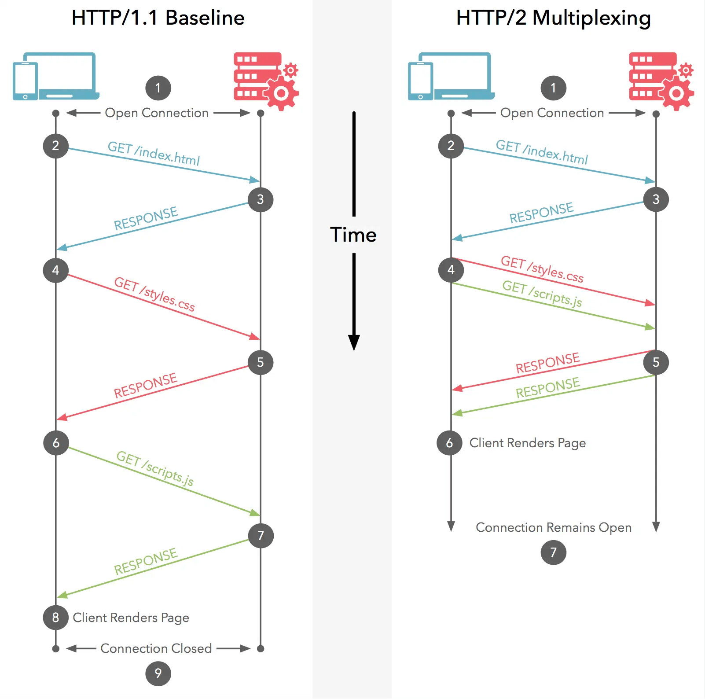

HTTP/1.1协议的请求-响应模型大家都是熟悉的，我们用“HTTP消息”来表示一个请求-响应的过程，那么HTTP/1.1中的消息是“管道串形化”的：只有等一个消息完成之后，才能进行下一条消息；而HTTP/2中多个消息交织在了一起，这无疑提高了“通信”的效率。这就是多路复用：在一个HTTP的连接上，多路“HTTP消息”同时工作。

## 为什么 `HTTP/1.1` 不能实现“多路复用”？

简单回答就是：`HTTP/2` 是基于二进制“帧”的协议，HTTP/1.1是基于“文本分割”解析的协议。

`HTTP/1.1` 发送请求消息的文本格式：以换行符分割每一条 `key:value` 的内容，解析这种数据用不着什么高科技，相反的，解析这种数据往往速度慢且容易出错。“服务端”需要不断的读入字节，直到遇到分隔符（这里指换行符，代码中可能使用/n或者/r/n表示），这种解析方式是可行的，并且 `HTTP/1.1` 已经被广泛使用了二十多年，这事已经做过无数次了，问题一直都是存在的：

* 一次只能处理一个请求或响应，因为这种以分隔符分割消息的数据，在完成之前不能停止解析。
* 解析这种数据无法预知需要多少内存，这会带给“服务端”很大的压力，因为它不知道要把一行要解析的内容读到多大的“缓冲区”中，在保证解析效率和速度的前提下：内存该如何分配？

## HTTP/2帧结构设计和多路复用实现

前边提到：HTTP/2设计是基于“二进制帧”进行设计的，这种设计无疑是一种“高超的艺术”，因为它实现了一个目的：一切可预知，一切可控。

帧是一个数据单元，实现了对消息的封装。下面是HTTP/2的帧结构：

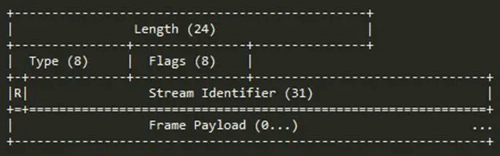

帧的字节中保存了不同的信息，前9个字节对于每个帧都是一致的，“服务器”解析HTTP/2的数据帧时只需要解析这些字节，就能准确的知道整个帧期望多少字节数来进行处理信息。

如果使用HTTP/1.1的话，你需要发送完上一个请求，才能发送下一个；由于HTTP/2是分帧的，请求和响应可以交错甚至可以复用。
为了能够发送不同的“数据信息”，通过帧数据传递不同的内容，HTTP/2中定义了10种不同类型的帧。

有了以上对HTTP/2帧的了解，我们就可以解释多路复用是怎样实现的了，不过在这之前我们先来了解“流”的概念：HTTP/2连接上独立的、双向的帧序列交换。流ID（帧首部的6-9字节）用来标识帧所属的流

下面两张图分别表示了HTTP/2协议上POST请求数据流“复用”的过程，很容易看的明白：

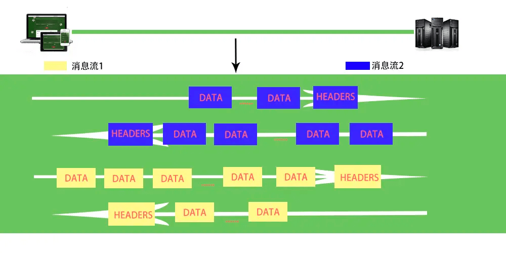

> 本答案由“前端面试题宝典”收集整理，PC端访问请前往： https://fe.ecool.fun/ 


**要点**：
HTTP/2是一个二进制协议，通过“帧”的结构设计改进了HTTP/1.1的许多问题。多路复用是HTTP/2的核心特性之一，它允许在一个HTTP连接上同时处理多个HTTP消息，从而提高了通信效率。

在HTTP/1.1中，请求和响应是按照顺序处理的，一次只能处理一个请求或响应。这是因为HTTP/1.1是基于文本分割解析的协议，需要等待一个消息完成才能处理下一个。这种处理方式限制了效率，因为服务端需要不断读取字节直到遇到分隔符，而且无法预知需要多少内存来处理这些数据。

HTTP/2使用二进制帧来封装消息，每个帧都有固定的长度，使得服务器可以预知每个帧的大小，从而更有效地处理数据。HTTP/2定义了10种不同类型的帧，包括设置帧、数据帧、优先帧等，用于在连接上传输不同类型的信息。

在HTTP/2中，每个连接上的独立、双向帧序列称为“流”。流ID用于标识帧所属的流，这样客户端和服务端就可以同时发送和接收多个流，实现多路复用。

**总的来说**，HTTP/2的多路复用特性通过二进制帧和流的概念，使得客户端和服务端可以在一个连接上同时处理多个请求和响应，从而提高了网络性能和效率。


---
### 71. 从存储位置看，浏览器缓存分为哪几种？

**难度**：★★★☆☆ | **题型**：QA | **分类**：全部 / 计算机网络

**题目**：


**参考答案**：
从存储位置来看，浏览器缓存一共分为四种，并且各自有优先级，当依次查找缓存且都没有命中的时候，才会去请求网络。

* Service Worker
* Memory Cache
* Disk Cache
* Push Cache

## Service Worker

Service Worker 是运行在浏览器背后的独立线程，一般可以用来实现缓存功能。使用 Service Worker的话，传输协议必须为 HTTPS。因为 Service Worker 中涉及到请求拦截，所以必须使用 HTTPS 协议来保障安全。Service Worker 的缓存与浏览器其他内建的缓存机制不同，它可以让我们自由控制缓存哪些文件、如何匹配缓存、如何读取缓存，并且缓存是持续性的。

Service Worker 实现缓存功能一般分为三个步骤：

* 首先需要先注册 Service Worker
* 然后监听到 install 事件以后就可以缓存需要的文件
* 那么在下次用户访问的时候就可以通过拦截请求的方式查询是否存在缓存，存在缓存的话就可以直接读取缓存文件，否则就去请求数据。
* 当 Service Worker 没有命中缓存的时候，我们需要去调用 fetch 函数获取数据。也就是说，如果我们没有在 Service Worker 命中缓存的话，会根据缓存查找优先级去查找数据。但是不管我们是从 Memory Cache 中还是从网络请求中获取的数据，浏览器都会显示我们是从 Service Worker 中获取的内容。

## Memory Cache

Memory Cache 也就是内存中的缓存，主要包含的是当前中页面中已经抓取到的资源,例如页面上已经下载的样式、脚本、图片等。读取内存中的数据肯定比磁盘快,内存缓存虽然读取高效，可是缓存持续性很短，会随着进程的释放而释放。 一旦我们关闭 Tab 页面，内存中的缓存也就被释放了。

内存缓存在缓存资源时并不关心返回资源的HTTP缓存头Cache-Control是什么值，同时资源的匹配也并非仅仅是对URL做匹配，还可能会对Content-Type，CORS等其他特征做校验。

## Disk Cache

Disk Cache 也就是存储在硬盘中的缓存，读取速度慢点，但是什么都能存储到磁盘中，比之 Memory Cache 胜在容量和存储时效性上。它会根据 HTTP Herder 中的字段判断哪些资源需要缓存，哪些资源可以不请求直接使用，哪些资源已经过期需要重新请求。并且即使在跨站点的情况下，相同地址的资源一旦被硬盘缓存下来，就不会再次去请求数据。绝大部分的缓存都来自 Disk Cache。

## Push Cache

Push Cache（推送缓存）是 HTTP/2 中的内容，当以上三种缓存都没有命中时，它才会被使用。它只在会话（Session）中存在，一旦会话结束就被释放，并且缓存时间也很短暂，在Chrome浏览器中只有5分钟左右，同时它也并非严格执行HTTP头中的缓存指令。他有如下的一些特性：

* 所有的资源都能被推送，并且能够被缓存,但是 Edge 和 Safari 浏览器支持相对比较差。
* Push Cache 中的缓存只能被使用一次
* 可以给其他域名推送资源
* 浏览器可以拒绝接受已经存在的资源推送
* 一旦连接被关闭，Push Cache 就被释放
* 可以推送 no-cache 和 no-store 的资源
* 多个页面可以使用同一个HTTP/2的连接，也就可以使用同一个Push Cache。这主要还是依赖浏览器的实现而定，出于对性能的考虑， 有的浏览器会对相同域名但不同的tab标签使用同一个HTTP连接。

> 本答案由“前端面试题宝典”收集整理，PC端访问请前往： https://fe.ecool.fun/ 

**要点**：
浏览器缓存分为四种类型，各有不同的存储位置和优先级：

1. **Service Worker**：独立于浏览器线程运行的程序，支持HTTPS协议，可自定义缓存策略，缓存持续存在。缓存流程包括注册Service Worker、监听install事件进行缓存、拦截请求查询缓存，未命中则通过fetch获取数据。
2. **Memory Cache**：存储在内存中的缓存，包含页面已抓取的资源。读取速度快，但持续时间短，页面关闭后缓存释放。不依赖HTTP缓存头，匹配资源时考虑URL和Content-Type等因素。
3. **Disk Cache**：存储在硬盘上的缓存，包含大多数资源的缓存。读取速度慢，但存储容量大，持续时间长。根据HTTP头中的Cache-Control等字段判断缓存策略。
4. **Push Cache**：HTTP/2中的内容，当其他缓存未命中时使用。存在于会话中，会话结束即释放，缓存时间短。支持所有资源缓存，但仅能使用一次。可以跨域推送资源，浏览器可拒绝重复资源推送。

浏览器首先检查Service Worker缓存，然后是Memory Cache，接着是Disk Cache，最后是Push Cache。如果所有缓存均未命中，浏览器将请求网络资源。


---
### 88. options请求方法及使用场景

**难度**：★★☆☆☆ | **题型**：QA | **分类**：全部 / 计算机网络

**题目**：


**参考答案**：
<p style="text-align:left;text-indent:2em;">OPTIONS是除了GET和POST之外的其中一种 HTTP请求方法。</p><p style="text-align:left;text-indent:2em;">OPTIONS方法是用于请求获得由<code>Request-URI</code>标识的资源在请求/响应的通信过程中可以使用的功能选项。通过这个方法，客户端可以<strong>在采取具体资源请求之前，决定对该资源采取何种必要措施，或者了解服务器的性能</strong>。该请求方法的响应不能缓存。</p><p style="text-align:left;text-indent:2em;">OPTIONS请求方法的<strong>主要用途</strong>有两个：</p><ul><li>获取服务器支持的所有HTTP请求方法；</li><li>用来检查访问权限。例如：JS 的 XMLHttpRequest对象进行 CORS 跨域资源共享时，对于复杂请求，就是使用 OPTIONS 方法发送嗅探请求，以判断是否有对指定资源的访问权限。</li></ul><p></p>


---
### 92. 请求 Header 中的 Content-Type ，有哪些常见的值?

**难度**：★★☆☆☆ | **题型**：QA | **分类**：全部 / 计算机网络

**题目**：


**参考答案**：
请求头中的 `Content-Type` 用于指明请求体中数据的格式，以下是常见的 `Content-Type` 值：

1. **application/json**
   - **用途**：传输 JSON 格式的数据，是前后端交互的常见选择。
   - **示例**：`{ "key": "value" }`

2. **application/x-www-form-urlencoded**
   - **用途**：表单数据的默认格式，将数据以键值对的形式传递，通常在简单表单提交中使用。
   - **格式**：`key1=value1&key2=value2`

3. **multipart/form-data**
   - **用途**：上传文件时常用的格式，允许在一个请求中包含文本字段和文件字段。
   - **格式**：数据被分段发送，每段包含字段信息，适合文件和表单混合数据的提交。

4. **text/plain**
   - **用途**：发送未经编码的纯文本内容，适用于简单的文本数据传输。
   - **示例**：`plain text`

5. **application/xml**
   - **用途**：用于传输 XML 格式的数据，通常用于某些旧系统或特定接口。
   - **示例**：`<note><to>User</to></note>`

6. **application/octet-stream**
   - **用途**：用于传输任意的二进制数据，常用于文件下载或上传，表示未知的文件类型。
   - **特点**：数据以字节流的形式传递，适合音视频、图片等多媒体数据。

7. **application/javascript**
   - **用途**：用于传输 JavaScript 代码或脚本内容。
   - **场景**：在接口返回的响应头中更常见，适合动态生成和执行的脚本数据。

8. **text/html**
   - **用途**：传输 HTML 文档，适合网页内容的传输。
   - **特点**：常用于返回页面内容，浏览器会将其识别为 HTML 并渲染。

9. **image/png**、**image/jpeg**、**image/gif**
   - **用途**：传输图像文件，`Content-Type` 中会包含图像的具体格式。
   - **场景**：用于直接访问图片 URL 或上传图像。

**要点**：
常见的 `Content-Type` 包括 `application/json`、`application/x-www-form-urlencoded`、`multipart/form-data`、`text/plain`、`application/xml` 等，选择的值应根据数据的格式和应用场景决定，确保客户端和服务端正确解析数据。

---
### 100. TCP/IP 是如何保证数据包传输有序可靠的？


**难度**：★★★★☆ | **题型**：QA | **分类**：全部 / 计算机网络

**题目**：


**参考答案**：
TCP/IP 协议栈中的 TCP 协议提供了保证数据包传输有序和可靠的功能。以下是 TCP 如何实现这一目标的详细机制：

### **1. 数据包传输有序**

TCP 确保数据包的顺序是通过以下机制实现的：

1. **序列号（Sequence Number）**：
   - 每个 TCP 数据包（即 TCP 段）都有一个序列号，用于标识数据流中的位置。发送方会为每个数据包分配一个唯一的序列号。
   - 接收方根据序列号重新排序接收到的数据包，确保数据的正确顺序。

2. **确认应答（Acknowledgments）**：
   - 接收方在接收到数据包后，会发送一个确认应答（ACK）回到发送方，表明数据包已成功接收，并指明期望接收的下一个数据包的序列号。
   - 发送方通过这些确认应答知道哪些数据包已被接收，哪些数据包可能需要重新发送。

### **2. 数据包传输可靠**

TCP 通过以下机制实现数据传输的可靠性：

1. **重传机制（Retransmission）**：
   - 如果发送方在一定时间内未收到接收方的确认应答（ACK），发送方会重发数据包。这种情况可能发生在网络拥堵或数据包丢失时。

2. **流量控制（Flow Control）**：
   - TCP 使用流量控制机制来防止发送方发送过多的数据，导致接收方缓冲区溢出。接收方会告知发送方其接收能力（即接收窗口的大小），发送方依据此窗口大小调整数据发送速率。

3. **拥塞控制（Congestion Control）**：
   - TCP 通过拥塞控制机制来避免网络拥堵。它使用多种算法（如慢启动、拥塞避免、快速重传和快速恢复）来动态调整数据发送速率。

4. **数据包完整性检查（Checksum）**：
   - 每个 TCP 数据包都包含一个校验和字段，用于检测数据在传输过程中是否发生了损坏。接收方会计算数据包的校验和，并与数据包中的校验和进行比较。如果校验和不匹配，数据包会被丢弃，并请求重传。

### **3. 数据流控制**

1. **滑动窗口（Sliding Window）**：
   - TCP 使用滑动窗口协议来控制数据的流动。窗口大小是接收方告知发送方的缓冲区大小，控制了发送方可以发送的数据量。
   - 接收方通过调整窗口大小，动态调整数据的接收能力，从而避免数据丢失或缓冲区溢出。

### **4. 排序和合并**

1. **数据缓存和排序**：
   - 接收方在接收到数据包后，会将数据包存储在缓存中，并根据序列号将数据包按正确顺序重新组装成完整的数据流。

2. **数据合并**：
   - 接收方将接收到的分段数据包按照序列号进行合并，确保应用层接收到的是完整的、按正确顺序的数据。


**要点**：
TCP 通过序列号、确认应答、重传机制、流量控制、拥塞控制、数据包完整性检查等机制，确保数据在网络传输中的顺序和可靠性。这些机制共同工作，保证了数据传输的稳定性和正确性。

---
### 109. URI、URL、URN分别是什么？

**难度**：★☆☆☆☆ | **题型**：QA | **分类**：全部 / 计算机网络

**题目**：


**参考答案**：
URL代表资源的路径地址，而URI代表资源的名称。

* URI: Universal Resource Identifier 统一资源标志符

* URL: Universal Resource Locator 统一资源定位符
URL类似于住址，它告诉你一种寻找目标的方式(在这个例子中，是通过街道地址找到一个人)。要知道，上述定义同时也是一个URI。

* URN: Universal Resource Name 统一资源名称
我们可以把一个人的名字看作是URN;因此可以用URN来唯一标识一个实体

URL是URI的一个子集，告诉我们访问网络位置的方式

URN是URI的子集，包括名字(给定的命名空间内)，但是不包括访问方式

URN 和 URL 都是URI的子集。


**要点**：
在网络通信中，URL（统一资源定位符）、URI（统一资源标志符）和URN（统一资源名称）是描述资源位置和身份的术语，它们之间有明确的区别和联系：

1. **URI**：统一资源标志符（Universal Resource Identifier）是一个广义的概念，它用于唯一标识互联网上的资源。URI可以是URL、URN或其他形式，如mailto:或news:。
2. **URL**：统一资源定位符（Universal Resource Locator）是URI的一个子集，它提供了一种具体的访问网络资源的方法，包括协议（如http://）、域名或IP地址以及路径。URL类似于现实世界的住址，它告诉你在互联网上如何找到特定的资源。
3. **URN**：统一资源名称（Universal Resource Name）也是URI的一个子集，它标识资源的名字，但不提供访问资源的方式。URN通常用于命名空间中的名称，如电子邮件地址（mailto:）或文件系统路径（file:///）。


---
### 115. TLS1.2 握手的过程是怎样的？

**难度**：★★★★☆ | **题型**：QA | **分类**：全部 / 计算机网络

**题目**：


**参考答案**：
HTTP 是明文传输的协议，传输保文对外完全透明，非常不安全，那如何进一步保证安全性呢？

由此产生了 `HTTPS`，其实它并不是一个新的协议，而是在 HTTP 下面增加了一层 SSL/TLS 协议，简单的讲，`HTTPS = HTTP + SSL/TLS`。

那什么是 SSL/TLS 呢？

SSL 即安全套接层（Secure Sockets Layer），在 OSI 七层模型中处于会话层(第 5 层)。之前 SSL 出过三个大版本，当它发展到第三个大版本的时候才被标准化，成为 TLS（传输层安全，Transport Layer Security），并被当做 TLS1.0 的版本，准确地说，`TLS1.0 = SSL3.1`。

现在主流的版本是 TLS/1.2, 之前的 TLS1.0、TLS1.1 都被认为是不安全的，在不久的将来会被完全淘汰。

### 传统 RSA 握手

先来说说传统的 TLS 握手，也是大家在网上经常看到的。之所以称它为 RSA 版本，是因为它在加解密`pre_random`的时候采用的是 RSA 算法。

### TLS 1.2 握手过程

现在我们来讲讲主流的 TLS 1.2 版本所采用的方式。

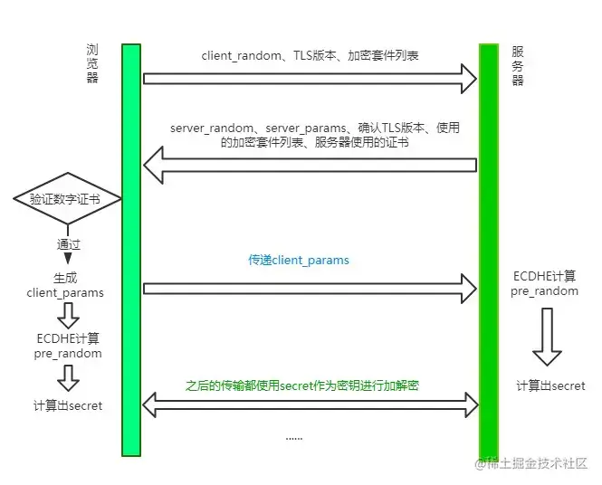

刚开始你可能会比较懵，先别着急，过一遍下面的流程再来看会豁然开朗。

#### step 1: Client Hello

首先，浏览器发送 client_random、TLS版本、加密套件列表。

client_random 是什么？用来最终 secret 的一个参数。

加密套件列表是什么？我举个例子，加密套件列表一般长这样:

```
TLS_ECDHE_WITH_AES_128_GCM_SHA256
```

意思是`TLS`握手过程中，使用`ECDHE`算法生成`pre_random`，128位的`AES`算法进行对称加密，在对称加密的过程中使用主流的`GCM`分组模式，因为对称加密中很重要的一个问题就是如何分组。最后一个是哈希摘要算法，采用`SHA256`算法。

其中值得解释一下的是这个哈希摘要算法，试想一个这样的场景，服务端现在给客户端发消息来了，客户端并不知道此时的消息到底是服务端发的，还是中间人伪造的消息呢？现在引入这个哈希摘要算法，将服务端的证书信息通过`这个算法`生成一个摘要(可以理解为`比较短的字符串`)，用来`标识`这个服务端的身份，用私钥加密后把`加密后的标识`和`自己的公钥`传给客户端。客户端拿到`这个公钥`来解密，生成另外一份摘要。两个摘要进行对比，如果相同则能确认服务端的身份。这也就是所谓`数字签名`的原理。其中除了哈希算法，最重要的过程是`私钥加密，公钥解密`。

#### step 2: Server Hello

可以看到服务器一口气给客户端回复了非常多的内容。

`server_random`也是最后生成`secret`的一个参数, 同时确认 TLS 版本、需要使用的加密套件和自己的证书，这都不难理解。那剩下的`server_params`是干嘛的呢？

我们先埋个伏笔，现在你只需要知道，`server_random`到达了客户端。

#### step 3: Client 验证证书，生成secret

客户端验证服务端传来的`证书`和`签名`是否通过，如果验证通过，则传递`client_params`这个参数给服务器。

接着客户端通过`ECDHE`算法计算出`pre_random`，其中传入两个参数:`server_params`和`client_params`。现在你应该清楚这个两个参数的作用了吧，由于`ECDHE`基于`椭圆曲线离散对数`，这两个参数也称作`椭圆曲线的公钥`。

客户端现在拥有了`client_random`、`server_random`和`pre_random`，接下来将这三个数通过一个伪随机数函数来计算出最终的`secret`。

#### step4: Server 生成 secret

刚刚客户端不是传了`client_params`过来了吗？

现在服务端开始用`ECDHE`算法生成`pre_random`，接着用和客户端同样的伪随机数函数生成最后的`secret`。

#### 注意事项

TLS的过程基本上讲完了，但还有两点需要注意。

第一、实际上 TLS 握手是一个`双向认证`的过程，从 step1 中可以看到，客户端有能力验证服务器的身份，那服务器能不能验证客户端的身份呢？

当然是可以的。具体来说，在 `step3`中，客户端传送`client_params`，实际上给服务器传一个验证消息，让服务器将相同的验证流程(哈希摘要 + 私钥加密 + 公钥解密)走一遍，确认客户端的身份。

第二、当客户端生成`secret`后，会给服务端发送一个收尾的消息，告诉服务器之后的都用对称加密，对称加密的算法就用第一次约定的。服务器生成完`secret`也会向客户端发送一个收尾的消息，告诉客户端以后就直接用对称加密来通信。

这个收尾的消息包括两部分，一部分是`Change Cipher Spec`，意味着后面加密传输了，另一个是`Finished`消息，这个消息是对之前所有发送的数据做的`摘要`，对摘要进行加密，让对方验证一下。

当双方都验证通过之后，握手才正式结束。后面的 HTTP 正式开始传输加密报文。

#### RSA 和 ECDHE 握手过程的区别

* ECDHE 握手，也就是主流的 TLS1.2 握手中，使用`ECDHE`实现`pre_random`的加密解密，没有用到 RSA。

* 使用 ECDHE 还有一个特点，就是客户端发送完收尾消息后可以提前`抢跑`，直接发送 HTTP 报文，节省了一个 RTT，不必等到收尾消息到达服务器，然后等服务器返回收尾消息给自己，直接开始发请求。这也叫`TLS False Start`。


**要点**：
HTTP 是基于文本的明文传输协议，安全性较低，容易受到中间人攻击。为了解决这个问题，引入了 HTTPS，它是 HTTP 协议与 SSL/TLS 协议的结合，通过 SSL/TLS 协议来加密 HTTP 通信，从而提高安全性。

SSL/TLS 是安全套接层和传输层安全协议的缩写，用于在网络通信中提供加密和身份验证服务。SSL 协议发展到第三个大版本时，被标准化为 TLS 1.0，而 TLS 1.2 是目前主流的版本。

TLS 1.2 握手过程主要包括以下几个步骤：

1. **Client Hello**：浏览器发送客户端随机数、支持的 TLS 版本和加密套件列表。
2. **Server Hello**：服务器发送服务端随机数、选择的 TLS 版本、加密套件和证书。
3. **Client 验证证书，生成 secret**：客户端验证服务端证书和签名，生成 pre_random。
4. **Server 生成 secret**：服务器根据客户端的 pre_random 生成 secret。
5. **Change Cipher Spec 和 Finished**：双方交换收尾消息，确认后续通信使用对称加密。

在这个过程中，客户端和服务器使用 RSA 算法进行非对称加密，生成 pre_random，然后使用这个 pre_random 和服务端的公钥来计算最终的 secret。这个 secret 用于后续的对称加密通信。

TLS 1.2 握手过程的特点包括双向认证、对称加密的提前使用（TLS False Start）等。这些机制共同作用，提高了 HTTPS 的安全性。


---
### 123. DNS 预解析是什么？怎么实现？

**难度**：★★☆☆☆ | **题型**：QA | **分类**：全部 / HTML / 计算机网络 / 性能优化

**题目**：


**参考答案**：
## DNS优化

在介绍`dns-prefetch`之前，先要提下当前对于DNS优化主流方法。   

一般来说，一次DNS解析需要耗费 20-120ms，所以为了优化DNS，我们可以考虑两个方向：
1. 减少DNS请求次数
2. 缩短DNS解析时间`dns-prefetch`

## 什么是dns-prefetch？
`dns-prefetch`(**DNS预获取**)是前端网络性能优化的一种措施。它根据浏览器定义的规则，**提前解析**之后可能会用到的域名，使解析结果**缓存到系统缓存**中，缩短DNS解析时间，进而提高网站的访问速度。

## 为什么要用dns-prefetch？
每当浏览器从（第三方）服务器发送一次请求时，都要先通过**DNS解析**将该跨域域名解析为 IP地址，然后浏览器才能发出请求。  

如果某一时间内，有多个请求都发送给同一个服务器，那么DNS解析会多次并且重复触发。这样会导致整体的网页加载有延迟的情况。  

我们知道，虽然DNS解析占用不了多大带宽，但是它会产生很高的延迟，尤其是对于移动网络会更为明显。  

因此，为了减少DNS解析产生的延迟，我们可以通过`dns-prefetch`预解析技术有效地缩短DNS解析时间。

```
<link rel="dns-prefetch" href="https://baidu.com/"> 
```
## dns-prefetch背后原理
当浏览器访问一个域名的时候，需要解析一次DNS，获得对应域名的ip地址。
在解析过程中，按照:
- 浏览器缓存
- 系统缓存 
- 路由器缓存 
- ISP(运营商)DNS缓存 
- 根域名服务器 
- 顶级域名服务器 
- 主域名服务器

的顺序逐步读取缓存，直到拿到IP地址。

`dns-prefetch`就是在**将解析后的IP缓存在系统中**。  

这样，`dns-prefetch`就有效地缩短了DNS解析时间。因为，在本地操作系统做了DNS缓存，使得DNS在解析的过程中，提前在系统缓存中找到了对应IP。   

这样一来， 后续的解析步骤就不用执行了，进而也就缩短了DNS解析时间。

假如浏览器**首次将一个域名解析为IP地址**，并**缓存至操作系统**，那么下一次DNS解析时间可以低至**0-1ms**。   

倘若结果不缓存在系统，那么就需要读取**路由器的缓存**，进而后续的解析时间最小也要约**15ms**。  

如果路由器缓存也不存在，则需要读取**ISP（运营商）DNS缓存**，一般像`taobao.com`、`baidu.com`这些常见的域名，读取ISP（运营商）DNS缓存需要的时间在**80-120ms**，如果是不常见的域名，平均需要**200-300ms**。  

一般来说，大部分的网站到运营商这块都能找到IP。  

那也就是说，`dns-prefetch`可以给DNS解析过程带来15-300ms的提升，尤其是一些大量引用很多其他域名资源的网站，提升效果就更加明显了

## 浏览器DNS缓存与dns-prefetch

现代浏览器为了优化DNS解析，也设有了浏览器DNS缓存。  

每当在首次DNS解析后会对其IP进行缓存。至于缓存时长，每种浏览器都不一样，比如Chrome的过期时间是1分钟，在这个期限内不会重新请求DNS。
> Tip:  
> 每当Chrome浏览器启动的时候，就会自动的快速解析浏览器最近一次启动时记录的前10个域名。所以经常访问的网址就不存在DNS解析的延迟，进而打开速度更快。

而`dns-prefetch` 相当于在浏览器缓存之后，在本地操作系统中做了DNS缓存，个人理解，为的是给浏览器缓存做保障，尽量让DNS解析出本地，以此来做了又一层DNS解析优化。  

一般来说，DNS在系统的缓存时间是大于浏览器的。

### 浏览器与系统DNS缓存时间

> TTL(Time-To-Live)，就是一条域名解析记录在DNS服务器中的存留时间  
>
- **浏览器DNS缓存的时间跟DNS服务器返回的TTL值无关**, 它的缓存时间取决于浏览器自身设置。  

- **系统缓存会参考DNS服务器响应的TTL值，但是不完全等于TTL值**。

国内和国际上很多平台的TTL值都是以秒为单位的，很多的默认值都是3600，也就是默认缓存1小时。

## `dns-prefetch`缺点

`dns-prefetch`最大的缺点就是使用它太多。  

过多的预获取会导致过量的DNS解析，对网络是一种负担。


## 最佳实践

请记住以下三点：

1. `dns-prefetch` 仅对[跨域](https://developer.mozilla.org/zh-CN/docs/Web/HTTP/CORS)域上的 DNS查找有效，因此请避免使用它来指向相同域。这是因为，到浏览器看到提示时，您站点域背后的IP已经被解析。

2. 除了link 还可以通过使用 [HTTP链接字段](https://developer.mozilla.org/zh-CN/docs/Web/HTTP/Headers/Link)将 `dns-prefetch`（以及其他资源提示）指定为 [HTTP标头](https://developer.mozilla.org/zh-CN/docs/Web/HTTP/Headers)：

```
Link: <https://fonts.gstatic.com/>; rel=dns-prefetch
```

3. 考虑将 `dns-prefetch` 与 `preconnect(`预连接`)`提示配对。

由于`dns-prefetch` 仅执行 DNS查找，不像`preconnect` 会建立与服务器的连接。  

如果站点是通过HTTPS服务的，两者的组合会涵盖DNS解析，建立TCP连接以及执行TLS握手。将两者结合起来可提供进一步减少[跨域请求](https://developer.mozilla.org/zh-CN/docs/Web/HTTP/CORS)的感知延迟的机会。如下所示：

```
<link rel="preconnect" href="https://fonts.gstatic.com/" crossorigin>
<link rel="dns-prefetch" href="https://fonts.gstatic.com/">
```

**Note**: 如果页面需要建立与许多第三方域的连接，则将它们预先连接会适得其反。 `preconnect` 提示最好仅用于最关键的连接。对于其他的，只需使用 `<link rel="dns-prefetch">` 即可节省第一步的时间DNS查找。


**要点**：
**作答思路：**

DNS预解析（DNS Prefetching）是一种浏览器行为，它会提前解析将来可能需要访问的域名，以加快页面的加载速度。
实现DNS预解析的方法包括：

1. **使用link标签**：在HTML文档的`<head>`部分添加`<link>`标签，指定`rel="dns-prefetch"`属性，指定要预解析的域名。
2. **使用meta标签**：在HTML文档的`<head>`部分添加`<meta>`标签，指定`http-equiv="x-dns-prefetch-control"`属性为`on`，开启DNS预解析。
3. **使用script标签**：在HTML文档的`<head>`部分添加`<script>`标签，指定`src`属性为`dns-prefetch`的URL，指定要预解析的域名。
通过这些方法，浏览器会在HTML文档解析过程中提前解析指定的域名，当需要访问该域名时，可以直接使用解析好的IP地址，从而加快页面的加载速度。

**考察要点**：

1. **DNS预解析概念**：理解DNS预解析的基本概念和用途。
2. **实现方法**：了解如何通过link标签、meta标签和script标签来实现DNS预解析。


---
### 137. 你知道哪些常见的网络协议？

**难度**：★★☆☆☆ | **题型**：QA | **分类**：全部 / 计算机网络

**题目**：


**参考答案**：
网络协议是指一组规则或标准，用于定义设备之间如何通信和交换数据。

以下是常见的网络协议及其分类：  

## **1. 应用层协议**
应用层协议负责处理特定的网络应用程序，如邮件传输、网页浏览等。  
### **1.1. HTTP/HTTPS**
- **HTTP（Hypertext Transfer Protocol）**  
  用于传输网页数据的协议，是万维网的基础协议。  
  特点：无状态、基于请求-响应。  
- **HTTPS**  
  在 HTTP 的基础上加入了 SSL/TLS 加密，确保数据传输的安全性。

### **1.2. FTP**
- **FTP（File Transfer Protocol）**  
  用于文件上传和下载的协议。支持传输大文件，但安全性较低。

### **1.3. SMTP/POP3/IMAP**
- **SMTP（Simple Mail Transfer Protocol）**  
  用于发送电子邮件。
- **POP3（Post Office Protocol 3）**  
  下载邮件到本地并删除服务器上的邮件。
- **IMAP（Internet Message Access Protocol）**  
  支持邮件的同步，保留服务器上的邮件副本。

### **1.4. WebSocket**
- 用于建立全双工的通信连接，适合实时应用场景，如在线聊天、实时通知等。

---

## **2. 传输层协议**
传输层协议负责为应用层提供端到端的通信服务。

### **2.1. TCP**
- **TCP（Transmission Control Protocol）**  
  面向连接的可靠传输协议，保证数据的完整性和顺序。  
  应用场景：文件传输、网页浏览。

### **2.2. UDP**
- **UDP（User Datagram Protocol）**  
  面向无连接的协议，不保证数据可靠性，适合对时延敏感的应用。  
  应用场景：视频流、在线游戏、语音通话。

---

## **3. 网络层协议**
网络层协议负责数据在不同网络间的路由和转发。

### **3.1. IP**
- **IP（Internet Protocol）**  
  提供设备之间的唯一标识，并实现数据包的路由和传递。  
  常见版本：
  - IPv4：使用 32 位地址（如 192.168.1.1）。
  - IPv6：使用 128 位地址（如 2001:0db8::1），解决 IPv4 地址耗尽问题。

### **3.2. ICMP**
- **ICMP（Internet Control Message Protocol）**  
  用于发送网络诊断信息，如 Ping 和 Traceroute。

### **3.3. ARP/RARP**
- **ARP（Address Resolution Protocol）**  
  通过 IP 地址获取设备的 MAC 地址。
- **RARP（Reverse ARP）**  
  通过 MAC 地址获取设备的 IP 地址。

---

## **4. 数据链路层协议**
数据链路层协议负责在同一网络中传输数据帧。

### **4.1. Ethernet**
- 定义了局域网的物理连接方式和数据帧结构。

### **4.2. PPP**
- **PPP（Point-to-Point Protocol）**  
  用于点对点链路的通信。

---

## **5. 安全协议**
安全协议负责确保数据传输的保密性、完整性和真实性。

### **5.1. SSL/TLS**
- **SSL（Secure Sockets Layer）/TLS（Transport Layer Security）**  
  提供安全的加密通信，广泛用于 HTTPS。

### **5.2. IPSec**
- **IPSec（Internet Protocol Security）**  
  提供网络层的数据加密和认证，用于 VPN 等场景。

### **5.3. Kerberos**
- 网络身份验证协议，基于对称密钥加密。

---

## **6. 网络管理协议**
网络管理协议用于监控和管理网络设备。

### **6.1. SNMP**
- **SNMP（Simple Network Management Protocol）**  
  用于监控网络设备的状态，如路由器和交换机。

### **6.2. Telnet/SSH**
- **Telnet**：不加密的远程登录协议，安全性低。  
- **SSH（Secure Shell）**：提供加密的远程登录服务。

---

## **7. 文件传输与资源共享协议**
这些协议用于文件共享和网络设备间的资源访问。

### **7.1. SMB**
- **SMB（Server Message Block）**  
  用于 Windows 系统中的文件共享。

### **7.2. NFS**
- **NFS（Network File System）**  
  提供分布式文件系统访问。


---
### 165. 协商缓存中，有了 Last-Modified，为什么还会出现 ETag？

**难度**：★★☆☆☆ | **题型**：QA | **分类**：全部 / 计算机网络

**题目**：


**参考答案**：
ETag的出现，主要是为了解决 Last-Modified 无法解决的一些问题：

* 某些服务器不能精确得到文件的最后修改时间， 这样就无法通过最后修改时间来判断文件是否更新了。

* 某些文件的修改非常频繁，在秒以下的时间内进行修改. Last-Modified只能精确到秒。

* 一些文件的最后修改时间改变了，但是内容并未改变。 我们不希望客户端认为这个文件修改了。


---
### 212. 什么是CDN？

**难度**：★☆☆☆☆ | **题型**：QA | **分类**：全部 / 计算机网络

**题目**：


**参考答案**：
CDN（Content Delivery Network，内容分发网络）是一种通过分布在全球的服务器网络来加速内容传输的技术。CDN 的主要目的是将网站或应用的内容缓存到离用户更近的服务器上，从而提高内容加载速度和用户体验。

### **主要特点**

1. **内容缓存**：CDN 会在多个节点（边缘服务器）上缓存网站的静态资源（如图片、CSS、JavaScript 文件等），并在用户请求时从离用户最近的节点提供这些资源。

2. **负载均衡**：CDN 可以将用户的请求分散到多个服务器上，减轻源服务器的负担，提高系统的稳定性和可靠性。

3. **加速访问**：通过就近访问，减少了从用户到源服务器的延迟，提升了加载速度。

4. **提高安全性**：CDN 提供的防护机制（如 DDoS 防护、Web 应用防火墙）可以保护网站免受网络攻击。

5. **动态内容加速**：一些 CDN 服务还支持动态内容加速，通过优化传输路径和协议，提升动态内容的加载速度。

### **工作原理**

1. **内容请求**：用户请求访问网站内容时，DNS 解析会将用户的请求路由到离用户最近的 CDN 节点。

2. **缓存命中**：如果请求的内容在 CDN 节点的缓存中存在，节点直接将缓存的内容返回给用户。

3. **缓存未命中**：如果请求的内容不在缓存中，CDN 节点会从源服务器获取内容，然后将内容返回给用户，并缓存到节点上以备将来使用。

4. **内容更新**：CDN 节点会定期或按需更新缓存的内容，确保用户获取的是最新的资源。

**要点**：
CDN 是一种优化内容分发和提升网站性能的技术，通过将内容分发到离用户更近的服务器上，减少延迟，提升访问速度，并增加网站的可用性和安全性。

---
### 223. TCP链接为什么会采用三次握手，而不是两次或者四次呢？

**难度**：★★☆☆☆ | **题型**：QA | **分类**：全部 / 计算机网络

**题目**：


**参考答案**：
建立连接的过程是利用客户服务器模式，假设主机A为客户端，主机B为服务器端。

采用三次握手是为了防止失效的连接请求报文段突然又传送到主机B，因而产生错误。

失效的连接请求报文段是指：主机A发出的连接请求没有收到主机B的确认，于是经过一段时间后，主机A又重新向主机B发送连接请求，且建立成功，顺序完成数据传输。

考虑这样一种特殊情况，主机A第一次发送的连接请求并没有丢失，而是因为网络节点导致延迟达到主机B，主机B以为是主机A又发起的新连接，于是主机B同意连接，并向主机A发回确认，但是此时主机A根本不会理会，主机B就一直在等待主机A发送数据，导致主机B的资源浪费。

采用两次握手不行，原因就是上面说的失效的连接请求的特殊情况。

而在三次握手中，client和server都有一个发syn和收ack的过程，双方都是发后能收，表明通信则准备工作OK。

为什么不是四次握手呢？ 

因为通信不可能100%可靠，而上面的三次握手已经做好了通信的准备工作，再增加握手，并不能显著提高可靠性，而且也没有必要。

**要点**：
建立TCP连接的过程采用三次握手是为了确保通信双方都准备好进行数据传输，并防止失效的连接请求报文段对网络造成影响。

三次握手的过程如下：

1. **第一次握手**：客户端发送一个SYN（同步序列编号）报文到服务器，并进入SYN_SENT状态，等待服务器确认。
2. **第二次握手**：服务器收到SYN报文，必须确认客户的SYN（即发送一个SYN+ACK报文），同时自己也发送一个SYN报文，即SYN+ACK报文，此时服务器进入SYN_RECV状态。
3. **第三次握手**：客户端收到服务器的SYN+ACK报文后，向服务器发送确认包ACK（ack=y+1），此包发送完毕，客户端和服务器进入ESTABLISHED状态，完成三次握手。

这种三次握手的方式可以有效防止失效的连接请求报文段在网络中滞留，造成资源浪费。如果采用两次握手，可能会出现上述失效的连接请求报文段突然到达服务器的情况，导致服务器错误地认为客户端又发起了一个新的连接请求。

而采用四次握手并不是必须的，因为三次握手已经确保了双方都准备好进行通信，增加握手次数并不能显著提高通信的可靠性，反而可能增加额外的开销。因此，三次握手是建立TCP连接的可靠且高效的方式。


---
### 241. 什么是负载均衡？

**难度**：★★★☆☆ | **题型**：QA | **分类**：全部 / 计算机网络

**题目**：


**参考答案**：
客户端发送的、Nginx反向代理服务器接收到的请求数量，就是我们说的负载量。请求数量按照一定的规则进行分发到不同的服务器处理的规则，就是一种均衡规则。将服务器接收到的请求按照规则分发的过程，称为负载均衡。

负载均衡在实际项目操作过程中，有硬件负载均衡和软件负载均衡两种。

* 硬件负载均衡也称为硬负载，如F5负载均衡，相对造价昂贵成本较高，但是数据的稳定性安全性等等有非常好的保障，如中国移动、中国联通这样的公司才会选择硬负载进行操作；
* 更多的公司考虑到成本原因，会选择使用软件负载均衡，软件负载均衡是利用现有的技术结合主机硬件实现的一种消息队列分发机制。

**要点**：
负载均衡是指将客户端发送的请求数量按照一定的规则分发到不同的服务器进行处理的过程。这个过程涉及到请求的均衡规则，即如何将请求合理地分配给后端服务器。

在实际项目操作中，负载均衡可以分为硬件负载均衡和软件负载均衡两种类型：

1. **硬件负载均衡（硬负载）**：
   - **例子**：如F5负载均衡器。
   - **特点**：造价昂贵，但具有较高的数据稳定性、安全性和可靠性。
   - **适用场景**：适合对稳定性、安全性要求极高的公司，如中国移动、中国联通等大型企业。
2. **软件负载均衡**：
   - **实现方式**：利用现有技术结合主机硬件实现的消息队列分发机制。
   - **特点**：成本相对较低，适合预算有限的公司。
   - **适用场景**：广泛应用于各种规模的网站和应用，以提高系统处理能力和可靠性。


---
### 249. https 的证书验证过程是什么样的

**难度**：★★☆☆☆ | **题型**：QA | **分类**：全部 / 计算机网络

**题目**：


**参考答案**：
HTTPS 的证书验证过程是确保用户与服务器之间的安全通信的关键步骤。

以下是证书验证过程的详细步骤：

### **1. 客户端发起连接**

1. **客户端请求**：
   - 客户端（如浏览器）发起一个 HTTPS 请求，连接到服务器。

### **2. 服务器响应**

2. **服务器发送证书**：
   - 服务器将 SSL/TLS 证书发送给客户端。证书包含了服务器的公钥和由受信任的证书颁发机构（CA）签名的信息。

### **3. 客户端验证证书**

3. **验证证书链**：
   - **检查证书有效性**：
     - 客户端检查证书是否在有效期内。
   - **验证证书签名**：
     - 客户端使用 CA 的公钥验证证书的签名，以确保证书未被篡改。
   - **检查证书颁发机构**：
     - 客户端检查证书是否由受信任的 CA 颁发。浏览器内置了受信任的 CA 列表，用于验证证书的有效性。

4. **验证证书用途**：
   - **检查证书用途**：
     - 客户端检查证书是否适用于其目的（例如服务器身份验证）。

5. **验证域名**：
   - **域名匹配**：
     - 客户端检查证书中的域名是否与请求的域名匹配。证书中的“主体”字段（Common Name）或“主题备用名称”字段（Subject Alternative Name）应与请求的 URL 匹配。

### **4. 生成和交换密钥**

6. **密钥交换**：
   - **客户端生成密钥**：
     - 客户端生成一个对称密钥（Session Key），用于加密会话数据。
   - **加密密钥**：
     - 客户端用服务器的公钥加密生成的对称密钥，并将其发送到服务器。
   - **服务器解密密钥**：
     - 服务器用私钥解密客户端发送的对称密钥。

### **5. 加密通信**

7. **建立安全通道**：
   - **数据加密**：
     - 服务器和客户端使用对称密钥加密和解密数据，确保通信内容的机密性和完整性。
   - **数据传输**：
     - 所有后续的通信数据都通过加密的通道传输。

### **6. 完成握手**

8. **握手完成**：
   - 一旦安全通道建立，客户端和服务器就可以安全地交换数据，握手过程结束。

**要点**：
HTTPS 证书验证过程涉及服务器提供证书、客户端验证证书的有效性和可信性、生成和交换密钥以建立加密通道。这确保了数据在传输过程中不会被窃取或篡改，并保证了通信双方的身份。

---
### 254. HTTP Header 中有哪些信息？

**难度**：★★☆☆☆ | **题型**：QA | **分类**：全部 / 计算机网络

**题目**：


**参考答案**：
常见的 HTTP 头部信息包括以下几类：

### 请求头（Request Headers）
1. **Accept**：指定客户端能够接受的内容类型。例如：`Accept: application/json, text/html`.
2. **Accept-Encoding**：指定客户端能够接受的编码格式。例如：`Accept-Encoding: gzip, deflate`.
3. **Accept-Language**：指定客户端能够接受的语言。例如：`Accept-Language: en-US, en;q=0.9`.
4. **Authorization**：用于身份验证的头部。例如：`Authorization: Bearer <token>`.
5. **Cookie**：发送给服务器的 cookie 信息。例如：`Cookie: sessionId=abc123`.
6. **Host**：指定请求的目标主机和端口。例如：`Host: www.example.com`.
7. **User-Agent**：标识发出请求的用户代理（通常是浏览器）。例如：`User-Agent: Mozilla/5.0 (Windows NT 10.0; Win64; x64) AppleWebKit/537.36 (KHTML, like Gecko) Chrome/91.0.4472.124 Safari/537.36`.

### 响应头（Response Headers）
1. **Content-Type**：响应体的内容类型。例如：`Content-Type: text/html; charset=UTF-8`.
2. **Content-Length**：响应体的长度（字节数）。例如：`Content-Length: 1234`.
3. **Date**：响应被发送的日期和时间。例如：`Date: Mon, 16 Aug 2024 12:00:00 GMT`.
4. **Server**：服务器的软件信息。例如：`Server: Apache/2.4.41 (Ubuntu)`.
5. **Set-Cookie**：用于在客户端设置 cookie。例如：`Set-Cookie: sessionId=abc123; Path=/; HttpOnly`.
6. **Cache-Control**：指定缓存策略。例如：`Cache-Control: no-cache, no-store, must-revalidate`.

### 通用头（General Headers）
1. **Connection**：指定是否保持连接或关闭连接。例如：`Connection: keep-alive`.
2. **Upgrade**：用于升级协议。例如：`Upgrade: websocket`.
3. **Via**：标识请求/响应经过的中间代理。例如：`Via: 1.1 example.com`.

### 其他头部信息
1. **Location**：在重定向响应中，指定重定向的目标 URL。例如：`Location: https://www.example.com/new-page`.
2. **ETag**：资源的标识符，用于缓存控制。例如：`ETag: "12345"`.
3. **If-Modified-Since**：请求中指定的时间，服务器只在资源在此时间之后被修改时才返回资源。例如：`If-Modified-Since: Mon, 16 Aug 2024 10:00:00 GMT`.

**要点**：
HTTP 头部信息分为请求头、响应头、通用头和其他头部信息，它们用于传递客户端和服务器之间的各种元数据和控制指令。常见的头部信息包括内容类型、缓存控制、身份验证和 cookie 等。

---
### 292. JSONP 是如何实现跨域的?

**难度**：★★☆☆☆ | **题型**：QA | **分类**：全部 / 计算机网络

**题目**：


**参考答案**：
## JSONP

JSONP 的实现原理是通过添加一个 script 标签，指定 src 属性为跨域请求的 URL，而这个 URL 返回的不是 JSON 数据，而是一段可执行的 JavaScript 代码，这段代码会调用一个指定的函数，并且将 JSON 数据作为参数传入函数中。

例如，假设我们从 `http://example.com` 域名下请求数据，我们可以通过在 `http://example.com` 中添加如下代码实现 JSONP 请求：

```js
function handleData(data) {
  // 处理获取到的数据
}

const script = document.createElement('script');
script.src = 'http://example.org/api/data?callback=handleData';
document.head.appendChild(script);
```

其中，我们指定了一个名为 `handleData` 的回调函数，并将这个函数名作为参数传递给了跨域请求的 URL 中的 callback 参数。服务器端返回的数据将会被包装在这个回调函数中，例如：
```js
handleData({"name": "John", "age": 30});
```

在这个例子中，我们可以在 handleData 函数中处理获取到的数据。需要注意的是，在使用 JSONP 时，**需要保证服务器端返回的数据是一个可执行的 JavaScript 代码，并且必须使用指定的回调函数名来包装数据，否则无法正确处理数据。**

### 如何获取 jsonp 的相应参数

获取 JSONP 响应结果的方法有两种，**一种是通过回调函数参数获取**，**另一种是通过 script 标签加载完成后解析全局变量获取**。

假设服务器返回以下 JSONP 响应：

```js
callback({"name": "Alice", "age": 20});
```

其中 callback 是客户端定义的回调函数名，用于指定返回数据的处理方式。

我们可以使用以下两种方式获取响应结果：

**1. 通过回调函数参数获取**
在客户端定义一个全局函数作为回调函数，服务器返回的数据会作为回调函数的参数传入，这个参数可以在回调函数中处理。
```js
function handleResponse(data) {
  console.log(data.name); // Alice
  console.log(data.age); // 20
}

// 创建 script 标签
const script = document.createElement('script');
script.src = 'http://example.com/api?callback=handleResponse';

// 插入到文档中开始加载数据
document.body.appendChild(script);
```

**2. 通过全局变量获取**
在客户端定义一个全局函数作为回调函数，服务器返回的数据会作为一个全局变量赋值给该函数所在的对象，我们可以在 script 标签加载完成后解析全局变量获取响应结果。
```js
function handleResponse() {
  console.log(myData.name); // Alice
  console.log(myData.age); // 20
}

// 创建 script 标签
const script = document.createElement('script');
script.src = 'http://example.com/api?callback=handleResponse';

// 插入到文档中开始加载数据
document.body.appendChild(script);

// script 标签加载完成后解析全局变量
window.myData = {};
script.onload = () => {
  delete window.myData; // 删除全局变量
};
```

注意，使用 JSONP 时要注意安全问题，应该对返回的数据进行验证，避免接收到恶意代码。此外，JSONP **只能发送 GET 请求**，无法发送 POST 请求，**也无法使用 HTTP 请求头和请求体传递数据**。


**要点**：
JSONP 通过利用 `<script>` 标签的跨域特性和回调函数的方式实现跨域数据请求。尽管它在某些场景下有效，但由于安全和功能限制，现代开发中更多地推荐使用 CORS 作为跨域解决方案。

---
### 315. 正向代理和反向代理分别是什么？

**难度**：★★★☆☆ | **题型**：QA | **分类**：全部 / 计算机网络

**题目**：


**参考答案**：
说到代理，首先我们要明确一个概念，所谓代理就是一个代表、一个渠道；

此时就涉及到两个角色，一个是被代理角色，一个是目标角色，被代理角色通过这个代理访问目标角色完成一些任务的过程称为代理操作过程；如同生活中的专卖店~客人到adidas专卖店买了一双鞋，这个专卖店就是代理，被代理角色就是adidas厂家，目标角色就是用户。
  
 ## 正向代理
 
正向代理也是大家最常接触的到的代理模式。

在如今的网络环境下，我们如果由于技术需要要去访问国外的某些网站，此时你会发现位于国外的某网站我们通过浏览器是没有办法访问的，此时大家可能都会用一个代理工具进行访问，这个代理工具就是找到一个可以访问国外网站的代理服务器，我们将请求发送给代理服务器，代理服务器去访问国外的网站，然后将访问到的数据传递给我们！

上述这样的代理模式称为正向代理，正向代理最大的特点是客户端非常明确要访问的服务器地址；服务器只清楚请求来自哪个代理服务器，而不清楚来自哪个具体的客户端；正向代理模式屏蔽或者隐藏了真实客户端信息。

总结来说：正向代理，"它代理的是客户端，代客户端发出请求"，是一个位于客户端和原始服务器(origin server)之间的服务器，为了从原始服务器取得内容，客户端向代理发送一个请求并指定目标(原始服务器)，然后代理向原始服务器转交请求并将获得的内容返回给客户端。客户端必须要进行一些特别的设置才能使用正向代理。

正向代理的用途：

* 访问原来无法访问的资源，如Google
* 可以做缓存，加速访问资源
* 对客户端访问授权，上网进行认证
* 代理可以记录用户访问记录（上网行为管理），对外隐藏用户信息

## 反向代理

明白了什么是正向代理，我们继续看关于反向代理的处理方式。

例如某宝网站，每天同时连接到网站的访问人数已经爆表，单个服务器远远不能满足人民日益增长的购买欲望了，此时就出现了一个大家耳熟能详的名词：分布式部署；

也就是通过部署多台服务器来解决访问人数限制的问题；某宝网站中大部分功能也是直接使用Nginx进行反向代理实现的，并且通过封装Nginx和其他的组件之后起了个高大上的名字：Tengine，有兴趣的童鞋可以访问Tengine的官网查看具体的信息：http://tengine.taobao.org/。

多个客户端给服务器发送的请求，Nginx服务器接收到之后，按照一定的规则分发给了后端的业务处理服务器进行处理了。此时，请求的来源（也就是客户端）是明确的，但是请求具体由哪台服务器处理的并不明确了，Nginx扮演的就是一个反向代理角色。

客户端是无感知代理的存在的，反向代理对外都是透明的，访问者并不知道自己访问的是一个代理。因为客户端不需要任何配置就可以访问。

反向代理，"它代理的是服务端，代服务端接收请求"，主要用于服务器集群分布式部署的情况下，反向代理隐藏了服务器的信息。

反向代理的作用：

* 保证内网的安全，通常将反向代理作为公网访问地址，Web服务器是内网
* 负载均衡，通过反向代理服务器来优化网站的负载

**要点**：
代理是一种代表或渠道，涉及两个角色：被代理角色和目标角色。代理操作过程是被代理角色通过代理来完成对目标角色的任务。

#### 正向代理

正向代理是客户端和原始服务器之间的中介。客户端发送请求到代理服务器，代理服务器转发请求到目标服务器，并将响应返回给客户端。其特点包括：

- 客户端明确知道要访问的服务器。
- 服务器只知道请求来自代理服务器，不知道具体客户端。
- 用途：访问受限资源、缓存加速、访问授权、记录用户访问行为、隐藏用户信息。

#### 反向代理

反向代理隐藏了服务器集群的详细信息，客户端无感知代理的存在。其作用包括：

- 分发请求到多个后端服务器，实现负载均衡。
- 保护内网安全，作为公网访问的前端。

正向代理和反向代理的主要区别在于代理的位置和代理的目标不同。正向代理代理客户端，而反向代理代理服务器。两者都用于优化访问、提高安全性和负载均衡。


---
### 330. Blob，ArrayBuffer，Base64 有什么区别？

**难度**：★★★☆☆ | **题型**：QA | **分类**：全部 / 计算机网络

**题目**：


**参考答案**：
Blob、ArrayBuffer和Base64是在Web开发中处理二进制数据的不同表示和操作方式。

1. Blob（Binary Large Object）：
   Blob是一种表示二进制数据的对象，可以存储大量的数据。它常用于处理文件、图像、音频和视频等媒体数据。Blob对象可以通过`new Blob()`构造函数创建，也可以从其他数据源（例如，通过XMLHttpRequest下载的数据）生成。Blob提供了一些方法和属性，用于读取和操作二进制数据。

2. ArrayBuffer：
   ArrayBuffer是一种用于表示通用的二进制数据缓冲区的对象。它在内存中分配一块连续的、固定大小的原始二进制数据，并提供了一些方法和属性来读取和操作这些数据。ArrayBuffer不直接访问二进制数据，而是通过TypedArray视图或DataView对象来读写数据。

3. Base64：
   Base64是一种将二进制数据转换为可打印字符的编码方式。它通过将二进制数据按照一定规则进行编码，生成由A-Z、a-z、0-9和一些特殊字符组成的字符串。Base64编码后的数据可以用于在文本协议中传输二进制数据，例如在网络请求中传递图片数据或在HTML中嵌入图片。

区别：
- Blob和ArrayBuffer都是用于表示和处理二进制数据的对象，但Blob通常用于处理大量数据和文件，而ArrayBuffer用于处理更小粒度的数据。
- Blob对象提供了一些方法和属性，用于操作和读取二进制数据，而ArrayBuffer本身并不直接提供数据访问方法，需要通过TypedArray视图或DataView对象来读写数据。
- Base64是一种编码方式，用于将二进制数据转换为可打印字符，以便在文本协议中传输。Base64编码后的数据可以作为字符串进行处理，而Blob和ArrayBuffer是二进制数据的对象表示。

需要根据具体的使用场景和需求选择适合的数据表示和处理方式。

**要点**：
**回答要点：**

Blob、ArrayBuffer和Base64是Web开发中处理二进制数据的三种不同方法：

- **Blob**：表示大块二进制数据，适用于文件和媒体数据处理。通过`new Blob()`创建，可从数据源生成，提供操作二进制数据的方法和属性。
- **ArrayBuffer**：通用的二进制数据缓冲区，表示固定大小的原始二进制数据。不直接访问数据，需通过TypedArray或DataView读写。
- **Base64**：将二进制数据编码为可打印字符的字符串，适用于文本协议中的二进制数据传输，如网络请求或HTML嵌入。

区别在于：

- Blob和ArrayBuffer都是二进制数据对象，Blob适用于文件和大数据，ArrayBuffer适用于细粒度数据处理。
- Blob有直接操作数据的方法，ArrayBuffer需通过视图访问。
- Base64是编码方式，将二进制转为字符串，适用于文本环境。

选择哪种方式取决于具体场景和需求。


---
### 336. HTTP 1.0和 HTTP 1.1 之间有哪些区别？

**难度**：★★☆☆☆ | **题型**：QA | **分类**：全部 / 计算机网络

**题目**：


**参考答案**：
<p style="text-align:left;text-indent:2em;"><strong>HTTP 1.0和 HTTP 1.1 有以下区别</strong>：</p><ul><li><strong>连接方面</strong> 的区别，http1.1 默认使用持久连接，而 http1.0 默认使用非持久连接。http1.1 通过使用持久连接来使多个 http 请求复用同一个 TCP 连接，以此来避免使用非持久连接时每次需要建立连接的时延。</li><li><strong>资源请求方面</strong> 的区别，在 http1.0 中，存在一些浪费带宽的现象，例如客户端只是需要某个对象的一部分，而服务器却将整个对象送过来了，并且不支持断点续传功能，http1.1 则在请求头引入了 range 头域，它允许只请求资源的某个部分，即返回码是 206（Partial Content），这样就方便了开发者自由的选择以便于充分利用带宽和连接。</li><li><strong>缓存方面</strong> 的区别，在 http1.0 中主要使用 header 里的 If-Modified-Since,Expires 来做为缓存判断的标准，http1.1 则引入了更多的缓存控制策略例如 Etag、If-Unmodified-Since、If-Match、If-None-Match 等更多可供选择的缓存头来控制缓存策略。</li><li>http1.1 中还<strong>新增了 host 字段</strong>，用来指定服务器的域名。http1.0 中认为每台服务器都绑定一个唯一的 IP 地址，因此，请求消息中的 URL 并没有传递主机名（hostname）。但随着虚拟主机技术的发展，在一台物理服务器上可以存在多个虚拟主机，并且它们共享一个IP地址。因此有了 host 字段，就可以将请求发往同一台服务器上的不同网站。</li><li>http1.1 相对于 http1.0 还新增了很多<strong>请求方法</strong>，如 PUT、HEAD、OPTIONS 等。</li></ul><p></p>

**要点**：
<p style="text-align:left;text-indent:2em;">HTTP 1.0和HTTP 1.1的主要区别在于连接管理、资源请求、缓存控制和请求方法：</p><p><strong>1、连接管理</strong>：</p><ul><ul><li>HTTP 1.0：非持久连接，每个请求后连接断开。</li><li>HTTP 1.1：持久连接，多个请求共享一个连接，提高效率。</li></ul></ul><p><strong>2、资源请求</strong>：</p><ul><ul><li>HTTP 1.0：不支持断点续传。</li><li>HTTP 1.1：支持断点续传，通过<code>Range</code>头域。</li></ul></ul><p><strong>3、缓存控制</strong>：</p><ul><ul><li>HTTP 1.0：使用<code>If-Modified-Since</code>和<code>Expires</code>。</li><li>HTTP 1.1：增加<code>ETag</code>、<code>If-Unmodified-Since</code>、<code>If-Match</code>、<code>If-None-Match</code>等。</li></ul></ul><p><strong>4、主机名（Host）字段</strong>：</p><ul><ul><li>HTTP 1.0：URL不包含主机名，假设每个服务器有唯一IP。</li><li>HTTP 1.1：URL包含主机名，支持虚拟主机。</li></ul></ul><p><strong>5、请求方法</strong>：</p><ul><ul><li>HTTP 1.1：新增<code>PUT</code>、<code>HEAD</code>、<code>OPTIONS</code>等方法。</li></ul></ul><p></p>

---
### 410. 说说 https 的握手过程

**难度**：★★☆☆☆ | **题型**：QA | **分类**：全部 / 计算机网络

**题目**：


**参考答案**：
## https的详细握手过程

https在七层协议里面属于应用层，他基于tcp协议，所以，https握手的过程，一定先经过tcp的三次握手，tcp链接建立好之后，才进入https的对称密钥协商过程，对称密钥协商好之后，就开始正常的收发数据流程。

接下来拿实际网络数据包来解释https的整个详细的握手过程

打开wireshark抓包工具，并随手打开命令行，输入了如下一行命令

```
curl https://www.baidu.com

```

上面其实涉及到两个问题：

1. 为什么是wireshark，而不是fiddler 或者 charles  
> fiddler 和charles主要是用于抓取应用层协议https/http等上层的应用数据，都是建立链接成功后的数据，而wireshark是可以抓取所有协议的数据包（直接读取网卡数据）,我们的目的是抓取https建立链接成功前的过程，所以我们选择wireshark

2. 为什么是用curl， 而不是在浏览器打开https://www.baidu.com  
> curl是只发送一个请求，如果是用浏览器打开百度，那百度页面里面的各种资源也会发送请求，容易造成很多不必要的数据包

好，重点来了，开始上图：

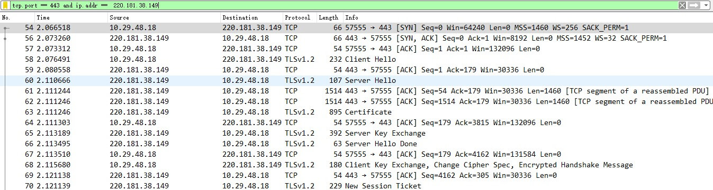

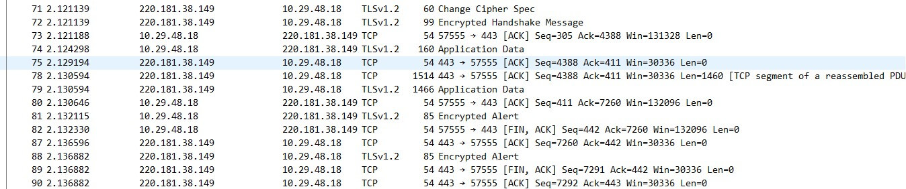

遇到凡事不要慌，接下来待我给你慢慢道来（ack消息属于tcp协议里面的确认报文，不做解释）

#### 第一步


> 解释说明：tcp三次握手，这个不做解释，如果这块不清楚，比如ack，seq,mss,win都代表什么意思，这个可以在互动区留言，我视情况专门写几篇tcp的文章（这块太大了，没几篇是介绍不完的）

#### 第二步：客户端发送client\_hello

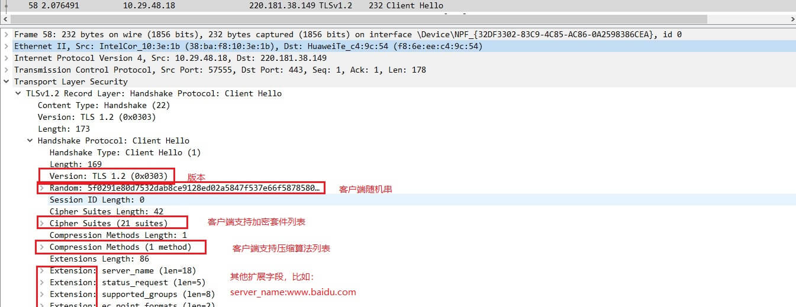

> 解释说明：客户端发送client\_hello，包含以下内容（请自行对照上图） 1\. 包含TLS版本信息 2\. 随机数（用于后续的密钥协商）random\_C 3\. 加密套件候选列表 4\. 压缩算法候选列表 5\. 扩展字段 6\. 其他

#### 第三步：服务端发送server\_hello

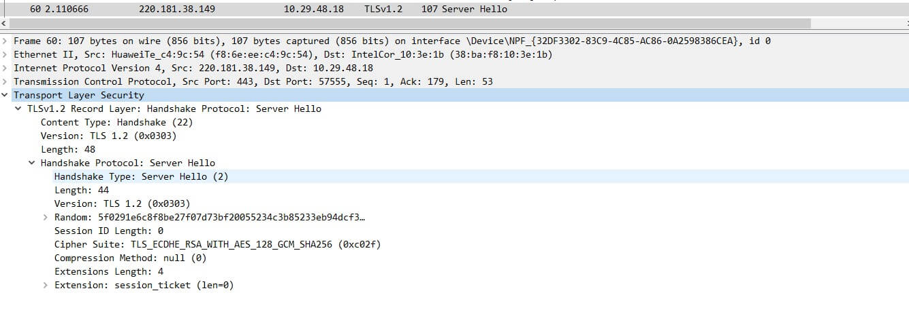

> 解释说明：服务端收到客户端的client\_hello之后，发送server\_hello，并返回协商的信息结果 1\. 选择使用的TLS协议版本 version 2\. 选择的加密套件 cipher suite 3\. 选择的压缩算法 compression method 4\. 随机数 random\_S 5\. 其他

#### 第四步：服务端发送证书

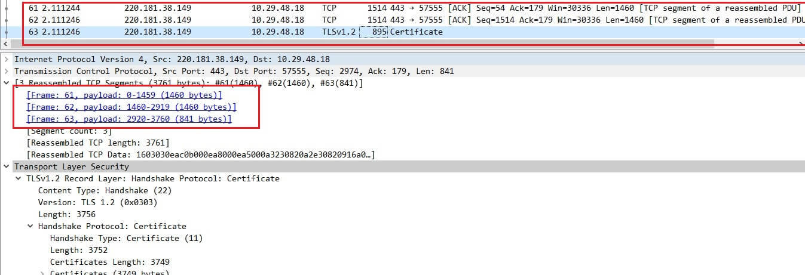

> 解释说明：服务端发送完server\_hello后，紧接着开始发送自己的证书（不清楚证书是什么的，可以移步到[上一篇文章](https://juejin.cn/post/6845166890675863559)），从图可知：因包含证书的报文长度是3761，所以此报文在tcp这块做了分段，分了3个报文把证书发送完了

> 问自己： 1\. 分段的标准是什么？ 2\. 什么时候叫分段，什么时候叫分片？ 3\. 什么是MTU，什么是MSS

#### 第五步：服务端发送Server Key Exchange

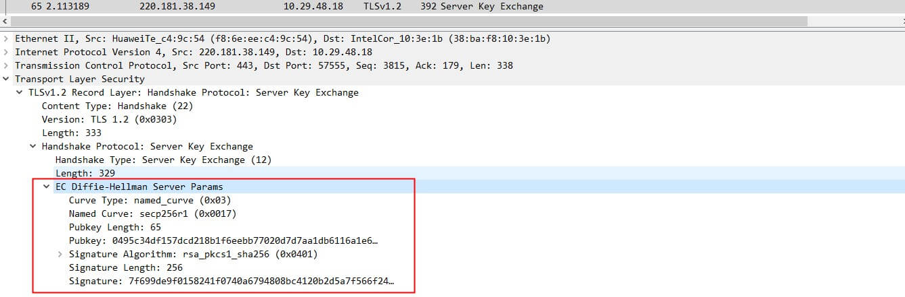

> 解释说明:对于使用DHE/ECDHE非对称密钥协商算法的SSL握手，将发送该类型握手。RSA算法不会进行该握手流程（DH、ECDH也不会发送server key exchange）,也就是说此报文不一定要发送，视加密算法而定。SSL中的RSA、DHE、ECDHE、ECDH流程与区别可以参考[此篇文章](https://blog.csdn.net/mrpre/article/details/78025940)

#### 第六步：服务端发送Server Hello Done

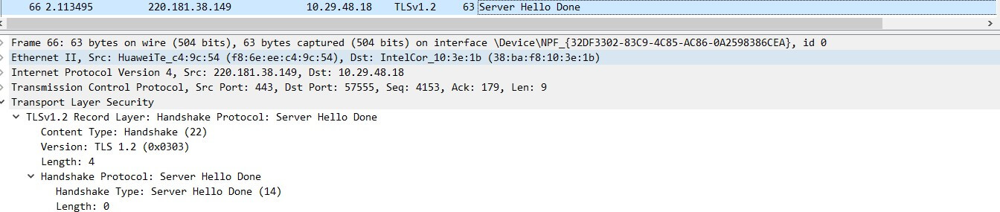

> 解释说明:通知客户端 server\_hello 信息发送结束

#### 第七步：客户端发送.client\_key\_exchange+change\_cipher\_spec+encrypted\_handshake\_message

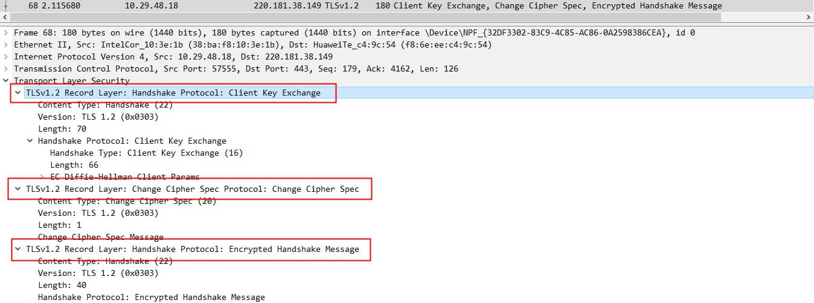

> 解释说明: 1\. client\_key\_exchange，合法性验证通过之后，向服务器发送自己的公钥参数，这里客户端实际上已经计算出了密钥 2\. change\_cipher\_spec，客户端通知服务器后续的通信都采用协商的通信密钥和加密算法进行加密通信 3\. encrypted\_handshake\_message，主要是用来测试密钥的有效性和一致性

#### 第八步：服务端发送New Session Ticket

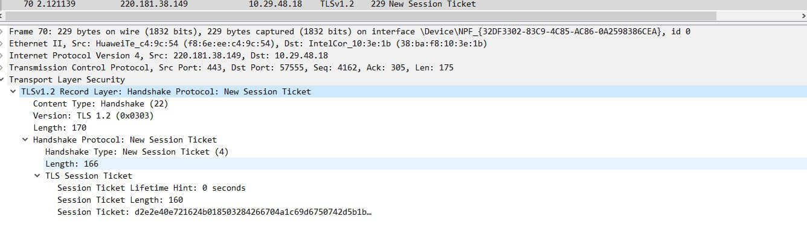

> 解释说明:服务器给客户端一个会话，用处就是在一段时间之内（超时时间到来之前），双方都以协商的密钥进行通信。

#### 第九步：服务端发送change\_cipher\_spec

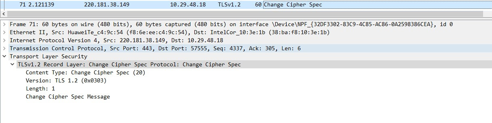

> 解释说明:服务端解密客户端发送的参数，然后按照同样的算法计算出协商密钥，并通过客户端发送的encrypted\_handshake\_message验证有效性，验证通过，发送该报文，告知客户端，以后可以拿协商的密钥来通信了

#### 第十步：服务端发送encrypted\_handshake\_message

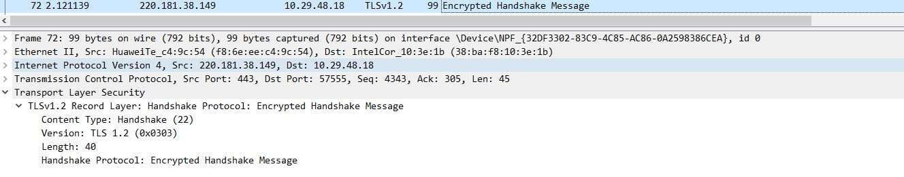

> 解释说明:目的同样是测试密钥的有效性，客户端发送该报文是为了验证服务端能正常解密，客户端能正常加密，相反：服务端发送该报文是为了验证客户端能正常解密，服务端能正常加密

#### 第十一步：完成密钥协商，开始发送数据

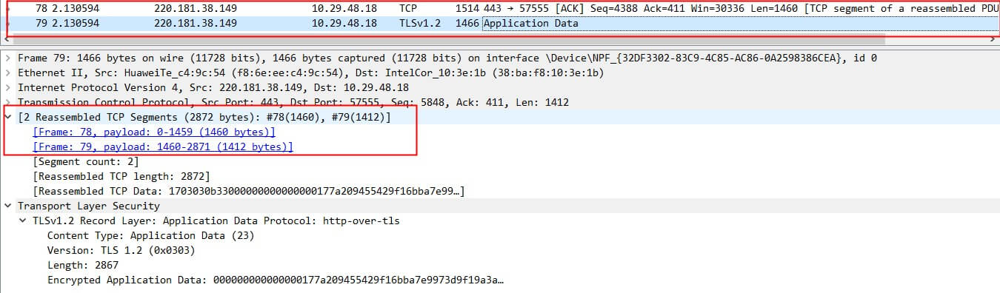

> 解释说明：数据同样是分段发送的

#### 第十二步：完成数据发送，4次tcp挥手

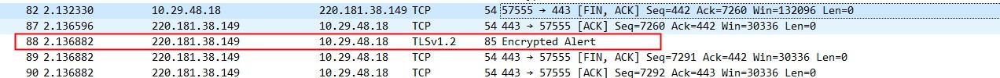

> 解释说明：红框的意思是：客户端或服务器发送的，意味着加密通信因为某些原因需要中断，警告对方不要再发送敏感的数据,服务端数据发送完成也会有此数据包，可不关注

## 结语

最后用一张图来说明以下过程

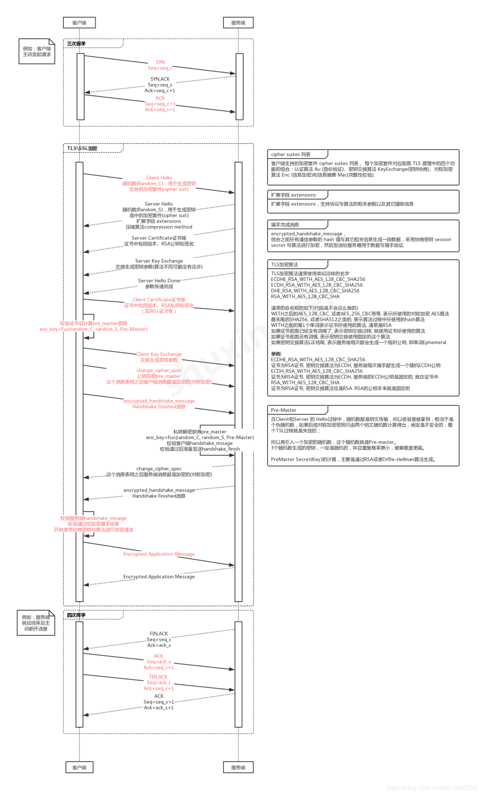

**要点**：
HTTPS的详细握手过程包括以下步骤：

1. **TCP三次握手**：建立一个TCP连接。
2. **客户端发送Client Hello**：客户端发送包含TLS版本、随机数、加密套件候选列表等信息的数据包。
3. **服务端发送Server Hello**：服务端收到客户端的Client Hello后，选择一个TLS版本和加密套件，并发送Server Hello响应。
4. **服务端发送证书**：服务端发送自己的数字证书，证明其身份。
5. **服务端发送Server Key Exchange**：对于某些加密算法，服务端发送公钥参数。
6. **服务端发送Server Hello Done**：通知客户端Server Hello信息发送结束。
7. **客户端发送Client Key Exchange、Change Cipher Spec、Encrypted Handshake Message**：客户端发送公钥参数，通知使用协商的密钥和加密算法，并发送加密的握手消息以测试密钥的有效性。
8. **服务端发送New Session Ticket**：服务端发送会话票据，用于在超时时间内复用协商的密钥。
9. **服务端发送Change Cipher Spec**：服务端通知客户端后续通信将使用协商的密钥和加密算法。
10. **服务端发送Encrypted Handshake Message**：服务端发送加密的握手消息，用于验证客户端和服务端能正常加密和解密。
11. **完成密钥协商，开始发送数据**：双方使用协商的密钥加密和解密数据。
12. **完成数据发送，4次TCP挥手**：双方发送结束握手，关闭TCP连接。

整个握手过程确保了安全通信的建立，包括身份验证、密钥协商和加密配置。


---
### 415. 为什么推荐将静态资源放到cdn上？

**难度**：★★☆☆☆ | **题型**：QA | **分类**：全部 / 计算机网络 / 工具

**题目**：


**参考答案**：
## 静态资源是什么

### 静态资源

静态资源是指在不同请求中访问到的数据都相同的静态文件。例如：图片、视频、网站中的文件（html、css、js）、软件安装包、apk文件、压缩包文件等。

### 动态资源
动态资源是指在不同请求中访问到的数据不相同的动态内容。例如：网站中的文件（asp、jsp、php、perl、cgi）、API接口、数据库交互请求等。

## CDN是什么
内容分发网络，Content Delivery Network或Content Ddistribute Network，简称CDN，是建立并覆盖在承载网之上，由分布在不同区域的边缘节点服务器群组成的分布式网络。

**CDN加速的本质是缓存加速**。将服务器上存储的静态内容缓存在CDN节点上，当访问这些静态内容时，无需访问服务器源站，就近访问CDN节点即可获取相同内容，从而达到加速的效果，同时减轻服务器源站的压力。

CDN应用广泛，解决因分布、带宽、服务器性能带来的访问延迟问题，适用于站点加速、点播、直播等场景。使用户可就近取得所需内容，解决 Internet网络拥挤的状况，提高用户访问网站的响应速度和成功率。


由于访问动态内容时，每次都需要访问服务器，由服务器动态生成实时的数据并返回。因此CDN的缓存加速不适用于加速动态内容，CDN无法缓存实时变化的动态内容。对于动态内容请求，CDN节点只能转发回服务器源站，没有加速效果。

## CDN的作用

**1. 加速网站的访问**

**2. 为了实现跨运营商、跨地域的全网覆盖**

互联不互通、区域ISP地域局限、出口带宽受限制等种种因素都造成了网站的区域性无法访问。CDN加速可以覆盖全球的线路，通过和运营商合作，部署IDC资源，在全国骨干节点商，合理部署CDN边缘分发存储节点，充分利用带宽资源，平衡源站流量。

**3. 为了保障你的网站安全**

CDN的负载均衡和分布式存储技术，可以加强网站的可靠性，相当无无形中给你的网站添加了一把保护伞，应对绝大部分的互联网攻击事件。防攻击系统也能避免网站遭到恶意攻击。

**4. 为了异地备援**

当某个服务器发生意外故障时，系统将会调用其他临近的健康服务器节点进行服务，进而提供接近100%的可靠性，这就让你的网站可以做到永不宕机。

**5. 为了节约成本投入**

使用CDN加速可以实现网站的全国铺设，你根据不用考虑购买服务器与后续的托管运维，服务器之间镜像同步，也不用为了管理维护技术人员而烦恼，节省了人力、精力和财力。

**6. 为了让你更专注业务本身**

CDN加速厂商一般都会提供一站式服务，业务不仅限于CDN，还有配套的云存储、大数据服务、视频云服务等，而且一般会提供7x24运维监控支持，保证网络随时畅通，你可以放心使用。并且将更多的精力投入到发展自身的核心业务之上。


## CDN工作原理
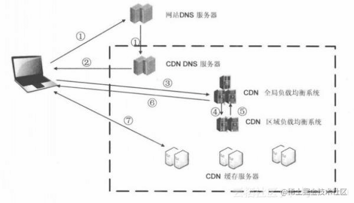

* 当用户点击网站页面上的内容URL，经过本地DNS系统解析，DNS系统会最终将域名的解析权交给CNAME指向的CDN专用DNS服务器。
* CDN的DNS服务器将CDN的全局负载均衡设备IP地址返回用户。
* 用户向CDN的全局负载均衡设备发起内容URL访问请求。
* CDN全局负载均衡设备根据用户IP地址，以及用户请求的内容URL，选择一台用户所属区域的区域负载均衡设备，告诉用户向这台设备发起请求。
* 区域负载均衡设备会为用户选择一台合适的缓存服务器提供服务，选择的依据包括：根据用户IP地址，判断哪一台服务器距用户最近；根据用户所请求的URL中携带的内容名称，判断哪一台服务器上有用户所需内容；查询各个服务器当前的负载情况，判断哪一台服务器尚有服务能力。基于以上这些条件的综合分析之后，区域负载均衡设备会向全局负载均衡设备返回一台缓存服务器的IP地址。
* 全局负载均衡设备把服务器的IP地址返回给用户。
* 用户向缓存服务器发起请求，缓存服务器响应用户请求，将用户所需内容传送到用户终端。如果这台缓存服务器上并没有用户想要的内容，而区域均衡设备依然将它分配给了用户，那么这台服务器就要向它的上一级缓存服务器请求内容，直至追溯到网站的源服务器将内容拉到本地。

DNS服务器根据用户IP地址，将域名解析成相应节点的缓存服务器IP地址，实现用户就近访问。使用CDN服务的网站，只需将其域名解析权交给CDN的GSLB设备，将需要分发的内容注入CDN，就可以实现内容加速了。

## 当没有CDN时

今天我们看到的网站系统基本上都是基于B/S架构的。B/S架构，即Browser-Server（浏览器 服务器）架构。

用户通过浏览器等方式访问网站的过程：

* 用户在自己的浏览器中输入要访问的网站域名。
* 浏览器向本地DNS服务器请求对该域名的解析。
* 本地DNS服务器中如果缓存有这个域名的解析结果，则直接响应用户的解析请求。
* 本地DNS服务器中如果没有关于这个域名的解析结果的缓存，则以递归方式向整个DNS系统请求解析，获得应答后将结果反馈给浏览器。
* 浏览器得到域名解析结果，就是该域名相应的服务设备的IP地址。
* 浏览器向服务器请求内容。
* 服务器将用户请求内容传送给浏览器。

**要点**：
静态资源是指在不同请求中访问到的数据都相同的文件，如图片、视频、HTML、CSS、JS等。动态资源则是指在不同请求中访问到的数据不相同的文件，如网站中的ASP、JSP、PHP等文件，API接口，数据库交互请求等。

CDN（内容分发网络）是一种分布式网络，由分布在不同区域的边缘节点服务器群组成。CDN通过缓存静态内容，使得用户可以直接从最近的CDN节点获取内容，从而加速访问速度并减轻源站的压力。CDN不适用于动态内容的加速，因为动态内容需要服务器实时生成。

CDN的作用包括加速网站访问、实现跨运营商和地域的全网覆盖、保障网站安全、异地备援、节约成本投入以及让网站运营者更专注于业务本身。

CDN的工作原理是用户通过浏览器访问网站时，DNS服务器将域名解析成CDN节点的IP地址，CDN根据用户的IP地址和请求内容选择最近的缓存服务器，如果缓存服务器上有请求内容则直接响应，否则向上级服务器请求内容。

没有CDN时，用户通过浏览器访问网站，本地DNS服务器解析域名，浏览器向服务器请求内容，服务器响应请求并将内容传送给浏览器。


---
### 419. DNS协议介绍

**难度**：★★★☆☆ | **题型**：QA | **分类**：全部 / 计算机网络

**题目**：


**参考答案**：
<h3 style="text-align:left;text-indent:2em;" data-id="heading-54">1. DNS 协议的概念</h3><p style="text-align:left;text-indent:2em;"><strong>概念</strong>： DNS 是域名系统 (Domain Name System) 的缩写，提供的是一种主机名到 IP 地址的转换服务，就是我们常说的域名系统。它是一个由分层的 DNS 服务器组成的分布式数据库，是定义了主机如何查询这个分布式数据库的方式的应用层协议。能够使人更方便的访问互联网，而不用去记住能够被机器直接读取的IP数串。</p><p style="text-align:left;text-indent:2em;"><strong>作用</strong>： 将域名解析为IP地址，客户端向DNS服务器（DNS服务器有自己的IP地址）发送域名查询请求，DNS服务器告知客户机Web服务器的IP 地址。</p><p></p><h3 style="text-align:left;text-indent:2em;" data-id="heading-55">2. DNS同时使用TCP和UDP协议</h3><p></p><p style="text-align:left;text-indent:2em;"><strong>DNS占用53号端口，同时使用TCP和UDP协议。</strong> </p><p>（1）在区域传输的时候使用TCP协议</p><ul><li>辅域名服务器会定时（一般3小时）向主域名服务器进行查询以便了解数据是否有变动。如有变动，会执行一次区域传送，进行数据同步。区域传送使用TCP而不是UDP，因为数据同步传送的数据量比一个请求应答的数据量要多得多。</li><li>TCP是一种可靠连接，保证了数据的准确性。</li></ul><p style="text-align:left;text-indent:2em;">（2）在域名解析的时候使用UDP协议</p><ul><li>客户端向DNS服务器查询域名，一般返回的内容都不超过512字节，用UDP传输即可。不用经过三次握手，这样DNS服务器负载更低，响应更快。理论上说，客户端也可以指定向DNS服务器查询时用TCP，但事实上，很多DNS服务器进行配置的时候，仅支持UDP查询包。</li></ul><h3 style="text-align:left;text-indent:2em;" data-id="heading-56">3. DNS完整的查询过程</h3><p></p><p style="text-align:left;text-indent:2em;">DNS服务器解析域名的过程：</p><ul><li>首先会在<strong>浏览器的缓存</strong>中查找对应的IP地址，如果查找到直接返回，若找不到继续下一步</li><li>将请求发送给<strong>本地DNS服务器</strong>，在本地域名服务器缓存中查询，如果查找到，就直接将查找结果返回，若找不到继续下一步</li><li>本地DNS服务器向<strong>根域名服务器</strong>发送请求，根域名服务器会返回一个所查询域的顶级域名服务器地址</li><li>本地DNS服务器向<strong>顶级域名服务器</strong>发送请求，接受请求的服务器查询自己的缓存，如果有记录，就返回查询结果，如果没有就返回相关的下一级的权威域名服务器的地址</li><li>本地DNS服务器向<strong>权威域名服务器</strong>发送请求，域名服务器返回对应的结果</li><li>本地DNS服务器将返回结果保存在缓存中，便于下次使用</li><li>本地DNS服务器将返回结果返回给浏览器</li></ul><p style="text-align:left;text-indent:2em;">比如我们如果想要查询 <u><a href="http://www.baidu.com/" target="_blank" rel="nofollow noopener noreferrer">www.baidu.com</a></u> 的 IP 地址，我们首先会在浏览器的缓存中查找是否有该域名的缓存，如果不存在就将请求发送到本地的 DNS 服务器中，本地DNS服务器会判断是否存在该域名的缓存，如果不存在，则向根域名服务器发送一个请求，根域名服务器返回负责 .com 的顶级域名服务器的 IP 地址的列表。然后本地 DNS 服务器再向其中一个负责 .com 的顶级域名服务器发送一个请求，负责 .com 的顶级域名服务器返回负责 .baidu 的权威域名服务器的 IP 地址列表。然后本地 DNS 服务器再向其中一个权威域名服务器发送一个请求，最后权威域名服务器返回一个对应的主机名的 IP 地址列表。</p><p></p><h3 style="text-align:left;text-indent:2em;" data-id="heading-57">4. 迭代查询与递归查询</h3><p style="text-align:left;text-indent:2em;">实际上，DNS解析是一个包含迭代查询和递归查询的过程。</p><ul><li><strong>递归查询</strong>指的是查询请求发出后，域名服务器代为向下一级域名服务器发出请求，最后向用户返回查询的最终结果。使用递归 查询，用户只需要发出一次查询请求。</li><li><strong>迭代查询</strong>指的是查询请求后，域名服务器返回单次查询的结果。下一级的查询由用户自己请求。使用迭代查询，用户需要发出 多次的查询请求。</li></ul><p style="text-align:left;text-indent:2em;">一般我们向本地 DNS 服务器发送请求的方式就是递归查询，因为我们只需要发出一次请求，然后本地 DNS 服务器返回给我 们最终的请求结果。而本地 DNS 服务器向其他域名服务器请求的过程是迭代查询的过程，因为每一次域名服务器只返回单次 查询的结果，下一级的查询由本地 DNS 服务器自己进行。</p><p></p><h3 style="text-align:left;text-indent:2em;" data-id="heading-58">5. DNS 记录和报文</h3><p style="text-align:left;text-indent:2em;">DNS 服务器中以资源记录的形式存储信息，每一个 DNS 响应报文一般包含多条资源记录。一条资源记录的具体的格式为</p><pre class=" language-http"><code>（Name，Value，Type，TTL）</code></pre><p style="text-align:left;text-indent:2em;">其中 TTL 是资源记录的生存时间，它定义了资源记录能够被其他的 DNS 服务器缓存多长时间。</p><p style="text-align:left;text-indent:2em;">常用的一共有四种 Type 的值，分别是 A、NS、CNAME 和 MX ，不同 Type 的值，对应资源记录代表的意义不同。</p><ol><li>如果 Type = A，则 Name 是主机名，Value 是主机名对应的 IP 地址。因此一条记录为 A 的资源记录，提供了标 准的主机名到 IP 地址的映射。</li><li>如果 Type = NS，则 Name 是个域名，Value 是负责该域名的 DNS 服务器的主机名。这个记录主要用于 DNS 链式 查询时，返回下一级需要查询的 DNS 服务器的信息。</li><li>如果 Type = CNAME，则 Name 为别名，Value 为该主机的规范主机名。该条记录用于向查询的主机返回一个主机名 对应的规范主机名，从而告诉查询主机去查询这个主机名的 IP 地址。主机别名主要是为了通过给一些复杂的主机名提供 一个便于记忆的简单的别名。</li><li>如果 Type = MX，则 Name 为一个邮件服务器的别名，Value 为邮件服务器的规范主机名。它的作用和 CNAME 是一 样的，都是为了解决规范主机名不利于记忆的缺点。</li></ol><p></p>

**要点**：
<p style="text-align:left;text-indent:2em;"><strong>DNS</strong>（域名系统）是一种用于将域名解析为IP地址的服务，它是一个分布式的数据库系统，由分层的DNS服务器组成。DNS的作用是提供一个更加易于记忆的主机名到机器可以直接读取的IP地址的映射，从而使得用户可以更方便地访问互联网。</p><p></p><p style="text-align:left;text-indent:2em;">DNS同时使用TCP和UDP协议，其中在区域传输时使用TCP协议，因为数据同步传输的数据量比一个请求应答的数据量要多，而TCP是一种可靠连接，可以保证数据的准确性。在域名解析时，一般使用UDP协议，因为客户端向DNS服务器查询域名时，返回的内容通常不超过512字节，使用UDP传输即可，且不需要经过三次握手，这样可以降低DNS服务器的负载并提高响应速度。</p><p></p><p style="text-align:left;text-indent:2em;"><strong>DNS的完整查询过程包括以下步骤</strong>：首先在浏览器的缓存中查找对应的IP地址，如果查找不到则继续向本地DNS服务器发送请求，如果在本地域名服务器缓存中查找到，则直接返回结果，否则继续向根域名服务器发送请求，最终返回对应的主机名IP地址。</p><p></p><p style="text-align:left;text-indent:2em;">DNS解析是一个包含迭代查询和递归查询的过程。递归查询是指查询请求发出后，域名服务器代为向下一级域名服务器发出请求，最后向用户返回查询的最终结果，用户只需要发出一次查询请求。迭代查询是指查询请求后，域名服务器返回单次查询的结果，下一级的查询由用户自己请求，用户需要发出多次的查询请求。</p><p></p><p style="text-align:left;text-indent:2em;">DNS服务器中以资源记录的形式存储信息，每个DNS响应报文包含多条资源记录。资源记录的格式为（Name，Value，Type，TTL），其中TTL是资源记录的生存时间，定义了资源记录能够被其他DNS服务器缓存多长时间。常用的资源记录类型包括A、NS、CNAME和MX，它们分别代表主机名到IP地址的映射、返回下一级需要查询的DNS服务器信息、返回主机名对应的规范主机名以及邮件服务器的别名。</p>

---
### 440. 说说你对“三次握手”、“四次挥手”的理解

**难度**：★★★☆☆ | **题型**：QA | **分类**：全部 / 计算机网络

**题目**：


**参考答案**：
我们都知道TCP是面向连接的，``三次握手``就是用来建立连接的，``四次握手``就是用来断开连接的。

# 三次握手

先上图：

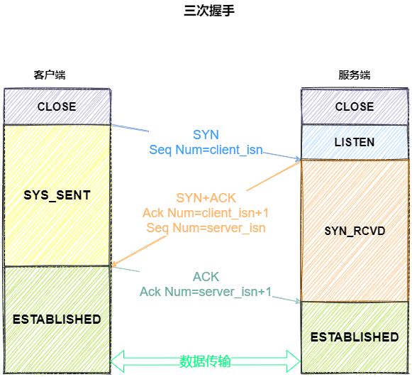

我们来看一下三次握手的过程：

- 一开始，客户端和服务端都处于 `CLOSED` 状态。客户端主动打开连接，服务端被动打卡连接，结束``CLOSED`` z状态，开始监听，进入 ``LISTEN ``状态。

**一次握手**

- 客户端会随机初始化序号（`client_isn`），将此序号置于 TCP 首部的「序号」字段中，同时把 `SYN` 标志位置为 `1` ，表示 `SYN` 报文。接着把第一个 SYN 报文发送给服务端，表示向服务端发起连接，该报文不包含应用层数据，之后客户端处于 `SYN-SENT` 状态。

**二次握手**

- 服务端收到客户端的 `SYN` 报文后，首先服务端也随机初始化自己的序号（`server_isn`），将此序号填入 TCP 首部的「序号」字段中，其次把 TCP 首部的「确认应答号」字段填入 `client_isn + 1`, 接着把 `SYN` 和 `ACK` 标志位置为 `1`。最后把该报文发给客户端，该报文也不包含应用层数据，之后服务端处于 `SYN-RCVD` 状态。

**三次握手**

- 客户端收到服务端报文后，还要向服务端回应最后一个应答报文，首先该应答报文 TCP 首部 `ACK` 标志位置为 `1` ，其次「确认应答号」字段填入 `server_isn + 1` ，最后把报文发送给服务端，这次报文可以携带客户到服务器的数据，之后客户端处于 `ESTABLISHED` 状态。

好了，经过三次握手的过程，客户端和服务端之间的确定连接正常，接下来进入``ESTABLISHED``状态，服务端和客户端就可以快乐地通信了。


这里有个小细节，第三次握手是可以携带数据的，这是面试常问的点。

> **那么为什么要三次握手呢？两次不行吗？**

- 为了防止服务器端开启一些无用的连接增加服务器开销
- 防止已失效的连接请求报文段突然又传送到了服务端，因而产生错误。

由于网络传输是有延时的(要通过网络光纤和各种中间代理服务器)，在传输的过程中，比如客户端发起了 SYN=1 的第一次握手。

如果服务器端就直接创建了这个连接并返回包含 SYN、ACK 和 Seq  等内容的数据包给客户端，这个数据包因为网络传输的原因丢失了，丢失之后客户端就一直没有接收到服务器返回的数据包。

如果没有第三次握手告诉服务器端客户端收的到服务器端传输的数据的话，服务器端是不知道客户端有没有接收到服务器端返回的信息的。服务端就认为这个连接是可用的，端口就一直开着，等到客户端因超时重新发出请求时，服务器就会重新开启一个端口连接。

这样一来，就会有很多无效的连接端口白白地开着，导致资源的浪费。

这个过程可理解为：

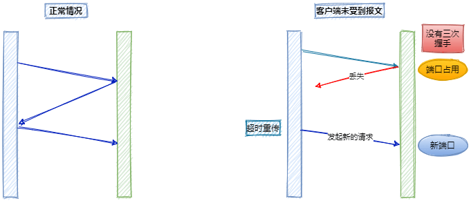

还有一种情况是已经失效的客户端发出的请求信息，由于某种原因传输到了服务器端，服务器端以为是客户端发出的有效请求，接收后产生错误。

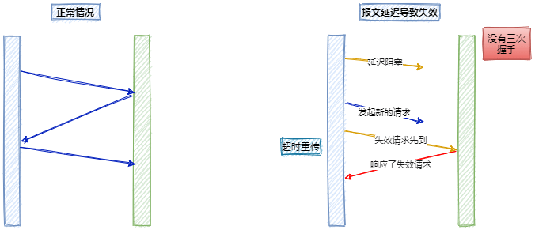

所以我们需要“第三次握手”来确认这个过程：

通过第三次握手的数据告诉服务端，客户端有没有收到服务器“第二次握手”时传过去的数据，以及这个连接的序号是不是有效的。若发送的这个数据是“``收到且没有问题``”的信息，接收后服务器就正常建立 TCP 连接，否则建立 TCP  连接失败，服务器关闭连接端口。由此减少服务器开销和接收到失效请求发生的错误。

# 四次挥手

还是先上图：

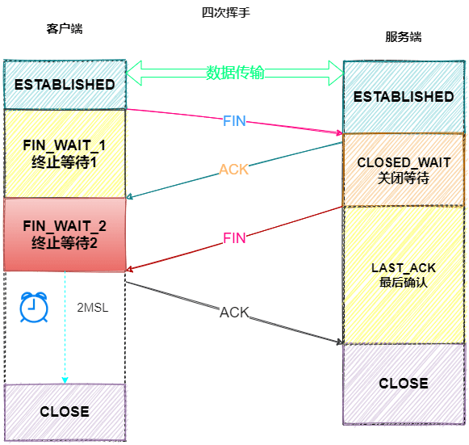

聚散终有时，TCP 断开连接是通过**四次挥手**方式。

``双方``都可以主动断开连接，断开连接后主机中的「资源」将被释放。

上图是客户端主动关闭连接 ：

**一次挥手**

- 客户端打算关闭连接，此时会发送一个 TCP 首部 `FIN` 标志位被置为 `1` 的报文，也即 `FIN` 报文，之后客户端进入 `FIN_WAIT_1` 状态。

**二次挥手**

- 服务端收到该报文后，就向客户端发送 `ACK` 应答报文，接着服务端进入 `CLOSED_WAIT` 状态。

**三次挥手**

- 客户端收到服务端的 `ACK` 应答报文后，之后进入 `FIN_WAIT_2` 状态。等待服务端处理完数据后，也向客户端发送 `FIN` 报文，之后服务端进入 `LAST_ACK` 状态。

**四次挥手**

- 客户端收到服务端的 `FIN` 报文后，回一个 `ACK` 应答报文，之后进入 `TIME_WAIT` 状态
- 服务器收到了 `ACK` 应答报文后，就进入了 `CLOSED` 状态，至此服务端已经完成连接的关闭。
- 客户端在经过 `2MSL` 一段时间后，自动进入 `CLOSED` 状态，至此客户端也完成连接的关闭。

你可以看到，每个方向都需要**一个 FIN 和一个 ACK**，因此通常被称为**四次挥手**。

> **为什么要挥手四次？**

再来回顾下四次挥手双方发 `FIN` 包的过程，就能理解为什么需要四次了。

- 关闭连接时，客户端向服务端发送 `FIN` 时，仅仅表示客户端不再发送数据了但是还能接收数据。
- 服务器收到客户端的 `FIN` 报文时，先回一个 `ACK` 应答报文，而服务端可能还有数据需要处理和发送，等服务端不再发送数据时，才发送 `FIN` 报文给客户端来表示同意现在关闭连接。

从上面过程可知，服务端通常需要等待完成数据的发送和处理，所以服务端的 `ACK` 和 `FIN` 一般都会分开发送，从而比三次握手导致多了一次。

> **为什么客户端在TIME-WAIT阶段要等2MSL？**

为的是确认服务器端是否收到客户端发出的 ACK 确认报文，当客户端发出最后的 ACK 确认报文时，并不能确定服务器端能够收到该段报文。

所以客户端在发送完 ACK 确认报文之后，会设置一个时长为 2MSL 的计时器。

MSL 指的是 Maximum Segment Lifetime：一段 TCP 报文在传输过程中的最大生命周期。

2MSL 即是服务器端发出为 FIN 报文和客户端发出的 ACK 确认报文所能保持有效的最大时长。

服务器端在 1MSL 内没有收到客户端发出的 ACK 确认报文，就会再次向客户端发出 FIN 报文：

- 如果客户端在 2MSL 内，再次收到了来自服务器端的 FIN 报文，说明服务器端由于各种原因没有接收到客户端发出的 ACK 确认报文。

客户端再次向服务器端发出 ACK 确认报文，计时器重置，重新开始 2MSL 的计时。

- 否则客户端在 2MSL 内没有再次收到来自服务器端的 FIN 报文，说明服务器端正常接收了 ACK 确认报文，客户端可以进入 CLOSED  阶段，完成“四次挥手”。

所以，客户端要经历时长为 2SML 的 TIME-WAIT 阶段;这也是为什么客户端比服务器端晚进入 CLOSED 阶段的原因。

> 本答案由“前端面试题宝典”收集整理，PC端访问请前往： https://fe.ecool.fun/ 

**要点**：
TCP连接的建立和断开是通过三次握手和四次挥手来实现的。

#### 三次握手

1. 客户端和服务端都处于CLOSED状态。
2. 客户端发起连接请求，发送SYN报文，进入SYN_SENT状态。
3. 服务端收到SYN报文，向客户端发送ACK报文和自己的SYN报文，进入SYN_RCVD状态。
4. 客户端收到服务端的ACK报文，向服务端发送ACK报文，进入ESTABLISHED状态。

#### 四次挥手

1. 客户端或服务端任一方发起断开连接，发送FIN报文，进入FIN_WAIT_1状态。
2. 另一方收到FIN报文，向发起方发送ACK报文，进入CLOSE_WAIT状态。
3. 发起方收到ACK报文，进入FIN_WAIT_2状态。
4. 另一方处理完所有数据后，发送FIN报文，进入LAST_ACK状态。
5. 发起方收到FIN报文，向另一方发送ACK报文，进入TIME_WAIT状态。
6. 2MSL（最大报文生存时间）后，发起方进入CLOSED状态。

#### 为什么要三次握手和四次挥手？

- 三次握手可以防止已失效的连接请求到达服务器端，避免错误。
- 四次挥手确保双方都能正确地关闭连接，释放资源。

#### 为什么客户端在TIME_WAIT阶段要等2MSL？

为了确保服务器端能够正确接收到客户端的ACK确认报文。如果在2MSL内没有收到服务器端的FIN报文，客户端可以再次发送ACK报文，以避免服务器端因没有收到ACK报文而重新发送FIN报文。


---
### 472. HTTPS 中的 SSL/TLS 是什么？

**难度**：★★★☆☆ | **题型**：QA | **分类**：全部 / 计算机网络

**题目**：


**参考答案**：
HTTPS（Hypertext Transfer Protocol Secure）是HTTP的安全版本，它通过SSL/TLS协议对数据进行加密，确保数据在传输过程中保持机密性和完整性。下面是对SSL和TLS的详细介绍：

### **SSL（Secure Sockets Layer）**

- **定义**：SSL是最早的安全协议，用于在网络上加密传输的数据。它确保数据在客户端和服务器之间的传输是安全的。
- **历史**：SSL最初由Netscape开发，主要包括SSL 2.0和SSL 3.0两个版本。由于SSL 2.0和SSL 3.0存在一些安全漏洞，它们已经被淘汰。

### **TLS（Transport Layer Security）**

- **定义**：TLS是SSL的继任者，是一种用于保护网络通信的加密协议。TLS对数据进行加密，确保数据在传输过程中不被窃取或篡改。
- **版本**：TLS 从 TLS 1.0 开始，到当前的 TLS 1.3。每个版本都在前一个版本的基础上进行改进，增强了安全性和性能。

### **SSL/TLS 工作原理**

1. **握手过程（Handshake）**
   - **客户端发起连接**：客户端向服务器发送一个“ClientHello”消息，包含了客户端支持的加密算法、TLS版本等信息。
   - **服务器响应**：服务器回应一个“ServerHello”消息，选择加密算法、TLS版本并发送服务器的数字证书。
   - **证书验证**：客户端使用服务器提供的证书验证服务器的身份。如果证书有效，客户端会生成一个“pre-master secret”并用服务器的公钥加密后发送给服务器。
   - **密钥交换**：服务器使用其私钥解密“pre-master secret”，双方使用这个密钥生成对称加密密钥（session key），用于加密后续的通信数据。

2. **数据加密和传输**
   - **加密数据**：客户端和服务器使用会话密钥对数据进行加密，然后进行数据传输。
   - **数据完整性**：数据不仅被加密，还通过消息认证码（MAC）进行完整性检查，防止数据被篡改。

3. **连接关闭**
   - **关闭连接**：当通信结束时，双方会通过“close_notify”消息来优雅地关闭连接，确保所有的数据都被正确传输。

### **SSL/TLS 主要功能**

- **加密**：SSL/TLS通过对数据进行加密，保护数据在传输过程中不被窃取。
- **身份验证**：通过数字证书验证服务器的身份，防止中间人攻击。
- **数据完整性**：通过消息认证码（MAC）确保数据在传输过程中没有被篡改。

### **常见的 SSL/TLS 证书类型**

- **自签名证书**：由证书持有者自己签发的证书，通常用于开发和测试环境，不被浏览器信任。
- **域名验证证书（DV）**：验证申请者对域名的控制权，适合个人和小型网站。
- **组织验证证书（OV）**：验证申请者的身份和组织合法性，适合企业和组织。
- **扩展验证证书（EV）**：提供最高级别的身份验证和信任，显示公司名称在地址栏中。


**要点**：
SSL/TLS 是保障HTTPS通信安全的核心协议，通过加密、身份验证和数据完整性保护，确保了用户数据在互联网上的安全传输。虽然SSL已经被TLS所取代，但它们的基本原理和目标是一致的。TLS作为现代的安全协议，提供了更强的加密保护和更高的安全性。

---
### 502. http 协议中的 CSP 是什么？

**难度**：★★☆☆☆ | **题型**：QA | **分类**：全部 / 计算机网络

**题目**：


**参考答案**：
### **什么是 CSP？**

CSP (Content Security Policy) 是 HTTP 协议中的一种安全功能，全称为 **内容安全策略**。它用于帮助浏览器检测和阻止某些类型的安全威胁，例如 **跨站脚本攻击（XSS）** 和 **数据注入攻击**。通过限制页面加载的内容来源，CSP 能够有效减少攻击面，提高 Web 应用的安全性。

---

### **CSP 的工作原理**
1. **定义策略**：服务器通过 HTTP 响应头 `Content-Security-Policy`，或 `<meta>` 标签来定义 CSP 策略。
2. **策略作用**：浏览器根据定义的策略控制页面中可加载的资源（如脚本、样式、图片等）的来源。
3. **检测与阻止**：
   - 如果资源或行为不符合策略，浏览器会阻止加载。
   - 可通过策略开启“报告模式”，将违反策略的行为报告到指定的 URL。

---

### **CSP 的常见指令**
CSP 策略由一组指令组成，每条指令控制特定类型资源的加载规则：

| 指令名           | 功能描述                                                                                  | 示例                                  |
|------------------|-------------------------------------------------------------------------------------------|---------------------------------------|
| `default-src`    | 默认资源加载策略，应用于未指定的其他类型资源                                               | `default-src 'self'`                 |
| `script-src`     | 控制脚本的加载来源，防止恶意脚本注入                                                      | `script-src 'self' 'unsafe-inline'`  |
| `style-src`      | 控制样式的加载来源                                                                        | `style-src 'self' 'unsafe-inline'`   |
| `img-src`        | 控制图片的加载来源                                                                        | `img-src 'self' data:`               |
| `font-src`       | 控制字体文件的加载来源                                                                    | `font-src 'self'`                    |
| `connect-src`    | 限制通过 `fetch`、`XHR` 等方式发起的网络请求                                              | `connect-src api.example.com`        |
| `frame-src`      | 控制可嵌入框架（iframe）的来源                                                            | `frame-src 'self'`                   |
| `report-uri`     | 指定报告 CSP 违规的 URL                                                                   | `report-uri /csp-report`             |
| `object-src`     | 限制 `<object>`、`<embed>` 或 `<applet>` 的资源加载                                        | `object-src 'none'`                  |

---

### **CSP 策略示例**
#### **1. 防止加载外部脚本**
仅允许从当前域名加载脚本资源：
```http
Content-Security-Policy: script-src 'self';
```

#### **2. 允许可信的第三方资源**
允许加载 Google Analytics 脚本，但阻止其他外部脚本：
```http
Content-Security-Policy: script-src 'self' https://www.google-analytics.com;
```

#### **3. 开启报告模式**
仅报告违反 CSP 的行为，而不阻止加载：
```http
Content-Security-Policy: default-src 'self'; report-uri /csp-report;
```

---

### **CSP 的作用**
1. **防止 XSS 攻击**：  
   - 阻止执行未授权的脚本。
   - 限制恶意代码通过注入攻击运行。

2. **限制恶意内容加载**：  
   - 防止加载来自未信任来源的资源（如图片、脚本、iframe）。

3. **减少数据泄露风险**：  
   - 限制可以发起网络请求的目标域名。

---

### **CSP 的不足**
1. **配置复杂**：对于大型 Web 应用，CSP 的配置可能较为繁琐。
2. **兼容性问题**：老旧浏览器可能不支持某些 CSP 功能。
3. **灵活性受限**：严格的 CSP 策略可能会影响某些合法的动态功能（如内联脚本）。

**要点**：
CSP 是一种强大的 Web 安全机制，能有效抵御 XSS 和资源注入攻击。然而，CSP 的正确配置需要根据实际业务场景权衡安全性与灵活性。通过合理使用 CSP，可以显著提高 Web 应用的安全性，同时为开发者提供实时的安全问题报告。

---
### 510. 304 状态码用于什么场景， 好处和坏处分别是什么？

**难度**：★★☆☆☆ | **题型**：QA | **分类**：全部 / 计算机网络

**题目**：


**参考答案**：
**304 状态码**表示“未修改”（Not Modified），用于缓存机制中。它告知客户端缓存的资源仍然有效，无需重新下载。

**场景**：
- **缓存优化**：当客户端请求一个资源时，服务器可以通过 `If-Modified-Since` 或 `If-None-Match` 头部判断该资源是否被修改。如果资源未修改，服务器返回 304 状态码，客户端继续使用缓存中的资源。

**好处**：
1. **减少带宽消耗**：避免重复传输未改变的资源，节省了网络带宽。
2. **提高加载速度**：客户端可以使用缓存资源，减少了服务器的响应时间。
3. **降低服务器负载**：减少了对服务器的请求处理，降低了负载。

**坏处**：
1. **缓存问题**：如果缓存策略设置不当，可能会导致客户端获取到过时的资源。
2. **复杂性**：需要正确配置缓存头部和验证机制，增加了开发和维护的复杂性。
3. **可能的延迟**：在一些网络环境中，验证资源是否修改的请求和响应可能导致额外的延迟，尽管这个延迟通常较小。

**要点**：
304 状态码用于缓存机制中，能有效减少带宽和服务器负载，同时提高加载速度。然而，它可能引发缓存问题和增加系统复杂性。

---
### 525. 简单描述从输入网址到页面显示的过程

**难度**：★★★★☆ | **题型**：QA | **分类**：全部 / HTML / 计算机网络

**题目**：


**参考答案**：
很多大公司面试喜欢问这样一道面试题，输入URL到看见页面发生了什么？

简单来说，共有以下几个过程：

* DNS解析
* 发起TCP连接
* 发送HTTP请求
* 服务器处理请求并返回HTTP报文
* 浏览器解析渲染页面
* 连接结束

下面我们来看看具体的细节。

## DNS解析

DNS解析实际上就是寻找你所需要的资源的过程。假设你输入`www.baidu.com`，而这个网址并不是百度的真实地址，互联网中每一台机器都有唯一标识的IP地址，这个才是关键，但是它不好记，乱七八糟一串数字谁记得住啊，所以就需要一个网址和IP地址的转换，也就是DNS解析。

DNS解析其实是一个递归的过程。

输入`www.google.com`网址后，首先在本地的域名服务器中查找，没找到去根域名服务器查找，没有再去com顶级域名服务器查找，，如此的类推下去，直到找到IP地址，然后把它记录在本地，供下次使用。大致过程就是.-> .com ->google.com. -> www.google.com.。 (最后这个.对应的就是根域名服务器，默认情况下所有的网址的最后一位都是.，为了方便用户，通常都会省略，浏览器在请求DNS的时候会自动加上)

### DNS优化

既然已经懂得了解析的具体过程，我们可以看到上述一共经过了N个过程，每个过程有一定的消耗和时间的等待，因此我们得想办法解决一下这个问题！

* DNS缓存

DNS存在着多级缓存，从离浏览器的距离排序的话，有以下几种: 浏览器缓存，系统缓存，路由器缓存，ISP服务器缓存，根域名服务器缓存，顶级域名服务器缓存，主域名服务器缓存。

* DNS负载均衡

比如访问baidu.com的时候，每次响应的并非是同一个服务器（IP地址不同），一般大公司都有成百上千台服务器来支撑访问。DNS可以返回一个合适的机器的IP给用户，例如可以根据每台机器的负载量，该机器离用户地理位置的距离等等，这种过程就是DNS负载均衡。

## 发起TCP连接

TCP提供一种可靠的传输，这个过程涉及到三次握手，四次挥手。

### 三次握手

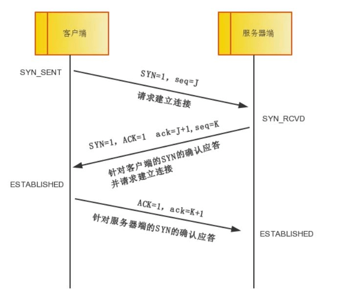

* 第一次握手：

客户端发送syn包(Seq=x)到服务器，并进入SYN_SEND状态，等待服务器确认；

* 第二次握手：

服务器收到syn包，必须确认客户的SYN（ack=x+1），同时自己也发送一个SYN包（Seq=y），即SYN+ACK包，此时服务器进入SYN_RECV状态；

* 第三次握手：

客户端收到服务器的SYN＋ACK包，向服务器发送确认包ACK(ack=y+1)，此包发送完毕，客户端和服务器进入ESTABLISHED状态，完成三次握手。

握手过程中传送的包里不包含数据，三次握手完毕后，客户端与服务器才正式开始传送数据。理想状态下，TCP连接一旦建立，在通信双方中的任何一方主动关闭连接之前，TCP 连接都将被一直保持下去。

### 四次挥手

数据传输完毕后，双方都可释放连接。最开始的时候，客户端和服务器都是处于ESTABLISHED状态，假设客户端主动关闭，服务器被动关闭。

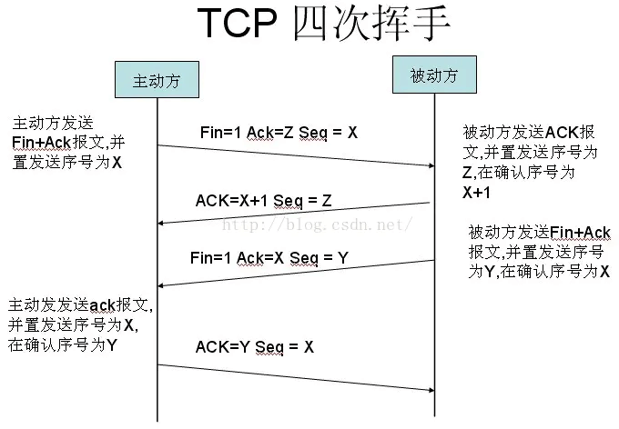

* 第一次挥手：

客户端发送一个FIN，用来关闭客户端到服务器的数据传送，也就是客户端告诉服务器：我已经不 会再给你发数据了(当然，在fin包之前发送出去的数据，如果没有收到对应的ack确认报文，客户端依然会重发这些数据)，但是，此时客户端还可以接受数据。

FIN=1，其序列号为seq=u（等于前面已经传送过来的数据的最后一个字节的序号加1），此时，客户端进入FIN-WAIT-1（终止等待1）状态。 TCP规定，FIN报文段即使不携带数据，也要消耗一个序号。

* 第二次挥手：

服务器收到FIN包后，发送一个ACK给对方并且带上自己的序列号seq，确认序号为收到序号+1（与SYN相同，一个FIN占用一个序号）。此时，服务端就进入了CLOSE-WAIT（关闭等待）状态。TCP服务器通知高层的应用进程，客户端向服务器的方向就释放了，这时候处于半关闭状态，即客户端已经没有数据要发送了，但是服务器若发送数据，客户端依然要接受。这个状态还要持续一段时间，也就是整个CLOSE-WAIT状态持续的时间。

此时，客户端就进入FIN-WAIT-2（终止等待2）状态，等待服务器发送连接释放报文（在这之前还需要接受服务器发送的最后的数据）。

* 第三次挥手：

服务器发送一个FIN，用来关闭服务器到客户端的数据传送，也就是告诉客户端，我的数据也发送完了，不会再给你发数据了。由于在半关闭状态，服务器很可能又发送了一些数据，假定此时的序列号为seq=w，此时，服务器就进入了LAST-ACK（最后确认）状态，等待客户端的确认。

* 第四次挥手：

主动关闭方收到FIN后，发送一个ACK给被动关闭方，确认序号为收到序号+1，此时，客户端就进入了TIME-WAIT（时间等待）状态。注意此时TCP连接还没有释放，必须经过2∗MSL（最长报文段寿命）的时间后，当客户端撤销相应的TCB后，才进入CLOSED状态。

服务器只要收到了客户端发出的确认，立即进入CLOSED状态。同样，撤销TCB后，就结束了这次的TCP连接。可以看到，服务器结束TCP连接的时间要比客户端早一些。

至此，完成四次挥手。

## 发送HTTP请求

发送HTTP请求，就是构建HTTP请求报文，并通过TCP协议，发送到服务器指定端口。

请求报文由`请求行`，`请求报头`，`请求正文`组成。

## 服务器处理请求并返回HTTP报文

对TCP连接进行处理，对HTTP协议进行解析，并按照报文格式进一步封装成HTTP Request对象，供上层使用。这一部分工作一般是由Web服务器去进行，比如Tomcat, Nginx和Apache等Web服务器。

HTTP报文也分成三段：`状态码`，`响应报头`和`响应报文`。

## 浏览器解析渲染页面


这个图就是Webkit解析渲染页面的过程。

* 解析HTML形成DOM树
* 解析CSS形成CSSOM 树
* 合并DOM树和CSSOM树形成渲染树
* 浏览器开始渲染并绘制页面


**要点**：
当输入URL到页面加载完成，发生了以下几个关键过程：

1. **DNS解析**：浏览器将URL解析为对应的IP地址。这个过程涉及多级DNS服务器，从本地缓存开始，如果没有找到，则递归查询根域名服务器、顶级域名服务器，直到找到目标服务器的IP地址。
2. **TCP连接**：浏览器通过三次握手与服务器建立TCP连接。一旦连接建立，浏览器可以发送HTTP请求。
3. **HTTP请求**：浏览器构建HTTP请求报文，通过TCP连接发送到服务器。请求报文包含请求行、请求头和请求正文。
4. **服务器处理请求**：服务器接收HTTP请求，解析请求内容，执行相应的处理（如数据库查询、文件读取等），并构建HTTP响应报文。
5. **HTTP响应**：服务器将响应报文通过TCP连接发送回浏览器。响应报文包含状态码、响应头和响应正文。
6. **浏览器解析渲染**：浏览器接收到HTTP响应后，解析HTML文档构建DOM树，解析CSS构建CSSOM树，合并两者形成渲染树，然后开始渲染页面。
7. **连接结束**：当浏览器完成页面渲染或收到服务器关闭连接的信号时，浏览器会发送TCP连接关闭的信号，服务器收到后，双方断开连接。


---
### 584. 网络模型分层大概有哪些层级？

**难度**：★☆☆☆☆ | **题型**：QA | **分类**：全部 / 计算机网络

**题目**：


**参考答案**：
计算机网络体系结构通常被划分为七层，即**OSI（Open System Interconnection，开放式系统互联）参考模型**和**TCP/IP（Transmission Control Protocol/Internet Protocol，传输控制协议/互联网协议）参考模型。**

## OSI参考模型包含七层，从底层到顶层依次是：

- 物理层（Physical Layer）：负责将比特流传输到物理媒介上，如电缆、光纤等。
- 数据链路层（Data Link Layer）：负责将比特流组装成帧，进行差错校验、流量控制等操作。
- 网络层（Network Layer）：负责将数据包从源节点传输到目的节点，实现路由选择、拥塞控制等功能。
- 传输层（Transport Layer）：负责为应用层提供可靠的端到端通信，常用的协议有TCP和UDP。
- 会话层（Session Layer）：负责建立、管理、终止进程之间的会话连接，使不同应用程序之间能够进行数据交互。
- 表示层（Presentation Layer）：负责对数据进行编码、解码和加密、解密，保证数据在传输过程中的安全性和正确性。
- 应用层（Application Layer）：提供用户接口，实现用户与计算机网络之间的交互。


## CP/IP参考模型包含四层，从底层到顶层依次是：

- 网络接口层（Network Interface Layer）：负责将数据帧封装成包，并进行物理层的传输。
- 网络层（Internet Layer）：负责将数据包从源节点传输到目的节点，实现路由选择、拥塞控制等功能。
- 传输层（Transport Layer）：负责为应用层提供可靠的端到端通信，常用的协议有TCP和UDP。
- 应用层（Application Layer）：提供用户接口，实现用户与计算机网络之间的交互。


**需要注意的是**: OSI参考模型和TCP/IP参考模型虽然不完全一致，但两者都包含了物理层、数据链路层、网络层和应用层。传输层和会话层、表示层在TCP/IP参考模型中被合并为了传输层。


**要点**：
七层和四层模型

---
### 617. DNS 协议了解多少?

**难度**：★★★☆☆ | **题型**：QA | **分类**：全部 / 计算机网络

**题目**：


**参考答案**：
**关键词**：DNS协议、DNS加速

### DNS 基本概念 

DNS（Domain Name System，域名系统）是因特网上用于将主机名转换为 IP 地址的协议。它是一个分布式数据库系统，通过将主机名映射到 IP 地址来实现主机名解析，并使用户能够通过更容易识别的主机名来访问互联网上的资源。

在使用 DNS 协议进行主机名解析时，系统首先查询本地 DNS 缓存。如果缓存中不存在结果，系统将向本地 DNS 服务器发出请求，并逐级向上查找，直到找到权威 DNS 服务器并获得解析结果。在域名解析的过程中，DNS 协议采用了分级命名空间的结构，不同的域名可以通过点分隔符分为多个级别，例如 `www.example.com` 可以分为三个级别：`www`、`example` 和 `com`。

除了将域名映射到 IP 地址之外，DNS 协议还支持多种其他功能：

1. 逆向映射：将 IP 地址解析为域名。
2. 邮件服务器设置：支持邮件服务器的自动发现和设置。
3. 负载均衡：DNS 还可以实现简单的负载均衡，通过将相同 IP 地址的主机名映射到不同的 IP 地址来分散负载。
4. 安全：DNSSEC（DNS Security Extensions，DNS 安全扩展）可以提供对域名解析的认证和完整性。

### 如何加快 DNS 的解析？

有以下几种方法可以加快 DNS 的解析：

1. 使用高速 DNS 服务器：默认情况下，网络服务提供商（ISP）为其用户提供 DNS 服务器。但是，这些服务器不一定是最快的，有时会出现瓶颈。如果您想加快 DNS 解析，请尝试使用其他高速 DNS 服务器，例如 Google 的公共 DNS 服务器或 OpenDNS。

2. 缓存 DNS 记录：在本地计算机上缓存 DNS 记录可以大大加快应用程序的响应。当您访问特定的网站时，计算机会自动缓存该网站的 DNS 记录。如果您再次访问该网站，则计算机将使用缓存的 DNS 记录。

3. 减少 DNS 查找：当您访问一个网站时，您的计算机将会查找该域名的 IP 地址。如果网站有很多域名，则查找过程可能会变得非常缓慢。因此，尽可能使用较少的域名可以减少 DNS 查找的数量，并提高响应速度。

4. 使用 CDN：CDN（内容分发网络）是一种将内容存储在全球多个位置的系统。这些位置通常都有专用的 DNS 服务器，可以大大加快站点的加载速度。

5. 使用 DNS 缓存工具：一些辅助工具可以帮助您优化与 DNS 相关的设置，例如免费的 DNS Jumper 软件和 Namebench 工具，它们可以测试您的 DNS 响应时间并为您推荐最佳配置。

通过使用高速 DNS 服务器、缓存 DNS 记录、减少 DNS 查找、使用 CDN 和 DNS 缓存工具等方法，可以显著提高 DNS 解析速度，从而加快应用程序响应时间。


---
### 621. TCP 粘包（TCP packet sticking）是什么？

**难度**：★★★☆☆ | **题型**：QA | **分类**：全部 / 计算机网络

**题目**：


**参考答案**：
TCP 粘包（TCP packet sticking）是一种在 TCP 协议中常见的现象，指的是接收方在读取数据时，可能会将来自多个发送包的数据合并在一起，或者将一个发送包的数据拆分成多个接收包进行读取。这种现象与 TCP 的数据传输机制有关，而 TCP 协议本身并不保留消息边界，只关心字节流的可靠传输。

### 粘包和拆包的原因
1. **流式协议**：
   - TCP 是一个流式协议，数据在网络上传输时被看作一个连续的字节流，没有明确的消息边界。这意味着发送的数据包在接收端可能会被合并，也可能被拆分。

2. **网络延迟和缓冲**：
   - TCP 可能会将多个小的数据包合并成一个较大的数据包发送，或者将一个较大的数据包拆分成多个小的包进行发送。这取决于网络状况和 TCP 实现的缓冲策略。

3. **发送和接收缓冲区**：
   - 发送方的缓冲区可能会在发送数据时合并多个数据块，而接收方的缓冲区可能会将这些数据块合并成一个完整的消息进行读取。

### 解决方案
1. **协议设计**：
   - 在应用层设计协议时，通常会在数据流中添加分隔符或消息长度字段，以明确消息的边界。例如，可以在每个消息前面加上固定长度的消息头，表示消息的长度。

2. **数据标识**：
   - 在数据传输过程中使用特定的标识符或分隔符来区分不同的消息。这种方法可以帮助接收方识别和处理不同的数据包。

3. **分段和重组**：
   - 在应用层进行分段和重组操作，确保从 TCP 流中提取出完整的消息。例如，可以使用协议来处理粘包和拆包问题，确保接收到的数据能够被正确解析。

**要点**：
TCP 粘包问题是由于 TCP 作为流式协议在传输数据时不保留消息边界所引起的。解决粘包和拆包问题通常需要在应用层设计协议，以明确数据的边界或长度，从而确保数据的正确接收和处理。

---
### 627. CORS 请求中，什么情况下会触发预检请求？

**难度**：★★☆☆☆ | **题型**：QA | **分类**：全部 / 计算机网络

**题目**：


**参考答案**：
在 **CORS** (Cross-Origin Resource Sharing) 请求中，**预检请求（Preflight Request）** 是浏览器为确保跨域安全而发送的一种请求。它使用 `OPTIONS` 方法，在实际请求之前询问目标服务器是否允许这种跨域操作。

---

### **触发预检请求的条件**

预检请求会在以下情况下被触发：

1. **请求方法不属于简单方法**：  
   请求方法不在以下列表中时会触发预检请求：
   - `GET`
   - `POST`
   - `HEAD`

2. **请求头包含非简单头**：  
   如果请求中使用了自定义头或某些不被认为是“简单头”的 HTTP 请求头，浏览器会触发预检请求。例如：
   - 自定义头，如 `X-Custom-Header`。
   - 非简单头，如 `Content-Type` 设置为以下值之外的类型：
     - `text/plain`
     - `application/x-www-form-urlencoded`
     - `multipart/form-data`

3. **`Content-Type` 非简单类型**：  
   当 `Content-Type` 不属于以下简单类型时：
   - `text/plain`
   - `application/x-www-form-urlencoded`
   - `multipart/form-data`

4. **`credentials` 的使用**：  
   如果请求设置了跨域凭据标志（`credentials: include`），并且跨域时不符合简单请求规则，也可能触发预检请求。

5. **使用了其他 HTTP 方法**：  
   如果使用了如 `PUT`、`DELETE`、`PATCH` 等方法，通常会触发预检请求。

---

### **预检请求的作用**

1. **探测服务器支持的跨域规则**：  
   预检请求通过 `OPTIONS` 方法发送，包含浏览器希望执行的跨域请求的相关信息，如：
   - 请求方法
   - 请求头
   - 请求的源站

   服务器需要在响应中明确表明是否允许该跨域请求。

2. **确定跨域安全性**：  
   预检请求帮助浏览器在实际发送数据之前验证目标服务器是否允许该操作，以防止潜在的安全威胁。

---

### **预检请求示例**

#### **请求示例**
客户端请求：
```http
OPTIONS /api/resource HTTP/1.1
Host: example.com
Origin: https://my-origin.com
Access-Control-Request-Method: POST
Access-Control-Request-Headers: X-Custom-Header
```

#### **服务器响应**
如果服务器允许跨域，则会返回类似的响应：
```http
HTTP/1.1 200 OK
Access-Control-Allow-Origin: https://my-origin.com
Access-Control-Allow-Methods: POST, GET, OPTIONS
Access-Control-Allow-Headers: X-Custom-Header
Access-Control-Max-Age: 3600
```

---

### **如何避免触发预检请求？**

1. **使用简单请求**：
   - 确保使用 `GET`、`POST` 或 `HEAD` 方法。
   - 避免自定义请求头，使用默认的 `Content-Type`（如 `application/x-www-form-urlencoded`）。

2. **优化服务器设置**：
   - 在响应中添加 `Access-Control-Max-Age`，指定预检请求结果的缓存时间（单位为秒），减少频繁的预检请求。例如：
     ```http
     Access-Control-Max-Age: 3600
     ```

3. **合并请求**：
   - 如果可以，将多个复杂请求拆分为简单请求，以减少跨域复杂度。

**要点**：
预检请求是浏览器为安全地处理复杂跨域请求而引入的机制。它主要在非简单请求中被触发，用于确保目标服务器明确允许该跨域请求。通过优化请求方法、请求头以及服务器设置，可以减少不必要的预检请求，从而提升性能和用户体验。

---
### 633. 浏览器对“队头阻塞”有什么优化？

**难度**：★★☆☆☆ | **题型**：QA | **分类**：全部 / 计算机网络

**题目**：


**参考答案**：
**队头阻塞（Head-of-Line Blocking, HOL Blocking）** 是指在网络通信或数据传输过程中，当一个请求或数据包的处理被阻塞时，它会导致后续的请求或数据包也被阻塞，即使它们本身并不需要等待。虽然队头阻塞最常见于 TCP 协议，但它也可以在浏览器中的许多情况中出现，特别是在浏览器发起多个并发请求时，例如 HTTP 请求、WebSocket 消息等。

### 浏览器对“队头阻塞”的优化

为了减少队头阻塞对性能的影响，现代浏览器和网络协议已经采用了多种优化方法。以下是一些常见的优化方式：

### 1. **HTTP/2 和 HTTP/3**
HTTP/2 和 HTTP/3 是较新的 HTTP 协议版本，它们通过多路复用和流控制机制有效地减少了队头阻塞问题。

#### HTTP/2
- **多路复用（Multiplexing）**：HTTP/2 允许在同一个连接上并发发送多个请求和响应，而不需要为每个请求创建新的 TCP 连接。这意味着请求和响应之间的顺序不再影响彼此的处理，减少了队头阻塞的可能性。
- **流和优先级**：HTTP/2 引入了流（Stream）的概念，每个请求和响应都是一个独立的流，并且浏览器可以为不同的流设置优先级，这样浏览器就可以优先处理关键资源，减少不必要的等待。

#### HTTP/3
- **基于 QUIC 协议**：HTTP/3 基于 QUIC（Quick UDP Internet Connections）协议，使用 UDP 而非 TCP 进行传输。与 HTTP/2 相比，HTTP/3 在优化连接恢复和减少队头阻塞方面做得更好，特别是在网络丢包和延迟较高的场景中。
- **更少的队头阻塞**：由于 QUIC 的流控制机制，单个流的阻塞不会影响其他流，因此 HTTP/3 比 HTTP/2 能更好地避免队头阻塞。

### 2. **连接复用（Connection Reuse）**
现代浏览器在处理多个请求时，尽量重用现有的连接，而不是为每个请求创建新的连接。这减少了连接建立时的延迟，并且通过 HTTP/2 和 HTTP/3 的多路复用功能，避免了传统 HTTP 请求中的队头阻塞问题。

### 3. **异步请求**
浏览器通常使用异步请求（如 `XMLHttpRequest` 或 `fetch` API）来发起多个 HTTP 请求，而不会阻塞页面的渲染或其他请求的发送。异步请求允许浏览器同时发出多个请求并在收到响应时分别处理，而不需要等待某个请求完成之后才能处理下一个请求。

### 4. **请求优先级**
浏览器可以为不同的资源分配不同的请求优先级。例如，CSS 和 JavaScript 资源通常被赋予较高的优先级，以确保它们尽早加载并渲染页面，而图像或其他资源可以在页面渲染后再进行加载。这种请求优先级机制有助于减少队头阻塞的影响。

### 5. **资源预加载和预取**
浏览器通过 `rel="preload"` 和 `rel="prefetch"` 来优化资源加载：
- **`preload`**：告知浏览器优先加载特定资源（例如，CSS、JS 或字体文件），使得这些资源可以尽早被解析和执行，避免延迟和阻塞。
- **`prefetch`**：告知浏览器加载下一个页面可能需要的资源，以便在用户访问时能够更快地加载，减少后续的阻塞。

### 6. **Service Worker 和离线缓存**
现代浏览器通过 Service Worker 提供了更智能的缓存和请求拦截机制，开发者可以通过 Service Worker 自定义缓存策略和请求处理方式，优化资源加载，避免不必要的阻塞。比如，在离线模式下，Service Worker 可以提前缓存资源，从而避免等待网络响应时的队头阻塞。

### 7. **JavaScript 异步加载**
对于 JavaScript 资源，现代浏览器支持通过 `async` 和 `defer` 属性异步加载脚本：
- **`async`**：脚本会在文档解析过程中异步下载并立即执行，不会阻塞页面的渲染。
- **`defer`**：脚本会在文档解析完毕后再执行，不会阻塞渲染，同时也不会影响后续脚本的下载。

**要点**：
现代浏览器通过以下优化技术减少队头阻塞的影响：
1. **HTTP/2 和 HTTP/3**：通过多路复用和流控制，减少了请求之间的依赖和等待，避免队头阻塞。
2. **连接复用**：减少了建立新连接的开销，并允许多个请求共享同一连接。
3. **异步请求**：浏览器通过异步请求机制允许并发处理多个请求，避免了同步请求的阻塞。
4. **请求优先级**：通过优先级机制优化资源加载顺序，避免重要资源被阻塞。
5. **资源预加载和预取**：使浏览器提前加载和缓存关键资源，减少延迟。
6. **Service Worker 和离线缓存**：通过离线缓存和请求拦截机制，优化了网络请求和缓存策略。

---
### 673. Blob，ArrayBuffer，Base64 分别有哪些使用场景？

**难度**：★★☆☆☆ | **题型**：QA | **分类**：全部 / 计算机网络

**题目**：


**参考答案**：
Blob、ArrayBuffer和Base64在Web开发中有各自的使用场景：

1. Blob：
   - 文件上传和下载：Blob对象可以用于将文件数据存储为二进制形式，并进行上传或下载操作。
   - 图片处理：可以将图像数据存储为Blob对象，并进行处理、显示或上传。
   - 多媒体处理：可用于处理音频和视频等多媒体数据。
   - 生成临时URL：可以使用Blob对象创建临时URL，用于在浏览器中显示或分享文件。

2. ArrayBuffer：
   - 图像处理：可以使用ArrayBuffer来处理图像数据，例如图像解码、图像滤镜等操作。
   - 网络请求：可用于处理二进制数据的网络请求，例如WebSocket通信或二进制协议的数据传输。
   - 数据加密：ArrayBuffer可以用于加密算法的处理和操作。
   - Web Workers：ArrayBuffer可用于在Web Worker中进行多线程数据处理。

3. Base64：
   - 图片嵌入：Base64编码可以将图片数据转换为字符串，可用于将图片嵌入到HTML、CSS或JavaScript中，减少网络请求。
   - 图片传输：在文本协议中，如JSON或XML，可以使用Base64编码将图片数据传输到服务器或其他系统。
   - 数据URL：可以将Base64编码的数据作为数据URL嵌入到HTML中，用于显示图像或其他媒体内容。
   - 数据存储：某些浏览器API或本地存储机制支持Base64编码的数据存储。

选择适当的数据表示方式取决于具体的需求，例如处理的数据类型、数据大小、数据传输方式等。

**要点**：
**答题要点：**

Blob、ArrayBuffer和Base64在Web开发中分别适用于不同的场景：

- **Blob**适合于文件上传下载、图片和多媒体处理，以及创建临时URL来显示或分享文件。
- **ArrayBuffer**适用于图像处理、网络请求中的二进制数据处理、数据加密以及Web Workers中的多线程数据处理。
- **Base64**适用于图片嵌入到HTML/CSS/JS中以减少请求、在文本协议中传输图片数据、作为数据URL显示媒体内容，以及某些浏览器API或本地存储中的数据存储。

选择哪种数据表示形式需根据数据类型、大小和传输方式等需求来决定。


---
### 682. 介绍下304过程

**难度**：★★☆☆☆ | **题型**：QA | **分类**：全部 / 计算机网络

**题目**：


**参考答案**：
首先304状态码是对客户端有缓存情况下服务端的一种响应。

客户端在请求一个文件的时候，发现自己缓存的文件有 `Last Modified` ，那么在请求中会包含 `If Modified Since` ，这个时间就是缓存文件的 Last Modified 。

因此，如果请求中包含 `If Modified Since`，就说明已经有缓存在客户端。服务端只要判断这个时间和当前请求的文件的修改时间就可以确定是返回 304 还是 200 。

对于静态文件，例如：CSS、图片，服务器会自动完成 Last Modified 和 If Modified Since 的比较，完成缓存或者更新。但是对于动态页面，就是动态产生的页面，往往没有包含 Last Modified 信息，这样浏览器、网关等都不会做缓存，也就是在每次请求的时候都完成一个 200 的请求。

因此，对于动态页面做缓存加速，首先要在 Response 的 HTTP Header 中增加 Last Modified 定义，其次根据 Request 中的 `If Modified Since` 和被请求内容的更新时间来返回 200 或者 304 。虽然在返回 304 的时候已经做了一次数据库查询，但是可以避免接下来更多的数据库查询，并且没有返回页面内容而只是一个 HTTP Header，从而大大的降低带宽的消耗，对于用户的感觉也是提高。

通常来说,缓存是个好东西.如果你想提高自己网站的访问速度,缓存是必须要考虑的。可是在调试的时候,有时候需要阻止缓存,这样才能确保你所访问到的资源是最新的。

**要点**：
304状态码是在客户端已有缓存的情况下，服务端的一种响应，它告诉客户端可以直接使用缓存，无需重新下载完整的资源。

当客户端请求一个文件时，如果发现本地有缓存，会包含`If Modified Since`头信息，这个时间就是缓存文件的`Last Modified`时间。服务端通过比较这个时间和当前文件的修改时间来决定是否返回304（Not Modified）还是200（OK）。

对于静态文件，如CSS、图片等，服务器会自动完成`Last Modified`和`If Modified Since`的比较，并决定是否更新缓存。但对于动态页面，由于通常没有包含`Last Modified`信息，浏览器和网关不会缓存这些页面，每次请求都会返回完整的200响应。

为了给动态页面添加缓存加速，需要在响应头中添加`Last Modified`信息，并根据请求中的`If Modified Since`和文件的更新时间来决定返回304还是200。尽管返回304时会进行一次数据库查询，但可以避免后续更多的查询，且仅返回HTTP头信息而非页面内容，从而减少带宽消耗，提高用户体验。

总的来说，缓存是一个提升网站访问速度的好方法，但在调试时，有时需要阻止缓存以确保访问到最新的资源。


---
### 694. 强缓存和协商缓存分别是什么？

**难度**：★★☆☆☆ | **题型**：QA | **分类**：全部 / 计算机网络

**题目**：


**参考答案**：
这里说的缓存是指浏览器（客户端）在本地磁盘中对访问过的资源保存的副本文件。

浏览器缓存主要有以下几个优点：

* 减少重复数据请求，避免通过网络再次加载资源，节省流量。
* 降低服务器的压力，提升网站性能。
* 加快客户端加载网页的速度， 提升用户体验。

浏览器缓存分为强缓存和协商缓存，两者有两个比较明显的区别：

* 如果浏览器命中强缓存，则不需要给服务器发请求；而协商缓存最终由服务器来决定是否使用缓存，即客户端与服务器之间存在一次通信。
* 在 chrome 中强缓存（虽然没有发出真实的 http 请求）的请求状态码返回是 200 (from cache)；而协商缓存如果命中走缓存的话，请求的状态码是 304 (not modified)。 不同浏览器的策略不同，在 Fire Fox中，from cache 状态码是 304.

## 请求流程

浏览器在第一次请求后缓存资源，再次请求时，会进行下面两个步骤：

* 浏览器会获取该缓存资源的 header 中的信息，根据 response header 中的 expires 和 cache-control 来判断是否命中强缓存，如果命中则直接从缓存中获取资源。
* 如果没有命中强缓存，浏览器就会发送请求到服务器，这次请求会带上 IF-Modified-Since 或者 IF-None-Match, 它们的值分别是第一次请求返回 Last-Modified或者 Etag，由服务器来对比这一对字段来判断是否命中。如果命中，则服务器返回 304 状态码，并且不会返回资源内容，浏览器会直接从缓存获取；否则服务器最终会返回资源的实际内容，并更新 header 中的相关缓存字段。

## 强缓存

强缓存是根据返回头中的 Expires 或者 Cache-Control 两个字段来控制的，都是表示资源的缓存有效时间。

* Expires 是 http 1.0 的规范，值是一个GMT 格式的时间点字符串，比如 Expires:Mon,18 Oct 2066 23:59:59 GMT 。这个时间点代表资源失效的时间，如果当前的时间戳在这个时间之前，则判定命中缓存。有一个缺点是，失效时间是一个绝对时间，如果服务器时间与客户端时间偏差较大时，就会导致缓存混乱。而服务器的时间跟用户的实际时间是不一样是很正常的，所以 Expires 在实际使用中会带来一些麻烦。
* Cache-Control这个字段是 http 1.1 的规范，一般常用该字段的 max-age 值来进行判断，它是一个相对时间，比如 .Cache-Control:max-age=3600 代表资源的有效期是 3600 秒。并且返回头中的 Date 表示消息发送的时间，表示当前资源在 Date ~ Date +3600s 这段时间里都是有效的。不过我在实际使用中常常遇到设置了 max-age 之后，在 max-age 时间内重新访问资源却会返回 304 not modified ，这是由于服务器的时间与本地的时间不同造成的。当然 Cache-Control 还有其他几个值可以设置， 不过相对来说都很少用了：
	* no-cache 不使用本地缓存。需要使用协商缓存。
	* no-store直接禁止浏览器缓存数据，每次请求资源都会向服务器要完整的资源， 类似于 network 中的 disabled cache。
	* public 可以被所有用户缓存，包括终端用户和 cdn 等中间件代理服务器。
	* private 只能被终端用户的浏览器缓存。

如果 Cache-Control与 Expires 同时存在的话， Cache-Control 的优先级高于 Expires 。

## 协商缓存

协商缓存是由服务器来确定缓存资源是否可用。 主要涉及到两对属性字段，都是成对出现的，即第一次请求的响应头带上某个字, Last-Modified 或者 Etag，则后续请求则会带上对应的请求字段 If-Modified-Since或者 If-None-Match，若响应头没有 Last-Modified 或者 Etag 字段，则请求头也不会有对应的字段。

* Last-Modified/If-Modified-Since 二者的值都是 GMT 格式的时间字符串， Last-Modified 标记最后文件修改时间， 下一次请求时，请求头中会带上 If-Modified-Since 值就是 Last-Modified 告诉服务器我本地缓存的文件最后修改的时间，在服务器上根据文件的最后修改时间判断资源是否有变化， 如果文件没有变更则返回 304 Not Modified ，请求不会返回资源内容，浏览器直接使用本地缓存。当服务器返回 304 Not Modified 的响应时，response header 中不会再添加的 Last-Modified 去试图更新本地缓存的 Last-Modified， 因为既然资源没有变化，那么 Last-Modified 也就不会改变；如果资源有变化，就正常返回返回资源内容，新的 Last-Modified 会在 response header 返回，并在下次请求之前更新本地缓存的 Last-Modified，下次请求时，If-Modified-Since会启用更新后的 Last-Modified。
* Etag/If-None-Match， 值都是由服务器为每一个资源生成的唯一标识串，只要资源有变化就这个值就会改变。服务器根据文件本身算出一个哈希值并通过 ETag字段返回给浏览器，接收到 If-None-Match 字段以后，服务器通过比较两者是否一致来判定文件内容是否被改变。与 Last-Modified 不一样的是，当服务器返回 304 Not Modified 的响应时，由于在服务器上ETag 重新计算过，response header中还会把这个 ETag 返回，即使这个 ETag 跟之前的没有变化。

HTTP 中并没有指定如何生成 ETag，可以由开发者自行生成，哈希是比较理想的选择。


**要点**：
浏览器缓存是一种在本地磁盘上保存访问过的资源副本的机制，其目的是提高网页加载速度和节省网络流量。

以下是浏览器缓存的优点和分类的总结：

**优点：**

1. 减少重复数据请求，节省流量。
2. 降低服务器压力，提升网站性能。
3. 加快客户端加载网页速度，提升用户体验。

**浏览器缓存分类：**

- **强缓存**：浏览器直接从本地缓存获取资源，无需与服务器通信。
- **协商缓存**：浏览器与服务器进行一次通信，由服务器决定是否使用缓存。

**强缓存与协商缓存的区别：**

- 强缓存无需向服务器发送请求，而协商缓存需要。
- 在Chrome中，强缓存的请求状态码为200 (from cache)，而协商缓存为304 (not modified)。

**请求流程：**

1. 浏览器检查缓存资源的header信息，判断是否命中强缓存。
2. 如果未命中强缓存，浏览器发送请求到服务器，携带协商缓存的字段（如IF-Modified-Since或IF-None-Match）。

**强缓存控制：**

- **Expires**：HTTP 1.0规范，指定资源失效的绝对时间。
- **Cache-Control**：HTTP 1.1规范，常用max-age指定资源的相对有效期。

**协商缓存控制：**

- **Last-Modified/If-Modified-Since**：基于文件最后修改时间。
- **Etag/If-None-Match**：基于服务器生成的资源唯一标识。

**注意事项：**

- Cache-Control的优先级高于Expires。
- 如果服务器返回304 Not Modified，则不会更新Last-Modified，但会返回新的ETag。
- ETag的生成方式由服务器决定，通常使用哈希值。


---
### 723. 如何实现WebSocket的断线重连机制？

**难度**：★★☆☆☆ | **题型**：QA | **分类**：全部 / 计算机网络

**题目**：


**参考答案**：
实现 **WebSocket 的断线重连机制**，一般需要在客户端（浏览器/前端）做一些健壮性处理。核心思路就是：

1. **捕获异常/断开事件**

   * 监听 `onclose`、`onerror`，在连接关闭或出错时，启动重连逻辑。
   * 可选：在 `onmessage` 里做心跳检测，发现服务端长时间未响应也触发重连。

2. **指数退避/固定间隔重连**

   * 避免频繁重连给服务器造成压力。
   * 典型策略：

     * 每次重连延迟 `delay = Math.min(maxDelay, baseDelay * 2^attempt)`
     * 或者使用固定间隔（如 5 秒）。

3. **心跳机制（保持长连接）**

   * 定时发送心跳包（如 `ping`），服务端回应（如 `pong`）。
   * 如果心跳超时未响应，则主动关闭并重连。


### 示例实现（JavaScript）

```js
class ReconnectWebSocket {
  constructor(url, options = {}) {
    this.url = url;
    this.ws = null;
    this.lockReconnect = false; // 防止重复重连
    this.reconnectDelay = options.reconnectDelay || 2000; // 初始重连间隔
    this.maxDelay = options.maxDelay || 30000; // 最大重连间隔
    this.heartbeatInterval = options.heartbeatInterval || 10000; // 心跳间隔
    this.heartbeatTimer = null;
    this.reconnectTimer = null;

    this.createWebSocket();
  }

  createWebSocket() {
    try {
      this.ws = new WebSocket(this.url);

      this.initEventHandlers();
    } catch (e) {
      this.reconnect();
    }
  }

  initEventHandlers() {
    this.ws.onopen = () => {
      console.log("WebSocket 连接成功");
      this.startHeartbeat();
    };

    this.ws.onmessage = (msg) => {
      console.log("收到消息:", msg.data);
      // 服务端 pong 响应时，重置心跳
      if (msg.data === "pong") {
        this.resetHeartbeat();
      }
    };

    this.ws.onerror = () => {
      console.log("WebSocket 出错");
      this.reconnect();
    };

    this.ws.onclose = () => {
      console.log("WebSocket 关闭");
      this.reconnect();
    };
  }

  reconnect() {
    if (this.lockReconnect) return;
    this.lockReconnect = true;
    console.log("准备重连...");

    this.reconnectTimer && clearTimeout(this.reconnectTimer);
    this.reconnectTimer = setTimeout(() => {
      this.createWebSocket();
      this.lockReconnect = false;
      // 增加延迟，避免频繁重连
      this.reconnectDelay = Math.min(this.reconnectDelay * 2, this.maxDelay);
    }, this.reconnectDelay);
  }

  startHeartbeat() {
    this.heartbeatTimer && clearInterval(this.heartbeatTimer);
    this.heartbeatTimer = setInterval(() => {
      if (this.ws.readyState === WebSocket.OPEN) {
        console.log("发送心跳 ping");
        this.ws.send("ping");
      }
    }, this.heartbeatInterval);
  }

  resetHeartbeat() {
    console.log("收到 pong，心跳正常");
  }

  send(msg) {
    if (this.ws.readyState === WebSocket.OPEN) {
      this.ws.send(msg);
    } else {
      console.log("连接未建立，消息丢弃");
    }
  }
}

// 使用示例
const ws = new ReconnectWebSocket("wss://example.com/socket", {
  reconnectDelay: 2000,
  maxDelay: 30000,
  heartbeatInterval: 10000,
});
```


**要点**：
1. **重连时是否保留消息队列**

   * 可以在断开时缓存未发送的消息，等重连后再补发。
2. **避免服务端踢出**

   * 需要和服务端约定心跳协议（如 `ping/pong`），否则可能会被网关/代理关闭连接。
3. **区分“主动关闭”与“异常关闭”**

   * 主动关闭时不需要重连。
4. **移动端环境**

   * 在 App/浏览器后台时可能会被系统挂起，需要特别处理。

---
### 760. 跨域时怎么处理 cookie？

**难度**：★★☆☆☆ | **题型**：QA | **分类**：全部 / 计算机网络

**题目**：


**参考答案**：
在默认情况下，跨域请求是不会携带 Cookie 的，这是为了保护用户隐私和安全考虑。然而，如果确实需要在跨域请求中携带 Cookie，可以通过以下方式进行处理：

1. **设置 withCredentials 属性**：在发送跨域请求的客户端代码中，将 `withCredentials` 属性设置为 `true`。例如，在使用 XMLHttpRequest 或 Fetch API 发起请求时，可以添加如下配置：

   ```javascript
   // XMLHttpRequest
   const xhr = new XMLHttpRequest();
   xhr.withCredentials = true;
   xhr.open('GET', 'https://example.com', true);
   xhr.send();

   // Fetch API
   fetch('https://example.com', { credentials: 'include' })
     .then(response => response.json())
     .then(data => console.log(data))
     .catch(error => console.log(error));
   ```

2. **服务端处理 CORS（跨域资源共享）请求**：在服务器端，需要对来自其他域的请求进行特殊的处理，以允许跨域请求携带 Cookie。具体的方法取决于所使用的后端技术。

   - 对于 Express 框架，可以使用 `cors` 中间件，并将 `credentials` 设置为 `true`：

     ```javascript
     const express = require('express');
     const cors = require('cors');

     const app = express();
     app.use(cors({ origin: 'http://example.com', credentials: true }));
     ```

   - 对于其他后端框架或原生 Node.js，需要在响应头中设置适当的 CORS 头部：

     ```javascript
     response.setHeader('Access-Control-Allow-Origin', 'http://example.com');
     response.setHeader('Access-Control-Allow-Credentials', 'true');
     ```

需要注意，启用跨域请求携带 Cookie 的设置需谨慎，确保服务端和客户端都进行了适当的安全措施，以防止潜在的安全风险。此外，还要注意遵循同源策略，并只允许受信任的域名访问和携带 Cookie。

**要点**：
跨域请求默认不携带Cookie，但若需携带，可采取以下措施：

1. **客户端设置**：在发起跨域请求时，将`withCredentials`属性设为`true`。
   - XMLHttpRequest示例：`xhr.withCredentials = true;`
   - Fetch API示例：`fetch(url, { credentials: 'include' });`
2. **服务端处理CORS**：服务器端需配置允许跨域请求携带Cookie。
   - Express框架使用`cors`中间件，并设置`credentials: true`。
   - 其他后端或原生Node.js需设置响应头：

     ```javascript
     response.setHeader('Access-Control-Allow-Origin', 'http://example.com');
     response.setHeader('Access-Control-Allow-Credentials', 'true');
     ```

需谨慎处理跨域携带Cookie的设置，确保安全措施得当，防止安全风险，并遵循同源策略，只允许信任的域名访问。


---
### 762. HTTP和HTTPS的区别

**难度**：★★☆☆☆ | **题型**：QA | **分类**：全部 / 计算机网络

**题目**：


**参考答案**：
<p><code>HTTPS</code>是在<code>HTTP</code>的基础上加入了<code>SSL</code>协议，<code>SSL</code>依靠证书来验证服务器的身份，并为浏览器和服务器之间的通信加密（在传输层）<br/> <code>HTTP</code> + 加密 + 认证 + 完整性保护 = <code>HTTPS</code><br/> </p><ol><li> <code>HTTPS</code>协议需要到CA申请证书或自制证书<br/> </li><li> <code>HTTP</code>的信息是明文传输；<br/> <code>HTTPS</code>则是具有安全性的ssl加密<br/> </li><li> <code>HTTP</code>是直接与TCP进行数据传输；<br/> 而<code>HTTPS</code>运行在<code>SSL/TLS</code>(安全传输层协议)之上，<code>SSL/TLS</code>运行在<code>TCP</code>之上，用的端口也不一样，前者是80（需要国内备案），后者是443<br/> </li><li> <code>HTTP</code>的连接很简单，是无状态的；<br/> <code>HTTPS</code>协议是由<code>SSL+HTTP</code>协议构建的，可进行加密传输、身份认证的网络协议，比<code>HTTP</code>协议安全<br/> </li></ol><p> </p>


---
### 810. 说说对 HTTP3 的了解

**难度**：★★★☆☆ | **题型**：QA | **分类**：全部 / 计算机网络

**题目**：


**参考答案**：

## HTTP/3的来源  

由于TCP和UDP两者在运输层存在一定差异，TCP的传递效率与UDP相比有天然劣势，于是Google基于UDP开发出了新的协议QUIC(Quick UDP Internet Connections)，希望取代TCP提高传输效率，后经过协商将QUIC协议更名为HTTP/3。

## QUIC概述

TCP、UDP是我们所熟悉的传输层协议，UDP比TCP相比效率更高但并不具备传输可靠性。而QUIC便是看中UDP传输效率这一特性，并结合了TCP、TLS、HTTP/2的优势，加以优化。  

于是在QUIC上层的应用层所运行的HTTP协议也就被称为HTTP/3。  

**HTTP over QUIC is HTTP/3**  
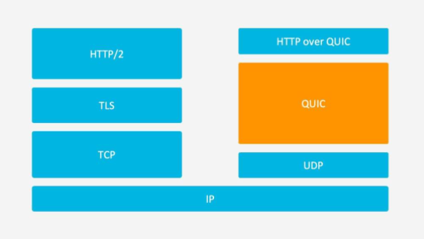

## HTTP/3新特性

### 1. **零RTT建立连接**  
如下图，传统HTTP/2(所有HTTP/2的浏览器均基于HTTPS)传输数据前需要三次RTT，即使将第一次TLS握手的对称秘钥缓存也需要两次RTT才能传递数据。  
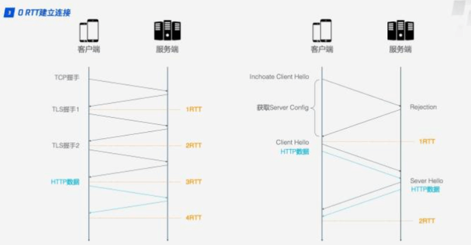  

对于HTTP/3而言，仅仅需要一次RTT即可传递数据，如果将其缓存，就可将RTT减少至零。 

其核心就是DH秘钥交换算法。  

* 客户端向服务端请求数据。  
* 服务端生成g、p、a三个随机数，用三个随机数生成A。将a保留后，将g、p、A(Server Config)传递到客户端。  
* 客户端生成随机数b，将b保留后，用g、p、b三个随机数生成B。  
* 客户端再使用A、b、p生成秘钥K，用K**加密HTTP数据**并与B一同发送到服务端。  
* 服务端再使用B、a、p得到相同秘钥K，并解密HTTP数据。

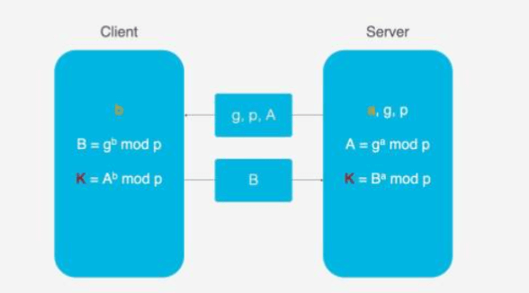  

**至此即可完成一次RTT对连接的建立，当缓存Server Config后零RTT即可进行数据传递。**

### 2. **连接迁移**  

传统连接通过源IP、源端口、目的IP、目的端口进行连接，当网络发生更换后连接再次建立时延较长。  

HTTP/3使用Connection ID对连接保持，只要Connection ID不改变，连接仍可维持。  

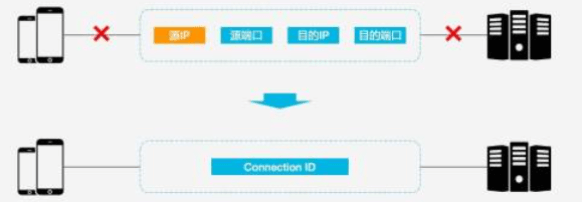

### 3. **队头阻塞/多路复用**  

* TCP作为面向连接的协议，对每次请求序等到ACK才可继续连接，一旦中间连接丢失将会产生队头阻塞。  
* HTTP/1.1中提出Pipelining的方式，单个TCP连接可多次发送请求，但依旧会有中间请求丢失产生阻塞的问题。  
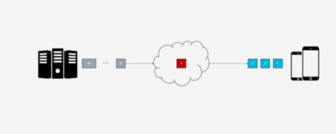  
* HTTP/2中将请求粒度减小，通过Frame的方式进行请求的发送。但在TCP层Frame组合得到Stream进行传输，一旦出现Stream中的Frame丢失，其后方的Stream都将会被阻塞。  
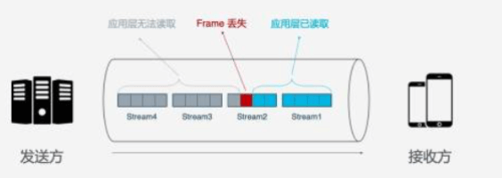  
* 对于HTTP/2而言，浏览器会默认采取TLS方式传输，TLS基于Record组织数据，每个Record包含16K，其中有12个TCP的包，一旦其中一个TCP包出现问题将会导致整个Record无法解密。这也是网络环境较差时HTTP/2的传输速度比HTTP/1.1更慢的原因。  
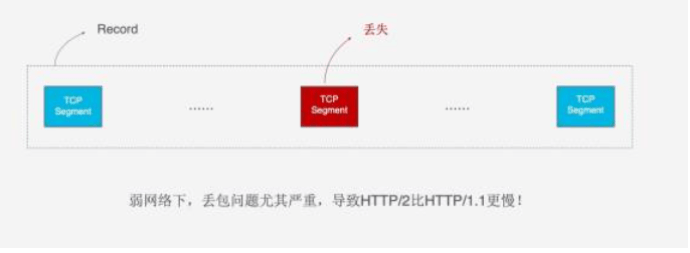  
* HTTP/3基于UDP的传输，不保证连接可靠性，也就没有对头阻塞的后果。同样传输单元与加密单元为Packet，在TLS下也可避免对头阻塞的问题。

### 4. **拥塞控制**  

* 热拔插：TCP对于拥塞控制在于传输层，QUIC可在应用层操作改变拥塞控制方法。  
* 前向纠错(FEC)：将数据切割成包后可对每个包进行异或运算，将运算结果随数据发送。一旦丢失数据可据此推算。(带宽换时间)  
* 单调递增的Packet Number：TCP在超时重传后的两次ACK接受情况并不支持的很好。导致RTT和RTO的计算有所偏差。HTTP/3对此进行改进，一旦重传后的Packet N会递增。  

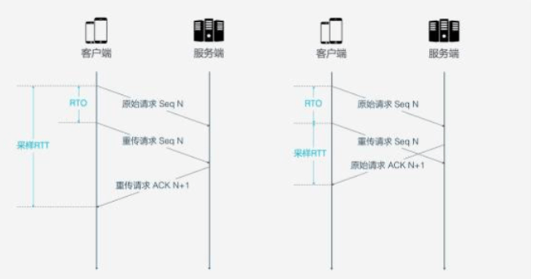  

* ACK Delay  

   HTTP/3在计算RTT时健壮的考虑了服务端的ACK处理时延。  
   
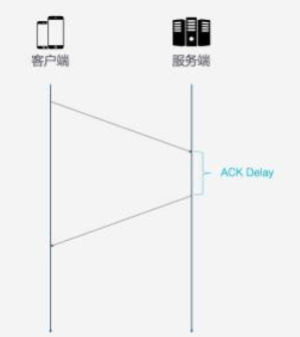  

* 更多地ACK块  

   一般每次请求都会对应一个ACK，但这样也会浪费(下载场景只需返回数据即可)。  
   
   于是可设计成每次返回3个ACK block。在HTTP/3将其扩充成最多可携带256 个ACK block。
   
### 5. **流量控制**  

TCP使用滑动窗口的方式对发送方的流量进行控制。而对接收方并无限制。在QUIC中便补齐了这一短板。  

QUIC中接收方从单挑Stream和整条连接两个角度动态调整接受的窗口大小。


**要点**：
HTTP/3是基于QUIC协议的一种新型HTTP协议，旨在提高传输效率并克服TCP的一些限制。以下是HTTP/3的一些关键特性：

1. **零RTT建立连接**：HTTP/3通过使用新的DH秘钥交换算法，允许客户端和服务器在不需要预先建立连接的情况下直接传输数据。这种零RTT（Round-Trip Time）的连接建立方式大大提高了初始连接的速度。
2. **连接迁移**：当网络环境发生变化时，HTTP/3能够无缝迁移连接，而无需重新建立新的连接。这通过在客户端和服务器之间维护一个唯一的Connection ID来实现。
3. **队头阻塞/多路复用**：HTTP/3通过将数据分割成更小的Packet，并在不同的Stream中传输，从而避免了队头阻塞的问题。每个Stream可以独立于其他Stream进行数据传输，提高了整体的传输效率。
4. **拥塞控制**：HTTP/3在应用层实现了更精细的拥塞控制策略，如热拔插、前向纠错（FEC）和单调递增的Packet Number，这些机制可以动态调整发送速率，以适应网络拥塞情况，并提高数据传输的可靠性。
5. **流量控制**：HTTP/3通过接收方动态调整接受的窗口大小，实现了更有效的流量控制。接收方可以更灵活地控制数据流量，以避免接收过载或发送方发送速度过快的问题。

HTTP/3的这些新特性使得它在性能、可靠性和效率方面都有了显著的提升，尤其适合于需要实时数据传输和低延迟的应用场景。


---
### 819. Nginx支持哪些负载均衡调度算法？

**难度**：★★★★☆ | **题型**：QA | **分类**：全部 / 计算机网络

**题目**：


**参考答案**：
* weight轮询（默认，常用，具有HA功效！）：接收到的请求按照权重分配到不同的后端服务器，即使在使用过程中，某一台后端服务器宕机，Nginx会自动将该服务器剔除出队列，请求受理情况不会受到任何影响。 这种方式下，可以给不同的后端服务器设置一个权重值(weight)，用于调整不同的服务器上请求的分配率；权重数据越大，被分配到请求的几率越大；该权重值，主要是针对实际工作环境中不同的后端服务器硬件配置进行调整的。
* ip_hash（常用）：每个请求按访问ip的hash结果分配，这样每个访客固定访问一个后端服务器，这也在一定程度上解决了集群部署环境下session共享的问题。
* fair：智能调整调度算法，动态的根据后端服务器的请求处理到响应的时间进行均衡分配，响应时间短处理效率高的服务器分配到请求的概率高，响应时间长处理效率低的服务器分配到的请求少；结合了前两者的优点的一种调度算法。但是需要注意的是Nginx默认不支持fair算法，如果要使用这种调度算法，请安装upstream_fair模块。
* url_hash：按照访问的url的hash结果分配请求，每个请求的url会指向后端固定的某个服务器，可以在Nginx作为静态服务器的情况下提高缓存效率。同样要注意Nginx默认不支持这种调度算法，要使用的话需要安装Nginx的hash软件包。

**要点**：
Nginx支持多种后端服务器调度算法，用于将客户端请求合理地分配给不同的后端服务器。以下是几种常见的调度算法：

1. **weight轮询（默认）**：
   - **功能**：按权重比例分配请求到不同的后端服务器。
   - **特点**：后端服务器权重值越大，分配到的请求越多。服务器故障时，Nginx会自动将其从队列中剔除。
   - **适用场景**：适用于后端服务器硬件配置不同，需要根据性能调整请求分配的场景。
2. **ip_hash**：
   - **功能**：根据客户端IP地址的哈希结果将请求固定分配给某台后端服务器，有助于维持会话状态。
   - **特点**：每个客户端固定访问同一台服务器。
   - **适用场景**：适用于需要保持会话状态的Web应用。
3. **fair**：
   - **功能**：根据后端服务器的响应时间动态调整请求分配，响应时间短的服务器分配到更多请求。
   - **特点**：结合了weight轮询和ip_hash的优点，能更智能地分配请求。
   - **注意**：Nginx默认不支持fair算法，需要安装upstream_fair模块。
   - **适用场景**：适用于需要根据服务器性能实时调整负载的场景。
4. **url_hash**：
   - **功能**：根据访问的URL的哈希结果将请求分配给固定的后端服务器，有助于提高缓存效率。
   - **特点**：每个URL固定访问后端的一台服务器。
   - **注意**：Nginx默认不支持url_hash算法，需要安装hash软件包。
   - **适用场景**：适用于Nginx作为静态服务器时，提高缓存效率的场景。


---
### 821. CORS 是如何实现跨域的？

**难度**：★★☆☆☆ | **题型**：QA | **分类**：全部 / 计算机网络

**题目**：


**参考答案**：
CORS (Cross-Origin Resource Sharing) 的实现机制是通过 HTTP 头部协商来安全地控制跨域请求，其核心流程可分为**简单请求**和**预检请求**两种模式：

### 一、简单请求（Simple Request）
满足以下条件的请求会直接发送（无需预检）：
1. **方法限制**：GET / HEAD / POST
2. **头部限制**：仅允许以下安全头部：
   - `Accept`、`Accept-Language`、`Content-Language`
   - `Content-Type` 仅限 `text/plain`、`multipart/form-data`、`application/x-www-form-urlencoded`
3. **流程**：
   - 浏览器自动添加 `Origin` 头部（如 `Origin: https://foo.com`）
   - 服务端响应需包含：
     ```http
     Access-Control-Allow-Origin: https://foo.com  // 或 *（不推荐带凭证时使用）
     Access-Control-Allow-Credentials: true       // 可选，允许携带 Cookie
     ```
   - 若响应头未通过验证，浏览器会拦截响应

### 二、预检请求（Preflight Request）
不满足简单请求条件的请求（如 PUT/DELETE 或自定义头部），会先发送 OPTIONS 请求进行协商：
1. **预检请求头部**：
   ```http
   OPTIONS /resource HTTP/1.1
   Origin: https://foo.com
   Access-Control-Request-Method: DELETE
   Access-Control-Request-Headers: X-Custom-Header
   ```
2. **服务端必须响应**：
   ```http
   HTTP/1.1 204 No Content
   Access-Control-Allow-Origin: https://foo.com
   Access-Control-Allow-Methods: GET, POST, DELETE
   Access-Control-Allow-Headers: X-Custom-Header
   Access-Control-Max-Age: 86400  // 缓存预检结果（秒）
   ```
3. **正式请求**：预检通过后才会发送实际请求

### 三、关键控制头部
| 头部字段                          | 作用                                                                 |
|-----------------------------------|----------------------------------------------------------------------|
| `Access-Control-Allow-Origin`     | 指定允许访问的源（需精确匹配或配置动态白名单）                       |
| `Access-Control-Expose-Headers`   | 允许前端访问的额外响应头（默认仅能获取简单响应头）                   |
| `Access-Control-Allow-Credentials`| 是否允许携带 Cookie（需配合 `credentials: 'include'` 使用）          |
| `Access-Control-Allow-Methods`    | 预检请求中声明允许的 HTTP 方法                                       |
| `Access-Control-Allow-Headers`    | 预检请求中声明允许的自定义请求头                                     |

### 四、实际场景示例
**带凭证的 API 调用**：
```javascript
fetch('https://api.example.com/data', {
  credentials: 'include',
  headers: { 'Authorization': 'Bearer token' }
})
```
服务端需配置：
```http
Access-Control-Allow-Origin: https://yourdomain.com  // 不能为 *
Access-Control-Allow-Credentials: true
Access-Control-Expose-Headers: Authorization
```

### 五、安全注意事项
1. 避免滥用 `*` 通配符，应配置明确的源白名单
2. 敏感操作应结合 CSRF 防护（如 SameSite Cookie）
3. 对于复杂请求，合理设置 `Access-Control-Max-Age` 减少预检开销

**要点**：
- 简单请求通过 `Origin` + `Access-Control-Allow-Origin` 快速协商
- 非简单请求需预检 OPTIONS 验证
- 带凭证的请求需严格配置源和 `Allow-Credentials`
- 服务端通过响应头声明跨域权限策略
- 现代浏览器自动处理 CORS 流程，开发者只需正确配置头部

---
### 869. get 请求是否限制了传参长度？

**难度**：★☆☆☆☆ | **题型**：QA | **分类**：全部 / 计算机网络

**题目**：


**参考答案**：
1. HTTP 协议未规定 GET 和 POST 的长度限制
2. GET 的最大长度显示是因为浏览器和 web 服务器限制了 URI 的长度
3. 不同的浏览器和 WEB 服务器，限制的最大长度不一样
4. 要支持 IE，则最大长度为 2083byte，若只支持 Chrome，则最大长度 8182byte


---
### 889. get 和 post 请求在缓存方面有什么区别？

**难度**：★★☆☆☆ | **题型**：QA | **分类**：全部 / 计算机网络

**题目**：


**参考答案**：
缓存一般只适用于那些不会更新服务端数据的请求。

一般 get 请求都是查找请求，不会对服务器资源数据造成修改，而 post 请求一般都会对服务器数据造成修改，所以，一般会对 get 请求进行缓存，很少会对 post 请求进行缓存。


---
### 892. http3 中的 QUIC 是什么协议？

**难度**：★☆☆☆☆ | **题型**：QA | **分类**：全部 / 计算机网络

**题目**：


**参考答案**：
#### **定义**

- **QUIC**：QUIC 是一个基于 UDP 的传输层协议，旨在减少网络延迟和提高性能。最初由 Google 开发，现在已经成为 IETF 的标准化项目。
- **主要目标**：提高传输效率，减少连接建立和数据传输的延迟，解决传统 TCP 和 HTTP/2 中的一些性能瓶颈。

#### **特点**

- **无连接的传输**：QUIC 使用 UDP 进行数据传输，不同于 TCP 的面向连接特性。这使得 QUIC 可以更灵活地管理数据流和连接。
- **多路复用**：类似于 HTTP/2，QUIC 支持多路复用，允许在一个连接上并发地传输多个数据流，从而避免队头阻塞。
- **内置加密**：QUIC 集成了 TLS（传输层安全性），在数据传输时提供加密和安全性，消除了额外的握手过程。
- **0-RTT 数据传输**：QUIC 支持 0-RTT 数据传输，使得在建立连接时可以立即开始数据传输，减少延迟。


**要点**：
QUIC：一个基于 UDP 的传输协议，旨在提高传输效率，减少延迟，并集成了加密。

---
### 897. TCP和HTTP请求之间有什么关系？

**难度**：★★☆☆☆ | **题型**：QA | **分类**：全部 / 计算机网络

**题目**：


**参考答案**：
我们知道开启一个TCP链接之后，HTTP请求就会并行发出。
首先我们来思考一个问题，**浏览器与服务器建立一个TCP链接之后，会不会在完成一个HTTP请求后立马断开？**  

*   HTTP/1.0的时候是会的，需要手动设置`Connection: keep-alive`。
*   HTTP/1.1的时候`Connection`默认为`keep-alive` 。

一般情况下，复用的 TCP连接在**等待**设置的**超时**时间之后还没有被任何连接使用的话，就会**主动断开**。

### 一个TCP链接可以对应多少个HTTP请求？

一个TCP链接可以对应多个HTTP请求，只要这个TCP链接没有断开，就可以发送HTTP请求。

### 这些HTTP请求可以同时发送，同时响应么，在一个TCP链接中？比如：三个HTTP请求同时发送，同时接收响应。

在HTTP/1.1中，单个TCP链接在同一时刻只能处理一个请求，意思就是：任意两个 HTTP 请求从开始到结束的时间在同一个 TCP链接里不能重叠。HTTP/1.1 规范中规定了 Pipelining 来试图解决这个问题， 但是浏览器默认关闭了这个功能。

**原因：**

* 一些代理服务器不能正确的处理 HTTP Pipelining。      
* 正确的流水线实现是复杂的。      
* Head-of-line Blocking 连接头阻塞：在建立起一个 TCP 连接之后，假设客户端在这个连接连续向服务器发送了几个请求。按照标准，服务器应该按照收到请求的顺序返回结果，假设服务器在处理首个请求时花费了大量时间，那么后面所有的请求都需要等着首个请求结束才能响应。

HTTP/2.0 提供了Multiplexing 多路传输（多路复用）。可以在一个TCP链接中同时发起多个HTTP请求，同时响应多个HTTP请求。

所以，解决办法也就出现了：

*   HTTP/1.1 中可以利用 Pipelining。
*   重用TCP

### 浏览器http请求的并发性是如何体现的？并发请求的数量有没有限制？

有人会说，我们客户端发起HTTP请求明明是异步，并行发送的。怎么到你这里就一个一个发送，一个一个响应了？

其实浏览器会同时与服务器建立多个TCP链接，来支持多个HTTP同时请求的。

就例如：Chrome浏览器最多允许对同一个域名Host建立6个TCP连接，不同的浏览器有所区别。

### 补充

关于HTTPS如果图片都是HTTPS的连接，并且在同一域名下，浏览器会先和服务器协商使用`HTTP2`的`Multiplexing`功能进行多路传输，不过未必所有的挂在这个域名下的资源都会使用同一个TCP连接。如果用不了HTTPS或者HTTP2（HTTP2是在HTTPS上实现的），那么浏览器会就在同一个host建立多个TCP连接，每一个TCP连接进行顺序请求资源。

**要点**：
当浏览器与服务器建立TCP连接后，HTTP请求的发送和响应行为取决于HTTP版本和浏览器设置。以下是关于TCP连接和HTTP请求的一些关键点：

1. **TCP连接的复用**：
   - **HTTP/1.0**：默认情况下，每个HTTP请求都会建立一个新的TCP连接，并在请求完成后立即关闭。可以通过设置`Connection: keep-alive`头部来保持连接。
   - **HTTP/1.1**：默认支持长连接（`Connection: keep-alive`），浏览器和服务器之间可以复用同一个TCP连接。
2. **TCP连接的关闭**：
   - 如果在等待超时时间后，连接未被使用，它会自动断开。
3. **HTTP请求的并发性**：
   - **HTTP/1.1**：虽然单个TCP连接在同一时刻只能处理一个请求，但浏览器可以同时与服务器建立多个TCP连接，从而支持并发请求。
   - **HTTP/2.0**：引入了多路复用（Multiplexing），允许在一个TCP连接中同时发送和接收多个请求和响应。
4. **浏览器限制**：
   - 浏览器对同一个域名Host的TCP连接数量有限制，例如Chrome浏览器最多允许建立6个TCP连接。
5. **HTTPS和HTTP/2.0**：
   - 如果资源都是HTTPS连接，并且处于同一域名下，浏览器会尝试使用HTTP/2.0的多路复用功能。
   - 如果无法使用HTTP/2.0，浏览器会在同一个host建立多个TCP连接，每个连接按顺序请求资源。

HTTP/1.1通过长连接和浏览器的多连接支持实现了并发性，而HTTP/2.0通过多路复用进一步提高了效率。浏览器和服务器之间的TCP连接管理和HTTP请求的并发性是确保高效网页性能的关键因素。


---
### 900. http1.1 的持久连接和 http2 的多路复用有什么区别？

**难度**：★★☆☆☆ | **题型**：QA | **分类**：全部 / 计算机网络

**题目**：


**参考答案**：
HTTP/1.1 的持久连接和 HTTP/2 的多路复用都是为了解决 HTTP 请求和响应的性能问题，但它们的实现方式和解决问题的角度有所不同。下面是它们的主要区别：

### **1. HTTP/1.1 持久连接（Persistent Connections）**

#### **持久连接的特点**

- **定义**：HTTP/1.1 引入了持久连接（也称为长连接），允许在一个 TCP 连接上复用多个 HTTP 请求和响应。这意味着在同一个 TCP 连接上，客户端可以发送多个请求，而不需要为每个请求重新建立连接。
- **实现**：通过在 HTTP 头部中设置 `Connection: keep-alive` 实现。
- **性能**：减少了建立和关闭 TCP 连接的开销，提高了传输效率，减少了延迟。

#### **存在的问题**

- **队头阻塞（Head-of-Line Blocking）**：在 HTTP/1.1 中，多个请求在同一个连接上按顺序处理，这意味着一个请求的延迟可能会阻塞后续请求的处理。即使有持久连接，队头阻塞问题依然存在。

### **2. HTTP/2 多路复用（Multiplexing）**

#### **多路复用的特点**

- **定义**：HTTP/2 引入了多路复用（multiplexing），允许在一个单独的 TCP 连接上并发地发送多个请求和响应，而不会发生阻塞。每个请求和响应被分解为多个帧（frames），这些帧可以交错地在一个连接上发送和接收。
- **实现**：HTTP/2 使用二进制协议，将消息和头部信息分解为帧，帧之间通过流（streams）进行标识。每个流都有一个唯一的标识符，帧被标记为属于特定流。
- **性能**：通过避免队头阻塞和减少连接的开销，提高了并发性和传输效率。即使一个流的请求延迟，其他流的请求和响应可以继续处理。

#### **优势**

- **避免队头阻塞**：HTTP/2 的多路复用机制允许并行处理多个请求和响应，避免了 HTTP/1.1 中的队头阻塞问题。
- **更高效的头部压缩**：HTTP/2 使用 HPACK 头部压缩算法，减少了头部信息的冗余，进一步提高了性能。
- **更低的延迟**：通过减少请求和响应的开销，HTTP/2 可以减少页面加载的延迟。

**要点**：
- **HTTP/1.1 持久连接**：
  - **复用方式**：在一个 TCP 连接上复用多个请求和响应。
  - **问题**：存在队头阻塞问题，一个请求的延迟会影响后续请求。
  
- **HTTP/2 多路复用**：
  - **复用方式**：在一个 TCP 连接上并发地发送和接收多个请求和响应，通过帧和流进行标识和管理。
  - **优势**：避免了队头阻塞，提高了并发性和传输效率，同时提供了更高效的头部压缩。

HTTP/2 的多路复用显著改进了性能，特别是在高延迟网络和需要大量并发请求的场景中，相比于 HTTP/1.1 的持久连接，HTTP/2 提供了更高效和更快的网络通信能力。

---
### 942. HTTP状态码

**难度**：★★☆☆☆ | **题型**：QA | **分类**：全部 / 计算机网络

**题目**：


**参考答案**：
<p style="text-align:left;text-indent:2em;">状态码的类别：</p><p><strong>类别原因描述</strong>1xxInformational(信息性状态码)接受的请求正在处理2xxSuccess(成功状态码)请求正常处理完毕3xxRedirection(重定向状态码)需要进行附加操作一完成请求4xxClient Error (客户端错误状态码)服务器无法处理请求5xxServer Error(服务器错误状态码)服务器处理请求出错</p><p style="text-align:left;text-indent:2em;"></p><h3 style="text-align:left;text-indent:2em;" data-id="heading-32">1. 2XX (Success 成功状态码)</h3><p style="text-align:left;text-indent:2em;">状态码2XX表示请求被正常处理了。</p><p></p><h4 style="text-align:left;text-indent:2em;" data-id="heading-33">（1）200 OK</h4><p style="text-align:left;text-indent:2em;">200 OK表示客户端发来的请求被服务器端正常处理了。</p><p></p><h4 style="text-align:left;text-indent:2em;" data-id="heading-34">（2）204 No Content</h4><p style="text-align:left;text-indent:2em;">该状态码表示客户端发送的请求已经在服务器端正常处理了，但是没有返回的内容，响应报文中不包含实体的主体部分。 一般在只需要从客户端往服务器端发送信息，而服务器端不需要往客户端发送内容时使用。</p><h4 style="text-align:left;text-indent:2em;" data-id="heading-35">（3）206 Partial Content</h4><p style="text-align:left;text-indent:2em;">该状态码表示客户端进行了范围请求，而服务器端执行了这部分的 GET 请求。响应报文中包含由 Content-Range 指定范围的实体内容。</p><h3 style="text-align:left;text-indent:2em;" data-id="heading-36">2. 3XX (Redirection 重定向状态码)</h3><p style="text-align:left;text-indent:2em;">3XX 响应结果表明浏览器需要执行某些特殊的处理以正确处理请求。</p><h4 style="text-align:left;text-indent:2em;" data-id="heading-37">（1）301 Moved Permanently</h4><p style="text-align:left;text-indent:2em;"><strong>永久重定向。</strong> 该状态码表示请求的资源已经被分配了新的 URI，以后应使用资源指定的 URI。新的 URI 会在 HTTP 响应头中的 Location 首部字段指定。 若用户已经把原来的URI保存为书签，此时会按照 Location 中新的URI重新保存该书签。 同时，搜索引擎在抓取新内容的同时也将旧的网址替换为重定向之后的网址。</p><p style="text-align:left;text-indent:2em;"><strong>使用场景：</strong></p><ul><li>当我们想换个域名，旧的域名不再使用时，用户访问旧域名时用301就重定向到新的域名。其实也是告诉搜索引擎收录的域名需要对新的域名进行收录。</li><li>在搜索引擎的搜索结果中出现了不带www的域名，而带www的域名却没有收录，这个时候可以用301重定向来告诉搜索引擎我们目标的域名是哪一个。</li></ul><h4 style="text-align:left;text-indent:2em;" data-id="heading-38">（2）302 Found</h4><p style="text-align:left;text-indent:2em;"><strong>临时重定向。</strong> 该状态码表示请求的资源被分配到了新的 URI，希望用户（本次）能使用新的 URI 访问资源。 和 301 Moved Permanently 状态码相似，但是 302 代表的资源不是被永久重定向，只是临时性质的。也就是说已移动的资源对应的 URI 将来还有可能发生改变。 若用户把 URI 保存成书签，但不会像 301 状态码出现时那样去更新书签，而是仍旧保留返回 302 状态码的页面对应的 URI。 同时，搜索引擎会抓取新的内容而保留旧的网址。因为服务器返回302代码，搜索引擎认为新的网址只是暂时的。</p><p style="text-align:left;text-indent:2em;"><strong>使用场景：</strong></p><ul><li>当我们在做活动时，登录到首页自动重定向，进入活动页面。</li><li>未登陆的用户访问用户中心重定向到登录页面。</li><li>访问404页面重新定向到首页。</li></ul><h4 style="text-align:left;text-indent:2em;" data-id="heading-39">（3）303 See Other</h4><p style="text-align:left;text-indent:2em;">该状态码表示由于请求对应的资源存在着另一个 URI，应使用 GET 方法定向获取请求的资源。 303 状态码和 302 Found 状态码有着相似的功能，但是 303 状态码明确表示客户端应当采用 GET 方法获取资源。 303 状态码通常作为 PUT 或 POST 操作的返回结果，它表示重定向链接指向的不是新上传的资源，而是另外一个页面，比如消息确认页面或上传进度页面。而请求重定向页面的方法要总是使用 GET。 注意：</p><blockquote style="text-align:left;text-indent:2em;">当 301、302、303 响应状态码返回时，几乎所有的浏览器都会把 POST 改成GET，并删除请求报文内的主体，之后请求会再次自动发送。 301、302 标准是禁止将 POST 方法变成 GET方法的，但实际大家都会这么做。</blockquote><p style="text-align:left;text-indent:2em;"></p><h4 style="text-align:left;text-indent:2em;" data-id="heading-40">（4）304 Not Modified</h4><p style="text-align:left;text-indent:2em;"><strong>浏览器缓存相关。</strong> 该状态码表示客户端发送附带条件的请求时，服务器端允许请求访问资源，但未满足条件的情况。304 状态码返回时，不包含任何响应的主体部分。304 虽然被划分在 3XX 类别中，但是和重定向没有关系。</p><p style="text-align:left;text-indent:2em;">带条件的请求（Http 条件请求）：使用 Get方法 请求，请求报文中包含（<code>if-match</code>、<code>if-none-match</code>、<code>if-modified-since</code>、<code>if-unmodified-since</code>、<code>if-range</code>）中任意首部。</p><p style="text-align:left;text-indent:2em;">状态码304并不是一种错误，而是告诉客户端有缓存，直接使用缓存中的数据。返回页面的只有头部信息，是没有内容部分的，这样在一定程度上提高了网页的性能。</p><h4 style="text-align:left;text-indent:2em;" data-id="heading-41">（5）307 Temporary Redirect</h4><p style="text-align:left;text-indent:2em;"><strong>临时重定向。</strong> 该状态码与 302 Found 有着相同含义，尽管 302 标准禁止 POST 变成 GET，但是实际使用时还是这样做了。 307 会遵守浏览器标准，<strong>不会从 POST 变成 GET</strong>。但是对于处理请求的行为时，不同浏览器还是会出现不同的情况。规范要求浏览器继续向 Location 的地址 POST 内容。规范要求浏览器继续向 Location 的地址 POST 内容。</p><h3 style="text-align:left;text-indent:2em;" data-id="heading-42">3. 4XX (Client Error 客户端错误状态码)</h3><p style="text-align:left;text-indent:2em;">4XX 的响应结果表明客户端是发生错误的原因所在。</p><h4 style="text-align:left;text-indent:2em;" data-id="heading-43">（1）400 Bad Request</h4><p style="text-align:left;text-indent:2em;">该状态码表示请求报文中存在语法错误。当错误发生时，需修改请求的内容后再次发送请求。另外，浏览器会像 200 OK 一样对待该状态码。</p><h4 style="text-align:left;text-indent:2em;" data-id="heading-44">（2）401 Unauthorized</h4><p style="text-align:left;text-indent:2em;">该状态码表示发送的请求需要有通过 HTTP 认证(BASIC 认证、DIGEST 认证)的认证信息。若之前已进行过一次请求，则表示用户认证失败 返回含有 401 的响应必须包含一个适用于被请求资源的 WWW-Authenticate 首部用以质询(challenge)用户信息。当浏览器初次接收到 401 响应，会弹出认证用的对话窗口。 以下情况会出现401：</p><ul><li>401.1 – 登录失败。</li><li>401.2 – 服务器配置导致登录失败。</li><li>401.3 – 由于 ACL 对资源的限制而未获得授权。</li><li>401.4 – 筛选器授权失败。</li><li>401.5 – ISAPI/CGI 应用程序授权失败。</li><li>401.7 – 访问被 Web 服务器上的 URL 授权策略拒绝。这个错误代码为 IIS 6.0 所专用。</li></ul><h4 style="text-align:left;text-indent:2em;" data-id="heading-45">（3）403 Forbidden</h4><p style="text-align:left;text-indent:2em;">该状态码表明请求资源的访问被服务器拒绝了，服务器端没有必要给出详细理由，但是可以在响应报文实体的主体中进行说明。进入该状态后，不能再继续进行验证。该访问是永久禁止的，并且与应用逻辑密切相关。 IIS 定义了许多不同的 403 错误，它们指明更为具体的错误原因：</p><ul><li>403.1 – 执行访问被禁止。</li><li>403.2 – 读访问被禁止。</li><li>403.3 – 写访问被禁止。</li><li>403.4 – 要求 SSL。</li><li>403.5 – 要求 SSL 128。</li><li>403.6 – IP 地址被拒绝。</li><li>403.7 – 要求客户端证书。</li><li>403.8 – 站点访问被拒绝。</li><li>403.9 – 用户数过多。</li><li>403.10 – 配置无效。</li><li>403.11 – 密码更改。</li><li>403.12 – 拒绝访问映射表。</li><li>403.13 – 客户端证书被吊销。</li><li>403.14 – 拒绝目录列表。</li><li>403.15 – 超出客户端访问许可。</li><li>403.16 – 客户端证书不受信任或无效。</li><li>403.17 – 客户端证书已过期或尚未生效</li><li>403.18 – 在当前的应用程序池中不能执行所请求的 URL。这个错误代码为 IIS 6.0 所专用。</li><li>403.19 – 不能为这个应用程序池中的客户端执行 CGI。这个错误代码为 IIS 6.0 所专用。</li><li>403.20 – Passport 登录失败。这个错误代码为 IIS 6.0 所专用。</li></ul><h4 style="text-align:left;text-indent:2em;" data-id="heading-46">（4）404 Not Found</h4><p style="text-align:left;text-indent:2em;">该状态码表明服务器上无法找到请求的资源。除此之外，也可以在服务器端拒绝请求且不想说明理由时使用。 以下情况会出现404：</p><ul><li>404.0 -（无） – 没有找到文件或目录。</li><li>404.1 – 无法在所请求的端口上访问 Web 站点。</li><li>404.2 – Web 服务扩展锁定策略阻止本请求。</li><li>404.3 – MIME 映射策略阻止本请求。</li></ul><h4 style="text-align:left;text-indent:2em;" data-id="heading-47">（5）405 Method Not Allowed</h4><p style="text-align:left;text-indent:2em;">该状态码表示客户端请求的方法虽然能被服务器识别，但是服务器禁止使用该方法。 GET 和 HEAD 方法，服务器应该总是允许客户端进行访问。 客户端可以通过 OPTIONS 方法（预检）来查看服务器允许的访问方法, 如下</p><pre class=" language-javascript"><code>Access<span style="color:#f8f8f2">-</span>Control<span style="color:#f8f8f2">-</span>Allow<span style="color:#f8f8f2">-</span>Methods<span style="color:#f8f8f2">:</span> <span style="color:#f92672">GET</span><span style="color:#f8f8f2">,</span><span style="color:#f92672">HEAD</span><span style="color:#f8f8f2">,</span><span style="color:#f92672">PUT</span><span style="color:#f8f8f2">,</span><span style="color:#f92672">PATCH</span><span style="color:#f8f8f2">,</span><span style="color:#f92672">POST</span><span style="color:#f8f8f2">,</span><span style="color:#f92672">DELETE</span></code></pre><p style="text-align:left;text-indent:2em;"></p><h3 style="text-align:left;text-indent:2em;" data-id="heading-48">4. 5XX (Server Error 服务器错误状态码)</h3><p style="text-align:left;text-indent:2em;">5XX 的响应结果表明服务器本身发生错误.</p><h4 style="text-align:left;text-indent:2em;" data-id="heading-49">（1）500 Internal Server Error</h4><p style="text-align:left;text-indent:2em;">该状态码表明服务器端在执行请求时发生了错误。也有可能是 Web 应用存在的 bug 或某些临时的故障。</p><h4 style="text-align:left;text-indent:2em;" data-id="heading-50">（2）502 Bad Gateway</h4><p style="text-align:left;text-indent:2em;">该状态码表明扮演网关或代理角色的服务器，从上游服务器中接收到的响应是无效的 注意，502 错误通常不是客户端能够修复的，而是需要由途经的 Web 服务器或者代理服务器对其进行修复 以下情况会出现502：</p><ul><li>502.1 – CGI （通用网关接口）应用程序超时。</li><li>502.2 – CGI （通用网关接口）应用程序出错。</li></ul><h4 style="text-align:left;text-indent:2em;" data-id="heading-51">（3）503 Service Unavailable</h4><p style="text-align:left;text-indent:2em;">该状态码表明服务器暂时处于超负载或正在进行停机维护，现在无法处理请求。如果事先得知解除以上状况需要的时间，最好写入 RetryAfter 首部字段再返回给客户端。 <strong>使用场景：</strong></p><ul><li>服务器停机维护时，主动用503响应请求；</li><li>nginx 设置限速，超过限速，会返回503。</li></ul><h4 style="text-align:left;text-indent:2em;" data-id="heading-52">（4）504 Gateway Timeout</h4><p style="text-align:left;text-indent:2em;">该状态码表示网关或者代理的服务器无法在规定的时间内获得想要的响应。他是HTTP 1.1中新加入的。 使用场景：代码执行时间超时，或者发生了死循环。</p>

**要点**：
<p style="text-align:left;text-indent:2em;">状态码是HTTP协议中用于表示请求结果的数字代码，分为以下几类：</p><p><strong>1、1XX Informational（信息性状态码）</strong>：这些状态码表示请求正在处理中，服务器还没有完成对请求的处理。</p><p><strong>2、2XX Success（成功状态码）</strong>：这些状态码表示请求已经被服务器成功处理。<br/></p><ul><ul><li>200 OK：请求已经被服务器正常处理。</li><li>204 No Content：请求已经被服务器正常处理，但响应报文中不包含实体的主体部分。</li><li>206 Partial Content：客户端进行了范围请求，服务器执行了这部分的GET请求。</li></ul></ul><p><strong>3、3XX Redirection（重定向状态码）</strong>：这些状态码表示需要进行附加操作才能完成请求。<br/></p><ul><ul><li>301 Moved Permanently：永久重定向，请求的资源已经被分配了新的URI。</li><li>302 Found：临时重定向，请求的资源被临时分配了新的URI。</li><li>303 See Other：请求对应的资源存在于另一个URI，应使用GET方法获取。</li><li>304 Not Modified：浏览器缓存相关，客户端发送附带条件的请求时，服务器允许访问资源，但未满足条件。</li><li>307 Temporary Redirect：临时重定向，与302 Found含义相同，但不会将POST方法变成GET。</li></ul></ul><p><strong>4、4XX Client Error（客户端错误状态码）</strong>：这些状态码表示客户端的请求有误。<br/></p><ul><ul><li>400 Bad Request：请求报文中存在语法错误。</li><li>401 Unauthorized：发送的请求需要有通过HTTP认证的认证信息。</li><li>403 Forbidden：请求资源的访问被服务器拒绝。</li><li>404 Not Found：服务器上无法找到请求的资源。</li><li>405 Method Not Allowed：客户端请求的方法虽然能被服务器识别，但服务器禁止使用该方法。</li></ul></ul><p><strong>5、5XX Server Error（服务器错误状态码）</strong>：这些状态码表示服务器在处理请求时发生了错误。<br/></p><ul><ul><li>500 Internal Server Error：服务器端在执行请求时发生了错误。</li><li>502 Bad Gateway：扮演网关或代理角色的服务器，从上游服务器中接收到的响应是无效的。</li><li>503 Service Unavailable：服务器暂时处于超负载或正在进行停机维护，无法处理请求。</li><li>504 Gateway Timeout：网关或者代理的服务器无法在规定的时间内获得想要的响应。</li></ul></ul><p></p>

---
### 959. Axios的原理是什么？

**难度**：★★★☆☆ | **题型**：QA | **分类**：全部 / JavaScript / 计算机网络

**题目**：


**参考答案**：
## 一、axios的使用

关于`axios`的基本使用，上篇文章已经有所涉及，这里再稍微回顾下：

**发送请求**

```js
import axios from 'axios';

axios(config) // 直接传入配置
axios(url[, config]) // 传入url和配置
axios[method](url[, option]) // 直接调用请求方式方法，传入url和配置
axios[method](url[, data[, option]]) // 直接调用请求方式方法，传入data、url和配置
axios.request(option) // 调用 request 方法

const axiosInstance = axios.create(config)
// axiosInstance 也具有以上 axios 的能力

axios.all([axiosInstance1, axiosInstance2]).then(axios.spread(response1, response2))
// 调用 all 和传入 spread 回调

```


**请求拦截器**

```js
axios.interceptors.request.use(function (config) {
    // 这里写发送请求前处理的代码
    return config;
}, function (error) {
    // 这里写发送请求错误相关的代码
    return Promise.reject(error);
});
```


**响应拦截器**

```js
axios.interceptors.response.use(function (response) {
    // 这里写得到响应数据后处理的代码
    return response;
}, function (error) {
    // 这里写得到错误响应处理的代码
    return Promise.reject(error);
});
```


**取消请求**

```js
// 方式一
const CancelToken = axios.CancelToken;
const source = CancelToken.source();

axios.get('xxxx', {
  cancelToken: source.token
})
// 取消请求 (请求原因是可选的)
source.cancel('主动取消请求');

// 方式二
const CancelToken = axios.CancelToken;
let cancel;

axios.get('xxxx', {
  cancelToken: new CancelToken(function executor(c) {
    cancel = c;
  })
});
cancel('主动取消请求');
```


## 二、实现一个简易版axios

构建一个`Axios`构造函数，核心代码为`request`

```js
class Axios {
    constructor() {

    }

    request(config) {
        return new Promise(resolve => {
            const {url = '', method = 'get', data = {}} = config;
            // 发送ajax请求
            const xhr = new XMLHttpRequest();
            xhr.open(method, url, true);
            xhr.onload = function() {
                console.log(xhr.responseText)
                resolve(xhr.responseText);
            }
            xhr.send(data);
        })
    }
}
```

导出`axios`实例

```js
// 最终导出axios的方法，即实例的request方法
function CreateAxiosFn() {
    let axios = new Axios();
    let req = axios.request.bind(axios);
    return req;
}

// 得到最后的全局变量axios
let axios = CreateAxiosFn();
```

上述就已经能够实现`axios({ })`这种方式的请求

下面是来实现下`axios.method()`这种形式的请求

```js
// 定义get,post...方法，挂在到Axios原型上
const methodsArr = ['get', 'delete', 'head', 'options', 'put', 'patch', 'post'];
methodsArr.forEach(met => {
    Axios.prototype[met] = function() {
        console.log('执行'+met+'方法');
        // 处理单个方法
        if (['get', 'delete', 'head', 'options'].includes(met)) { // 2个参数(url[, config])
            return this.request({
                method: met,
                url: arguments[0],
                ...arguments[1] || {}
            })
        } else { // 3个参数(url[,data[,config]])
            return this.request({
                method: met,
                url: arguments[0],
                data: arguments[1] || {},
                ...arguments[2] || {}
            })
        }

    }
})
```

将`Axios.prototype`上的方法搬运到`request`上

首先实现个工具类，实现将`b`方法混入到`a`，并且修改`this`指向

```js
const utils = {
  extend(a,b, context) {
    for(let key in b) {
      if (b.hasOwnProperty(key)) {
        if (typeof b[key] === 'function') {
          a[key] = b[key].bind(context);
        } else {
          a[key] = b[key]
        }
      }
      
    }
  }
}
```

修改导出的方法

```js
function CreateAxiosFn() {
  let axios = new Axios();
  
  let req = axios.request.bind(axios);
  // 增加代码
  utils.extend(req, Axios.prototype, axios)
  
  return req;
}
```


构建拦截器的构造函数

```js
class InterceptorsManage {
  constructor() {
    this.handlers = [];
  }

  use(fullfield, rejected) {
    this.handlers.push({
      fullfield,
      rejected
    })
  }
}
```

实现`axios.interceptors.response.use`和`axios.interceptors.request.use`

```js
class Axios {
    constructor() {
        // 新增代码
        this.interceptors = {
            request: new InterceptorsManage,
            response: new InterceptorsManage
        }
    }

    request(config) {
 		...
    }
}
```

执行语句`axios.interceptors.response.use`和`axios.interceptors.request.use`的时候，实现获取`axios`实例上的`interceptors`对象，然后再获取`response`或`request`拦截器，再执行对应的拦截器的`use`方法

把`Axios`上的方法和属性搬到`request`过去

```js
function CreateAxiosFn() {
  let axios = new Axios();
  
  let req = axios.request.bind(axios);
  // 混入方法， 处理axios的request方法，使之拥有get,post...方法
  utils.extend(req, Axios.prototype, axios)
  // 新增代码
  utils.extend(req, axios)
  return req;
}
```

现在`request`也有了`interceptors`对象，在发送请求的时候，会先获取`request`拦截器的`handlers`的方法来执行

首先将执行`ajax`的请求封装成一个方法

```js
request(config) {
    this.sendAjax(config)
}
sendAjax(config){
    return new Promise(resolve => {
        const {url = '', method = 'get', data = {}} = config;
        // 发送ajax请求
        console.log(config);
        const xhr = new XMLHttpRequest();
        xhr.open(method, url, true);
        xhr.onload = function() {
            console.log(xhr.responseText)
            resolve(xhr.responseText);
        };
        xhr.send(data);
    })
}
```

获得`handlers`中的回调

```js
request(config) {
    // 拦截器和请求组装队列
    let chain = [this.sendAjax.bind(this), undefined] // 成对出现的，失败回调暂时不处理

    // 请求拦截
    this.interceptors.request.handlers.forEach(interceptor => {
        chain.unshift(interceptor.fullfield, interceptor.rejected)
    })

    // 响应拦截
    this.interceptors.response.handlers.forEach(interceptor => {
        chain.push(interceptor.fullfield, interceptor.rejected)
    })

    // 执行队列，每次执行一对，并给promise赋最新的值
    let promise = Promise.resolve(config);
    while(chain.length > 0) {
        promise = promise.then(chain.shift(), chain.shift())
    }
    return promise;
}
```

`chains`大概是`['fulfilled1','reject1','fulfilled2','reject2','this.sendAjax','undefined','fulfilled2','reject2','fulfilled1','reject1']`这种形式

这样就能够成功实现一个简易版`axios`


## 三、源码分析

首先看看目录结构

 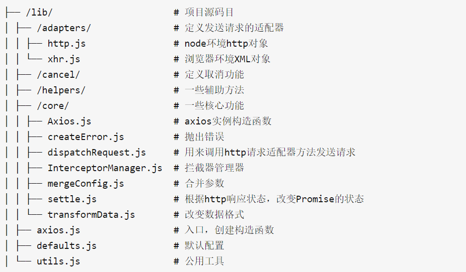


`axios`发送请求有很多实现的方法，实现入口文件为`axios.js `

```js
function createInstance(defaultConfig) {
  var context = new Axios(defaultConfig);

  // instance指向了request方法，且上下文指向context，所以可以直接以 instance(option) 方式调用 
  // Axios.prototype.request 内对第一个参数的数据类型判断，使我们能够以 instance(url, option) 方式调用
  var instance = bind(Axios.prototype.request, context);

  // 把Axios.prototype上的方法扩展到instance对象上，
  // 并指定上下文为context，这样执行Axios原型链上的方法时，this会指向context
  utils.extend(instance, Axios.prototype, context);

  // Copy context to instance
  // 把context对象上的自身属性和方法扩展到instance上
  // 注：因为extend内部使用的forEach方法对对象做for in 遍历时，只遍历对象本身的属性，而不会遍历原型链上的属性
  // 这样，instance 就有了  defaults、interceptors 属性。
  utils.extend(instance, context);
  return instance;
}

// Create the default instance to be exported 创建一个由默认配置生成的axios实例
var axios = createInstance(defaults);

// Factory for creating new instances 扩展axios.create工厂函数，内部也是 createInstance
axios.create = function create(instanceConfig) {
  return createInstance(mergeConfig(axios.defaults, instanceConfig));
};

// Expose all/spread
axios.all = function all(promises) {
  return Promise.all(promises);
};

axios.spread = function spread(callback) {
  return function wrap(arr) {
    return callback.apply(null, arr);
  };
};
module.exports = axios;
```

主要核心是 `Axios.prototype.request`，各种请求方式的调用实现都是在 `request` 内部实现的， 简单看下 `request` 的逻辑

```js
Axios.prototype.request = function request(config) {
  // Allow for axios('example/url'[, config]) a la fetch API
  // 判断 config 参数是否是 字符串，如果是则认为第一个参数是 URL，第二个参数是真正的config
  if (typeof config === 'string') {
    config = arguments[1] || {};
    // 把 url 放置到 config 对象中，便于之后的 mergeConfig
    config.url = arguments[0];
  } else {
    // 如果 config 参数是否是 字符串，则整体都当做config
    config = config || {};
  }
  // 合并默认配置和传入的配置
  config = mergeConfig(this.defaults, config);
  // 设置请求方法
  config.method = config.method ? config.method.toLowerCase() : 'get';
  /*
    something... 此部分会在后续拦截器单独讲述
  */
};

// 在 Axios 原型上挂载 'delete', 'get', 'head', 'options' 且不传参的请求方法，实现内部也是 request
utils.forEach(['delete', 'get', 'head', 'options'], function forEachMethodNoData(method) {
  Axios.prototype[method] = function(url, config) {
    return this.request(utils.merge(config || {}, {
      method: method,
      url: url
    }));
  };
});

// 在 Axios 原型上挂载 'post', 'put', 'patch' 且传参的请求方法，实现内部同样也是 request
utils.forEach(['post', 'put', 'patch'], function forEachMethodWithData(method) {
  Axios.prototype[method] = function(url, data, config) {
    return this.request(utils.merge(config || {}, {
      method: method,
      url: url,
      data: data
    }));
  };
});
```

`request`入口参数为`config`，可以说`config`贯彻了`axios`的一生

`axios` 中的 `config `主要分布在这几个地方：

- 默认配置 `defaults.js`
- `config.method`默认为 `get`
- 调用 `createInstance` 方法创建 `axios `实例，传入的`config`
- 直接或间接调用 `request` 方法，传入的 `config`

```js
// axios.js
// 创建一个由默认配置生成的axios实例
var axios = createInstance(defaults);

// 扩展axios.create工厂函数，内部也是 createInstance
axios.create = function create(instanceConfig) {
  return createInstance(mergeConfig(axios.defaults, instanceConfig));
};

// Axios.js
// 合并默认配置和传入的配置
config = mergeConfig(this.defaults, config);
// 设置请求方法
config.method = config.method ? config.method.toLowerCase() : 'get';

```

从源码中，可以看到优先级：默认配置对象`default` < `method:get` < `Axios`的实例属性`this.default` < `request`参数

下面重点看看`request`方法

```js
Axios.prototype.request = function request(config) {
  /*
    先是 mergeConfig ... 等，不再阐述
  */
  // Hook up interceptors middleware 创建拦截器链. dispatchRequest 是重中之重，后续重点
  var chain = [dispatchRequest, undefined];

  // push各个拦截器方法 注意：interceptor.fulfilled 或 interceptor.rejected 是可能为undefined
  this.interceptors.request.forEach(function unshiftRequestInterceptors(interceptor) {
    // 请求拦截器逆序 注意此处的 forEach 是自定义的拦截器的forEach方法
    chain.unshift(interceptor.fulfilled, interceptor.rejected);
  });

  this.interceptors.response.forEach(function pushResponseInterceptors(interceptor) {
    // 响应拦截器顺序 注意此处的 forEach 是自定义的拦截器的forEach方法
    chain.push(interceptor.fulfilled, interceptor.rejected);
  });

  // 初始化一个promise对象，状态为resolved，接收到的参数为已经处理合并过的config对象
  var promise = Promise.resolve(config);

  // 循环拦截器的链
  while (chain.length) {
    promise = promise.then(chain.shift(), chain.shift()); // 每一次向外弹出拦截器
  }
  // 返回 promise
  return promise;
};
```

拦截器`interceptors`是在构建`axios`实例化的属性

```js
function Axios(instanceConfig) {
  this.defaults = instanceConfig;
  this.interceptors = {
    request: new InterceptorManager(), // 请求拦截
    response: new InterceptorManager() // 响应拦截
  };
}
```

`InterceptorManager`构造函数

```js
// 拦截器的初始化 其实就是一组钩子函数
function InterceptorManager() {
  this.handlers = [];
}

// 调用拦截器实例的use时就是往钩子函数中push方法
InterceptorManager.prototype.use = function use(fulfilled, rejected) {
  this.handlers.push({
    fulfilled: fulfilled,
    rejected: rejected
  });
  return this.handlers.length - 1;
};

// 拦截器是可以取消的，根据use的时候返回的ID，把某一个拦截器方法置为null
// 不能用 splice 或者 slice 的原因是 删除之后 id 就会变化，导致之后的顺序或者是操作不可控
InterceptorManager.prototype.eject = function eject(id) {
  if (this.handlers[id]) {
    this.handlers[id] = null;
  }
};

// 这就是在 Axios的request方法中 中循环拦截器的方法 forEach 循环执行钩子函数
InterceptorManager.prototype.forEach = function forEach(fn) {
  utils.forEach(this.handlers, function forEachHandler(h) {
    if (h !== null) {
      fn(h);
    }
  });
}
```

请求拦截器方法是被 `unshift`到拦截器中，响应拦截器是被`push`到拦截器中的。最终它们会拼接上一个叫`dispatchRequest`的方法被后续的 `promise` 顺序执行

```js
var utils = require('./../utils');
var transformData = require('./transformData');
var isCancel = require('../cancel/isCancel');
var defaults = require('../defaults');
var isAbsoluteURL = require('./../helpers/isAbsoluteURL');
var combineURLs = require('./../helpers/combineURLs');

// 判断请求是否已被取消，如果已经被取消，抛出已取消
function throwIfCancellationRequested(config) {
  if (config.cancelToken) {
    config.cancelToken.throwIfRequested();
  }
}

module.exports = function dispatchRequest(config) {
  throwIfCancellationRequested(config);

  // 如果包含baseUrl, 并且不是config.url绝对路径，组合baseUrl以及config.url
  if (config.baseURL && !isAbsoluteURL(config.url)) {
    // 组合baseURL与url形成完整的请求路径
    config.url = combineURLs(config.baseURL, config.url);
  }

  config.headers = config.headers || {};

  // 使用/lib/defaults.js中的transformRequest方法，对config.headers和config.data进行格式化
  // 比如将headers中的Accept，Content-Type统一处理成大写
  // 比如如果请求正文是一个Object会格式化为JSON字符串，并添加application/json;charset=utf-8的Content-Type
  // 等一系列操作
  config.data = transformData(
    config.data,
    config.headers,
    config.transformRequest
  );

  // 合并不同配置的headers，config.headers的配置优先级更高
  config.headers = utils.merge(
    config.headers.common || {},
    config.headers[config.method] || {},
    config.headers || {}
  );

  // 删除headers中的method属性
  utils.forEach(
    ['delete', 'get', 'head', 'post', 'put', 'patch', 'common'],
    function cleanHeaderConfig(method) {
      delete config.headers[method];
    }
  );

  // 如果config配置了adapter，使用config中配置adapter的替代默认的请求方法
  var adapter = config.adapter || defaults.adapter;

  // 使用adapter方法发起请求（adapter根据浏览器环境或者Node环境会有不同）
  return adapter(config).then(
    // 请求正确返回的回调
    function onAdapterResolution(response) {
      // 判断是否以及取消了请求，如果取消了请求抛出以取消
      throwIfCancellationRequested(config);

      // 使用/lib/defaults.js中的transformResponse方法，对服务器返回的数据进行格式化
      // 例如，使用JSON.parse对响应正文进行解析
      response.data = transformData(
        response.data,
        response.headers,
        config.transformResponse
      );

      return response;
    },
    // 请求失败的回调
    function onAdapterRejection(reason) {
      if (!isCancel(reason)) {
        throwIfCancellationRequested(config);

        if (reason && reason.response) {
          reason.response.data = transformData(
            reason.response.data,
            reason.response.headers,
            config.transformResponse
          );
        }
      }
      return Promise.reject(reason);
    }
  );
};
```

再来看看`axios`是如何实现取消请求的，实现文件在`CancelToken.js`

```js
function CancelToken(executor) {
  if (typeof executor !== 'function') {
    throw new TypeError('executor must be a function.');
  }
  // 在 CancelToken 上定义一个 pending 状态的 promise ，将 resolve 回调赋值给外部变量 resolvePromise
  var resolvePromise;
  this.promise = new Promise(function promiseExecutor(resolve) {
    resolvePromise = resolve;
  });

  var token = this;
  // 立即执行 传入的 executor函数，将真实的 cancel 方法通过参数传递出去。
  // 一旦调用就执行 resolvePromise 即前面的 promise 的 resolve，就更改promise的状态为 resolve。
  // 那么xhr中定义的 CancelToken.promise.then方法就会执行, 从而xhr内部会取消请求
  executor(function cancel(message) {
    // 判断请求是否已经取消过，避免多次执行
    if (token.reason) {
      return;
    }
    token.reason = new Cancel(message);
    resolvePromise(token.reason);
  });
}

CancelToken.source = function source() {
  // source 方法就是返回了一个 CancelToken 实例，与直接使用 new CancelToken 是一样的操作
  var cancel;
  var token = new CancelToken(function executor(c) {
    cancel = c;
  });
  // 返回创建的 CancelToken 实例以及取消方法
  return {
    token: token,
    cancel: cancel
  };
};
```

实际上取消请求的操作是在 `xhr.js` 中也有响应的配合的

```js
if (config.cancelToken) {
    config.cancelToken.promise.then(function onCanceled(cancel) {
        if (!request) {
            return;
        }
        // 取消请求
        request.abort();
        reject(cancel);
    });
}
```

巧妙的地方在 `CancelToken`中 `executor` 函数，通过`resolve`函数的传递与执行，控制`promise`的状态


### 小结

 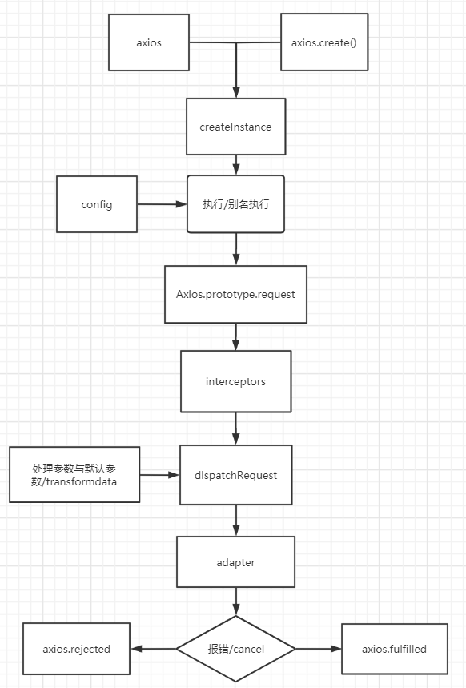


## 参考文献

- https://juejin.cn/post/6856706569263677447#heading-4
- https://juejin.cn/post/6844903907500490766
- https://github.com/axios/axios

**要点**：
Axios 是一个基于 Promise 的 HTTP 客户端，用于浏览器和 node.js。它的原理可以概括为以下几个关键点：

1. **基于 Promise**：Axios 使用了 JavaScript 的 Promise 对象来处理异步请求，这意味着你可以使用链式调用和处理多个请求。
2. **拦截器**：Axios 提供了拦截器（interceptors）机制，允许你在请求或响应被处理之前进行自定义处理。这使得可以统一处理如添加认证、修改请求头、处理错误等操作。
3. **请求/响应转换**：Axios 允许你在发送请求之前或接收到响应之后对数据进行转换，这可以通过 `transformRequest` 和 `transformResponse` 函数来实现。
4. **取消请求**：Axios 支持取消请求，这可以通过 `CancelToken` 对象实现。这个对象允许你在请求执行过程中取消它，从而释放服务器资源。
5. **配置默认值**：Axios 允许你为请求设置默认配置，这些配置可以在每个请求中覆盖。
6. **请求和响应处理**：Axios 提供了请求和响应处理的方法，如 `dispatchRequest` 和 `transformData`，这些方法负责处理实际的网络请求和响应数据。
7. **错误处理**：Axios 提供了详细的错误处理机制，可以在请求失败时捕获错误并采取相应的操作。
8. **并发处理**：Axios 支持并发处理多个请求，通过 `all` 方法可以同时发送多个请求，并通过 `spread` 方法处理它们的响应。
9. **适配器模式**：Axios 使用适配器模式来处理不同环境下的 HTTP 请求，例如在浏览器中使用 XMLHttpRequest，在 node.js 中使用 http 模块。
10. **依赖模块**：Axios 依赖了多个模块，如 `es6-promise`（在 node.js 中是 `promise`）、`qs`（用于序列化查询字符串）、`lodash`（用于处理数组和对象）等。

Axios 的设计目的是为了简化网络请求的处理，并提供强大的功能来处理异步请求和响应。通过其丰富的 API 和灵活的配置选项，Axios 已经成为前端开发中处理 HTTP 请求的流行选择。


---
### 974. HTTP 中如何处理表单数据的提交？

**难度**：★★★☆☆ | **题型**：QA | **分类**：全部 / 计算机网络

**题目**：


**参考答案**：
在 http 中，有两种主要的表单提交的方式，体现在两种不同的Content-Type取值:

* application/x-www-form-urlencoded
* multipart/form-data

由于表单提交一般是POST请求，很少考虑GET，因此这里我们将默认提交的数据放在请求体中。

## application/x-www-form-urlencoded

对于`application/x-www-form-urlencoded`格式的表单内容，有以下特点:

* 其中的数据会被编码成以&分隔的键值对
* 字符以URL编码方式编码。

如：

```
// 转换过程: {a: 1, b: 2} -> a=1&b=2 -> 如下(最终形式)
"a%3D1%26b%3D2"
```

## multipart/form-data

对于 `multipart/form-data` 而言:

* 请求头中的 `Content-Type` 字段会包含 `boundary` ，且 `boundary` 的值有浏览器默认指定。例: `Content-Type: multipart/form-data;boundary=----WebkitFormBoundaryRRJKeWfHPGrS4LKe`。
* 数据会分为多个部分，每两个部分之间通过分隔符来分隔，每部分表述均有 HTTP 头部描述子包体，如Content-Type，在最后的分隔符会加上--表示结束。

相应的请求体是下面这样:

```
Content-Disposition: form-data;name="data1";
Content-Type: text/plain
data1
----WebkitFormBoundaryRRJKeWfHPGrS4LKe
Content-Disposition: form-data;name="data2";
Content-Type: text/plain
data2
----WebkitFormBoundaryRRJKeWfHPGrS4LKe--
```

## 小结

值得一提的是，`multipart/form-data` 格式最大的特点在于:每一个表单元素都是独立的资源表述。另外，你可能在写业务的过程中，并没有注意到其中还有boundary的存在，如果你打开抓包工具，确实可以看到不同的表单元素被拆分开了，之所以在平时感觉不到，是以为浏览器和 HTTP 给你封装了这一系列操作。

而且，在实际的场景中，对于图片等文件的上传，基本采用`multipart/form-data`而不用`application/x-www-form-urlencoded`，因为没有必要做 URL 编码，带来巨大耗时的同时，也占用了更多的空间。


**要点**：
在HTTP中，表单提交通常使用POST请求，并且有两种主要的Content-Type值来表示不同的表单数据格式：

1. **application/x-www-form-urlencoded**：
   - 数据被编码成以&分隔的键值对，并以URL编码方式处理字符。
   - 例如，`{a: 1, b: 2}` 会被转换为 `a=1&b=2`，最终形式为 `"a%3D1%26b%3D2"`。
2. **multipart/form-data**：
   - 请求头中的 `Content-Type` 包含 `boundary`，这是浏览器默认指定的值。
   - 数据被分割成多个部分，每部分都有一个HTTP头部描述，如 `Content-Type`，最后一个部分后面跟着一个结束标记 `--`。
   - 例如，一个包含两个文本字段的表单，其请求体可能是：

     ```
     Content-Disposition: form-data; name="data1";
     Content-Type: text/plain
     data1
     -----WebkitFormBoundaryRRJKeWfHPGrS4LKe
     Content-Disposition: form-data; name="data2";
     Content-Type: text/plain
     data2
     -----WebkitFormBoundaryRRJKeWfHPGrS4LKe--
     ```

`multipart/form-data` 格式的一个显著特点是每个表单元素都是独立的资源表述，并且不需要URL编码，这在上传文件时尤为重要，因为它可以避免不必要的编码和空间浪费。


---
### 1019. 如何理解 HTTP 代理？

**难度**：★★☆☆☆ | **题型**：QA | **分类**：全部 / 计算机网络

**题目**：


**参考答案**：
我们知道在 HTTP 是基于`请求-响应`模型的协议，一般由客户端发请求，服务器来进行响应。

当然，也有特殊情况，就是代理服务器的情况。引入代理之后，作为代理的服务器相当于一个中间人的角色，对于客户端而言，表现为服务器进行响应；而对于源服务器，表现为客户端发起请求，具有`双重身份`。

那代理服务器到底是用来做什么的呢？

### 功能

* `负载均衡`。客户端的请求只会先到达代理服务器，后面到底有多少源服务器，IP 都是多少，客户端是不知道的。因此，这个代理服务器可以拿到这个请求之后，可以通过特定的算法分发给不同的源服务器，让各台源服务器的负载尽量平均。当然，这样的算法有很多，包括`随机算法`、`轮询`、`一致性hash`、`LRU``(最近最少使用)`等等，不过这些算法并不是本文的重点，大家有兴趣自己可以研究一下。
* `保障安全`。利用`心跳`机制监控后台的服务器，一旦发现故障机就将其踢出集群。并且对于上下行的数据进行过滤，对非法 IP 限流，这些都是代理服务器的工作。
* `缓存代理`。将内容缓存到代理服务器，使得客户端可以直接从代理服务器获得而不用到源服务器那里。下一节详细拆解。

### 相关头部字段

#### Via

代理服务器需要标明自己的身份，在 HTTP 传输中留下自己的痕迹，怎么办呢？

通过`Via`字段来记录。举个例子，现在中间有两台代理服务器，在客户端发送请求后会经历这样一个过程:

```
客户端 -> 代理1 -> 代理2 -> 源服务器
```

在源服务器收到请求后，会在`请求头`拿到这个字段:

```
Via: proxy_server1, proxy_server2
```

而源服务器响应时，最终在客户端会拿到这样的`响应头`:

```
Via: proxy_server2, proxy_server1
```

可以看到，`Via`中代理的顺序即为在 HTTP 传输中报文传达的顺序。

#### X-Forwarded-For

字面意思就是`为谁转发`, 它记录的是`请求方`的`IP`地址(注意，和`Via`区分开，`X-Forwarded-For`记录的是请求方这一个IP)。

#### X-Real-IP

是一种获取用户真实 IP 的字段，不管中间经过多少代理，这个字段始终记录最初的客户端的IP。

相应的，还有`X-Forwarded-Host`和`X-Forwarded-Proto`，分别记录`客户端`(注意哦，不包括代理)的`域名`和`协议名`。

### X-Forwarded-For产生的问题

前面可以看到，`X-Forwarded-For`这个字段记录的是请求方的 IP，这意味着每经过一个不同的代理，这个字段的名字都要变，从`客户端`到`代理1`，这个字段是客户端的 IP，从`代理1`到`代理2`，这个字段就变为了代理1的 IP。

但是这会产生两个问题:

* 意味着代理必须解析 HTTP 请求头，然后修改，比直接转发数据性能下降。

* 在 HTTPS 通信加密的过程中，原始报文是不允许修改的。

由此产生了`代理协议`，一般使用明文版本，只需要在 HTTP 请求行上面加上这样格式的文本即可:

```
// PROXY + TCP4/TCP6 + 请求方地址 + 接收方地址 + 请求端口 + 接收端口
PROXY TCP4 1 2 1111 2222
GET / HTTP/1
...
```

这样就可以解决`X-Forwarded-For`带来的问题了。

**要点**：
代理服务器在网络通信中扮演着重要的角色，它可以在客户端和服务器之间转发请求和响应，起到负载均衡、安全保障和缓存等功能。

#### 代理服务器的功能

1. **负载均衡**：代理服务器可以根据算法将客户端请求分发给不同的源服务器，以平衡负载。
2. **安全保障**：代理服务器可以监控源服务器的状态，剔除故障服务器，并对数据进行过滤，限制非法IP访问。
3. **缓存代理**：代理服务器可以缓存常用内容，提高访问速度，减少对源服务器的请求。

#### 相关头部字段

- **Via**：记录请求和响应在HTTP传输中经过的代理服务器，有助于追踪请求路径。
- **X-Forwarded-For**：记录原始客户端的IP地址，经过代理时会被修改。
- **X-Real-IP**：记录客户端的真实IP地址，即使经过多个代理也不会改变。
- **X-Forwarded-Host**：记录客户端的原始域名。
- **X-Forwarded-Proto**：记录客户端使用的原始协议（如HTTP或HTTPS）。

#### X-Forwarded-For产生的问题

- **性能问题**：代理必须解析HTTP请求头，修改X-Forwarded-For字段，这可能降低性能。
- **HTTPS问题**：在HTTPS通信中，原始报文不允许修改，因此X-Forwarded-For字段无法直接使用。

#### 代理协议

为了解决X-Forwarded-For带来的问题，可以使用代理协议。代理协议通常使用明文版本，在HTTP请求行中添加特定的文本，以指示代理服务器的存在和路径。这样可以在不修改原始报文的情况下，记录请求路径和客户端IP。


---
### 1066. HTTP/2 的多路复用（Multiplexing），对比 HTTP/1.1 的长连接优化，它是如何解决队头阻塞的？

**难度**：★★☆☆☆ | **题型**：QA | **分类**：全部 / 计算机网络

**题目**：


**参考答案**：
在 HTTP/1.1 中，性能优化主要依赖 **长连接（Keep-Alive）**。浏览器与服务器建立一次 TCP 连接后，可以在这个连接上连续发送多个 HTTP 请求，从而避免频繁的 TCP 握手开销。但 HTTP/1.1 在协议层仍然是 **串行响应模型**：即使浏览器可以连续发送多个请求，服务器返回响应时仍然必须按照请求顺序返回。

这就带来了经典的 **队头阻塞（Head-of-Line Blocking）** 问题。假设在一个连接中发送了多个请求，如果第一个请求的处理时间较长，那么后面的响应必须等待它完成之后才能返回。即使后面的资源已经准备好，也无法提前返回。这种阻塞会导致网络利用率下降，因此浏览器通常会通过 **建立多个 TCP 连接（例如 6 个并发连接）** 来缓解问题，但这又带来了额外的 TCP 建连和拥塞控制成本。

HTTP/2 的多路复用机制是从 **协议层的数据传输模型** 上改变了这种串行结构。HTTP/2 将 HTTP 消息拆分为多个更小的 **帧（Frame）**，并为每个请求分配一个唯一的 **流（Stream ID）**。所有流的数据帧可以在同一个 TCP 连接中 **交错发送**。

也就是说，在一个连接中可以同时存在多个请求和响应的数据流。例如：

* 请求 A 的响应帧
* 请求 B 的响应帧
* 请求 C 的响应帧

这些帧可以按照任意顺序在网络中交错传输，浏览器根据 **Stream ID** 将帧重新组装成完整的响应。这样服务器就不需要再按照请求顺序返回数据，而是可以 **谁准备好谁先发送**。当某个请求处理时间较长时，并不会阻塞其他请求的响应返回，从而在应用层解决了 HTTP/1.1 的队头阻塞问题。

另外，多路复用还带来了几个附带优势。由于只需要一个 TCP 连接，浏览器不再需要维护多个并发连接，从而减少了 TCP 握手、慢启动和拥塞控制带来的额外开销。同时多个请求共享带宽，网络利用率也更高。

需要注意的是，HTTP/2 虽然解决了 **应用层的队头阻塞**，但由于底层仍然运行在 **TCP** 之上，如果某个 TCP 数据包丢失，TCP 仍然需要等待该包重传才能继续向上层交付数据，这在传输层仍然可能造成阻塞。因此后来出现的 HTTP/3 通过使用 **QUIC（基于 UDP）**，在传输层进一步解决了这个问题。


**要点**：
HTTP/1.1 虽然通过长连接减少了 TCP 建连成本，但同一连接中的响应必须按请求顺序返回，因此容易出现队头阻塞。HTTP/2 通过多路复用机制，将 HTTP 消息拆分为帧，并为每个请求建立独立的流，使多个请求和响应可以在同一 TCP 连接中交错传输。浏览器通过流 ID 重新组装数据，从而避免一个慢请求阻塞其他响应。不过 HTTP/2 仍然基于 TCP，因此在传输层仍可能存在丢包导致的阻塞问题。

---
### 1074. HTTP1.1 中如何解决 HTTP 的队头阻塞问题？

**难度**：★★☆☆☆ | **题型**：QA | **分类**：全部 / 计算机网络

**题目**：


**参考答案**：
## 什么是 HTTP 队头阻塞？

HTTP 传输是基于`请求-应答`的模式进行的，报文必须是一发一收，但值得注意的是，里面的任务被放在一个任务队列中串行执行，一旦队首的请求处理太慢，就会阻塞后面请求的处理。这就是著名的 **HTTP队头阻塞** 问题。

## 并发连接

对于一个域名允许分配多个长连接，那么相当于增加了任务队列，不至于一个队伍的任务阻塞其它所有任务。在RFC2616规定过客户端最多并发 2 个连接，不过事实上在现在的浏览器标准中，这个上限要多很多，Chrome 中是 6 个。

但其实，即使是提高了并发连接，还是不能满足人们对性能的需求。

## 域名分片

一个域名不是可以并发 6 个长连接吗？那我就多分几个域名。

比如 static1.test.com 、static2.test.com。

这样一个 test.com 域名下可以分出非常多的二级域名，而它们都指向同样的一台服务器，能够并发的长连接数更多了，事实上也更好地解决了队头阻塞的问题。

**要点**：
HTTP队头阻塞是指在基于请求-应答模型的HTTP传输中，由于报文必须一发一收，请求被串行执行，如果队首的请求处理速度较慢，就会阻塞后面请求的处理，从而影响整体的性能。

为了解决队头阻塞问题，可以采取以下措施：

1. **并发连接**：一个域名可以允许分配多个长连接，从而增加任务队列，避免单个请求阻塞其他请求。现代浏览器对并发连接的限制比RFC2616规定的2个连接要高得多，例如Chrome允许6个并发连接。
2. **域名分片**：将一个域名分割成多个二级域名，如static1.test.com和static2.test.com，这些二级域名都指向同一台服务器。这样就可以创建更多的并发连接，从而更好地解决队头阻塞问题。


---
### 1077. Http 3.0 是基于 udp 的，那么它是如何保证传输可靠性的?

**难度**：★★☆☆☆ | **题型**：QA | **分类**：全部 / 计算机网络

**题目**：


**参考答案**：
HTTP/3 使用的底层传输协议 QUIC 是基于 UDP 的，因此需要在应用层实现可靠的数据传输。QUIC 协议使用了以下几种机制来保证数据的可靠性：

1. 连接迁移：QUIC 允许在网络切换或 IP 变更时迁移连接，而不需要重新建立新的连接，从而避免了连接中断和数据丢失的问题。

2. 可靠性流控制：QUIC 在每个流上都实现了可靠的流控制机制，可以根据发送方和接收方的负载情况动态调整数据发送速率，从而优化传输效率和可靠性。

3. 数据重传：QUIC 中每个数据包都带有唯一标识符（Packet Number），接收方可以根据这个标识符进行数据包的确认和重传，以保证数据传输的可靠性。

4. 拥塞控制：QUIC 采用了基于 TCP 的拥塞控制机制，可以根据网络拥塞程度自适应调整发送速率，以避免网络拥塞和丢包等问题。

在基于 UDP 的 HTTP/3 协议中，通过 QUIC 实现了多种机制来保证数据传输的可靠性，如连接迁移、可靠性流控制、数据重传、拥塞控制等，从而有效解决了 UDP 协议本身的可靠性问题，提高了传输效率和安全性。

**要点**：
**答题要点：**

HTTP/3 使用基于UDP的QUIC协议，通过以下机制确保数据可靠性：

- 连接迁移允许在网络变化时无缝转移连接，避免中断；
- 可靠性流控制根据发送和接收负载动态调整数据速率；
- 数据重传通过唯一标识符确保数据包可靠传输；
- 拥塞控制自适应网络状况调整发送速率。

这些机制在HTTP/3中通过QUIC弥补了UDP的可靠性缺陷，提升了传输效率和安全性。


---
### 1103.  Http 缓存策略，有什么区别，分别解决了什么问题

**难度**：★★☆☆☆ | **题型**：QA | **分类**：全部 / 计算机网络

**题目**：
<p style="text-align:start;text-indent:2em;"></p>

**参考答案**：
<p style="text-align:start;text-indent:2em;"><strong>1）浏览器缓存策略</strong></p><p style="text-align:start;text-indent:2em;">浏览器每次发起请求时，先在本地缓存中查找结果以及缓存标识，根据缓存标识来判断是否使用本地缓存。如果缓存有效，则使<br/>用本地缓存；否则，则向服务器发起请求并携带缓存标识。根据是否需向服务器发起HTTP请求，将缓存过程划分为两个部分：<br/>强制缓存和协商缓存，强缓优先于协商缓存。</p><ul><li>强缓存，服务器通知浏览器一个缓存时间，在缓存时间内，下次请求，直接用缓存，不在时间内，执行比较缓存策略。</li><li>协商缓存，让客户端与服务器之间能实现缓存文件是否更新的验证、提升缓存的复用率，将缓存信息中的Etag和Last-Modified<br/>通过请求发送给服务器，由服务器校验，返回304状态码时，浏览器直接使用缓存。</li></ul><p style="text-align:start;text-indent:2em;">HTTP缓存都是从第二次请求开始的：</p><ul><li>第一次请求资源时，服务器返回资源，并在response header中回传资源的缓存策略；</li><li>第二次请求时，浏览器判断这些请求参数，击中强缓存就直接200，否则就把请求参数加到request header头中传给服务器，看是否击中协商缓存，击中则返回304，否则服务器会返回新的资源。这是缓存运作的一个整体流程图：</li></ul><p style="text-align:start;text-indent:2em;"></p><p></p><div class="media-wrap image-wrap"></div><p></p><p></p><p style="text-align:start;text-indent:2em;"><strong>2）强缓存</strong></p><ul><li>强缓存命中则直接读取浏览器本地的资源，在network中显示的是from memory或者from disk</li><li>控制强制缓存的字段有：Cache-Control（http1.1）和Expires（http1.0）</li><li>Cache-control是一个相对时间，用以表达自上次请求正确的资源之后的多少秒的时间段内缓存有效。</li><li>Expires是一个绝对时间。用以表达在这个时间点之前发起请求可以直接从浏览器中读取数据，而无需发起请求</li><li>Cache-Control的优先级比Expires的优先级高。前者的出现是为了解决Expires在浏览器时间被手动更改导致缓存判断错误的问题。<br/>如果同时存在则使用Cache-control。</li></ul><p style="text-align:start;text-indent:2em;"><strong>3）强缓存-expires</strong></p><ul><li>该字段是服务器响应消息头字段，告诉浏览器在过期时间之前可以直接从浏览器缓存中存取数据。</li><li>Expires 是 HTTP 1.0 的字段，表示缓存到期时间，是一个绝对的时间 (当前时间+缓存时间)。在响应消息头中，设置这个字段之后，就可以告诉浏览器，在未过期之前不需要再次请求。</li><li>由于是绝对时间，用户可能会将客户端本地的时间进行修改，而导致浏览器判断缓存失效，重新请求该资源。此外，即使不考虑修改，时差或者误差等因素也可能造成客户端与服务端的时间不一致，致使缓存失效。</li><li>优势特点<br/></li><ul><li>1、HTTP 1.0 产物，可以在HTTP 1.0和1.1中使用，简单易用。</li><li>2、以时刻标识失效时间。</li></ul></ul><p></p><ul><li>劣势问题<br/></li><ul><li>1、时间是由服务器发送的(UTC)，如果服务器时间和客户端时间存在不一致，可能会出现问题。</li><li>2、存在版本问题，到期之前的修改客户端是不可知的。</li></ul></ul><p></p><p style="text-align:start;text-indent:2em;"><strong>4）强缓存-cache-control</strong></p><ul><li>已知Expires的缺点之后，在HTTP/1.1中，增加了一个字段Cache-control，该字段表示资源缓存的最大有效时间，在该时间内，客户端不需要向服务器发送请求。</li><li>这两者的区别就是前者是绝对时间，而后者是相对时间。下面列举一些 <code>Cache-control</code> 字段常用的值：(完整的列表可以查看MDN)<br/></li><ul><li><code>max-age</code>：即最大有效时间。</li><li><code>must-revalidate</code>：如果超过了 <code>max-age</code> 的时间，浏览器必须向服务器发送请求，验证资源是否还有效。</li><li><code>no-cache</code>：不使用强缓存，需要与服务器验证缓存是否新鲜。</li><li><code>no-store</code>: 真正意义上的“不要缓存”。所有内容都不走缓存，包括强制和对比。</li><li><code>public</code>：所有的内容都可以被缓存 (包括客户端和代理服务器， 如 CDN)</li><li><code>private</code>：所有的内容只有客户端才可以缓存，代理服务器不能缓存。默认值。</li></ul></ul><p></p><ul><li><strong>Cache-control 的优先级高于 Expires</strong>，为了兼容 HTTP/1.0 和 HTTP/1.1，实际项目中两个字段都可以设置。</li><li>该字段可以在请求头或者响应头设置，可组合使用多种指令：<br/></li><ul><li><strong>可缓存性</strong>：</li><ul><li>public：浏览器和缓存服务器都可以缓存页面信息</li><li>private：default，代理服务器不可缓存，只能被单个用户缓存</li><li>no-cache：浏览器器和服务器都不应该缓存页面信息，但仍可缓存，只是在缓存前需要向服务器确认资源是否被更改。可配合private，<br/>过期时间设置为过去时间。</li><li>only-if-cache：客户端只接受已缓存的响应</li></ul></ul></ul><p></p><ul><ul><li><strong>到期</strong></li><ul><li>max-age=：缓存存储的最大周期，超过这个周期被认为过期。</li><li>s-maxage=：设置共享缓存，比如can。会覆盖max-age和expires。</li><li>max-stale[=]：客户端愿意接收一个已经过期的资源</li><li>min-fresh=：客户端希望在指定的时间内获取最新的响应</li><li>stale-while-revalidate=：客户端愿意接收陈旧的响应，并且在后台一部检查新的响应。时间代表客户端愿意接收陈旧响应<br/>的时间长度。</li><li>stale-if-error=：如新的检测失败，客户端则愿意接收陈旧的响应，时间代表等待时间。</li></ul></ul></ul><p></p><ul><ul><li><strong>重新验证和重新加载</strong></li><ul><li>must-revalidate：如页面过期，则去服务器进行获取。</li><li>proxy-revalidate：用于共享缓存。</li><li>immutable：响应正文不随时间改变。</li></ul></ul></ul><p></p><ul><ul><li><strong>其他</strong></li><ul><li>no-store：绝对禁止缓存</li><li>no-transform：不得对资源进行转换和转变。例如，不得对图像格式进行转换。</li></ul></ul></ul><p></p><p></p><ul><li>优势特点<br/></li><ul><li>1、HTTP 1.1 产物，以时间间隔标识失效时间，解决了Expires服务器和客户端相对时间的问题。</li><li>2、比Expires多了很多选项设置。</li></ul></ul><p></p><ul><li>劣势问题<br/></li><ul><li>1、存在版本问题，到期之前的修改客户端是不可知的。</li></ul></ul><p></p><p style="text-align:start;text-indent:2em;"><strong>5）协商缓存</strong></p><ul><li>协商缓存的状态码由服务器决策返回200或者304</li><li>当浏览器的强缓存失效的时候或者请求头中设置了不走强缓存，并且在请求头中设置了If-Modified-Since 或者 If-None-Match 的时候，会将这两个属性值到服务端去验证是否命中协商缓存，如果命中了协商缓存，会返回 304 状态，加载浏览器缓存，并且响应头会设置 Last-Modified 或者 ETag 属性。</li><li>对比缓存在请求数上和没有缓存是一致的，但如果是 304 的话，返回的仅仅是一个状态码而已，并没有实际的文件内容，因此 在响应体体积上的节省是它的优化点。</li><li>协商缓存有 2 组字段(不是两个)，控制协商缓存的字段有：Last-Modified/If-Modified-since（http1.0）和Etag/If-None-match（http1.1）</li><li>Last-Modified/If-Modified-since表示的是服务器的资源最后一次修改的时间；Etag/If-None-match表示的是服务器资源的唯一标<br/>识，只要资源变化，Etag就会重新生成。</li><li>Etag/If-None-match的优先级比Last-Modified/If-Modified-since高。</li></ul><p style="text-align:start;text-indent:2em;"><strong>6）协商缓存-协商缓存-Last-Modified/If-Modified-since</strong></p><ul><li>1.服务器通过 <code>Last-Modified</code> 字段告知客户端，资源最后一次被修改的时间，例如 <code>Last-Modified: Mon, 10 Nov 2018 09:10:11 GMT</code></li><li>2.浏览器将这个值和内容一起记录在缓存数据库中。</li><li>3.下一次请求相同资源时时，浏览器从自己的缓存中找出“不确定是否过期的”缓存。因此在请求头中将上次的 <code>Last-Modified</code> 的值写入到请求头的 <code>If-Modified-Since</code> 字段</li><li>4.服务器会将 <code>If-Modified-Since</code> 的值与 <code>Last-Modified</code> 字段进行对比。如果相等，则表示未修改，响应 304；反之，则表示修改了，响应 200 状态码，并返回数据。</li><li>优势特点</li><ul><li>1、不存在版本问题，每次请求都会去服务器进行校验。服务器对比最后修改时间如果相同则返回304，不同返回200以及资源内容。</li></ul></ul><p></p><ul><li>劣势问题</li><ul><li>2、只要资源修改，无论内容是否发生实质性的变化，都会将该资源返回客户端。例如周期性重写，这种情况下该资源包含的数据实际上一样的。</li><li>3、以时刻作为标识，无法识别一秒内进行多次修改的情况。 如果资源更新的速度是秒以下单位，那么该缓存是不能被使用的，因为它的时间单位最低是秒。</li><li>4、某些服务器不能精确的得到文件的最后修改时间。</li><li>5、如果文件是通过服务器动态生成的，那么该方法的更新时间永远是生成的时间，尽管文件可能没有变化，所以起不到缓存的作用。</li></ul></ul><p></p><p style="text-align:start;text-indent:2em;"><strong>7）协商缓存-Etag/If-None-match</strong></p><ul><li>为了解决上述问题，出现了一组新的字段 <code>Etag</code> 和 <code>If-None-Match</code></li><li><code>Etag</code> 存储的是文件的特殊标识(一般都是 hash 生成的)，服务器存储着文件的 <code>Etag</code> 字段。之后的流程和 <code>Last-Modified</code> 一致，只是 <code>Last-Modified</code> 字段和它所表示的更新时间改变成了 <code>Etag</code> 字段和它所表示的文件 hash，把 <code>If-Modified-Since</code> 变成了 <code>If-None-Match</code>。服务器同样进行比较，命中返回 304, 不命中返回新资源和 200。</li><li>浏览器在发起请求时，服务器返回在Response header中返回请求资源的唯一标识。在下一次请求时，会将上一次返回的Etag值赋值给If-No-Matched并添加在Request Header中。服务器将浏览器传来的if-no-matched跟自己的本地的资源的ETag做对比，如果匹配，则返回304通知浏览器读取本地缓存，否则返回200和更新后的资源。</li><li><strong>Etag 的优先级高于 Last-Modified</strong>。</li><li>优势特点</li><ul><li>1、可以更加精确的判断资源是否被修改，可以识别一秒内多次修改的情况。</li><li>2、不存在版本问题，每次请求都回去服务器进行校验。</li></ul></ul><p></p><ul><li>劣势问题</li><ul><li>1、计算ETag值需要性能损耗。</li><li>2、分布式服务器存储的情况下，计算ETag的算法如果不一样，会导致浏览器从一台服务器上获得页面内容后到另外一台服务器上进行验证时现ETag不匹配的情况。</li></ul></ul><p></p>

**要点**：
<p style="text-align:left;text-indent:2em;">浏览器缓存策略涉及强缓存和协商缓存两个部分。强缓存优先于协商缓存，其中强缓存通过<code>Cache-Control</code>（HTTP 1.1）和<code>Expires</code>（HTTP 1.0）控制，协商缓存则通过<code>Last-Modified</code>/<code>If-Modified-Since</code>（HTTP 1.0）和<code>ETag</code>/<code>If-None-Match</code>（HTTP 1.1）进行验证。</p><p></p><p style="text-align:left;text-indent:2em;">强缓存（<code>Cache-Control</code>和<code>Expires</code>）是指服务器告诉浏览器资源的缓存时间，在有效期内浏览器直接使用缓存。<code>Cache-Control</code>是一个相对时间，<code>Expires</code>是一个绝对时间。<code>Cache-Control</code>的优先级高于<code>Expires</code>。</p><p></p><p style="text-align:left;text-indent:2em;">协商缓存则是在强缓存失效时，浏览器向服务器发送请求，服务器根据<code>Last-Modified</code>和<code>ETag</code>判断资源是否更新。如果未更新，服务器返回304状态码，浏览器使用缓存；如果已更新，服务器返回新的资源。</p><p></p><p style="text-align:left;text-indent:2em;"><code>Last-Modified</code>/<code>If-Modified-Since</code>通过文件的最后修改时间来判断资源是否更新，而<code>ETag</code>/<code>If-None-Match</code>通过资源的唯一标识来判断。<code>ETag</code>的优先级高于<code>Last-Modified</code>。</p><p></p><p style="text-align:left;text-indent:2em;">这些缓存策略的优点包括提高加载速度、减少服务器负载、节省带宽等，但也存在一些缺点，如<code>Expires</code>的时间问题、<code>Last-Modified</code>的精准性问题、以及<code>ETag</code>的性能损耗和分布式服务器存储问题。</p>

---
### 1105. HTTP协议的不同版本的主要特点有哪些？

**难度**：★☆☆☆☆ | **题型**：QA | **分类**：全部 / 计算机网络

**题目**：


**参考答案**：
HTTP协议的不同版本的主要特点如下表所示：

|版本|发布时间|主要特点|
|---|---|---|
|HTTP/0.9|1991年|只支持GET方法，没有Header和Body|
|HTTP/1.0|1996年|引入Header、POST方法、响应码、缓存等特性|
|HTTP/1.1|1999年|引入持久连接、管道化请求、分块传输编码、Host头、缓存控制等特性|
|HTTP/2|2015年|引入二进制分帧、头部压缩、流量控制、多路复用等特性|
|HTTP/3|2021年|引入QUIC协议，改进网络传输性能|


需要注意的是，HTTP/1.x和HTTP/2都支持TLS加密传输，即HTTPS协议。HTTP/3则是基于QUIC协议的，使用TLS 1.3进行加密传输。


---
### 1113. 为什么部分请求中，参数需要使用 encodeURIComponent 进行转码？

**难度**：★★★☆☆ | **题型**：QA | **分类**：全部 / JavaScript / 计算机网络 / 计算机基础

**题目**：


**参考答案**：
一般来说，URL只能使用英文字母、阿拉伯数字和某些标点符号，不能使用其他文字和符号。

这是因为网络标准RFC 1738做了硬性规定：

> "...Only alphanumerics [0-9a-zA-Z], the special characters "$-_.+!*'()," [not including the quotes - ed], and reserved characters used for their reserved purposes may be used unencoded within a URL."

这意味着，如果URL中有汉字，就必须编码后使用。但是麻烦的是，RFC 1738没有规定具体的编码方法，而是交给应用程序（浏览器）自己决定。这导致"URL编码"成为了一个混乱的领域。

不同的操作系统、不同的浏览器、不同的网页字符集，将导致完全不同的编码结果。如果程序员要把每一种结果都考虑进去，是不是太恐怖了？有没有办法，能够保证客户端只用一种编码方法向服务器发出请求？

就是使用Javascript先对URL编码，然后再向服务器提交，不要给浏览器插手的机会。因为Javascript的输出总是一致的，所以就保证了服务器得到的数据是格式统一的。

Javascript语言用于编码的函数，一共有三个，最古老的一个就是escape()。虽然这个函数现在已经不提倡使用了，但是由于历史原因，很多地方还在使用它，所以有必要先从它讲起。

它的具体规则是，除了ASCII字母、数字、标点符号"@ * _ + - . /"以外，对其他所有字符进行编码。

encodeURI()是Javascript中真正用来对URL编码的函数。

它着眼于对整个URL进行编码，因此除了常见的符号以外，对其他一些在网址中有特殊含义的符号"; / ? : @ & = + $ , #"，也不进行编码。编码后，它输出符号的utf-8形式，并且在每个字节前加上%。

最后一个Javascript编码函数是encodeURIComponent()。与encodeURI()的区别是，它用于对URL的组成部分进行个别编码，而不用于对整个URL进行编码。

因此，"; / ? : @ & = + $ , #"，这些在encodeURI()中不被编码的符号，在encodeURIComponent()中统统会被编码。至于具体的编码方法，两者是一样。

它对应的解码函数是decodeURIComponent()。

**要点**：
URL（统一资源定位符）在构成上有着严格的限制，只能使用英文字母（a-z，A-Z）、阿拉伯数字（0-9）以及某些特定的标点符号。这一限制源于网络标准RFC 1738的规定，该标准明确指出，URL中只能使用字母数字字符、特定的特殊字符（如"$-_.+!*'(),"，不包括引号），以及用于其预定目的的保留字符。

由于这一规定，URL中不能直接使用汉字或其他非ASCII字符。如果URL中包含这些字符，就必须进行编码处理。然而，RFC 1738并没有为URL编码指定一个统一的方法，而是将编码的实现交给了应用程序（如浏览器）自行决定。这导致了URL编码领域的混乱，因为不同的操作系统、浏览器和网页字符集可能会导致完全不同的编码结果。

为了确保客户端向服务器发送的数据格式统一，可以使用Javascript进行URL编码。Javascript提供以下三个函数用于URL编码：

1. **escape()**：这是最古老的Javascript编码函数，它对ASCII字母、数字和特定标点符号（"@ * _ + - . /"）之外的字符进行编码。虽然这个函数现在已经不推荐使用，但由于历史原因，它在一些地方仍然被采用。

2. **encodeURI()**：这个函数是专门用于对整个URL进行编码的。它不会对ASCII字母、数字、特定标点符号以及URL中有特殊含义的符号（如"; / ? : @ & = + $ , #"）进行编码。编码后，它会输出符号的UTF-8形式，并在每个字节前加上"%"符号。

3. **encodeURIComponent()**：这个函数用于对URL的组成部分进行个别编码，而不是对整个URL进行编码。与encodeURI()不同的是，encodeURIComponent()会对"; / ? : @ & = + $ , #"这些在encodeURI()中不被编码的符号进行编码。具体的编码方法与encodeURI()相同。

对于解码，encodeURIComponent()函数对应的解码函数是**decodeURIComponent()**，它用于将encodeURIComponent()编码的字符串解码回原始形式。

总结来说，为了避免因不同浏览器和系统导致的URL编码不一致问题，可以使用Javascript的encodeURI()和encodeURIComponent()函数来确保URL编码的统一性，并通过decodeURIComponent()函数进行相应的解码。


---
### 1126. cookie 怎么设置只在 https 时携带？

**难度**：★☆☆☆☆ | **题型**：QA | **分类**：全部 / 计算机网络

**题目**：


**参考答案**：
设置 `cookie` 的 `secure` 属性。

`secure`选项用来设置`cookie`只在确保安全的请求中才会发送。当请求是`HTTPS`或者其他安全协议时，包含 `secure` 选项的 `cookie` 才能被发送至服务器。

默认情况下，cookie不会带secure选项(即为空)。所以默认情况下，不管是HTTPS协议还是HTTP协议的请求，cookie 都会被发送至服务端。

但要注意一点，secure选项只是限定了在安全情况下才可以传输给服务端，但并不代表你不能看到这个 cookie。


**要点**：
**答题要点：**

设置cookie的`secure`属性确实是确保cookie只在HTTPS请求中携带的方法。这个属性可以防止cookie在非安全连接（如HTTP）中被泄露，因为在不安全的连接上传输cookie可能会被中间人攻击者截获。

- **设置`secure`属性**：在设置cookie时，通过指定`secure`属性，可以确保cookie只在HTTPS请求中被发送。
- **默认行为**：如果不设置`secure`属性，cookie会在HTTP和HTTPS请求中都被发送。
- **安全性注意**：即使设置了`secure`属性，cookie本身的内容在客户端仍然可见，因此不应该在cookie中存储敏感信息。

此外，`secure`属性并不防止客户端通过浏览器工具查看cookie，它只是防止cookie在不安全的连接上传输。


---
### 1128. 为什么说HTTP是无状态的协议？

**难度**：★★★☆☆ | **题型**：QA | **分类**：全部 / 计算机网络

**题目**：


**参考答案**：
因为它的每个请求都是完全独立的，每个请求包含了处理这个请求所需的完整的数据。

无状态协议是指协议对务处理没有记忆能力。缺少状态意味着如果后续处理需要前面的信息，则它必须重传，这样可能导致每次连接传送的数据量增大。另一方面，在服务器不需要先前信息时它的应答就较快。 Http协议不像建立了socket连接的两个终端，双方是可以互相通信的，http的客户端只能通过请求服务器来获取相关内容或文件信息。

http协议这种特性有优点也有缺点，优点在于解放了服务器，每一次请求“点到为止”不会造成不必要连接占用，缺点在于每次请求会传输大量重复的内容信息。

在同一个连接允许传输多个HTTP请求的情况下，如果第一个请求出错了，后面的请求一般也能够继续处理（当然，如果导致协议解析失败、消息分片错误之类的自然是要除外的）可以看出，这种协议的结构是要比有状态的协议更简单的。


**要点**：
HTTP是一个无状态的协议，这意味着每个请求都是独立的，每个请求包含了处理该请求所需的完整数据。这种无状态特性使得HTTP协议在处理每个请求时不需要记忆上下文信息，从而简化了协议的实现和处理。

无状态协议的优点包括：

1. **服务器资源利用**：由于每次请求都是独立的，服务器不需要记住前一个请求的状态，这有助于提高服务器的资源利用率。
2. **高效响应**：当服务器不需要前一个请求的信息时，它可以更快地响应新请求。

然而，无状态协议也存在缺点：

1. **重复数据传输**：每次请求都需要传输完整的数据，这可能导致数据量的增大，尤其是在客户端和服务器之间的数据保持不变时。
2. **状态管理复杂**：客户端需要自己管理状态信息，如用户登录状态，这可能增加客户端的复杂性。

在同一个连接上允许传输多个HTTP请求的情况下，如果第一个请求出错，后面的请求通常可以继续处理，除非出现协议解析失败或消息分片错误等问题。这种结构使得HTTP协议比有状态的协议更简单，但也意味着客户端和服务器之间的通信是单向的，客户端只能向服务器发起请求。


---
### 1141. 一个 tcp 连接能发几个 http 请求？

**难度**：★★☆☆☆ | **题型**：QA | **分类**：全部 / 计算机网络

**题目**：


**参考答案**：
一个 TCP 连接可以发多个 HTTP 请求，具体取决于使用的 HTTP 版本：

### **1. HTTP/1.0**

- **每个请求独立**：HTTP/1.0 默认使用非持久连接（每个请求都需要建立新的 TCP 连接）。因此，每个 HTTP 请求需要一个新的 TCP 连接。

### **2. HTTP/1.1**

- **持久连接**：HTTP/1.1 引入了持久连接（Connection: keep-alive），使得一个 TCP 连接可以发送多个 HTTP 请求和响应。在默认情况下，一个 TCP 连接可以支持多个 HTTP 请求，直到连接被关闭。
- **并发请求**：HTTP/1.1 还支持管道化（pipelining），允许在等待响应的同时发送多个请求。但是，管道化有一些限制，如请求顺序和响应顺序。

### **3. HTTP/2**

- **多路复用**：HTTP/2 使用多路复用（multiplexing）技术，允许多个请求和响应在一个 TCP 连接上并发进行，而不会阻塞彼此。每个请求和响应通过流（stream）进行管理，可以有效地减少延迟和提高性能。

### **4. HTTP/3**

- **基于 QUIC 协议**：HTTP/3 使用 QUIC 协议，它在用户数据报协议（UDP）上实现了类似于 HTTP/2 的多路复用功能。它在一个连接上支持多个请求和响应，进一步优化了网络性能。


**要点**：
- **HTTP/1.0**：每个请求需要一个新的 TCP 连接。
- **HTTP/1.1**：一个 TCP 连接可以发多个请求，支持持久连接和管道化。
- **HTTP/2**：一个 TCP 连接可以并发发多个请求，通过多路复用技术优化性能。
- **HTTP/3**：基于 QUIC 协议，支持多个请求和响应在一个连接上进行。

---
### 1145. HTTP建立连接的过程?

**难度**：★★☆☆☆ | **题型**：QA | **分类**：全部 / 计算机网络

**题目**：


**参考答案**：
## 在HTTP/1.1中
建立连接过程遵循以下步骤：

- 建立TCP连接：客户端通过三次握手建立TCP连接。

- 发送请求：客户端向服务器发送一个HTTP请求报文。

- 服务器响应：服务器收到请求后，返回一个HTTP响应报文。

- 客户端接收响应：客户端收到响应后，根据响应中的状态码判断请求是否成功。

- 关闭连接：如果响应中包含 Connection: close 头部，那么连接关闭，否则保持连接，可以继续发送请求。

## 在HTTP/2中
建立连接过程使用了多路复用，可以在一个连接上同时处理多个请求和响应，具体过程如下：

- 客户端和服务器建立TCP连接。

- 客户端发送一个HTTP/2的SETTINGS帧，其中包含一些配置信息，如帧的大小和流的并发数量等。

- 服务器返回一个HTTP/2的SETTINGS帧，确认了客户端发送的设置。

- 客户端发送一个HTTP/2的HEADERS帧，其中包含了第一个请求的信息，同时还包含了一个唯一的标识符，称为流ID。

- 服务器返回一个HTTP/2的HEADERS帧，其中包含了响应的信息，同时也包含了与请求相同的流ID。

- 客户端可以在同一个连接上发送多个请求和响应，每个请求和响应都包含一个流ID，用于标识请求和响应之间的关系。

- 当客户端或服务器想要关闭连接时，它可以发送一个HTTP/2的GOAWAY帧，表示不再接受新的请求或响应，并且将连接关闭。

**要点**：
HTTP/1.1是基于请求-响应模型的，每次请求都需要建立一个新的连接。而HTTP/2使用多路复用，可以在一个连接上处理多个请求和响应，提高了性能和效率。

---
### 1146. websocket 中的 Handshaking 是什么？

**难度**：★☆☆☆☆ | **题型**：QA | **分类**：全部 / 计算机网络

**题目**：


**参考答案**：
在 **WebSocket** 协议中，**Handshaking（握手）** 是指客户端和服务器在建立 WebSocket 连接之前进行的一次 **升级请求与确认过程**。

它的作用是：

1. **确认双方是否支持 WebSocket 协议**；
2. **将原本的 HTTP/1.1 长连接升级为 WebSocket 专用的全双工连接**；
3. **协商必要的协议参数**（例如子协议 `Sec-WebSocket-Protocol`、扩展 `Sec-WebSocket-Extensions` 等）。

---

### 握手流程

1. **客户端发起请求（HTTP Upgrade 请求）**
   客户端首先通过 **HTTP 协议** 发起请求，请求头中带有一些特殊字段，表明希望将 HTTP 连接升级为 WebSocket：

   ```http
   GET /chat HTTP/1.1
   Host: example.com:80
   Upgrade: websocket
   Connection: Upgrade
   Sec-WebSocket-Key: dGhlIHNhbXBsZSBub25jZQ==
   Sec-WebSocket-Version: 13
   ```

   * `Upgrade: websocket` 表示想升级协议
   * `Connection: Upgrade` 表示连接类型支持升级
   * `Sec-WebSocket-Key` 是客户端随机生成的一个 Base64 编码字符串，用于校验
   * `Sec-WebSocket-Version` 指定 WebSocket 版本（通常是 13）

2. **服务器响应（HTTP 101 Switching Protocols）**
   如果服务器支持 WebSocket，它会返回 **101 状态码**，并在响应头中确认升级：

   ```http
   HTTP/1.1 101 Switching Protocols
   Upgrade: websocket
   Connection: Upgrade
   Sec-WebSocket-Accept: s3pPLMBiTxaQ9kYGzzhZRbK+xOo=
   ```

   * `101 Switching Protocols` 表示协议成功切换
   * `Sec-WebSocket-Accept` 是服务端根据客户端 `Sec-WebSocket-Key` 计算出的校验值，保证握手合法

3. **连接建立成功**
   当握手完成后，HTTP 连接会升级为 WebSocket 通道，接下来就进入真正的 **双向全双工通信** 阶段，消息将以 WebSocket 帧的格式进行传输，而不是 HTTP。


**要点**：
* **Handshaking** 就是 WebSocket 连接建立前的 **HTTP 升级握手过程**。
* 其核心是：客户端发起 **HTTP Upgrade 请求** → 服务端返回 **101 Switching Protocols** 响应 → 双方协议切换 → 进入 WebSocket 通信阶段。

---
### 1188. 说说对TCP/IP协议的了解

**难度**：★★★☆☆ | **题型**：QA | **分类**：全部 / 计算机网络

**题目**：


**参考答案**：
`TCP/IP`（`Transmission Control Protocol/Internet Protocol`，传输控制协议/网际协议）是指能够在多个不同网络间实现信息传输的协议簇。TCP/IP协议不仅仅指的是TCP 和IP两个协议，而是指一个由 `FTP、SMTP、TCP、UDP、IP`等协议构成的协议簇， 只是因为在TCP/IP协议中TCP协议和IP协议最具代表性，所以被称为TCP/IP协议。

TCP/IP传输协议是在网络的使用中的最基本的通信协议。TCP/IP传输协议对互联网中各部分进行通信的标准和方法进行了规定。并且，TCP/IP传输协议是保证网络数据信息及时、完整传输的两个重要的协议。TCP/IP传输协议是严格来说是一个四层的体系结构，**应用层** 、**传输层**、**网络层** 和 **数据链路层** 都包含其中。

TCP/IP通讯协议采用了4层的层级结构，每一层都呼叫它的下一层所提供的网络来完成自己的需求。这4层分别为:

* 应用层:应用程序间沟通的层，如简单电子邮件传输(SMTP)、文件传输协议(FTP)、网络远程访问协议(Telnet)等。

* 传输层:在此层中，它提供了节点间的数据传送，应用程序之间的通信服务，主要功能是数据格式化、数据确认和丢失重传等。如传输控制协议(TCP)、用户数据报协议(UDP)等，TCP和UDP给数据包加入传输数据并把它传输到下一层中，这一层负责传送数据，并且确定数据已被送达并接收。

* 网络层:负责提供基本的数据封包传送功能，让每一块数据包都能够到达目的主机(但不检查是否被正确接收)，如网际协议(IP)。

* 数据链路层(主机-网络层):接收IP数据报并进行传输，从网络上接收物理帧，抽取IP数据报转交给下一层，对实际的网络媒体的管理，定义如何使用实际网络(如Ethernet、Serial Line等)来传送数据。

**要点**：
TCP/IP（Transmission Control Protocol/Internet Protocol）是一个用于在多个不同网络间传输信息的协议簇，它不仅仅包含TCP和IP两个协议，而是包括FTP、SMTP、TCP、UDP、IP等多个协议。TCP/IP协议是互联网中各部分通信的标准和方法。

TCP/IP传输协议采用四层层级结构：

1. **应用层**：提供应用程序间的通信，如SMTP、FTP、Telnet等。
2. **传输层**：负责数据格式化、数据确认和丢失重传等，包括TCP和UDP。
3. **网络层**：提供基本的数据封包传送功能，如IP协议。
4. **数据链路层**：负责接收IP数据报并进行传输，管理网络媒体，如Ethernet、Serial Line等。

每一层都调用下一层提供的服务来完成自己的需求，保证数据信息能够及时、完整地传输。


---
### 1246. HTTP/3 是基于 UDP 的协议， 那么他是如何保障安全性的？

**难度**：★☆☆☆☆ | **题型**：QA | **分类**：全部 / 计算机网络

**题目**：


**参考答案**：
HTTP/3 是基于 QUIC 协议的，而 QUIC 本身集成了加密机制，从而保证了数据传输的安全性。具体来说，HTTP/3 的安全性保障依赖于以下几个关键点：

### **1. 内置的加密**

- **集成 TLS**：QUIC 协议将 TLS（传输层安全性）加密集成到协议本身中。与传统的 HTTP/2 需要在 TCP 连接建立后再进行 TLS 握手不同，QUIC 和 HTTP/3 在协议层级直接实现加密，减少了额外的握手延迟。
- **加密的流量**：所有通过 QUIC 传输的数据都经过加密处理，包括数据流、头部信息等。这确保了数据在传输过程中不会被窃听或篡改。

### **2. 加密的握手**

- **0-RTT 数据传输**：QUIC 支持 0-RTT 数据传输，即在重连时可以立即开始数据传输，而无需额外的握手。这种机制仍然保证了安全性，因为 QUIC 的加密协议设计考虑了这一点，确保即使在快速重连的情况下也能保持数据安全。
- **加密握手**：在 QUIC 连接建立时，握手过程使用加密技术确保双方身份的验证和加密参数的协商，防止中间人攻击。

### **3. 现代加密算法**

- **使用 AES 和 ChaCha20**：QUIC 和 HTTP/3 支持现代加密算法，如 AES-GCM 和 ChaCha20-Poly1305。这些算法提供了强大的数据加密和完整性保护。
- **安全密钥交换**：QUIC 使用 Diffie-Hellman 密钥交换来保护加密密钥的协商过程，确保只有正确的通信方能够解密数据。

### **4. 防止重放攻击**

- **加密保护**：QUIC 协议设计包括防止重放攻击的机制。通过使用加密和随机生成的参数，QUIC 确保每次连接和数据传输都是唯一的，从而避免了旧数据的重放攻击。

### **5. 数据完整性**

- **数据完整性校验**：QUIC 协议使用数据完整性校验（如使用 HMAC 或其他机制）来确保数据在传输过程中未被篡改。如果数据被篡改，校验失败，接收方会检测到这种情况并采取适当的行动。

### **6. 连接加密**

- **端到端加密**：QUIC 确保从客户端到服务器的数据传输是加密的，这意味着数据在整个传输过程中都受到保护，避免了中间人攻击和数据泄露的风险。


**要点**：
HTTP/3 通过 QUIC 实现了对数据传输的内置加密，使用现代加密算法，集成了 TLS 功能，并提供了防止重放攻击和确保数据完整性的机制。与传统的基于 TCP 的协议相比，HTTP/3 提供了更高效且安全的数据传输能力，确保了数据在整个传输过程中的安全性。

---
### 1248. TLS 1.3 做了哪些改进？

**难度**：★★★☆☆ | **题型**：QA | **分类**：全部 / 计算机网络

**题目**：


**参考答案**：
TLS 1.2 虽然存在了 10 多年，经历了无数的考验，但历史的车轮总是不断向前的，为了获得更强的安全、更优秀的性能，在2018年就推出了 TLS1.3，对于TLS1.2做了一系列的改进，主要分为这几个部分:强化安全、提高性能。

### 强化安全

在 TLS1.3 中废除了非常多的加密算法，最后只保留五个加密套件:

*   TLS_AES_128_GCM_SHA256
*   TLS_AES_256_GCM_SHA384
*   TLS_CHACHA20_POLY1305_SHA256
*   TLS_AES_128_GCM_SHA256
*   TLS_AES_128_GCM_8_SHA256

可以看到，最后剩下的对称加密算法只有 `AES` 和 `CHACHA20`，之前主流的也会这两种。分组模式也只剩下 `GCM` 和 `POLY1305`, 哈希摘要算法只剩下了 `SHA256` 和 `SHA384` 了。

那你可能会问了, 之前`RSA`这么重要的非对称加密算法怎么不在了？

我觉得有两方面的原因:

* 2015年发现了`FREAK`攻击，即已经有人发现了 RSA 的漏洞，能够进行破解了。

* 一旦私钥泄露，那么中间人可以通过私钥计算出之前所有报文的`secret`，破解之前所有的密文。

为什么？回到 RSA 握手的过程中，客户端拿到服务器的证书后，提取出服务器的公钥，然后生成`pre_random`并用`公钥`加密传给服务器，服务器通过`私钥`解密，从而拿到真实的`pre_random`。当中间人拿到了服务器私钥，并且截获之前所有报文的时候，那么就能拿到`pre_random`、`server_random`和`client_random`并根据对应的随机数函数生成`secret`，也就是拿到了 TLS 最终的会话密钥，每一个历史报文都能通过这样的方式进行破解。

但`ECDHE`在每次握手时都会生成临时的密钥对，即使私钥被破解，之前的历史消息并不会收到影响。这种一次破解并不影响历史信息的性质也叫`前向安全性`。

`RSA` 算法不具备前向安全性，而 `ECDHE` 具备，因此在 TLS1.3 中彻底取代了`RSA`。

### 提升性能

#### 握手改进

流程如下:

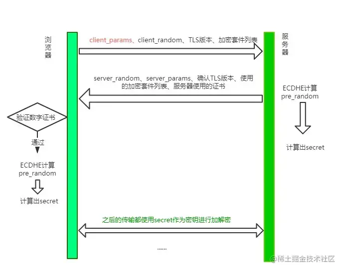

大体的方式和 TLS1.2 差不多，不过和 TLS 1.2 相比少了一个 RTT， 服务端不必等待对方验证证书之后才拿到`client_params`，而是直接在第一次握手的时候就能够拿到, 拿到之后立即计算`secret`，节省了之前不必要的等待时间。同时，这也意味着在第一次握手的时候客户端需要传送更多的信息，一口气给传完。

这种 TLS 1.3 握手方式也被叫做`1-RTT握手`。但其实这种`1-RTT`的握手方式还是有一些优化的空间的，接下来我们来一一介绍这些优化方式。

#### 会话复用

会话复用有两种方式: `Session ID`和`Session Ticket`。

先说说最早出现的`Seesion ID`，具体做法是客户端和服务器首次连接后各自保存会话的 ID，并存储会话密钥，当再次连接时，客户端发送`ID`过来，服务器查找这个 ID 是否存在，如果找到了就直接复用之前的会话状态，会话密钥不用重新生成，直接用原来的那份。

但这种方式也存在一个弊端，就是当客户端数量庞大的时候，对服务端的存储压力非常大。

因而出现了第二种方式——`Session Ticket`。它的思路就是: 服务端的压力大，那就把压力分摊给客户端呗。具体来说，双方连接成功后，服务器加密会话信息，用`Session Ticket`消息发给客户端，让客户端保存下来。下次重连的时候，就把这个 Ticket 进行解密，验证它过没过期，如果没过期那就直接恢复之前的会话状态。

这种方式虽然减小了服务端的存储压力，但与带来了安全问题，即每次用一个固定的密钥来解密 Ticket 数据，一旦黑客拿到这个密钥，之前所有的历史记录也被破解了。因此为了尽量避免这样的问题，密钥需要定期进行更换。

总的来说，这些会话复用的技术在保证`1-RTT`的同时，也节省了生成会话密钥这些算法所消耗的时间，是一笔可观的性能提升。

#### PSK

刚刚说的都是`1-RTT`情况下的优化，那能不能优化到`0-RTT`呢？

答案是可以的。做法其实也很简单，在发送`Session Ticket`的同时带上应用数据，不用等到服务端确认，这种方式被称为`Pre-Shared Key`，即 PSK。

这种方式虽然方便，但也带来了安全问题。中间人截获`PSK`的数据，不断向服务器重复发，类似于 TCP 第一次握手携带数据，增加了服务器被攻击的风险。

### 总结

TLS1.3 在 TLS1.2 的基础上废除了大量的算法，提升了安全性。同时利用会话复用节省了重新生成密钥的时间，利用 PSK 做到了`0-RTT`连接。


**要点**：
TLS 1.2 是一种广泛使用的网络安全协议，自 2008 年发布以来，一直是互联网通信的标准之一。然而，随着技术的发展和安全威胁的增加，TLS 1.3 在 2018 年被推出，对 TLS 1.2 进行了多项改进，以提高安全性和性能。

#### 安全性增强

TLS 1.3 通过以下方式加强了安全性：

1. **减少加密算法**：从 TLS 1.2 的多种加密算法中，TLS 1.3 只保留了五个加密套件，包括 AES 和 CHACHA20 等对称加密算法，以及 GCM 和 POLY1305 等分组模式，以及 SHA256 和 SHA384 等哈希算法。
2. **弃用 RSA**：TLS 1.3 弃用了 RSA 作为密钥交换算法，转而使用 ECDHE（椭圆曲线 Diffie-Hellman 密钥交换），因为它具有前向安全性，即使私钥被泄露，也不会影响之前加密的数据。

#### 性能提升

TLS 1.3 通过以下方式提高了性能：

1. **改进握手流程**：TLS 1.3 简化了握手流程，减少了 RTT（往返时间），使得客户端和服务器在第一次握手时就能开始计算密钥，从而提高了连接速度。
2. **会话复用**：TLS 1.3 支持会话复用，包括使用 Session ID 和 Session Ticket。Session Ticket 减少了服务器的存储压力，但需要定期更换密钥以保持安全性。
3. **PSK（预共享密钥）**：TLS 1.3 支持 PSK，允许客户端在发送 Session Ticket 时携带应用数据，实现零 RTT 连接，但这也增加了服务器被攻击的风险。


---
### 1250. webSocket 有哪些安全问题，应该如何应对？

**难度**：★★★★☆ | **题型**：QA | **分类**：全部 / 计算机网络 / 前端安全

**题目**：


**参考答案**：
 ### 1. WebSocket特性介绍

WebSocket是HTML5开始提供的一种浏览器与服务器间进行全双工通讯的网络技术。WebSocket通信协议于2011年被IETF定为标准RFC 6455，WebSocket API也被W3C定为标准，主流的浏览器都已经支持WebSocket通信。

WebSocket协议是基于TCP协议上的独立的通信协议，在建立WebSocket通信连接前，需要使用HTTP协议进行握手，从HTTP连接升级为WebSocket连接。浏览器和服务器只需要完成一次握手，两者之间就直接可以创建持久性的连接，并进行双向数据传输。

WebSocket定义了两种URI格式, “ws://“和“wss://”，类似于HTTP和HTTPS, “ws://“使用明文传输，默认端口为80，”wss://“使用TLS加密传输，默认端口为443。

```ini
ws-URI : "ws://host[:port]path[?query]" wss-URI : "wss://host[:port]path[?query]"复制代码
```

WebSocket 握手阶段，需要用到一些HTTP头，升级HTTP连接为WebSocket连接如下表所示。 

| HTTP头                    | 是否必须   | 解释                        |
| ------------------------ | ------ | ------------------------- |
| Host                     | 是      | 服务端主机名                    |
| Upgrade                  | 是      | 固定值，”websocket”           |
| Connection               | 是      | 固定值，”Upgrade”             |
| Sec-WebSocket-Key        | 是      | 客户端临时生成的16字节随机值, base64编码 |
| Sec-WebSocket-Version    | 是      | WebSocket协议版本             |
| Origin                   | 否      | 可选, 发起连接请求的源              |
| Sec-WebSocket-Accept     | 是(服务端) | 服务端识别连接生成的随机值             |
| Sec-WebSocket-Protocol   | 否      | 可选，客户端支持的协议               |
| Sec-WebSocket-Extensions | 否      | 可选， 扩展字段                  |

一次完整的握手连接如下图:

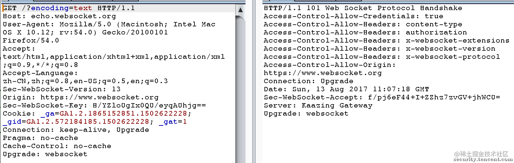 

一旦服务器端返回 101 响应，即可完成 WebSocket 协议切换。服务器端可以基于相同端口，将通信协议从 http://或 https:// 切换到 ws://或 wss://。协议切换完成后，浏览器和服务器端可以使用 WebSocket API 互相发送和收取文本和二进制消息。

### 2. WebSocket应用安全问题

WebSocket作为一种通信协议引入到Web应用中，并不会解决Web应用中存在的安全问题，因此WebSocket应用的安全实现是由开发者或服务端负责。这就要求开发者了解WebSocket应用潜在的安全风险，以及如何做到安全开发规避这些安全问题。

#### 2.1 认证

WebSocket 协议没有规定服务器在握手阶段应该如何认证客户端身份。服务器可以采用任何 HTTP 服务器的客户端身份认证机制，如 cookie认证，HTTP 基础认证，TLS 身份认证等。在WebSocket应用认证实现上面临的安全问题和传统的Web应用认证是相同的，如：[CVE-2015-0201](https://cve.mitre.org/cgi-bin/cvename.cgi?name=CVE-2015-0201), Spring框架的Java SockJS客户端生成可预测的会话ID，攻击者可利用该漏洞向其他会话发送消息; [CVE-2015-1482](https://cve.mitre.org/cgi-bin/cvename.cgi?name=CVE-2015-1482), Ansible Tower未对用户身份进行认证，远程攻击者通过websocket连接获取敏感信息。

#### 2.2 授权

同认证一样，WebSocket协议没有指定任何授权方式，应用程序中用户资源访问等的授权策略由服务端或开发者实现。WebSocket应用也会存在和传统Web应用相同的安全风险，如：垂直权限提升和水平权限提升。

#### 2.3 跨域请求

WebSocket使用基于源的安全模型，在发起WebSocket握手请求时，浏览器会在请求中添加一个名为Origin的HTTP头，Oringin字段表示发起请求的源，以此来防止未经授权的跨站点访问请求。WebSocket 的客户端不仅仅局限于浏览器，因此 WebSocket 规范没有强制规定握手阶段的 Origin 头是必需的，并且WebSocket不受浏览器同源策略的限制。如果服务端没有针对Origin头部进行验证可能会导致跨站点WebSocket劫持攻击。该漏洞最早在 2013 年被Christian Schneider 发现并公开，Christian 将之命名为跨站点 WebSocket 劫持 (Cross Site WebSocket Hijacking)(CSWSH)。跨站点 WebSocket 劫持危害大，但容易被开发人员忽视。

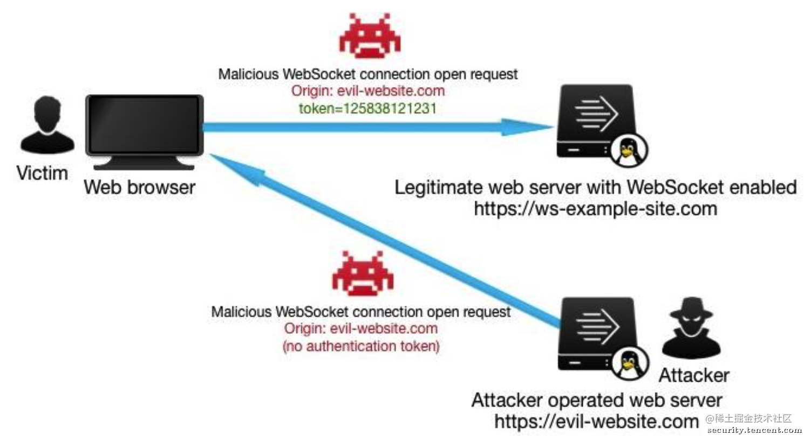 

上图展示了跨站WebSocket劫持的过程，某个用户已经登录了WebSocket应用程序，如果他被诱骗访问了某个恶意网页，而恶意网页中植入了一段js代码，自动发起 WebSocket 握手请求跟目标应用建立 WebSocket 连接。注意到，Origin 和 Sec-WebSocket-Key 都是由浏览器自动生成的，浏览器再次发起请求访问目标服务器会自动带上Cookie 等身份认证参数。如果服务器端没有检查 Origin头，则该请求会成功握手切换到 WebSocket 协议，恶意网页就可以成功绕过身份认证连接到 WebSocket 服务器，进而窃取到服务器端发来的信息，或者发送伪造信息到服务器端篡改服务器端数据。与传统跨站请求伪造(CSRF)攻击相比，CSRF 主要是通过恶意网页悄悄发起数据修改请求，而跨站 WebSocket 伪造攻击不仅可以修改服务器数据，还可以控制整个双向通信通道。也正是因为这个原因，Christian 将这个漏洞命名为劫持(Hijacking)，而不是请求伪造(Request Forgery)。

理解了跨站WebSocket劫持攻击的原理和过程，那么如何防范这种攻击呢？处理也比较简单，在服务器端的代码中增加 对Origin头的检查，如果客户端发来的 Origin 信息来自不同域，服务器端可以拒绝该请求。但是仅仅检查 Origin 仍然是不够安全的，恶意网页可以伪造Origin头信息，绕过服务端对Origin头的检查，更完善的解决方案可以借鉴CSRF的解决方案-令牌机制。

#### 2.4 拒绝服务

WebSocket设计为面向连接的协议，可被利用引起客户端和服务器端拒绝服务攻击。

**(1). 客户端拒绝服务**

WebSocket连接限制不同于HTTP连接限制，和HTTP相比，WebSocket有一个更高的连接限制，不同的浏览器有自己特定的最大连接数,如：火狐浏览器默认最大连接数为200。通过发送恶意内容，用尽允许的所有Websocket连接耗尽浏览器资源，引起拒绝服务。

**(2). 服务器端拒绝服务**

WebSocket建立的是持久连接，只有客户端或服务端其中一发提出关闭连接的请求，WebSocket连接才关闭，因此攻击者可以向服务器发起大量的申请建立WebSocket连接的请求，建立持久连接，耗尽服务器资源，引发拒绝服务。针对这种攻，可以通过设置单IP可建立连接的最大连接数的方式防范。攻击者还可以通过发送一个单一的庞大的数据帧(如, 2^16)，或者发送一个长流的分片消息的小帧，来耗尽服务器的内存，引发拒绝服务攻击, 针对这种攻击，通过限制帧大小和多个帧重组后的总消息大小的方式防范。

#### 2.5 中间人攻击

WebSocket使用HTTP或HTTPS协议进行握手请求，在使用HTTP协议的情况下，若存在中间人可以嗅探HTTP流量，那么中间人可以获取并篡改WebSocket握手请求，通过伪造客户端信息与服务器建立WebSocket连接，如下图所示。防范这种攻击，需要在加密信道上建立WebSocket连接，使用HTTPS协议发起握手请求。

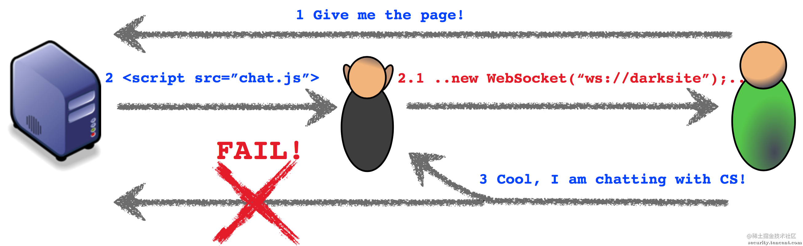 

#### 2.6 输入校验

WebSocket应用和传统Web应用一样，都需要对输入进行校验，来防范来客户端的XSS攻击，服务端的SQL注入，代码注入等攻击。

### 3. 总结

Websocket是一个基于TCP的HTML5的新协议，可以实现浏览器和服务器之间的全双工通讯。在即时通讯等应用中，WebSocket具有很大的性能优势, 并且非常适合全双工通信，但是，和任何其他技术一样，开发WebSocket应用也需要考虑潜在的安全风险。


**要点**：
**答题思路：**

#### WebSocket可能遇到的安全问题

1. **跨站脚本攻击（XSS）**：
    攻击者可能通过WebSocket连接向用户发送恶意脚本，如果服务器没有适当过滤和验证用户输入，这些脚本可能会被浏览器执行。

2. **跨站请求伪造（CSRF）**：
   WebSocket连接可能被用于执行未经授权的操作，尤其是当身份验证和授权机制存在缺陷时。

3. **中间人攻击（MitM）**：
   攻击者可能截获和篡改WebSocket连接，窃取用户敏感信息或操纵通信内容。

4. **拒绝服务（DoS）攻击**：
   恶意用户可能通过大量的并发WebSocket连接或发送大量的消息来耗尽服务器资源。

5. **未加密的通信**：
   如果WebSocket连接未通过TLS/SSL加密，则传输的数据可能被截获和读取。

6. **身份验证和授权问题**：
   WebSocket协议本身不处理授权或身份验证，需要应用程序层来确保只有经过授权的用户才能建立连接。

#### 应对策略

1. **使用TLS/SSL加密**：
   使用wss://协议代替ws://协议，确保WebSocket通信过程中的数据加密，防止中间人攻击。

2. **输入验证和过滤**：
    对从用户输入中获取的数据进行严格的验证和过滤，确保输入数据的安全性，防止XSS攻击。

3. **身份验证和授权**：
   在WebSocket连接建立时，进行适当的身份验证和授权，确保只有经过授权的用户可以建立连接和发送消息。

4. **CSRF防御**：
    使用CSRF令牌等机制来验证WebSocket请求的来源，确保请求来自合法用户。

5. **资源限制**：
    实施适当的资源限制和控制，例如限制每个用户的并发连接数或消息发送频率，以防止资源耗尽攻击。


---
### 1251. 什么是跨域？

**难度**：★☆☆☆☆ | **题型**：QA | **分类**：全部 / JavaScript / 计算机网络

**题目**：


**参考答案**：
**跨域**（Cross-Origin）是指从一个域名的网页去请求另一个域名的资源。在Web开发中，出于安全考虑，同源策略（Same-Origin Policy）限制了文档或脚本如何与来自不同源的“资源”进行交互。这里的“源”指的是协议（如http或https）、域名（如www.example.com）和端口号（如80或443）的组合。如果协议、域名或端口号中的任何一个不同，那么两个资源就被认为是来自不同的源，即跨域。

跨域问题主要出现在前端开发中，尤其是当前端页面需要从不同源的服务器请求数据或服务时。由于浏览器的同源策略，这些跨域请求可能会被阻止，导致请求失败。

为了解决这个问题，有几种常见的跨域资源共享（CORS, Cross-Origin Resource Sharing）策略：

1. **JSONP**：一种早期的跨域技术，通过在客户端动态创建`<script>`标签并设置其`src`属性为跨域URL（该URL会返回一段JavaScript代码，该代码中包含需要的数据），然后利用`<script>`标签的跨域能力来执行返回的JavaScript代码，从而获取数据。但JSONP只支持GET请求，并且存在安全风险。

2. **CORS**：现代浏览器支持的跨域资源共享标准。服务器通过设置响应头（如`Access-Control-Allow-Origin`）来明确告知客户端哪些域的请求是被允许的。CORS支持更复杂的HTTP请求，如POST、PUT等，并且安全性更高。

3. **代理服务器**：在客户端和服务器之间设置一个代理服务器，客户端的请求先发送到代理服务器，代理服务器再将请求转发给目标服务器，并将响应返回给客户端。这样，从客户端的角度看，它始终在与同源的代理服务器进行交互，从而避免了跨域问题。

4. **Nginx反向代理**：一种常见的代理服务器解决方案，通过配置Nginx来实现对跨域请求的转发和响应。

5. **document.domain + iframe**：对于主域相同但子域不同的跨域问题，可以通过设置`document.domain`来使两个页面共享同一个域，然后通过iframe进行交互。但这种方法有一定的局限性，并且存在安全风险。

6. **postMessage**：HTML5引入的一种跨文档通信API，允许来自不同源的页面进行安全通信。通过监听`message`事件并检查事件的`origin`属性，可以确保消息来自预期的源。


**要点**：
**跨域**是指从一个网站（源）去请求另一个网站（目标）的资源时，由于浏览器的同源策略限制，这种请求可能会被阻止。同源策略要求协议、域名、端口号都相同。

为了解决跨域问题，有几种常用方法：

1. **CORS**：服务器设置响应头，允许特定源的跨域请求。
2. **JSONP**：利用`<script>`标签的跨域能力，但只支持GET请求且存在安全风险。
3. **代理服务器**：通过代理服务器转发请求和响应，客户端与代理服务器同源。
4. **postMessage**：HTML5 API，允许不同源的窗口或iframe之间进行安全通信。


---
### 1348. 说说你对 http 协议中 HSTS 的理解

**难度**：★★★☆☆ | **题型**：QA | **分类**：全部 / 计算机网络

**题目**：


**参考答案**：
### **什么是 HSTS？**

HSTS，全称是 **HTTP Strict Transport Security**，即 **HTTP 严格传输安全**，是一种 Web 安全机制。HSTS 可以通过 HTTP 响应头 `Strict-Transport-Security`，指示浏览器在一段时间内强制使用 HTTPS 来访问某个网站，禁止通过 HTTP 连接，从而防止中间人攻击（MITM）和协议降级攻击。

---

### **HSTS 的工作原理**

1. **服务器启用 HSTS**：服务器通过响应头 `Strict-Transport-Security` 告诉浏览器，该站点应该始终通过 HTTPS 访问。
2. **浏览器强制 HTTPS**：
   - 浏览器会记录 HSTS 策略，接下来的访问会自动从 HTTP 跳转到 HTTPS，无需服务器返回重定向。
   - 即使用户手动输入 `http://example.com`，浏览器也会直接使用 `https://example.com`。
3. **保护作用**：避免中间人通过拦截 HTTP 请求或劫持协议的方式，实施攻击。

---

### **HSTS 响应头**

HSTS 的配置通过设置 HTTP 响应头 `Strict-Transport-Security` 来实现。其常用语法如下：
```http
Strict-Transport-Security: max-age=<expire-time>; includeSubDomains; preload
```

#### **指令说明**：
- **`max-age`**：  
  - 必须字段，单位是秒，表示 HSTS 策略在浏览器中生效的时间。
  - 常见设置为 31536000（1 年）。

- **`includeSubDomains`**（可选）：  
  - 如果指定，策略适用于主域名及其所有子域名。

- **`preload`**（可选）：  
  - 让网站加入 HSTS Preload 列表，避免首次访问被降级为 HTTP。

---

### **HSTS 示例**

#### **基础配置**
仅强制主域名使用 HTTPS：
```http
Strict-Transport-Security: max-age=31536000
```

#### **包括子域名**
强制主域名及所有子域名使用 HTTPS：
```http
Strict-Transport-Security: max-age=31536000; includeSubDomains
```

#### **加入预加载列表**
在主域名、子域名启用 HSTS，并支持预加载：
```http
Strict-Transport-Security: max-age=31536000; includeSubDomains; preload
```

---

### **HSTS 的优势**

1. **防止协议降级攻击**：  
   即使攻击者尝试通过 HTTP 劫持用户连接，HSTS 也会强制浏览器直接使用 HTTPS。

2. **提高数据传输安全性**：  
   所有的传输内容都会通过 HTTPS 加密，防止敏感数据被窃取。

3. **性能优化**：  
   避免 HTTP 到 HTTPS 的 301 重定向，提高首屏加载速度。

4. **提升 SEO 排名**：  
   搜索引擎（如 Google）优先处理 HTTPS 站点，HSTS 可以提高安全性评分。

---

### **HSTS 的局限性**

1. **首次访问的风险**：
   - 如果用户首次访问时使用 HTTP，并且中间人进行了劫持，那么 HSTS 无法生效。
   - 解决方法：加入 **HSTS Preload 列表**，让浏览器内置对站点的 HSTS 支持。

2. **错误配置的影响**：
   - 例如设置了错误的子域名策略或低效的过期时间，可能导致站点无法正常访问。

3. **对开发环境的影响**：
   - 开发测试时，HSTS 会缓存策略，导致本地开发过程中调试不便。

4. **需要完全支持 HTTPS**：
   - 所有资源（包括图片、脚本、第三方库等）必须通过 HTTPS 加载。

---

### **HSTS 与 HSTS Preload 列表**

HSTS Preload 是一个由浏览器维护的内置列表，记录了启用 HSTS 的站点。在用户首次访问这些站点时，浏览器会直接使用 HTTPS。

#### **加入 HSTS Preload 的条件**：
- 设置 `Strict-Transport-Security` 响应头，且包含以下字段：
  ```http
  Strict-Transport-Security: max-age=31536000; includeSubDomains; preload
  ```
- 支持 HTTPS，并确保主域及其子域始终通过 HTTPS 访问。
- 在 Google 的 [HSTS Preload 网站](https://hstspreload.org/) 提交申请。


**要点**：
HSTS 是一种重要的 Web 安全策略，通过强制使用 HTTPS，有效防止协议降级攻击和中间人攻击。然而，为了确保其安全性，服务器和站点必须全面支持 HTTPS，且在部署 HSTS 时需要谨慎配置，避免对用户体验产生负面影响。结合 HSTS Preload，可以进一步提升首访的安全性。

---
### 1355. 介绍下WebSocket

**难度**：★★☆☆☆ | **题型**：QA | **分类**：全部 / 计算机网络

**题目**：


**参考答案**：
<h3 style="text-align:left;text-indent:2em;" data-id="heading-82">1. WebSocket 是什么</h3><p style="text-align:left;text-indent:2em;">WebSocket是HTML5提供的一种浏览器与服务器进行<strong>全双工通讯</strong>的网络技术，属于应用层协议。它基于TCP传输协议，并复用HTTP的握手通道。浏览器和服务器只需要完成一次握手，两者之间就直接可以创建持久性的连接， 并进行双向数据传输。</p><p style="text-align:left;text-indent:2em;">WebSocket 的出现就解决了半双工通信的弊端。它最大的特点是：<strong>服务器可以向客户端主动推动消息，客户端也可以主动向服务器推送消息。</strong></p><p style="text-align:left;text-indent:2em;"><strong>WebSocket原理</strong> ：客户端向 WebSocket 服务器通知（notify）一个带有所有接收者ID（recipients IDs）的事件（event），服务器接收后立即通知所有活跃的（active）客户端，只有ID在接收者ID序列中的客户端才会处理这个事件。</p><p></p><h3 style="text-align:left;text-indent:2em;" data-id="heading-83">2. WebSocket 特点</h3><ul><li>支持双向通信，实时性更强</li><li>可以发送文本，也可以发送二进制数据‘’</li><li>建立在TCP协议之上，服务端的实现比较容易</li><li>数据格式比较轻量，性能开销小，通信高效</li><li>没有同源限制，客户端可以与任意服务器通信</li><li>协议标识符是ws（如果加密，则为wss），服务器网址就是 URL</li><li>与 HTTP 协议有着良好的兼容性。默认端口也是80和443，并且握手阶段采用 HTTP 协议，因此握手时不容易屏蔽，能通过各种 HTTP 代理服务器。</li></ul>

**要点**：
<p></p><p style="text-align:left;text-indent:2em;">WebSocket是一种HTML5提供的网络技术，它允许浏览器和服务器之间进行全双工通信，即可以同时进行双向数据传输。WebSocket基于TCP传输协议，并且使用HTTP的握手通道来建立连接。一旦握手完成，客户端和服务器之间就可以直接通信，无需再次建立连接。</p><p style="text-align:left;text-indent:2em;">WebSocket的特点包括：</p><ul><li><strong>双向通信</strong>：客户端和服务器可以相互发送消息，增强了实时性。</li><li><strong>支持多种数据格式</strong>：可以发送文本数据和二进制数据。</li><li><strong>简单易实现</strong>：建立在TCP协议之上，服务端的实现相对简单。</li><li><strong>高效性能</strong>：数据格式轻量，通信高效，性能开销小。</li><li><strong>无同源限制</strong>：客户端可以与任意服务器通信，不受同源策略的限制。</li><li><strong>协议标识符</strong>：默认使用ws（未加密）和wss（加密）作为协议标识符。</li><li><strong>兼容性</strong>：与HTTP协议兼容，可以通过各种HTTP代理服务器。</li></ul><p style="text-align:left;text-indent:2em;">WebSocket的工作原理是客户端通知服务器一个事件，服务器接收到事件后，立即通知所有活跃的客户端。只有接收者ID在事件中指定的客户端才会处理这个事件。这种方式使得WebSocket能够有效地实现事件驱动的通信模式。</p>

---
### 1356. POST请求的 Content-Type 常见的有哪几种？

**难度**：★★★☆☆ | **题型**：QA | **分类**：全部 / 计算机网络

**题目**：


**参考答案**：
在 `POST` 请求中，`Content-Type` 头部字段用于指定请求主体的数据格式。常见的 `Content-Type` 类型如下：

1. **application/x-www-form-urlencoded**
   - **说明**：这是 HTML 表单默认的 `Content-Type`，键值对格式，数据在 URL 编码后传递。
   - **格式**：`key1=value1&key2=value2`
   - **常用场景**：简单表单提交，如登录、注册等。

2. **multipart/form-data**
   - **说明**：用于上传文件的表单提交方式，将表单数据和文件数据一起分段发送。
   - **格式**：每个字段分割为多段，各段包含字段名、数据类型和内容。
   - **常用场景**：文件上传，如图片、文档等。

3. **application/json**
   - **说明**：以 JSON 格式传递数据，数据结构化、可读性强。
   - **格式**：`{ "key1": "value1", "key2": "value2" }`
   - **常用场景**：前后端交互中的常见选择，尤其是 RESTful API 请求。

4. **text/plain**
   - **说明**：纯文本格式，数据不会经过编码或处理，服务器直接接收。
   - **格式**：`plain text data`
   - **常用场景**：简单的文本数据提交。

5. **application/octet-stream**
   - **说明**：用于传输二进制数据，如文件或流，未指定具体的文件类型。
   - **格式**：原始二进制数据
   - **常用场景**：文件上传（不需区分文件类型），如传输音视频流。

**要点**：
`POST` 请求中常用的 `Content-Type` 有 `application/x-www-form-urlencoded`、`multipart/form-data`、`application/json`、`text/plain` 和 `application/octet-stream`。

选择 `Content-Type` 类型取决于数据格式和应用场景，`application/json` 和 `multipart/form-data` 是现代前后端交互中最常用的选择。

---
### 1358. 说说对 WebSocket 的了解

**难度**：★★☆☆☆ | **题型**：QA | **分类**：全部 / JavaScript / 计算机网络

**题目**：


**参考答案**：
## 什么是WebSocket

HTML5开始提供的一种浏览器与服务器进行全双工通讯的网络技术，属于应用层协议。它基于TCP传输协议，并复用HTTP的握手通道。

## 优点 

说到优点，这里的对比参照物是HTTP协议，概括地说就是：支持双向通信，更灵活，更高效，可扩展性更好。

* 支持双向通信，实时性更强。
* 更好的二进制支持。
* 较少的控制开销。连接创建后，ws客户端、服务端进行数据交换时，协议控制的数据包头部较小。在不包含头部的情况下，服务端到客户端的包头只有2~10字节（取决于数据包长度），客户端到服务端的的话，需要加上额外的4字节的掩码。而HTTP协议每次通信都需要携带完整的头部。
* 支持扩展。ws协议定义了扩展，用户可以扩展协议，或者实现自定义的子协议。（比如支持自定义压缩算法等）


**要点**：
WebSocket是一种在HTML5中引入的网络技术，允许浏览器与服务器之间进行全双工通信，属于应用层协议。它建立在TCP协议之上，并使用HTTP握手通道。

与HTTP协议相比，WebSocket的优点包括：

- **双向通信**：支持实时双向数据传输，实时性更强。
- **二进制支持**：对二进制数据有更好的支持。
- **控制开销小**：连接建立后，数据交换时的协议控制数据包头部较小，相比HTTP协议，减少了数据传输量。
- **支持扩展**：协议允许用户扩展或实现自定义子协议，如支持自定义压缩算法等，提高了可扩展性。


---
### 1379. 说说你对 Server-sent events(SSE，服务端推送) 的了解

**难度**：★★★☆☆ | **题型**：QA | **分类**：全部 / 计算机网络

**题目**：


**参考答案**：
Server-Sent Events (SSE) 是一种基于 HTTP 的技术，用于实现服务器向客户端推送实时更新。与 WebSocket 不同，SSE 只支持从服务器到客户端的单向通信，并且是基于文本的事件流。

### **特点与工作原理**

1. **单向通信**：
   - SSE 允许服务器主动向客户端推送消息，但客户端不能直接通过 SSE 向服务器发送数据（虽然可以通过其他方法，如普通的 HTTP 请求）。

2. **连接建立**：
   - 客户端通过向服务器发起 `EventSource` 请求来建立连接。服务器通过 HTTP 头 `Content-Type: text/event-stream` 声明响应内容类型，表明数据流是 SSE 格式。

   ```javascript
   const eventSource = new EventSource('your-endpoint-url');

   eventSource.onmessage = function(event) {
     console.log('New message:', event.data);
   };

   eventSource.onerror = function(error) {
     console.error('Error:', error);
   };
   ```

3. **事件格式**：
   - SSE 数据格式简单，每条消息以 `data:` 开头，字段之间用空行分隔。事件类型、重试时间等信息可以通过特定字段传递。

   ```
   data: Hello World
   data: This is another line of data
   ```

4. **自动重连**：
   - 如果连接中断，浏览器会自动重连。服务器也可以通过 `retry:` 指令指定重连间隔。

   ```
   retry: 5000
   ```

5. **事件类型**：
   - 可以指定事件类型，客户端通过 `addEventListener` 监听特定事件类型的消息。

   ```javascript
   eventSource.addEventListener('custom-event', function(event) {
     console.log('Custom event:', event.data);
   });
   ```

6. **兼容性**：
   - SSE 在大多数现代浏览器中得到支持，但不支持 IE 和一些较老的浏览器。需要检查浏览器兼容性，或考虑使用 Polyfill。

### **优点**

- **简单**：易于实现和使用。
- **自动重连**：浏览器自动处理连接断开和重连。
- **基于标准**：基于标准的 HTTP 协议和文本格式。

### **缺点**

- **单向通信**：只支持从服务器到客户端的消息传递，客户端需要通过其他手段与服务器通信。
- **限制**：不支持二进制数据和大规模数据传输。

**要点**：
SSE 是一种轻量级的技术，适用于需要从服务器实时推送更新的应用场景，如实时通知、消息流和实时数据更新。它的实现简单、自动重连机制良好，但仅支持单向通信和文本格式数据。如果需要双向通信或支持二进制数据，可以考虑使用 WebSocket。

---
### 1391. http1.1 的 keep-alive 和 http2 的多路复用有什么区别？

**难度**：★★★☆☆ | **题型**：QA | **分类**：全部 / 计算机网络

**题目**：


**参考答案**：
HTTP/1.1 的 Keep-Alive 和 HTTP/2 的多路复用是两种不同的技术，尽管它们都旨在提高网络请求的效率，但实现方式和功能有显著区别。

### **1. Keep-Alive（HTTP/1.1）**

- **连接保持**：HTTP/1.1 引入了 Keep-Alive 机制，允许在同一个 TCP 连接上发送多个 HTTP 请求和响应，减少了频繁建立和关闭连接的开销。
- **请求顺序**：在一个连接上，HTTP/1.1 的请求是顺序处理的，即必须等待前一个请求完成后，才能发送下一个请求，这可能导致队头阻塞（Head-of-Line Blocking）的问题。
- **连接重用**：Keep-Alive 可以降低延迟，提高性能，但在高并发场景下，仍然需要为每个请求打开一个 TCP 连接。

### **2. 多路复用（HTTP/2）**

- **并发请求**：HTTP/2 的多路复用允许在同一个 TCP 连接上并发地发送多个请求和响应，而无需等待前一个完成。这解决了队头阻塞的问题。
- **流的概念**：HTTP/2 引入了流的概念，每个请求和响应都被视为一个独立的流，流的优先级可以被设置，这样可以根据需求合理调度。
- **二进制协议**：HTTP/2 使用二进制帧传输数据，进一步优化了数据传输的效率，相比于文本协议的 HTTP/1.1，更加高效。

**要点**：
- **Keep-Alive**：在 HTTP/1.1 中通过保持连接来减少建立连接的开销，但仍然受到请求顺序的限制，容易导致队头阻塞。
- **多路复用**：在 HTTP/2 中，允许多个并发请求在同一连接上处理，解决了队头阻塞问题，优化了性能和效率。 

HTTP/2 的多路复用在处理高并发场景时，表现优于 HTTP/1.1 的 Keep-Alive。

---
### 1411. 你知道哪些应用层协议？

**难度**：★★☆☆☆ | **题型**：QA | **分类**：全部 / 计算机网络

**题目**：


**参考答案**：
应用层常见的协议：

* 超文本传输 Http、Https
* 文本传输：FTP
* 电子邮件：SMTP、POP3、IMAP
* 动态主机配置：DHCP
* 域名系统：DNS


---
### 1432. 为什么 http2 能非常快速的过渡到 HTTP3 ？

**难度**：★★☆☆☆ | **题型**：QA | **分类**：全部 / 计算机网络

**题目**：


**参考答案**：
HTTP/2 迅速过渡到 HTTP/3 的原因主要包括以下几点：

### **1. 技术架构的改进**

- **基于 QUIC**：HTTP/3 基于 QUIC 协议，使用 UDP 而非 TCP。这使得连接建立和数据传输的延迟显著降低，尤其在丢包的情况下表现更优。

### **2. 改善了性能**

- **减少延迟**：QUIC 的零连接建立和快速恢复机制大幅减少了延迟，尤其是在移动网络和高延迟环境下表现更佳。

### **3. 增强的安全性**

- **内置加密**：QUIC 本身内置加密，简化了安全连接的建立过程，提高了安全性。

### **4. 适应现代网络需求**

- **多路复用**：HTTP/2 的多路复用虽然解决了队头阻塞问题，但仍依赖于 TCP。HTTP/3 的设计进一步优化了多路复用，降低了网络瓶颈。

### **5. 社区和行业支持**

- **广泛支持**：主要浏览器和服务器（如 Chrome、Firefox 和 NGINX）迅速支持 HTTP/3，推动了其 adoption。

**要点**：
HTTP/2 向 HTTP/3 的快速过渡是因为 QUIC 协议的引入带来了更低的延迟、更好的性能和更高的安全性，适应了现代网络的需求，并获得了广泛的社区和行业支持。这些因素共同促成了 HTTP/3 的快速发展和应用。

---
### 1481. 说说你对cookie的理解

**难度**：★★☆☆☆ | **题型**：QA | **分类**：全部 / 计算机网络

**题目**：


**参考答案**：
### Cookie 简介

HTTP 是一个无状态的协议，每次 http 请求都是独立、无关的，默认不需要保留状态信息。但有时候需要保存一些状态，怎么办呢？
 
HTTP 为此引入了 Cookie。Cookie 本质上就是浏览器里面存储的一个很小的文本文件，内部以键值对的方式来存储(在chrome开发者面板的Application这一栏可以看到)。向同一个域名下发送请求，都会携带相同的 Cookie，服务器拿到 Cookie 进行解析，便能拿到客户端的状态。而服务端可以通过响应头中的`Set-Cookie`字段来对客户端写入`Cookie`。举例如下:

```
// 请求头
Cookie: a=xxx;b=xxx
// 响应头
Set-Cookie: a=xxx
set-Cookie: b=xxx
```

### Cookie 属性

#### 生存周期

Cookie 的有效期可以通过`Expires`和`Max-Age`两个属性来设置。

*   `Expires`即`过期时间`
*   `Max-Age`用的是一段时间间隔，单位是秒，从浏览器收到报文开始计算。

若 Cookie 过期，则这个 Cookie 会被删除，并不会发送给服务端。

#### 作用域

关于作用域也有两个属性: `Domain`和`path`, 给 `Cookie` 绑定了域名和路径，在发送请求之前，发现域名或者路径和这两个属性不匹配，那么就不会带上 Cookie。值得注意的是，对于路径来说，`/`表示域名下的任意路径都允许使用 Cookie。

#### 安全相关

如果带上`Secure`，说明只能通过 HTTPS 传输 cookie。

如果 cookie 字段带上`HttpOnly`，那么说明只能通过 HTTP 协议传输，不能通过 JS 访问，这也是预防 XSS 攻击的重要手段。

相应的，对于 CSRF 攻击的预防，也有`SameSite`属性。

`SameSite`可以设置为三个值，`Strict`、`Lax`和`None`。

* 在`Strict`模式下，浏览器完全禁止第三方请求携带Cookie。比如请求`sanyuan.com`网站只能在`sanyuan.com`域名当中请求才能携带 Cookie，在其他网站请求都不能。
* 在`Lax`模式，就宽松一点了，但是只能在 `get 方法提交表单`况或者`a 标签发送 get 请求`的情况下可以携带 Cookie，其他情况均不能。
* 在`None`模式下，也就是默认模式，请求会自动携带上 Cookie。

### Cookie 的缺点

* 容量缺陷。Cookie 的体积上限只有`4KB`，只能用来存储少量的信息。
* 性能缺陷。Cookie 紧跟域名，不管域名下面的某一个地址需不需要这个 Cookie ，请求都会携带上完整的 Cookie，这样随着请求数的增多，其实会造成巨大的性能浪费的，因为请求携带了很多不必要的内容。但可以通过`Domain`和`Path`指定`作用域`来解决。
* 安全缺陷。由于 Cookie 以纯文本的形式在浏览器和服务器中传递，很容易被非法用户截获，然后进行一系列的篡改，在 Cookie 的有效期内重新发送给服务器，这是相当危险的。另外，在`HttpOnly`为 false 的情况下，Cookie 信息能直接通过 JS 脚本来读取。


**要点**：
Cookie 是 HTTP 协议中的一个机制，用于在客户端和服务器之间保持状态信息。它是一个存储在浏览器中的小型文本文件，以键值对的形式存储，每个域名的请求都会携带相同的 Cookie。服务器可以通过响应头中的 `Set-Cookie` 字段向客户端写入 Cookie。

Cookie 具有以下属性：

1. **生存周期**：通过 `Expires` 和 `Max-Age` 属性设置 Cookie 的有效期。如果 Cookie 过期，则会被删除，不再发送给服务端。
2. **作用域**：通过 `Domain` 和 `Path` 属性指定 Cookie 的域名和路径。如果域名或路径与请求的 URL 不匹配，则不会携带 Cookie。
3. **安全相关**：
   - `Secure`：设置为 true 时，Cookie 只能通过 HTTPS 传输。
   - `HttpOnly`：设置为 true 时，Cookie 只能通过 HTTP 协议传输，不能通过 JavaScript 访问，以防止 XSS 攻击。
   - `SameSite`：用于防止 CSRF 攻击，可设置为 `Strict`、`Lax` 或 `None`。

Cookie 存在一些缺点：

- **容量限制**：Cookie 的体积上限只有 4KB，不适合存储大量信息。
- **性能问题**：每个请求都会携带所有 Cookie，可能会造成性能浪费。
- **安全问题**：Cookie 以明文形式传输，容易受到中间人攻击。此外，`HttpOnly` 设置为 false 时，Cookie 信息可以通过 JavaScript 访问，增加了安全风险。


---
### 1499. TCP是怎么判断丢包的？

**难度**：★★★☆☆ | **题型**：QA | **分类**：全部 / 计算机网络

**题目**：


**参考答案**：
TCP协议传输的特点主要就是面向字节流、传输可靠、面向连接。

TCP协议保证数据传输可靠性的方式主要有：

* 校验和
* 序列号
* 确认应答
* 超时重传
* 连接管理
* 流量控制
* 拥塞控制

## 确认应答与序列号

序列号：TCP传输时将每个字节的数据都进行了编号，这就是序列号。

确认应答：TCP传输的过程中，每次接收方收到数据后，都会对传输方进行确认应答。也就是发送ACK报文。这个ACK报文当中带有对应的确认序列号，告诉发送方，接收到了哪些数据，下一次的数据从哪里发。

序列号的作用不仅仅是应答的作用，有了序列号能够将接收到的数据根据序列号排序，并且去掉重复序列号的数据。这也是TCP传输可靠性的保证之一

## 超时重传

在进行TCP传输时，由于确认应答与序列号机制，也就是说发送方发送一部分数据后，都会等待接收方发送的ACK报文，并解析ACK报文，判断数据是否传输成功。如果发送方发送完数据后，迟迟没有等到接收方的ACK报文，这该怎么办呢？而没有收到ACK报文的原因可能是什么呢？

发送方没有接收到ACK响应的原因：其中一方出现了网络问题。

* 数据发送方：数据发送过程中有由于网络问题全体丢包，接收方根本没有收到数据。
* 数据接收方：数据拿到了。但是发送ACK报文的时候由于网络问题，发送失败。

为了解决丢包问题导致的【确认应答、序列号】机制失效，TCP引入了超时重传机制。简单的理解就是在发送方发送数据后的一段时候内，如果没有接收到接收方的ACK响应，那么刚刚发送的数据需要重新发送。对应上面说到的两种原因，如果是数据发方的问题，数据重新发送，数据接收方进行响应ACK;如果是数据接收方的问题，数据发送过来之后，接收方根据序列号判断是否是重复数据，如果是直接丢弃，然后继续返回ack响应。

那么发送方发送完毕后等待的时间是多少呢？如果这个等待的时间过长，那么会影响TCP传输的整体效率，如果等待时间过短，又会导致频繁的发送重复的包。如何权衡？

由于TCP传输时保证能够在任何环境下都有一个高性能的通信，因此这个最大超时时间（也就是等待的时间）是动态计算的。

## 流量控制

接收端在接收到数据后，对其进行处理。如果发送端的发送速度太快，导致接收端的结束缓冲区很快的填充满了。此时如果发送端仍旧发送数据，那么接下来发送的数据都会丢包，继而导致丢包的一系列连锁反应，超时重传呀什么的。而TCP根据接收端对数据的处理能力，决定发送端的发送速度，这个机制就是流量控制。

在TCP协议的报头信息当中，有一个16位字段的窗口大小。在介绍这个窗口大小时我们知道，窗口大小的内容实际上是接收端接收数据缓冲区的剩余大小。这个数字越大，证明接收端接收缓冲区的剩余空间越大，网络的吞吐量越大。接收端会在确认应答发送ACK报文时，将自己的即时窗口大小填入，并跟随ACK报文一起发送过去。而发送方根据ACK报文里的窗口大小的值的改变进而改变自己的发送速度。如果接收到窗口大小的值为0，那么发送方将停止发送数据。并定期的向接收端发送窗口探测数据段，让接收端把窗口大小告诉发送端。

## 拥塞控制

TCP传输的过程中，发送端开始发送数据的时候，如果刚开始就发送大量的数据，那么就可能造成一些问题。网络可能在开始的时候就很拥堵，如果给网络中在扔出大量数据，那么这个拥堵就会加剧。拥堵的加剧就会产生大量的丢包，就对大量的超时重传，严重影响传输。

所以TCP引入了慢启动的机制，在开始发送数据时，先发送少量的数据探路。探清当前的网络状态如何，再决定多大的速度进行传输。这时候就引入一个叫做拥塞窗口的概念。发送刚开始定义拥塞窗口为 1，每次收到ACK应答，拥塞窗口加 1。在发送数据之前，首先将拥塞窗口与接收端反馈的窗口大小比对，取较小的值作为实际发送的窗口。

拥塞窗口的增长是指数级别的。慢启动的机制只是说明在开始的时候发送的少，发送的慢，但是增长的速度是非常快的。为了控制拥塞窗口的增长，不能使拥塞窗口单纯的加倍，设置一个拥塞窗口的阈值，当拥塞窗口大小超过阈值时，不能再按照指数来增长，而是线性的增长。在慢启动开始的时候，慢启动的阈值等于窗口的最大值，一旦造成网络拥塞，发生超时重传时，慢启动的阈值会为原来的一半（这里的原来指的是发生网络拥塞时拥塞窗口的大小），同时拥塞窗口重置为 1。

**要点**：
TCP协议是一种面向连接的、可靠的、基于字节流的传输层通信协议。它通过一系列机制来保证数据传输的可靠性，包括校验和、序列号、确认应答、超时重传、连接管理、流量控制和拥塞控制。

1. **确认应答与序列号**：
   - **序列号**：TCP为每个字节数据分配一个唯一的序列号，确保数据的有序传输。
   - **确认应答**：接收方通过发送ACK报文确认收到数据，ACK报文中包含序列号，告知发送方哪些数据已成功接收。
2. **超时重传**：
   - 当发送方未收到ACK报文时，会启动超时重传机制，重新发送未确认的数据。
   - 超时重传的时间是根据网络状况动态计算的，以确保传输效率。
3. **流量控制**：
   - TCP通过接收方发送的窗口大小来控制发送方的发送速度，避免接收缓冲区溢出。
   - 窗口大小反映了接收方的处理能力和缓冲区的剩余空间。
4. **拥塞控制**：
   - TCP采用慢启动和拥塞避免机制，逐步增加发送速度，以避免网络拥塞。
   - 拥塞窗口的大小决定了发送方的发送速率，通过与接收方反馈的窗口大小比较来调整。
   - 一旦发生拥塞，拥塞窗口会减小，直到网络状况改善。

TCP通过这些机制确保数据传输的可靠性和效率，适用于对数据完整性和顺序有较高要求的应用场景。


---
### 1512. ajax如何获取下载进度?

**难度**：★★☆☆☆ | **题型**：QA | **分类**：全部 / 计算机网络

**题目**：


**参考答案**：
在使用 AJAX 进行文件下载时，可以通过 XMLHttpRequest 的 `progress` 事件来获取下载进度。以下是如何实现这一过程的详细步骤：

### **1. 使用 XMLHttpRequest 监控下载进度**

**1.1 创建 XMLHttpRequest 实例**

```javascript
const xhr = new XMLHttpRequest();
```

**1.2 配置请求**

设置请求的 URL 和方法（如 `GET`），并配置相关的事件监听器。

```javascript
xhr.open('GET', 'https://example.com/large-file', true);
xhr.responseType = 'blob'; // 如果下载的是二进制文件，可以设置为 'blob'
```

**1.3 监听 `progress` 事件**

使用 `progress` 事件来获取下载进度。该事件会在文件下载过程中被触发。

```javascript
xhr.onprogress = function(event) {
  if (event.lengthComputable) {
    const percentComplete = (event.loaded / event.total) * 100;
    console.log(`Download progress: ${percentComplete.toFixed(2)}%`);
  } else {
    // 下载进度不可计算
    console.log('Download progress: unknown');
  }
};
```

**1.4 处理请求完成**

在请求完成后，处理下载的数据或执行其他操作。

```javascript
xhr.onload = function() {
  if (xhr.status === 200) {
    // 处理成功的响应，例如保存文件
    const blob = xhr.response;
    const url = URL.createObjectURL(blob);
    const a = document.createElement('a');
    a.href = url;
    a.download = 'filename.ext'; // 设置下载文件名
    document.body.appendChild(a);
    a.click();
    URL.revokeObjectURL(url); // 释放 URL 对象
  } else {
    console.error('Download failed');
  }
};
```

**1.5 处理错误**

监听 `error` 和 `abort` 事件来处理可能的错误情况。

```javascript
xhr.onerror = function() {
  console.error('Download error');
};

xhr.onabort = function() {
  console.log('Download aborted');
};
```

**1.6 发送请求**

```javascript
xhr.send();
```

### **2. 示例代码**

```javascript
const xhr = new XMLHttpRequest();
xhr.open('GET', 'https://example.com/large-file', true);
xhr.responseType = 'blob';

xhr.onprogress = function(event) {
  if (event.lengthComputable) {
    const percentComplete = (event.loaded / event.total) * 100;
    console.log(`Download progress: ${percentComplete.toFixed(2)}%`);
  } else {
    console.log('Download progress: unknown');
  }
};

xhr.onload = function() {
  if (xhr.status === 200) {
    const blob = xhr.response;
    const url = URL.createObjectURL(blob);
    const a = document.createElement('a');
    a.href = url;
    a.download = 'filename.ext';
    document.body.appendChild(a);
    a.click();
    URL.revokeObjectURL(url);
  } else {
    console.error('Download failed');
  }
};

xhr.onerror = function() {
  console.error('Download error');
};

xhr.onabort = function() {
  console.log('Download aborted');
};

xhr.send();
```

**要点**：
通过 `XMLHttpRequest` 的 `progress` 事件，可以实时获取文件下载的进度。设置 `responseType` 为 `blob` 可以处理二进制数据，确保下载文件的正确处理。

---
### 1524. 简单说下你对 HTTP2 的理解

**难度**：★★★★☆ | **题型**：QA | **分类**：全部 / 计算机网络

**题目**：


**参考答案**：
## HTTP/1.1 存在的问题

* TCP 连接数限制

对于同一个域名，浏览器最多只能同时创建 6~8 个 TCP 连接 (不同浏览器不一样)。为了解决数量限制，出现了 域名分片 技术，其实就是资源分域，将资源放在不同域名下 (比如二级子域名下)，这样就可以针对不同域名创建连接并请求，以一种讨巧的方式突破限制，但是滥用此技术也会造成很多问题，比如每个 TCP 连接本身需要经过 DNS 查询、三步握手、慢启动等，还占用额外的 CPU 和内存，对于服务器来说过多连接也容易造成网络拥挤、交通阻塞等，对于移动端来说问题更明显。

* 线头阻塞 (Head Of Line Blocking) 问题

每个 TCP 连接同时只能处理一个请求 - 响应，浏览器按 FIFO 原则处理请求，如果上一个响应没返回，后续请求 - 响应都会受阻。为了解决此问题，出现了 管线化 - pipelining 技术，但是管线化存在诸多问题，比如第一个响应慢还是会阻塞后续响应、服务器为了按序返回相应需要缓存多个响应占用更多资源、浏览器中途断连重试服务器可能得重新处理多个请求、还有必须客户端 - 代理 - 服务器都支持管线化。

* Header 内容多，而且每次请求 Header 不会变化太多，没有相应的压缩传输优化方案

* 为了尽可能减少请求数，需要做合并文件、雪碧图、资源内联等优化工作，但是这无疑造成了单个请求内容变大延迟变高的问题，且内嵌的资源不能有效地使用缓存机制

* 明文传输不安全

## HTTP2 的优势

### 二进制分帧层 (Binary Framing Layer)

帧是数据传输的最小单位，以二进制传输代替原本的明文传输，原本的报文消息被划分为更小的数据帧。

### 多路复用 (MultiPlexing)

在一个 TCP 连接上，我们可以向对方不断发送帧，每帧的 stream identifier 的标明这一帧属于哪个流，然后在对方接收时，根据 stream identifier 拼接每个流的所有帧组成一整块数据。

把 HTTP/1.1 每个请求都当作一个流，那么多个请求变成多个流，请求响应数据分成多个帧，不同流中的帧交错地发送给对方，这就是 HTTP/2 中的多路复用。

流的概念实现了单连接上多请求 - 响应并行，解决了线头阻塞的问题，减少了 TCP 连接数量和 TCP 连接慢启动造成的问题
所以 http2 对于同一域名只需要创建一个连接，而不是像 http/1.1 那样创建 6~8 个连接。

### 服务端推送 (Server Push)

浏览器发送一个请求，服务器主动向浏览器推送与这个请求相关的资源，这样浏览器就不用发起后续请求。
Server-Push 主要是针对资源内联做出的优化，相较于 http/1.1 资源内联的优势:

* 客户端可以缓存推送的资源
* 客户端可以拒收推送过来的资源
* 推送资源可以由不同页面共享
* 服务器可以按照优先级推送资源

### Header 压缩 (HPACK)

使用 HPACK 算法来压缩首部内容

### 应用层的重置连接

对于 HTTP/1 来说，是通过设置 tcp segment 里的 reset flag 来通知对端关闭连接的。这种方式会直接断开连接，下次再发请求就必须重新建立连接。HTTP/2 引入 RST_STREAM 类型的 frame，可以在不断开连接的前提下取消某个 request 的 stream，表现更好。

### 请求优先级设置

HTTP/2 里的每个 stream 都可以设置依赖 (Dependency) 和权重，可以按依赖树分配优先级，解决了关键请求被阻塞的问题

### 流量控制

每个 http2 流都拥有自己的公示的流量窗口，它可以限制另一端发送数据。对于每个流来说，两端都必须告诉对方自己还有足够的空间来处理新的数据，而在该窗口被扩大前，另一端只被允许发送这么多数据。

### HTTP/1 的几种优化可以弃用

合并文件、内联资源、雪碧图、域名分片对于 HTTP/2 来说是不必要的，使用 h2 尽可能将资源细粒化，文件分解地尽可能散，不用担心请求数多


**要点**：
HTTP/1.1面临的问题主要包括TCP连接数限制、线头阻塞、Header内容冗余、资源优化困难以及明文传输的不安全性。

为了解决这些问题，HTTP/2引入了一系列优势：

1. **二进制分帧层**：通过二进制传输数据帧，替代了HTTP/1.1的明文传输。
2. **多路复用**：允许在单个TCP连接上并行发送多个请求和响应，解决了线头阻塞问题，减少了连接数。
3. **服务端推送**：服务器可以主动推送资源，优化了资源内联，提高了效率。
4. **Header压缩**：使用HPACK算法压缩Header，减少了传输数据量。
5. **应用层的重置连接**：通过RST_STREAM帧在不关闭连接的情况下取消请求，提升了连接效率。
6. **请求优先级设置**：允许为不同的流设置优先级，确保关键资源优先加载。
7. **流量控制**：每个流都有自己的流量窗口，控制数据传输，避免了网络拥塞。

由于HTTP/2的这些改进，一些HTTP/1.1中的优化手段，如文件合并、资源内联、雪碧图和域名分片，在HTTP/2中变得不再必要。HTTP/2鼓励将资源细粒化，以提高传输效率。


---
### 1542. HTTP的长连接和短连接分别是什么？keep-alive是干什么的

**难度**：★★★☆☆ | **题型**：QA | **分类**：全部 / 计算机网络

**题目**：


**参考答案**：
<p><code>HTTP</code>的长连接和短连接实际上是<code>TCP</code>的长连接和短连接，<code>HTTP</code>属于应用层协议。<br/><strong> 短连接：</strong>浏览器和服务器每进行一次<code>HTPP</code>操作，就建立一个连接，但任务结束就会中断这个连接<br/> <strong>长连接：</strong><code>HTTP1.1</code>规定了默认保持长连接，也称为持久连接。<br/> 意思就是，数据传输完成了保持<code>TCP</code>连接不断开（不发<code>RST</code>包、不四次握手），等待在同域名下继续用这个通道传输数据。<br/> <strong>长连接好处:</strong><br/> </p><ol><li>同一个客户端可以使用这个长连接处理其他请求，避免<code>HTTP</code>重新连接和断开所消耗的时间；</li><li>服务器可以利用这个连接 <strong>主动推送</strong> 消息到客户端（重要的）。</li></ol><p> <code>HTTP</code>头部有<code>了Connection: Keep-Alive</code>这个值，代表客户端期望这次请求是长连接的。但是并不代表一定会使用长连接，服务器端都可以无视这个值，也就是不按标准来。实现长连接要客户端和服务端都支持长连接。<br/> <code>keep-alive</code>的优点：<br/> </p><ul><li>较少的<code>CPU</code>和内存的使用（由于同时打开的连接的减少了）</li><li>允许请求和应答的<code>HTTP</code>管线化</li><li>降低拥塞控制 （<code>TCP</code>连接减少了）</li><li>减少了后续请求的延迟（无需再进行握手）</li><li>报告错误无需关闭<code>TCP</code>连接</li></ul><p> </p>


---
### 1590. 请说说cookie与session有什么区别？

**难度**：★☆☆☆☆ | **题型**：QA | **分类**：全部 / 计算机网络 / 计算机基础

**题目**：


**参考答案**：
* 由于HTTP协议是无状态的协议，所以服务端需要记录用户的状态时，就需要用某种机制来识具体的用户，这个机制就是Session。

典型的场景比如购物车，当你点击下单按钮时，由于HTTP协议无状态，所以并不知道是哪个用户操作的，所以服务端要为特定的用户创建了特定的Session，用用于标识这个用户，并且跟踪用户，这样才知道购物车里面有几本书。这个Session是保存在服务端的，有一个唯一标识。

在服务端保存Session的方法很多，内存、数据库、文件都有。

集群的时候也要考虑Session的转移，在大型的网站，一般会有专门的Session服务器集群，用来保存用户会话，这个时候 Session 信息都是放在内存的，使用一些缓存服务比如Memcached之类的来放 Session。

* 思考一下服务端如何识别特定的客户？

这个时候Cookie就登场了。每次HTTP请求的时候，客户端都会发送相应的Cookie信息到服务端。实际上大多数的应用都是用 Cookie 来实现Session跟踪的，第一次创建Session的时候，服务端会在HTTP协议中告诉客户端，需要在 Cookie 里面记录一个Session ID，以后每次请求把这个会话ID发送到服务器，我就知道你是谁了。

有人问，如果客户端的浏览器禁用了 Cookie 怎么办？

一般这种情况下，会使用一种叫做URL重写的技术来进行会话跟踪，即每次HTTP交互，URL后面都会被附加上一个诸如 sid=xxxxx 这样的参数，服务端据此来识别用户。

* Cookie其实还可以用在一些方便用户的场景下，设想你某次登陆过一个网站，下次登录的时候不想再次输入账号了，怎么办？

这个信息可以写到Cookie里面，访问网站的时候，网站页面的脚本可以读取这个信息，就自动帮你把用户名给填了，能够方便一下用户。

这也是Cookie名称的由来，给用户的一点甜头。

所以，**总结一下**：

* Session是在服务端保存的一个数据结构，用来跟踪用户的状态，这个数据可以保存在集群、数据库、文件中；
* Cookie是客户端保存用户信息的一种机制，用来记录用户的一些信息，也是实现Session的一种方式。

**要点**：
Session和Cookie是Web应用程序中用于跟踪用户状态的两种机制。

**Session**：

- **定义**：Session是在服务端保存的一个数据结构，用于跟踪用户的状态。
- **存储位置**：Session可以保存在服务端的内存、数据库或文件中。
- **集群处理**：在集群环境中，Session服务器集群用于保存用户会话，通常使用内存中的缓存服务来存储Session信息。

**Cookie**：

- **定义**：Cookie是客户端保存用户信息的一种机制，用来记录用户的一些信息，如登录状态、偏好设置等。
- **实现Session跟踪**：Cookie通常用于实现Session跟踪，服务端在创建Session时会在HTTP协议中告诉客户端在Cookie中记录一个Session ID。
- **客户端禁用Cookie**：如果客户端禁用了Cookie，可以使用URL重写技术，通过在URL后面添加参数（如sid=xxxxx）来识别用户。
- **用户体验**：Cookie也可以用来存储登录信息，以便用户下次访问时无需再次输入账号。

**总结**：

- Session是服务端用来跟踪用户状态的数据结构，可以保存在服务端的不同位置。
- Cookie是客户端用来记录用户信息的机制，用于实现Session跟踪，并可以提高用户体验。


---
### 1594. HTTP Request Header和Response Header里面分别都有哪些比较重要的字段

**难度**：★★☆☆☆ | **题型**：QA | **分类**：全部 / 计算机网络

**题目**：


**参考答案**：
<p style="text-align:start;text-indent:2em;">HTTP Request Header（请求头）和Response Header（响应头）在HTTP通信中扮演着至关重要的角色，它们分别包含了客户端向服务器发送请求时和服务器向客户端返回响应时所需的各种重要信息。以下是这两部分中一些比较重要的字段及其简要说明：</p><h3 style="text-align:start;text-indent:2em;">HTTP Request Header（请求头）</h3><ol><li><strong>Host</strong>：指定目标服务器的域名或IP地址。这是必须的字段，因为HTTP是一个基于TCP/IP的协议，没有主机名和端口号，服务器无法知道请求来自哪里。</li><li><strong>User-Agent</strong>：发送请求的用户代理（通常是浏览器标识）。这个字段包含了浏览器名称、版本、操作系统等信息，服务器可以根据这些信息来决定返回给客户端的内容格式。</li><li><strong>Accept</strong>：指定客户端可以接受的内容类型。例如，可以指定接受HTML、JSON、XML等格式的数据。</li><li><strong>Content-Type</strong>：指定在POST或PUT请求中发送的数据的类型。例如，如果发送的是JSON数据，则此字段应设置为<code>application/json</code>。</li><li><strong>Content-Length</strong>：指定POST或PUT请求中发送的数据的长度（以字节为单位）。</li><li><strong>Cookie</strong>：包含由服务器发送的cookie信息，这些信息将在后续的请求中自动包含，以便服务器识别用户或保存状态信息。</li><li><strong>Authorization</strong>：用于向服务器提供身份验证信息，例如Bearer token或Basic authentication。</li><li><strong>Referer</strong>：指定原始URL，即从哪个URL页面跳转到了当前页面。这个字段可以用于防盗链、统计来源等。</li><li><strong>Accept-Encoding</strong>：指定浏览器可以支持的web服务器返回内容压缩编码类型。服务器会根据这个字段来选择是否对返回的内容进行压缩，以及使用哪种压缩方式。</li><li><strong>Accept-Language</strong>：浏览器可接受的自然语言的类型。如果没有这个请求头，服务器默认客户端支持所有自然语言。</li></ol><h3 style="text-align:start;text-indent:2em;">HTTP Response Header（响应头）</h3><ol><li><strong>Content-Type</strong>：指定响应体的媒体类型。例如，<code>text/html</code>表示HTML文档，<code>application/json</code>表示JSON数据等。这个字段告诉客户端如何解析返回的数据。</li><li><strong>Content-Length</strong>：指定响应体的长度（以字节为单位）。这个字段有助于客户端了解需要接收多少数据。</li><li><strong>Cache-Control</strong>：指定缓存策略，如缓存的有效期、是否可以缓存等。这个字段对于控制缓存行为非常重要。</li><li><strong>Expires</strong>：设置了Cache-Control缓存时，expires指定缓存过期时间。这个字段告诉客户端响应内容在何时过期，过期后需要重新从服务器获取。</li><li><strong>Content-Encoding</strong>：服务器对响应数据的编码方式，但这里的编码方式不同于编码字符集（如GB2312, UTF-8等），而是指压缩方式，如gzip。这个字段告诉客户端如何解压返回的数据。</li><li><strong>Set-Cookie</strong>：在客户端设置Cookie。这个字段用于在客户端存储一些状态信息，以便在后续的请求中发送给服务器。</li><li><strong>Location</strong>：指定重定向的目标URL。当服务器希望客户端访问另一个URL时，会使用这个字段。</li><li><strong>Access-Control-Allow-Origin</strong>：指定允许跨域请求的来源（CORS）。这个字段用于实现跨域资源共享（CORS）。</li><li><strong>ETag</strong>：资源的一个标识，类似于键值对中的key。ETag通常用于校验一个资源实体是否被修改过，在数据缓存和PUT方法更新资源时非常有用。</li></ol><p style="text-align:start;text-indent:2em;"></p>

**要点**：
<p style="text-align:start;text-indent:2em;"></p><h3 style="text-align:start;text-indent:2em;">HTTP Request Header</h3><ol><li><strong>Host</strong>：目标服务器的域名或IP地址。</li><li><strong>User-Agent</strong>：客户端（如浏览器）的标识信息。</li><li><strong>Accept</strong>：客户端可接受的响应内容类型。</li><li><strong>Content-Type</strong>（仅POST/PUT）：请求体的数据类型。</li><li><strong>Content-Length</strong>（仅POST/PUT）：请求体的长度。</li><li><strong>Cookie</strong>：服务器之前设置的cookie信息。</li><li><strong>Authorization</strong>：身份验证信息。</li><li><strong>Referer</strong>：请求来源的URL。</li></ol><h3 style="text-align:start;text-indent:2em;">HTTP Response Header</h3><ol><li><strong>Content-Type</strong>：响应体的媒体类型。</li><li><strong>Content-Length</strong>：响应体的长度。</li><li><strong>Cache-Control</strong>：缓存控制策略。</li><li><strong>Expires</strong>：响应内容过期时间。</li><li><strong>Content-Encoding</strong>：响应体的压缩编码方式。</li><li><strong>Set-Cookie</strong>：在客户端设置新的cookie。</li><li><strong>Location</strong>：重定向的目标URL。</li><li><strong>Access-Control-Allow-Origin</strong>：允许跨域请求的来源。</li><li><strong>ETag</strong>：资源的唯一标识，用于缓存验证。</li></ol>

---
### 1608. 请简述 HTTP 请求的过程

**难度**：★★☆☆☆ | **题型**：QA | **分类**：全部 / 计算机网络

**题目**：


**参考答案**：
HTTP 请求的过程包括从客户端发起请求到服务器响应的完整流程。以下是简述的步骤：

### **1. DNS 解析**

客户端将域名（如 `www.example.com`）解析为 IP 地址。这个过程通常通过 DNS（域名系统）完成。

### **2. 建立 TCP 连接**

客户端与服务器建立 TCP 连接，通常通过三次握手过程（SYN, SYN-ACK, ACK）。

### **3. 发送 HTTP 请求**

客户端通过 TCP 连接向服务器发送 HTTP 请求。HTTP 请求包括以下部分：

- **请求行**：包含 HTTP 方法（如 GET、POST）、请求的资源路径和 HTTP 版本。
  ```plaintext
  GET /index.html HTTP/1.1
  ```
- **请求头**：包含关于客户端、请求的内容和其他元数据的信息。
  ```plaintext
  Host: www.example.com
  User-Agent: Mozilla/5.0
  ```
- **请求体**（可选）：在某些方法（如 POST）中包含要发送到服务器的数据。
  ```plaintext
  {"name": "John", "age": 30}
  ```

### **4. 服务器处理请求**

服务器接收到 HTTP 请求后，解析请求行和请求头，处理请求，并根据请求的资源生成响应。这个过程包括：

- 解析请求头
- 执行相关的逻辑（如访问数据库、处理数据）
- 生成响应内容

### **5. 服务器发送 HTTP 响应**

服务器通过 TCP 连接将 HTTP 响应返回给客户端。HTTP 响应包括以下部分：

- **状态行**：包含 HTTP 版本、状态码和状态描述。
  ```plaintext
  HTTP/1.1 200 OK
  ```
- **响应头**：包含关于响应的元数据（如内容类型、内容长度等）。
  ```plaintext
  Content-Type: text/html
  Content-Length: 1234
  ```
- **响应体**：包含实际的响应数据（如 HTML 页面、JSON 数据等）。
  ```plaintext
  <html>...</html>
  ```

### **6. 关闭 TCP 连接（或保持连接）**

客户端和服务器可以选择关闭 TCP 连接（如果 HTTP 版本是 1.0 或未设置 `Connection: keep-alive`）或保持连接以供后续请求（如果 HTTP 版本是 1.1 或设置了 `Connection: keep-alive`）。

### **7. 客户端处理响应**

客户端接收到 HTTP 响应后，解析状态行、响应头和响应体，进行进一步处理（如更新页面内容）。

**要点**：
1. **DNS 解析**：将域名转换为 IP 地址。
2. **建立 TCP 连接**：通过三次握手建立连接。
3. **发送 HTTP 请求**：包括请求行、请求头和请求体。
4. **服务器处理请求**：生成响应内容。
5. **服务器发送响应**：包括状态行、响应头和响应体。
6. **关闭或保持连接**：根据 HTTP 版本和头部信息决定。
7. **客户端处理响应**：更新界面或进一步处理数据。

---
### 1613. HTTP 报文结构是怎样的？

**难度**：★★☆☆☆ | **题型**：QA | **分类**：全部 / 计算机网络

**题目**：


**参考答案**：
对于 TCP 而言，在传输的时候分为两个部分:TCP头和数据部分。

而 HTTP 类似，也是header + body的结构，具体而言:

> 起始行 + 头部 + 空行 + 实体

由于 http 请求报文和响应报文是有一定区别，因此我们分开介绍。

## 起始行

对于请求报文来说，起始行类似下面这样:

> GET /home HTTP/1.1

也就是方法 + 路径 + http版本。

对于响应报文来说，起始行一般长这个样:

> HTTP/1.1 200 OK

响应报文的起始行也叫做状态行，由http版本、状态码和原因三部分组成。

值得注意的是，在起始行中，每两个部分之间用空格隔开，最后一个部分后面应该接一个换行，严格遵循ABNF语法规范。

## 头部

展示一下请求头和响应头在报文中的位置:

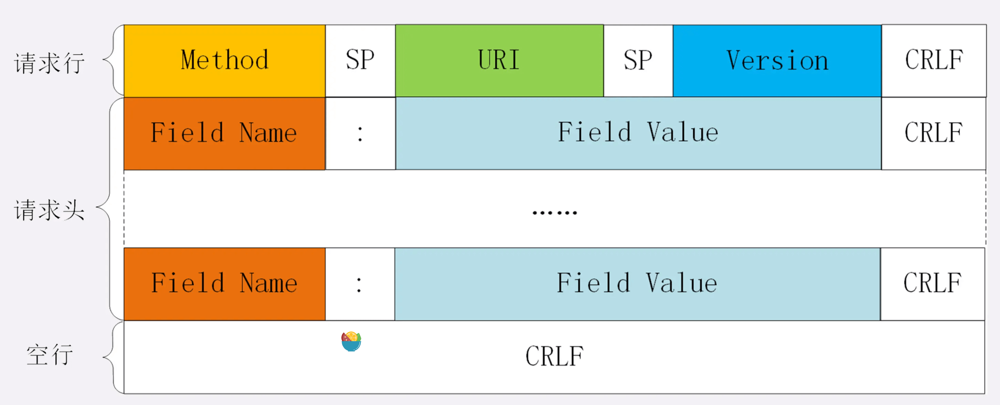

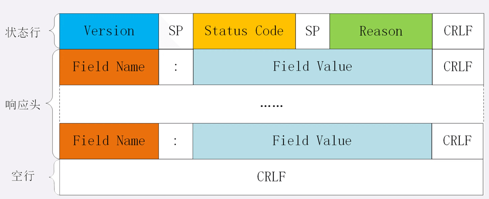

不管是请求头还是响应头，其中的字段是相当多的，而且牵扯到http非常多的特性，这里就不一一列举的，重点看看这些头部字段的格式：

* 字段名不区分大小写
* 字段名不允许出现空格，不可以出现下划线_
* 字段名后面必须紧接着冒号 **:**

## 空行

很重要，用来区分开头部和实体。

如果说在头部中间故意加一个空行，那么空行后的内容全部被视为实体。

## 实体

就是具体的数据了，也就是body部分。请求报文对应请求体, 响应报文对应响应体。


**要点**：
TCP和HTTP都采用分段的方式传输数据，每个段包含头部和数据两部分。对于HTTP而言，其报文结构如下：

#### 起始行

- **请求报文**：起始行包括方法（如GET）、路径（如/home）和HTTP版本（如HTTP/1.1）。
- **响应报文**：起始行称为状态行，包括HTTP版本、状态码（如200）和原因短语（如OK）。

#### 头部

HTTP报文中的头部字段名不区分大小写，字段名不允许出现空格，也不可以出现下划线_。字段名后面必须紧接着冒号 `:`。

#### 空行

空行用来分隔头部和实体，它的存在是必须的，用于告诉服务器头部结束，实体开始。如果在头部中插入一个空行，那么这个空行后面的所有内容都将被视为实体。

#### 实体

实体即HTTP报文中的数据部分，对于请求报文，它通常被称为请求体；对于响应报文，它被称为响应体。


---
### 1625. TCP 传输过程？

**难度**：★★☆☆☆ | **题型**：QA | **分类**：全部 / 计算机网络

**题目**：


**参考答案**：
TCP（传输控制协议）是一种面向连接的、可靠的传输层协议，主要用于确保数据在网络上的可靠传输。TCP 的传输过程包括多个步骤，从建立连接到数据传输，再到连接终止。下面详细介绍这些过程：

### **1. 连接建立（Three-Way Handshake）**

**1.1 客户端发起连接请求**

客户端向服务器发送一个 SYN（同步）报文段，表示请求建立连接。报文段中包含一个初始的序列号（ISN）。

```plaintext
SYN (seq=x)
```

**1.2 服务器确认连接请求**

服务器收到 SYN 报文段后，发送一个 ACK（确认）和 SYN 报文段给客户端，表示接受连接请求，并为连接分配一个序列号。

```plaintext
SYN (seq=y) + ACK (ack=x+1)
```

**1.3 客户端确认服务器的回应**

客户端收到服务器的 SYN+ACK 报文段后，发送一个 ACK 报文段给服务器，表示确认收到服务器的回应。

```plaintext
ACK (ack=y+1)
```

### **2. 数据传输**

**2.1 数据分段**

发送方将数据分成适当大小的段，每个段都有一个序列号，用于数据的重组和确认。

**2.2 数据传输和确认**

- 发送方发送数据段到接收方。
- 接收方对每个数据段发送 ACK 确认报文段，表示已经成功接收数据。
- 发送方根据 ACK 确认报文段来管理重传，确保数据可靠传输。

**2.3 流量控制**

TCP 使用流量控制机制（如滑动窗口）来避免接收方的缓冲区溢出。接收方会通知发送方其缓冲区的可用空间，以控制发送速率。

**2.4 拥塞控制**

TCP 使用拥塞控制机制（如慢启动、拥塞避免、快速重传和快速恢复）来防止网络拥塞，调整数据发送速率。

### **3. 连接终止（Four-Way Handshake）**

**3.1 主动关闭连接的端点发送 FIN 报文段**

主动关闭连接的端点（通常是客户端）发送一个 FIN（结束）报文段，表示不再发送数据。

```plaintext
FIN (seq=u)
```

**3.2 对方端点确认 FIN**

接收方收到 FIN 报文段后，发送一个 ACK 报文段，确认收到 FIN。

```plaintext
ACK (ack=u+1)
```

**3.3 对方端点也发送 FIN 报文段**

接收方（现在是主动关闭连接的端点）发送一个 FIN 报文段，表示也不再发送数据。

```plaintext
FIN (seq=v)
```

**3.4 主动关闭端点确认 FIN**

主动关闭端点收到 FIN 报文段后，发送一个 ACK 报文段，确认收到 FIN。

```plaintext
ACK (ack=v+1)
```

**要点**：
1. **连接建立**：通过三次握手过程建立 TCP 连接。
2. **数据传输**：数据通过分段、确认、流量控制和拥塞控制机制传输。
3. **连接终止**：通过四次挥手过程终止 TCP 连接。

TCP 的这些步骤确保了数据传输的可靠性、完整性和顺序性，使得应用程序能够在不担心数据丢失或顺序错误的情况下进行网络通信。

---
### 1637. HTTP1.0，HTTP1.1，HTTP2.0之间有什么区别？

**难度**：★★★☆☆ | **题型**：QA | **分类**：全部 / 计算机网络

**题目**：


**参考答案**：

## HTTP1.0 和 HTTP1.1 的一些区别

### 缓存处理

在 HTTP1.0 中主要使用 header 里的 `If-Modified-Since`（比较资源最后的更新时间是否一致）,`Expires`（资源的过期时间（取决于客户端本地时间）） 来做为缓存判断的标准。

HTTP1.1 则引入了更多的缓存控制策略：

- `Entity tag`：资源的匹配信息
- `If-Unmodified-Since`：比较资源最后的更新时间是否不一致
- `If-Match`：比较 ETag 是否一致
- `If-None-Match`：比较 ETag 是否不一致

等更多可供选择的缓存头来控制缓存策略。

### 带宽优化

HTTP1.0 中，存在一些浪费带宽的现象，例如客户端只是需要某个对象的一部分，而服务器却将整个对象送过来了，并且不支持断点续传功能。

HTTP 1.1默认支持断点续传。

### Host 头处理

在 HTTP1.0 中认为每台服务器都绑定一个唯一的 IP 地址，因此，请求消息中的 URL 并没有传递主机名（hostname）。但随着虚拟主机技术的发展，在一台物理服务器上可以存在多个虚拟主机，并且它们共享一个 IP 地址。HTTP1.1 的请求消息和响应消息都应支持 Host 头域，且请求消息中如果没有 Host 头域会报告一个错误（400 Bad Request）。

### 长连接

HTTP1.0 需要使用`keep-alive`参数来告知服务器端要建立一个长连接，而 HTTP1.1 默认支持长连接，一定程度上弥补了 HTTP1.0 每次请求都要创建连接的缺点。

HTTP 是基于 TCP/IP 协议的，创建一个 TCP 连接是需要经过三次握手的,有一定的开销，如果每次通讯都要重新建立连接的话，对性能有影响。因此最好能维持一个长连接，可以用个长连接来发多个请求。

HTTP1.1 支持长连接（PersistentConnection）和请求的流水线（Pipelining）处理，在一个 TCP 连接上可以传送多个 HTTP 请求和响应，减少了建立和关闭连接的消耗和延迟。

### 错误通知的管理

在 HTTP1.1 中新增了 24 个错误状态响应码，如 409（Conflict）表示请求的资源与资源的当前状态发生冲突；410（Gone）表示服务器上的某个资源被永久性的删除。

### 新增请求方式

- PUT：请求服务器存储一个资源
- DELETE：请求服务器删除标识的资源
- OPTIONS：请求查询服务器的性能，或者查询与资源相关的选项和需求
- CONNECT：保留请求以供将来使用
- TRACE：请求服务器回送收到的请求信息，主要用于测试或诊断

## HTTP2.0 与 HTTP1.X 的区别

HTTP1.X 版本的缺陷概括来说是：线程阻塞，在同一时间，同一域名的请求有一定的数量限制，超过限制数目的请求会被阻塞。

### 二进制分帧

HTTP1.x 的解析是基于文本。基于文本协议的格式解析存在天然缺陷，文本的表现形式有多样性，要做到健壮性考虑的场景必然很多，二进制则不同，只认 0 和 1 的组合。基于这种考虑 HTTP2.0 的协议解析决定采用二进制格式，实现方便且健壮。

HTTP2.0 在 应用层(HTTP2.0)和传输层(TCP/UDP)之间增加一个二进制分帧层。在不改动 HTTP1.X 的语义、方法、状态码、URI 以及首部字段的情况下, 解决了 HTTP1.1 的性能限制，改进传输性能，实现低延迟和高吞吐量。在二进制分帧层中，HTTP2.0 会将所有传输的信息分割为更小的消息和帧（frame）,并对它们采用二进制格式的编码 ，其中 HTTP1.X 的首部信息会被封装到 HEADER frame，而相应的 Request Body 则封装到 DATA frame 里面。

- 帧：HTTP2.0 数据通信的最小单位消息：指 HTTP2.0 中逻辑上的 HTTP 消息。例如请求和响应等，消息由一个或多个帧组成。

- 流：存在于连接中的一个虚拟通道。流可以承载双向消息，每个流都有一个唯一的整数 ID。

### 多路复用（MultiPlexing）

多路复用允许同时通过单一的 HTTP2.0 连接发起多重的请求-响应消息。即是连接共享，提高了连接的利用率，降低延迟。即每一个 request 都是是用作连接共享机制的。一个 request 对应一个 id，这样一个连接上可以有多个 request，每个连接的 request 可以随机的混杂在一起，接收方可以根据 request 的 id 将 request 再归属到各自不同的服务端请求里面。

在 HTTP1.1 协议中浏览器客户端在同一时间，针对同一域名下的请求有一定数量限制。超过限制数目的请求会被阻塞。这也是为何一些站点会有多个静态资源 CDN 域名的原因之一。

当然 HTTP1.1 也可以多建立几个 TCP 连接，来支持处理更多并发的请求，但是创建 TCP 连接本身也是有开销的。

TCP 连接有一个预热和保护的过程，先检查数据是否传送成功，一旦成功过，则慢慢加大传输速度。因此对应瞬时并发的连接，服务器的响应就会变慢。所以最好能使用一个建立好的连接，并且这个连接可以支持瞬时并发的请求。

HTTP2.0 可以很容易的去实现多流并行而不用依赖建立多个 TCP 连接，同个域名只需要占用一个 TCP 连接，消除了因多个 TCP 连接而带来的延时和内存消耗。HTTP2.0 把 HTTP 协议通信的基本单位缩小为一个一个的帧，这些帧对应着逻辑流中的消息。并行地在同一个 TCP 连接上双向交换消息。

### header 压缩

HTTP1.x 的 header 带有大量信息，而且每次都要重复发送，HTTP2.0 使用 HPACK 算法对 header 的数据进行压缩，减少需要传输的 header 大小，通讯双方各自 cache 一份 header fields 表，差量更新 HTTP 头部，既避免了重复 header 的传输，又减小了需要传输的大小。

header 采取的压缩策略：

- HTTP2.0 在客户端和服务器端使用“首部表”来跟踪和存储之前发送的键－值对，对于相同的数据，不再通过每次请求和响应发送；
- 首部表在 HTTP2.0 的连接存续期内始终存在，由客户端和服务器共同渐进地更新;
- 每个新的首部键－值对要么被追加到当前表的末尾，要么替换表中之前的值。

### 服务端推送（server push）

服务端推送是一种在客户端请求之前发送数据的机制。

服务端可以在发送页面 HTML 时主动推送其它资源，而不用等到浏览器解析到相应位置，发起请求再响应。例如服务端可以主动把 JS 和 CSS 文件推送给客户端，而不需要客户端解析 HTML 时再发送这些请求。

服务器端推送的这些资源其实存在客户端的某处地方，客户端直接从本地加载这些资源就可以了，不用走网络，速度自然是快很多的。


**要点**：
### HTTP1.0与HTTP1.1的区别

1. **缓存处理**：
   - **HTTP1.0**：使用`If-Modified-Since`和`Expires`作为缓存判断标准。
   - **HTTP1.1**：引入了`Entity tag`、`If-Unmodified-Since`、`If-Match`、`If-None-Match`等更多缓存控制策略。
2. **带宽优化**：
   - **HTTP1.0**：存在浪费带宽的现象，不支持断点续传。
   - **HTTP1.1**：默认支持断点续传，提高了带宽利用率。
3. **Host头处理**：
   - **HTTP1.0**：不传递主机名（hostname）。
   - **HTTP1.1**：请求和响应消息都支持Host头域，没有Host头域会报告错误。
4. **长连接**：
   - **HTTP1.0**：需要使用`keep-alive`参数建立长连接。
   - **HTTP1.1**：默认支持长连接，减少了建立和关闭连接的消耗和延迟。
5. **错误通知的管理**：
   - **HTTP1.1**：新增了24个错误状态响应码，如409（Conflict）和410（Gone）。
6. **新增请求方式**：
   - **HTTP1.1**：新增了PUT、DELETE、OPTIONS、CONNECT、TRACE等请求方式。

### HTTP2.0与HTTP1.x的区别

1. **二进制分帧**：
   - **HTTP2.0**：使用二进制格式代替文本格式，提高了协议的健壮性。
2. **多路复用（MultiPlexing）**：
   - **HTTP2.0**：允许在单一连接上并发处理多个请求和响应，提高了连接的利用率。
   - **HTTP1.x**：同一时间对同一域名下的请求数量有限制，超过限制的请求会被阻塞。
3. **header压缩**：
   - **HTTP2.0**：使用HPACK算法对header数据进行压缩，减少了需要传输的header大小。
4. **服务端推送**：
   - **HTTP2.0**：允许服务器在客户端请求之前主动推送数据，如JS和CSS文件。

### 总结

HTTP1.0是最初的HTTP协议版本，它在互联网的发展中发挥了重要作用，但随着时间的推移，它的性能限制变得越来越明显。

HTTP1.1对HTTP1.0进行了许多改进，提高了性能和安全性。然而，随着互联网的进一步发展，HTTP1.1也遇到了一些性能瓶颈，如线程阻塞、连接限制等。

HTTP2.0是在HTTP1.x基础上进行了重大改进的版本，它通过二进制分帧、多路复用、header压缩和服务端推送等机制，大幅提高了传输性能，减少了延迟和提高了吞吐量。这些改进使得HTTP2.0成为目前互联网上最常用的HTTP协议版本之一。


---
### 1642. HTTPS 加密算法和加解密过程是啥？

**难度**：★★★★☆ | **题型**：QA | **分类**：全部 / 计算机网络

**题目**：


**参考答案**：
HTTPS 使用 SSL/TLS 协议来加密传输的数据，确保数据的机密性和完整性。HTTPS 的加解密过程主要包括以下几个步骤和算法：

### **1. 加密算法和密钥类型**

- **对称加密算法**：使用相同的密钥进行加密和解密。常见的对称加密算法包括 AES（Advanced Encryption Standard）和 3DES（Triple Data Encryption Standard）。
- **非对称加密算法**：使用一对密钥（公钥和私钥），公钥用于加密，私钥用于解密。常见的非对称加密算法包括 RSA（Rivest-Shamir-Adleman）和 ECC（Elliptic Curve Cryptography）。
- **哈希算法**：用于生成数据的摘要，以确保数据完整性。常见的哈希算法包括 SHA-256（Secure Hash Algorithm 256-bit）和 MD5（Message Digest Algorithm 5，虽然 MD5 不再安全）。

### **2. SSL/TLS 握手过程**

#### **握手阶段**

1. **客户端发起连接**
   - 客户端发送一个 “ClientHello” 消息，包含客户端支持的 TLS 版本、加密套件（加密算法组合）、压缩方法和其他信息。

2. **服务器响应**
   - 服务器回应一个 “ServerHello” 消息，选择客户端支持的加密套件和 TLS 版本。
   - 服务器发送其数字证书给客户端。数字证书包含服务器的公钥，由证书颁发机构（CA）签名。

3. **证书验证**
   - 客户端验证服务器的数字证书的有效性和真实性。如果证书有效，客户端继续执行。
   - 客户端生成一个随机的“pre-master secret”并用服务器的公钥加密，然后发送给服务器。这个“pre-master secret”将在后续的步骤中用于生成对称加密密钥。

4. **密钥交换**
   - 服务器使用其私钥解密“pre-master secret”并生成一个对称加密密钥（session key）。
   - 客户端和服务器使用“pre-master secret”生成相同的对称加密密钥（session key），用于加密后续的通信数据。

5. **完成握手**
   - 双方用对称加密密钥加密并交换“Finished”消息，表示握手过程完成。
   - 从这一点开始，客户端和服务器使用对称加密密钥加密和解密数据。

### **3. 数据加密和传输**

- **对称加密**：客户端和服务器使用之前生成的对称加密密钥来加密和解密数据。对称加密算法确保数据在传输过程中是机密的。
- **数据完整性**：除了加密，TLS 还使用消息认证码（MAC）来确保数据在传输过程中没有被篡改。常见的 MAC 算法包括 HMAC（Hash-based Message Authentication Code）。

### **4. 连接关闭**

- **优雅关闭**：当通信完成时，客户端和服务器通过发送“close_notify”消息来优雅地关闭连接，确保所有的数据都被正确传输。

### **常见的加密套件**

在 TLS 握手过程中，客户端和服务器会协商一个加密套件（cipher suite），这是一个加密算法的组合。常见的加密套件包括：

- **TLS_AES_128_GCM_SHA256**：使用 AES 进行对称加密，GCM（Galois/Counter Mode）用于加密模式，SHA-256 用于消息认证。
- **TLS_ECDHE_RSA_WITH_AES_256_GCM_SHA384**：使用 ECDHE（Elliptic Curve Diffie-Hellman Ephemeral）进行密钥交换，RSA 进行身份验证，AES-256-GCM 进行对称加密，SHA-384 进行消息认证。

**要点**：
HTTPS 通过结合非对称加密和对称加密来确保通信的安全。非对称加密用于握手过程中的身份验证和密钥交换，而对称加密则用于实际的数据传输。哈希算法用于确保数据的完整性。这个加解密过程确保了数据在客户端和服务器之间的安全传输。

---
### 1687. 什么是DNS劫持？

**难度**：★★★☆☆ | **题型**：QA | **分类**：全部 / 计算机网络

**题目**：


**参考答案**：

DNS 劫持作为最常见的网络攻击方式，是每个站长或者运维团队最为头疼的事情。苦心经营的网站受到 DNS 劫持后，不仅会影响网站流量、权重，还会让用户置身于危险之中，泄露隐私造成财产损失。

就是这样一个简单到不能再简单的攻击方式，在 2009 年制造了轰动全球的“银行劫持案”，导致巴西最大银行 Banco Bradesco 银行近 1% 客户受到攻击而导致账户被盗。黑客利用宽带路由器缺陷对用户 DNS 进行篡改——用户浏览黑客所制作的 Web 页面，其宽带路由器 DNS 就会被黑客篡改，由于该 Web 页面设有巧妙设计的恶意代码，成功躲过安全软件检测，导致大量用户被 DNS 钓鱼诈骗。


网站被黑、被歹意镜像、被植入垃圾代码，现象屡见不鲜，其危害还包括：

*   钓鱼诈骗网上购物,网上支付有可能会被恶意指向别的网站，更加加大了个人账户泄密的风险；
*   网站内出现恶意广告；
*   轻则影响网速，重则不能上网。

但面对DNS劫持时，只能束手就擒吗？

知己知彼，什么是 DNS？
=============

DNS 即 Domain Name System 的缩写，域名系统以分布式数据库的形式将域名和 IP 地址相互映射。简单的说，DNS 是用来解析域名的，在正常环境下，用户的每一个上网请求会通过 DNS 解析指向到与之相匹配的 IP 地址，从而完成一次上网行为。DNS 作为应用层协议，主要是为其他应用层协议工作的，包括不限于 HTTP、SMTP、FTP，用于将用户提供的主机名解析为 IP 地址，具体过程如下：

（1）用户主机（PC 端或手机端）上运行着 DNS 的客户端；

（2）浏览器将接收到的 URL 中抽取出域名字段，即访问的主机名，比如 http://www.aliyun.com/ , 并将这个主机名传送给 DNS 应用的客户端；

（3）DNS 客户机端向 DNS 服务器端发送一份查询报文，报文中包含着要访问的主机名字段（中间包括一些列缓存查询以及分布式 DNS 集群的工作）；

（4）该 DNS 客户机最终会收到一份回答报文，其中包含有该主机名对应的 IP 地址；

（5）一旦该浏览器收到来自 DNS 的 IP 地址，就可以向该 IP 地址定位的 HTTP 服务器发起 TCP 连接。

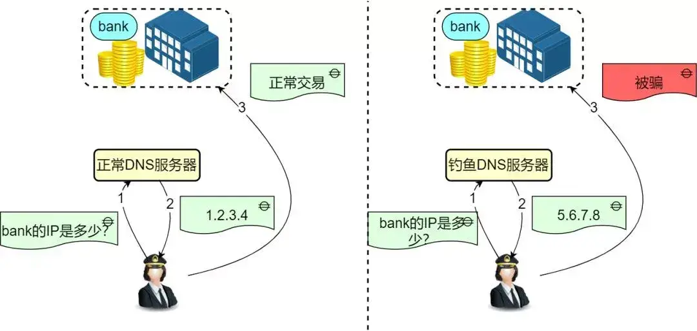（图片源自网络，仅作示意）

可以看到想要获取目标网站 IP，除了在本机中查找行为，还需要第三方服务器(DNS)参与。但只要经过第三方服务，网络就不属于可控制范围，那么就有可能产生 DNS 挟持，比如获取的 IP 并不是实际想要的 IP，从而打开非目标网站。网站在经过本地 DNS 解析时，黑客将本地 DNS 缓存中的目标网站替换成其他网站的 IP 返回，而客户端并不知情，依旧按照正常流程寻址建并立连接。如果一些黑客想要盗取用户账号及密码时，黑客可以做跟目标网站一模一样的木马页面，让用户登录，当用户输入完密码提交的时候就中招了。

常见 DNS 劫持手段又有哪些？
================

**（1）利用 DNS 服务器进行 DDoS 攻击**

正常 DNS 服务器递归询问过程被利用，变成 DDoS 攻击。假设黑客知晓被攻击机器 IP 地址，攻击者使用该地址作为发送解析命令的源地址。当使用 DNS 服务器递归查询后会响应给最初用户。如果黑客控制了足够规模的肉鸡进行上述操作。那么，这个最初用户就会受到来自于 DNS 服务器的响应信息 DDoS 攻击，成为被攻击者。

**（2）DNS 缓存感染**

黑客使用 DNS 请求将数据注入具有漏洞的 DNS 服务器缓存中。这些缓存信息会在客户进行 DNS 访问时返回给用户，把用户对正常域名的访问引导到入侵者所设置挂马、钓鱼等页面上，或通过伪造邮件和其他服务获取用户口令信息，导致客户遭遇进一步侵害。

**（3）DNS 信息劫持**

原则上 TCP/IP 体系通过序列号等多种方式避免仿冒数据插入，但黑客通过监听客户端和 DNS 服务器对话，就可以解析服务器响应给客户端的 DNS 查询 ID。每个 DNS 报文包括一个相关联的 16 位 ID，DNS 服务器根据这个 ID 获取请求源位置。黑客在 DNS 服务器之前将虚假响应交给用户，欺骗客户端去访问恶意网站。假设当提交给某个域名服务器域名解析请求的数据包被截获，然后按黑客的意图将虚假 IP 地址作为应答信息返回给请求者。这时，原始请求者就会把这个虚假 IP 地址作为它所要请求的域名而进行连接，显然它被引导到了别处而根本连接不上自己想要连接的那个域名。

**（4）ARP 欺骗**

通过伪造 IP 地址和 MAC 地址实现 ARP 欺骗，在网络中产生大量 ARP 通信量使网络阻塞，黑客只要持续不断发出伪造的 ARP 响应包就能更改目标主机 ARP 缓存中的 IP-MAC 条目，造成网络中断或中间人攻击。ARP 攻击主要是存在于局域网网络中，局域网中若有一台计算机感染 ARP 木马，则感染该 ARP 木马的系统将会试图通过"ARP 欺骗”手段截获所在网络内其它计算机的通信信息，并因此造成网内其它计算机的通信故障。ARP 欺骗通常是在用户局网中，造成用户访问域名的错误指向，但在 IDC 机房被入侵后，则也可能出现攻击者采用 ARP 包压制正常主机、或者压制 DNS 服务器，以使访问导向错误指向。

DNS 劫持对业务造成哪些影响？
================

一旦被劫持，相关用户查询就没办法获取到正确 IP 解析，这就很容易造成：

（1）很多用户习惯依赖书签或者易记域名进入，一旦被劫持会使这类用户无法打开网站，更换域名又没办法及时告知变更情况，导致用户大量流失。

（2）用户流量主要是通过搜索引擎 SEO 进入，DNS 被劫持后会导致搜索引擎蜘蛛抓取不到正确 IP，网站就可能会被百度 ban 掉。

（3）一些域名使用在手机应用 APP 调度上，这些域名不需要可以给客户访问，但这些域名的解析关系到应用 APP 访问，如果解析出现劫持就会导致应用 APP 无法访问。这时候更换域名就可能会导致 APP 的下架，重新上架需要审核并且不一定可以重新上架。这就会导致应用 APP 会有用户无法访问或者下载的空窗期。

可以看到，DNS 劫持对业务有着巨大影响，不仅仅是用户体验的损失，更是对用户资产安全、数据安全的造成潜在的巨大风险。

**要点**：
DNS劫持是一种常见的网络攻击手段，通过篡改DNS记录，将用户访问的域名指向错误的IP地址，从而达到钓鱼、植入恶意代码等目的。这种攻击方式不仅影响网站流量和权重，还可能导致用户隐私泄露和财产损失。

DNS劫持的手段包括利用DNS服务器进行DDoS攻击、DNS缓存感染、DNS信息劫持和ARP欺骗等。一旦网站遭到DNS劫持，可能会导致用户无法访问网站、搜索引擎抓取失败、手机应用无法正常运行等问题，对业务造成严重影响。

为了防范DNS劫持，可以采取以下措施：

1. 使用DNSSEC（域名系统安全扩展）技术，通过数字签名验证DNS响应的真实性。
2. 定期检查DNS记录，确保没有异常记录指向错误的IP地址。
3. 加强网络安全防护，防止DNS服务器被入侵。
4. 及时更新系统和软件，修补可能存在的漏洞。
5. 增强用户安全意识，教育用户识别钓鱼网站和恶意链接。


---
### 1688. https是如何保证安全的，又是如何保证不被中间人攻击的？

**难度**：★★★☆☆ | **题型**：QA | **分类**：全部 / 计算机网络

**题目**：


**参考答案**：
HTTPS 是一种基于 TLS/SSL 协议的安全传输协议，它可以通过加密和认证等措施来保护数据传输过程中的安全性和隐私性。其主要保证方式如下：

1. 加密传输：使用公钥加密技术对数据进行加密，并使用私钥进行解密，以保证在传输过程中数据不会被窃取、篡改或伪造。

2. 身份认证：使用数字证书对服务器和客户端身份进行认证，防止恶意攻击者伪装成合法用户或服务器进行攻击。

3. 完整性校验：使用消息摘要算法对传输数据进行校验，确保数据的完整性和准确性，防止数据在传输过程中被篡改或损坏。

4. 防止重放攻击：使用时间戳和随机数等技术对请求和响应进行标记，以防止恶意攻击者利用重放攻击进行攻击。

至于如何防止中间人攻击，HTTPS 主要采用以下几种方式：

1. 数字证书验证：在握手阶段，客户端会向服务器请求数字证书，然后对证书进行验证，以确认服务器身份的真实性和合法性。如果证书验证失败，则会拒绝连接，从而避免了中间人攻击的风险。

2. 主机名验证：客户端在验证数字证书时，会对证书中包含的域名信息进行匹配验证，以确保请求的是正确的服务器地址和域名。如果主机名验证失败，则同样会拒绝连接。

3. 对称加密：使用对称密钥加密算法可以提高传输效率，但需要注意在传输过程中保护密钥的安全性，以避免被中间人获取密钥并进行攻击。

4. 证书固定：一些应用程序可以将服务器证书的指纹或公钥等信息内置到客户端中，从而避免了恶意攻击者替换证书或伪造数字证书的风险。

HTTPS 可以通过加密和认证等措施来保证数据传输过程的安全性和隐私性，并防止中间人攻击等风险。但需要注意，在实际应用中，需要选择合适的加密算法、证书颁发机构和证书验证方式，并进行有效的密钥保护和网络安全管控，以保证 HTTPS 的可靠性和稳定性。

**要点**：
**答题要点：**

HTTPS是一种安全的传输协议，通过TLS/SSL保护数据传输的安全性和隐私性。它主要通过以下方式实现：

1. **加密传输**：使用公钥加密和私钥解密技术保护数据。
2. **身份认证**：通过数字证书验证服务器和客户端的身份，防止伪装攻击。
3. **完整性校验**：利用消息摘要算法确保数据的完整性和准确性。
4. **防止重放攻击**：通过时间戳和随机数等技术防止重放攻击。
为防止中间人攻击，HTTPS采用以下措施：
1. **数字证书验证**：客户端在握手阶段验证服务器证书的真实性和合法性。
2. **主机名验证**：客户端验证证书中的域名信息，确保连接到正确的服务器。
3. **对称加密**：提高传输效率，同时需保护密钥安全。
4. **证书固定**：将服务器证书信息内置到客户端，防止证书被替换或伪造。

为确保HTTPS的安全性，需选择合适的加密算法、证书颁发机构，并正确实施证书验证和密钥保护措施。


---
### 1692. nginx是什么？

**难度**：★★☆☆☆ | **题型**：QA | **分类**：全部 / 计算机网络

**题目**：


**参考答案**：
## Nginx的产生

没有听过Nginx？那么一定听过它的"同行"Apache吧！Nginx同Apache一样都是一种WEB服务器，基于REST架构风格，以统一资源描述符(Uniform Resources Identifier)URI或者统一资源定位符(Uniform Resources Locator)URL作为沟通依据，通过HTTP协议提供各种网络服务。

然而，这些服务器在设计之初受到当时环境的局限，例如当时的用户规模，网络带宽，产品特点等局限并且各自的定位和发展都不尽相同。这也使得各个WEB服务器有着各自鲜明的特点。

Apache的发展时期很长，而且是毫无争议的世界第一大服务器。它有着很多优点：稳定、开源、跨平台等等。它出现的时间太长了，它兴起的年代，互联网产业远远比不上现在。所以它被设计为一个重量级的。它是不支持高并发的服务器。在Apache上运行数以万计的并发访问，会导致服务器消耗大量内存。操作系统对其进行进程或线程间的切换也消耗了大量的CPU资源，导致HTTP请求的平均响应速度降低。

这些都决定了Apache不可能成为高性能WEB服务器，轻量级高并发服务器Nginx就应运而生了。

俄罗斯的工程师Igor Sysoev，他在为Rambler Media工作期间，使用C语言开发了Nginx。Nginx作为WEB服务器一直为Rambler Media提供出色而又稳定的服务。然后呢，Igor Sysoev将Nginx代码开源，并且赋予自由软件许可证。

## Nginx的用途

Nginx是一款自由的、开源的、高性能的HTTP服务器和反向代理服务器；同时也是一个IMAP、POP3、SMTP代理服务器；Nginx可以作为一个HTTP服务器进行网站的发布处理，另外Nginx可以作为反向代理进行负载均衡的实现。


**要点**：
**Nginx概述及其产生背景**：Nginx是一种基于REST架构风格的WEB服务器，与Apache类似，通过HTTP协议提供服务。由于早期设计时受到环境限制，各个WEB服务器发展出不同的特点。Apache服务器虽然稳定、开源且跨平台，但由于其设计为重量级，不支持高并发，导致在处理大量并发访问时性能下降。

为解决这一问题，Nginx应运而生。由俄罗斯工程师Igor Sysoev开发，Nginx是一款轻量级、高并发的WEB服务器，最初用于Rambler Media，后开源并采用自由软件许可证。

**Nginx的用途：**
Nginx是一款自由、开源的高性能HTTP服务器和反向代理服务器，同时支持IMAP、POP3、SMTP代理服务。它可用于网站发布处理，也能作为反向代理实现负载均衡。


---
### 1697. 说说流式输出的原理及其应用场景

**难度**：★★★☆☆ | **题型**：QA | **分类**：全部 / 计算机网络

**题目**：


**参考答案**：
流式输出并不是一种新的计算模型，而是一种**结果传递与消费方式的改变**：从“一次性生成、一次性返回”，变为“边生成、边传输、边消费”。理解它的关键，不在于某个具体 API，而在于**数据生产方、传输层和消费方三者如何协同工作**。

---

## 一、流式输出的基本原理

### 1. 传统非流式模式

在非流式模式下，系统的执行流程是严格串行的：

* 服务端完整计算结果
* 将结果一次性写入响应
* 客户端在接收完全部数据后再进行处理或渲染

这种模式的特点是实现简单，但**首字节时间（TTFB）和用户感知延迟较高**，尤其当计算过程本身很慢时，用户在很长一段时间内得不到任何反馈。

---

### 2. 流式输出模式

流式输出的核心变化在于：**结果不再作为一个整体返回，而是被拆分为多个连续的数据块**。

典型流程是：

* 服务端在计算过程中，阶段性地产生部分结果
* 每当有新数据可用，就立刻写入响应流并 flush
* 客户端持续读取数据流，并逐步消费、渲染或处理

在传输层，这通常依赖于**长连接 + 分块传输**，例如 HTTP chunked encoding、Server-Sent Events 或 WebSocket。

---

### 3. 从系统视角看流式输出

从系统设计角度，流式输出具备以下特征：

* 数据是**按时间顺序增量产生的**
* 消费方不需要等待生产方完全结束
* 生产与消费之间形成一种弱同步关系

这使得系统整体从“请求-响应”模型，转变为一种更接近“发布-订阅”的交互方式。

---

## 二、前端视角下的实现机制

在前端，流式输出通常体现在**如何读取并渲染增量数据**。

以 HTTP 流为例：

* 浏览器通过 Fetch API 获取一个 ReadableStream
* 通过 `getReader()` 持续读取字节块
* 将字节解码为文本或结构化数据
* 逐步更新 UI，而不是等全部完成

这种方式要求前端具备更细粒度的状态管理能力，例如处理中间态、取消、错误恢复等问题。

---

## 三、典型应用场景

### 1. 大模型推理与对话系统

这是当前最典型的应用场景之一。
模型在生成文本时是逐 token 产生的，流式输出可以让用户几乎立即看到内容开始出现，显著降低等待焦虑，同时也便于中途打断和重试。

---

### 2. 长耗时计算或任务执行

例如代码分析、日志扫描、批量数据处理。
通过流式返回阶段性结果或进度信息，客户端可以实时展示执行状态，而不是在“无响应”和“完成”之间跳变。

---

### 3. 实时数据推送

包括监控面板、事件流、消息通知等。
流式输出可以减少轮询开销，保持低延迟和持续更新。

---

### 4. 大文件与媒体传输

视频、音频、超大文本文件在本质上都是流式消费的。
客户端可以边下载边播放或解析，而不是等待完整文件落地。

---

## 四、使用流式输出需要权衡的问题

### 1. 复杂度上升

流式模式要求前后端都具备更复杂的状态管理能力，包括：

* 半成品数据的处理
* 中断、重连和回滚
* 错误在流中途出现时的兜底逻辑

---

### 2. 一致性与可重复性

由于结果是增量返回的：

* 客户端可能处于中间态
* 日志与问题复现难度更高
  因此在工程上通常需要额外的 tracing 或序列号机制。

---

### 3. 并非所有场景都适合

对于结果很小、计算很快的接口，流式输出反而增加实现和维护成本，收益并不明显。

**要点**：
流式输出的本质是将结果按时间拆分为连续数据流，实现边生成、边传输、边消费；它通过降低首字节时间和提升反馈及时性来改善用户体验；常见于大模型推理、长耗时任务、实时数据和媒体传输等场景；但同时也带来更高的工程复杂度，需要在体验收益与系统成本之间进行权衡。

---
### 1723. Cache-Control 有哪些常见配置值？

**难度**：★★☆☆☆ | **题型**：QA | **分类**：全部 / 计算机网络

**题目**：


**参考答案**：
Cache-Control的值有十几种，其中包含了请求首部可携带的和响应首部携带的。

咱们先看看 **request首部** Cache-Control的值

* no-cache

当客户端请求时携带这个首部字段的时候，通过中间的缓存服务器时，会不去拿缓存资源，而是让中间服务器转发给资源服务器，资源服务器看看一下这个资源过期没有，如果没有就会告知中间服务器，可以使用缓存资源。否则资源服务器就会直接返回新的资源。

* no-store

这个字段非常有意思，就是告知服务器或者客户端以及中间服务器，我请求或者响应的内容里面有机密信息，这些响应的内容是永远不会得到响应的。

* max-age

`max-age`指令标示了客户端不愿意接收一个`age`大于设定时间的响应，这个字段表达是最大缓存时长，请求中单单添加这个字段，实现不了缓存时长，必须结合响应的max-age。一会，会在响应中的max-age 详细说明

* max-stale 

这个指令表达的是缓存时长过期以后，还可以有效。比如现在max-age：60秒，那么max-stale：60秒，现在的缓存时长就是120秒，

* min-fresh

设定能够容忍的最小**新鲜度（缓存时长）**。`min-fresh`标示了客户端不愿意接受**新鲜度**不多于当前的`age`加上`min-fresh`设定的时间之和的响应。  

* no-transfrom

使用 no-transform 指令规定无论是在请求还是响应中，缓存都不能改 变实体主体的媒体类型。

* only-if-cache

使用 only-if-cached 指令表示客户端仅在缓存服务器本地缓存目标资源的情况下，才会要求其返回。换言之，该指令要求缓存服务器不重新加载响应，也不会再次确认资源有效性。若发生请求缓存服务器的本 地缓存无响应，则返回状态码 504 Gateway Timeout。

* cache-extension

通过 cache-extension 标记（token），可以扩展 Cache-Control 首部字 段内的指令。

  
咱们再看看 **response首部** Cache-Control的值  

* pulic

这个字段和private是相对的，Cache-Control: public时，则表明所有的用户在通过缓存服务器的时候，都可以缓存这个资源。

* private

这个字段和pulic是相对的，Cache-Control: private时，则表明只有某个在通过缓存服务器的时候，得到缓存资源  

* no-cache

如果服务器返回的响应中包含 no-cache 指令，那么缓存服务器不能对 资源进行缓存。源服务器以后也将不再对缓存服务器请求中提出的资 源有效性进行确认，且禁止其对响应资源进行缓存操作。

* no-store  

同请求首部的no-store指令一样  

* no-transfrom

同请求首部的no-transfrom指令一样

* max-age

在Response中设置max-age的时间信息，可以在客户端生成缓存文件，在缓存不过期的情况下，客户端不会直接向服务器请求数据，在缓存过期的情况下，客户端会向服务器直接请求生成新的缓存。  

如果同时设置了Response和Request中的max-age 缓存时间，如果Request中的max-age时间小于Response中的max-age时间，客户端会根据Request中max-age时间周期去直接进行网络请求，如果碰到断网或者网络请求不通的情况，即使缓存还在有效期内（Response中设置的max-age时间足够大），在Request设置的max-age过期之后，APP也会直接去进行网络请求。 因此可以考虑在客户端的设计中一个和好的网络缓存场景，用Response的max-age控制缓存的时间，用Request中max-age控制刷新的时间和机制  

**应用 HTTP/1.1 版本的缓存服务器遇到同时存在 Expires 首部字段的情 况时，会优先处理 max-age 指令，而忽略掉 Expires 首部字段。而 HTTP/1.0 版本的缓存服务器的情况却相反，max-age 指令会被忽略**

* s-max-age

和max-age类似，它们的不同点是 s- maxage 指令只适用于供多位用户使用的公共缓存服务器 

* must-revalidate

使用 must-revalidate 指令，代理会向源服务器再次验证即将返回的响 应缓存目前是否仍然有效。

若代理无法连通源服务器再次获取有效资源的话，缓存必须给客户端 一条 504（Gateway Timeout）状态码。

另外，使用 must-revalidate 指令会忽略请求的 max-stale 指令（即使已 经在首部使用了 max-stale，也不会再有效果）。

* proxy-revalidate

proxy-revalidate 指令要求所有的缓存服务器在接收到客户端带有该指 令的请求返回响应之前，必须再次验证缓存的有效性。

* cache-extension

同请求首部的cache-extension指令一样

> 本答案由“前端面试题宝典”收集整理，PC端访问请前往： https://fe.ecool.fun/ 

**要点**：
Cache-Control头部字段用于控制缓存的行为，包括请求首部和响应首部。

**请求首部（Request Headers）**:

- `no-cache`：请求时携带，要求缓存服务器不使用缓存，而是转发请求到源服务器。
- `no-store`：请求或响应中包含敏感信息，不缓存任何内容。
- `max-age`：指定缓存资源的最大年龄。
- `max-stale`：指定缓存资源过期的最大年龄。
- `min-fresh`：指定缓存资源的最小新鲜度。
- `no-transform`：指定缓存不能更改资源的内容类型。
- `only-if-cached`：要求缓存服务器只返回本地缓存资源。
- `cache-extension`：允许扩展Cache-Control指令。

**响应首部（Response Headers）**:

- `public`：响应可以被任何缓存服务器缓存。
- `private`：响应只能被单个用户缓存。
- `no-cache`：响应不能被缓存服务器缓存。
- `no-store`：同请求首部。
- `no-transform`：同请求首部。
- `max-age`：指定缓存资源的最大年龄。
- `s-maxage`：指定共享缓存的最大年龄。
- `must-revalidate`：要求缓存服务器在返回响应前必须重新验证缓存的有效性。
- `proxy-revalidate`：要求缓存服务器在返回响应前必须重新验证缓存的有效性。
- `cache-extension`：同请求首部。

Cache-Control头部字段与Expires头部字段（仅HTTP/1.0版本）相比，在HTTP/1.1版本中，缓存服务器优先处理max-age指令。


---
### 1728. 什么是对象存储OSS？

**难度**：★★☆☆☆ | **题型**：QA | **分类**：全部 / 计算机网络

**题目**：


**参考答案**：
对象存储OSS（Object Storage Service）是一种海量、安全、低成本、高持久的云存储服务。

OSS具有与平台无关的RESTful API接口，您可以在任何应用、任何时间、任何地点存储和访问任意类型的数据。

## OSS相关概念

* 存储类型（Storage Class）
OSS提供标准、低频访问、归档、冷归档四种存储类型，全面覆盖从热到冷的各种数据存储场景。其中标准存储类型提供高持久、高可用、高性能的对象存储服务，能够支持频繁的数据访问；低频访问存储类型适合长期保存不经常访问的数据（平均每月访问频率1到2次），存储单价低于标准类型；归档存储类型适合需要长期保存（建议半年以上）的归档数据；冷归档存储适合需要超长时间存放的极冷数据。更多信息，请参见存储类型介绍。

* 存储空间（Bucket）
存储空间是您用于存储对象（Object）的容器，所有的对象都必须隶属于某个存储空间。存储空间具有各种配置属性，包括地域、访问权限、存储类型等。您可以根据实际需求，创建不同类型的存储空间来存储不同的数据。

* 对象（Object）
对象是OSS存储数据的基本单元，也被称为OSS的文件。对象由元信息（Object Meta）、用户数据（Data）和文件名（Key）组成。对象由存储空间内部唯一的Key来标识。对象元信息是一组键值对，表示了对象的一些属性，例如最后修改时间、大小等信息，同时可以在元信息中存储一些自定义的信息。

* 地域（Region）
地域表示OSS的数据中心所在物理位置。您可以根据费用、请求来源等选择合适的地域创建Bucket。更多信息，请参见OSS已开通的地域。

* 访问域名（Endpoint）
Endpoint表示OSS对外服务的访问域名。OSS以HTTP RESTful API的形式对外提供服务，当访问不同地域的时候，需要不同的域名。通过内网和外网访问同一个地域所需要的域名也是不同的。

* 访问密钥（AccessKey）
AccessKey简称AK，指的是访问身份验证中用到的AccessKey ID和AccessKey Secret。OSS通过使用AccessKey ID和AccessKey Secret对称加密的方法来验证某个请求的发送者身份。AccessKey ID用于标识用户；AccessKey Secret是用户用于加密签名字符串和OSS用来验证签名字符串的密钥，必须保密。

**要点**：
对象存储OSS（Object Storage Service）是一种云存储服务，提供海量、安全、低成本、高持久的存储解决方案。它具有与平台无关的RESTful API接口，允许在任何应用、任何时间、任何地点存储和访问任意类型的数据。

OSS的关键概念包括：

1. **存储类型**：OSS提供四种存储类型：标准、低频访问、归档、冷归档，以适应不同的数据访问频率和成本要求。
2. **存储空间（Bucket）**：Bucket是存储对象（Object）的容器，具有地域、访问权限、存储类型等配置属性。
3. **对象（Object）**：对象是OSS存储数据的基本单元，由元信息、用户数据和文件名组成，通过唯一的Key标识。
4. **地域（Region）**：地域代表OSS的数据中心位置，用户可以根据费用和请求来源选择合适的地域创建Bucket。
5. **访问域名（Endpoint）**：Endpoint是OSS对外服务的访问域名，根据地域和访问方式的不同，Endpoint也会有所变化。
6. **访问密钥（AccessKey）**：AccessKey包括AccessKey ID和AccessKey Secret，用于身份验证。AccessKey ID用于标识用户，而AccessKey Secret用于加密签名字符串和验证签名字符串。


---
### 1734. GET和POST的请求的区别

**难度**：★★★☆☆ | **题型**：QA | **分类**：全部 / 计算机网络

**题目**：


**参考答案**：
<p style="text-align:start;text-indent:2em;">GET和POST是HTTP协议中两种常见的请求方法，它们在用途、数据传输方式、安全性、数据限制等方面存在显著差异。以下是GET和POST请求的主要区别：</p><h3 style="text-align:start;text-indent:2em;">1. 用途</h3><ul><li><strong>GET请求</strong>：主要用于从服务器获取资源，通常用于查询数据，而不应该用于对服务器产生影响。它适用于请求服务器发送资源或数据，例如获取网页内容、图片等。</li><li><strong>POST请求</strong>：通常用于向服务器提交数据，对服务器状态产生影响，比如提交表单、上传文件等。POST请求旨在向指定的资源提交要被处理的数据。</li></ul><h3 style="text-align:start;text-indent:2em;">2. 数据传输方式</h3><ul><li><strong>GET请求</strong>：将参数附加在URL的末尾（Query String），以键值对的形式出现，可在浏览器地址栏直接看到。由于数据在URL中，因此GET请求的数据传输是可见的。</li><li><strong>POST请求</strong>：将参数放在请求体中传输，对用户来说是不可见的。这使得POST请求能够传输大量数据，并且不会受到URL长度的限制。</li></ul><h3 style="text-align:start;text-indent:2em;">3. 安全性</h3><ul><li><strong>GET请求</strong>：由于数据会暴露在URL上，因此相对不太安全，适合传输一些不敏感的数据。</li><li><strong>POST请求</strong>：数据不会暴露在URL上，相对比较安全，适合传输敏感数据。然而，需要注意的是，即使使用POST请求，如果未采取其他安全措施（如HTTPS加密通信），数据仍然可能在传输过程中被截获。</li></ul><h3 style="text-align:start;text-indent:2em;">4. 数据限制</h3><ul><li><strong>GET请求</strong>：由于URL长度的限制，GET请求的数据长度也有限制。不同的浏览器和服务器限制不同，但一般限制在2KB到8KB之间，更加常见的是1KB以内。</li><li><strong>POST请求</strong>：对数据长度没有特定限制，因此适合传输大量数据。理论上，POST请求可以发送的数据量远大于GET请求。</li></ul><h3 style="text-align:start;text-indent:2em;">5. 缓存和历史记录</h3><ul><li><strong>GET请求</strong>：可以被缓存，并且会被保存在浏览器历史记录当中，因此GET请求可以被收藏为书签。</li><li><strong>POST请求</strong>：通常不会被缓存，也不会被保存在浏览器历史记录中。</li></ul><h3 style="text-align:start;text-indent:2em;">6. 幂等性</h3><ul><li><strong>GET请求</strong>：被认为是幂等的，即对同一URL的多个请求应该返回同样的结果（前提是资源没有发生变化）。</li><li><strong>POST请求</strong>：通常不是幂等的，因为每次POST请求都可能在服务器上产生新的资源或修改现有资源。</li></ul><h3 style="text-align:start;text-indent:2em;">7. 使用场景</h3><ul><li><strong>GET请求</strong>：更适用于获取资源和查询数据，例如搜索查询、读取数据等。</li><li><strong>POST请求</strong>：更适用于提交数据和对服务器产生影响的操作，例如表单提交、文件上传、更新资源等。</li></ul><p style="text-align:start;text-indent:2em;"></p>

**要点**：
<p style="text-align:start;text-indent:2em;">GET和POST请求的区别：</p><p></p><h3 style="text-align:start;text-indent:2em;">GET</h3><ul><li>用于请求数据（如读取网页）</li><li>数据附加在URL中，可见</li><li>有URL长度限制</li><li>可缓存，可保留在历史记录中</li><li>通常被认为是幂等的（多次请求相同结果）</li></ul><h3 style="text-align:start;text-indent:2em;">POST</h3><ul><li>用于提交数据（如表单提交）</li><li>数据放在请求体中，不可见</li><li>数据量限制较少</li><li>不可缓存，不保存在历史记录中</li><li>通常不是幂等的（每次请求可能产生新结果）</li></ul>

---
### 1739. 即时通讯的实现：短轮询、长轮询、SSE 和 WebSocket 间的区别？

**难度**：★★★☆☆ | **题型**：QA | **分类**：全部 / 计算机网络

**题目**：


**参考答案**：
<p style="text-align:left;text-indent:2em;">短轮询和长轮询的目的都是用于实现客户端和服务器端的一个即时通讯。</p><p></p><p style="text-align:left;text-indent:2em;"><strong>短轮询的基本思路是</strong> 浏览器每隔一段时间向浏览器发送 http 请求，服务器端在收到请求后，不论是否有数据更新，都直接进行响应。这种方式实现的即时通信，本质上还是浏览器发送请求，服务器接受请求的一个过程，通过让客户端不断的进行请求，使得客户端能够模拟实时地收到服务器端的数据的变化。这种方式的优点是比较简单，易于理解。缺点是这种方式由于需要不断的建立 http 连接，严重浪费了服务器端和客户端的资源。当用户增加时，服务器端的压力就会变大，这是很不合理的。</p><p></p><p style="text-align:left;text-indent:2em;"><strong>长轮询的基本思路是</strong> 首先由客户端向服务器发起请求，当服务器收到客户端发来的请求后，服务器端不会直接进行响应，而是先将这个请求挂起，然后判断服务器端数据是否有更新。如果有更新，则进行响应，如果一直没有数据，则到达一定的时间限制才返回。客户端 JavaScript 响应处理函数会在处理完服务器返回的信息后，再次发出请求，重新建立连接。长轮询和短轮询比起来，它的优点是明显减少了很多不必要的 http 请求次数，相比之下节约了资源。长轮询的缺点在于，连接挂起也会导致资源的浪费。</p><p></p><p style="text-align:left;text-indent:2em;"><strong>SSE 的基本思想是</strong> 服务器使用流信息向服务器推送信息。严格地说，http 协议无法做到服务器主动推送信息。但是，有一种变通方法，就是服务器向客户端声明，接下来要发送的是流信息。也就是说，发送的不是一次性的数据包，而是一个数据流，会连续不断地发送过来。这时，客户端不会关闭连接，会一直等着服务器发过来的新的数据流，视频播放就是这样的例子。SSE 就是利用这种机制，使用流信息向浏览器推送信息。它基于 http 协议，目前除了 IE/Edge，其他浏览器都支持。它相对于前面两种方式来说，不需要建立过多的 http 请求，相比之下节约了资源。</p><p></p><p style="text-align:left;text-indent:2em;"><strong>WebSocket</strong> 是 HTML5 定义的一个新协议议，与传统的 http 协议不同，该协议允许由服务器主动的向客户端推送信息。使用 WebSocket 协议的缺点是在服务器端的配置比较复杂。WebSocket 是一个全双工的协议，也就是通信双方是平等的，可以相互发送消息，而 SSE 的方式是单向通信的，只能由服务器端向客户端推送信息，如果客户端需要发送信息就是属于下一个 http 请求了。</p><p></p><p style="text-align:left;text-indent:2em;"><strong>上面的四个通信协议，前三个都是基于HTTP协议的。</strong> 对于这四种即使通信协议，从性能的角度来看： <strong>WebSocket &gt; 长连接（SEE） &gt; 长轮询 &gt; 短轮询</strong> 但是，我们如果考虑浏览器的兼容性问题，顺序就恰恰相反了： <strong>短轮询 &gt; 长轮询 &gt; 长连接（SEE） &gt; WebSocket</strong> 所以，还是要根据具体的使用场景来判断使用哪种方式。</p>

**要点**：
<p style="text-align:left;text-indent:2em;">短轮询和长轮询是客户端和服务器端进行即时通讯的两种方式，而SSE（Server-Sent Events）和WebSocket是HTML5引入的协议，用于实现服务器主动推送信息。</p><p style="text-align:left;text-indent:2em;"><strong>短轮询</strong>：</p><ul><li><strong>基本思路</strong>：客户端定期向服务器发送HTTP请求，服务器无论是否有数据更新都直接响应。</li><li><strong>优点</strong>：简单易理解。</li><li><strong>缺点</strong>：频繁的HTTP请求浪费资源，服务器压力大。</li></ul><p style="text-align:left;text-indent:2em;"><strong>长轮询</strong>：</p><ul><li><strong>基本思路</strong>：客户端发起请求后，服务器先挂起请求，判断数据是否有更新。如果有更新则响应，否则在一定时间后返回。</li><li><strong>优点</strong>：减少不必要的HTTP请求次数。</li><li><strong>缺点</strong>：连接挂起也浪费资源。</li></ul><p style="text-align:left;text-indent:2em;"><strong>SSE（Server-Sent Events）</strong>：</p><ul><li><strong>基本思想</strong>：服务器使用流信息向客户端推送信息，基于HTTP协议，客户端不会关闭连接，持续等待服务器推送的新数据。</li><li><strong>优点</strong>：不需要建立过多HTTP请求。</li><li><strong>缺点</strong>：浏览器兼容性有限，目前IE/Edge不支持。</li></ul><p style="text-align:left;text-indent:2em;"><strong>WebSocket</strong>：</p><ul><li><strong>基本思想</strong>：服务器可以主动向客户端推送信息，全双工通信，通信双方可以相互发送消息。</li><li><strong>优点</strong>：高性能，资源利用率高。</li><li><strong>缺点</strong>：服务器端配置复杂。</li></ul><p style="text-align:left;text-indent:2em;">性能上，WebSocket &gt; SSE &gt; 长轮询 &gt; 短轮询。但考虑到浏览器兼容性，顺序可能相反。选择哪种通信方式取决于具体的使用场景和需求。</p>

---
### 1745. WebSocket 中的心跳是为了解决什么问题？

**难度**：★★★☆☆ | **题型**：QA | **分类**：全部 / JavaScript / 计算机网络

**题目**：


**参考答案**：
* 为了定时发送消息，使连接不超时自动断线，避免后端设了超时时间自动断线。所以需要定时发送消息给后端，让后端服务器知道连接还在通消息不能断。

* 为了检测在正常连接的状态下，后端是否正常。如果我们发了一个定时检测给后端，后端按照约定要下发一个检测消息给前端，这样才是正常的。如果后端没有正常下发，就要根据设定的超时进行重连。


---
### 1760. 常见的HTTP请求方法

**难度**：★☆☆☆☆ | **题型**：QA | **分类**：全部 / 计算机网络

**题目**：
<p></p>

**参考答案**：
<p style="text-align:start;text-indent:2em;">HTTP（HyperText Transfer Protocol，超文本传输协议）是一种用于分布式、协作式和超媒体信息系统的应用层协议。HTTP请求方法（也称为“动作”或“操作”）定义了客户端希望对服务器上的资源进行的操作类型。HTTP/1.0 定义了三种请求方法：GET、POST 和 HEAD。随着HTTP/1.1 的引入，又增加了几种请求方法，以支持更丰富的客户端-服务器交互。下面是一些常见的HTTP请求方法：</p><ol><li><strong>GET</strong>：请求指定的页面信息，并返回实体主体。这是最常用的请求方法，通常用于请求服务器发送资源（如HTML页面）。GET请求的数据会附加在URL之后（即“查询字符串”），以<code>?</code>分隔URL和传输数据，多个参数用<code>&amp;</code>连接。</li><li><strong>POST</strong>：向指定资源提交数据进行处理请求（例如提交表单或者上传文件）。POST请求的数据被包含在请求体中。POST请求相比GET请求，更适合发送大量数据。</li><li><strong>PUT</strong>：向指定资源位置上传其最新内容（即更新资源）。PUT请求通常用于上传或更新服务器上的资源。</li><li><strong>DELETE</strong>：请求服务器删除指定的页面。DELETE请求通常用于删除服务器上的资源。</li><li><strong>HEAD</strong>：类似于GET请求，只不过返回的响应中没有具体的内容，用于获取报头。HEAD请求常用于检查资源的最新状态或是否存在，而不传输实际内容。</li><li><strong>OPTIONS</strong>：允许客户端查看服务器的性能。它描述了服务器支持的通信选项。例如，它可以被用来确定服务器支持哪些HTTP方法或者是否支持某些特定类型的“内容协商”。</li><li><strong>CONNECT</strong>：HTTP/1.1协议中预留给能够将连接改为管道方式的代理服务器。通常用于SSL加密服务器的连接（经由非加密的HTTP代理服务器）。</li><li><strong>TRACE</strong>：回显服务器收到的请求，主要用于测试或诊断。然而，由于安全原因（它可能暴露敏感信息），许多服务器默认禁用TRACE请求。</li><li><strong>PATCH</strong>：是对资源进行部分修改。与PUT请求不同，PATCH请求用于对资源进行局部更新，而不是替换整个资源。</li></ol><p style="text-align:start;text-indent:2em;"></p>

**要点**：
<p style="text-align:start;text-indent:2em;">HTTP请求方法：</p><ol><li><strong>GET</strong>：请求数据，如网页内容。</li><li><strong>POST</strong>：提交数据，常用于表单提交或文件上传。</li><li><strong>PUT</strong>：上传或更新资源。</li><li><strong>DELETE</strong>：删除资源。</li><li><strong>HEAD</strong>：获取资源的元数据，如内容类型或长度，但不返回实际内容。</li><li><strong>OPTIONS</strong>：查询服务器支持的HTTP方法和选项。</li><li><strong>PATCH</strong>：对资源进行局部修改。</li></ol><p style="text-align:start;text-indent:2em;"></p>

---
### 1786. HTTP 1.1和 HTTP 2.0 的区别

**难度**：★★☆☆☆ | **题型**：QA | **分类**：全部 / 计算机网络

**题目**：


**参考答案**：
<ul><li><strong>二进制协议</strong>：HTTP/2 是一个二进制协议。在 HTTP/1.1 版中，报文的头信息必须是文本（ASCII 编码），数据体可以是文本，也可以是 二进制。HTTP/2 则是一个彻底的二进制协议，头信息和数据体都是二进制，并且统称为”帧”，可以分为头信息帧和数据帧。 帧的概念是它实现多路复用的基础。</li><li><strong>多路复用：</strong> HTTP/2 实现了多路复用，HTTP/2 仍然复用 TCP 连接，但是在一个连接里，客户端和服务器都可以同时发送多个请求或回 应，而且不用按照顺序一一发送，这样就避免了”队头堵塞”的问题。</li><li><strong>数据流：</strong> HTTP/2 使用了数据流的概念，因为 HTTP/2 的数据包是不按顺序发送的，同一个连接里面连续的数据包，可能属于不同的 请求。因此，必须要对数据包做标记，指出它属于哪个请求。HTTP/2 将每个请求或回应的所有数据包，称为一个数据流。每 个数据流都有一个独一无二的编号。数据包发送的时候，都必须标记数据流 ID ，用来区分它属于哪个数据流。</li><li><strong>头信息压缩：</strong> HTTP/2 实现了头信息压缩，由于 HTTP 1.1 协议不带有状态，每次请求都必须附上所有信息。所以，请求的很多字段都是 重复的，比如 Cookie 和 User Agent ，一模一样的内容，每次请求都必须附带，这会浪费很多带宽，也影响速度。HTTP/2 对这一点做了优化，引入了头信息压缩机制。一方面，头信息使用 gzip 或 compress 压缩后再发送；另一方面， 客户端和服务器同时维护一张头信息表，所有字段都会存入这个表，生成一个索引号，以后就不发送同样字段了，只发送索引 号，这样就能提高速度了。</li><li><strong>服务器推送：</strong> HTTP/2 允许服务器未经请求，主动向客户端发送资源，这叫做服务器推送。使用服务器推送，提前给客户端推送必要的资源 ，这样就可以相对减少一些延迟时间。这里需要注意的是 http2 下服务器主动推送的是静态资源，和 WebSocket 以及使用 SSE 等方式向客户端发送即时数据的推送是不同的。</li></ul><p></p>

**要点**：
<p style="text-align:left;text-indent:2em;">HTTP/2是一个二进制协议，它与HTTP/1.1相比，有几个关键的改进：</p><ol><li><strong>二进制协议</strong>：HTTP/2的报文头信息和数据体都是二进制的，而不是文本的。这使得协议更高效，因为它减少了字符编码的开销，并允许更紧凑的数据传输。</li><li><strong>多路复用</strong>：HTTP/2实现了多路复用，允许多个请求和响应在同一个TCP连接上并发传输，而不需要按照顺序发送。这解决了HTTP/1.1中的队头堵塞问题，提高了网络效率。</li><li><strong>数据流</strong>：HTTP/2使用数据流的概念来标识每个请求或响应的数据包。每个数据流都有一个唯一的编号，用于区分不同的请求。数据包在发送时必须标记其数据流ID，以确保数据能够正确地路由到相应的请求。</li><li><strong>头信息压缩</strong>：HTTP/2通过头信息压缩减少了冗余的传输。客户端和服务器之间维护一个头信息表，将常见的头信息字段映射到索引号，只在传输时发送索引号，而不是完整的头信息。</li><li><strong>服务器推送</strong>：HTTP/2允许服务器在客户端请求资源之前主动推送资源到客户端。这可以减少客户端等待资源的时间，提高网页加载速度。服务器推送通常用于推送静态资源，而不是动态生成的内容。</li></ol>

---
### 1834. HTTPS 为什么是安全的？

**难度**：★★★★☆ | **题型**：QA | **分类**：全部 / 计算机网络

**题目**：


**参考答案**：
以一个故事来学习 HTTPS：

来自中国的张大胖和位于米国的 Bill 进行通信。

由于张大胖和 Bill 都是使用 HTTP 进行通信，HTTP 是明文的，所以他们的聊天都是可被窥视的。于是，二人准备想要改变现状，所以 HTTPS 首先要解决的问题就是要保证传输的内容只有这两个人能看懂。

## plan1：使用对称密钥

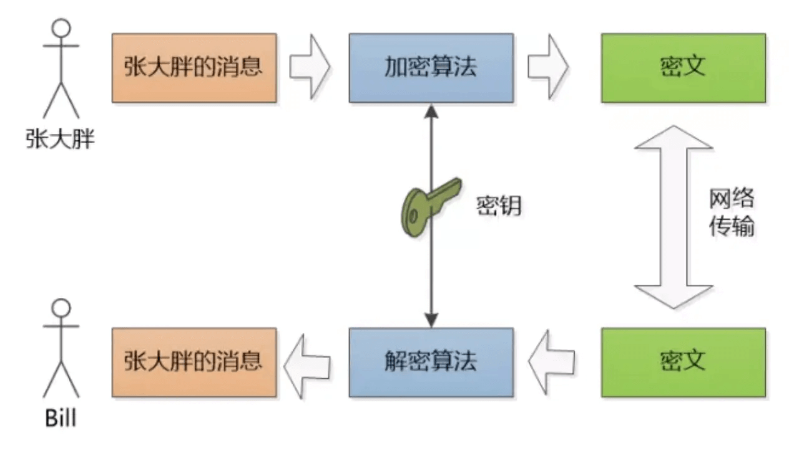

两人商量了一下，可以使用对称密钥进行加密。（对称密钥也就是加密和解密使用的是同一个密钥）

但是问题又来了~既然网络是不安全的，那么最开始的时候怎么将这个对称密钥发送出去呢？如果对称密钥在发送的时候就已经被拦截，那么发送的信息还是会被篡改和窥视啊~~

所以这种对称密钥的弊端就是，可能被中间人拦截，这样中间人就可以获取到了密钥，就可以对传输的信息就行窥视和篡改。

## plan2：使用非对称密钥

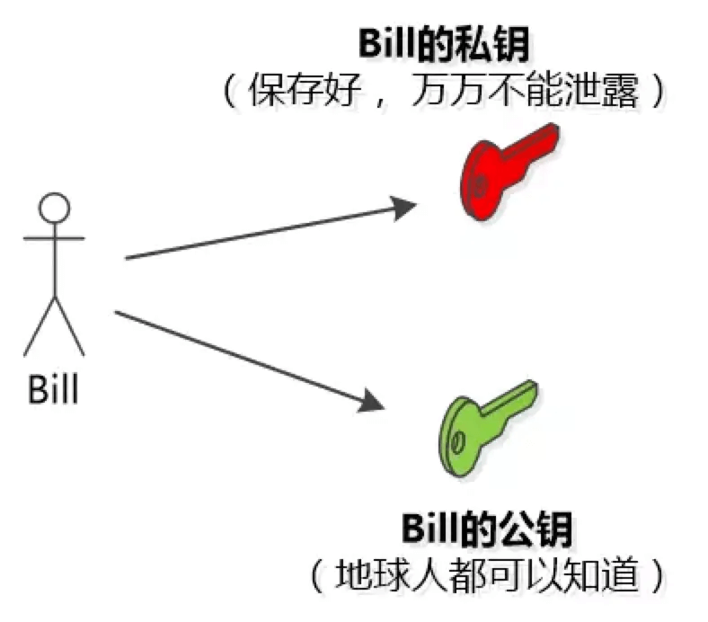

RSA（非对称加密算法）：双方必须协商一对密钥，一个私钥一个公钥。用私钥加密的数据，只有对应的公钥才能解密，用公钥加密的数据， 只有对应的私钥才能解密。

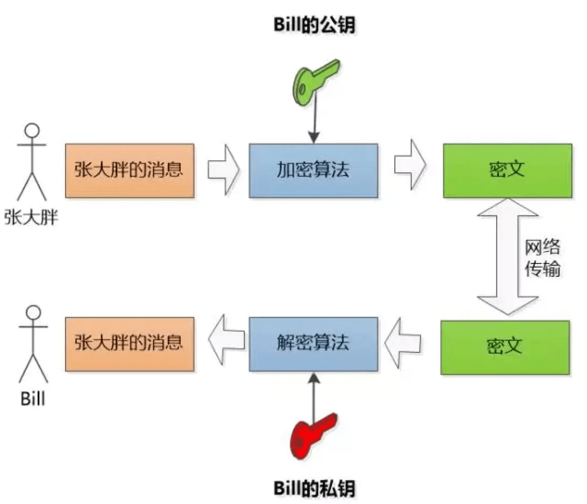

这样的话 Bill 将自己的公钥给张大胖，张大胖发送的信息使用 Bill 的公钥加密，这样，只有 Bill 使用自己的私钥才能获取

但是这样有个弊端：

**RSA 算法很慢**

所以为了解决这个问题，我们使用非对称密钥+对称密钥结合的方式

## plan3：非对称密钥+对称密钥

使用对称密钥的好处是速度比较快，使用非对称密钥的好处是可以使得传输的内容不能被破解，因为就算你拦截到了数据，但是没有 Bill 的私钥，也是不能破解内容的。就比如说你抢了一个保险柜，但是没有保险柜的钥匙也不能打开保险柜。

所以我们要结合两者的优点。使用 RSA 的方法将加密算法的对称密钥发送过去，之后就可以使用使用这个密钥，利用对称密钥来通信了。就比如说我将钥匙放进了保险柜，然后将保险柜寄给对方。

## 中间人攻击


还有一个问题就是在使用非对称密钥的时候，首先需要将 Bill 的公钥给张大胖，那么在这个过程中，安全是没有保障的，中间人可以拦截到 Bill 的公钥，就可以对拦截到的公钥进行篡改。

这也就是相当于我有手机号，虽然是公开的，谁都可以给我打电话，但是刚开始你并不知道我的手机号，我需要将我的手机号发给你，在我发给你我的手机号的时候，被中间人拦截了，然后将我正确的手机号换成了错误的手机号，比如：110，然后，你收到的就是错误的手机号：110，但是你自己还不知道你收到的是错的手机号，这时候，你要是给我打电话，就尴尬了~~

## 确认身份 —— 数字证书

所以以上的步骤都是可行的，只需要最后一点就可以了，要确定 Bill 给张大胖的公钥确实是 Bill。 的公钥，而不是别人的。（刚刚电话号码的那个例子，也就是说，需要确定我给你发的电话号码是我的，没有被修改的）

那怎么确认 Bill 给张大胖的公钥确实是 Bill 的呢？

这个时候就需要公证处的存在了。也就是说我需要先将我的电话号码到公证处去公证一下，然后我将电话号码传给你之后，你在将你收到的电话号码和公证处的比对下，就知道是不是我的了。

对应到计算机世界，那就是数字签名

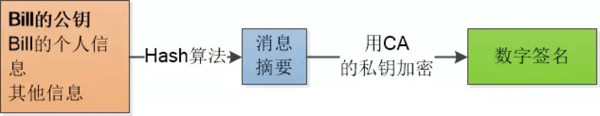

数字签名也就是相当于公证处在公证书上盖章。

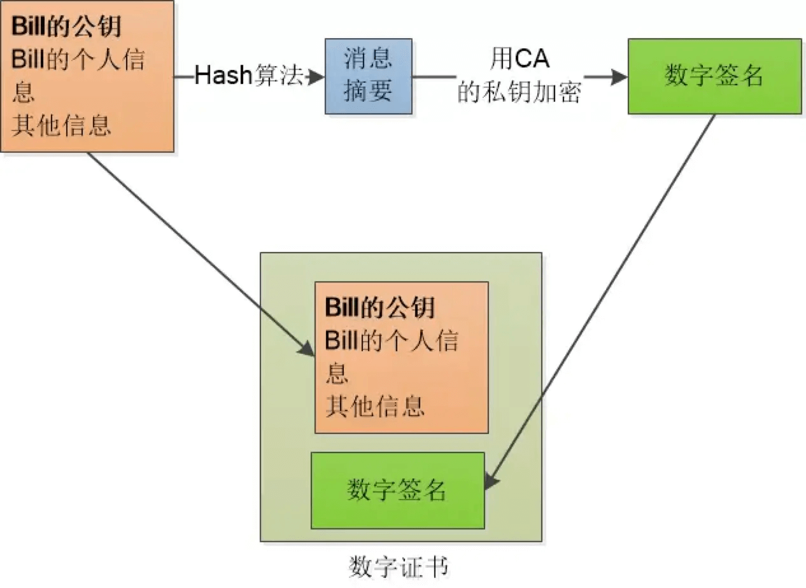

数字签名和原始信息合在一起称为数字证书，Bill 只需将数字证书发送给张大胖就可以了。

在拿到数字证书之后，就用同样的Hash 算法， 再次生成消息摘要，然后用CA的公钥对数字签名解密， 得到CA创建的消息摘要， 两者一比，就知道有没有人篡改了！

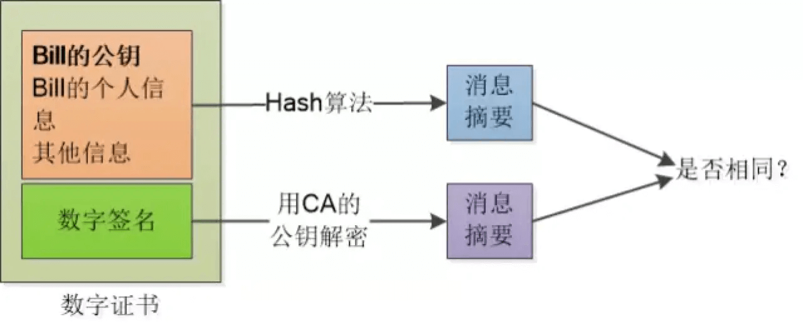

以上你全部看完并且理解了，那么对于 HTTPS 你也就大概有个了解了。


**要点**：
HTTPS（安全超文本传输协议）之所以安全，是因为它采用了以下几种机制来保护数据传输过程中的安全性和完整性：

1. **加密通信**：HTTPS使用SSL（安全套接字层）或TLS（传输层安全）协议对数据进行加密。这意味着在客户端和服务器之间传输的数据是经过加密的，第三方无法轻易读取或篡改。
2. **数据完整性**：通过加密算法，HTTPS确保了数据在传输过程中不会被修改。任何对数据的篡改都会导致解密失败，从而保护了数据的完整性。
3. **身份验证**：HTTPS通过数字证书实现服务器身份验证。数字证书由可信的第三方认证机构（CA）颁发，它证明了服务器的身份是真实可靠的。客户端可以通过验证证书来确认它们正在与正确的服务器通信。
4. **公钥和私钥**：HTTPS使用非对称加密技术，其中服务器拥有公钥和私钥。公钥用于加密数据，私钥用于解密。即使公钥是公开的，没有对应的私钥也无法解密信息。
5. **对称加密**：为了提高加密和解密的效率，HTTPS在初始的握手过程中使用非对称加密来交换一个对称密钥，之后的数据传输则使用这个对称密钥进行加密和解密。
6. **中间人攻击防护**：由于使用了数字证书和公钥基础设施（PKI），HTTPS能够抵御中间人攻击。即使攻击者拦截了通信，没有服务器的私钥，他们也无法解密或篡改数据。
7. **安全握手**：在建立HTTPS连接时，客户端和服务器之间会进行一次安全握手，以确保双方都同意使用相同的加密算法，并验证证书的有效性。

综上所述，HTTPS通过加密、身份验证、密钥交换和完整性保护等多种机制，为网络通信提供了高度的安全保障。


---
### 1850. 说说WebSocket和HTTP的区别

**难度**：★★☆☆☆ | **题型**：QA | **分类**：全部 / 计算机网络

**题目**：


**参考答案**：
## HTTP协议

`HTTP`是单向的，客户端发送请求，服务器发送响应。举例来说，当客户端向服务器发送请求时，该请求以`HTTP`或`HTTPS`的形式发送，在接收到请求后，服务器会将响应发送给客户端。

每个请求都与一个对应的响应相关联，在发送响应后客户端与服务器的连接会被关闭。每个`HTTP`或`HTTPS`请求每次都会新建与服务器的连接，并且在获得响应后，连接将自行终止。 `HTTP`是在`TCP`之上运行的无状态协议，`TCP`是一种面向连接的协议，它使用三向握手方法保证数据包传输的传递并重新传输丢失的数据包。

`HTTP`可以运行在任何可靠的面向连接的协议（例如`TCP`，`SCTP`）的上层。当客户端将`HTTP`请求发送到服务器时，客户端和服务器之间将打开`TCP`连接，并且在收到响应后，`TCP`连接将终止，每个`HTTP`请求都会建立单独的`TCP`连接到服务器，例如如果客户端向服务器发送10个请求，则将打开10个单独的`HTTP`连接。并在获得响应后关闭。

**理解上面这段关于 `HTTP`的描述时我觉得还要了解一下`HTTP`长连接的概念，以及`HTTP`与`TCP`的关系，简单概括一下就是**：

* `HTTP`协议的长连接和短连接，实质上是`TCP`协议的长连接和短连接。
* 每个`HTTP`连接完成后，其对应的`TCP`连接并不是每次都会关闭。从 `HTTP/1.1`起，默认使用长连接，用以保持连接特性。使用长连接的`HTTP`协议，会在响应头有加入这个头部字段：`Connection:keep-alive`
* 在使用长连接的情况下，当一个网页打开完成后，客户端和服务器之间用于传输`HTTP`数据的`TCP`连接不会关闭，如果客户端再次访问这个服务器上的网页，会继续使用这一条已经建立的连接。`Keep-Alive`不会永久保持连接，它有一个保持时间，可以在不同的服务器软件（如`Apache`，`Nginx`，`Nginx`中这个默认时间是 75s）中设定这个时间。实现长连接要客户端和服务端都支持长连接。
* `HTTP`属于应用层协议，在传输层使用`TCP`协议，在网络层使用`IP`协议。`IP`协议主要解决网络路由和寻址问题，`TCP`协议主要解决如何在`IP`层之上可靠的传递数据包，使在网络上的另一端收到发端发出的所有包，并且顺序与发出顺序一致。`TCP`有可靠，面向连接的特点。

HTTP消息信息是用`ASCII`编码的，每个`HTTP`请求消息均包含`HTTP`协议版本（`HTTP/1.1`，`HTTP/2`），`HTTP`方法（`GET`/`POST`等），`HTTP`标头（`Content-Type`，`Content-Length`），主机信息等。以及包含要传输到服务器的实际消息的正文（请求主体）。`HTTP`标头的大小从200字节到2`KB`不等，`HTTP`标头的常见大小是700-800字节。当`Web`应用程序在客户端使用更多`cookie`和其他工具扩展代理的存储功能时，它将减少`HTTP`标头的荷载。

  
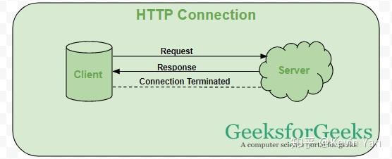

  
### WebSocket协议

`WebSocket`是双向的，在客户端-服务器通信的场景中使用的全双工协议，与`HTTP`不同，它以`ws://`或`wss://`开头。它是一个有状态协议，这意味着客户端和服务器之间的连接将保持活动状态，直到被任何一方（客户端或服务器）终止。在通过客户端和服务器中的任何一方关闭连接之后，连接将从两端终止。

让我们以客户端-服务器通信为例，每当我们启动客户端和服务器之间的连接时，客户端-服务器进行握手随后创建一个新的连接，该连接将保持活动状态，直到被他们中的任何一方终止。建立连接并保持活动状态后，客户端和服务器将使用相同的连接通道进行通信，直到连接终止。

新建的连接被称为`WebSocket`。一旦通信链接建立和连接打开后，消息交换将以双向模式进行，客户端-服务器之间的连接会持续存在。如果其中任何一方（客户端服务器）宕掉或主动关闭连接，则双方均将关闭连接。套接字的工作方式与`HTTP`的工作方式略有不同，状态代码`101`表示`WebSocket`中的交换协议。

  
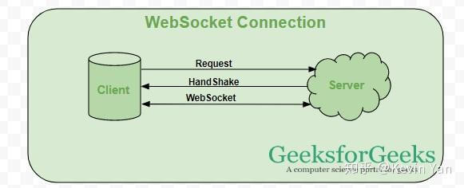

  
### 何时使用WebSocket

* 即时`Web`应用程序：即时`Web`应用程序使用一个`Web`套接字在客户端显示数据，这些数据由后端服务器连续发送。在`WebSocke`t中，数据被连续推送/传输到已经打开的同一连接中，这就是为什么`WebSocket`更快并提高了应用程序性能的原因。 例如在交易网站或比特币交易中，这是最不稳定的事情，它用于显示价格波动，数据被后端服务器使用Web套接字通道连续推送到客户端。
* 游戏应用程序：在游戏应用程序中，你可能会注意到，服务器会持续接收数据，而不会刷新用户界面。屏幕上的用户界面会自动刷新，而且不需要建立新的连接，因此在`WebSocket`游戏应用程序中非常有帮助。
* 聊天应用程序：聊天应用程序仅使用`WebSocket`建立一次连接，便能在订阅户之间交换，发布和广播消息。它重复使用相同的`WebSocket`连接，用于发送和接收消息以及一对一的消息传输。

### 不能使用WebSocket的场景

如果我们需要通过网络传输的任何实时更新或连续数据流，则可以使用`WebSocket`。如果我们要获取旧数据，或者只想获取一次数据供应用程序使用，则应该使用`HTTP`协议，不需要很频繁或仅获取一次的数据可以通过简单的`HTTP`请求查询，因此在这种情况下最好不要使用`WebSocket`。

注意：如果仅加载一次数据，则`RESTful` `Web`服务足以从服务器获取数据。

### 总结

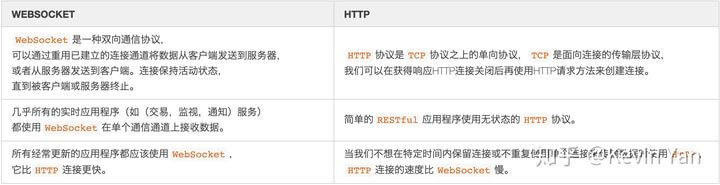

> 原文地址：https://www.geeksforgeeks.org/what-is-web-socket-and-how-it-is-different-from-the-http/

**要点**：
HTTP和WebSocket是两种不同的网络协议，它们在客户端和服务器之间的通信方式上有所不同。

### HTTP协议

- **单向通信**：客户端发送请求，服务器发送响应。
- **TCP连接**：每个HTTP请求都会建立一个TCP连接，并在响应后关闭连接。从HTTP/1.1开始，默认使用长连接，通过`Connection: keep-alive`头部字段保持连接。
- **无状态**：每个请求都是独立的，服务器不会记住之前的请求。
- **应用层协议**：在传输层使用TCP，网络层使用IP。
- **ASCII编码**：HTTP消息使用ASCII编码。

### WebSocket协议

- **双向通信**：客户端和服务器之间的连接保持活动状态，直到双方都关闭连接。
- **有状态**：连接一旦建立，客户端和服务器就可以相互发送消息。
- **全双工**：客户端和服务器可以同时发送和接收消息。
- **状态代码101**：WebSocket连接使用状态代码101，表示从HTTP升级到WebSocket。

### 何时使用WebSocket

- **实时数据**：适用于需要实时更新或连续数据流的应用，如即时Web应用程序、游戏和聊天应用程序。
- **持续通信**：当需要持续的双向通信时，WebSocket比HTTP更高效。

### 不能使用WebSocket的场景

- **一次性请求**：如果只需要获取一次数据，或者不需要实时更新，则应使用HTTP。

### 总结

HTTP和WebSocket各有其适用场景。HTTP适用于一次性请求或不需要持续通信的场景，而WebSocket适用于需要实时数据更新或持续双向通信的场景。


---
### 1863. HTTP协议的优点和缺点

**难度**：★★☆☆☆ | **题型**：QA | **分类**：全部 / 计算机网络

**题目**：


**参考答案**：
<p style="text-align:left;text-indent:2em;">HTTP 是超文本传输协议，它定义了客户端和服务器之间交换报文的格式和方式，默认使用 80 端口。它使用 TCP 作为传输层协议，保证了数据传输的可靠性。</p><p style="text-align:left;text-indent:2em;">HTTP协议具有以下<strong>优点</strong>：</p><ul><li>支持客户端/服务器模式</li><li><strong>简单快速</strong>：客户向服务器请求服务时，只需传送请求方法和路径。由于 HTTP 协议简单，使得 HTTP 服务器的程序规模小，因而通信速度很快。</li><li><strong>无连接</strong>：无连接的含义是限制每次链接只处理一个请求。服务器处理完客户的请求，并收到客户的应答后，即断开链接，采用这种方式可以节省传输时间。</li><li><strong>无状态</strong>：HTTP 协议是无状态协议，这里的状态是指通信过程的上下文信息。缺少状态意味着如果后续处理需要前面的信息，则它必须重传，这样可能会导致每次连接传送的数据量增大。另一方面，在服务器不需要先前信息时它的应答就比较快。</li><li><strong>灵活</strong>：HTTP 允许传输任意类型的数据对象。正在传输的类型由 Content-Type 加以标记。</li></ul><p style="text-align:left;text-indent:2em;">HTTP协议具有以下<strong>缺点</strong>：</p><ul><li><strong>无状态：</strong> HTTP 是一个无状态的协议，HTTP 服务器不会保存关于客户的任何信息。</li><li><strong>明文传输：</strong> 协议中的报文使用的是文本形式，这就直接暴露给外界，不安全。</li><li><strong>不安全</strong></li></ul><p style="text-align:left;text-indent:2em;">（1）通信使用明文（不加密），内容可能会被窃听 （2）不验证通信方的身份，因此有可能遭遇伪装 （3）无法证明报文的完整性，所以有可能已遭篡改</p><p></p>

**要点**：
<p style="text-align:left;text-indent:2em;">HTTP（超文本传输协议）是一种用于在客户端和服务器之间交换数据的协议，它定义了数据交换的格式和方式，并默认使用TCP的80端口进行通信。以下是HTTP协议的一些主要特点和优缺点：</p><p style="text-align:left;text-indent:2em;"><strong>优点：</strong></p><ol><li><strong>客户端/服务器模式</strong>：支持客户端向服务器发送请求并接收响应。</li><li><strong>简单快速</strong>：HTTP协议简单，仅需传输请求方法和路径，使得服务器程序规模小，通信速度快。</li><li><strong>无连接</strong>：每个请求/响应完成后，连接会断开，节省传输时间。</li><li><strong>无状态</strong>：每次请求/响应都是独立的，服务器不会保存关于客户端的状态信息。</li><li><strong>灵活</strong>：允许传输任意类型的数据对象，由Content-Type标示数据的类型。</li></ol><p style="text-align:left;text-indent:2em;"><strong>缺点：</strong></p><ol><li><strong>无状态</strong>：HTTP协议的无状态性意味着服务器不会保存关于客户端的状态信息，每次请求都是独立的。</li><li><strong>明文传输</strong>：HTTP报文以文本形式传输，这使得通信内容容易受到窃听。</li><li><strong>不安全</strong>：</li><ul><li>通信内容可能会被窃听。</li><li>无法验证通信方的身份，可能遭遇伪装。</li><li>无法证明报文的完整性，可能已遭篡改。</li></ul></ol><p></p><p style="text-align:left;text-indent:2em;">为了克服HTTP的不安全性，衍生出了HTTPS（HTTP Secure）协议，它通过在HTTP上增加SSL/TLS层来加密数据传输，确保通信的私密性和完整性。</p>

---