# 跨端技术 分类题集

> 共 19 题，摘自前端面试题宝典 https://fe.ecool.fun/topic-list

### 11. 说说 jsBridge 的原理

**难度**：★★★☆☆ | **题型**：QA | **分类**：全部 / 跨端技术

**题目**：


**参考答案**：
## JSBridge是什么?

JSBridge：以 JavaScript 引擎或 Webview 容器作为媒介，通过协定协议进行通信，实现 Native 端和 Web 端双向通信的一种机制。

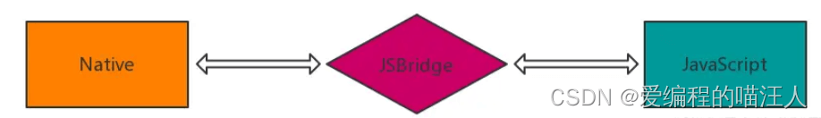

所谓 `双向通信的通道`:

* JS 向 Native 发送消息 : 调用相关功能、通知 Native 当前 JS 的相关状态等。
* Native 向 JS 发送消息 : 回溯调用结果、消息推送、通知 JS 当前 Native 的状态等。

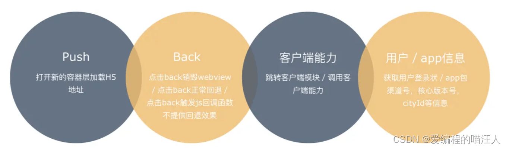

JavaScript 是运行在一个单独的 JS Context 中（例如，WebView 的 Webkit 引擎、JSCore）。由于这些 Context 与原生运行环境的天然隔离，我们可以将这种情况与 RPC（Remote Procedure Call，远程过程调用）通信进行类比，将 Native 与 JavaScript 的每次互相调用看做一次 RPC 调用。如此一来我们可以按照通常的 RPC 方式来进行设计和实现。

## Webview 是什么？

WebView 是移动端提供的运行JavaScript的环境，是系统渲染 Web 网页的一个控件，可与页面JavaScript交互，实现混合开发。

简单来说`，WebView` 是手机中内置了一款高性能 `Webkit` 内核浏览器，在 SDK 中封装的一个组件。不过没有提供地址栏和导航栏，只是单纯的展示一个网页界面。

> `WebView` 可以简单理解为页面里的 `iframe` 。原生 `app` 与 `WebView` 的交互可以简单看作是页面与页面内 `iframe` 页面进行的交互。就如页面与页面内的 `iframe` 共用一个 `Window` 一样，原生与 `WebView` 也共用了一套原生的方法。

其中 Android 和 iOS 又有些不同：

* Android目前是 基于 `Chromium` 内核。
* iOS 目前采用的是 `WKWebView`。

WebView 可以对url请求、页面加载、渲染、页面交互进行强大的处理。

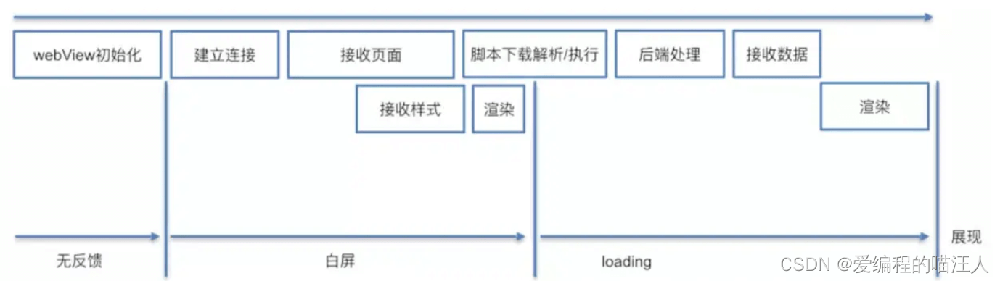

webview 去加载 url 并不像是 浏览器加载 url 的过程，webview 存在一个初始化的过程。为了提升init 时间，通常做法是 app 启动时初始化一个隐藏的webview等待使用，当用户点击需要加载URL，直接使用这个webview 来加载，从而减少webview init 初始化时间。弊端就是带来了额外的内存开销。

# JSBridge 如何实现？

目前主流的 JSBridge实现中，都是通过拦截 URL 请求来达到 native 端和 webview 端相互通信的效果。

首先，需要在 webview 侧和 native 侧分别注册 bridge，其实就是用一个对象把所有函数储存起：

`1. function registerHandler(handlerName, handler) {
2. messageHandlers[handlerName] = handler;
3. }
`

然后，在 webview 里面注入初始化代码：

 （1）创建一个名为 WVJBCallbacks 的数组，将传入的 callback 参数放到数组内

 （2）创建一个 iframe，设置不可见，设置 src 为 `https://__bridge_loaded__`

 （3）设置定时器移除这个 iframe。

最后，在native 端监听 url 请求：

 （1）拦截了所有的 URL 请求并拿到 url。

 （2）首先判断 `isWebViewJavascriptBridgeURL`，判断这个 url 是不是 webview 的 iframe 触发的，具体可以通过 host 去判断。

 （3）继续判断，如果是 `isBridgeLoadedURL`，那么会执行 `injectJavascriptFile`方法，会向 webview 中再次注入一些逻辑，其中最重要的逻辑就是，在 window 对象上挂载一些全局变量和 `WebViewJavascriptBridge`属性。

 （4）继续判断，如果是 isQueueMessageURL，那么这就是个处理消息的回调，需要执行一些消息处理的方法

## 1\. webview 调用 native 能力

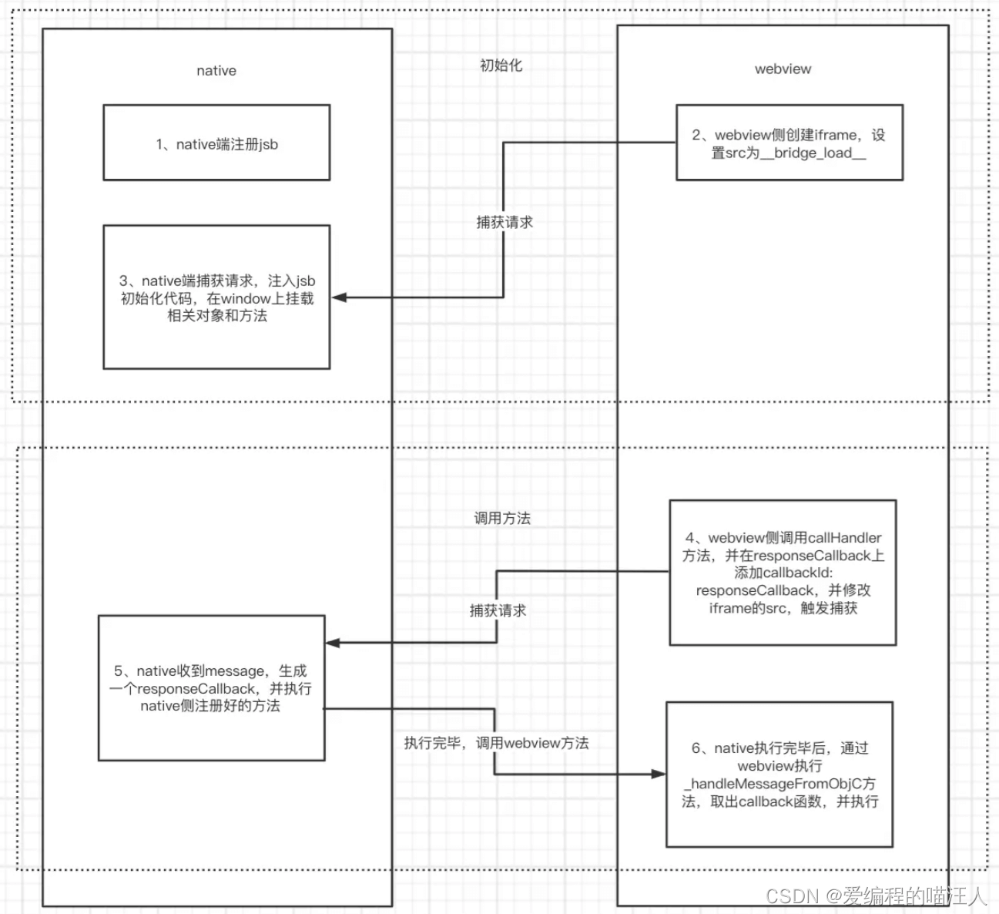

1. native 端注册 JsBridge。
2. webview 侧创建 iframe，设置 src 为`__bridge_load__。`
3. native 端捕获请求，注入 jsb 初始化代码，在 window 上挂载相关对象和方法。
4. webview 侧调用`callHandler`方法，并在`responseCallback`上添加`callbackId: responseCallback`，并修改 iframe 的 src，触发捕获。
5. native 收到 message，生成一个`responseCallback`，并执行 native 侧注册好的方法
6. native 执行完毕后，通过 webview 执行`_handleMessageFromObjC`方法，取出 callback 函数，并执行。

## 2 . native 调用 webview 能力

native 可以直接调用 webview 注册的 JsBridge 方法，不需要通过触发 iframe 的 src 触发执行：

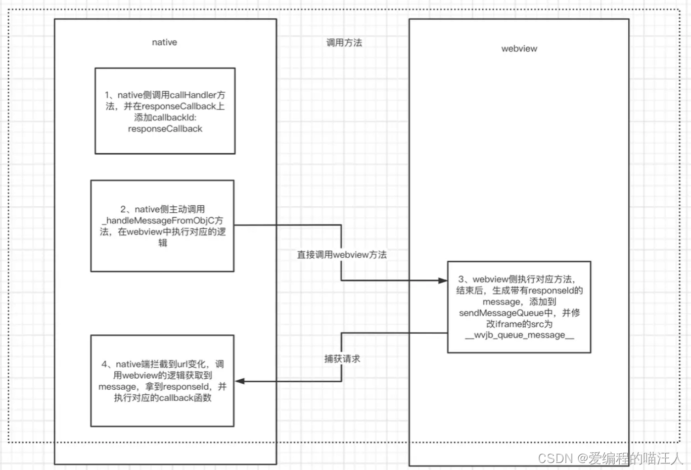

1. native 侧调用 `callHandler`方法，并在 `responseCallback`上添加 `callbackId: responseCallback。`
2. native 侧主动调用 `_handleMessageFromObjC `方法，在 webview 中执行对应的逻辑。
3. webview 侧执行结束后，生成带有 `responseId `的 message，添加到 `sendMessageQueue`中，并修改 iframe 的 src 为 `__wvjb_queue_message__。`
4. native 端拦截到 url 变化，调用 webview 的逻辑获取到 message，拿到 `responseId`，并执行对应的 callback 函数。

**要点**：
- **JSBridge** 是在 JavaScript 和原生代码之间进行通信的桥接机制，主要用于混合应用开发。
- **消息发送与接收**：JavaScript 通过特定接口发送消息，原生代码接收并处理消息，然后返回结果。
- **接口定义**：包括 JavaScript 端和原生端的接口定义，允许互相调用方法。
- **消息格式和协议**：通常使用 JSON 格式传递消息，定义消息的请求和响应结构。
- **实现方式**：在 Android 和 iOS 上分别通过不同的 API 实现 JavaScript 与原生代码的交互。

JSBridge 的实现可以根据具体的应用需求和平台特点进行调整，以实现高效的前后端通信。


---
### 99. 小程序中 setData 的性能问题如何优化？

**难度**：★★★☆☆ | **题型**：QA | **分类**：全部 / 跨端技术

**题目**：


**参考答案**：
小程序中 `setData` 的优化是性能提升的核心，因为它负责将数据从逻辑层传到渲染层，不当使用极易导致卡顿。以下将详细阐述其优化方案。

###  减少数据通信量

优化数据传输是首要任务。应确保 `setData` 只传递与页面渲染直接相关的数据，避免传输冗余信息。对于复杂数据结构，推荐使用数据路径语法进行局部更新，例如修改数组中的特定项或对象的特定属性，而非更新整个对象 ``。同时，与渲染无关的数据应直接存储在 `Page` 或 `Component` 实例的非 `data` 字段上（如 `this.tempData`），而不是通过 `setData` 传输 ``。

在列表渲染场景中，避免每次加载新数据时都使用数组合并方法（如 `concat` 或扩展运算符 `...`）更新整个列表。最佳实践是采用多值局部渲染，先将需要新增的条目构建成一个键值对对象，然后一次性调用 `setData` ``。

```javascript
// 推荐做法：多值局部渲染
let newData = [...]; // 新增的列表数据
let updateObject = {};
let currentLength = this.data.list.length;
newData.forEach((item, index) => {
  updateObject[`list[${currentLength + index}]`] = item;
});
this.setData(updateObject);
```

###  控制调用频率与时机

过于频繁地调用 `setData` 会导致逻辑层与渲染层通信队列阻塞，引发界面渲染延迟和用户操作卡顿 ``。务必避免在循环或毫秒级定时器中直接调用 `setData`，而应将多次操作合并为一次。

对于高频触发的事件，如 `onPageScroll`（页面滚动），应避免在其中直接调用 `setData`。如果必须调用，务必结合函数节流（throttle）技术，确保在指定时间间隔内只执行一次 ``。此外，页面被切换到后台后，任何更新用户都无法感知，应避免或延迟在 `onHide` 生命周期中进行 `setData`，可将其推迟到页面再次显示时（`onShow`）执行 ``。

### 缩小渲染范围与优化结构

将需要频繁更新的UI部分（如倒计时组件）封装成自定义组件。在组件内调用 `setData` 只会引发组件自身的更新，而非整个页面，这能显著减少虚拟DOM树遍历和计算的开销 ``。

简化WXML结构也能有效提升性能。过度嵌套的节点会增加渲染负担，建议减少不必要的标签嵌套，保持节点树深度尽可能浅 ``。官方建议一个页面的WXML节点数少于1000个，节点树深度少于30层 ``。

### 高级优化策略

当列表数据量极大（如成千上万条）时，即使采用上述优化，直接渲染所有节点也可能导致内存不足或DOM节点数超限。此时必须采用**虚拟列表**技术 ``。其原理是只渲染可视区域及附近少量（如上下一屏）的列表项，通过动态计算和替换数据，保持页面总节点数稳定，从而实现海量数据的流畅滚动。微信官方提供了 `recycle-view` 组件可供使用 ``。

对于动画效果，应避免通过高频 `setData` 来驱动。优先使用CSS动画或过渡，或者利用小程序提供的 `wx.createAnimation` API ``。


**要点**：
减少数据量：只传递变化的数据，使用数据路径（如 this.setData({ 'list[0].name': newName })），避免设置大对象。
   
降低频率：对频繁触发的操作进行节流/防抖，合并多次 setData 调用。
    
 其他策略：长列表使用虚拟列表技术。

---
### 528. 跨平台的开发中，如何处理不同平台的 API 差异？

**难度**：★★☆☆☆ | **题型**：QA | **分类**：全部 / 跨端技术

**题目**：


**参考答案**：
处理不同平台的 API 差异，是跨平台开发中的核心挑战。其目标是在享受跨平台开发效率的同时，确保应用在各平台上的功能完整、性能稳定、体验原生。关键在于通过良好的架构设计来**隔离与抽象**平台细节。

### 核心原则与架构思想

1.  **抽象与统一接口层**：这是最根本的策略。不要在各处业务代码中直接调用平台特定的 API，而是**封装一个统一的接口层**。业务逻辑只与这个抽象层交互，由它来屏蔽底层的平台差异。例如，一个文件操作模块，可以定义统一的 `readFile` 和 `writeFile` 方法，然后在内部根据平台调用不同的原生实现 。这种设计使得核心业务代码保持平台无关性，极大提升了可维护性 。

2.  **渐进增强与平稳退化**：在设计功能时，采用“渐进增强”思想。即，**优先保证核心功能在所有平台都能运行**，然后为高版本平台或特定平台增强更优的体验。同时，做好“平稳退化”，对于不支持某些高级功能的平台，提供合适的降级方案，而不是让功能崩溃 。

### 关键技术方案与手段

1.  **条件编译**：这是在**编译时**处理差异的高效方式。通过预定义的宏或配置，编译器只会将当前目标平台的代码打包到最终产物中 。例如，在 C++ 或前端构建工具中，可以使用 `#ifdef _WIN32` 或类似语法，为不同平台编写不同的代码路径。这种方式打包结果纯净，但需要构建工具支持 。

2.  **运行时检测与分支判断**：这是在**代码运行时**根据当前所处的平台环境，动态选择执行不同的逻辑。这是最常见和灵活的方式 。各框架通常提供全局的 API 用于获取平台信息，例如 React Native 的 `Platform.OS` 和 `Platform.select()` 方法 ，或 UniApp 中的 `uni.getSystemInfoSync().platform` 。这种方式灵活直观，但代码中会存在一些分支判断。

3.  **文件/模块约定**：一些框架支持通过特定的文件命名约定来区分平台代码。例如，在 React Native 中，可以创建 `Component.ios.js` 和 `Component.android.js` 文件。在导入时，只需 `import Component from './Component'`，框架会自动根据平台加载正确的文件 。这是一种将平台差异隔离在文件级别的优雅实践。

###  具体实现策略

1.  **UI 组件的适配**：对于 UI 差异，可以采用条件渲染或样式注入。
    *   **条件渲染**：在组件内部，根据当前平台渲染不同的子组件或应用不同的样式属性 。
    *   **样式注入**：将平台特定的样式定义在外部配置文件中，通过一个统一的函数在运行时获取对应的样式对象，然后应用到组件上 。ArkUI-X 等框架还提供了强大的分层布局系统，能自动适配不同屏幕尺寸和像素密度 。

2.  **原生功能的封装**：对于需要深度调用原生功能（如传感器、蓝牙）的场景，React Native、Flutter 等框架通过建立“桥接”或“平台通道”来实现 JavaScript/Dart 与原生代码的通信 。在这种架构下，通常需要在原生端（iOS/Android）分别实现功能模块，然后在 JavaScript/Dart 层封装一个统一的 API 供业务方调用 。

3.  **资源与依赖管理**：不同平台的资源文件（如图标、字体）可能需要进行适配。可以采用分级资源目录的策略，将通用资源放在基础目录，平台特有资源放在对应子目录，由框架在构建时自动选择 。同时，务必确保项目依赖的第三方库在所有目标平台上都得到支持 。

###  最佳实践与注意事项

1.  **全面的测试**：无论采用何种方案，**在多平台真机环境下的全面测试是必不可少的**。要建立自动化测试流程，利用云测试平台覆盖尽可能多的设备和 OS 版本 。

2.  **统一的文档与规范**：在团队内部，应建立清晰的文档，说明如何处理新发现的 API 差异，以及项目中使用的是哪种主要方案，保持代码风格一致 。

3.  **善用第三方库与框架**：优先选择成熟、维护活跃的跨平台库（如 Qt、React Native 的社区库），它们通常已经解决了底层的 API 差异问题。但在引入前，务必评估其跨平台兼容性 。

4.  **版本兼容性处理**：API 差异不仅存在于不同平台间，也存在于同一平台的不同版本间。对于新 API，要检查其版本要求，并做好低版本系统的兼容 。

总而言之，处理 API 差异是一个系统工程，核心在于通过**抽象和分层**来隔离变化，再灵活运用**条件编译、运行时检测**等技术手段，最终通过**严格的测试**来保证质量。优雅的跨平台应用不是简单地抹平差异，而是智慧地拥抱和管理差异 。

**要点**：
条件编译：在编译阶段，通过特定注释（如 // #ifdef MP-WEIXIN）来区分不同平台，编写差异化代码。
   
 适配器模式（Adapter Pattern）：在运行时，封装一个统一的工具类（Adapter），在内部判断环境并调用对应的原生 API。例如，封装一个 StorageAdapter，内部判断环境并分别调用 uni.setStorageSync 或浏览器的 localStorage，对业务代码提供统一的 Promise 接口 。

---
### 565. taro 的实现原理是怎么样的？

**难度**：★★★☆☆ | **题型**：QA | **分类**：全部 / React.js / 跨端技术

**题目**：


**参考答案**：
Taro 是一个多端统一开发框架，可以使用一套代码编译成微信小程序、支付宝小程序、百度智能小程序、字节跳动小程序、QQ 小程序、快应用、H5 等多个平台的应用。

Taro 的实现原理主要基于以下几个方面：

1. **JSX 转换**：Taro 使用 Babel 插件将类似 HTML 的语法转换为 React 组件。在编译过程中，Taro 还会对 JSX 语法进行优化和压缩，以避免生成不必要的代码。

2. **多端适配**：Taro 通过封装原生 API 和提供不同的 Polyfill 实现多端适配。例如，在微信小程序中，Taro 封装了 wx 对象，使得可以使用类似 React Native 的组件化开发方式；在 H5 中，Taro 则提供了针对浏览器的 Polyfill。

3. **跨端样式处理**：Taro 通过 CSS Modules 技术和 PostCSS 插件来处理 CSS 样式。在编译过程中，Taro 会将样式文件转换为 JavaScript 对象，并按需导入到组件中。同时，Taro 提供了 @import 指令或 scss 语法等方式来支持复杂的样式表达。

4. **构建系统**：Taro 使用 webpack 构建工具来打包编译后的代码，并提供了一系列开箱即用的插件、规则和配置项，例如自动化导入组件、静态资源压缩、TypeScript 支持等。

5. **运行时性能优化**：Taro 在运行时对代码进行了一些优化，例如使用字典树实现 JSX 解析、避免使用内置事件监听器、减少对原生 API 的调用等方式来优化性能。

Taro 利用 Babel、React、Webpack 等技术，通过封装原生 API 和提供不同的 Polyfill 实现了多端适配，同时也支持复杂的样式表达和自动化导入组件等特性。这些技术的应用使得 Taro 框架在性能、可维护性、跨平台等方面都表现出色。

**要点**：
Taro 的实现原理是通过编译器将统一的代码（如 React 或 Vue 代码）转化为各个平台特定的代码，结合跨平台的组件库和 API 映射，实现一次开发、多端部署。通过这种方式，Taro 使得开发者能够更高效地构建和维护跨平台应用。

---
### 651. Electron 有哪些特点和优势？

**难度**：★★☆☆☆ | **题型**：QA | **分类**：全部 / 跨端技术

**题目**：


**参考答案**：
Electron 是一个开源的桌面应用程序开发框架，它允许使用 Web 技术（HTML、CSS 和 JavaScript）构建跨平台的桌面应用程序。它的开发者是 GitHub。以下是 Electron 的特点和优势：

1. 跨平台：Electron 应用程序可以在 Windows、macOS 和 Linux 等多个操作系统上运行。

2. 基于 Web 技术：Electron 使用 Web 技术作为应用程序的开发语言，因此它具有很高的可移植性和灵活性。

3. 开发效率高：由于使用 Web 技术进行开发，Electron 应用程序的开发周期比传统的桌面应用程序要短得多。

4. 接近原生体验：Electron 应用程序可以获得接近原生应用程序的用户体验，因此在界面、性能等方面具有很高的表现力。

5. 社区活跃：Electron 拥有庞大的社区，提供了丰富的插件、工具和教程，可以帮助开发者更快地构建应用程序。

6. 自由度高：基于 Electron 可以实现前端与后端代码分离，后端采用 Node.js，而前端则可以选择 Vue、React、Angular 等。

总的来说，Electron 通过使用 Web 技术来构建桌面应用程序，提供了跨平台、高效、灵活和接近原生体验的优势，因此越来越受到开发者的关注和青睐。


---
### 668. 说说你对跨平台的理解

**难度**：★★★☆☆ | **题型**：QA | **分类**：全部 / 工具 / 跨端技术

**题目**：


**参考答案**：
我们知道，cpu 有不同的架构和指令集，上层也有不同的操作系统，一个系统的可执行文件在另一个系统上就是不可执行的，比如 windows 的 exe 文件在 mac 上就不能直接执行。不同的系统就是不同的运行平台。可执行文件是不跨平台的。

不同平台提供的 api 不同，所以代码逻辑可能也不同，需要不同平台单独维护代码。这样就带来了几个问题：

- 多平台各自开发，怎么保证功能是一致的
- 多平台各自开发，那是不是得各自测试，开发和测试的人力都是多份的

所以出现了跨平台的一些技术，目标是一份代码跑在任意平台。

我们先来看一些各领域的跨平台方案：

### 浏览器

操作系统不同，浏览器上跑的网页的代码确实同一份。浏览器就是一种历史悠久的跨平台方案。

网页跨平台不意味着浏览器也是跨平台的，浏览器的可执行文件还是每个平台单独开发和编译的，但是他们支持的网页解析逻辑一样，这样上面跑的网页就是跨平台的。

浏览器提供了一个容器，屏蔽了底层差异，提供了统一的 api（dom api），这样就可以实现同一份代码跑在不同平台的统一的容器里。这个容器叫做浏览器引擎，由 js 引擎、渲染引擎等构成。

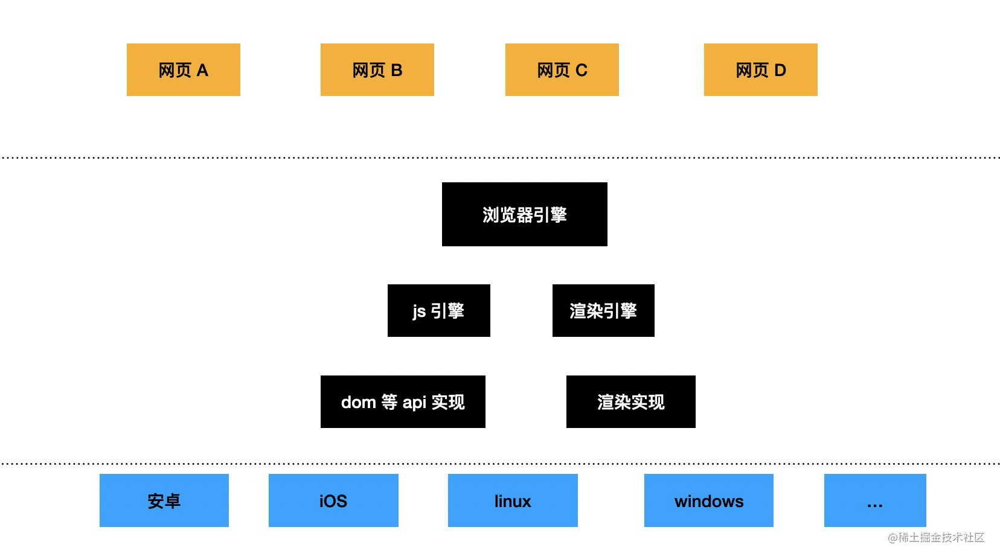

### docker 

docker 是一种虚拟化技术，可以在操作系统之上加一个虚拟层，在这层之上划分一到多个容器，容器里再去跑系统、app，这样可以实现硬件和软件的分离，动态分配硬件资源给容器，并且方便 app 运行环境的整体迁移（保存成镜像）。

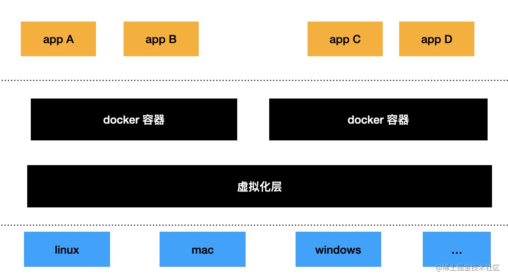

docker 很明显也是一种跨平台技术，同一个镜像可以跑在任何操作系统的 docker 上。只要不同操作系统实现同样的容器即可。

### jvm

java 是一门编译 + 解释的语言，java 源码编译成字节码，然后字节码直接在 vm 上解释执行。

java 为什么这么火呢？主要是因为跨平台。

c、c++ 这种语言写的代码需要编译成不同操作系统上的可执行文件来跑，而且每个平台的代码可能还不一样，需要写多份。

java 因为提供了 jvm 容器，只要把源码编译成 jvm 能解释的字节码就行了，而且 jdk 提供了统一的 api，分别由不同操作系统的底层 api 来实现，这样对于 java 代码来说，不同操作系统的代码是一致的。

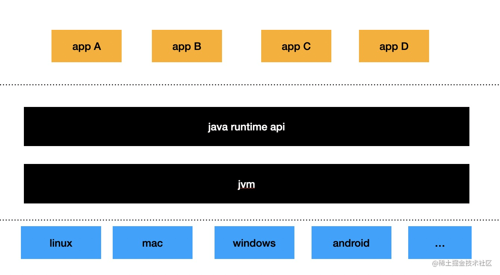

jvm 也是通过容器的技术实现了一份代码跑在多个平台，而且 jre 提供了统一的 api，屏蔽掉了底层的差异。

### node、deno

node 和 deno 也是跨平台的技术，通过提供一套一致的 api，让其上的 js 代码可以跨平台。这些 api 也是不同平台各自实现的。

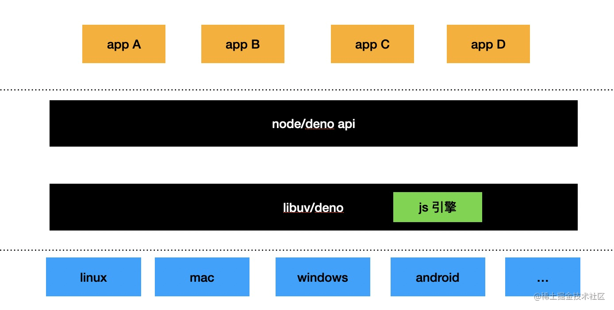

## electron

electron 内置了 chromium，并为其注入了 node 的 api 和一些 GUI 相关的 api，是基于两大跨平台技术综合而成的跨平台方案。基于这些方案的组合使得 electron 支持用前端技术开发桌面端。

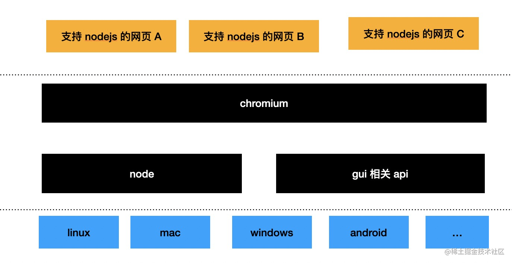


## 跨平台方案的优缺点

跨平台方案的优点很明显，就是一份代码跑在不同平台的同样的容器内，不用不同平台单独开发，节省成本。

但是跨平台方案也有缺点：

- 因为多了一层容器，所以性能相比直接调用系统 api 会有所下降

- 为了实现多平台的一致，需要提供一套统一的 api，这套 api 有两个难题：
     - api 怎么设计。要综合不同平台的能力，取一个合适的集合来实现。设计上有一定难度。node、deno、java 都抽象了操作系统的能力，提供了各自的跨平台 api
 
     - 部分 api 很难做到多平台的一致性

     - 当容器没有提供的能力需要扩展的时候比较麻烦，比如 js 引擎的 bridge、 jvm 的 jni、node 的 c++ addon 等都是为这个容器扩展能力的方式
     
     


---
### 800. 说说你对React Native的了解？

**难度**：★☆☆☆☆ | **题型**：QA | **分类**：全部 / 跨端技术

**题目**：


**参考答案**：
`React Native` 是一个由 `Facebook` 于 2015 年 9 月发布的一款开源的 `JavaScript` 框架，它可以让开发者使用 JavaScript 和 React 来开发跨平台的移动应用。

它既保留了 React 的开发效率，又同时拥有 Native 应用的良好体验，加上 `Virtual DOM` 跨平台的优势，实现了真正意义上的：`Learn Once,Write Anywhere`.

## React Native的特点

* 跨平台

React Native 使用了 Virtual DOM(虚拟 DOM)，只需编写一套代码，便可以将代码打包成不同平台的 App，极大提高了开发效率，并且相对全部原生开发的应用来说，维护成本也相对更低。

* 上手快

相比于原生开发，JavaScript 学习成本低、语法灵活。允许让 Web 开发者更多地基于现有经验开发 App。React Native 只需使用 JavaScript 就能编写移动原生应用，它和 React 的设计理念是一样的，因此可以毫不夸张地说：你如果会写 React，就会写 React Native!

* 原生体验

由于 `React Native` 提供的组件是对原生 API 的暴露，虽然我们使用的是 `JavaScript` 语言编写的代码，但是实际上是调用了原生的 API 和原生的 UI 组件。因此，体验和性能足以媲美原生应用。

* 热更新

`React Native` 开发的应用支持热更新，因为 `React Native` 的产物是 `bundle` 文件，其实本质上就是 `JS` 代码，在 App 启动的时候就会去服务器上获取 `bundle` 文件，我们只需要更新 `bundle` 文件，从而使得 App 不需要重新前往商店下载包体就可以进行版本更新，开发者可以在用户无感知的情况下进行功能迭代或者 bug 修复。

但是值得注意的是，AppStore 禁止热更新的功能中有调用私有 API、篡改原生代码和改变 App 的行为。

## React Native 的不足

由于 `React Native` 和原生交互依赖的只有一个 `Bridge`，而且 JS 和 Native 交互是异步的，所以对需要和 `Native` 大量实时交互的功能可能会有性能上的不足，比如动画效率，性能是不如原生的。

`React Native` 始终是依赖原生的能力，所以摆脱不了对原生的依赖，相对 `Flutter` 的自己来画 UI 来说，`React Native` 显得有些尴尬。


---
### 803. Taro 如何实现 React 到小程序代码的转换？

**难度**：★★☆☆☆ | **题型**：QA | **分类**：全部 / 跨端技术

**题目**：


**参考答案**：
Taro 实现从 React 代码到小程序代码的转换，其核心原理经历了从 **“编译时”** 主导到 **“编译时 + 运行时”** 协同的架构演进。这种转变旨在平衡开发灵活性和多端兼容性。

###  编译时转换：代码的“翻译”阶段

编译时阶段主要负责将开发者编写的 React 代码进行静态分析和转换，生成小程序可以识别的文件结构。

1.  **JSX 模板转换**：这是最核心的步骤。Taro 利用 **Babel** 将 JSX 语法解析成**抽象语法树（AST）**。然后，它遍历 AST，将 JSX 元素和属性转换为对应小程序的标签和属性。例如，将 `<View>` 转换为 `<view>`，将 `onClick` 事件转换为 `bindtap`。在 Taro 1/2 时期，这一转换是直接且静态的，试图将 JSX 的灵活性“硬编码”为小程序模板的固定结构，这也导致了其对某些复杂 JSX 写法支持不完善的问题。

2.  **样式处理**：Taro 使用 **PostCSS** 等工具处理 CSS/SCSS 文件。它会进行尺寸单位转换（如将 `px` 转换为小程序的自适应单位 `rpx`），并进行样式隔离等适配工作，最终生成小程序的 `WXSS` 文件。

3.  **条件编译**：为了优雅地处理各平台的差异，Taro 提供了条件编译能力。开发者可以通过类似 `/* #ifdef MP-WEIXIN */` 的注释或 `process.env.TARO_ENV` 环境变量，让某段代码只在特定平台被编译和打包，从而实现精准的差异化实现。

###  运行时适配：应用的“中枢神经”

经过编译后的代码需要在一个适配层中运行，这就是**运行时（Runtime）** 的作用。Taro 3 的运行时机制是其架构的灵魂。

1.  **模拟 DOM/BOM API**：小程序环境没有浏览器标准的 `window`、`document` 等对象。Taro 在逻辑层实现了一套高效、精简的 **DOM/BOM API**。这使得 React 等框架的核心代码（如 `ReactDOM.render()`）能够在不认识小程序环境的情况下直接运行，因为它发现自己熟悉的 `document.createElement` 等 API 是“存在”的。

2.  **自定义 React 渲染器（taro-react）**：Taro 实现了自己的渲染器 `taro-react`，它充当了 **React-Reconciler** 与上述模拟 DOM 之间的桥梁。React-Reconciler 负责计算虚拟 DOM 的差异（Diff），而 `taro-react` 则根据差异，调用模拟 DOM 的方法来创建、更新或删除节点。它实现了 `hostConfig` 配置项，其中定义了一系列方法（如 `createInstance`, `appendChild`, `commitUpdate`），告诉 React 如何在小程序环境中创建和管理 UI 节点。

3.  **虚拟 DOM 与数据通信**：运行时会在逻辑层维护一棵**虚拟 DOM 树**，它代表了当前的视图结构。当组件的状态或属性发生变化，React 通过 Reconciler 计算出最小变更后，`taro-react` 会将这些变更序列化为一个可序列化的数据对象，最后通过小程序的 `setData` 方法将数据从逻辑层传递到渲染层。

4.  **组件与 API 的桥接**：
    *   **组件桥接**：Taro 提供的组件（如 `<View>`）在编译时会被转换为小程序的原生组件 `<view>`。这些组件在渲染层由小程序原生渲染，确保了最佳的性能和体验。
    *   **API 桥接**：开发者调用的 `Taro.xxx` API（如 `Taro.request`）在运行时会被转发到对应平台的原生 API。例如，在微信小程序中，`Taro.request` 内部实际调用的是 `wx.request`。

Taro 3 通过其创新的**运行时架构**，将小程序逻辑层转化为一个可以执行 React 等框架的“浏览器式”环境，再通过高效的**虚拟 DOM 差分更新**和**数据通信机制**与原生渲染层同步，最终实现了 React 代码在小程序上的顺畅运行。这种设计在开发灵活性和性能之间取得了出色的平衡。

**要点**：
Taro 是以编译期为主、运行时为辅的跨端解决方案。

   编译时：通过 AST（抽象语法树）将 JSX 编译为小程序模板（WXML），并处理样式转换、多端产物输出等。

   运行时：负责行为适配，如对齐生命周期、将 setState 映射到小程序的 setData、适配事件系统、以及通过 API 抹平提供统一接口。正是“编译期解决结构差异，运行时解决行为差异”使得 Taro 能跨端 。

---
### 809. 解释 uni-app 的编译原理和渲染机制。

**难度**：★★★☆☆ | **题型**：QA | **分类**：全部 / 跨端技术

**题目**：


**参考答案**：
uni-app 的编译原理和渲染机制是其实现“一次开发，多端运行”的核心。


### 编译原理

uni-app 的编译过程主要依赖**编译器（Compiler）** 和**运行时（Runtime）** 的协同工作。

1.  **统一源码与平台适配**：你使用 Vue 语法编写的 `.vue` 文件是统一的源代码。当你指定目标平台（如 H5、微信小程序、App）并执行编译时，uni-app 的编译器会启动。
    *   在 **H5 平台**，编译器的工作相对简单，类似于传统的 Vue CLI 项目，将 `.vue` 组件编译成标准的 HTML、CSS 和 JavaScript 文件，以便在浏览器中运行。
    *   在**小程序平台**（如微信小程序），编译器会将 `.vue` 文件中的模板、样式和逻辑拆解，并转换为对应小程序特有的文件格式，例如 `WXML`、`WXSS` 和 `JS` 文件。
    *   在 **App 平台**，代码被编译为 JS Bundle，并与 uni-app 的原生运行时（一个集成了 JS 引擎和原生渲染能力的容器）一同打包成安装文件。对于更高级的需求，uni-app 支持使用 `uts`（uni type script）语言。uts 代码在编译时会被直接转换为平台原生语言：在 Android 上变成 Kotlin，在 iOS 上变成 Swift，从而允许你直接调用所有原生 API。

2.  **条件编译**：这是 uni-app 实现跨端兼容的关键特性。通过特殊的注释语法（如 `// #ifdef H5`），你可以让某段代码只在特定的平台被编译进去，从而优雅地处理各平台的差异。

###  渲染机制

uni-app 在渲染机制上提供了灵活性，尤其在 App 端。

1.  **WebView 渲染**：这是默认的渲染方式。对于普通的 `.vue` 文件，uni-app 采用与小程序类似的双线程模型：逻辑层（JavaScript 代码）和渲染层（界面）是分离的。逻辑层运行在独立的 JS 引擎（如 JSCore 或 V8）中，而渲染层由 WebView 承载。这种分离避免了 JS 运算阻塞渲染，提升了页面动画的流畅性，但两层之间的通信会带来一定的性能损耗。

2.  **原生渲染**：当你需要追求极致的性能时，可以使用 `.nvue` 页面。这种文件采用原生渲染引擎，其组件在 App 端会被直接映射为 iOS 的 UIKit 组件或 Android 的原生 View，从而获得与原生开发无异的流畅体验，特别是在处理长列表或复杂动画时。

3.  **混合渲染**：一个 App 中可以同时存在 `.vue` 页面和 `.nvue` 页面。你可以根据页面的性能要求灵活选择，例如首页使用 `nvue` 保证流畅度，内容详情页使用 `vue` 以提高开发效率。


**要点**：
### 编译时：代码转换

uni-app 的**编译器**是核心。当你指定目标平台（如微信小程序或 H5）后，它会将你的代码进行转换：
*   **模板转换**：将 `.vue` 文件中的 `<template>` 部分编译成目标平台能识别的格式，例如，编译到微信小程序时，会生成 `WXML`。
*   **样式处理**：将 `<style>` 中的样式转换为 `WXSS`（小程序）或标准的 `CSS`（H5），并处理尺寸单位。
*   **脚本与 API 映射**：将 `<script>` 中的 `uni.xxx` API 调用映射为各平台的原生 API，如在微信小程序中对应为 `wx.xxx`。
*   **条件编译**：通过 `#ifdef` 和 `#ifndef` 等注释，让某段代码只在特定平台被编译，优雅地处理平台差异。

###  运行时：环境与渲染

编译后的代码需要在不同平台的**运行时**中执行：
*   **逻辑层与渲染层分离**：在小程序和 App 端，uni-app 采用与小程序类似的双线程模型。**逻辑层**（JavaScript代码）在一个独立的 JS 引擎（如 JSCore 或 V8）中运行，负责数据处理；**渲染层**负责界面显示。这种分离避免了 JS 运算阻塞渲染，提升了页面流畅度。
*   **App 端的双重渲染引擎**：在 App 端，uni-app 提供了两种渲染方式以获得更灵活的体验权衡。默认的 **WebView 渲染**（用于 `.vue` 文件）与小程序原理相同，兼容性好。追求更高性能时，可使用**原生渲染**（用于 `.nvue` 文件），其组件会直接映射为原生组件，性能更接近原生应用。一个 App 中可以混合使用这两种页面。

---
### 839. 跨端应用常见的性能瓶颈有哪些？优化方案是什么？

**难度**：★★★☆☆ | **题型**：QA | **分类**：全部 / 跨端技术

**题目**：


**参考答案**：


### 启动速度优化

应用启动是用户的第一印象，缓慢的启动过程会直接导致用户流失。

*   **分包加载**：这是最核心的优化手段。将非首屏必需的页面（如个人中心、设置页）放到子包中，启动时只加载主包，可以显著减少初始下载和加载时间。这在UniApp、Chameleon等框架中都有直接支持。
*   **资源预加载与缓存**：利用客户端能力扩展前端生命周期。例如，可以预初始化WebView实例池，或对公共资源建立内存缓存，在页面加载时直接使用，避免重复的网络请求。腾讯X5内核增强版也利用智能缓存和预加载策略提升资源加载效率。
*   **优化关键请求**：将非首屏必需的API请求后置，确保首页核心内容能最快呈现。同时，可以利用预加载技术，在空闲时段提前获取用户可能访问的数据。

###  运行时性能优化

应用启动后的流畅度决定了用户的核心使用体验。

*   **长列表渲染优化**：对于商品列表、聊天记录等场景，**虚拟列表** 是终极解决方案。它只渲染可视区域内的少量项目，而不是全部数据，能极大减少DOM节点数，提升滚动流畅度。例如，在UniApp的App端可使用专用的`<list>`组件，或使用第三方库如`mescroll-uni`。
*   **减少跨端通信损耗**：跨端通信（如JSBridge、Flutter的MethodChannel）是性能瓶颈高发区。优化核心是 **“减少次数、压缩数据”** 。对于高频调用，应合并为批量操作，避免频繁的跨端调用。同时，选择高效的序列化格式（如Protobuf）替代JSON，可以减小数据体积，提升传输效率。
*   **优化响应式数据**：对于Vue或React框架，避免将不需要响应式更新的大型静态数据直接放在`data`或`state`中。可以使用`Object.freeze()`冻结数据，或使用计算属性缓存计算结果，以减少不必要的响应式开销。

###  包体积与控制

包体积直接影响下载速度和启动时间。

*   **代码分割与懒加载**：除了分包，还应使用动态`import()`实现路由级和组件级的懒加载，确保代码按需加载。
*   **资源压缩与Tree Shaking**：对图片等静态资源进行压缩并考虑使用WebP等更高效的格式。构建时开启代码压缩、混淆，并利用Tree Shaking剔除未被引用的代码。同时，确保组件库和API是按需引入的。

### 平台专项优化

不同平台有各自的特性，需要“对症下药”。

*   **小程序平台**：核心瓶颈是`setData`调用。应避免频繁调用、避免一次性设置过大的数据（建议不超过256KB）。数据的差分更新合并是常见的优化策略。
*   **App端**：在UniApp中，对于性能要求极高的页面（如首页），可以考虑使用`nvue`进行原生渲染，以获得更流畅的体验。在Flutter中，嵌入原生View（PlatformView）时需选择合适的渲染模式以避免性能问题。
*   **H5端**：可以利用Service Worker实现资源缓存和离线能力，优化二次加载速度。同时，对图片等资源实施懒加载，对代码进行有效的代码分割。


**要点**：
启动加载慢：优化方案包括代码分包与懒加载、资源压缩（图片、代码）、预加载关键资源。
    
运行时卡顿：优化方案包括优化 setData（小程序端，避免一次性设置大量数据）、减少 JSBridge 通信频率和数据量（Hybrid/RN）、列表优化（使用虚拟列表）、图片懒加载 。
   
 内存泄漏：注意全局事件监听、定时器的及时销毁，避免循环引用。

---
### 1012. 说说你对 Electron 的了解

**难度**：★★☆☆☆ | **题型**：QA | **分类**：全部 / 跨端技术

**题目**：


**参考答案**：
Electron 是一种基于 Chromium 和 Node.js 的开源框架，可以用于快速构建跨平台的桌面应用程序。与传统的桌面应用程序不同，Electron 应用程序使用 HTML、CSS 和 JavaScript 技术栈来实现界面设计和业务逻辑，并且具有良好的跨平台性能和扩展性。

1. 跨平台性：Electron 可以在 Windows、Mac 和 Linux 等多个平台上运行。它通过使用 web 技术栈来实现界面设计和业务逻辑，从而实现了跨平台的一致性和可移植性。同时，由于 Electron 底层使用 Chromium 和 Node.js，也可以很方便地使用各种第三方库和插件。

2. 灵活性：Electron 提供了很多自定义选项和 API 接口，可以满足各种定制化需求。例如，可以自定义菜单、对话框和图标等界面元素，还可以访问系统文件和网络资源等底层功能。

3. 生态圈支持：Electron 在 GitHub 上拥有庞大的社区和生态圈，提供了很多开源项目和插件，可以快速开发出高质量的桌面应用程序。同时，Electron 也得到了很多知名公司和开发者的支持，如 Slack、GitHub Desktop、VS Code 等。

4. 性能问题：由于 Electron 应用程序需要同时运行 Chromium 和 Node.js，因此在启动速度、内存占用和性能优化等方面可能存在一些问题。但是，通过合理的代码设计和优化，可以很好地解决这些问题。

总之，Electron 是一种灵活、可扩展、跨平台的桌面应用程序开发框架，具有良好的生态圈和社区支持。对于前端开发人员来说，它提供了一种全新的开发方式和编程思路，为构建高质量的桌面应用程序提供了更多的便利和选择。


---
### 1380. Electron 中的主进程和渲染进程分别是什么？

**难度**：★★☆☆☆ | **题型**：QA | **分类**：全部 / 跨端技术

**题目**：


**参考答案**：
在 Electron 中，应用程序的架构分为两个主要进程：**主进程**和**渲染进程**。这两个进程分别承担不同的职责，并且有不同的角色和功能。

### **1. 主进程（Main Process）**

- **定义**：主进程是 Electron 应用的核心进程，它负责创建和管理应用窗口，以及控制整个应用的生命周期。
- **职责**：
  - **创建窗口**：主进程使用 `BrowserWindow` 类创建和管理应用窗口。
  - **管理窗口**：处理窗口的创建、关闭、最小化、最大化等操作。
  - **处理系统事件**：例如，处理应用程序的启动、退出、系统托盘图标等。
  - **与渲染进程通信**：通过 IPC（进程间通信）与渲染进程进行通信。
  - **访问 Node.js API**：可以使用 Node.js 的核心模块，如文件系统、网络、进程管理等。

- **示例代码**：
  ```javascript
  // main.js
  const { app, BrowserWindow } = require('electron');
  
  function createWindow() {
    const mainWindow = new BrowserWindow({
      width: 800,
      height: 600,
      webPreferences: {
        nodeIntegration: true,
        contextIsolation: false,
      },
    });
    mainWindow.loadFile('index.html');
  }
  
  app.whenReady().then(() => {
    createWindow();
    app.on('activate', () => {
      if (BrowserWindow.getAllWindows().length === 0) createWindow();
    });
  });

  app.on('window-all-closed', () => {
    if (process.platform !== 'darwin') app.quit();
  });
  ```

### **2. 渲染进程（Renderer Process）**

- **定义**：渲染进程是为每个应用窗口创建的独立进程，它负责渲染窗口的内容并处理用户界面（UI）的逻辑。
- **职责**：
  - **渲染内容**：负责显示 HTML、CSS 和 JavaScript 内容，类似于传统的浏览器渲染页面。
  - **处理用户交互**：处理用户的输入事件，如点击、键盘输入等。
  - **与主进程通信**：通过 IPC 与主进程进行通信，实现数据交换和功能调用。
  - **访问 Web API**：使用浏览器环境提供的 API，如 `document`、`window`、`fetch` 等。

- **示例代码**：
  ```javascript
  // renderer.js
  const { ipcRenderer } = require('electron');

  // 发送消息到主进程
  ipcRenderer.send('message', 'Hello from renderer');

  // 监听主进程的消息
  ipcRenderer.on('reply', (event, data) => {
    console.log(`Received reply: ${data}`);
  });
  ```

### **进程间通信（IPC）**

- **主进程与渲染进程通信**：使用 IPC 模块进行进程间通信。主进程和渲染进程通过 `ipcMain` 和 `ipcRenderer` 对象发送和接收消息。
  - **主进程发送消息**：
    ```javascript
    // main.js
    const { ipcMain } = require('electron');

    ipcMain.on('message', (event, arg) => {
      console.log(arg); // 'Hello from renderer'
      event.reply('reply', 'Hello from main');
    });
    ```
  - **渲染进程发送消息**：
    ```javascript
    // renderer.js
    const { ipcRenderer } = require('electron');

    ipcRenderer.send('message', 'Hello from renderer');
    ipcRenderer.on('reply', (event, arg) => {
      console.log(arg); // 'Hello from main'
    });
    ```

**要点**：
- **主进程**：负责应用程序的生命周期、窗口管理、系统事件和与渲染进程的通信。具有完整的 Node.js 环境。
- **渲染进程**：负责渲染窗口内容和处理用户交互，类似于浏览器环境。通过 IPC 与主进程进行通信。

主进程和渲染进程分开运行，提供了更好的安全性和稳定性，因为它们的功能和资源是隔离的。


---
### 1453. 谈谈 React 与 React Native 的区别

**难度**：★★☆☆☆ | **题型**：QA | **分类**：全部 / 跨端技术

**题目**：


**参考答案**：
React 和 React Native 虽然师出同门（均源于 Meta/Facebook），并共享核心概念，但它们在目标平台、技术架构和应用场景上存在根本性的差异。理解这些区别对于技术选型至关重要。

### 核心定位与运行环境

**React** 的核心定位是一个用于构建**Web页面**用户界面的 **JavaScript 库**。它主要运行在**浏览器**环境中，其工作的基础是操作浏览器的**文档对象模型（DOM）**。开发者使用 React 来创建可交互的网页应用，最终产物是运行在浏览器中的网页。

**React Native** 的核心定位是一个用于开发**跨平台原生移动应用**的**框架**。它运行在 iOS 和 Android 等移动操作系统上。其最终产出物是真正的原生应用（如 .ipa 或 .apk 文件），可以通过应用商店分发和安装。

### 架构与渲染机制的根本区别

这是两者最本质的差异，决定了它们不同的工作方式。

**React 的渲染机制**：React 在浏览器中引入了一个**虚拟DOM（Virtual DOM）** 作为抽象层。当组件的状态发生变化时，React 会先在内存中构建一个新的虚拟DOM树，然后与旧的虚拟DOM树进行对比（Diff算法），计算出需要更新的最小变更集，最后再通过高效的批量操作来更新浏览器的真实DOM。这套机制的核心是为了解决直接操作真实DOM带来的性能瓶颈。

**React Native 的渲染机制**：React Native 并不渲染到浏览器的DOM上。它采用了类似的逻辑，但最终目标不同。当你的JSX代码被解析后，React Native 会通过一个称为 **“桥接（Bridge）”** 的通信层，将界面描述信息传递给原生端。原生端（iOS 或 Android）会将这些指令解释为真正的原生组件进行渲染。例如，React Native 中的 `<View>` 组件在 iOS 上会被渲染为 `UIView`，在 Android 上则被渲染为 `android.view.View`。这意味着用户体验是**原生**的，而非在 WebView 中运行的网页。

为了进一步提升性能，React Native 的新架构（通常被称为 **Fabric**）正在逐步取代旧的桥接架构。Fabric 将渲染器直接移至 C++ 层，允许更同步的UI操作，减少了通信延迟，并支持并发渲染特性，从而显著提升了应用的响应速度和流畅度。

### 开发体验的具体差异

由于渲染目标的不同，开发者在日常编码中会感受到诸多具体差异。

**组件体系**：React 使用标准的 HTML 标签（如 `<div>`, `<span>`, `<p>`）来构建界面。React Native 则提供了一套自己的、映射到原生控件的组件。例如，用于容器的 `<View>` 替代了 `<div>`，用于文本显示的 `<Text>` 替代了 `<p>` 或 `<span>`，而用于交互的 `<TouchableOpacity>` 则替代了 `<button>`。在 React Native 中直接使用 HTML 标签会导致错误。

**样式处理**：React 可以充分利用完整的 CSS 生态，包括样式表、CSS Modules、Styled Components 等，布局方式也非常丰富（Flexbox、Grid、定位等）。React Native 则使用 **JavaScript 对象**来定义样式，它不支持 CSS 文件或选择器。样式属性采用驼峰命名法（如 `backgroundColor`），布局主要依赖一个与 CSS 标准略有差异的 **Flexbox** 模型（默认主轴方向为垂直的 `column`）。尺寸单位通常是设备无关的逻辑像素点（dp/pt），而非 px 或 rem。

**事件处理与导航**：React 处理的是浏览器提供的 **DOM 事件**，如 `onClick`、`onChange`。React Native 则处理的是移动端的**手势事件**，如 `onPress`、`onLongPress`。在路由导航方面，React 通常使用 `react-router-dom` 等基于浏览器 History API 的库，而 React Native 则需要使用 `React Navigation` 或 `React Native Navigation` 等专为移动端栈式、标签式导航设计的库。

**原生功能访问**：React 应用的能力受限于浏览器提供的 **Web API**（如 `localStorage`, `fetch`）。React Native 则可以通过桥接或原生模块，直接调用设备的核心功能，如摄像头、地理位置、传感器、文件系统等，这些功能通常由 React Native 自带模块或庞大的第三方库社区提供。

### 性能考量与适用场景

**React** 的性能优化重点在于**减少不必要的真实DOM操作**，利用虚拟DOM和协调算法来提升效率。其挑战在于处理大型或复杂DOM树时可能出现的性能问题。

**React Native** 的性能优化重点则在于**最小化 JavaScript 线程与原生UI线程之间的通信开销**。在旧架构中，频繁的跨桥通信可能成为瓶颈。新架构（Fabric）正是为了解决这一问题而设计的。对于列表渲染、复杂动画等场景，需要采用特定的优化策略（如使用 `FlatList` 组件）。

**选择建议**：
*   **选择 React**：当你需要开发**网页、单页应用（SPA）**，或者目标是**浏览器兼容性和快速的Web迭代**时。
*   **选择 React Native**：当你需要开发**跨平台的移动应用**，追求**接近原生的用户体验**，并希望用一套代码覆盖 iOS 和 Android，同时能够调用设备原生功能时。


**要点**：
两者虽然共享了 React 的组件化思想和部分抽象层，但目标平台和渲染方式截然不同。React 用于 Web，其组件最终渲染为 DOM 元素（如 div, span）。React Native 用于开发原生移动应用，其组件（如 View, Text）在运行时被映射为 iOS/Android 的原生 UI 控件进行渲染 。

---
### 1495. 简单说下你对 Electron 架构的理解

**难度**：★★☆☆☆ | **题型**：QA | **分类**：全部 / 跨端技术

**题目**：


**参考答案**：
Electron 的架构可以分为三层：Chromium、Node.js 和应用程序层。

1. Chromium 层：Chromium 是一种开源的浏览器引擎，能够渲染 HTML、CSS 和 JavaScript 等 web 技术栈。在 Electron 中，Chromium 负责绘制应用程序的主窗口和所有的 web 视图内容，并提供了底层的 UI 控件、JavaScript 引擎和网络通信等功能。

2. Node.js 层：Node.js 是一种基于 V8 引擎的 JavaScript 运行环境，具有访问系统文件、网络资源和操作系统等底层功能的能力。在 Electron 中，Node.js 提供了底层的 API 接口，可以通过调用 Node.js 模块来实现文件读写、进程管理、网络通信等功能。

3. 应用程序层：应用程序层是基于 Chromium 和 Node.js 构建的应用程序框架，用于开发桌面应用程序的界面设计和业务逻辑。在应用程序层中，开发人员使用 web 技术栈和 Electron 提供的 API 接口来实现应用程序的各种功能，如窗口管理、菜单设计、对话框、托盘等。

Electron 的架构采用了 Chromium 和 Node.js 的组合方式，将 web 技术栈和底层系统功能完美地结合起来，提供了一种灵活、可扩展的桌面应用程序开发方式。这种架构不仅具有跨平台性能，而且可以利用 Node.js 提供的底层功能和第三方模块，实现更多的系统级功能和定制化需求。


---
### 1545. Hippy、React Native、Taro 和 uni-app 的区别是什么？它们各自的优势在哪里？

**难度**：★★☆☆☆ | **题型**：QA | **分类**：全部 / 跨端技术

**题目**：


**参考答案**：
这几类方案的差异，本质上不在于“是否跨端”，而在于**跨的是什么端、运行时如何组织、以及对原生与 Web 的取舍程度**。它们解决的是同一个问题的不同子集，因此优势往往建立在明确的前提之上。

Hippy 和 React Native 都属于**原生渲染路线**，核心思想是 JavaScript 负责描述 UI 和逻辑，最终由原生组件完成真实渲染。React Native 更偏向通用型解决方案，其架构围绕 React 心智模型展开，生态成熟、社区庞大，适合需要长期演进、深度定制原生能力的 App 项目。其代价在于工程复杂度较高，桥接、线程模型和性能调优都需要较强的原生配合能力。Hippy 则更强调工程化和性能稳定性，设计上更偏向“企业级 App 基建”，在大规模业务、强性能约束和统一规范的场景中表现突出，但生态和通用性相对集中在特定技术体系之内。

Taro 和 uni-app 走的是另一条路线，它们本质上是**跨平台编译框架**，目标不是还原原生组件体系，而是通过抽象层将一套代码映射到多个运行环境。Taro 更强调“以 React / Vue 等主流前端框架为开发模型”，通过编译期适配不同平台规范，适合前端团队主导、希望最大化复用现有技术栈的场景。它在多端一致性和工程可控性上较强，但在极端平台差异或深度原生能力使用时，需要额外适配成本。

uni-app 的优势则在于**平台覆盖广度和低门槛**。它在框架层面对多端差异做了大量封装，使得业务开发可以更快落地，尤其在小程序和轻量级应用场景中效率非常高。这种“高度抽象”的设计，也意味着对底层平台能力的掌控度相对有限，一旦业务超出框架预期模型，就可能受到约束。

如果从“谁更原生”到“谁更 Web 化”形成一条连续谱，Hippy 和 React Native 明显更靠近原生一侧，强调性能、体验和原生一致性；Taro 和 uni-app 更靠近 Web 一侧，强调研发效率和跨端覆盖。选择哪一种，本质上取决于项目的核心目标是“打造一个长期演进的原生 App”，还是“用最低成本覆盖尽可能多的平台”。

**要点**：
Hippy 与 React Native 走原生渲染路线，强调性能和原生体验，其中 React Native 生态更成熟，Hippy 更偏企业级基建；Taro 与 uni-app 属于编译型跨端方案，强调代码复用和研发效率；Taro 更贴近主流前端框架心智，uni-app 覆盖面更广、上手成本更低；选型关键在于原生能力深度与跨端效率之间的取舍。

---
### 1587. 混合开发（Hybrid）的原理是什么？

**难度**：★★★☆☆ | **题型**：QA | **分类**：全部 / 跨端技术

**题目**：


**参考答案**：
混合开发（Hybrid App）是一种结合了**Web技术**（HTML、CSS、JavaScript）和**原生应用技术**的移动应用开发模式。其核心目标是让开发者能够用一套Web代码在不同的移动操作系统（主要是iOS和Android）上运行，同时还能通过特定机制调用设备的原生功能，从而在开发效率、跨平台能力和用户体验之间取得平衡。


###  核心组件深度解析

#### 1. WebView：应用的渲染引擎
`WebView` 是一个内嵌在原生应用中的浏览器组件，可以理解为一种“简化版的浏览器内核”。它是混合应用的**核心容器**，专门负责渲染和显示由Web技术（HTML, CSS, JavaScript）构建的用户界面。
-   **作用**：作为Web页面的运行环境，它加载本地或远程的HTML文件，让Web代码能够以应用的形式呈现，而不是在用户默认的浏览器中打开。
-   **平台差异**：在Android上，对应的组件是 `WebView`；在iOS上，早期使用 `UIWebView`，现在推荐使用性能更优的 `WKWebView`。
-   **资源加载**：为了获得接近原生的体验（如瞬间启动、离线可用），混合应用通常将Web资源（HTML, CSS, JS, 图片）打包在App内部，并使用 `file://` 协议加载这些本地资源，从而摆脱对网络的依赖。

#### 2. JSBridge：双向通信的桥梁
`JSBridge`（JavaScript Bridge）是混合开发中**最关键的通信机制**。它建立了Web端JavaScript代码与原生端（Java/Kotlin, Objective-C/Swift）代码之间的双向通信通道。没有它，Web页面将无法调用任何设备能力。

其双向通信原理具体如下：

**a) JavaScript 调用 Native**
主要有两种实现方式：
-   **URL Schema拦截（URL拦截）**：WebView可以拦截所有发自JavaScript的页面跳转请求。JSBridge会定义一种自定义的URL协议（例如 `jsbridge://getUserInfo?key=value`）。当JavaScript代码试图通过`iframe.src`或`location.href`跳转到此类URL时，WebView会拦截该请求，解析URL中的协议和参数，然后调用相应的原生方法。
-   **注入API（更高效、现代的方式）**：原生端通过WebView的接口，将一个原生对象或方法注入到JavaScript的全局上下文（通常是`window`对象）中。此后，JavaScript就可以像调用普通JS函数一样直接调用这个注入的方法。例如，调用 `window.NativeBridge.showToast('Hello')` 会触发原生端的对应方法。一些成熟的库（如DSBridge）对此有很好的封装。

**b) Native 调用 JavaScript**
这种方式相对直接。原生端可以通过WebView提供的API直接执行JavaScript代码字符串。例如，在WKWebView中可以使用 `evaluateJavaScript(_:completionHandler:)` 方法。通常，Native会调用Web端预先挂载在`window`上的回调函数，将原生操作的结果（如相机拍到的照片数据）返回给JavaScript。

###  主流框架与平台特性

在实际开发中，开发者很少从零开始实现JSBridge和WebView管理。通常会使用成熟的混合开发框架，它们封装了底层细节：

-   **Apache Cordova (曾用名PhoneGap)**：是最经典和基础的混合开发框架。它提供了一个命令行工具来创建项目，并管理核心的WebView容器和一个庞大的插件生态系统。插件（如相机插件`cordova-plugin-camera`）就是封装好的JSBridge，方便开发者直接调用。
-   **Ionic**：一个基于Web技术的UI工具包，通常与Cordova配合使用。Ionic提供了丰富且高质量的移动端UI组件，使得用Web技术开发出的应用界面和交互更接近原生体验。它极大地简化了UI开发流程。

此外，不同平台在通信细节上存在差异：
-   **Android**：注入的JS对象名称可以自定义（如`window.AndroidBridge`），调用方式简单，并可直接获取返回值。
-   **iOS (WKWebView)**：注入方式相对固定，使用 `window.webkit.messageHandlers.方法名.postMessage(参数)` 的语法进行调用，且参数可以是对象等复杂类型。

###  混合开发的优势与挑战

#### 优势
1.  **开发效率高 & 成本低**：核心逻辑和界面只需一套代码，即可覆盖iOS和Android两大平台，显著减少了开发和维护成本。
2.  **动态更新能力强**：Web资源可以部署在服务器上。应用启动时通过网络获取最新资源，从而实现热更新，无需通过应用商店审核，适合业务快速迭代。
3.  **技术栈统一**：开发者使用熟悉的前端技术栈即可进行移动应用开发，降低了学习门槛。

#### 挑战与局限
1.  **性能瓶颈**：由于UI渲染依赖于WebView，其性能（尤其是在复杂的动画、长列表滚动或大量图形计算时）通常不及原生应用。
2.  **用户体验（UX）差异**：应用的“手感”可能无法与原生应用完全一致，细微的交互差异可能被用户感知。
3.  **调试复杂度**：涉及Web端、JSBridge和原生端的联调，问题定位可能比纯原生或纯Web应用更复杂。


**要点**：
混合应用在原生应用中嵌入 WebView 来显示HTML5内容。关键在于通过 JSBridge 实现 JavaScript 与原生代码（Java/Swift-ObjectiveC）的相互调用，从而让 Web 端能够使用设备的原生能力。

---
### 1722. 说说你对flutter的了解

**难度**：★★☆☆☆ | **题型**：QA | **分类**：全部 / 跨端技术

**题目**：


**参考答案**：
 ## 起源

我们从官网的介绍开始说起。

> Flutter is Google’s UI toolkit for building beautiful, natively compiled applications for mobile, web, and desktop from a single codebase.

> Flutter 是 Google 的 UI 工具包，用于从单个代码库构建漂亮的、本地编译的移动、web 和桌面应用程序。

所以正如我们（看了很多网上的文章后）所知，`Flutter`是一个**开源的、跨平台的UI框架**，用它开发的应用程序都具有**高保真度**和**高性能表现**。

但也许我们不知道或不太明白的是：

1. 到底什么是**UI框架**?
2. 到底什么是**高保真度**？
3. 到底什么是**高性能表现**？
4. Flutter是如何做到**跨平台**的？
5. Flutter是如何做到**高保真度**的？
6. Flutter是如何做到**高性能表现**的？

以上问题我们将各个击破，不过在开始前我们先插播一段**Flutter背景简介**\~

## Flutter背景简介

`Flutter`的前身是 Google 内部孵化的`Sky`项目，于2014年10月在 GitHub 上开源一年后，于2015年10月正式更名为`Flutter`。

`Flutter`是众多跨平台框架中的一个，其不同之处在于采用了**自绘UI+原生**的实现方案，相比于**H5+原生**和**JavaScript开发+原生渲染**类的方案，这是一种更为彻底的方案，并且它天生具备两大优点：

1. 在不同平台的 UI 表现可做到高保真度、高一致性
2. 绘制 UI 的性能和原生控件接近

`Flutter`的目标在于做**全平台**！开发者只需使用同一套基准代码，便可为移动平台、桌面端和网页端开发应用。而目前来看`Flutter`所支持或将支持的平台已经有 `Android`、`iOS`、`Fuchsia`、`Chrome OS`，另外我认为未来支持`鸿蒙OS`（一款让我们引以为傲的操作系统）也必将是件水到渠成的事\~

更多背景相关知识我在拜读的文章中贴出了链接，大家可自行食用。

## 到底什么是UI框架?

我们把`UI`和`框架`拆开，分别来做解释。

`UI`是**User Interface**的缩写，是**用户界面**的意思，但在我们软件领域普遍的认识里，`UI设计`实际是指**软件的人机交互、操作逻辑、界面美观性**的整体设计，所以`UI`就是指**软件的交互操作和视觉效果**。

`框架`在百度百科上的释义如下（大家感受下）：

> 框架（framework）是一个框子——指其约束性，也是一个架子——指其支撑性。是一个基本概念上的结构，用于去解决或者处理复杂的问题。

而在我们软件领域，`框架`可以理解为是**一个用来开发软件的工具包，它已处理好了通用的、基础性的工作，并且制定好了使用规则**。

所以总结一下，`UI框架`就是指**用来开发软件的工具包，且该软件可以带有交互操作和美观的视觉效果**。

## 到底什么是高保真度？

（这词乍一看怪吓人的，让人头皮发麻，萌生吐意🤮，谁叫我不是**厦大**的呢？）

`高保真`是声音技术领域的专业术语，是指与原来的声音高度相似的重放声音。

但在我们软件领域，`高保真度`其实就是`高还原度`的意思，旨在可以**像素级**还原UI稿的交互与视觉效果。

## 到底什么是高性能表现？

（以下说起性能的时候，都指的是在软件开发领域\~）

`性能`是个司空见惯的词，但`性能`到底是什么意思呢？可能在我们心中是既知道又说不清楚的含糊状态。

`性能`的英文是**Performance**，它也有**表现、工作情况**的意思。

当说起`性能`的时候，我们都能联想起一些关键词，比如：启动速度、内存使用优化、布局优化、电量优化、包瘦身等等。

所以综上可以感受出来，`性能`是一个**软件多维度指标表现情况**的代名词，`高性能表现`就是指**软件各项指标都表现优异**。（该快的快、该少的少、该大的大😁、该小的小）

## Flutter是如何做到跨平台的？

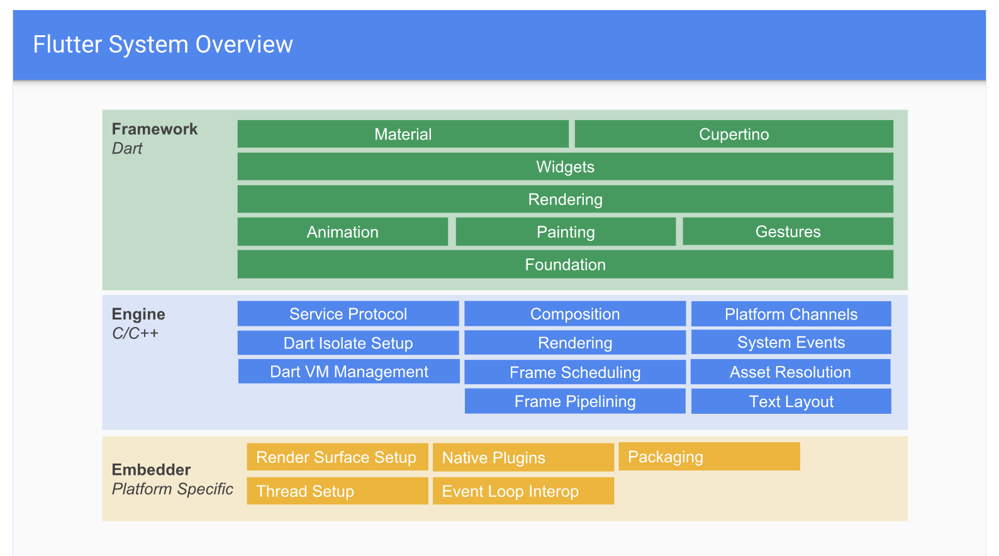

这里搬出**Flutter官方分层架构图**，在大的层次上，从上到下依次分为如下三层（可以看出 Framework 层内部又会分层）：

* **Framework框架层**：一个纯`Dart`实现的`SDK（一套基础库）`，负责 UI 相关的事情，如：动画、widget、绘图、手势、基础能力等。（我们的应用就是围绕这层来构建的）  
   * 在该层内部 Foundation 和 Animation、Painting、Gestures 对应的是 Flutter 中的`dart:ui` 包，它是 Flutter 引擎暴露的底层 UI 库，用来提供动画、手势及绘制等能力。
* **Engine引擎层**：一个纯`C++`实现的`SDK`，主要包括 Skia 引擎（开源的二位图形库）、Dart 运行时、GC垃圾回收、编译模式支持、Text 文字排版引擎等。
* **Embedder嵌入器层**：见名知意是将 Flutter 移植到各平台的中间层代码，**做好这一层的适配 Flutter 基本可以嵌入到任何平台上去**。它主要包括渲染Surface设置、原生平台插件、打包、线程管理、事件循环交互操作等。

所以可以看出在设计上**Embedder**层要做的工作就是隔离并适配不同平台的差异，保证对上层暴露统一的`API`，以此来达到**跨平台的目的**。无论现在的`Android`、`iOS`还是未来的`Fuchsia`、`鸿蒙OS`，亦或是其他`嵌入式操作系统`（比如树莓派上的系统 Raspbian ），理论上 Flutter 都是可以**跨**上去的😎。

以上是针对跨操作系统而言的，在最近刚发步的 Flutter 1.9 中`Flutter for web`的支持虽然还处于预览版，但 flutter\_web 这个 repo 已经合并到了 flutter 的主 repo，这也是一个重要的里程碑了。那么**Flutter是如何做到支持Web的呢？**

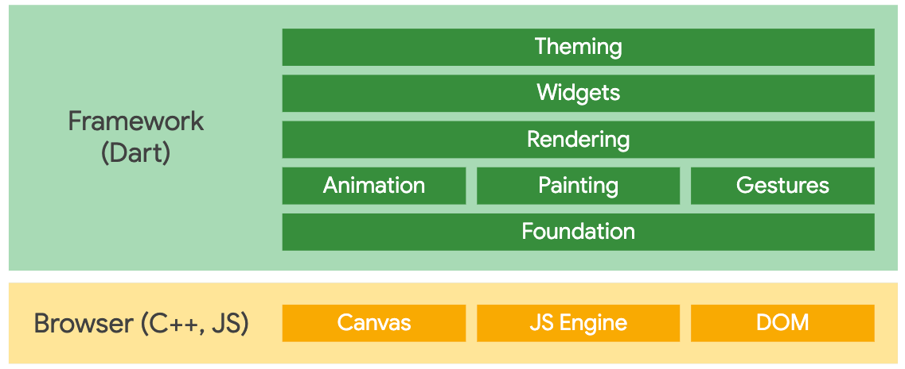

如架构图所示，Framework 层在移动和 web 平台是共享的，当然为了支持 web ，官方对`dart:ui`库做了新的适配。然后便是使用基于 DOM、Canvas 和 CSS 的代码替换了移动平台上 Skia 实现的引擎层，当我们为 Web 平台编译 Flutter 代码时，应用、Flutter 框架、以及 Web 版本的 dart:ui 库都将编译为 JavaScript ，可以运行在任何现代浏览器上。

## Flutter是如何做到高保真度的？

根据前文这个问题可以转化为：**Flutter是如何做到可以像素级还原UI稿的交互与视觉效果的？**

这点首先得益于选择了**自绘UI**的技术方向，基于这个方向 Flutter 在 Engine 层使用了**跨平台自绘引擎Skia**和**文字排版引擎**来做底层渲染（或是for web 的引擎代码），在 Framework 层构建了一整套自己的**UI系统**，而不依赖任何原生的控件。如此一来，布局、动画、手势、绘制等全权尽在掌控之中，要做到**高保真**也就手到擒来了。

下面引用《Flutter 实战》一书中，关于 Skia 的一段描述：

> Flutter使用Skia作为其2D渲染引擎，Skia是Google的一个2D图形处理函数库，包含字型、坐标转换，以及点阵图都有高效能且简洁的表现，Skia是跨平台的，并提供了非常友好的API，目前Google Chrome浏览器和Android均采用Skia作为其绘图引擎。

## Flutter是如何做到高性能表现的？

首先`高或低`是个相对的概念，而 Flutter 的高性能来自于两个比较：

> 以下两点引用自《Flutter 实战》一书
> 
> 1. Flutter APP 采用 Dart 语言开发。Dart 在 JIT（即时编译）模式下，速度与 JavaScript 基本持平。但是 Dart 支持 AOT，当以 AOT 模式运行时，JavaScript 便远远追不上了。速度的提升对高帧率下的视图数据计算很有帮助。
> 2. Flutter 使用自己的渲染引擎来绘制 UI ，布局数据等由 Dart 语言直接控制，所以在布局过程中不需要像 RN 那样要在 JavaScript 和 Native 之间通信，这在一些滑动和拖动的场景下具有明显优势，因为在滑动和拖动过程往往都会引起布局发生变化，所以 JavaScript 需要和 Native 之间不停的同步布局信息，这和在浏览器中要 JavaScript 频繁操作 DOM 所带来的问题是相同的，都会带来比较可观的性能开销。


---
### 1768. react native 工作原理是什么？

**难度**：★★★☆☆ | **题型**：QA | **分类**：全部 / 跨端技术

**题目**：


**参考答案**：
React Native 是一个用于构建跨平台移动应用的框架，它允许开发者使用 JavaScript 和 React 构建原生的 iOS 和 Android 应用。其工作原理可以从以下几个方面进行解释：

### **1. 跨平台渲染**

React Native 通过将 JavaScript 代码与原生代码桥接，从而在 iOS 和 Android 上实现跨平台渲染。它的工作原理如下：

- **JavaScript 代码**：开发者使用 JavaScript 和 React 编写组件，定义应用的界面和行为。
- **原生代码**：React Native 提供了原生组件（如 `View`、`Text`、`Image`）的 JavaScript 封装。这些组件在 JavaScript 中定义，但实际的渲染工作由原生平台负责。
- **桥接（Bridge）**：JavaScript 代码通过桥接机制与原生代码进行通信。这些桥接使 JavaScript 可以调用原生 API，也使原生代码能够将数据传回 JavaScript。

### **2. 渲染流程**

React Native 的渲染流程与 React Web 的基本相似，但针对移动设备进行了优化：

- **虚拟 DOM**：React Native 使用虚拟 DOM 来描述组件的状态，并将这些状态与实际的原生组件进行比较。
- **Diff 算法**：React Native 使用类似于 React 的 Diff 算法来计算虚拟 DOM 与实际 DOM 之间的差异。
- **更新原生组件**：差异计算完成后，React Native 会将需要更新的内容发送到原生层，通过桥接机制将更新请求发送到原生平台。

### **3. 动态更新和热重载**

- **热重载（Hot Reloading）**：React Native 支持热重载，可以在不重新编译整个应用的情况下，实时查看代码更改的效果。开发者在修改代码后，应用会自动更新，保持应用的状态不变。
- **快速刷新（Fast Refresh）**：React Native 引入了快速刷新功能，它能保留组件的状态，并快速应用代码更改。

### **4. 原生模块**

React Native 允许开发者创建自定义的原生模块，这些模块可以在 JavaScript 代码中调用：

- **原生模块**：使用 Java 或 Swift/Objective-C 编写原生模块，并将其暴露给 JavaScript。通过这种方式，开发者可以使用原生平台特有的功能或性能优化。
- **第三方模块**：React Native 生态系统中有许多第三方模块和插件，它们封装了常见的原生功能，例如地图、相机等。

### **5. 组件生命周期**

React Native 中的组件生命周期与 React Web 类似，但也会涉及到原生平台的生命周期：

- **挂载和更新**：组件的生命周期方法（如 `componentDidMount`、`componentDidUpdate`）会在组件挂载和更新时被调用，这些方法允许开发者处理副作用和进行额外的配置。
- **卸载**：在组件卸载时，React Native 会清理相关资源，确保没有内存泄漏。

### **6. 性能优化**

React Native 提供了一些性能优化工具和技术：

- **Native Driver**：使用原生驱动来处理动画，可以提高动画性能。
- **PureComponent**：React Native 中的 `PureComponent` 可以避免不必要的重新渲染，提高性能。
- **Code Splitting**：通过按需加载模块来减少初始加载时间。

**要点**：
React Native 的工作原理包括跨平台渲染、JavaScript 与原生代码的桥接、虚拟 DOM 和原生组件的更新、动态更新和热重载、原生模块的支持以及性能优化。通过这些机制，React Native 能够让开发者使用熟悉的 JavaScript 和 React 技术栈来构建高性能的移动应用。

---
### 1777. 前端领域有哪些跨端方案？

**难度**：★☆☆☆☆ | **题型**：QA | **分类**：全部 / 工具 / 跨端技术

**题目**：


**参考答案**：

跨平台指的是跨操作系统，而跨端是指客户端。

客户端的特点就是有界面、有逻辑，所以包含逻辑跨端和渲染跨端。主要的客户端有 web、安卓、ios、iot 设备等。

现在主流的跨端方案有 react native、weex、flutter、kraken 以及各家自研的跨端引擎等。

### react native

跨端包括逻辑跨端和渲染跨端，rn 的逻辑跨端是基于 js 引擎，通过 bridge 注入一些设备能力的 api，而渲染跨端则是使用安卓、ios 实现 react 的 virtual dom 的渲染。

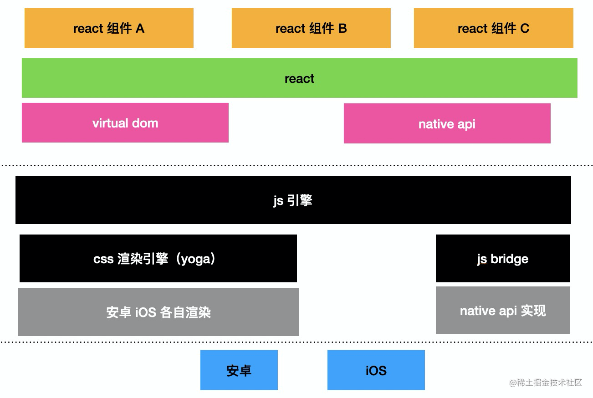

其中 native api 和组件（灰色画出的部分）并没有做到双端一致，而且有的时候扩展图中灰色部分需要原生配合，混杂 rn 代码和自己扩展的代码导致代码比较难管理。最著名的事件就是 airbnb 从最大的 react native 支持者到弃用 react native。

### weex

weex 也是类似的思路来实现跨端的，不过他对接的上层 ui 框架是 vue，而且努力做到了双端的组件 和 api 的一致性（虽然后续维护跟不上了）。架构和上图类似。

### flutter

flutter 是近些年流行的跨端方案，跨的端包括安卓、ios、web 等。它最大的特点是渲染不是基于操作系统的组件，而是直接基于绘图库（skia）来绘制的，这样做到了渲染的跨端。逻辑的跨端也不是基于 js 引擎，而是自研的 dart vm 来跨端，通过 dart 语言来写逻辑，

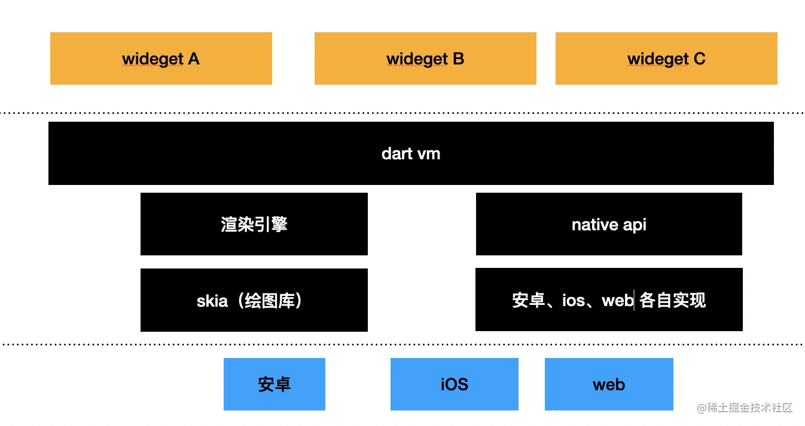

### kraken

跨端包括两部分，渲染跨端和逻辑跨端。有时候只需要渲染跨端、有时候只需要逻辑跨端，有的时候需要完整的跨端引擎，这 3 种情况都有各自的适用场景。

kraken 就是一个跨端渲染引擎，基于 flutter 的绘图能力实现了 css 的渲染，实现了渲染的跨端。

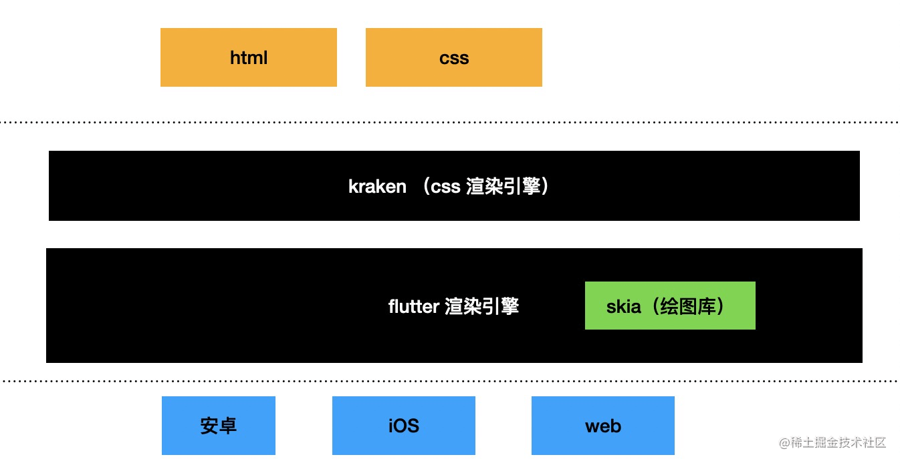

### 自研渲染引擎

跨端引擎很依赖底层实现的组件和 api，用开源方案也一样得扩展这部分，所以有一定规模的团队都会选择自研。

自研跨端引擎会和 rn、weex 不同：

- 渲染部分不需要实现 virtual dom 的渲染，而是直接对接 dom api，上层应用基于这些 dom api 实现跨端渲染。这样理论上可以对接任意前端框架。

- 逻辑部分也是基于 js 引擎，通过 binding 直接注入一些 c++ 实现的 api，或者运行时通过 bridge 来注入一些安卓、ios 实现的 api。

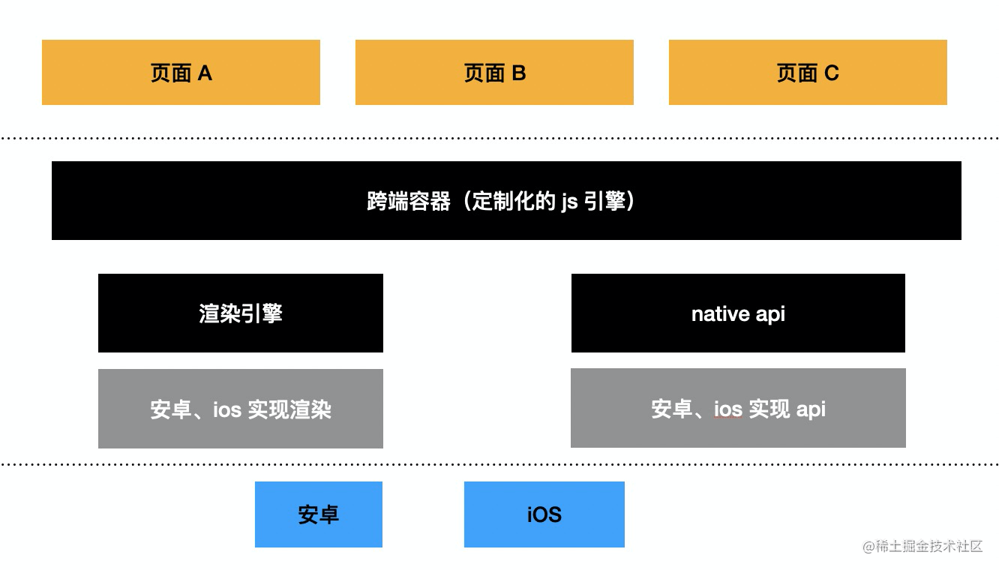

自研跨端引擎的好处是组件和 api 可以自己扩展，更快的响应业务的需求。其中组件和 api 的双端一致性，以及统一的 api 的设计都是难点。

## 跨端的通用原理是什么

其实跨端和跨平台的思路类似，都是实现一个容器，给它提供统一的 api，这套 api 由不同的平台各自实现，保证一致的功能。

具体一些的话，跨端分为渲染和逻辑跨端，有的时候只需要单独的渲染跨端方案（比如 karen）和逻辑跨端方案，有的时候需要完整的跨端引擎。

weex、react native 的渲染部分都是通过实现了 virtual dom 的渲染，用安卓、ios 各自的渲染方式实现，逻辑部分使用 js 引擎，通过 bridge 注入一些安卓、ios 的 api。

flutter 则是直接使用 skia 绘图库绘制，并且逻辑跨端使用 dart vm。

但是不管具体实现怎样，思路都大同小异：**跨端引擎需要实现一个渲染引擎、实现一个 vm，基于这套架构实现各种组件和 api，跨端容器上层对接一个 ui 框架，再上层的业务代码可以基于容器的 api 实现跨端的渲染和逻辑**

## web container

这两天 web container 比较火，其实也是一种跨平台技术，它是在浏览器里面实现的容器，通过 wasm 实现了 node 的 api，这样在这个容器里面可以跑 node 代码。其实思路比较常见，但是是一个新场景。


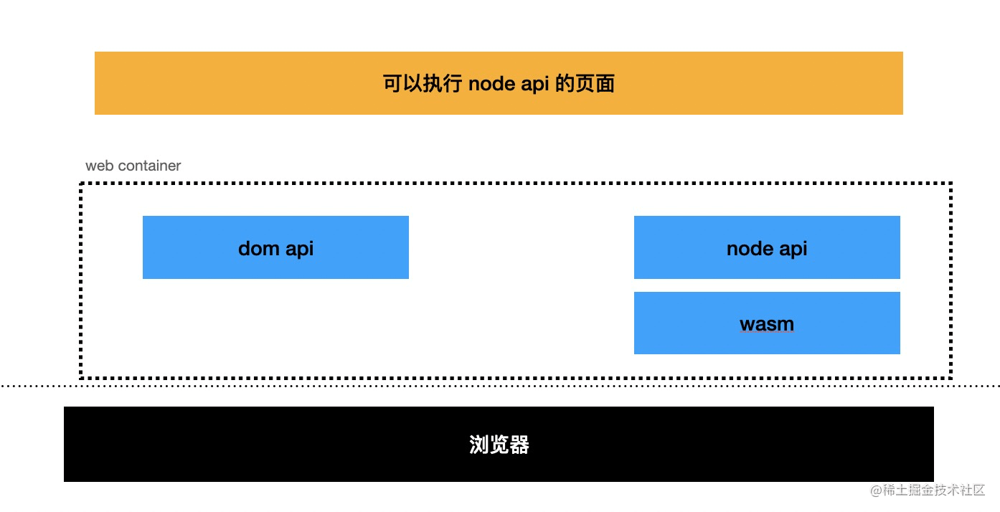

浏览器容器之上又跑了个容器，容器套娃。


---